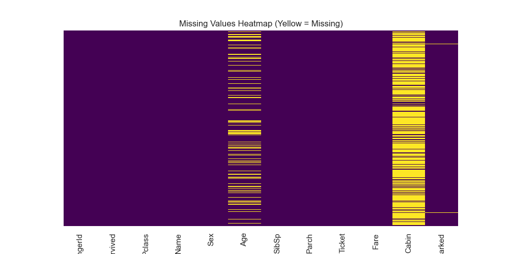
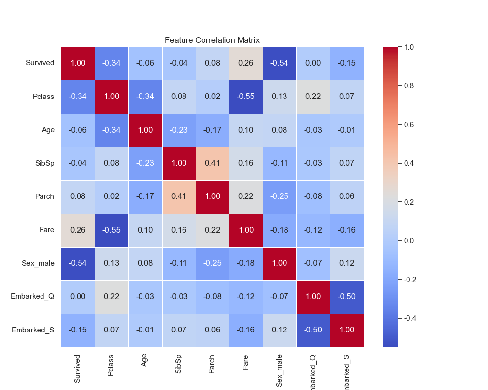

# Unit01｜Python 工具打底 + 基本 EDA

**課程名稱**：化工資料科學與機器學習實務（CHE-AI-101）  
**本堂課定位**：先把「用 Python 看懂資料」做扎實（NumPy 張量觀念 + Pandas EDA）。  

---

## 0. 為什麼化工需要 Python + ML？

### 0.1 化工場景的數據挑戰

**傳統化工面臨的問題**：
- 📊 **海量時序數據**：DCS 每秒記錄數千個 Tag，人工無法即時監控全局趨勢
- 🔬 **品質預測困難**：批次最終品質需等反應結束才能測定，無法即時調整操作條件
- ⚠️ **異常偵測延遲**：設備故障徵兆藏在數千個變數的微小波動中，難以提前發現
- 💰 **操作優化靠經驗**：最佳操作條件依賴資深工程師的經驗法則，難以量化與傳承

**機器學習的解決方案**：

| 化工問題 | ML 方法 | 預期效益 |
|---------|--------|---------|
| 品質即時預測 | 軟測器 (Soft Sensor) | 節省 Lab 分析成本 60%，提升調控反應速度 |
| 異常提前預警 | 時序異常偵測 (Anomaly Detection) | 減少非計畫停機 40%，延長設備壽命 |
| 操作條件優化 | 貝氏優化 (Bayesian Optimization) | 提升產率 5-15%，降低能耗 |
| 設備健康管理 | 剩餘使用壽命預測 (RUL) | 從被動維修轉為預測性維護 |

### 0.2 本課程的學習路徑

```
Part_1: Python 基礎 + EDA ← 你現在在這裡
    ↓ 學會處理化工數據、視覺化製程趨勢
Part_2: ML 建模基礎 (回歸、分類、樹模型)
    ↓ 學會建立預測模型、評估模型性能
Part_3: 化工特化應用 (軟測器、異常偵測)
    ↓ 解決實際化工場景問題
Part_4: 深度學習 (CNN、RNN、Transformer)
    ↓ 處理影像、時序、複雜模式
Part_5: 進階應用 (強化學習控制、RUL 預測)
    ↓ 自主優化控制、設備健康管理
```

**你將學到的核心技能**：
1. ✅ 用 NumPy/Pandas 處理化工時序數據與批次數據
2. ✅ 用 Matplotlib/Seaborn 視覺化製程趨勢與品質分佈
3. ✅ 用 Scikit-learn 建立迴歸/分類模型並評估
4. ✅ 用 TensorFlow/PyTorch 做深度學習（時序預測、影像識別）
5. ✅ 部署模型到實際化工場景（Docker 容器、API 服務）

### 0.3 第一個化工 ML 案例預覽（先看看終點）

**案例**：反應器溫度軟測器 (Soft Sensor for Reactor Temperature)

**問題背景**：
- 實驗室每 2 小時才能測一次產物濃度（色譜分析耗時）
- 無法即時調控反應條件，常導致批次報廢或產率不佳
- 需要一個「虛擬分析儀」根據即時變數預測濃度

**解決方案**：
```python
# 用即時可測變數（溫度、壓力、流量）預測產物濃度
X = df[['Reactor_Temp', 'Pressure', 'Feed_Flow', 'Coolant_Temp']]
y = df['Product_Concentration']  # Lab 測定值

model = RandomForestRegressor()
model.fit(X_train, y_train)

# 部署後每分鐘預測一次
y_pred = model.predict(X_realtime)
```

**效果**：
- R² = 0.92（預測與實測高度一致）
- 預測誤差 < 5%（滿足工程需求）
- 即時性：延遲 < 1 秒 vs Lab 分析 2 小時

> **重點**：不用擔心現在看不懂這些程式碼！Part_1 會先打好基礎（NumPy、Pandas、EDA），Part_2 就能理解模型訓練，Part_3 就能做出這個案例。

---

## 本堂課目標

完成本單元後，你將能夠：
- 熟悉 NumPy 的向量化與 reshape（把資料理解成張量）  
- 用 Pandas 完成一個最小 EDA 流程：缺失值檢查、清理、類別特徵編碼、相關性檢視
- 理解化工數據的特殊性，並能將通用工具應用於化工場景

---

## 1. NumPy 基礎操作 (NumPy Basics)

在進入 Pandas 之前，我們先熟悉 Python 資料科學的基石：NumPy。
機器學習模型（尤其是神經網路）輸入的不是 Excel 表格，而是多維陣列 (Tensors)。

### 1.1 向量化運算 (Vectorization)
**理論背景：SIMD 與 記憶體配置**

Python 原生的 `list` 是異質容器，儲存的是物件指標 (Pointers)，這導致資料在記憶體中是不連續的 (Scattered)。每次運算都需要進行型別檢查 (Type Checking) 與解參考 (Dereferencing)，造成巨大的 CPU Overhead。

NumPy 的 `ndarray` 則是 **同質且連續 (Homogeneous & Contiguous)** 的記憶體區塊。這帶來兩個優勢：
1.  **快取局部性 (Cache Locality)**：CPU 可以一次將連續資料載入快取 (L1/L2 Cache)，減少 RAM 存取延遲。
2.  **SIMD 指令集**：現代 CPU 支援 "Single Instruction, Multiple Data"，能在一道指令週期內同時對多個數據進行運算（如 AVX-512 指令集）。

數學上，這對應於向量空間的逐元素運算：

$$
\vec{c} = \vec{a} + \vec{b} \Rightarrow c_i = a_i + b_i,\ \forall i
$$

```python
import numpy as np
arr = np.array([10, 20, 30, 40])
print(arr * 2)  # [20 40 60 80]
```

**化工應用場景：批量計算反應速率常數**
```python
# 化工案例：計算 1000 個反應器的 Arrhenius 速率常數
reactor_temps = np.array([350, 360, 370, ...])  # 1000 個反應器溫度 (K)
activation_energy = 50000  # J/mol
R = 8.314  # J/(mol·K)

# ❌ Python loop：逐個計算，需要 ~0.5 秒
k_values = []
for T in reactor_temps:
    k = np.exp(-activation_energy / (R * T))
    k_values.append(k)

# ✅ NumPy 向量化：批量計算，只需 ~0.01 秒
k_values = np.exp(-activation_energy / (R * reactor_temps))
```

**實務意義**：
- DCS 每秒可能需要計算數千次，向量化是**必需**而非可選
- 即時控制系統（如 MPC）要求計算延遲 < 100ms
- 大規模參數優化（如貝氏優化）需要快速評估數萬個候選點

**練習目標**：
1. 建立一個簡單陣列並做逐元素運算
2. 比較純 Python list comprehension 與 NumPy 向量化的耗時
3. 觀察加速倍率受資料大小與硬體影響

```python
import numpy as np, timeit
arr = np.array([10, 20, 30, 40])
print(arr * 2)

# 效能比較
n = 1_000_000
py_list = list(range(n))
np_arr = np.arange(n)
t_list = timeit.timeit(stmt='[x*2 for x in py_list]', globals=globals(), number=5)
t_numpy = timeit.timeit(stmt='np_arr*2', globals=globals(), number=5)
print(f'Python list comprehension: {t_list:.4f}s (5 次)')
print(f'NumPy 向量化: {t_numpy:.4f}s (5 次)')
print('加速倍率 ≈', round(t_list / t_numpy, 2), 'x')
```

結果解讀：
- arr * 2 逐元素倍增，輸出保持 dtype 與連續記憶體。
- t_list vs t_numpy：常見加速倍率 5x–50x（受 CPU SIMD、快取大小、Python 版本影響）。
- Python list 逐元素需迭代與型別檢查；NumPy 於底層 C 迴圈 + SIMD 批次處理。
- 若資料更小（例如 n=10_000），差異縮小；超大（>50_000_000）時記憶體頻寬反而成瓶頸。
- 觀察加速倍率有助於建立「何時值得向量化」的直覺。
化工應用場景：時序數據的維度重組**
```python
# 案例：將 24 小時的分鐘級反應器數據重組成小時級矩陣
minute_temps = np.random.normal(350, 5, 24 * 60)  # 1440 分鐘溫度數據
hourly_matrix = minute_temps.reshape(24, 60)  # (小時, 該小時內的分鐘)

# 計算每小時統計量（用於特徵工程）
hourly_mean = hourly_matrix.mean(axis=1)  # 每小時平均溫度
hourly_std = hourly_matrix.std(axis=1)    # 每小時波動度（穩定性指標）
hourly_max = hourly_matrix.max(axis=1)    # 每小時峰值（過衝檢測）

print(f"第 10 小時：均值={hourly_mean[10]:.2f}K, 標準差={hourly_std[10]:.2f}K")
```

**物理意義檢查**：
- `axis=0`（沿行）：跨小時的同一分鐘位置平均 → **通常無意義**
- `axis=1`（沿列）：單一小時內的分鐘級平均 → **有意義**（製程穩定性）
- **錯誤示範**：把 `(1440,)` reshape 成 `(60, 24)` 會混淆時間順序！

**化工批次數據的張量結構**：
```python
# 3 個批次，每批 50 個時間點，每點 4 個變數（溫度、壓力、流量、濃度）
batch_data = np.random.randn(3, 50, 4)  # (batch, time, feature)

# 計算每批次的時間平均特徵（用於批次間比較）
batch_mean_features = batch_data.mean(axis=1)  # (3, 4)

# 計算每個時間點的批次間變異（製程一致性）
time_batch_std = batch_data.std(axis=0)  # (50, 4)
```

**常見操作速記**：
- x.reshape(a, b)
- x.reshape(-1, d)  # 自動推導
- x.ravel() / x.flatten()  # 展平
- np.expand_dims(x, axis)  # 新增維度 (batch / channel)
- x[:, np.newaxis]  # 等價於 expand_dims
- x.swapaxes(i, j), np.transpose(x, order)  # 維度重新排序

**練習目標**：
1. 784 -> 28×28
2. 使用 -1 自動推導回一維
3. 新增 batch 與 channel 維度
4. 驗證 reshape 不改變資料內容
5. 思考各維度的物理意義（特別是化工時序數據） (Matrix)**: 矩陣，如灰階圖片或 Excel 表格 $\mathbf{X} \in \mathbb{R}^{m \times n}$。
- **3D+ Tensor**: 如彩色圖片 (高, 寬, RGB) 或影片數據。

```python
# 模擬一張 28x28 的圖片被展平為 784 維向量
image_flat = np.arange(784)
image_2d = image_flat.reshape(28, 28)
```

**常見操作速記**：
- x.reshape(a, b)
- x.reshape(-1, d)  # 自動推導
- x.ravel() / x.flatten()  # 展平
- np.expand_dims(x, axis)  # 新增維度 (batch / channel)
- x[:, np.newaxis]  # 等價於 expand_dims
- x.swapaxes(i, j), np.transpose(x, order)  # 維度重新排序

**練習目標**：
1. 784 -> 28×28
2. 使用 -1 自動推導回一維
3. 新增 batch 與 channel 維度
4. 驗證 reshape 不改變資料內容
5. 思考各維度的物理意義

```python
import numpy as np
image_flat = np.arange(784)
image_2d = image_flat.reshape(28, 28)
print('image_2d:', image_2d.shape)

again_flat = image_2d.reshape(-1)
print('again_flat:', again_flat.shape)

batch_1 = np.expand_dims(image_2d, axis=0)        # (1, 28, 28)
batch_1_ch1 = np.expand_dims(batch_1, axis=-1)    # (1, 28, 28, 1)
print('batch_1_ch1:', batch_1_ch1.shape)

# 展平成 (total_pixels, 1) 以便後續餵入某些模型
pixels_col = batch_1_ch1.reshape(-1, 1)
print('pixels_col:', pixels_col.shape)

assert np.array_equal(image_flat, batch_1_ch1.reshape(-1))
print('資料內容保持一致')
```

結果解讀：
- 784 -> (28, 28)：純索引視圖改變，未複製資料；速度與記憶體效率高。
- 使用 -1：讓 NumPy 自動推導單一維度，避免手動計算 28*28。
- 新增 batch 維 (1, 28, 28)：為模型前處理標準格式（第一維代表樣本數）。
- 新增 channel 維 (1, 28, 28, 1)：符合 CNN 要求 (N, H, W, C)；灰階影像使用單一 channel。
- 展平到 (784, 1)：適用於傳統 ML（如 SVM、KNN）需要 2D feature matrix。
- assert 驗證 reshape 不改變內容：核心觀念是「形狀表達 vs 資料本體分離」。

形狀選擇與風險：
- 若把 (batch, H, W, C) 誤用成 (H, W, batch, C)，將打亂樣本邏輯。
- 在製程資料中，(batch, time, feature) 與 (time, feature) 混用常造成批次邊界洩漏（Data Leakage）。

延伸練習參考：
- 將 60x3 reshape 成 (3, 20, 3)：語意＝3 個批次，每批 20 時間點。
- 將 60x3 reshape 成 (20, 3, 3)：語意混亂（最後一個 3 無物理意義），應避免。

---

### 1.3 化工資料中的張量思維

在化工領域常見的幾種張量結構對應如下：

- **單變量趨勢 (1D)**：例如單一塔頂溫度隨時間變化 $T(t)$。
- **多變量時間序列 (2D)**：在每一個時間點 $t$ 同時量測溫度、壓力、流量，得到一個向量 $\mathbf{x}(t)$，堆疊後為矩陣 $\mathbf{X} \in \mathbb{R}^{T \times d}$。
- **多批次 × 多時間 × 多變數 (3D)**：批次製程中，每一批次有其自己的時間軸與多個變數，常整理成張量 $\mathcal{X} \in \mathbb{R}^{N_{\text{batch}} \times T \times d}$。
  - 後續做 RNN / LSTM / Transformer 或動態 PCA、MBR (Multivariate Batch Regression) 模型時都會用到。

建議學生在寫 `reshape` 時，習慣思考每一個維度的**物理意義**，而不只是數字符合即可。

**物理意義檢查清單**：
1. 每一維代表什麼？(batch / time / feature / channel)
2. 時間是否仍按真實順序排列？
3. 不等長批次是否被硬性壓成等長？是否需要 padding / masking？
4. 是否在不自覺中混合了不同批次的時間軸？
5. reshape 後是否仍能回復原始結構？

```python
import numpy as np
T, d = 60, 3
X_2d = np.random.randn(T, d)              # (time, feature)
print('X_2d:', X_2d.shape)

N_batch = 3
X_3d = X_2d.reshape(N_batch, T//N_batch, d)   # (batch, time, feature)
print('X_3d:', X_3d.shape)

# 新增 channel 維度供 CNN / 1D conv 使用
X_4d = np.expand_dims(X_3d, axis=-1)      # (batch, time, feature, channel)
print('X_4d:', X_4d.shape)

# 展平成 (total_time, feature)
X_flat = X_3d.reshape(-1, d)
print('X_flat:', X_flat.shape)

assert np.array_equal(X_3d[0], X_2d[:20])
print('批次邊界保持正確')

print('練習：模擬不等長批次 (例如 [18, 22, 20] 時間點)，思考如何以 list 儲存並做 padding。')
```

結果解讀：
- X_2d：單純多變量時間序列 (60 時間點 × 3 變數)。
- X_3d：加入批次維度後語義變成「3 個批次，每批 20 點，每點 3 變數」，適合批次製程分析（聚合、發酵等）。
- X_4d：添加 channel 維度後可對 feature 軸做 1D 卷積（例如偵測變數之間的局部模式）。
- X_flat：展平成 (總時間, feature) 用於 PCA / 傳統 ML；需注意批次時間混合可能破壞序列關係。
- 邊界 assert：確保 reshape 未錯置批次切分，防止後續模型誤學跨批次時序。

物理語意提醒：
- (batch, time, feature) 中各維度不可隨意交換：交換後會導致模型把不同批次當作時間步。
- 不等長批次需 padding 或使用 list of arrays；強行 reshape 會錯置時間。
- Channel 維在製程資料中可代表：1=原始值, 2=標準化值, 3=差分值（可疊成多通道輸入）。

常見錯誤案例：
- 先展平再分批：破壞原本時間連續性。
- 忽略停機 / 製程階段：應在建立張量前先加階段標籤避免混淆不同操作模式。

---


---

## 2. Pandas 綜合實戰：Titanic 資料集

使用經典的 Titanic 資料集，練習完整的資料前處理流程。

### 2.1 缺失值偵測 (Missing Values)
**理論背景：缺失機制**

Heatmap 可以幫助我們視覺化缺失值的分布。統計學上將缺失機制分为三類：
1.  **MCAR (Missing Completely At Random)**：缺失是完全隨機的，與任何變數無關。
2.  **MAR (Missing At Random)**：缺失機率與其他觀測變數有關（例如：女性可能較不願意透露年齡）。
3.  **MNAR (Missing Not At Random)**：缺失機率與缺失值本身有關（例如：高收入者不願透露收入）。
了解機制有助於選擇正確的填補策略。

```python
sns.heatmap(df.isnull(), cbar=False, cmap="viridis", yticklabels=False)
```


*(圖：黃色代表缺失值，可觀察出 Cabin 欄位有大量缺失)*

### 2.2 資料清理 (Data Cleaning)
- **Age**：使用中位數 (Median) 填補。
- **Embarked**：使用眾數 (Mode) 填補。
- **Cabin**：缺失太多，直接刪除。

### 2.3 特徵工程 (Feature Engineering)
**理論背景：虛擬變數陷阱 (Dummy Variable Trap)**

在使用 One-Hot Encoding 時，若一個類別特徵有 $K$ 個水準 (Levels)，我們只需要 $K-1$ 個二元變數即可完全描述。
若保留 $K$ 個變數 $x_1, x_2, ..., x_K$，且模型包含截距項 (Intercept) $x_0 = 1$，則會出現：

$$ \sum_{i=1}^{K} x_i = 1 = x_0 $$

這意味著特徵矩陣 $X$ 的行向量之間存在線性相依 (Linearly Dependent)，導致 $X^T X$ 不可逆 (Singular Matrix)，使得最小平方法 (OLS) 的解 $\hat{\beta} = (X^T X)^{-1} X^T y$ 無法計算或極不穩定。這就是所謂的 **完全共線性 (Perfect Multicollinearity)**。
解決方案：設定 `drop_first=True`。

```python
# drop_first=True 避免多重共線性
df_encoded = pd.get_dummies(df_proc, columns=["Sex", "Embarked"], drop_first=True)
```

### 2.4 相關性分析 (Correlation Analysis)
**理論背景：皮爾森相關係數 (Pearson Correlation Coefficient)**

皮爾森係數 $r$ 衡量兩個變數 $X, Y$ 之間的 **線性相依程度**。其定義為共變異數 (Covariance) 除以標準差的乘積：

$$
r_{xy} = \frac{\sum_{i=1}^{n} (x_i - \bar{x})(y_i - \bar{y})}{\sqrt{\sum_{i=1}^{n} (x_i - \bar{x})^2}\sqrt{\sum_{i=1}^{n} (y_i - \bar{y})^2}}
$$

- $r = 1$: 完全正相關
- $r = -1$: 完全負相關
- $r = 0$: 無線性相關 (但不代表獨立，可能存在非線性關係)

```python
corr_matrix = df_encoded.corr()
sns.heatmap(corr_matrix, annot=True, cmap="coolwarm", fmt=".2f")
```


*(圖：Titanic 各特徵與生存率的相關係數熱圖)*

**圖表解讀：**
- 從熱圖可看出 `Sex_male` 與 `Survived` 有強負相關（男性生存率較低）
- `Pclass` 與 `Survived` 也呈負相關（艙等越高數字越大，生存率越低）
- `Fare`（票價）與 `Survived` 呈正相關（高票價通常對應較好的艙等和逃生條件）
- 注意相關性只能反映線性關係，無法捕捉複雜的交互作用

### 2.5 小練習與思考題

1. 嘗試將 Titanic 中的 `Fare` 分成幾個區間（低 / 中 / 高票價），並轉換成類別變數後再進行 One-Hot Encoding。  
   - 類比到化工中的「原料純度等級」、「操作溫度區間」等。
2. 假設 `Survived` 代表「批次是否達到規格」，請為 `df_encoded` 重新命名欄位，使之符合某個你構想的實際化工情境（例如：`Pclass` → `Catalyst_Grade`）。
3. **化工延伸練習**：想像你有一個聚合反應的批次數據，包含 `Temp`, `Time`, `Catalyst_Amount`，最終品質是 `Mn_kDa`。請設計一個 EDA 流程來探索：
   - 哪些操作變數與品質最相關？
   - 是否有離群批次？
   - 溫度的最佳操作範圍是什麼？

---

## 總結 (Summary)

在本單元中，我們完成了：
1.  **NumPy 操作**：向量化運算與 Reshape，建立張量思維基礎
2.  **Pandas 綜合實戰**：使用 Titanic 資料集完成資料清洗、填補、編碼與相關性分析

**關鍵技能回顧**：
- 向量化運算的效能優勢（SIMD 與記憶體局部性）
- 張量維度變換的物理意義（batch, time, feature, channel）
- 缺失值處理策略（中位數/眾數填補，刪除高缺失欄位）
- One-Hot Encoding 與避免虛擬變數陷阱
- 皮爾森相關係數的計算與解讀

**化工應用連結**：
- NumPy 向量化 → 批量計算反應速率、傳熱係數
- Reshape 操作 → 重組時序數據、建立批次張量
- 缺失值處理 → 感測器故障、停機期間的數據補值
- 相關性分析 → 探索操作變數與品質的關聯

---

## 自我檢測（完成後請勾選）

### NumPy 張量
- [ ] 我能解釋為什麼向量化比 for loop 快（SIMD + Cache Locality）
- [ ] 我能將 `(60, 3)` reshape 成 `(3, 20, 3)` 並解釋物理意義
- [ ] 我能識別 reshape 操作中可能的批次邊界混淆問題

### Pandas EDA
- [ ] 我能判斷缺失值應該填補還是刪除（依缺失比例與機制）
- [ ] 我能解釋 One-Hot Encoding 為什麼要 `drop_first=True`（避免共線性）
- [ ] 我能讀懂相關係數熱圖並提出假設

### 化工應用
- [ ] 我能列舉 3 個化工場景中的 ML 應用（軟測器、異常偵測、優化）
- [ ] 我能說明批次數據與連續數據的差異
- [ ] 我能設計一個簡單的批次 EDA 流程（分佈、相關性、分箱）

---

## 本堂課程式演練

請開啟並完成：`Part_1/Unit01_Python_EDA_Basics.ipynb`  

---

## 下一步

- `Part_1/Unit02_TimeSeries_Cleaning.md`：化工時間序列清理 SOP + 製程監控特徵。  
- `Part_1/Unit03_ChemEng_Data_Types.md`：Batch/Continuous 的資料語意與批次製程 EDA 實戰。  
- `Part_1/Unit04_ML_Preprocessing_Workflow.md`：Train/Test Split、標準化、Pipeline 與 Data Leakage。  
