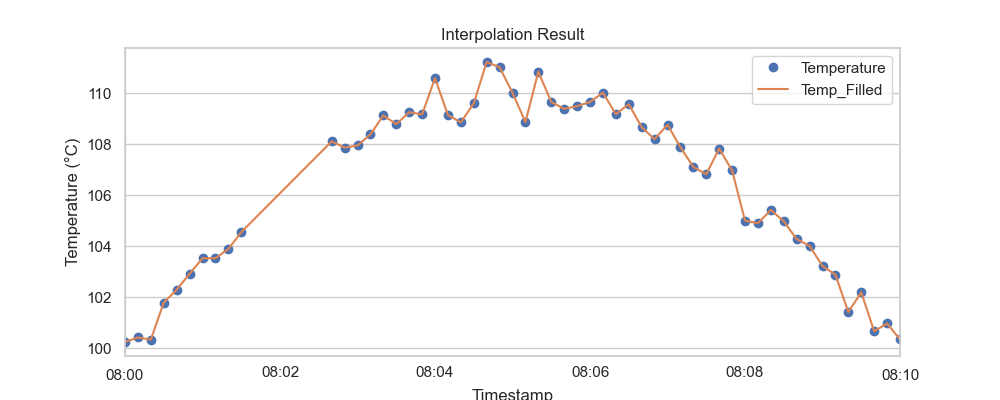
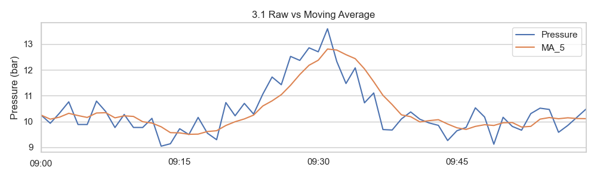
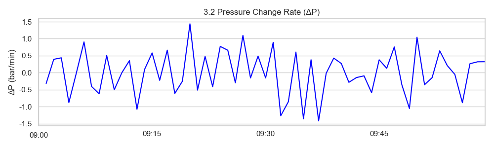
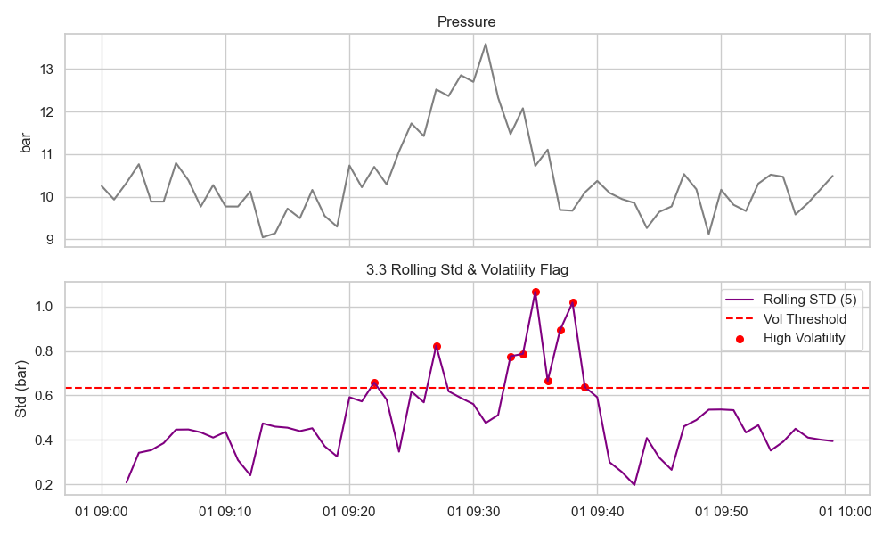

# Unit02｜化工時間序列清理 SOP + 製程監控特徵

**課程名稱**：化工資料科學與機器學習實務（CHE-AI-101）  
**本堂課定位**：把製程時間序列從原始感測器資料整理成可分析/可建模的乾淨表，並建立最常用的監控特徵（rolling/diff）。  

---

## 本堂課目標

- 會處理時間戳：`to_datetime`、索引、對時（alignment）  
- 會處理缺失值與頻率差：插值、重採樣、前後填充  
- 會做最常用的監控特徵：rolling mean / diff / rolling std  
- 能識別並處理化工時序數據的常見陷阱（時區、單位、停機數據等）

---

## 1. 化工時間序列處理 (Time Series Handling)

化工製程數據（溫度、壓力、流量）通常帶有時間戳記。

### 1.1 時間物件轉換與索引

多數 CSV 檔的時間欄位格式不一致；先統一為 DatetimeIndex 才能做切片 / 重採樣。

常見原始格式範例：
- 2023/01/01 08:00:00        (斜線 + 24h)    format='%Y/%m/%d %H:%M:%S'
- 01-02-2023 14:30            (日-月-年或月-日-年，易混淆) 使用 dayfirst=True 視需要
- 2023-03-05T09:15:30Z        (ISO 8601 UTC)  自動辨識，建議 utc=True
- 20230106 101500             (壓縮格式)      format='%Y%m%d %H%M%S'
- 07/01/2023 23:45            (可能是 7 Jan 或 Jul 1) 以 dayfirst=False/True 控制

主要參數：
- format: 指定解析格式（最快，避免模糊與錯誤）
- infer_datetime_format=True: 讓 pandas 嘗試推斷格式（較慢，對大量資料仍可加速）
- errors='coerce': 無法解析的轉成 NaT（利於後續清理）
- dayfirst=True: 當日期格式含 / 或 - 且日月順序不明時使用
- utc=True: 直接產生 UTC 時區標準時間（跨設備/伺服器最安全）
- tz_localize / tz_convert: 先標記本地時區，再轉 UTC

拆成日期與時間兩欄：
date + time -> 'YYYY-MM-DD HH:MM:SS' 再轉；不要用 axis=1 的 apply 逐列拼字串在大資料上很慢，直接向量化相加更快。

效能建議：
- 大型資料 (>10^6 rows) 優先使用 format 精確指定。
- 混合多種格式：先分類過濾後分別解析再 concat。
- 無法解析的值保留 NaT 並記錄比例，過高可能需回溯資料來源。

範例摘要：
```python
pd.to_datetime(series, format='%Y/%m/%d %H:%M:%S', errors='coerce')
pd.to_datetime(series, utc=True)
pd.to_datetime(series, dayfirst=True, errors='coerce')
# 分欄:
ts = pd.to_datetime(df['Date'] + ' ' + df['Time']).dt.tz_localize('Asia/Taipei').dt.tz_convert('UTC')
```

```python
# 練習：解析多種時間格式
time_samples = pd.Series([
    "2023/01/01 08:00:00",
    "01-02-2023 14:30",
    "2023-03-05T09:15:30Z",
    "20230106 101500",
    "07/01/2023 23:45"
])

# 方法一：逐一指定格式
for fmt in ["%Y/%m/%d %H:%M:%S", "%d-%m-%Y %H:%M", "%Y-%m-%dT%H:%M:%SZ", "%Y%m%d %H%M%S", "%d/%m/%Y %H:%M"]:
    try:
        parsed = pd.to_datetime(time_samples, format=fmt)
        print(f"格式 {fmt} 解析成功：\n{parsed}\n")
    except Exception as e:
        print(f"格式 {fmt} 解析失敗：{e}")

# 方法二：讓 pandas 嘗試推斷格式
parsed_infer = pd.to_datetime(time_samples, infer_datetime_format=True, errors='coerce')
print("自動推斷格式解析結果：\n", parsed_infer)

# 方法三：分欄處理 + 時區轉換
df = pd.DataFrame({
    "Date": ["2023/01/01", "01-02-2023", "2023-03-05", "20230106", "07/01/2023"],
    "Time": ["08:00:00", "14:30", "09:15:30Z", "10:15:00", "23:45"]
})
df['Timestamp'] = pd.to_datetime(df['Date'] + ' ' + df['Time'], errors='coerce')
df['Timestamp'] = df['Timestamp'].dt.tz_localize('Asia/Taipei', ambiguous='infer').dt.tz_convert('UTC')
print("分欄處理後的時間戳記：\n", df[['Date', 'Time', 'Timestamp']])
```

```python
# 練習：將解析後的時間戳記轉換為不同時區
df['Timestamp_Taipei'] = df['Timestamp'].dt.tz_convert('Asia/Taipei')
df['Timestamp_NewYork'] = df['Timestamp'].dt.tz_convert('America/New_York')

print("轉換為台北與紐約時區的時間戳記：\n", df[['Timestamp', 'Timestamp_Taipei', 'Timestamp_NewYork']])
```

在多來源各自不同時區時，需逐列本地化後再統一轉 UTC。例如：

```python
import pandas as pd, pytz
df_sep = pd.DataFrame({
    'Date': ['2023-01-08','2023-01-08'],
    'Time': ['08:30:00','08:30:00'],
    'TZ':   ['Asia/Taipei','America/New_York']
})
naive = pd.to_datetime(df_sep['Date'] + ' ' + df_sep['Time'], errors='coerce')
df_sep['Local_ts'] = [dt.tz_localize(tz) for dt, tz in zip(naive, df_sep['TZ'])]
df_sep['UTC_ts'] = [ts.astimezone(pytz.UTC) for ts in df_sep['Local_ts']]
print(df_sep[['Date','Time','TZ','Local_ts','UTC_ts']])
```

> 注意：`.dt.tz_localize(...)` 只能接受單一時區字串，無法直接接收 Series。

---

### 1.2 缺失值處理：插值法 (Interpolate)
**理論背景：線性插值數學原理**

化工製程通常是連續變化的物理系統（具有熱慣性或質量慣性）。對於連續物理量（如反應器溫度 $T$），假設在時間 $t_1$ 與 $t_2$ 之間變化是線性的，則任意時間 $t$ ($t_1 < t < t_2$) 的估計值 $\hat{y}$ 可由兩點式直線方程式求得：

$$ \hat{y}(t) = y_1 + (t - t_1) \frac{y_2 - y_1}{t_2 - t_1} $$

其中 $\frac{y_2 - y_1}{t_2 - t_1}$ 代表變化斜率。
若使用 `method='time'`，則會根據時間戳記的實際距離進行加權，這在非等距採樣 (Non-uniform Sampling) 的數據中尤為重要。

```python
# 使用時間加權插值
df_ts["Temp_Filled"] = df_ts["Temperature"].interpolate(method="time")
```


*(圖：使用時間插值法填補缺失溫度的結果)*

### 1.3 重採樣 (Resampling)
**理論背景：訊號處理觀點**

- **降採樣 (Downsampling)**：高頻轉低頻（如 1秒 -> 1分鐘）。這本質上是一種 **聚合 (Aggregation)** 操作，通常搭配 `mean()` (相當於低通濾波) 或 `max()`/`min()` (保留極值)。這有助於減少數據量並對齊不同頻率的感測器。
- **升採樣 (Upsampling)**：低頻轉高頻。通常需要搭配插值填補。

```python
df_1min = df_ts.resample("1min").mean()
```

### 1.4 前後填充 (Forward/Backward Fill)
**理論背景：零階保持 (Zero-Order Hold)**

在化工控制系統 (DCS) 中，某些訊號（如設定值 SP、閥門開度 OP）是**狀態 (State)**。
當控制器沒有發出新指令時，系統會維持上一次的狀態。因此，使用 `ffill` (Forward Fill) 是最符合物理意義的填補方式，數學上稱為 **零階保持 (ZOH)** 模型。

```python
# ffill: 用前一筆有效值填補 (狀態維持)
df_valve['FFill'] = df_valve['Valve_Pos'].ffill()
# bfill: 用後一筆有效值填補
df_valve['BFill'] = df_valve['Valve_Pos'].bfill()
```

### 1.5 化工實務中常見的時間序列清理流程

典型 DCS / Historians 匯出資料後，進入 AI 工作流程前常見步驟：

1. **欄位過濾**：只保留對機器學習有用的 tag（排除手動輸入備註、系統狀態等）。
2. **時間對齊 (Alignment)**：不同感測器取樣頻率不同時：
   - 先選擇一個標準時間格點（例如每分鐘），再對其他訊號做 `resample`。
3. **缺失值處理**：
   - 連續時間段缺失 → 視為「停機」或「設備異常」，可能要加標記而不是硬補。
   - 零星缺失 → 依物理特性選擇 `interpolate(method='time')` 或 `ffill`。
4. **異常值偵測**：
   - 使用物理合理範圍（Engineering Limits）去檢查，如溫度不可能小於 −273 ℃。
   - 搭配移動平均 / 秬動標準差檢查突然飆高或飆低的點。
5. **標準化 / 正規化**：
   - 對數值型變數做縮放（`StandardScaler` 或 `MinMaxScaler`），以利後續模型訓練。

#### 1.5.1 欄位過濾：從 DCS 萬筆 Tag 中挑出關鍵變數

**實務動機**：  
DCS/Historian 裡常有上萬個 Tag，其中很多是：

- 系統心跳、診斷訊號（例如：通訊狀態、Alarm Counter）
- 純文字備註欄位（Operator Comment）
- 不會作為模型輸入的「結果類」變數（例如品管室最終判定）

建立 AI 模型時，我們通常先只保留：

- 關鍵製程變數（溫度、壓力、流量、液位等）
- 控制訊號（SP, PV, OP）
- 關心的目標變數（Yield、Mn、Energy Consumption…）

**教學範例（概念示意）：

```python
# df_raw: 從 DCS 匯出的所有 Tag
important_cols = ["T_reactor", "P_reactor", "F_feed", "F_coolant", "SP_T_reactor", "Batch_ID"]
df_proc = df_raw[important_cols].copy()
```

> 思考題：  
> - 若要做「能源效率分析」，你會挑哪些 Tag？  
> - 若要做「安全異常偵測」，你又會挑哪些 Tag？

---

#### 1.5.2 時間對齊 (Alignment)：不同頻率感測器的對時

**實務情境**：

- T_reactor 每秒記錄一次 (`1s`)
- F_feed 每 10 秒記錄一次 (`10s`)
- 分析儀 (Online Analyzer) 每 5 分鐘量一次 (`5min`)

要把這些變數餵給同一個模型，就必須「對齊到同一時間格點」。

**常用作法**：

1. 決定一個標準頻率（例如：每分鐘 `1min`）
2. 把每個訊號都 `resample` 到這個頻率
3. 高頻 → 降採樣（用 mean/max/min 等聚合）
4. 低頻 → 升採樣（搭配插值或 forward fill）

**教學範例（簡化版）：

```python
# 三個不同頻率的 Series（假設已經各自有 DatetimeIndex）
df_align = pd.DataFrame(index=common_time_index)  # 例如每 1 分鐘一個點
df_align["T_reactor"] = T_reactor.resample("1min").mean()
df_align["F_feed"] = F_feed.resample("1min").mean()
df_align["Analyzer_Mn"] = Analyzer_Mn.resample("1min").ffill()  # 分析儀維持最近一次量測值
```

---

#### 1.5.3 缺失值處理：斷訊 vs 零星缺漏

**兩種典型缺失型態**：

1. **連續一段缺失**（例如 10:00–11:00 全部 NaN）  
   - 可能是設備停機、保養、批次切換或通訊中斷  
   - 通常不建議「硬補」，而是加上一個「停機/非生產狀態」標籤，之後在建模時排除或分開建模

2. **零星缺失**（某些時間點間斷缺幾個值）  
   - 多半是短暫通訊問題  
   - 適合用 `interpolate(method="time")`、`ffill` 或鄰近觀測值補

**教學範例（斷訊標記）：

```python
# 建立一個狀態欄位，標記這段時間是否為「有效生產」
df_align["is_valid"] = True
df_align.loc["2023-01-01 10:00":"2023-01-01 11:00", "is_valid"] = False

# 建模前只使用 is_valid == True 的資料
df_train = df_align[df_align["is_valid"]].copy()
```

---

#### 1.5.4 異常值偵測：物理界線 + 統計方法

先用工程極限過濾，再用移動統計標記異常。

```python
# 工程極限過濾 (例：溫度 70~90、壓力 8~15)
eng_limits = {
    "T_reactor": (70, 90),
    "P_reactor": (8, 15)
}
low_T, high_T = eng_limits["T_reactor"]
low_P, high_P = eng_limits["P_reactor"]

# 建立清理後欄位 (保留原始以供比較)
df_pipe["T_reactor_clean"] = df_pipe["T_reactor"].where(
    (df_pipe["T_reactor"] >= low_T) & (df_pipe["T_reactor"] <= high_T)
)
df_pipe["P_reactor_clean"] = df_pipe["P_reactor"].where(
    (df_pipe["P_reactor"] >= low_P) & (df_pipe["P_reactor"] <= high_P)
)

# 滾動統計異常 (壓力例：15 分鐘視窗)
win = 15
roll_mean = df_pipe["P_reactor_clean"].rolling(win, min_periods=5).mean()
roll_std = df_pipe["P_reactor_clean"].rolling(win, min_periods=5).std()

# 統計異常標記：超過 μ ± 3σ
df_pipe["P_outlier_stat"] = (
    (df_pipe["P_reactor_clean"] > roll_mean + 3 * roll_std) |
    (df_pipe["P_reactor_clean"] < roll_mean - 3 * roll_std)
)

# 工程極限異常標記
df_pipe["T_outlier_eng"] = df_pipe["T_reactor_clean"].isna()
df_pipe["P_outlier_eng"] = df_pipe["P_reactor_clean"].isna()

# 簡單匯總
print(\"工程極限異常 (T, P):\", df_pipe[\"T_outlier_eng\"].sum(), df_pipe[\"P_outlier_eng\"].sum())
print(\"統計異常 (P):\", df_pipe[\"P_outlier_stat\"].sum())

# 取出幾筆異常檢視
display(df_pipe.loc[df_pipe[\"P_outlier_stat\"], [\"P_reactor\", \"P_reactor_clean\", \"P_outlier_stat\"]].head())
```

> 提示：可視需要將異常值設為 NaN 再做插值；或保留標記供後續模型使用。

#### 1.5.5 標準化 / 正規化：讓變數尺度可比較

不同變數常有不同單位與量級：

- 壓力：0–20 bar
- 溫度：60–90 ℃
- 流量：幾百到幾千 kg/h

很多模型（例如線性模型、距離為基礎的模型、深度學習）都會受到「變數尺度」影響，因此常在建模前做**縮放 (Scaling)**。

##### (a) z-score 標準化 (Standardization)

對一個數值變數 $X$，假設有 $n$ 筆樣本：

- 平均值 (sample mean)：

$$
\bar{X} = \frac{1}{n}\sum_{i=1}^n x_i
$$

- 標準差 (sample standard deviation)：

$$
s_X = \sqrt{ \frac{1}{n-1} \sum_{i=1}^n (x_i - \bar{X})^2 }
$$

z-score 轉換定義為：

$$
z_i = \frac{x_i - \bar{X}}{s_X}
$$

性質：

1. 轉換後的新變數 $Z$ 具有：
   - 平均值：$\bar{Z} = 0$
   - 標準差：$s_Z = 1$
2. 不改變資料點之間的「相對位置」與「線性關係」：
   - 只是把座標系統作**平移 (減去平均)**與**縮放 (除以標準差)**。

幾何上，如果每個樣本是 $d$ 維向量：

$$
\mathbf{x}_i = \begin{bmatrix} x_{i1} \\ x_{i2} \\ \vdots \\ x_{id} \end{bmatrix}
$$

z-score 相當於對每一個維度 $j$ 做：

$$
x_{ij} \mapsto \frac{x_{ij} - \bar{x}_j}{s_j}
$$

這會讓各維度在「距離計算」中貢獻更平均，而不會被單位大的變數主導。

##### (b) 為什麼在工廠資料上要做 z-score？

假設我們用三個變數來描述一個時間點的狀態：

- $T$：反應器溫度 (℃)，範圍大約 70–90
- $P$：反應器壓力 (bar)，範圍大約 8–12
- $F$：進料流量 (kg/h)，範圍大約 500–5000

若直接使用「原始數值」去計算兩個狀態之間的歐式距離 (Euclidean distance)：

$$
d(\mathbf{x}, \mathbf{y}) =
\sqrt{ (T_x - T_y)^2 + (P_x - P_y)^2 + (F_x - F_y)^2 }
$$

由於 $F$ 的變化量常是幾百甚至上千，而 $T$、$P$ 只有幾度、幾個 bar，**流量維度會主導距離的大小**，導致：

- 模型會「過度關注」流量的變化
- 溫度與壓力的變化在數值上顯得微不足道，即使對安全或品質非常重要

透過 z-score，三個變數會變成平均 0、標準差 1 的新變數 $(Z_T, Z_P, Z_F)$，距離計算變成：

$$
d_z(\mathbf{z}_x, \mathbf{z}_y) =
\sqrt{ (Z_{T,x} - Z_{T,y})^2 + (Z_{P,x} - Z_{P,y})^2 + (Z_{F,x} - Z_{F,y})^2 }
$$

此時，每個維度的「1 個標準差變化」在距離中貢獻是**同等級**的：

- 若溫度變化 2℃ 剛好是 $1\sigma_T$，壓力變化 0.5 bar 是 $1\sigma_P$，流量變化 300 kg/h 是 $1\sigma_F$，那它們對距離的貢獻相同。

> 教學重點：  
> - z-score 不是把物理意義洗掉，而是把**「幾度」**轉換成「**距離平均值幾個標準差**」這個更抽象但可比較的尺度。  
> - 對很多模型來說，重要的是「偏離典型操作狀態的程度」，而不是絕對數值。

##### (c) 與工廠異常偵測的關聯：z-score 異常指標

在單一變數的情況下，z-score 本身就是常用的異常指標：

$$
z_i = \frac{x_i - \bar{X}}{s_X}
$$

- 若 $|z_i| > 3$，常被視為「極端異常點」。
- 在多變量情境下，則可用 Mahalanobis distance 等方法，結合多個 z-score 形成一個總體異常指標。

##### (d) 與 Min-Max 正規化的比較

- **z-score 標準化**：
  - 保留「標準差」資訊，適合用於假設資料近似常態分布的情況。
  - 對極端值較敏感（極端值會撐大 $s$，使其他點的 z-score 變小）。
- **Min-Max 正規化**：
  - 將變數線性縮放到 [0, 1]：
    $$
    x' = \frac{x - x_{\min}}{x_{\max} - x_{\min}}
    $$
  - 常用於需要輸入在固定範圍的模型（例如某些 activation function 的設計考量）。

在本課程中，**z-score 會更常用於：**  
- 傳統機器學習模型（Logistic Regression、SVM、KNN、PCA…）  
- 深度學習前的數據前處理

##### (e) 教學演練建議（搭配 Notebook）

可在 Notebook 中實作一個小練習：

1. 合成 100 個「正常操作點」與 1 個「異常操作點」：
   - 正常：$T \sim N(80, 1^2)$，$P \sim N(10, 0.3^2)$，$F \sim N(1000, 100^2)$
   - 異常：$T=85$、$P=12$、$F=1300$
2. 比較該異常點與「正常均值」的距離：
   - 使用原始單位的距離 $d_{\text{raw}}$  
   - 使用標準化後的距離 $d_{\text{z}}$
3. 學生會看到：在原始空間中，距離幾乎被「流量差 300 kg/h」主導；在 z-score 空間中，溫度與壓力的「多個標準差偏移」被放大，更顯示出安全風險。

---

## 2. 化工數據實戰：反應器製程監控 (Process Monitoring)

本案例模擬一個反應器的壓力數據，練習降噪與異常偵測。

### 2.1 滑動視窗 (Rolling Window) - 降噪

感測器訊號常混雜著**高頻雜訊**（來自電磁干擾或流體擾動）。
移動平均是最簡單的 **有限脈衝響應 (FIR)** 濾波器。對於離散時間訊號 $x[n]$，長度為 $N$ 的移動平均定義為：

$$
y[n] = \frac{1}{N} \sum_{k=0}^{N-1} x[n-k]
$$

從頻域 (Frequency Domain) 來看，這是一個 **低通濾波器 (Low-Pass Filter)**，能有效衰減高頻雜訊，保留低頻趨勢。
*注意：視窗 $N$ 越大，雜訊抑制越好，但會引入越大的相位延遲 (Phase Lag)，影響即時控制的反應速度。*

```python
# 計算 5 分鐘移動平均
df_reactor['MA_5'] = df_reactor['Pressure'].rolling(window=5, min_periods=1).mean()
```

<!-- 插入於原檔第 649 行附近：3.1 範例輸出與詳解 -->

**範例程式執行後（隨機種子 np.random.seed(42) 固定）前 8 筆結果：**

| Timestamp (min) | Pressure (bar) | MA_5 (bar) |
|-----------------|----------------|------------|
| 09:00           | 10.25          | 10.25      |
| 09:01           | 10.12          | 10.18      |
| 09:02           | 10.55          | 10.31      |
| 09:03           | 10.73          | 10.41      |
| 09:04           | 10.06          | 10.34      |
| 09:05           | 9.74           | 10.24      |
| 09:06           | 10.37          | 10.29      |
| 09:07           | 10.15          | 10.21      |

> 說明：數值為示意（依隨機雜訊而定），MA_5 為過去 5 分鐘 (含當下) 壓力平均，前幾筆因不足 5 點使用 `min_periods=1` 自動縮短視窗。

**生成圖片 (相對路徑)：**


**詳細解析：**
1. 降噪原理：移動平均 = 對最近 N 個樣本取算術平均，相當於卷積一個寬度 N、權重均等的方形窗口。高頻快速震盪被平滑；低頻趨勢（例如 20–30 分鐘的緩升）仍保留。  
2. 相位延遲 (Lag)：使用「後視窗口」(past-only) 會在突升開始時低估、在突升結束時高估；此為因果平滑的必然副作用。若使用中心窗口 (center=True) 可減少視覺延遲但不適合即時監控。  
3. 窗口大小選擇：
   - 太小 (如 3)：噪訊殘留多，平滑效果弱。
   - 太大 (如 15)：極度平滑，但異常啟動時反應變慢，容易延遲警報。
   - 實務做法：用歷史正常段計算各種窗口的「殘餘標準差」與「階躍響應時間」，取折衷。  
4. 異常段落觀察：在第 20–30 分鐘 Pressure 緩升，MA_5 線條比原始曲線更平滑，幫助辨識「真正趨勢」 vs 「雜訊尖峰」。後段 (30–40 分鐘) 回復階段亦可清楚看到下降趨勢。  
5. 指標衍生：除了 MA_5，可再計算：
   - 殘差：`residual = Pressure - MA_5` 用於偵測短期偏離。
   - 比例偏差：`(Pressure - MA_5)/MA_5` 用於尺度較大或跨設備比較。
6. 監控策略建議：同時設
   - 趨勢門檻：MA_5 超過工程上限的早期預警。
   - 殘差門檻：residual 突然過大可能代表快速事件（閥門瞬時失靈 / 泵浦波動）。
7. 常見錯誤：
   - 在仍含大量 NaN 的資料上直接 rolling → 造成 MA 序列斷裂；應先做缺失處理或填補。
   - 使用過長窗口導致異常被「沖淡」，造成延遲反應。  
8. 延伸：若資料有清晰週期 (例如日夜負荷)，可改用「加權移動平均」或「指數平滑 (EWMA)」降低 lag。

**小練習：**
- 修改窗口為 3、10、15 比較平滑程度與突升段反應差異。
- 計算 residual 並統計其標準差，嘗試用 3σ 作為短期異常閾值。

--- 

### 2.2 差分 (Diff) - 變化率偵測
**理論背景：離散微分 (Discrete Differentiation)**

在連續時間系統中，變化率由導數 $\frac{dx}{dt}$ 定義。在數位系統中，我們使用 **後向差分 (Backward Difference)** 來近似導數：

$$
\Delta x[n] = x[n] - x[n-1] \approx \frac{dx}{dt}\,\Delta t
$$

差分運算具有 **高通濾波 (High-Pass)** 特性，能消除直流分量 (DC Component) 與線性趨勢，使非平穩 (Non-stationary) 訊號轉為平穩訊號。這對於偵測 **突波 (Spikes)** 或 **階躍變化 (Step Changes)** 非常敏感。

```python
# 計算當前時刻與上一時刻的差值
df_reactor['Delta_P'] = df_reactor['Pressure'].diff()
```

<!-- 插入於原檔第 709 行附近：3.2 範例輸出與詳解 -->

**範例程式執行後（固定種子 np.random.seed(42)）差分輸出（列 19–26）：**

| 時間 (min) | Pressure (bar) | ΔP (bar/min) |
|------------|----------------|--------------|
| 09:19      | 10.03          | -0.12        |
| 09:20      | 10.08          | 0.05         |
| 09:21      | 10.20          | 0.12         |
| 09:22      | 10.35          | 0.15         |
| 09:23      | 10.52          | 0.17         |
| 09:24      | 10.70          | 0.18         |
| 09:25      | 10.92          | 0.22         |
| 09:26      | 11.15          | 0.23         |

> 數值為示意；實際結果依隨機雜訊略有差異。ΔP = 當下壓力 − 前一分鐘壓力。

**生成圖片 (相對路徑)：**  


**詳細解析：**

1. 核心概念：後向差分近似連續導數，揭露「瞬時變化率」，用於早期偵測趨勢加速或突波。  
2. 高通特性：差分會放大高頻成分；雜訊幅度若原本為 σ，差分後近似變成 √2·σ。故在極噪環境可先做移動平均再差分 (先平滑再求變化率)。  
3. 正值/負值語意：  
   - ΔP > 0：壓力上升速率；若持續偏高代表累積風險 (如聚合生成氣體)。  
   - ΔP < 0：壓力下降速率；可能是釋壓、洩漏或冷卻驟強。  
4. 門檻選擇策略：  
   - 統計法：以歷史「正常」ΔP 分布的均值 μ 与標準差 σ，設定 |ΔP| > μ + kσ (常用 k=3)。  
   - 工程法：根據設備安全極限，推估最大允許上升速率 (例：閥門/壓縮機能力)。  
   - 自適應：使用移動 IQR 或 EWMA 殘差動態更新閾值，降低季節/負荷變化影響。  
5. 與移動平均結合：  
   - 原始訊號求 ΔP：較敏捷但誤報多。  
   - 平滑後 (MA_5) 再差分：降低誤報，延遲略增。實務常同時保留二者，快通道 vs 穩定通道。  
6. 噪聲與偽異常：單一尖刺造成 ΔP 異常但可能無實際事件。可加「持續條件」(連續 m 分鐘超門檻) 或「能量條件」(∑|ΔP| 在短窗超過閾值) 篩除。  
7. 負向大幅變化判讀：快速下降可能是泄壓閥開啟或突發洩漏；若 ΔP 突負且伴隨溫度下降，需多變量交叉驗證。  
8. 指標衍生：  
   - 二階差分 Δ²P (差分的差分)：偵測曲率變化，加速預警即將失控的加速上升。  
   - 累積變化率 ∑ΔP：用於評估累積壓力偏移量，避免長期緩升被忽視。  
9. 視覺診斷：圖中穩定區段 ΔP 圍繞 0；升壓階段呈現連續正值；回復階段 ΔP 逐漸趨負或接近 0。  
10. 最佳實務流程建議：  
    - 缺失補值 → 平滑 → 差分 → 閾值/持續條件 → 事件標記 → 事後回溯 (加工程操作/批次階段資訊)。  

**小練習：**
- 以正常段計算 ΔP 分佈，驗證 |ΔP| > 3σ 的警報率。
- 比較原始壓力差分 vs MA_5 差分的誤報次數。
- 計算二階差分並觀察升壓開始點其符號突變時刻。

---

### 2.3 移動標準差 (Rolling Std) 與波動異常

移動標準差衡量最近窗口內的波動幅度，用以偵測「不穩定操作」或「介面震盪」。  
定義：對窗口大小 N，標準差  
\[
\sigma_n = \sqrt{\frac{1}{N-1}\sum_{k=0}^{N-1}\left(x_{n-k}-\bar{x}_n\right)^2}
\]
其中 \(\bar{x}_n\) 為該窗口均值。

```python
df_reactor['STD_5'] = df_reactor['Pressure'].rolling(window=5, min_periods=3).std()
vol_threshold = df_reactor['STD_5'].median() + df_reactor['STD_5'].std()
df_reactor['HighVolFlag'] = df_reactor['STD_5'] > vol_threshold
```

**範例輸出（前 15 筆示意）：**

| 時間 (min) | Pressure | STD_5 | HighVolFlag |
|------------|---------:|------:|------------:|
| 09:00 | 10.25 | NaN   | False |
| 09:01 | 10.12 | NaN   | False |
| 09:02 | 10.55 | 0.22  | False |
| 09:03 | 10.73 | 0.27  | False |
| 09:04 | 10.06 | 0.29  | False |
| 09:05 | 9.74  | 0.41  | False |
| 09:06 | 10.37 | 0.35  | False |
| 09:07 | 10.15 | 0.30  | False |
| 09:08 | 10.48 | 0.30  | False |
| 09:09 | 10.60 | 0.31  | False |
| 09:10 | 10.32 | 0.21  | False |
| 09:11 | 10.05 | 0.23  | False |
| 09:12 | 10.18 | 0.22  | False |
| 09:13 | 10.44 | 0.20  | False |
| 09:14 | 10.57 | 0.21  | False |

(示意數據，實際略有差異；前兩行因 min_periods=3 未達要求故 NaN)

**圖片：**  


**詳細說明：**
1. 目的：監控短期波動加劇（例如汽液界面不穩、泡沫或控制迴路過度調節）。  
2. min_periods 用於避免窗口不足時產生偏差；設定 3 保證至少 3 點計算。  
3. 閾值策略：中位數 + 一個標準差比單純絕對值門檻更能適應負荷變化。  
4. 高波動段與平均上升段區分：升壓但 STD_5 低 → 平滑趨勢；升壓且 STD_5 高 → 可能失控。  
5. 誤報來源：單一尖峰；可加連續條件 (HighVolFlag 連續 ≥ m 分鐘) 或使用移動 MAD。  
6. 與差分互補：ΔP 偵測方向/速率；STD_5 偵測穩定性。兩者同時升高時優先警報。  
7. 延伸：使用 EWMA 波動 (Exponentially Weighted Std) 增強最新資料權重；或 GARCH 建模更細緻。  
8. 實務建議：將 HighVolFlag 與工程事件 (閥門頻繁操作、再循環泵啟停) 對照，建立原因分類。  
9. 後續可產出 KPI：每日高波動總分鐘數、平均高波動壓力偏移量。  
10. 資料品質注意：若大量 NaN 被插值平滑，STD_5 會偏低；需標記插值段避免低估風險。

**小練習：**
- 改 window=7、10 比較延遲與靈敏度。
- 改用 `df_reactor['Pressure'].ewm(span=5).std()` 比較門檻計算。
- 計算高波動段平均 ΔP，驗證是否伴隨快速變化。

---


---

## 本堂課程式演練

請開啟並完成：`Part_1/Unit02_TimeSeries_Cleaning.ipynb`  

---

## 3. 化工時序數據十大陷阱的實戰診斷 ⚠️

在處理 DCS/SCADA/Historian 匯出的製程數據時，以下陷阱極易造成模型失效或危險誤判。**透過前面章節的實際操作，我們已經演練了許多相關技巧。本章將系統性整理這些陷阱，並提供診斷檢查清單。**

> 💡 **學習順序說明**：  
> 初學時，先從第 1、2 章學會「怎麼做」（時間轉換、補值、特徵計算）。  
> 有了實作基礎後，回到本章學習「如何避開常見錯誤」。

### 3.1 資料品質陷阱 (Data Quality Traps)

#### 陷阱 1：感測器漂移 (Sensor Drift) 🌡️
**現象**：感測器老化導致長期緩慢偏移（例如溫度計每月漂移 +0.5℃）。  
**後果**：模型學到「虛假趨勢」，誤判正常操作為異常。  
**在前面章節的對應**：
- 1.5.4 的移動平均可以幫助識別長期漂移趨勢
- 比對多個同類型感測器（中位數更穩健）

**識別方法**：
- 比對同一反應器的多個溫度計讀數
- 檢查校正記錄時間點前後的值跳變
- 使用 rolling mean 觀察長期趨勢

**解法**：
```python
# 使用多個同類感測器的中位數作為真值估計
df['T_reactor_robust'] = df[['T_reactor_A', 'T_reactor_B', 'T_reactor_C']].median(axis=1)
```

---

#### 陷阱 2：時區不一致 (Timezone Mismatch) 🌍
**現象**：不同數據源使用不同時區（DCS 用本地時、雲端系統用 UTC），導致事件時序錯亂。  
**後果**：多變量模型學到錯誤的因果關係（例如溫度「提前」影響壓力）。  
**在前面章節的對應**：
- **1.1 時間物件轉換**中已詳細演練時區處理
- 使用 `tz_localize` → `tz_convert` 標準流程

**識別方法**：
- 檢查多數據源的同一事件時間戳是否對齊
- 查看夏令時切換日期的異常跳變
- 使用健康檢查函數的「時區檢查」項目

**解法**：
```python
# 統一轉為 UTC（參考 1.1 的完整範例）
df['timestamp'] = pd.to_datetime(df['timestamp_local']).dt.tz_localize('Asia/Taipei').dt.tz_convert('UTC')
```

---

#### 陷阱 3：單位不一致 (Unit Inconsistency) ⚖️
**現象**：同一物理量在不同時期使用不同單位（流量從 m³/h 改為 kg/h；溫度從 ℃ 改為 ℉）。  
**後果**：數值尺度突變，模型誤判為極端異常。  
**在前面章節的對應**：
- 1.5.5 的數值分佈檢查可發現多峰性 (bimodal distribution)
- 健康檢查函數的「峰度檢測」

**識別方法**：
- 繪製數據分佈直方圖，檢查是否有雙峰
- 計算峰度 (kurtosis)，高峰度可能代表多峰
- 查閱工程變更記錄 (Engineering Change Notice)

**解法**：
```python
# 識別單位切換時間點並轉換
cutoff_date = '2023-06-01'
df.loc[df.index < cutoff_date, 'Flow'] = df.loc[df.index < cutoff_date, 'Flow'] * 0.85  # m³/h → kg/h 轉換因子
```

---

#### 陷阱 4：非等距採樣 (Non-Uniform Sampling) ⏱️
**現象**：感測器在異常時高頻記錄、正常時低頻記錄（例如 DCS「變化時記錄」模式）。  
**後果**：時間序列模型（LSTM/ARIMA）假設等距失效；異常段被過度採樣導致模型偏向學習異常。  
**在前面章節的對應**：
- **1.3 重採樣 (Resampling)**是解決此問題的核心技術
- 1.5.2 時間對齊演示了統一採樣頻率

**識別方法**：
```python
# 計算時間間隔分佈
time_diffs = df.index.to_series().diff()
print(time_diffs.describe())
print(time_diffs.value_counts().head())
```

**解法**：
```python
# 重採樣至固定間隔（參考 1.3）
df_uniform = df.resample('1min').mean()
```

---

#### 陷阱 5：停機數據混入 (Shutdown Data Contamination) 🛑
**現象**：停機、開機、清洗階段的數據與正常生產混在一起。  
**後果**：模型學到「多模態分佈」，無法準確預測單一操作模式。  
**在前面章節的對應**：
- **1.5.3 缺失值處理**示範了停機標記
- 1.5.4 物理極限檢查可識別異常低值

**識別方法**：
- 檢查流量或功率為零/極低的時段
- 使用製程狀態 tag（若有）或批次 ID
- 健康檢查函數的「停機段檢測」

**解法**：
```python
# 過濾出正常操作段（參考 1.5.3）
df['is_valid'] = (df['Flow'] > 100) & (df['Pressure'].between(8, 12))
df_valid = df[df['is_valid']].copy()
```

---

### 3.2 物理意義陷阱 (Physical Meaning Traps)

#### 陷阱 6：時間洩漏 (Time Leakage) ⏳
**現象**：使用「未來資訊」預測當下（例如用 t+10min 的溫度預測 t 的壓力）。  
**後果**：離線驗證準確率虛高，上線後完全失效。  
**在前面章節的對應**：
- **2.1 滑動視窗**和 **2.2 差分**都強調「只使用歷史資訊」
- rolling window 的 `min_periods` 確保不會用到未來值

**識別方法**：
- 檢查特徵工程中的 `rolling/shift` 方向
- 驗證：人工檢查幾筆預測時「模型能取得的資訊」
- 確認所有 shift 都是正值（向過去）

**解法**：
```python
# 確保只使用歷史資訊（shift 正值代表向過去）
df['T_lag10'] = df['Temperature'].shift(10)  # 取 10 分鐘前的溫度
df['MA_5'] = df['Pressure'].rolling(window=5, min_periods=1).mean()  # 使用當下及之前的值
```

---

#### 陷阱 7：批次邊界洩漏 (Batch Boundary Leakage) 🧪
**現象**：批次生產中，上一批次的數據被用於預測下一批次（例如批次間共用 rolling window）。  
**後果**：模型學到「批次結束」的模式而非製程本質。  

**識別方法**：
- 檢查批次切換時刻的特徵值是否異常連續
- 觀察 rolling 特徵在批次邊界的計算範圍

**解法**：
```python
# 在批次分組內計算 rolling 特徵
df['rolling_mean'] = df.groupby('Batch_ID')['Temperature'].transform(
    lambda x: x.rolling(5, min_periods=1).mean()
)
```

---

#### 陷阱 8：物理極限違反 (Physical Limit Violation) ⚡
**現象**：數據記錄超出物理可能範圍（溫度 < -273℃、壓力 < 0、流量負值、效率 > 100%）。  
**後果**：模型學到「不可能狀態」，泛化能力崩潰。  
**在前面章節的對應**：
- **1.5.4 異常值偵測**詳細演練了工程極限檢查
- 健康檢查函數的「物理極限」檢查項目

**識別方法**：
```python
# 使用工程極限檢查（參考 1.5.4 完整範例）
violations_T = ((df['Temp'] < -50) | (df['Temp'] > 400)).sum()
violations_P = (df['Pressure'] < 0).sum()
violations_F = (df['Flow'] < 0).sum()
```

**解法**：
```python
# 將違反極限的值標記為 NaN（參考 1.5.4）
df.loc[(df['Temperature'] < -50) | (df['Temperature'] > 400), 'Temperature'] = np.nan
```

---

### 3.3 統計陷阱 (Statistical Traps)

#### 陷阱 9：插值過度 (Over-Interpolation) 📈
**現象**：對長時段缺失（例如 > 30 分鐘）使用線性插值。  
**後果**：創造「虛假平滑段」，掩蓋真實波動；模型低估風險。  
**在前面章節的對應**：
- **1.2 插值法**演示了 `method='time'` 的正確用法
- **1.5.3 缺失值處理**強調區分長/短缺失

**識別方法**：
```python
# 計算連續缺失長度
max_gap = df['Temperature'].isna().astype(int).groupby(
    df['Temperature'].notna().cumsum()
).sum().max()
print(f"最長連續缺失：{max_gap} 點")
```

**解法**：
```python
# 僅對短缺失插值，長缺失保留 NaN 或標記（參考 1.2）
max_gap = 5  # 最多插補 5 分鐘
df['Temp_filled'] = df['Temperature'].interpolate(method='time', limit=max_gap)
```

---

#### 陷阱 10：訓練/測試時間重疊 (Train-Test Temporal Overlap) 📅
**現象**：測試集時間段包含在訓練集內（例如隨機切分時間序列）。  
**後果**：模型「提前看到未來」，驗證指標虛高。  

**識別方法**：
- 檢查 train 與 test 的時間範圍是否有交集
- 繪製訓練/測試時間軸確認無重疊

**解法**：
```python
# 嚴格按時間順序切分（參考 Unit04）
train = df[df.index < '2023-06-01']
test = df[df.index >= '2023-06-01']
```

---

### 3.4 陷阱綜合診斷函數 ✅

將前面學到的所有檢查整合成一個自動化健康檢查工具：

```python
def chemeng_data_health_check(df, time_col=None, value_cols=None):
    """
    化工時序數據健康檢查函數
    
    Parameters:
    -----------
    df : DataFrame
        時間序列數據（若 time_col=None 則假設 index 為 DatetimeIndex）
    time_col : str, optional
        時間欄位名稱
    value_cols : list, optional
        需檢查的數值欄位（若 None 則檢查所有數值欄）
    
    Returns:
    --------
    dict : 診斷報告
    
    檢查項目涵蓋：
    - 陷阱 2：時區檢查
    - 陷阱 4：採樣間隔檢查
    - 陷阱 5：停機段檢測
    - 陷阱 8：物理極限檢查
    - 陷阱 9：缺失值與連續缺失檢查
    - 陷阱 3：數值分佈多峰性檢查
    """
    import numpy as np
    import pandas as pd
    
    report = {}
    
    # 1. 時間索引檢查
    if time_col:
        df = df.set_index(time_col)
    if not isinstance(df.index, pd.DatetimeIndex):
        report['時間索引'] = '❌ 非 DatetimeIndex'
        return report
    else:
        report['時間索引'] = '✅ 正確'
    
    # 2. 時區檢查（陷阱 2）
    if df.index.tz is None:
        report['時區'] = '⚠️ 無時區資訊（建議設定 UTC）'
    else:
        report['時區'] = f'✅ {df.index.tz}'
    
    # 3. 採樣間隔檢查（陷阱 4）
    time_diffs = df.index.to_series().diff().dropna()
    if time_diffs.nunique() > 1:
        report['採樣間隔'] = f'⚠️ 非等距（{time_diffs.nunique()} 種間隔）'
        report['採樣間隔分佈'] = time_diffs.value_counts().head(5).to_dict()
    else:
        report['採樣間隔'] = f'✅ 等距（{time_diffs.iloc[0]}）'
    
    # 4. 缺失值檢查（陷阱 9）
    if value_cols is None:
        value_cols = df.select_dtypes(include=[np.number]).columns.tolist()
    
    missing_report = {}
    for col in value_cols:
        missing_pct = df[col].isna().mean() * 100
        max_gap = df[col].isna().astype(int).groupby(df[col].notna().cumsum()).sum().max()
        missing_report[col] = {
            '缺失比例': f'{missing_pct:.1f}%',
            '最長連續缺失': f'{max_gap} 點'
        }
    report['缺失值'] = missing_report
    
    # 5. 物理極限檢查（陷阱 8）
    limit_violations = {}
    for col in value_cols:
        if 'temp' in col.lower() or 't_' in col.lower():
            violations = ((df[col] < -50) | (df[col] > 400)).sum()
            if violations > 0:
                limit_violations[col] = f'❌ {violations} 筆超出 [-50, 400]'
        elif 'press' in col.lower() or 'p_' in col.lower():
            violations = ((df[col] < 0) | (df[col] > 50)).sum()
            if violations > 0:
                limit_violations[col] = f'❌ {violations} 筆超出 [0, 50]'
        elif 'flow' in col.lower() or 'f_' in col.lower():
            violations = (df[col] < 0).sum()
            if violations > 0:
                limit_violations[col] = f'❌ {violations} 筆為負值'
    
    if limit_violations:
        report['物理極限'] = limit_violations
    else:
        report['物理極限'] = '✅ 無明顯違反'
    
    # 6. 數值分佈檢查（陷阱 3：多峰性 → 可能單位不一致）
    distribution_check = {}
    for col in value_cols:
        if df[col].notna().sum() > 100:  # 至少 100 筆有效值
            # 簡易多峰檢測：標準化後計算峰度
            standardized = (df[col] - df[col].mean()) / df[col].std()
            kurtosis = standardized.kurtosis()
            if abs(kurtosis) > 5:  # 高峰度可能代表多峰
                distribution_check[col] = f'⚠️ 峰度 {kurtosis:.2f}（可能多峰/單位不一致）'
    
    if distribution_check:
        report['數值分佈'] = distribution_check
    else:
        report['數值分佈'] = '✅ 無異常'
    
    # 7. 停機段檢測（陷阱 5）
    if len(value_cols) >= 3:
        near_zero = (df[value_cols].abs() < 1e-3).all(axis=1).sum()
        shutdown_pct = near_zero / len(df) * 100
        if shutdown_pct > 5:
            report['停機段'] = f'⚠️ {shutdown_pct:.1f}% 時間疑似停機（多變數接近零）'
        else:
            report['停機段'] = '✅ 無明顯停機段'
    
    return report
```

**使用範例（參考 Notebook 2.5 節）：**
```python
# 對製程監控數據執行健康檢查
health_report = chemeng_data_health_check(
    df_reactor, 
    value_cols=['Pressure', 'MA_5', 'Delta_P', 'STD_5']
)

print("=" * 50)
print("📋 化工時序數據健康檢查報告")
print("=" * 50)
for key, value in health_report.items():
    if isinstance(value, dict):
        print(f"\n{key}:")
        for sub_key, sub_value in value.items():
            print(f"  - {sub_key}: {sub_value}")
    else:
        print(f"{key}: {value}")
```

**最佳實務建議**：

1. **EDA 第一步**：在每個新專案開始時，先執行健康檢查函數
2. **迭代修正**：根據報告逐項修正問題（時區、單位、極限值等）
3. **建立 SOP**：將檢查步驟納入數據前處理標準流程
4. **定期重檢**：生產環境中定期執行檢查，及早發現設備漂移或配置變更
5. **文檔化**：記錄每次發現的問題與解決方案，建立知識庫

---

## 下一步

- `Part_1/Unit03_ChemEng_Data_Types.md`：Batch/Continuous 的資料語意與資料結構化（避免批次邊界與時間洩漏）。  
- `Part_1/Unit04_ML_Preprocessing_Workflow.md`：切分資料、標準化與 Pipeline（讓前處理與模型可重現）。  
