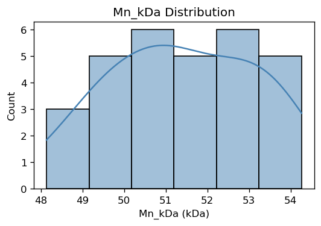
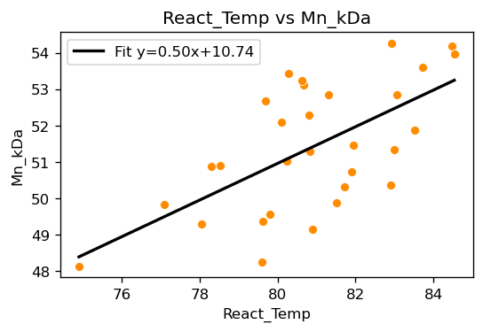
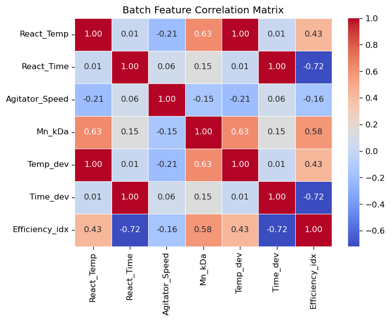
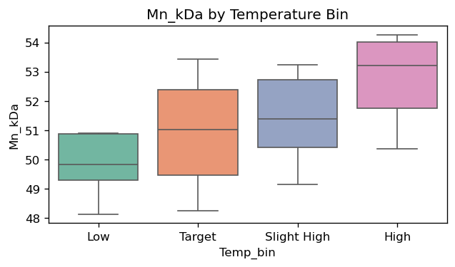
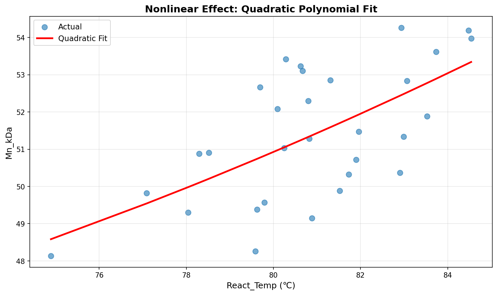
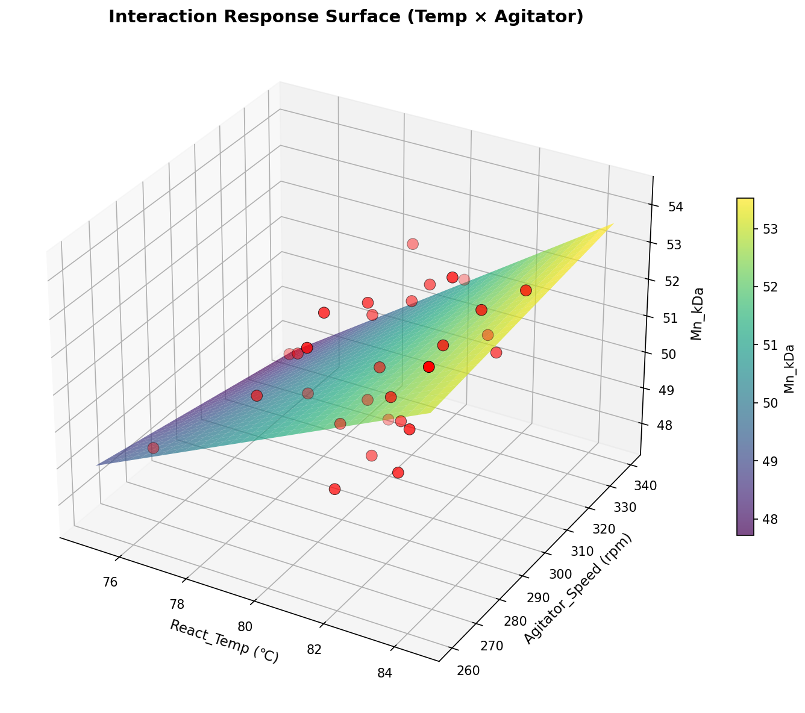
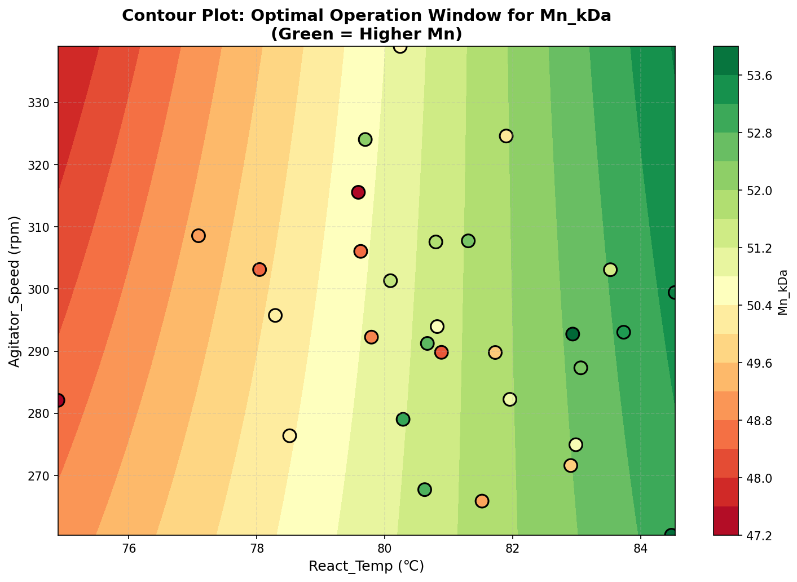
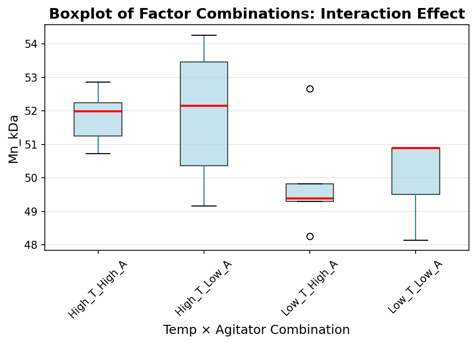

# Unit03｜化工場資料型態（Batch / Continuous）

**課程名稱**：化工資料科學與機器學習實務（CHE-AI-101）  
**本單元定位**：把化工資料「先講清楚語意」：你手上的資料到底是連續製程？批次製程？還是混合（開停機/切換品級/多階段）？  

---

## 本單元目標

- 能分辨化工資料常見型態：Continuous / Batch / Campaign / Grade Change / Startup-Shutdown  
- 能用正確的資料結構表示：`(time, feature)` vs `(batch, time, feature)`  
- 能避免常見錯誤：批次邊界混合、時間對齊錯位、把未來資訊帶進訓練（Data Leakage）  
- 能做最基本的「批次彙整特徵」與「批次品質 EDA」作為後續建模前檢查  

---

## 1. 連續 vs 批次：你在分析什麼？

### 1.1 連續製程（Continuous）
- 資料通常是長時間的多變量時間序列：每分鐘/每秒一筆 Tag。  
- 常見情境：穩態附近的小擾動、慢漂移（fouling/催化劑失活）、切換品級（grade change）。  
- 常見目標：軟測器、預測、異常偵測、控制。  

### 1.2 批次製程（Batch）
- 每一批有自己的「開始/結束」與「階段（Phase）」：升溫、保溫、反應、降溫、卸料…。  
- 批次間長度常不同：設備/操作/原料變動會造成時間軸不等長。  
- 常見目標：批次品質（final quality）回歸/分類、批次一致性、批次異常偵測。  

---

## 2. 化工資料中的張量思維（從 2D 到 3D）

> 本段整理自 Unit01 的「張量思維」內容：關鍵不是 `reshape` 的數字，而是每一維的物理意義。

- **單變量趨勢 (1D)**：例如單一塔頂溫度隨時間變化 $T(t)$。  
- **多變量時間序列 (2D)**：每個時間點同時量測多個變數，得到 $\mathbf{X} \in \mathbb{R}^{T \times d}$。  
- **多批次 × 多時間 × 多變數 (3D)**：批次製程常整理成張量 $\mathcal{X} \in \mathbb{R}^{N_{batch} \times T \times d}$。  

形狀選擇與風險（重點）：
- 在製程資料中，`(batch, time, feature)` 與 `(time, feature)` 混用常造成批次邊界洩漏（Data Leakage）。  
- 不等長批次若被硬壓成等長，需明確處理 `padding/masking`，不應「硬 reshape」。  

**物理意義檢查清單**：
1. 每一維代表什麼？(batch / time / feature / channel)  
2. 時間是否仍按真實順序排列？  
3. 不等長批次是否被硬性壓成等長？是否需要 padding / masking？  
4. 是否在不自覺中混合了不同批次的時間軸？  

---

## 3. 批次資料的兩種常見形式

### 3.1 批次「最終品質」表（Batch-level, 2D）
每一列是一批：操作條件 + 最終品質。
- 優點：最容易做 EDA/回歸/樹模型。  
- 風險：丟失了「批次過程曲線」資訊（例如升溫速率、振盪、過衝）。  

### 3.2 批次「過程曲線」表（Time-series per batch, 3D / long format）
每一列是一個時間點：`BatchID + Time + Tags...`
- 優點：保留動態資訊，可做動態 PCA、序列模型。  
- 風險：需要先處理對時、階段、缺值、停機段，且更容易犯 Data Leakage。  

---

## 4. 延伸小案例：簡單批次製程資料的 EDA（Batch-level）

> 本段內容原本放在 Unit01 的延伸小案例；在新版結構中移到 Unit03，作為「批次資料語意」的第一個例子。

此延伸案例示範「多批次最終品質 (Mn_kDa) 與操作變數」的關聯探索，並展示一組典型初步 EDA 步驟：

目標：
- 了解分子量與溫度 / 時間的線性與殘差行為。
- 建立簡易特徵 (偏差量、效率指標) 與分箱比較。
- 快速檢視分佈、相關性、初步線性模型係數。

變數語意（可對照實務）：
- React_Temp：反應溫度 (可對應聚合或酯化等反應的溫控段)。
- React_Time：總反應時間 (可對應停留或批次長度)。
- Agitator_Speed：攪拌速度 (影響傳熱與混合)。
- Mn_kDa：數均分子量 (品質指標)。

### 4.1 整體關聯概覽 (Pairplot)


### 4.2 Mn_kDa 分佈 (品質穩定性)


### 4.3 React_Temp vs Mn_kDa 回歸關係


### 4.4 相關係數熱圖


### 4.5 溫度分箱箱型圖


---

## 4.6 進階案例：非線性效應與交互作用 (Advanced Batch EDA)

**實務動機**：  
實際化工製程中，操作變數對品質的影響常呈現：
1. **非線性效應**：例如溫度對反應速率服從 Arrhenius 方程 $k = A e^{-E_a/RT}$，不是簡單線性。
2. **交互作用**：例如「高溫 + 高攪拌」的組合效果 ≠ 各自單獨效果之和。

若只做線性回歸，這些效應會被「埋沒」在殘差中。進階 EDA 的目標是：
- **視覺化非線性**：曲線擬合、局部迴歸 (LOESS)。
- **視覺化交互作用**：3D 曲面圖、等高線圖、因子組合箱型圖。
- **量化交互作用**：線性模型加入交互項 $X_1 \times X_2$，檢查係數顯著性。

---

### 4.6.1 非線性效應：二次多項式擬合

假設 $Mn$ 與溫度的關係為二次函數：

$$
Mn = \beta_0 + \beta_1 T + \beta_2 T^2 + \epsilon
$$

**程式碼示意（在 Notebook 中實作）：**

```python
from sklearn.preprocessing import PolynomialFeatures
from sklearn.linear_model import LinearRegression

# 建立二次特徵
poly = PolynomialFeatures(degree=2, include_bias=False)
X_poly = poly.fit_transform(df_batch[['React_Temp']])
y = df_batch['Mn_kDa']

# 擬合
model_poly = LinearRegression().fit(X_poly, y)
df_batch['Mn_pred_poly'] = model_poly.predict(X_poly)

# 視覺化
plt.scatter(df_batch['React_Temp'], df_batch['Mn_kDa'], alpha=0.6, label='實際值')
plt.plot(df_batch['React_Temp'].sort_values(), 
         df_batch.sort_values('React_Temp')['Mn_pred_poly'], 
         color='red', label='二次多項式擬合', linewidth=2)
plt.xlabel('React_Temp (℃)')
plt.ylabel('Mn_kDa')
plt.legend()
plt.title('非線性效應：二次多項式擬合')
plt.savefig('../Part_1/Unit03_Results/11_batch_nonlinear.png', dpi=150, bbox_inches='tight')
plt.show()
```

**預期觀察**：
- 若真實關係是二次（例如存在最佳溫度），曲線會比直線更貼合資料。
- 殘差分佈會比線性模型更接近常態。

**化工解釋**：
- 溫度過低：反應速率慢，分子量低。
- 溫度過高：可能發生副反應或降解，分子量反而下降。
- **最佳溫度窗口**：二次項係數為負時，存在極大值點。

  
*(圖：二次多項式擬合捕捉溫度對 Mn 的非線性效應)*

---

### 4.6.2 交互作用：溫度 × 攪拌速度

假設高溫搭配高攪拌會「加成」提升分子量（例如因傳熱效率提升），模型為：

$$
Mn = \beta_0 + \beta_1 T + \beta_2 A + \beta_3 (T \times A) + \epsilon
$$

其中 $A$ 為攪拌速度 (Agitator_Speed)。

**程式碼示意：**

```python
# 建立交互項
df_batch['Temp_x_Agit'] = df_batch['React_Temp'] * df_batch['Agitator_Speed']

# 線性回歸
X_interact = df_batch[['React_Temp', 'Agitator_Speed', 'Temp_x_Agit']]
model_interact = LinearRegression().fit(X_interact, y)

print("交互作用模型係數：")
for name, coef in zip(['Temp', 'Agitator', 'Temp×Agit'], model_interact.coef_):
    print(f"{name}: {coef:.4f}")

# 3D 響應曲面 (Response Surface)
from mpl_toolkits.mplot3d import Axes3D

fig = plt.figure(figsize=(10, 7))
ax = fig.add_subplot(111, projection='3d')

# 建立網格
temp_range = np.linspace(df_batch['React_Temp'].min(), df_batch['React_Temp'].max(), 30)
agit_range = np.linspace(df_batch['Agitator_Speed'].min(), df_batch['Agitator_Speed'].max(), 30)
T_grid, A_grid = np.meshgrid(temp_range, agit_range)

# 預測網格上的 Mn
Mn_grid = (model_interact.intercept_ + 
           model_interact.coef_[0] * T_grid + 
           model_interact.coef_[1] * A_grid + 
           model_interact.coef_[2] * T_grid * A_grid)

# 繪製曲面
surf = ax.plot_surface(T_grid, A_grid, Mn_grid, cmap='viridis', alpha=0.7)
ax.scatter(df_batch['React_Temp'], df_batch['Agitator_Speed'], df_batch['Mn_kDa'], 
           color='red', s=50, label='實際批次')

ax.set_xlabel('React_Temp (℃)')
ax.set_ylabel('Agitator_Speed (rpm)')
ax.set_zlabel('Mn_kDa')
ax.set_title('交互作用響應曲面 (Temp × Agitator)')
fig.colorbar(surf, shrink=0.5)
plt.savefig('../Part_1/Unit03_Results/12_batch_interaction_3d.png', dpi=150, bbox_inches='tight')
plt.show()
```

**預期觀察**：
- 若交互項係數 $\beta_3$ 顯著（例如 p < 0.05），代表「溫度與攪拌的組合效果」不是簡單相加。
- 曲面會呈現「鞍形」或「斜坡」，而非平面。

**化工解釋**：
- 高溫但低攪拌：局部過熱，品質不穩定。
- 低溫但高攪拌：浪費能量，無法有效提升反應速率。
- **最佳組合**：中高溫 + 適當攪拌，達到傳熱與反應的平衡。

  
*(圖：溫度與攪拌速度的交互作用響應曲面)*

---

### 4.6.3 等高線圖：尋找最佳操作窗口

3D 曲面雖直觀，但難以精確讀取數值。**等高線圖 (Contour Plot)** 可將曲面「壓平」到 2D：

```python
plt.figure(figsize=(8, 6))
contour = plt.contourf(T_grid, A_grid, Mn_grid, levels=15, cmap='RdYlGn')
plt.colorbar(contour, label='Mn_kDa')
plt.scatter(df_batch['React_Temp'], df_batch['Agitator_Speed'], 
            c=df_batch['Mn_kDa'], s=80, edgecolors='black', cmap='RdYlGn')
plt.xlabel('React_Temp (℃)')
plt.ylabel('Agitator_Speed (rpm)')
plt.title('等高線圖：Mn_kDa 最佳操作窗口')
plt.savefig('../Part_1/Unit03_Results/13_batch_contour.png', dpi=150, bbox_inches='tight')
plt.show()
```

**實務應用**：
- **綠色區域**：高 Mn 目標區（例如 > 45 kDa）。
- **紅色區域**：低 Mn 風險區。
- **操作建議**：選擇落在綠色區域內的 (T, A) 組合，並留有安全邊界。

  
*(圖：等高線圖標示最佳操作窗口)*

---

### 4.6.4 因子組合箱型圖：離散化檢視交互作用

若不想建模，也可用「分箱 + 組合」的方式視覺化交互作用：

```python
# 將溫度與攪拌分為高/低兩組
df_batch['Temp_Bin'] = pd.cut(df_batch['React_Temp'], bins=2, labels=['Low_T', 'High_T'])
df_batch['Agit_Bin'] = pd.cut(df_batch['Agitator_Speed'], bins=2, labels=['Low_A', 'High_A'])
df_batch['Combination'] = df_batch['Temp_Bin'].astype(str) + '_' + df_batch['Agit_Bin'].astype(str)

# 箱型圖
plt.figure(figsize=(10, 6))
df_batch.boxplot(column='Mn_kDa', by='Combination', grid=False, patch_artist=True)
plt.suptitle('')  # 移除預設標題
plt.xlabel('溫度 × 攪拌組合')
plt.ylabel('Mn_kDa')
plt.title('因子組合箱型圖：檢視交互作用')
plt.xticks(rotation=45)
plt.savefig('../Part_1/Unit03_Results/14_batch_combination_box.png', dpi=150, bbox_inches='tight')
plt.show()
```

**預期觀察**：
- 若 `High_T_High_A` 的中位數明顯高於 `High_T_Low_A` 與 `Low_T_High_A`，代表「高溫 + 高攪拌」有加成效果。
- 若四組的中位數呈現線性遞增，則無明顯交互作用。

  
*(圖：因子組合箱型圖快速檢視交互作用)*

---

### 4.6.5 統計檢驗：交互項是否顯著？

使用 `statsmodels` 進行帶交互項的線性回歸，並查看 p 值：

```python
import statsmodels.api as sm

X_sm = sm.add_constant(X_interact)  # 加入截距項
model_sm = sm.OLS(y, X_sm).fit()
print(model_sm.summary())
```

**關鍵指標**：
- **交互項 p-value < 0.05**：交互作用顯著，應保留在模型中。
- **R² 提升**：相比無交互項模型，R² 明顯提高代表模型更好解釋資料。

---

### 4.6.6 實務建議：何時需要進階 EDA？

- **線性模型殘差呈現「曲線趨勢」**：考慮二次項或對數轉換。
- **不同操作區域的斜率不同**：可能存在交互作用。
- **專家知識提示**：已知物理機制存在非線性（例如 Arrhenius、質量作用定律）。
- **多目標優化**：需找出「多個操作變數的最佳組合窗口」。

**警告**：
- 過度擬合風險：二次、三次、多交互項會快速增加參數，需搭配交叉驗證或正則化。
- 外推風險：多項式模型在訓練範圍外預測常失真（例如溫度過高時 Mn 可能降至負值）。

---

## 5. 本單元程式演練

請開啟並完成：`Part_1/Unit03_ChemEng_Data_Types.ipynb`  
- 會示範 continuous vs batch 的資料結構化（wide/long、(batch,time,feature)）  
- 會包含上述「批次最終品質 EDA」並把圖存到 `outputs/P1_Unit03_Results/`（避免與其他 Part 的 `Unit03_Results` 衝突）  
