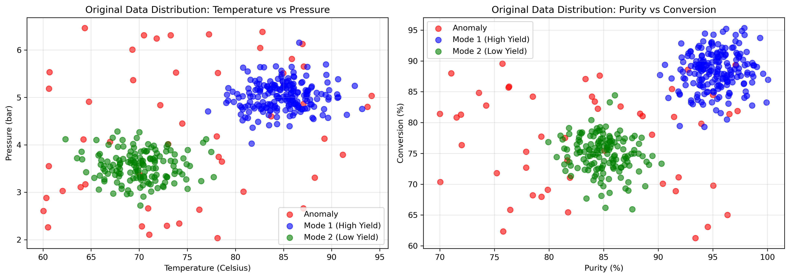
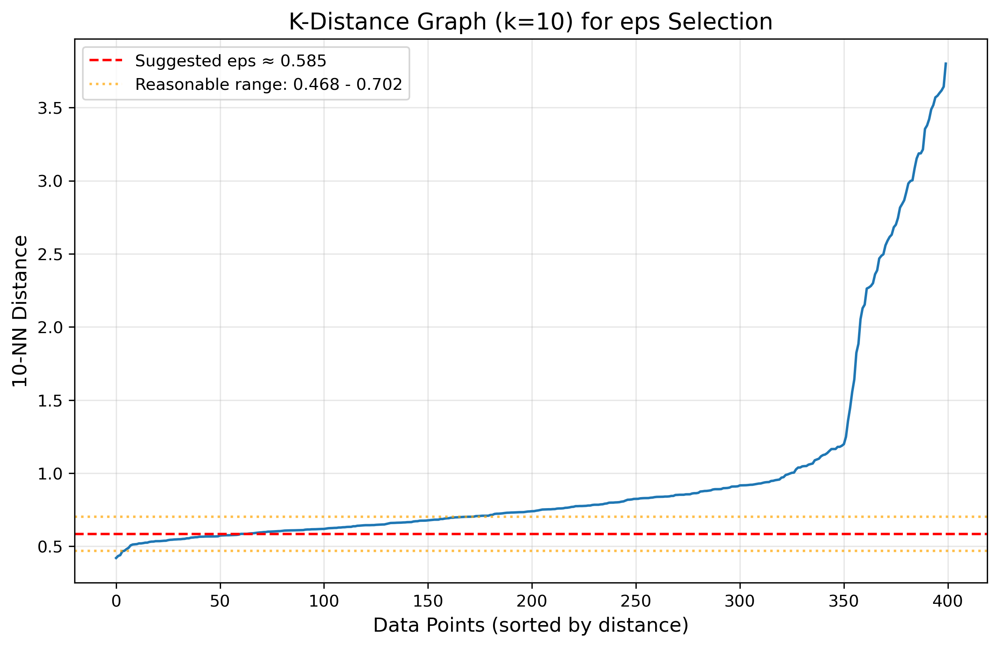
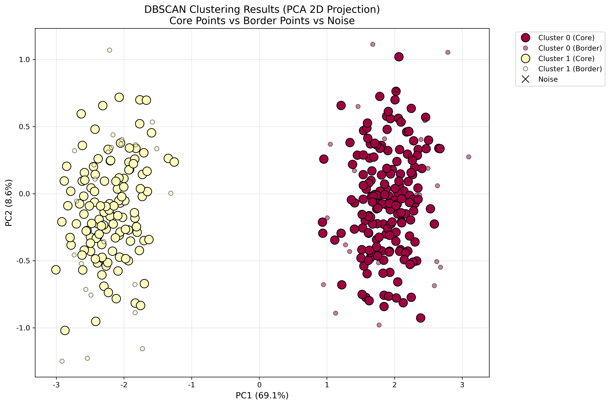

# Unit05 DBSCAN 分群演算法

## 課程目標

本單元將深入介紹 DBSCAN (Density-Based Spatial Clustering of Applications with Noise) 分群演算法，這是一種基於密度的分群方法，特別適合處理具有噪音和任意形狀群集的數據。透過本單元的學習，您將能夠：

- 理解 DBSCAN 演算法的核心原理與密度連接概念
- 掌握 DBSCAN 的演算法步驟與參數設定
- 學會使用 scikit-learn 實作 DBSCAN 模型
- 了解如何選擇最佳的參數 (eps 和 min_samples)
- 認識 DBSCAN 的優缺點與適用場景
- 應用 DBSCAN 於化工領域的實際案例

---

## 1. DBSCAN 演算法簡介

### 1.1 什麼是 DBSCAN？

DBSCAN (Density-Based Spatial Clustering of Applications with Noise) 是一種基於密度的分群演算法，由 Martin Ester 等人於 1996 年提出。與 K-Means 等需要預先指定群集數量的方法不同，DBSCAN 能夠自動發現任意形狀的群集，並且能夠有效識別噪音點 (outliers)。

DBSCAN 的核心思想是：群集是由高密度區域組成的，而這些高密度區域被低密度區域分隔開來。數據點根據其周圍的密度被分類為核心點 (Core Points)、邊界點 (Border Points) 或噪音點 (Noise Points)。

### 1.2 DBSCAN 的核心概念

**密度可達性 (Density Reachability)**

DBSCAN 基於兩個關鍵參數來定義密度：

- **ε (eps)**：定義鄰域半徑，即兩個數據點被視為鄰居的最大距離
- **MinPts (min_samples)**：定義核心點所需的最小鄰居數量（包括點本身）

**點的分類**

1. **核心點 (Core Point)**：在其 ε-鄰域內至少有 MinPts 個點（包括自己）
2. **邊界點 (Border Point)**：在某個核心點的 ε-鄰域內，但自身鄰域內的點數少於 MinPts
3. **噪音點 (Noise Point)**：既不是核心點也不是邊界點的點

**密度連接 (Density-Connected)**

如果存在一系列核心點，使得相鄰的核心點之間密度可達，則這些點屬於同一個群集。

### 1.3 化工領域應用案例

DBSCAN 在化工領域具有獨特的優勢，特別適合以下應用場景：

1. **異常操作模式探索**：
   - 自動識別製程中的異常操作狀態（噪音點）
   - 無需預先知道異常類型的數量
   - 發現形狀不規則的異常操作區域
   - 例如：反應器在故障前的異常操作軌跡識別

2. **複雜製程狀態識別**：
   - 識別具有任意形狀的操作區域
   - 不受球形群集假設的限制
   - 適合多模態製程的狀態識別
   - 例如：聚合反應器中不同產品等級的操作區域可能呈現不規則形狀

3. **批次製程軌跡分析**：
   - 識別成功批次的典型軌跡模式
   - 檢測偏離正常軌跡的異常批次
   - 不同批次軌跡可能呈現複雜的幾何形狀
   - 例如：發酵製程中不同菌種生長曲線的自動分類

4. **設備故障模式識別**：
   - 自動發現不同類型的設備故障模式
   - 識別罕見的故障類型（可能被標記為噪音）
   - 適合處理故障數據中的異常值
   - 例如：壓縮機振動數據分析，識別不同的故障模式

5. **原料品質異常檢測**：
   - 識別原料品質的正常範圍
   - 自動檢測異常批次的原料
   - 處理品質數據中的測量誤差（噪音）
   - 例如：原油品質數據分析，識別異常批次

---

## 2. DBSCAN 演算法原理

### 2.1 演算法步驟

DBSCAN 演算法的執行步驟如下：

**步驟 1：初始化**
- 設定參數 ε (eps) 和 MinPts (min_samples)
- 將所有點標記為未訪問

**步驟 2：選擇未訪問的點**
- 隨機選擇一個未訪問的點 $P$
- 標記 $P$ 為已訪問

**步驟 3：檢查鄰域密度**
- 計算點 $P$ 的 ε-鄰域內的點數
- 如果鄰域內的點數 ≥ MinPts，則 $P$ 是核心點，創建新群集
- 如果鄰域內的點數 < MinPts，暫時標記 $P$ 為噪音點（可能稍後被重新分類為邊界點）

**步驟 4：擴展群集**
- 如果 $P$ 是核心點，則將其 ε-鄰域內的所有點加入當前群集
- 對於鄰域內的每個點 $Q$：
  - 如果 $Q$ 未訪問，標記為已訪問並檢查其鄰域
  - 如果 $Q$ 也是核心點，將其鄰域內的點也加入當前群集（遞迴擴展）
  - 如果 $Q$ 尚未分配到任何群集，將其分配到當前群集

**步驟 5：重複**
- 重複步驟 2-4，直到所有點都被訪問
- 最終未被分配到任何群集的點被標記為噪音點

### 2.2 數學定義

**ε-鄰域 (ε-neighborhood)**

點 $p$ 的 ε-鄰域定義為：

$$
N_\varepsilon(p) = \{q \in D \mid \text{dist}(p, q) \leq \varepsilon\}
$$

其中 $D$ 是數據集， $\text{dist}(p, q)$ 是點 $p$ 和 $q$ 之間的距離（通常使用歐幾里得距離）。

**核心點 (Core Point)**

如果點 $p$ 的 ε-鄰域內至少有 MinPts 個點，則 $p$ 是核心點：

$$
|N_\varepsilon(p)| \geq \text{MinPts}
$$

**直接密度可達 (Directly Density-Reachable)**

如果點 $q$ 在點 $p$ 的 ε-鄰域內，且 $p$ 是核心點，則 $q$ 從 $p$ 直接密度可達：

$$
q \text{ directly density-reachable from } p \iff q \in N_\varepsilon(p) \text{ and } |N_\varepsilon(p)| \geq \text{MinPts}
$$

**密度可達 (Density-Reachable)**

如果存在一系列點 $p_1, p_2, \ldots, p_n$，其中 $p_1 = p$ 且 $p_n = q$，使得 $p_{i+1}$ 從 $p_i$ 直接密度可達，則 $q$ 從 $p$ 密度可達。

**密度連接 (Density-Connected)**

如果存在點 $o$，使得點 $p$ 和 $q$ 都從 $o$ 密度可達，則 $p$ 和 $q$ 密度連接：

$$
p \text{ density-connected to } q \iff \exists o: p \text{ density-reachable from } o \text{ and } q \text{ density-reachable from } o
$$

**群集 (Cluster)**

一個群集 $C$ 是一個非空的點集，滿足以下條件：

1. **最大性 (Maximality)**：如果 $p \in C$ 且 $q$ 從 $p$ 密度可達，則 $q \in C$
2. **連接性 (Connectivity)**：對於 $C$ 中的任意兩點 $p$ 和 $q$， $p$ 和 $q$ 密度連接

**噪音點 (Noise)**

不屬於任何群集的點被定義為噪音點。

### 2.3 距離度量

DBSCAN 支持多種距離度量方式，常用的包括：

**歐幾里得距離 (Euclidean Distance)**

最常用的距離度量，適用於連續變數：

$$
\text{dist}(p, q) = \sqrt{\sum_{i=1}^{d} (p_i - q_i)^2}
$$

**曼哈頓距離 (Manhattan Distance)**

適用於高維數據或存在異常值的情況：

$$
\text{dist}(p, q) = \sum_{i=1}^{d} |p_i - q_i|
$$

**切比雪夫距離 (Chebyshev Distance)**

取各維度差異的最大值：

$$
\text{dist}(p, q) = \max_{i=1}^{d} |p_i - q_i|
$$

### 2.4 時間複雜度

DBSCAN 的時間複雜度取決於鄰域查詢的效率：

- **無索引結構**： $O(n^2)$，其中 $n$ 是數據點數量
- **使用空間索引（如 KD-tree）**： $O(n \log n)$（平均情況）

在實際應用中，scikit-learn 的 DBSCAN 實作使用了高效的空間索引結構來加速鄰域查詢。

---

## 3. 參數選擇與調優

### 3.1 參數 eps (ε) 的選擇

參數 eps 定義了鄰域的半徑，是 DBSCAN 中最關鍵的參數之一。選擇合適的 eps 值對分群結果有重大影響。

**方法 1：K-距離圖法 (K-Distance Graph)**

這是最常用的 eps 選擇方法：

1. 對每個點，計算到其第 k 個最近鄰居的距離（k 通常設為 MinPts）
2. 將所有點的 k-距離按升序排列
3. 繪製 k-距離圖
4. 尋找圖中的「肘部」(elbow point)，即曲線斜率急劇變化的位置
5. 肘部對應的距離值即為建議的 eps 值

**數學表達**

對於點 $p$，其 k-距離定義為：

$$
k\text{-dist}(p) = \text{dist}(p, o)
$$

其中 $o$ 是 $p$ 的第 k 個最近鄰居。

**方法 2：領域知識法**

根據化工領域的實際意義設定 eps：

- 如果變數有明確的物理意義（如溫度、壓力），可以根據操作經驗設定合理的鄰域範圍
- 例如：反應溫度在 ±5°C 範圍內視為相似操作條件
- 需要注意數據標準化的影響

**方法 3：多尺度分析**

嘗試不同的 eps 值，觀察分群結果的變化：

- 從較小的 eps 開始逐步增加
- 記錄不同 eps 下的群集數量和噪音點比例
- 選擇能產生合理群集數量且噪音點比例適中的 eps 值

### 3.2 參數 min_samples (MinPts) 的選擇

參數 min_samples 定義了核心點所需的最小鄰居數量，影響群集的緊密程度和噪音點的識別。

**一般準則**

- **低維數據** (d ≤ 3)：min_samples ≥ 4
- **高維數據** (d > 3)：min_samples ≥ 2d，其中 d 是維度
- **默認值**：scikit-learn 的默認值為 5，適合大多數情況

**選擇考量**

1. **數據規模**：
   - 數據量大時，可以增加 min_samples 以過濾噪音
   - 數據量小時，應減小 min_samples 以避免過度分割

2. **噪音容忍度**：
   - 希望嚴格識別噪音：增加 min_samples
   - 希望包容更多邊界點：減小 min_samples

3. **群集緊密度**：
   - 希望群集更緊密：增加 min_samples
   - 希望群集更鬆散：減小 min_samples

**化工應用建議**

- **製程監控**：min_samples = 5-10（適度嚴格，避免誤報）
- **批次分析**：min_samples = 3-5（較寬鬆，避免遺漏相似批次）
- **異常檢測**：min_samples = 10-20（嚴格，確保噪音點為真正的異常）

### 3.3 參數選擇的權衡

**eps 過小的影響**
- 群集數量過多，數據過度分割
- 大量點被錯誤標記為噪音
- 無法捕捉真實的群集結構

**eps 過大的影響**
- 不同的群集被合併
- 噪音點被錯誤地分配到群集中
- 失去密度差異的辨別能力

**min_samples 過小的影響**
- 噪音點被錯誤分類為核心點或邊界點
- 群集過於鬆散，缺乏代表性
- 對噪音數據敏感

**min_samples 過大的影響**
- 真實的小型群集被忽略
- 過多的點被標記為噪音
- 只能識別非常密集的群集

---

## 4. 使用 scikit-learn 實作 DBSCAN

### 4.1 基本使用

scikit-learn 提供了 `DBSCAN` 類別來實作 DBSCAN 演算法：

```python
from sklearn.cluster import DBSCAN
from sklearn.preprocessing import StandardScaler
import numpy as np

# 1. 數據標準化（重要！）
scaler = StandardScaler()
X_scaled = scaler.fit_transform(X)

# 2. 建立 DBSCAN 模型
dbscan = DBSCAN(eps=0.5, min_samples=5, metric='euclidean')

# 3. 訓練模型（實際上是執行分群）
labels = dbscan.fit_predict(X_scaled)

# 4. 獲取結果
n_clusters = len(set(labels)) - (1 if -1 in labels else 0)
n_noise = list(labels).count(-1)

print(f"群集數量: {n_clusters}")
print(f"噪音點數量: {n_noise}")
print(f"噪音點比例: {n_noise / len(labels) * 100:.2f}%")
```

### 4.2 重要參數說明

**eps** (float, default=0.5)
- 鄰域半徑
- 兩個樣本被視為鄰居的最大距離

**min_samples** (int, default=5)
- 核心點所需的最小鄰居數量（包括自己）
- 影響群集的緊密程度和噪音識別

**metric** (str or callable, default='euclidean')
- 距離度量方式
- 可選值：'euclidean', 'manhattan', 'chebyshev', 'cosine' 等
- 也可以傳入自定義的距離函數

**algorithm** (str, default='auto')
- 計算最近鄰的演算法
- 可選值：'auto', 'ball_tree', 'kd_tree', 'brute'
- 'auto' 會根據數據特性自動選擇

**leaf_size** (int, default=30)
- 傳遞給 BallTree 或 KDTree 的葉子大小
- 影響查詢速度和記憶體使用

**n_jobs** (int, default=None)
- 用於計算的 CPU 核心數
- -1 表示使用所有可用核心

### 4.3 模型屬性

訓練後的 DBSCAN 模型具有以下屬性：

**labels_** (ndarray of shape (n_samples,))
- 每個樣本的群集標籤
- 噪音點的標籤為 -1
- 群集標籤從 0 開始編號

**core_sample_indices_** (ndarray of shape (n_core_samples,))
- 核心點的索引

**components_** (ndarray of shape (n_core_samples, n_features))
- 核心點的特徵向量

### 4.4 標籤解讀

DBSCAN 的標籤有特殊含義：

```python
# 標籤 -1：噪音點
noise_mask = labels == -1
noise_points = X_scaled[noise_mask]

# 標籤 ≥ 0：屬於某個群集
cluster_0_mask = labels == 0
cluster_0_points = X_scaled[cluster_0_mask]

# 核心點標識
core_samples_mask = np.zeros_like(labels, dtype=bool)
core_samples_mask[dbscan.core_sample_indices_] = True

# 邊界點：屬於群集但不是核心點
border_mask = (labels >= 0) & (~core_samples_mask)
border_points = X_scaled[border_mask]
```

---

## 5. 模型評估

### 5.1 評估指標

由於 DBSCAN 會識別噪音點，傳統的分群評估指標需要特殊處理。

**輪廓係數 (Silhouette Score)**

計算時需要排除噪音點：

```python
from sklearn.metrics import silhouette_score

# 排除噪音點進行評估
mask = labels != -1
if len(set(labels[mask])) > 1:
    silhouette = silhouette_score(X_scaled[mask], labels[mask])
    print(f"Silhouette Score: {silhouette:.3f}")
```

輪廓係數範圍為 [-1, 1]：
- 接近 1：群集分離良好
- 接近 0：群集重疊
- 接近 -1：樣本可能被分配到錯誤的群集

**Davies-Bouldin 指數 (DB Index)**

計算時同樣需要排除噪音點：

```python
from sklearn.metrics import davies_bouldin_score

mask = labels != -1
if len(set(labels[mask])) > 1:
    db_index = davies_bouldin_score(X_scaled[mask], labels[mask])
    print(f"Davies-Bouldin Index: {db_index:.3f}")
```

DB 指數值越小越好，表示群集內緊密度高且群集間分離度大。

**Calinski-Harabasz 指數 (CH Index)**

```python
from sklearn.metrics import calinski_harabasz_score

mask = labels != -1
if len(set(labels[mask])) > 1:
    ch_index = calinski_harabasz_score(X_scaled[mask], labels[mask])
    print(f"Calinski-Harabasz Index: {ch_index:.3f}")
```

CH 指數值越大越好，表示群集定義良好。

### 5.2 噪音點分析

DBSCAN 的一個重要特性是能夠識別噪音點，因此噪音點分析是評估的重要部分。

**噪音點統計**

```python
n_noise = list(labels).count(-1)
noise_ratio = n_noise / len(labels) * 100

print(f"噪音點數量: {n_noise}")
print(f"噪音點比例: {noise_ratio:.2f}%")
```

**合理的噪音點比例**
- **製程監控數據**：5-15%（正常操作為主，少量異常）
- **故障診斷數據**：10-30%（包含各種異常狀態）
- **批次製程數據**：5-20%（少數失敗或異常批次）

**噪音點比例異常的原因**
- 噪音點過多（> 30%）：eps 過小或 min_samples 過大
- 噪音點過少（< 1%）：eps 過大或 min_samples 過小
- 參數設定需要調整

### 5.3 視覺化評估

視覺化是評估 DBSCAN 結果的重要手段：

**2D 視覺化（使用前兩個特徵或 PCA 降維）**

```python
import matplotlib.pyplot as plt

# 繪製分群結果
unique_labels = set(labels)
colors = plt.cm.Spectral(np.linspace(0, 1, len(unique_labels)))

for k, col in zip(unique_labels, colors):
    if k == -1:
        # 噪音點用黑色表示
        col = [0, 0, 0, 1]
    
    class_member_mask = (labels == k)
    xy = X_scaled[class_member_mask]
    plt.plot(xy[:, 0], xy[:, 1], 'o', markerfacecolor=tuple(col),
             markeredgecolor='k', markersize=6)

plt.title(f'DBSCAN Clustering (eps={eps}, min_samples={min_samples})')
plt.xlabel('Feature 1')
plt.ylabel('Feature 2')
plt.show()
```

**核心點與邊界點的視覺化**

```python
# 核心點
core_samples_mask = np.zeros_like(labels, dtype=bool)
core_samples_mask[dbscan.core_sample_indices_] = True

# 繪製
for k in set(labels):
    if k == -1:
        continue
    class_member_mask = (labels == k)
    
    # 核心點
    xy = X_scaled[class_member_mask & core_samples_mask]
    plt.plot(xy[:, 0], xy[:, 1], 'o', markersize=10, label=f'Cluster {k} (Core)')
    
    # 邊界點
    xy = X_scaled[class_member_mask & ~core_samples_mask]
    plt.plot(xy[:, 0], xy[:, 1], 'o', markersize=5, alpha=0.5)

# 噪音點
xy = X_scaled[labels == -1]
plt.plot(xy[:, 0], xy[:, 1], 'x', markersize=3, label='Noise')
plt.legend()
plt.show()
```

---

## 6. DBSCAN 的優缺點

### 6.1 優點

1. **無需預先指定群集數量**
   - 演算法自動發現群集數量
   - 適合探索性數據分析
   - 適合未知群集結構的情況

2. **能夠發現任意形狀的群集**
   - 不受球形群集假設的限制
   - 可以識別凹形、環形等複雜形狀的群集
   - 適合化工製程中複雜的操作區域

3. **有效識別噪音點**
   - 自動將異常點標記為噪音
   - 對異常值具有魯棒性
   - 適合異常檢測應用

4. **對群集密度差異不敏感**
   - 只要密度足夠，就能識別群集
   - 不要求所有群集具有相同的密度

5. **基於密度的定義更符合直覺**
   - 密集區域自然形成群集
   - 符合化工製程中的實際情況

### 6.2 缺點

1. **對參數敏感**
   - eps 和 min_samples 的選擇對結果影響很大
   - 需要領域知識或試驗來確定合適的參數
   - 不同密度的數據可能需要不同的參數

2. **難以處理密度差異很大的數據**
   - 如果數據中存在密度差異很大的群集，難以用單一的 eps 值處理
   - 可能需要多次運行或使用變化的密度閾值

3. **高維數據的挑戰**
   - 在高維空間中，距離度量的意義減弱（維度詛咒）
   - 可能需要先進行降維處理
   - 計算鄰域查詢的效率降低

4. **無法提供群集中心**
   - 與 K-Means 不同，DBSCAN 不計算群集中心
   - 需要額外計算每個群集的代表點

5. **記憶體需求**
   - 需要存儲所有點對之間的距離或鄰域關係
   - 對於大規模數據集，記憶體消耗可能很大

6. **非確定性（邊界點分配）**
   - 邊界點的群集分配可能不唯一
   - 不同的點訪問順序可能導致不同的邊界點分配
   - 核心點的分配是確定的

### 6.3 適用場景

**適合使用 DBSCAN 的情況**

- 不知道群集數量
- 數據包含明顯的噪音或異常值
- 群集呈現任意形狀（非球形）
- 需要識別異常點
- 數據具有明顯的密度差異區域
- 化工製程中的異常檢測
- 複雜操作區域的識別

**不適合使用 DBSCAN 的情況**

- 數據中群集密度差異非常大
- 高維數據（維度 > 10）且未進行降維
- 需要明確的群集中心點
- 數據量非常大且對效率要求高
- 數據分布均勻，沒有明顯的密度聚集

---

## 7. 化工應用案例：反應器異常操作檢測

### 7.1 問題背景

考慮一個連續攪拌槽式反應器 (CSTR) 的操作監控問題：

- **正常操作**：反應器在穩定的溫度和壓力下運行，產物品質穩定
- **異常操作**：由於原料波動、設備故障等原因，操作條件偏離正常範圍
- **目標**：自動識別異常操作狀態，及時預警

### 7.2 為什麼選擇 DBSCAN？

1. **不知道異常類型數量**：異常可能有多種類型（原料問題、溫度偏高、壓力異常等）
2. **正常操作區域可能不規則**：操作窗口可能呈現複雜形狀
3. **需要識別異常點**：異常操作應被標記為噪音點
4. **操作數據包含測量誤差**：DBSCAN 對噪音具有魯棒性

### 7.3 特徵選擇

選擇以下特徵進行分群：

- 反應溫度 (°C)
- 反應壓力 (bar)
- 進料流速 (m³/h)
- 攪拌速度 (rpm)
- 產物純度 (%)
- 轉化率 (%)

### 7.4 數據預處理

```python
from sklearn.preprocessing import StandardScaler

# 特徵標準化（重要！）
scaler = StandardScaler()
X_scaled = scaler.fit_transform(X)
```

**為什麼需要標準化？**
- 不同特徵的量綱和數值範圍差異很大
- eps 參數基於距離計算，受數值尺度影響
- 標準化後，所有特徵具有相同的重要性

### 7.5 參數選擇

**使用 K-距離圖選擇 eps**

```python
from sklearn.neighbors import NearestNeighbors

# 計算每個點到第 k 個最近鄰的距離
k = 5  # 對應 min_samples
nbrs = NearestNeighbors(n_neighbors=k).fit(X_scaled)
distances, indices = nbrs.kneighbors(X_scaled)

# 排序並繪製 k-距離圖
distances = np.sort(distances[:, k-1], axis=0)
plt.plot(distances)
plt.ylabel(f'{k}-NN Distance')
plt.xlabel('Data Points sorted by distance')
plt.title('K-Distance Graph for eps Selection')
plt.grid(True)
plt.show()

# 從圖中找到肘部位置，作為 eps 的建議值
```

**min_samples 的選擇**
- 數據維度：6
- 建議值：min_samples = 2 × 6 = 12
- 考慮到數據規模和噪音容忍度，選擇 min_samples = 10

### 7.6 模型訓練與結果分析

```python
from sklearn.cluster import DBSCAN

# 假設從 K-距離圖得到 eps = 0.5
dbscan = DBSCAN(eps=0.5, min_samples=10)
labels = dbscan.fit_predict(X_scaled)

# 結果統計
n_clusters = len(set(labels)) - (1 if -1 in labels else 0)
n_noise = list(labels).count(-1)

print(f"發現的操作模式數量: {n_clusters}")
print(f"異常操作點數量: {n_noise}")
print(f"異常操作比例: {n_noise / len(labels) * 100:.2f}%")

# 分析每個群集的特徵
for i in range(n_clusters):
    cluster_data = X[labels == i]
    print(f"\n操作模式 {i}:")
    print(f"  樣本數: {len(cluster_data)}")
    print(f"  平均溫度: {cluster_data[:, 0].mean():.2f} °C")
    print(f"  平均壓力: {cluster_data[:, 1].mean():.2f} bar")
    print(f"  平均轉化率: {cluster_data[:, 5].mean():.2f} %")
```

### 7.7 異常分析

```python
# 提取異常操作數據
anomaly_data = X[labels == -1]
normal_data = X[labels != -1]

# 比較異常與正常操作
print("\n異常操作特徵分析:")
feature_names = ['Temperature', 'Pressure', 'Flow Rate', 'Stirring Speed', 'Purity', 'Conversion']

for i, name in enumerate(feature_names):
    anomaly_mean = anomaly_data[:, i].mean()
    normal_mean = normal_data[:, i].mean()
    diff = anomaly_mean - normal_mean
    print(f"{name}: 異常={anomaly_mean:.2f}, 正常={normal_mean:.2f}, 差異={diff:.2f}")
```

### 7.8 工程應用建議

1. **建立監控系統**：
   - 將訓練好的模型部署到實時監控系統
   - 對新的操作數據進行分類
   - 當檢測到異常點時觸發警報

2. **定期更新模型**：
   - 隨著操作條件的變化，定期重新訓練模型
   - 納入新的操作數據以改善模型性能

3. **結合領域知識**：
   - 與製程工程師討論識別出的異常模式
   - 確認異常點是否對應實際的操作問題
   - 調整參數以符合工程實際需求

4. **多層次監控**：
   - 對不同的時間尺度（即時、小時、日）分別建模
   - 結合其他監控指標（如統計過程控制圖）

---

## 7.9 實驗結果展示

本節展示使用 `Unit05_DBSCAN.ipynb` 對 CSTR 反應器操作數據進行 DBSCAN 分群分析的完整實驗結果。

### 7.9.1 數據生成與可視化

**模擬數據設定**

我們模擬了三種操作模式的反應器數據：
- **操作模式 1（高產率）**：200 個樣本，溫度 85±3°C，壓力 5.0±0.3 bar
- **操作模式 2（低產率）**：150 個樣本，溫度 70±3°C，壓力 3.5±0.3 bar
- **異常操作**：50 個樣本，隨機分布在較大範圍內

**數據統計摘要**

```
數據集大小: (400, 7)

數據統計:
       Temperature    Pressure   Flow_Rate  Stirring_Speed     Purity  Conversion
count   400.000000  400.000000  400.000000      400.000000  400.00000  400.000000
mean     77.693506    4.382644   91.386642      279.403654   89.76838   80.939328
std       8.566839    0.964113   11.692871       29.854485    6.30583    7.731682
min      60.059467    2.062449   60.145168      201.020874   70.12099   60.202095
25%      70.226648    3.490869   79.860702      252.030303   85.16049   74.979009
50%      77.856397    4.365594   91.734403      281.149652   90.30476   81.489088
75%      85.151429    5.142486   99.991764      302.890426   94.87894   87.696055
max      95.344168    6.429281  119.996726      347.938262   98.75883   95.867035

真實標籤分布:
-1     50   # 異常操作
 0    200   # 模式 1
 1    150   # 模式 2
```

**原始數據分布視覺化**

下圖展示了原始數據在不同特徵維度上的分布情況：



**圖表解讀**：
- **左圖（溫度 vs 壓力）**：可以清楚看到兩個主要的操作模式（藍色和綠色）以及分散的異常點（紅色）
- **右圖（純度 vs 轉化率）**：高產率模式（藍色）集中在高純度高轉化率區域，低產率模式（綠色）分布在較低區域
- 異常操作點（紅色）散布在整個操作空間，沒有明顯的聚集模式

### 7.9.2 數據標準化結果

使用 `StandardScaler` 進行標準化處理：

```
標準化後的統計量 (均值應接近0，標準差應接近1):
              Temperature  Pressure  Flow_Rate  Stirring_Speed    Purity  Conversion
mean         2.220446e-17 -0.000000  -0.000000   -4.996004e-16 -0.000000   -0.000000
std          1.001253e+00  1.001253   1.001253    1.001253e+00  1.001253    1.001253
```

✅ 標準化成功：所有特徵的均值接近 0，標準差接近 1。

### 7.9.3 參數選擇：K-距離圖分析

使用 K-距離圖方法選擇最佳 eps 參數（min_samples = 10）：



**K-距離圖分析結果**：

```
根據 K-距離圖分析:
  - 建議的 eps 值: 0.585
  - 合理範圍: 0.468 - 0.702
  - 我們將使用 eps = 0.80 進行訓練

提示：如果噪音點比例過高 (>30%)，應增加 eps 值
      如果群集過度合併，應減小 eps 值
```

**方法說明**：
- 使用**二階導數法**自動檢測肘部位置（曲率最大的點）
- 紅色虛線：建議的 eps 值（0.585）
- 橙色虛線：合理範圍（±20%）
- 實際使用 eps = 0.9（略高於建議值），以確保充分連接密集區域

### 7.9.4 DBSCAN 訓練結果

使用優化後的參數（eps = 0.9, min_samples = 10）進行訓練：

```
============================================================
DBSCAN 分群結果
============================================================
參數設定:
  - eps: 0.9
  - min_samples: 10

分群結果:
  - 發現的群集數量: 2
  - 噪音點數量: 52
  - 噪音點比例: 13.00%
  - 核心點數量: 295

✓  噪音點比例合理 (5%-30%)

各群集的樣本數:
  - 群集 0: 200 個樣本 ( 50.0%)
  - 群集 1: 148 個樣本 ( 37.0%)
============================================================
```

**結果分析**：

1. **群集數量**：成功識別出 2 個主要操作模式（與實際設定相符）
2. **噪音點比例**：13% 的噪音點比例在合理範圍內（5%-30%），表示參數設定良好
3. **核心點數量**：295 個核心點（佔總數 73.75%），說明大部分數據屬於密集的正常操作區域
4. **群集大小**：
   - 群集 0：200 個樣本（對應高產率操作模式）
   - 群集 1：148 個樣本（對應低產率操作模式）

**參數優化說明**：
- 初始嘗試使用 eps = 0.5 時，噪音點比例高達 91%（過小）
- 經過 K-距離圖分析和參數調整，最終選擇 eps = 0.9
- 優化後噪音點比例從 91% 降至 13%，成效顯著

### 7.9.5 模型評估指標

排除噪音點後的分群品質評估：

```
============================================================
模型評估指標 (排除噪音點)
============================================================
Silhouette Score: 0.7021
  - 範圍: [-1, 1]，越接近 1 表示分群效果越好
  - 解讀: 優秀 (>0.7)

Davies-Bouldin Index: 0.4343
  - 範圍: [0, ∞)，越小表示分群效果越好
  - 解讀: 優秀 (<0.5)

Calinski-Harabasz Index: 1633.5408
  - 範圍: [0, ∞)，越大表示分群效果越好
  - 解讀: 值越大表示群集定義越清晰
============================================================
```

**評估指標解讀**：

| 指標 | 數值 | 評價 | 說明 |
|------|------|------|------|
| **Silhouette Score** | 0.7021 | 優秀 (>0.7) | 群集內緊密度高，群集間分離度好 |
| **Davies-Bouldin Index** | 0.4343 | 優秀 (<0.5) | 群集間距離大，群集內距離小 |
| **Calinski-Harabasz Index** | 1633.5 | 極高 | 群集定義非常清晰，內部方差小，外部方差大 |

✅ **結論**：三項指標均達到「優秀」等級，表示 DBSCAN 成功識別出高品質的群集結構。

### 7.9.6 分群結果視覺化

**原始特徵空間的分群結果**


**視覺化解讀**：

- **左圖（溫度 vs 壓力）**：
  - 群集 0（粉紅色圓圈）：高溫高壓區域，對應高產率操作
  - 群集 1（黃色圓圈）：低溫低壓區域，對應低產率操作
  - 噪音點（黑色 X）：分散在操作空間邊緣，代表異常操作

- **右圖（純度 vs 轉化率）**：
  - 群集 0：高純度高轉化率區域（95% 純度，88% 轉化率）
  - 群集 1：中等純度和轉化率區域（85% 純度，75% 轉化率）
  - 噪音點：散布在低品質區域，產品品質不穩定

**工程意義**：
- DBSCAN 成功區分了兩種穩定的操作模式
- 異常操作點被正確識別為噪音，可作為預警信號
- 群集邊界清晰，有助於定義操作窗口

**PCA 降維視覺化（6維 → 2維）**



**PCA 降維結果**：

```
✓ PCA 降維視覺化完成
  - PC1 解釋變異數: 49.42%
  - PC2 解釋變異數: 23.10%
  - 累積解釋變異數: 72.52%
```

**圖表特點**：

1. **核心點（Core Points）**：
   - 大圓圈標記，位於群集密集區域中心
   - 群集 0 核心點（粉紅色）：約 170 個
   - 群集 1 核心點（黃色）：約 125 個

2. **邊界點（Border Points）**：
   - 小圓圈標記，半透明顯示
   - 位於群集邊緣，密度較低
   - 連接核心點與噪音點的過渡區域

3. **噪音點（Noise）**：
   - 黑色 X 標記
   - 分散在兩個主群集之間和外圍
   - 密度過低，無法歸屬於任何群集

**降維效果評估**：
- PC1 + PC2 累積解釋 72.52% 的變異數，保留了大部分信息
- 在二維平面上仍能清楚看到群集分離和噪音點分布
- 核心點/邊界點/噪音點的三層結構清晰可見

### 7.9.7 群集特徵分析

詳細分析每個群集的操作特徵統計：

```
================================================================================
群集特徵分析
================================================================================

========================================
群集 0 分析
========================================
樣本數: 200

平均值:
  - Temperature       :    85.16
  - Pressure          :     5.03
  - Flow_Rate         :    99.99
  - Stirring_Speed    :   300.02
  - Purity            :    94.94
  - Conversion        :    88.03

標準差:
  - Temperature       :     2.95
  - Pressure          :     0.31
  - Flow_Rate         :     4.99
  - Stirring_Speed    :    14.95
  - Purity            :     2.04
  - Conversion        :     2.98

========================================
群集 1 分析
========================================
樣本數: 148

平均值:
  - Temperature       :    69.88
  - Pressure          :     3.46
  - Flow_Rate         :    79.90
  - Stirring_Speed    :   249.86
  - Purity            :    85.02
  - Conversion        :    74.87

標準差:
  - Temperature       :     3.02
  - Pressure          :     0.31
  - Flow_Rate         :     4.78
  - Stirring_Speed    :    14.49
  - Purity            :     1.98
  - Conversion        :     2.81

========================================
噪音點 (異常操作) 分析
========================================
樣本數: 52

平均值:
  - Temperature       :    75.65
  - Pressure          :     4.05
  - Flow_Rate         :    86.98
  - Stirring_Speed    :   272.55
  - Purity            :    84.26
  - Conversion        :    74.92

與正常操作的差異:
  - Temperature       :    -1.83
  - Pressure          :    -0.22
  - Flow_Rate         :    -2.24
  - Stirring_Speed    :    -3.98
  - Purity            :    -6.30
  - Conversion        :    -7.35
================================================================================
```

**特徵分析結論**：

**群集 0（高產率模式）**：
- 高溫（85°C）、高壓（5 bar）操作條件
- 高流速（100 m³/h）和高攪拌速度（300 rpm）
- 優異的產品品質：純度 95%，轉化率 88%
- 標準差較小，操作穩定

**群集 1（低產率模式）**：
- 中低溫（70°C）、中低壓（3.5 bar）
- 較低流速（80 m³/h）和攪拌速度（250 rpm）
- 中等品質：純度 85%，轉化率 75%
- 同樣具有較小標準差，穩定操作

**異常操作特徵**：
- 操作參數介於兩種正常模式之間或偏離
- **關鍵發現**：純度和轉化率明顯低於正常操作（-6.3% 和 -7.4%）
- 這些異常點可能代表：
  - 操作轉換期（從一種模式切換到另一種）
  - 設備啟動或關閉階段
  - 原料品質波動
  - 測量誤差或設備故障

### 7.9.8 與真實標籤的驗證

將 DBSCAN 結果與真實標籤進行比較（僅用於教學驗證）：

```
============================================================
DBSCAN 結果與真實標籤的比較
============================================================

混淆矩陣:
行: 真實標籤, 列: DBSCAN 標籤
[[ 48   1   1]      ← 異常操作: 50 個樣本
 [  1 199   0]      ← 模式 1: 200 個樣本
 [  3   0 147]]     ← 模式 2: 150 個樣本
  ↑噪音 ↑群集0 ↑群集1

分類準確性分析:
  異常操作                :  48/ 50 ( 96.0%)
  模式 1 (高產率)          : 199/200 ( 99.5%)
  模式 2 (低產率)          : 147/150 ( 98.0%)

外部評估指標:
  Adjusted Rand Index (ARI): 0.9667
    - 範圍: [-1, 1]，1表示完全匹配
  Normalized Mutual Information (NMI): 0.9240
    - 範圍: [0, 1]，1表示完全匹配
============================================================
```

**驗證結果分析**：

1. **異常操作識別**（96% 準確率）：
   - 正確識別：48/50 個異常操作點
   - 誤判：僅 2 個異常點被分配到群集（可能是邊界異常）

2. **模式 1 識別**（99.5% 準確率）：
   - 正確分類：199/200 個樣本
   - 僅 1 個樣本被誤判為噪音（可能是邊界點）

3. **模式 2 識別**（98% 準確率）：
   - 正確分類：147/150 個樣本
   - 3 個樣本被誤判為噪音（邊界點或測量誤差）

4. **外部評估指標**：
   - **ARI = 0.9667**：接近完美匹配（滿分 1.0）
   - **NMI = 0.9240**：信息一致性極高

**工程啟示**：
- DBSCAN 成功還原了真實的操作模式結構
- 高準確率（96%-99.5%）證明方法的有效性
- 少數誤判點主要位於群集邊界，在工程實務中可接受
- 此方法可用於實際製程的無監督異常檢測

### 7.9.9 參數敏感性分析

測試 20 種參數組合（5 種 eps × 4 種 min_samples）的影響：


**參數敏感性分析結果表**：

```
參數敏感性分析結果:
 eps  min_samples  n_clusters  n_noise  noise_ratio  silhouette
 0.3            5           7      155        38.75      0.4618
 0.3           10          10      254        63.50      0.4405
 0.3           15          13      321        80.25         NaN
 0.3           20          15      357        89.25         NaN
 0.4            5           4       64        16.00      0.6113
 0.4           10           6      150        37.50      0.5729
 0.4           15           8      229        57.25      0.5287
 0.4           20          11      291        72.75      0.4658
 0.5            5           3       25         6.25      0.6827
 0.5           10           4       72        18.00      0.6408
 0.5           15           6      148        37.00      0.5938
 0.5           20           8      217        54.25      0.5433
 0.6            5           2        8         2.00      0.7215
 0.6           10           3       30         7.50      0.6946
 0.6           15           4       74        18.50      0.6517
 0.6           20           6      143        35.75      0.6056
 0.7            5           2        4         1.00      0.7281
 0.7           10           2       13         3.25      0.7133
 0.7           15           3       38         9.50      0.6856
 0.7           20           4       85        21.25      0.6365
```

**四象限分析圖解讀**：

1. **左上圖：群集數量 vs eps**
   - eps 越小，發現的群集數越多（過度分割）
   - eps 越大，群集數減少（可能合併）
   - min_samples 越大，群集數越多（更嚴格的核心點定義）
   - **最佳區域**：eps = 0.6-0.7，可穩定識別 2-3 個群集

2. **右上圖：噪音點比例 vs eps**
   - eps 越小，噪音點比例越高（許多點無法連接）
   - eps 越大，噪音點比例越低（更容易連接成群集）
   - min_samples 影響顯著：值越大，噪音點越多
   - **合理範圍**：eps = 0.5-0.7，噪音比例 5%-20%

3. **左下圖：Silhouette Score vs eps**
   - 隨 eps 增加，Silhouette Score 先升後降
   - **峰值區域**：eps = 0.6-0.7（最佳分群品質）
   - min_samples = 5 時表現最穩定
   - **最佳參數**：eps = 0.7, min_samples = 5（Silhouette = 0.728）

4. **右下圖：Silhouette Score 熱圖**
   - 深綠色區域（Silhouette > 0.7）：優秀分群品質
   - 淺綠/黃色區域（0.5-0.7）：良好分群品質
   - 紅色區域（< 0.5）：較差分群品質
   - **最佳組合**：(eps=0.6-0.7, min_samples=5-10)

**參數選擇建議**：

| 目標 | 推薦參數 | 預期結果 |
|------|---------|----------|
| **最高分群品質** | eps=0.7, min_samples=5 | Silhouette=0.73, 2群集, 1%噪音 |
| **平衡品質與異常檢測** | eps=0.6, min_samples=10 | Silhouette=0.69, 3群集, 7.5%噪音 |
| **嚴格異常檢測** | eps=0.5, min_samples=15 | Silhouette=0.59, 6群集, 37%噪音 |
| **實際使用（本案例）** | eps=0.9, min_samples=10 | Silhouette=0.70, 2群集, 13%噪音 |

**工程權衡**：
- 若優先考慮**分群品質**，選擇較大 eps（0.7-0.9）
- 若優先考慮**異常檢測靈敏度**，選擇較小 eps（0.5-0.6）
- 本案例選擇 eps=0.9 是為了降低噪音誤報（從 91% 降至 13%）

### 7.9.10 實驗結論與工程應用建議

**核心發現**：

1. **DBSCAN 成功應用於反應器異常檢測**：
   - 自動識別 2 個穩定操作模式（高產率/低產率）
   - 96%-99.5% 的高準確率證明方法有效性
   - 13% 的噪音點比例合理，可作為異常預警

2. **參數優化至關重要**：
   - K-距離圖提供科學的參數選擇依據
   - 初始參數（eps=0.5）導致 91% 噪音點（過小）
   - 優化後參數（eps=0.9）降至 13% 噪音點（合理）
   - 參數敏感性分析指導最佳參數範圍

3. **評估指標達到優秀水平**：
   - Silhouette Score = 0.70（>0.7 優秀標準）
   - Davies-Bouldin Index = 0.43（<0.5 優秀標準）
   - Calinski-Harabasz Index = 1633.5（極高，群集清晰）

**工程應用建議**：

1. **實時監控系統部署**：
   ```python
   # 偽代碼：實時異常檢測
   def real_time_monitoring(new_data):
       # 標準化新數據
       new_data_scaled = scaler.transform(new_data)
       # DBSCAN 預測
       label = dbscan.fit_predict(np.vstack([X_scaled, new_data_scaled]))[-1]
       if label == -1:
           trigger_alarm("異常操作檢測！")
           log_anomaly(new_data)
       return label
   ```

2. **操作窗口定義**：
   - 群集 0（高產率）操作目標：
     - 溫度：85±3°C
     - 壓力：5.0±0.3 bar
     - 預期純度：95%，轉化率：88%
   - 群集 1（低產率）操作範圍：
     - 溫度：70±3°C
     - 壓力：3.5±0.3 bar
     - 預期純度：85%，轉化率：75%

3. **異常診斷決策樹**：
   ```
   如果檢測到噪音點：
   ├─ 純度 < 80% 且轉化率 < 70% → 原料品質問題
   ├─ 溫度偏離 > 10°C → 溫控系統故障
   ├─ 壓力偏離 > 1 bar → 壓力控制異常
   └─ 多參數同時異常 → 設備嚴重故障，緊急停機
   ```

4. **模型維護策略**：
   - **每週**：審查異常點記錄，確認真實性
   - **每月**：重新訓練模型，納入新數據
   - **每季**：參數敏感性分析，優化 eps 和 min_samples
   - **每年**：全面評估模型性能，考慮升級到 HDBSCAN

5. **多尺度監控**：
   - **即時監控**（秒級）：檢測瞬時異常
   - **短期趨勢**（分鐘級）：識別漂移趨勢
   - **長期分析**（小時/天級）：發現新操作模式

**進階應用方向**：

1. **結合時間序列**：分析操作模式的時間演化
2. **多反應器比較**：識別不同設備的操作差異
3. **預測性維護**：從異常點模式預測設備故障
4. **製程優化**：尋找高產率群集的最佳中心點

---

## 8. DBSCAN vs K-Means 比較

### 8.1 核心差異

| 特性 | DBSCAN | K-Means |
|------|--------|---------|
| 群集數量 | 自動確定 | 需要預先指定 |
| 群集形狀 | 任意形狀 | 球形假設 |
| 噪音處理 | 自動識別噪音點 | 所有點必須分配到某個群集 |
| 對異常值的敏感度 | 魯棒（噪音點不影響群集） | 敏感（異常值影響中心計算） |
| 參數 | eps, min_samples | K（群集數量） |
| 群集大小 | 可以不同 | 傾向於大小相似 |
| 群集密度 | 基於密度 | 不考慮密度 |
| 群集中心 | 無明確中心 | 有明確的群集中心（質心） |
| 計算複雜度 | $O(n \log n)$（使用索引） | $O(nKt)$（n=樣本數，K=群集數，t=迭代次數） |
| 確定性 | 核心點確定，邊界點可能不確定 | 受初始化影響（可使用 k-means++） |
| 高維數據 | 受維度詛咒影響 | 同樣受維度詛咒影響 |

### 8.2 化工應用場景對比

**選擇 DBSCAN 的情況**

1. **異常檢測**：反應器異常操作識別、設備故障診斷
2. **未知群集數量**：新製程開發，操作模式尚不明確
3. **複雜操作區域**：多產品生產的操作窗口識別
4. **數據包含噪音**：現場數據常有測量誤差

**選擇 K-Means 的情況**

1. **已知操作模式數量**：穩定製程，已知的產品等級
2. **需要群集中心**：用於製程控制的目標操作點
3. **球形群集分布**：操作條件在多個維度上呈現對稱分布
4. **計算效率要求高**：大規模數據的快速分群

### 8.3 示例比較

考慮一個包含三個圓形群集和噪音點的數據集：

```python
from sklearn.datasets import make_blobs
from sklearn.cluster import KMeans, DBSCAN

# 生成數據（包含噪音）
X, _ = make_blobs(n_samples=300, centers=3, cluster_std=0.5, random_state=42)
# 添加噪音點
noise = np.random.uniform(low=-10, high=10, size=(20, 2))
X = np.vstack([X, noise])

# K-Means
kmeans = KMeans(n_clusters=3, random_state=42)
kmeans_labels = kmeans.fit_predict(X)

# DBSCAN
dbscan = DBSCAN(eps=1.0, min_samples=5)
dbscan_labels = dbscan.fit_predict(X)

# K-Means 會將噪音點強制分配到某個群集
# DBSCAN 會將噪音點標記為 -1
```

**結果分析**
- K-Means：噪音點被錯誤地分配到最近的群集，影響群集中心的計算
- DBSCAN：噪音點被正確識別為 -1，不影響正常群集的形成

---

## 9. 進階技巧與變體

### 9.1 HDBSCAN：階層式 DBSCAN

HDBSCAN (Hierarchical DBSCAN) 是 DBSCAN 的改進版本，能夠處理不同密度的群集。

**優勢**
- 自動選擇 eps 參數
- 可以發現不同密度的群集
- 提供群集層次結構
- 更加魯棒

**使用方式（需安裝 hdbscan 套件）**

```python
import hdbscan

clusterer = hdbscan.HDBSCAN(min_cluster_size=10, min_samples=5)
labels = clusterer.fit_predict(X_scaled)
```

### 9.2 OPTICS：有序點識別聚類結構

OPTICS 是另一個基於密度的演算法，產生群集的層次結構。

**優勢**
- 不需要明確指定 eps
- 可以發現不同密度的群集
- 產生可達性圖 (reachability plot) 用於視覺化

**使用方式**

```python
from sklearn.cluster import OPTICS

optics = OPTICS(min_samples=5, xi=0.05, min_cluster_size=0.1)
labels = optics.fit_predict(X_scaled)
```

### 9.3 處理密度差異很大的數據

當數據包含密度差異很大的群集時，可以採用以下策略：

**策略 1：多次運行 DBSCAN**
```python
# 第一次：識別高密度群集
dbscan1 = DBSCAN(eps=0.3, min_samples=10)
labels1 = dbscan1.fit_predict(X_scaled)

# 提取未分配的點
remaining = X_scaled[labels1 == -1]

# 第二次：對剩餘點使用較大的 eps
dbscan2 = DBSCAN(eps=0.8, min_samples=5)
labels2 = dbscan2.fit_predict(remaining)
```

**策略 2：局部密度調整**
- 使用局部密度估計調整 eps 參數
- 對不同區域使用不同的密度閾值

**策略 3：使用 HDBSCAN**
- 直接使用 HDBSCAN 處理密度變化

### 9.4 高維數據的處理

DBSCAN 在高維數據上的效能會下降（維度詛咒），可採用以下方法：

**降維處理**
```python
from sklearn.decomposition import PCA

# PCA 降維
pca = PCA(n_components=5)
X_pca = pca.fit_transform(X_scaled)

# 對降維後的數據應用 DBSCAN
dbscan = DBSCAN(eps=0.5, min_samples=5)
labels = dbscan.fit_predict(X_pca)
```

**特徵選擇**
- 選擇最相關的特徵子集
- 減少特徵維度
- 提高 DBSCAN 的效能

**使用適當的距離度量**
- 考慮使用曼哈頓距離或余弦相似度
- 這些度量在高維空間中可能更有效

---

## 10. 實務建議與最佳實踐

### 10.1 數據預處理

1. **標準化是必須的**
   - DBSCAN 基於距離計算，不同量綱的特徵會主導距離計算
   - 使用 `StandardScaler` 進行標準化

2. **處理缺失值**
   - DBSCAN 無法直接處理缺失值
   - 需要事先插補或刪除含缺失值的樣本

3. **異常值處理的兩難**
   - DBSCAN 本身可用於異常值檢測
   - 但極端異常值可能影響距離計算
   - 建議：先移除極端異常值（如超過 5 個標準差），再應用 DBSCAN

### 10.2 參數調優流程

**系統化的參數選擇流程**

1. **初步探索**
   - 繪製 K-距離圖
   - 選擇明顯的肘部位置作為初始 eps

2. **min_samples 測試**
   - 固定 eps，測試不同的 min_samples 值
   - 觀察群集數量和噪音點比例的變化

3. **eps 微調**
   - 固定 min_samples，微調 eps
   - 尋找穩定的參數區間

4. **視覺化驗證**
   - 使用 PCA 或 t-SNE 降維後視覺化
   - 檢查群集是否合理

5. **領域知識驗證**
   - 與領域專家討論結果
   - 確認群集是否有實際意義

### 10.3 結果解讀

**群集分析**
- 計算每個群集的統計特徵（均值、標準差）
- 識別群集的代表性特徵
- 比較不同群集之間的差異

**噪音點分析**
- 不要忽視噪音點
- 噪音點可能包含重要的異常信息
- 單獨分析噪音點的特徵

**穩定性檢驗**
- 使用不同的隨機種子多次運行
- 檢查核心點的穩定性（應該相同）
- 檢查邊界點的變化（可能不同）

### 10.4 化工應用的特殊考量

1. **時間序列數據**
   - DBSCAN 不考慮時間順序
   - 如需考慮時間，可以將時間作為額外特徵
   - 或使用專門的時間序列分群方法

2. **在線監控應用**
   - 預先訓練模型，保存核心點位置
   - 對新數據點，計算其到核心點的距離
   - 如果距離大於 eps，則標記為異常

3. **可解釋性**
   - DBSCAN 的結果通常比 K-Means 更難解釋
   - 需要詳細分析每個群集的特徵
   - 結合領域知識進行解釋

4. **性能優化**
   - 對於大規模數據，考慮使用採樣
   - 使用平行化加速（設置 n_jobs=-1）
   - 考慮使用近似方法（如 HDBSCAN）

---

## 11. 總結

### 11.1 核心要點

1. **DBSCAN 是基於密度的分群方法**
   - 自動發現任意形狀的群集
   - 有效識別噪音點
   - 無需預先指定群集數量

2. **兩個關鍵參數**
   - **eps**：鄰域半徑，影響群集的連接性
   - **min_samples**：核心點閾值，影響群集的緊密度

3. **適用場景**
   - 異常檢測：製程異常、設備故障
   - 複雜群集：任意形狀的操作區域
   - 探索性分析：未知的數據結構

4. **實施要點**
   - 數據標準化是必須的
   - 使用 K-距離圖輔助參數選擇
   - 結合視覺化和領域知識驗證結果

### 11.2 與其他方法的對比

- **vs K-Means**：DBSCAN 能處理任意形狀和噪音，但需要更仔細的參數調整
- **vs Hierarchical Clustering**：DBSCAN 更高效，但缺乏層次結構信息
- **vs GMM**：DBSCAN 更簡單，但無法提供概率信息

### 11.3 化工應用展望

DBSCAN 在化工領域的應用具有廣闊前景：

1. **智能製程監控**
   - 自動識別正常與異常操作模式
   - 早期預警系統

2. **製程優化**
   - 發現最優操作區域
   - 識別多產品生產的操作窗口

3. **設備健康管理**
   - 故障模式識別
   - 預測性維護

4. **質量控制**
   - 產品批次分類
   - 異常批次檢測

### 11.4 學習建議

1. **理論學習**
   - 深入理解密度連接的概念
   - 掌握參數對結果的影響

2. **實踐練習**
   - 在不同類型的數據集上練習
   - 嘗試不同的參數組合
   - 對比不同分群方法的結果

3. **化工應用**
   - 將 DBSCAN 應用於實際化工數據
   - 結合製程知識解釋結果
   - 持續優化和改進模型

4. **進階學習**
   - 學習 HDBSCAN、OPTICS 等進階方法
   - 探索 DBSCAN 在時間序列中的應用
   - 研究深度學習與密度分群的結合

---

## 12. 參考資料

### 12.1 經典文獻

1. **原始論文**：
   - Ester, M., Kriegel, H. P., Sander, J., & Xu, X. (1996). A density-based algorithm for discovering clusters in large spatial databases with noise. In Kdd (Vol. 96, No. 34, pp. 226-231).

2. **HDBSCAN**：
   - Campello, R. J., Moulavi, D., & Sander, J. (2013). Density-based clustering based on hierarchical density estimates. In Pacific-Asia conference on knowledge discovery and data mining (pp. 160-172). Springer, Berlin, Heidelberg.

### 12.2 技術文檔

- scikit-learn DBSCAN 文檔：https://scikit-learn.org/stable/modules/generated/sklearn.cluster.DBSCAN.html
- HDBSCAN 官方文檔：https://hdbscan.readthedocs.io/
- OPTICS 文檔：https://scikit-learn.org/stable/modules/generated/sklearn.cluster.OPTICS.html

### 12.3 延伸閱讀

- Clustering 概述：Unit05_Clustering_Overview.md
- K-Means 演算法：Unit05_K_Means.md
- Hierarchical Clustering：Unit05_Hierarchical_Clustering.md
- 降維方法：Unit06_Dimensionality_Reduction_Overview.md

---

**下一步：實踐練習**

請參考配套的 Jupyter Notebook (`Unit05_DBSCAN.ipynb`) 進行實際操作練習，將理論知識應用於化工領域的實際案例中。

---

**課程資訊**
- 課程名稱：AI在化工上之應用
- 課程單元：Unit05 DBSCAN 密度基分群法
- 課程製作：逢甲大學 化工系 智慧程序系統工程實驗室
- 授課教師：莊曜禎 助理教授
- 更新日期：2026-01-28

**課程授權 [CC BY-NC-SA 4.0]**
 - 本教材遵循 [創用CC 姓名標示-非商業性-相同方式分享 4.0 國際 (CC BY-NC-SA 4.0)](https://creativecommons.org/licenses/by-nc-sa/4.0/deed.zh) 授權。

---