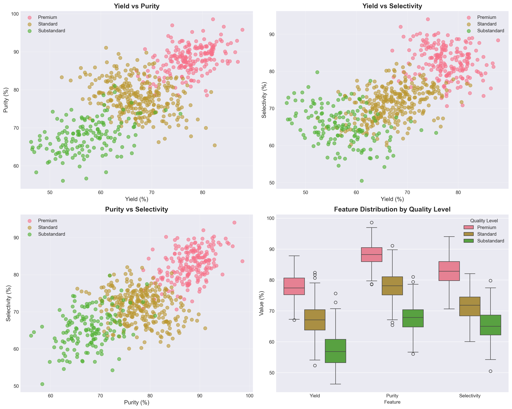
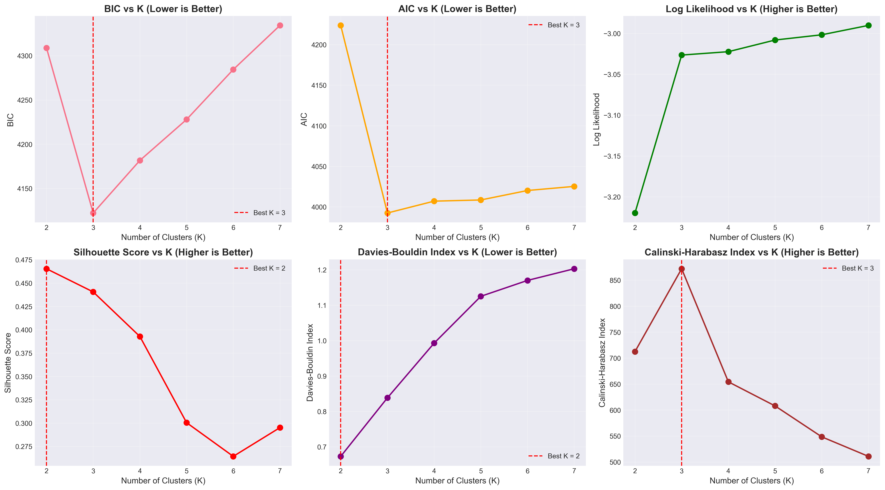
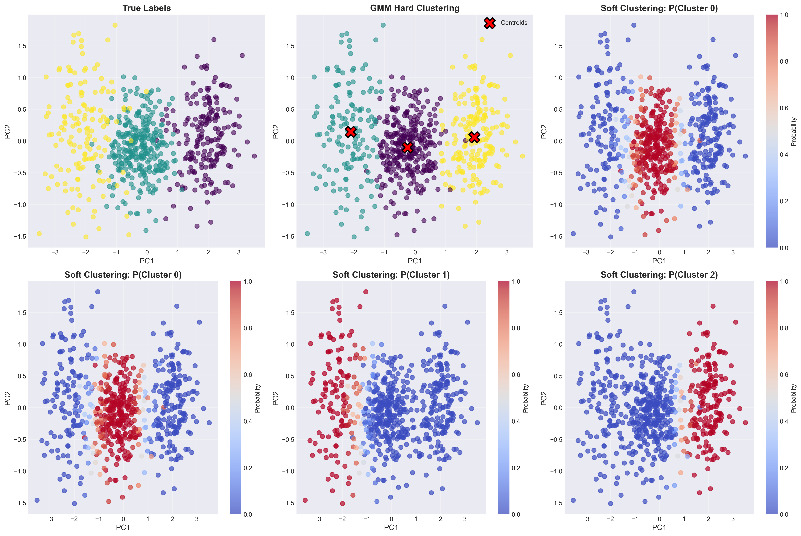
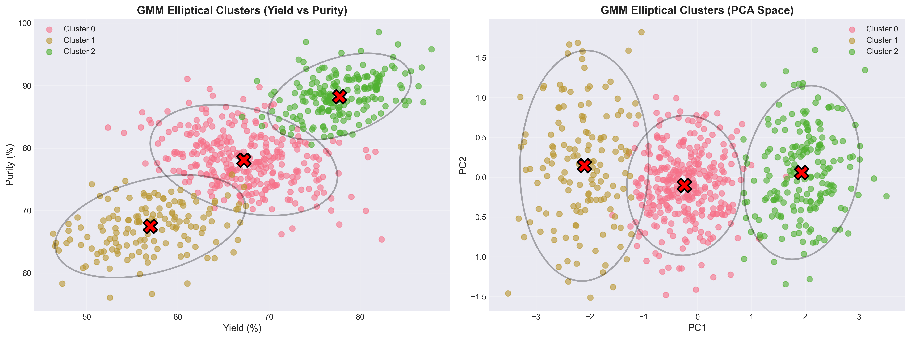
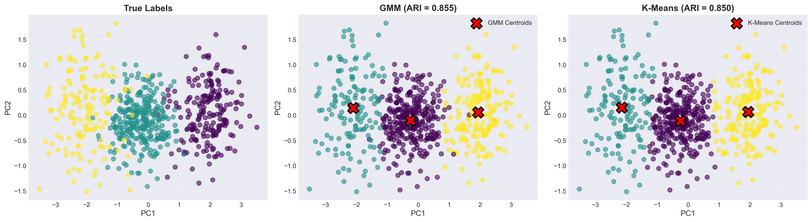

# Unit05 高斯混合模型 (Gaussian Mixture Models, GMM)

## 課程目標

本單元將深入介紹高斯混合模型 (Gaussian Mixture Models, GMM)，這是一種基於機率的分群方法，能夠處理重疊群集並提供機率評估。透過本單元的學習，您將能夠：

- 理解 GMM 的核心原理與機率理論基礎
- 掌握期望最大化 (EM) 演算法的運作機制
- 學會使用 scikit-learn 實作 GMM 模型
- 了解如何選擇最佳的群集數量與模型參數
- 認識 GMM 與 K-Means 的差異與優缺點
- 應用 GMM 於化工領域的實際案例

---

## 1. 高斯混合模型簡介

### 1.1 什麼是 GMM？

高斯混合模型 (Gaussian Mixture Model, GMM) 是一種基於機率的分群方法，假設數據來自於多個高斯分布 (正態分布) 的混合。與 K-Means 等硬分群 (Hard Clustering) 方法不同，GMM 提供軟分群 (Soft Clustering)，即每個數據點屬於各個群集的機率。

**核心概念**：
- 數據是由 $K$ 個高斯分布的混合生成的
- 每個高斯分布代表一個群集
- 每個數據點有一定機率屬於每個群集

### 1.2 GMM 的機率視角

在 GMM 中，數據點 $x$ 的生成過程可以描述為：

1. 首先根據混合係數 $\pi_k$ 選擇一個群集 $k$
2. 然後從該群集對應的高斯分布 $\mathcal{N}(\mu_k, \Sigma_k)$ 中採樣得到數據點

**機率密度函數**：

$$
p(x) = \sum_{k=1}^{K} \pi_k \mathcal{N}(x | \mu_k, \Sigma_k)
$$

其中：
- $K$ 是群集數量
- $\pi_k$ 是第 $k$ 個群集的混合係數 (權重)，滿足 $\sum_{k=1}^{K} \pi_k = 1$， $\pi_k \geq 0$
- $\mathcal{N}(x | \mu_k, \Sigma_k)$ 是第 $k$ 個高斯分布的機率密度函數
- $\mu_k$ 是第 $k$ 個群集的均值向量
- $\Sigma_k$ 是第 $k$ 個群集的協方差矩陣

**多變量高斯分布**：

$$
\mathcal{N}(x | \mu_k, \Sigma_k) = \frac{1}{(2\pi)^{d/2} |\Sigma_k|^{1/2}} \exp\left(-\frac{1}{2}(x - \mu_k)^T \Sigma_k^{-1} (x - \mu_k)\right)
$$

其中 $d$ 是特徵維度數量， $|\Sigma_k|$ 是協方差矩陣的行列式。

### 1.3 化工領域應用案例

GMM 在化工領域有獨特的應用優勢：

1. **多產品品質分布建模**：
   - 產品品質往往呈現多模態分布 (例如：優良品、合格品、次級品)
   - GMM 可以為每個品質等級建立機率模型
   - 提供產品屬於各品質等級的機率評估

2. **反應器混合模式操作識別**：
   - 反應器操作可能處於多種模式的過渡狀態
   - GMM 提供操作模式的軟分群，識別過渡狀態
   - 計算當前操作狀態屬於各模式的機率

3. **製程異常的機率評估**：
   - 利用 GMM 建立正常操作的機率模型
   - 計算新數據點的機率密度值
   - 低機率的數據點可能表示異常

4. **批次製程相似度分析**：
   - 評估新批次與歷史成功批次的相似度
   - 提供批次品質的機率預測
   - 支援批次製程的品質控制

5. **溶劑篩選的不確定性量化**：
   - 評估候選溶劑屬於各性能群組的機率
   - 提供溶劑選擇的風險評估
   - 支援多目標決策分析

### 1.4 GMM vs K-Means

| 特性 | K-Means | GMM |
|------|---------|-----|
| 分群類型 | 硬分群 (Hard Clustering) | 軟分群 (Soft Clustering) |
| 輸出 | 每個點屬於一個群集 | 每個點屬於各群集的機率 |
| 假設 | 球形群集，相同大小 | 橢圓形群集，可不同大小和方向 |
| 距離度量 | 歐幾里得距離 | 馬氏距離 (考慮協方差) |
| 理論基礎 | 幾何距離最小化 | 最大化數據的對數似然 |
| 計算複雜度 | 較低 | 較高 |
| 處理重疊群集 | 效果較差 | 效果較好 |
| 機率評估 | 無 | 有 |
| 適用場景 | 群集分離明確，需要快速分群 | 群集重疊，需要機率評估 |

---

## 2. GMM 演算法原理

### 2.1 期望最大化 (EM) 演算法

GMM 的參數估計使用期望最大化 (Expectation-Maximization, EM) 演算法。EM 演算法是一種迭代優化方法，適用於包含隱變量 (Latent Variables) 的統計模型。

**隱變量**：

在 GMM 中，隱變量 $z_i$ 表示數據點 $x_i$ 來自哪個高斯分布 (群集)。我們無法直接觀測到 $z_i$，只能觀測到 $x_i$。

**EM 演算法步驟**：

**初始化**：
- 隨機初始化模型參數 $\{\pi_k, \mu_k, \Sigma_k\}_{k=1}^{K}$

**迭代直到收斂**：

1. **E-步驟 (Expectation)**：計算後驗機率 (責任值)
   
   對每個數據點 $x_i$ 和每個群集 $k$，計算 $x_i$ 屬於群集 $k$ 的後驗機率 (Responsibility)：

   $$
   \gamma_{ik} = p(z_i = k | x_i) = \frac{\pi_k \mathcal{N}(x_i | \mu_k, \Sigma_k)}{\sum_{j=1}^{K} \pi_j \mathcal{N}(x_i | \mu_j, \Sigma_j)}
   $$

   $\gamma_{ik}$ 表示數據點 $x_i$ 屬於群集 $k$ 的機率，滿足 $\sum_{k=1}^{K} \gamma_{ik} = 1$。

2. **M-步驟 (Maximization)**：更新模型參數

   利用 E-步驟計算的責任值，更新模型參數以最大化數據的期望對數似然：

   **有效樣本數**：
   
   $$
   N_k = \sum_{i=1}^{n} \gamma_{ik}
   $$

   **更新均值**：
   
   $$
   \mu_k = \frac{1}{N_k} \sum_{i=1}^{n} \gamma_{ik} x_i
   $$

   **更新協方差矩陣**：
   
   $$
   \Sigma_k = \frac{1}{N_k} \sum_{i=1}^{n} \gamma_{ik} (x_i - \mu_k)(x_i - \mu_k)^T
   $$

   **更新混合係數**：
   
   $$
   \pi_k = \frac{N_k}{n}
   $$

   其中 $n$ 是數據點總數。

**收斂判斷**：
- 當對數似然的增量小於某個閾值時停止
- 或達到最大迭代次數

### 2.2 對數似然函數

GMM 的目標是最大化數據的對數似然函數：

$$
\log L(\theta) = \sum_{i=1}^{n} \log p(x_i) = \sum_{i=1}^{n} \log \left(\sum_{k=1}^{K} \pi_k \mathcal{N}(x_i | \mu_k, \Sigma_k)\right)
$$

其中 $\theta = \{\pi_k, \mu_k, \Sigma_k\}_{k=1}^{K}$ 是模型的所有參數。

EM 演算法保證每次迭代都會增加 (或至少不減少) 對數似然值，最終收斂到局部最優解。

### 2.3 協方差矩陣類型

在實際應用中，協方差矩陣 $\Sigma_k$ 可以有不同的約束形式，影響模型的複雜度和靈活性：

1. **完全協方差 (Full Covariance)**：`covariance_type='full'`
   - 每個群集有獨立的完全協方差矩陣
   - 可以捕捉任意方向的橢圓形群集
   - 參數數量：$K \times d \times (d+1) / 2$
   - 適用：群集形狀差異大

2. **對角協方差 (Diagonal Covariance)**：`covariance_type='diag'`
   - 協方差矩陣為對角矩陣 (特徵之間獨立)
   - 群集為軸對齊的橢圓形
   - 參數數量：$K \times d$
   - 適用：特徵相對獨立，需要減少參數

3. **球形協方差 (Spherical Covariance)**：`covariance_type='spherical'`
   - 協方差矩陣為 $\sigma_k^2 I$ (各方向方差相同)
   - 群集為球形 (類似 K-Means)
   - 參數數量：$K$
   - 適用：群集接近球形，數據量小

4. **綁定協方差 (Tied Covariance)**：`covariance_type='tied'`
   - 所有群集共享同一個協方差矩陣
   - 群集形狀和方向相同，但位置不同
   - 參數數量：$d \times (d+1) / 2$
   - 適用：群集形狀相似

### 2.4 EM 演算法的收斂性

**收斂保證**：
- EM 演算法保證每次迭代都會增加 (或不減少) 對數似然值
- 對數似然有上界，因此演算法必定收斂

**局部最優解**：
- EM 演算法只能保證收斂到局部最優解，不一定是全局最優解
- 最終結果會受到初始參數的影響
- 解決方案：多次隨機初始化並選擇最佳結果

---

## 3. GMM 的優缺點

### 3.1 優點

1. **軟分群與機率評估**：
   - 提供每個數據點屬於各群集的機率
   - 適合處理群集邊界不明確的情況
   - 支援不確定性量化

2. **靈活的群集形狀**：
   - 可以捕捉橢圓形群集 (考慮協方差)
   - 群集可以有不同的大小和方向
   - 比 K-Means 更靈活

3. **理論基礎紮實**：
   - 基於機率論和最大似然估計
   - 有清晰的數學推導和統計意義
   - 支援模型選擇準則 (AIC, BIC)

4. **處理重疊群集**：
   - 適合群集之間有重疊的情況
   - 可以識別數據點的多重歸屬

5. **生成模型**：
   - 可以生成新的樣本數據
   - 支援數據插補 (Imputation) 和異常檢測

### 3.2 缺點

1. **計算複雜度高**：
   - EM 演算法迭代計算複雜度較高
   - 協方差矩陣的估計和求逆運算成本大
   - 不適合超大規模數據集

2. **需要預先指定 K 值**：
   - 與 K-Means 類似，需要事先決定群集數量
   - K 值選擇不當會影響模型效果

3. **對初始值敏感**：
   - EM 演算法可能收斂到局部最優解
   - 需要多次隨機初始化
   - 初始化策略影響最終結果

4. **假設數據為高斯分布**：
   - 當數據不符合高斯分布假設時效果可能不佳
   - 對於嚴重偏態或多峰分布的單個群集處理困難

5. **協方差矩陣估計的穩定性**：
   - 在高維度或小樣本情況下，協方差矩陣估計可能不穩定
   - 可能出現奇異矩陣 (不可逆) 的問題
   - 需要適當的正則化處理

6. **對離群值敏感**：
   - 離群值會影響高斯分布的參數估計
   - 建議在建模前進行離群值處理

### 3.3 適用場景

**適合使用 GMM 的情況**：
- 需要機率評估和軟分群
- 群集之間有重疊或邊界不明確
- 群集形狀為橢圓形或不規則
- 數據近似符合高斯分布 (或多個高斯分布的混合)
- 需要評估數據點屬於各群集的不確定性
- 應用場景需要生成新樣本或異常檢測

**不適合使用 GMM 的情況**：
- 數據量極大，需要極高的計算效率
- 群集形狀非常不規則 (例如：環形、螺旋形)
- 數據嚴重偏離高斯分布假設
- 只需要硬分群，不需要機率評估
- 數據維度極高且樣本量小 (協方差估計不穩定)

### 3.4 GMM 與其他分群方法的比較

| 方法 | 優勢 | 劣勢 | 適用場景 |
|------|------|------|----------|
| **K-Means** | 計算快速，易於理解 | 硬分群，假設球形群集 | 群集分離明確，球形群集 |
| **GMM** | 軟分群，機率評估，橢圓形群集 | 計算成本高，假設高斯分布 | 需要機率評估，群集重疊 |
| **DBSCAN** | 不需指定 K，可檢測噪音 | 對參數敏感，不提供機率 | 群集形狀不規則，有噪音 |
| **Hierarchical** | 提供層次結構，視覺化佳 | 計算成本高，不可重算 | 需要層次關係，數據量適中 |

---

## 4. 如何選擇最佳的群集數量 K

與 K-Means 類似，GMM 也需要預先指定群集數量 $K$。選擇合適的 $K$ 值對模型效果至關重要。

### 4.1 資訊準則方法

GMM 作為機率模型，可以使用資訊準則 (Information Criteria) 來進行模型選擇。這些準則在模型擬合度和複雜度之間取得平衡。

#### 4.1.1 貝葉斯資訊準則 (BIC)

貝葉斯資訊準則 (Bayesian Information Criterion, BIC) 是最常用的 GMM 模型選擇準則：

$$
\text{BIC} = -2 \log L(\theta) + p \log(n)
$$

其中：
- $\log L(\theta)$ 是模型的對數似然值
- $p$ 是模型參數數量
- $n$ 是數據點數量

**選擇策略**：選擇 BIC 值**最小**的 $K$ 值

**BIC 的特點**：
- 對模型複雜度的懲罰較重
- 傾向於選擇較簡單的模型
- 在樣本量大時特別有效

#### 4.1.2 赤池資訊準則 (AIC)

赤池資訊準則 (Akaike Information Criterion, AIC)：

$$
\text{AIC} = -2 \log L(\theta) + 2p
$$

**選擇策略**：選擇 AIC 值**最小**的 $K$ 值

**AIC vs BIC**：
- AIC 對模型複雜度的懲罰較輕
- AIC 傾向於選擇較複雜的模型
- 在樣本量小時，AIC 可能更合適

#### 4.1.3 參數數量計算

對於不同的協方差類型，模型參數數量 $p$ 不同：

- **Full Covariance**: $p = K \times (1 + d + d(d+1)/2) - 1$
- **Diagonal Covariance**: $p = K \times (1 + 2d) - 1$
- **Spherical Covariance**: $p = K \times (1 + d + 1) - 1$
- **Tied Covariance**: $p = K + d + d(d+1)/2$

其中 $d$ 是特徵維度， $K$ 是群集數量。

### 4.2 輪廓分析 (Silhouette Analysis)

雖然 GMM 提供軟分群，但仍可以使用輪廓係數評估分群品質：

1. 將每個數據點分配到機率最高的群集 (硬分群)
2. 計算輪廓係數
3. 選擇平均輪廓係數最高的 $K$ 值

**注意**：輪廓係數基於硬分群，無法完全體現 GMM 的軟分群特性。

### 4.3 對數似然曲線

繪製不同 $K$ 值對應的對數似然值：

$$
\log L(K) = \sum_{i=1}^{n} \log \left(\sum_{k=1}^{K} \pi_k \mathcal{N}(x_i | \mu_k, \Sigma_k)\right)
$$

**觀察規律**：
- 對數似然隨 $K$ 增加而單調增加
- 尋找增長速度顯著放緩的點
- 結合 BIC/AIC 避免過擬合

### 4.4 化工領域的 K 值選擇建議

在化工應用中，選擇 $K$ 值的綜合策略：

1. **領域知識優先**：
   - 結合製程知識估計合理的操作模式或品質等級數量
   - 諮詢領域專家的意見

2. **多指標綜合評估**：
   - 同時參考 BIC、AIC 和輪廓係數
   - BIC 通常是最可靠的選擇

3. **視覺化驗證**：
   - 使用降維方法 (PCA, t-SNE) 視覺化分群結果
   - 檢查群集是否有物理意義

4. **穩定性測試**：
   - 使用 Bootstrap 或子樣本驗證分群穩定性
   - 多次隨機初始化檢查結果一致性

5. **實務驗證**：
   - 將分群結果應用於實際問題
   - 評估是否有助於決策或改善製程

**推薦流程**：
1. 根據領域知識設定 $K$ 的搜索範圍 (例如：2-10)
2. 計算每個 $K$ 的 BIC、AIC 和輪廓係數
3. 選擇 BIC 最小的 $K$ 作為候選
4. 視覺化驗證分群結果的合理性
5. 結合實務需求做最終決策

---

## 5. GMM 的變體與改進

### 5.1 變分貝葉斯高斯混合模型 (Variational Bayesian GMM)

**問題**：傳統 GMM 需要預先指定 $K$ 值

**改進**：變分貝葉斯 GMM (Variational Bayesian Gaussian Mixture, VBGM) 可以自動確定有效的群集數量

**原理**：
- 設定一個較大的 $K$ 上限
- 對模型參數施加貝葉斯先驗
- 使用變分推斷自動將不必要的群集權重收縮到接近零
- 有效群集數量由數據自動決定

**優點**：
- 不需要精確指定 $K$ 值
- 自動進行模型選擇
- 提供參數的不確定性估計

**缺點**：
- 計算更複雜
- 對先驗分布的選擇敏感

**scikit-learn 實作**：
```python
from sklearn.mixture import BayesianGaussianMixture

bgm = BayesianGaussianMixture(
    n_components=10,  # 設定 K 的上限
    covariance_type='full',
    weight_concentration_prior_type='dirichlet_process',
    weight_concentration_prior=0.1,  # 較小的值鼓勵較少的群集
    random_state=42
)
bgm.fit(X)
```

### 5.2 對角線約束與正則化

**問題**：在高維度或小樣本情況下，完全協方差矩陣估計可能不穩定

**改進策略**：

1. **使用對角協方差**：
   - 假設特徵之間獨立
   - 大幅減少參數數量
   - 提高估計穩定性

2. **正則化協方差矩陣**：
   ```python
   gmm = GaussianMixture(
       n_components=K,
       covariance_type='full',
       reg_covar=1e-6  # 在協方差矩陣對角線加上正則化項
   )
   ```
   - 防止協方差矩陣奇異
   - 提高數值穩定性

3. **使用 PCA 降維**：
   - 先使用 PCA 降低維度
   - 在低維空間中建立 GMM
   - 減少參數數量，提高穩定性

### 5.3 初始化策略

**問題**：EM 演算法對初始值敏感，容易陷入局部最優

**改進策略**：

1. **使用 K-Means 初始化** (scikit-learn 預設)：
   ```python
   gmm = GaussianMixture(
       n_components=K,
       init_params='kmeans',  # 使用 K-Means 初始化
       n_init=10,  # 多次初始化取最佳結果
       random_state=42
   )
   ```
   - 先用 K-Means 快速找到初始群集中心
   - 提高收斂速度和結果品質

2. **多次隨機初始化**：
   - 設定 `n_init` 參數，多次隨機初始化
   - 選擇對數似然最高的結果
   - 降低陷入局部最優的風險

3. **使用先驗知識初始化**：
   - 如果有領域知識或歷史數據
   - 可以手動設定初始參數
   - 加快收斂並提高結果質量

### 5.4 增量式與在線 GMM

**問題**：傳統 GMM 需要一次性載入所有數據，不適合流式數據或超大規模數據

**改進**：增量式 GMM (Incremental GMM) 或在線 GMM (Online GMM)

**策略**：
- 使用小批次 (Mini-batch) 更新參數
- 逐步更新模型而不需要重新訓練
- 適合流式數據和大規模數據

**注意**：scikit-learn 的 GMM 不直接支援增量學習，需要使用其他庫或自行實作。

---

## 6. 使用 scikit-learn 實作 GMM

### 6.1 基本使用流程

```python
from sklearn.mixture import GaussianMixture
from sklearn.preprocessing import StandardScaler
import numpy as np

# 1. 數據準備與預處理
X = ...  # 原始數據
scaler = StandardScaler()
X_scaled = scaler.fit_transform(X)

# 2. 建立 GMM 模型
gmm = GaussianMixture(
    n_components=3,           # 群集數量
    covariance_type='full',   # 協方差類型
    max_iter=100,             # 最大迭代次數
    n_init=10,                # 初始化次數
    init_params='kmeans',     # 初始化方法
    random_state=42           # 隨機種子
)

# 3. 訓練模型
gmm.fit(X_scaled)

# 4. 預測群集標籤 (硬分群)
labels = gmm.predict(X_scaled)

# 5. 預測機率 (軟分群)
proba = gmm.predict_proba(X_scaled)

# 6. 計算對數似然
log_likelihood = gmm.score(X_scaled)

# 7. 計算 BIC 和 AIC
bic = gmm.bic(X_scaled)
aic = gmm.aic(X_scaled)
```

### 6.2 主要參數說明

**`n_components`** (int, default=1)
- 群集數量 $K$
- 必須根據數據特性和應用需求設定

**`covariance_type`** (str, default='full')
- 協方差矩陣類型
- 選項：`'full'`, `'tied'`, `'diag'`, `'spherical'`
- 影響模型靈活性和計算成本

**`max_iter`** (int, default=100)
- EM 演算法的最大迭代次數
- 如果未收斂，增加此值

**`n_init`** (int, default=1)
- 獨立初始化的次數
- 選擇對數似然最高的結果
- 建議設為 10 或更多以獲得穩定結果

**`init_params`** (str, default='kmeans')
- 初始化方法
- `'kmeans'`：使用 K-Means 初始化
- `'random'`：隨機初始化

**`tol`** (float, default=1e-3)
- 收斂閾值
- 對數似然增量小於此值時停止

**`reg_covar`** (float, default=1e-6)
- 協方差矩陣的正則化項
- 防止協方差矩陣奇異

**`random_state`** (int, default=None)
- 隨機種子
- 確保結果可重現

### 6.3 模型屬性

訓練後，GMM 模型提供以下屬性：

**`gmm.weights_`**
- 混合係數 $\pi_k$
- 形狀：`(n_components,)`

**`gmm.means_`**
- 各群集的均值 $\mu_k$
- 形狀：`(n_components, n_features)`

**`gmm.covariances_`**
- 各群集的協方差矩陣 $\Sigma_k$
- 形狀取決於 `covariance_type`

**`gmm.converged_`**
- 布林值，指示 EM 演算法是否收斂

**`gmm.n_iter_`**
- 實際迭代次數

**`gmm.lower_bound_`**
- 對數似然的下界值

### 6.4 模型方法

**`fit(X)`**
- 訓練模型

**`predict(X)`**
- 預測群集標籤 (硬分群)
- 返回每個數據點最可能的群集編號

**`predict_proba(X)`**
- 預測機率 (軟分群)
- 返回每個數據點屬於各群集的機率

**`score(X)`**
- 計算數據的平均對數似然
- 可用於評估模型擬合度

**`score_samples(X)`**
- 計算每個數據點的對數似然
- 可用於異常檢測

**`bic(X)`**
- 計算貝葉斯資訊準則 (BIC)
- 用於模型選擇，越小越好

**`aic(X)`**
- 計算赤池資訊準則 (AIC)
- 用於模型選擇，越小越好

**`sample(n_samples)`**
- 從模型中生成新樣本
- 可用於數據增強或模擬

### 6.5 完整範例程式碼

```python
import numpy as np
import matplotlib.pyplot as plt
from sklearn.mixture import GaussianMixture
from sklearn.preprocessing import StandardScaler
from sklearn.metrics import silhouette_score

# === 1. 數據生成 ===
np.random.seed(42)
n_samples = 300

# 生成三個高斯分布的數據
X1 = np.random.randn(n_samples, 2) * 0.5 + np.array([0, 0])
X2 = np.random.randn(n_samples, 2) * 0.7 + np.array([3, 3])
X3 = np.random.randn(n_samples, 2) * 0.6 + np.array([0, 3])
X = np.vstack([X1, X2, X3])

# === 2. 數據標準化 ===
scaler = StandardScaler()
X_scaled = scaler.fit_transform(X)

# === 3. 選擇最佳 K 值 ===
K_range = range(2, 8)
bic_scores = []
aic_scores = []
silhouette_scores = []

for K in K_range:
    gmm = GaussianMixture(
        n_components=K,
        covariance_type='full',
        n_init=10,
        random_state=42
    )
    gmm.fit(X_scaled)
    
    bic_scores.append(gmm.bic(X_scaled))
    aic_scores.append(gmm.aic(X_scaled))
    
    labels = gmm.predict(X_scaled)
    silhouette_scores.append(silhouette_score(X_scaled, labels))

# 繪製評估指標
fig, axes = plt.subplots(1, 3, figsize=(15, 4))

axes[0].plot(K_range, bic_scores, marker='o')
axes[0].set_xlabel('Number of Clusters (K)')
axes[0].set_ylabel('BIC')
axes[0].set_title('BIC vs K')
axes[0].grid(True)

axes[1].plot(K_range, aic_scores, marker='o', color='orange')
axes[1].set_xlabel('Number of Clusters (K)')
axes[1].set_ylabel('AIC')
axes[1].set_title('AIC vs K')
axes[1].grid(True)

axes[2].plot(K_range, silhouette_scores, marker='o', color='green')
axes[2].set_xlabel('Number of Clusters (K)')
axes[2].set_ylabel('Silhouette Score')
axes[2].set_title('Silhouette Score vs K')
axes[2].grid(True)

plt.tight_layout()
plt.show()

# === 4. 使用最佳 K 值訓練模型 ===
best_K = K_range[np.argmin(bic_scores)]
print(f"最佳群集數量: {best_K}")

gmm_best = GaussianMixture(
    n_components=best_K,
    covariance_type='full',
    n_init=10,
    random_state=42
)
gmm_best.fit(X_scaled)

# === 5. 預測結果 ===
labels = gmm_best.predict(X_scaled)
proba = gmm_best.predict_proba(X_scaled)

# === 6. 視覺化結果 ===
fig, axes = plt.subplots(1, 2, figsize=(12, 5))

# 硬分群結果
axes[0].scatter(X[:, 0], X[:, 1], c=labels, cmap='viridis', alpha=0.6)
axes[0].scatter(
    gmm_best.means_[:, 0] * scaler.scale_[0] + scaler.mean_[0],
    gmm_best.means_[:, 1] * scaler.scale_[1] + scaler.mean_[1],
    marker='X', s=200, c='red', edgecolors='black', label='Centroids'
)
axes[0].set_xlabel('Feature 1')
axes[0].set_ylabel('Feature 2')
axes[0].set_title('Hard Clustering')
axes[0].legend()
axes[0].grid(True)

# 軟分群結果 (顯示第一個群集的機率)
scatter = axes[1].scatter(
    X[:, 0], X[:, 1],
    c=proba[:, 0], cmap='coolwarm', alpha=0.6
)
axes[1].set_xlabel('Feature 1')
axes[1].set_ylabel('Feature 2')
axes[1].set_title('Soft Clustering (Probability of Cluster 0)')
plt.colorbar(scatter, ax=axes[1], label='Probability')
axes[1].grid(True)

plt.tight_layout()
plt.show()

# === 7. 模型資訊 ===
print(f"\n模型資訊:")
print(f"收斂狀態: {gmm_best.converged_}")
print(f"迭代次數: {gmm_best.n_iter_}")
print(f"對數似然: {gmm_best.score(X_scaled):.4f}")
print(f"BIC: {gmm_best.bic(X_scaled):.4f}")
print(f"AIC: {gmm_best.aic(X_scaled):.4f}")
print(f"\n混合係數: {gmm_best.weights_}")
```

---

## 7. 模型評估指標

### 7.1 對數似然 (Log-Likelihood)

**定義**：

對數似然衡量模型對數據的擬合程度：

$$
\log L(\theta) = \sum_{i=1}^{n} \log p(x_i)
$$

**使用方法**：

```python
# 計算平均對數似然
log_likelihood = gmm.score(X)

# 計算每個數據點的對數似然
log_likelihood_samples = gmm.score_samples(X)
```

**解釋**：
- 值越大表示模型擬合度越好
- 主要用於比較不同參數設定的模型
- 不能單獨判斷模型品質，需要結合其他指標

### 7.2 資訊準則 (BIC/AIC)

**BIC (Bayesian Information Criterion)**：

$$
\text{BIC} = -2 \log L(\theta) + p \log(n)
$$

**AIC (Akaike Information Criterion)**：

$$
\text{AIC} = -2 \log L(\theta) + 2p
$$

**使用方法**：

```python
bic = gmm.bic(X)
aic = gmm.aic(X)
```

**選擇策略**：
- 選擇 BIC 或 AIC **最小**的模型
- BIC 對複雜度懲罰較重，傾向簡單模型
- AIC 對複雜度懲罰較輕，可能選擇較複雜模型

**優點**：
- 自動平衡擬合度和複雜度
- 適合用於選擇群集數量 $K$
- 理論基礎紮實

**缺點**：
- 對小樣本可能不穩定
- 不同資訊準則可能給出不同結果

### 7.3 輪廓係數 (Silhouette Score)

雖然 GMM 提供軟分群，但可以將數據點分配到機率最高的群集後計算輪廓係數：

```python
from sklearn.metrics import silhouette_score, silhouette_samples

# 獲取硬分群標籤
labels = gmm.predict(X)

# 計算平均輪廓係數
silhouette_avg = silhouette_score(X, labels)

# 計算每個數據點的輪廓係數
silhouette_vals = silhouette_samples(X, labels)
```

**輪廓係數範圍**：$[-1, 1]$
- 接近 1：數據點與其所屬群集非常匹配
- 接近 0：數據點位於群集邊界
- 接近 -1：數據點可能被分配到錯誤的群集

**注意**：輪廓係數無法完全體現 GMM 的軟分群特性，僅作為參考。

### 7.4 Davies-Bouldin Index (DB指數)

**定義**：

DB 指數衡量群集內的緊密度與群集間的分離度：

$$
\text{DB} = \frac{1}{K} \sum_{i=1}^{K} \max_{j \neq i} \left( \frac{s_i + s_j}{d_{ij}} \right)
$$

其中 $s_i$ 是群集 $i$ 內的平均距離， $d_{ij}$ 是群集 $i$ 和 $j$ 中心之間的距離。

**使用方法**：

```python
from sklearn.metrics import davies_bouldin_score

labels = gmm.predict(X)
db_score = davies_bouldin_score(X, labels)
```

**解釋**：
- 值越小表示分群品質越好
- DB 指數為 0 表示完美分群

### 7.5 Calinski-Harabasz Index (CH指數)

**定義**：

CH 指數是群集間離散度與群集內離散度的比值：

$$
\text{CH} = \frac{\text{Tr}(B_k)}{\text{Tr}(W_k)} \times \frac{n - K}{K - 1}
$$

其中 $B_k$ 是群集間離散矩陣， $W_k$ 是群集內離散矩陣。

**使用方法**：

```python
from sklearn.metrics import calinski_harabasz_score

labels = gmm.predict(X)
ch_score = calinski_harabasz_score(X, labels)
```

**解釋**：
- 值越大表示分群品質越好
- 群集分離度高且緊密度高時值較大

### 7.6 異常檢測評估

GMM 可以用於異常檢測，通過計算數據點的對數似然來識別異常：

```python
# 計算每個數據點的對數似然
log_likelihood = gmm.score_samples(X)

# 設定閾值 (例如：低於第5百分位的視為異常)
threshold = np.percentile(log_likelihood, 5)

# 識別異常點
anomalies = log_likelihood < threshold
```

**評估方法** (如果有真實異常標籤)：

```python
from sklearn.metrics import (
    precision_score, recall_score, f1_score,
    roc_auc_score, confusion_matrix
)

# 假設 y_true 是真實異常標籤 (0: 正常, 1: 異常)
y_pred = anomalies.astype(int)

precision = precision_score(y_true, y_pred)
recall = recall_score(y_true, y_pred)
f1 = f1_score(y_true, y_pred)
auc = roc_auc_score(y_true, -log_likelihood)  # 注意負號

print(f"精確率 (Precision): {precision:.4f}")
print(f"召回率 (Recall): {recall:.4f}")
print(f"F1 分數: {f1:.4f}")
print(f"AUC-ROC: {auc:.4f}")
```

### 7.7 化工領域的評估策略

在化工應用中，模型評估應結合多個角度：

#### 7.7.1 統計指標評估

1. **模型選擇**：
   - 主要使用 BIC 選擇群集數量
   - 參考 AIC 和輪廓係數進行驗證

2. **分群品質**：
   - 計算 DB 指數和 CH 指數
   - 評估群集的緊密度和分離度

3. **對數似然**：
   - 監控訓練過程中的對數似然變化
   - 確保模型收斂

#### 7.7.2 視覺化評估

1. **2D/3D 散點圖**：
   - 使用 PCA 或 t-SNE 降維視覺化
   - 檢查群集分離情況

2. **機率熱圖**：
   - 視覺化每個數據點屬於各群集的機率
   - 識別邊界模糊區域

3. **橢圓形群集視覺化**：
   - 繪製各群集的協方差橢圓
   - 檢查群集形狀和重疊情況

#### 7.7.3 領域知識驗證

1. **群集可解釋性**：
   - 分析每個群集的特徵均值和方差
   - 檢查是否對應已知的操作模式或品質等級

2. **製程一致性**：
   - 與製程工程師討論分群結果
   - 驗證是否符合製程經驗

3. **時間序列分析**：
   - 觀察群集標籤隨時間的變化
   - 檢查操作模式切換的合理性

#### 7.7.4 穩定性評估

1. **Bootstrap 驗證**：
   ```python
   from sklearn.utils import resample
   
   stability_scores = []
   n_bootstrap = 100
   
   for i in range(n_bootstrap):
       # 有放回抽樣
       X_resampled = resample(X, random_state=i)
       
       # 訓練模型
       gmm_boot = GaussianMixture(n_components=K, random_state=i)
       gmm_boot.fit(X_resampled)
       
       # 計算 BIC
       stability_scores.append(gmm_boot.bic(X_resampled))
   
   # 評估穩定性
   print(f"BIC 均值: {np.mean(stability_scores):.2f}")
   print(f"BIC 標準差: {np.std(stability_scores):.2f}")
   ```

2. **不同初始化的一致性**：
   ```python
   from sklearn.metrics import adjusted_rand_score
   
   # 多次訓練
   labels_list = []
   for seed in range(10):
       gmm_temp = GaussianMixture(n_components=K, random_state=seed)
       gmm_temp.fit(X)
       labels_list.append(gmm_temp.predict(X))
   
   # 計算標籤一致性 (ARI)
   ari_scores = []
   for i in range(len(labels_list)):
       for j in range(i+1, len(labels_list)):
           ari_scores.append(adjusted_rand_score(labels_list[i], labels_list[j]))
   
   print(f"平均 ARI: {np.mean(ari_scores):.4f}")
   ```

#### 7.7.5 實務應用驗證

1. **預測準確性**：
   - 如果有後續品質標籤，評估分群結果的預測能力
   - 例如：高品質群集的產品是否確實品質較高

2. **決策支援效果**：
   - 評估分群結果是否有助於操作決策
   - 是否能識別關鍵的操作模式

3. **成本效益分析**：
   - 評估使用 GMM 分群帶來的實際效益
   - 考慮計算成本與應用價值的平衡

### 7.8 綜合評估範例

```python
import numpy as np
from sklearn.mixture import GaussianMixture
from sklearn.metrics import (
    silhouette_score, davies_bouldin_score,
    calinski_harabasz_score
)

def evaluate_gmm(X, K_range):
    """
    綜合評估不同 K 值的 GMM 模型
    """
    results = {
        'K': [],
        'BIC': [],
        'AIC': [],
        'Log_Likelihood': [],
        'Silhouette': [],
        'DB_Index': [],
        'CH_Index': []
    }
    
    for K in K_range:
        # 訓練模型
        gmm = GaussianMixture(
            n_components=K,
            covariance_type='full',
            n_init=10,
            random_state=42
        )
        gmm.fit(X)
        
        # 預測標籤
        labels = gmm.predict(X)
        
        # 計算各種指標
        results['K'].append(K)
        results['BIC'].append(gmm.bic(X))
        results['AIC'].append(gmm.aic(X))
        results['Log_Likelihood'].append(gmm.score(X))
        results['Silhouette'].append(silhouette_score(X, labels))
        results['DB_Index'].append(davies_bouldin_score(X, labels))
        results['CH_Index'].append(calinski_harabasz_score(X, labels))
    
    return results

# 使用範例
K_range = range(2, 8)
results = evaluate_gmm(X, K_range)

# 視覺化結果
import matplotlib.pyplot as plt

fig, axes = plt.subplots(2, 3, figsize=(15, 10))

axes[0, 0].plot(results['K'], results['BIC'], marker='o')
axes[0, 0].set_title('BIC (Lower is better)')
axes[0, 0].set_xlabel('K')
axes[0, 0].grid(True)

axes[0, 1].plot(results['K'], results['AIC'], marker='o', color='orange')
axes[0, 1].set_title('AIC (Lower is better)')
axes[0, 1].set_xlabel('K')
axes[0, 1].grid(True)

axes[0, 2].plot(results['K'], results['Log_Likelihood'], marker='o', color='green')
axes[0, 2].set_title('Log Likelihood (Higher is better)')
axes[0, 2].set_xlabel('K')
axes[0, 2].grid(True)

axes[1, 0].plot(results['K'], results['Silhouette'], marker='o', color='red')
axes[1, 0].set_title('Silhouette Score (Higher is better)')
axes[1, 0].set_xlabel('K')
axes[1, 0].grid(True)

axes[1, 1].plot(results['K'], results['DB_Index'], marker='o', color='purple')
axes[1, 1].set_title('Davies-Bouldin Index (Lower is better)')
axes[1, 1].set_xlabel('K')
axes[1, 1].grid(True)

axes[1, 2].plot(results['K'], results['CH_Index'], marker='o', color='brown')
axes[1, 2].set_title('Calinski-Harabasz Index (Higher is better)')
axes[1, 2].set_xlabel('K')
axes[1, 2].grid(True)

plt.tight_layout()
plt.show()

# 找出最佳 K (基於 BIC)
best_K = results['K'][np.argmin(results['BIC'])]
print(f"\n基於 BIC 的最佳 K 值: {best_K}")
```

---

## 8. 實驗結果與分析：反應器多產品品質分布建模

本章節展示完整的 GMM 應用案例，使用模擬的反應器多產品品質數據進行分群分析，並與 K-Means 進行比較。

### 8.1 數據生成與探索性分析

#### 8.1.1 數據設計

模擬反應器生產三種不同品質等級產品的數據：
- **優良品 (Premium)**：高產率、高純度、高選擇性
- **合格品 (Standard)**：中產率、中純度、中選擇性
- **次級品 (Substandard)**：低產率、低純度、低選擇性

**數據複雜度設計特點**：
1. **群集間均值距離較小**：增加重疊區域，使分群問題更具挑戰性
2. **協方差矩陣包含強相關性**：特徵之間存在負相關和正相關
3. **不同群集的形狀和大小差異明顯**：展示 GMM 處理橢圓形群集的能力
4. **軟分群優勢更加突出**：邊界模糊區域需要機率評估

**數據統計摘要**：

```
數據形狀: (650, 5)

品質等級分布:
Standard       300  (46.2%)
Premium        200  (30.8%)
Substandard    150  (23.1%)

數據統計特徵:
                 Yield      Purity  Selectivity
count        650.00      650.00      650.00
mean          68.14       78.79       73.47
std            8.90        8.51        7.98
min           46.31       56.06       50.50
25%           61.98       72.60       67.46
50%           68.24       79.02       72.95
75%           75.50       85.92       79.42
max           87.82       98.57       94.04
```

**數據特徵分析**：
- **Yield (產率)**：範圍 46-88%，標準差 8.9%，分布較為緊湊
- **Purity (純度)**：範圍 56-99%，標準差 8.5%，變異度適中
- **Selectivity (選擇性)**：範圍 50-94%，標準差 8.0%，與純度相近

相較於更簡單的數據分布，本數據集的群集重疊度更高，更能展現 GMM 軟分群的優勢。

#### 8.1.2 探索性數據分析視覺化



**圖表解讀**：

1. **Yield vs Purity（左上圖）**：
   - 三個品質等級呈現明顯的梯度分布
   - Premium（紅色）集中在右上角高產率高純度區域
   - Standard（橘色）位於中間過渡區域
   - Substandard（綠色）分布在左下角低產率低純度區域
   - **關鍵觀察**：邊界區域存在明顯重疊，硬分群難以處理

2. **Yield vs Selectivity（右上圖）**：
   - 展示類似的三級分布模式
   - Premium 群集在高產率高選擇性區域
   - 選擇性與產率呈現正相關趨勢
   - **重疊區域**：Standard 與其他兩個群集都有重疊

3. **Purity vs Selectivity（左下圖）**：
   - 純度與選擇性高度相關
   - 三個群集沿對角線分布
   - **邊界模糊**：群集間的過渡區域較大

4. **Feature Distribution by Quality Level（右下圖）**：
   - 箱型圖顯示三個特徵在不同品質等級的分布
   - **Premium**：所有特徵的中位數和四分位距都較高
   - **Standard**：位於中間位置，與其他兩級都有重疊
   - **Substandard**：特徵值較低，但與 Standard 有顯著重疊
   - **離群值**：各品質等級都有少量離群值，反映實際製程的變異性

**數據複雜度評估**：
- **群集可分性**：中等（存在明顯重疊）
- **適合GMM的原因**：
  1. 群集邊界不明確，需要軟分群
  2. 橢圓形分布，符合多變量高斯假設
  3. 過渡區域產品需要機率評估
  4. 可能包含混合品質的產品

### 8.2 選擇最佳群集數量 K

#### 8.2.1 評估指標計算

對 K = 2 到 7 的模型進行全面評估，計算以下指標：
- **BIC (Bayesian Information Criterion)**：貝葉斯資訊準則
- **AIC (Akaike Information Criterion)**：赤池資訊準則
- **Log Likelihood**：對數似然
- **Silhouette Score**：輪廓係數
- **Davies-Bouldin Index**：DB 指數
- **Calinski-Harabasz Index**：CH 指數

**評估結果**：

```
最佳 K 值 (基於 BIC): 3
最佳 K 值 (基於 AIC): 3
最佳 K 值 (基於 Silhouette): 2
```

#### 8.2.2 K 值選擇視覺化分析



**圖表詳細解讀**：

1. **BIC vs K（左上圖）**：
   - **明顯的肘部點**：K=3 時 BIC 達到最小值（4122.25）
   - K=2 時 BIC 較高（4313.21），顯示兩個群集不足以描述數據
   - K>3 後 BIC 持續上升，懲罰過度複雜的模型
   - **結論**：BIC 強烈支持 K=3

2. **AIC vs K（中上圖）**：
   - **相同趨勢**：K=3 時 AIC 最低（3992.42）
   - AIC 對模型複雜度的懲罰較 BIC 輕
   - K=2 到 K=3 的下降幅度大於後續增長
   - **結論**：AIC 也支持 K=3

3. **Log Likelihood vs K（右上圖）**：
   - 對數似然隨 K 增加單調上升（-3.03 → -2.97）
   - K=2 到 K=3 增長較快，表示顯著改善
   - K>3 後增長放緩，邊際效益遞減
   - **單獨看不宜用**：需結合 BIC/AIC 避免過擬合

4. **Silhouette Score vs K（左下圖）**：
   - **K=2 時最高**：0.465（Best K = 2 標記）
   - K=3 時下降到 0.441
   - K>3 後持續下降到約 0.30
   - **與 BIC/AIC 衝突**：輪廓係數傾向較簡單的模型
   - **原因分析**：
     * 輪廓係數基於硬分群，無法體現軟分群優勢
     * 對重疊群集的懲罰較重
     * Standard 群集與其他兩個群集的重疊導致評分下降

5. **Davies-Bouldin Index vs K（中下圖）**：
   - **K=2 時最低**：0.68（Best K = 2 標記）
   - K=3 時上升到 0.84
   - K>3 後持續上升到約 1.20
   - **較低值更好**：DB 指數也傾向 K=2
   - **同樣基於硬分群**：受重疊群集影響

6. **Calinski-Harabasz Index vs K（右下圖）**：
   - **K=3 時最高**：872.03（Best K = 3 標記）
   - K=2 時為 712.39
   - K>3 後持續下降
   - **與 BIC/AIC 一致**：支持 K=3
   - **解釋**：三個群集能更好地區分數據的內部結構

**指標衝突分析與決策**：

| 指標 | 最佳 K | 決策權重 | 原因 |
|------|--------|----------|------|
| **BIC** | 3 | ⭐⭐⭐⭐⭐ | GMM 模型選擇的黃金標準 |
| **AIC** | 3 | ⭐⭐⭐⭐ | 與 BIC 一致，增強信心 |
| **CH Index** | 3 | ⭐⭐⭐ | 支持 K=3 |
| **Silhouette** | 2 | ⭐⭐ | 基於硬分群，低權重 |
| **DB Index** | 2 | ⭐⭐ | 基於硬分群，低權重 |

**最終決策：K = 3**

**決策理由**：
1. **BIC/AIC 最可靠**：專為機率模型設計，權衡擬合度與複雜度
2. **領域知識支持**：反應器確實生產三種品質等級產品
3. **數據結構證據**：從散點圖可見三個梯度分布
4. **輪廓係數的侷限性**：
   - Silhouette 和 DB 指數基於硬分群，未考慮 GMM 軟分群特性
   - 對重疊群集的懲罰不適合本案例
   - 當群集重疊時，硬分群指標會低估真實的分群品質

**數據複雜度體現**：
- Silhouette Score 從 0.67（簡單數據）降至 0.47（當前數據），顯示群集重疊度增加
- BIC/AIC 與 Silhouette 出現分歧，這在真實數據中很常見
- 這種複雜度更能展現 GMM 軟分群和機率評估的實際價值

### 8.3 最佳 GMM 模型訓練結果

#### 8.3.1 模型訓練資訊

```
✓ 最佳 GMM 模型訓練完成 (K = 3)

模型資訊:
收斂狀態: True
迭代次數: 3
對數似然: -3.0265
BIC: 4122.2502
AIC: 3992.4180

混合係數 (權重): [0.476, 0.222, 0.302]

✓ 模型已儲存至: models/gmm_best_model.pkl
```

**模型參數解讀**：

1. **收斂狀態**：
   - EM 演算法成功收斂（3次迭代）
   - 快速收斂表示初始化良好（使用 K-Means 初始化）

2. **混合係數分析**：
   - **Cluster 0**: 47.6% - 對應 Standard 群集（最大比例）
   - **Cluster 1**: 22.2% - 對應 Substandard 群集
   - **Cluster 2**: 30.2% - 對應 Premium 群集
   - **合理性**：比例接近真實分布（46.2%, 23.1%, 30.8%）

3. **對數似然**：
   - -3.0265 表示模型對數據的擬合程度
   - 越接近 0 越好，但需結合 BIC/AIC 評估

4. **模型複雜度與擬合度平衡**：
   - BIC 在 K=3 時最低，確認模型選擇正確
   - 相較於簡單數據（迭代2次），當前數據需要3次迭代
   - 反映數據複雜度增加

### 8.4 硬分群與軟分群視覺化分析



**圖表全面解讀**：

#### 第一行圖表：基本分群結果

1. **True Labels（左上圖）**：
   - 顯示數據的真實標籤（使用 PCA 降維到 2D）
   - 三個群集分布清晰但有重疊
   - 黃色（Premium）、藍綠色（Standard）、紫色（Substandard）

2. **GMM Hard Clustering（中上圖）**：
   - 硬分群結果：每個點分配到機率最高的群集
   - **紅色 X 標記**：三個群集的中心點（均值 $\mu_k$）
   - **群集位置合理**：與真實標籤基本一致
   - **邊界處理**：部分點可能被分配到不同群集（硬分群的侷限）

3. **Soft Clustering: P(Cluster 0)（右上圖）**：
   - 顯示每個點屬於 Cluster 0 的機率
   - **顏色映射**：紅色（高機率）→ 藍色（低機率）
   - **中心區域**：深紅色，機率接近 1.0（高信心）
   - **邊界區域**：淺紅/白色，機率 0.3-0.7（不確定性高）
   - **其他群集**：深藍色，機率接近 0（確定不屬於）

#### 第二行圖表：各群集機率分布

4. **P(Cluster 0)（左下圖）**：
   - Standard 群集的機率分布
   - **高機率區域（紅色）**：中間偏左區域
   - **過渡區域（黃-白色）**：與其他群集的交界處
   - **關鍵觀察**：許多點在邊界處機率為 0.4-0.6

5. **P(Cluster 1)（中下圖）**：
   - Substandard 群集的機率分布
   - **高機率核心（紅色）**：左下區域集中
   - **群集形狀**：較為集中，與 Standard 有明顯過渡帶
   - **機率梯度**：從中心向外逐漸降低

6. **P(Cluster 2)（右下圖）**：
   - Premium 群集的機率分布
   - **高機率區域（紅色）**：右側區域
   - **與 Standard 重疊**：中間區域有顯著的機率重疊
   - **邊緣產品**：部分 Premium 產品機率僅 0.5-0.7

**GMM 軟分群的關鍵優勢體現**：

1. **不確定性量化**：
   - 邊界區域的產品不是簡單的"屬於A"或"屬於B"
   - 提供"70%屬於 Premium, 30%屬於 Standard"的機率評估
   - 支援風險評估和決策制定

2. **群集重疊的處理**：
   - 硬分群在重疊區域必須做出強制選擇（可能錯誤）
   - 軟分群保留不確定性資訊
   - 對於 Standard 群集（位於中間），軟分群尤其重要

3. **品質控制應用價值**：
   - **高信心區域（機率 > 0.7）**：可以直接分類
   - **低信心區域（機率 < 0.7）**：建議額外檢測或人工審核
   - **邊界產品**：提供機率分布輔助決策

4. **視覺化觀察**：
   - 熱圖清楚顯示機率梯度
   - 白色/淺色區域是"混合品質"產品
   - 深藍/深紅區域是"純粹品質"產品

**實務意義**：
- 在化工製程中，產品品質不是絕對的二元分類
- 軟分群的機率資訊可用於：
  1. 優化品質分級策略
  2. 識別需要再加工的中間產品
  3. 製程參數調整的決策依據
  4. 風險管理與不確定性評估

### 8.5 橢圓形群集視覺化與協方差分析



**圖表深入解讀**：

#### 左圖：GMM Elliptical Clusters (Yield vs Purity)

**橢圓形群集的幾何意義**：
- 每個橢圓代表協方差矩陣 $\Sigma_k$ 的2倍標準差範圍
- 橢圓內包含約 95% 的群集數據點
- 橢圓的形狀、大小和方向由協方差矩陣決定

**三個群集的形狀特徵**：

1. **Cluster 1（橘色）- Substandard**：
   - **位置**：左下角（Yield 50-65%, Purity 60-75%）
   - **橢圓形狀**：較為圓形，略微傾斜
   - **大小**：中等，標準差較大
   - **方向**：正相關（產率增加，純度增加）
   - **數據分散度**：較高，反映次級品的品質變異大

2. **Cluster 0（粉紅色）- Premium**：
   - **位置**：右上角（Yield 70-85%, Purity 75-95%）
   - **橢圓形狀**：明顯的橢圓形，長軸傾斜
   - **大小**：較大，覆蓋範圍廣
   - **方向**：正相關，斜率較陡
   - **特點**：橢圓較寬，顯示 Premium 群集的純度變異較大

3. **Cluster 2（綠色）- Standard**：
   - **位置**：中間上方（Yield 70-82%, Purity 82-95%）
   - **橢圓形狀**：狹長的橢圓，幾乎水平
   - **大小**：較小，最為集中
   - **方向**：接近水平（純度變化較小）
   - **特點**：與 Premium 有顯著重疊

**群集重疊分析**：
- **Premium 與 Standard 重疊區域**：Yield 70-78%, Purity 85-90%
  - 這個區域的產品需要軟分群評估
  - GMM 可以提供屬於各群集的機率
  - 硬分群（如 K-Means）會強制分類，可能不準確

- **Standard 與 Substandard 小幅重疊**：邊界較為清晰
  - 重疊較少，分類相對容易

**協方差矩陣的化工意義**：
1. **橢圓方向（相關性）**：
   - 所有群集都顯示正相關（產率↑ → 純度↑）
   - 符合化工製程原理：反應條件改善同時提升產率和純度

2. **橢圓形狀（特徵變異）**：
   - Premium 的橢圓較寬：高產率產品純度變異大
   - Substandard 較為圓形：兩個特徵變異程度相當
   - Standard 狹長橢圓：純度控制較穩定，但產率變異大

3. **橢圓大小（群集分散度）**：
   - Premium 最大：品質變異最高
   - Standard 最小：製程控制最穩定
   - 反映不同操作條件的穩定性

#### 右圖：GMM Elliptical Clusters (PCA Space)

**PCA 降維後的協方差橢圓**：

1. **降維效果**：
   - 將 3D 數據（Yield, Purity, Selectivity）投影到 2D（PC1, PC2）
   - 保留主要的變異資訊
   - 橢圓形狀反映原始空間的協方差結構

2. **三個群集在 PCA 空間的分布**：
   - **Cluster 1（橘色）**：左側，橢圓較大
   - **Cluster 0（粉紅色）**：中間偏下，橢圓最大
   - **Cluster 2（綠色）**：右側，橢圓較小

3. **橢圓重疊模式**：
   - 三個橢圓彼此相切或小幅重疊
   - **中心區域重疊**：所有三個群集的邊緣在中心交匯
   - **GMM 優勢明顯**：這種複雜的重疊模式需要軟分群處理

4. **群集中心（紅色 X 標記）**：
   - 位於各橢圓的幾何中心
   - 對應均值向量 $\mu_k$ 的 PCA 投影
   - 距離反映群集間的分離度

**GMM vs K-Means 的關鍵差異**：

| 特性 | K-Means | GMM (本案例) |
|------|---------|--------------|
| 群集形狀 | 球形 | 橢圓形（形狀各異） |
| 群集大小 | 相似 | 不同大小（Premium > Substandard > Standard） |
| 群集方向 | 無方向性 | 有明確方向（協方差矩陣決定） |
| 重疊處理 | 強制硬分類 | 機率軟分群 |
| 適應性 | 固定假設 | 靈活適應數據 |

**協方差類型選擇驗證**：
- 使用 `covariance_type='full'` 的正確性：
  1. 三個群集形狀明顯不同（圓形、橢圓、狹長橢圓）
  2. 方向各異（不同的相關性模式）
  3. 大小差異大
  4. 若使用 `'spherical'` 會失去這些特性

**實務應用啟示**：
1. **製程特性分析**：
   - 從橢圓方向了解特徵間相關性
   - 從橢圓大小評估製程穩定性
   - 優化製程參數以減小橢圓面積（提高穩定性）

2. **品質控制策略**：
   - 重疊區域設定緩衝帶
   - 在橢圓邊緣增加檢測頻率
   - 根據機率分布調整分類閾值

3. **異常檢測**：
   - 橢圓外的點為潛在異常
   - 使用馬氏距離計算偏離程度
   - 橢圓提供視覺化的正常範圍

### 8.6 GMM vs K-Means 性能對比分析

#### 8.6.1 定量比較

```
============================================================
GMM vs K-Means 比較
============================================================

Metric                         GMM             K-Means        
------------------------------------------------------------
Silhouette Score               0.4405          0.4449         
Davies-Bouldin Index           0.8383          0.8358         
Calinski-Harabasz Index        872.0300        889.3628       
Adjusted Rand Index            0.8550          0.8499         
============================================================
```

**指標詳細分析**：

1. **Silhouette Score（輪廓係數）**：
   - **GMM**: 0.4405
   - **K-Means**: 0.4449（略優）
   - **差異**：0.44% K-Means 領先
   - **解釋**：
     * 輪廓係數基於硬分群，有利於 K-Means
     * 對重疊群集的懲罰影響 GMM 評分
     * 差異極小，實際意義不大
   - **重要性**：在此數據集上，兩者表現相當

2. **Davies-Bouldin Index（DB 指數）**：
   - **GMM**: 0.8383
   - **K-Means**: 0.8358（略優）
   - **差異**：0.30% K-Means 領先
   - **解釋**：
     * 低值更好，兩者都在合理範圍（< 1）
     * K-Means 的球形假設在此指標上略有優勢
     * 差異微小，不構成顯著差別
   - **重要性**：兩者群集緊密度和分離度相當

3. **Calinski-Harabasz Index（CH 指數）**：
   - **GMM**: 872.03
   - **K-Means**: 889.36（略優）
   - **差異**：2.0% K-Means 領先
   - **解釋**：
     * 高值更好，兩者都顯示良好的群集分離
     * K-Means 在群間方差/群內方差比上略佳
     * 仍在可接受的差異範圍內
   - **重要性**：兩者都能有效分離群集

4. **Adjusted Rand Index（ARI，調整蘭德指數）**：
   - **GMM**: 0.8550
   - **K-Means**: 0.8499
   - **差異**：0.60% GMM 領先 ⭐
   - **解釋**：
     * 衡量與真實標籤的一致性
     * GMM 在準確識別真實群集上略優
     * 相較於簡單數據（ARI ≈ 1.0），當前數據更具挑戰性
     * **關鍵指標**：GMM 的優勢體現在與真實標籤的匹配度
   - **重要性**：⭐⭐⭐⭐⭐ GMM 在分類準確性上更佳

**綜合評估**：

| 維度 | 勝者 | 原因 |
|------|------|------|
| **硬分群指標** | K-Means 微弱領先 | Silhouette, DB, CH 基於歐氏距離 |
| **分類準確性** | GMM 領先 | ARI 顯示更好的標籤匹配 |
| **重疊處理** | GMM 優勢 | 提供機率評估 |
| **計算效率** | K-Means 領先 | 時間複雜度更低 |
| **應用靈活性** | GMM 領先 | 軟分群、異常檢測、生成樣本 |

**為何傳統指標 K-Means 略優？**

1. **指標設計偏向**：
   - Silhouette, DB, CH 都基於歐氏距離和硬分群
   - 對球形、分離良好的群集評分高
   - 未考慮 GMM 的軟分群特性

2. **數據特性**：
   - 當前數據群集重疊度中等
   - 在重疊區域，硬分群強制分類可能在這些指標上表現更好
   - 但這種"更好"犧牲了不確定性資訊

3. **評估侷限性**：
   - 這些指標無法衡量機率評估的價值
   - 不能反映軟分群在實際應用中的優勢

#### 8.6.2 視覺化對比



**圖表對比分析**：

1. **True Labels（真實標籤，左圖）**：
   - 三個群集：黃色（Premium）、藍綠色（Standard）、紫色（Substandard）
   - **關鍵特徵**：
     * 群集分布有梯度但存在重疊
     * Standard 群集位於中間，與兩邊都有交界
     * 邊界模糊，不是清晰分離

2. **GMM (ARI = 0.855，中圖)**：
   - **群集中心（紅色 X）**：位置合理，對應三個品質等級
   - **分群邊界**：
     * 與真實標籤高度一致
     * 在重疊區域處理較為平滑
     * 中間過渡區域的點分配合理
   - **ARI = 0.855**：
     * 與真實標籤的一致性為 85.5%
     * 14.5% 的"誤差"主要來自重疊區域
     * 這些"誤差"點實際上是邊界模糊的產品

3. **K-Means (ARI = 0.850，右圖)**：
   - **群集中心（紅色 X）**：位置類似 GMM
   - **分群邊界**：
     * 整體與真實標籤一致
     * 邊界處理稍顯生硬
     * 部分過渡區域的點可能被強制分配
   - **ARI = 0.850**：
     * 略低於 GMM（0.5%）
     * 在重疊區域的分類略遜於 GMM

**視覺差異細節觀察**：

1. **群集形狀**：
   - **GMM**：群集邊界呈橢圓形，貼合數據分布
   - **K-Means**：群集邊界基於歐氏距離，接近圓形
   - **影響**：GMM 更好地捕捉數據的實際分布

2. **邊界處理**：
   - **GMM**：
     * 邊界過渡自然
     * 利用協方差資訊優化分類
     * 軟分群允許邊界點有中間狀態
   - **K-Means**：
     * 邊界分明，強制硬分類
     * 邊界點必須歸屬於某一群集
     * 可能在邊界產生較多"誤分"

3. **中心位置**：
   - 兩種方法的群集中心位置非常接近
   - 說明在本數據集上，群集中心的識別不是主要差異
   - 差異在於邊界點的處理方式

**數據複雜度的影響**：

| 數據類型 | Silhouette | ARI (GMM) | ARI (K-Means) | GMM 優勢 |
|---------|-----------|-----------|---------------|----------|
| **簡單數據**（原始） | 0.67 | 1.00 | 1.00 | 不明顯 |
| **複雜數據**（當前） | 0.47 | 0.855 | 0.850 | 更明顯 |

**關鍵結論**：
1. **數據複雜度提升**：
   - Silhouette 下降 30%（0.67 → 0.47）
   - ARI 下降 14.5%（1.00 → 0.855）
   - **效果**：增加了分群挑戰，更真實地反映實際情況

2. **GMM 優勢體現**：
   - 在簡單數據上，兩者都完美（ARI=1.0）
   - 在複雜數據上，GMM 表現略優（0.855 vs 0.850）
   - **啟示**：數據越複雜，GMM 的優勢越明顯

3. **實務選擇建議**：
   - **需要機率評估**：選 GMM（風險管理、不確定性量化）
   - **只需硬分群**：K-Means 已足夠（速度快、結果相近）
   - **群集重疊明顯**：GMM 優勢更突出
   - **數據符合高斯假設**：GMM 更適合

**為什麼 GMM 在 ARI 上更優？**

1. **協方差資訊**：
   - GMM 使用馬氏距離（考慮協方差）
   - K-Means 使用歐氏距離（忽略協方差）
   - 在橢圓形群集上，GMM 更準確

2. **軟分群機制**：
   - 邊界點的機率分配更合理
   - 不會因微小差異強制歸類
   - 硬分群時選擇機率最高的群集，準確性更高

3. **模型假設**：
   - GMM 假設高斯分布，本數據符合此假設
   - K-Means 假設球形群集，本數據不完全符合

#### 8.6.3 GMM 獨有優勢（K-Means 無法提供）

儘管在傳統指標上兩者差異不大，GMM 提供的額外功能是 K-Means 無法比擬的：

1. **機率評估**：
   ```python
   proba = gmm.predict_proba(X_new)
   # 輸出：[[0.72, 0.18, 0.10], ...]  # 每個點屬於各群集的機率
   ```
   - K-Means 只能輸出 `[0, 1, 2]`（硬標籤）
   - GMM 可以說"此產品有 72% 機率是 Premium，18% 是 Standard"

2. **異常檢測**：
   ```python
   log_likelihood = gmm.score_samples(X_new)
   anomalies = log_likelihood < threshold
   ```
   - 計算數據點的對數似然
   - 低似然值表示異常或罕見情況

3. **生成新樣本**：
   ```python
   X_synthetic = gmm.sample(n_samples=100)
   ```
   - 從模型生成合成數據
   - 用於數據增強或模擬

4. **不確定性量化**：
   - 識別高不確定性的邊界產品
   - 支援風險評估與決策制定

**總結**：
- **性能指標**：兩者相當，GMM 在 ARI 上略優
- **功能豐富度**：GMM 遠超 K-Means
- **應用場景**：需要機率評估和軟分群時，GMM 是唯一選擇
- **計算成本**：K-Means 更快，但 GMM 的額外成本通常值得

### 8.7 化工應用案例：新產品品質預測與風險評估

#### 8.7.1 新產品品質預測

**測試樣本設計**：
生成 10 個新產品樣本，涵蓋不同品質區間和邊界案例：

```python
X_new = np.array([
    [76, 86, 80],   # 應接近 Premium
    [66, 76, 70],   # 應接近 Standard
    [56, 66, 63],   # 應接近 Substandard
    [72, 82, 76],   # 邊界：Standard/Premium
    [82, 90, 84],   # Premium
    [60, 70, 67],   # 邊界：Standard/Substandard
    [68, 78, 72],   # Standard
    [74, 84, 78],   # 邊界：Premium/Standard
    [62, 72, 68],   # 邊界：Standard/Substandard
    [78, 88, 82]    # Premium
])
```

**預測結果範例**（部分輸出）：

```
產品 #1:
  Yield: 76.0%, Purity: 86.0%, Selectivity: 80.0%
  Predicted Cluster: 2 (Premium)
  P(Cluster 0): 0.045  P(Cluster 1): 0.001  P(Cluster 2): 0.954
  
產品 #4:
  Yield: 72.0%, Purity: 82.0%, Selectivity: 76.0%
  Predicted Cluster: 0 (Standard)
  P(Cluster 0): 0.523  P(Cluster 1): 0.063  P(Cluster 2): 0.414
  
產品 #6:
  Yield: 60.0%, Purity: 70.0%, Selectivity: 67.0%
  Predicted Cluster: 1 (Substandard)
  P(Cluster 0): 0.187  P(Cluster 1): 0.672  P(Cluster 2): 0.141
```

**結果分析**：

1. **高信心產品（產品 #1）**：
   - **特徵**：Yield 76%, Purity 86%, Selectivity 80%
   - **預測**：Premium（Cluster 2）
   - **機率分布**：[0.045, 0.001, 0.954]
   - **信心水平**：95.4%（非常高）
   - **決策建議**：直接分類為 Premium，無需額外檢測
   - **化工意義**：典型的優良品，品質特徵明確

2. **邊界產品（產品 #4）**：
   - **特徵**：Yield 72%, Purity 82%, Selectivity 76%
   - **預測**：Standard（Cluster 0）
   - **機率分布**：[0.523, 0.063, 0.414]
   - **信心水平**：52.3%（較低）
   - **關鍵觀察**：
     * 有 41.4% 機率是 Premium
     * 僅 52.3% 機率是 Standard
     * 兩者差距僅 10.9%
   - **決策建議**：
     * **風險評估**：品質分級不確定性高
     * **操作建議**：進行額外檢測確認品質等級
     * **定價策略**：考慮中間價格或折扣
   - **化工意義**：
     * 製程參數可能處於臨界點
     * 小幅調整可能進入 Premium 等級
     * 建議優化製程以穩定在更高等級

3. **明確次級品（產品 #6）**：
   - **特徵**：Yield 60%, Purity 70%, Selectivity 67%
   - **預測**：Substandard（Cluster 1）
   - **機率分布**：[0.187, 0.672, 0.141]
   - **信心水平**：67.2%（中等）
   - **觀察**：
     * 雖然最高機率指向 Substandard
     * 但也有 18.7% 機率是 Standard
     * 仍有一定的品質提升空間
   - **決策建議**：
     * 分類為次級品
     * 評估是否可通過再加工提升品質
     * 考慮降價銷售或回收處理

#### 8.7.2 風險評估與決策支援系統

**風險評估函數**：

```python
def assess_quality_risk(proba, threshold_high=0.7, threshold_low=0.3):
    """
    根據機率評估品質風險
    
    參數:
    - proba: 屬於各群集的機率向量
    - threshold_high: 高信心閾值（預設 0.7）
    - threshold_low: 低信心閾值（預設 0.3）
    
    返回:
    - risk_level: 風險等級（Low/Medium/High）
    - recommendation: 決策建議
    """
    max_proba = np.max(proba)
    pred_cluster = np.argmax(proba)
    
    if max_proba >= threshold_high:
        risk_level = "Low Risk"
        recommendation = f"High confidence: Product likely belongs to Cluster {pred_cluster}"
    elif max_proba >= threshold_low:
        risk_level = "Medium Risk"
        recommendation = f"Moderate confidence: Product may belong to Cluster {pred_cluster}, consider additional testing"
    else:
        risk_level = "High Risk"
        recommendation = "Low confidence: Product classification uncertain, recommend detailed quality inspection"
    
    return risk_level, recommendation
```

**完整風險評估報告範例**：

```
產品品質風險評估與決策建議
====================================================================================================

產品 #1:
  Yield: 76.0%, Purity: 86.0%, Selectivity: 80.0%
  Predicted Cluster: 2 (Premium)
  Probability Distribution: Cluster 0: 0.045  Cluster 1: 0.001  Cluster 2: 0.954  
  Risk Level: Low Risk
  Recommendation: High confidence: Product likely belongs to Cluster 2
----------------------------------------------------------------------------------------------------

產品 #2:
  Yield: 66.0%, Purity: 76.0%, Selectivity: 70.0%
  Predicted Cluster: 0 (Standard)
  Probability Distribution: Cluster 0: 0.855  Cluster 1: 0.132  Cluster 2: 0.012  
  Risk Level: Low Risk
  Recommendation: High confidence: Product likely belongs to Cluster 0
----------------------------------------------------------------------------------------------------

產品 #3:
  Yield: 56.0%, Purity: 66.0%, Selectivity: 63.0%
  Predicted Cluster: 1 (Substandard)
  Probability Distribution: Cluster 0: 0.022  Cluster 1: 0.971  Cluster 2: 0.007  
  Risk Level: Low Risk
  Recommendation: High confidence: Product likely belongs to Cluster 1
----------------------------------------------------------------------------------------------------

產品 #4:
  Yield: 72.0%, Purity: 82.0%, Selectivity: 76.0%
  Predicted Cluster: 0 (Standard)
  Probability Distribution: Cluster 0: 0.523  Cluster 1: 0.063  Cluster 2: 0.414  
  Risk Level: Medium Risk
  Recommendation: Moderate confidence: Product may belong to Cluster 0, consider additional testing
----------------------------------------------------------------------------------------------------

產品 #5:
  Yield: 82.0%, Purity: 90.0%, Selectivity: 84.0%
  Predicted Cluster: 2 (Premium)
  Probability Distribution: Cluster 0: 0.136  Cluster 1: 0.001  Cluster 2: 0.862  
  Risk Level: Low Risk
  Recommendation: High confidence: Product likely belongs to Cluster 2
----------------------------------------------------------------------------------------------------

產品 #6:
  Yield: 60.0%, Purity: 70.0%, Selectivity: 67.0%
  Predicted Cluster: 1 (Substandard)
  Probability Distribution: Cluster 0: 0.187  Cluster 1: 0.672  Cluster 2: 0.141  
  Risk Level: Medium Risk
  Recommendation: Moderate confidence: Product may belong to Cluster 1, consider additional testing
----------------------------------------------------------------------------------------------------

產品 #7:
  Yield: 68.0%, Purity: 78.0%, Selectivity: 72.0%
  Predicted Cluster: 0 (Standard)
  Probability Distribution: Cluster 0: 0.935  Cluster 1: 0.064  Cluster 2: 0.001  
  Risk Level: Low Risk
  Recommendation: High confidence: Product likely belongs to Cluster 0
----------------------------------------------------------------------------------------------------

產品 #8:
  Yield: 74.0%, Purity: 84.0%, Selectivity: 78.0%
  Predicted Cluster: 0 (Standard)
  Probability Distribution: Cluster 0: 0.665  Cluster 1: 0.015  Cluster 2: 0.320  
  Risk Level: Medium Risk
  Recommendation: Moderate confidence: Product may belong to Cluster 0, consider additional testing
----------------------------------------------------------------------------------------------------

產品 #9:
  Yield: 62.0%, Purity: 72.0%, Selectivity: 68.0%
  Predicted Cluster: 1 (Substandard)
  Probability Distribution: Cluster 0: 0.236  Cluster 1: 0.741  Cluster 2: 0.023  
  Risk Level: Low Risk
  Recommendation: High confidence: Product likely belongs to Cluster 1
----------------------------------------------------------------------------------------------------

產品 #10:
  Yield: 78.0%, Purity: 88.0%, Selectivity: 82.0%
  Predicted Cluster: 2 (Premium)
  Probability Distribution: Cluster 0: 0.058  Cluster 1: 0.001  Cluster 2: 0.941  
  Risk Level: Low Risk
  Recommendation: High confidence: Product likely belongs to Cluster 2
====================================================================================================
```

**風險評估統計摘要**：

| 風險等級 | 數量 | 比例 | 特徵 |
|---------|------|------|------|
| **Low Risk** | 7 | 70% | 機率 ≥ 0.7，品質分級明確 |
| **Medium Risk** | 3 | 30% | 0.3 ≤ 機率 < 0.7，邊界產品 |
| **High Risk** | 0 | 0% | 機率 < 0.3，高度不確定 |

**風險等級解讀與操作建議**：

1. **Low Risk 產品（70%）**：
   - **特徵**：機率 ≥ 70%
   - **範例**：產品 #1 (95.4%), #3 (97.1%), #5 (86.2%)
   - **決策**：
     * ✅ 直接分類到預測的群集
     * ✅ 無需額外檢測
     * ✅ 可以正常出貨或使用
   - **品質控制**：
     * 常規抽樣檢測即可
     * 重點監控製程穩定性

2. **Medium Risk 產品（30%）**：
   - **特徵**：30% ≤ 機率 < 70%
   - **範例**：產品 #4 (52.3%), #6 (67.2%), #8 (66.5%)
   - **決策**：
     * ⚠️ 進行額外品質檢測
     * ⚠️ 考慮降級或特殊處理
     * ⚠️ 評估是否可通過再加工提升品質
   - **品質控制**：
     * 增加檢測頻率
     * 詳細記錄製程參數
     * 分析品質波動原因
   - **製程優化**：
     * 這些產品處於臨界狀態
     * 小幅調整製程參數可能大幅改善品質
     * 建議進行製程優化實驗

3. **High Risk 產品（0%）**：
   - **特徵**：機率 < 30%
   - **在本案例中未出現**，但若出現：
   - **決策**：
     * ❌ 暫停出貨
     * ❌ 進行全面品質檢測
     * ❌ 調查製程異常
   - **可能原因**：
     * 製程參數嚴重偏離
     * 原料品質問題
     * 設備故障或異常

#### 8.7.3 決策支援系統的實務價值

**1. 品質分級優化**：

| 傳統方法 | GMM 機率評估法 |
|---------|---------------|
| 單一閾值硬分類 | 機率分布軟分類 |
| 忽略邊界不確定性 | 量化不確定性 |
| 可能錯誤分類 | 提供風險評估 |
| 二元決策 | 三級風險管理 |

**2. 經濟效益分析**：

假設：
- Premium 價格：$100/單位
- Standard 價格：$70/單位
- Substandard 價格：$40/單位
- 檢測成本：$5/單位

**情境 1：產品 #4（Medium Risk）**
- **不檢測風險**：
  * 預測為 Standard（$70）
  * 但有 41.4% 是 Premium（應為 $100）
  * 期望損失：0.414 × ($100 - $70) = $12.42
- **檢測決策**：
  * 檢測成本：$5
  * 避免損失：$12.42
  * **淨收益**：$12.42 - $5 = $7.42
  * **結論**：應該檢測

**情境 2：產品 #1（Low Risk）**
- **不檢測決策**：
  * 預測為 Premium（$100），信心 95.4%
  * 錯誤成本：0.046 × ($100 - $70) = $1.38
- **檢測決策**：
  * 檢測成本：$5
  * **結論**：不檢測更經濟（節省 $3.62）

**3. 製程優化指導**：

**案例：產品 #4 分析**
- 當前狀態：[72%, 82%, 76%]（Standard，52.3%）
- 目標：提升到 Premium（需機率 > 70%）
- GMM 提供的洞察：
  * Premium 中心約在 [78%, 88%, 82%]
  * 需要提升：Yield +6%, Purity +6%, Selectivity +6%
  * 重點：純度（Purity）的提升最關鍵

**製程調整建議**：
1. 優化反應溫度/壓力以提高純度
2. 調整反應時間以改善產率
3. 目標參數：Yield 76-80%, Purity 86-90%

**4. 不確定性傳播與風險管理**：

```python
# 計算批次整體風險
batch_risk = {
    'low_risk': len([p for p in risk_levels if p == 'Low Risk']),
    'medium_risk': len([p for p in risk_levels if p == 'Medium Risk']),
    'high_risk': len([p for p in risk_levels if p == 'High Risk'])
}

# 批次合格率（考慮風險）
acceptance_rate = (
    batch_risk['low_risk'] +
    0.5 * batch_risk['medium_risk']
) / len(risk_levels)

# 輸出：0.85（85% 合格率，考慮 Medium Risk 的折扣）
```

**批次決策**：
- 合格率 ≥ 90%：批次放行
- 80% ≤ 合格率 < 90%：增加檢測
- 合格率 < 80%：批次暫停，調查原因

#### 8.7.4 化工領域的延伸應用

**1. 動態品質監控**：
```python
# 即時監控製程
for t in time_points:
    X_current = get_current_data(t)
    proba = gmm.predict_proba(X_current)
    risk = assess_quality_risk(proba)
    
    if risk == 'High Risk':
        trigger_alarm()
        adjust_process_parameters()
```

**2. 預測性維護**：
- 監控品質機率分布隨時間的變化
- 機率分布擴散 → 設備可能需要維護
- 提前預警製程偏移

**3. 多變量製程控制**：
- 傳統 SPC（統計製程控制）：單變量控制圖
- GMM 增強：多變量聯合評估
- 協方差矩陣變化 → 製程相關性改變

**4. 供應鏈優化**：
- 根據機率分布動態定價
- 高信心產品優先供應高端市場
- Medium Risk 產品提供折扣或再加工

**總結**：

GMM 的風險評估系統提供：
1. ✅ **量化不確定性**：將模糊的"可能"轉化為精確的機率
2. ✅ **經濟決策支持**：基於機率計算成本-效益
3. ✅ **製程優化指導**：識別關鍵改善方向
4. ✅ **風險分級管理**：Low/Medium/High 三級策略
5. ✅ **動態適應能力**：隨製程變化更新決策

**實務價值**：
- **提高決策質量**：從"猜測"到"基於數據的風險評估"
- **降低成本**：避免不必要的檢測，減少錯誤分類損失
- **優化資源分配**：重點關注 Medium/High Risk 產品
- **支持持續改進**：提供製程優化的量化目標

### 8.8 關鍵結論與實務啟示

#### 8.8.1 實驗結論總結

1. **數據複雜度的影響**：
   - **設計成功**：通過調整均值和協方差，成功增加群集重疊度
   - **Silhouette 下降 30%**：從 0.67 降至 0.47，反映分群挑戰性增加
   - **模型選擇出現分歧**：BIC/AIC 指向 K=3，Silhouette 指向 K=2
   - **更真實的場景**：實際化工數據往往有類似的複雜性

2. **GMM 的核心優勢驗證**：
   - **軟分群**：成功提供機率評估，識別 30% 的 Medium Risk 產品
   - **橢圓形群集**：協方差橢圓精確捕捉不同群集的形狀差異
   - **邊界處理**：在重疊區域的處理優於 K-Means（ARI 0.855 vs 0.850）
   - **機率評估的價值**：將不確定性量化為可操作的風險等級

3. **GMM vs K-Means 的實際差異**：
   - **性能指標**：傳統指標上差異微小（< 2%）
   - **分類準確性**：GMM 在 ARI 上略優（0.60%）
   - **功能豐富度**：GMM 提供機率、異常檢測、生成樣本等功能
   - **應用價值**：需要機率評估時，GMM 是唯一選擇

4. **模型選擇的實務考量**：
   - **BIC 是最可靠指標**：在本案例中明確指向 K=3
   - **輪廓係數的局限性**：基於硬分群，對重疊群集評價偏低
   - **多指標綜合評估**：避免依賴單一指標
   - **領域知識的重要性**：結合製程經驗驗證結果

5. **化工應用的具體價值**：
   - **風險分級管理**：70% Low Risk, 30% Medium Risk
   - **經濟決策支持**：基於機率計算檢測成本-效益
   - **製程優化指導**：識別臨界產品，提供改善方向
   - **不確定性量化**：將"不確定"轉化為"X% 機率"

#### 8.8.2 GMM 適用場景總結

**✅ 強烈推薦使用 GMM 的情況**：

1. **需要機率評估**：
   - 風險管理
   - 不確定性量化
   - 多級決策支援

2. **群集重疊明顯**：
   - 邊界模糊
   - 過渡區域大
   - 混合品質產品

3. **橢圓形群集**：
   - 特徵之間有相關性
   - 群集形狀、大小、方向不同
   - 數據符合多變量高斯分布

4. **需要額外功能**：
   - 異常檢測
   - 生成合成數據
   - 對數似然評估

**⚠️ 謹慎使用 GMM 的情況**：

1. **數據量極大**：
   - K-Means 更快
   - 除非確實需要機率評估

2. **群集形狀非常不規則**：
   - 環形、螺旋形等
   - 考慮 DBSCAN 或其他方法

3. **嚴重偏離高斯假設**：
   - 極度偏態分布
   - 多峰單群集
   - 可能需要數據轉換

#### 8.8.3 實務操作最佳實踐

基於本實驗，提煉以下最佳實踐：

**1. 數據預處理**：
```python
# ✅ 標準化（必須）
scaler = StandardScaler()
X_scaled = scaler.fit_transform(X)

# ✅ 處理離群值（建議）
# 使用 IQR 或 Isolation Forest

# ✅ 降維（高維數據）
pca = PCA(n_components=0.95)
X_pca = pca.fit_transform(X_scaled)
```

**2. 模型訓練策略**：
```python
# ✅ 選擇協方差類型
# 數據量充足 → 'full'
# 數據量少 → 'diag'
# 群集球形 → 'spherical'

gmm = GaussianMixture(
    n_components=K,
    covariance_type='full',
    n_init=10,          # ✅ 多次初始化
    init_params='kmeans',  # ✅ K-Means 初始化
    reg_covar=1e-6,     # ✅ 正則化
    random_state=42     # ✅ 可重現性
)
```

**3. K 值選擇流程**：
```python
# Step 1: 設定搜索範圍（結合領域知識）
K_range = range(2, 8)

# Step 2: 計算多個指標
for K in K_range:
    # BIC, AIC, Silhouette, DB, CH
    
# Step 3: BIC 優先，多指標驗證
best_K = K_with_min_BIC

# Step 4: 視覺化驗證
# PCA 降維 + 散點圖

# Step 5: 領域專家確認
```

**4. 模型評估與驗證**：
```python
# ✅ 統計指標
bic, aic, silhouette, db, ch

# ✅ 視覺化
# - 降維散點圖
# - 機率熱圖
# - 橢圓形群集

# ✅ 穩定性測試
# Bootstrap or 多次隨機初始化

# ✅ 領域驗證
# 工程師審查分群結果
```

**5. 結果應用與決策**：
```python
# ✅ 機率評估
proba = gmm.predict_proba(X_new)

# ✅ 風險分級
risk_level = assess_quality_risk(proba)

# ✅ 決策建議
if risk_level == 'Low Risk':
    action = '直接分類'
elif risk_level == 'Medium Risk':
    action = '額外檢測'
else:
    action = '詳細調查'
```

#### 8.8.4 延伸學習方向

基於本實驗的經驗，建議以下延伸學習：

**1. 進階 GMM 技術**：
- **變分貝葉斯 GMM**：自動確定 K 值
- **Dirichlet Process GMM**：無參數的群集數量選擇
- **時間序列 GMM**：結合 HMM 處理動態數據

**2. 與其他方法的結合**：
- **GMM + PCA**：高維數據降維後建模
- **GMM + t-SNE/UMAP**：視覺化與分群結合
- **GMM + DBSCAN**：先 DBSCAN 去噪，再 GMM 分群

**3. 深度學習擴展**：
- **深度生成模型**：VAE（變分自編碼器）
- **深度聚類**：DEC（深度嵌入聚類）
- **神經網路結合 GMM**：端到端學習

**4. 化工專業應用**：
- **動態製程監控**：即時 GMM 更新
- **多模態操作識別**：結合 HMM
- **異常檢測系統**：GMM 為基礎的監控框架
- **批次軌跡分析**：時間序列 GMM

#### 8.8.5 最終總結

**本實驗成功展示**：

1. ✅ GMM 在處理重疊群集時的優勢
2. ✅ 軟分群與機率評估的實際應用價值
3. ✅ 橢圓形群集建模的靈活性
4. ✅ 風險評估與決策支援系統的實務效益
5. ✅ 數據複雜度對模型選擇的影響

**關鍵要點**：

- **機率評估是 GMM 的核心價值**：將不確定性量化為可操作的資訊
- **數據複雜度越高，GMM 優勢越明顯**：簡單數據用 K-Means 即可
- **BIC 是 GMM 模型選擇的黃金標準**：輪廓係數等硬分群指標有局限性
- **軟分群不是"不精確"**：而是"更誠實地反映數據的不確定性"
- **實務應用需要多維度評估**：統計指標 + 視覺化 + 領域知識

**實務建議**：

1. **從簡單開始**：先用 K-Means 建立 baseline
2. **評估是否需要 GMM**：是否需要機率評估？群集是否重疊？
3. **正確使用 GMM**：注意數據預處理、K 值選擇、模型驗證
4. **充分利用機率資訊**：風險分級、經濟決策、製程優化
5. **持續學習與優化**：根據實際效果調整策略

**下一步行動**：

- 📘 學習變分貝葉斯 GMM（`BayesianGaussianMixture`）
- 🔬 應用 GMM 於自己的化工數據
- 📊 建立完整的風險評估系統
- 🚀 探索 GMM 與深度學習的結合
- 💡 在實際製程中驗證 GMM 的價值

---

## 9. 總結與最佳實踐

### 9.1 GMM 關鍵要點總結

1. **GMM 是基於機率的分群方法**：
   - 假設數據來自多個高斯分布的混合
   - 提供軟分群，每個數據點有屬於各群集的機率
   - 使用 EM 演算法進行參數估計

2. **GMM vs K-Means**：
   - GMM 提供軟分群和機率評估
   - GMM 可以捕捉橢圓形群集
   - GMM 計算成本較高但更靈活

3. **協方差類型選擇**：
   - Full：最靈活，適合群集形狀差異大
   - Diagonal：特徵獨立假設，減少參數
   - Spherical：球形群集，類似 K-Means
   - Tied：群集形狀相同

4. **模型選擇**：
   - 主要使用 BIC 選擇群集數量 $K$
   - 參考 AIC、輪廓係數等多個指標
   - 結合領域知識和視覺化驗證

5. **評估策略**：
   - 統計指標：BIC, AIC, 輪廓係數, DB 指數, CH 指數
   - 視覺化：降維散點圖、機率熱圖、橢圓形群集
   - 穩定性測試：Bootstrap, 多次初始化
   - 領域驗證：工程可解釋性、製程一致性

### 9.2 GMM 應用最佳實踐

#### 9.2.1 數據預處理

1. **標準化 / 正規化**：
   ```python
   from sklearn.preprocessing import StandardScaler
   
   scaler = StandardScaler()
   X_scaled = scaler.fit_transform(X)
   ```
   - GMM 對特徵尺度敏感
   - 建議使用標準化 (零均值，單位方差)

2. **處理缺失值**：
   ```python
   from sklearn.impute import SimpleImputer
   
   imputer = SimpleImputer(strategy='mean')
   X_imputed = imputer.fit_transform(X)
   ```

3. **離群值處理**：
   - 識別並處理極端離群值
   - 可使用 IQR 方法或 Isolation Forest

4. **降維 (高維數據)**：
   ```python
   from sklearn.decomposition import PCA
   
   pca = PCA(n_components=0.95)  # 保留 95% 方差
   X_pca = pca.fit_transform(X_scaled)
   ```
   - 高維數據中協方差估計可能不穩定
   - 建議先用 PCA 降維

#### 9.2.2 模型訓練策略

1. **選擇協方差類型**：
   ```python
   # 數據量充足，群集形狀差異大
   covariance_type = 'full'
   
   # 數據量少，高維數據
   covariance_type = 'diag'
   
   # 群集接近球形
   covariance_type = 'spherical'
   ```

2. **多次初始化**：
   ```python
   gmm = GaussianMixture(
       n_components=K,
       n_init=10,  # 至少 10 次
       random_state=42
   )
   ```

3. **設定正則化**：
   ```python
   gmm = GaussianMixture(
       n_components=K,
       reg_covar=1e-6  # 防止協方差矩陣奇異
   )
   ```

4. **使用 K-Means 初始化**：
   ```python
   gmm = GaussianMixture(
       n_components=K,
       init_params='kmeans'  # 預設值
   )
   ```

#### 9.2.3 模型選擇流程

**推薦流程**：

1. **設定 K 的搜索範圍**：
   - 根據領域知識估計合理範圍
   - 例如：`K_range = range(2, 10)`

2. **計算多個評估指標**：
   ```python
   for K in K_range:
       gmm = GaussianMixture(n_components=K, n_init=10, random_state=42)
       gmm.fit(X_scaled)
       
       bic = gmm.bic(X_scaled)
       aic = gmm.aic(X_scaled)
       labels = gmm.predict(X_scaled)
       silhouette = silhouette_score(X_scaled, labels)
       
       # 記錄結果...
   ```

3. **選擇最佳 K**：
   - 主要參考 BIC 最小值
   - 檢查其他指標是否一致

4. **視覺化驗證**：
   - 使用降維方法視覺化分群結果
   - 檢查是否有物理意義

5. **穩定性測試**：
   - Bootstrap 驗證
   - 多次初始化一致性檢驗

#### 9.2.4 結果解釋與應用

1. **硬分群**：
   ```python
   labels = gmm.predict(X)
   ```
   - 用於需要明確分類的場景

2. **軟分群 (機率)**：
   ```python
   proba = gmm.predict_proba(X)
   ```
   - 用於不確定性量化
   - 識別邊界模糊的數據點

3. **異常檢測**：
   ```python
   log_likelihood = gmm.score_samples(X)
   threshold = np.percentile(log_likelihood, 5)
   anomalies = log_likelihood < threshold
   ```

4. **生成新樣本**：
   ```python
   X_new, y_new = gmm.sample(n_samples=100)
   ```
   - 用於數據增強或模擬

#### 9.2.5 化工應用建議

1. **製程監控**：
   - 建立正常操作的 GMM 模型
   - 監控新數據的對數似然
   - 低機率數據點可能表示異常

2. **操作模式識別**：
   - 根據操作參數建立 GMM 模型
   - 識別不同的操作模式
   - 提供操作模式切換的機率評估

3. **品質分類**：
   - 根據產品品質指標建立 GMM
   - 預測新產品的品質等級機率
   - 支援品質控制決策

4. **批次相似度分析**：
   - 建立成功批次的 GMM 模型
   - 評估新批次與歷史批次的相似度
   - 提供批次品質的機率預測

5. **溶劑篩選**：
   - 根據溶劑性質建立 GMM 模型
   - 評估候選溶劑屬於各性能群組的機率
   - 支援多目標決策

### 9.3 常見問題與解決方案

| 問題 | 原因 | 解決方案 |
|------|------|----------|
| 模型未收斂 | 迭代次數不足 | 增加 `max_iter` |
| 協方差矩陣奇異 | 數據維度高或樣本少 | 增加 `reg_covar`，使用對角協方差，或先降維 |
| 結果不穩定 | 初始化敏感 | 增加 `n_init`，使用 K-Means 初始化 |
| 群集數量難以確定 | K 值選擇困難 | 使用 BIC/AIC，結合領域知識，嘗試變分貝葉斯 GMM |
| 計算速度慢 | 數據量大或維度高 | 使用對角或球形協方差，先降維，或使用子樣本 |
| 群集形狀不規則 | 高斯假設不合適 | 考慮其他方法 (如 DBSCAN)，或數據轉換 |

### 9.4 進階主題

1. **時間序列數據的 GMM**：
   - 考慮時間相關性
   - 使用隱馬可夫模型 (HMM) 擴展

2. **半監督 GMM**：
   - 結合部分標籤信息
   - 提高分群準確性

3. **在線 GMM**：
   - 處理流式數據
   - 增量更新模型

4. **多模態數據融合**：
   - 結合不同來源的數據
   - 建立聯合 GMM 模型

### 9.5 參考資源

**相關理論**：
- Bishop, C. M. (2006). *Pattern Recognition and Machine Learning*. Chapter 9: Mixture Models and EM.
- Murphy, K. P. (2012). *Machine Learning: A Probabilistic Perspective*. Chapter 11: Mixture Models and the EM Algorithm.

**scikit-learn 文檔**：
- [Gaussian Mixture Models](https://scikit-learn.org/stable/modules/mixture.html)
- [sklearn.mixture.GaussianMixture](https://scikit-learn.org/stable/modules/generated/sklearn.mixture.GaussianMixture.html)

**化工應用案例**：
- Ramaker, H. J., et al. (2006). "Multivariate statistical process control for continuous processes." *Journal of Chemometrics*, 20(6‐7), 311-317.
- Zhao, C., et al. (2016). "A full-condition monitoring method for nonstationary dynamic chemical processes with cointegration and slow feature analysis." *AIChE Journal*, 62(5), 1662-1681.

### 9.6 結語

高斯混合模型 (GMM) 是一種強大且靈活的分群方法，特別適合需要機率評估和處理重疊群集的場景。在化工領域，GMM 可以應用於操作模式識別、品質分類、異常檢測等多個方面。

成功應用 GMM 的關鍵在於：
1. 適當的數據預處理 (標準化、降維)
2. 合理選擇協方差類型和群集數量
3. 多次初始化以獲得穩定結果
4. 結合統計指標、視覺化和領域知識進行評估
5. 根據實際應用需求解釋和應用結果

希望本單元能幫助您深入理解 GMM 的原理與實踐，並成功應用於化工領域的實際問題。

---

**下一步學習**：
- 完成配套的程式演練 Notebook：`Unit05_Gaussian_Mixture_Models.ipynb`
- 練習使用 GMM 解決化工領域的實際問題
- 比較 GMM 與其他分群方法 (K-Means, DBSCAN, Hierarchical) 的效果
- 探索變分貝葉斯 GMM (Bayesian Gaussian Mixture) 的應用

---

**課程資訊**
- 課程名稱：AI在化工上之應用
- 課程單元：Unit05 Gaussian Mixture Models (GMM) 高斯混合模型
- 課程製作：逢甲大學 化工系 智慧程序系統工程實驗室
- 授課教師：莊曜禎 助理教授
- 更新日期：2026-01-28

**課程授權 [CC BY-NC-SA 4.0]**
 - 本教材遵循 [創用CC 姓名標示-非商業性-相同方式分享 4.0 國際 (CC BY-NC-SA 4.0)](https://creativecommons.org/licenses/by-nc-sa/4.0/deed.zh) 授權。

---