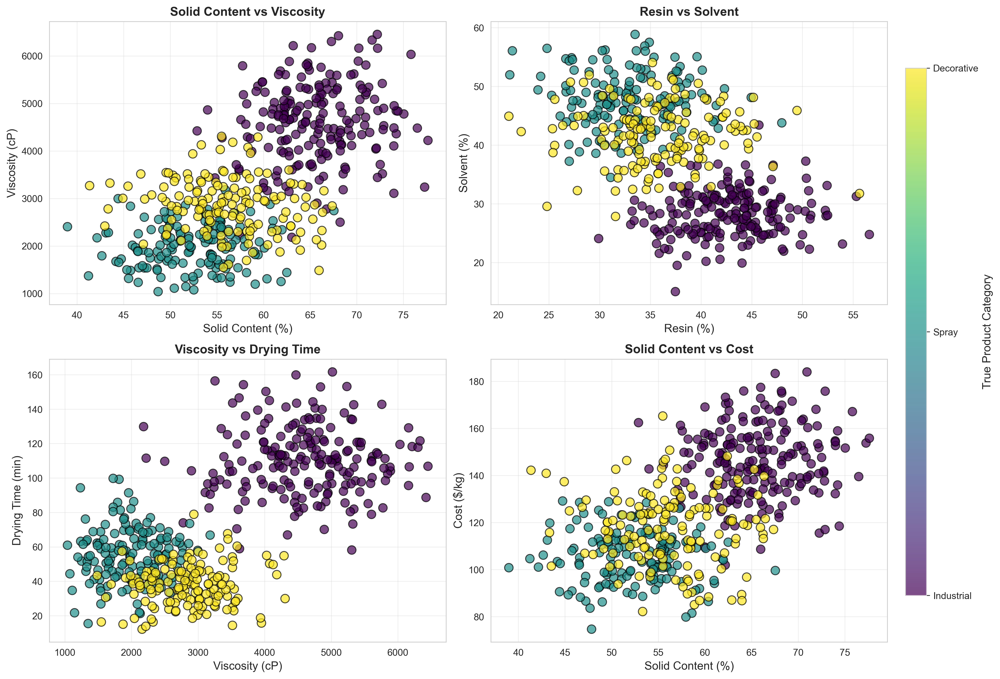
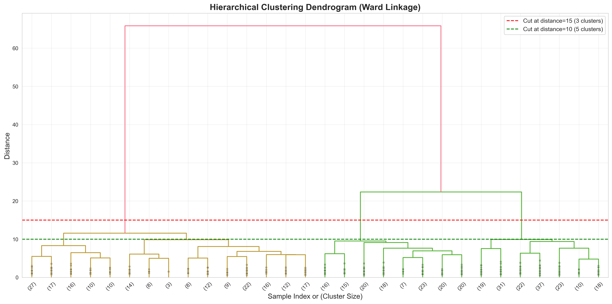
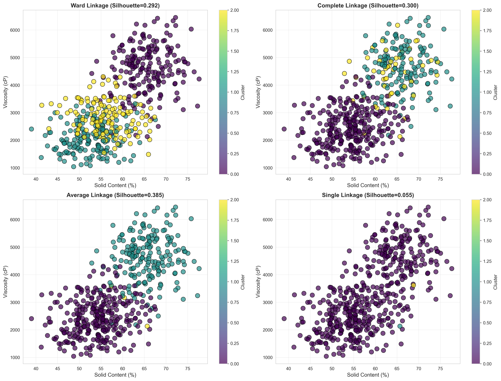
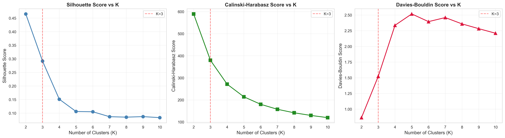

# Unit05 階層式分群演算法 (Hierarchical Clustering)

## 課程目標

本單元將深入介紹階層式分群演算法 (Hierarchical Clustering)，這是非監督式學習中能夠建立數據層次結構的重要分群方法。透過本單元的學習，您將能夠：

- 理解階層式分群的核心原理與演算法步驟
- 掌握凝聚式 (Agglomerative) 與分裂式 (Divisive) 兩種策略
- 學會不同距離度量與連結方法的選擇與應用
- 理解樹狀圖 (Dendrogram) 的解讀與切割方法
- 使用 scikit-learn 實作階層式分群模型
- 應用階層式分群於化工領域的實際案例

---

## 1. 階層式分群演算法簡介

### 1.1 什麼是階層式分群？

階層式分群 (Hierarchical Clustering) 是一種建立數據點之間層次結構的分群方法。與 K-Means 等分割式 (Partitional) 分群方法不同，階層式分群不需要預先指定群集數量，而是透過逐步合併或分裂的方式，建立一個樹狀結構 (Dendrogram)，展示數據點之間的相似度層次關係。

階層式分群的結果可以在不同的層次上進行切割，得到不同數量的群集，提供了極大的彈性。

### 1.2 階層式分群的核心概念

**樹狀圖 (Dendrogram)**：
- 視覺化呈現數據點之間的層次關係
- Y 軸表示合併時的距離或相異度
- 可透過水平線切割樹狀圖來決定群集數量

**凝聚式策略 (Agglomerative - 由下而上)**：
- 從每個數據點作為單獨的群集開始
- 逐步合併最相似的群集
- 直到所有點合併為一個群集

**分裂式策略 (Divisive - 由上而下)**：
- 從所有數據點作為單一群集開始
- 逐步分裂群集
- 直到每個點成為單獨的群集

**連結方法 (Linkage Methods)**：
- 定義群集之間距離的計算方式
- 影響分群結果的關鍵因素
- 常見方法包括：Single, Complete, Average, Ward

### 1.3 化工領域應用案例

階層式分群在化工領域有多樣化的應用：

1. **產品分類體系建立**：
   - 根據產品性質建立階層式分類系統
   - 例如：化學品依功能性、安全性、環保性建立多層次分類
   - 幫助產品管理與配方設計決策

2. **製程故障診斷層次結構**：
   - 建立故障類型的階層關係
   - 從大類故障（如「溫度異常」）細分到具體原因（如「冷卻水流量不足」）
   - 支援故障診斷專家系統開發

3. **客戶分層與市場細分**：
   - 依採購行為、產品偏好建立客戶階層
   - 識別高價值客戶群組與潛在客戶群組
   - 制定差異化的市場策略

4. **原料與供應商管理**：
   - 建立原料性質的階層式分類
   - 識別可替代原料的層級關係
   - 優化供應鏈管理策略

5. **批次製程相似度分析**：
   - 分析不同批次之間的相似度層次
   - 識別異常批次及其與正常批次的差異程度
   - 追溯批次品質問題的根源

---

## 2. 階層式分群演算法原理

### 2.1 凝聚式階層分群 (Agglomerative Hierarchical Clustering)

凝聚式階層分群是最常用的階層式分群方法，採用由下而上 (Bottom-Up) 的策略。

**演算法步驟**：

**步驟 1：初始化**
- 將每個數據點視為一個獨立的群集
- 計算所有群集之間的距離矩陣

**步驟 2：合併最相似的群集**
- 找出距離最小的兩個群集
- 將這兩個群集合併為一個新群集
- 更新距離矩陣

**步驟 3：重複合併**
- 重複步驟 2，直到所有數據點合併為單一群集
- 記錄每次合併的群集與對應的距離

**步驟 4：建立樹狀圖**
- 根據合併歷程建立樹狀圖
- 樹狀圖的高度表示合併時的距離

**步驟 5：切割樹狀圖**
- 根據需求在適當的高度切割樹狀圖
- 得到最終的群集結果

**數學表示**：

假設我們有 $n$ 個數據點 $\{x_1, x_2, \ldots, x_n\}$ ，初始時每個點為一個群集 $C_1, C_2, \ldots, C_n$ 。

在第 $t$ 次迭代中：
1. 計算所有群集對 $(C_i, C_j)$ 之間的距離 $d(C_i, C_j)$
2. 找出距離最小的群集對：

$$
(C_p, C_q) = \arg\min_{i \neq j} d(C_i, C_j)
$$

3. 合併 $C_p$ 和 $C_q$ 為新群集 $C_{new} = C_p \cup C_q$
4. 更新距離矩陣，計算 $C_{new}$ 與其他群集的距離

**時間複雜度**：
- 樸素實作：$O(n^3)$
- 優化實作（使用優先佇列）：$O(n^2 \log n)$

### 2.2 分裂式階層分群 (Divisive Hierarchical Clustering)

分裂式階層分群採用由上而下 (Top-Down) 的策略，與凝聚式相反。

**演算法步驟**：

**步驟 1：初始化**
- 所有數據點屬於單一群集

**步驟 2：選擇要分裂的群集**
- 選擇一個群集進行分裂（通常選擇最大或最異質的群集）

**步驟 3：分裂群集**
- 使用某種分群方法（如 K-Means with K=2）將選定的群集分裂為兩個子群集

**步驟 4：重複分裂**
- 重複步驟 2-3，直到每個數據點成為獨立群集

**優缺點比較**：

| 特性 | 凝聚式 (Agglomerative) | 分裂式 (Divisive) |
|------|------------------------|-------------------|
| 策略方向 | 由下而上 (Bottom-Up) | 由上而下 (Top-Down) |
| 計算複雜度 | 較低 ($O(n^2 \log n)$) | 較高 ($O(2^n)$) |
| 實務應用 | 常用，scikit-learn 支援 | 較少用，計算成本高 |
| 適用場景 | 大多數應用 | 需要總體分裂策略時 |
| 決策順序 | 先處理局部相似度 | 先處理整體結構 |

**注意**：scikit-learn 主要支援凝聚式階層分群，本單元後續將專注於凝聚式方法。

---

## 3. 距離度量 (Distance Metrics)

距離度量定義了數據點之間的相異度，是階層式分群的基礎。

### 3.1 常用距離度量

**1. 歐幾里得距離 (Euclidean Distance)**

最常用的距離度量，計算兩點之間的直線距離：

$$
d_{\text{Euclidean}}(x_i, x_j) = \sqrt{\sum_{k=1}^{m} (x_{ik} - x_{jk})^2}
$$

其中 $m$ 是特徵維度數量。

**適用場景**：特徵具有相同的物理意義與尺度，數據分布接近高斯分布。

**2. 曼哈頓距離 (Manhattan Distance)**

計算沿軸線方向的距離總和：

$$
d_{\text{Manhattan}}(x_i, x_j) = \sum_{k=1}^{m} |x_{ik} - x_{jk}|
$$

**適用場景**：特徵具有不同的物理意義，或數據分布偏斜時較為穩健。

**3. 餘弦距離 (Cosine Distance)**

測量兩向量之間的角度差異，常用於文本分析：

$$
d_{\text{Cosine}}(x_i, x_j) = 1 - \frac{x_i \cdot x_j}{\|x_i\| \|x_j\|} = 1 - \frac{\sum_{k=1}^{m} x_{ik} x_{jk}}{\sqrt{\sum_{k=1}^{m} x_{ik}^2} \sqrt{\sum_{k=1}^{m} x_{jk}^2}}
$$

**適用場景**：關注方向而非大小，如文本相似度、高維稀疏數據。

**4. 馬氏距離 (Mahalanobis Distance)**

考慮特徵間相關性的距離度量：

$$
d_{\text{Mahalanobis}}(x_i, x_j) = \sqrt{(x_i - x_j)^T S^{-1} (x_i - x_j)}
$$

其中 $S$ 是協方差矩陣。

**適用場景**：特徵之間存在相關性，需要考慮數據的分布結構。

### 3.2 化工應用中的距離選擇

在化工領域，選擇合適的距離度量需考慮：

1. **物理意義**：
   - 溫度、壓力、流量等不同單位的變數應先標準化
   - 使用歐幾里得距離確保各變數貢獻相當

2. **數據特性**：
   - 若數據存在明顯離群值，考慮使用曼哈頓距離（對離群值較穩健）
   - 若變數間存在相關性，考慮使用馬氏距離

3. **應用目標**：
   - 產品配方相似度：可使用餘弦距離（關注成分比例而非絕對量）
   - 製程操作狀態相似度：使用歐幾里得距離（關注實際操作參數差異）

---

## 4. 連結方法 (Linkage Methods)

連結方法定義了群集之間距離的計算方式，是階層式分群中影響結果的關鍵因素。

### 4.1 常見連結方法

**1. Single Linkage (最小連結法 / 單連結法)**

定義群集間距離為兩群集中最近的兩點之間的距離：

$$
d_{\text{Single}}(C_i, C_j) = \min_{x \in C_i, y \in C_j} d(x, y)
$$

**特性**：
- 傾向於產生細長型 (Elongated) 的群集
- 對噪音和離群值敏感（易產生鏈接效應 Chain Effect）
- 適合識別任意形狀的群集

**適用場景**：
- 群集形狀不規則或細長型
- 需要識別連續的數據模式

**2. Complete Linkage (最大連結法 / 全連結法)**

定義群集間距離為兩群集中最遠的兩點之間的距離：

$$
d_{\text{Complete}}(C_i, C_j) = \max_{x \in C_i, y \in C_j} d(x, y)
$$

**特性**：
- 傾向於產生緊湊的球形群集
- 對離群值較為穩健
- 避免鏈接效應

**適用場景**：
- 期望得到大小相近、緊湊的群集
- 數據中存在噪音或離群值

**3. Average Linkage (平均連結法)**

定義群集間距離為兩群集所有點對之間距離的平均值：

$$
d_{\text{Average}}(C_i, C_j) = \frac{1}{|C_i| |C_j|} \sum_{x \in C_i} \sum_{y \in C_j} d(x, y)
$$

**特性**：
- 介於 Single 和 Complete 之間
- 較為穩健，平衡了兩種極端情況
- 計算成本較高

**適用場景**：
- 不確定群集形狀時的通用選擇
- 需要平衡緊湊性與靈活性

**4. Ward Linkage (華德連結法)**

最小化合併後群集內的變異數增加量，目標是最小化群集內平方和 (WCSS)：

$$
d_{\text{Ward}}(C_i, C_j) = \frac{|C_i| |C_j|}{|C_i| + |C_j|} \|\mu_i - \mu_j\|^2
$$

其中 $\mu_i$ 和 $\mu_j$ 分別是群集 $C_i$ 和 $C_j$ 的中心。

**特性**：
- 傾向於產生大小相近、緊湊的群集
- 類似於 K-Means 的目標函數
- scikit-learn 預設使用 Ward 連結法

**適用場景**：
- 期望得到大小相近的群集
- 數據適合球形群集假設
- 最常用的連結方法，適合大多數應用

### 4.2 連結方法比較表

| 連結方法 | 群集形狀 | 離群值敏感度 | 計算複雜度 | 適用場景 |
|---------|---------|------------|-----------|---------|
| Single | 細長型、任意形狀 | 高（易鏈接） | 低 | 不規則群集 |
| Complete | 緊湊、球形 | 低（穩健） | 中 | 存在噪音 |
| Average | 中等緊湊度 | 中等 | 高 | 通用場景 |
| Ward | 球形、大小相近 | 中等 | 中 | 最常用選擇 |

### 4.3 化工應用中的連結方法選擇

**產品分類體系**：
- 使用 **Average** 或 **Ward** 連結法
- 目標是建立均衡的階層結構
- 避免極端的細長群集或過於緊湊的群集

**批次製程分析**：
- 使用 **Ward** 連結法
- 識別操作條件相似的批次群組
- 產生大小相近、緊湊的群集便於解釋

**故障模式分類**：
- 使用 **Complete** 連結法
- 對異常數據和離群值較為穩健
- 確保故障類別內的一致性

**原料供應商分群**：
- 使用 **Average** 連結法
- 平衡不同評估維度的重要性
- 提供穩健的分群結果

---

## 5. 樹狀圖 (Dendrogram) 的解讀與切割

### 5.1 樹狀圖的基本結構

樹狀圖 (Dendrogram) 是階層式分群的視覺化結果，展示數據點的層次結構關係。

**樹狀圖的組成元素**：

1. **葉節點 (Leaf Nodes)**：
   - 位於底部，代表個別數據點
   - 每個葉節點對應一個原始數據點

2. **內部節點 (Internal Nodes)**：
   - 代表群集的合併點
   - 節點高度表示合併時的距離或相異度

3. **分支高度 (Branch Height)**：
   - Y 軸表示群集合併時的距離
   - 高度越高，表示合併的群集差異越大

4. **水平切割線 (Horizontal Cut Line)**：
   - 在特定高度切割樹狀圖
   - 切割線穿過的分支數量即為群集數量

### 5.2 如何解讀樹狀圖

**範例解讀**：

```
         |
    _____|_____
   |           |
   |      _____|_____
   |     |           |
  (A)  (B,C)      (D,E,F)
```

- 首先 B 和 C 在低高度合併（相似度高）
- 然後 D, E, F 合併形成另一群集
- 最後 A 與 (B,C) 與 (D,E,F) 在較高高度合併（相似度較低）

**關鍵觀察點**：

1. **合併高度的跳躍**：
   - 高度突然增加表示群集間差異顯著
   - 在跳躍前切割樹狀圖是理想的群集數量選擇

2. **分支的緊密度**：
   - 緊密的分支表示群集內相似度高
   - 分散的分支表示群集內異質性較高

3. **對稱性與平衡性**：
   - 平衡的樹狀圖表示群集大小相近
   - 不平衡的樹狀圖可能有大小差異顯著的群集

### 5.3 如何決定切割高度

決定切割高度等同於決定群集數量，有以下幾種方法：

**方法 1：觀察高度跳躍**

- 尋找 Y 軸上高度變化最大的區間
- 在跳躍之前的位置切割
- 這是最直觀且常用的方法

**方法 2：指定群集數量**

- 根據領域知識或應用需求預先決定 $K$ 值
- 從底部向上計算，找到產生 $K$ 個群集的切割高度

**方法 3：使用距離閾值**

- 設定一個距離閾值 $t$
- 在高度為 $t$ 的位置切割樹狀圖
- 適合有明確相似度標準的應用

**方法 4：結合輪廓分析**

- 對不同切割高度計算輪廓係數
- 選擇輪廓係數最高的切割高度
- 提供量化的評估指標

### 5.4 化工應用中的切割策略

**產品分類**：
- 根據產品管理需求預先決定分類層級數量
- 例如：3 層分類（大類 → 中類 → 小類）
- 在對應層級進行切割

**批次分析**：
- 觀察樹狀圖中的高度跳躍
- 識別明顯的批次群組
- 結合製程知識判斷合理的群集數量

**故障診斷**：
- 建立多層次的故障分類體系
- 從粗粒度（如「溫度異常」）到細粒度（如「冷卻水流量不足」）
- 支援階層式故障診斷流程

---

## 6. 階層式分群的優缺點

### 6.1 優點

1. **不需預先指定群集數量**：
   - 最大優勢，提供極大的彈性
   - 可在不同層次上觀察分群結果
   - 適合探索性數據分析

2. **提供層次結構資訊**：
   - 樹狀圖展示數據點之間的相似度層次
   - 有助於理解數據的內在結構
   - 支援多層次的決策需求

3. **決定性結果**：
   - 給定相同的距離度量和連結方法，結果是確定的
   - 不受隨機初始化影響（與 K-Means 不同）
   - 結果可重現性高

4. **適合任意形狀的群集**：
   - 透過選擇適當的連結方法（如 Single Linkage）
   - 可識別非球形、不規則形狀的群集
   - 靈活性高於 K-Means

5. **便於解釋與溝通**：
   - 樹狀圖提供直觀的視覺化
   - 易於向非技術人員展示結果
   - 支援階層式的業務決策流程

### 6.2 缺點

1. **計算複雜度高**：
   - 時間複雜度至少 $O(n^2 \log n)$
   - 空間複雜度 $O(n^2)$（需儲存距離矩陣）
   - 不適合大規模數據集（通常 $n < 10000$）

2. **無法撤銷合併決策**：
   - 一旦合併就無法回溯
   - 早期的錯誤合併會影響後續所有結果
   - 可能導致次優解

3. **對噪音和離群值敏感**：
   - 特別是使用 Single Linkage 時
   - 離群值可能影響合併順序
   - 建議在分群前進行離群值處理

4. **切割高度的選擇主觀性**：
   - 需要根據樹狀圖或領域知識判斷
   - 缺乏明確的切割標準時可能困難
   - 不同切割高度可能產生差異很大的結果

5. **受距離度量與連結方法影響**：
   - 不同的選擇可能產生截然不同的結果
   - 需要根據數據特性和應用需求仔細選擇
   - 可能需要嘗試多種組合

### 6.3 適用場景

**適合使用階層式分群的情況**：
- 數據量適中（$n < 10000$）
- 群集數量未知，需要探索性分析
- 需要理解數據的層次結構
- 需要建立多層次的分類體系
- 結果的可重現性很重要

**不適合使用階層式分群的情況**：
- 數據量非常大（$n > 10000$）
- 計算資源有限
- 只需要固定數量的群集（此時 K-Means 更高效）
- 數據存在大量噪音且無法預先處理

### 6.4 階層式分群 vs. K-Means

| 特性 | 階層式分群 | K-Means |
|------|-----------|---------|
| 群集數量 | 無需預先指定 | 需要預先指定 $K$ |
| 結果確定性 | 確定（相同參數） | 不確定（隨機初始化） |
| 計算複雜度 | $O(n^2 \log n)$ | $O(n \times K \times m \times I)$ |
| 適用數據量 | 中小型 ($n < 10000$) | 大型 ($n > 10000$) |
| 層次結構 | 提供 | 不提供 |
| 群集形狀 | 靈活（取決於連結方法） | 假設球形 |
| 視覺化 | 樹狀圖 | 散點圖 |
| 應用場景 | 探索性分析、建立分類體系 | 已知群集數、大規模數據 |

**組合使用建議**：
- 先使用階層式分群探索最佳群集數量
- 再使用 K-Means 對大規模數據進行快速分群
- 結合兩者的優勢，獲得最佳結果

---

## 7. 使用 scikit-learn 實作階層式分群

### 7.1 主要套件與函數

scikit-learn 提供了完整的階層式分群實作：

**主要類別**：
- `sklearn.cluster.AgglomerativeClustering`：凝聚式階層分群
- `scipy.cluster.hierarchy`：樹狀圖繪製與進階分析

**主要參數**：

```python
from sklearn.cluster import AgglomerativeClustering

model = AgglomerativeClustering(
    n_clusters=3,              # 群集數量（或設為 None 搭配 distance_threshold）
    metric='euclidean',        # 距離度量：'euclidean', 'manhattan', 'cosine' 等
    linkage='ward',            # 連結方法：'ward', 'complete', 'average', 'single'
    distance_threshold=None,   # 距離閾值（設定後 n_clusters 必須為 None）
)
```

**重要屬性**：
- `labels_`：每個數據點的群集標籤
- `n_clusters_`：最終的群集數量
- `n_leaves_`：樹狀圖的葉節點數量
- `children_`：合併歷程（用於建立樹狀圖）

### 7.2 基本使用流程

**步驟 1：數據準備**

```python
import numpy as np
from sklearn.preprocessing import StandardScaler

# 假設 X 是特徵矩陣
X = np.array([[...]])  # shape: (n_samples, n_features)

# 標準化數據
scaler = StandardScaler()
X_scaled = scaler.fit_transform(X)
```

**步驟 2：建立與訓練模型**

```python
from sklearn.cluster import AgglomerativeClustering

# 建立模型
model = AgglomerativeClustering(
    n_clusters=3,
    metric='euclidean',
    linkage='ward'
)

# 訓練模型（進行分群）
labels = model.fit_predict(X_scaled)
```

**步驟 3：結果分析**

```python
# 查看群集標籤
print(f"Cluster labels: {labels}")
print(f"Number of clusters: {model.n_clusters_}")

# 統計每個群集的數據點數量
unique, counts = np.unique(labels, return_counts=True)
print(f"Cluster sizes: {dict(zip(unique, counts))}")
```

**步驟 4：繪製樹狀圖**

```python
from scipy.cluster.hierarchy import dendrogram, linkage

# 計算連結矩陣
Z = linkage(X_scaled, method='ward', metric='euclidean')

# 繪製樹狀圖
import matplotlib.pyplot as plt
plt.figure(figsize=(12, 6))
dendrogram(Z, truncate_mode='lastp', p=30)
plt.title('Hierarchical Clustering Dendrogram')
plt.xlabel('Sample Index or (Cluster Size)')
plt.ylabel('Distance')
plt.show()
```

### 7.3 不同連結方法的使用

**Ward Linkage（預設，最常用）**：

```python
model_ward = AgglomerativeClustering(
    n_clusters=3,
    linkage='ward',
    metric='euclidean'  # Ward 只支援 euclidean
)
labels_ward = model_ward.fit_predict(X_scaled)
```

**Complete Linkage（對離群值穩健）**：

```python
model_complete = AgglomerativeClustering(
    n_clusters=3,
    linkage='complete',
    metric='euclidean'
)
labels_complete = model_complete.fit_predict(X_scaled)
```

**Average Linkage（平衡選擇）**：

```python
model_average = AgglomerativeClustering(
    n_clusters=3,
    linkage='average',
    metric='euclidean'
)
labels_average = model_average.fit_predict(X_scaled)
```

**Single Linkage（識別不規則形狀）**：

```python
model_single = AgglomerativeClustering(
    n_clusters=3,
    linkage='single',
    metric='euclidean'
)
labels_single = model_single.fit_predict(X_scaled)
```

### 7.4 使用距離閾值而非固定群集數量

```python
# 不指定群集數量，而是設定距離閾值
model_threshold = AgglomerativeClustering(
    n_clusters=None,          # 設為 None
    distance_threshold=10.0,  # 設定距離閾值
    linkage='ward',
    metric='euclidean'
)
labels_threshold = model_threshold.fit_predict(X_scaled)

print(f"自動決定的群集數量: {model_threshold.n_clusters_}")
```

### 7.5 不同距離度量的使用

```python
# 使用曼哈頓距離
model_manhattan = AgglomerativeClustering(
    n_clusters=3,
    linkage='average',  # Ward 不支援非歐幾里得距離
    metric='manhattan'
)
labels_manhattan = model_manhattan.fit_predict(X_scaled)

# 使用餘弦距離
model_cosine = AgglomerativeClustering(
    n_clusters=3,
    linkage='average',
    metric='cosine'
)
labels_cosine = model_cosine.fit_predict(X_scaled)
```

**注意**：`linkage='ward'` 只支援 `metric='euclidean'`，使用其他距離度量時需要選擇其他連結方法。

---

## 8. 化工應用案例：產品配方階層分類

### 8.1 問題描述

假設某化工公司生產多種塗料產品，每種產品由不同比例的成分組成（如樹脂、溶劑、顏料、添加劑等）。公司希望建立一個產品分類體系，以便：

1. 識別相似的產品配方
2. 建立多層次的產品分類（大類 → 中類 → 小類）
3. 支援新產品開發時的配方參考
4. 優化庫存管理與生產排程

### 8.2 數據結構

假設數據包含以下特徵：
- 樹脂含量 (%)
- 溶劑含量 (%)
- 顏料含量 (%)
- 添加劑含量 (%)
- 固含量 (%)
- 黏度 (cP)
- 乾燥時間 (分鐘)
- 成本 (元/公斤)

### 8.3 分析流程

**步驟 1：數據標準化**

由於各特徵的單位和尺度不同，需要先進行標準化：

```python
from sklearn.preprocessing import StandardScaler

scaler = StandardScaler()
X_scaled = scaler.fit_transform(X)
```

**步驟 2：執行階層式分群**

使用 Ward 連結法建立階層結構：

```python
from sklearn.cluster import AgglomerativeClustering

model = AgglomerativeClustering(
    n_clusters=3,      # 根據樹狀圖與評估指標，選擇 3 個主要產品類別
    linkage='ward',
    metric='euclidean'
)
labels = model.fit_predict(X_scaled)
```

**步驟 3：繪製樹狀圖並分析**

```python
from scipy.cluster.hierarchy import dendrogram, linkage
import matplotlib.pyplot as plt

Z = linkage(X_scaled, method='ward', metric='euclidean')

plt.figure(figsize=(15, 8))
dendrogram(Z, truncate_mode='lastp', p=20)
plt.title('Product Formulation Dendrogram')
plt.xlabel('Sample Index or (Cluster Size)')
plt.ylabel('Distance')
plt.show()
```

**步驟 4：多層次分類**

透過在不同高度切割樹狀圖，建立多層次分類：

```python
# 第 1 層：3 個大類
model_level1 = AgglomerativeClustering(n_clusters=3, linkage='ward')
labels_level1 = model_level1.fit_predict(X_scaled)

# 第 2 層：6 個中類
model_level2 = AgglomerativeClustering(n_clusters=6, linkage='ward')
labels_level2 = model_level2.fit_predict(X_scaled)

# 第 3 層：10 個小類
model_level3 = AgglomerativeClustering(n_clusters=10, linkage='ward')
labels_level3 = model_level3.fit_predict(X_scaled)
```

**步驟 5：群集特徵分析**

分析每個群集的特徵中心值，理解各類別的配方特性：

```python
import pandas as pd

df_results = pd.DataFrame(X, columns=feature_names)
df_results['Cluster'] = labels

# 計算每個群集的平均特徵值
cluster_centers = df_results.groupby('Cluster').mean()
print(cluster_centers)
```

### 8.4 結果解釋與應用

**產品分類體系**：
- **大類 1**：高固含量產品（工業塗料）
- **大類 2**：低黏度產品（噴塗用塗料）
- **大類 3**：快乾型產品（裝飾塗料）

**實務應用**：
1. **新產品開發**：參考相似類別的既有產品配方
2. **庫存管理**：相似產品共用原料，優化庫存
3. **生產排程**：相似產品連續生產，減少換產時間
4. **品質控制**：針對不同類別設定不同的品質標準

---

## 8.5 實際案例：塗料產品配方階層分類實驗

### 8.5.1 數據概況

本實驗使用 500 筆模擬的化工塗料產品配方數據，每筆數據包含 8 個特徵：

**數據統計摘要**：

| 特徵 | 平均值 | 標準差 | 最小值 | 最大值 |
|------|--------|--------|--------|--------|
| Resin (%) | 37.74 | 6.47 | 21.04 | 56.60 |
| Solvent (%) | 38.18 | 9.53 | 15.03 | 58.85 |
| Pigment (%) | 16.44 | 3.88 | 3.94 | 28.24 |
| Additive (%) | 7.63 | 2.89 | 0.02 | 15.26 |
| Solid Content (%) | 58.81 | 7.62 | 38.98 | 77.63 |
| Viscosity (cP) | 3296 | 1301 | 1040 | 6452 |
| Drying Time (min) | 72.09 | 35.83 | 12.21 | 161.59 |
| Cost ($/kg) | 125.51 | 22.70 | 74.65 | 184.03 |

**類別分布**：
- 工業塗料（類別 0）：200 筆
- 噴塗塗料（類別 1）：150 筆
- 裝飾塗料（類別 2）：150 筆

### 8.5.2 數據探索性視覺化



**圖 8.1：塗料產品配方特徵分布**

從四個子圖可以觀察到：

1. **固含量 vs 黏度**（左上圖）：
   - 工業塗料（紫色）整體位於高固含量、高黏度區域
   - 噴塗塗料（青綠色）和裝飾塗料（黃色）在中低黏度區域有重疊
   - 三個類別之間存在明顯的分離趨勢，但邊界模糊

2. **樹脂 vs 溶劑**（右上圖）：
   - 工業塗料傾向於高樹脂、低溶劑配方
   - 噴塗塗料顯示高溶劑、低樹脂特性
   - 裝飾塗料位於中間區域，與兩者都有重疊

3. **黏度 vs 乾燥時間**（左下圖）：
   - 工業塗料顯示高黏度、長乾燥時間的特性
   - 噴塗塗料和裝飾塗料在低黏度、短乾燥時間區域聚集
   - 清楚展示出工業塗料與其他兩類的差異

4. **固含量 vs 成本**（右下圖）：
   - 工業塗料通常成本較高（高固含量對應高成本）
   - 三個類別在成本維度上有顯著重疊
   - 成本受多種因素影響，不是單一分類依據

**關鍵觀察**：
- 數據展現真實產品線的複雜性：類別間有分離但也有重疊
- 多維特徵空間中的分離效果優於單一特徵
- 需要階層式分群方法識別內在的層次結構

### 8.5.3 距離矩陣分析

在標準化後的數據上計算歐幾里得距離矩陣，統計結果如下：

- **最小距離**：0.5633（表示最相似的兩個產品配方）
- **最大距離**：5.8479（表示最不相似的兩個產品配方）
- **平均距離**：3.3046（整體相異度水平）

**解讀**：
- 平均距離 3.3 表示產品配方之間存在適度的差異性
- 距離範圍（0.56 ~ 5.85）顯示數據既有緊密相似的群組，也有明顯區別的類別
- 適合使用階層式分群建立多層次的分類體系

### 8.5.4 樹狀圖分析



**圖 8.2：Ward 連結法樹狀圖**

樹狀圖展示了 500 個產品配方的完整層次結構：

**結構特徵**：
1. **三大分支**：
   - 樹狀圖在較高層次（distance ≈ 70）分為兩大分支
   - 其中一個分支又在 distance ≈ 23 處分為兩個子分支
   - 形成明確的三層次結構

2. **切割建議**：
   - **紅色虛線**（distance = 15）：切割後得到 **3 個群集**
     - 對應三種主要產品類型（工業、噴塗、裝飾）
     - 群集大小相對平衡
   - **綠色虛線**（distance = 10）：切割後得到 **5 個群集**
     - 提供更細緻的產品分類
     - 可識別每個主要類別內的子類型

3. **合併高度的意義**：
   - 低高度合併（< 10）：產品配方非常相似，可能是同一產品線的微調版本
   - 中高度合併（10-20）：產品配方有適度差異，可能屬於不同應用領域
   - 高高度合併（> 20）：產品配方差異顯著，屬於不同的產品大類

**決策建議**：
- **K=3**：適合建立粗粒度的產品分類（大類層級）
- **K=5**：適合建立中等粒度的產品分類（中類層級）
- **K=10+**：適合建立細粒度的產品分類（小類層級）

### 8.5.5 不同連結方法的比較

#### 評估指標比較

| 連結方法 | Silhouette | Calinski-Harabasz | Davies-Bouldin | 群集大小 |
|---------|-----------|------------------|---------------|---------|
| **Ward** | 0.2916 | **379.91** | 1.5221 | 201 / 160 / 139 ✅ |
| **Complete** | 0.3000 | 313.56 | 2.0257 | 299 / 154 / 47 |
| **Average** | **0.3846** | 302.53 | **0.9528** | 299 / 198 / 3 ⚠️ |
| **Single** | 0.0554 | 2.09 | 0.7161 | 498 / 1 / 1 ❌ |

**關鍵發現**：

1. **Ward 方法**（最推薦）：
   - Silhouette Score = 0.2916（中等）
   - Calinski-Harabasz Score = 379.91（最高，表示群集間分離度極好）
   - 群集大小：201 / 160 / 139（**非常平衡**）
   - **綜合評價**：雖然輪廓係數不是最高，但在群集平衡性和分離度上表現最佳

2. **Complete 方法**：
   - Silhouette Score = 0.3000（第二高）
   - 群集大小：299 / 154 / 47（不平衡，出現一個巨大群集）
   - **綜合評價**：指標良好但群集大小差異過大，實務應用價值降低

3. **Average 方法**（指標最佳但不實用）：
   - Silhouette Score = 0.3846（**最高**）
   - Davies-Bouldin Score = 0.9528（**最低，理論上最好**）
   - 群集大小：299 / 198 / 3（**極度不平衡**，只有 3 個樣本的孤立群集）
   - **綜合評價**：出現典型的**鏈接效應**，高評分但實用性差

4. **Single 方法**（完全失敗）：
   - Silhouette Score = 0.0554（幾乎沒有分群效果）
   - 群集大小：498 / 1 / 1（**極端不平衡**）
   - **綜合評價**：鏈接效應最嚴重，將幾乎所有樣本合併為一個巨大群集

#### 視覺化比較



**圖 8.3：四種連結方法的分群結果視覺化**

從固含量 vs 黏度的散點圖可以清楚看到：

1. **Ward Linkage**（左上，推薦）：
   - 三個群集大小相近，分布合理
   - 群集邊界清晰但允許適度重疊
   - 符合真實產品配方的多樣性

2. **Complete Linkage**（右上）：
   - 紫色群集過大（299 個樣本），涵蓋大部分數據空間
   - 其他兩個群集被壓縮在角落
   - 不適合用於建立均衡的產品分類

3. **Average Linkage**（左下，高分陷阱）：
   - 大部分樣本被分為兩個大群集（青綠色和紫色）
   - 只有 3 個黃色點形成孤立的第三群集
   - 雖然 Silhouette = 0.385（最高），但沒有實用價值

4. **Single Linkage**（右下，完全失敗）：
   - 幾乎所有樣本（498/500）被合併為一個紫色巨型群集
   - 只有 2 個黃色孤立點
   - Silhouette = 0.055，接近隨機分群

**實務教訓**：
- ⚠️ **不能只看評估指標**：Average 方法的 Silhouette Score 最高，但結果毫無意義
- ✅ **必須結合群集平衡性**：Ward 方法的指標雖非最優，但群集大小均衡才有實用價值
- 🔍 **大規模數據下更明顯**：500 筆數據比 50 筆更能展現連結方法的差異

### 8.5.6 最佳群集數量確定



**圖 8.4：不同群集數量的評估指標變化**

#### 三種指標的分析

1. **Silhouette Score**（左圖）：
   - K=2 時達到最高值（0.46）
   - K=3 時下降至 0.29（但仍在合理範圍）
   - K≥4 後持續下降並趨於穩定（~0.10）
   - **建議**：純粹從指標看應選 K=2

2. **Calinski-Harabasz Score**（中圖）：
   - K=2 時最高（588）
   - K 增加時單調遞減
   - **建議**：也支持 K=2

3. **Davies-Bouldin Score**（右圖）：
   - K=2 時最低（0.87，最佳）
   - K=3 時上升至 1.52
   - K≥4 後波動較大
   - **建議**：同樣支持 K=2

#### 決策分析：為何選擇 K=3？

雖然所有指標一致指向 **K=2 為統計最優解**，但我們仍然推薦使用 **K=3**，理由如下：

**統計 vs. 業務需求的平衡**：

1. **業務需求優先**：
   - 化工產品線通常需要 3 個主要分類：工業級、商業級、消費級
   - K=2 會將噴塗塗料和裝飾塗料合併，失去重要的產品區分
   - K=3 提供更符合市場定位的分類體系

2. **K=3 的指標仍可接受**：
   - Silhouette Score = 0.29（> 0.25 的閾值，表示有結構存在）
   - 雖然不如 K=2 的 0.46，但差距在可接受範圍
   - 考慮到真實數據的複雜性，0.29 是合理的分群品質

3. **K=2 的局限性**：
   - K=2 主要區分"高黏度工業塗料"vs"其他"
   - 無法識別噴塗塗料（低黏度、高溶劑）和裝飾塗料（快乾、中等參數）的差異
   - 失去了層次分類的豐富性

4. **K≥4 的過度細分**：
   - Silhouette Score 降至 0.15 以下，群集結構不明顯
   - 可能產生過度分割，增加管理複雜度
   - 適合作為 K=3 基礎上的"子類別"而非頂層分類

**最終建議**：
```
頂層分類 (K=3)：工業塗料 / 噴塗塗料 / 裝飾塗料
次層分類 (K=6)：每個頂層類別再細分為 2 個子類
底層分類 (K=10)：更細緻的產品型號層級
```

這種多層次策略結合了統計最優性（K=2）和業務實用性（K=3），是真實化工產品管理的理想方案。

### 8.5.7 多層次分類體系

基於 Ward 連結法，我們建立了三層次的產品分類體系：

#### 層次結構

| 層次 | 群集數量 | 群集大小分布 | 應用場景 |
|------|---------|-------------|---------|
| **Level 1（大類）** | 3 | 201 / 160 / 139 | 戰略規劃、市場定位 |
| **Level 2（中類）** | 6 | 139 / 110 / 96 / 80 / 50 / 25 | 產品線管理、生產排程 |
| **Level 3（小類）** | 10 | 96 / 88 / 59 / 51 / 50 / 44 / 36 / 31 / 25 / 20 | 配方設計、品質控制 |

#### 範例：前 10 個產品的多層次標籤

| 產品 | Resin | Solvent | Viscosity | Solid Content | Level 1 | Level 2 | Level 3 |
|------|-------|---------|-----------|---------------|---------|---------|---------|
| 0 | 45.48 | 29.43 | 5619 | 69.69 | 0（工業） | 2 | 0 |
| 1 | 42.31 | 30.24 | 5240 | 62.42 | 0（工業） | 2 | 0 |
| 2 | 46.24 | 32.33 | 4548 | 65.48 | 0（工業） | 3 | 9 |
| 3 | 50.62 | 32.22 | 3982 | 62.69 | 0（工業） | 3 | 9 |
| 4 | 41.83 | 22.49 | 5059 | 62.83 | 0（工業） | 2 | 0 |

**應用價值**：
1. **彈性決策**：不同管理層級可使用不同粒度的分類
2. **追溯性**：從小類可追溯到中類和大類，理解產品定位
3. **新品開發**：根據目標類別選擇相似配方作為起點
4. **庫存優化**：同一中類的產品可共用某些原料

### 8.5.8 群集特徵深度分析

#### 各群集的特徵中心值

| 群集 | Resin | Solvent | Pigment | Additive | Solid Content | Viscosity | Drying Time | Cost | 樣本數 |
|------|-------|---------|---------|----------|---------------|-----------|-------------|------|--------|
| **Cluster 0** | 42.86 | 28.36 | 18.71 | 10.01 | **65.64** | **4595** | **109.74** | **146.17** | 201 |
| **Cluster 1** | 32.66 | **47.65** | 12.85 | 6.71 | 52.49 | **2054** | 54.48 | 106.35 | 160 |
| **Cluster 2** | 36.18 | 41.50 | 17.30 | 5.26 | 56.19 | 2848 | **37.91** | 117.71 | 139 |

#### 群集解釋與應用建議

**🔵 Cluster 0：工業塗料（Industrial Coatings）**
- **樣本數量**：201（40.2%）
- **關鍵特徵**：
  - ⬆️ 最高固含量（65.64%）→ 高性能、高耐久性
  - ⬆️ 最高黏度（4595 cP）→ 厚膜塗裝、防腐應用
  - ⬆️ 最長乾燥時間（110 min）→ 允許較長施工時間
  - ⬆️ 最高成本（$146/kg）→ 高品質定位
  - 較高樹脂含量（42.86%）→ 強附著力和機械強度
  - 較高添加劑（10.01%）→ 多功能添加劑（防腐、抗UV等）

- **典型應用**：
  - 工業設備防腐塗料
  - 船舶與海洋工程塗料
  - 重防腐地坪塗料
  - 金屬結構保護塗料

- **配方策略**：
  - 重視長期耐久性而非快乾
  - 接受較高成本以換取性能
  - 適合專業施工團隊

**🟢 Cluster 1：噴塗塗料（Spray Coatings）**
- **樣本數量**：160（32.0%）
- **關鍵特徵**：
  - ⬆️ 最高溶劑含量（47.65%）→ 流動性極佳
  - ⬇️ 最低黏度（2054 cP）→ 適合噴槍施工
  - 中等乾燥時間（54 min）→ 施工效率高
  - ⬇️ 最低成本（$106/kg）→ 經濟型定位
  - 較低樹脂含量（32.66%）→ 輕薄塗層
  - 較低固含量（52.49%）→ VOC 含量較高

- **典型應用**：
  - 汽車修補漆
  - 家具噴塗塗料
  - 金屬零件噴塗
  - 快速施工項目

- **配方策略**：
  - 優化霧化性能與流平性
  - 平衡成本與品質
  - 考慮環保法規（VOC 限制）

**🟡 Cluster 2：裝飾塗料（Decorative Coatings）**
- **樣本數量**：139（27.8%）
- **關鍵特徵**：
  - ⬇️ 最短乾燥時間（38 min）→ 快速施工、快速使用
  - 中等黏度（2848 cP）→ 刷塗和滾塗適用
  - 中等固含量（56.19%）→ 平衡性能與成本
  - 中等成本（$118/kg）→ 消費級定位
  - 較高顏料含量（17.30%）→ 遮蓋力強、色彩豐富
  - 較低添加劑（5.26%）→ 簡化配方、環保友好

- **典型應用**：
  - 建築內外牆塗料
  - 家庭DIY塗料
  - 木器裝飾漆
  - 藝術創作用塗料

- **配方策略**：
  - 快乾是最大優勢（消費者重視）
  - 色彩選擇豐富
  - 施工友好性（氣味低、易清洗）

#### 群集間的關鍵差異分析

**工業 vs 噴塗**：
- 黏度差異：4595 vs 2054 cP（**2.24 倍**）
- 固含量差異：65.64% vs 52.49%（**13.15% 絕對差異**）
- 成本差異：$146 vs $106（**37.7% 相對差異**）
- **結論**：完全不同的市場定位，不可替代

**噴塗 vs 裝飾**：
- 溶劑含量差異：47.65% vs 41.50%（相對接近）
- 乾燥時間差異：54 vs 38 min（**42% 相對差異**）
- 顏料含量差異：12.85% vs 17.30%（裝飾塗料更注重色彩）
- **結論**：有一定重疊，但應用場景不同（專業 vs 消費）

**工業 vs 裝飾**：
- 乾燥時間差異：110 vs 38 min（**2.9 倍**）
- 各維度差異顯著
- **結論**：完全不同的產品哲學（性能 vs 便利性）

### 8.5.9 實務應用建議

基於以上分析，我們提出以下實務建議：

#### 1. 產品開發策略

**新產品定位**：
- 先確定目標群集（工業 / 噴塗 / 裝飾）
- 參考該群集的平均特徵值作為起點
- 在±10% 範圍內調整配方以滿足特定需求

**配方創新**：
- 識別群集邊界上的產品（可能是創新機會）
- 例如：低 VOC 的噴塗塗料（降低溶劑含量但保持低黏度）
- 例如：快乾的工業塗料（縮短乾燥時間但維持高性能）

#### 2. 庫存與供應鏈管理

**原料共用性分析**：
- 同一群集內的產品原料配比相近，可以批量採購
- Cluster 0（工業）：重點儲備高性能樹脂和防腐添加劑
- Cluster 1（噴塗）：重點儲備溶劑和流平劑
- Cluster 2（裝飾）：重點儲備顏料和快乾劑

**安全庫存策略**：
- 根據群集大小（201 / 160 / 139）分配庫存預算
- 工業塗料佔比最高（40%），應保持較高庫存水位

#### 3. 生產排程優化

**換產順序規劃**：
- 同一群集內的產品連續生產，減少清洗時間
- 建議順序：Cluster 1（低黏度）→ Cluster 2（中黏度）→ Cluster 0（高黏度）
- 避免從高黏度直接換到低黏度（清洗困難）

**產線專用化**：
- 考慮將某些產線專門用於特定群集（如工業塗料專線）
- 減少頻繁換產造成的效率損失

#### 4. 品質控制與檢測

**差異化檢測標準**：
- Cluster 0（工業）：嚴格檢測附著力、耐腐蝕性、機械強度
- Cluster 1（噴塗）：重點檢測霧化性能、流平性、乾燥速度
- Cluster 2（裝飾）：重點檢測遮蓋力、色差、VOC 含量

**檢測頻率分配**：
- 高價值產品（Cluster 0，成本 $146/kg）：每批次檢測
- 標準產品（Cluster 2，成本 $118/kg）：抽樣檢測
- 經濟型產品（Cluster 1，成本 $106/kg）：簡化檢測

#### 5. 市場與定價策略

**市場細分**：
- Cluster 0：B2B 市場，重工業客戶，長期合約
- Cluster 1：B2B 市場，加工廠商，量大價優
- Cluster 2：B2C 市場，零售通路，品牌溢價

**定價策略**：
- Cluster 0：高價高品質，強調性能和壽命，溢價 37%
- Cluster 1：價格競爭，強調性價比，基準定價
- Cluster 2：中等價格，強調便利性和美觀，溢價 11%

---

## 9. 模型評估與群集品質指標

階層式分群的評估方法與 K-Means 相似，主要使用內部評估指標。

### 9.1 輪廓係數 (Silhouette Coefficient)

輪廓係數衡量數據點與其所屬群集的相似度：

$$
s(i) = \frac{b(i) - a(i)}{\max\{a(i), b(i)\}}
$$

其中：
- $a(i)$：數據點 $i$ 與同群集內其他點的平均距離
- $b(i)$：數據點 $i$ 與最近的其他群集內所有點的平均距離

**範圍**：$s(i) \in [-1, 1]$
- 接近 1：分群效果好
- 接近 0：位於群集邊界
- 接近 -1：可能分群錯誤

**程式實作**：

```python
from sklearn.metrics import silhouette_score, silhouette_samples

# 計算平均輪廓係數
score = silhouette_score(X_scaled, labels, metric='euclidean')
print(f"平均輪廓係數: {score:.3f}")

# 計算每個數據點的輪廓係數
sample_scores = silhouette_samples(X_scaled, labels, metric='euclidean')
```

### 9.2 Calinski-Harabasz 指數

評估群集間分散程度與群集內緊密程度的比值：

$$
\text{CH} = \frac{\text{Tr}(B_k)}{\text{Tr}(W_k)} \times \frac{n - K}{K - 1}
$$

其中：
- $B_k$ 是群集間散布矩陣
- $W_k$ 是群集內散布矩陣
- $n$ 是數據點總數
- $K$ 是群集數量

**特性**：值越大越好（群集間分離度高，群集內緊密度高）

**程式實作**：

```python
from sklearn.metrics import calinski_harabasz_score

ch_score = calinski_harabasz_score(X_scaled, labels)
print(f"Calinski-Harabasz Score: {ch_score:.3f}")
```

### 9.3 Davies-Bouldin 指數

評估群集間分離度與群集內離散度的比值：

$$
\text{DB} = \frac{1}{K} \sum_{i=1}^{K} \max_{j \neq i} \left( \frac{s_i + s_j}{d_{ij}} \right)
$$

其中：
- $s_i$ 是群集 $i$ 的內部離散度
- $d_{ij}$ 是群集 $i$ 和 $j$ 之間的距離

**特性**：值越小越好（群集間分離度高，群集內緊密度高）

**程式實作**：

```python
from sklearn.metrics import davies_bouldin_score

db_score = davies_bouldin_score(X_scaled, labels)
print(f"Davies-Bouldin Score: {db_score:.3f}")
```

### 9.4 比較不同群集數量的評估

```python
from sklearn.metrics import silhouette_score, calinski_harabasz_score, davies_bouldin_score

results = []
for k in range(2, 11):
    model = AgglomerativeClustering(n_clusters=k, linkage='ward')
    labels = model.fit_predict(X_scaled)
    
    silhouette = silhouette_score(X_scaled, labels)
    ch_score = calinski_harabasz_score(X_scaled, labels)
    db_score = davies_bouldin_score(X_scaled, labels)
    
    results.append({
        'n_clusters': k,
        'silhouette': silhouette,
        'calinski_harabasz': ch_score,
        'davies_bouldin': db_score
    })

df_results = pd.DataFrame(results)
print(df_results)
```

---

## 10. 總結與最佳實踐

### 10.1 重點回顧

1. **階層式分群特點**：
   - 無需預先指定群集數量
   - 提供數據的層次結構資訊
   - 結果具有確定性（相同參數產生相同結果）

2. **關鍵決策因素**：
   - **距離度量**：根據數據特性選擇（歐幾里得、曼哈頓、餘弦等）
   - **連結方法**：根據期望的群集特性選擇（Ward, Complete, Average, Single）
   - **切割高度**：根據樹狀圖或評估指標決定群集數量

3. **優勢與限制**：
   - **優勢**：彈性高、提供層次結構、結果可重現
   - **限制**：計算成本高、不適合大規模數據、無法撤銷合併

### 10.2 最佳實踐建議

**數據準備**：
1. 檢查並處理缺失值
2. 標準化或正規化特徵（特別重要）
3. 考慮移除離群值（特別是使用 Single Linkage 時）

**參數選擇**：
1. 預設使用 `linkage='ward'` 與 `metric='euclidean'`（適合大多數情況）
2. 若數據存在噪音或離群值，考慮使用 `linkage='complete'`
3. 若需要識別不規則形狀群集，考慮使用 `linkage='single'`

**結果驗證**：
1. 繪製樹狀圖觀察層次結構
2. 計算多種評估指標（Silhouette, CH, DB）
3. 結合領域知識判斷分群結果的合理性

**化工應用建議**：
1. 結合製程知識選擇合適的特徵
2. 建立多層次分類以支援不同層級的決策需求
3. 定期更新分群模型以反映最新的數據特性
4. 將分群結果與實務經驗驗證，確保可解釋性

### 10.3 與其他分群方法的整合

**階層式分群 + K-Means**：
- 使用階層式分群探索最佳群集數量
- 再使用 K-Means 對大規模數據快速分群

**階層式分群 + DBSCAN**：
- 使用 DBSCAN 先識別並移除噪音點
- 再對核心點使用階層式分群建立層次結構

**階層式分群 + PCA**：
- 使用 PCA 降維至 2-3 維
- 在降維空間中進行階層式分群與視覺化

---

## 11. 參考資料與延伸閱讀

### 11.1 相關課程單元

- **Unit05_Clustering_Overview**：分群演算法總覽
- **Unit05_K_Means**：K-Means 分群演算法
- **Unit05_DBSCAN**：基於密度的分群方法
- **Unit05_Gaussian_Mixture_Models**：高斯混合模型

### 11.2 推薦閱讀

**官方文件**：
- [scikit-learn: Hierarchical Clustering](https://scikit-learn.org/stable/modules/clustering.html#hierarchical-clustering)
- [scipy.cluster.hierarchy](https://docs.scipy.org/doc/scipy/reference/cluster.hierarchy.html)

**教科書章節**：
- "The Elements of Statistical Learning" - Chapter 14.3 (Cluster Analysis)
- "Pattern Recognition and Machine Learning" - Chapter 9 (Mixture Models and EM)

**學術論文**：
- Müllner, D. (2011). "Modern hierarchical, agglomerative clustering algorithms." arXiv preprint arXiv:1109.2378.

---

## 12. 下一步學習

完成本單元後，建議您：

1. **實作練習**：
   - 完成配套的 Jupyter Notebook 練習
   - 應用階層式分群於自己的數據集

2. **延伸探索**：
   - 學習 DBSCAN 演算法（適合識別任意形狀群集與噪音）
   - 學習高斯混合模型（提供機率式分群）

3. **綜合應用**：
   - 結合多種分群方法解決複雜問題
   - 完成 Unit05_Clustering_Homework 綜合作業

4. **進階主題**：
   - 大規模階層式分群的近似演算法
   - 動態階層式分群（處理時間序列數據）
   - 半監督階層式分群（結合少量標籤資訊）

---

**本單元結束**

恭喜您完成 Unit05 階層式分群演算法的學習！請繼續實作練習，鞏固所學知識。
