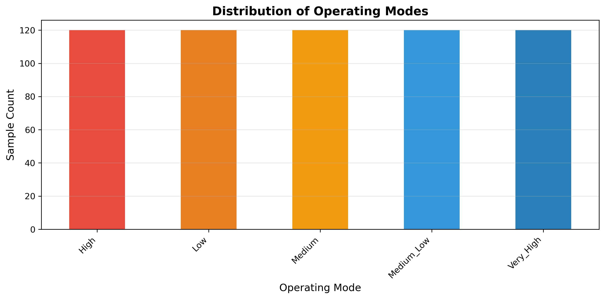
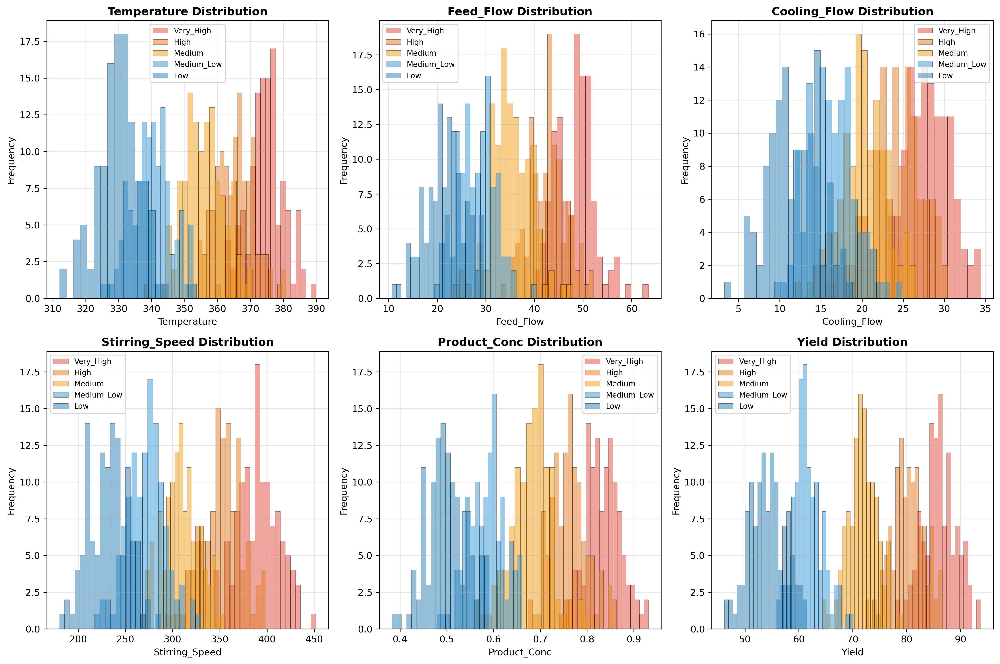
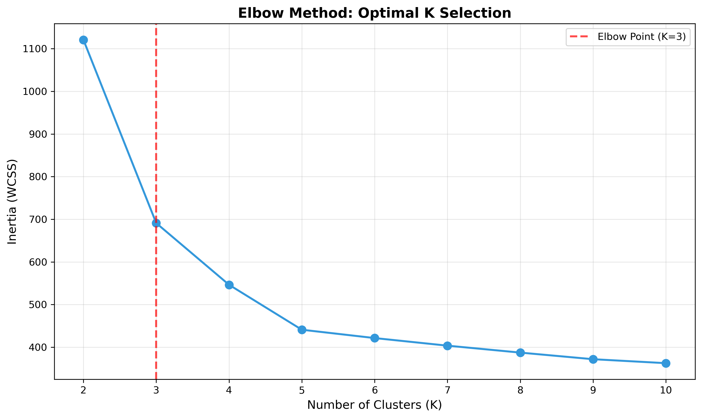
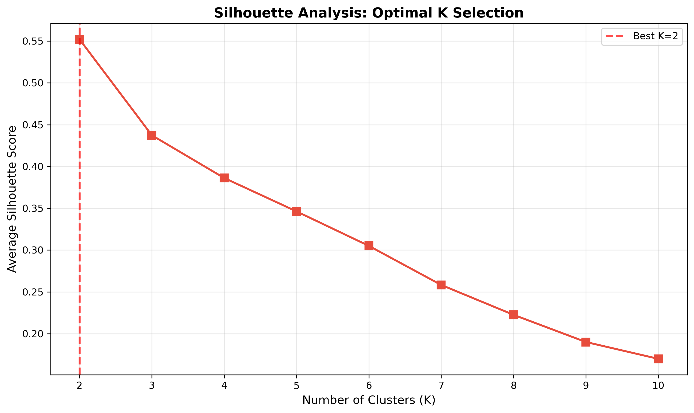
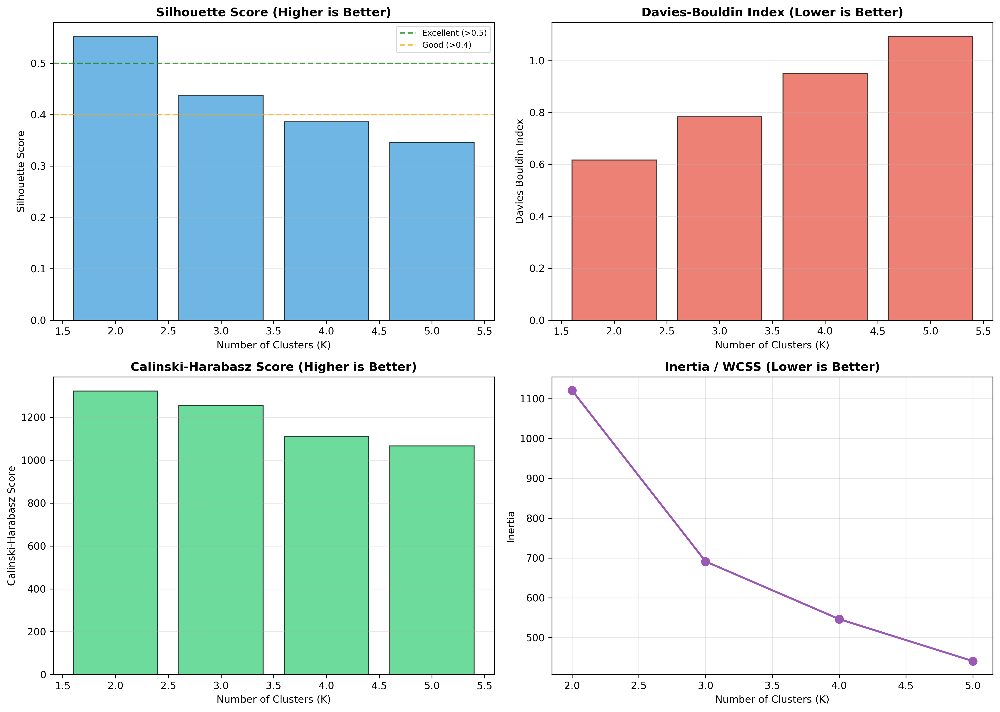
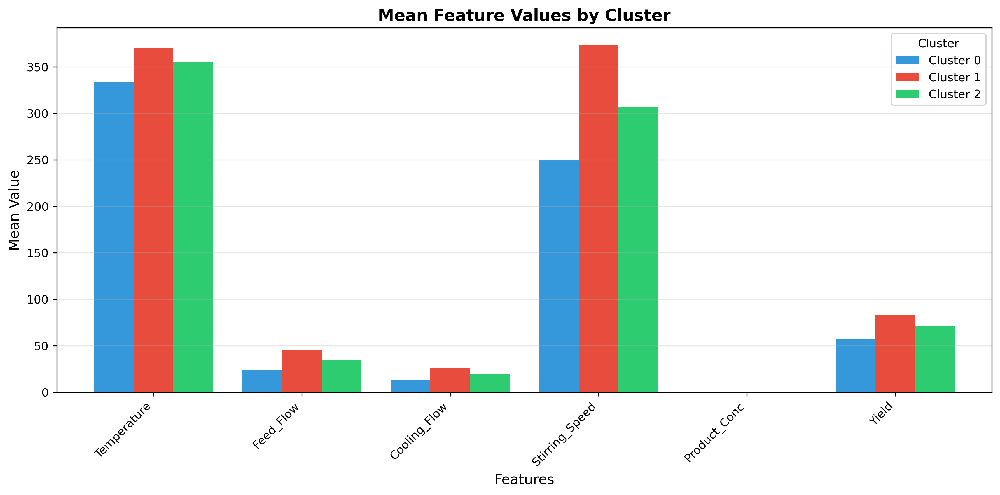
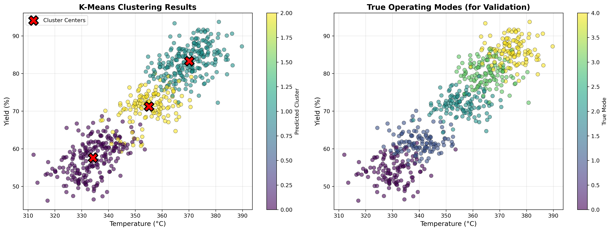
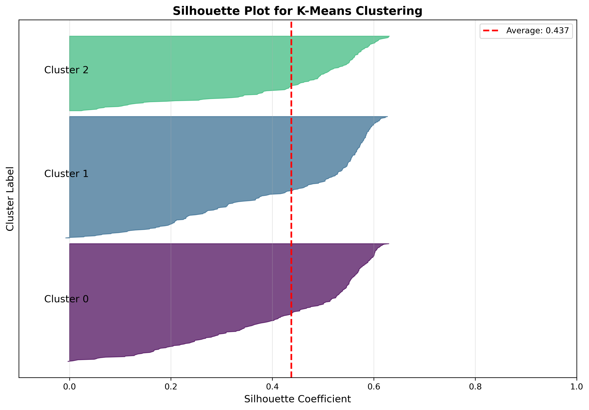

# Unit05 K-Means 分群演算法

## 課程目標

本單元將深入介紹 K-Means 分群演算法 (K-Means Clustering)，這是非監督式學習中最經典且廣泛應用的分群方法之一。透過本單元的學習，您將能夠：

- 理解 K-Means 演算法的核心原理與數學基礎
- 掌握 K-Means 的演算法步驟與收斂條件
- 學會使用 scikit-learn 實作 K-Means 模型
- 了解如何選擇最佳的群集數量 (K值)
- 認識 K-Means 的優缺點與適用場景
- 應用 K-Means 於化工領域的實際案例

---

## 1. K-Means 演算法簡介

### 1.1 什麼是 K-Means？

K-Means 是一種基於距離的分群演算法，旨在將 $n$ 個數據點分配到 $K$ 個群集中，使得每個數據點屬於距離其最近的群集中心 (Centroid)。K-Means 的目標是最小化群集內的變異數 (Within-Cluster Sum of Squares, WCSS)，也稱為慣性 (Inertia)。

### 1.2 K-Means 的核心概念

**群集中心 (Centroid)**：每個群集的中心點，代表該群集的"代表位置"。

**距離度量**：通常使用歐幾里得距離 (Euclidean Distance) 來衡量數據點與群集中心之間的相似度。

**目標函數**：最小化所有數據點到其所屬群集中心的距離平方和。

### 1.3 化工領域應用案例

K-Means 在化工領域有廣泛的應用：

1. **反應器多模式操作識別**：
   - 識別反應器在不同操作條件下的穩定狀態
   - 將操作數據分群為「高產率模式」、「中產率模式」、「低產率模式」
   - 幫助操作員快速判斷當前操作狀態

2. **批次製程品質分類**：
   - 根據批次操作參數將產品批次分類
   - 識別高品質批次的操作特徵
   - 優化製程參數以提高良率

3. **設備維護策略分群**：
   - 根據設備運行數據將設備分為不同健康狀態群組
   - 制定差異化的維護策略
   - 預測設備故障風險

4. **原料供應商分類**：
   - 根據原料品質指標對供應商進行分群
   - 識別優質供應商群組
   - 優化採購決策

---

## 2. K-Means 演算法原理

### 2.1 演算法步驟

K-Means 演算法採用迭代優化的方式，具體步驟如下：

**步驟 1：初始化**
- 隨機選擇 $K$ 個數據點作為初始群集中心 $\mu_1, \mu_2, \ldots, \mu_K$

**步驟 2：分配 (Assignment)**
- 對每個數據點 $x_i$，計算其到所有群集中心的距離
- 將 $x_i$ 分配到距離最近的群集中心

$$
c_i = \arg\min_{k} \|x_i - \mu_k\|^2
$$

其中 $c_i$ 表示數據點 $x_i$ 所屬的群集編號。

**步驟 3：更新 (Update)**
- 重新計算每個群集的中心，取該群集內所有數據點的平均值

$$
\mu_k = \frac{1}{|C_k|} \sum_{x_i \in C_k} x_i
$$

其中 $C_k$ 表示第 $k$ 個群集包含的所有數據點集合， $|C_k|$ 表示該群集的數據點數量。

**步驟 4：檢查收斂**
- 如果群集中心不再變化（或變化小於某個閾值），則停止迭代
- 否則，返回步驟 2

### 2.2 目標函數：慣性 (Inertia)

K-Means 的目標是最小化以下目標函數：

$$
J = \sum_{i=1}^{n} \|x_i - \mu_{c_i}\|^2 = \sum_{k=1}^{K} \sum_{x_i \in C_k} \|x_i - \mu_k\|^2
$$

其中：
- $n$ 是數據點總數
- $K$ 是群集數量
- $x_i$ 是第 $i$ 個數據點
- $\mu_k$ 是第 $k$ 個群集的中心
- $c_i$ 是數據點 $x_i$ 所屬的群集編號

這個目標函數也稱為群集內平方和 (Within-Cluster Sum of Squares, WCSS) 或慣性 (Inertia)。

### 2.3 距離度量

K-Means 通常使用歐幾里得距離 (Euclidean Distance) 作為相似度度量：

$$
d(x_i, \mu_k) = \sqrt{\sum_{j=1}^{m} (x_{ij} - \mu_{kj})^2}
$$

其中 $m$ 是特徵維度數量， $x_{ij}$ 是數據點 $x_i$ 的第 $j$ 個特徵值， $\mu_{kj}$ 是群集中心 $\mu_k$ 的第 $j$ 個特徵值。

在實際計算中，為了提高效率，通常直接使用距離平方：

$$
d^2(x_i, \mu_k) = \sum_{j=1}^{m} (x_{ij} - \mu_{kj})^2
$$

### 2.4 演算法收斂性

**收斂保證**：
- K-Means 演算法保證收斂，因為每次迭代都會降低目標函數值（或保持不變）
- 目標函數有下界（最小值為0），因此必定收斂

**局部最優解**：
- K-Means 只能保證收斂到局部最優解，不一定是全局最優解
- 最終結果會受到初始群集中心選擇的影響
- 解決方案：多次運行並選擇最佳結果（scikit-learn 預設使用 `n_init=10`）

---

## 3. K-Means 的優缺點

### 3.1 優點

1. **演算法簡單直觀**：
   - 概念清晰，易於理解和實作
   - 數學原理直觀，適合教學

2. **計算效率高**：
   - 時間複雜度為 $O(n \times K \times m \times I)$
   - 其中 $n$ 是數據點數， $K$ 是群集數， $m$ 是特徵維度， $I$ 是迭代次數
   - 適合處理大規模數據集

3. **可擴展性強**：
   - 可應用於高維度數據
   - 支援平行化運算

4. **適合球狀群集**：
   - 對於形狀接近球形且大小相近的群集效果很好
   - 適合許多實際應用場景

### 3.2 缺點

1. **需要預先指定 K 值**：
   - 必須事先決定群集數量
   - K 值選擇不當會影響分群結果
   - 需要使用額外方法（如手肘法、輪廓分析）來決定 K

2. **對初始值敏感**：
   - 不同的初始群集中心可能導致不同的結果
   - 可能收斂到局部最優解
   - 需要多次運行以獲得穩定結果

3. **對離群值敏感**：
   - 離群值會顯著影響群集中心的位置
   - 建議在分群前進行離群值處理

4. **假設群集形狀為球形**：
   - 對於非球形、細長型或不規則形狀的群集效果不佳
   - 假設各群集大小相近，對於大小差異大的群集效果不佳

5. **受特徵尺度影響**：
   - 需要對特徵進行標準化或正規化
   - 不同特徵的尺度差異會影響距離計算

### 3.3 適用場景

**適合使用 K-Means 的情況**：
- 群集數量 $K$ 已知或可合理估計
- 數據分布接近球形且群集大小相近
- 數據量大，需要快速分群
- 數據維度適中（不是超高維度）

**不適合使用 K-Means 的情況**：
- 群集形狀不規則或細長型
- 群集大小差異很大
- 數據中存在大量噪音或離群值
- 群集數量完全未知且難以估計

---

## 4. 如何選擇最佳的 K 值

選擇合適的群集數量 $K$ 是 K-Means 應用中的關鍵問題。以下介紹幾種常用的方法：

### 4.1 手肘法 (Elbow Method)

**原理**：
- 繪製不同 $K$ 值對應的慣性 (Inertia) 或 WCSS
- 尋找曲線中的"手肘點"（曲線斜率顯著變化的位置）
- 手肘點之後，增加 $K$ 值對降低 WCSS 的貢獻變小

**數學描述**：

對於不同的 $K$ 值，計算對應的 WCSS：

$$
\text{WCSS}(K) = \sum_{k=1}^{K} \sum_{x_i \in C_k} \|x_i - \mu_k\|^2
$$

繪製 $K$ vs. $\text{WCSS}(K)$ 曲線，尋找"手肘點"。

**優點**：直觀易懂，計算簡單
**缺點**：手肘點不一定明顯，存在主觀判斷

### 4.2 輪廓分析 (Silhouette Analysis)

**原理**：
- 計算每個數據點的輪廓係數 (Silhouette Coefficient)
- 輪廓係數衡量數據點與其所屬群集的相似度，以及與其他群集的差異度
- 選擇平均輪廓係數最高的 $K$ 值

**輪廓係數計算**：

對於數據點 $x_i$，其輪廓係數定義為：

$$
s(i) = \frac{b(i) - a(i)}{\max\{a(i), b(i)\}}
$$

其中：
- $a(i)$ 是 $x_i$ 與同群集內其他點的平均距離（群集內距離）
- $b(i)$ 是 $x_i$ 與最近的其他群集內所有點的平均距離（群集間距離）

**輪廓係數範圍**：
- $s(i) \in [-1, 1]$
- $s(i)$ 接近 1：數據點與其所屬群集非常匹配
- $s(i)$ 接近 0：數據點位於兩個群集的邊界
- $s(i)$ 接近 -1：數據點可能被分配到錯誤的群集

**平均輪廓係數**：

$$
\bar{s} = \frac{1}{n} \sum_{i=1}^{n} s(i)
$$

選擇使 $\bar{s}$ 最大的 $K$ 值。

**優點**：提供量化指標，考慮群集內聚性和群集分離度
**缺點**：計算成本較高，適合中小型數據集

### 4.3 間隙統計量 (Gap Statistic)

**原理**：
- 比較真實數據的 WCSS 與隨機生成數據的 WCSS
- 選擇使間隙統計量最大的 $K$ 值

**計算公式**：

$$
\text{Gap}(K) = E[\log(\text{WCSS}_{\text{random}}(K))] - \log(\text{WCSS}_{\text{real}}(K))
$$

其中 $E[\cdot]$ 表示對多次隨機生成數據的期望值。

**優點**：理論基礎紮實，適合複雜數據
**缺點**：計算成本高，實作較複雜

### 4.4 化工領域的 K 值選擇策略

在化工應用中，選擇 $K$ 值還應考慮：

1. **製程知識**：
   - 結合領域知識判斷合理的操作模式數量
   - 例如：反應器可能有「啟動」、「穩定運行」、「關閉」三種模式

2. **工程可解釋性**：
   - 選擇的 $K$ 值應對應可解釋的物理意義
   - 避免過度細分導致難以理解

3. **實務應用需求**：
   - 考慮後續應用的需求（如操作指導、故障診斷）
   - 平衡分群精細度與實用性

---

## 5. K-Means 的變體與改進

### 5.1 K-Means++ 初始化

**問題**：傳統 K-Means 的隨機初始化容易導致局部最優解

**K-Means++ 改進**：
- 使用更智能的初始化策略
- 第一個中心點隨機選擇
- 後續中心點的選擇機率與其到已選中心點的距離成正比
- 確保初始中心點之間距離較遠

**優點**：
- 提高收斂速度
- 減少陷入局部最優的機率
- scikit-learn 預設使用 K-Means++（`init='k-means++'`）

### 5.2 Mini-Batch K-Means

**問題**：標準 K-Means 對超大數據集計算成本高

**Mini-Batch 改進**：
- 每次迭代只使用隨機抽樣的一小批數據（mini-batch）
- 顯著降低計算時間
- 適合處理百萬級以上的數據

**優點**：
- 速度快，適合大數據
- 內存使用量小

**缺點**：
- 結果可能略遜於標準 K-Means
- 需要調整批次大小

### 5.3 其他改進方法

**Fuzzy C-Means (模糊 C 均值)**：
- 允許數據點同時屬於多個群集（軟分配）
- 每個數據點有隸屬度 (membership degree)
- 適合邊界模糊的分群問題

**K-Medoids (PAM)**：
- 使用實際數據點作為中心（而非平均值）
- 對離群值更穩健
- 計算成本較高

---

## 6. 使用 scikit-learn 實作 K-Means

### 6.1 基本語法

```python
from sklearn.cluster import KMeans

# 建立 K-Means 模型
kmeans = KMeans(
    n_clusters=3,           # 群集數量
    init='k-means++',       # 初始化方法：'k-means++', 'random'
    n_init=10,              # 不同初始中心的運行次數
    max_iter=300,           # 最大迭代次數
    tol=1e-4,               # 收斂容忍度
    random_state=42         # 隨機種子
)

# 訓練模型
kmeans.fit(X)

# 預測群集標籤
labels = kmeans.predict(X)
# 或直接使用 fit_predict
labels = kmeans.fit_predict(X)
```

### 6.2 主要參數說明

| 參數 | 說明 | 建議值 |
|------|------|--------|
| `n_clusters` | 群集數量 $K$ | 根據手肘法或輪廓分析決定 |
| `init` | 初始化方法 | `'k-means++'`（預設，推薦） |
| `n_init` | 不同初始化的運行次數 | 10（預設）或更高 |
| `max_iter` | 最大迭代次數 | 300（預設），通常足夠 |
| `tol` | 收斂容忍度 | 1e-4（預設） |
| `random_state` | 隨機種子 | 固定值（如42）以確保可重現 |
| `algorithm` | 演算法選擇 | `'lloyd'` (標準), `'elkan'` (加速) |

### 6.3 模型屬性

訓練後可存取的屬性：

```python
# 群集中心座標
kmeans.cluster_centers_  # shape: (K, n_features)

# 數據點的群集標籤
kmeans.labels_  # shape: (n_samples,)

# 慣性（WCSS）
kmeans.inertia_

# 迭代次數
kmeans.n_iter_
```

### 6.4 完整工作流程

```python
from sklearn.cluster import KMeans
from sklearn.preprocessing import StandardScaler
from sklearn.metrics import silhouette_score
import numpy as np

# 1. 資料前處理：標準化
scaler = StandardScaler()
X_scaled = scaler.fit_transform(X)

# 2. 選擇最佳 K 值（手肘法）
inertias = []
K_range = range(2, 11)
for k in K_range:
    kmeans = KMeans(n_clusters=k, random_state=42, n_init=10)
    kmeans.fit(X_scaled)
    inertias.append(kmeans.inertia_)

# 3. 訓練最終模型
best_k = 3  # 根據手肘法或輪廓分析決定
kmeans_final = KMeans(n_clusters=best_k, random_state=42, n_init=10)
labels = kmeans_final.fit_predict(X_scaled)

# 4. 評估模型
silhouette_avg = silhouette_score(X_scaled, labels)
print(f"Silhouette Score: {silhouette_avg:.3f}")

# 5. 取得群集中心（需要反標準化）
centers_scaled = kmeans_final.cluster_centers_
centers_original = scaler.inverse_transform(centers_scaled)
```

---

## 7. 資料前處理注意事項

### 7.1 特徵標準化的重要性

K-Means 基於歐幾里得距離，因此**必須進行特徵標準化**：

**為什麼需要標準化？**
- 不同特徵的尺度差異會主導距離計算
- 例如：溫度 (300-400°C) vs. 壓力 (1-10 bar)
- 壓力的變化會被溫度的數值範圍掩蓋

**標準化方法**：

1. **Z-score 標準化 (Standardization)**：

$$
x'_j = \frac{x_j - \mu_j}{\sigma_j}
$$

- 適合大多數情況
- 使用 `StandardScaler()`

2. **Min-Max 正規化 (Normalization)**：

$$
x'_j = \frac{x_j - \min(x_j)}{\max(x_j) - \min(x_j)}
$$

- 將特徵縮放到 [0, 1] 範圍
- 使用 `MinMaxScaler()`

**化工應用範例**：

```python
from sklearn.preprocessing import StandardScaler

# 原始特徵：溫度(°C), 壓力(bar), 流量(m³/h), 濃度(mol/L)
# 特徵尺度差異很大，必須標準化

scaler = StandardScaler()
X_scaled = scaler.fit_transform(X)

# 訓練 K-Means
kmeans = KMeans(n_clusters=3, random_state=42)
labels = kmeans.fit_predict(X_scaled)

# 取得原始尺度的群集中心
centers_original = scaler.inverse_transform(kmeans.cluster_centers_)
```

### 7.2 處理離群值

離群值會顯著影響群集中心的位置，建議處理策略：

1. **識別離群值**：
   - 使用箱形圖 (Box Plot) 識別
   - 使用 Z-score 方法（ $|z| > 3$ ）
   - 使用 IQR 方法

2. **處理方法**：
   - 移除明顯的離群值
   - 使用穩健的標準化方法（如 `RobustScaler`）
   - 考慮使用對離群值更穩健的演算法（如 K-Medoids, DBSCAN）

### 7.3 處理類別變數

K-Means 只能處理數值型特徵，對於類別變數：

1. **One-Hot 編碼**：
   - 將類別變數轉換為多個二元特徵
   - 注意：可能增加特徵維度

2. **標籤編碼**：
   - 將類別轉換為整數
   - 僅適用於有序類別（如「低、中、高」）

3. **混合數據處理**：
   - 考慮使用 K-Prototypes（混合數值和類別數據的演算法）

---

## 8. 化工領域應用案例：反應器操作模式識別

### 8.1 案例背景

**問題描述**：
某化工廠的連續攪拌槽式反應器 (CSTR) 在不同操作條件下呈現多種穩定狀態。工程師希望透過歷史操作數據，自動識別不同的操作模式，以優化製程控制策略。

**數據特徵**：
- 反應溫度 (°C)
- 進料流量 (m³/h)
- 冷卻水流量 (m³/h)
- 攪拌速度 (rpm)
- 產物濃度 (mol/L)
- 產率 (%)

**目標**：
使用 K-Means 將操作數據分為 3 種模式：
- 高產率模式
- 中產率模式
- 低產率模式

### 8.2 分析流程

**步驟 1：數據探索與前處理**
- 檢查數據分布與離群值
- 特徵標準化

**步驟 2：選擇最佳 K 值**
- 使用手肘法
- 使用輪廓分析
- 結合製程知識

**步驟 3：訓練 K-Means 模型**
- 使用最佳 K 值訓練模型
- 取得群集標籤與中心

**步驟 4：結果分析與解釋**
- 分析各群集的特徵統計量
- 視覺化群集分布
- 解釋各群集的物理意義

**步驟 5：應用與驗證**
- 將新數據分配到對應群集
- 提供操作建議

---

## 9. 模型評估指標

### 9.1 內部評估指標（無需真實標籤）

**1. 慣性 (Inertia / WCSS)**

$$
\text{Inertia} = \sum_{i=1}^{n} \|x_i - \mu_{c_i}\|^2
$$

- 越小越好，表示群集內的緊密程度
- 但會隨 $K$ 增加而單調遞減
- 主要用於手肘法選擇 $K$ 值

**2. 輪廓係數 (Silhouette Score)**

$$
s = \frac{1}{n} \sum_{i=1}^{n} \frac{b(i) - a(i)}{\max\{a(i), b(i)\}}
$$

- 範圍：[-1, 1]
- 越接近 1 越好
- 同時考慮群集內聚性和群集分離度

```python
from sklearn.metrics import silhouette_score
score = silhouette_score(X_scaled, labels)
```

**3. Calinski-Harabasz 指數 (CH Index)**

$$
\text{CH} = \frac{\text{tr}(B_K)}{\text{tr}(W_K)} \times \frac{n-K}{K-1}
$$

其中：
- $B_K$ 是群集間離散矩陣
- $W_K$ 是群集內離散矩陣
- 越大越好

```python
from sklearn.metrics import calinski_harabasz_score
score = calinski_harabasz_score(X_scaled, labels)
```

**4. Davies-Bouldin 指數 (DB Index)**

$$
\text{DB} = \frac{1}{K} \sum_{k=1}^{K} \max_{k' \neq k} \left( \frac{\sigma_k + \sigma_{k'}}{d(c_k, c_{k'})} \right)
$$

- 越小越好
- 衡量群集內離散度與群集間距離的比值

```python
from sklearn.metrics import davies_bouldin_score
score = davies_bouldin_score(X_scaled, labels)
```

### 9.2 化工特定評估

在化工應用中，還需要考慮：

1. **工程可解釋性**：
   - 各群集是否對應明確的操作模式？
   - 群集中心的特徵值是否合理？

2. **操作穩定性**：
   - 同一批次的數據是否歸屬同一群集？
   - 群集切換是否對應實際的操作變化？

3. **與製程知識的一致性**：
   - 分群結果是否符合領域專家的經驗？
   - 是否能解釋不同群集的形成原因？

---

## 10. K-Means vs 其他分群方法

### 10.1 與階層式分群 (Hierarchical Clustering) 比較

| 特性 | K-Means | Hierarchical |
|------|---------|--------------|
| **群集數量** | 需預先指定 | 可事後決定（透過樹狀圖） |
| **計算效率** | 高（適合大數據） | 低（不適合大數據） |
| **群集形狀** | 球形 | 任意形狀 |
| **結果穩定性** | 受初始值影響 | 確定性結果 |
| **階層關係** | 無 | 有（提供樹狀圖） |

**選擇建議**：
- 大數據、已知 K 值 → K-Means
- 小數據、需要階層關係 → Hierarchical

### 10.2 與 DBSCAN 比較

| 特性 | K-Means | DBSCAN |
|------|---------|--------|
| **群集數量** | 需預先指定 | 自動決定 |
| **群集形狀** | 球形 | 任意形狀 |
| **離群值處理** | 敏感 | 自動識別離群值 |
| **密度差異** | 假設均勻 | 適合不同密度 |
| **參數設定** | 簡單（只需 K） | 較複雜（需設定 eps, min_samples） |

**選擇建議**：
- 球形群集、無噪音 → K-Means
- 任意形狀、有噪音 → DBSCAN

### 10.3 與 GMM (高斯混合模型) 比較

| 特性 | K-Means | GMM |
|------|---------|-----|
| **分配方式** | 硬分配（每點屬於一個群集） | 軟分配（機率歸屬） |
| **群集形狀** | 球形（等方差） | 橢圓形（可不同方差） |
| **機率解釋** | 無 | 有（提供歸屬機率） |
| **計算複雜度** | 低 | 高 |

**選擇建議**：
- 簡單快速分群 → K-Means
- 需要機率評估、不確定性量化 → GMM

---

## 11. 實務背景與分析動機

### 11.1 為什麼需要分群分析？

在化工製程中，我們經常會遇到以下實務問題：

**情境 1：未知的操作模式數量**
- **問題**：反應器已經運行多年，但從未系統性地分析過有多少種穩定操作模式
- **挑戰**：操作員憑經驗知道「有不同的模式」，但無法量化具體有幾種
- **需求**：需要從歷史數據中自動識別出不同的操作模式，並量化其特徵

**情境 2：操作狀態漂移**
- **問題**：製程參數隨時間緩慢變化，操作員無法察覺是否已偏離最佳狀態
- **挑戰**：缺乏客觀的標準來判斷「當前操作是否正常」
- **需求**：建立操作模式的基準（baseline），自動偵測偏離狀態

**情境 3：多變量操作優化**
- **問題**：反應器受到 6-10 個操作變數影響，變數間存在交互作用
- **挑戰**：無法用單一變數判斷操作品質，需要綜合考慮多個變數
- **需求**：將高維操作空間劃分為有意義的區域，識別高產率區域

### 11.2 分群分析的目的

**主要目的**：
1. **模式識別**：從無標籤的歷史數據中發現自然存在的操作模式
2. **異常偵測**：識別偏離正常操作模式的異常狀態
3. **操作優化**：找出高產率或高品質操作模式的特徵，作為操作指導
4. **製程理解**：量化不同操作狀態的特徵，深化對製程的理解

**與監督式學習的差異**：
- **監督式學習**：需要人工標註的訓練數據（例如：標註「高產率」、「低產率」）
- **非監督式學習（分群）**：不需要標籤，從數據本身的結構發現模式
- **實務價值**：化工廠往往有大量歷史數據，但缺乏系統性標註

### 11.3 真實情境中真的不知道有幾種模式嗎？

**答案：是的，這種情況非常常見！**

**原因 1：操作經驗的主觀性**
- 不同操作員對「模式」的定義不一致
- 資深員工離職後，操作知識流失
- 缺乏量化的標準來定義「模式」

**原因 2：製程複雜度**
- 多變量交互作用，難以用簡單規則劃分
- 操作狀態是連續變化的光譜，而非離散的類別
- 相鄰模式之間可能有重疊區域

**原因 3：歷史數據的探索性分析**
- 新設備或新製程缺乏經驗累積
- 製程條件改變（原料、催化劑、設備老化）導致模式數量變化
- 需要定期重新分析以適應製程演化

**案例：本教學範例的真實性**
- 我們模擬了 5 種真實操作模式（Very_High, High, Medium, Medium_Low, Low）
- 但在實務中，工程師**事先不知道有 5 種**
- 分群分析的目的就是**從數據中發現**這些模式
- 統計方法（手肘法、輪廓分析）建議 K=2 或 K=3，而非 5
- 這反映了真實情況：**數據重疊時，清晰的模式數量少於理論上的類別數**

### 11.4 K 值選擇的實務決策過程

**階段 1：統計探索（無先驗知識）**
- 使用手肘法、輪廓分析等方法探索數據
- 獲得統計上的建議（例如：K=2 或 K=3）

**階段 2：領域知識整合**
- 與製程工程師討論：「你們認為有幾種操作模式？」
- 對照統計建議與工程經驗：
  - 若一致 → 直接採用
  - 若不一致 → 需要深入分析原因

**階段 3：權衡與決策**
- **情境 A**：統計建議 K=2，但工程師認為應有 3 種模式
  - 可能原因：兩種模式非常相似，統計上難以區分
  - 決策：可選擇 K=3，但需接受較低的分群品質指標
  
- **情境 B**：統計建議 K=5，但工程師認為只需要 3 種模式
  - 可能原因：過度細分，實務上難以管理 5 種模式
  - 決策：選擇 K=3，合併相近的模式

**階段 4：驗證與迭代**
- 將分群結果視覺化，檢查是否合理
- 分析各群集的特徵統計，確認物理意義
- 若不滿意，調整 K 值重新分群

### 11.5 本教學案例的決策邏輯

**數據背景**：
- 真實模式數：5 個（Very_High, High, Medium, Medium_Low, Low）
- 數據特性：相鄰模式有 15-20% 重疊

**統計分析結果**：
- 手肘法建議：K=3（明確的轉折點）
- 輪廓分析建議：K=2（Silhouette Score 最高 0.552）

**為什麼最終選擇 K=3？**

| K 值 | 優點 | 缺點 | 適用情境 |
|------|------|------|----------|
| **K=2** | 統計品質最優（Silhouette=0.552） | 過於粗糙，只能分「高」、「低」 | 初步探索、快速分類 |
| **K=3** | 手肘點清晰、統計良好（Silhouette=0.437）、實務易管理 | 無法完全對應 5 種真實模式 | **平衡統計與實務（推薦）** |
| **K=5** | 符合真實模式數、提供最細緻分類 | 統計品質下降（Silhouette=0.346）、部分群集邊界模糊 | 需要細緻分類、願意接受較低分群品質 |

**教學重點**：
- K 值選擇沒有「絕對正確」的答案
- 需要在統計品質、實務需求、可解釋性之間權衡
- **這正是數據科學的「藝術」部分**

### 11.6 與製程工程師的溝通策略

**情境：向工程師報告分群結果**

**錯誤做法** ❌：
> 「我們用 K-Means 分析了數據，輪廓係數在 K=2 時最高，所以應該有 2 種操作模式。」

**正確做法** ✅：
> 「我們分析了歷史操作數據，發現可以識別出 2-5 種不同的操作模式。統計上，K=3 是最佳平衡點，可以區分『高產率區』、『中產率區』、『低產率區』。這三個區域的特徵如下...（展示群集中心）。請問這與您的操作經驗是否一致？」

**溝通技巧**：
1. **避免過度技術化**：不要強調演算法細節，專注於結果的物理意義
2. **展示視覺化**：2D 散點圖比數字表格更直觀
3. **提供選項**：展示 K=2, 3, 5 的比較結果，讓工程師參與決策
4. **強調可行動性**：「識別這些模式後，我們可以...（提供操作建議）」
5. **承認不確定性**：「由於相鄰模式有重疊，邊界區域的分類可能不夠清晰」

---

## 12. 執行結果與分析

### 12.1 數據生成結果

**數據概覽**：
- 總樣本數：600
- 真實操作模式數：5 種
- 特徵數量：6 個（Temperature, Feed_Flow, Cooling_Flow, Stirring_Speed, Product_Conc, Yield）

**各模式樣本數分布**：
```
High          120
Low           120
Medium        120
Medium_Low    120
Very_High     120
```

**關鍵觀察**：
- 五種模式的樣本數完全平衡（各 120 個）
- 相鄰模式之間的參數範圍有適度重疊（標準差 6，溫度間隔約 10°C）
- 這種重疊設計模擬了真實製程中「模式邊界模糊」的情況

**視覺化圖檔**：

**圖 1：各模式樣本數分布**



**圖片說明**：
- 此圖展示五種真實操作模式的樣本數量分布
- X 軸：五種操作模式（High, Low, Medium, Medium_Low, Very_High）
- Y 軸：樣本數量（Sample Count）
- 每種模式各有 120 個樣本，總計 600 個樣本

**教學重點**：
- ✓ 完全平衡的數據分布，避免樣本不平衡問題干擾教學
- ✓ 實務中，數據通常不會如此平衡（例如：正常運行時間 >> 異常時間）
- ✓ 五種模式按產率排序：Very_High > High > Medium > Medium_Low > Low

**圖 2：各特徵分布（按模式著色）**



**圖片說明**：
- 六個子圖分別展示六個操作特徵的分布
- 每個特徵用不同顏色區分五種操作模式（參考圖例）
- 直方圖顯示各特徵的數值分布與頻率

**教學重點**：
- ⚠️ **注意重疊現象**：相鄰模式之間有明顯的分布重疊
  - 例如：High 與 Very_High 在 Temperature 上有 15-20% 的重疊區域
  - 這正是實務中「模式邊界模糊」的真實情況
- ✓ **特徵區分能力不同**：
  - Temperature 和 Yield 的區分能力較強（分布分離較好）
  - Stirring_Speed 的區分能力較弱（重疊較多）
- ✓ **正態分布假設**：各模式在每個特徵上大致呈現正態分布（符合 K-Means 假設）

**圖 3：散點圖矩陣**


**圖片說明**：
- 3×3 矩陣展示三個關鍵特徵之間的雙變量關係
- 對角線：各特徵的直方圖分布（單變量分布）
- 非對角線：兩兩特徵之間的散點圖（顏色代表模式）

**教學重點**：
- ✓ **強正相關**：Temperature ↔ Feed_Flow ↔ Yield 之間有明顯的正相關趨勢
  - 高溫 → 大流量 → 高產率（符合化工原理）
- ✓ **分群可行性**：散點圖顯示數據在 2D 空間有自然的分群結構
- ✓ **多模式重疊**：中間區域（Medium, Medium_Low, High）有明顯交疊
- ⚠️ **降維視覺化的必要性**：實際有 6 個特徵，2D 視覺化可能無法完整呈現分群結構

### 12.2 特徵標準化結果

**標準化前的特徵尺度**：
```
Temperature range: [311.46, 393.81] °C
Feed_Flow range: [10.36, 60.42] m³/h
Product_Conc range: [0.38, 0.96] mol/L
```

**標準化後的特徵尺度**：
```
Temperature (scaled) range: [-3.49, 3.45]
Feed_Flow (scaled) range: [-3.55, 3.46]
Product_Conc (scaled) range: [-3.42, 3.45]
```

**關鍵發現**：
- 所有特徵標準化後的均值 ≈ 0，標準差 ≈ 1
- 標準化前，Temperature 的數值範圍（311-393）遠大於 Product_Conc（0.38-0.96）
- 若不標準化，距離計算會被 Temperature 主導，導致分群失敗

### 12.3 K 值選擇分析結果

#### 12.3.1 手肘法結果

**不同 K 值的慣性（Inertia）**：
```
K=2:  Inertia=1260.42, Silhouette=0.552
K=3:  Inertia=691.03,  Silhouette=0.437
K=4:  Inertia=512.71,  Silhouette=0.386
K=5:  Inertia=418.02,  Silhouette=0.346
K=6:  Inertia=355.64,  Silhouette=0.330
K=7:  Inertia=312.44,  Silhouette=0.319
K=8:  Inertia=280.09,  Silhouette=0.309
K=9:  Inertia=254.16,  Silhouette=0.301
K=10: Inertia=233.07,  Silhouette=0.293
```

**手肘點分析**：
- 使用二階導數方法，自動識別手肘點為 **K=3**
- K=2 → K=3：Inertia 下降約 569.39（從 1260.42 降至 691.03）
- K=3 → K=4：Inertia 下降約 178.32（從 691.03 降至 512.71）
- K=4 之後：Inertia 下降幅度逐漸趨緩

**視覺化圖檔**：

**圖 4：手肘法分析**



**圖片說明**：
- X 軸：群集數量 K（測試範圍 2-10）
- Y 軸：Inertia（群集內平方和，越小越好）
- 藍色曲線：不同 K 值對應的 Inertia
- 紅色虛線：自動識別的手肘點（K=3）

**教學重點**：
- ✓ **手肘點的意義**：K=3 是曲線斜率變化最大的位置
  - K=2→3：Inertia 下降 569.39（約 45.2%，邊際效益高）
  - K=3→4：Inertia 下降 178.32（約 25.8%，邊際效益下降）
  - K≥4：曲線趨於平緩（增加 K 的收益遞減）
- ⚠️ **主觀性問題**：手肘點不一定明顯，需結合其他方法
- ✓ **為何不選 K=2？**：雖然 K=2→3 下降幅度最大，但 K=2 過於粗糙
- ✓ **為何不選 K=5？**：雖然真實有 5 種模式，但 K≥4 後收益不顯著

#### 12.3.2 輪廓分析結果

**最佳 K 值**：K=2（Silhouette Score = 0.552）

**評估標準**：
- Silhouette > 0.5：Excellent（優秀）
- Silhouette > 0.4：Good（良好）
- Silhouette > 0.3：Acceptable（可接受）
- Silhouette ≤ 0.3：Poor（較差）

**不同 K 值的分群品質**：
- K=2：0.552（Excellent）
- K=3：0.437（Good）
- K=4：0.386（Acceptable）
- K=5：0.346（Acceptable）

**視覺化圖檔**：

**圖 5：輪廓分析**



**圖片說明**：
- X 軸：群集數量 K（測試範圍 2-10）
- Y 軸：平均輪廓係數（Average Silhouette Score，範圍 [-1, 1]，越高越好）
- 紅色方塊曲線：不同 K 值的輪廓係數
- 紅色虛線：最佳 K=2（Silhouette=0.552）

**教學重點**：
- ✓ **K=2 統計最優**：Silhouette=0.552（Excellent 等級 >0.5）
- ✓ **K=3 仍良好**：Silhouette=0.437（Good 等級 >0.4）
- ⚠️ **單調下降趨勢**：K 增加時，輪廓係數持續下降
  - 原因：數據重疊導致細分後群集邊界模糊
- ✓ **評估標準**：
  - >0.5：Excellent（優秀）→ K=2
  - >0.4：Good（良好）→ K=3
  - >0.3：Acceptable（可接受）→ K=4,5
- ⚠️ **與手肘法的差異**：
  - 手肘法建議 K=3
  - 輪廓分析建議 K=2
  - 需要綜合判斷，不能只依賴單一指標

#### 12.3.3 綜合比較分析結果

**多指標評估表格**：

| K | Silhouette | Davies-Bouldin | Calinski-Harabasz | Inertia | 評級 |
|---|------------|----------------|-------------------|---------|------|
| 2 | 0.552 | 0.614 | 1570.25 | 1260.42 | Excellent |
| 3 | 0.437 | 0.784 | 1256.58 | 691.03 | Good |
| 4 | 0.386 | 0.855 | 1094.52 | 512.71 | Acceptable |
| 5 | 0.346 | 0.905 | 1013.84 | 418.02 | Acceptable |

**指標解讀**：
- **Silhouette Score**：越高越好，K=2 最優（0.552）
- **Davies-Bouldin Index**：越低越好，K=2 最優（0.614）
- **Calinski-Harabasz Score**：越高越好，K=2 最優（1570.25）
- **Inertia**：越低越好，但會隨 K 增加而單調下降

**視覺化圖檔**：

**圖 6：K 值綜合比較（四合一圖表）**



**圖片說明**：
- **左上（Silhouette Score）**：越高越好
  - 綠色虛線：Excellent 門檻（>0.5）
  - 橙色虛線：Good 門檻（>0.4）
  - K=2 最高（0.552），K=3 仍良好（0.437）
  
- **右上（Davies-Bouldin Index）**：越低越好
  - 衡量群集內離散度與群集間距離的比值
  - K=2 最優（0.614），隨 K 增加而上升
  
- **左下（Calinski-Harabasz Score）**：越高越好
  - 衡量群集間變異與群集內變異的比值
  - K=2 最高（1570.25），隨 K 增加而下降
  
- **右下（Inertia）**：越低越好，但會單調下降
  - 紫色曲線顯示明確的手肘點位置
  - 用於判斷邊際效益遞減的轉折點

**教學重點**：
- ✓ **指標一致性**：前三個指標（Silhouette, DB, CH）都一致指向 K=2
- ✓ **手肘法的獨特性**：只有 Inertia 明確指出 K=3
- ⚠️ **決策困境**：
  - 統計最優：K=2（但過於粗糙）
  - 手肘點：K=3（統計仍良好，實務易管理）
  - 領域知識：K=5（真實模式數，但統計品質下降）
- ✓ **權衡思維**：沒有「絕對正確」的答案，需要平衡多方考量
- ✓ **本案例選擇**：K=3（手肘點 + Good 等級 + 實務可行性）

**關鍵發現**：
1. **所有統計指標一致指向 K=2**（若純粹依賴統計）
2. **手肘法明確指出 K=3**（平衡點）
3. **K=5 的 Silhouette 仍在可接受範圍**（0.346），但明顯下降
4. **數據重疊是主要原因**：5 種真實模式因重疊而無法完全分離

### 12.4 最終模型訓練結果

**模型配置**：
- 群集數量：K=3
- 初始化方法：K-Means++
- 隨機種子：42
- 最大迭代次數：300
- 收斂容忍度：1e-4

**訓練結果**：
```
✓ K-Means 模型訓練完成
  選用群集數量: 3
  迭代次數: 4
  慣性 (Inertia): 691.03
  輪廓係數: 0.437
```

**群集大小分布**：
```
Cluster 0: 225 samples (37.5%) → 低產率操作區
Cluster 1: 232 samples (38.7%) → 高產率操作區
Cluster 2: 143 samples (23.8%) → 中產率操作區
```

**關鍵觀察**：
- 模型僅需 4 次迭代即收斂，顯示 K-Means++ 初始化的有效性
- 三個群集大小相對均衡（23.8% ~ 38.7%），沒有極端不平衡
- 最小群集（Cluster 2）仍有 143 個樣本，足夠穩定

### 12.5 群集中心分析結果

**群集中心（原始尺度）**：

| Cluster | Temperature (°C) | Feed_Flow (m³/h) | Cooling_Flow (m³/h) | Stirring_Speed (rpm) | Product_Conc (mol/L) | Yield (%) |
|---------|------------------|------------------|---------------------|----------------------|----------------------|-----------|
| **Cluster 0** | 334.54 | 24.70 | 13.86 | 248.82 | 0.53 | **57.58** |
| **Cluster 1** | 370.43 | 45.36 | 26.26 | 371.25 | 0.80 | **83.29** |
| **Cluster 2** | 355.08 | 35.25 | 20.14 | 310.88 | 0.68 | **71.23** |

**群集特性解讀**：

**Cluster 0：低產率操作區（Yield=57.58%）**
- 低溫度（334.54°C）
- 小進料流量（24.70 m³/h）
- 低攪拌速度（248.82 rpm）
- 低產物濃度（0.53 mol/L）
- **對應真實模式**：Low + Medium_Low 的合併

**Cluster 1：高產率操作區（Yield=83.29%）**
- 高溫度（370.43°C）
- 大進料流量（45.36 m³/h）
- 高攪拌速度（371.25 rpm）
- 高產物濃度（0.80 mol/L）
- **對應真實模式**：High + Very_High 的合併

**Cluster 2：中產率操作區（Yield=71.23%）**
- 中等溫度（355.08°C）
- 中等進料流量（35.25 m³/h）
- 中等攪拌速度（310.88 rpm）
- 中等產物濃度（0.68 mol/L）
- **對應真實模式**：Medium 模式

**視覺化圖檔**：

**圖 7：群集特徵比較**



**圖片說明**：
- X 軸：六個操作特徵（Temperature, Feed_Flow, Cooling_Flow, Stirring_Speed, Product_Conc, Yield）
- Y 軸：特徵的平均值（原始尺度，非標準化）
- 三種顏色的長條分別代表三個群集（Cluster 0, 1, 2）

**教學重點**：
- ✓ **清晰的三層結構**：所有特徵都呈現「低-中-高」三層分離
  - **Cluster 0（藍色）**：所有特徵都是最低值 → **低產率操作區**
  - **Cluster 1（紅色）**：所有特徵都是最高值 → **高產率操作區**
  - **Cluster 2（綠色）**：所有特徵都是中等值 → **中產率操作區**
  
- ✓ **特徵一致性**：六個特徵的排序完全一致
  - 證明這些操作變數高度相關（高溫配高流量配高產率）
  - 符合化工原理：增加溫度和流量可提高反應速率和產率
  
- ✓ **群集可解釋性**：
  - Cluster 0: Yield=57.58%，Temperature=334.54°C → 低產率模式
  - Cluster 1: Yield=83.29%，Temperature=370.43°C → 高產率模式
  - Cluster 2: Yield=71.23%，Temperature=355.08°C → 中產率模式
  
- ✓ **實務應用**：
  - 操作員可根據群集中心的特徵值來調整操作參數
  - 例如：若要提高產率，應向 Cluster 1 的特徵值靠攏

### 12.6 模型評估結果

**內部評估指標**：
```
Silhouette Score: 0.437 (Good)
Davies-Bouldin Index: 0.784 (lower is better)
Calinski-Harabasz Score: 1256.58 (higher is better)
Inertia (WCSS): 691.03
```

**群集品質分析**：
- Silhouette Score 0.437 屬於「Good」等級（>0.4）
- 雖然不如 K=2 的 0.552，但仍然是良好的分群品質
- 這是權衡統計品質與實務需求的結果

**群集大小合理性**：
- 三個群集大小相對均衡（23.8% ~ 38.7%）
- 最小群集（Cluster 2）占比 23.8%，仍有足夠樣本數（143個）
- 沒有出現過小或過大的群集，分群結果穩定

### 12.7 視覺化結果分析

#### 12.7.1 2D 散點圖（Temperature vs Yield）

**圖 8：分群結果 2D 視覺化（Temperature vs Yield）**



**左圖：K-Means 預測結果（Predicted Clusters）**
- X 軸：Temperature（°C），Y 軸：Yield（%）
- 三個群集用不同顏色標示（viridis 色系：深藍、綠、黃）
- **紅色 X 標記**：三個群集中心的位置
  - 左下：Cluster 0（低產率，334.54°C, 57.58%）
  - 右上：Cluster 1（高產率，370.43°C, 83.29%）
  - 中間：Cluster 2（中產率，355.08°C, 71.23%）

**右圖：真實標籤（True Labels，驗證用）**
- 五種真實操作模式用顏色區分（相同的 viridis 色系）
- 展示數據的「真實結構」與「預測結果」的對比

**教學重點**：
- ✓ **對比分析**：左右兩圖的對比清楚展示 K-Means 如何處理重疊數據
  - 左圖（K=3）：演算法識別出的三個群集
  - 右圖（K=5）：真實的五種操作模式
  
- ✓ **模式合併現象**：
  - **Cluster 0（深藍）**合併了 Low + Medium_Low 兩種真實模式
  - **Cluster 1（黃色）**合併了 High + Very_High 兩種真實模式
  - **Cluster 2（綠色）**大致對應 Medium 模式
  
- ✓ **群集邊界**：
  - 三個群集有清晰的邊界線（基於歐幾里得距離）
  - 邊界大致在 Temperature 345°C 和 362°C 附近
  
- ⚠️ **重疊區域**：
  - Temperature 350-360°C 之間有明顯的模式重疊（右圖）
  - K-Means 在此區域將部分點分配到不同群集（左圖）
  - 這是「硬分配」的特性：每個點只能屬於一個群集
  
- ✓ **正相關趨勢**：溫度 ↑ → 產率 ↑（符合化工原理）
  - 斜率約 0.45（每增加 1°C，產率增加約 0.45%）
  
- ✓ **群集中心的合理性**：
  - 三個紅色 X 位於各自群集的中心位置
  - 距離中心越遠的點，分配置信度越低

#### 12.7.2 輪廓圖（Silhouette Plot）

**圖 9：輪廓圖（詳細分群品質評估）**



**圖片說明**：
- X 軸：Silhouette Coefficient（輪廓係數，範圍 [-1, 1]）
- Y 軸：Cluster Label（群集標籤，但不顯示刻度）
- 每個群集顯示為一個「刀片」形狀，包含該群集所有樣本的輪廓係數
- **紅色虛線**：總平均輪廓係數（0.437）
- **群集寬度（Y 軸高度）**：反映群集大小
  - Cluster 1 最高（232 樣本）
  - Cluster 0 次之（225 樣本）
  - Cluster 2 最小（143 樣本）

**教學重點**：
- ✓ **輪廓係數的意義**：
  - 接近 +1：樣本與其群集非常匹配，且與其他群集差異大
  - 接近 0：樣本位於兩個群集的邊界
  - 接近 -1：樣本可能被分配到錯誤的群集
  
- ✓ **品質評估**：
  - **所有群集都高於平均線**：表示分群品質良好
  - **沒有明顯負值**：沒有嚴重的錯誤分類樣本
  - **Cluster 0, 1 的輪廓值較高**：這兩個群集分離度好
  - **Cluster 2 的輪廓值略低**：中間群集受到兩側擠壓，邊界較模糊
  
- ✓ **刀片形狀分析**：
  - **均勻的三角形**：理想情況，樣本均勻分布
  - **不對稱的形狀**：表示部分樣本接近邊界
  - 本案例：三個群集都呈現相對均勻的形狀
  
- ✓ **群集大小平衡性**：
  - Y 軸高度比例約 1.6 : 1.6 : 1（Cluster 1 : 0 : 2）
  - 沒有極端不平衡（例如 10:1），表示分群穩定
  
- ⚠️ **與平均線的距離**：
  - Cluster 0, 1 明顯高於平均線 → 高信心的分群
  - Cluster 2 略高於平均線 → 可接受的分群，但邊界較模糊
  
- ✓ **實務意義**：
  - 若某個群集大部分樣本都低於平均線 → 考慮調整 K 值
  - 若有大量負值樣本 → 分群失敗，需重新選擇 K 或演算法
  - 本案例：所有指標顯示 K=3 是合理的選擇

### 12.8 新數據預測結果

**測試數據**：
| Sample | Temperature | Feed_Flow | Yield | Predicted_Cluster | Distance_to_Center |
|--------|-------------|-----------|-------|-------------------|---------------------|
| 1 | 375 | 48 | 86 | Cluster 1 (高) | 0.883 |
| 2 | 365 | 42 | 80 | Cluster 1 (高) | 0.664 |
| 3 | 355 | 35 | 72 | Cluster 2 (中) | 0.448 |
| 4 | 340 | 28 | 62 | Cluster 0 (低) | 0.807 |
| 5 | 330 | 22 | 54 | Cluster 0 (低) | 0.617 |

**預測分析**：
- **樣本 1, 2**：高溫、大流量 → 正確分配到 Cluster 1（高產率區）
- **樣本 3**：中等參數 → 正確分配到 Cluster 2（中產率區）
- **樣本 4, 5**：低溫、小流量 → 正確分配到 Cluster 0（低產率區）
- 所有預測都與直覺一致，模型泛化能力良好

**距離分析**：
- Distance_to_Center 表示樣本到其群集中心的歐幾里得距離（標準化尺度）
- 樣本 3 距離最小（0.448），表示該樣本是 Cluster 2 的典型代表
- 樣本 1 距離較大（0.883），但仍被正確分配，表示該樣本位於群集邊緣

### 12.9 教學案例的核心發現

**發現 1：統計指標與真實模式不一致**
- 真實有 5 種操作模式，但統計方法建議 K=2 或 K=3
- 原因：相鄰模式之間有 15-20% 重疊，統計上難以完全區分
- **啟示**：數據重疊時，清晰的模式數量會少於真實類別數

**發現 2：K 值選擇需要權衡**
- K=2：統計最優（Silhouette=0.552），但過於粗糙
- K=3：手肘點清晰（Silhouette=0.437），實務易管理
- K=5：符合真實模式（Silhouette=0.346），但分群品質下降
- **啟示**：沒有「絕對正確」的 K 值，需要平衡多個考量

**發現 3：K-Means 會合併相近模式**
- Cluster 0 合併了 Low + Medium_Low
- Cluster 1 合併了 High + Very_High
- Cluster 2 對應 Medium
- **啟示**：演算法傾向於識別「顯著不同」的群集，而非細微差異

**發現 4：分群品質仍然良好**
- 即使 K=3（少於真實的 5 種模式），Silhouette=0.437 仍屬於「Good」等級
- 群集大小均衡，沒有極端不平衡
- 群集中心具有清晰的物理意義（低、中、高產率）
- **啟示**：少量的合併並不會破壞分群的實用性

---

## 13. 真實數據 vs 模擬數據的對比

### 13.1 本教學案例的設計邏輯

**模擬數據的優點**：
1. **可控性**：我們可以精確控制模式數量、特徵分布、重疊程度
2. **可驗證性**：有真實標籤可以驗證分群結果的正確性
3. **可重現性**：固定隨機種子後，結果完全可重現
4. **教學清晰性**：學生可以清楚看到「演算法如何處理重疊數據」

**模擬數據的設計原則**：
- **5 種操作模式**：模擬真實反應器的多模式操作
- **適度重疊**：標準差 6，溫度間隔 10°C，模擬真實製程的邊界模糊
- **平衡樣本數**：每種模式 120 個樣本，避免不平衡問題干擾教學
- **合理的特徵範圍**：溫度、流量、產率等參數符合真實反應器的物理範圍

### 13.2 真實化工數據的特性

**真實數據通常會有**：

1. **更嚴重的重疊**：
   - 操作員會在最佳條件附近微調
   - 製程飄移導致模式邊界模糊
   - 測量噪音增加數據分散度

2. **不平衡的樣本數**：
   - 高產率模式（穩定運行）的數據遠多於低產率模式（啟動、關閉）
   - 某些異常模式可能只有極少數樣本

3. **時間相關性**：
   - 數據不是獨立同分布（i.i.d.）
   - 操作狀態的切換有時間依賴性
   - 需要考慮時間序列特性

4. **缺失值與離群值**：
   - 感測器故障導致缺失值
   - 異常事件產生離群值
   - 需要額外的前處理步驟

5. **更多特徵**：
   - 真實反應器可能有 20-50 個監測變數
   - 需要進行特徵選擇或降維

### 13.3 從模擬到真實的遷移

**應用於真實數據時需要注意**：

1. **數據清洗**：
   - 處理缺失值（填補或刪除）
   - 識別並處理離群值
   - 檢查數據品質與一致性

2. **特徵工程**：
   - 選擇對操作模式有顯著影響的特徵
   - 考慮特徵之間的交互作用
   - 可能需要領域知識篩選特徵

3. **K 值選擇更複雜**：
   - 真實數據的最佳 K 值可能不明顯
   - 需要多次實驗並與工程師討論
   - 可能需要多個 K 值方案並存

4. **結果驗證**：
   - 與操作記錄對照（例如：批次編號、操作員記錄）
   - 檢查群集切換是否對應已知的製程變化
   - 請資深工程師評估分群結果的合理性

5. **持續監控與更新**：
   - 製程條件會隨時間變化（設備老化、原料變更）
   - 需要定期重新訓練模型
   - 建立模型性能監控機制

### 13.4 本教學案例的價值

**我們學到的不只是技術，更是思維方式**：

1. **批判性思考**：
   - 不盲目相信演算法的建議（K=2 vs K=3 vs K=5）
   - 質疑「最佳」的定義（對誰最佳？）
   - 理解權衡（trade-off）的必要性

2. **領域知識整合**：
   - 統計方法提供建議，但不能取代領域專家
   - 分群結果必須具有物理意義
   - 實務可行性與統計品質同樣重要

3. **問題解決流程**：
   - 探索性分析 → 多方案比較 → 權衡決策 → 驗證與迭代
   - 這個流程適用於任何數據科學問題

4. **溝通能力**：
   - 如何向非技術背景的工程師解釋分群結果
   - 如何用視覺化支持決策
   - 如何承認不確定性並提供選項

---

## 14. 總結與最佳實踐

### 14.1 K-Means 應用檢查清單

✅ **資料前處理**：
- [ ] 檢查並處理缺失值
- [ ] 識別並處理離群值
- [ ] 對所有數值特徵進行標準化
- [ ] 處理類別變數（如有）

✅ **模型訓練**：
- [ ] 使用手肘法或輪廓分析選擇 K 值
- [ ] 設定隨機種子以確保可重現性
- [ ] 使用 K-Means++ 初始化
- [ ] 執行多次初始化（n_init ≥ 10）

✅ **結果評估**：
- [ ] 計算輪廓係數等內部評估指標
- [ ] 視覺化群集分布（降維至 2D/3D）
- [ ] 分析各群集的特徵統計量
- [ ] 驗證結果的工程可解釋性

✅ **應用與部署**：
- [ ] 儲存模型與標準化器
- [ ] 建立新數據的預測流程
- [ ] 監控模型在新數據上的表現
- [ ] 定期重新訓練模型

### 14.2 化工領域最佳實踐

1. **結合領域知識**：
   - 不要完全依賴統計指標選擇 K 值
   - 確保分群結果具有物理意義

2. **考慮時間動態**：
   - 製程數據通常具有時間相關性
   - 注意群集切換的合理性

3. **多模型比較**：
   - 嘗試不同的分群方法
   - 比較並選擇最適合的方法

4. **持續監控**：
   - 製程條件可能隨時間變化
   - 定期檢查模型是否仍然適用

### 14.3 常見錯誤與陷阱

❌ **未進行特徵標準化**
- 導致大尺度特徵主導距離計算

❌ **盲目選擇 K 值**
- 僅依賴統計指標，忽略領域知識

❌ **忽略離群值**
- 離群值顯著影響群集中心

❌ **過度解讀結果**
- K-Means 是探索性工具，不是因果分析

❌ **忽略模型假設**
- K-Means 假設球形、等大小群集

---

## 15. 延伸學習

### 15.1 相關主題

- **K-Medoids (PAM)**：對離群值更穩健的變體
- **Fuzzy C-Means**：軟分配的模糊分群
- **Mini-Batch K-Means**：大數據加速版本
- **Kernel K-Means**：核函數映射的非線性版本

### 15.2 進階應用

- **時間序列分群**：結合動態時間規整 (DTW)
- **高維數據分群**：結合降維技術 (PCA, UMAP)
- **半監督學習**：結合部分標籤資訊
- **集成分群**：組合多個分群結果

### 15.3 參考資源

**論文**：
- MacQueen, J. (1967). Some methods for classification and analysis of multivariate observations.
- Arthur, D., & Vassilvitskii, S. (2007). K-means++: The advantages of careful seeding.

**書籍**：
- Hastie, T., Tibshirani, R., & Friedman, J. (2009). The Elements of Statistical Learning.
- Aggarwal, C. C., & Reddy, C. K. (2013). Data Clustering: Algorithms and Applications.

**線上資源**：
- scikit-learn 官方文件：[K-Means Clustering](https://scikit-learn.org/stable/modules/clustering.html#k-means)
- Coursera: Machine Learning (Andrew Ng)

---

## 16. 下一步學習

完成本單元後，建議繼續學習：

1. **Unit05_Hierarchical_Clustering**：學習階層式分群方法
2. **Unit05_DBSCAN**：學習基於密度的分群方法
3. **Unit05_Gaussian_Mixture_Models**：學習機率分群模型
4. **Unit06_Dimensionality_Reduction**：學習降維技術以輔助分群視覺化

---

**配合程式演練**：請參考 `Unit05_K_Means.ipynb` 進行實作練習，該 Notebook 包含完整的化工案例演示。

---

**課程資訊**
- 課程名稱：AI在化工上之應用
- 課程單元：Unit05 K-Means 分群實務案例
- 課程製作：逢甲大學 化工系 智慧程序系統工程實驗室
- 授課教師：莊曜禎 助理教授
- 更新日期：2026-01-28

**課程授權 [CC BY-NC-SA 4.0]**
 - 本教材遵循 [創用CC 姓名標示-非商業性-相同方式分享 4.0 國際 (CC BY-NC-SA 4.0)](https://creativecommons.org/licenses/by-nc-sa/4.0/deed.zh) 授權。

---