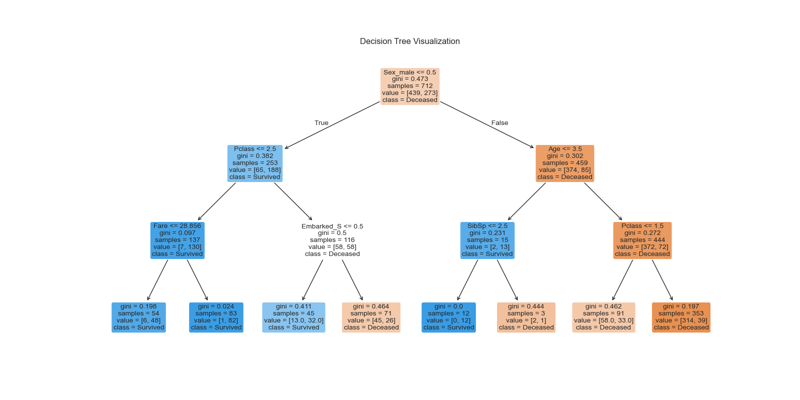
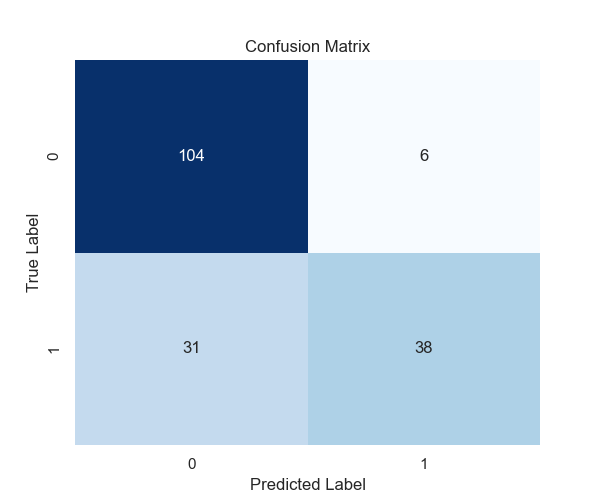
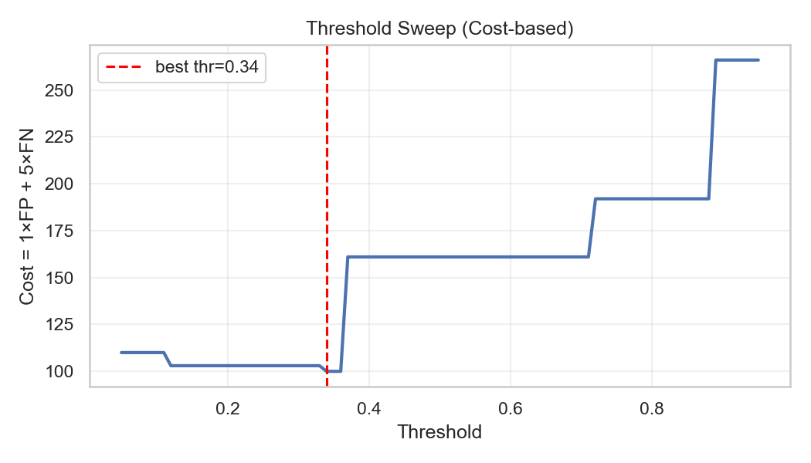
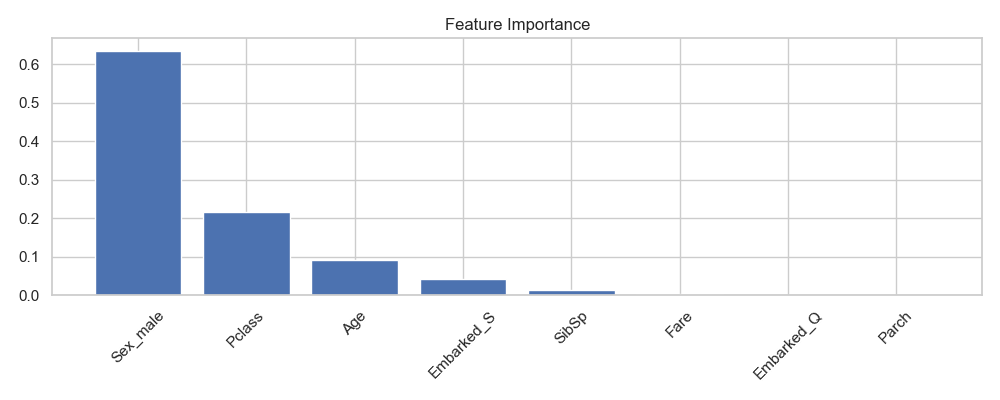
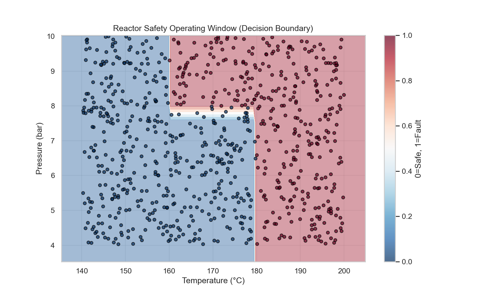

# Unit05｜Decision Tree 分類入門 + Confusion Matrix（第一個可解釋模型）

**課程名稱**：化工資料科學與機器學習實務（CHE-AI-101）  
**本堂課定位**：用決策樹完成第一個分類模型，並學會「怎麼評估與解讀」。  

> 先備：建議先完成 Part 1 的 `Part_1/Unit04_ML_Preprocessing_Workflow.*`（切分、標準化、Pipeline、Data Leakage）。

---

## 1. 什麼是監督式學習？(Supervised Learning)

直覺上，就是讓電腦「看題目 (X)、看答案 (y)、自己找規則 (Model)」。

**數學定義**：
假設我們有一個資料集 $D = \{(\mathbf{x}_i, y_i)\}_{i=1}^N$，其中 $\mathbf{x}_i \in \mathbb{R}^d$ 是 $d$ 維的特徵向量，$y_i$ 是對應的標籤。
監督式學習的目標是尋找一個函數 $f: \mathcal{X} \rightarrow \mathcal{Y}$，使得預測值 $\hat{y} = f(\mathbf{x})$ 與真實值 $y$ 之間的損失函數 (Loss Function) $L(y, \hat{y})$ 最小化：

$$ \min_{\theta} \sum_{i=1}^{N} L(y_i, f(\mathbf{x}_i; \theta)) $$

其中 $\theta$ 是模型的參數（例如決策樹的分裂閾值）。

- **特徵（Features, X）**：  
  影響結果的自變數，例如溫度、壓力、流量、濃度等。
- **標籤（Label/Target, y）**：  
  我們想要預測的目標，例如產品純度（數值）或設備是否異常（類別）。

### 在化工中的常見任務

- **迴歸（Regression）**：預測連續數值  
  - 根據操作條件 (T, P, F) 預測**產率 (%)** 或**轉化率**。
- **分類（Classification）**：預測類別  
  - 根據壓降、溫度、振動訊號判斷設備是 **正常** 或 **異常**。  
  - 根據乘客資訊（艙等、年齡、性別）預測是否 **存活**（Titanic 範例）。

> 本單元會以 Titanic 資料為例，從 Unit 01 清理好的特徵出發，訓練第一個分類模型（決策樹）。

---

## 2. 為什麼要 Train/Test Split？(避免 Overfitting)

如果把所有資料都拿來訓練，模型在「訓練資料」上會看起來非常厲害，  
但一換到新資料就崩潰，這就是 **過擬合（Overfitting）**。

**理論背景：泛化誤差 (Generalization Error)**
我們真正關心的不是模型背誦歷史資料的能力（Training Error），而是它對未見過資料的預測能力（Test Error）。
根據 **I.I.D. 假設**（Independent and Identically Distributed），我們隨機切分出的測試集可以作為真實世界數據的無偏估計 (Unbiased Estimator)。

為了公平評估模型的泛化能力，我們通常會將資料切成兩部分：

- **訓練集（Training Set，約 70–80%）**：  
  - 用來「教」模型。
- **測試集（Test Set，約 20–30%）**：  
  - 用來「考」模型，這部分資料在訓練過程中不讓模型看到。

> 就像考試：練習題（訓練集）可以看答案反覆練，但期末考（測試集）的題目不能事先曝光。

### 2.1 實務補充：資料切分其實有三種世界（i.i.d. / 時間序列 / 批次或 Campaign）

在真實化工資料裡，「怎麼切 Train/Test」常常比「用哪個模型」更重要，因為切錯會直接造成 **Data Leakage（偷看到未來或同一批次）**。

1. **i.i.d.（可隨機切分）**：例如 Titanic 這種一筆一筆獨立樣本  
   - 分類建議：`train_test_split(..., stratify=y)`（分層抽樣避免類別比例跑掉）
2. **時間序列（不能亂 shuffle）**：製程資料最常見（連續運轉、漂移、季節效應）  
   - 典型做法：依時間前後切分、或 `TimeSeriesSplit` 做回測（backtesting）
3. **批次 / Campaign / 品級切換（同一批次不能被切開）**：例如批次反應、發酵、campaign 生產  
   - 典型做法：`GroupShuffleSplit` / `GroupKFold`，用 `BatchID/CampaignID` 當 group

> 本堂課用 Titanic（i.i.d.）示範「分類最小流程」。但你要把技能帶進工廠時，請先問：我的資料到底是哪一種世界？

## 3. 白箱模型：決策樹 (Decision Tree)

為什麼在工業場合常用決策樹？一個重要原因是：  
> 它是「白箱模型（White-box Model）」：可以清楚解釋決策邏輯。

### 3.1 決策樹的數學原理：如何決定分裂點？

決策樹的核心在於：**如何選擇一個特徵與閾值，讓分裂後的子節點「最純 (Pure)」？**
Scikit-learn 預設使用 **Gini Impurity (吉尼不純度)** 作為評估標準。

假設一個節點包含 $C$ 個類別，第 $i$ 類樣本的比例為 $p_i$，則該節點的 Gini 不純度定義為：

$$ Gini(D) = 1 - \sum_{i=1}^{C} p_i^2 $$

- **$Gini = 0$**：最純，節點內所有樣本都屬於同一類。
- **$Gini = 0.5$**（二元分類）：最髒，兩類樣本各佔一半。

模型會遍歷所有特徵與所有可能的切分點，尋找能讓 **加權 Gini 不純度下降最多 (Information Gain)** 的切分方式。

### 3.2 決策樹結構分析

這很像工廠裡的 **SOP 決策流程圖**，工程師可以檢查每個判斷是否符合物理與工程常識。

 
*(圖：Titanic 生存預測的決策樹結構)*

**圖表解讀：**
1.  **根節點 (Root Node)**：通常是 `Sex_male <= 0.5` (即女性)。這顯示在 Titanic 災難中，「性別」是決定生存與否的最關鍵因素（Lady First）。
2.  **節點資訊**：
    - `gini`：該節點的不純度。
    - `samples`：該節點包含的樣本數。
    - `value`：[死亡人數, 存活人數]。
    - `class`：該節點預測的類別（多數決）。
3.  **決策路徑**：例如左下角的葉節點可能代表「女性且艙等較高」的群體，其生存率極高。

### 決策樹的優點與限制

- 優點：
  - 容易理解與視覺化，方便與現場工程師討論。  
  - 能夠處理數值與類別特徵。  
  - 不需要太多特徵縮放。
- 限制：
  - 深度太大時容易過擬合。  
  - 對資料的微小變動有時不太穩定（因此常搭配集成方法，如 Random Forest）。

---

## 4. 模型評估：Accuracy 以外要看 Confusion Matrix

在工業安全或品質管控中，**單看 Accuracy 會被誤導**。

### 4.1 評估指標定義

除了準確率，我們常用以下指標來評估特定面向的表現：

- **準確率 (Accuracy)**：答對的比例。
  $$ \frac{TP + TN}{TP + TN + FP + FN} $$
- **召回率 (Recall / Sensitivity)**：真正的故障中，抓出了多少？（**化工安全最重視此指標**）
  $$ \frac{TP}{TP + FN} $$
- **精確率 (Precision)**：預測為故障的警報中，有多少是真的？（減少誤報率）
  $$ \frac{TP}{TP + FP} $$

### 4.2 混淆矩陣 (Confusion Matrix) 分析

混淆矩陣把預測結果分成四種情況：

|                | 預測：安全 (Negative) | 預測：危險 (Positive) |
| :------------- | :-------------------- | :-------------------- |
| **真實：安全** | TN（真負）            | FP（假陽性，誤報）    |
| **真實：危險** | FN（假陰性，漏報）    | TP（真正）            |

         
*(圖：測試集的混淆矩陣，顏色越深代表數量越多)*

**圖表解讀：**
- **對角線 (TN, TP)**：顏色越深越好，代表模型預測正確的數量。
- **非對角線 (FP, FN)**：代表錯誤預測。
    - **FN (左下角)**：預測死亡但實際存活。
    - **FP (右上角)**：預測存活但實際死亡。
- 在 Titanic 案例中，若我們希望盡可能找出倖存者，我們會關注 Recall。但在化工製程異常偵測中，我們極度厭惡 FN（漏報異常），因此會調整模型閾值以最大化 Recall。

### 4.3 進階：Cross-Validation (交叉驗證)

在化工實驗中，數據往往很珍貴且數量稀少。如果只切一次 Train/Test，剛好切到比較「簡單」或「極端」的測試資料，評估結果可能不準。

**K-Fold Cross-Validation** 將資料分成 K 個部分 (Folds)，每次輪流用其中 1 份當測試集，其他 K-1 份當訓練集，重複 K 次後取平均。這樣能更穩健地估計模型的真實表現。

**數學定義**：

$$
E_{CV} = \frac{1}{K} \sum_{k=1}^{K} E_k
$$

其中 $E_k$ 是第 $k$ 折的評估指標（如 Accuracy）。

**實作範例**：
```python
from sklearn.model_selection import cross_val_score

scores = cross_val_score(model, X, y, cv=5, scoring='accuracy')
print(f"Mean Accuracy: {scores.mean():.4f} ± {scores.std():.4f}")
```

- 若標準差很小（< 2%），代表模型很穩定；若很大，可能是過擬合或數據量不足。

### 4.4 進階：Grid Search (超參數調校)

決策樹有許多「旋鈕」可以調整，這些稱為 **超參數 (Hyperparameters)**。調整超參數的過程，本質上是在權衡 **偏差 (Bias)** 與 **變異 (Variance)**。

**Grid Search** 會窮舉所有參數組合，並透過交叉驗證找出使驗證集表現最好的那組參數。

**數學表達**：

$$
\theta^* = \underset{\theta \in \Theta}{\text{argmin}} \frac{1}{K} \sum_{k=1}^{K} L(D_k, f(D_{\setminus k}; \theta))
$$

**實作範例**：
```python
from sklearn.model_selection import GridSearchCV

param_grid = {
    'max_depth': [3, 5, 7, 10, None],
    'min_samples_split': [2, 5, 10],
    'criterion': ['gini', 'entropy']
}

grid_search = GridSearchCV(
    DecisionTreeClassifier(random_state=42),
    param_grid,
    cv=5,
    scoring='accuracy'
)

grid_search.fit(X_train, y_train)
print(f"最佳參數組合: {grid_search.best_params_}")
print(f"最佳交叉驗證分數: {grid_search.best_score_:.4f}")
```

**結果解讀**：
- 如果最佳參數選了 `max_depth=3` 或 `5` 而不是 `None`，這印證了「樹不用太深也能有很好的表現」，太深反而容易過擬合。
- 這就像在化工廠做實驗設計 (DoE)，找到了反應的最佳溫度與壓力設定點。

### 4.5 類別不平衡（Imbalance）與錯誤成本（Cost）

化工異常偵測常見的現實是：**異常非常少**（例如 1% 甚至 0.1%）。這會讓 Accuracy 幾乎失去判斷力。

例：若 10,000 筆資料只有 100 筆異常（1%），你永遠預測「正常」，Accuracy 也有 99% —— 但模型完全沒用。  
因此工業實務通常要把「工程代價」放進模型決策：

- 你要抓到什麼？（Recall：漏報 FN 的代價通常很高）
- 你願意接受多少誤報？（Precision：誤報 FP 會造成停機、派工、打擾操作員）
- 定義錯誤成本矩陣：例如 `Cost(FN)=100`、`Cost(FP)=5`（公司/製程不同，數字差很多）

### 4.6 閾值調整與 PR 曲線（讓模型符合現場代價）

很多分類模型能輸出「正類機率」$p(\text{positive})$。上線時你必須選一個警報閾值 $\tau$：
$$
\hat{y} = \mathbb{1}[p(\text{positive}) \ge \tau]
$$

- $\tau$ 越低：越敏感（Recall ↑），但誤報變多（Precision ↓）
- $\tau$ 越高：越保守（Precision ↑），但更容易漏報（Recall ↓）

當資料高度不平衡時，常用 **PR curve（Precision–Recall curve）** 來挑選閾值，比 ROC 更能反映「正類很少」的情境。




---

## 5. 特徵重要性 (Feature Importance)

訓練完決策樹後，我們可以從模型中讀出「哪些特徵比較重要」。

**數學定義**：
特徵重要性是基於該特徵在樹中所有分裂點上所貢獻的 **不純度減少量 (Mean Decrease Impurity)** 加權總和。貢獻越多，重要性越高。

     
*(圖：影響生存率的關鍵特徵排序)*

**圖表解讀：**
1.  **Sex_male (性別)**：通常是最高的柱狀條。這符合歷史事實（婦孺優先）。
2.  **Pclass (艙等)**：通常排第二。反映了社會階級對逃生資源的獲取能力。
3.  **Age (年齡)**：雖然重要，但可能因為缺失值填補或與其他特徵相關，重要性稍低。
4.  **Fare (票價)**：與 Pclass 高度相關，重要性可能被分散。

這些資訊可以幫助工程決策，例如：

- 在預算有限情況下，決定要優先升級哪個儀表的精度。  
- 在實驗設計（DoE）時，優先在「重要特徵」附近做更細緻的實驗。

---

## 6. 模型保存與部署 (Model Persistence & Deployment)

訓練一個模型可能要花不少時間與資源；  
一旦訓練完成，通常會希望在實務系統中「重複使用」，而不是每次都從頭訓練。

### 使用 `joblib` 存取模型

```python
import joblib

# 存檔（例如訓練完下班前）
joblib.dump(model, "titanic_tree_model.pkl")

# 讀檔（隔天上班直接載入）
loaded_model = joblib.load("titanic_tree_model.pkl")
prediction = loaded_model.predict(new_data)
```

這就是最簡單的 **模型部署** 原型：

1. 在離線環境訓練好模型並保存。  
2. 在線上系統中載入 `.pkl` 模型，接新的資料做預測。  
3. 視需求定期用新資料重新訓練／更新模型。


---

## 7. 實務交付：模型卡（Model Card，作業格式）

從 Part 2 開始，建議每一個案例都用同一份「模型卡」交付（這是業界最常見的溝通方式之一）：

1. **任務與目標**：你在預測什麼？正類/負類怎麼定義？  
2. **資料切分方式**：i.i.d / time-series / group（為什麼這樣切？）  
3. **指標與閾值**：Accuracy + Precision/Recall/F1；若不平衡，附 PR curve、選用閾值與理由  
4. **三個失敗案例**：挑 3 筆錯誤預測（FP/FN），推測原因（資料/模型/假設）  
5. **工程合理性檢查**：單位、範圍、缺值、是否可能偷看到未來（Leakage）  
6. **部署與監控**：監控哪些指標？多久重訓？觸發條件？（在 Unit08 會做更完整）

---

## 8. 化工專題：反應器異常偵測 (Reactor Fault Detection)

除了 Titanic 生存預測，決策樹非常適合用於化工製程的 **異常偵測 (Fault Detection)**。

### 8.1 情境與理論分析

假設我們有一個連續攪拌槽反應器 (CSTR)，監控變數為 **溫度 (T)** 與 **壓力 (P)**：
- 當 T > 180°C 時，反應失控
- 當 T > 160°C 且 P > 8 bar 時，壓力過大導致洩漏風險

決策樹的決策邊界是由**垂直於特徵軸的超平面**所組成，非常擅長學習像 `IF T > 180` 這樣的規則（垂直切分），這與化工操作規程 (SOP) 的邏輯完全一致。

### 8.2 實作與視覺化


*(圖：反應器異常偵測的決策邊界，紅色為危險區，藍色為安全區)*

**圖形詳細解析**：

1. **幾何特性**：
   - 注意紅色與藍色交界的線條，它們全部都是 **水平線** 或 **垂直線**。這是決策樹的特性：它只能做 `X > Value` 這種單一變數的切分。
   - **垂直線 (T ≈ 180)**：對應規則 `T > 180`
   - **L型缺口 (T > 160 & P > 8)**：右上方的矩形危險區

2. **化工意義**：
   - 這張圖就是一張 **操作視窗 (Operating Window)** 圖
   - 透過機器學習，我們不需要人工去畫這些線，模型會自動從歷史數據中找出安全邊界
   - 如果未來有新的操作點落在紅色區域，系統就可以發出警報

### 8.3 工程應用價值

- ✅ **可解釋性**：決策邊界與 SOP 一致，工程師能理解並信任
- ✅ **即時監控**：計算速度快，適合線上系統
- ✅ **靈活調整**：可根據製程變化重新訓練

---

## 9. 課後練習：流體流動模式分類 (Flow Regime Classification)

為了讓同學練習 **多類別分類 (Multi-class Classification)**，我們準備了一個流體力學的案例。

### 9.1 背景

在化工管路設計中，氣液雙相流 (Gas-Liquid Two-Phase Flow) 的流動模式對於壓降計算與熱傳效率至關重要。常見的模式包含：
- **Bubble Flow (泡狀流)** (類別 0)：液體為主，氣體以小氣泡分散其中
- **Slug Flow (栓狀流)** (類別 1)：氣泡聚集成大氣塞，流動不穩定
- **Annular Flow (環狀流)** (類別 2)：氣體在中心高速流動，液體沿管壁成膜狀

### 9.2 任務

在 `Unit05_DecisionTree_Classification.ipynb` 的最後部分，我們提供了一組模擬數據，包含氣體表觀流速 ($V_{sg}$) 與液體表觀流速 ($V_{sl}$)。

請嘗試：
1. 建立決策樹模型
2. 畫出決策邊界圖，觀察模型如何區分這三種流動模式

**提示**：這與反應器異常偵測非常像，只是標籤 $y$ 變成了 0, 1, 2 三種類別。

**預期結果**：
- 你應該會看到三個不同顏色的區域，分別代表泡狀流、栓狀流、環狀流
- 決策邊界應該呈現水平或垂直的直線（決策樹特性）

---

## 本堂課程式演練

請開啟並完成：`Part_2/Unit05_DecisionTree_Classification.ipynb`  

---

## 下一步

- `Part_2/Unit06_CV_Model_Selection.md`：交叉驗證、超參數調整與更穩健的模型選擇（含化工安全邊界案例）。  
