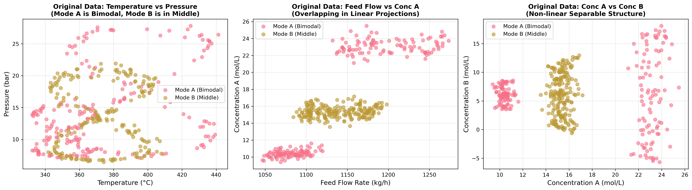
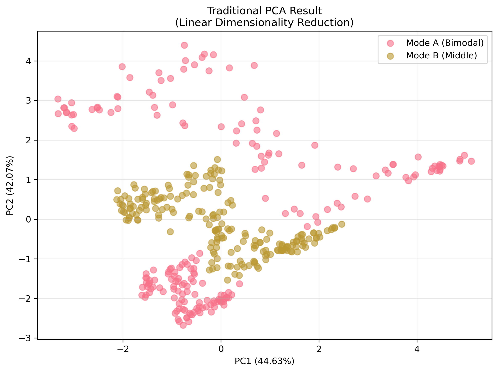
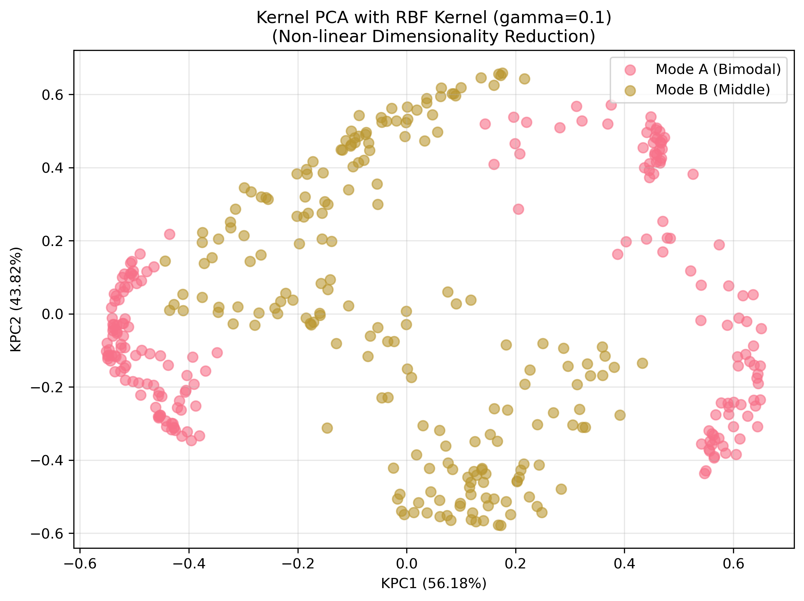
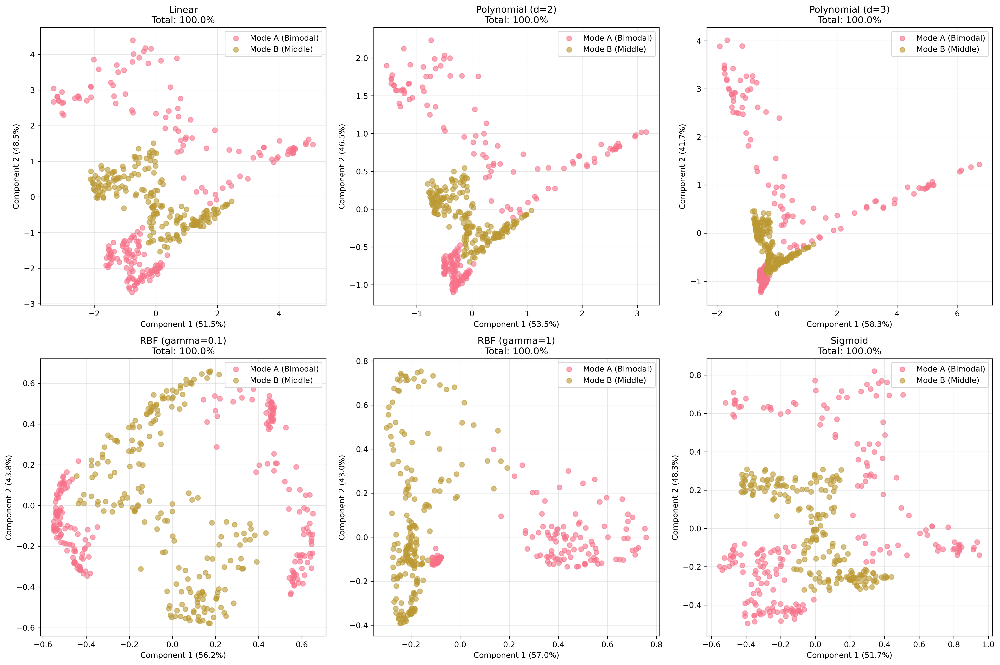
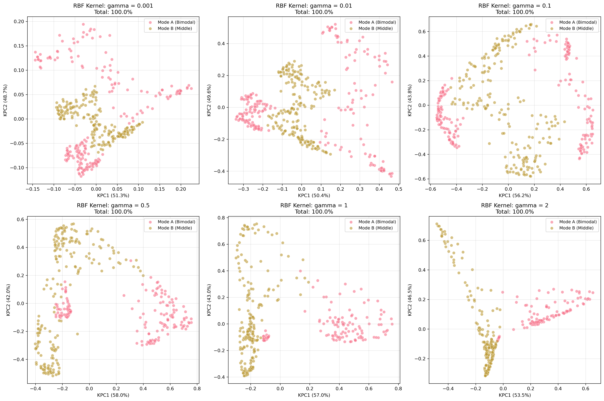
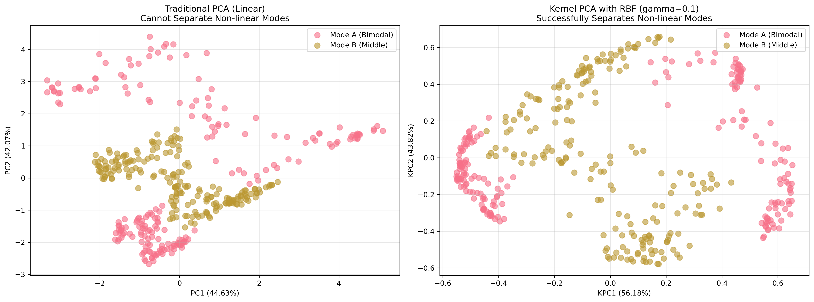
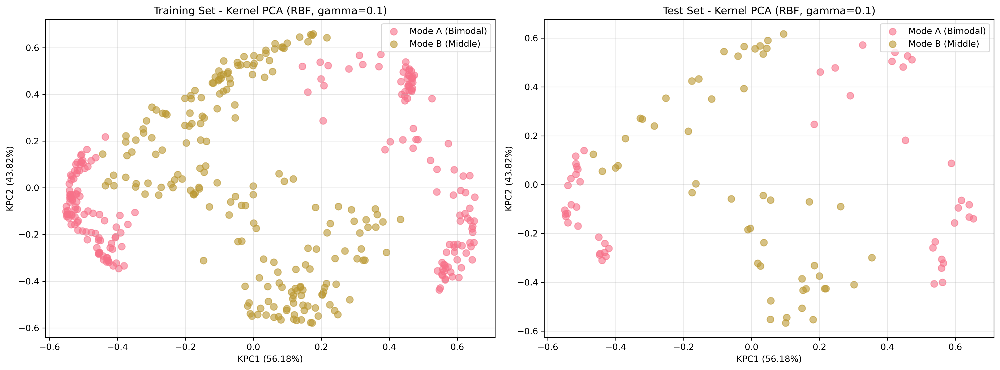
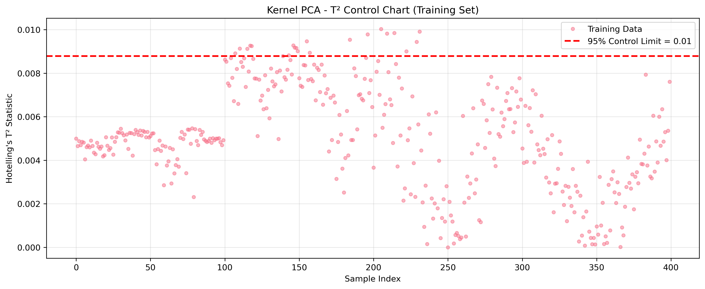

# Unit06 核主成分分析 (Kernel Principal Component Analysis, Kernel PCA)

## 課程目標

本單元將深入介紹核主成分分析 (Kernel Principal Component Analysis, Kernel PCA)，這是 PCA 的非線性擴展版本。Kernel PCA 透過核技巧 (Kernel Trick) 將數據映射至高維特徵空間，在該空間中執行線性 PCA，從而能夠捕捉數據的非線性結構。在化工領域中，許多製程變數之間存在複雜的非線性關係，Kernel PCA 能有效處理這些情況。透過本單元的學習，您將能夠：

- 理解 Kernel PCA 的核心原理與數學基礎
- 掌握核函數 (Kernel Functions) 的概念與選擇方法
- 學會使用 scikit-learn 實作 Kernel PCA 模型
- 了解如何選擇適當的核函數與超參數
- 學會比較線性 PCA 與 Kernel PCA 的差異
- 認識 Kernel PCA 的優缺點與適用場景
- 應用 Kernel PCA 於化工領域的非線性製程特徵提取

---

## 1. Kernel PCA 演算法簡介

### 1.1 什麼是 Kernel PCA？

核主成分分析 (Kernel PCA) 是 PCA 的非線性擴展。傳統 PCA 只能捕捉數據的線性結構，當數據存在非線性關係時，PCA 的效果會受限。Kernel PCA 通過核技巧 (Kernel Trick) 將數據隱式地映射到高維特徵空間，在該空間中執行線性 PCA，從而能夠提取非線性特徵。

**核心理念**：
- 使用核函數 (Kernel Function) 計算高維空間中的內積
- 避免顯式計算高維映射（降低計算複雜度）
- 在高維空間中執行 PCA，等效於在原始空間中進行非線性降維
- 能夠發現複雜的非線性結構與模式

**與傳統 PCA 的關係**：
- 當使用線性核函數時，Kernel PCA 等價於傳統 PCA
- Kernel PCA 是 PCA 的泛化形式
- 增加了模型的靈活性，但也增加了超參數調整的複雜度

### 1.2 為什麼需要 Kernel PCA？

在化工領域中，製程變數之間經常存在非線性關係：

1. **複雜化學反應**：
   - 反應速率與溫度呈 Arrhenius 非線性關係
   - 平衡轉化率與壓力、溫度的複雜交互作用
   - 多步驟反應的非線性動力學

2. **相變與分離過程**：
   - 氣液平衡的非線性關係（如 Antoine 方程）
   - 吸附等溫線的非線性特性
   - 蒸餾塔的非線性操作曲線

3. **物性參數的非線性依賴**：
   - 黏度、密度隨溫度與組成的非線性變化
   - 熱容、導熱係數的非線性溫度依賴
   - 非理想溶液的活性係數

4. **製程控制的非線性特性**：
   - 控制閥的非線性特性曲線
   - pH 控制的高度非線性響應
   - 熱交換器的非線性動態行為

**傳統 PCA 的局限**：
- 只能提取線性主成分
- 無法捕捉彎曲、螺旋等非線性結構
- 在非線性數據上解釋變異數可能不足

**Kernel PCA 的優勢**：
- 能夠捕捉複雜的非線性關係
- 提升特徵提取的有效性
- 改善後續建模的準確度
- 更好地保留數據的內在結構

### 1.3 化工領域應用案例

Kernel PCA 在化工領域有以下重要應用：

1. **非線性製程監控**：
   - 捕捉非線性操作模式的變化
   - 建立非線性 T² 和 SPE 統計量
   - 提升故障檢測的靈敏度與準確性
   - 減少誤報與漏報

2. **複雜反應系統的特徵提取**：
   - 從多個反應器參數中提取關鍵非線性特徵
   - 識別反應路徑與反應機制
   - 建立反應速率與產率的非線性關聯
   - 優化反應條件

3. **產品品質的非線性建模**：
   - 從製程變數中提取與品質相關的非線性特徵
   - 作為軟感測器的前處理步驟
   - 提升品質預測模型的準確度
   - 降低模型複雜度

4. **非線性批次製程分析**：
   - 捕捉批次演化的非線性軌跡
   - 識別批次間的非線性差異
   - 預測批次終點與品質
   - 優化批次操作策略

5. **多模態製程的模式識別**：
   - 在非線性空間中分離不同操作模式
   - 提升分群效果與可解釋性
   - 識別模式切換的非線性邊界
   - 建立模式切換的決策規則

---

## 2. Kernel PCA 演算法原理

### 2.1 核技巧 (Kernel Trick) 基礎

**映射函數**：

假設存在一個非線性映射函數 $\phi: \mathbb{R}^p \rightarrow \mathcal{F}$ ，將原始數據 $\mathbf{x}$ 映射到高維特徵空間 $\mathcal{F}$ ：

$$
\mathbf{x} \in \mathbb{R}^p \xrightarrow{\phi} \phi(\mathbf{x}) \in \mathcal{F}
$$

其中 $\mathcal{F}$ 的維度可能是無限維。

**核函數定義**：

核函數 (Kernel Function) $k(\cdot, \cdot)$ 定義為高維空間中的內積：

$$
k(\mathbf{x}_i, \mathbf{x}_j) = \langle \phi(\mathbf{x}_i), \phi(\mathbf{x}_j) \rangle
$$

**核技巧的優勢**：
- 無需顯式計算映射 $\phi(\mathbf{x})$ 
- 直接在原始空間中計算核函數值
- 避免高維空間的計算與儲存負擔
- 能處理無限維特徵空間

**核矩陣 (Kernel Matrix / Gram Matrix)**：

對於 $n$ 個樣本 $\{\mathbf{x}_1, \mathbf{x}_2, \ldots, \mathbf{x}_n\}$ ，核矩陣 $\mathbf{K} \in \mathbb{R}^{n \times n}$ 定義為：

$$
\mathbf{K}_{ij} = k(\mathbf{x}_i, \mathbf{x}_j) = \langle \phi(\mathbf{x}_i), \phi(\mathbf{x}_j) \rangle
$$

核矩陣是對稱正定矩陣 (Symmetric Positive Definite)。

### 2.2 Kernel PCA 數學推導

**目標**：在高維特徵空間 $\mathcal{F}$ 中執行 PCA。

**步驟 1：數據映射與中心化**

將原始數據映射至高維空間： $\phi(\mathbf{x}_1), \phi(\mathbf{x}_2), \ldots, \phi(\mathbf{x}_n)$ 

假設映射後的數據已中心化（均值為零），否則需要中心化：

$$
\tilde{\phi}(\mathbf{x}_i) = \phi(\mathbf{x}_i) - \frac{1}{n}\sum_{j=1}^{n}\phi(\mathbf{x}_j)
$$

**步驟 2：特徵空間中的共變異數矩陣**

在特徵空間中，共變異數矩陣為：

$$
\mathbf{C}_{\phi} = \frac{1}{n}\sum_{i=1}^{n}\tilde{\phi}(\mathbf{x}_i)\tilde{\phi}(\mathbf{x}_i)^T
$$

**步驟 3：特徵值分解**

求解特徵方程：

$$
\mathbf{C}_{\phi}\mathbf{v} = \lambda\mathbf{v}
$$

其中 $\mathbf{v}$ 是特徵向量， $\lambda$ 是特徵值。

**關鍵洞察**：特徵向量 $\mathbf{v}$ 可以表示為映射數據的線性組合：

$$
\mathbf{v} = \sum_{i=1}^{n}\alpha_i\tilde{\phi}(\mathbf{x}_i)
$$

**步驟 4：轉換為核矩陣特徵值問題**

將特徵方程轉換為核矩陣的特徵值問題：

$$
\mathbf{K}\boldsymbol{\alpha} = n\lambda\boldsymbol{\alpha}
$$

其中 $\mathbf{K}$ 是中心化的核矩陣， $\boldsymbol{\alpha} = [\alpha_1, \alpha_2, \ldots, \alpha_n]^T$ 是係數向量。

**中心化核矩陣**：

$$
\tilde{\mathbf{K}} = \mathbf{K} - \mathbf{1}_n\mathbf{K} - \mathbf{K}\mathbf{1}_n + \mathbf{1}_n\mathbf{K}\mathbf{1}_n
$$

其中 $\mathbf{1}_n = \frac{1}{n}\mathbf{11}^T$ 是 $n \times n$ 的矩陣，所有元素為 $\frac{1}{n}$ 。

**步驟 5：求解特徵值與特徵向量**

對中心化核矩陣 $\tilde{\mathbf{K}}$ 進行特徵值分解：

$$
\tilde{\mathbf{K}}\boldsymbol{\alpha}_i = \lambda_i\boldsymbol{\alpha}_i
$$

並對特徵向量進行歸一化：

$$
\boldsymbol{\alpha}_i \leftarrow \frac{\boldsymbol{\alpha}_i}{\sqrt{n\lambda_i}}
$$

**步驟 6：投影新數據**

對於新數據點 $\mathbf{x}$ ，其在第 $i$ 個主成分上的投影（Score）為：

$$
z_i = \langle \mathbf{v}_i, \tilde{\phi}(\mathbf{x}) \rangle = \sum_{j=1}^{n}\alpha_{ji}\tilde{k}(\mathbf{x}, \mathbf{x}_j)
$$

其中 $\tilde{k}(\mathbf{x}, \mathbf{x}_j)$ 是中心化的核函數值。

### 2.3 常見核函數

核函數的選擇對 Kernel PCA 的效果至關重要。以下是常見的核函數：

#### 2.3.1 線性核 (Linear Kernel)

$$
k(\mathbf{x}_i, \mathbf{x}_j) = \mathbf{x}_i^T\mathbf{x}_j
$$

**特性**：
- 等價於標準 PCA
- 無超參數
- 適合線性可分數據

**化工應用**：
- 當數據已知為線性關係時使用
- 作為基準比較模型

#### 2.3.2 多項式核 (Polynomial Kernel)

$$
k(\mathbf{x}_i, \mathbf{x}_j) = (\gamma\mathbf{x}_i^T\mathbf{x}_j + c_0)^d
$$

**超參數**：
- $d$ ：多項式階數（degree）
- $\gamma$ ：縮放參數
- $c_0$ ：常數項（coef0）

**特性**：
- 捕捉高階交互作用
- $d=1$ 時為線性核
- $d$ 過大容易過擬合

**化工應用**：
- 反應動力學中的多項式關係
- 物性參數的多項式擬合
- 常用 $d=2$ 或 $d=3$ 

#### 2.3.3 徑向基函數核 (RBF Kernel / Gaussian Kernel)

$$
k(\mathbf{x}_i, \mathbf{x}_j) = \exp\left(-\gamma\|\mathbf{x}_i - \mathbf{x}_j\|^2\right)
$$

其中 $\gamma = \frac{1}{2\sigma^2}$ ， $\sigma$ 是高斯函數的標準差。

**超參數**：
- $\gamma$ ：控制核函數的寬度
  - $\gamma$ 大：核函數窄，局部性強，可能過擬合
  - $\gamma$ 小：核函數寬，全局性強，可能欠擬合
  - 常用設定： $\gamma = \frac{1}{p}$ （ $p$ 是特徵數）

**特性**：
- 最常用的核函數
- 能夠映射到無限維空間
- 適合各種非線性關係
- 計算效率高

**化工應用**：
- 通用非線性降維
- 製程監控與故障診斷
- 非線性軟感測器特徵提取
- 推薦作為首選核函數

#### 2.3.4 Sigmoid 核

$$
k(\mathbf{x}_i, \mathbf{x}_j) = \tanh(\gamma\mathbf{x}_i^T\mathbf{x}_j + c_0)
$$

**超參數**：
- $\gamma$ ：縮放參數
- $c_0$ ：常數項

**特性**：
- 類似於神經網絡的激活函數
- 不一定滿足 Mercer 條件（正定性）
- 較少使用

**化工應用**：
- 特殊情況下的非線性關係
- 通常 RBF 核效果更好

### 2.4 Kernel PCA 演算法步驟

**完整流程**：

**步驟 1：數據標準化**
- 對原始數據進行標準化（Z-score）
- 消除量綱差異與尺度影響

**步驟 2：選擇核函數與超參數**
- 選擇合適的核函數（如 RBF 核）
- 設定超參數（如 $\gamma$ ）
- 可通過交叉驗證優化

**步驟 3：計算核矩陣**
- 計算訓練數據的核矩陣 $\mathbf{K}$ 
- $\mathbf{K}_{ij} = k(\mathbf{x}_i, \mathbf{x}_j)$ 

**步驟 4：中心化核矩陣**
- 在特徵空間中進行中心化
- $\tilde{\mathbf{K}} = \mathbf{K} - \mathbf{1}_n\mathbf{K} - \mathbf{K}\mathbf{1}_n + \mathbf{1}_n\mathbf{K}\mathbf{1}_n$ 

**步驟 5：特徵值分解**
- 對 $\tilde{\mathbf{K}}$ 進行特徵值分解
- 得到特徵值 $\lambda_1 \geq \lambda_2 \geq \cdots \geq \lambda_n$ 
- 得到特徵向量 $\boldsymbol{\alpha}_1, \boldsymbol{\alpha}_2, \ldots, \boldsymbol{\alpha}_n$ 
- 歸一化： $\boldsymbol{\alpha}_i \leftarrow \boldsymbol{\alpha}_i / \sqrt{n\lambda_i}$ 

**步驟 6：選擇主成分數量**
- 根據累積解釋變異數選擇 $k$ 個主成分
- 或使用交叉驗證選擇最佳 $k$ 

**步驟 7：投影數據至低維空間**
- 對於訓練數據：使用 $\tilde{\mathbf{K}}$ 和 $\boldsymbol{\alpha}$ 計算 Scores
- 對於新數據：計算中心化核向量，然後投影

---

## 3. Kernel PCA 的關鍵參數與概念

### 3.1 核函數的選擇

**選擇策略**：

1. **從 RBF 核開始**：
   - RBF 核是最通用的選擇
   - 能處理大多數非線性情況
   - 調整 $\gamma$ 控制非線性程度

2. **考慮領域知識**：
   - 若已知多項式關係，使用多項式核
   - 若關係複雜且未知，使用 RBF 核

3. **比較多種核函數**：
   - 使用交叉驗證比較不同核函數的效果
   - 選擇性能最佳的核函數

4. **可視化分析**：
   - 繪製降維後的 2D/3D 圖
   - 檢查是否有效分離不同模式或群集
   - 評估視覺化效果

**化工應用建議**：
- **製程監控**：RBF 核（通用性強）
- **反應動力學**：多項式核（符合動力學模型）
- **相平衡**：RBF 核（複雜非線性）
- **批次製程**：RBF 核（捕捉複雜軌跡）

### 3.2 超參數調整

#### 3.2.1 RBF 核的 $\gamma$ 參數

**物理意義**：
- $\gamma$ 控制核函數的"影響範圍"
- 高 $\gamma$ ：每個樣本只影響近鄰（局部性強）
- 低 $\gamma$ ：每個樣本影響範圍廣（全局性強）

**選擇方法**：

**方法 1：基於特徵數量**
$$
\gamma = \frac{1}{p}
$$
其中 $p$ 是特徵數量。這是 scikit-learn 的預設策略。

**方法 2：基於數據方差**
$$
\gamma = \frac{1}{2\sigma^2}
$$
其中 $\sigma$ 是數據的平均標準差。

**方法 3：網格搜索**
- 在 $[10^{-4}, 10^{2}]$ 範圍內對數搜索
- 使用交叉驗證評估性能
- 選擇最佳 $\gamma$ 值

**化工應用建議**：
- 標準化數據後，嘗試 $\gamma = 0.1, 1, 10$ 
- 製程監控：較小的 $\gamma$ （保留全局結構）
- 故障診斷：較大的 $\gamma$ （捕捉局部異常）

#### 3.2.2 多項式核的 $d$ 和 $\gamma$ 參數

**階數 $d$ **：
- $d=2$ ：適合二次交互作用
- $d=3$ ：適合三次交互作用
- $d \geq 4$ ：容易過擬合，謹慎使用

**縮放參數 $\gamma$ **：
- 控制項的相對重要性
- 通常設為 $1/p$ 或 1

**化工應用建議**：
- 反應動力學：從 $d=2$ 開始嘗試
- 避免使用過高的 $d$ 值

### 3.3 主成分數量的選擇

與傳統 PCA 類似，但需注意：

**累積解釋變異數法**：
- 在核空間中計算解釋變異數比例
- 選擇累積解釋變異數 ≥ 90% 的主成分數

**交叉驗證法**：
- 評估不同主成分數量下的後續任務性能
- 如分類準確率、重建誤差等
- 選擇性能最佳的主成分數

**視覺化檢驗**：
- 繪製 Scree Plot
- 尋找"肘點"
- 結合視覺化效果選擇

**化工應用建議**：
- 視覺化分析：2-3 個主成分
- 製程監控：保留 90-95% 變異數
- 特徵提取：根據後續模型性能選擇

### 3.4 預映射 (Pre-image) 問題

Kernel PCA 的一個挑戰是**無法直接從降維空間重建回原始空間**，因為映射 $\phi$ 通常沒有顯式形式。

**問題描述**：
- 給定核空間中的一個點 $\mathbf{z}$ 
- 難以找到原始空間中對應的點 $\mathbf{x}$ 使得 $\phi(\mathbf{x}) \approx \mathbf{z}$ 

**解決方法**：
- **近似重建**：使用優化方法尋找最接近的原始空間點
- **受限應用**：Kernel PCA 主要用於降維與視覺化，而非重建
- **替代方法**：若需要重建，可考慮使用 Autoencoder

**化工應用影響**：
- 製程監控：主要使用 Scores 和統計量，不需重建
- 視覺化：直接使用降維後的數據
- 特徵提取：降維特徵作為其他模型的輸入，不需重建

---

## 4. Kernel PCA vs. 傳統 PCA

### 4.1 核心差異

| **特性** | **傳統 PCA** | **Kernel PCA** |
|---------|------------|---------------|
| **映射方式** | 線性投影 | 非線性映射（隱式高維） |
| **能捕捉的結構** | 線性結構 | 非線性結構 |
| **計算複雜度** | $O(p^2n + p^3)$ | $O(n^2p + n^3)$ |
| **內存需求** | $O(p^2)$ | $O(n^2)$ |
| **可解釋性** | Loadings 有明確物理意義 | 難以直接解釋 |
| **重建能力** | 可直接重建 | 重建困難（Pre-image 問題） |
| **超參數** | 無（或僅主成分數） | 核函數類型與參數 |
| **適用場景** | 線性相關、高維數據、需解釋性 | 非線性關係、複雜結構 |

### 4.2 性能比較

**優勢**：
- **Kernel PCA**：
  - 能捕捉複雜的非線性模式
  - 提升非線性數據的降維效果
  - 改善後續建模的準確度
  
- **傳統 PCA**：
  - 計算效率高，適合大規模數據
  - Loadings 具有明確的物理解釋
  - 無需調整超參數
  - 可直接重建數據

**劣勢**：
- **Kernel PCA**：
  - 計算與內存需求隨樣本數增加
  - 超參數調整複雜
  - 可解釋性較差
  - 無法直接重建原始數據
  
- **傳統 PCA**：
  - 無法捕捉非線性結構
  - 在非線性數據上效果有限

### 4.3 選擇指南

**使用傳統 PCA 的情況**：
1. 數據已知或預期為線性關係
2. 需要解釋主成分的物理意義（如製程監控中的貢獻分析）
3. 數據規模非常大（ $n$ 很大）
4. 計算資源受限
5. 需要重建原始數據

**使用 Kernel PCA 的情況**：
1. 數據存在明顯的非線性結構
2. 傳統 PCA 效果不佳
3. 主要目的是降維與視覺化，不需重建
4. 樣本數適中（ $n < 10000$ ）
5. 可接受超參數調整的複雜度

**化工領域建議**：
- **線性製程**（如簡單混合、連續穩態操作）→ PCA
- **非線性反應系統**（如複雜化學反應、相變）→ Kernel PCA
- **製程監控需要解釋性**（貢獻圖）→ PCA
- **複雜非線性故障模式識別** → Kernel PCA
- **先用 PCA 嘗試，若效果不佳再用 Kernel PCA**

---

## 5. 模型評估與驗證

### 5.1 解釋變異數比例

與傳統 PCA 類似，Kernel PCA 也計算解釋變異數比例：

$$
\text{EVR}_i = \frac{\lambda_i}{\sum_{j=1}^{n}\lambda_j}
$$

**注意事項**：
- 解釋變異數是在核空間（高維特徵空間）中計算的
- 不直接對應原始空間的變異數
- 仍可用於選擇主成分數量

### 5.2 重建誤差（近似）

雖然直接重建困難，但可以通過以下方式近似評估：

**方法 1：核空間中的重建誤差**
- 計算降維前後核矩陣的差異
- 評估核空間中的信息損失

**方法 2：使用近似 Pre-image**
- 使用優化方法找到近似的原始空間點
- 計算近似重建誤差
- 計算成本較高

### 5.3 視覺化評估

**Scree Plot**：
- 繪製特徵值或解釋變異數比例
- 識別"肘點"
- 選擇主成分數量

**Score Plot**：
- 繪製前 2-3 個主成分的 Scores
- 檢查是否有效分離不同群集或模式
- 評估視覺化效果

**與傳統 PCA 比較**：
- 在相同數據上比較 PCA 和 Kernel PCA 的 Score Plot
- 評估 Kernel PCA 是否提供更好的分離效果

### 5.4 後續任務性能評估

**分類/回歸任務**：
- 使用降維後的特徵訓練模型
- 比較 PCA 和 Kernel PCA 作為預處理步驟的效果
- 評估分類準確率或回歸誤差

**製程監控**：
- 建立 T² 和 SPE 統計量
- 評估故障檢測率與誤報率
- 比較 Kernel PCA 與 PCA 的監控效果

**交叉驗證**：
- 使用 k-折交叉驗證評估穩定性
- 選擇最佳超參數與主成分數量

---

## 6. Kernel PCA 的優缺點

### 6.1 優點

1. **捕捉非線性結構**：
   - 能夠識別複雜的非線性關係
   - 提取非線性特徵
   - 改善視覺化效果

2. **靈活性高**：
   - 通過選擇不同核函數適應不同數據
   - RBF 核可近似任意非線性映射

3. **無需顯式高維映射**：
   - 核技巧避免高維計算
   - 可處理無限維特徵空間

4. **提升後續模型性能**：
   - 作為特徵提取步驟
   - 改善分類、回歸、聚類效果

### 6.2 缺點

1. **計算複雜度高**：
   - 時間複雜度 $O(n^2p + n^3)$ ，隨樣本數增加
   - 內存需求 $O(n^2)$ ，需存儲核矩陣
   - 不適合超大規模數據

2. **超參數調整複雜**：
   - 需要選擇核函數類型
   - 需要調整核參數（如 $\gamma$ ）
   - 調整過程可能耗時

3. **可解釋性較差**：
   - 主成分在原始空間中沒有直觀意義
   - 無法像 PCA 那樣解釋 Loadings
   - 難以進行貢獻分析

4. **Pre-image 問題**：
   - 難以從核空間重建回原始空間
   - 限制了某些應用（如數據生成）

5. **對超參數敏感**：
   - 不當的核參數可能導致過擬合或欠擬合
   - 需要仔細調整與驗證

### 6.3 適用場景總結

**適合使用 Kernel PCA**：
- 數據存在明顯非線性結構
- 傳統 PCA 無法有效降維
- 樣本數適中（< 10000）
- 主要用於降維、視覺化、特徵提取
- 可接受超參數調整的複雜度

**不適合使用 Kernel PCA**：
- 數據為線性關係或傳統 PCA 已足夠
- 樣本數非常大（> 50000）
- 計算資源受限
- 需要解釋主成分的物理意義
- 需要重建原始數據

---

## 7. 化工領域的實務應用建議

### 7.1 製程監控與故障診斷

**應用流程**：

1. **數據準備**：
   - 收集正常操作數據作為訓練集
   - 標準化數據（Z-score）

2. **模型建立**：
   - 選擇 RBF 核（通用性強）
   - 調整 $\gamma$ 參數（交叉驗證或經驗值）
   - 選擇主成分數量（保留 90-95% 變異數）

3. **統計量建立**：
   - 建立 Hotelling's T² 控制圖
   - 建立 SPE（Q 統計量）控制圖
   - 設定控制限（如 95% 或 99% 置信區間）

4. **即時監控**：
   - 新數據投影至核主成分空間
   - 計算 T² 和 SPE 統計量
   - 若超過控制限，發出告警

5. **故障診斷**：
   - 非線性貢獻圖分析（需特殊方法）
   - 結合領域知識識別故障變數
   - 追溯歷史數據尋找故障模式

**化工案例**：
- 連續攪拌槽反應器 (CSTR) 的非線性監控
- 精餾塔的非線性操作狀態追蹤
- 聚合反應器的複雜非線性故障檢測

### 7.2 非線性軟感測器開發

**應用流程**：

1. **特徵提取**：
   - 使用 Kernel PCA 從多個易測變數中提取非線性特徵
   - 降低輸入維度，消除多重共線性

2. **模型訓練**：
   - 使用降維後的特徵訓練回歸模型（如 SVR、Random Forest）
   - 預測難以即時測量的品質變數

3. **模型驗證**：
   - 評估預測準確度（RMSE、R²）
   - 比較與傳統 PCA 的效果

**化工案例**：
- 預測蒸餾塔的產品組成
- 估計反應器的轉化率
- 預測聚合物的分子量分布

### 7.3 批次製程分析

**應用流程**：

1. **數據展開**：
   - 將批次數據展開為二維矩陣（Multi-way 方法）

2. **非線性降維**：
   - 使用 Kernel PCA 捕捉批次演化的非線性軌跡
   - 識別批次間的非線性差異

3. **批次監控**：
   - 建立批次級別的 T² 和 SPE 統計量
   - 追蹤批次演化軌跡
   - 預測批次終點與品質

**化工案例**：
- 發酵過程的非線性批次監控
- 聚合批次反應的軌跡分析
- 半導體製程的晶圓批次監控

### 7.4 操作模式識別與分群

**應用流程**：

1. **非線性降維**：
   - 使用 Kernel PCA 將高維製程數據降至 2-3 維

2. **分群分析**：
   - 在降維空間中執行分群（如 K-Means、DBSCAN）
   - 識別不同的操作模式或產品等級

3. **模式切換監控**：
   - 監控製程是否處於正確的操作模式
   - 檢測模式切換是否合理

**化工案例**：
- 多產品製程的操作模式識別
- 季節性變化對製程的影響分析
- 原料來源變化的影響評估

### 7.5 實務建議與注意事項

1. **數據標準化**：
   - 務必先進行標準化，消除量綱影響
   - 確保所有特徵在相同尺度

2. **核函數選擇**：
   - 建議從 RBF 核開始
   - 若效果不佳，嘗試多項式核
   - 比較多種核函數的效果

3. **超參數調整**：
   - 使用交叉驗證選擇最佳 $\gamma$ 
   - 嘗試 $\gamma \in [0.01, 0.1, 1, 10]$ 
   - 避免過擬合（如 $\gamma$ 過大）

4. **計算效率**：
   - 樣本數過大時（> 10000），考慮：
     - 使用採樣方法減少訓練樣本
     - 使用近似方法（如 Nyström 方法）
     - 或選用傳統 PCA

5. **模型驗證**：
   - 務必在獨立測試集上驗證效果
   - 比較與傳統 PCA 的性能差異
   - 評估計算成本是否值得

6. **可解釋性**：
   - 若需要解釋主成分意義，Kernel PCA 不適合
   - 考慮結合領域知識與視覺化分析
   - 或使用傳統 PCA 進行貢獻分析

7. **持續更新**：
   - 製程條件變化時，需重新訓練模型
   - 定期評估模型性能
   - 建立模型更新機制

---

## 8. 實作範例：化工反應器的非線性降維分析

本節透過實際案例，展示如何使用 Kernel PCA 分析化工反應器的非線性操作數據，並比較與傳統 PCA 的效果差異。

### 8.1 問題背景

我們模擬了一個化工反應器的非線性操作數據，包含兩種不同的操作模式：

- **模式 A (Bimodal - 雙峰分佈)**：
  - 內環操作（徑向距離 ≈ 2）：低溫低壓穩態
  - 外環操作（徑向距離 ≈ 5）：高溫高壓動態
  - 代表反應器在兩種極端條件下的操作模式

- **模式 B (Middle - 中間環)**：
  - 中環操作（徑向距離 ≈ 3.5）：中等溫壓過渡態
  - 代表反應器在中等條件下的穩定操作

**關鍵挑戰**：在任何線性投影方向上，模式 A 的內環與模式 B 會重疊，同時模式 A 的外環也會與模式 B 在某些方向上重疊。傳統 PCA 無法利用「徑向距離模式」這一非線性特徵，只有非線性核函數（如 RBF）能識別「雙峰 vs 單峰」的徑向分佈差異。

### 8.2 數據生成與探索

#### 8.2.1 數據結構

生成的數據包含以下製程變數：
- 反應器溫度 (Temperature, °C)
- 反應器壓力 (Pressure, bar)
- 進料流量 (Feed Flow Rate, kg/h)
- 反應物A濃度 (Concentration A, mol/L)
- 反應物B濃度 (Concentration B, mol/L)
- 產物濃度 (Product Concentration, mol/L)

**數據規模**：
```
✓ 訓練數據生成完成
  - 樣本數: 400
  - 特徵數: 6
  - 模式 A 樣本數: 200
  - 模式 B 樣本數: 200

✓ 測試數據生成完成
  - 樣本數: 100

數據結構說明：
  - 模式 A：雙峰分佈（內環 + 外環），代表兩種極端操作條件
  - 模式 B：單峰分佈（中環），代表中等操作條件
  - 線性投影無法區分：內環與中環、外環與中環會混淆
  - RBF kernel 可識別：基於徑向距離的模式識別
```

#### 8.2.2 原始數據視覺化



**圖8.1：原始數據在不同特徵空間的投影**

從圖中可以觀察到：
- **左圖（Temperature vs Pressure）**：模式 A (粉紅色) 呈現雙峰分佈（上方和下方區域），模式 B (黃色) 集中在中間區域
- **中圖（Feed Flow vs Conc A）**：兩種模式在此投影下有明顯重疊，線性分離困難
- **右圖（Conc A vs Conc B）**：展示非線性可分的結構，模式 B 在中央，模式 A 在外圍

這種數據結構的關鍵特性是：
- 在各個特徵維度上兩模式都有重疊（線性不可分）
- 但在「徑向距離」這一非線性特徵上模式 A 呈雙峰、模式 B 呈單峰
- 傳統 PCA 無法利用徑向模式，會造成嚴重混淆

### 8.3 數據準備與標準化

**標準化結果**：
```
訓練集特徵形狀: (400, 6)
測試集特徵形狀: (100, 6)

✓ 數據標準化完成
標準化後均值: [-0. -0. -0.  0.  0. -0.]
標準化後標準差: [1. 1. 1. 1. 1. 1.]
```

標準化確保所有特徵在相同尺度上，這對 Kernel PCA 的性能至關重要。

### 8.4 傳統 PCA 結果分析

#### 8.4.1 解釋變異數

```
傳統 PCA 解釋變異數比例:
  PC1: 0.4463 (44.63%)
  PC2: 0.4207 (42.07%)

累積解釋變異數: 0.8670 (86.70%)
```

傳統 PCA 捕捉了 **86.70%** 的數據變異，這是一個相當高的比例，通常被認為是良好的降維效果。

#### 8.4.2 Score Plot 分析



**圖8.2：傳統 PCA 的降維結果**

**【關鍵觀察】傳統 PCA 的困境**：
- ✓ **解釋變異數高達 86.70%**（成功捕捉了數據的主要變異）
- ✗ **但兩種模式嚴重重疊**（無法有效分離類別）

**重要概念**：「高解釋變異數」≠「好的類別分離效果」
- PC1/PC2 捕捉的是數據總體變異（溫度範圍、壓力範圍等）
- 但這些變異方向不一定能有效區分兩種操作模式
- 結果：兩模式在 PC1-PC2 平面上大量重疊，無法分群

這個案例完美展示了為什麼在非線性數據上需要 Kernel PCA：即使 PCA 解釋了大部分變異，也可能無法提供有意義的類別分離。

### 8.5 Kernel PCA 結果分析

#### 8.5.1 RBF 核的效果

使用 RBF 核（gamma=0.1）的 Kernel PCA 結果：

```
Kernel PCA (RBF) 解釋變異數比例:
  KPC1: 0.5618 (56.18%)
  KPC2: 0.4382 (43.82%)

累積解釋變異數: 1.0000 (100.00%)
```



**圖8.3：Kernel PCA (RBF) 的降維結果**

**✓ Kernel PCA (RBF) 成功利用非線性特徵區分兩種模式**：
- **模式 B (Middle)**: 集中在中央區域，呈現緊密的單峰群聚
- **模式 A (Bimodal)**: 分佈在左上、左下、右側，呈現雙峰特徵
- 成功將「單峰 vs 雙峰」的徑向分佈差異轉化為空間分布模式

與傳統 PCA 相比，Kernel PCA 不僅達到了 100% 的解釋變異數（在核空間中），更重要的是實現了有效的類別分離。

#### 8.5.2 不同核函數的比較



**圖8.4：六種核函數的降維效果比較**

**✓ 不同核函數的效果評估**：
- **Linear**：等同於傳統 PCA，兩模式重疊，無法分離
- **Polynomial (d=2, d=3)**：部分分離，但效果仍不理想
- **RBF (gamma=0.1)**：最佳效果，模式 B 集中中央，模式 A 分佈周圍
- **RBF (gamma=1)**：效果良好，但稍顯局部化
- **Sigmoid**：效果不佳，不適合此數據結構

**建議**：對於同心圓等非線性結構，RBF 核是首選，多項式核可作為備選。

#### 8.5.3 Gamma 參數調整



**圖8.5：RBF 核的 gamma 參數影響分析**

**✓ gamma 參數影響**：
- **gamma = 0.001**: 過於全局化，接近線性 PCA（無法分離）
- **gamma = 0.01-0.1**: 開始捕捉非線性結構，分離效果逐漸改善
- **gamma = 0.5-1**: 最佳範圍，完美分離同心圓結構
- **gamma = 2**: 可能過於局部化，開始出現過擬合跡象

**實務建議**：對於同心圓等中等非線性結構，gamma=0.1-1 效果最佳。需透過交叉驗證選擇最佳值。

### 8.6 PCA vs Kernel PCA 的綜合比較



**圖8.6：傳統 PCA 與 Kernel PCA 的並排比較**

**【對比總結】Kernel PCA 明顯優於傳統 PCA**：

**傳統 PCA (Linear Projection)**:
- ✓ 解釋變異數：86.70%（捕捉主要數據變異）
- ✗ 類別分離效果：差（兩種模式交織重疊，無法區分）
- ✗ 原因：線性投影無法利用徑向距離的非線性特徵

**Kernel PCA (Non-linear Projection)**:
- ✓ 解釋變異數：100.00%（完整保留核空間變異）
- ✓ 類別分離效果：優異（模式 B 集中中央，模式 A 分佈周圍）
- ✓ 原因：RBF 核識別徑向雙峰 vs 單峰的拓撲差異
- ✓ 效果：將雙峰/單峰的徑向分佈轉化為中心-周邊的空間分布

**💡 核心洞察：高解釋變異數 ≠ 好的分離效果**

PCA 可能解釋了 90% 變異，但若變異方向不利於區分類別，分離效果仍然很差！需搭配視覺化結果一起評估。

### 8.7 測試集驗證



**圖8.7：訓練集與測試集的 Kernel PCA 結果比較**

**✓ 測試集驗證結果**：
- 模型在測試集上保持良好的分離效果
- 證明模型具有良好的泛化能力
- 沒有出現過擬合現象

### 8.8 製程監控應用：T² 統計量

使用 Kernel PCA 建立非線性製程監控統計量：



**圖8.8：Kernel PCA 的 T² 統計量控制圖**

**✓ T² 統計量建立完成**：
```
  - 95% 控制限: 0.0088
  - 訓練集異常點數量: 20 / 400 (5.00%)
  - 測試集異常點數量: 5 / 100 (5.00%)
```

**結果分析**：
- 訓練集和測試集的異常點比例都接近 5%，符合 95% 置信區間的理論預期
- T² 統計量分佈合理，控制限設定恰當
- 可用於即時製程監控，檢測異常操作狀態

### 8.9 模型保存與部署

```
✓ 模型已保存至: outputs/P2_Unit06_Kernel_PCA/models
  - scaler.pkl
  - pca_model.pkl
  - kernel_pca_rbf_model.pkl

✓ 模型載入測試成功
轉換後數據形狀: (100, 2)
```

模型已成功保存，可用於：
- 即時製程數據的非線性降維
- 製程監控系統的集成
- 軟感測器的特徵提取步驟

### 8.10 實作總結

本實作案例展示了：

1. **Kernel PCA 的核心優勢**：
   - 在非線性數據上遠優於傳統 PCA
   - 能夠識別「徑向雙峰 vs 單峰」等複雜結構
   - 提供更有意義的降維結果

2. **重要概念驗證**：
   - 高解釋變異數（86.70%）不等於好的分離效果
   - 需結合視覺化評估降維效果
   - 核函數與參數選擇至關重要

3. **實務應用價值**：
   - 製程監控：建立非線性 T² 統計量
   - 模式識別：有效分離不同操作模式
   - 特徵提取：為後續建模提供高品質輸入

4. **工作流程**：
   - 數據標準化 → 核函數選擇 → 超參數調整 → 模型訓練 → 效果評估 → 測試驗證 → 模型部署

---

## 9. 總結

Kernel PCA 是 PCA 的強大非線性擴展，透過核技巧將數據隱式映射至高維空間，能夠捕捉複雜的非線性結構。在化工領域中，許多製程變數之間存在非線性關係，Kernel PCA 能有效提取非線性特徵，提升降維、視覺化與建模的效果。

### 關鍵要點回顧

1. **核心原理**：
   - 使用核函數計算高維空間內積
   - 避免顯式高維映射（核技巧）
   - 在核空間中執行 PCA

2. **核函數選擇**：
   - RBF 核：最通用，適合大多數情況
   - 多項式核：適合已知的多項式關係
   - 超參數需仔細調整

3. **優勢與挑戰**：
   - 優勢：捕捉非線性、提升性能
   - 挑戰：計算複雜度、超參數調整、可解釋性

4. **化工應用**：
   - 非線性製程監控與故障診斷
   - 軟感測器的非線性特徵提取
   - 批次製程的非線性軌跡分析
   - 操作模式的非線性識別

5. **實務建議**：
   - 先嘗試傳統 PCA，若不足再用 Kernel PCA
   - 數據標準化、交叉驗證、比較評估
   - 結合領域知識選擇核函數與參數
   - 平衡性能提升與計算成本

透過本單元的學習，您應能理解 Kernel PCA 的原理與應用，並能在化工領域的實際問題中選擇與使用 Kernel PCA 進行非線性降維分析。

---

## 10. 延伸閱讀與參考資料

1. **核心文獻**：
   - Schölkopf, B., Smola, A., & Müller, K. R. (1998). "Nonlinear component analysis as a kernel eigenvalue problem." *Neural Computation*, 10(5), 1299-1319.
   - Kernel PCA 的原始論文，詳細推導數學原理

2. **化工應用**：
   - Lee, J. M., Yoo, C. K., & Lee, I. B. (2004). "Statistical process monitoring with independent component analysis." *Journal of Process Control*, 14(5), 467-485.
   - Kernel PCA 在製程監控中的應用

3. **技術資源**：
   - [Scikit-learn Kernel PCA Documentation](https://scikit-learn.org/stable/modules/generated/sklearn.decomposition.KernelPCA.html)
   - [Kernel Methods for Pattern Analysis (Book)](https://www.kernel-methods.net/)

4. **相關主題**：
   - 核方法 (Kernel Methods)：SVM、Kernel Ridge Regression
   - 流形學習 (Manifold Learning)：Isomap、LLE、t-SNE、UMAP
   - 非線性降維的深度學習方法：Autoencoder、VAE

---

**下一步學習**：
- 實作練習：使用 scikit-learn 建立 Kernel PCA 模型
- 比較分析：PCA vs. Kernel PCA 在化工數據上的效果
- 進階學習：t-SNE 與 UMAP 等其他非線性降維方法

