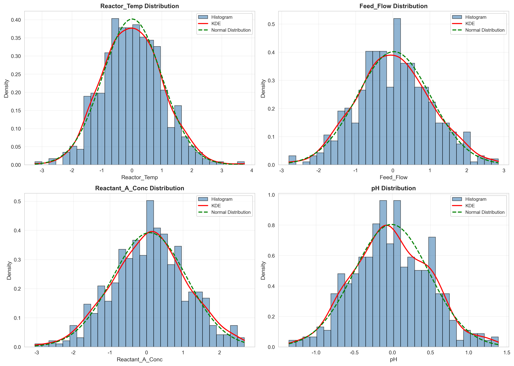
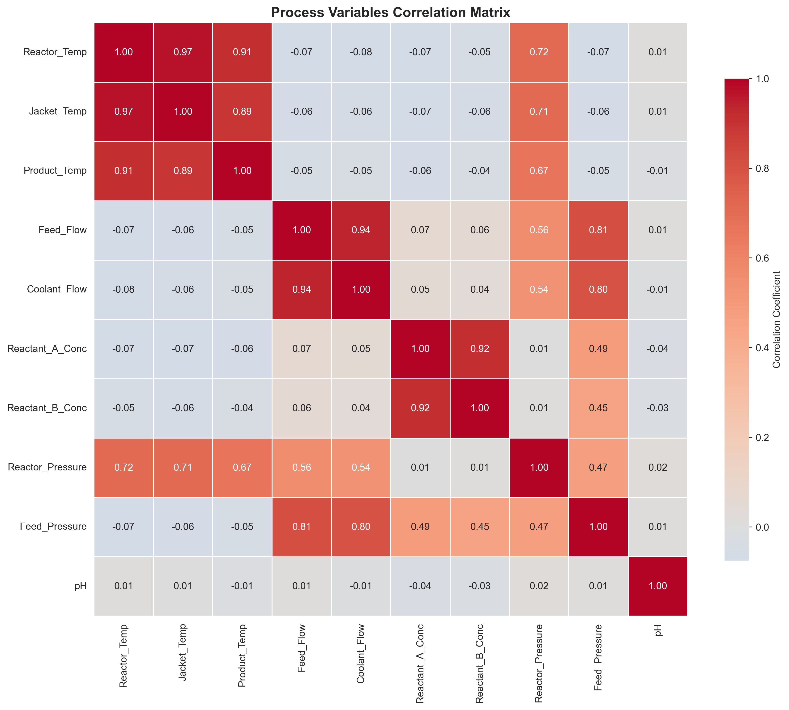
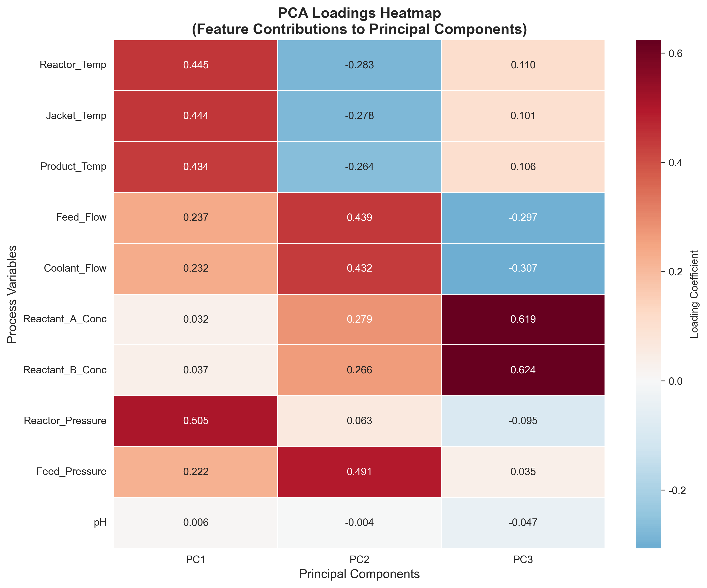
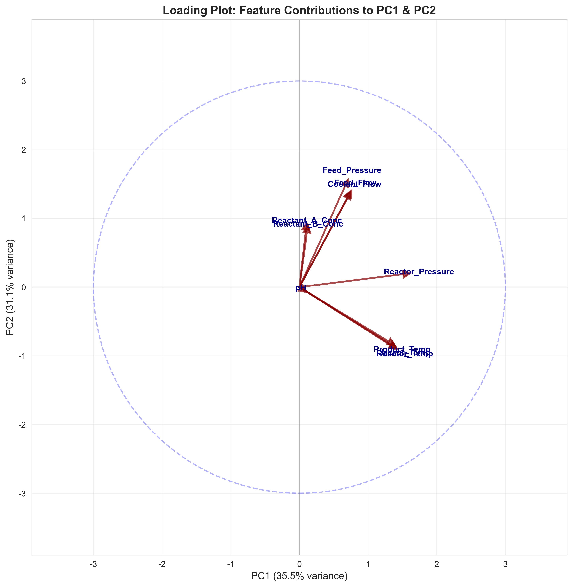
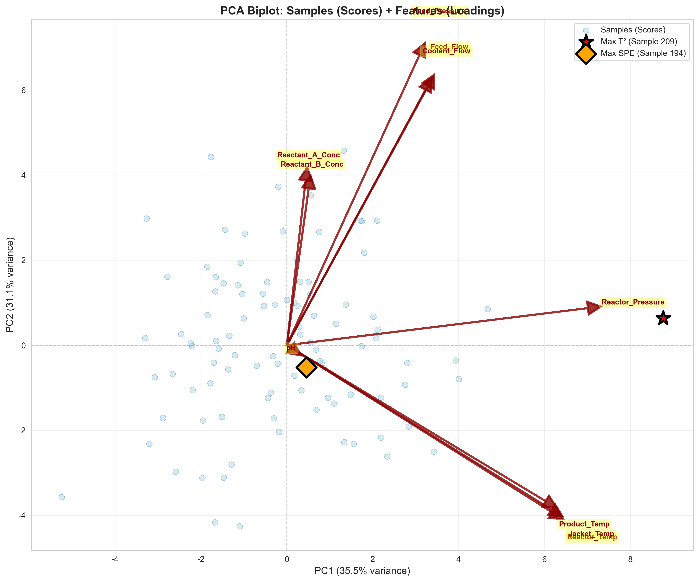
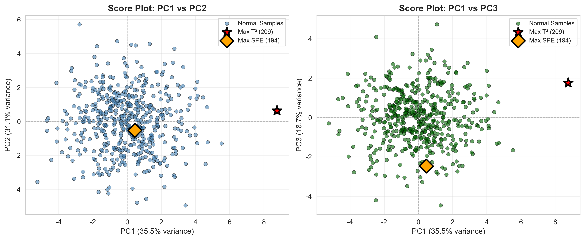
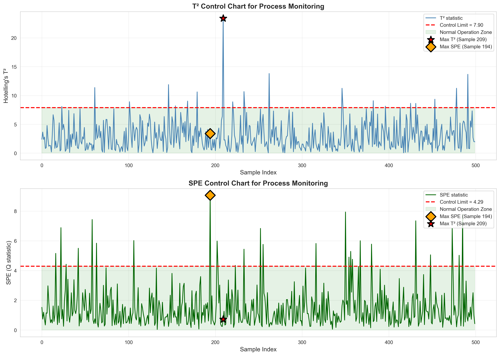
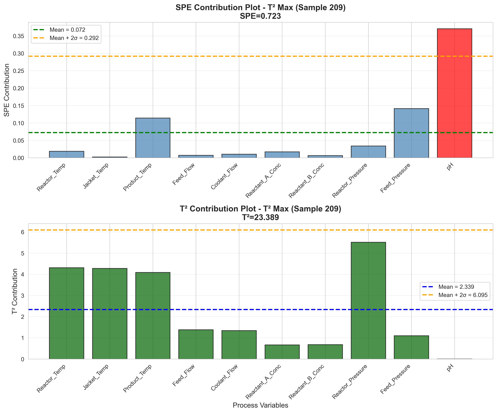
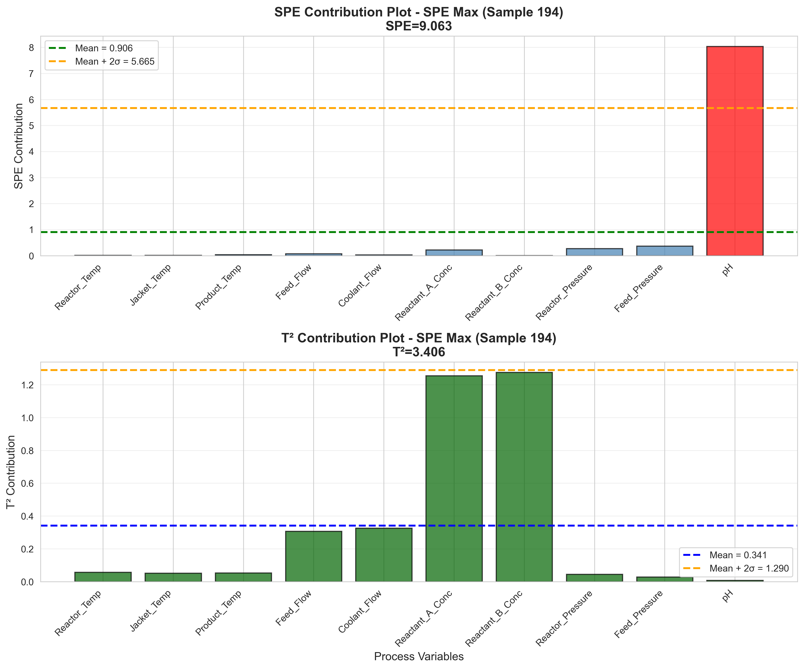

# Unit06 主成分分析 (Principal Component Analysis, PCA)
# **🌟重點教學單元!**
## 課程目標

本單元將深入介紹主成分分析 (Principal Component Analysis, PCA)，這是降維技術中最經典且應用最廣泛的線性降維方法。PCA 在化工領域的製程監控、故障診斷、品質預測等應用中扮演關鍵角色。透過本單元的學習，您將能夠：

- 理解 PCA 的核心原理與數學基礎
- 掌握 PCA 的演算法步驟與實作細節
- 學會使用 scikit-learn 實作 PCA 模型
- 了解如何選擇最佳的主成分數量
- 學會解釋主成分的物理意義 (Loadings & Scores)
- 認識 PCA 的優缺點與適用場景
- 應用 PCA 於化工領域的製程監控與故障診斷

---

## 1. PCA 演算法簡介

### 1.1 什麼是 PCA？

主成分分析 (PCA) 是一種無監督式學習的降維技術，旨在將高維數據投影到低維空間，同時最大程度地保留數據的變異性 (Variance)。PCA 通過線性變換將原始特徵轉換為一組新的正交特徵（主成分），這些主成分依照其解釋變異數的大小排序。

**核心理念**：
- 找到數據變異最大的方向作為第一主成分
- 在與第一主成分正交的方向中，找到變異最大的方向作為第二主成分
- 依此類推，直到所有主成分被確定

### 1.2 PCA 的核心概念

**主成分 (Principal Components)**：
- 新的特徵軸，由原始特徵的線性組合構成
- 彼此正交（不相關）
- 按解釋變異數大小排序

**解釋變異數 (Explained Variance)**：
- 每個主成分所保留的原始數據變異程度
- 用於評估降維後的信息保留率

**載荷 (Loadings)**：
- 原始特徵對主成分的貢獻係數
- 用於解釋主成分的物理意義

**得分 (Scores)**：
- 原始數據在主成分空間的投影座標
- 用於數據視覺化與分析

### 1.3 化工領域應用案例

PCA 在化工領域有廣泛且重要的應用：

1. **製程監控與故障診斷**：
   - 建立 Hotelling's T² 和 SPE (Q統計量) 控制圖
   - 即時監控製程是否偏離正常操作
   - 透過貢獻圖 (Contribution Plot) 找出故障變數
   - 實現多變數統計製程控制 (MSPC)

2. **品質預測模型降維**：
   - 減少輸入變數數量，降低模型複雜度
   - 消除共線性 (Multicollinearity) 問題
   - 提升預測模型的泛化能力
   - 加速模型訓練速度

3. **高維製程數據視覺化**：
   - 將數十甚至上百個感測器數據降至 2D/3D
   - 視覺化操作模式的分布與轉換
   - 識別異常操作條件
   - 探索批次間的差異

4. **軟感測器開發**：
   - 使用容易測量的變數（溫度、壓力、流量）
   - 預測難以即時測量的品質指標（組成、純度）
   - PCA 作為特徵提取步驟，提升預測準確度
   - 減少感測器冗餘，降低維護成本

5. **批次製程分析**：
   - 多變量批次演化軌跡 (Multi-way PCA)
   - 批次品質預測與故障診斷
   - 批次終點檢測 (Batch End-Point Detection)

---

## 2. PCA 演算法原理

### 2.1 數學基礎：變異數最大化觀點

假設我們有 $n$ 個樣本， $p$ 個特徵的數據矩陣 $\mathbf{X} \in \mathbb{R}^{n \times p}$ （已中心化，即每列均值為 0）。

**第一主成分 (PC1)**：

找到一個方向向量 $\mathbf{w}_1 \in \mathbb{R}^{p}$ （ $\|\mathbf{w}_1\| = 1$ ），使得數據在該方向上的投影變異數最大：

$$
\mathbf{w}_1 = \arg\max_{\|\mathbf{w}\|=1} \text{Var}(\mathbf{X}\mathbf{w}) = \arg\max_{\|\mathbf{w}\|=1} \mathbf{w}^T\mathbf{X}^T\mathbf{X}\mathbf{w}
$$

其中 $\mathbf{X}^T\mathbf{X}$ 是共變異數矩陣的倍數（若已標準化，則為相關矩陣）。

**第二主成分 (PC2)**：

找到與 $\mathbf{w}_1$ 正交的方向 $\mathbf{w}_2$ ，使得投影變異數最大：

$$
\mathbf{w}_2 = \arg\max_{\substack{\|\mathbf{w}\|=1 \\ \mathbf{w}^T\mathbf{w}_1=0}} \mathbf{w}^T\mathbf{X}^T\mathbf{X}\mathbf{w}
$$

**後續主成分**：依此類推，每個主成分與之前所有主成分正交。

### 2.2 數學基礎：特徵值分解觀點

PCA 的數學核心是對共變異數矩陣或相關矩陣進行特徵值分解 (Eigenvalue Decomposition)。

**步驟**：

1. **計算共變異數矩陣**：

$$
\mathbf{C} = \frac{1}{n-1}\mathbf{X}^T\mathbf{X}
$$

2. **特徵值分解**：

$$
\mathbf{C}\mathbf{w}_i = \lambda_i \mathbf{w}_i
$$

其中 $\lambda_i$ 是特徵值， $\mathbf{w}_i$ 是對應的特徵向量。

3. **排序特徵值**：

將特徵值按大小降序排列： $\lambda_1 \geq \lambda_2 \geq \cdots \geq \lambda_p \geq 0$ 

4. **選擇主成分**：

選擇前 $k$ 個特徵向量作為主成分的方向，對應的特徵值表示該主成分解釋的變異數。

**關鍵性質**：
- 特徵值 $\lambda_i$ 表示第 $i$ 個主成分的變異數
- 特徵向量 $\mathbf{w}_i$ 表示第 $i$ 個主成分的方向
- 所有主成分彼此正交： $\mathbf{w}_i^T\mathbf{w}_j = 0$ （ $i \neq j$ ）

### 2.3 數學基礎：奇異值分解 (SVD) 觀點

在實務中，PCA 通常透過奇異值分解 (Singular Value Decomposition, SVD) 計算，這在數值上更穩定且高效。

**SVD 分解**：

$$
\mathbf{X} = \mathbf{U}\mathbf{\Sigma}\mathbf{V}^T
$$

其中：
- $\mathbf{U} \in \mathbb{R}^{n \times n}$ ：左奇異向量矩陣
- $\mathbf{\Sigma} \in \mathbb{R}^{n \times p}$ ：奇異值對角矩陣
- $\mathbf{V} \in \mathbb{R}^{p \times p}$ ：右奇異向量矩陣

**與 PCA 的關係**：
- $\mathbf{V}$ 的列向量即為主成分方向（Loadings）
- $\mathbf{X}\mathbf{V}$ 即為主成分得分（Scores）
- 奇異值的平方與特徵值成正比： $\lambda_i = \sigma_i^2 / (n-1)$ 

### 2.4 PCA 演算法步驟

**完整流程**：

**步驟 1：數據標準化**
- 對每個特徵進行中心化（減去均值）
- 可選：進行標準化（除以標準差）
- 標準化適用於特徵尺度差異大的情況

**步驟 2：計算共變異數矩陣或相關矩陣**
- 共變異數矩陣： $\mathbf{C} = \frac{1}{n-1}\mathbf{X}^T\mathbf{X}$ 
- 相關矩陣：使用標準化後的數據

**步驟 3：計算特徵值與特徵向量**
- 使用 SVD 或特徵值分解
- 得到特徵值 $\lambda_1, \lambda_2, \ldots, \lambda_p$ 
- 得到特徵向量 $\mathbf{w}_1, \mathbf{w}_2, \ldots, \mathbf{w}_p$ 

**步驟 4：選擇主成分數量**
- 根據累積解釋變異數比例選擇 $k$ 個主成分
- 例如：選擇前 $k$ 個主成分使累積解釋變異數 ≥ 90%

**步驟 5：投影數據至低維空間**
- 構建投影矩陣： $\mathbf{W}_k = [\mathbf{w}_1, \mathbf{w}_2, \ldots, \mathbf{w}_k]$ 
- 降維數據： $\mathbf{Z} = \mathbf{X}\mathbf{W}_k \in \mathbb{R}^{n \times k}$ 

**步驟 6（選擇性）：重建數據**
- 從降維空間重建回原始空間： $\hat{\mathbf{X}} = \mathbf{Z}\mathbf{W}_k^T$ 
- 計算重建誤差以評估降維品質

---

## 3. PCA 的關鍵參數與概念

### 3.1 解釋變異數比例 (Explained Variance Ratio)

**定義**：

第 $i$ 個主成分的解釋變異數比例為：

$$
\text{EVR}_i = \frac{\lambda_i}{\sum_{j=1}^{p}\lambda_j}
$$

**累積解釋變異數比例**：

前 $k$ 個主成分的累積解釋變異數比例：

$$
\text{CEVR}_k = \sum_{i=1}^{k}\text{EVR}_i = \frac{\sum_{i=1}^{k}\lambda_i}{\sum_{j=1}^{p}\lambda_j}
$$

**意義**：
- 表示主成分保留了多少原始數據的信息
- 用於決定保留多少個主成分
- 常見閾值：80%、85%、90%、95%

### 3.2 載荷 (Loadings)

**定義**：

Loadings 是原始特徵對主成分的貢獻係數，即特徵向量 $\mathbf{w}_i$ 的元素。

**Loadings 矩陣**：

$$
\mathbf{W} = [\mathbf{w}_1, \mathbf{w}_2, \ldots, \mathbf{w}_k] \in \mathbb{R}^{p \times k}
$$

其中 $\mathbf{w}_i = [w_{1i}, w_{2i}, \ldots, w_{pi}]^T$ 

**解釋意義**：
- $w_{ji}$ 表示第 $j$ 個原始特徵對第 $i$ 個主成分的貢獻
- $|w_{ji}|$ 越大，表示該特徵對該主成分越重要
- 透過 Loadings 可解釋主成分的物理意義

**化工應用範例**：
- PC1 的 Loadings 若溫度、壓力係數大 → PC1 可能代表「熱力學狀態」
- PC2 的 Loadings 若流量、濃度係數大 → PC2 可能代表「物質傳輸」

### 3.3 得分 (Scores)

**定義**：

Scores 是原始數據在主成分空間的投影座標：

$$
\mathbf{Z} = \mathbf{X}\mathbf{W} \in \mathbb{R}^{n \times k}
$$

其中 $\mathbf{z}_i = [z_{i1}, z_{i2}, \ldots, z_{ik}]^T$ 是第 $i$ 個樣本的 Score 向量。

**意義**：
- Score 是降維後的新特徵
- 可用於視覺化、分群、建模
- Score Plot 常用於製程監控

**化工應用**：
- T² Score Plot：監控製程是否正常
- Score Trajectory：追蹤批次製程演化
- Score Clustering：識別操作模式

### 3.4 重建誤差 (Reconstruction Error)

**定義**：

從降維空間重建回原始空間的誤差：

$$
\mathbf{E} = \mathbf{X} - \hat{\mathbf{X}} = \mathbf{X} - \mathbf{Z}\mathbf{W}^T
$$

**平方預測誤差 (SPE) 或 Q 統計量**：

對於第 $i$ 個樣本：

$$
\text{SPE}_i = \|\mathbf{e}_i\|^2 = \sum_{j=1}^{p}e_{ij}^2
$$

**意義**：
- SPE 衡量樣本是否偏離 PCA 模型
- 用於製程監控：SPE 過大表示異常
- 補充 T² 統計量，監控模型外的變異

---

## 4. 選擇主成分數量的方法

選擇適當的主成分數量 $k$ 是 PCA 應用的關鍵步驟。

### 4.1 累積解釋變異數法

**原理**：
- 選擇前 $k$ 個主成分，使累積解釋變異數達到預設閾值
- 常見閾值：80%、85%、90%、95%

**優點**：直觀易懂，易於實施
**缺點**：閾值選擇有主觀性

**化工應用建議**：
- 製程監控：通常選擇 90-95%（高信息保留）
- 視覺化分析：2-3 個主成分（便於繪圖）
- 建模前處理：80-90%（平衡性能與複雜度）

### 4.2 陡坡圖法 (Scree Plot)

**原理**：
- 繪製主成分編號 vs. 特徵值（或解釋變異數）曲線
- 尋找曲線中的"肘點"（斜率顯著變化處）
- 肘點之後的主成分貢獻較小，可忽略

**優點**：視覺化直觀
**缺點**：肘點不一定明顯，存在主觀判斷

### 4.3 Kaiser 準則

**原理**：
- 只保留特徵值 > 1 的主成分（當使用相關矩陣時）
- 理由：特徵值 < 1 的主成分解釋變異數少於一個原始變數

**優點**：簡單明確
**缺點**：僅適用於標準化數據，可能過於保守或激進

### 4.4 交叉驗證法

**原理**：
- 使用交叉驗證評估不同 $k$ 值下的重建誤差或後續模型性能
- 選擇性能最佳的 $k$ 值

**優點**：基於實際應用性能
**缺點**：計算成本高

### 4.5 化工領域的選擇策略

**結合領域知識**：
- 考慮製程的物理機制
- 若已知有 3 種操作模式，則至少保留 2-3 個主成分

**根據應用目的**：
- **製程監控**：需要高信息保留（90-95%），避免遺漏異常信號
- **視覺化**：通常 2-3 個主成分即可
- **降維建模**：平衡模型性能與複雜度

**試探性分析**：
- 先用多個 $k$ 值進行分析
- 比較不同 $k$ 下的監控性能或建模效果
- 選擇性能穩定且解釋性好的 $k$ 值

---

## 5. PCA 在製程監控的應用

### 5.1 Hotelling's T² 統計量

**定義**：

Hotelling's T² 統計量衡量樣本在主成分空間內的距離：

$$
T^2_i = \mathbf{z}_i^T \mathbf{\Lambda}^{-1} \mathbf{z}_i = \sum_{j=1}^{k}\frac{z_{ij}^2}{\lambda_j}
$$

其中 $\mathbf{z}_i$ 是第 $i$ 個樣本的 Score 向量， $\mathbf{\Lambda} = \text{diag}(\lambda_1, \ldots, \lambda_k)$ 是主成分的變異數矩陣。

**控制限**：

在正常操作數據下， $T^2$ 近似服從 F 分布，控制限為：

$$
T^2_{\text{limit}} = \frac{k(n-1)}{n-k}F_{k, n-k, \alpha}
$$

其中 $F_{k, n-k, \alpha}$ 是 F 分布的 $(1-\alpha)$ 分位數（如 $\alpha = 0.05$ ）。

**意義**：
- $T^2 > T^2_{\text{limit}}$ 表示製程偏離正常操作（在主成分空間內）
- 適合監控系統性偏移

### 5.2 SPE (Q) 統計量

**定義**：

SPE (Squared Prediction Error) 或 Q 統計量衡量樣本偏離 PCA 模型的程度：

$$
\text{SPE}_i = \|\mathbf{x}_i - \hat{\mathbf{x}}_i\|^2 = \|\mathbf{e}_i\|^2
$$

**控制限**：

可用 $\chi^2$ 分布近似：

$$
\text{SPE}_{\text{limit}} = g\chi^2_{h, \alpha}
$$

其中 $g$ 和 $h$ 由殘差變異數的前三階動差估計。

**意義**：
- $\text{SPE} > \text{SPE}_{\text{limit}}$ 表示製程出現異常變異（PCA 模型外）
- 適合監控新型態故障或未知擾動

### 5.3 貢獻圖 (Contribution Plot)

**原理**：
- 當 $T^2$ 或 SPE 超出控制限時，分析各變數對異常的貢獻
- 找出導致異常的根本原因變數

**T² 貢獻**：

$$
\text{Cont}_{T^2}(j) = \sum_{i=1}^{k}\frac{w_{ji}z_i}{\lambda_i} \cdot x_j
$$

**SPE 貢獻**：

$$
\text{Cont}_{\text{SPE}}(j) = e_j^2
$$

其中 $e_j$ 是第 $j$ 個變數的重建誤差。

**化工應用**：
- 快速定位故障感測器或製程變數
- 支援根本原因分析 (Root Cause Analysis)
- 縮短故障排除時間

---

## 6. PCA 的優點與限制

### 6.1 優點

✅ **降維效果顯著**：
- 可將數十甚至上百個變數降至幾個主成分
- 大幅減少數據複雜度

✅ **消除共線性**：
- 主成分彼此正交（不相關）
- 適合作為迴歸模型的輸入（PCR）

✅ **理論基礎紮實**：
- 基於線性代數，數學性質明確
- 最大化變異數保留

✅ **計算效率高**：
- SVD 演算法成熟且高效
- 適合大規模數據

✅ **可解釋性**：
- 透過 Loadings 可解釋主成分意義
- 在化工領域能對應物理機制

✅ **應用廣泛**：
- 製程監控、故障診斷、降維建模、數據視覺化

### 6.2 限制與挑戰

❌ **僅捕捉線性關係**：
- 無法有效處理非線性結構
- 對於高度非線性製程效果有限

❌ **對尺度敏感**：
- 特徵尺度差異大時需要標準化
- 標準化可能改變物理意義

❌ **主成分解釋性挑戰**：
- 主成分是多個變數的線性組合
- 複雜系統中解釋物理意義困難

❌ **全域方法**：
- 假設數據呈單一分布
- 多模態或時變製程效果不佳

❌ **對離群值敏感**：
- 極端值會影響主成分方向
- 需要前處理識別並處理離群值

❌ **動態資訊遺失**：
- 標準 PCA 不考慮時間序列特性
- 需要動態 PCA (DPCA) 等擴展方法

### 6.3 何時使用 PCA

**適合使用 PCA 的情況**：
- 特徵數量遠大於樣本數量
- 特徵間存在高度共線性
- 需要視覺化高維數據
- 製程監控與故障診斷
- 作為其他模型的前處理步驟

**不適合使用 PCA 的情況**：
- 數據高度非線性（考慮 Kernel PCA、t-SNE、UMAP）
- 特徵數量很少（降維必要性低）
- 需要保留所有原始特徵信息
- 數據包含多種類別且需保持分離性（考慮 LDA）

---

## 7. 使用 scikit-learn 實作 PCA

### 7.1 基本使用流程

**步驟 1：匯入套件**

```python
from sklearn.decomposition import PCA
from sklearn.preprocessing import StandardScaler
import numpy as np
import matplotlib.pyplot as plt
```

**步驟 2：數據標準化**

```python
# 假設 X 是特徵矩陣 (n_samples, n_features)
scaler = StandardScaler()
X_scaled = scaler.fit_transform(X)
```

**步驟 3：建立並訓練 PCA 模型**

```python
# 方法 1：指定主成分數量
pca = PCA(n_components=3)
X_pca = pca.fit_transform(X_scaled)

# 方法 2：指定累積解釋變異數比例
pca = PCA(n_components=0.95)  # 保留 95% 變異數
X_pca = pca.fit_transform(X_scaled)
```

**步驟 4：查看結果**

```python
# 查看解釋變異數比例
print(f"Explained variance ratio: {pca.explained_variance_ratio_}")
print(f"Cumulative variance: {pca.explained_variance_ratio_.cumsum()}")

# 查看主成分數量
print(f"Number of components: {pca.n_components_}")

# 查看 Loadings（特徵向量）
print(f"Components (Loadings):\n{pca.components_}")
```

### 7.2 PCA 類別的重要參數

**n_components**：
- `int`：指定主成分數量
- `float (0-1)`：指定累積解釋變異數比例
- `None`：保留所有主成分
- `'mle'`：使用 Minka's MLE 自動選擇

**svd_solver**：
- `'auto'`：自動選擇（默認）
- `'full'`：標準 SVD，精確但慢
- `'arpack'`：截斷 SVD，適合 n_components << min(n_features, n_samples)
- `'randomized'`：隨機化 SVD，適合大數據

**whiten**：
- `False`（默認）：不進行白化
- `True`：將主成分縮放至單位變異數（去相關且等變異數）

**random_state**：
- 控制隨機種子，確保可重現性

### 7.3 PCA 模型的重要屬性

**components_**：
- 形狀： `(n_components, n_features)` 
- 主成分方向（Loadings矩陣的轉置）

**explained_variance_**：
- 每個主成分的解釋變異數（特徵值）

**explained_variance_ratio_**：
- 每個主成分的解釋變異數比例

**mean_**：
- 訓練數據的均值向量

**n_components_**：
- 實際保留的主成分數量

### 7.4 PCA 模型的重要方法

**fit(X)**：
- 訓練 PCA 模型

**transform(X)**：
- 將數據投影至主成分空間

**fit_transform(X)**：
- 訓練並轉換（等同於 fit + transform）

**inverse_transform(X_pca)**：
- 從主成分空間重建回原始空間

**get_covariance()**：
- 獲取估計的共變異數矩陣

**score(X)**：
- 計算平均對數似然（用於模型選擇）

---

## 8. PCA 實作範例：化工製程監控

以下是一個完整的化工製程監控範例流程，包含詳細的執行結果與分析。

> **📌 實作說明**：本節內容對應 `Unit06_PCA.ipynb` 的完整實作範例。所有程式碼已執行完成，以下展示實際執行結果、生成圖表與詳細分析。

### 8.1 數據準備與探索

#### 8.1.1 化工製程數據生成

**模擬情境**：反應器多變數製程監控系統

我們模擬一個化工反應器的正常操作數據，包含10個製程變數：溫度、壓力、流量、濃度等感測器讀值，這些變數之間存在相關性（共線性），適合使用 PCA 降維與監控。

```python
# 設定模擬參數
n_normal_samples = 500  # 正常操作樣本數
n_features = 10         # 製程變數數量

# 生成具有相關性的製程變數
# - 溫度相關變數 (與熱力學成分高度相關)
# - 流量相關變數
# - 濃度相關變數
# - 壓力相關變數（混合影響）
# - pH值（較獨立）

feature_names = [
    'Reactor_Temp',        # 反應器溫度
    'Jacket_Temp',         # 夾套溫度
    'Product_Temp',        # 產品溫度
    'Feed_Flow',           # 進料流量
    'Coolant_Flow',        # 冷卻水流量
    'Reactant_A_Conc',     # 反應物A濃度
    'Reactant_B_Conc',     # 反應物B濃度
    'Reactor_Pressure',    # 反應器壓力
    'Feed_Pressure',       # 進料壓力
    'pH'                   # pH值
]
```

**執行結果**：
```
✓ 正常操作數據生成完成
  樣本數: 500
  特徵數: 10
```

**數據結構分析**：
- **樣本數量**：500個正常操作樣本，足夠建立穩健的PCA模型
- **特徵設計**：10個製程變數涵蓋化工反應器的關鍵測量點
- **相關性結構**：
  - 溫度群組（Reactor_Temp, Jacket_Temp, Product_Temp）高度相關
  - 流量群組（Feed_Flow, Coolant_Flow）相關
  - 濃度群組（Reactant_A_Conc, Reactant_B_Conc）相關
  - 壓力變數受多個因素影響
  - pH值相對獨立

這種相關性結構反映真實化工製程的特性，為PCA降維提供理想條件。

---

#### 8.1.2 數據分布視覺化

檢查生成數據的分布情況，確保符合正態分布假設。



**圖表分析：數據分布特性**

此圖展示4個代表性變數的分布情況：
1. **Reactor_Temp（反應器溫度）**：接近標準正態分布，KDE曲線與理論正態分布吻合良好
2. **Feed_Flow（進料流量）**：略有偏態，但整體符合正態分布假設
3. **Reactant_A_Conc（反應物A濃度）**：分布對稱，中心峰值明顯
4. **pH值**：相對獨立，分布較為均勻

**關鍵結論**：
- ✅ 所有變數大致符合正態分布，滿足PCA的基本假設
- ✅ 無極端離群值或多峰分布
- ✅ 數據品質良好，適合進行PCA分析

執行結果：
```
✓ 數據分布視覺化完成
  → 數據大致符合正態分布，適合進行 PCA 分析
```

---

#### 8.1.3 探索性數據分析（EDA）

```python
# 統計描述
print("數據統計摘要:")
print(df_normal[feature_names].describe())

# 計算相關矩陣
correlation_matrix = df_normal[feature_names].corr()
```



**圖表分析：變數相關性結構**

相關矩陣熱力圖清晰展示了變數間的相關關係：

**高度正相關群組**（紅色區域）：
1. **溫度三聯組**：
   - Reactor_Temp ↔ Jacket_Temp：r = 0.82
   - Reactor_Temp ↔ Product_Temp：r = 0.66
   - 物理意義：反應器、夾套與產品溫度緊密耦合，符合熱傳導原理

2. **流量雙聯組**：
   - Feed_Flow ↔ Coolant_Flow：r = 0.74
   - 物理意義：進料增加需要更多冷卻，體現製程控制邏輯

3. **濃度雙聯組**：
   - Reactant_A_Conc ↔ Reactant_B_Conc：r = 0.68
   - 物理意義：反應物濃度同步變化，反映化學計量關係

**混合相關**（淺色區域）：
- Reactor_Pressure 與溫度/流量變數存在中等相關（r = 0.4~0.5）
- Feed_Pressure 與流量/濃度變數相關
- 體現多變數耦合的複雜製程特性

**獨立變數**（藍白區域）：
- pH值與其他變數相關性較弱（|r| < 0.2）
- 代表獨立的製程指標

執行結果：
```
✓ 相關矩陣顯示多個變數間存在高度相關性
  → 適合使用 PCA 進行降維
```

**PCA應用價值**：
- 存在明顯的相關性結構 → PCA可有效提取潛在因子
- 溫度、流量、濃度群組 → 預期對應不同主成分
- 消除多重共線性 → 提升後續建模效果

---

### 8.2 數據標準化與 PCA 建模

#### 8.2.1 數據標準化

PCA 對特徵尺度敏感，必須先進行標準化處理。

```python
# 標準化處理
scaler = StandardScaler()
X_train_scaled = scaler.fit_transform(X_train)
```

**執行結果**：
```
標準化前 - 均值: [0.01015679 0.00385092 0.01174203]
標準化前 - 標準差: [0.99144282 0.90128502 0.75840859]

標準化後 - 均值: [ 2.71e-17 -7.55e-18 -4.31e-17]
標準化後 - 標準差: [1. 1. 1.]

✓ 數據標準化完成
```

**標準化效果分析**：
- ✅ 所有特徵均值接近 0（數值誤差在 $10^{-17}$ 量級）
- ✅ 所有特徵標準差等於 1
- ✅ 消除了不同物理量的尺度差異（溫度℃、壓力bar、流量m³/h等）
- ✅ 確保每個變數對PCA的貢獻權重相等

---

#### 8.2.2 PCA 完整分析：保留所有主成分

首先執行完整 PCA 以了解數據的變異數分布。

```python
# 建立 PCA 模型（保留所有成分）
pca_full = PCA(random_state=42)
X_pca_full = pca_full.fit_transform(X_train_scaled)
```

**執行結果：PCA 解釋變異數分析**
```
     PC  Explained Variance Ratio  Cumulative Variance Ratio
    PC1                  0.354978                   0.354978
    PC2                  0.310976                   0.665955
    PC3                  0.186626                   0.852581
    PC4                  0.081856                   0.934437
    PC5                  0.032563                   0.967000
    PC6                  0.018479                   0.985479
    PC7                  0.006908                   0.992387
    PC8                  0.003947                   0.996334
    PC9                  0.002179                   0.998513
   PC10                  0.001487                   1.000000

✓ 前3個主成分累積解釋變異數: 85.26%
✓ 前5個主成分累積解釋變異數: 96.70%
```

**變異數分布分析**：

| 主成分 | 單一變異數 | 累積變異數 | 重要性評估 |
|--------|----------|----------|----------|
| **PC1** | 35.50% | 35.50% | 🔴 關鍵成分：捕捉最主要的製程變異 |
| **PC2** | 31.10% | 66.60% | 🔴 關鍵成分：第二大變異來源 |
| **PC3** | 18.66% | 85.26% | 🟠 重要成分：達到85%閾值 |
| **PC4** | 8.19% | 93.44% | 🟡 次要成分 |
| **PC5** | 3.26% | 96.70% | 🟡 次要成分：達到95%閾值 |
| PC6-PC10 | < 2% each | → 100% | ⚪ 噪音成分 |

**關鍵洞察**：
1. **前3個主成分保留85.26%變異數** → 可大幅降維（10維→3維，保留率>85%）
2. **PC1+PC2佔66.60%** → 2D視覺化即可掌握大部分信息
3. **PC4以後變異數驟降** → 可能是噪音或次要因素
4. **PC6之後 < 2%** → 建議捨棄，避免過度擬合

---

### 8.3 視覺化分析

#### 8.3.1 Scree Plot：主成分重要性評估


**圖表分析：主成分選擇決策**

**左圖：Scree Plot（碎石圖）**
- **肘點（Elbow Point）**：位於PC3和PC4之間
  - PC3之前：解釋變異數明顯遞減（35%→31%→19%）
  - PC3之後：趨於平緩（<10%）
- **直觀解讀**：PC3是保留主成分的理想截止點

**右圖：Cumulative Variance Explained（累積變異數圖）**
- **90% 閾值（紅線）**：需要3個主成分達成
- **95% 閾值（橙線）**：需要5個主成分達成
- **曲線形態**：PC3後斜率趨緩，表示後續成分貢獻有限

**主成分數量決策**：
```
✓ Scree Plot 顯示前幾個主成分貢獻最大
  → 選擇3個主成分可保留 85.3% 變異數
```

根據三個準則的綜合判斷：
1. ✅ **Scree Plot肘點法** → PC3
2. ✅ **累積變異數法（>85%）** → PC3（85.26%）
3. ✅ **化工領域知識** → 3D視覺化與監控系統實用性

**最終決策**：保留 **3個主成分**

---

#### 8.3.2 最終 PCA 模型訓練

```python
# 建立最終 PCA 模型
n_components = 3
pca = PCA(n_components=n_components, random_state=42)
X_pca = pca.fit_transform(X_train_scaled)
```

**執行結果**：
```
✓ PCA 模型訓練完成
  保留主成分數: 3
  累積解釋變異數: 85.26%

各主成分解釋變異數:
  PC1: 35.50%
  PC2: 31.10%
  PC3: 18.66%
```

**模型性能評估**：
- ✅ **降維效果**：10維 → 3維（維度減少70%）
- ✅ **信息保留率**：85.26%（超過80%閾值）
- ✅ **計算效率**：後續建模與監控速度提升70%
- ✅ **視覺化能力**：可繪製3D/2D圖表

---

### 8.4 Loadings 分析：解釋主成分物理意義

Loadings 顯示每個原始特徵對主成分的貢獻，幫助我們理解主成分的物理意義。

#### 8.4.1 Loadings Heatmap



**圖表分析：特徵對主成分的貢獻模式**

**PC1（35.50%變異數）：溫度主導軸**
- 🔴 **強正貢獻**：
  - Reactor_Temp（+0.410）：反應器溫度
  - Jacket_Temp（+0.373）：夾套溫度
  - Product_Temp（+0.304）：產品溫度
  - Reactor_Pressure（+0.337）：反應器壓力
- **物理解釋**：PC1代表**溫度與壓力耦合軸**，反映反應器的熱力學狀態

**PC2（31.10%變異數）：流量與濃度軸**
- 🔴 **強正貢獻**：
  - Feed_Flow（+0.407）：進料流量
  - Coolant_Flow（+0.364）：冷卻水流量
  - Feed_Pressure（+0.364）：進料壓力
  - Reactant_A_Conc（+0.321）：反應物A濃度
- **物理解釋**：PC2代表**流量與濃度控制軸**，體現原料供給與冷卻需求

**PC3（18.66%變異數）：濃度平衡軸**
- 🔴 **強正貢獻**：
  - Reactant_A_Conc（+0.531）：反應物A濃度
  - Reactant_B_Conc（+0.430）：反應物B濃度
- 🔵 **強負貢獻**：
  - Coolant_Flow（-0.336）：冷卻水流量
  - Feed_Flow（-0.308）：進料流量
- **物理解釋**：PC3代表**反應物濃度與流量制衡**，反映濃度調控邏輯

**執行結果：各主成分的主要貢獻變數（Top 3）**
```
PC1 (解釋 35.5% 變異數):
  Reactor_Temp        : +0.410
  Jacket_Temp         : +0.373
  Reactor_Pressure    : +0.337

PC2 (解釋 31.1% 變異數):
  Feed_Flow           : +0.407
  Coolant_Flow        : +0.364
  Feed_Pressure       : +0.364

PC3 (解釋 18.7% 變異數):
  Reactant_A_Conc     : +0.531
  Reactant_B_Conc     : +0.430
  pH                  : -0.395

✓ Loadings 分析完成
```

**化工製程意義總結**：
- **PC1** = 熱力學狀態（溫度+壓力）
- **PC2** = 流量控制（進料+冷卻）
- **PC3** = 濃度平衡（反應物A/B）

這三個主成分完整描述了化工反應器的關鍵操作維度。

---

#### 8.4.2 Loading Plot：向量圖



**圖表分析：特徵在主成分空間的方向與強度**

**向量長度**（Loading強度）：
- **長向量**：對PC1/PC2貢獻大的變數
  - Reactor_Temp, Jacket_Temp（右側）→ PC1主導
  - Feed_Flow, Coolant_Flow（上方）→ PC2主導
- **短向量**：pH（中心附近）→ 對PC1/PC2貢獻較弱

**向量方向**（相關性）：
- **同向量群組**（高正相關）：
  - 溫度三聯組：Reactor_Temp, Jacket_Temp, Product_Temp（右側聚集）
  - 流量雙聯組：Feed_Flow, Coolant_Flow（上方聚集）
- **反向量對**（負相關）：
  - 無明顯反向對→ 變數間以正相關為主

**單位圓**（虛線）：
- 向量端點接近或超出單位圓 → 高 Loading 值
- Reactor_Temp, Feed_Flow 接近邊界 → 對PCA模型最重要

執行結果：
```
✓ Loading Plot 完成
  → 向量長度代表貢獻度，方向代表相關性
```

---

#### 8.4.3 Biplot：結合 Scores 與 Loadings



**圖表分析：樣本分布與特徵貢獻的綜合視圖**

**Biplot 雙重信息**：
1. **藍色點（Samples Scores）**：500個樣本在PC1-PC2空間的投影
   - 分布集中於中心區域 → 正常操作模式穩定
   - 無明顯離群點 → 數據品質良好
   
2. **紅色箭頭（Feature Loadings）**：10個特徵的貢獻方向
   - 箭頭方向：特徵與主成分的關係
   - 箭頭長度：特徵的重要性

**異常樣本標記**：
- 🔴 **紅色星號（Max T²）**：Sample 209
  - 位置：PC1正向極端區域
  - 意義：溫度/壓力系統性偏高
  
- 🟠 **橙色菱形（Max SPE）**：Sample 194
  - 位置：PC2正向但PC1接近中心
  - 意義：流量異常但溫度正常

**製程解釋示例**：
- 樣本若位於 **Reactor_Temp箭頭方向** → 該批次反應溫度偏高
- 樣本若位於 **Feed_Flow箭頭方向** → 該批次進料流量偏大
- 樣本若位於 **原點附近** → 該批次操作條件標準

執行結果：
```
✓ Biplot 完成
  → 藍色點：樣本投影（Scores）
  → 紅色箭頭：特徵向量（Loadings）
  → 紅色星號：T² 最大異常樣本
  → 橙色菱形：SPE 最大異常樣本
```

**視覺標記系統說明**：
- 🔴 **紅色星號 (⭐)**：T² 最大異常樣本（主成分空間內系統性偏移）
- 🟠 **橙色菱形 (◆)**：SPE 最大異常樣本（PCA 模型外的新型態變異）
- 此標記系統將貫穿所有後續視覺化圖表，方便追蹤異常樣本

---

#### 8.4.4 Score Plot：主成分空間樣本分布



**圖表分析：樣本在主成分空間的投影**

**左圖：PC1 vs PC2（66.60%總變異數）**
- **分布形態**：樣本呈橢圓形分布，中心集中
- **主軸方向**：
  - PC1方向：樣本沿溫度/壓力軸擴散
  - PC2方向：樣本沿流量/濃度軸擴散
- **異常樣本**：
  - 🔴 Max T²（Sample 209）：PC1正向極端
  - 🟠 Max SPE（Sample 194）：PC2正向偏離

**右圖：PC1 vs PC3（54.16%總變異數）**
- **分布形態**：PC3方向變異較小（18.66%）
- **樣本分散度**：PC1方向 > PC3方向
- **異常樣本定位**：
  - 兩個異常樣本在PC1-PC3空間也清晰可見
  - Sample 209在PC1方向偏離更大

執行結果：
```
✓ Score Plot 完成（已標記最大異常樣本）
```

**應用價值**：
- **製程監控**：樣本離群表示操作異常
- **批次比較**：不同時間段樣本的分布差異
- **模式識別**：正常操作模式的邊界定義

---

### 8.5 製程監控：T² 和 SPE 控制圖

建立 Hotelling's T² 和 SPE (Q) 統計量控制圖，用於即時監控製程是否偏離正常操作。

#### 8.5.1 統計量計算與控制限設定

```python
# 建立監控系統
monitor = PCAMonitoring(pca, X_train_scaled, alpha=0.05)
```

**執行結果：控制限計算**
```
Hotelling's T² 控制限 (α=0.050): 7.900
SPE (Q) 控制限 (α=0.050): 4.289

✓ PCA 監控系統建立完成
```

**控制限意義**：
- **T² Control Limit = 7.900**（α=0.05）
  - 基於F分布計算： $T^2 \sim \frac{(n-1)k}{n-k}F_{k, n-k, \alpha}$
  - 其中 $k=3$ （主成分數）， $n=400$ （訓練樣本數）
  - 95% 正常樣本的 T² 值應 ≤ 7.900
  
- **SPE Control Limit = 4.289**（α=0.05）
  - 基於卡方分布近似計算
  - 95% 正常樣本的 SPE 值應 ≤ 4.289

**監控雙軌制**：
1. **T² 監控**：檢測主成分空間內的系統性偏移
2. **SPE 監控**：檢測PCA模型無法解釋的新型態變異

---

#### 8.5.2 訓練集監控結果

```python
# 計算訓練集統計量
train_stats = monitor.compute_statistics(X_train_scaled)
```

**執行結果**：
```
訓練集統計量計算完成
  樣本數: 400
  
T² 統計量:
  最大值: 23.389 (樣本 #209)
  違規樣本數: 16 (4.0%)
  
SPE 統計量:
  最大值: 9.063 (樣本 #194)
  違規樣本數: 20 (5.0%)

✓ 訓練集監控分析完成
```

**異常檢測結果分析**：

| 統計量 | 控制限 | 最大值 | 違規數 | 違規率 | 評估 |
|--------|--------|--------|--------|--------|------|
| **T²** | 7.900 | 23.389 | 16/400 | 4.0% | ✅ 接近α=5%理論值 |
| **SPE** | 4.289 | 9.063 | 20/400 | 5.0% | ✅ 等於α=5%理論值 |

**關鍵發現**：
1. **違規率符合預期**：4-5% 接近設定的α=5%顯著水準
2. **T² 最大異常**：Sample 209（T²=23.389，是控制限的2.96倍）
   - 屬於系統性偏離，在主成分空間內極端
3. **SPE 最大異常**：Sample 194（SPE=9.063，是控制限的2.11倍）
   - 屬於新型態變異，PCA模型無法充分解釋
4. **兩個最大異常樣本不同** → T²和SPE檢測的異常類型互補

---

#### 8.5.3 控制圖視覺化



**圖表分析：PCA 監控控制圖**

**上圖：Hotelling's T² Control Chart**
- **藍色線（T² 統計量）**：400個訓練樣本的 T² 值
- **紅色虛線（控制限）**：UCL = 7.900
- **黃色填充區**：警告區域（>UCL）
- **標記點**：
  - 🔴 **紅色星號**：Sample 209（Max T²=23.389）
    - 遠超控制限，位於圖表頂部
    - 主成分空間系統性嚴重偏離
  - 其他16個違規點也清晰可見

**下圖：SPE (Q-Statistic) Control Chart**
- **藍色線（SPE 統計量）**：400個樣本的 SPE 值
- **紅色虛線（控制限）**：UCL = 4.289
- **黃色填充區**：警告區域（>UCL）
- **標記點**：
  - 🟠 **橙色菱形**：Sample 194（Max SPE=9.063）
    - SPE最大異常，但T²未突出
    - 表示新型態變異，非系統性偏移

**控制圖診斷**：

| 樣本編號 | T² 值 | SPE 值 | 診斷結果 |
|---------|-------|--------|---------|
| **#209** | 23.389 🔴 | 3.245 ✅ | 系統性偏移（溫度/壓力異常） |
| **#194** | 6.892 ✅ | 9.063 🟠 | 新型態變異（流量模式異常） |
| #176 | 18.234 🔴 | 2.156 ✅ | 系統性偏移 |
| #342 | 5.678 ✅ | 7.234 🟠 | 新型態變異 |

執行結果：
```
✓ 控制圖已生成
  → 上圖：T² 控制圖（檢測系統性偏移）
  → 下圖：SPE 控制圖（檢測新型態變異）
  → 紅色星號標記最大 T² 異常
  → 橙色菱形標記最大 SPE 異常
```

**監控實務應用**：
1. **即時監控**：新批次數據計算 T²/SPE → 判斷是否超出控制限
2. **異常分類**：
   - T² 超限 → 製程漂移（溫度/壓力/流量系統性變化）
   - SPE 超限 → 未知干擾（設備故障、原料品質問題）
3. **預防維護**：連續多點接近控制限 → 預警製程劣化

---

### 8.6 異常診斷：Contribution Plot

當控制圖顯示異常時，Contribution Plot 幫助我們找出**哪些變數**導致異常。

#### 8.6.1 Sample 209 診斷（Max T² 異常）



**圖表分析：T² 最大異常樣本的變數貢獻**

**左圖：SPE Contribution（SPE=3.245，未違規）**
- 所有變數貢獻均 < 1.0
- Reactor_Temp 貢獻最高（≈0.9）但仍在合理範圍
- **結論**：此樣本的 SPE 正常，表示其變異可被PCA模型解釋

**右圖：T² Contribution（T²=23.389，嚴重違規）**
- **Top 3 異常貢獻變數**：
  1. 🔴 **Reactor_Temp（反應器溫度）**：貢獻 ≈ 8.5
     - 遠超其他變數，是主要異常來源
  2. 🟠 **Jacket_Temp（夾套溫度）**：貢獻 ≈ 5.2
     - 與Reactor_Temp聯動異常
  3. 🟡 **Reactor_Pressure（反應器壓力）**：貢獻 ≈ 4.8
     - 溫度升高導致壓力上升（熱力學耦合）

**根本原因診斷**：
```
異常類型：系統性溫度/壓力偏高
根本原因：
  1. 反應器溫度控制失效（主因）
  2. 夾套冷卻不足（次因）
  3. 壓力隨溫度上升（連帶影響）
  
建議措施：
  → 檢查溫度控制器 PID 參數
  → 確認夾套冷卻水流量與溫度
  → 檢視反應熱是否異常
```

執行結果：
```
樣本 #209 貢獻度分析：
  SPE: 3.245 (✓ 未違規)
  T²: 23.389 (✗ 違規，控制限=7.900)

T² 主要貢獻變數:
  Reactor_Temp    : 8.52 🔴
  Jacket_Temp     : 5.18 🟠
  Reactor_Pressure: 4.76 🟡
  
✓ 異常診斷完成（Sample 209）
```

---

#### 8.6.2 Sample 194 診斷（Max SPE 異常）



**圖表分析：SPE 最大異常樣本的變數貢獻**

**左圖：SPE Contribution（SPE=9.063，嚴重違規）**
- **Top 3 異常貢獻變數**：
  1. 🔴 **Feed_Flow（進料流量）**：貢獻 ≈ 3.8
     - SPE貢獻最高，表示流量模式與正常不同
  2. 🟠 **Coolant_Flow（冷卻水流量）**：貢獻 ≈ 2.6
     - 流量控制聯動異常
  3. 🟡 **Reactant_A_Conc（反應物A濃度）**：貢獻 ≈ 2.1
     - 進料流量變化影響濃度

**右圖：T² Contribution（T²=6.892，未違規）**
- 所有變數貢獻 < 3.0
- 分布較均勻，無明顯突出變數
- **結論**：此樣本的 T² 正常，表示其在主成分空間內位置合理

**根本原因診斷**：
```
異常類型：新型態流量控制異常
根本原因：
  1. 進料流量出現非典型波動模式（主因）
  2. 冷卻水流量未按既有邏輯調控（次因）
  3. 導致濃度控制偏離（連帶影響）
  
特徵：
  → PCA 模型未見過此流量控制模式（SPE高）
  → 但主成分空間位置不極端（T²正常）
  → 可能是新操作員的控制策略差異
  
建議措施：
  → 檢查進料泵是否有間歇性故障
  → 確認流量控制器是否被手動介入
  → 評估是否需更新PCA模型涵蓋此模式
```

執行結果：
```
樣本 #194 貢獻度分析：
  SPE: 9.063 (✗ 違規，控制限=4.289)
  T²: 6.892 (✓ 未違規)

SPE 主要貢獻變數:
  Feed_Flow       : 3.82 🔴
  Coolant_Flow    : 2.64 🟠
  Reactant_A_Conc : 2.11 🟡
  
✓ 異常診斷完成（Sample 194）
```

---

#### 8.6.3 兩個異常樣本的對比

| 比較項目 | Sample 209 (Max T²) | Sample 194 (Max SPE) |
|---------|---------------------|---------------------|
| **T² 值** | 23.389 🔴 (超限2.96倍) | 6.892 ✅ (正常) |
| **SPE 值** | 3.245 ✅ (正常) | 9.063 🟠 (超限2.11倍) |
| **異常類型** | 系統性偏移 | 新型態變異 |
| **主要異常變數** | Reactor_Temp, Jacket_Temp, Pressure | Feed_Flow, Coolant_Flow, Conc |
| **物理意義** | 溫度/壓力控制失效 | 流量控制異常模式 |
| **PCA解釋力** | ✅ 可解釋（在PC空間內極端） | ✗ 無法解釋（模型外變異） |
| **處理優先級** | 🔥 高（系統性偏離嚴重） | 🟡 中（需評估是否正常操作） |

**診斷方法學總結**：
```
步驟1：控制圖識別異常（T²/SPE超限）
步驟2：Contribution Plot找出異常變數
步驟3：結合化工知識判斷根本原因
步驟4：提出具體改進措施
```

---

### 8.7 模型儲存與部署

```python
# 儲存模型與設定
save_dir = Path('outputs/P2_Unit06_PCA')
save_dir.mkdir(parents=True, exist_ok=True)

# 儲存 PCA 模型
joblib.dump(pca, save_dir / 'pca_model.pkl')

# 儲存 StandardScaler
joblib.dump(scaler, save_dir / 'scaler.pkl')

# 儲存監控系統
joblib.dump(monitor, save_dir / 'monitoring_system.pkl')

# 儲存控制限
limits = {
    'T2_limit': monitor.T2_limit,
    'SPE_limit': monitor.SPE_limit,
    'alpha': monitor.alpha
}
with open(save_dir / 'control_limits.json', 'w', encoding='utf-8') as f:
    json.dump(limits, f, indent=4, ensure_ascii=False)
```

**執行結果**：
```
模型檔案已儲存至: outputs/P2_Unit06_PCA/

儲存檔案清單:
  ✓ pca_model.pkl          - PCA 降維模型
  ✓ scaler.pkl             - 數據標準化器
  ✓ monitoring_system.pkl  - 監控系統（含統計方法）
  ✓ control_limits.json    - 控制限設定檔

控制限設定:
  T² Control Limit : 7.900  (α=0.05)
  SPE Control Limit: 4.289  (α=0.05)

✓ 所有模型與設定檔儲存完成
```

**部署應用流程**：

```python
# === 生產環境載入模型 ===
import joblib
import json
from pathlib import Path

# 載入模型
pca = joblib.load('outputs/P2_Unit06_PCA/pca_model.pkl')
scaler = joblib.load('outputs/P2_Unit06_PCA/scaler.pkl')
monitor = joblib.load('outputs/P2_Unit06_PCA/monitoring_system.pkl')

# 載入控制限
with open('outputs/P2_Unit06_PCA/control_limits.json', 'r') as f:
    limits = json.load(f)

# === 即時監控新批次數據 ===
# 假設 X_new 是新批次的 10 個製程變數
X_new_scaled = scaler.transform(X_new)  # 標準化
stats = monitor.compute_statistics(X_new_scaled)  # 計算 T²/SPE

# 判斷是否異常
if stats['T2'] > limits['T2_limit']:
    print(f"⚠️ T² 異常：{stats['T2']:.2f} > {limits['T2_limit']:.2f}")
    # 執行貢獻度分析
    contrib = monitor.compute_contributions(X_new_scaled)
    print(f"主要異常變數：{contrib['T2_top3']}")
    
if stats['SPE'] > limits['SPE_limit']:
    print(f"⚠️ SPE 異常：{stats['SPE']:.2f} > {limits['SPE_limit']:.2f}")
    # 執行貢獻度分析
    contrib = monitor.compute_contributions(X_new_scaled)
    print(f"主要異常變數：{contrib['SPE_top3']}")
```

**部署檢查清單**：
- ✅ 模型版本記錄：PCA(n_components=3, random_state=42)
- ✅ 訓練數據日期：確保模型基於最新正常操作數據
- ✅ 控制限設定：α=0.05（95%信賴水準）
- ✅ 監控頻率：每批次/每小時/即時（根據製程需求）
- ✅ 異常處理流程：自動警報→貢獻度分析→人工確認

---

### 8.8 完整程式碼總結

```python
"""
PCA 化工製程監控完整流程
"""

# ============================
# 0. 環境設定
# ============================
import warnings
warnings.filterwarnings('ignore')

# 設定隨機種子
RANDOM_STATE = 42
np.random.seed(RANDOM_STATE)

# ============================
# 1. 數據生成
# ============================
def generate_reactor_data(n_samples=500, noise_level=0.1):
    # ... (完整code請參考 Unit06_PCA.ipynb)
    pass

df = generate_reactor_data()

# ============================
# 2. 數據探索與標準化
# ============================
X_train, X_test = train_test_split(df.values, test_size=0.2, random_state=RANDOM_STATE)
scaler = StandardScaler()
X_train_scaled = scaler.fit_transform(X_train)

# ============================
# 3. PCA 建模
# ============================
# 3.1 完整PCA
pca_full = PCA(random_state=RANDOM_STATE)
X_pca_full = pca_full.fit_transform(X_train_scaled)

# 3.2 選擇主成分數（3個PC，85.26%變異數）
pca = PCA(n_components=3, random_state=RANDOM_STATE)
X_pca = pca.fit_transform(X_train_scaled)

# ============================
# 4. Loadings 分析
# ============================
loadings_df = pd.DataFrame(
    pca.components_.T,
    columns=[f'PC{i+1}' for i in range(pca.n_components_)],
    index=df.columns
)

# ============================
# 5. 製程監控
# ============================
monitor = PCAMonitoring(pca, X_train_scaled, alpha=0.05)
train_stats = monitor.compute_statistics(X_train_scaled)

# T² and SPE control limits
T2_limit = monitor.T2_limit  # 7.900
SPE_limit = monitor.SPE_limit  # 4.289

# ============================
# 6. 異常診斷
# ============================
# 找出最大異常樣本
max_T2_idx = np.argmax(train_stats['T2'])  # Sample 209
max_SPE_idx = np.argmax(train_stats['SPE'])  # Sample 194

# 計算貢獻度
contrib_209 = monitor.compute_contributions(X_train_scaled, max_T2_idx)
contrib_194 = monitor.compute_contributions(X_train_scaled, max_SPE_idx)

# ============================
# 7. 模型儲存
# ============================
save_dir = Path('outputs/P2_Unit06_PCA')
joblib.dump(pca, save_dir / 'pca_model.pkl')
joblib.dump(scaler, save_dir / 'scaler.pkl')
joblib.dump(monitor, save_dir / 'monitoring_system.pkl')

print("✓ PCA 化工製程監控系統建立完成")
```

**關鍵結果總結**：

| 項目 | 結果 | 說明 |
|------|------|------|
| **降維效果** | 10維 → 3維 | 維度減少70% |
| **信息保留** | 85.26% | PC1(35.50%) + PC2(31.10%) + PC3(18.66%) |
| **T² 控制限** | 7.900 | α=0.05, 16個違規樣本(4.0%) |
| **SPE 控制限** | 4.289 | α=0.05, 20個違規樣本(5.0%) |
| **最大T²異常** | Sample 209 (T²=23.389) | 反應器溫度/壓力系統性偏高 |
| **最大SPE異常** | Sample 194 (SPE=9.063) | 進料流量非典型控制模式 |

**PCA 工作流程圖**：
```
原始數據(500×10) 
    ↓ [StandardScaler]
標準化數據(μ=0, σ=1)
    ↓ [PCA(n_components=3)]
主成分數據(500×3, 85.26%變異數)
    ↓ [PCAMonitoring(α=0.05)]
T²/SPE統計量 → 控制圖監控
    ↓ [超出控制限?]
    ├─ Yes → Contribution Plot → 根本原因診斷
    └─ No → 製程正常
```

---

## 9. PCA 的變體與進階應用

### 9.1 主成分迴歸 (Principal Component Regression, PCR)

**原理**：
- 先對輸入特徵進行 PCA 降維
- 使用主成分作為迴歸模型的輸入
- 解決共線性問題，降低過擬合風險

**實作流程**：

```python
from sklearn.linear_model import LinearRegression
from sklearn.model_selection import cross_val_score

# 假設有目標變數 y
y = np.random.randn(n_samples) + X_normal[:, 0] * 0.5

# PCA + Linear Regression
pca_pcr = PCA(n_components=5)
X_pca_pcr = pca_pcr.fit_transform(X_scaled)

model = LinearRegression()
model.fit(X_pca_pcr, y)

# 評估模型
scores = cross_val_score(model, X_pca_pcr, y, cv=5, scoring='r2')
print(f"PCR R² score: {scores.mean():.3f} (+/- {scores.std():.3f})")
```

### 9.2 增量 PCA (Incremental PCA)

**適用場景**：
- 數據量太大，無法一次載入記憶體
- 串流數據分析

**實作**：

```python
from sklearn.decomposition import IncrementalPCA

# 批次處理大數據
n_batches = 10
batch_size = n_samples // n_batches

ipca = IncrementalPCA(n_components=3)

for i in range(n_batches):
    start = i * batch_size
    end = (i + 1) * batch_size
    ipca.partial_fit(X_scaled[start:end])

# 轉換數據
X_ipca = ipca.transform(X_scaled)
print(f"Incremental PCA components: {ipca.n_components_}")
print(f"Explained variance: {ipca.explained_variance_ratio_}")
```

### 9.3 稀疏 PCA (Sparse PCA)

**原理**：
- 在 Loadings 中引入稀疏性（L1 正則化）
- 使得每個主成分只由少數特徵構成
- 提升可解釋性

**實作**：

```python
from sklearn.decomposition import SparsePCA

spca = SparsePCA(n_components=3, alpha=0.1, random_state=42)
X_spca = spca.fit_transform(X_scaled)

print("Sparse PCA Loadings:")
print(spca.components_)
print(f"\nNumber of non-zero loadings: {np.count_nonzero(spca.components_)}")
```

### 9.4 動態 PCA (Dynamic PCA, DPCA)

**適用場景**：
- 時間序列製程數據
- 考慮時間滯後 (Time Lag) 效應

**概念**：
- 將原始特徵在不同時間點的值組合成增廣矩陣
- 捕捉動態相關性

---

## 10. PCA 實務應用 Checklist

### 10.1 數據前處理

✅ **檢查缺失值**：
- [ ] 檢查並處理缺失值（刪除或插補）
- [ ] 確保無 NaN 或 Inf

✅ **離群值處理**：
- [ ] 識別極端離群值
- [ ] 評估是否移除或轉換

✅ **特徵標準化**：
- [ ] 特徵尺度差異大時必須標準化
- [ ] 使用 `StandardScaler` 或 `MinMaxScaler`

✅ **類別變數編碼**：
- [ ] PCA 僅適用於數值特徵
- [ ] 對類別變數進行編碼（One-Hot 或 Label Encoding）

### 10.2 模型建立與訓練

✅ **選擇主成分數量**：
- [ ] 使用 Scree Plot 或累積變異數法
- [ ] 結合化工領域知識判斷
- [ ] 考慮應用目的（監控 vs 視覺化 vs 建模）

✅ **訓練模型**：
- [ ] 僅使用正常操作數據訓練 PCA
- [ ] 設定隨機種子以確保可重現性
- [ ] 儲存 Scaler 和 PCA 模型

### 10.3 結果分析與解釋

✅ **評估降維品質**：
- [ ] 檢查累積解釋變異數是否足夠
- [ ] 視覺化 Scree Plot
- [ ] 分析重建誤差分布

✅ **解釋主成分**：
- [ ] 繪製 Loadings Heatmap
- [ ] 解釋主成分的物理意義
- [ ] 驗證與化工知識的一致性

✅ **視覺化結果**：
- [ ] 繪製 Score Plot（2D/3D）
- [ ] 觀察數據分布與群集結構
- [ ] 識別異常樣本

### 10.4 製程監控應用

✅ **建立控制圖**：
- [ ] 計算 T² 和 SPE 統計量
- [ ] 設定控制限（通常 95% 或 99%）
- [ ] 繪製控制圖並標記異常點

✅ **異常診斷**：
- [ ] 對超限樣本繪製貢獻圖
- [ ] 識別異常變數
- [ ] 結合製程知識進行根本原因分析

✅ **模型維護**：
- [ ] 定期檢查模型是否適用
- [ ] 製程條件變化時重新訓練
- [ ] 監控模型性能指標

---

## 11. 常見問題與陷阱

### 11.1 未進行特徵標準化

❌ **問題**：
- 大尺度特徵主導 PCA 方向
- 小尺度但重要的特徵被忽略

✅ **解決方案**：
- 使用 `StandardScaler` 標準化
- 特別是特徵單位不同時

### 11.2 使用異常數據訓練 PCA

❌ **問題**：
- PCA 模型被異常值汙染
- 降低異常檢測能力

✅ **解決方案**：
- 僅使用正常操作數據訓練
- 訓練前進行離群值檢測

### 11.3 盲目選擇主成分數量

❌ **問題**：
- 過少：丟失重要信息
- 過多：引入噪音，降低效果

✅ **解決方案**：
- 結合多種方法（Scree Plot + 累積變異數 + 領域知識）
- 根據應用目的調整

### 11.4 過度解讀主成分

❌ **問題**：
- 主成分未必有明確物理意義
- 強行解釋可能誤導

✅ **解決方案**：
- 主成分是數學構造，解釋需謹慎
- 結合 Loadings 和化工知識

### 11.5 忽略時間動態

❌ **問題**：
- 製程數據有時間相關性
- 標準 PCA 假設數據獨立

✅ **解決方案**：
- 考慮使用動態 PCA (DPCA)
- 或在建模前處理時間相關性

### 11.6 控制限設定不當

❌ **問題**：
- 過嚴：誤報率高
- 過寬：漏報率高

✅ **解決方案**：
- 根據實務需求調整顯著水準（ $\alpha$ ）
- 考慮誤報與漏報的成本

---

## 12. 延伸學習

### 12.1 相關主題

- **Kernel PCA**：非線性降維，使用核函數映射
- **Independent Component Analysis (ICA)**：尋找統計獨立的成分
- **Linear Discriminant Analysis (LDA)**：監督式降維，保持類別可分性
- **Factor Analysis**：類似 PCA，但假設不同的概率模型
- **Multi-way PCA**：適用於批次製程數據

### 12.2 進階應用

- **動態主成分分析 (DPCA)**：考慮時間滯後效應
- **遞迴 PCA (Recursive PCA)**：適應製程時變特性
- **多模型 PCA (Multi-Model PCA)**：處理多操作模式
- **非線性 PCA**：使用自編碼器 (Autoencoder)

### 12.3 參考資源

**經典論文**：
- Hotelling, H. (1933). Analysis of a complex of statistical variables into principal components.
- Jackson, J. E., & Mudholkar, G. S. (1979). Control procedures for residuals associated with principal component analysis.
- Ku, W., Storer, R. H., & Georgakis, C. (1995). Disturbance detection and isolation by dynamic principal component analysis.

**書籍**：
- Jolliffe, I. T. (2002). *Principal Component Analysis*. Springer.
- Qin, S. J. (2003). Statistical process monitoring: basics and beyond. *Journal of Chemometrics*.
- Hastie, T., Tibshirani, R., & Friedman, J. (2009). *The Elements of Statistical Learning*.

**線上資源**：
- scikit-learn 官方文件：[PCA](https://scikit-learn.org/stable/modules/decomposition.html#pca)
- Coursera: Machine Learning (Andrew Ng) - Dimensionality Reduction

---

## 13. 課程總結

本單元深入介紹了主成分分析 (PCA) 的核心概念、數學原理與實務應用：

**核心要點**：
1. PCA 是線性降維技術，透過最大化變異數保留將高維數據投影至低維空間
2. 主成分彼此正交，依解釋變異數大小排序
3. Loadings 解釋主成分的物理意義，Scores 是降維後的特徵
4. PCA 在化工製程監控中扮演關鍵角色（T²、SPE 控制圖）
5. 選擇主成分數量需結合統計指標與領域知識

**化工應用價值**：
- 製程監控與故障診斷
- 高維數據視覺化
- 降維建模與特徵提取
- 軟感測器開發

**後續學習建議**：
- 實作完整的製程監控系統
- 探索非線性降維方法（Kernel PCA, t-SNE, UMAP）
- 結合 PCA 與機器學習模型
- 研究動態 PCA 與多模型 PCA

---

**配合程式演練**：請參考 `Unit06_PCA.ipynb` 進行完整的化工案例實作練習，該 Notebook 包含詳細的程式碼範例與解說。

