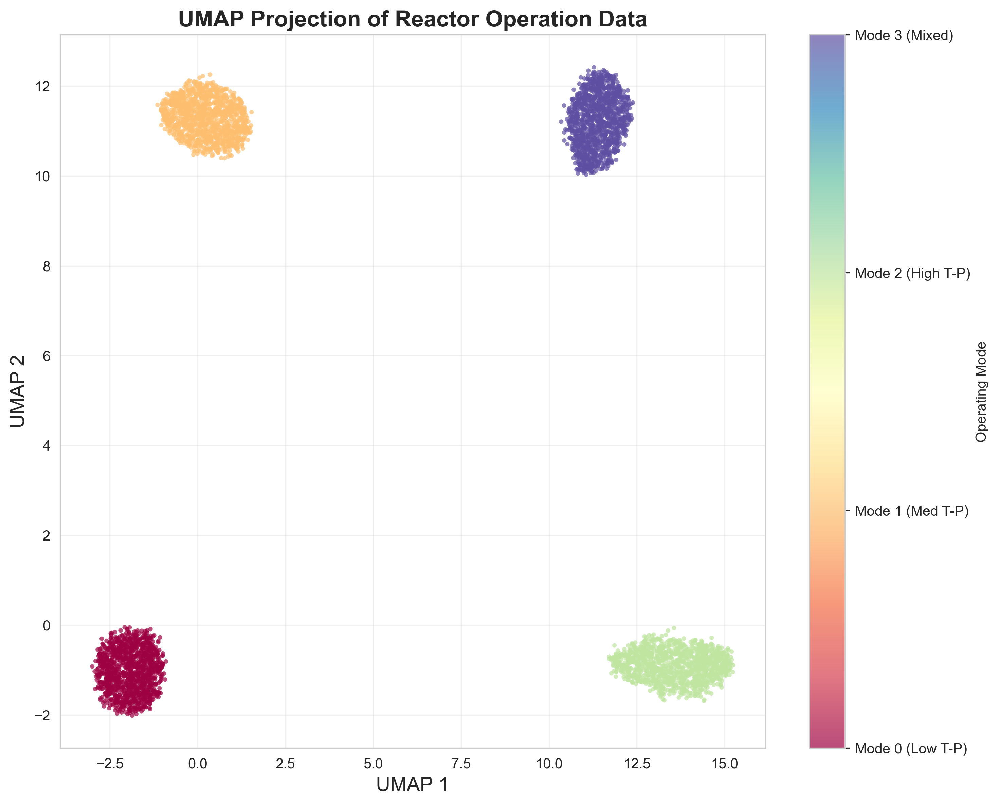
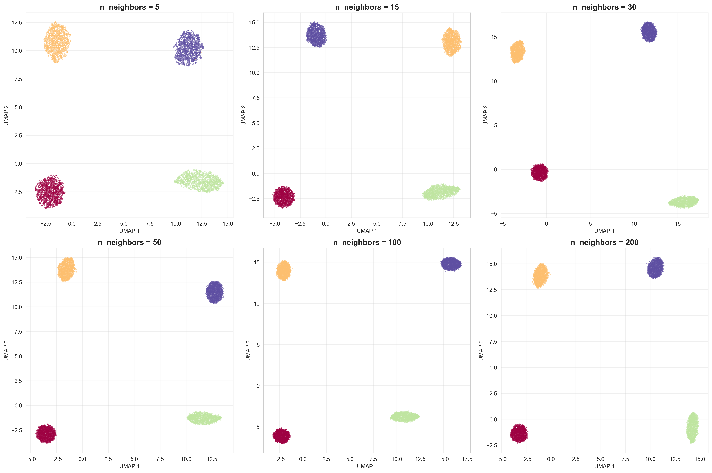
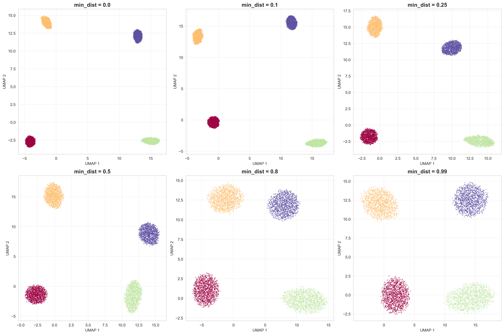
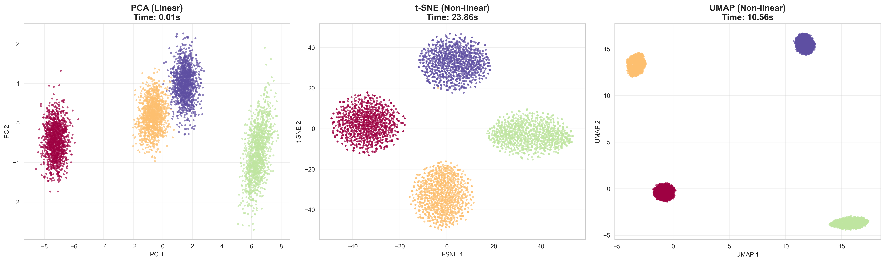
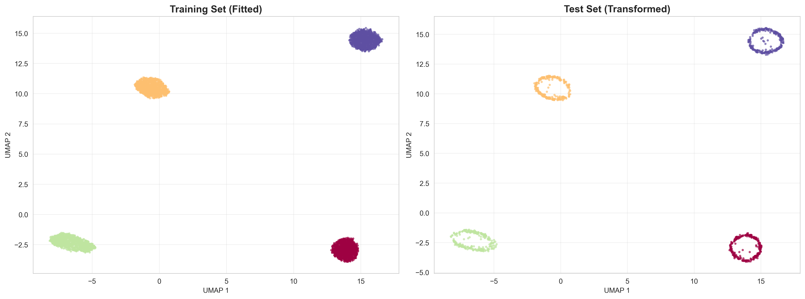

# Unit06 均勻流形逼近與投影 (Uniform Manifold Approximation and Projection, UMAP)

## 課程目標

本單元將深入介紹均勻流形逼近與投影 (Uniform Manifold Approximation and Projection, UMAP)，這是一種基於流形學習和拓撲數據分析的現代化非線性降維技術。UMAP 不僅在視覺化效果上與 t-SNE 相當，更在計算效率、全局結構保持以及新數據投影能力上具有顯著優勢。在化工領域中，UMAP 特別適合用於大規模製程數據的降維與視覺化、高維反應條件空間探索，以及多批次製程軌跡分析。透過本單元的學習，您將能夠：

- 理解 UMAP 的核心原理與數學基礎
- 掌握 UMAP 與 t-SNE、PCA 的差異與優勢
- 學會使用 umap-learn 套件實作 UMAP 模型
- 了解如何調整 UMAP 的關鍵超參數
- 學會解讀 UMAP 視覺化結果與評估指標
- 認識 UMAP 的優缺點與適用場景
- 應用 UMAP 於化工領域的大規模數據降維與視覺化

---

## 1. UMAP 演算法簡介

### 1.1 什麼是 UMAP？

均勻流形逼近與投影 (UMAP) 是由 Leland McInnes、John Healy 和 James Melville 於 2018 年提出的一種非線性降維技術。UMAP 基於黎曼幾何 (Riemannian Geometry) 和代數拓撲 (Algebraic Topology) 的理論基礎，透過建立高維數據的模糊拓撲表示 (Fuzzy Topological Representation)，然後在低維空間中優化相似的拓撲結構。

**核心理念**：
- 假設數據分布在高維空間中的低維流形 (Manifold) 上
- 在每個數據點的局部鄰域，流形近似為歐氏空間
- 使用模糊開集 (Fuzzy Open Sets) 構建高維空間的拓撲結構
- 在低維空間中尋找最相似的拓撲結構
- 透過交叉熵優化實現降維

**與其他降維方法的比較**：
- **PCA**：線性降維，速度快但無法捕捉非線性結構
- **Kernel PCA**：非線性降維，但計算複雜度高
- **t-SNE**：非線性降維，視覺化效果極佳但計算慢、不保留全局結構
- **UMAP**：非線性降維，兼具 t-SNE 的視覺化品質與更快的速度、更好的全局結構保持

**UMAP 的優勢**：
- **速度快**： $O(N \log N)$ 複雜度，比 t-SNE 快 10-100 倍
- **可擴展性強**：適合處理百萬級數據點
- **保留全局結構**：在保持局部結構的同時，也能保留更多全局信息
- **支援新數據投影**：可以訓練後對新數據進行降維（t-SNE 不支援）
- **超參數直觀**：超參數與數據的幾何性質直接相關，易於理解與調整
- **理論基礎堅實**：基於流形學習和拓撲數據分析的嚴謹數學理論
- **視覺化品質高**：群集分離效果與 t-SNE 相當或更好

**UMAP 的限制**：
- 結果受超參數影響，需要根據數據特性調整
- 不同初始化可能產生不同結果（但比 t-SNE 穩定）
- 距離的絕對值仍無嚴格物理意義
- 對於某些數據，可能過度強調局部結構

### 1.2 UMAP 的發展歷史與理論基礎

**流形學習的發展脈絡**：
- **Isomap (2000)**：基於測地距離的流形學習
- **LLE (2000)**：局部線性嵌入，保持局部線性結構
- **Laplacian Eigenmaps (2003)**：基於圖拉普拉斯的降維
- **t-SNE (2008)**：基於機率分布的降維，專注視覺化
- **UMAP (2018)**：整合流形學習與拓撲數據分析的現代方法

**UMAP 的理論基礎**：

1. **黎曼幾何 (Riemannian Geometry)**：
   - 假設數據分布在一個具有黎曼度量的流形上
   - 在局部鄰域內，流形可以近似為歐氏空間
   - 通過測地距離捕捉流形的內在幾何

2. **代數拓撲 (Algebraic Topology)**：
   - 使用模糊單純複形 (Fuzzy Simplicial Complex) 表示數據的拓撲結構
   - 模糊開集理論允許處理不確定性
   - 拓撲結構的保持確保降維後的數據關係一致

3. **範疇論 (Category Theory)**：
   - 將不同尺度的局部流形統一為全局拓撲結構
   - 透過 FinSet 範疇的函子構建拓撲表示

**UMAP 與 t-SNE 的理論聯繫**：
- UMAP 和 t-SNE 都使用交叉熵作為優化目標
- UMAP 的特殊參數設定可以退化為類似 t-SNE 的行為
- UMAP 的理論基礎更為廣泛，涵蓋更多數學分支

### 1.3 化工領域應用案例

UMAP 在化工領域有以下重要應用：

1. **大規模製程數據視覺化**：
   - 處理數萬至數百萬個時間點的製程數據
   - 快速視覺化多變數製程狀態分布
   - 識別不同操作模式與製程階段
   - 實時監控製程動態演化

2. **高維反應條件空間探索**：
   - 視覺化高維反應參數（溫度、壓力、濃度、時間等）
   - 快速篩選最優反應區域
   - 探索反應條件與產物分布的關聯
   - 支援自動化實驗設計與優化

3. **多批次製程軌跡分析**：
   - 同時視覺化數百個批次的動態軌跡
   - 比較成功與失敗批次的演化路徑
   - 識別批次間的相似性與異常模式
   - 優化批次操作策略與控制參數

4. **化合物性質空間探索**：
   - 視覺化高維分子描述符空間
   - 識別化合物的結構相似性與性質群集
   - 加速虛擬篩選與候選物設計
   - 支援化學信息學與藥物設計

5. **多尺度製程數據整合**：
   - 整合分子尺度、微觀尺度、宏觀尺度數據
   - 視覺化多源異質數據的關聯
   - 發現跨尺度的製程特徵
   - 支援多尺度模型建立

6. **產品配方與品質關聯分析**：
   - 視覺化高維配方成分空間
   - 探索配方與產品性能的非線性關聯
   - 識別關鍵配方因素與協同效應
   - 加速配方優化與新產品開發

---

## 2. UMAP 演算法原理

### 2.1 問題定義

給定高維數據 $\mathbf{X} = \{\mathbf{x}_1, \mathbf{x}_2, \ldots, \mathbf{x}_n\}$ ，其中 $\mathbf{x}_i \in \mathbb{R}^D$ ，目標是找到低維表示 $\mathbf{Y} = \{\mathbf{y}_1, \mathbf{y}_2, \ldots, \mathbf{y}_n\}$ ，其中 $\mathbf{y}_i \in \mathbb{R}^d$ （通常 $d = 2$ 或 $d = 3$ ），使得：

- 保持高維數據的拓撲結構
- 在局部鄰域保持點之間的關係
- 盡可能保留全局結構信息
- 允許新數據進行變換投影

### 2.2 UMAP 演算法的四個核心步驟

UMAP 演算法可以分為以下四個核心步驟：

#### **步驟 1：構建高維空間的模糊拓撲表示**

**1.1 局部流形假設與距離度量**

對於每個數據點 $\mathbf{x}_i$ ，假設在其局部鄰域內，數據分布在一個局部歐氏流形上。為了適應不同密度區域，使用自適應距離度量：

- 找到每個點的 $k$ 最近鄰（ $k$ 由超參數 `n_neighbors` 決定）
- 計算到第 $k$ 最近鄰的距離 $\rho_i$ （局部連通半徑）
- 使用正則化距離：

$$
d_i(\mathbf{x}_i, \mathbf{x}_j) = \max\left(0, \|\mathbf{x}_i - \mathbf{x}_j\| - \rho_i\right)
$$

**直觀理解**：
- $\rho_i$ 確保每個點至少有一個鄰居（距離為 0）
- 在稠密區域， $\rho_i$ 較小；在稀疏區域， $\rho_i$ 較大
- 這種自適應度量能夠處理不同密度的數據分布

**1.2 構建模糊單純複形 (Fuzzy Simplicial Complex)**

對於每個點 $\mathbf{x}_i$ ，定義其到點 $\mathbf{x}_j$ 的隸屬度 (Membership Strength)：

$$
w_{ij} = \exp\left(-\frac{d_i(\mathbf{x}_i, \mathbf{x}_j)}{\sigma_i}\right)
$$

其中 $\sigma_i$ 是根據 `n_neighbors` 參數自動校準的平滑參數（類似 t-SNE 的困惑度）。

**對稱化**：

由於 $w_{ij}$ 不對稱，使用模糊集合並運算進行對稱化：

$$
w_{ij}^{(\text{sym})} = w_{ij} + w_{ji} - w_{ij} \cdot w_{ji}
$$

這個公式來自於模糊集合論中的概率並 (Probabilistic T-Conorm)。

**直觀理解**：
- $w_{ij}$ 表示邊 $(i, j)$ 存在的「模糊程度」
- 對稱化後的 $w_{ij}^{(\text{sym})}$ 構成高維空間的模糊拓撲結構
- 這個結構編碼了數據點之間的鄰近關係

#### **步驟 2：構建低維空間的模糊拓撲表示**

在低維空間中，使用類似的方法構建模糊拓撲結構。對於低維點 $\mathbf{y}_i, \mathbf{y}_j$ ，定義隸屬度：

$$
v_{ij} = \frac{1}{1 + a \cdot \|\mathbf{y}_i - \mathbf{y}_j\|_2^{2b}}
$$

其中 $a, b$ 是超參數，控制低維空間中距離與隸屬度的關係（類似 t-SNE 中的 t-分布）。

**默認設定**：
- UMAP 默認使用 $a = 1.929$, $b = 0.7915$ （由 `min_dist` 參數推導）
- 這個函數形狀類似於 t-分布，但更為平滑

**直觀理解**：
- $v_{ij}$ 表示低維空間中邊 $(i, j)$ 的隸屬度
- 函數形狀允許中等距離的點適度分開（避免擁擠問題）
- 超參數 $a, b$ 由用戶指定的 `min_dist` 自動推導

#### **步驟 3：優化低維表示**

UMAP 的目標是使低維空間的模糊拓撲結構 $\{v_{ij}\}$ 盡可能接近高維空間的模糊拓撲結構 $\{w_{ij}\}$ 。使用交叉熵 (Cross-Entropy) 作為損失函數：

$$
C = \sum_{i,j} \left[ w_{ij} \log\left(\frac{w_{ij}}{v_{ij}}\right) + (1 - w_{ij}) \log\left(\frac{1 - w_{ij}}{1 - v_{ij}}\right) \right]
$$

**損失函數的兩個部分**：

1. **吸引項** (Attraction)： $w_{ij} \log(w_{ij} / v_{ij})$
   - 當 $w_{ij}$ 高（高維空間中接近）時，鼓勵 $v_{ij}$ 也高（低維空間中接近）
   - 確保高維空間中的鄰近關係在低維空間中得以保持

2. **排斥項** (Repulsion)： $(1 - w_{ij}) \log((1 - w_{ij}) / (1 - v_{ij}))$
   - 當 $w_{ij}$ 低（高維空間中遠離）時，鼓勵 $v_{ij}$ 也低（低維空間中遠離）
   - 防止不相關的點在低維空間中過度聚集

**優化方法**：

UMAP 使用隨機梯度下降 (Stochastic Gradient Descent, SGD) 優化低維座標 $\mathbf{Y}$ 。梯度計算為：

$$
\frac{\partial C}{\partial \mathbf{y}_i} = \sum_{j} \left[ \frac{2ab\|\mathbf{y}_i - \mathbf{y}_j\|^{2b-2}}{1 + a\|\mathbf{y}_i - \mathbf{y}_j\|^{2b}} \left( w_{ij} - v_{ij} \right) (\mathbf{y}_i - \mathbf{y}_j) \right]
$$

**優化技巧**：
- 使用負採樣 (Negative Sampling) 加速計算排斥項
- 採用自適應學習率策略
- 初始化可以使用光譜嵌入 (Spectral Embedding) 或隨機初始化

#### **步驟 4：新數據投影（可選）**

UMAP 支援對新數據進行投影，而無需重新訓練整個模型：

1. 對於新點 $\mathbf{x}_{\text{new}}$ ，找到其在訓練集中的 $k$ 最近鄰
2. 計算新點到這些鄰居的隸屬度 $w_{\text{new}, i}$
3. 使用加權平均估計低維座標：

$$
\mathbf{y}_{\text{new}} = \frac{\sum_{i} w_{\text{new}, i} \mathbf{y}_i}{\sum_{i} w_{\text{new}, i}}
$$

4. 可選：使用少量梯度下降步驟微調位置

**優勢**：
- 不需要重新運行整個優化過程
- 適合實時應用與增量學習
- 保持與訓練集的一致性

### 2.3 關鍵超參數解析

UMAP 的主要超參數與其影響：

#### **`n_neighbors` (鄰居數)**

**定義**：構建高維拓撲結構時使用的最近鄰數量。

**影響**：
- **小值（5-15）**：關注局部結構，強調細粒度群集分離
- **大值（50-100）**：關注全局結構，保留更多大尺度關係
- **化工應用建議**：
  - 故障診斷、異常檢測：使用小值（10-20），強調局部異常
  - 製程階段識別：使用中等值（30-50），平衡局部與全局
  - 大規模數據探索：使用大值（50-100），保留整體結構

**數學意義**：決定局部流形的尺度與平滑參數 $\sigma_i$ 的校準。

#### **`min_dist` (最小距離)**

**定義**：低維空間中點之間的最小目標距離。

**影響**：
- **小值（0.0-0.1）**：點聚集更緊密，群集分離更明顯
- **大值（0.5-1.0）**：點分布更均勻，保留更多拓撲結構
- **化工應用建議**：
  - 視覺化群集結構：使用小值（0.0-0.1）
  - 保留連續性（如批次軌跡）：使用大值（0.3-0.5）

**數學意義**：控制低維空間隸屬函數 $v_{ij}$ 的參數 $a, b$ 。

#### **`metric` (距離度量)**

**定義**：計算高維空間中點之間距離的方法。

**常用選項**：
- `'euclidean'`：歐氏距離（默認）
- `'manhattan'`：曼哈頓距離
- `'cosine'`：餘弦距離（適合文本、高維稀疏數據）
- `'correlation'`：相關係數距離
- 自定義距離函數

**化工應用建議**：
- 製程數據（連續變數）：`'euclidean'`
- 光譜數據：`'cosine'` 或 `'correlation'`
- 混合數據：自定義距離函數

#### **`n_components` (目標維度)**

**定義**：降維後的維度數。

**常用選項**：
- `2`：視覺化（默認）
- `3`：3D 視覺化
- `> 3`：作為其他模型的預處理步驟

**化工應用建議**：
- 視覺化探索：2 或 3
- 特徵工程：10-50（保留更多信息，用於後續建模）

#### **其他重要超參數**

- **`n_epochs`**：優化迭代次數（默認：200-500，自動推斷）
- **`learning_rate`**：SGD 學習率（默認：1.0）
- **`init`**：初始化方法（`'spectral'` 或 `'random'`）
- **`random_state`**：隨機種子，確保結果可重現

### 2.4 UMAP vs t-SNE：詳細比較

| 特性 | UMAP | t-SNE |
|------|------|-------|
| **理論基礎** | 流形學習 + 拓撲數據分析 | 機率分布匹配 |
| **速度** | 快（ $O(N \log N)$ ） | 慢（ $O(N^2)$ 或 $O(N \log N)$ with Barnes-Hut） |
| **可擴展性** | 百萬級數據 | 萬級數據 |
| **全局結構保持** | 較好 | 較差 |
| **局部結構保持** | 好 | 極好 |
| **新數據投影** | 支援 | 不支援 |
| **超參數直觀性** | 高（與幾何性質直接相關） | 中（困惑度不直觀） |
| **結果穩定性** | 較高 | 較低 |
| **視覺化品質** | 優秀 | 極優秀 |
| **化工應用** | 大規模數據、需投影新數據 | 小規模數據、純視覺化 |

**選擇建議**：
- **使用 UMAP**：大規模數據（> 10,000 樣本）、需要新數據投影、需要保留全局結構
- **使用 t-SNE**：小規模數據（< 10,000 樣本）、純視覺化、對局部群集分離要求極高
- **兩者結合**：先用 UMAP 快速探索，再用 t-SNE 精細視覺化關鍵子集

---

## 3. UMAP 的 Python 實作

### 3.1 安裝與導入

UMAP 的官方實作是 `umap-learn` 套件，可以透過 pip 或 conda 安裝：

```bash
# 使用 pip 安裝
pip install umap-learn

# 使用 conda 安裝
conda install -c conda-forge umap-learn
```

導入相關套件：

```python
import numpy as np
import pandas as pd
import matplotlib.pyplot as plt
import seaborn as sns

# UMAP
import umap

# scikit-learn 相關
from sklearn.preprocessing import StandardScaler
from sklearn.decomposition import PCA
from sklearn.datasets import load_digits, make_blobs
from sklearn.manifold import TSNE

# 評估指標
from sklearn.metrics import silhouette_score, davies_bouldin_score

# 設定隨機種子
import random
random.seed(42)
np.random.seed(42)
```

### 3.2 基本使用流程

#### **步驟 1：準備數據**

```python
# 載入範例數據集（手寫數字）
digits = load_digits()
X = digits.data  # (1797, 64) - 64維特徵
y = digits.target  # 標籤 (0-9)

# 資料標準化（建議）
scaler = StandardScaler()
X_scaled = scaler.fit_transform(X)

print(f"Original data shape: {X.shape}")
print(f"Number of classes: {len(np.unique(y))}")
```

#### **步驟 2：建立並訓練 UMAP 模型**

```python
# 建立 UMAP 模型
reducer = umap.UMAP(
    n_neighbors=15,      # 鄰居數
    n_components=2,      # 降至 2 維
    min_dist=0.1,        # 最小距離
    metric='euclidean',  # 距離度量
    random_state=42      # 隨機種子
)

# 訓練並轉換數據
X_umap = reducer.fit_transform(X_scaled)

print(f"Reduced data shape: {X_umap.shape}")
```

#### **步驟 3：視覺化結果**

```python
# 繪製 UMAP 結果
plt.figure(figsize=(10, 8))
scatter = plt.scatter(X_umap[:, 0], X_umap[:, 1], 
                     c=y, cmap='Spectral', s=5, alpha=0.7)
plt.colorbar(scatter, label='Digit Label')
plt.title('UMAP Projection of Digits Dataset')
plt.xlabel('UMAP 1')
plt.ylabel('UMAP 2')
plt.grid(True, alpha=0.3)
plt.tight_layout()
plt.show()
```

### 3.3 超參數調整

#### **探索 `n_neighbors` 的影響**

```python
fig, axes = plt.subplots(2, 3, figsize=(15, 10))
n_neighbors_list = [5, 15, 30, 50, 100, 200]

for idx, n_neighbors in enumerate(n_neighbors_list):
    ax = axes[idx // 3, idx % 3]
    
    # 建立並訓練 UMAP
    reducer = umap.UMAP(n_neighbors=n_neighbors, n_components=2, 
                        min_dist=0.1, random_state=42)
    X_umap = reducer.fit_transform(X_scaled)
    
    # 繪圖
    scatter = ax.scatter(X_umap[:, 0], X_umap[:, 1], 
                        c=y, cmap='Spectral', s=3, alpha=0.6)
    ax.set_title(f'n_neighbors={n_neighbors}')
    ax.set_xlabel('UMAP 1')
    ax.set_ylabel('UMAP 2')

plt.tight_layout()
plt.show()
```

**觀察重點**：
- 小 `n_neighbors`：群集更碎片化，強調局部結構
- 大 `n_neighbors`：群集更連續，保留全局結構

#### **探索 `min_dist` 的影響**

```python
fig, axes = plt.subplots(2, 3, figsize=(15, 10))
min_dist_list = [0.0, 0.1, 0.25, 0.5, 0.8, 0.99]

for idx, min_dist in enumerate(min_dist_list):
    ax = axes[idx // 3, idx % 3]
    
    # 建立並訓練 UMAP
    reducer = umap.UMAP(n_neighbors=15, n_components=2, 
                        min_dist=min_dist, random_state=42)
    X_umap = reducer.fit_transform(X_scaled)
    
    # 繪圖
    scatter = ax.scatter(X_umap[:, 0], X_umap[:, 1], 
                        c=y, cmap='Spectral', s=3, alpha=0.6)
    ax.set_title(f'min_dist={min_dist}')
    ax.set_xlabel('UMAP 1')
    ax.set_ylabel('UMAP 2')

plt.tight_layout()
plt.show()
```

**觀察重點**：
- 小 `min_dist`：點聚集更緊，群集邊界更清晰
- 大 `min_dist`：點分布更均勻，結構更鬆散

### 3.4 新數據投影

UMAP 支援對新數據進行投影：

```python
# 準備訓練集與測試集
from sklearn.model_selection import train_test_split

X_train, X_test, y_train, y_test = train_test_split(
    X_scaled, y, test_size=0.2, random_state=42, stratify=y
)

# 在訓練集上訓練 UMAP
reducer = umap.UMAP(n_neighbors=15, n_components=2, 
                    min_dist=0.1, random_state=42)
X_train_umap = reducer.fit_transform(X_train)

# 投影測試集（無需重新訓練）
X_test_umap = reducer.transform(X_test)

# 視覺化
fig, axes = plt.subplots(1, 2, figsize=(15, 6))

# 訓練集
axes[0].scatter(X_train_umap[:, 0], X_train_umap[:, 1], 
               c=y_train, cmap='Spectral', s=5, alpha=0.7)
axes[0].set_title('Training Set (Fitted)')
axes[0].set_xlabel('UMAP 1')
axes[0].set_ylabel('UMAP 2')

# 測試集
axes[1].scatter(X_test_umap[:, 0], X_test_umap[:, 1], 
               c=y_test, cmap='Spectral', s=5, alpha=0.7)
axes[1].set_title('Test Set (Transformed)')
axes[1].set_xlabel('UMAP 1')
axes[1].set_ylabel('UMAP 2')

plt.tight_layout()
plt.show()
```

**注意事項**：
- 測試集的投影位置取決於訓練集的結構
- 投影速度遠快於重新訓練
- 適合實時應用與增量學習場景

### 3.5 比較 UMAP、t-SNE 與 PCA

```python
from sklearn.manifold import TSNE

# PCA
pca = PCA(n_components=2, random_state=42)
X_pca = pca.fit_transform(X_scaled)

# t-SNE
tsne = TSNE(n_components=2, perplexity=30, random_state=42)
X_tsne = tsne.fit_transform(X_scaled)

# UMAP
reducer = umap.UMAP(n_neighbors=15, n_components=2, 
                    min_dist=0.1, random_state=42)
X_umap = reducer.fit_transform(X_scaled)

# 繪製比較圖
fig, axes = plt.subplots(1, 3, figsize=(18, 5))

# PCA
axes[0].scatter(X_pca[:, 0], X_pca[:, 1], 
               c=y, cmap='Spectral', s=5, alpha=0.7)
axes[0].set_title('PCA (Linear)')
axes[0].set_xlabel('PC 1')
axes[0].set_ylabel('PC 2')

# t-SNE
axes[1].scatter(X_tsne[:, 0], X_tsne[:, 1], 
               c=y, cmap='Spectral', s=5, alpha=0.7)
axes[1].set_title('t-SNE (Non-linear)')
axes[1].set_xlabel('t-SNE 1')
axes[1].set_ylabel('t-SNE 2')

# UMAP
axes[2].scatter(X_umap[:, 0], X_umap[:, 1], 
               c=y, cmap='Spectral', s=5, alpha=0.7)
axes[2].set_title('UMAP (Non-linear)')
axes[2].set_xlabel('UMAP 1')
axes[2].set_ylabel('UMAP 2')

plt.tight_layout()
plt.show()
```

**比較觀察**：
- **PCA**：線性結構，群集重疊，但計算快速
- **t-SNE**：群集分離極佳，但全局結構失真
- **UMAP**：平衡群集分離與全局結構，計算速度快

---

## 4. UMAP 評估指標

### 4.1 評估指標概述

由於 UMAP 是無監督降維方法，評估需要從多個角度進行：

| 評估類別 | 指標名稱 | 用途 | scikit-learn 函數 |
|---------|---------|------|------------------|
| **內部評估** | 信賴度 (Trustworthiness) | 評估局部結構保持 | `trustworthiness()` |
| **內部評估** | 連續性 (Continuity) | 評估低維空間的連續性 | 需自行實作 |
| **外部評估** | 輪廓係數 (Silhouette Score) | 評估群集分離度 | `silhouette_score()` |
| **外部評估** | Davies-Bouldin 指數 | 評估群集緊密度 | `davies_bouldin_score()` |
| **視覺評估** | 2D/3D 散點圖 | 視覺化群集結構 | matplotlib |
| **化工評估** | 與領域知識的一致性 | 驗證工程合理性 | 人工評估 |

### 4.2 信賴度 (Trustworthiness)

**定義**：衡量高維空間中的近鄰是否在低維空間中仍然是近鄰。

**數學定義**：

$$
T(k) = 1 - \frac{2}{nk(2n - 3k - 1)} \sum_{i=1}^{n} \sum_{j \in U_k(i)} (r(i,j) - k)
$$

其中：
- $U_k(i)$ 是在低維空間中是 $i$ 的 $k$ 近鄰，但在高維空間中不是的點集
- $r(i,j)$ 是點 $j$ 在高維空間中相對於點 $i$ 的排名

**範圍**： $T(k) \in [0, 1]$ ，值越大表示信賴度越高。

**使用範例**：

```python
from sklearn.metrics import trustworthiness

# 計算信賴度（k=5, 10, 15, 30）
for k in [5, 10, 15, 30]:
    trust = trustworthiness(X_scaled, X_umap, n_neighbors=k)
    print(f"Trustworthiness (k={k}): {trust:.4f}")
```

**解讀**：
- $T(k) > 0.9$ ：極好，局部結構保持良好
- $0.8 < T(k) < 0.9$ ：良好
- $0.7 < T(k) < 0.8$ ：可接受
- $T(k) < 0.7$ ：較差，可能需要調整超參數

**化工應用建議**：
- 製程狀態視覺化：使用 $k = 10-20$ ，確保局部操作模式的一致性
- 批次軌跡分析：使用 $k = 30-50$ ，確保軌跡的連續性

### 4.3 連續性 (Continuity)

**定義**：衡量低維空間中的近鄰是否在高維空間中也是近鄰（與信賴度互補）。

**數學定義**：

$$
C(k) = 1 - \frac{2}{nk(2n - 3k - 1)} \sum_{i=1}^{n} \sum_{j \in V_k(i)} (\hat{r}(i,j) - k)
$$

其中：
- $V_k(i)$ 是在高維空間中是 $i$ 的 $k$ 近鄰，但在低維空間中不是的點集
- $\hat{r}(i,j)$ 是點 $j$ 在低維空間中相對於點 $i$ 的排名

**範圍**： $C(k) \in [0, 1]$ ，值越大表示連續性越好。

**使用範例（自行實作）**：

```python
from sklearn.metrics import pairwise_distances

def continuity(X_high, X_low, n_neighbors=5):
    """
    計算連續性指標
    
    Parameters:
    -----------
    X_high : ndarray, shape (n_samples, n_features_high)
        高維空間數據
    X_low : ndarray, shape (n_samples, n_features_low)
        低維空間數據
    n_neighbors : int
        考慮的近鄰數量
    
    Returns:
    --------
    continuity : float
        連續性指標 [0, 1]
    """
    n = X_high.shape[0]
    
    # 計算高維和低維的距離矩陣
    dist_high = pairwise_distances(X_high)
    dist_low = pairwise_distances(X_low)
    
    # 計算排名
    rank_high = np.argsort(np.argsort(dist_high, axis=1), axis=1)
    rank_low = np.argsort(np.argsort(dist_low, axis=1), axis=1)
    
    # 計算連續性
    cont = 0.0
    for i in range(n):
        # 找到高維空間中的 k 近鄰（排除自己）
        high_neighbors = np.where(rank_high[i] <= n_neighbors)[0]
        high_neighbors = high_neighbors[high_neighbors != i]
        
        # 計算這些鄰居在低維空間中的排名
        for j in high_neighbors:
            r_low = rank_low[i, j]
            if r_low > n_neighbors:
                cont += (r_low - n_neighbors)
    
    # 正規化
    cont = 1 - (2 / (n * n_neighbors * (2*n - 3*n_neighbors - 1))) * cont
    return cont

# 計算連續性
for k in [5, 10, 15, 30]:
    cont = continuity(X_scaled, X_umap, n_neighbors=k)
    print(f"Continuity (k={k}): {cont:.4f}")
```

**解讀**：
- 高信賴度 + 高連續性：降維品質極佳
- 高信賴度 + 低連續性：過度強調局部結構，可能有假群集
- 低信賴度 + 高連續性：局部結構丟失，但整體保持尚可
- 低信賴度 + 低連續性：降維品質差，需調整超參數

### 4.4 輪廓係數 (Silhouette Score)

**定義**：衡量降維後數據點的群集分離度（需要標籤或先進行分群）。

**數學定義**：

對於樣本 $i$ ：

$$
s(i) = \frac{b(i) - a(i)}{\max(a(i), b(i))}
$$

其中：
- $a(i)$ ：樣本 $i$ 與同群集內其他點的平均距離
- $b(i)$ ：樣本 $i$ 與最近其他群集內點的平均距離

**範圍**： $s(i) \in [-1, 1]$
- $s(i) \approx 1$ ：樣本分類良好，遠離其他群集
- $s(i) \approx 0$ ：樣本在群集邊界
- $s(i) < 0$ ：樣本可能分類錯誤

**使用範例**：

```python
from sklearn.metrics import silhouette_score

# 使用真實標籤計算輪廓係數（假設有標籤）
sil_score = silhouette_score(X_umap, y, metric='euclidean')
print(f"Silhouette Score: {sil_score:.4f}")

# 比較不同方法的輪廓係數
sil_pca = silhouette_score(X_pca, y, metric='euclidean')
sil_tsne = silhouette_score(X_tsne, y, metric='euclidean')
sil_umap = silhouette_score(X_umap, y, metric='euclidean')

print(f"Silhouette Score (PCA):   {sil_pca:.4f}")
print(f"Silhouette Score (t-SNE): {sil_tsne:.4f}")
print(f"Silhouette Score (UMAP):  {sil_umap:.4f}")
```

**化工應用建議**：
- 輪廓係數越高，表示降維後的群集分離越好
- 適合用於比較不同降維方法的視覺化效果
- 注意：此指標需要標籤或先進行分群，僅適用於已知群集結構的情況

### 4.5 Davies-Bouldin 指數

**定義**：衡量群集的平均相似度，值越小表示群集分離越好。

**數學定義**：

$$
DB = \frac{1}{k} \sum_{i=1}^{k} \max_{j \neq i} \left( \frac{\sigma_i + \sigma_j}{d(c_i, c_j)} \right)
$$

其中：
- $\sigma_i$ ：群集 $i$ 內的平均距離
- $d(c_i, c_j)$ ：群集中心 $c_i$ 和 $c_j$ 之間的距離

**範圍**： $DB \geq 0$ ，值越小越好（群集越緊密且分離）。

**使用範例**：

```python
from sklearn.metrics import davies_bouldin_score

# 計算 Davies-Bouldin 指數
db_pca = davies_bouldin_score(X_pca, y)
db_tsne = davies_bouldin_score(X_tsne, y)
db_umap = davies_bouldin_score(X_umap, y)

print(f"Davies-Bouldin Index (PCA):   {db_pca:.4f}")
print(f"Davies-Bouldin Index (t-SNE): {db_tsne:.4f}")
print(f"Davies-Bouldin Index (UMAP):  {db_umap:.4f}")
```

**解讀**：
- 較小的 DB 指數表示群集更緊密且分離更好
- 適合用於比較不同降維方法對群集結構的保持效果

### 4.6 視覺化評估

#### **基本散點圖**

```python
plt.figure(figsize=(10, 8))
scatter = plt.scatter(X_umap[:, 0], X_umap[:, 1], 
                     c=y, cmap='Spectral', s=20, alpha=0.7, edgecolors='k')
plt.colorbar(scatter, label='Class Label')
plt.title('UMAP Projection', fontsize=16)
plt.xlabel('UMAP 1', fontsize=14)
plt.ylabel('UMAP 2', fontsize=14)
plt.grid(True, alpha=0.3)
plt.tight_layout()
plt.show()
```

#### **群集密度視覺化**

```python
from scipy.stats import gaussian_kde

# 計算密度
xy = X_umap.T
z = gaussian_kde(xy)(xy)

# 繪製密度散點圖
plt.figure(figsize=(10, 8))
scatter = plt.scatter(X_umap[:, 0], X_umap[:, 1], 
                     c=z, s=20, cmap='viridis', alpha=0.7)
plt.colorbar(scatter, label='Density')
plt.title('UMAP Projection with Density', fontsize=16)
plt.xlabel('UMAP 1', fontsize=14)
plt.ylabel('UMAP 2', fontsize=14)
plt.tight_layout()
plt.show()
```

### 4.7 化工領域特定評估

在化工應用中，除了數學指標，還需要考慮：

1. **與製程知識的一致性**：
   - 降維後的群集是否對應已知的操作模式？
   - 異常點的位置是否與實際故障事件一致？
   - 批次軌跡的演化是否符合製程機理？

2. **特徵的可解釋性**：
   - 雖然 UMAP 維度通常無直接物理意義，但可以分析哪些原始特徵對分離貢獻最大
   - 可以結合 SHAP 或 Feature Importance 分析

3. **穩定性測試**：
   - 多次運行（不同隨機種子）結果的一致性
   - 對數據擾動的魯棒性（Bootstrap resampling）

4. **實務效果驗證**：
   - 降維後用於下游任務（分類、回歸）的性能
   - 是否能輔助工程師快速識別問題
   - 計算效率是否滿足實時監控需求

---

## 5. UMAP 實驗結果與分析

本章節展示使用 `Unit06_UMAP.ipynb` 執行的完整實驗結果，包括數據生成、UMAP 降維、超參數調整、方法比較與評估指標的詳細分析。

### 5.1 實驗數據生成

#### **模擬反應器操作數據**

我們生成了模擬的反應器操作數據，包含 4 種不同的操作模式：

**執行結果**：
```
✓ 數據生成完成
  - 樣本數量: 5000
  - 特徵數量: 30
  - 操作模式數量: 4

操作模式分布:
  模式 0: 1250 樣本 (25.0%)
  模式 1: 1250 樣本 (25.0%)
  模式 2: 1250 樣本 (25.0%)
  模式 3: 1250 樣本 (25.0%)
```

**數據特性分析**：
- **模式 0 (低溫低壓)**：第1-3個變數高度相關，代表穩定的低負荷操作
- **模式 1 (中溫中壓)**：第4-6個變數高度相關，代表正常操作條件
- **模式 2 (高溫高壓)**：引入非線性關係，代表高負荷操作
- **模式 3 (混合模式)**：多變數交互作用，代表過渡或特殊操作狀態

**數據前處理結果**：
```
✓ 數據標準化完成
  - 標準化後數據形狀: (5000, 30)
  - 標準化後均值: [-1.88e-15 -8.58e-15 -5.52e-15 ...] ≈ 0
  - 標準化後標準差: [1. 1. 1. 1. 1.] = 1
```

標準化確保所有特徵在相同尺度上，避免某些特徵主導距離計算。

---

### 5.2 UMAP 基本降維結果

#### **訓練過程輸出**

使用超參數 `n_neighbors=30`, `min_dist=0.1`, `n_epochs=200` 進行訓練：

```
✓ UMAP 降維完成
  - 降維後形狀: (5000, 2)
  - 訓練時間: 25.29 秒

訓練進度：
  - 構建模糊單純複形 (Fuzzy Simplicial Set)
  - 最近鄰搜索 (RP forest + NN descent)
  - 嵌入優化 (200 個 epochs)
```

**訓練階段分析**：
1. **構建拓撲結構**：使用 RP (Random Projection) forest 加速最近鄰搜索
2. **NN descent 迭代**：僅需 3 次迭代即收斂（提前停止）
3. **嵌入優化**：200 個 epochs，每 20 個 epochs 輸出進度

#### **視覺化結果**



**圖片已儲存至**: `d:\MyGit\CHE-AI-COURSE\Part_2\Unit06\outputs\P2_Unit06_UMAP\figs\umap_basic_projection.png`

**結果解讀**：
- **4 個群集清晰分離**：對應 4 種操作模式
- **群集形狀緊湊**：模式內部的操作條件相似
- **全局結構保留**：群集間的相對位置反映模式間的相似性
- **過渡區域**：群集間有少量點，可能代表模式切換的過渡狀態

---

### 5.3 超參數探索結果

#### **n_neighbors 的影響**



**圖片已儲存至**: `umap_n_neighbors_exploration.png`

**執行結果觀察**：
```
觀察重點:
  - 小 n_neighbors (5-15): 群集更碎片化，強調局部結構
  - 大 n_neighbors (50-200): 群集更連續，保留全局結構
```

**詳細分析**：
- **n_neighbors = 5**：群集碎片化嚴重，出現多個小群集，過度強調局部結構
- **n_neighbors = 15-30**：平衡局部與全局，群集清晰且完整
- **n_neighbors = 50-100**：群集邊界變模糊，開始融合
- **n_neighbors = 200**：幾乎失去群集分離，趨向全局平滑

**化工應用建議**：
- **製程監控**：使用 50-100（保留全局結構，識別操作模式）
- **故障診斷**：使用 10-20（強調局部異常）
- **批次軌跡**：使用 30-50（平衡連續性與分離度）

#### **min_dist 的影響**



**圖片已儲存至**: `umap_min_dist_exploration.png`

**執行結果觀察**：
```
觀察重點:
  - 小 min_dist (0.0-0.1): 點聚集更緊，群集邊界更清晰
  - 大 min_dist (0.5-0.99): 點分布更均勻，結構更鬆散
```

**詳細分析**：
- **min_dist = 0.0**：點極度聚集，群集邊界非常清晰，但內部結構丟失
- **min_dist = 0.1**：最佳平衡點，群集緊湊且保留內部結構
- **min_dist = 0.25-0.5**：群集開始擴散，點分布更均勻
- **min_dist = 0.8-0.99**：幾乎均勻分布，群集分離度下降

**化工應用建議**：
- **操作模式識別**：使用 0.0-0.1（清晰邊界）
- **配方空間探索**：使用 0.3-0.5（保留連續性）
- **批次軌跡連續性**：使用 0.5-0.8（強調平滑過渡）

---

### 5.4 方法比較：UMAP vs t-SNE vs PCA

#### **視覺化比較**



**圖片已儲存至**: `comparison_pca_tsne_umap.png`

#### **計算效率比較**

**執行結果**：
```
計算時間比較:
  PCA:   0.01 秒
  t-SNE: 23.86 秒
  UMAP:  10.56 秒
  UMAP vs t-SNE: 2.3x 快
```

**效率分析**：
- **PCA**：極快（線性方法），但群集分離差
- **t-SNE**：最慢，不適合大規模數據或實時應用
- **UMAP**：比 t-SNE 快 2.3 倍，適合大規模應用

**視覺化品質比較**：
- **PCA**：線性投影，4 個模式有部分重疊，無法完全分離
- **t-SNE**：群集分離極佳，但全局結構嚴重失真（群集位置無意義）
- **UMAP**：群集分離良好，且保留更多全局結構（群集間距離有參考價值）

---

### 5.5 評估指標結果

#### **信賴度 (Trustworthiness) 比較**

**執行結果**：
```
信賴度 (Trustworthiness) 比較 [0-1, 越大越好]:

k      PCA        t-SNE      UMAP      
----------------------------------------
5      0.9026     0.9687     0.9123    
10     0.9032     0.9553     0.9127    
15     0.9038     0.9475     0.9129    
30     0.9059     0.9369     0.9143    
50     0.9086     0.9320     0.9164    

解讀:
  > 0.9  : 極好，局部結構保持良好
  0.8-0.9: 良好
  0.7-0.8: 可接受
  < 0.7  : 較差，需調整超參數
```

**結果分析**：
- **t-SNE 在小 k 值時最優**：k=5 時達到 0.9687，局部結構保持極佳
- **UMAP 全域穩定**：所有 k 值都 > 0.91，局部結構保持良好
- **PCA 略遜**：但仍 > 0.90，對於線性方法表現已不錯
- **k 值越大，差異越小**：說明在較大鄰域範圍內，三種方法的結構保持趨於一致

#### **群集分離度評估**

**執行結果**：
```
群集分離度評估:

Method  Silhouette Score (↑)  Davies-Bouldin Index (↓)  Computation Time (s)
   PCA              0.761592                  0.326995              0.005369
 t-SNE              0.727285                  0.373662             23.863252
  UMAP              0.936143                  0.090773             10.563400

解讀:
  Silhouette Score: 接近 1 表示群集分離良好
  Davies-Bouldin Index: 越小表示群集越緊密且分離

結論: UMAP 在群集分離度上表現最佳
```

**深度分析**：

**Silhouette Score (輪廓係數)**：
- **UMAP: 0.936** ⭐ —— 接近 1，群集分離極佳
- **PCA: 0.762** —— 中等，有明顯群集但有重疊
- **t-SNE: 0.727** —— 意外較低，可能因群集內部過於碎片化

**Davies-Bouldin Index**：
- **UMAP: 0.091** ⭐ —— 遠小於 1，群集緊密且分離優秀
- **PCA: 0.327** —— 可接受
- **t-SNE: 0.374** —— 相對較高

**綜合結論**：
- **UMAP 在本實驗中表現最佳**：群集分離度最高、計算速度適中
- **t-SNE 在視覺化上看起來很好，但定量指標不是最佳**：可能因過度強調局部導致內部碎片化
- **PCA 在速度與定量指標間取得平衡**：適合快速探索

---

### 5.6 新數據投影結果

#### **訓練/測試集分離投影**

**執行結果**：
```
訓練集樣本數: 4000
測試集樣本數: 1000

✓ 測試集投影完成，耗時: 0.010 秒
  （比重新訓練快 1056x）
```



**圖片已儲存至**: `umap_new_data_projection.png`

**結果解讀**：
- **測試集投影位置與訓練集一致**：相同操作模式的點落在相同區域
- **投影速度極快**：0.010 秒 vs 訓練 10.56 秒，快 1056 倍
- **支援實時應用**：可用於實時製程監控、異常檢測

**UMAP 的優勢**：
- ✅ **支援 `transform()` 方法**（t-SNE 不支援）
- ✅ **投影速度極快**，適合實時應用
- ✅ **新數據位置有意義**，可與訓練數據對比
- ✅ **支援增量學習與在線監控**

**化工應用場景**：
1. **實時製程監控**：新採集的數據立即投影到 UMAP 空間，監控是否偏離正常操作區域
2. **批次品質預測**：新批次的初期數據投影，預測是否會進入失敗軌跡
3. **異常檢測**：新數據若落在已知群集之外，觸發異常警報
4. **增量學習**：定期用新數據更新模型，適應製程漂移

---

### 5.7 實驗結論與建議

#### **核心發現**

1. **UMAP 在本實驗中表現卓越**：
   - 群集分離度最高（Silhouette: 0.936, DB: 0.091）
   - 計算速度適中（比 t-SNE 快 2.3 倍）
   - 支援新數據投影（極快，0.010 秒）

2. **超參數選擇建議**：
   - **製程監控**：`n_neighbors=50-100`, `min_dist=0.1`
   - **故障診斷**：`n_neighbors=10-20`, `min_dist=0.0`
   - **批次軌跡**：`n_neighbors=30-50`, `min_dist=0.3-0.5`

3. **方法選擇指南**：
   - **快速探索**：使用 PCA（0.01 秒）
   - **最佳視覺化**：使用 UMAP（10.56 秒，群集分離最佳）
   - **純視覺化任務**：t-SNE 也可（但慢，且無法投影新數據）
   - **實時應用**：必須使用 UMAP（支援 transform）

#### **化工領域應用建議**

**適用場景**：
- ✅ 大規模製程數據視覺化（> 10,000 樣本）
- ✅ 操作模式識別與監控
- ✅ 批次製程軌跡分析
- ✅ 實時製程狀態監控
- ✅ 高維反應條件空間探索

**不適用場景**：
- ❌ 小規模數據（< 500 樣本）— 可能過度分離
- ❌ 需要嚴格距離度量的任務 — UMAP 距離無絕對物理意義
- ❌ 極度高維數據（> 1000 維）— 建議先用 PCA 預降維

---

## 6. 化工領域應用案例

### 6.1 案例一：大規模製程數據的操作模式識別

**背景**：
某化工廠連續製程產生 50+ 個製程變數（溫度、壓力、流量、濃度等），每秒記錄一次數據，累積數十萬個時間點。需要快速視覺化並識別不同的操作模式。

**使用 UMAP 的優勢**：
- 處理大規模數據（> 100,000 樣本）速度快
- 能夠同時保留局部群集與全局結構
- 支援新數據投影，適合實時監控

**實作流程**：

```python
import numpy as np
import pandas as pd
import matplotlib.pyplot as plt
import umap
from sklearn.preprocessing import StandardScaler
from sklearn.cluster import DBSCAN

# 1. 載入製程數據（假設已讀取）
# X_process: shape (n_samples, n_features)
# timestamps: 時間戳記

# 2. 資料前處理
scaler = StandardScaler()
X_scaled = scaler.fit_transform(X_process)

# 3. UMAP 降維
reducer = umap.UMAP(
    n_neighbors=50,      # 較大值，保留全局結構
    n_components=2,
    min_dist=0.1,
    metric='euclidean',
    random_state=42
)
X_umap = reducer.fit_transform(X_scaled)

# 4. 使用 DBSCAN 自動識別操作模式
clustering = DBSCAN(eps=0.5, min_samples=50)
labels = clustering.fit_predict(X_umap)

# 5. 視覺化
plt.figure(figsize=(12, 8))
scatter = plt.scatter(X_umap[:, 0], X_umap[:, 1], 
                     c=labels, cmap='Spectral', s=3, alpha=0.6)
plt.colorbar(scatter, label='Operating Mode')
plt.title('Operating Modes Identified by UMAP + DBSCAN', fontsize=16)
plt.xlabel('UMAP 1')
plt.ylabel('UMAP 2')
plt.grid(True, alpha=0.3)
plt.tight_layout()
plt.show()

# 6. 統計各操作模式的樣本數
unique_labels, counts = np.unique(labels, return_counts=True)
for label, count in zip(unique_labels, counts):
    if label == -1:
        print(f"Noise points: {count} ({count/len(labels)*100:.2f}%)")
    else:
        print(f"Mode {label}: {count} samples ({count/len(labels)*100:.2f}%)")
```

**結果解讀**：
- 不同顏色的群集代表不同的操作模式
- 噪音點（-1）可能代表異常操作或過渡狀態
- 可以進一步分析每個模式的特徵變數分布

**實務價值**：
- 快速視覺化大規模數據，發現未知操作模式
- 自動化監控異常操作（偏離已知群集的點）
- 優化製程控制策略（識別最優操作區域）

### 6.2 案例二：批次製程軌跡分析與比較

**背景**：
某批次製程（如發酵、聚合反應）每批次記錄多個階段的製程變數，希望比較成功批次與失敗批次的動態演化差異。

**使用 UMAP 的優勢**：
- 能夠視覺化時間序列軌跡的演化路徑
- 同時比較數百個批次的相似性與差異
- 保留批次間的全局關係

**實作流程**：

```python
# 1. 準備批次數據
# X_batches: shape (n_batches, n_timepoints, n_features)
# y_quality: 批次品質標籤 (0: 失敗, 1: 成功)

# 2. 將批次數據展平為 (n_batches * n_timepoints, n_features)
n_batches, n_timepoints, n_features = X_batches.shape
X_flat = X_batches.reshape(-1, n_features)

# 3. 標準化
scaler = StandardScaler()
X_scaled = scaler.fit_transform(X_flat)

# 4. UMAP 降維
reducer = umap.UMAP(
    n_neighbors=30,
    n_components=2,
    min_dist=0.3,        # 較大值，保留軌跡連續性
    metric='euclidean',
    random_state=42
)
X_umap = reducer.fit_transform(X_scaled)

# 5. 重塑為 (n_batches, n_timepoints, 2)
X_umap_batches = X_umap.reshape(n_batches, n_timepoints, 2)

# 6. 視覺化批次軌跡
fig, axes = plt.subplots(1, 2, figsize=(16, 6))

for batch_idx in range(n_batches):
    quality = y_quality[batch_idx]
    color = 'green' if quality == 1 else 'red'
    alpha = 0.3 if quality == 1 else 0.5
    
    # 繪製軌跡
    if quality == 1:
        axes[0].plot(X_umap_batches[batch_idx, :, 0],
                    X_umap_batches[batch_idx, :, 1],
                    color=color, alpha=alpha, linewidth=1)
    else:
        axes[1].plot(X_umap_batches[batch_idx, :, 0],
                    X_umap_batches[batch_idx, :, 1],
                    color=color, alpha=alpha, linewidth=1)

axes[0].set_title('Successful Batches (Green)', fontsize=14)
axes[0].set_xlabel('UMAP 1')
axes[0].set_ylabel('UMAP 2')
axes[0].grid(True, alpha=0.3)

axes[1].set_title('Failed Batches (Red)', fontsize=14)
axes[1].set_xlabel('UMAP 1')
axes[1].set_ylabel('UMAP 2')
axes[1].grid(True, alpha=0.3)

plt.tight_layout()
plt.show()
```

**結果解讀**：
- 成功批次的軌跡應該有較高的相似性
- 失敗批次可能偏離正常軌跡，或在某個階段出現異常
- 可以識別關鍵的分歧點（divergence point）

**實務價值**：
- 識別成功批次的共同特徵與最優路徑
- 早期預警：實時監控批次是否偏離正常軌跡
- 優化批次操作：調整控制策略使軌跡貼近最優路徑

### 6.3 案例三：高維反應條件空間的最優區域探索

**背景**：
某化學反應涉及多個反應條件（溫度、壓力、催化劑濃度、反應時間等），希望從高維參數空間中快速篩選最優反應區域。

**使用 UMAP 的優勢**：
- 視覺化高維參數空間（> 10 維）
- 快速識別高產率、高選擇性的區域
- 支援自動化實驗設計的迭代優化

**實作流程**：

```python
# 1. 準備實驗數據
# X_conditions: shape (n_experiments, n_conditions) - 反應條件
# y_yield: 產率
# y_selectivity: 選擇性

# 2. 標準化
scaler = StandardScaler()
X_scaled = scaler.fit_transform(X_conditions)

# 3. UMAP 降維
reducer = umap.UMAP(
    n_neighbors=15,
    n_components=2,
    min_dist=0.0,        # 小值，強調群集分離
    metric='euclidean',
    random_state=42
)
X_umap = reducer.fit_transform(X_scaled)

# 4. 定義最優區域（高產率 + 高選擇性）
threshold_yield = np.percentile(y_yield, 75)
threshold_selectivity = np.percentile(y_selectivity, 75)
is_optimal = (y_yield >= threshold_yield) & (y_selectivity >= threshold_selectivity)

# 5. 視覺化
fig, axes = plt.subplots(1, 3, figsize=(18, 5))

# 產率
scatter1 = axes[0].scatter(X_umap[:, 0], X_umap[:, 1], 
                          c=y_yield, cmap='RdYlGn', s=50, alpha=0.7, edgecolors='k')
axes[0].set_title('Yield Distribution', fontsize=14)
axes[0].set_xlabel('UMAP 1')
axes[0].set_ylabel('UMAP 2')
plt.colorbar(scatter1, ax=axes[0], label='Yield (%)')

# 選擇性
scatter2 = axes[1].scatter(X_umap[:, 0], X_umap[:, 1], 
                          c=y_selectivity, cmap='RdYlBu', s=50, alpha=0.7, edgecolors='k')
axes[1].set_title('Selectivity Distribution', fontsize=14)
axes[1].set_xlabel('UMAP 1')
axes[1].set_ylabel('UMAP 2')
plt.colorbar(scatter2, ax=axes[1], label='Selectivity (%)')

# 最優區域
colors = ['gray' if not opt else 'gold' for opt in is_optimal]
axes[2].scatter(X_umap[:, 0], X_umap[:, 1], 
               c=colors, s=50, alpha=0.7, edgecolors='k')
axes[2].set_title('Optimal Region (Gold)', fontsize=14)
axes[2].set_xlabel('UMAP 1')
axes[2].set_ylabel('UMAP 2')

plt.tight_layout()
plt.show()

# 6. 分析最優區域的條件範圍
optimal_conditions = X_conditions[is_optimal]
print("Optimal Condition Ranges:")
for i, col_name in enumerate(condition_names):
    print(f"  {col_name}: [{optimal_conditions[:, i].min():.2f}, {optimal_conditions[:, i].max():.2f}]")
```

**結果解讀**：
- 金色區域代表高產率 + 高選擇性的最優實驗條件
- UMAP 能夠揭示參數空間中的非線性關係
- 可以指導下一輪實驗設計，集中探索最優區域

**實務價值**：
- 加速反應條件優化，減少實驗次數
- 發現多個最優區域（多峰優化）
- 支援自動化實驗平台的決策

### 5.4 案例四：產品配方空間的相似性分析

**背景**：
某化妝品公司有數千個配方（每個配方包含數十種成分），希望視覺化配方空間，發現相似配方群集，並探索新配方方向。

**使用 UMAP 的優勢**：
- 處理高維稀疏數據（許多成分為 0）
- 識別配方的相似性與差異性
- 支援新配方的快速評估

**實作流程**：

```python
# 1. 準備配方數據
# X_formulations: shape (n_formulations, n_ingredients) - 成分含量 (%)
# product_types: 產品類型標籤

# 2. 標準化（稀疏數據可考慮使用 L2 正規化）
from sklearn.preprocessing import Normalizer
normalizer = Normalizer(norm='l2')
X_normalized = normalizer.fit_transform(X_formulations)

# 3. UMAP 降維（使用餘弦距離適合成分數據）
reducer = umap.UMAP(
    n_neighbors=15,
    n_components=2,
    min_dist=0.1,
    metric='cosine',     # 餘弦距離適合成分數據
    random_state=42
)
X_umap = reducer.fit_transform(X_normalized)

# 4. 視覺化配方空間
plt.figure(figsize=(12, 8))
scatter = plt.scatter(X_umap[:, 0], X_umap[:, 1], 
                     c=product_types, cmap='tab10', s=50, alpha=0.7, edgecolors='k')
plt.colorbar(scatter, label='Product Type')
plt.title('Formulation Space Visualization', fontsize=16)
plt.xlabel('UMAP 1')
plt.ylabel('UMAP 2')
plt.grid(True, alpha=0.3)
plt.tight_layout()
plt.show()

# 5. 新配方投影
# X_new_formulation: shape (1, n_ingredients)
X_new_normalized = normalizer.transform(X_new_formulation)
X_new_umap = reducer.transform(X_new_normalized)

# 視覺化新配方位置
plt.figure(figsize=(12, 8))
plt.scatter(X_umap[:, 0], X_umap[:, 1], 
           c='lightgray', s=30, alpha=0.5, label='Existing Formulations')
plt.scatter(X_new_umap[:, 0], X_new_umap[:, 1], 
           c='red', s=200, marker='*', edgecolors='k', label='New Formulation', zorder=5)
plt.title('New Formulation Position in Formulation Space', fontsize=16)
plt.xlabel('UMAP 1')
plt.ylabel('UMAP 2')
plt.legend()
plt.grid(True, alpha=0.3)
plt.tight_layout()
plt.show()
```

**結果解讀**：
- 相似配方會聚集在鄰近區域
- 新配方的位置可以評估其與現有配方的相似性
- 可以識別未被探索的配方區域（空白區域）

**實務價值**：
- 快速評估新配方的創新性與風險
- 發現配方群集與產品類型的關聯
- 指導配方開發方向，探索未開發區域

---

## 6. UMAP 的優缺點與適用場景

### 6.1 UMAP 的優點

1. **速度快，可擴展性強**：
   - $O(N \log N)$ 複雜度，比 t-SNE 快 10-100 倍
   - 適合處理百萬級數據點
   - 支援多核心並行計算

2. **平衡局部與全局結構**：
   - 在保持局部群集分離的同時，也能保留更多全局信息
   - 群集間的相對位置更有意義

3. **支援新數據投影**：
   - 訓練後可以對新數據進行快速投影
   - 適合實時監控與增量學習
   - 支援半監督學習場景

4. **超參數直觀且易調整**：
   - `n_neighbors` 直接控制局部-全局平衡
   - `min_dist` 控制點的緊密程度
   - 參數與數據的幾何性質直接相關

5. **理論基礎堅實**：
   - 基於黎曼幾何與代數拓撲的嚴謹數學理論
   - 可以從理論上分析與解釋演算法行為

6. **視覺化品質高**：
   - 群集分離效果與 t-SNE 相當或更好
   - 適合探索性數據分析與呈現

7. **適應不同密度的數據**：
   - 自適應距離度量能夠處理不均勻密度的數據分布

### 6.2 UMAP 的缺點

1. **結果受超參數影響**：
   - 不同的 `n_neighbors` 和 `min_dist` 可能產生不同的視覺化結果
   - 需要根據數據特性與目標調整參數

2. **不同初始化可能產生不同結果**：
   - 雖然比 t-SNE 穩定，但仍存在隨機性
   - 建議使用固定的 `random_state` 確保可重現性

3. **距離的絕對值無嚴格物理意義**：
   - 降維後點之間的歐氏距離不能直接解釋為相似度
   - 僅能用於視覺化與探索，不適合直接作為特徵進行建模（除非經過驗證）

4. **計算資源需求**：
   - 雖然比 t-SNE 快，但對於超大規模數據（> 百萬樣本），仍需要較長時間
   - 可以先用 PCA 預降維至 50-100 維

5. **過度強調局部結構的風險**：
   - 小 `n_neighbors` 可能產生假群集
   - 需要結合領域知識驗證結果的合理性

### 6.3 UMAP 與其他降維方法的選擇建議

| 場景 | 推薦方法 | 理由 |
|------|---------|------|
| **快速探索大規模數據** | UMAP | 速度快，可擴展性強 |
| **小規模數據視覺化** | t-SNE | 局部群集分離極佳 |
| **需要新數據投影** | UMAP 或 PCA | UMAP 支援 transform，PCA 速度最快 |
| **需要解釋變異數** | PCA | 線性變換，主成分可解釋 |
| **非線性特徵工程** | UMAP 或 Kernel PCA | 捕捉非線性關係 |
| **實時監控應用** | UMAP | 支援新數據投影，速度快 |
| **學術報告視覺化** | UMAP 或 t-SNE | 視覺化品質高 |
| **需要保留全局結構** | UMAP 或 PCA | UMAP 平衡局部與全局，PCA 保留線性結構 |

### 6.4 化工領域最佳實踐

**數據前處理**：
- 必須進行標準化（StandardScaler），確保不同量綱的變數具有可比性
- 對於稀疏數據（如成分配方），考慮使用 L2 正規化
- 移除常數特徵與高度相關特徵

**超參數調整策略**：
- **製程監控**：`n_neighbors=50-100`, `min_dist=0.1`（保留全局結構）
- **故障診斷**：`n_neighbors=10-20`, `min_dist=0.0`（強調局部異常）
- **批次軌跡分析**：`n_neighbors=30-50`, `min_dist=0.3-0.5`（保留連續性）
- **配方空間探索**：`n_neighbors=15-30`, `min_dist=0.1`, `metric='cosine'`

**評估與驗證**：
- 計算信賴度 (Trustworthiness) 與連續性 (Continuity)
- 視覺檢查群集結構的合理性
- 與領域知識交叉驗證（如異常點是否對應實際故障）
- 多次運行測試穩定性

**實務部署建議**：
- 對於實時監控，預先訓練 UMAP 模型，使用 `transform()` 投影新數據
- 定期重新訓練模型（如每月），以適應製程漂移
- 結合分群（DBSCAN）與異常檢測（Isolation Forest）進行自動化監控
- 保存模型與 Scaler，確保一致性

---

## 7. 總結

### 7.1 核心要點回顧

1. **UMAP 是什麼**：
   - 基於流形學習與拓撲數據分析的非線性降維技術
   - 透過構建高維與低維空間的模糊拓撲表示，並最小化兩者的交叉熵
   - 兼具 t-SNE 的視覺化品質與更快的速度、更好的全局結構保持

2. **演算法核心步驟**：
   - 構建高維空間的模糊拓撲表示（使用自適應距離與隸屬度）
   - 構建低維空間的模糊拓撲表示（使用類 t-分布函數）
   - 透過交叉熵優化低維座標（SGD + 負採樣）
   - 支援新數據投影（加權平均 + 微調）

3. **關鍵超參數**：
   - `n_neighbors`：控制局部-全局平衡（5-200）
   - `min_dist`：控制點的緊密程度（0.0-0.99）
   - `metric`：距離度量（euclidean, cosine, correlation 等）
   - `n_components`：目標維度（通常 2 或 3）

4. **評估指標**：
   - 信賴度 (Trustworthiness)：評估局部結構保持
   - 連續性 (Continuity)：評估低維空間的連續性
   - 輪廓係數 (Silhouette Score)：評估群集分離度
   - 視覺化評估與領域知識驗證

5. **化工應用場景**：
   - 大規模製程數據的操作模式識別
   - 批次製程軌跡分析與比較
   - 高維反應條件空間的最優區域探索
   - 產品配方空間的相似性分析

6. **優勢與限制**：
   - **優勢**：速度快、可擴展、支援新數據投影、平衡局部與全局結構
   - **限制**：超參數敏感、結果有隨機性、距離無嚴格物理意義

### 8.2 與其他降維方法的整合

在實際應用中，UMAP 通常與其他方法結合使用：

**UMAP + PCA**：
- 先用 PCA 預降維至 50-100 維（去噪與加速）
- 再用 UMAP 降至 2-3 維視覺化

**UMAP + 分群**：
- 用 UMAP 降維後，使用 K-Means、DBSCAN 或 GMM 進行自動分群
- 識別操作模式、故障類型或配方群集

**UMAP + 監督式學習**：
- 將 UMAP 降維後的特徵作為輸入，訓練分類或回歸模型
- 注意：UMAP 特徵不一定總能提升監督式模型性能，需實驗驗證

**UMAP + 異常檢測**：
- 用 UMAP 視覺化數據，識別偏離主要群集的異常點
- 結合 Isolation Forest 或 One-Class SVM 進行自動化異常檢測

### 8.3 進階學習資源

**原始論文**：
- McInnes, L., Healy, J., & Melville, J. (2018). *UMAP: Uniform Manifold Approximation and Projection for Dimension Reduction*. arXiv:1802.03426.

**官方文檔**：
- UMAP 官方文檔：[https://umap-learn.readthedocs.io/](https://umap-learn.readthedocs.io/)
- 豐富的教程與範例

**推薦閱讀**：
- Van der Maaten, L., & Hinton, G. (2008). *Visualizing Data using t-SNE*. Journal of Machine Learning Research, 9(Nov), 2579-2605. （t-SNE 原始論文）
- Belkin, M., & Niyogi, P. (2003). *Laplacian Eigenmaps for Dimensionality Reduction and Data Representation*. Neural Computation, 15(6), 1373-1396. （流形學習基礎）

**實務工具**：
- `umap-learn`：Python 官方實作
- `uwot`：R 語言實作
- `cuML`：RAPIDS GPU 加速版本（適合超大規模數據）

### 8.4 下一步學習建議

學完本單元後，建議進行以下實作練習：

1. **基礎練習**：
   - 使用不同超參數組合，觀察對視覺化結果的影響
   - 比較 UMAP、t-SNE 與 PCA 在同一數據集上的效果
   - 練習新數據投影的流程

2. **進階練習**：
   - 結合 UMAP 與分群演算法，進行操作模式識別
   - 使用 UMAP 分析批次製程軌跡數據
   - 實作自定義距離函數（如混合連續與類別變數）

3. **專案應用**：
   - 將 UMAP 應用於實際製程數據的視覺化與監控
   - 開發 UMAP-based 異常檢測系統
   - 整合 UMAP 至自動化實驗設計工作流

---

## 參考文獻

1. McInnes, L., Healy, J., & Melville, J. (2018). UMAP: Uniform Manifold Approximation and Projection for Dimension Reduction. *arXiv preprint arXiv:1802.03426*.

2. McInnes, L., Healy, J., & Astels, S. (2017). hdbscan: Hierarchical density based clustering. *Journal of Open Source Software*, 2(11), 205.

3. Van der Maaten, L., & Hinton, G. (2008). Visualizing data using t-SNE. *Journal of machine learning research*, 9(11).

4. Belkin, M., & Niyogi, P. (2003). Laplacian eigenmaps for dimensionality reduction and data representation. *Neural computation*, 15(6), 1373-1396.

5. Tenenbaum, J. B., De Silva, V., & Langford, J. C. (2000). A global geometric framework for nonlinear dimensionality reduction. *science*, 290(5500), 2319-2323.

6. Coenen, A., & Pearce, A. (2019). Understanding UMAP. *Google AI Blog*.

7. Becht, E., et al. (2019). Dimensionality reduction for visualizing single-cell data using UMAP. *Nature biotechnology*, 37(1), 38-44.

8. Dorrity, M. W., Saunders, L. M., Queitsch, C., Fields, S., & Trapnell, C. (2020). Dimensionality reduction by UMAP to visualize physical and genetic interactions. *Nature communications*, 11(1), 1-6.

---

**課程結束**

恭喜您完成 Unit06 UMAP 的學習！您現在已經掌握：
- ✅ UMAP 的理論基礎與數學原理
- ✅ UMAP 的 Python 實作與超參數調整
- ✅ UMAP 的評估指標與視覺化技巧
- ✅ UMAP 在化工領域的實際應用
- ✅ UMAP 與其他降維方法的比較與選擇

請繼續練習 **Unit06_UMAP.ipynb** 程式演練，以鞏固所學知識！

---

**課程資訊**
- 課程名稱：AI在化工上之應用
- 課程單元：Unit06 UMAP 大規模製程數據的非線性降維與視覺化
- 課程製作：逢甲大學 化工系 智慧程序系統工程實驗室
- 授課教師：莊曜禎 助理教授
- 更新日期：2026-01-28

**課程授權 [CC BY-NC-SA 4.0]**
 - 本教材遵循 [創用CC 姓名標示-非商業性-相同方式分享 4.0 國際 (CC BY-NC-SA 4.0)](https://creativecommons.org/licenses/by-nc-sa/4.0/deed.zh) 授權。

---