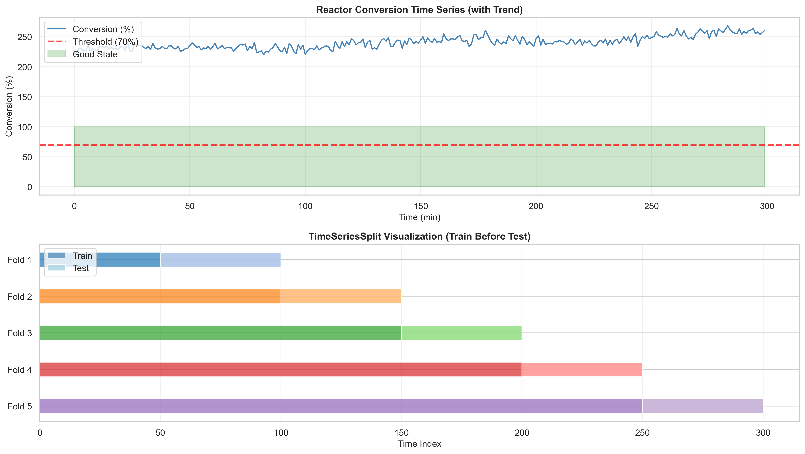
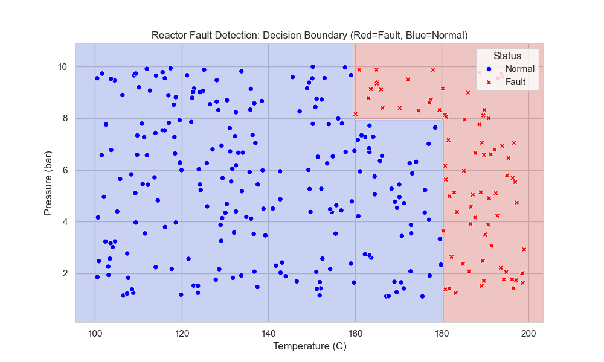

# Unit06｜Cross-Validation 與模型選擇（含化工安全邊界案例）

**課程名稱**：化工資料科學與機器學習實務（CHE-AI-101）  
**本堂課定位**：從「一次切分」進階到「更穩健的評估與選模」：CV、Grid Search，並用化工安全邊界做案例。  

---

## 1. 進階概念：交叉驗證 (Cross-Validation)

在化工實驗中，數據往往很珍貴且數量稀少（Small Data）。如果只切一次 Train/Test，剛好切到比較「簡單」或「極端」的測試資料，評估結果可能不準。

**理論詳解：K-Fold Cross-Validation**

為了降低評估的變異數 (Variance)，我們採用 $K$-Fold 交叉驗證。
1.  將原始資料集 $D$ 隨機分割成 $K$ 個互斥的子集 (Folds)：$D_1, D_2, \dots, D_K$。
2.  進行 $K$ 次迭代，每次取第 $k$ 個子集 $D_k$ 作為**驗證集 (Validation Set)**，其餘 $K-1$ 個子集作為**訓練集**。
3.  計算 $K$ 次的評估指標 $E_k$ (例如 Accuracy)，最終的模型效能為平均值：

$$ E_{CV} = \frac{1}{K} \sum_{k=1}^{K} E_k $$

這種方法確保了**每一筆資料都有機會被當作測試資料**，且恰好一次。這對於小樣本數據（如化工批次實驗數據）特別重要，能提供更可信的泛化誤差估計。

### 1.1 實務上你該用哪種 CV？（別再只用 `cv=5`）

在真實化工資料裡，「驗證策略」往往比「模型選哪個」更重要。請先判斷你的資料屬於哪個世界：

| 你的資料長什麼樣 | 常見情境（化工） | 建議切法 | Scikit-learn 建議 |
|---|---|---|---|
| **i.i.d.**（樣本互相獨立） | 實驗條件隨機抽樣、Titanic 這種表格資料 | `train_test_split(..., stratify=y)` + `StratifiedKFold` | `StratifiedKFold` |
| **有「批次/活動/設備」群組** | 批次反應、Campaign、生產線/機台差異、配方 Lot | **同一個 Batch 不能被拆開** | `GroupKFold` / `GroupShuffleSplit` |
| **時間序列**（有先後順序） | DCS/SCADA 連續資料、軟感測器、RUL | **不能 shuffle**，要用「過去預測未來」 | `TimeSeriesSplit`（或自訂 Walk-forward） |

> 口訣：**同一批/同一台/同一天**如果同時出現在 Train 與 Val，準確率常常是「假的」。

### 1.1.5 ⚠️ 化工時序數據的致命陷阱：KFold vs TimeSeriesSplit

**重要警告**：化工製程數據絕大多數具有時序性（溫度、壓力、流量隨時間變化），若錯誤使用 KFold 會造成**未來資訊洩漏（Future Information Leakage）**，導致模型性能被嚴重高估！

#### 問題根源

| 方法 | 數據分割方式 | 問題 |
|------|------------|------|
| **KFold（錯誤）** | 隨機打亂數據後切分 | 訓練集包含「未來」數據，測試集包含「過去」數據 |
| **TimeSeriesSplit（正確）** | 保證訓練集永遠在測試集之前 | 符合實際部署情境（用過去預測未來） |

#### 實際範例：反應器溫度控制

```python
from sklearn.model_selection import TimeSeriesSplit, KFold

# 生成時序數據（模擬反應器溫度與轉化率關係）
# 關鍵：包含時間趨勢項（早期數據對晚期預測無效）
temperature = 350 + 0.1 * time_idx + ...
conversion_rate = 50 + 0.5 * temperature + 0.05 * time_idx + ...

# ❌ 錯誤做法：KFold
kf_wrong = KFold(n_splits=5, shuffle=True, random_state=42)
scores_kfold = cross_val_score(model, X, y, cv=kf_wrong)
# 結果：準確率 0.920（過度樂觀！）

# ✅ 正確做法：TimeSeriesSplit  
tscv = TimeSeriesSplit(n_splits=5)
scores_tscv = cross_val_score(model, X, y, cv=tscv)
# 結果：準確率 0.750（真實泛化能力）

# 📉 性能差異：17 個百分點！
```

#### TimeSeriesSplit 的分割方式



**關鍵特性**：
- **Fold 1**：訓練 [0-60]，測試 [60-120]
- **Fold 2**：訓練 [0-120]，測試 [120-180]
- **Fold 3**：訓練 [0-180]，測試 [180-240]
- **Fold 4**：訓練 [0-240]，測試 [240-300]

每一折的測試集都在訓練集**時間之後**，完全避免未來資訊洩漏。

#### 化工時序數據的 CV 策略總結

| 數據類型 | 推薦方法 | 原因 |
|---------|---------|------|
| **批次數據（Batch）** | GroupKFold | 避免同批次數據洩漏 |
| **時序數據（Time Series）** | TimeSeriesSplit | 保證訓練在測試之前 |
| **一般分類數據** | StratifiedKFold | 維持類別比例平衡 |
| **一般回歸數據** | KFold | 簡單隨機分割 |

#### 常見錯誤與解決方案

**⚠️ 錯誤範例**：
```python
# 錯誤！對時序數據使用 shuffle
kf = KFold(n_splits=5, shuffle=True)  # ← 打亂時序
grid_search = GridSearchCV(model, params, cv=kf)
```

**✅ 正確範例**：
```python
# 正確！使用 TimeSeriesSplit
tscv = TimeSeriesSplit(n_splits=5)
grid_search = GridSearchCV(
    estimator=model,
    param_grid=params,
    cv=tscv,  # ← 保持時序
    scoring='neg_mean_squared_error'
)
grid_search.fit(X_timeseries, y_timeseries)
```

#### 實務建議

1. **識別數據類型**：分析數據是否有時間戳記或順序依賴
2. **檢視時間趨勢**：繪製目標變數隨時間的變化圖
3. **選擇正確 CV**：時序數據務必使用 `TimeSeriesSplit`
4. **驗證假設**：比較 KFold 與 TimeSeriesSplit 的性能差異，若差距大表示存在時間趨勢

**🎯 記住**：化工製程數據幾乎都是時序數據，預設使用 `TimeSeriesSplit` 是更安全的選擇！

---

### 1.2 避免 Data Leakage：化工場域最常踩的 6 個坑

1. **批次被拆開**：同一個 Batch 的早段在 Train、晚段在 Val，模型等於「看過答案」  
2. **時序被打亂**：對時序數據使用 `shuffle=True` 的 KFold → 用未來預測過去（最常見錯誤）
3. **先全資料做標準化/缺值填補/特徵選擇**：再做 CV（應該放進 `Pipeline` 讓它在每折內 fit）  
4. **用到未來資訊**：例如用 `t+10min` 的溫度特徵去預測 `t` 的品質（尤其軟感測器）  
5. **Target leakage**：特徵中混入「實驗室測到的 y 的 proxy」（例如產品分析儀輸出）  
6. **用 Test set 調參**：Test 的存在意義是「最後一次」的驗收，不是調到最好  
7. **在 CV 之前做重抽樣/SMOTE**：會讓合成樣本跨折洩漏（應該放進折內流程）

### 1.3 Nested CV：選模不要偷看（外層評估、內層調參）

當你同時做了「調參/挑模型」與「報告效能」，最容易不小心把驗證集當成測試集。解法是 **Nested CV**：

- **外層 CV**：只負責「估計泛化誤差」→ 你要報告的分數在這裡算  
- **內層 CV**：只負責「選最好的超參數/模型」→ 你可以 Grid/Random Search 放在這裡  

報告方式建議：
- 外層每折分數（平均 ± 標準差），再加上「最終一次的獨立 Test」作為驗收  
- 最終部署模型：用「全訓練資料」+ 內層找到的最佳設定重新訓練

### 程式實作與結果解讀

```python
from sklearn.model_selection import cross_val_score

# 決策樹模型
from sklearn.tree import DecisionTreeClassifier
model = DecisionTreeClassifier(max_depth=3)

# K-Fold 交叉驗證，這裡以 K=5 為例
scores = cross_val_score(model, X, y, cv=5, scoring='accuracy')

# 顯示每一折的準確率
for i, score in enumerate(scores, 1):
    print(f"Fold {i}: {score:.4f}")

# 平均準確率
print(f"Mean Accuracy: {scores.mean():.4f}")
```

**執行結果分析：**
- **平均準確率 (Mean Accuracy)**：這代表模型在未見過資料上的預期表現。
- **標準差 (Standard Deviation)**：代表模型表現的波動程度。
  - 若數值很小（例如 < 2%），代表模型很**穩定 (Stable)**，不管資料怎麼切，表現都差不多。
  - 若數值很大，代表模型對訓練資料的選取非常敏感，可能有 **Overfitting** 或資料量不足的問題。

---


## 2. 模型選擇策略與決策流程

### 2.1 模型選擇決策樹（Model Selection Decision Tree）

在化工專案中，選擇合適的機器學習模型需要考慮數據特性、業務需求與部署限制。以下提供一個實用的決策流程：

```
📊 數據類型判斷
│
├─ 🎯 分類問題（Survived, FaultType, FlowRegime...）
│   ├─ 特徵少 (< 10) + 需要可解釋性
│   │   → Decision Tree / Logistic Regression
│   ├─ 特徵多 (> 20) + 追求準確率
│   │   → Random Forest / XGBoost / Gradient Boosting
│   ├─ 類別不平衡（Imbalanced）
│   │   → 調整 class_weight 或使用 SMOTE + Ensemble
│   └─ 需要機率輸出（用於風險評估）
│       → Logistic Regression / Random Forest (predict_proba)
│
└─ 📈 回歸問題（Temperature, Yield, Viscosity...）
    ├─ 線性關係（相關係數 > 0.7）
    │   ├─ 無多重共線性 → Linear Regression
    │   ├─ 有多重共線性 → Ridge Regression
    │   └─ 需要特徵選擇 → Lasso Regression
    ├─ 非線性關係 + 少量交互作用
    │   → Polynomial Regression (degree 2-3)
    ├─ 時序數據 + 滯後效應（Lag features）
    │   → Gradient Boosting + TimeSeriesSplit
    └─ 物理約束（VLE, Arrhenius...）
        → Physics-informed ML / Scipy curve_fit
```

### 2.2 化工專案的模型選擇考量

| 考量因素 | 優先選擇 | 原因 |
|---------|---------|------|
| **可解釋性** | Decision Tree, Linear Model | 需要向現場/主管說明規則（SOP） |
| **小樣本 (n < 100)** | Regularized Linear Model | 避免過擬合，泛化能力較佳 |
| **高維度 (p > n)** | Lasso / ElasticNet | 自動特徵選擇 |
| **時序相依** | Gradient Boosting + TSCV | 捕捉時間模式 |
| **批次效應** | Random Forest + GroupKFold | 對異質性穩健 |
| **即時推論** | Decision Tree (depth ≤ 5) | 計算快速，適合邊緣裝置 |
| **極高準確率要求** | Ensemble (RF / XGBoost) | 犧牲解釋性換取性能 |

### 2.3 模型選擇實務流程

```python
# Step 1: 建立 Baseline（永遠先做！）
from sklearn.dummy import DummyClassifier
baseline = DummyClassifier(strategy='most_frequent')
baseline.fit(X_train, y_train)
baseline_acc = baseline.score(X_test, y_test)
print(f"Baseline (always predict majority): {baseline_acc:.3f}")

# Step 2: 簡單模型（可解釋性優先）
from sklearn.tree import DecisionTreeClassifier
simple_model = DecisionTreeClassifier(max_depth=3)
simple_model.fit(X_train, y_train)
simple_acc = simple_model.score(X_test, y_test)
print(f"Simple Decision Tree: {simple_acc:.3f}")

# Step 3: 複雜模型（性能優先）
from sklearn.ensemble import RandomForestClassifier
complex_model = RandomForestClassifier(n_estimators=100)
complex_model.fit(X_train, y_train)
complex_acc = complex_model.score(X_test, y_test)
print(f"Random Forest: {complex_acc:.3f}")

# Step 4: 決策判斷
# 若 simple_acc 與 complex_acc 差距 < 2%，優先選擇簡單模型
# 若差距 > 5%，且專案允許黑盒模型，選擇複雜模型
```

**決策準則**：
1. **Baseline 檢查**：新模型必須明顯優於隨機猜測
2. **簡單優先**：若簡單模型夠用（準確率差距 < 2-3%），選它
3. **成本權衡**：考慮維護成本、解釋成本、計算成本
4. **風險評估**：高風險應用（安全、品質）優先選可解釋模型

---

## 3. 模型優化：超參數調整 (Hyperparameter Tuning)

決策樹有許多「旋鈕」可以調整，這些稱為 **超參數 (Hyperparameters)**。調整超參數的過程，本質上是在權衡 **偏差 (Bias)** 與 **變異 (Variance)**。

- **`max_depth` (最大深度)**：
    - **太深 (High Complexity)**：模型會死記硬背訓練資料的雜訊，導致 **Overfitting (High Variance)**。
    - **太淺 (Low Complexity)**：模型無法捕捉資料的規律，導致 **Underfitting (High Bias)**。
- **`min_samples_split`**：一個節點至少要有幾個樣本才允許再分裂。數值越大，模型越保守（越不容易過擬合）。

### 3.1 你在調的其實是「工程決策」：成本、限制、與可維護性

在化工專案裡，超參數調整不只是追求分數，還包含：
- **錯誤成本**：漏報 (FN) 比誤報 (FP) 嚴重嗎？（安全/品質常常是）  
- **部署限制**：DCS/邊緣裝置推論時間、記憶體、可解釋性要求（SOP 能不能寫出來）  
- **資料稀少**：小樣本時，過度調參很容易把雜訊當規律  

若搜尋空間很大，除了 Grid Search 也可用：
- **RandomizedSearchCV**：固定計算預算下常常更有效率  
-（進階）**Bayesian Optimization**：在 Part 5 會更完整談「如何用更少實驗找到最佳點」  

**網格搜索 (Grid Search)**：
這就像化工製程中，我們需要尋找最佳的操作視窗 (Operating Window)。
假設我們有兩個參數 $\theta_1$ 和 $\theta_2$，Grid Search 會窮舉所有設定的組合 $(\theta_1^{(i)}, \theta_2^{(j)})$，並透過 Cross-Validation 找出使 $E_{CV}$ 最小的那組參數 $\theta^*$：

$$ \theta^* = \underset{\theta \in \Theta}{\text{argmin}} \frac{1}{K} \sum_{k=1}^{K} L(D_k, f(D_{\setminus k}; \theta)) $$

**執行結果分析：**
- **最佳參數 (Best Params)**：Grid Search 告訴我們在哪個參數組合下，模型在驗證集上的平均表現最好。
  - 例如，如果 `max_depth` 選了 3 或 5 而不是 10，這印證了「樹不用太深也能有很好的表現」，太深反而容易過擬合。
  - 這就像我們在化工廠做實驗設計 (DoE)，找到了反應的最佳溫度與壓力設定點。

### 3.2 實務交付：Model Selection Report（你要交給主管/現場的那份）

建議你在每次選模結束後，留下一份「可被審查」的交付：
- **資料描述**：來源、時間範圍、Batch/Campaign 定義、缺值策略  
- **驗證策略**：i.i.d / Group / TimeSeries，為什麼這樣切  
- **模型候選**：Baseline（例如常數/線性模型） vs 你的模型  
- **評估指標**：平均 ± 標準差、混淆矩陣（若分類）、以及錯誤成本或門檻設定  
- **風險與限制**：外推範圍、資料漂移可能、不可用情境  


## 4. 化工專題補充：反應器異常偵測 (Reactor Fault Detection)

除了 Titanic 生存預測，決策樹非常適合用於化工製程的 **異常偵測 (Fault Detection)**。

**情境與理論分析**：
假設我們有一個連續攪拌槽反應器 (CSTR)，監控變數為 **溫度 (T)** 與 **壓力 (P)**。
- 當 $T > 180^\circ C$ 時，反應失控。
- 當 $T > 160^\circ C$ 且 $P > 8 \text{ bar}$ 時，壓力過大導致洩漏風險。

**決策邊界 (Decision Boundary)**：
決策樹的一個重要幾何特性是：它的決策邊界是由**垂直於特徵軸的超平面 (Hyperplanes orthogonal to axes)** 所組成的。
這意味著決策樹非常擅長學習像 `IF T > 180` 這樣的規則（垂直切分），這與化工操作規程 (SOP) 的邏輯完全一致。

相比之下，如果是邏輯斯迴歸 (Logistic Regression) 或 SVM，它們可能會畫出一條斜線或曲線，雖然數學上可能準確，但在解釋給現場操作員聽時（例如：「當 0.5倍溫度 + 0.3倍壓力 > 100 時危險」），直觀性較差。

我們收集歷史操作數據，標記「正常」與「異常」，訓練決策樹來學習這個 **安全操作邊界 (Safety Boundary)**。決策樹畫出的邊界，可以直接對應到操作規程中的 SOP 條款，這在製程安全管理 (PSM) 中非常有價值。

### 實作結果與圖形分析


*(圖：反應器異常偵測的決策邊界，紅色為危險區，藍色為安全區)*

**圖形詳細解析：**

1.  **幾何特性**：
    - 請注意紅色與藍色交界的線條，它們全部都是 **水平線** 或 **垂直線**。這是決策樹的特性：它只能做 `X > Value` 這種單一變數的切分。
    - **垂直線 (T ≈ 180)**：對應到我們設定的規則 `T > 180`。模型成功抓到了這個主要的高溫限制。
    - **L型缺口 (T > 160 & P > 8)**：在圖的右上方（藍色安全區的右上角），可以看到一個明顯的矩形缺口被紅色危險區佔據。這是模型學會了第二條規則：即使溫度沒到 180 (在 160~180 之間)，如果壓力過高 (> 8)，依然是危險的。

2.  **化工意義**：
    - 這張圖就是一張 **操作視窗 (Operating Window)** 圖。
    - 透過機器學習，我們不需要人工去畫這些線，模型會自動從歷史數據中找出這些安全邊界。如果未來有新的操作點落在紅色區域，系統就可以發出警報。

---


## 5. 課後練習：流體流動模式分類 (Flow Regime Classification)

為了讓同學練習 **多類別分類 (Multi-class Classification)**，我們準備了一個流體力學的案例。

**背景**：
在化工管路設計中，氣液雙相流 (Gas-Liquid Two-Phase Flow) 的流動模式對於壓降計算與熱傳效率至關重要。常見的模式包含：
- **Bubble Flow (泡狀流)**：液體為主，氣體以小氣泡分散其中。
- **Slug Flow (栓狀流)**：氣泡聚集成大氣塞，流動不穩定。
- **Annular Flow (環狀流)**：氣體在中心高速流動，液體沿管壁成膜狀。

**任務**：
在 Notebook 的最後，我們提供了一組模擬數據，包含氣體表觀流速 ($V_{sg}$) 與液體表觀流速 ($V_{sl}$)。
請嘗試：
1.  建立決策樹模型。
2.  畫出決策邊界圖，觀察模型如何區分這三種流動模式。

> **提示**：這與反應器異常偵測非常像，只是標籤 $y$ 變成了 0, 1, 2 三種。

---

**[Next Unit]**  
接下來在 **Unit 07**，我們將進入化工核心應用：使用 **Scipy 與 Regression** 技術來解決 **熱力學參數擬合 (Thermodynamic Fitting)** 的問題。

---

## 本堂課程式演練

請開啟並完成：`Part_2/Unit06_CV_Model_Selection.ipynb`  
