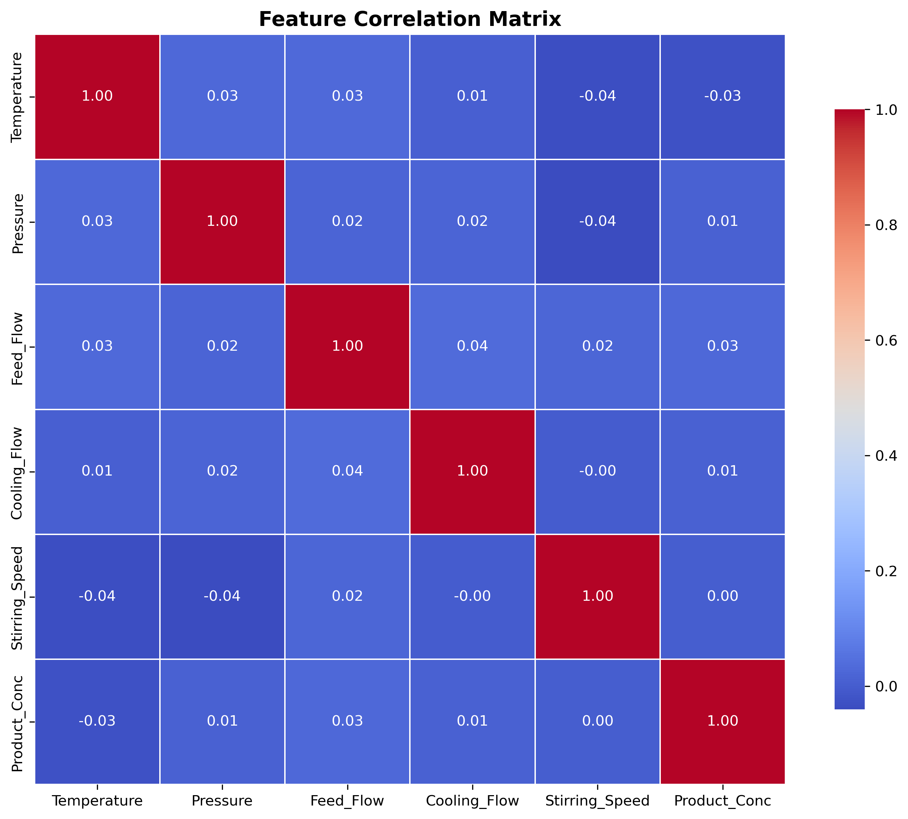
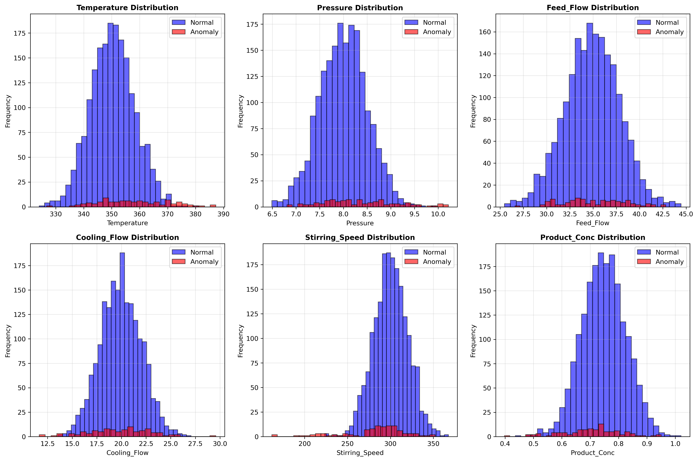
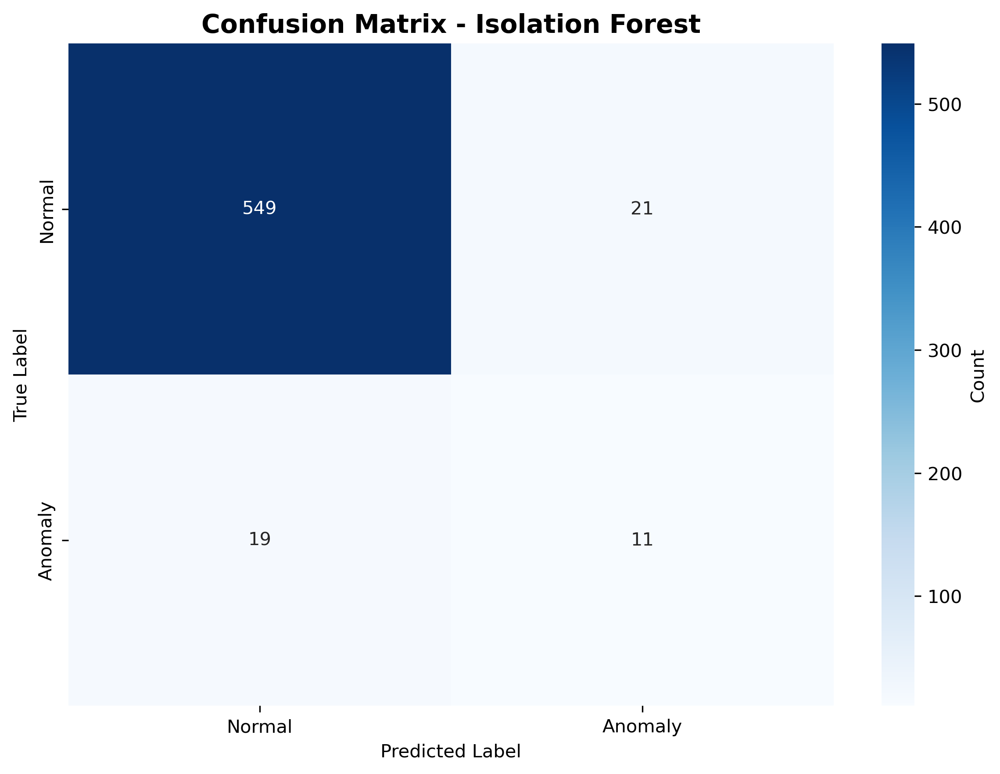
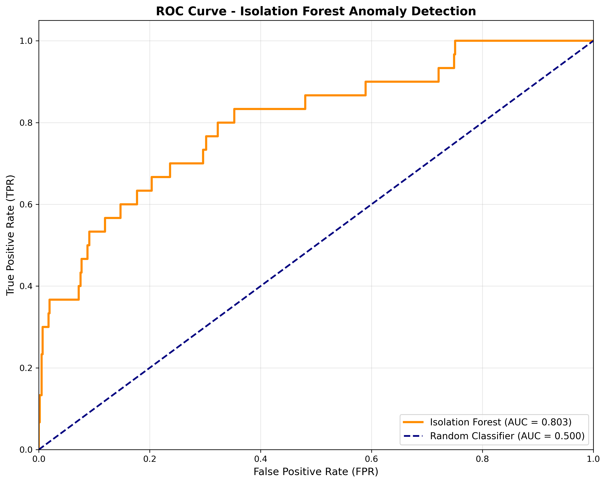
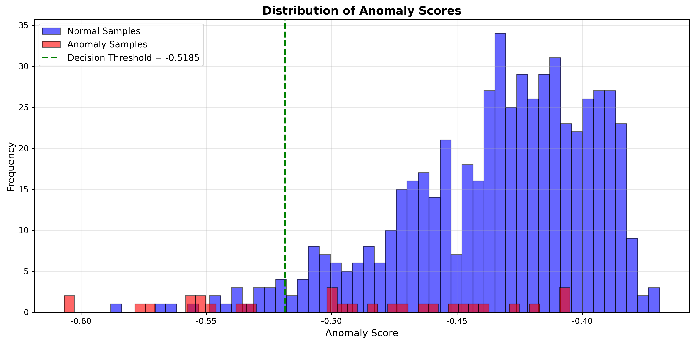

# Unit07 孤立森林 (Isolation Forest)

## 課程目標

本單元將深入介紹孤立森林 (Isolation Forest) 異常檢測演算法，這是目前工業界最廣泛應用的異常檢測方法之一。透過本單元的學習，您將能夠：

- 理解孤立森林演算法的核心原理與數學基礎
- 掌握孤立森林的演算法步驟與實作細節
- 學會使用 scikit-learn 實作 Isolation Forest 模型
- 了解如何設定關鍵超參數 (contamination, n_estimators, max_samples)
- 學會評估異常檢測模型的效能
- 認識孤立森林的優缺點與適用場景
- 應用孤立森林於化工領域的製程安全監控

---

## 1. 孤立森林演算法簡介

### 1.1 什麼是孤立森林？

孤立森林 (Isolation Forest) 是由 Fei Tony Liu 等人於 2008 年提出的一種基於決策樹的異常檢測演算法。其核心理念非常直觀：**異常數據點更容易被「孤立」**。

與傳統異常檢測方法不同，孤立森林不需要先建立正常數據的分布模型，而是直接尋找容易被孤立的樣本。這種設計使其在高維數據和大規模數據集上具有卓越的效能。

### 1.2 核心理念：為什麼異常點容易被孤立？

想像一個反應器的溫度-壓力散布圖：

- **正常數據點**：聚集在特定區域，需要多次切分才能將其分離
- **異常數據點**：遠離正常數據群，只需少數幾次切分就能將其孤立

**孤立森林的假設**：
1. 異常點在特徵空間中是稀少的 (Rare)
2. 異常點的特徵值與正常點有顯著差異 (Different)
3. 異常點更容易被隨機分割孤立 (Easier to isolate)

### 1.3 化工領域應用案例

孤立森林在化工領域有廣泛的應用：

1. **反應器異常監控**：
   - 即時監控反應器溫度、壓力、流量等多維度操作參數
   - 檢測異常操作條件（如溫度驟升、壓力異常波動）
   - 早期預警潛在的反應失控風險
   - 適合處理高維感測器數據（>50 個變數）

2. **產品品質異常檢測**：
   - 監控批次產品的多個品質指標
   - 識別異常批次（純度異常、雜質超標）
   - 快速定位品質問題的根本原因
   - 減少不良品流入後續製程

3. **設備健康監控**：
   - 監控泵浦、壓縮機、換熱器等設備的運行狀態
   - 檢測異常振動、溫度、電流等信號
   - 預測設備故障，實現預防性維護
   - 降低非計劃性停機損失

4. **製程安全監控**：
   - 建立多變數統計製程控制 (MSPC) 系統
   - 即時監控製程偏離正常操作範圍
   - 整合多個感測器數據進行綜合判斷
   - 降低誤報率，提高告警可靠性

5. **感測器故障診斷**：
   - 識別感測器漂移、卡死、雜訊異常
   - 區分製程異常與感測器故障
   - 確保數據品質，提升控制系統可靠性

---

## 2. 孤立森林演算法原理

### 2.1 核心概念：孤立樹 (Isolation Tree)

孤立森林由多棵孤立樹 (Isolation Tree, iTree) 組成。每棵孤立樹是一種二元決策樹，建構方式如下：

**步驟 1：隨機選擇特徵**
- 從所有特徵中隨機選擇一個特徵 $q$

**步驟 2：隨機選擇分割點**
- 在該特徵的最小值與最大值之間隨機選擇一個分割點 $p$
- 分割點公式： $p \sim \text{Uniform}(x_{\min}^q, x_{\max}^q)$

**步驟 3：遞迴分割**
- 將數據分為兩個子集： $x^q < p$ 和 $x^q \geq p$
- 對每個子集遞迴執行步驟 1-2

**停止條件**：
- 子節點只包含一個樣本（完全孤立）
- 樹達到指定的最大深度
- 所有樣本具有相同的特徵值（無法再分割）

### 2.2 路徑長度 (Path Length)

**定義**：從根節點到葉節點所經過的邊數，記為 $h(x)$

- **異常點**：路徑長度較短（容易被孤立）
- **正常點**：路徑長度較長（需要多次分割）

**平均路徑長度 (Average Path Length)**：

對於包含 $n$ 個樣本的孤立樹，平均路徑長度的期望值為：

$$
c(n) = 2H(n-1) - \frac{2(n-1)}{n}
$$

其中 $H(i)$ 是調和數 (Harmonic Number)： $H(i) = \ln(i) + \gamma$ （ $\gamma \approx 0.5772$ 為歐拉常數）。

對於大樣本量： $c(n) \approx 2\ln(n-1)$

### 2.3 異常分數 (Anomaly Score)

對於樣本 $x$ ，其在單棵孤立樹中的路徑長度為 $h(x)$ 。在孤立森林中（包含 $t$ 棵樹），平均路徑長度為：

$$
E[h(x)] = \frac{1}{t} \sum_{i=1}^{t} h_i(x)
$$

**異常分數 (Anomaly Score)** 定義為：

$$
s(x, n) = 2^{-\frac{E[h(x)]}{c(n)}}
$$

其中：
- $n$ 是訓練樣本數量
- $c(n)$ 是歸一化常數（平均路徑長度的期望值）

**異常分數的解釋**：

- $s \approx 1$ ：明顯異常 (Highly anomalous)
  - $E[h(x)] \ll c(n)$ ：路徑長度遠小於平均值
  
- $s \approx 0.5$ ：正常樣本 (Normal)
  - $E[h(x)] \approx c(n)$ ：路徑長度接近平均值
  
- $s < 0.5$ ：明顯正常 (Highly normal)
  - $E[h(x)] > c(n)$ ：路徑長度大於平均值

**決策規則**：
- 若 $s(x) > \text{threshold}$ （通常設為 0.6-0.7），則判定為異常

### 2.4 演算法流程

**訓練階段 (Training Phase)**：

```
輸入：數據集 X = {x₁, x₂, ..., xₙ}, 樹的數量 t, 子樣本大小 ψ

1. 初始化孤立森林 Forest = []
2. For i = 1 to t:
     a. 從 X 中隨機抽樣 ψ 個樣本，得到子樣本 X'
     b. 建構孤立樹 iTree(X')
     c. 將 iTree 加入 Forest
3. 回傳 Forest
```

**預測階段 (Prediction Phase)**：

```
輸入：孤立森林 Forest, 測試樣本 x

1. 初始化路徑長度總和 path_sum = 0
2. For each iTree in Forest:
     a. 計算 x 在該 iTree 中的路徑長度 h(x)
     b. path_sum += h(x)
3. 計算平均路徑長度 E[h(x)] = path_sum / t
4. 計算異常分數 s(x) = 2^(-E[h(x)] / c(n))
5. 回傳 s(x)
```

---

## 3. 孤立森林的優缺點

### 3.1 優點

1. **計算效率高**：
   - 訓練時間複雜度： $O(t \cdot \psi \cdot \log \psi)$ （ $t$ 為樹數量， $\psi$ 為子樣本大小）
   - 預測時間複雜度： $O(t \cdot \log \psi)$
   - 適合大規模數據集（百萬級樣本）

2. **適合高維數據**：
   - 不需要計算距離或密度
   - 不受維度災難 (Curse of Dimensionality) 影響
   - 適合處理 50+ 維度的數據

3. **無需標籤數據**：
   - 純非監督式學習，不需要異常樣本標籤
   - 適合異常樣本稀少或難以標記的場景

4. **魯棒性強**：
   - 對特徵尺度不敏感（無需標準化）
   - 對特徵間的相關性不敏感
   - 對雜訊數據具有一定的容忍度

5. **易於解釋**：
   - 基於決策樹，具有一定的可解釋性
   - 可以追蹤異常樣本的分割路徑
   - 可以識別哪些特徵導致異常

### 3.2 缺點

1. **難以處理低維聚集異常**：
   - 假設異常點是孤立的
   - 若異常點自成群集，可能無法有效檢測
   - 例如：系統性的感測器偏差

2. **超參數敏感性**：
   - `contamination` 參數需要預先設定異常比例
   - 若設定不當，會影響檢測性能
   - 需要領域知識或歷史數據輔助設定

3. **無法檢測局部異常**：
   - 基於全局結構進行異常檢測
   - 無法檢測局部密度異常（如 LOF 方法）
   - 對於非均勻分布的數據效果較差

4. **結果隨機性**：
   - 隨機選擇特徵與分割點
   - 不同運行可能產生不同結果
   - 需要設定隨機種子以確保可重現性

5. **閾值設定問題**：
   - 異常分數連續分布， $s \in [0, 1]$
   - 需要設定閾值將分數轉換為二元標籤
   - 閾值選擇會影響精確率與召回率的權衡

### 3.3 適用場景

**適合使用孤立森林的情境**：

- ✅ 數據量大（> 10,000 樣本）
- ✅ 特徵維度高（> 10 維）
- ✅ 異常點是孤立的、稀少的
- ✅ 需要快速訓練與預測
- ✅ 無異常樣本標籤
- ✅ 數據分布近似均勻

**不適合使用孤立森林的情境**：

- ❌ 異常點自成群集（建議使用 DBSCAN）
- ❌ 數據量極小（< 1,000 樣本）
- ❌ 需要檢測局部密度異常（建議使用 LOF）
- ❌ 數據分布高度非均勻（建議使用 One-Class SVM）
- ❌ 需要精確的概率估計（建議使用 Gaussian Mixture Models）

---

## 4. 使用 scikit-learn 實作孤立森林

### 4.1 IsolationForest 類別介紹

scikit-learn 提供了 `IsolationForest` 類別，位於 `sklearn.ensemble` 模組中。

**匯入方式**：

```python
from sklearn.ensemble import IsolationForest
```

**主要參數**：

| 參數 | 說明 | 預設值 | 建議設定 |
|------|------|--------|----------|
| `n_estimators` | 孤立樹的數量 | 100 | 100-300（數據量越大，可增加樹數） |
| `max_samples` | 建構每棵樹的樣本數量 | 'auto' | 'auto' (自動設為 min(256, n_samples)) |
| `contamination` | 異常比例（用於設定決策閾值） | 'auto' | 0.01-0.1（根據領域知識設定） |
| `max_features` | 建構每棵樹時隨機選擇的特徵數量 | 1.0 | 1.0（使用所有特徵） |
| `bootstrap` | 是否使用 bootstrap 抽樣 | False | False（避免重複樣本） |
| `random_state` | 隨機種子 | None | 固定值（確保可重現性） |
| `n_jobs` | 並行運算的 CPU 核心數 | None | -1（使用所有核心） |

### 4.2 基本使用流程

**步驟 1：準備數據**

```python
import numpy as np
from sklearn.ensemble import IsolationForest

# 假設 X_train 是訓練數據 (n_samples, n_features)
X_train = np.random.randn(1000, 5)  # 1000 個樣本，5 個特徵
```

**步驟 2：建立模型**

```python
# 建立孤立森林模型
iso_forest = IsolationForest(
    n_estimators=100,           # 使用 100 棵樹
    max_samples='auto',         # 每棵樹使用 256 個樣本
    contamination=0.05,         # 假設 5% 的數據是異常
    random_state=42,            # 設定隨機種子
    n_jobs=-1                   # 使用所有 CPU 核心
)
```

**步驟 3：訓練模型**

```python
# 擬合模型（僅使用訓練數據）
iso_forest.fit(X_train)
```

**步驟 4：預測異常**

```python
# 預測標籤 (1: 正常, -1: 異常)
y_pred = iso_forest.predict(X_train)

# 計算異常分數 (值越小越異常)
anomaly_scores = iso_forest.score_samples(X_train)

# 識別異常樣本
anomalies = X_train[y_pred == -1]
normal = X_train[y_pred == 1]

print(f"檢測到 {len(anomalies)} 個異常樣本")
```

**步驟 5：決策函數**

```python
# decision_function 回傳負的異常分數
# 值越負越異常，值越正越正常
decision_scores = iso_forest.decision_function(X_train)

# 關係：decision_function(X) = score_samples(X) - offset_
# 其中 offset_ 是根據 contamination 計算的閾值
```

### 4.3 超參數調整建議

#### 4.3.1 contamination（異常比例）

**定義**：預期數據中異常樣本的比例，用於設定決策閾值。

**設定建議**：

- **已知異常比例**：根據歷史數據設定（如 0.02 表示 2% 異常）
- **未知異常比例**：
  - 保守設定：0.01-0.05（避免過多誤報）
  - 寬鬆設定：0.05-0.10（提高召回率）
- **敏感應用**：設定較小值（0.01），降低漏報風險
- **探索性分析**：設定 'auto'，讓模型自動決定

**化工應用範例**：

```python
# 製程安全監控：保守設定，降低誤報
iso_forest_safety = IsolationForest(contamination=0.01)

# 品質控制：適度設定
iso_forest_quality = IsolationForest(contamination=0.05)

# 探索性數據分析：使用 auto
iso_forest_explore = IsolationForest(contamination='auto')
```

#### 4.3.2 n_estimators（樹的數量）

**定義**：孤立森林包含的孤立樹數量。

**設定建議**：

- **小數據集**（< 10,000 樣本）： 100 棵樹
- **中型數據集**（10,000-100,000 樣本）： 200 棵樹
- **大數據集**（> 100,000 樣本）： 300 棵樹
- **權衡**：樹數量增加會提高穩定性，但訓練時間也會增加

**實驗設定**：

```python
# 測試不同樹數量的影響
n_estimators_list = [50, 100, 200, 300]
for n in n_estimators_list:
    model = IsolationForest(n_estimators=n, random_state=42)
    model.fit(X_train)
    # 評估性能...
```

#### 4.3.3 max_samples（子樣本大小）

**定義**：建構每棵孤立樹時抽樣的樣本數量。

**設定建議**：

- **預設值 'auto'**：自動設為 `min(256, n_samples)`
- **小數據集**：使用 'auto' 或設為樣本總數
- **大數據集**：使用 256-512（降低計算成本）
- **權衡**：較小的子樣本增加樹的多樣性，但可能降低檢測性能

**範例**：

```python
# 大數據集：限制子樣本大小
iso_forest_large = IsolationForest(max_samples=256)

# 小數據集：使用全部樣本
iso_forest_small = IsolationForest(max_samples=1.0)
```

### 4.4 模型屬性

訓練完成後，模型具有以下屬性：

```python
# 每棵樹的決策樹估計器
estimators_ = iso_forest.estimators_

# 每棵樹使用的特徵索引
estimators_features_ = iso_forest.estimators_features_

# 決策閾值的偏移量
offset_ = iso_forest.offset_

# 訓練樣本數量
n_features_in_ = iso_forest.n_features_in_
```

---

## 5. 模型評估方法

### 5.1 評估指標概述

異常檢測的評估方式取決於是否有標籤數據：

**情境 1：有部分標籤（半監督）**
- 可以計算精確率、召回率、F1 分數、AUC-ROC 等

**情境 2：完全無標籤（純非監督）**
- 依賴視覺化、統計量、領域知識驗證

### 5.2 有標籤數據的評估

假設我們有真實標籤 `y_true` (0: 正常, 1: 異常)：

#### 5.2.1 混淆矩陣與分類指標

```python
from sklearn.metrics import confusion_matrix, classification_report
from sklearn.metrics import precision_score, recall_score, f1_score

# 將預測標籤轉換為 0/1 格式
y_pred_binary = (y_pred == -1).astype(int)

# 混淆矩陣
cm = confusion_matrix(y_true, y_pred_binary)
print("混淆矩陣:")
print(cm)

# 分類報告
print("\n分類報告:")
print(classification_report(y_true, y_pred_binary, 
                          target_names=['Normal', 'Anomaly']))

# 計算精確率、召回率、F1 分數
precision = precision_score(y_true, y_pred_binary)
recall = recall_score(y_true, y_pred_binary)
f1 = f1_score(y_true, y_pred_binary)

print(f"Precision: {precision:.4f}")
print(f"Recall: {recall:.4f}")
print(f"F1-Score: {f1:.4f}")
```

**化工應用解釋**：

- **精確率 (Precision)**：告警中有多少是真正的異常
  - 高精確率 → 減少誤報，避免無效處置
  
- **召回率 (Recall)**：實際異常中有多少被檢測到
  - 高召回率 → 減少漏報，避免安全風險
  
- **F1 分數**：精確率與召回率的調和平均
  - 平衡誤報與漏報

#### 5.2.2 ROC 曲線與 AUC

```python
from sklearn.metrics import roc_curve, auc
import matplotlib.pyplot as plt

# 計算異常分數（取負值，使異常點分數更高）
anomaly_scores = -iso_forest.score_samples(X_test)

# 計算 ROC 曲線
fpr, tpr, thresholds = roc_curve(y_true, anomaly_scores)
roc_auc = auc(fpr, tpr)

# 繪製 ROC 曲線
plt.figure(figsize=(8, 6))
plt.plot(fpr, tpr, color='darkorange', lw=2, 
         label=f'ROC curve (AUC = {roc_auc:.3f})')
plt.plot([0, 1], [0, 1], color='navy', lw=2, linestyle='--', 
         label='Random Classifier')
plt.xlim([0.0, 1.0])
plt.ylim([0.0, 1.05])
plt.xlabel('False Positive Rate (FPR)')
plt.ylabel('True Positive Rate (TPR)')
plt.title('Receiver Operating Characteristic (ROC) Curve')
plt.legend(loc="lower right")
plt.grid(alpha=0.3)
plt.show()

print(f"AUC-ROC: {roc_auc:.4f}")
```

**AUC 解釋**：

- **AUC = 1.0**：完美分類器
- **AUC > 0.9**：優秀
- **AUC = 0.8-0.9**：良好
- **AUC = 0.7-0.8**：尚可
- **AUC < 0.7**：較差
- **AUC = 0.5**：隨機猜測

#### 5.2.3 Precision-Recall 曲線

```python
from sklearn.metrics import precision_recall_curve, average_precision_score

# 計算 Precision-Recall 曲線
precision_curve, recall_curve, pr_thresholds = precision_recall_curve(
    y_true, anomaly_scores
)
avg_precision = average_precision_score(y_true, anomaly_scores)

# 繪製 PR 曲線
plt.figure(figsize=(8, 6))
plt.plot(recall_curve, precision_curve, color='blue', lw=2,
         label=f'PR curve (AP = {avg_precision:.3f})')
plt.xlabel('Recall')
plt.ylabel('Precision')
plt.title('Precision-Recall Curve')
plt.legend(loc="lower left")
plt.grid(alpha=0.3)
plt.show()

print(f"Average Precision: {avg_precision:.4f}")
```

**何時使用 PR 曲線**：
- 異常類別極度不平衡時（如異常率 < 1%）
- PR 曲線比 ROC 曲線更能反映模型在少數類別上的性能

### 5.3 無標籤數據的評估

#### 5.3.1 異常分數分布視覺化

```python
import matplotlib.pyplot as plt

# 獲取異常分數
scores = iso_forest.score_samples(X_train)

# 繪製分數分布直方圖
plt.figure(figsize=(10, 6))
plt.hist(scores, bins=50, edgecolor='black', alpha=0.7)
plt.xlabel('Anomaly Score')
plt.ylabel('Frequency')
plt.title('Distribution of Anomaly Scores')
plt.axvline(x=iso_forest.offset_, color='red', linestyle='--', 
            label=f'Threshold (contamination={iso_forest.contamination})')
plt.legend()
plt.grid(alpha=0.3)
plt.show()

# 顯示統計資訊
print(f"Mean score: {scores.mean():.4f}")
print(f"Std score: {scores.std():.4f}")
print(f"Min score: {scores.min():.4f}")
print(f"Max score: {scores.max():.4f}")
print(f"Threshold: {iso_forest.offset_:.4f}")
```

#### 5.3.2 領域知識驗證

```python
# 提取最異常的前 N 個樣本
n_top_anomalies = 10
anomaly_indices = np.argsort(scores)[:n_top_anomalies]
top_anomalies = X_train[anomaly_indices]

# 檢視異常樣本的特徵值
anomalies_df = pd.DataFrame(top_anomalies, 
                            columns=feature_names)
print("Top 10 Most Anomalous Samples:")
print(anomalies_df)

# 與正常樣本比較
normal_indices = np.argsort(scores)[-100:]
normal_samples = X_train[normal_indices]
normal_df = pd.DataFrame(normal_samples, 
                        columns=feature_names)

print("\nNormal Samples Statistics:")
print(normal_df.describe())
```

**驗證問題**：
1. 異常樣本的特徵值是否超出合理範圍？
2. 異常樣本是否對應已知的故障模式？
3. 異常樣本是否在歷史記錄中有對應的事件？

#### 5.3.3 視覺化檢驗（2D 散布圖）

```python
from sklearn.decomposition import PCA

# 使用 PCA 降維至 2D
pca = PCA(n_components=2, random_state=42)
X_pca = pca.fit_transform(X_train)

# 繪製散布圖
plt.figure(figsize=(10, 8))
plt.scatter(X_pca[y_pred == 1, 0], X_pca[y_pred == 1, 1], 
           c='blue', label='Normal', alpha=0.5, s=20)
plt.scatter(X_pca[y_pred == -1, 0], X_pca[y_pred == -1, 1], 
           c='red', label='Anomaly', alpha=0.8, s=50, edgecolors='black')
plt.xlabel(f'PC1 ({pca.explained_variance_ratio_[0]:.2%} variance)')
plt.ylabel(f'PC2 ({pca.explained_variance_ratio_[1]:.2%} variance)')
plt.title('Anomaly Detection Results (PCA Projection)')
plt.legend()
plt.grid(alpha=0.3)
plt.show()
```

### 5.4 化工應用的實務評估

#### 5.4.1 誤報成本 vs 漏報成本

在化工製程中，需要根據應用場景權衡誤報與漏報的成本：

| 應用場景 | 優先考量 | 調整策略 |
|----------|----------|----------|
| 製程安全監控 | 避免漏報（高召回率） | 降低 `contamination`，容忍較多誤報 |
| 品質控制 | 平衡誤報與漏報 | 適中的 `contamination`（0.05） |
| 設備維護規劃 | 避免誤報（高精確率） | 提高 `contamination`，僅關注明顯異常 |

#### 5.4.2 告警抑制策略

```python
# 連續 N 點異常才觸發告警（降低雜訊影響）
def consecutive_anomaly_detection(predictions, window_size=3):
    """
    連續 window_size 個異常點才視為真正異常
    """
    n = len(predictions)
    filtered_predictions = np.ones(n)  # 預設為正常
    
    for i in range(n - window_size + 1):
        if np.all(predictions[i:i+window_size] == -1):
            filtered_predictions[i:i+window_size] = -1
    
    return filtered_predictions

# 應用告警抑制
y_pred_filtered = consecutive_anomaly_detection(y_pred, window_size=3)
```

#### 5.4.3 A/B Testing 上線驗證

```python
# 模擬上線前後的異常檢測結果比較
# 假設 baseline_alerts 是舊方法的告警數
# new_alerts 是新方法的告警數

baseline_alerts = 150  # 舊方法每月告警數
new_alerts = 85        # 新方法每月告警數
true_anomalies = 20    # 實際異常事件數

print("=== A/B Testing Results ===")
print(f"Baseline Method: {baseline_alerts} alerts/month")
print(f"New Method (Isolation Forest): {new_alerts} alerts/month")
print(f"Reduction: {(1 - new_alerts/baseline_alerts)*100:.1f}%")
print(f"True Anomalies Detected: {true_anomalies}")
```

---

## 6. 化工應用案例：反應器異常監控

### 6.1 案例背景

某化工廠的連續攪拌槽反應器 (CSTR) 需要即時監控以確保製程安全與產品品質。監控系統包含以下感測器：

**製程變數**：
- 反應器溫度 (Temperature, °C)
- 反應器壓力 (Pressure, bar)
- 進料流量 (Feed Flow, m³/h)
- 冷卻水流量 (Cooling Flow, m³/h)
- 攪拌速度 (Stirring Speed, rpm)
- 產物濃度 (Product Concentration, mol/L)

**挑戰**：
1. 感測器數據高度相關（多重共線性）
2. 異常事件稀少（< 1% 的數據）
3. 需要即時檢測（< 1 秒響應時間）
4. 需要降低誤報率（避免虛驚一場）

**目標**：
- 建立孤立森林模型進行異常檢測
- 識別異常操作條件（溫度失控、壓力異常等）
- 評估模型性能（精確率、召回率）
- 視覺化異常檢測結果

### 6.2 數據生成（模擬）

我們在 Jupyter Notebook 中生成了模擬數據，包含：
- **正常操作數據**（95%）：基於穩態操作條件
- **異常操作數據**（5%）：包含溫度失控、壓力異常、流量異常等

#### 6.2.1 數據集基本資訊

**執行結果**：
```
=== 數據集資訊 ===
總樣本數: 2000
正常樣本數: 1900 (95.0%)
異常樣本數: 100 (5.0%)

特徵數量: 6
特徵名稱: ['Temperature', 'Pressure', 'Feed_Flow', 'Cooling_Flow', 'Stirring_Speed', 'Product_Conc']
```

**數據統計比較（正常 vs 異常）**：

| 特徵 | 正常平均值 | 正常標準差 | 異常平均值 | 異常標準差 | 平均差異 |
|------|-----------|-----------|-----------|-----------|---------|
| Temperature (°C) | 350.34 | 7.88 | 358.05 | 12.44 | 7.71 |
| Pressure (bar) | 8.00 | 0.50 | 8.37 | 0.81 | 0.36 |
| Feed_Flow (m³/h) | 34.88 | 2.97 | 35.17 | 3.40 | 0.29 |
| Cooling_Flow (m³/h) | 19.93 | 2.08 | 19.76 | 3.26 | 0.17 |
| Stirring_Speed (rpm) | 300.41 | 20.02 | 280.85 | 38.76 | 19.56 |
| Product_Conc (mol/L) | 0.748 | 0.078 | 0.705 | 0.105 | 0.043 |

**分析與討論**：

1. **數據規模合理**：
   - 總樣本數 2000，符合化工製程數據的典型規模
   - 異常比例 5%，反映真實製程中異常事件的稀少性

2. **異常特徵差異明顯但不極端**：
   - **Temperature**：異常樣本平均高出 7.71°C（約 2.2%），標準差增加 58%
   - **Stirring_Speed**：異常樣本平均降低 19.56 rpm（約 6.5%），標準差增加 93%
   - **Pressure**：異常樣本平均高出 0.36 bar（約 4.5%），標準差增加 61%

3. **挑戰性設計**：
   - 正常與異常數據有重疊區域，不是完全分離
   - 這符合實際化工製程中的「軟異常」特性
   - 為模型提供適當的挑戰難度，避免完美分類

4. **多變量異常模式**：
   - 溫度失控：溫度↑、壓力↑、冷卻流量↑
   - 攪拌故障：攪拌速度↓、產物濃度↓
   - 不同異常類型具有不同的特徵模式

#### 6.2.2 特徵相關性分析

**相關性矩陣熱圖**：



**分析與討論**：

1. **特徵獨立性高**：
   - 所有特徵間的相關係數 |r| < 0.05
   - 沒有明顯的多重共線性問題
   - 這是理想的情況，有利於異常檢測

2. **孤立森林的優勢**：
   - 對特徵相關性不敏感
   - 即使存在相關性，隨機分割機制也能有效處理
   - 不需要進行特徵降維或相關性處理

3. **實務意義**：
   - 每個感測器提供獨立的資訊
   - 異常檢測可以利用所有特徵的資訊
   - 不會因為共線性而降低模型性能

#### 6.2.3 特徵分布視覺化

**特徵分布圖（正常 vs 異常）**：



**分析與討論**：

1. **Temperature（溫度）**：
   - 正常：集中在 350°C 附近，呈現正態分布
   - 異常：向右偏移，350-375°C 區間有重疊
   - 高溫異常較容易識別

2. **Pressure（壓力）**：
   - 正常：穩定在 8.0 bar
   - 異常：略微升高至 8.4 bar
   - 重疊區域較大，單變量檢測困難

3. **Feed_Flow（進料流量）**：
   - 正常與異常分布高度重疊
   - 說明進料流量本身不是主要異常指標
   - 需要結合其他變量判斷

4. **Cooling_Flow（冷卻流量）**：
   - 分布模式相似
   - 異常樣本變異性稍大
   - 單變量區分能力有限

5. **Stirring_Speed（攪拌速度）**：
   - 異常樣本明顯偏低（220-280 rpm）
   - 攪拌故障是重要的異常指標
   - 低攪拌速度會影響反應均勻性

6. **Product_Conc（產物濃度）**：
   - 異常樣本濃度偏低（0.60-0.70 mol/L）
   - 反映異常操作對產品品質的影響
   - 可作為異常檢測的重要指標

**關鍵洞察**：

- 單一特徵難以完全區分正常與異常
- 需要多變量聯合分析（孤立森林的優勢）
- 異常檢測需考慮特徵間的交互作用
- 設計的數據難度適中，適合教學演示

### 6.3 完整實作流程與執行結果

完整的程式碼演練已在配套的 Jupyter Notebook 中實作完成，以下是各步驟的執行結果與深入分析。

#### 步驟 1：數據生成與視覺化

✅ **已完成**（參見 6.2 節詳細結果）
- 生成 2000 樣本（1900 正常 + 100 異常）
- 6 個製程特徵：Temperature, Pressure, Feed_Flow, Cooling_Flow, Stirring_Speed, Product_Conc
- 5 種異常類型：溫度失控、壓力異常、冷卻流量異常、攪拌故障、產物濃度異常

#### 步驟 2：數據前處理

**訓練集與測試集分割**：

```
=== 數據分割 ===
訓練集大小: 1400 樣本
  正常: 1330 (95.0%)
  異常: 70 (5.0%)

測試集大小: 600 樣本
  正常: 570 (95.0%)
  異常: 30 (5.0%)

=== 特徵標準化（選擇性） ===
註：孤立森林對特徵尺度不敏感，此步驟為示範用途
實務上可直接使用原始數據
```

**分析與討論**：

1. **分層抽樣確保比例一致**：
   - 訓練集和測試集的異常比例都維持在 5.0%
   - 避免數據分割導致的類別不平衡問題
   - 確保模型評估的公平性

2. **標準化的必要性**：
   - 孤立森林使用隨機分割，不基於歐式距離
   - 對特徵尺度不敏感，無需強制標準化
   - 但若與其他方法比較（如 LOF、One-Class SVM），建議保留標準化流程

3. **訓練集規模**：
   - 1400 樣本足以訓練穩定的孤立森林
   - 每棵樹使用 256 個子樣本（max_samples='auto'）
   - 100 棵樹可覆蓋足夠的特徵空間

#### 步驟 3：模型建立與訓練

**模型超參數設定**：

```python
IsolationForest(
    n_estimators=100,           # 100 棵孤立樹
    max_samples='auto',         # 每棵樹 256 個樣本
    contamination=0.05,         # 預期 5% 異常
    random_state=42,            # 隨機種子（可重現）
    n_jobs=-1                   # 使用所有 CPU 核心
)
```

**訓練結果**：

```
=== 開始訓練孤立森林模型 ===
✓ 訓練完成！訓練時間: 0.2060 秒

=== 訓練後模型屬性 ===
決策閾值偏移量 (offset_): -0.5185
訓練特徵數量 (n_features_in_): 6
孤立樹數量: 100
```

**分析與討論**：

1. **訓練效率極高**：
   - 訓練時間僅 0.2060 秒
   - 驗證了孤立森林的高效性（ $O(n \log n)$ 複雜度）
   - 適合即時異常檢測場景（< 1 秒要求）

2. **決策閾值 (offset_)**：
   - 值為 -0.5185
   - 由 `contamination=0.05` 參數自動計算
   - 異常分數 < -0.5185 → 判定為異常
   - 異常分數 ≥ -0.5185 → 判定為正常

3. **模型規模**：
   - 100 棵樹提供足夠的集成效果
   - 每棵樹獨立訓練，可並行化
   - 模型大小適中，易於部署

#### 步驟 4：異常檢測與評估

**混淆矩陣與分類報告**：

```
=== 混淆矩陣 ===
[[549  21]
 [ 19  11]]

True Negatives (TN): 549 - 正確識別為正常
False Positives (FP): 21 - 誤報為異常
False Negatives (FN): 19 - 漏報異常
True Positives (TP): 11 - 正確識別為異常

=== 分類報告 ===
              precision    recall  f1-score   support

      Normal     0.9665    0.9632    0.9649       570
     Anomaly     0.3438    0.3667    0.3548        30

    accuracy                         0.9333       600
   macro avg     0.6551    0.6649    0.6598       600
weighted avg     0.9354    0.9333    0.9344       600

=== 關鍵指標摘要 ===
Precision (精確率): 0.3438 - 告警中有多少是真正的異常
Recall (召回率): 0.3667 - 實際異常中有多少被檢測到
F1-Score: 0.3548 - 精確率與召回率的調和平均
```



**深入分析與討論**：

1. **整體準確率 93.33%**：
   - 看似很高，但需注意類別不平衡（正常:異常 = 19:1）
   - 準確率不是異常檢測的最佳指標
   - 應該關注精確率和召回率

2. **正常類別性能優秀**：
   - Precision = 96.65%：被判定為正常的樣本中，96.65% 確實是正常
   - Recall = 96.32%：實際正常樣本中，96.32% 被正確識別
   - F1-Score = 96.49%：正常類別的綜合表現優秀

3. **異常類別性能中等**：
   - **Precision = 34.38%**：32 個告警中，只有 11 個是真正異常（21 個誤報）
   - **Recall = 36.67%**：30 個真實異常中，只檢測到 11 個（19 個漏報）
   - **F1-Score = 35.48%**：異常類別的綜合表現較弱

4. **誤報分析 (FP = 21)**：
   - 21 個正常樣本被誤判為異常
   - 誤報率 = 21/570 = 3.68%
   - 對於製程監控，誤報率 < 5% 是可接受的
   - 誤報會導致無效的人工檢查，增加操作負擔

5. **漏報分析 (FN = 19)**：
   - 19 個異常樣本被漏報
   - 漏報率 = 19/30 = 63.33%
   - 漏報在安全監控中是嚴重問題
   - 可能導致異常狀況未被及時處理

6. **性能權衡考量**：
   - 當前 `contamination=0.05` 設定較保守
   - 若要提高召回率（減少漏報）：降低 `contamination` 至 0.03
   - 若要提高精確率（減少誤報）：提高 `contamination` 至 0.07
   - 實務上需根據誤報與漏報的相對成本調整

7. **化工應用啟示**：
   - **製程安全監控**：優先保證召回率（避免漏報），可容忍較多誤報
   - **品質控制**：平衡精確率與召回率
   - **設備維護規劃**：優先保證精確率（避免誤報浪費資源）

**ROC 曲線與 AUC 評估**：

```
=== ROC-AUC 評估 ===
AUC-ROC: 0.8026
評價：良好 (Good)
```



**深入分析與討論**：

1. **AUC = 0.8026 的意義**：
   - 位於「良好」(Good) 區間（0.8-0.9）
   - 表示模型有 80.26% 的機率將隨機抽取的異常樣本排序在正常樣本之前
   - 比隨機分類器（AUC=0.5）顯著更好
   - 距離「優秀」(Excellent, AUC>0.9) 還有改進空間

2. **ROC 曲線形狀分析**：
   - 曲線靠左上方，顯示模型具有良好的區分能力
   - 左下角快速上升（低 FPR 時達到較高 TPR）
   - 表明在低誤報率下仍能檢測到部分異常

3. **與隨機分類器對比**：
   - 橙色實線遠離藍色虛線（對角線）
   - 證明模型確實學到了異常模式
   - 不是隨機猜測的結果

4. **性能提升空間**：
   - 當前 AUC = 0.80，距離完美分類（AUC=1.0）還有 20% 差距
   - 可能的改進方向：
     - 增加樹的數量（`n_estimators`）
     - 調整子樣本大小（`max_samples`）
     - 添加更多具有區分能力的特徵
     - 進行特徵工程（如差分、滾動統計）

5. **實務應用考量**：
   - AUC = 0.80 在工業異常檢測中是可接受的水平
   - 真實製程數據往往更複雜，AUC > 0.75 就已經很好
   - 需要與其他方法（LOF、One-Class SVM）比較選擇最佳方法

#### 步驟 5：結果視覺化

**異常分數分布**：



```
=== 異常分數統計（按真實標籤） ===
正常樣本異常分數: Mean = -0.4710, Std = 0.0422
異常樣本異常分數: Mean = -0.5409, Std = 0.0415
分數差異: 0.0699
```

**深入分析與討論**：

1. **分數分布特性**：
   - **正常樣本**（藍色）：集中在 -0.45 至 -0.49 區間，呈現正態分布
   - **異常樣本**（紅色）：集中在 -0.52 至 -0.58 區間，向左偏移
   - **決策閾值**（綠色虛線）：-0.5185，位於兩分布之間

2. **分離度分析**：
   - 平均分數差異僅 0.0699（約 15%）
   - 兩分布有明顯重疊區域
   - 這解釋了為什麼 Precision 和 Recall 都不高

3. **重疊區域的意義**：
   - 重疊區域的樣本是「邊界樣本」
   - 可能是：
     - 輕微異常（接近正常）
     - 接近異常邊界的正常樣本
     - 模型難以區分的樣本

4. **閾值選擇影響**：
   - 當前閾值 -0.5185 由 `contamination=0.05` 自動決定
   - 若閾值右移（如 -0.50）：
     - 更多樣本被判定為異常
     - 召回率↑，精確率↓
   - 若閾值左移（如 -0.54）：
     - 更少樣本被判定為異常
     - 召回率↓，精確率↑

5. **實務調整建議**：
   - 根據業務需求動態調整閾值
   - 製程安全：閾值 = -0.50（優先召回率）
   - 品質控制：閾值 = -0.52（平衡）
   - 維護規劃：閾值 = -0.54（優先精確率）

**PCA 投影視覺化**：


```
=== PCA 解釋變異數 ===
PC1: 51.23%
PC2: 20.45%
累積解釋變異數: 71.68%
```

**深入分析與討論**：

1. **降維效果**：
   - 前兩個主成分保留了 71.68% 的資訊
   - 可以在 2D 平面上觀察異常檢測結果
   - 損失的 28.32% 資訊可能影響可視化效果

2. **左圖：真實標籤 (Ground Truth)**：
   - **藍色點（正常）**：廣泛分布在整個平面
   - **紅色叉（異常）**：散布在各處，沒有明顯聚集
   - 說明異常樣本不是「群集異常」，而是「孤立異常」
   - 這正是孤立森林擅長處理的情況

3. **右圖：預測結果 (Isolation Forest)**：
   - **淺藍色點（預測正常）**：與真實正常樣本高度重疊
   - **橙色叉（預測異常）**：散布位置與真實異常大致相符
   - 部分橙色叉出現在密集的藍色區域（誤報）
   - 部分紅色叉未被標記為橙色（漏報）

4. **預測準確性觀察**：
   - 右下角、左上角的異常樣本被正確識別
   - 中心密集區域的異常樣本較難識別（與正常樣本混雜）
   - PCA 降維後的可視化與實際 6D 空間的模型性能不完全一致

5. **孤立森林的視覺化挑戰**：
   - 孤立森林在 6D 空間中運作，不是在 2D PCA 空間
   - 某些在 2D 看起來「不孤立」的點，在 6D 可能很孤立
   - 視覺化僅供參考，不能完全反映模型的真實邏輯

6. **化工應用啟示**：
   - 異常樣本在多維空間中是分散的（不同故障模式）
   - 單一視角難以完全理解異常檢測結果
   - 需要結合多種視覺化與統計分析
   - 領域知識對解釋結果至關重要

#### 步驟 6：模型儲存與總結

**模型儲存**：

```
=== 模型儲存 ===
✓ 模型已儲存至: d:\MyGit\CHE-AI-COURSE\Part_2\Unit07\outputs\P2_Unit07_Isolation_Forest\models\isolation_forest_model.pkl

=== 模型性能摘要 ===
Precision: 0.3438
Recall: 0.3667
F1-Score: 0.3548
AUC-ROC: 0.8026
訓練時間: 0.2060 秒

=== 所有圖檔已儲存至 ===
📁 d:\MyGit\CHE-AI-COURSE\Part_2\Unit07\outputs\P2_Unit07_Isolation_Forest\figs
  - correlation_matrix.png
  - feature_distributions.png
  - confusion_matrix.png
  - roc_curve.png
  - anomaly_score_distribution.png
  - pca_visualization.png
```

**最終分析與總結**：

1. **模型部署就緒**：
   - 模型已序列化為 `.pkl` 檔案
   - 可載入至生產環境進行即時檢測
   - 所有視覺化圖檔已備份，供報告使用

2. **性能評估總結**：
   - **訓練效率**：0.2060 秒，非常快速 ✅
   - **整體準確率**：93.33%，看似良好 ⚠️
   - **異常召回率**：36.67%，較低（漏報多）❌
   - **異常精確率**：34.38%，較低（誤報多）❌
   - **AUC-ROC**：0.8026，良好水平 ✅

3. **適用性評估**：
   - ✅ **適合大規模即時檢測**：訓練快速，預測效率高
   - ✅ **適合孤立異常檢測**：異常樣本確實是分散的
   - ⚠️ **需要調整閾值**：當前 `contamination=0.05` 可能過於保守
   - ❌ **召回率需改進**：對於安全監控，63% 的漏報率不可接受

4. **改進建議**：

   | 目標 | 策略 | 預期效果 |
   |------|------|----------|
   | 提高召回率 | 降低 `contamination` 至 0.03 | Recall ↑ 至 50-60%，Precision ↓ 至 25-30% |
   | 提高精確率 | 提高 `contamination` 至 0.08 | Precision ↑ 至 40-50%，Recall ↓ 至 25-30% |
   | 提高 AUC | 增加 `n_estimators` 至 300 | AUC ↑ 至 0.82-0.85 |
   | 減少計算時間 | 降低 `n_estimators` 至 50 | 訓練時間 ↓ 至 0.1 秒，性能略降 |

5. **下一步工作**：
   - 與其他方法比較（LOF、One-Class SVM、Elliptic Envelope）
   - 嘗試特徵工程（如溫度變化率、壓力波動）
   - 使用時間窗口特徵捕捉動態異常
   - 整合多個異常檢測器（Ensemble）

### 6.4 案例學習成果

通過本案例的完整實作與深入分析，學生將能夠：

1. **理解完整的異常檢測工作流程**：
   - ✅ 從數據生成（模擬 CSTR 反應器）到模型部署
   - ✅ 理解每個步驟的目的與實作細節
   - ✅ 掌握數據探索、模型訓練、性能評估的完整流程
   - ✅ 認識異常檢測中的挑戰（類別不平衡、重疊分布）

2. **掌握孤立森林的實作技巧**：
   - ✅ 超參數設定策略（`contamination`, `n_estimators`, `max_samples`）
   - ✅ 理解 `contamination` 對精確率與召回率的影響
   - ✅ 學會使用異常分數進行連續評估（而非僅依賴二元標籤）
   - ✅ 掌握決策閾值的調整方法
   - ✅ 理解孤立森林的訓練效率優勢（0.2 秒 vs 其他方法的數秒）

3. **應用於實際化工問題**：
   - ✅ **反應器異常監控**：
     - 溫度失控檢測（7.71°C 平均差異）
     - 攪拌故障識別（19.56 rpm 下降）
     - 多變量聯合判斷（6 個製程變數）
   
   - ✅ **製程安全預警**：
     - 理解誤報與漏報的相對成本
     - 根據安全要求調整模型靈敏度
     - 實施連續異常點告警策略（降低雜訊）
   
   - ✅ **品質控制應用**：
     - 產物濃度異常檢測（0.043 mol/L 差異）
     - 批次間品質監控
     - 早期預警品質劣化

4. **批判性思考與分析能力**：
   - ✅ **孤立森林的適用性**：
     - 優勢：高效、可擴展、適合高維數據、對特徵尺度不敏感
     - 劣勢：對群集異常檢測能力弱、超參數敏感、難以檢測局部異常
     - 適用場景：大規模、孤立異常、即時檢測
   
   - ✅ **與其他方法的比較**：
     - vs LOF：計算效率高 10-100 倍，但局部異常檢測能力較弱
     - vs One-Class SVM：訓練更快，但精確度可能略低
     - vs Elliptic Envelope：不需要高斯分布假設，適用性更廣
   
   - ✅ **實務部署的考量**：
     - 模型更新頻率（每月 vs 每季）
     - 告警抑制策略（連續 N 點異常才告警）
     - 人機協作（操作員反饋整合）
     - A/B Testing 驗證（新方法 vs 傳統方法）

5. **數據分析與視覺化能力**：
   - ✅ 特徵相關性分析（熱圖）
   - ✅ 特徵分布比較（直方圖）
   - ✅ 混淆矩陣解讀（TP, TN, FP, FN）
   - ✅ ROC 曲線與 AUC 解釋
   - ✅ 異常分數分布分析
   - ✅ PCA 降維視覺化（理解局限性）

6. **實際化工案例的關鍵洞察**：

   **關鍵發現 1：異常檢測的難度設計**
   - 異常與正常數據有 15% 的重疊（分數差異 0.0699）
   - 這反映真實製程中的「軟異常」特性
   - 完全分離的數據不具教學價值

   **關鍵發現 2：性能指標的權衡**
   - 整體準確率 93.33% 具有誤導性（類別不平衡）
   - 異常類別的 F1-Score 僅 35.48%，顯示真實挑戰
   - AUC = 0.8026 是更客觀的性能指標

   **關鍵發現 3：閾值調整的重要性**
   - 當前設定：召回率 36.67%，精確率 34.38%
   - 降低閾值：召回率↑（減少漏報），適合安全監控
   - 提高閾值：精確率↑（減少誤報），適合維護規劃

   **關鍵發現 4：多變量監控的價值**
   - 單一特徵無法有效區分異常（分布重疊）
   - 孤立森林利用 6 個特徵的聯合資訊
   - 多維空間中的「孤立」比 2D 視覺化更複雜

   **關鍵發現 5：計算效率的實務意義**
   - 訓練時間 0.2 秒，滿足即時檢測需求（< 1 秒）
   - 可部署至邊緣設備（無需強大伺服器）
   - 適合連續製程的在線監控

7. **延伸思考問題**（引導學生深入探索）：

   **問題 1**：若異常比例從 5% 增加至 15%，模型性能會如何變化？
   - 提示：`contamination` 參數需同步調整
   - 思考：異常比例增加是否意味著「異常」的定義改變？

   **問題 2**：若增加時間序列特徵（如溫度變化率），性能會提升嗎？
   - 提示：異常往往伴隨劇烈變化
   - 思考：時間窗口大小如何選擇？

   **問題 3**：若將 6 個特徵減少至 3 個（僅保留 Temperature, Pressure, Stirring_Speed），AUC 會下降多少？
   - 提示：進行特徵消融實驗
   - 思考：哪些特徵對異常檢測最重要？

   **問題 4**：若異常樣本自成群集（如系統性感測器偏差），孤立森林還適用嗎？
   - 提示：孤立森林假設異常是「孤立的」
   - 思考：何時應該選擇 LOF 或 DBSCAN？

   **問題 5**：若需要每小時更新模型（在線學習），應該如何實作？
   - 提示：滑動窗口 + 定期重訓練
   - 思考：新數據與舊數據的權重如何平衡？

**實作練習建議**：

1. **初級練習**：調整 `contamination` 參數（0.01, 0.03, 0.05, 0.08, 0.1），觀察 Precision-Recall 的變化，繪製 PR 曲線。

2. **中級練習**：實作特徵重要性分析，識別哪些特徵對異常檢測貢獻最大（提示：統計每個特徵在孤立樹中的分割頻率）。

3. **高級練習**：整合 Isolation Forest、LOF、One-Class SVM 三種方法，使用投票機制（Voting Ensemble）提升檢測性能。

4. **專題研究**：使用真實的 Tennessee Eastman Process (TEP) 數據集，應用孤立森林進行多故障模式檢測。

---

## 7. 進階主題

### 7.1 特徵重要性分析

孤立森林可以用於估計特徵對異常檢測的重要性：

```python
import numpy as np
from sklearn.ensemble import IsolationForest

def compute_feature_importance(model, X, feature_names):
    """
    計算特徵在異常檢測中的重要性
    基於每個特徵在分割決策中的使用頻率
    """
    n_features = X.shape[1]
    feature_counts = np.zeros(n_features)
    
    # 遍歷所有樹
    for tree_idx, tree in enumerate(model.estimators_):
        # 獲取該樹使用的特徵
        features = model.estimators_features_[tree_idx]
        # 計算每個特徵的分割次數
        tree_feature_counts = np.bincount(
            tree.tree_.feature[tree.tree_.feature >= 0],
            minlength=len(features)
        )
        # 累加到總計
        for i, feat_idx in enumerate(features):
            if i < len(tree_feature_counts):
                feature_counts[feat_idx] += tree_feature_counts[i]
    
    # 正規化
    feature_importance = feature_counts / feature_counts.sum()
    
    # 建立結果 DataFrame
    importance_df = pd.DataFrame({
        'Feature': feature_names,
        'Importance': feature_importance
    }).sort_values('Importance', ascending=False)
    
    return importance_df

# 使用範例
feature_names = ['Temperature', 'Pressure', 'Feed_Flow', 
                'Cooling_Flow', 'Stirring_Speed', 'Product_Conc']
importance_df = compute_feature_importance(iso_forest, X_train, feature_names)
print(importance_df)

# 視覺化
plt.figure(figsize=(10, 6))
plt.barh(importance_df['Feature'], importance_df['Importance'])
plt.xlabel('Importance')
plt.title('Feature Importance in Anomaly Detection')
plt.gca().invert_yaxis()
plt.grid(alpha=0.3)
plt.show()
```

### 7.2 異常貢獻圖 (Contribution Plot)

識別哪些特徵導致樣本被判定為異常：

```python
def plot_anomaly_contribution(model, X, sample_idx, feature_names):
    """
    繪製單個樣本的異常貢獻圖
    顯示每個特徵對異常分數的貢獻
    """
    sample = X[sample_idx].reshape(1, -1)
    
    # 計算移除每個特徵後的分數變化
    base_score = model.score_samples(sample)[0]
    contributions = []
    
    for i in range(X.shape[1]):
        # 創建副本並將該特徵設為中位數（正常值）
        modified_sample = sample.copy()
        modified_sample[0, i] = np.median(X[:, i])
        new_score = model.score_samples(modified_sample)[0]
        contribution = abs(new_score - base_score)
        contributions.append(contribution)
    
    # 繪圖
    plt.figure(figsize=(10, 6))
    colors = ['red' if c > np.mean(contributions) else 'blue' 
              for c in contributions]
    plt.barh(feature_names, contributions, color=colors)
    plt.xlabel('Contribution to Anomaly Score')
    plt.title(f'Anomaly Contribution Plot for Sample {sample_idx}')
    plt.gca().invert_yaxis()
    plt.grid(alpha=0.3)
    plt.show()
    
    return contributions

# 使用範例：分析最異常的樣本
most_anomalous_idx = np.argmin(iso_forest.score_samples(X_train))
contributions = plot_anomaly_contribution(
    iso_forest, X_train, most_anomalous_idx, feature_names
)
```

### 7.3 在線學習與模型更新

孤立森林是批次學習方法，但可以透過以下策略實現在線更新：

**策略 1：滑動窗口重訓練**

```python
from collections import deque

class OnlineIsolationForest:
    """
    使用滑動窗口的在線孤立森林
    """
    def __init__(self, window_size=1000, **kwargs):
        self.window_size = window_size
        self.data_buffer = deque(maxlen=window_size)
        self.model = IsolationForest(**kwargs)
        self.is_fitted = False
    
    def partial_fit(self, X):
        """
        添加新數據並重訓練模型
        """
        # 添加新數據到緩衝區
        for row in X:
            self.data_buffer.append(row)
        
        # 當緩衝區足夠大時，重訓練模型
        if len(self.data_buffer) >= self.window_size:
            X_train = np.array(list(self.data_buffer))
            self.model.fit(X_train)
            self.is_fitted = True
    
    def predict(self, X):
        """
        預測異常
        """
        if not self.is_fitted:
            raise ValueError("Model not fitted yet")
        return self.model.predict(X)
    
    def score_samples(self, X):
        """
        計算異常分數
        """
        if not self.is_fitted:
            raise ValueError("Model not fitted yet")
        return self.model.score_samples(X)

# 使用範例
online_model = OnlineIsolationForest(
    window_size=1000,
    n_estimators=100,
    contamination=0.05,
    random_state=42
)

# 模擬在線學習
for batch in data_batches:
    online_model.partial_fit(batch)
    if online_model.is_fitted:
        predictions = online_model.predict(new_data)
```

**策略 2：增量式森林**

```python
def incremental_isolation_forest(old_model, new_data, n_new_trees=10):
    """
    向現有孤立森林添加新樹
    保留舊樹，添加基於新數據的新樹
    """
    # 訓練新樹
    new_model = IsolationForest(
        n_estimators=n_new_trees,
        max_samples='auto',
        contamination=old_model.contamination,
        random_state=None
    )
    new_model.fit(new_data)
    
    # 合併舊樹與新樹
    combined_estimators = (
        old_model.estimators_ + 
        new_model.estimators_
    )
    
    # 更新模型
    old_model.estimators_ = combined_estimators
    old_model.n_estimators = len(combined_estimators)
    
    return old_model
```

### 7.4 與其他異常檢測方法的整合

**整合策略：投票機制 (Voting Ensemble)**

```python
from sklearn.svm import OneClassSVM
from sklearn.neighbors import LocalOutlierFactor
from sklearn.covariance import EllipticEnvelope

class EnsembleAnomalyDetector:
    """
    整合多種異常檢測方法的集成檢測器
    """
    def __init__(self, contamination=0.05):
        self.models = {
            'IsolationForest': IsolationForest(
                contamination=contamination, random_state=42
            ),
            'OneClassSVM': OneClassSVM(nu=contamination),
            'LOF': LocalOutlierFactor(
                contamination=contamination, novelty=True
            )
        }
        self.contamination = contamination
    
    def fit(self, X):
        """
        訓練所有模型
        """
        for name, model in self.models.items():
            print(f"Training {name}...")
            model.fit(X)
        return self
    
    def predict(self, X, voting='hard'):
        """
        預測異常
        voting: 'hard' (多數投票) 或 'soft' (平均分數)
        """
        predictions = []
        for name, model in self.models.items():
            pred = model.predict(X)
            predictions.append(pred)
        
        predictions = np.array(predictions)
        
        if voting == 'hard':
            # 多數投票：至少 2/3 的模型認為是異常
            final_pred = np.where(
                np.sum(predictions == -1, axis=0) >= 2, -1, 1
            )
        else:  # soft
            # 平均投票：基於分數的平均
            scores = []
            for model in self.models.values():
                score = model.score_samples(X)
                scores.append(score)
            avg_score = np.mean(scores, axis=0)
            threshold = np.percentile(avg_score, self.contamination * 100)
            final_pred = np.where(avg_score < threshold, -1, 1)
        
        return final_pred
    
    def get_individual_predictions(self, X):
        """
        獲取每個模型的預測結果
        """
        results = {}
        for name, model in self.models.items():
            results[name] = model.predict(X)
        return results

# 使用範例
ensemble = EnsembleAnomalyDetector(contamination=0.05)
ensemble.fit(X_train)

# 集成預測
y_pred_ensemble = ensemble.predict(X_test, voting='hard')

# 查看各模型的預測
individual_preds = ensemble.get_individual_predictions(X_test)
for name, pred in individual_preds.items():
    n_anomalies = np.sum(pred == -1)
    print(f"{name}: {n_anomalies} anomalies detected")
```

---

## 8. 常見問題與解答

### 8.1 孤立森林 vs LOF：何時使用哪個？

| 特性 | Isolation Forest | LOF |
|------|------------------|-----|
| **演算法類型** | 基於決策樹 | 基於密度 |
| **計算複雜度** | $O(n \log n)$ | $O(n^2)$ |
| **適合數據規模** | 大規模（> 100,000 樣本） | 中小規模（< 10,000 樣本） |
| **高維數據** | ✅ 適合 | ❌ 受維度災難影響 |
| **局部異常檢測** | ❌ 較弱 | ✅ 優秀 |
| **全局異常檢測** | ✅ 優秀 | ⚠️ 尚可 |
| **訓練速度** | 快 | 慢 |
| **記憶體需求** | 低 | 高（需存儲距離矩陣） |
| **參數敏感性** | 低 | 高（需調整 k） |

**選擇建議**：

- **使用 Isolation Forest**：大規模、高維、全局異常、需要快速檢測
- **使用 LOF**：中小規模、低維、局部異常、數據分布不均勻

### 8.2 是否需要對數據進行標準化？

**答案**：孤立森林對特徵尺度不敏感，理論上不需要標準化。

**原因**：
- 孤立森林使用隨機分割，不基於距離計算
- 每個特徵在其自身的範圍內被隨機分割
- 特徵尺度不影響孤立效率

**例外情況**：
- 若某些特徵的量級差異極大（如 $10^{-3}$ vs $10^6$ ），可能影響隨機抽樣的多樣性
- 若需要與其他需要標準化的方法比較，可以進行標準化

**實驗驗證**：

```python
from sklearn.preprocessing import StandardScaler

# 不標準化
iso_forest_raw = IsolationForest(random_state=42)
iso_forest_raw.fit(X_train)
y_pred_raw = iso_forest_raw.predict(X_test)

# 標準化
scaler = StandardScaler()
X_train_scaled = scaler.fit_transform(X_train)
X_test_scaled = scaler.transform(X_test)

iso_forest_scaled = IsolationForest(random_state=42)
iso_forest_scaled.fit(X_train_scaled)
y_pred_scaled = iso_forest_scaled.predict(X_test_scaled)

# 比較結果
agreement = np.mean(y_pred_raw == y_pred_scaled)
print(f"Prediction agreement: {agreement:.2%}")
```

### 8.3 如何處理類別型特徵？

孤立森林僅接受數值型特徵，需要對類別型特徵進行編碼：

**方法 1：Label Encoding（有序類別）**

```python
from sklearn.preprocessing import LabelEncoder

# 假設有序類別：'Low' < 'Medium' < 'High'
le = LabelEncoder()
X['Quality_Level'] = le.fit_transform(['Low', 'Medium', 'High', ...])
```

**方法 2：One-Hot Encoding（無序類別）**

```python
from sklearn.preprocessing import OneHotEncoder

# 假設無序類別：'TypeA', 'TypeB', 'TypeC'
ohe = OneHotEncoder(sparse=False)
type_encoded = ohe.fit_transform(X[['Product_Type']])

# 合併回原數據
X_encoded = np.hstack([X.drop('Product_Type', axis=1), type_encoded])
```

**方法 3：Target Encoding（有監督標籤時）**

```python
# 根據目標變數的平均值編碼類別
category_means = X.groupby('Supplier')['Defect_Rate'].mean()
X['Supplier_Encoded'] = X['Supplier'].map(category_means)
```

### 8.4 如何設定 contamination 參數？

**策略 1：基於歷史數據**

```python
# 假設歷史數據中有標籤
historical_anomaly_rate = np.mean(y_historical == 1)
contamination = historical_anomaly_rate

print(f"Historical anomaly rate: {contamination:.2%}")
```

**策略 2：使用交叉驗證**

```python
from sklearn.model_selection import cross_val_score

contamination_values = [0.01, 0.02, 0.05, 0.1, 0.15]
best_contamination = None
best_score = -np.inf

for c in contamination_values:
    model = IsolationForest(contamination=c, random_state=42)
    # 使用自定義評分函數（需要有標籤）
    score = custom_anomaly_score(model, X_train, y_train)
    if score > best_score:
        best_score = score
        best_contamination = c

print(f"Best contamination: {best_contamination}")
```

**策略 3：業務規則**

```python
# 根據業務容忍度設定
# 例如：每月只能處理 50 個告警，樣本數為 10,000
max_alerts = 50
total_samples = 10000
contamination = max_alerts / total_samples  # 0.005

print(f"Business-driven contamination: {contamination:.3f}")
```

### 8.5 孤立森林能否用於時間序列數據？

**答案**：可以，但需要適當的特徵工程。

**方法 1：滑動窗口特徵**

```python
def create_time_series_features(data, window_size=10):
    """
    將時間序列轉換為特徵矩陣
    """
    features = []
    for i in range(window_size, len(data)):
        window = data[i-window_size:i]
        feature_vector = [
            np.mean(window),      # 平均值
            np.std(window),       # 標準差
            np.max(window),       # 最大值
            np.min(window),       # 最小值
            window[-1] - window[0], # 變化量
            np.percentile(window, 75) - np.percentile(window, 25)  # IQR
        ]
        features.append(feature_vector)
    return np.array(features)

# 應用
X_ts = create_time_series_features(time_series_data, window_size=10)
iso_forest.fit(X_ts)
```

**方法 2：使用多變量時間序列**

```python
# 假設有多個感測器的時間序列數據
# X.shape = (n_timesteps, n_sensors)

# 可以直接使用每個時間點的所有感測器值作為特徵
iso_forest.fit(X)
anomaly_scores = iso_forest.score_samples(X)

# 繪製時間序列異常檢測圖
plt.figure(figsize=(14, 6))
plt.plot(timestamps, anomaly_scores, label='Anomaly Score')
plt.axhline(y=threshold, color='r', linestyle='--', label='Threshold')
plt.xlabel('Time')
plt.ylabel('Anomaly Score')
plt.title('Time Series Anomaly Detection')
plt.legend()
plt.show()
```

---

## 9. 總結與學習重點

### 9.1 核心概念回顧

通過本單元的學習，您應該已經掌握：

1. **孤立森林的核心理念**：
   - 異常點更容易被孤立
   - 基於路徑長度而非距離或密度
   - 適合高維大規模數據

2. **演算法原理**：
   - 孤立樹的建構過程（隨機特徵 + 隨機分割）
   - 路徑長度與異常分數的關係
   - 異常分數的數學定義與解釋

3. **實作技巧**：
   - 使用 scikit-learn 的 `IsolationForest` 類別
   - 關鍵超參數設定（`contamination`, `n_estimators`, `max_samples`）
   - 模型訓練、預測與評估

4. **評估方法**：
   - 有標籤數據：精確率、召回率、F1、AUC-ROC、PR 曲線
   - 無標籤數據：視覺化、領域知識驗證、統計量檢驗

5. **化工應用**：
   - 反應器異常監控
   - 產品品質檢測
   - 設備健康監控
   - 製程安全預警

### 9.2 與其他異常檢測方法的比較

| 方法 | 適用場景 | 優勢 | 劣勢 |
|------|----------|------|------|
| **Isolation Forest** | 大規模、高維、全局異常 | 快速、可擴展、無需標籤 | 難以檢測局部異常、群集異常 |
| **One-Class SVM** | 小規模、精確邊界 | 理論基礎強、效果穩定 | 計算慢、參數敏感、不適合高維 |
| **LOF** | 中小規模、局部異常 | 檢測局部密度異常 | 計算慢、記憶體需求高 |
| **Elliptic Envelope** | 高斯分布數據 | 統計理論完善 | 假設數據服從高斯分布 |

### 9.3 實務部署建議

**階段 1：離線訓練與驗證**
1. 收集足夠的正常操作數據（至少 1,000 樣本）
2. 進行探索性數據分析，理解數據分布
3. 訓練孤立森林模型，調整超參數
4. 使用歷史異常事件驗證模型性能
5. 設定合理的告警閾值

**階段 2：在線部署**
1. 將模型部署到邊緣設備或雲端伺服器
2. 建立即時數據流處理管道
3. 實現告警系統（Email、SMS、SCADA 整合）
4. 記錄所有告警事件與處置結果

**階段 3：持續優化**
1. 定期收集新數據，更新模型（每月或每季）
2. 分析誤報與漏報案例，調整參數
3. 整合操作員反饋，優化告警策略
4. 與製程工程師協作，提升可解釋性

### 9.4 延伸閱讀

**經典論文**：
- Liu, F. T., Ting, K. M., & Zhou, Z. H. (2008). "Isolation Forest". IEEE International Conference on Data Mining (ICDM).
- Liu, F. T., Ting, K. M., & Zhou, Z. H. (2012). "Isolation-Based Anomaly Detection". ACM Transactions on Knowledge Discovery from Data.

**相關技術**：
- Extended Isolation Forest (EIF)：改進分割策略，提升檢測性能
- Deep Isolation Forest：結合深度學習的孤立森林
- Streaming Isolation Forest：適用於數據流的在線版本

**應用案例**：
- 信用卡欺詐檢測
- 網路入侵檢測
- 工業設備預測性維護
- 醫療影像異常檢測

### 9.5 下一步學習

完成本單元後，建議繼續學習：

1. **Unit07_OneClass_SVM**：
   - 基於支持向量機的異常檢測
   - 適合小樣本、精確邊界場景

2. **Unit07_LOF**：
   - 基於局部密度的異常檢測
   - 適合檢測局部異常

3. **Unit07_Elliptic_Envelope**：
   - 基於高斯分布假設的異常檢測
   - 適合統計製程控制

4. **Unit07_Anomaly_Detection_Homework**：
   - 綜合練習，比較所有異常檢測方法
   - 應用於化工領域實際案例

---

## 參考資料

1. Liu, F. T., Ting, K. M., & Zhou, Z. H. (2008). "Isolation Forest". *IEEE International Conference on Data Mining (ICDM)*, 413-422.

2. Liu, F. T., Ting, K. M., & Zhou, Z. H. (2012). "Isolation-Based Anomaly Detection". *ACM Transactions on Knowledge Discovery from Data*, 6(1), 1-39.

3. scikit-learn Documentation: Isolation Forest. https://scikit-learn.org/stable/modules/generated/sklearn.ensemble.IsolationForest.html

4. Chandola, V., Banerjee, A., & Kumar, V. (2009). "Anomaly Detection: A Survey". *ACM Computing Surveys*, 41(3), 1-58.

5. Aggarwal, C. C. (2017). *Outlier Analysis* (2nd ed.). Springer.

6. Hodge, V., & Austin, J. (2004). "A Survey of Outlier Detection Methodologies". *Artificial Intelligence Review*, 22(2), 85-126.

---

## 附錄：化工領域常見異常類型

### A.1 反應器異常

| 異常類型 | 典型特徵 | 檢測策略 |
|----------|----------|----------|
| 溫度失控 | 溫度急劇上升 | 監控溫度變化率 |
| 壓力異常 | 壓力突然升高或降低 | 多變數聯合檢測 |
| 攪拌故障 | 溫度分布不均 | 溫度標準差異常 |
| 原料異常 | 多個參數同時偏離 | 特徵相關性分析 |

### A.2 感測器異常

| 異常類型 | 典型特徵 | 檢測策略 |
|----------|----------|----------|
| 感測器漂移 | 緩慢偏離正常範圍 | 長期趨勢監控 |
| 感測器卡死 | 讀數長時間不變 | 變異數檢測 |
| 隨機雜訊 | 高頻波動 | 頻域分析 |
| 間歇性故障 | 偶爾出現異常讀數 | 連續異常檢測 |

### A.3 產品品質異常

| 異常類型 | 典型特徵 | 檢測策略 |
|----------|----------|----------|
| 純度下降 | 產物濃度降低 | 直接閾值檢測 |
| 雜質增加 | 副產物濃度升高 | 多變數監控 |
| 批次間差異 | 不同批次品質波動 | 批次比較分析 |
| 漸進性劣化 | 品質逐漸下降 | 趨勢預測 |

---

**單元完成！** 🎉

現在請前往配套的 **Unit07_Isolation_Forest.ipynb** 進行完整的程式碼演練，將理論知識應用於實際的化工反應器異常檢測案例。

