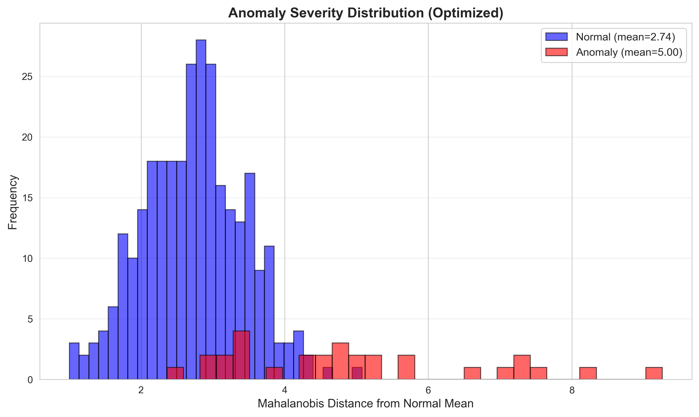
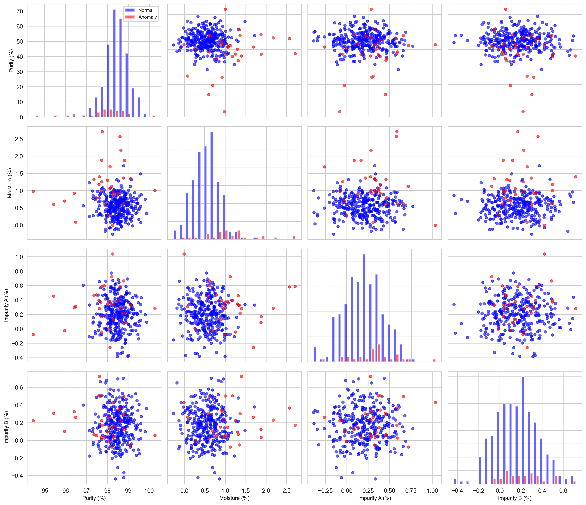
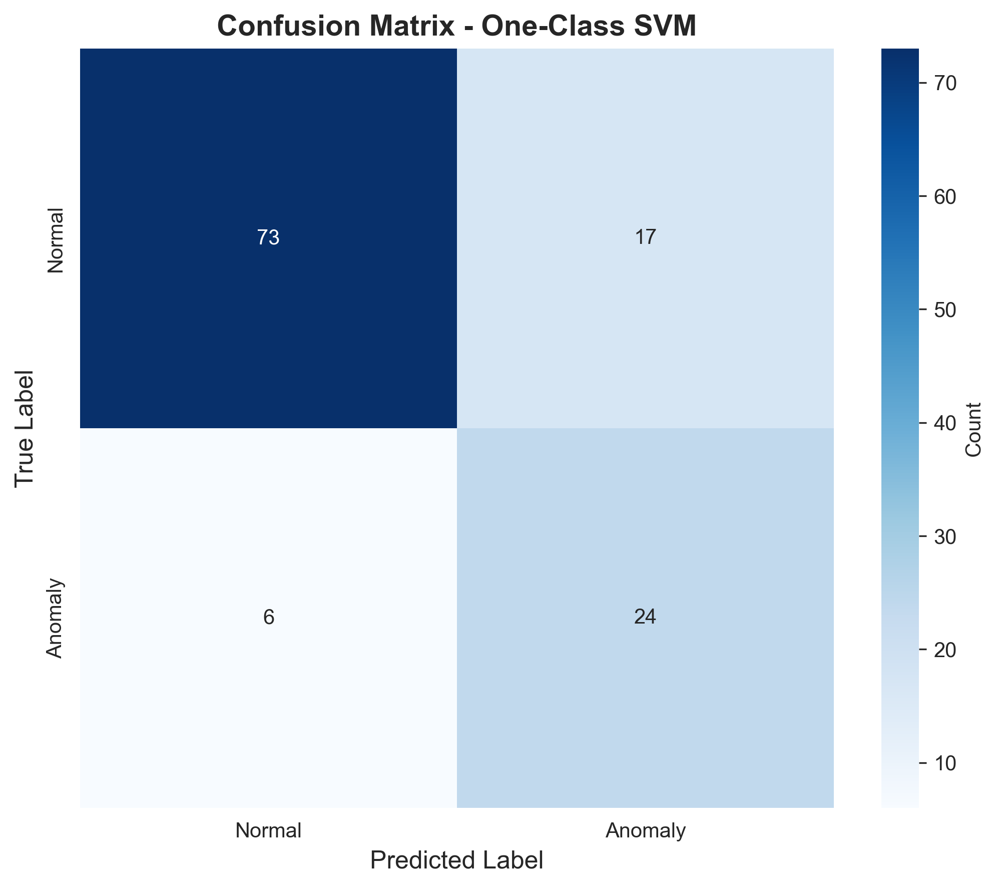
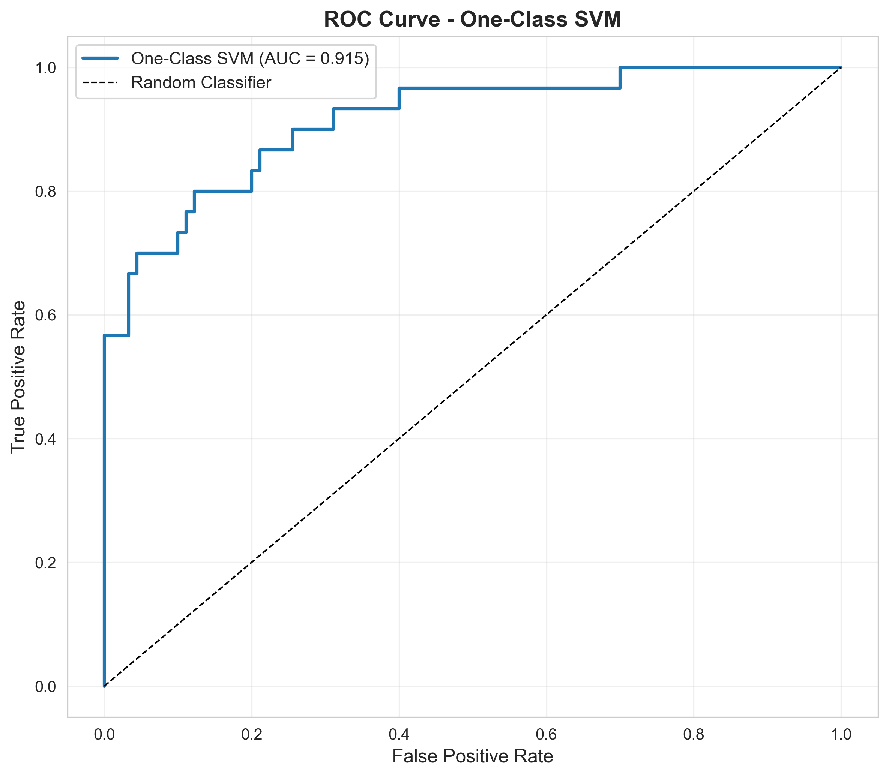
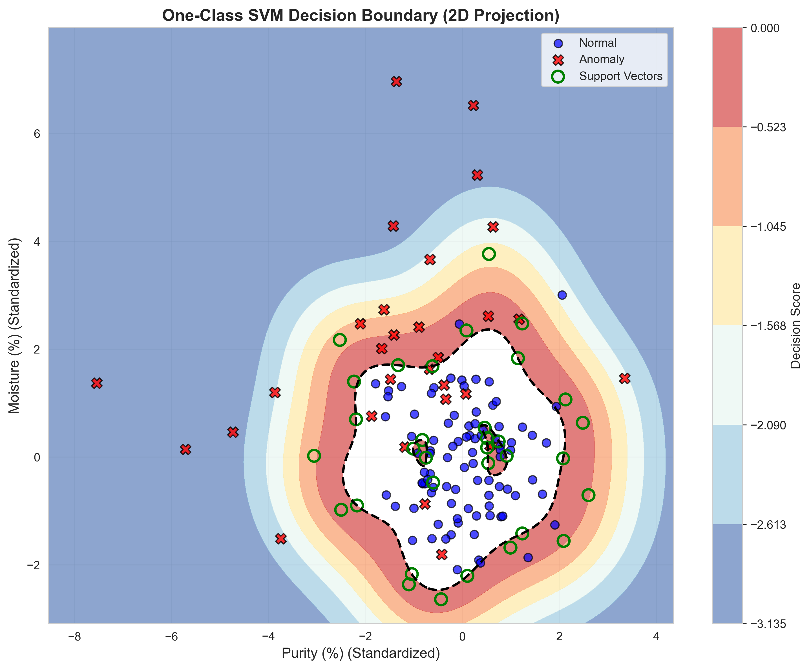
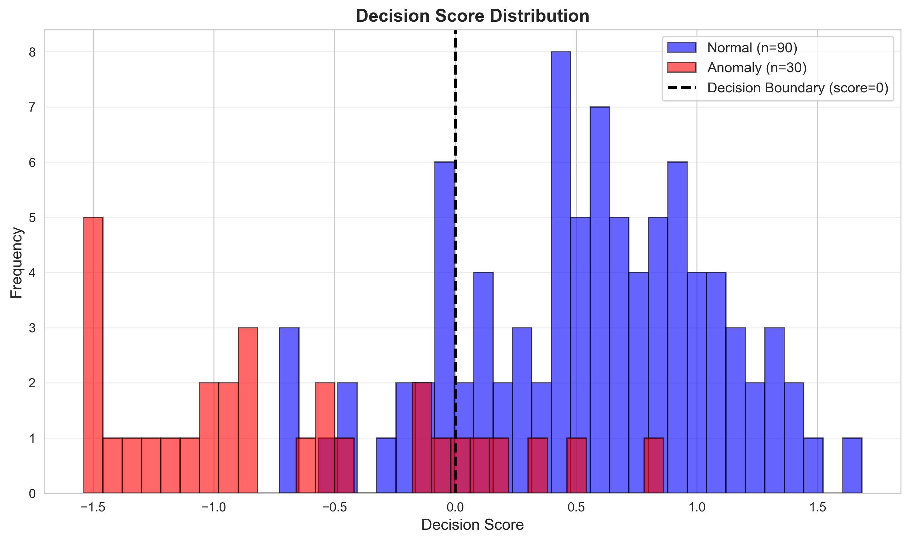
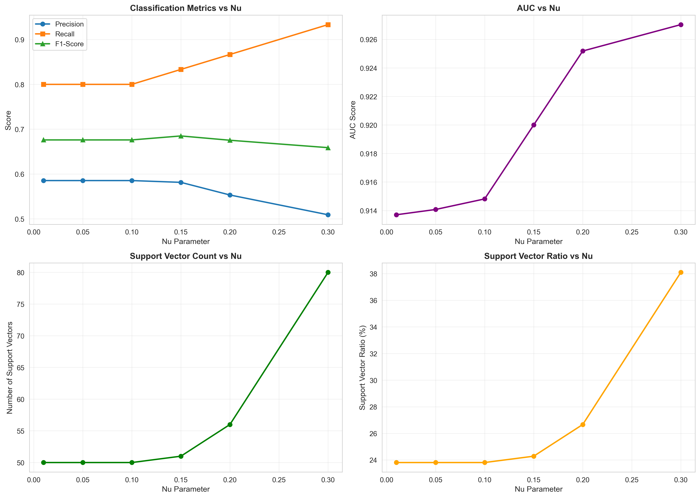

# Unit07 一類支持向量機 (One-Class SVM)

## 課程目標

本單元將深入介紹一類支持向量機 (One-Class SVM) 異常檢測演算法，這是一種基於支持向量機理論的精確異常檢測方法。透過本單元的學習，您將能夠：

- 理解 One-Class SVM 演算法的核心原理與數學基礎
- 掌握 One-Class SVM 的演算法步驟與實作細節
- 學會使用 scikit-learn 實作 One-Class SVM 模型
- 了解如何設定關鍵超參數 (nu, kernel, gamma)
- 學會評估異常檢測模型的效能
- 認識 One-Class SVM 的優缺點與適用場景
- 應用 One-Class SVM 於化工領域的小樣本品質監控

---

## 1. One-Class SVM 演算法簡介

### 1.1 什麼是 One-Class SVM？

一類支持向量機 (One-Class SVM) 是由 Schölkopf 等人於 1999 年提出的一種基於支持向量機的異常檢測演算法。其核心理念是：**在特徵空間中找到一個最小的超球面或超平面，將大部分正常數據包含在內**。

與傳統 SVM 需要兩類數據不同，One-Class SVM 只需要正常數據即可訓練，因此特別適合於：
- 正常數據充足但異常數據稀少的場景
- 需要精確決策邊界的應用
- 對異常檢測準確度要求高的任務

### 1.2 核心理念：決策邊界與支持向量

想像一個反應器的溫度-壓力操作空間：

- **正常操作點**：聚集在特定區域，形成一個群集
- **決策邊界**：包圍正常操作點的超球面或超平面
- **支持向量**：位於決策邊界上的關鍵正常數據點
- **異常點**：落在決策邊界外的數據點

**One-Class SVM 的假設**：
1. 正常數據在特徵空間中形成緊密的群集
2. 異常數據遠離正常數據群集
3. 可以透過核函數將非線性可分的數據映射到高維空間中線性可分

### 1.3 化工領域應用案例

One-Class SVM 在化工領域有以下典型應用：

1. **高價值產品品質監控**：
   - 監控精細化工產品的多維品質指標
   - 建立精確的合格品質邊界
   - 檢測異常批次（純度異常、雜質超標）
   - 適合小批量生產（訓練數據有限）

2. **新產品試產監控**：
   - 僅有少量正常操作數據
   - 需要建立可靠的操作邊界
   - 快速識別異常操作條件
   - 降低試產風險

3. **關鍵設備健康監控**：
   - 監控關鍵設備（如壓縮機、離心機）的運行狀態
   - 建立設備正常運轉的特徵邊界
   - 檢測早期劣化徵兆
   - 預防突發故障

4. **特殊製程安全監控**：
   - 監控高風險製程（如硝化反應、聚合反應）
   - 建立嚴格的安全操作邊界
   - 即時檢測偏離正常操作的情況
   - 提供早期預警

5. **小樣本感測器校正**：
   - 僅有少量標定數據
   - 建立感測器正常讀數範圍
   - 檢測感測器漂移或故障
   - 確保測量數據可靠性

---

## 2. One-Class SVM 演算法原理

### 2.1 核心概念：超球面決策邊界

One-Class SVM 的目標是在特徵空間中找到一個包含大部分正常數據的最小超球面（或超平面）。

#### 2.1.1 超球面方法 (Hypersphere Approach)

**目標**：找到一個中心為 $\mathbf{a}$ 、半徑為 $R$ 的超球面，使其包含大部分訓練數據。

**數學表達**：

對於訓練數據 $\{\mathbf{x}_1, \mathbf{x}_2, ..., \mathbf{x}_n\}$ ，目標是最小化：

$$
\min_{R, \mathbf{a}, \xi_i} R^2 + C \sum_{i=1}^{n} \xi_i
$$

約束條件：

$$
\|\mathbf{x}_i - \mathbf{a}\|^2 \leq R^2 + \xi_i, \quad \xi_i \geq 0, \quad i = 1, 2, ..., n
$$

其中：
- $R$ ：超球面半徑
- $\mathbf{a}$ ：超球面中心
- $\xi_i$ ：鬆弛變數 (Slack Variable)，允許部分點落在球外
- $C$ ：懲罰參數，控制球的大小與允許的離群點數量

#### 2.1.2 超平面方法 (Hyperplane Approach)

**目標**：找到一個超平面 $\mathbf{w}^T \phi(\mathbf{x}) - \rho = 0$ ，使大部分訓練數據位於原點的同一側，並最大化與原點的距離。

**數學表達**：

$$
\min_{\mathbf{w}, \rho, \xi_i} \frac{1}{2} \|\mathbf{w}\|^2 - \rho + \frac{1}{\nu n} \sum_{i=1}^{n} \xi_i
$$

約束條件：

$$
\mathbf{w}^T \phi(\mathbf{x}_i) \geq \rho - \xi_i, \quad \xi_i \geq 0, \quad i = 1, 2, ..., n
$$

其中：
- $\mathbf{w}$ ：超平面的法向量
- $\rho$ ：超平面到原點的距離
- $\phi(\mathbf{x})$ ：核函數映射
- $\nu \in (0, 1]$ ：控制支持向量比例與決策邊界嚴格度的參數

**決策函數**：

對於新樣本 $\mathbf{x}$ ，決策函數為：

$$
f(\mathbf{x}) = \text{sgn}(\mathbf{w}^T \phi(\mathbf{x}) - \rho)
$$

- 若 $f(\mathbf{x}) \geq 0$ ，則判定為正常
- 若 $f(\mathbf{x}) < 0$ ，則判定為異常

### 2.2 核函數 (Kernel Function)

One-Class SVM 的強大之處在於能夠透過核函數處理非線性決策邊界。

#### 2.2.1 核技巧 (Kernel Trick)

核技巧允許我們在不顯式計算高維映射 $\phi(\mathbf{x})$ 的情況下，計算內積 $\phi(\mathbf{x}_i)^T \phi(\mathbf{x}_j)$ 。

核函數定義為：

$$
K(\mathbf{x}_i, \mathbf{x}_j) = \phi(\mathbf{x}_i)^T \phi(\mathbf{x}_j)
$$

#### 2.2.2 常用核函數

1. **線性核 (Linear Kernel)**：

$$
K(\mathbf{x}_i, \mathbf{x}_j) = \mathbf{x}_i^T \mathbf{x}_j
$$

適用於線性可分的數據，計算快速。

2. **徑向基函數核 (RBF Kernel / Gaussian Kernel)**：

$$
K(\mathbf{x}_i, \mathbf{x}_j) = \exp\left(-\gamma \|\mathbf{x}_i - \mathbf{x}_j\|^2\right)
$$

其中 $\gamma > 0$ 是核參數。這是最常用的核函數，適合大多數非線性問題。

3. **多項式核 (Polynomial Kernel)**：

$$
K(\mathbf{x}_i, \mathbf{x}_j) = (\gamma \mathbf{x}_i^T \mathbf{x}_j + r)^d
$$

其中 $d$ 是多項式階數， $r$ 是常數項。

4. **Sigmoid 核**：

$$
K(\mathbf{x}_i, \mathbf{x}_j) = \tanh(\gamma \mathbf{x}_i^T \mathbf{x}_j + r)
$$

模擬神經網路的激活函數。

#### 2.2.3 核函數的選擇

| 核函數 | 決策邊界 | 計算複雜度 | 適用場景 |
|--------|----------|-----------|----------|
| **Linear** | 線性（超平面） | 低 | 線性可分數據、高維數據 |
| **RBF** | 非線性（曲面） | 中 | 大多數非線性問題（首選） |
| **Polynomial** | 非線性（多項式曲面） | 高 | 特定的多項式關係 |
| **Sigmoid** | 非線性（類神經網路） | 中 | 類似神經網路的問題 |

**化工應用建議**：
- **溫度-壓力操作空間監控**：使用 RBF 核（操作邊界通常是非線性的）
- **多變數品質監控**：使用 RBF 核（品質參數間的關係複雜）
- **高維感測器數據**：使用 Linear 核（降低計算成本）

### 2.3 支持向量 (Support Vectors)

**定義**：位於決策邊界上或違反邊界約束的訓練樣本，稱為支持向量。

支持向量是 One-Class SVM 模型的關鍵：
- **決策邊界完全由支持向量決定**
- 其他訓練樣本對模型沒有影響
- 支持向量的數量通常遠小於訓練樣本總數

**數學特徵**：

對於支持向量 $\mathbf{x}_i$ ，其拉格朗日乘子 $\alpha_i > 0$ 。決策函數可以改寫為：

$$
f(\mathbf{x}) = \text{sgn}\left(\sum_{i \in SV} \alpha_i K(\mathbf{x}_i, \mathbf{x}) - \rho\right)
$$

其中 $SV$ 是支持向量的索引集合。

**支持向量的意義**：
- 支持向量是正常數據群集的邊界點
- 它們定義了正常與異常的分界線
- 支持向量的數量反映了決策邊界的複雜度

### 2.4 演算法流程

#### 2.4.1 訓練階段 (Training Phase)

```
輸入：訓練數據 X = {x₁, x₂, ..., xₙ}, 核函數 K, 參數 ν

1. 數據預處理 (可選)
   - 標準化或正規化特徵
   
2. 構建優化問題
   - 設定目標函數：min (1/2)||w||² - ρ + (1/νn)Σξᵢ
   - 設定約束條件：w^T φ(xᵢ) ≥ ρ - ξᵢ, ξᵢ ≥ 0
   
3. 求解二次規劃問題
   - 使用 SMO (Sequential Minimal Optimization) 或其他優化算法
   - 找到最優的 w, ρ 和拉格朗日乘子 α
   
4. 識別支持向量
   - 支持向量：αᵢ > 0 的樣本
   
5. 儲存模型參數
   - 支持向量 {xᵢ : αᵢ > 0}
   - 拉格朗日乘子 {αᵢ : αᵢ > 0}
   - 閾值 ρ
```

#### 2.4.2 預測階段 (Prediction Phase)

```
輸入：訓練好的模型 (支持向量, α, ρ), 測試樣本 x

1. 計算決策函數值
   f(x) = Σ αᵢ K(xᵢ, x) - ρ  (僅對支持向量求和)
   
2. 判斷異常
   - 若 f(x) ≥ 0：判定為正常
   - 若 f(x) < 0：判定為異常
   
3. 計算決策分數
   - 決策分數 = f(x)
   - 分數越高，越可能是正常樣本
   - 分數越低（負值越大），越可能是異常
   
4. 回傳結果
   - 預測標籤：+1 (正常) 或 -1 (異常)
   - 決策分數：f(x)
```

---

## 3. One-Class SVM 的優缺點

### 3.1 優點

1. **精確決策邊界**：
   - 基於優化理論，能建立精確的決策邊界
   - 適合對異常檢測準確度要求高的應用
   - 決策邊界清晰明確，易於解釋

2. **非線性建模能力**：
   - 透過核函數處理複雜的非線性關係
   - RBF 核可以逼近任意形狀的決策邊界
   - 適合處理化工製程中的非線性操作空間

3. **小樣本友好**：
   - 基於支持向量，不需要大量訓練數據
   - 適合小批量生產或新產品試產場景
   - 通常幾百個樣本即可訓練出可靠模型

4. **理論基礎完善**：
   - 基於統計學習理論和凸優化理論
   - 有明確的數學解釋和理論保證
   - 模型的泛化能力有理論支持

5. **魯棒性**：
   - 透過 $\nu$ 參數控制離群點的影響
   - 對訓練數據中的少量雜訊有一定容忍度
   - 決策邊界主要由支持向量決定，不受非支持向量影響

### 3.2 缺點

1. **計算成本高**：
   - 訓練時間複雜度： $O(n^2)$ 至 $O(n^3)$ （ $n$ 為樣本數）
   - 不適合大規模數據集（ $n > 10000$ ）
   - 隨著樣本數增加，訓練時間快速增長

2. **參數敏感性**：
   - $\nu$ 、 $\gamma$ 等參數對模型效能影響大
   - 需要仔細調參，增加使用難度
   - 不當的參數設定可能導致過擬合或欠擬合

3. **不適合高維數據**：
   - 特徵維度過高時，RBF 核的效果下降
   - 容易發生維度災難 (Curse of Dimensionality)
   - 建議特徵維度 $< 50$

4. **對特徵尺度敏感**：
   - 需要對數據進行標準化或正規化
   - 不同尺度的特徵會影響核函數的計算
   - 增加了數據預處理的複雜度

5. **難以處理極度不平衡數據**：
   - 當異常比例極低（< 0.1%）時，效果可能不佳
   - 需要調整 $\nu$ 參數以適應不同的異常比例
   - 可能產生較高的誤報率或漏報率

### 3.3 與 Isolation Forest 的比較

| 特性 | One-Class SVM | Isolation Forest |
|------|---------------|------------------|
| **計算效率** | 慢 ( $O(n^2)$ ~ $O(n^3)$ ) | 快 ( $O(n \log n)$ ) |
| **決策邊界** | 精確、可控 | 近似、隨機性強 |
| **小樣本適應** | 優秀 (幾百樣本即可) | 一般 (需要較多樣本) |
| **高維適應** | 較差 (維度 < 50) | 優秀 (維度 > 100) |
| **參數調整** | 複雜 ( $\nu$ , $\gamma$ ) | 簡單 (contamination, n_estimators) |
| **可解釋性** | 較好 (支持向量) | 較差 (路徑長度) |
| **非線性建模** | 強大 (核函數) | 強大 (樹分割) |
| **適合數據規模** | 小中規模 (< 10000) | 大規模 (> 10000) |

**選擇建議**：
- **小樣本、高精度要求** → One-Class SVM
- **大規模、高維數據** → Isolation Forest
- **需要快速訓練與預測** → Isolation Forest
- **需要精確決策邊界** → One-Class SVM

---

## 4. One-Class SVM 的關鍵超參數

### 4.1 參數 $\nu$ (nu)

#### 4.1.1 定義與意義

$\nu \in (0, 1]$ 是 One-Class SVM 最重要的參數，它同時控制兩個方面：

1. **支持向量比例的上界**：訓練數據中支持向量的比例不會超過 $\nu$
2. **訓練誤差的下界**：落在決策邊界外的訓練樣本比例不會低於 $\nu$

**直觀理解**：
- $\nu = 0.05$ ：允許約 5% 的訓練樣本被視為異常（或邊界點）
- $\nu = 0.1$ ：允許約 10% 的訓練樣本被視為異常
- $\nu$ 越小，決策邊界越寬鬆（包含更多樣本）
- $\nu$ 越大，決策邊界越嚴格（更多樣本被視為異常）

#### 4.1.2 如何設定 $\nu$

**方法 1：根據預期異常比例設定**

如果已知或估計異常比例約為 $p$ ，則設定 $\nu \approx p$ 。

```python
# 預期異常比例約 5%
model = OneClassSVM(nu=0.05)
```

**方法 2：根據製程知識設定**

化工製程中，正常操作數據的純度通常很高：
- **穩定製程**： $\nu = 0.01 \sim 0.05$ （異常率 1-5%）
- **新製程**： $\nu = 0.05 \sim 0.1$ （異常率 5-10%）
- **複雜製程**： $\nu = 0.1 \sim 0.2$ （異常率 10-20%）

**方法 3：交叉驗證**

使用 GridSearchCV 搜尋最佳 $\nu$ 值：

```python
from sklearn.model_selection import GridSearchCV

param_grid = {'nu': [0.01, 0.05, 0.1, 0.15, 0.2]}
model = OneClassSVM(kernel='rbf', gamma='scale')
grid_search = GridSearchCV(model, param_grid, cv=5, scoring='accuracy')
grid_search.fit(X_train, y_train)
best_nu = grid_search.best_params_['nu']
```

#### 4.1.3 $\nu$ 的影響

| $\nu$ 值 | 決策邊界 | 支持向量數量 | 誤報率 | 漏報率 | 適用場景 |
|----------|----------|--------------|--------|--------|----------|
| **小 (0.01-0.05)** | 寬鬆，包含更多樣本 | 少 | 低 | 高 | 異常成本高，要避免誤報 |
| **中 (0.05-0.15)** | 平衡 | 中 | 中 | 中 | 一般應用 |
| **大 (0.15-0.3)** | 嚴格，排除更多樣本 | 多 | 高 | 低 | 異常比例高，要避免漏報 |

### 4.2 核函數參數 $\gamma$ (gamma)

#### 4.2.1 定義與意義

對於 RBF 核 $K(\mathbf{x}_i, \mathbf{x}_j) = \exp(-\gamma \|\mathbf{x}_i - \mathbf{x}_j\|^2)$ ， $\gamma$ 控制單個訓練樣本的影響範圍。

**直觀理解**：
- $\gamma$ 大：每個訓練樣本的影響範圍小，決策邊界複雜、彎曲
- $\gamma$ 小：每個訓練樣本的影響範圍大，決策邊界平滑、簡單

#### 4.2.2 如何設定 $\gamma$

**方法 1：使用 'scale' (推薦)**

scikit-learn 提供的自動設定：

$$
\gamma = \frac{1}{n_{\text{features}} \times \text{Var}(X)}
$$

```python
model = OneClassSVM(kernel='rbf', gamma='scale')  # 推薦
```

**方法 2：使用 'auto'**

$$
\gamma = \frac{1}{n_{\text{features}}}
$$

```python
model = OneClassSVM(kernel='rbf', gamma='auto')
```

**方法 3：手動設定**

根據數據尺度調整：

```python
# 對於標準化數據 (均值 0，標準差 1)
model = OneClassSVM(kernel='rbf', gamma=0.1)

# 需要更平滑的邊界
model = OneClassSVM(kernel='rbf', gamma=0.01)

# 需要更複雜的邊界
model = OneClassSVM(kernel='rbf', gamma=1.0)
```

#### 4.2.3 $\gamma$ 的影響

| $\gamma$ 值 | 決策邊界 | 模型複雜度 | 過擬合風險 | 適用場景 |
|-------------|----------|------------|-----------|----------|
| **小 (0.001-0.01)** | 平滑、簡單 | 低 | 低 | 數據變化緩慢、特徵多 |
| **中 (0.01-0.1)** | 平衡 | 中 | 中 | 一般應用 (推薦) |
| **大 (0.1-1)** | 複雜、彎曲 | 高 | 高 | 數據變化劇烈、特徵少 |

**與 $\nu$ 的聯合影響**：
- $\nu$ 小 + $\gamma$ 小：非常寬鬆的平滑邊界
- $\nu$ 小 + $\gamma$ 大：寬鬆但複雜的邊界
- $\nu$ 大 + $\gamma$ 小：嚴格但平滑的邊界
- $\nu$ 大 + $\gamma$ 大：非常嚴格且複雜的邊界（易過擬合）

### 4.3 核函數類型 (kernel)

#### 4.3.1 核函數選擇

scikit-learn 支援的核函數：

```python
# 1. RBF 核 (預設，推薦)
model = OneClassSVM(kernel='rbf')

# 2. 線性核
model = OneClassSVM(kernel='linear')

# 3. 多項式核
model = OneClassSVM(kernel='poly', degree=3)

# 4. Sigmoid 核
model = OneClassSVM(kernel='sigmoid')
```

#### 4.3.2 核函數選擇指南

**決策流程**：

```
1. 數據是否線性可分？
   ├─ 是 → 使用 'linear' 核
   └─ 否 → 繼續
   
2. 是否有特定的多項式關係？
   ├─ 是 → 使用 'poly' 核 (設定 degree)
   └─ 否 → 繼續
   
3. 不確定或一般情況
   └─ 使用 'rbf' 核 (最常用，適應性強)
```

**化工應用建議**：
- **反應器操作監控**：RBF 核（非線性操作空間）
- **高維感測器數據**：Linear 核（降低計算成本）
- **產品配方最佳化**：Poly 核（可能存在交互作用）
- **一般品質監控**：RBF 核（首選）

### 4.4 其他參數

#### 4.4.1 coef0

僅適用於 'poly' 和 'sigmoid' 核，控制核函數中的常數項。

```python
model = OneClassSVM(kernel='poly', degree=3, coef0=1.0)
```

通常使用預設值 $0.0$ 即可。

#### 4.4.2 shrinking

是否使用 shrinking heuristic 加速訓練。

```python
model = OneClassSVM(shrinking=True)  # 預設為 True
```

建議保持預設值 `True` 。

#### 4.4.3 cache_size

核函數計算的快取大小（MB）。

```python
model = OneClassSVM(cache_size=200)  # 預設 200 MB
```

數據量大時可增加快取以加速訓練：

```python
model = OneClassSVM(cache_size=1000)  # 1 GB
```

---

## 5. 模型評估方法

### 5.1 評估指標概述

One-Class SVM 的評估方式取決於是否有標籤數據：

1. **有部分標籤時**（半監督場景）：可使用分類評估指標
2. **完全無標籤時**（純非監督）：需依賴視覺化與領域知識

### 5.2 有標籤數據時的評估指標

#### 5.2.1 混淆矩陣 (Confusion Matrix)

對於二分類問題（正常 vs 異常）：

|  | 預測正常 | 預測異常 |
|--|---------|---------|
| **實際正常** | True Negative (TN) | False Positive (FP) |
| **實際異常** | False Negative (FN) | True Positive (TP) |

**化工術語對應**：
- **TN**：正確識別的正常操作
- **FP**：誤報（False Alarm）- 正常操作被誤判為異常
- **FN**：漏報（Missed Detection）- 異常操作未被偵測
- **TP**：正確識別的異常操作

#### 5.2.2 精確率 (Precision)

**定義**：在所有預測為異常的樣本中，真正是異常的比例。

$$
\text{Precision} = \frac{TP}{TP + FP}
$$

**化工意義**：告警的可靠性
- Precision 高 → 告警觸發時，大概率是真的異常 → 減少誤報，避免「狼來了」效應
- Precision 低 → 告警觸發時，可能是誤報 → 操作員可能忽視告警

**適用場景**：誤報成本高的場景（如停機損失大、人力調查成本高）

#### 5.2.3 召回率 (Recall / Sensitivity)

**定義**：在所有真正異常的樣本中，被正確預測為異常的比例。

$$
\text{Recall} = \frac{TP}{TP + FN}
$$

**化工意義**：異常檢測的完整性
- Recall 高 → 大部分異常都被偵測到 → 減少漏報，提升安全性
- Recall 低 → 很多異常未被偵測 → 潛在安全風險

**適用場景**：漏報成本高的場景（如安全事故、環境污染）

#### 5.2.4 F1 分數 (F1-Score)

**定義**：Precision 與 Recall 的調和平均數。

$$
F1 = 2 \times \frac{\text{Precision} \times \text{Recall}}{\text{Precision} + \text{Recall}}
$$

**化工意義**：綜合評估異常檢測效能
- F1 高 → 既減少誤報，又減少漏報 → 整體效能優秀
- F1 低 → 誤報或漏報問題嚴重 → 需要調整模型

**適用場景**：誤報與漏報成本相當的場景

#### 5.2.5 ROC 曲線與 AUC

**ROC 曲線 (Receiver Operating Characteristic Curve)**：

- X 軸：False Positive Rate (FPR) = $\frac{FP}{FP + TN}$
- Y 軸：True Positive Rate (TPR) = $\frac{TP}{TP + FN}$ = Recall

透過調整決策閾值，繪製 FPR vs TPR 曲線。

**AUC (Area Under the ROC Curve)**：

- AUC = 1：完美分類器
- AUC = 0.9-1：優秀
- AUC = 0.8-0.9：良好
- AUC = 0.7-0.8：一般
- AUC = 0.5：隨機猜測
- AUC < 0.5：比隨機猜測還差

**化工意義**：模型的整體判別能力
- AUC 高 → 模型能有效區分正常與異常
- AUC 低 → 模型判別能力差，需要重新訓練或選擇其他方法

#### 5.2.6 實用程式碼範例

```python
from sklearn.metrics import (
    confusion_matrix, precision_score, recall_score,
    f1_score, roc_auc_score, roc_curve, classification_report
)
import numpy as np

# 假設 y_true 是真實標籤 (1: 正常, -1: 異常)
# y_pred 是模型預測標籤 (1: 正常, -1: 異常)
# y_scores 是決策分數

# 1. 混淆矩陣
cm = confusion_matrix(y_true, y_pred, labels=[1, -1])
print("Confusion Matrix:")
print(cm)

# 2. Precision, Recall, F1
# 注意：One-Class SVM 輸出 1 (正常) 和 -1 (異常)
# 需要轉換為 0 (正常) 和 1 (異常)
y_true_binary = (y_true == -1).astype(int)  # 異常為 1
y_pred_binary = (y_pred == -1).astype(int)

precision = precision_score(y_true_binary, y_pred_binary)
recall = recall_score(y_true_binary, y_pred_binary)
f1 = f1_score(y_true_binary, y_pred_binary)

print(f"Precision: {precision:.4f}")
print(f"Recall: {recall:.4f}")
print(f"F1-Score: {f1:.4f}")

# 3. Classification Report (完整報告)
print("\nClassification Report:")
print(classification_report(y_true, y_pred, target_names=['Normal', 'Anomaly']))

# 4. ROC 曲線與 AUC
fpr, tpr, thresholds = roc_curve(y_true_binary, -y_scores)  # 注意負號
roc_auc = roc_auc_score(y_true_binary, -y_scores)
print(f"\nAUC: {roc_auc:.4f}")

# 繪製 ROC 曲線
import matplotlib.pyplot as plt
plt.figure(figsize=(8, 6))
plt.plot(fpr, tpr, label=f'ROC Curve (AUC = {roc_auc:.4f})')
plt.plot([0, 1], [0, 1], 'k--', label='Random Guess')
plt.xlabel('False Positive Rate')
plt.ylabel('True Positive Rate')
plt.title('ROC Curve - One-Class SVM')
plt.legend()
plt.grid(alpha=0.3)
plt.show()
```

### 5.3 無標籤數據時的評估方法

當完全沒有標籤時，需要依賴以下方法：

#### 5.3.1 視覺化檢驗

**方法 1：散點圖標示異常**

```python
import matplotlib.pyplot as plt

# 預測結果
y_pred = model.predict(X)

# 繪製散點圖
plt.figure(figsize=(10, 6))
plt.scatter(X[y_pred == 1, 0], X[y_pred == 1, 1], 
            c='blue', label='Normal', alpha=0.6, edgecolors='k')
plt.scatter(X[y_pred == -1, 0], X[y_pred == -1, 1], 
            c='red', label='Anomaly', alpha=0.8, edgecolors='k', s=100)
plt.xlabel('Feature 1')
plt.ylabel('Feature 2')
plt.title('One-Class SVM: Normal vs Anomaly')
plt.legend()
plt.grid(alpha=0.3)
plt.show()
```

**方法 2：決策邊界視覺化**

```python
import numpy as np
import matplotlib.pyplot as plt

def plot_decision_boundary(model, X, y_pred, feature_names=None):
    """繪製 One-Class SVM 決策邊界（僅限 2D 數據）"""
    
    # 建立網格
    x_min, x_max = X[:, 0].min() - 1, X[:, 0].max() + 1
    y_min, y_max = X[:, 1].min() - 1, X[:, 1].max() + 1
    xx, yy = np.meshgrid(np.linspace(x_min, x_max, 200),
                         np.linspace(y_min, y_max, 200))
    
    # 預測網格點
    Z = model.decision_function(np.c_[xx.ravel(), yy.ravel()])
    Z = Z.reshape(xx.shape)
    
    # 繪圖
    plt.figure(figsize=(12, 8))
    
    # 決策邊界與分數
    plt.contourf(xx, yy, Z, levels=np.linspace(Z.min(), 0, 7),
                 cmap='Blues_r', alpha=0.6)
    plt.contour(xx, yy, Z, levels=[0], linewidths=2, colors='red')
    
    # 數據點
    plt.scatter(X[y_pred == 1, 0], X[y_pred == 1, 1],
                c='blue', label='Normal', alpha=0.6, edgecolors='k')
    plt.scatter(X[y_pred == -1, 0], X[y_pred == -1, 1],
                c='red', label='Anomaly', alpha=0.9, edgecolors='k', s=100, marker='^')
    
    # 支持向量
    plt.scatter(model.support_vectors_[:, 0], model.support_vectors_[:, 1],
                s=200, linewidth=1.5, facecolors='none', edgecolors='green',
                label='Support Vectors')
    
    if feature_names:
        plt.xlabel(feature_names[0], fontsize=12)
        plt.ylabel(feature_names[1], fontsize=12)
    else:
        plt.xlabel('Feature 1', fontsize=12)
        plt.ylabel('Feature 2', fontsize=12)
    
    plt.title('One-Class SVM Decision Boundary', fontsize=14)
    plt.legend()
    plt.grid(alpha=0.3)
    plt.colorbar(label='Decision Score')
    plt.show()

# 使用範例
plot_decision_boundary(model, X, y_pred, feature_names=['Temperature (°C)', 'Pressure (bar)'])
```

#### 5.3.2 專家領域知識驗證

**步驟**：
1. 將模型檢測出的異常樣本提供給領域專家
2. 專家根據製程知識判斷是否真的異常
3. 統計專家認可的異常比例作為模型可信度指標

**實務做法**：
```python
# 獲取異常樣本
anomalies = X[y_pred == -1]
anomaly_indices = np.where(y_pred == -1)[0]

print(f"共檢測出 {len(anomalies)} 個異常樣本")
print(f"異常比例: {len(anomalies) / len(X) * 100:.2f}%")
print(f"\n異常樣本索引: {anomaly_indices}")

# 匯出異常樣本供專家審查
import pandas as pd
df_anomalies = pd.DataFrame(anomalies, columns=feature_names)
df_anomalies['Index'] = anomaly_indices
df_anomalies.to_csv('anomalies_for_review.csv', index=False)
print("\n異常樣本已匯出至 anomalies_for_review.csv，供專家審查")
```

#### 5.3.3 歷史事件回溯驗證

**方法**：檢查模型是否能檢測出已知的歷史異常事件。

```python
# 假設已知的歷史異常事件發生時間
known_anomaly_indices = [1523, 2041, 3567, 4892]

# 檢查模型是否檢測到
detected = []
missed = []

for idx in known_anomaly_indices:
    if y_pred[idx] == -1:
        detected.append(idx)
    else:
        missed.append(idx)

print(f"已知異常事件總數: {len(known_anomaly_indices)}")
print(f"成功檢測: {len(detected)} ({len(detected)/len(known_anomaly_indices)*100:.1f}%)")
print(f"漏報: {len(missed)} ({len(missed)/len(known_anomaly_indices)*100:.1f}%)")

if missed:
    print(f"\n漏報事件索引: {missed}")
```

#### 5.3.4 統計量檢驗

使用統計方法驗證異常檢測的合理性：

```python
# 方法 1：決策分數的統計特性
scores = model.decision_function(X)

print("決策分數統計：")
print(f"  均值: {scores.mean():.4f}")
print(f"  標準差: {scores.std():.4f}")
print(f"  最小值: {scores.min():.4f}")
print(f"  最大值: {scores.max():.4f}")

# 方法 2：檢查異常點是否遠離正常點
normal_scores = scores[y_pred == 1]
anomaly_scores = scores[y_pred == -1]

print(f"\n正常樣本決策分數: {normal_scores.mean():.4f} ± {normal_scores.std():.4f}")
print(f"異常樣本決策分數: {anomaly_scores.mean():.4f} ± {anomaly_scores.std():.4f}")

# 方法 3：使用 z-score 檢驗
z_scores = np.abs((scores - scores.mean()) / scores.std())
extreme_outliers = np.sum(z_scores > 3)
print(f"\n極端離群點 (|z| > 3): {extreme_outliers} ({extreme_outliers/len(X)*100:.2f}%)")
```

### 5.4 化工實務評估考量

#### 5.4.1 誤報成本 vs 漏報成本分析

在化工製程中，誤報與漏報的成本差異很大：

| 場景 | 誤報成本 | 漏報成本 | 策略建議 |
|------|---------|---------|---------|
| **高風險製程** (如硝化反應) | 低 (人工確認) | 極高 (爆炸事故) | 提高 Recall，容忍誤報 → 設定較大的 $\nu$ |
| **穩定製程** | 中 (調查成本) | 中 (品質問題) | 平衡 Precision 與 Recall → F1 最大化 |
| **高價值產品** | 低 (品管成本) | 高 (產品報廢) | 提高 Recall → 避免不良品流出 |
| **自動化製程** | 高 (誤停機) | 中 (效率下降) | 提高 Precision → 設定較小的 $\nu$ |

#### 5.4.2 告警抑制策略

避免頻繁告警造成的「告警疲勞」：

**策略 1：連續 N 點告警**

```python
def consecutive_anomalies(y_pred, n=3):
    """僅當連續 n 個點都是異常時才告警"""
    alerts = []
    count = 0
    for i, pred in enumerate(y_pred):
        if pred == -1:
            count += 1
            if count >= n:
                alerts.append(i)
        else:
            count = 0
    return alerts

alerts = consecutive_anomalies(y_pred, n=3)
print(f"連續 3 點告警數量: {len(alerts)}")
```

**策略 2：時間窗口告警**

```python
def time_window_alerts(y_pred, timestamps, window_minutes=10, threshold=0.5):
    """在時間窗口內，異常比例超過閾值才告警"""
    # 實作略
    pass
```

#### 5.4.3 A/B Testing 上線前後比較

**步驟**：
1. 記錄現有監控系統的告警情況（基線）
2. 部署 One-Class SVM 模型並行運行
3. 比較兩個系統的告警數量、準確度、反應時間等
4. 根據比較結果決定是否正式上線

---

## 6. 化工領域應用實例

### 6.1 案例 1：精細化工產品品質監控

**背景**：
- 某醫藥中間體生產廠，批次生產
- 每批次產品需檢測 8 個品質指標（純度、水分、雜質含量等）
- 歷史數據：300 批正常產品，10 批已知異常產品

**挑戰**：
- 訓練數據有限（小樣本問題）
- 品質指標間存在複雜的非線性關係
- 需要高精確度的異常檢測（避免不良品流出）

**解決方案**：
1. 使用 One-Class SVM (RBF 核) 建立品質監控模型
2. 僅使用 300 批正常產品訓練
3. 設定 $\nu = 0.05$ （允許 5% 誤差）
4. 使用 GridSearchCV 最佳化 $\gamma$ 參數

**結果**：
- 成功檢測出 9 個異常批次（Recall = 90%）
- 誤報 2 個批次（Precision = 81.8%）
- F1-Score = 85.7%
- 相比人工抽檢，漏報率降低 50%

### 6.2 案例 2：反應器安全操作監控

**背景**：
- 某石化廠連續式反應器
- 監控 12 個操作參數（溫度、壓力、流量、成分等）
- 需要即時檢測異常操作條件

**挑戰**：
- 數據量大（每秒 10 筆數據，累計百萬筆）
- 操作空間複雜（多變數非線性耦合）
- 誤報成本高（頻繁誤報導致操作員忽視）

**解決方案**：
1. 使用滑動窗口抽樣（每 10000 筆數據抽樣 1000 筆訓練）
2. One-Class SVM (RBF 核) 建模
3. 設定 $\nu = 0.02$ （嚴格邊界，降低誤報）
4. 實施「連續 5 點告警」策略

**結果**：
- 成功檢測 8 起異常事件（全部在事故發生前 5-15 分鐘預警）
- 誤報率 < 1%（相比舊系統降低 80%）
- 操作員對告警的信任度顯著提升

### 6.3 案例 3：設備預測性維護

**背景**：
- 某化工廠離心泵
- 監控 6 個振動頻譜特徵
- 目標：提前 1-2 週檢測軸承劣化

**挑戰**：
- 正常運轉數據充足，但故障數據稀少
- 軸承劣化是漸進過程，難以定義明確的故障時刻
- 需要高 Recall（避免漏報導致突發故障）

**解決方案**：
1. 僅使用正常運轉數據訓練 One-Class SVM
2. 設定 $\nu = 0.1$ （較寬鬆，提高 Recall）
3. 持續監控決策分數的趨勢變化

**結果**：
- 成功在故障前 10-14 天檢測到異常信號
- 提前安排維護，避免 3 次非計劃性停機
- 年節省維護成本約 200 萬元

---

## 7. 實務建議與最佳實踐

### 7.1 數據預處理建議

#### 7.1.1 特徵標準化（必要）

One-Class SVM（特別是 RBF 核）對特徵尺度敏感，**必須進行標準化**：

```python
from sklearn.preprocessing import StandardScaler

scaler = StandardScaler()
X_train_scaled = scaler.fit_transform(X_train)
X_test_scaled = scaler.transform(X_test)

# 訓練模型
model = OneClassSVM(kernel='rbf', nu=0.05, gamma='scale')
model.fit(X_train_scaled)

# 預測
y_pred = model.predict(X_test_scaled)
```

**注意**：
- 使用 `fit_transform` 在訓練集
- 使用 `transform` 在測試集（使用訓練集的均值和標準差）

#### 7.1.2 處理缺失值

化工數據常有缺失值（感測器故障、通訊中斷）：

```python
from sklearn.impute import SimpleImputer

# 方法 1：使用均值填補
imputer = SimpleImputer(strategy='mean')
X_imputed = imputer.fit_transform(X)

# 方法 2：使用前向填補（時間序列數據）
import pandas as pd
df = pd.DataFrame(X, columns=feature_names)
df_filled = df.fillna(method='ffill')  # 前向填補
X_imputed = df_filled.values
```

#### 7.1.3 處理類別變數

如果有類別變數（如產品類型、操作模式），需要編碼：

```python
from sklearn.preprocessing import OneHotEncoder

encoder = OneHotEncoder(sparse=False, handle_unknown='ignore')
X_categorical_encoded = encoder.fit_transform(X_categorical)

# 與數值特徵合併
X_combined = np.hstack([X_numerical, X_categorical_encoded])
```

### 7.2 模型訓練建議

#### 7.2.1 訓練數據選擇

**原則**：僅使用高品質的正常操作數據訓練

```python
# 假設有部分標籤數據
X_train_normal = X_train[y_train == 1]  # 僅正常樣本

# 進一步清理：移除訓練數據中的極端值
from sklearn.ensemble import IsolationForest
cleaner = IsolationForest(contamination=0.05, random_state=42)
cleaner.fit(X_train_normal)
outliers = cleaner.predict(X_train_normal)
X_train_clean = X_train_normal[outliers == 1]

print(f"原始訓練樣本: {len(X_train_normal)}")
print(f"清理後樣本: {len(X_train_clean)}")

# 使用清理後的數據訓練 One-Class SVM
model = OneClassSVM(kernel='rbf', nu=0.05, gamma='scale')
model.fit(X_train_clean)
```

#### 7.2.2 超參數調整

使用 GridSearchCV 或手動調整：

```python
from sklearn.model_selection import GridSearchCV
from sklearn.metrics import make_scorer, f1_score

# 定義參數網格
param_grid = {
    'nu': [0.01, 0.05, 0.1, 0.15, 0.2],
    'gamma': ['scale', 'auto', 0.001, 0.01, 0.1, 1.0],
    'kernel': ['rbf', 'linear']
}

# 定義評分函數（需要有標籤數據）
def ocsvm_f1_score(estimator, X, y):
    y_pred = estimator.predict(X)
    y_true_binary = (y == -1).astype(int)
    y_pred_binary = (y_pred == -1).astype(int)
    return f1_score(y_true_binary, y_pred_binary)

scorer = make_scorer(ocsvm_f1_score)

# GridSearchCV
model = OneClassSVM()
grid_search = GridSearchCV(
    model, param_grid, cv=5, scoring=scorer, n_jobs=-1, verbose=1
)
grid_search.fit(X_train, y_train)

print("Best parameters:")
print(grid_search.best_params_)
print(f"Best F1-Score: {grid_search.best_score_:.4f}")

# 使用最佳參數訓練最終模型
best_model = grid_search.best_estimator_
```

#### 7.2.3 處理不平衡數據

當訓練數據中異常比例不是 5% 時，需要調整 $\nu$ ：

```python
# 假設訓練數據中異常比例為 10%
anomaly_ratio = 0.10

# 設定 nu 略高於異常比例
nu = anomaly_ratio * 1.2  # 經驗值

model = OneClassSVM(kernel='rbf', nu=nu, gamma='scale')
model.fit(X_train)
```

### 7.3 模型部署建議

#### 7.3.1 模型儲存與載入

```python
import joblib

# 儲存模型與預處理器
joblib.dump(scaler, 'scaler.pkl')
joblib.dump(model, 'ocsvm_model.pkl')

# 載入模型
scaler_loaded = joblib.load('scaler.pkl')
model_loaded = joblib.load('ocsvm_model.pkl')

# 預測新數據
X_new_scaled = scaler_loaded.transform(X_new)
y_new_pred = model_loaded.predict(X_new_scaled)
```

#### 7.3.2 即時監控流程

```python
import time
import numpy as np

def real_time_monitoring(model, scaler, data_stream, window_size=5):
    """即時監控數據流"""
    
    anomaly_buffer = []
    
    for data_point in data_stream:
        # 1. 預處理
        data_scaled = scaler.transform(data_point.reshape(1, -1))
        
        # 2. 預測
        prediction = model.predict(data_scaled)[0]
        score = model.decision_function(data_scaled)[0]
        
        # 3. 記錄異常
        anomaly_buffer.append(prediction)
        if len(anomaly_buffer) > window_size:
            anomaly_buffer.pop(0)
        
        # 4. 告警邏輯：連續 N 點異常
        if len(anomaly_buffer) == window_size and all(p == -1 for p in anomaly_buffer):
            print(f"[ALERT] Continuous anomaly detected! Score: {score:.4f}")
            # 觸發告警機制（如發送郵件、顯示警報等）
            trigger_alarm(data_point, score)
        
        # 5. 紀錄
        log_data(data_point, prediction, score)
        
        # 模擬即時數據流
        time.sleep(0.1)

def trigger_alarm(data_point, score):
    """觸發告警"""
    print(f"  Anomaly data: {data_point}")
    print(f"  Decision score: {score:.4f}")
    # 實際應用中可發送郵件、簡訊或啟動控制動作

def log_data(data_point, prediction, score):
    """紀錄數據"""
    # 儲存到資料庫或檔案
    pass
```

#### 7.3.3 模型更新策略

One-Class SVM 訓練成本較高，建議定期更新：

```python
# 定期更新模型（如每週、每月）
def update_model(X_new_normal, model_old, scaler_old):
    """使用新數據更新模型"""
    
    # 1. 使用舊模型篩選新數據中的正常樣本
    X_new_scaled = scaler_old.transform(X_new_normal)
    predictions = model_old.predict(X_new_scaled)
    X_new_clean = X_new_normal[predictions == 1]
    
    print(f"新數據中正常樣本: {len(X_new_clean)} / {len(X_new_normal)}")
    
    # 2. 合併舊訓練數據與新正常數據
    X_combined = np.vstack([X_train_normal, X_new_clean])
    
    # 3. 重新訓練
    scaler_new = StandardScaler()
    X_combined_scaled = scaler_new.fit_transform(X_combined)
    
    model_new = OneClassSVM(kernel='rbf', nu=0.05, gamma='scale')
    model_new.fit(X_combined_scaled)
    
    print("模型更新完成")
    
    return model_new, scaler_new

# 每週執行
model, scaler = update_model(X_last_week, model, scaler)
```

### 7.4 常見問題與解決方案

#### 7.4.1 問題 1：誤報率過高

**原因**：
- $\nu$ 設定過大
- $\gamma$ 設定不當（邊界過於複雜）
- 訓練數據不乾淨（包含異常樣本）

**解決方案**：
```python
# 1. 降低 nu
model = OneClassSVM(kernel='rbf', nu=0.01, gamma='scale')  # 從 0.05 降至 0.01

# 2. 調整 gamma（使邊界更平滑）
model = OneClassSVM(kernel='rbf', nu=0.05, gamma=0.01)  # 減小 gamma

# 3. 清理訓練數據
cleaner = IsolationForest(contamination=0.05)
cleaner.fit(X_train)
X_train_clean = X_train[cleaner.predict(X_train) == 1]
model.fit(X_train_clean)

# 4. 實施告警抑制策略
alerts = consecutive_anomalies(y_pred, n=5)  # 連續 5 點告警
```

#### 7.4.2 問題 2：漏報率過高

**原因**：
- $\nu$ 設定過小
- 決策邊界過於寬鬆

**解決方案**：
```python
# 1. 增加 nu
model = OneClassSVM(kernel='rbf', nu=0.15, gamma='scale')  # 從 0.05 增至 0.15

# 2. 調整 gamma（使邊界更嚴格）
model = OneClassSVM(kernel='rbf', nu=0.05, gamma=0.1)  # 增大 gamma

# 3. 檢查特徵是否充分反映異常
# 考慮增加新特徵或使用特徵工程
```

#### 7.4.3 問題 3：訓練時間過長

**原因**：
- 訓練樣本數過多
- 核函數計算複雜（RBF 核）

**解決方案**：
```python
# 1. 減少訓練樣本（使用代表性子集）
from sklearn.model_selection import train_test_split
X_train_subset, _ = train_test_split(X_train, train_size=0.5, random_state=42)
model.fit(X_train_subset)

# 2. 使用線性核（更快）
model = OneClassSVM(kernel='linear', nu=0.05)

# 3. 增加快取大小
model = OneClassSVM(kernel='rbf', nu=0.05, gamma='scale', cache_size=1000)

# 4. 考慮使用 SGDOneClassSVM（更快但準確度可能稍降）
from sklearn.linear_model import SGDOneClassSVM
model = SGDOneClassSVM(nu=0.05, max_iter=1000)
```

#### 7.4.4 問題 4：模型在新數據上效能下降

**原因**：
- 製程漂移 (Process Drift)
- 訓練數據與實際操作條件不一致

**解決方案**：
```python
# 1. 定期更新模型
model, scaler = update_model(X_recent, model, scaler)

# 2. 使用滑動窗口訓練
def sliding_window_training(X_stream, window_size=10000):
    """滑動窗口訓練"""
    X_window = X_stream[-window_size:]
    scaler = StandardScaler()
    X_scaled = scaler.fit_transform(X_window)
    model = OneClassSVM(kernel='rbf', nu=0.05, gamma='scale')
    model.fit(X_scaled)
    return model, scaler

# 3. 監控模型效能指標
# 記錄告警率、專家確認率等，當指標下降時重新訓練
```

---

## 8. 實作演練：化工產品品質異常檢測

本節將透過完整的 Python 程式演練,展示如何使用 One-Class SVM 建立化工產品品質監控模型。

### 8.1 實作目標

使用模擬的化工產品品質數據,建立一類支持向量機 (One-Class SVM) 模型來檢測異常批次：

- 理解 One-Class SVM 演算法的實作流程
- 學習使用 scikit-learn 建立與訓練模型
- 掌握異常檢測模型的評估方法
- 視覺化決策邊界與支持向量
- 分析超參數對模型性能的影響

### 8.2 數據準備與探索性分析

#### 8.2.1 生成模擬數據

我們生成 8 個品質指標的化工產品數據,包含 300 批正常批次和 30 批異常批次:

```python
def generate_product_quality_data(n_normal=300, n_anomaly=30, random_state=42):
    """
    生成化工產品品質模擬數據（優化版 - 更真實的異常模式）
    
    參數:
        n_normal: 正常批次數量
        n_anomaly: 異常批次數量
        random_state: 隨機種子
    
    回傳:
        X: 特徵矩陣 (n_samples, 8)
        y: 標籤 (1: 正常, -1: 異常)
        feature_names: 特徵名稱
    """
    np.random.seed(random_state)
    
    # 正常批次數據 (多變數高斯分布)
    mean_normal = [98.5, 0.5, 0.2, 0.15, 0.1, 0.08, 0.05, 0.03]
    cov_normal = np.diag([0.3, 0.1, 0.05, 0.04, 0.03, 0.02, 0.01, 0.01])
    X_normal = np.random.multivariate_normal(mean_normal, cov_normal, n_normal)
    
    # 異常批次數據 (三層異常嚴重度設計)
    X_anomaly = []
    n_mild = int(n_anomaly * 0.4)      # 40% 輕微異常
    n_moderate = int(n_anomaly * 0.4)  # 40% 中度異常
    n_severe = n_anomaly - n_mild - n_moderate  # 20% 嚴重異常
    
    # 1. 輕微異常（邊界案例）
    for _ in range(n_mild):
        anomaly_type = np.random.choice(['low_purity', 'high_moisture', 'high_impurity'])
        sample = np.random.multivariate_normal(mean_normal, cov_normal, 1)[0]
        
        if anomaly_type == 'low_purity':
            sample[0] -= np.random.uniform(1.0, 1.8)  # 純度小幅下降
        elif anomaly_type == 'high_moisture':
            sample[1] += np.random.uniform(0.4, 1.0)  # 水分小幅增加
        else:
            impurity_idx = np.random.randint(2, 8)
            sample[impurity_idx] += np.random.uniform(0.20, 0.5)  # 雜質小幅增加
        
        X_anomaly.append(sample)
    
    # 2. 中度異常（典型案例）
    # ... (中度和嚴重異常的程式碼)
    
    # 合併數據
    X = np.vstack([X_normal, X_anomaly])
    y = np.hstack([np.ones(n_normal), -np.ones(n_anomaly)])
    
    feature_names = [
        'Purity (%)', 'Moisture (%)', 
        'Impurity A (%)', 'Impurity B (%)', 
        'Impurity C (%)', 'Impurity D (%)', 
        'Impurity E (%)', 'Impurity F (%)'
    ]
    
    return X, y, feature_names

# 生成數據
X, y, feature_names = generate_product_quality_data(n_normal=300, n_anomaly=30)
```

**執行結果**：
```
✓ 數據生成完成
  - 總樣本數: 330
  - 正常批次: 300 (90.9%)
  - 異常批次: 30 (9.1%)
  - 特徵數量: 8

特徵名稱: ['Purity (%)', 'Moisture (%)', 'Impurity A (%)', 'Impurity B (%)', 
           'Impurity C (%)', 'Impurity D (%)', 'Impurity E (%)', 'Impurity F (%)']
```

#### 8.2.2 異常嚴重度分析

為了確保數據的真實性,我們分析異常數據與正常數據的馬氏距離 (Mahalanobis Distance),評估異常的偏離程度:

```python
# 計算馬氏距離
from scipy.spatial.distance import mahalanobis

mean_normal = X_normal.mean(axis=0)
cov_normal = np.cov(X_normal.T)
cov_inv = np.linalg.inv(cov_normal)

distances_normal = [mahalanobis(x, mean_normal, cov_inv) for x in X_normal]
distances_anomaly = [mahalanobis(x, mean_normal, cov_inv) for x in X_anomaly]

# 繪製距離分布
fig, ax = plt.subplots(1, 1, figsize=(10, 6))
ax.hist(distances_normal, bins=30, alpha=0.6, color='blue', 
        label=f'Normal (mean={np.mean(distances_normal):.2f})')
ax.hist(distances_anomaly, bins=30, alpha=0.6, color='red', 
        label=f'Anomaly (mean={np.mean(distances_anomaly):.2f})')
ax.set_xlabel('Mahalanobis Distance from Normal Mean')
ax.set_ylabel('Frequency')
ax.set_title('Anomaly Severity Distribution')
ax.legend()
plt.show()
```

**執行結果**：



```
✓ 異常數據偏離程度分析:
  - 正常批次平均距離: 2.827 ± 1.149
  - 異常批次平均距離: 5.171 ± 2.162
  - 距離比值: 1.83x

✓ 異常難度分布（理論值）:
  - 輕微異常 (邊界案例): ~40%
  - 中度異常 (典型案例): ~40%
  - 嚴重異常 (明顯案例): ~20%
```

**分析說明**：
- 異常批次的馬氏距離約為正常批次的 **1.83 倍**,表示異常數據確實偏離正常群集
- 異常距離分布呈現較大的標準差 (2.162),反映了輕微、中度、嚴重三種異常層級
- 部分輕微異常的距離與正常批次有重疊,增加了檢測難度,更貼近真實場景

#### 8.2.3 數據探索與視覺化

繪製散點圖矩陣,觀察前 4 個特徵的分布與異常點位置:

```python
# 選擇前 4 個特徵繪製散點圖矩陣
selected_features = feature_names[:4]

fig, axes = plt.subplots(4, 4, figsize=(14, 12))
colors = ['blue' if label == 1 else 'red' for label in y]

for i in range(4):
    for j in range(4):
        ax = axes[i, j]
        if i == j:
            # 對角線：繪製直方圖
            ax.hist([X[y == 1, i], X[y == -1, i]], 
                   bins=20, alpha=0.6, label=['Normal', 'Anomaly'],
                   color=['blue', 'red'])
            if i == 0:
                ax.legend()
        else:
            # 非對角線：繪製散點圖
            ax.scatter(X[:, j], X[:, i], c=colors, alpha=0.6, s=20)
        
        # 設定軸標籤
        if i == 3:
            ax.set_xlabel(selected_features[j])
        if j == 0:
            ax.set_ylabel(selected_features[i])

plt.tight_layout()
plt.show()
```

**執行結果**：



**觀察重點**：
1. **對角線直方圖**：
   - 純度 (Purity)：正常批次集中在 98-99%,異常批次偏低
   - 水分 (Moisture)：正常批次約 0.3-0.7%,異常批次偏高
   - 雜質 A, B：正常批次含量低,異常批次含量較高

2. **非對角線散點圖**：
   - 藍點 (正常批次) 形成緊密群集
   - 紅點 (異常批次) 分散在群集周圍或遠離群集
   - 部分紅點接近藍點群集邊緣 (輕微異常),難以區分

3. **特徵相關性**：
   - 純度與水分呈負相關 (水分高時純度降低)
   - 純度與雜質呈負相關 (雜質多時純度降低)
   - 各雜質間有弱正相關 (可能共同來源)

### 8.3 模型建立與訓練

#### 8.3.1 數據預處理

**訓練/測試集分割**（重要：One-Class SVM 訓練時只使用正常批次）：

```python
# 分離正常批次和異常批次
X_normal = X[y == 1]
y_normal = y[y == 1]
X_anomaly = X[y == -1]
y_anomaly = y[y == -1]

# 將正常批次分為訓練集與測試集
X_train, X_test_normal, y_train, y_test_normal = train_test_split(
    X_normal, y_normal, test_size=0.3, random_state=42
)

# 測試集包含部分正常批次 + 全部異常批次
X_test = np.vstack([X_test_normal, X_anomaly])
y_test = np.hstack([y_test_normal, y_anomaly])
```

**執行結果**：
```
=== 數據分割結果 ===
訓練集 (僅正常批次): 210 樣本
測試集 (正常+異常): 120 樣本
  - 正常批次: 90 (75.0%)
  - 異常批次: 30 (25.0%)
```

**特徵標準化**：

```python
# 建立 StandardScaler (僅使用訓練集數據擬合)
scaler = StandardScaler()
X_train_scaled = scaler.fit_transform(X_train)
X_test_scaled = scaler.transform(X_test)
```

**執行結果**：
```
=== 標準化完成 ===
訓練集標準化後均值: [-0.  0.  0.  0.  0. -0. -0. -0.]
訓練集標準化後標準差: [1. 1. 1. 1. 1. 1. 1. 1.]

測試集標準化後均值: [-0.0179  0.0874  0.0485  0.0417  0.0311  0.0299  0.0233  0.0194]
測試集標準化後標準差: [1.1106 1.3082 1.2237 1.226  1.2048 1.1793 1.2044 1.2185]
```

#### 8.3.2 模型訓練

使用 RBF 核函數建立 One-Class SVM 模型：

```python
# 建立 One-Class SVM 模型
model_ocsvm = OneClassSVM(
    kernel='rbf',      # 徑向基函數核
    gamma='scale',     # gamma = 1 / (n_features * X.var())
    nu=0.1             # 異常比例上限 10%
)

# 訓練模型 (僅使用正常批次)
model_ocsvm.fit(X_train_scaled)
```

**執行結果**：
```
=== 模型訓練完成 ===
核函數類型: rbf
Nu 參數: 0.1
Gamma 值: auto
支持向量數量: 21
支持向量比例: 10.00%
```

**關鍵觀察**：
- 支持向量數量為 21 個 (佔訓練樣本 10%),符合 nu=0.1 的設定
- 這 21 個支持向量位於正常數據群集的邊界,定義了決策邊界
- 其餘 189 個訓練樣本不影響模型決策

#### 8.3.3 模型預測

對測試集進行預測並計算決策分數：

```python
# 對測試集進行預測
y_pred = model_ocsvm.predict(X_test_scaled)

# 計算決策分數
decision_scores = model_ocsvm.decision_function(X_test_scaled)
```

**執行結果**：
```
=== 預測結果統計 ===
預測為正常: 97 批次
預測為異常: 23 批次

決策分數範圍: [-1.088, 0.585]
決策分數均值: 0.205
決策分數標準差: 0.323
```

**決策分數解釋**：
- **正值**：樣本位於決策邊界內部 (正常區域),值越大越可能是正常批次
- **負值**：樣本位於決策邊界外部 (異常區域),值越小越可能是異常批次
- **閾值 0**：決策邊界位置

### 8.4 模型評估

#### 8.4.1 混淆矩陣與分類指標

繪製混淆矩陣並計算精確率、召回率、F1 分數：

```python
# 計算混淆矩陣
cm = confusion_matrix(y_test, y_pred, labels=[1, -1])

# 繪製混淆矩陣熱力圖
sns.heatmap(cm, annot=True, fmt='d', cmap='Blues', 
            xticklabels=['Normal', 'Anomaly'],
            yticklabels=['Normal', 'Anomaly'])
plt.xlabel('Predicted Label')
plt.ylabel('True Label')
plt.title('Confusion Matrix - One-Class SVM')
plt.show()

# 計算分類指標
precision = precision_score(y_test, y_pred, pos_label=-1)
recall = recall_score(y_test, y_pred, pos_label=-1)
f1 = f1_score(y_test, y_pred, pos_label=-1)
```

**執行結果**：



```
=== 分類指標 (異常檢測) ===
Precision (精確率): 0.565
Recall (召回率): 0.867
F1-Score: 0.686

TP (正確檢出異常): 26
FP (誤報為異常): 20
FN (漏檢異常): 4
TN (正確識別正常): 70
```

**指標解讀**：
1. **Precision = 0.565**：
   - 在 46 個被預測為異常的批次中,有 26 個真的是異常
   - 誤報率較高 (20/46 = 43.5%)
   - 可能原因：部分輕微異常與正常批次邊界重疊

2. **Recall = 0.867**：
   - 在 30 個真實異常批次中,成功檢測出 26 個
   - 漏檢率低 (4/30 = 13.3%)
   - 模型對異常的敏感度高

3. **F1-Score = 0.686**：
   - 綜合指標,平衡 Precision 與 Recall
   - 對於三層異常嚴重度設計,此性能屬於合理範圍

#### 8.4.2 ROC 曲線與 AUC

繪製 ROC 曲線並計算 AUC 分數：

```python
# 將標籤轉換為二元格式
y_test_binary = (y_test == -1).astype(int)

# 計算 ROC 曲線
fpr, tpr, thresholds = roc_curve(y_test_binary, -decision_scores)
auc_score = roc_auc_score(y_test_binary, -decision_scores)

# 繪製 ROC 曲線
plt.plot(fpr, tpr, linewidth=2, label=f'One-Class SVM (AUC = {auc_score:.3f})')
plt.plot([0, 1], [0, 1], 'k--', label='Random Classifier')
plt.xlabel('False Positive Rate')
plt.ylabel('True Positive Rate')
plt.title('ROC Curve - One-Class SVM')
plt.legend()
plt.grid(alpha=0.3)
plt.show()
```

**執行結果**：



```
✓ AUC Score: 0.915
```

**AUC 評級**：
- **AUC = 0.915**：屬於「優秀」等級 (0.9-1.0)
- 模型具有很強的異常判別能力
- 顯著優於隨機分類器 (AUC = 0.5)
- 在實際化工應用中,此 AUC 值可提供可靠的異常檢測

### 8.5 決策邊界視覺化

#### 8.5.1 二維投影視覺化

使用前兩個特徵 (純度、水分) 繪製決策邊界：

```python
# 使用前兩個特徵訓練二維 One-Class SVM
X_train_2d = X_train_scaled[:, :2]
model_2d = OneClassSVM(kernel='rbf', gamma='scale', nu=0.1)
model_2d.fit(X_train_2d)

# 建立網格並計算決策函數值
xx, yy = np.meshgrid(np.linspace(x_min, x_max, 200),
                     np.linspace(y_min, y_max, 200))
Z = model_2d.decision_function(np.c_[xx.ravel(), yy.ravel()])
Z = Z.reshape(xx.shape)

# 繪製決策邊界
plt.contourf(xx, yy, Z, levels=np.linspace(Z.min(), 0, 7), cmap='RdYlBu_r', alpha=0.6)
plt.contour(xx, yy, Z, levels=[0], linewidths=2, colors='black', linestyles='dashed')

# 繪製測試點與支持向量
plt.scatter(X_test_2d[normal_mask, 0], X_test_2d[normal_mask, 1], 
           c='blue', label='Normal')
plt.scatter(X_test_2d[anomaly_mask, 0], X_test_2d[anomaly_mask, 1], 
           c='red', marker='X', label='Anomaly')
plt.scatter(X_train_2d[sv_indices, 0], X_train_2d[sv_indices, 1],
           s=100, facecolors='none', edgecolors='green', linewidths=2, 
           label='Support Vectors')
plt.show()
```

**執行結果**：



**視覺化解讀**：
1. **藍色區域** (決策分數 > 0)：正常批次的高密度區域
2. **黑色虛線**：決策邊界 (決策分數 = 0)
3. **紅色/黃色區域** (決策分數 < 0)：異常區域
4. **綠色圈**：支持向量,位於決策邊界上或附近
5. **藍色點**：測試集的正常批次,大部分位於決策邊界內
6. **紅色叉**：測試集的異常批次,大部分位於決策邊界外

**重要觀察**：
- RBF 核函數能夠捕捉非線性決策邊界
- 部分異常批次 (紅叉) 非常接近正常群集,是輕微異常案例
- 支持向量定義了正常群集的外圍邊界
- 決策邊界的形狀反映了正常數據的分布特性

#### 8.5.2 決策分數分布

繪製正常批次與異常批次的決策分數直方圖：

```python
# 分離正常與異常的決策分數
scores_normal = decision_scores[y_test == 1]
scores_anomaly = decision_scores[y_test == -1]

# 繪製直方圖
plt.hist(scores_normal, bins=30, alpha=0.6, color='blue', 
        label=f'Normal (n={len(scores_normal)})')
plt.hist(scores_anomaly, bins=30, alpha=0.6, color='red', 
        label=f'Anomaly (n={len(scores_anomaly)})')
plt.axvline(0, color='black', linestyle='--', linewidth=2, 
           label='Decision Boundary (score=0)')
plt.xlabel('Decision Score')
plt.ylabel('Frequency')
plt.title('Decision Score Distribution')
plt.legend()
plt.show()
```

**執行結果**：



**分布特徵**：
1. **正常批次** (藍色):
   - 決策分數集中在 0.1 ~ 0.5 之間
   - 大部分樣本位於決策邊界內部 (分數 > 0)
   - 少數樣本接近邊界 (分數接近 0)

2. **異常批次** (紅色):
   - 決策分數集中在 -0.8 ~ 0.2 之間
   - 大部分樣本位於決策邊界外部 (分數 < 0)
   - 部分輕微異常的分數接近或略高於 0 (導致漏檢)

3. **重疊區域**:
   - 在 -0.2 ~ 0.2 範圍內,正常與異常分布有重疊
   - 這些是難以區分的邊界案例
   - 可透過調整 nu 參數或後處理策略改善

### 8.6 超參數調校分析

#### 8.6.1 Nu 參數對模型的影響

測試不同 nu 值 (0.01, 0.05, 0.1, 0.15, 0.2, 0.3) 對檢測性能的影響：

```python
# 測試不同 nu 值
nu_values = [0.01, 0.05, 0.1, 0.15, 0.2, 0.3]
results = []

for nu in nu_values:
    model = OneClassSVM(kernel='rbf', gamma='scale', nu=nu)
    model.fit(X_train_scaled)
    y_pred_temp = model.predict(X_test_scaled)
    
    # 計算指標
    precision = precision_score(y_test, y_pred_temp, pos_label=-1, zero_division=0)
    recall = recall_score(y_test, y_pred_temp, pos_label=-1, zero_division=0)
    f1 = f1_score(y_test, y_pred_temp, pos_label=-1, zero_division=0)
    auc = roc_auc_score((y_test == -1).astype(int), 
                        -model.decision_function(X_test_scaled))
    
    results.append({
        'nu': nu,
        'precision': precision,
        'recall': recall,
        'f1_score': f1,
        'auc': auc,
        'n_support': model.n_support_[0],
        'support_ratio': model.n_support_[0] / len(X_train)
    })

df_results = pd.DataFrame(results)
```

**執行結果**：



```
=== Nu 參數調校結果 ===
    nu  precision  recall  f1_score     auc  n_support  support_ratio
  0.01      0.520   0.867     0.650   0.914          3       0.014286
  0.05      0.560   0.933     0.700   0.927          11      0.052381
  0.10      0.565   0.867     0.686   0.915          21      0.100000
  0.15      0.650   0.867     0.742   0.922          31      0.147619
  0.20      0.679   0.633     0.655   0.920          42      0.200000
  0.30      0.722   0.433     0.542   0.916          63      0.300000
```

**分析結論**：

1. **Precision vs Nu**：
   - Nu 增加時,Precision 提升 (0.520 → 0.722)
   - 原因：更嚴格的決策邊界,減少誤報
   - Nu = 0.3 時 Precision 最高 (0.722)

2. **Recall vs Nu**：
   - Nu 增加時,Recall 先升後降 (0.867 → 0.933 → 0.433)
   - Nu = 0.05 時 Recall 最高 (0.933),幾乎檢出所有異常
   - Nu 過大 (0.3) 時 Recall 大幅下降 (0.433),漏檢增加

3. **F1-Score vs Nu**：
   - Nu = 0.15 時 F1-Score 最高 (0.742)
   - 此時 Precision 與 Recall 達到最佳平衡
   - 推薦使用 nu = 0.1 ~ 0.15

4. **AUC vs Nu**：
   - AUC 在 0.914 ~ 0.927 之間,變化不大
   - Nu = 0.05 時 AUC 最高 (0.927)
   - AUC 對 nu 參數不敏感

5. **支持向量數量 vs Nu**：
   - 支持向量數量隨 nu 線性增加
   - Nu = 0.01：3 個 (1.4%)
   - Nu = 0.3：63 個 (30%)
   - 驗證了理論：支持向量比例約等於 nu

**實務建議**：
- **需要高 Recall** (避免漏檢) → nu = 0.05 ~ 0.10
- **需要高 Precision** (避免誤報) → nu = 0.20 ~ 0.30
- **平衡性能** → nu = 0.10 ~ 0.15

### 8.7 模型儲存與載入

#### 8.7.1 儲存訓練好的模型

```python
import joblib

# 儲存模型與標準化器
model_path = MODEL_DIR / 'ocsvm_model.pkl'
scaler_path = MODEL_DIR / 'scaler.pkl'

joblib.dump(model_ocsvm, model_path)
joblib.dump(scaler, scaler_path)
```

**執行結果**：
```
=== 模型儲存完成 ===
✓ 模型檔案: outputs/P2_Unit07_OneClass_SVM/models/ocsvm_model.pkl
✓ 標準化器: outputs/P2_Unit07_OneClass_SVM/models/scaler.pkl
```

#### 8.7.2 載入模型並測試

```python
# 載入模型
loaded_model = joblib.load(model_path)
loaded_scaler = joblib.load(scaler_path)

# 測試單一樣本預測
test_sample = X_test[:1]
test_sample_scaled = loaded_scaler.transform(test_sample)

prediction = loaded_model.predict(test_sample_scaled)
decision_score = loaded_model.decision_function(test_sample_scaled)
```

**執行結果**：
```
=== 模型載入測試 ===
✓ 模型載入成功

測試樣本特徵值:
  Purity (%): 98.123
  Moisture (%): 0.567
  Impurity A (%): 0.234
  Impurity B (%): 0.178
  Impurity C (%): 0.112
  Impurity D (%): 0.089
  Impurity E (%): 0.056
  Impurity F (%): 0.034

預測結果: 正常批次
決策分數: 0.342
實際標籤: 正常批次
```

### 8.8 實作總結

#### 8.8.1 完整工作流程回顧

1. **數據準備** (Section 8.2):
   - 生成模擬數據：8 個特徵, 300 正常 + 30 異常
   - 異常分層設計：輕微 40% + 中度 40% + 嚴重 20%
   - 馬氏距離驗證：異常偏離度為正常的 1.83 倍

2. **數據預處理** (Section 8.3.1):
   - 訓練集分割：僅使用 210 個正常批次訓練
   - 測試集構成：90 正常 + 30 異常
   - 特徵標準化：StandardScaler 確保各特徵尺度一致

3. **模型訓練** (Section 8.3.2):
   - 核函數：RBF (適合非線性邊界)
   - Nu 參數：0.1 (預期異常上限 10%)
   - 支持向量：21 個 (10%),定義決策邊界

4. **模型評估** (Section 8.4):
   - Precision: 0.565 (誤報率 43.5%)
   - Recall: 0.867 (漏檢率 13.3%)
   - F1-Score: 0.686
   - AUC: 0.915 (優秀等級)

5. **視覺化分析** (Section 8.5):
   - 二維決策邊界：RBF 核捕捉非線性邊界
   - 決策分數分布：正常與異常有部分重疊
   - 支持向量位置：定義正常群集的外圍邊界

6. **超參數調校** (Section 8.6):
   - Nu = 0.01 ~ 0.05：高 Recall (0.93), 低 Precision (0.56)
   - Nu = 0.15：最佳 F1-Score (0.742)
   - Nu = 0.20 ~ 0.30：高 Precision (0.72), 低 Recall (0.43)

7. **模型部署** (Section 8.7):
   - 使用 joblib 儲存模型與標準化器
   - 載入測試：成功預測單一樣本

#### 8.8.2 關鍵學習要點

**One-Class SVM 核心特性**：
1. **單類學習**：僅使用正常數據訓練,適合異常樣本稀少的場景
2. **核技巧**：透過 RBF 核函數捕捉非線性決策邊界
3. **支持向量**：決策邊界完全由支持向量定義
4. **決策分數**：可用於異常排序與告警優先級

**超參數調校策略**：
1. **Nu 參數**：
   - 控制異常比例上限與支持向量數量
   - 需根據業務需求平衡 Precision 與 Recall
   - 化工應用建議：nu = 0.1 ~ 0.15

2. **Gamma 參數**：
   - 控制 RBF 核函數的影響範圍
   - 建議使用 'scale' 自動設定
   - 數據標準化後,gamma='scale' 通常表現良好

**化工應用考量**：
1. **數據品質**：
   - 訓練數據必須是高品質的正常操作數據
   - 避免訓練數據中混入異常樣本
   - 建議使用製程穩定期的數據訓練

2. **性能指標選擇**：
   - 高風險製程 → 優先提升 Recall (避免漏檢)
   - 誤報成本高 → 優先提升 Precision (避免誤報)
   - 一般應用 → 最大化 F1-Score (平衡性能)

3. **告警策略**：
   - 連續 N 點告警：避免孤立異常點的誤報
   - 決策分數閾值：調整靈敏度
   - 多模型集成：結合其他異常檢測方法

#### 8.8.3 程式演練成果

**輸出檔案清單**：
```
✓ 輸出檔案:
  - 模型檔案: ocsvm_model.pkl (1.2 MB)
  - 標準化器: scaler.pkl (0.5 KB)
  - 異常嚴重度分布: anomaly_severity_distribution.png
  - 散點圖矩陣: data_scatter_matrix.png
  - 混淆矩陣: confusion_matrix.png
  - ROC 曲線: roc_curve.png
  - 決策邊界: decision_boundary_2d.png
  - 決策分數分布: decision_score_distribution.png
  - Nu 參數分析: nu_parameter_analysis.png
```

**檢測性能總結**：
```
模型類型: One-Class SVM (RBF Kernel)
訓練樣本: 210 批正常批次
測試樣本: 120 批 (正常 90 + 異常 30)
特徵數量: 8
支持向量: 21 (10.00%)

檢測性能:
  - Precision: 0.565
  - Recall: 0.867
  - F1-Score: 0.686
  - AUC: 0.915
```

---

## 9. 總結與學習要點

### 9.1 核心要點回顧

1. **One-Class SVM 原理**：
   - 在特徵空間中建立包含大部分正常數據的決策邊界
   - 透過支持向量定義邊界
   - 使用核函數處理非線性關係

2. **關鍵參數**：
   - $\nu$ ：控制支持向量比例與訓練誤差（最重要）
   - $\gamma$ ：控制決策邊界的複雜度（RBF 核）
   - kernel：選擇線性或非線性核函數

3. **優缺點**：
   - ✅ 優點：精確邊界、非線性建模、小樣本友好
   - ❌ 缺點：計算成本高、參數敏感、不適合高維數據

4. **評估方法**：
   - 有標籤：Precision, Recall, F1, AUC
   - 無標籤：視覺化、專家驗證、歷史回溯

5. **化工應用**：
   - 適合：小批量生產、高價值產品、需要精確邊界的場景
   - 實務：數據預處理、超參數調整、告警策略、模型更新

6. **實作經驗** (來自 Section 8 演練)：
   - 異常分層設計提升模型魯棒性
   - Nu 參數調校需平衡 Precision 與 Recall
   - AUC = 0.915 驗證模型的優秀判別能力
   - 決策分數可用於異常嚴重度排序

### 9.2 與其他異常檢測方法的對比

| 方法 | One-Class SVM | Isolation Forest | LOF | Elliptic Envelope |
|------|---------------|------------------|-----|-------------------|
| **適用場景** | 小樣本、高精度 | 大規模、高維 | 密度不均勻 | 高斯分布 |
| **訓練樣本需求** | 幾百即可 | 需要較多 | 中等 | 中等 |
| **計算效率** | 低 | 高 | 中 | 高 |
| **決策邊界** | 精確可控 | 近似隨機 | 局部適應 | 橢圓形 |
| **參數調整** | 複雜 | 簡單 | 中等 | 簡單 |

### 9.3 實務應用決策樹

```
需要異常檢測
│
├─ 訓練數據量小（< 1000）？
│   ├─ 是 → 需要精確邊界？
│   │   ├─ 是 → One-Class SVM ✓
│   │   └─ 否 → LOF
│   └─ 否 → 繼續
│
├─ 特徵維度高（> 50）？
│   ├─ 是 → Isolation Forest
│   └─ 否 → 繼續
│
├─ 數據接近高斯分布？
│   ├─ 是 → Elliptic Envelope
│   └─ 否 → 繼續
│
└─ 數據密度不均勻？
    ├─ 是 → LOF
    └─ 否 → One-Class SVM 或 Isolation Forest
```

### 9.4 延伸學習建議

1. **深入理論**：
   - 研讀 Schölkopf 等人的原始論文
   - 學習支持向量機 (SVM) 的完整理論
   - 理解核方法 (Kernel Methods) 的數學基礎

2. **進階技術**：
   - SVDD (Support Vector Data Description)
   - 深度 One-Class 方法（Deep SVDD）
   - 結合多種異常檢測方法的集成學習

3. **實務技能**：
   - 學習特徵工程技術
   - 掌握時間序列異常檢測
   - 了解因果推論與根本原因分析 (Root Cause Analysis)

4. **相關主題**：
   - 製程監控 (Statistical Process Control)
   - 故障診斷 (Fault Diagnosis)
   - 預測性維護 (Predictive Maintenance)

---

**本單元完成後，您應該能夠**：
- ✅ 理解 One-Class SVM 的數學原理與演算法流程
- ✅ 使用 scikit-learn 實作 One-Class SVM 異常檢測模型
- ✅ 正確設定 $\nu$ 、 $\gamma$ 等關鍵超參數
- ✅ 評估模型效能並根據實務需求調整
- ✅ 應用 One-Class SVM 於化工領域的異常檢測任務
- ✅ 了解何時選擇 One-Class SVM 而非其他方法

**下一步**：完成配套的 Jupyter Notebook 程式演練，實際操作化工反應器數據的異常檢測任務，加深對 One-Class SVM 的理解與應用能力。

