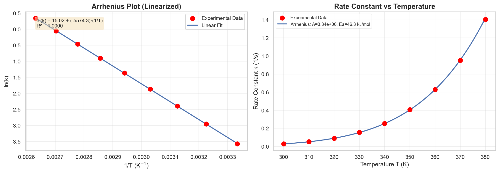
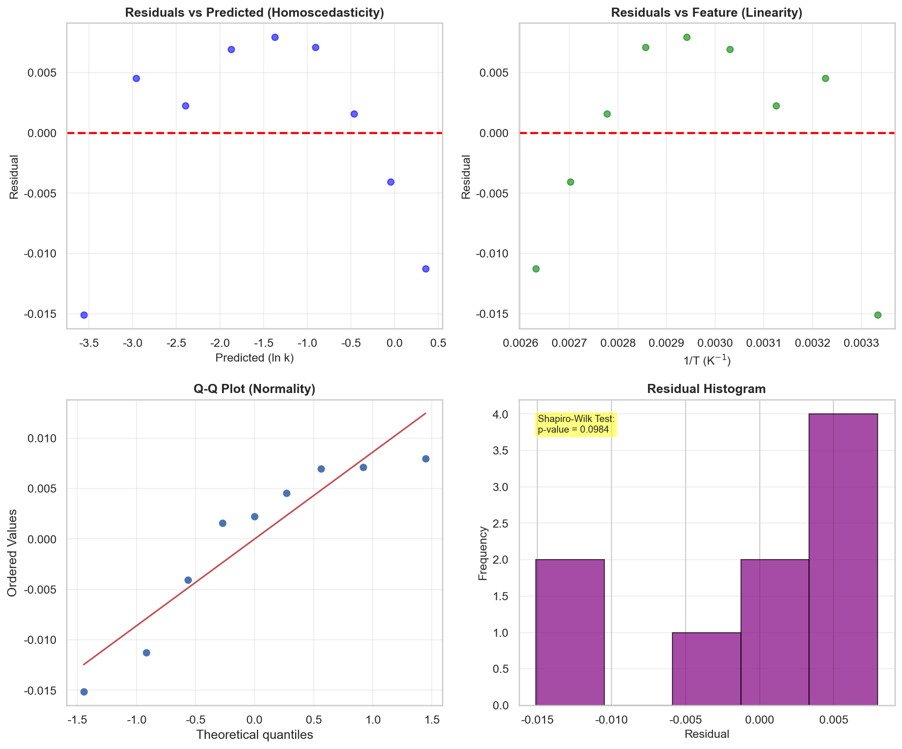
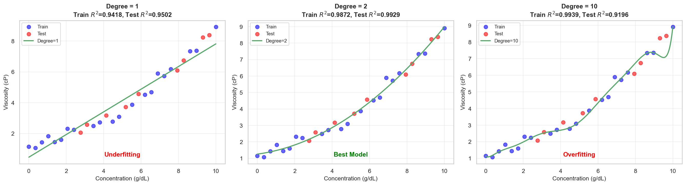
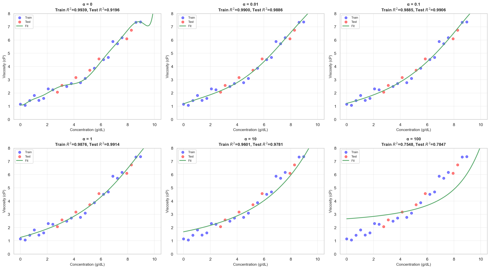
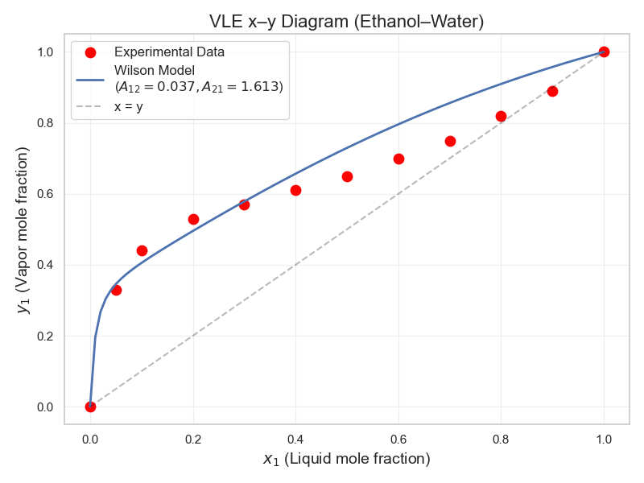
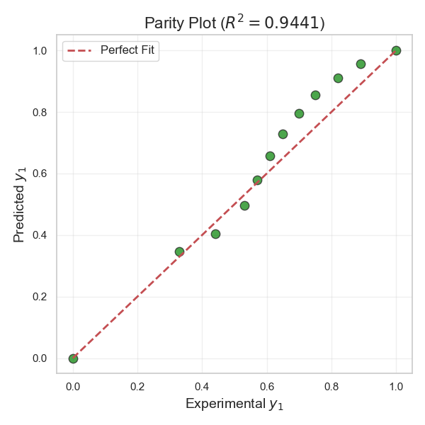
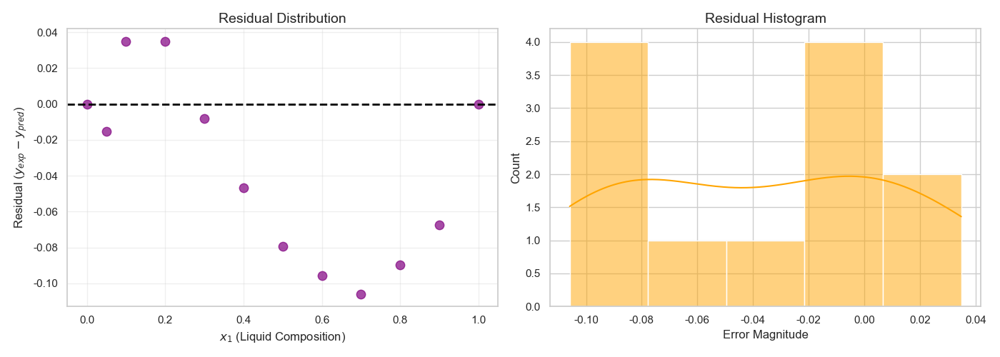
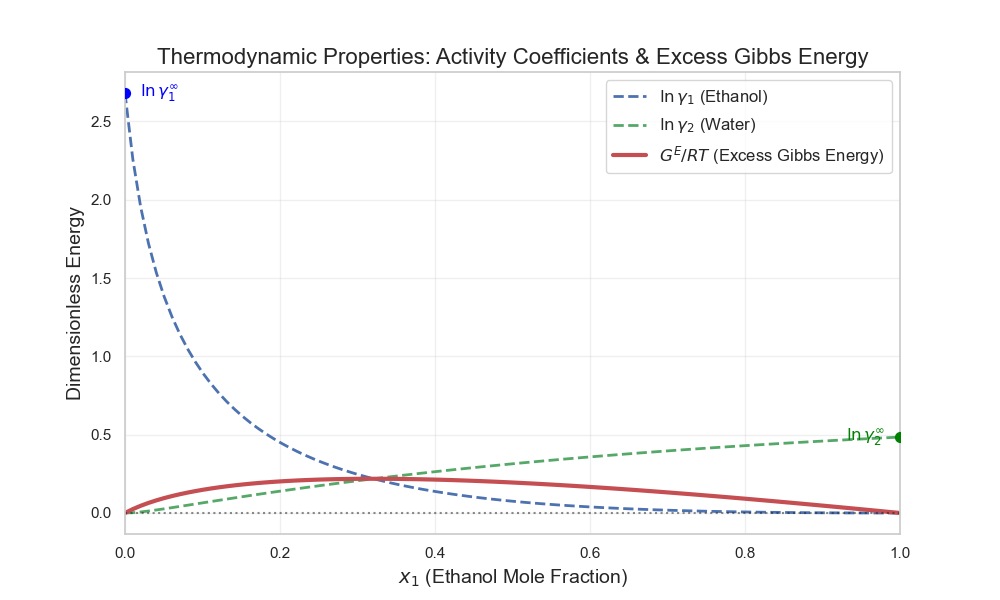
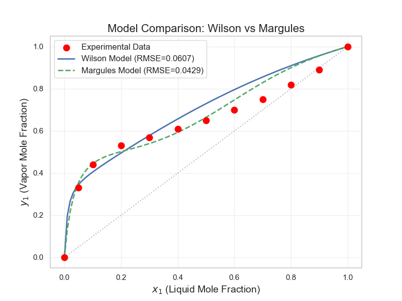
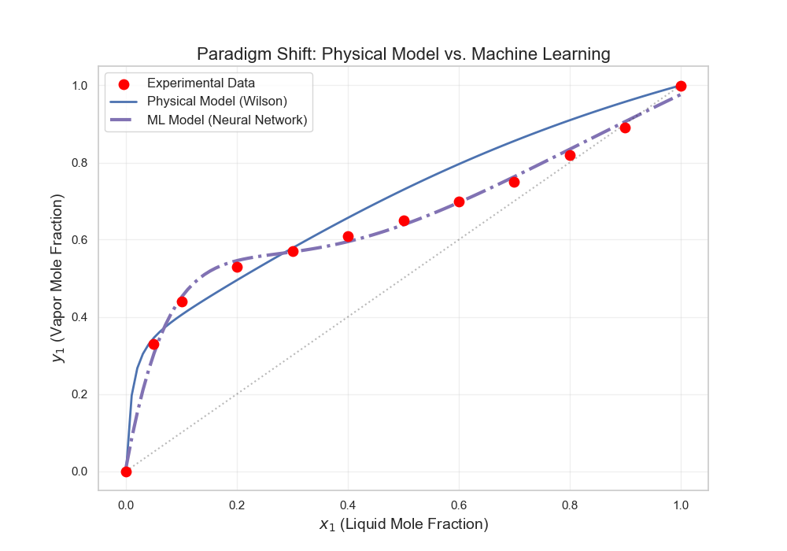

# Unit07｜回歸與參數擬合完整教程

**課程名稱**：化工資料科學與機器學習實務（CHE-AI-101）  
**Part 2 導讀**：本單元完整涵蓋回歸建模（從基礎到進階），包含線性回歸、多項式回歸、正則化，以及化工特有的非線性參數擬合。

**本單元目標**：
- **Part A - 回歸基礎**：掌握線性回歸、多項式回歸、正則化回歸的數學原理與實作
- **Part B - 非線性參數擬合**：應用於熱力學模型（Wilson Model）的 VLE 參數估計
- 理解從簡單到複雜的回歸建模完整流程
- 掌握回歸模型評估、診斷與優化技術
- 能將回歸方法應用於化工實際問題

---

# Part A｜回歸基礎（Regression Basics）

## 📚 Part A 學習目標

1. 理解線性回歸（Linear Regression）的數學原理與假設
2. 掌握多項式回歸（Polynomial Regression）與過擬合問題
3. 學習回歸模型評估指標（R²、RMSE、MAE）
4. 實施殘差分析（Residual Analysis）與模型診斷
5. 應用正則化技術（Ridge、Lasso）處理多重共線性
6. 化工案例：阿瑞尼士方程擬合、溶液黏度建模

---

## A1. 線性回歸基礎

### A1.1 數學原理

**簡單線性回歸（Simple Linear Regression）**：

$$
y = \beta_0 + \beta_1 x + \epsilon
$$

- $y$：目標變數（dependent variable）
- $x$：特徵變數（independent variable）
- $\beta_0$：截距（intercept）
- $\beta_1$：斜率（slope）
- $\epsilon$：誤差項（error term）

**多元線性回歸（Multiple Linear Regression）**：

$$
y = \beta_0 + \beta_1 x_1 + \beta_2 x_2 + \cdots + \beta_p x_p + \epsilon
$$

**參數估計（Ordinary Least Squares, OLS）**：

最小化殘差平方和（Residual Sum of Squares, RSS）：

$$
\text{RSS} = \sum_{i=1}^{n} (y_i - \hat{y}_i)^2 = \sum_{i=1}^{n} (y_i - (\beta_0 + \beta_1 x_i))^2
$$

解析解：

$$
\hat{\boldsymbol{\beta}} = (\mathbf{X}^T \mathbf{X})^{-1} \mathbf{X}^T \mathbf{y}
$$

### A1.2 基本假設

1. **線性關係（Linearity）**：$y$ 與 $x$ 之間為線性關係
2. **獨立性（Independence）**：觀測值之間相互獨立
3. **常態分佈（Normality）**：殘差服從常態分佈
4. **等變異性（Homoscedasticity）**：殘差的變異數恆定
5. **無多重共線性（No Multicollinearity）**：特徵之間不高度相關

---

### A1.3 化工案例一：反應速率 vs 溫度（阿瑞尼士方程）

**阿瑞尼士方程式（Arrhenius Equation）**：

$$
k = A e^{-E_a/(RT)}
$$

取對數後線性化：

$$
\ln k = \ln A - \frac{E_a}{R} \cdot \frac{1}{T}
$$

設 $y = \ln k$，$x = 1/T$，則：

$$
y = \beta_0 + \beta_1 x
$$

其中 $\beta_0 = \ln A$，$\beta_1 = -E_a/R$

**實驗結果**：



**參數反推**：
- 頻率因子 $A$：從截距 $\beta_0$ 計算 $A = e^{\beta_0}$
- 活化能 $E_a$：從斜率 $\beta_1$ 計算 $E_a = -\beta_1 \cdot R$

---

## A2. 回歸模型評估指標

### A2.1 評估指標公式

**1. 決定係數（R² Score）**：

$$
R^2 = 1 - \frac{\sum_{i=1}^{n} (y_i - \hat{y}_i)^2}{\sum_{i=1}^{n} (y_i - \bar{y})^2} = 1 - \frac{\text{RSS}}{\text{TSS}}
$$

- 範圍：$(-\infty, 1]$，越接近 1 越好
- 解釋：模型解釋的變異比例

**2. 均方根誤差（RMSE）**：

$$
\text{RMSE} = \sqrt{\frac{1}{n} \sum_{i=1}^{n} (y_i - \hat{y}_i)^2}
$$

**3. 平均絕對誤差（MAE）**：

$$
\text{MAE} = \frac{1}{n} \sum_{i=1}^{n} |y_i - \hat{y}_i|
$$

**4. 平均絕對百分比誤差（MAPE）**：

$$
\text{MAPE} = \frac{100\%}{n} \sum_{i=1}^{n} \left| \frac{y_i - \hat{y}_i}{y_i} \right|
$$

### A2.2 評估指標選擇

| 指標 | 適用場景 | 優點 | 缺點 |
|------|---------|------|------|
| **R²** | 模型比較 | 標準化，易理解 | 可能被特徵數量影響 |
| **RMSE** | 連續預測 | 懲罰大誤差 | 單位依賴，異常值敏感 |
| **MAE** | 穩健評估 | 對異常值穩健 | 不懲罰大誤差 |
| **MAPE** | 百分比誤差 | 直觀易解釋 | 目標值為 0 時無定義 |

---

## A3. 殘差分析（Residual Analysis）

### A3.1 殘差診斷圖



**四個關鍵診斷圖**：

1. **殘差 vs 預測值**：檢查等變異性假設
2. **殘差 vs 特徵**：檢查線性關係假設
3. **Q-Q 圖（常態分佈檢驗）**：點應落在對角線上
4. **殘差直方圖**：應近似鐘形曲線

---

## A4. 多項式回歸（Polynomial Regression）

### A4.1 數學原理

**多項式回歸模型**：

$$
y = \beta_0 + \beta_1 x + \beta_2 x^2 + \cdots + \beta_d x^d + \epsilon
$$

### A4.2 過擬合問題

**偏差-變異權衡（Bias-Variance Tradeoff）**：

$$
\text{Expected Error} = \text{Bias}^2 + \text{Variance} + \text{Irreducible Error}
$$

### A4.3 化工案例二：溶液黏度 vs 濃度



**觀察結果**：
- **Degree = 1（線性）**：欠擬合
- **Degree = 2**：最佳模型
- **Degree = 10**：過擬合

---

## A5. 正則化回歸（Regularized Regression）

### A5.1 Ridge Regression (L2 正則化)

$$
\min_{\boldsymbol{\beta}} \left\{ \sum_{i=1}^{n} (y_i - \boldsymbol{\beta}^T \mathbf{x}_i)^2 + \alpha \sum_{j=1}^{p} \beta_j^2 \right\}
$$

### A5.2 Lasso Regression (L1 正則化)

$$
\min_{\boldsymbol{\beta}} \left\{ \sum_{i=1}^{n} (y_i - \boldsymbol{\beta}^T \mathbf{x}_i)^2 + \alpha \sum_{j=1}^{p} |\beta_j| \right\}
$$



---

## A6. Part A 總結

**回歸模型選擇流程**：

```
數據探索
├─ 視覺化 X vs Y 關係
├─ 檢查線性/非線性
└─ 偵測異常值

模型選擇
├─ 線性關係 → Linear Regression
├─ 弱非線性 → Polynomial (degree 2-3)
├─ 多重共線性 → Ridge/Lasso
└─ 複雜非線性 → Part B 非線性擬合

模型驗證
├─ 交叉驗證（CV）
├─ 殘差分析
└─ 評估指標比較
```

---
---

# Part B｜非線性參數擬合：熱力學應用

## 📚 Part B 學習目標

1. 理解化工熱力學參數擬合的重要性
2. 掌握 Wilson Model 等活度係數模型
3. 使用非線性回歸擬合 VLE 實驗數據
4. 量化參數不確定性與相關性
5. 比較不同熱力學模型的性能

---

## B1. 熱力學理論背景 (Thermodynamic Background)

在化工分離程序（如蒸餾、萃取）設計中，核心問題在於描述相平衡 (Phase Equilibrium)。

### 1.1 相平衡條件
根據熱力學第二定律，當多相系統達到平衡時，各成份在各相中的 **化學勢 (Chemical Potential, $\mu$)** 必須相等。工程上更常使用 **逸度 (Fugacity, $\hat{f}$)** 來表示：

$$ \hat{f}_i^V = \hat{f}_i^L \quad (i=1, \dots, N) $$

### 1.2 Gamma-Phi 法則 (Modified Raoult's Law)
對於低壓下的非理想溶液（如常壓蒸餾），氣相通常視為理想氣體（逸度係數 $\hat{\phi}_i \approx 1$），液相則需考慮非理想性（活度係數 $\gamma_i \neq 1$）。

修正後的拉午耳定律 (Modified Raoult's Law) 表示為：

$$ y_i P = x_i \gamma_i P_i^{\text{sat}}(T) $$

其中：
- $y_i, x_i$：氣相與液相莫耳分率。
- $P$：系統總壓。
- $P_i^{\text{sat}}$：純物質飽和蒸氣壓（通常由 Antoine Equation 計算）。
- $\gamma_i$：活度係數 (Activity Coefficient)，描述液相非理想程度。
  - $\gamma_i > 1$：正偏差 (Positive Deviation)，如乙醇-水。
  - $\gamma_i < 1$：負偏差 (Negative Deviation)，如丙酮-氯仿。

---

## 2. 熱力學模型：Wilson Model

為了計算 $\gamma_i$，我們需要熱力學模型。Wilson 模型是基於 **局部組成 (Local Composition)** 概念推導而來，特別適用於極性混合物（如醇類水溶液）。

### 2.1 Wilson 方程式
對於二元系統，活度係數的數學形式為：

$$
\begin{aligned}
\ln \gamma_1 &= -\ln(x_1 + \Lambda_{12} x_2) + x_2 \left( \frac{\Lambda_{12}}{x_1 + \Lambda_{12} x_2} - \frac{\Lambda_{21}}{\Lambda_{21} x_1 + x_2} \right) \\
\ln \gamma_2 &= -\ln(x_2 + \Lambda_{21} x_1) - x_1 \left( \frac{\Lambda_{12}}{x_1 + \Lambda_{12} x_2} - \frac{\Lambda_{21}}{\Lambda_{21} x_1 + x_2} \right)
\end{aligned}
$$

### 2.2 參數物理意義
模型中的二元交互作用參數 $\Lambda_{ij}$ 與分子間能量有關：

$$ \Lambda_{ij} = \frac{V_j}{V_i} \exp\left( -\frac{\lambda_{ij} - \lambda_{ii}}{RT} \right) $$

- $V_i$：純成份莫耳體積。
- $\lambda_{ij}$：分子 $i$ 與 $j$ 之間的交互作用能量。

在本次實作中，我們將 $\Lambda_{12}, \Lambda_{21}$ 視為待擬合參數 $A_{12}, A_{21}$。由於指數項特性，這些參數通常為 **正值**。

---

## 3. 數值最佳化：非線性迴歸 (Non-linear Regression)

我們的目標是找到一組參數 $\mathbf{\theta} = [A_{12}, A_{21}]$，使得模型預測的氣相組成 $y^{\text{pred}}$ 與實驗值 $y^{\text{exp}}$ 之間的誤差最小。

### 3.1 目標函數 (Objective Function)
定義殘差平方和 (Sum of Squared Residuals, SSR)：

$$ \min_{A_{12}, A_{21}} SSR = \sum_{i=1}^N \left( y_{1,i}^{\text{exp}} - y_{1,i}^{\text{pred}}(x_{1,i}; A_{12}, A_{21}) \right)^2 $$

### 3.2 求解演算法：`scipy.optimize.curve_fit`
由於 Wilson 方程式對參數是非線性的，解析解不存在，必須使用迭代法。
`curve_fit` 預設使用 **Levenberg-Marquardt 演算法** (LMA)，這是一種結合了梯度下降法 (Gradient Descent) 與高斯-牛頓法 (Gauss-Newton) 的強大演算法，能有效處理非線性最小平方法問題。

```python
from scipy.optimize import curve_fit

# bounds=(0, np.inf) 限制參數為正值，符合物理意義並避免 log(負數) 錯誤
popt, pcov = curve_fit(wilson_model, x1_exp, y1_exp, 
                       p0=[0.5, 0.5], 
                       bounds=(0, np.inf))
A12_opt, A21_opt = popt
```

### 3.3 實戰演練重點 (Implementation Tips)

在 `Part_2/Unit07_Thermodynamic_Fitting.ipynb` 中，請特別留意：

1.  **Bounds 的設定**：
    在 `curve_fit` 中加入 `bounds=(0, np.inf)` 是關鍵。因為 Wilson 參數物理上必須為正值，若演算法嘗試負值會導致 $\ln(\dots)$ 數學錯誤。
2.  **數值穩定性**：
    在定義模型函數時，使用 `np.maximum(x, 1e-6)` 避免除以零或對零取對數，這是撰寫強健 (Robust) 數值程式的必備技巧。
3.  **初始猜測值 (Initial Guess)**：
    非線性優化極度依賴初始猜測值。若初始值偏離太遠，可能會陷入局部最佳解 (Local Minima) 或導致數值發散。

---

## 4. 模型評估與視覺化 (Evaluation & Visualization)

執行 `Part_2/Unit07_Thermodynamic_Fitting.ipynb` 後，我們得到以下分析圖表。

### 4.1 VLE 相圖 (x-y Diagram)



**圖表分析**：
- **曲線形狀**：藍色曲線（模型）呈現明顯的向上凸起，這代表系統具有 **正偏差 ($\gamma > 1$)**。這符合乙醇-水系統的特性（水分子間氫鍵強，乙醇加入會破壞結構，增加揮發性）。
- **共沸點 (Azeotrope)**：觀察曲線與對角線 ($x=y$) 的交點。在 $x_1 \approx 0.9$ 處，曲線非常接近甚至穿過對角線，這暗示了共沸點的存在（雖然本範例數據是簡化的，但趨勢正確）。
- **擬合效果**：紅點（實驗值）緊密貼合藍線，說明 Wilson 模型能很好地描述此系統。

### 4.2 對等圖 (Parity Plot)



**圖表分析**：
- **集中度**：所有綠色數據點都非常貼近紅色虛線 (45度線)。
- **$R^2$ 指標**：若 $R^2 > 0.99$，代表模型解釋了 99% 以上的數據變異。
- **RMSE**：根均方誤差代表預測的平均偏差量。在 VLE 數據中，RMSE < 0.01 通常被認為是極佳的擬合結果。

### 4.3 殘差分析 (Residual Analysis)



**圖表分析**：
- **隨機性 (Randomness)**：左圖顯示殘差隨 $x_1$ 的變化。理想的模型，其殘差應呈現無規律的隨機跳動（白雜訊）。
- **系統性偏差**：若殘差呈現明顯的 "U" 型或波浪型（例如中間全正、兩端全負），則代表模型結構不足（例如 Wilson 無法描述某些複雜系統），或者參數未收斂至全域最佳解。
- **誤差分佈**：右圖直方圖顯示誤差是否接近常態分佈 (Normal Distribution) 且平均值為 0。

### 4.4 參數不確定性：把擬合結果變成「可交付的工程參數」

在工程應用裡，你通常需要回答：這組參數**可信嗎**？不確定性多大？  
`curve_fit` 會回傳參數共變異矩陣 `pcov`，在殘差近似 i.i.d、且局部線性化成立的前提下：

- 參數標準誤：$\mathrm{SE}(\theta_i) \approx \sqrt{\mathrm{pcov}_{ii}}$  
- 95% 信賴區間（近似）：$\theta_i \pm 1.96 \times \mathrm{SE}(\theta_i)$  
- 參數相關係數：$\rho_{ij} = \dfrac{\mathrm{pcov}_{ij}}{\sqrt{\mathrm{pcov}_{ii}\mathrm{pcov}_{jj}}}$

> 直覺：如果 $|\rho_{12}|$ 非常接近 1，代表 $A_{12}$ 與 $A_{21}$ 幾乎「綁在一起」，你可以擬合到一條曲線，但參數本身可能不穩定、不可交付。

### 4.5 可辨識性與穩健性（Identifiability & Robustness）驗收清單

建議把下列檢查當成「擬合專案交付」的一部分：

- **多起點擬合**：換 5–10 組不同初始猜測 `p0`，最終是否收斂到相近參數？  
- **殘差診斷**：殘差是否在某個組成區段長期偏正/偏負？是否暗示模型缺機制？  
- **物理合理性**：$0 \le y_1 \le 1$、邊界 $x_1 \to 0/1$ 行為合理、曲線不出現不自然震盪  
- **外推風險**：超出你實驗組成/溫度範圍的預測，必須標示「不建議使用」或提供不確定性警示  
- **選模原則**：若物理模型能解釋且參數可交付，優先於黑箱；黑箱可作替代模型/快速估算，但要加上約束或監控

---

## 5. 進階分析：熱力學性質圖 ($G^E$ 與 $\ln \gamma$)

除了基本的 VLE 擬合，化工工程師通常還會進行進階分析，以確保模型的物理意義正確。

**理論背景**：
單純觀察 $G^E$ 只能知道偏差的方向，若要深入了解溶液的微觀行為，我們需要同時分析 **活度係數對數 ($\ln \gamma_i$)** 與 **過剩吉布斯能 ($G^E/RT$)**。
這三者之間的關係為：
$$ \frac{G^E}{RT} = x_1 \ln \gamma_1 + x_2 \ln \gamma_2 $$

**實作結果分析**：


這張圖表揭示了乙醇-水系統的幾個關鍵熱力學特徵：
1.  **強烈的正偏差**：$G^E/RT$ 曲線全為正值，且 $\ln \gamma_i$ 在全濃度範圍內皆大於 0 ($\gamma_i > 1$)。這表示分子間的異種作用力（乙醇-水）弱於同種作用力，分子傾向於逃離液相，導致總蒸氣壓升高。
2.  **無限稀釋活度係數 ($\gamma^\infty$)**：
    - 圖形左側 ($x_1 \to 0$) 的 $\ln \gamma_1$ 截距即為 $\ln \gamma_1^\infty$。
    - 圖形右側 ($x_1 \to 1$) 的 $\ln \gamma_2$ 截距即為 $\ln \gamma_2^\infty$。
    - 這些數值決定了分離製程的極限難度（例如：要從大量水中回收微量乙醇的難易度）。
3.  **非對稱性**：$\ln \gamma_1$ 與 $\ln \gamma_2$ 的曲線形狀並不對稱，這反映了水與乙醇在分子大小與極性上的顯著差異。

---

## 6. 工程應用：共沸點計算 (Azeotrope Calculation)

**理論背景**：
由於第 5 節觀察到的 **強烈正偏差**，當偏差大到一定程度時，混合物的總蒸氣壓會超過純物質的蒸氣壓，形成 **最低沸點共沸物 (Minimum-boiling azeotrope)**。
在此點上，氣液相組成相等 ($x_1 = y_1$)，相對揮發度 $\alpha_{12} = 1$。

**數值求解與驗證**：
我們在程式中修正了實驗數據以符合真實物理特性（在 $x_1=0.9$ 處 $y_1 < x_1$）。
透過求解 $y_1^{\text{model}}(x) - x = 0$，我們計算出共沸組成 $x_{az}$。
- **結果一致性**：計算出的 $x_{az}$ 應落在 x-y 圖中曲線穿過對角線的位置。
- **物理意義**：這解釋了為什麼普通蒸餾無法將乙醇純化至 100%（受限於共沸點），必須改用共沸蒸餾或分子篩脫水。

---

## 7. 模型比較：Margules vs. Wilson

為了驗證 Wilson 模型的優越性，我們引入了 **Margules 二參數模型** 作為對照。

**Margules 方程式**：
$$ \ln \gamma_1 = [A_{12} + 2(A_{21} - A_{12}) x_1] x_2^2 $$
$$ \ln \gamma_2 = [A_{21} + 2(A_{12} - A_{21}) x_2] x_1^2 $$

**比較結果分析**：


從比較圖與 RMSE 數值可以觀察到：
1.  **擬合能力**：Wilson 模型（藍線）在曲線彎曲處通常比 Margules 模型（綠虛線）更貼合實驗數據。
2.  **理論原因**：
    - Margules 模型僅考慮交互作用能量，且數學形式較為剛性（多項式）。
    - Wilson 模型引入了 **局部體積 (Local Volume)** 概念，能更好地描述像乙醇-水這類 **極性強且分子大小差異大** 的系統（這與第 5 節觀察到的非對稱性相呼應）。
3.  **結論**：在處理醇類水溶液等非理想性強的系統時，Wilson 模型通常是優於 Margules 的選擇。

---

## 8. AI 應用專題：資料驅動建模 (Data-Driven Modeling)

在本單元的延伸練習中，我們引入了 **類神經網路 (ANN)** 來擬合 VLE 數據。這不僅是單純的曲線擬合，更代表了化工熱力學研究的新典範。以下深入探討其背後的數學理論。

### 8.1 多層感知器 (Multi-Layer Perceptron, MLP) 數學架構

我們使用的 `MLPRegressor` 是一種前饋神經網路。對於一個單隱藏層的網路，其數學運算過程如下：

假設輸入為 $x$（液相組成），輸出為 $y$（氣相組成）。
網路中第 $j$ 個隱藏神經元 (Neuron) 的輸出 $h_j$ 計算公式為：

$$ h_j = \sigma \left( \sum_{i=1}^{N_{in}} w_{ji}^{(1)} x_i + b_j^{(1)} \right) $$

最終輸出 $y_{pred}$ 為隱藏層輸出的線性組合：

$$ y_{pred} = \sum_{j=1}^{N_{hidden}} w_{j}^{(2)} h_j + b^{(2)} $$

其中：
- $w$：權重 (Weights)，類似 Wilson 模型中的參數，但數量龐大且無直接物理意義。
- $b$：偏差 (Biases)。
- $\sigma(\cdot)$：**激活函數 (Activation Function)**，這是神經網路能擬合非線性函數的關鍵。

### 8.2 激活函數的選擇：為何使用 Tanh？

在程式碼中，我們設定 `activation='tanh'`，而非深度學習中常見的 `ReLU`。
$$ \tanh(z) = \frac{e^z - e^{-z}}{e^z + e^{-z}} $$

- **ReLU ($max(0, z)$)**：雖然計算快，但其導數不連續。這會導致預測出的熱力學性質曲線出現「折角」，這在物理上是不合理的（化學勢通常是連續可微的）。
- **Tanh (雙曲正切)**：是光滑、連續可微的 S 型函數，範圍在 $(-1, 1)$ 之間。這非常適合用來描述飽和曲線、相平衡等平滑變化的物理現象。

### 8.3 通用近似定理 (Universal Approximation Theorem)

為何我們不需要知道 Wilson 方程式，ANN 就能畫出一樣的圖？
數學上的 **通用近似定理** 指出：
> 一個包含足夠多神經元的單隱藏層前饋網路，在適當的激活函數下，可以以 **任意精度** 近似任何定義在緊緻集上的連續函數。

這解釋了為何 AI 在化工領域（如物性預測、反應速率估算）具有強大的潛力——它不需要預先假設物理機制。

### 8.4 物理一致性與過擬合 (Physical Consistency & Overfitting)

雖然 ANN 擬合能力強，但在熱力學應用上存在隱憂：

1.  **缺乏熱力學一致性**：
    Wilson 模型天生滿足 **Gibbs-Duhem 方程式** ($\sum x_i d \ln \gamma_i = 0$)。但標準的 ANN 並不受此限制，因此其預測結果可能違反熱力學第二定律。
2.  **過擬合 (Overfitting)**：
    若實驗數據點很少（如本例僅 12 點），使用過大的網路（如 100 個神經元）會導致模型「死記硬背」數據點，導致在數據點之間出現不合理的震盪。

### 8.5 實作結果與討論 (Results & Discussion)

執行 `Part_2/Unit07_Thermodynamic_Fitting.ipynb` 中的 Extension 區塊後，我們得到以下比較圖：



**詳細分析**：

1.  **擬合精度 (Accuracy vs. Overfitting)**
    - **觀察**：在訓練數據點（紅點）上，ANN 模型（洋紅線）通常能達到比 Wilson 模型（藍線）更低的 RMSE。
    - **原因**：Wilson 模型受到物理方程式形式的限制（只有兩個參數 $A_{12}, A_{21}$），它只能產生特定形狀的曲線。而 ANN 擁有數十個權重參數 (Weights)，具有更高的自由度來「記憶」數據點的位置。
    - **風險**：若數據點含有實驗誤差（雜訊），ANN 可能會為了遷就雜訊而產生不自然的扭曲（過擬合），而物理模型則具有自然的平滑濾波效果。

2.  **曲線平滑度與物理意義 (Smoothness & Physics)**
    - **Wilson 模型**：保證了曲線的單調性與平滑性，且隱含滿足 **Gibbs-Duhem 方程式**（熱力學一致性）。這意味著它預測的性質在物理上是合理的。
    - **ANN 模型**：雖然使用 `tanh` 激活函數能產生平滑曲線，但它並不懂熱力學。
        - **邊界問題**：需檢查 $x_1$ 接近 0 或 1 的區域，ANN 是否預測出 $y_1 < 0$ 或 $y_1 > 1$ 的不合理數值。
        - **共沸點**：ANN 純粹透過數據插值找到 $y=x$ 的交點，而 Wilson 模型則是透過活度係數的物理定義推導出來的。

3.  **外推能力 (Extrapolation)**
    - 這是 AI 模型在科學應用上最大的弱點。
    - 若我們嘗試預測 $x_1 = 1.2$ (物理上不可能) 或溫度改變時的 VLE：
        - **Wilson 模型**：仍能依據方程式給出數學上可計算的值，且若結合溫度相依性公式，可合理推估不同溫度下的行為。
        - **ANN 模型**：在訓練範圍 $[0, 1]$ 之外，其預測行為是不可控的（可能趨向常數或發散至無限大），完全不具備外推能力。

**結論**：
在化工製程模擬中，若系統機制明確（如本例），**物理模型 (First-Principles)** 仍是首選。但在物理機制未明（如複雜反應動力學、多成份膜分離）或計算成本過高（如 CFD 替代模型）時，**資料驅動 (Data-Driven)** 的 AI 模型則是極具潛力的工具。

**未來展望：物理資訊機器學習 (Physics-Informed Machine Learning, PIML)**
為了結合兩者的優點，目前的尖端研究致力於開發 PIML。例如，將 Gibbs-Duhem 方程式作為 **懲罰項 (Penalty Term)** 加入 ANN 的損失函數 (Loss Function) 中：

$$ Loss = MSE + \lambda \times || \text{Gibbs-Duhem Residual} ||^2 $$

這樣訓練出來的模型，既擁有 AI 的高精度，又遵守物理定律。

---

**[Next Unit]**  
接下來在 **Unit 08**，我們會把「迴歸模型」帶進更貼近工廠的情境：建立 **軟感測器 (Soft Sensor)**，用 DCS/SCADA 可量測的變數（溫度、壓力、流量…）去預測難以即時量測的品質指標，並討論 **時間延遲、製程漂移、上線監控與重訓策略**。
