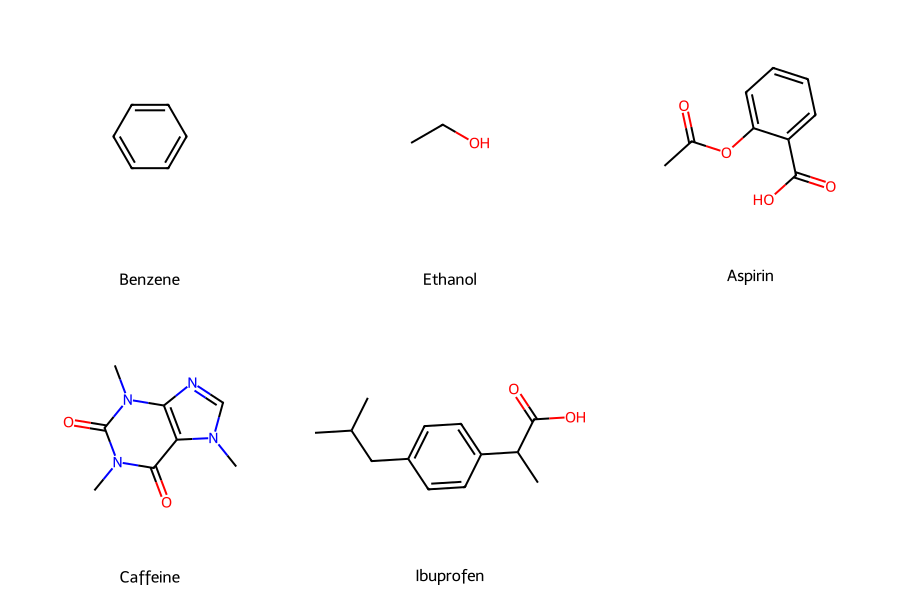
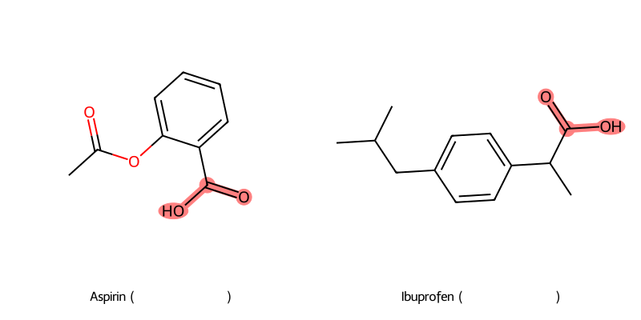

# Unit08 附錄｜化學資訊學：分子特徵工程（RDKit）

**課程名稱**：化工資料科學與機器學習實務（CHE-AI-101）  
**附錄說明**：本附錄為選讀內容，介紹如何將分子結構轉換為機器學習可用的數值特徵。  

**學習目標**：
- 理解化學結構的數位化表示法 (SMILES, Graph)
- 掌握分子描述子 (Descriptors) 的物理意義與數學定義
- 使用 RDKit 進行特徵工程 (Feature Engineering)
- 實作子結構搜尋 (Substructure Search) 與視覺化
- 了解 AI 藥物發現 (AI Drug Discovery) 的基本流程

**與主課程的關聯**：
- 本附錄展示了特徵工程在化學領域的應用
- 延伸 Unit05-08 學習的監督式學習方法
- 可選擇性學習，不影響主課程進度

---

## 1. 化學資訊學概論 (Introduction)

化學資訊學 (Cheminformatics) 是化學、電腦科學與資訊科學的交叉學科。其核心挑戰在於：**如何讓電腦「理解」化學分子？**

電腦無法直接處理燒杯中的化學物質，也無法直接「看」結構式圖片。我們必須將分子轉化為電腦可運算的資料結構（如字串、圖形或向量）。這也是 **QSAR (Quantitative Structure-Activity Relationship)** 的基礎假設：**相似的化學結構通常具有相似的生物活性或物理化學性質**。

---

## 2. 分子表示法 (Molecular Representation)

### 2.1 SMILES (Simplified Molecular Input Line Entry System)
SMILES 是一種基於 ASCII 字串的線性表示法，利用簡單的語法規則來描述 2D 化學結構。

**語法規則詳解**：
1.  **原子**：使用元素符號（如 `C`, `N`, `O`, `S`, `P`）。有機子集外的元素需加括號（如 `[Au]`）。
2.  **鍵結**：單鍵通常省略，雙鍵用 `=`，三鍵用 `#`，芳香鍵用 `:`。
3.  **分支**：使用圓括號 `()` 表示側鏈。例如 `CC(O)C` 代表異丙醇。
4.  **環**：使用數字標記斷開的鍵（如 `C1...C1`）。環己烷為 `C1CCCCC1`。
5.  **芳香性**：使用小寫字母（如 `c`, `n`）表示芳香環中的原子。苯為 `c1ccccc1`。
6.  **立體化學 (Stereochemistry)**：
    - 雙鍵幾何異構 (E/Z)：`/` 和 `\`。例如 `F/C=C/F` (trans) vs `F/C=C\F` (cis)。
    - 手性中心 (R/S)：`@` (逆時針) 和 `@@` (順時針)。例如 `C[C@H](O)C(=O)O` (L-Alanine)。

**範例對照**：

| 分子名稱 | 結構特徵 | SMILES | 解析 |
| :--- | :--- | :--- | :--- |
| **乙醇 (Ethanol)** | 直鏈 | `CCO` | C-C-O |
| **二氧化碳** | 雙鍵 | `O=C=O` | O=C=O |
| **異丙醇** | 分支 | `CC(O)C` | 中間的 C 接了一個 O |
| **環己烷** | 環狀 | `C1CCCCC1` | 第一個 C 與最後一個 C 相連 |
| **苯 (Benzene)** | 芳香環 | `c1ccccc1` | 6 個芳香碳形成的環 |

> **理論補充：Canonical SMILES (標準化)**
> SMILES 的生成演算法不是唯一的，例如乙醇可寫為 `CCO`, `OCC`, `C(O)C`。這會導致資料庫檢索困難。
> RDKit 使用 **CANGEN (CANonical GENeration)** 或類似演算法，為每個分子生成唯一的 **Canonical SMILES**。
> 演算法核心思想：根據原子的拓撲環境為每個原子分配唯一的等級 (Rank)，然後按照等級順序遍歷分子生成字串。

### 2.2 圖論表示法 (Graph Representation)
在電腦記憶體中，分子被視為 **圖 (Graph) $G = (V, E)$**。這也是圖神經網路 (GNN) 的輸入基礎。
- **節點 (Nodes, $V$)**：代表原子。特徵矩陣 $\mathbf{X} \in \mathbb{R}^{N \times F}$ 儲存原子屬性（如原子序、混成軌域、電荷）。
- **邊 (Edges, $E$)**：代表化學鍵。鄰接矩陣 $\mathbf{A} \in \{0, 1\}^{N \times N}$ 或 $\mathbf{E} \in \mathbb{R}^{N \times N \times B}$ 儲存鍵結關係。

---

## 3. 分子描述子 (Molecular Descriptors)

為了建立機器學習模型（如 QSAR），我們需要將非結構化的分子圖轉化為固定長度的數值向量 $\mathbf{x} \in \mathbb{R}^d$。這些數值特徵稱為描述子。

### 3.1 辛醇-水分配係數 (LogP)
LogP 是衡量分子 **親油性 (Hydrophobicity)** 的黃金指標。定義為溶質在正辛醇 (n-octanol) 與水兩相中平衡濃度的比值取對數：

$$ \log P = \log_{10} \left( \frac{[\text{solute}]_{\text{octanol}}}{[\text{solute}]_{\text{water}}} \right) $$

- **LogP > 0**：親油性（傾向溶於油相）。
- **LogP < 0**：親水性（傾向溶於水相）。
- **應用**：影響藥物在體內的吸收、分佈、代謝與排泄 (ADME)。過於親水無法穿透細胞膜（脂雙層），過於親油則易被代謝或累積在脂肪組織。

### 3.2 拓撲極性表面積 (TPSA)
TPSA (Topological Polar Surface Area) 是分子表面中極性原子（如 N, O 及其鍵結的 H）的表面積總和。
- **物理意義**：反映分子形成氫鍵的能力。
- **經驗法則**：若 TPSA > 140 Ų，藥物通常難以口服吸收或穿透血腦屏障 (BBB)。

### 3.3 Lipinski's Rule of 5 (里賓斯基五規則)
這是評估化合物是否具備「類藥性 (Drug-likeness)」的經典經驗法則。口服藥物通常符合：
1.  氫鍵給體 (HBD) $\le 5$
2.  氫鍵受體 (HBA) $\le 10$
3.  分子量 (MW) $\le 500$
4.  LogP $\le 5$

### 3.4 分子指紋 (Molecular Fingerprints)
雖然描述子（如 MW, LogP）很有用，但它們丟失了詳細的結構拓撲資訊。為了讓機器學習模型處理複雜結構，我們使用 **分子指紋** 將分子轉化為高維度的位元向量 (Bit Vector)。

#### Morgan Fingerprints (ECFP - Extended-Connectivity Fingerprints)
這是目前藥物發現中最常用的指紋，類似於圖卷積 (Graph Convolution) 的概念。

**演算法步驟**：
1.  **初始化**：為每個原子分配一個整數識別碼 (Identifier)，基於其原子屬性（原子序、鍵數等）。
2.  **迭代 (Iteration)**：對每個原子，收集其半徑 $r$ 內的鄰居原子識別碼，透過雜湊函數 (Hash Function) 更新該原子的識別碼。
    - $r=0$：僅考慮原子本身。
    - $r=1$：考慮直接相連的原子。
    - $r=2$ (ECFP4)：考慮兩層鄰居。
3.  **雜湊與映射 (Hashing & Mapping)**：將所有迭代過程中產生的子結構識別碼，透過 Modulo 運算映射到一個固定長度（如 2048 bits）的向量中。

**結果**：$\mathbf{v} \in \{0, 1\}^{2048}$。若 $\mathbf{v}_i = 1$，代表分子中存在某種特定的子結構。

### 3.5 分子相似度 (Molecular Similarity)
根據 **相似性原理 (Similarity Principle)**：結構相似的分子通常具有相似的性質。
我們常用 **Tanimoto Coefficient (Jaccard Index)** 來量化兩個二元指紋向量 $\mathbf{A}, \mathbf{B}$ 的相似度：

$$ T(A, B) = \frac{|A \cap B|}{|A \cup B|} = \frac{c}{a + b - c} $$

其中：
- $a$：分子 A 中為 1 的位元總數 (ON bits in A)。
- $b$：分子 B 中為 1 的位元總數 (ON bits in B)。
- $c$：兩者同時為 1 的位元數 (Common ON bits)。

- **範圍**：$0 \le T \le 1$。
    - $T > 0.85$：通常被認為具有顯著相似性。
    - $T < 0.2$：結構差異大。

---

## 4. 範例結果深度分析 (Result Analysis)

執行 `Part_2/Unit08_Appendix_Cheminformatics.ipynb` 後，我們進行了多項分析。以下是詳細解讀：

### 4.1 描述子計算結果

| Name | MW | LogP | HBD | HBA | TPSA | 分析 |
|---|---|---|---|---|---|---|
| **Benzene** | 78.11 | 1.69 | 0 | 0 | 0.00 | 純碳氫化合物，無極性基團，故 TPSA=0。LogP 適中。 |
| **Ethanol** | 46.07 | -0.00 | 1 | 1 | 20.23 | 極性小分子，LogP 接近 0，水油皆可溶。 |
| **Aspirin** | 180.16 | 1.31 | 1 | 3 | 63.60 | 含有羧酸與酯基，具備良好的口服吸收特性 (TPSA < 140)。 |
| **Caffeine** | 194.19 | -0.07 | 0 | 3 | 58.44 | 雖然含氮多，但 LogP 略小於 0，屬水溶性較佳的分子。 |
| **Ibuprofen** | 206.28 | 3.07 | 1 | 2 | 37.30 | **最親油**。長碳鏈導致 LogP 高達 3.07，極易穿透細胞膜。 |

### 4.2 分子相似度分析 (Similarity Analysis)
我們計算了各分子與 **Aspirin** 的 Tanimoto 相似度 (基於 Morgan Fingerprint, r=2)。

| 分子名稱 | Tanimoto 相似度 | 分析解釋 |
| :--- | :--- | :--- |
| **Aspirin** | 1.0000 | 自我比較，完全相同。 |
| **Ibuprofen** | ~0.25 - 0.35 | **相對較高**。兩者皆含有苯環 (Benzene ring) 與羧酸 (Carboxylic acid) 結構，且皆為消炎藥 (NSAIDs)。指紋捕捉到了這些共同特徵。 |
| **Benzene** | ~0.10 - 0.15 | **低**。雖然 Aspirin 含有苯環，但 Benzene 缺乏 Aspirin 的複雜側鏈（酯基、羧酸），故相似度低。 |
| **Ethanol** | ~0.00 - 0.05 | **極低**。除了都有氧原子外，結構完全不同（直鏈 vs 芳香環）。 |

> **結論**：Tanimoto 相似度能有效量化化學結構的重疊程度。在虛擬篩選中，若我們發現 Aspirin 有效，我們會優先測試相似度高的 Ibuprofen，而不是 Ethanol。

### 4.3 分子結構視覺化

RDKit 能將抽象的 SMILES 轉為 2D 結構圖，這對於檢查資料集品質至關重要（例如檢查是否有斷鍵或錯誤結構）。


*(圖：各分子的 2D 結構與 LogP 值。可觀察到 Ibuprofen 的長碳鏈結構對應其高 LogP 值)*

---

## 5. 子結構搜尋 (Substructure Search)

在藥物篩選中，我們常需篩選含有特定 **藥效團 (Pharmacophore)** 或 **毒性警示結構 (Toxicophore)** 的分子。

### 5.1 SMARTS 語言
SMARTS 是 SMILES 的擴充，允許使用邏輯運算子來定義「模式 (Pattern)」。
- **任務**：搜尋含有 **羧酸 (Carboxylic Acid)** 的分子。
- **SMARTS Pattern**: `C(=O)[OH]`
  - `C`：碳原子
  - `(=O)`：雙鍵連接一個氧
  - `[OH]`：單鍵連接一個羥基

### 5.2 搜尋結果驗證

程式執行後，成功在 **Aspirin** 與 **Ibuprofen** 中偵測到羧酸結構。


*(圖：Aspirin 分子結構，紅色高亮部分為 RDKit 匹配到的 `C(=O)OH` 官能基)*

- **Aspirin (乙醯水楊酸)**：結構中包含一個苯環、一個酯基與一個羧酸。
- **Ibuprofen (布洛芬)**：結構中包含一個苯環、異丁基與丙酸基團（含羧酸）。
- **Ethanol / Benzene**：不含此結構，故未被篩選出。

---

## 6. 總結與展望

本附錄展示了從 **SMILES** → **RDKit Mol** → **Descriptors** 的完整流程。
這就是 **QSAR (Quantitative Structure-Activity Relationship)** 的基礎：

$$ \text{Activity} = f(\text{Descriptors}) $$

在實際應用中，我們會計算數百個描述子（X），搭配實驗測得的生物活性（y），沿用你在 Unit05–Unit08 建立的 scikit-learn 建模流程（切分/交叉驗證/選模），搭配如 Random Forest、Gradient Boosting 等模型來預測新分子的藥效，從而加速新藥開發流程。

### 6.1 與主課程的連結

本附錄中的技術可以直接應用於主課程學到的方法：

```
特徵工程（本附錄）
    ↓
監督式學習（Unit05-08）
    ├─ 回歸：預測 LogP、溶解度、毒性
    ├─ 分類：預測藥物活性、通過/不通過
    └─ 集成學習：Random Forest、Gradient Boosting
```

### 6.2 進階學習資源

**必讀教科書**：
- Leach, A. R., & Gillet, V. J. (2007). *An Introduction to Chemoinformatics*. Springer.

**線上資源**：
- [RDKit 官方文檔](https://www.rdkit.org/docs/)
- [DeepChem 教程](https://deepchem.io/)（深度學習在藥物發現中的應用）

**前沿研究**：
- 圖神經網路 (Graph Neural Networks) 用於分子性質預測
- 生成式模型 (Generative Models) 用於藥物設計
- 遷移學習 (Transfer Learning) 應用於小樣本藥物數據

---

**📖 附錄完成！**

您已了解化學資訊學的基礎。若對此領域感興趣，可進一步學習深度學習在藥物發現中的應用（如 Graph Convolutional Networks、Variational Autoencoders 等）。

**返回主課程**：[Unit08 軟感測器開發](Unit08_SoftSensor.md) | [Part 2 總覽](README.md)
