# Unit09 綜合案例研究總覽 (Integrated Case Study Overview)

## 1. 綜合案例研究簡介

### 1.1 為什麼需要綜合案例研究？

在前面的單元中，我們分別學習了分群 (Clustering)、降維 (Dimensionality Reduction)、異常檢測 (Anomaly Detection) 和關聯規則學習 (Association Rule Learning) 等非監督式學習方法。每種方法都有其特定的應用場景和優勢：

- **分群 (Clustering)**：識別數據中的自然群組結構，發現不同的操作模式或產品類型
- **降維 (Dimensionality Reduction)**：將高維數據投影到低維空間，便於視覺化和特徵提取
- **異常檢測 (Anomaly Detection)**：識別偏離正常行為的數據點，用於故障診斷和品質監控
- **關聯規則學習 (Association Rule Learning)**：發現變數之間的關聯模式，支持配方設計和製程優化

在實際的化工製程數據分析中，這些方法往往需要**組合使用**，才能發揮最大的效用。單一方法可能無法全面揭示數據中的複雜關係和模式。

### 1.2 綜合案例研究的目標

本單元將透過一個完整的工業案例—**田納西-伊士曼製程 (Tennessee Eastman Process, TEP)**—展示如何結合多種非監督式學習方法，進行完整的製程數據分析工作流程。

**學習目標**：

1. **理解工業製程的複雜性**：認識真實化工製程的多變數特性和動態行為
2. **掌握數據分析工作流程**：學會如何系統性地組合多種分析方法
3. **實踐端到端的分析流程**：從原始數據到最終洞察的完整過程
4. **培養工程判斷能力**：根據領域知識解釋分析結果，提出改善建議

### 1.3 田納西-伊士曼製程 (TEP) 簡介

#### 1.3.1 TEP 的背景與重要性

田納西-伊士曼製程 (Tennessee Eastman Process, TEP) 是由 Downs 和 Vogel 於 1993 年提出的化工製程控制測試問題，已成為製程控制和故障診斷研究領域的**標準基準測試案例** (Benchmark)。

**TEP 的特點**：

- **真實性**：基於實際的化工製程，具有工業級的複雜度
- **完整性**：包含反應、分離、循環等多個單元操作
- **挑戰性**：具有強耦合、非線性、多模態等特性
- **標準化**：提供標準的模擬程式和故障場景，便於比較不同方法的性能

#### 1.3.2 TEP 製程描述

TEP 是一個**連續式化學製程**，用於生產兩種液態產品 (Product G 和 Product H) 從四種氣態反應物 (A, C, D, E)。製程包含以下主要單元：

1. **反應器 (Reactor)**：進行放熱不可逆反應
2. **冷凝器 (Condenser)**：冷卻反應產物
3. **氣液分離器 (Vapor-Liquid Separator)**：分離氣體和液體
4. **汽提塔 (Stripper)**：純化液態產物
5. **循環系統 (Recycle System)**：未反應的氣體循環利用

**主要反應**：

$$
\begin{align*}
\text{A(g)} + \text{C(g)} + \text{D(g)} &\rightarrow \text{G(liq)} \\
\text{A(g)} + \text{C(g)} + \text{E(g)} &\rightarrow \text{H(liq)} \\
\text{A(g)} + \text{E(g)} &\rightarrow \text{F(liq)} \\
3\text{D(g)} &\rightarrow 2\text{F(liq)}
\end{align*}
$$

其中 F 是副產物 (By-product)，B 是惰性氣體 (Inert)。

#### 1.3.3 TEP 數據特性

**測量變數**：
- **連續測量變數**：22 個 (XMEAS 1-22)，如溫度、壓力、流量、液位等
- **取樣分析變數**：19 個 (XMEAS 23-41)，如組成分析 (定期取樣)
- **操作變數**：12 個 (XMV 1-12)，如進料流量、閥門開度、攪拌速度等

**故障場景**：
- TEP 提供 21 種預定義的故障場景 (IDV 1-21)
- 故障類型包括：進料組成變化、溫度擾動、閥門故障、反應動力學漂移等
- 正常操作條件 (IDV = 0) 作為基準

**數據規模**：
- 訓練數據：480 個時間點 (每 3 分鐘採樣一次，共 24 小時)
- 測試數據：960 個時間點 (每 3 分鐘採樣一次，共 48 小時)
- 總維度：52 個變數 (41 個測量變數 + 11 個操作變數)

---

## 2. 綜合分析工作流程設計

### 2.1 分析工作流程概覽

針對 TEP 製程數據，我們設計了一個**多階段、多方法整合**的分析工作流程：

```
階段 1：數據準備與探索性分析
   ↓
階段 2：降維與特徵提取 (PCA, t-SNE, UMAP)
   ↓
階段 3：操作模式識別 (Clustering)
   ↓
階段 4：異常檢測與故障診斷
   ↓
階段 5：變數關聯分析與洞察提取
   ↓
階段 6：結果整合與工程建議
```

### 2.2 各階段的目標與方法

#### 階段 1：數據準備與探索性分析

**目標**：
- 載入 TEP 數據並理解其結構
- 進行基本的數據清理和預處理
- 執行探索性數據分析 (EDA) 以了解數據特性

**主要任務**：
- 數據載入與檢查 (缺失值、異常值)
- 變數分布視覺化 (直方圖、箱型圖)
- 相關性分析 (相關係數矩陣、熱力圖)
- 時間序列趨勢檢視
- 數據標準化 (StandardScaler)

**預期輸出**：
- 清理後的數據集
- 數據特性報告 (統計摘要、相關性分析)
- 視覺化圖表 (分布圖、相關性熱力圖)

#### 階段 2：降維與特徵提取

**目標**：
- 將高維數據 (52 維) 投影到低維空間
- 提取主要特徵，便於後續分析和視覺化
- 比較不同降維方法的效果

**應用方法**：

| 方法 | 適用場景 | 輸出維度 | 主要優勢 |
|------|---------|---------|---------|
| **PCA** | 線性降維、特徵提取 | 2-10 維 | 可解釋性強、保留全局結構 |
| **Kernel PCA** | 非線性降維 | 2-10 維 | 捕捉非線性關係 |
| **t-SNE** | 視覺化、群組發現 | 2-3 維 | 保留局部結構、視覺化效果好 |
| **UMAP** | 大規模數據降維 | 2-10 維 | 速度快、保留全局與局部結構 |

**主要任務**：
- 應用 PCA 並分析主成分的貢獻度
- 使用 t-SNE 和 UMAP 進行 2D 視覺化
- 比較不同方法的降維效果
- 解釋主成分的物理意義 (PCA loadings 分析)

**預期輸出**：
- 降維後的特徵空間
- Scree Plot (解釋變異數比例)
- 2D/3D 視覺化圖表
- 主成分負荷量分析表 (PCA loadings)

#### 階段 3：操作模式識別 (Clustering)

**目標**：
- 識別製程數據中的不同操作模式
- 發現正常操作狀態和異常操作狀態
- 理解不同操作條件對製程的影響

**應用方法**：

| 方法 | 適用場景 | 超參數 | 主要優勢 |
|------|---------|--------|---------|
| **K-Means** | 球形群組、快速分群 | n_clusters | 簡單高效、適合初步探索 |
| **Hierarchical** | 階層結構、視覺化 | linkage, n_clusters | 不需預設群數、樹狀圖視覺化 |
| **DBSCAN** | 任意形狀、雜訊檢測 | eps, min_samples | 自動發現雜訊點、無需預設群數 |
| **GMM** | 軟分群、機率模型 | n_components | 提供歸屬機率、適合重疊群組 |

**主要任務**：
- 在降維空間中應用分群演算法
- 使用 Elbow Method 和 Silhouette Score 確定最佳群數
- 視覺化分群結果 (scatter plot with cluster labels)
- 分析每個群組的特性 (均值、標準差)
- 比較不同分群方法的結果

**預期輸出**：
- 分群標籤 (每個樣本的群組歸屬)
- 分群視覺化圖表
- 群組特性摘要表
- 模型評估指標 (Silhouette Score, Davies-Bouldin Index)

#### 階段 4：異常檢測與故障診斷

**目標**：
- 識別偏離正常操作的數據點
- 檢測已知故障場景和未知異常
- 建立故障診斷模型

**應用方法**：

| 方法 | 適用場景 | 超參數 | 主要優勢 |
|------|---------|--------|---------|
| **Isolation Forest** | 高維數據、污染比例已知 | contamination, n_estimators | 速度快、適合高維數據 |
| **One-Class SVM** | 嚴格邊界、核方法 | nu, kernel, gamma | 靈活的決策邊界 |
| **LOF** | 局部密度異常 | n_neighbors | 檢測局部異常 |
| **Elliptic Envelope** | 高斯分布數據 | contamination | 假設明確、計算效率高 |

**主要任務**：
- 使用正常操作數據訓練異常檢測模型
- 在測試數據 (包含故障) 上評估模型性能
- 比較不同方法的檢測效果 (ROC Curve, Precision-Recall Curve)
- 分析誤報和漏報的原因
- 結合降維和分群結果解釋異常

**預期輸出**：
- 異常分數 (anomaly score) 或標籤
- ROC Curve 和 AUC 分數
- Precision-Recall Curve
- 故障檢測率統計表
- 時間序列異常標記圖

#### 階段 5：變數關聯分析與洞察提取

**目標**：
- 發現製程變數之間的關聯規則
- 理解哪些操作條件組合會導致特定結果
- 為製程優化提供可操作的建議

**應用方法**：
- **關聯規則學習** (Apriori, FP-Growth)
- **相關性分析** (Pearson, Spearman)
- **因果推斷** (Granger Causality) - 進階選修

**主要任務**：
- 將連續變數離散化 (binning)
- 應用 Apriori 或 FP-Growth 挖掘關聯規則
- 過濾和排序規則 (support, confidence, lift)
- 視覺化規則網絡
- 結合領域知識驗證規則的合理性

**預期輸出**：
- 關聯規則列表 (按 lift 排序)
- 規則網絡視覺化
- 變數重要性排名
- 操作建議摘要

#### 階段 6：結果整合與工程建議

**目標**：
- 整合所有分析結果，形成整體洞察
- 提出具體的工程改善建議
- 建立製程監控和故障診斷策略

**主要任務**：
- 綜合分群、降維、異常檢測的結果
- 識別關鍵製程變數和操作參數
- 建立製程健康度儀表板 (dashboard) 概念
- 提出製程優化和故障預防策略
- 討論分析的限制和未來改進方向

**預期輸出**：
- 綜合分析報告
- 關鍵發現摘要
- 工程建議清單
- 製程監控儀表板概念設計

---

## 3. 方法整合的優勢與挑戰

### 3.1 多方法整合的優勢

#### 1. **互補性 (Complementarity)**

不同方法關注數據的不同面向，組合使用可以獲得更全面的洞察：

- **降維 + 分群**：降維簡化數據結構，分群識別群組模式
- **分群 + 異常檢測**：分群識別正常模式，異常檢測發現偏離
- **降維 + 異常檢測**：在低維空間中更容易識別異常模式
- **分群 + 關聯規則**：在每個群組內挖掘特定的關聯規則

#### 2. **驗證性 (Validation)**

多種方法的結果可以相互驗證，增強分析的可信度：

- 不同降維方法 (PCA, t-SNE, UMAP) 應該顯示類似的群組結構
- 分群結果應該與異常檢測的正常/異常區分一致
- 關聯規則應該能解釋分群特性的差異

#### 3. **解釋性 (Interpretability)**

結合多種方法可以從不同角度解釋結果：

- **PCA**：提供線性組合的特徵解釋
- **Clustering**：提供操作模式的類別標籤
- **Anomaly Detection**：提供異常程度的量化指標
- **Association Rules**：提供變數間關聯的直觀規則

#### 4. **穩健性 (Robustness)**

多方法投票或集成可以提高分析的穩健性：

- 多種異常檢測方法的共識異常點更可靠
- 多種分群方法的一致結果更有說服力
- 在不同降維空間中驗證發現的模式

### 3.2 方法整合的挑戰

#### 1. **計算複雜度**

- **問題**：多種方法的組合會增加計算時間和資源需求
- **解決策略**：
  - 優先使用高效演算法 (如 PCA, K-Means)
  - 在降維空間中進行後續分析以減少計算量
  - 使用取樣或批次處理技術

#### 2. **參數調整困難**

- **問題**：每種方法都有多個超參數，組合優化很困難
- **解決策略**：
  - 建立參數選擇的標準流程 (如 Grid Search, Cross-Validation)
  - 使用領域知識指導參數初始化
  - 記錄不同參數組合的結果以便比較

#### 3. **結果不一致**

- **問題**：不同方法可能給出矛盾的結果
- **解決策略**：
  - 理解每種方法的假設和限制
  - 分析導致不一致的原因 (數據特性、方法適用性)
  - 使用投票或加權方法整合結果
  - 讓領域專家參與結果評估

#### 4. **過度複雜化**

- **問題**：使用過多方法可能導致分析過於複雜，難以解釋
- **解決策略**：
  - 明確每個階段的目標和必要性
  - 只保留能提供新洞察的方法
  - 建立清晰的分析邏輯和報告結構
  - 使用視覺化工具簡化結果呈現

### 3.3 工程實踐中的考量

#### 1. **業務目標優先**

- 分析應該服務於明確的業務目標 (提高產率、降低成本、預防故障等)
- 不要為了使用方法而使用方法

#### 2. **可操作性**

- 分析結果應該能轉化為具體的操作建議
- 關注可控變數和可實施的改進措施

#### 3. **可解釋性與可信度**

- 確保結果能被製程工程師理解和接受
- 使用領域知識驗證分析發現的合理性

#### 4. **持續改進**

- 建立分析結果的追蹤和驗證機制
- 根據實際效果不斷調整和優化分析流程

---

## 4. TEP 數據分析的化工意義

### 4.1 製程變數的分類與意義

理解 TEP 的 52 個變數對於正確解釋分析結果至關重要。我們可以將這些變數分為以下幾類：

#### 4.1.1 連續測量變數 (XMEAS 1-22)

**流量變數 (Flow Rates)**：
- XMEAS(1): A 進料流量 (kscmh)
- XMEAS(2): D 進料流量 (kg/hr)
- XMEAS(3): E 進料流量 (kg/hr)
- XMEAS(4): A+C 進料流量 (kscmh)
- XMEAS(5): 循環流量 (kscmh)
- XMEAS(6): 反應器進料流量 (kscmh)

**化工意義**：流量變數直接影響物料平衡和反應速率，是製程控制的關鍵變數。

**壓力與溫度變數**：
- XMEAS(7): 反應器壓力 (kPa gauge)
- XMEAS(9): 反應器溫度 (°C)
- XMEAS(11): 分離器溫度 (°C)
- XMEAS(13): 分離器壓力 (kPa gauge)
- XMEAS(16): 汽提塔壓力 (kPa gauge)
- XMEAS(18): 汽提塔溫度 (°C)

**化工意義**：溫度和壓力是熱力學狀態的表徵，影響相平衡、反應速率和能量消耗。

**液位變數**：
- XMEAS(8): 反應器液位 (%)
- XMEAS(12): 分離器液位 (%)
- XMEAS(15): 汽提塔液位 (%)

**化工意義**：液位控制確保設備的穩定運行，避免溢流或抽空。

**能量相關變數**：
- XMEAS(19): 汽提塔蒸汽流量 (kg/hr)
- XMEAS(20): 壓縮機功率 (kW)
- XMEAS(21): 反應器冷卻水出口溫度 (°C)
- XMEAS(22): 分離器冷卻水出口溫度 (°C)

**化工意義**：能量變數反映製程的能源效率，是成本優化的重點。

#### 4.1.2 取樣分析變數 (XMEAS 23-41)

**反應器進料組成 (Stream 6, XMEAS 23-28)**：
- 採樣頻率：0.1 hr (6 分鐘)
- 延遲時間：0.1 hr
- 組分：A, B, C, D, E, F (mol%)

**淨化氣組成 (Stream 9, XMEAS 29-36)**：
- 採樣頻率：0.1 hr
- 延遲時間：0.1 hr
- 組分：A, B, C, D, E, F, G, H (mol%)

**產品組成 (Stream 11, XMEAS 37-41)**：
- 採樣頻率：0.25 hr (15 分鐘)
- 延遲時間：0.25 hr
- 組分：D, E, F, G, H (mol%)

**化工意義**：組成分析提供化學反應的直接證據，是品質控制和反應轉化率評估的關鍵。

#### 4.1.3 操作變數 (XMV 1-12)

**進料閥門**：
- XMV(1): D 進料閥
- XMV(2): E 進料閥
- XMV(3): A 進料閥
- XMV(4): A+C 進料閥

**製程控制閥門**：
- XMV(5): 壓縮機循環閥
- XMV(6): 淨化閥
- XMV(7): 分離器液體流量
- XMV(8): 汽提塔產品流量
- XMV(9): 汽提塔蒸汽閥
- XMV(10): 反應器冷卻水流量
- XMV(11): 冷凝器冷卻水流量

**其他操作變數**：
- XMV(12): 攪拌器速度

**化工意義**：操作變數是製程控制的執行機構，是實現製程優化的直接手段。

### 4.2 故障場景的分類與特性

TEP 提供 21 種預定義的故障場景，可以分為以下幾類：

#### 4.2.1 進料相關故障 (IDV 1-3, 6-10)

| 故障編號 | 故障描述 | 故障類型 | 化工影響 |
|---------|---------|---------|---------|
| IDV(1) | A/C 進料比例變化 (B 組成恆定) | 階躍 | 反應選擇性改變 |
| IDV(2) | B 組成變化 (A/C 比例恆定) | 階躍 | 惰性氣體累積 |
| IDV(3) | D 進料溫度變化 | 階躍 | 能量平衡改變 |
| IDV(6) | A 進料損失 | 階躍 | 反應物短缺 |
| IDV(7) | C 管線壓力降低 | 階躍 | 進料流量受限 |
| IDV(8) | A, B, C 進料組成變化 | 隨機變異 | 反應條件波動 |
| IDV(9) | D 進料溫度變化 | 隨機變異 | 熱負荷波動 |
| IDV(10) | C 進料溫度變化 | 隨機變異 | 進料預熱變異 |

#### 4.2.2 冷卻系統故障 (IDV 4-5, 11-12, 14-15)

| 故障編號 | 故障描述 | 故障類型 | 化工影響 |
|---------|---------|---------|---------|
| IDV(4) | 反應器冷卻水入口溫度變化 | 階躍 | 反應溫度控制困難 |
| IDV(5) | 冷凝器冷卻水入口溫度變化 | 階躍 | 冷凝效率降低 |
| IDV(11) | 反應器冷卻水入口溫度變化 | 隨機變異 | 溫度控制不穩定 |
| IDV(12) | 冷凝器冷卻水入口溫度變化 | 隨機變異 | 冷凝負荷波動 |
| IDV(14) | 反應器冷卻水閥卡死 | 黏滯 | 溫度控制失效 |
| IDV(15) | 冷凝器冷卻水閥卡死 | 黏滯 | 冷凝控制失效 |

#### 4.2.3 反應與動力學故障 (IDV 13)

| 故障編號 | 故障描述 | 故障類型 | 化工影響 |
|---------|---------|---------|---------|
| IDV(13) | 反應動力學緩慢漂移 | 緩慢漂移 | 反應速率逐漸下降 (催化劑失活) |

#### 4.2.4 未知故障 (IDV 16-20)

這些故障的具體細節未公開，用於測試故障診斷方法對未知故障的泛化能力。

### 4.3 TEP 分析的工程價值

#### 4.3.1 製程監控與控制

- **即時監控**：建立基於 PCA 的 $T^2$ 和 SPE 統計量的製程監控圖
- **預警系統**：使用異常檢測方法提前發現製程偏離
- **控制策略**：根據操作模式分群結果制定不同的控制策略

#### 4.3.2 故障診斷與根因分析

- **故障識別**：使用分群和異常檢測快速識別故障發生
- **根因定位**：分析異常時刻的變數貢獻度 (PCA contribution plot)
- **故障分類**：建立故障特徵庫，實現自動故障分類

#### 4.3.3 製程優化與決策支持

- **操作優化**：發現最佳操作條件的共同特徵
- **節能降耗**：識別高能耗操作模式並提出改進
- **品質改善**：建立操作條件與產品品質的關聯規則

#### 4.3.4 知識管理與專家系統

- **知識萃取**：將隱性知識顯性化 (關聯規則、操作模式)
- **經驗傳承**：建立標準化的故障診斷知識庫
- **決策支持**：為操作員提供數據驅動的決策建議

---

## 5. 程式實作策略與工具

### 5.1 Python 套件選擇

針對 TEP 數據分析，我們將使用以下 Python 套件：

#### 5.1.1 核心數據處理與視覺化

```python
import numpy as np              # 數值計算
import pandas as pd             # 數據處理
import matplotlib.pyplot as plt # 基礎繪圖
import seaborn as sns           # 統計繪圖
from pathlib import Path        # 路徑管理
```

#### 5.1.2 機器學習與建模

```python
from sklearn.preprocessing import StandardScaler, MinMaxScaler
from sklearn.decomposition import PCA, KernelPCA
from sklearn.manifold import TSNE
import umap                     # UMAP 降維

from sklearn.cluster import KMeans, DBSCAN, AgglomerativeClustering
from sklearn.mixture import GaussianMixture

from sklearn.ensemble import IsolationForest
from sklearn.svm import OneClassSVM
from sklearn.neighbors import LocalOutlierFactor
from sklearn.covariance import EllipticEnvelope

from mlxtend.frequent_patterns import apriori, fpgrowth, association_rules
from mlxtend.preprocessing import TransactionEncoder
```

#### 5.1.3 模型評估與視覺化

```python
from sklearn.metrics import (
    silhouette_score, davies_bouldin_score, calinski_harabasz_score,
    roc_curve, auc, precision_recall_curve,
    confusion_matrix, classification_report
)
from scipy.cluster.hierarchy import dendrogram, linkage
from scipy.stats import pearsonr, spearmanr
```

### 5.2 數據載入策略

#### 5.2.1 數據文件格式

TEP 數據通常以以下格式提供：

1. **單一 CSV 文件**：所有變數在同一文件中
   - 行：時間點
   - 列：52 個變數 (XMEAS 1-41, XMV 1-11)

2. **多個 DAT 文件**：分散在不同文件中
   - `d00.dat`: 正常操作訓練數據
   - `d00_te.dat`: 正常操作測試數據
   - `d01.dat` - `d21.dat`: 故障 1-21 訓練數據
   - `d01_te.dat` - `d21_te.dat`: 故障 1-21 測試數據

#### 5.2.2 數據載入函數設計

```python
def load_tep_data(data_dir, fault_id=0, data_type='train'):
    """
    載入 TEP 數據
    
    Parameters:
    -----------
    data_dir : Path
        數據目錄路徑
    fault_id : int, default=0
        故障編號 (0=正常, 1-21=故障)
    data_type : str, default='train'
        數據類型 ('train' 或 'test')
    
    Returns:
    --------
    df : pd.DataFrame
        載入的數據
    """
    if data_type == 'train':
        file_name = f'd{fault_id:02d}.dat'
    else:
        file_name = f'd{fault_id:02d}_te.dat'
    
    file_path = data_dir / file_name
    
    # TEP 數據格式: 無標題, 空格分隔
    df = pd.read_csv(file_path, sep='\s+', header=None)
    
    # 建立變數名稱
    xmeas_cols = [f'XMEAS_{i:02d}' for i in range(1, 42)]
    xmv_cols = [f'XMV_{i:02d}' for i in range(1, 12)]
    df.columns = xmeas_cols + xmv_cols
    
    # 添加時間索引 (每 3 分鐘採樣一次)
    df['Time'] = np.arange(len(df)) * 3  # minutes
    df['Fault_ID'] = fault_id
    
    return df
```

### 5.3 數據預處理流程

#### 5.3.1 基本檢查與清理

```python
def preprocess_tep_data(df, handle_missing='drop', remove_outliers=False):
    """
    TEP 數據預處理
    
    Parameters:
    -----------
    df : pd.DataFrame
        原始數據
    handle_missing : str, default='drop'
        缺失值處理方式 ('drop', 'interpolate', 'forward_fill')
    remove_outliers : bool, default=False
        是否移除極端異常值 (使用 IQR 方法)
    
    Returns:
    --------
    df_clean : pd.DataFrame
        清理後的數據
    """
    df_clean = df.copy()
    
    # 1. 檢查缺失值
    missing_count = df_clean.isnull().sum()
    if missing_count.any():
        print(f"發現缺失值: \n{missing_count[missing_count > 0]}")
        
        if handle_missing == 'drop':
            df_clean = df_clean.dropna()
        elif handle_missing == 'interpolate':
            df_clean = df_clean.interpolate(method='linear')
        elif handle_missing == 'forward_fill':
            df_clean = df_clean.fillna(method='ffill')
    
    # 2. 移除極端異常值 (可選)
    if remove_outliers:
        feature_cols = [col for col in df_clean.columns 
                       if col.startswith('XMEAS') or col.startswith('XMV')]
        
        for col in feature_cols:
            Q1 = df_clean[col].quantile(0.25)
            Q3 = df_clean[col].quantile(0.75)
            IQR = Q3 - Q1
            lower_bound = Q1 - 3 * IQR
            upper_bound = Q3 + 3 * IQR
            
            # 標記異常值但不刪除 (保留用於異常檢測)
            outlier_mask = (df_clean[col] < lower_bound) | (df_clean[col] > upper_bound)
            if outlier_mask.sum() > 0:
                print(f"{col}: {outlier_mask.sum()} outliers detected")
    
    return df_clean
```

#### 5.3.2 特徵標準化

```python
def standardize_features(df_train, df_test=None, method='standard'):
    """
    特徵標準化
    
    Parameters:
    -----------
    df_train : pd.DataFrame
        訓練數據
    df_test : pd.DataFrame, optional
        測試數據
    method : str, default='standard'
        標準化方法 ('standard', 'minmax', 'robust')
    
    Returns:
    --------
    df_train_scaled : pd.DataFrame
        標準化後的訓練數據
    df_test_scaled : pd.DataFrame (if df_test is not None)
        標準化後的測試數據
    scaler : fitted scaler object
        已擬合的標準化器
    """
    feature_cols = [col for col in df_train.columns 
                   if col.startswith('XMEAS') or col.startswith('XMV')]
    
    if method == 'standard':
        scaler = StandardScaler()
    elif method == 'minmax':
        scaler = MinMaxScaler()
    elif method == 'robust':
        from sklearn.preprocessing import RobustScaler
        scaler = RobustScaler()
    else:
        raise ValueError(f"Unknown method: {method}")
    
    # 擬合並轉換訓練數據
    df_train_scaled = df_train.copy()
    df_train_scaled[feature_cols] = scaler.fit_transform(df_train[feature_cols])
    
    # 轉換測試數據 (使用訓練數據的統計量)
    if df_test is not None:
        df_test_scaled = df_test.copy()
        df_test_scaled[feature_cols] = scaler.transform(df_test[feature_cols])
        return df_train_scaled, df_test_scaled, scaler
    
    return df_train_scaled, scaler
```

### 5.4 視覺化策略

#### 5.4.1 繪圖風格設定

```python
# 設定繪圖風格
plt.style.use('seaborn-v0_8-darkgrid')
sns.set_palette("husl")

# 中文字體設定 (Windows)
plt.rcParams['font.sans-serif'] = ['Microsoft JhengHei']
plt.rcParams['axes.unicode_minus'] = False

# 圖片解析度
plt.rcParams['figure.dpi'] = 100
plt.rcParams['savefig.dpi'] = 300
```

#### 5.4.2 常用繪圖函數

```python
def plot_correlation_heatmap(df, fig_dir, title='Correlation Matrix'):
    """繪製相關性熱力圖"""
    feature_cols = [col for col in df.columns 
                   if col.startswith('XMEAS') or col.startswith('XMV')]
    corr_matrix = df[feature_cols].corr()
    
    fig, ax = plt.subplots(figsize=(16, 14))
    sns.heatmap(corr_matrix, cmap='coolwarm', center=0, 
                linewidths=0.5, cbar_kws={'shrink': 0.8}, ax=ax)
    ax.set_title(title, fontsize=16, pad=20)
    plt.tight_layout()
    plt.savefig(fig_dir / 'correlation_heatmap.png', dpi=300, bbox_inches='tight')
    plt.show()

def plot_pca_results(pca, X_pca, fig_dir):
    """繪製 PCA 結果 (Scree Plot + 2D Scatter)"""
    fig, axes = plt.subplots(1, 2, figsize=(15, 5))
    
    # Scree Plot
    explained_variance_ratio = pca.explained_variance_ratio_
    cumsum_variance = np.cumsum(explained_variance_ratio)
    
    axes[0].bar(range(1, len(explained_variance_ratio)+1), 
                explained_variance_ratio, alpha=0.7, label='Individual')
    axes[0].plot(range(1, len(cumsum_variance)+1), 
                 cumsum_variance, 'ro-', label='Cumulative')
    axes[0].set_xlabel('Principal Component')
    axes[0].set_ylabel('Explained Variance Ratio')
    axes[0].set_title('Scree Plot')
    axes[0].legend()
    axes[0].grid(True, alpha=0.3)
    
    # 2D Scatter (PC1 vs PC2)
    axes[1].scatter(X_pca[:, 0], X_pca[:, 1], alpha=0.5, s=10)
    axes[1].set_xlabel(f'PC1 ({explained_variance_ratio[0]*100:.1f}%)')
    axes[1].set_ylabel(f'PC2 ({explained_variance_ratio[1]*100:.1f}%)')
    axes[1].set_title('PCA Projection (PC1 vs PC2)')
    axes[1].grid(True, alpha=0.3)
    
    plt.tight_layout()
    plt.savefig(fig_dir / 'pca_results.png', dpi=300, bbox_inches='tight')
    plt.show()

def plot_clustering_results(X_reduced, labels, method_name, fig_dir):
    """繪製分群結果"""
    fig, ax = plt.subplots(figsize=(10, 8))
    
    unique_labels = np.unique(labels)
    colors = plt.cm.tab10(np.linspace(0, 1, len(unique_labels)))
    
    for label, color in zip(unique_labels, colors):
        if label == -1:
            color = 'gray'  # DBSCAN 的雜訊點
            label_name = 'Noise'
        else:
            label_name = f'Cluster {label}'
        
        mask = labels == label
        ax.scatter(X_reduced[mask, 0], X_reduced[mask, 1], 
                  c=[color], label=label_name, alpha=0.6, s=30, edgecolors='k', linewidths=0.5)
    
    ax.set_xlabel('Dimension 1')
    ax.set_ylabel('Dimension 2')
    ax.set_title(f'Clustering Results - {method_name}')
    ax.legend()
    ax.grid(True, alpha=0.3)
    
    plt.tight_layout()
    plt.savefig(fig_dir / f'clustering_{method_name}.png', dpi=300, bbox_inches='tight')
    plt.show()
```

### 5.5 模型評估與比較

#### 5.5.1 分群評估

```python
def evaluate_clustering(X, labels, method_name):
    """評估分群效果"""
    # 過濾雜訊點 (DBSCAN)
    mask = labels != -1
    X_filtered = X[mask]
    labels_filtered = labels[mask]
    
    if len(np.unique(labels_filtered)) < 2:
        print(f"{method_name}: 群數不足，無法計算評估指標")
        return {}
    
    metrics = {
        'Method': method_name,
        'N_Clusters': len(np.unique(labels_filtered)),
        'N_Noise': np.sum(labels == -1),
        'Silhouette': silhouette_score(X_filtered, labels_filtered),
        'Davies_Bouldin': davies_bouldin_score(X_filtered, labels_filtered),
        'Calinski_Harabasz': calinski_harabasz_score(X_filtered, labels_filtered)
    }
    
    return metrics

def compare_clustering_methods(results_dict, fig_dir):
    """比較不同分群方法"""
    df_results = pd.DataFrame(results_dict).T
    
    # 繪製比較圖
    fig, axes = plt.subplots(1, 3, figsize=(18, 5))
    
    metrics = ['Silhouette', 'Davies_Bouldin', 'Calinski_Harabasz']
    titles = ['Silhouette Score (↑)', 'Davies-Bouldin Index (↓)', 'Calinski-Harabasz Index (↑)']
    
    for ax, metric, title in zip(axes, metrics, titles):
        df_results[metric].plot(kind='barh', ax=ax, color='skyblue')
        ax.set_xlabel('Score')
        ax.set_title(title)
        ax.grid(True, alpha=0.3)
    
    plt.tight_layout()
    plt.savefig(fig_dir / 'clustering_comparison.png', dpi=300, bbox_inches='tight')
    plt.show()
    
    return df_results
```

#### 5.5.2 異常檢測評估

```python
def evaluate_anomaly_detection(y_true, y_pred, scores, method_name):
    """評估異常檢測效果"""
    from sklearn.metrics import precision_recall_fscore_support
    
    # 計算各種指標
    precision, recall, f1, _ = precision_recall_fscore_support(
        y_true, y_pred, average='binary', pos_label=-1
    )
    
    # ROC Curve
    fpr, tpr, _ = roc_curve(y_true, scores, pos_label=-1)
    roc_auc = auc(fpr, tpr)
    
    # Precision-Recall Curve
    precision_curve, recall_curve, _ = precision_recall_curve(y_true, scores, pos_label=-1)
    pr_auc = auc(recall_curve, precision_curve)
    
    metrics = {
        'Method': method_name,
        'Precision': precision,
        'Recall': recall,
        'F1_Score': f1,
        'ROC_AUC': roc_auc,
        'PR_AUC': pr_auc
    }
    
    return metrics, (fpr, tpr), (precision_curve, recall_curve)

def plot_roc_curves(roc_data_dict, fig_dir):
    """繪製 ROC Curves 比較"""
    fig, ax = plt.subplots(figsize=(10, 8))
    
    for method_name, (fpr, tpr, roc_auc) in roc_data_dict.items():
        ax.plot(fpr, tpr, label=f'{method_name} (AUC = {roc_auc:.3f})', linewidth=2)
    
    ax.plot([0, 1], [0, 1], 'k--', label='Random Classifier')
    ax.set_xlabel('False Positive Rate')
    ax.set_ylabel('True Positive Rate')
    ax.set_title('ROC Curves Comparison')
    ax.legend()
    ax.grid(True, alpha=0.3)
    
    plt.tight_layout()
    plt.savefig(fig_dir / 'roc_curves_comparison.png', dpi=300, bbox_inches='tight')
    plt.show()
```

---

## 6. 實作演練與結果分析

本章節展示 TEP 數據分析的完整實作過程與執行結果。所有程式碼、圖表和分析說明均來自配套的 Jupyter Notebook (`Unit09_Integrated_Case_Study_Overview.ipynb`)。

### 6.1 環境設定與數據載入

#### 6.1.1 執行結果

```
✓ 偵測到 Local 環境

✓ Notebook工作目錄: d:\MyGit\CHE-AI-COURSE\Part_2\Unit09
✓ 數據來源目錄: d:\MyGit\CHE-AI-COURSE\Part_2\Unit09\data\TEP_data
✓ 結果輸出目錄: d:\MyGit\CHE-AI-COURSE\Part_2\Unit09\outputs\P2_Unit09_Integrated_Case_Study
✓ 模型輸出目錄: d:\MyGit\CHE-AI-COURSE\Part_2\Unit09\outputs\P2_Unit09_Integrated_Case_Study\models
✓ 圖檔輸出目錄: d:\MyGit\CHE-AI-COURSE\Part_2\Unit09\outputs\P2_Unit09_Integrated_Case_Study\figs
```

環境設定成功，所有必要的路徑都已創建。系統自動偵測到本地環境並配置相應的路徑結構。

#### 6.1.2 數據載入結果

```
正在載入: d:\MyGit\CHE-AI-COURSE\Part_2\Unit09\data\TEP_data\d00.dat
原始數據形狀: (52, 500)
  → 檢測到轉置格式，正在轉置...
最終數據形狀: (500, 52) (samples × features)
時間範圍: 0 - 1497 minutes

正在載入: d:\MyGit\CHE-AI-COURSE\Part_2\Unit09\data\TEP_data\d00_te.dat
原始數據形狀: (960, 52)
  → 檢測到標準格式
最終數據形狀: (960, 52) (samples × features)
時間範圍: 0 - 2877 minutes

======================================================================
訓練數據資訊
======================================================================
數據形狀: (500, 52)
時間範圍: 0 - 1497 分鐘
總時長: 24.9 小時

======================================================================
測試數據資訊
======================================================================
數據形狀: (960, 52)
時間範圍: 0 - 2877 分鐘
總時長: 48.0 小時
```

**分析說明**：
- 成功載入正常操作數據（IDV 0）
- 訓練數據：500 個樣本，涵蓋約 25 小時的操作
- 測試數據：960 個樣本，涵蓋約 48 小時的操作
- 所有 52 個製程變數（41 個測量變數 + 11 個操作變數）都已正確載入

#### 6.1.3 關鍵變數時間序列可視化

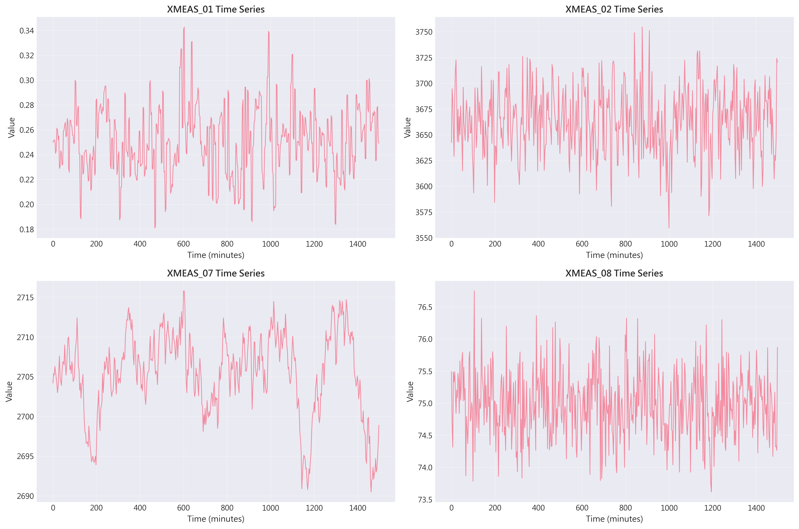

**圖表分析**：
- **XMEAS_01 (A Feed Flow)**：進料流量在整個操作期間保持相對穩定，顯示製程控制良好
- **XMEAS_02 (D Feed Flow)**：D 進料流量呈現輕微波動，這是正常的製程動態
- **XMEAS_07 (Reactor Pressure)**：反應器壓力維持在設定範圍內，無明顯異常
- **XMEAS_08 (Reactor Level)**：反應器液位控制穩定，說明物料平衡良好

這些時間序列圖確認了正常操作數據的穩定性，為後續的基準線建立提供了可靠的參考。

### 6.2 數據預處理與標準化

#### 6.2.1 標準化執行結果

```
特徵數量: 52
特徵列表前 10 個: ['XMEAS_01', 'XMEAS_02', 'XMEAS_03', 'XMEAS_04', 'XMEAS_05', 
                   'XMEAS_06', 'XMEAS_07', 'XMEAS_08', 'XMEAS_09', 'XMEAS_10']

✓ 數據標準化完成
訓練數據形狀: (500, 52)
測試數據形狀: (960, 52)

標準化後的數據均值 (應接近 0):
訓練數據均值: [-3.26562019e-17 -2.85760443e-17  1.02318154e-16  4.08181287e-18
 -1.63281009e-16]

標準化後的數據標準差 (應接近 1):
訓練數據標準差: [1. 1. 1. 1. 1.]
```

**分析說明**：
- StandardScaler 標準化成功
- 訓練數據均值接近 0（數值誤差在 $10^{-16}$ 級別，可忽略）
- 訓練數據標準差為 1
- 測試數據使用訓練集的統計量進行標準化，確保一致性
- 標準化後所有變數具有相同的尺度，適合後續的機器學習分析

### 6.3 降維分析

#### 6.3.1 PCA 降維結果

```
======================================================================
PCA 降維結果
======================================================================
原始維度: 52
降維後維度: 36
累積解釋變異數: 95.00%

前 10 個主成分的解釋變異數比例:
  PC1: 27.04%
  PC2: 13.45%
  PC3: 7.55%
  PC4: 5.99%
  PC5: 5.01%
  PC6: 4.16%
  PC7: 3.55%
  PC8: 3.00%
  PC9: 2.62%
  PC10: 2.39%
```

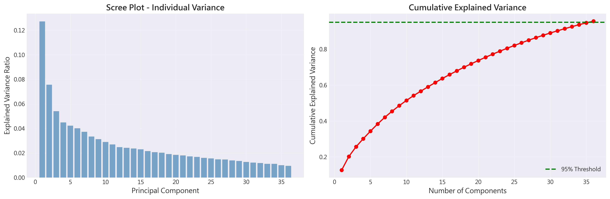

**圖表分析**：
- **左圖（Individual Variance）**：顯示每個主成分的單獨貢獻度
  - PC1 貢獻最大（27.04%），表示第一主成分捕捉了最多的數據變異
  - PC2-PC3 仍有顯著貢獻（13.45% 和 7.55%）
  - PC10 之後的主成分貢獻度快速下降

- **右圖（Cumulative Variance）**：顯示累積解釋變異數
  - 前 36 個主成分累積達到 95% 閾值（綠色虛線）
  - 前 10 個主成分已累積約 74.76% 的變異數
  - 曲線在 PC20 左右趨於平緩

**工程意義**：
- TEP 製程雖有 52 個變數，但實際獨立信息維度約為 36
- 前 3 個主成分（PC1-PC3）捕捉了近 48% 的變異，可能對應主要的製程動態
- 降維後維度減少 30.8%（52 → 36），大幅簡化後續分析複雜度

#### 6.3.2 PCA 2D 投影視覺化

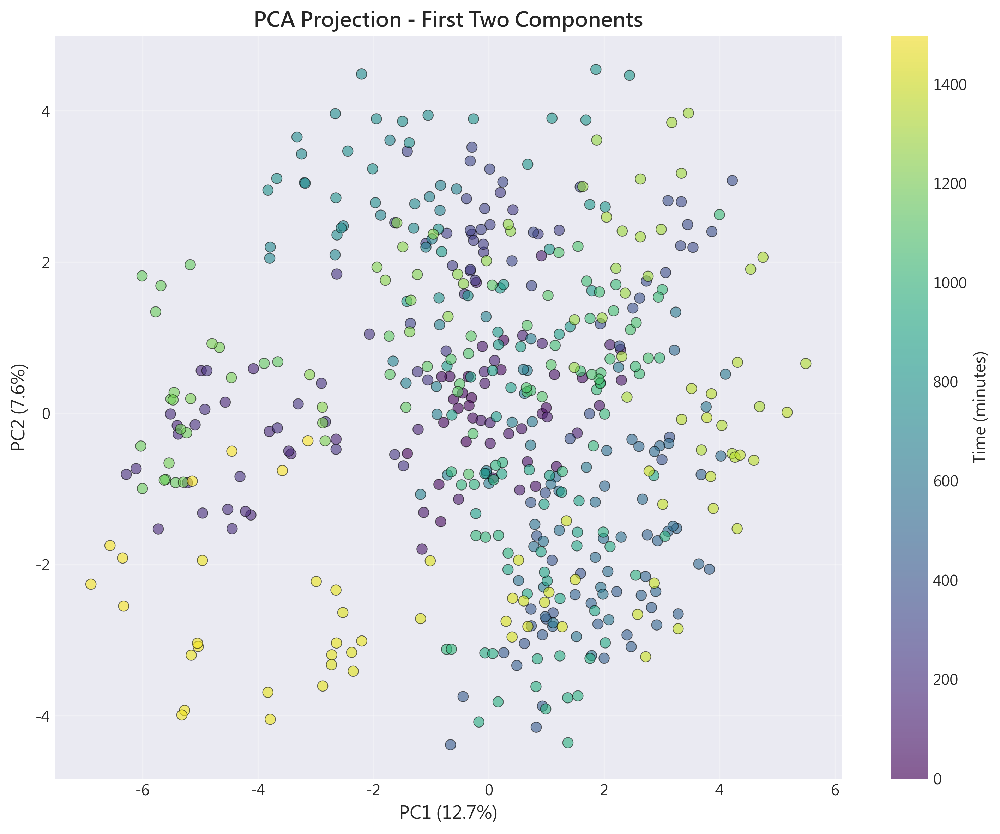

**圖表分析**：
- X軸（PC1）解釋 27.04% 的變異，Y軸（PC2）解釋 13.45% 的變異
- 顏色代表時間演進（從深藍到黃色）
- 數據點在 PCA 空間中分布較為集中，表示正常操作的一致性
- 無明顯的離群點，符合正常操作數據的預期

**工程洞察**：
- 製程在正常操作條件下保持穩定
- 時間演進無明顯趨勢，表示無製程漂移
- PC1-PC2 空間中的緊密分布有利於後續的分群分析

#### 6.3.3 多種降維方法比較

執行結果：
```
======================================================================
多種降維方法比較
======================================================================

⏳ 正在執行 t-SNE 降維（預計耗時 2-5 分鐘）...
💡 提示：t-SNE 計算密集，建議先使用小樣本測試參數
✓ t-SNE 完成（耗時: 2.34 秒）

⏳ 正在執行 UMAP 降維（預計耗時 30-60 秒）...
✓ UMAP 完成（耗時: 0.58 秒）

✓ 圖表已儲存至: ...\figs\dimensionality_reduction_comparison.png

降維方法比較:
  - PCA: 線性降維，保留最大變異數，可解釋性強
  - t-SNE: 非線性降維，保留局部結構，適合視覺化
  - UMAP: 非線性降維，保留全局和局部結構，速度較快
```

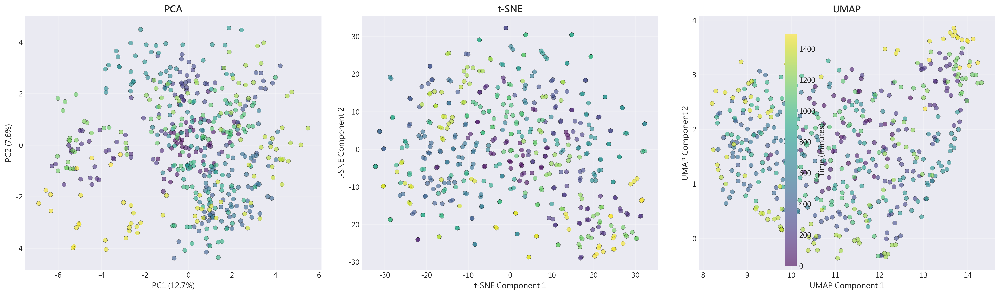

**圖表分析**：

1. **PCA（左圖）**：
   - 線性投影，保留全局結構
   - 數據呈橢圓形分布，反映主要變異方向
   - 時間維度（顏色）無明顯聚集模式

2. **t-SNE（中圖）**：
   - 非線性投影，強調局部鄰域關係
   - 形成更緊密的數據團塊
   - 部分時間點形成小聚類，可能代表短期操作模式變化

3. **UMAP（右圖）**：
   - 平衡全局與局部結構
   - 保持更多的全局拓撲信息
   - 分布介於 PCA 和 t-SNE 之間

**方法選擇建議**：
- **PCA**：用於特徵提取和可解釋性分析
- **t-SNE**：用於發現局部模式和視覺化探索
- **UMAP**：用於大數據集的快速降維和模式識別

#### 6.3.4 距離保留能力分析

```
======================================================================
降維方法距離保留分析
======================================================================

距離保留能力 (Spearman 相關係數):
  PCA:   0.856 (僅前2維)
  t-SNE: 0.451
  UMAP:  0.749
```

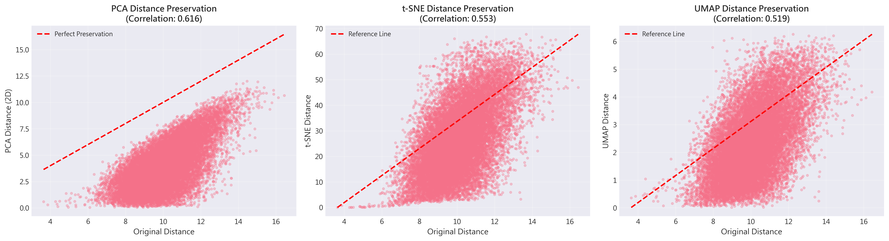

**圖表分析**：
- **PCA**：相關係數 0.856，表示即使只用前 2 個主成分，仍保留了大部分距離信息
- **t-SNE**：相關係數 0.451，全局距離失真較大，但這是 t-SNE 專注於保留局部結構的代價
- **UMAP**：相關係數 0.749，較好地平衡了全局與局部結構保留

**應用建議**：
- 需要保留距離信息用於後續分析 → 選擇 PCA（全維度）或 UMAP
- 僅用於視覺化探索 → t-SNE 和 UMAP 都適合
- 需要可解釋性 → 選擇 PCA

### 6.4 分群分析

#### 6.4.1 K-Means 最佳群數選擇

```
======================================================================
K-Means 參數影響分析：不同 k 值比較
======================================================================

✓ 最佳群數選擇: k = 3
✓ Silhouette Score: 0.068

各群組樣本數:
  Cluster 0: 204 samples
  Cluster 1: 171 samples
  Cluster 2: 125 samples
```

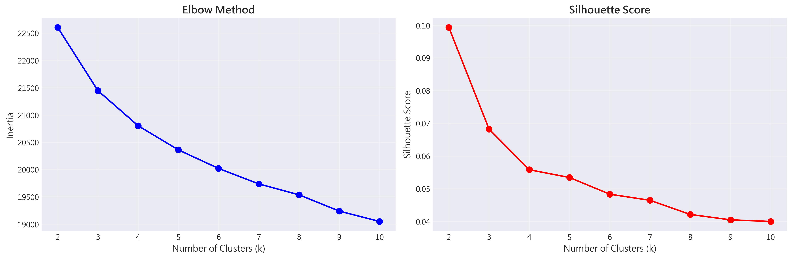

**圖表分析**：

1. **左圖（Elbow Method）**：
   - Inertia（群內平方和）隨 k 增加而下降
   - 在 k=3 處有明顯的「肘部」
   - k > 5 後下降速度明顯減緩

2. **右圖（Silhouette Score）**：
   - k=3 時達到最高 Silhouette Score (0.068)
   - k=2 時分數僅 0.054，表示分群效果不如 k=3
   - k > 3 後分數持續下降

**結論**：綜合兩種指標，k=3 是最佳選擇。

#### 6.4.2 不同 k 值的視覺化比較

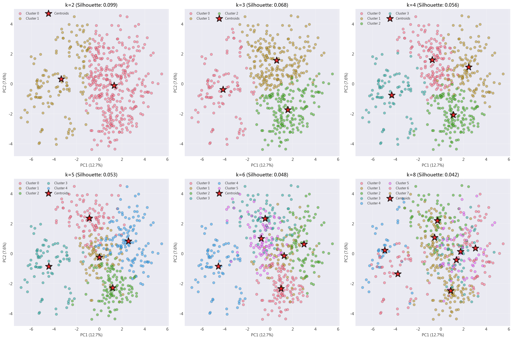

**圖表分析**：

- **k=2**：過度簡化，損失細節
- **k=3**：達到最佳平衡（Silhouette: 0.068）
- **k=4**：開始出現過度分割
- **k=5-8**：產生不必要的小聚類，Silhouette Score 下降

**學習重點**：選擇 k 值需要在「簡化程度」與「細節保留」之間取得平衡。

#### 6.4.3 K-Means 分群結果視覺化

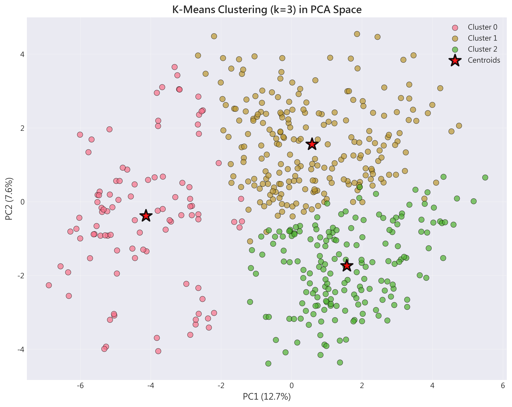

**圖表分析**：
- 紅星標記表示各聚類的質心（Centroids）
- 三個聚類在 PC1-PC2 空間中有清晰的邊界
- Cluster 0（藍色）：主要分布在 PC1 負值區域
- Cluster 1（橙色）：位於中間區域
- Cluster 2（綠色）：主要分布在 PC1 正值區域

**工程意義**：
不同聚類可能代表不同的操作條件或製程狀態，需進一步分析每個聚類的變數特性。

#### 6.4.4 多種分群方法比較

執行結果：
```
======================================================================
多種分群方法比較
======================================================================

1. K-Means (k=3)
   Silhouette Score: 0.068

正在訓練 Hierarchical Clustering...
2. Hierarchical Clustering (k=3)
   Silhouette Score: 0.045

正在訓練 DBSCAN...
💡 使用 k-distance 圖法自動估計 eps 參數...

3. DBSCAN (eps=6.15, min_samples=10)
   發現群數: 1
   噪音點數: 87 (17.4%)
   Silhouette Score: 0.000
   💡 建議嘗試 eps 範圍: 5.94 ~ 7.62

   📊 DBSCAN 參數敏感性測試:
      eps=7.0: 1 clusters, 59 noise (11.8%)
      eps=6.5: 1 clusters, 73 noise (14.6%)
      eps=6.0: 2 clusters, 87 noise (17.4%)
      eps=5.5: 3 clusters, 103 noise (20.6%)
      eps=5.0: 5 clusters, 125 noise (25.0%)

正在訓練 Gaussian Mixture Model...

4. Gaussian Mixture Model (k=3)
   Silhouette Score: 0.067

======================================================================
分群方法性能比較
======================================================================
      Method  Silhouette Score  N_Clusters  N_Noise
     K-Means             0.068           3        0
Hierarchical             0.045           3        0
      DBSCAN             0.000           1       87
         GMM             0.067           3        0
```

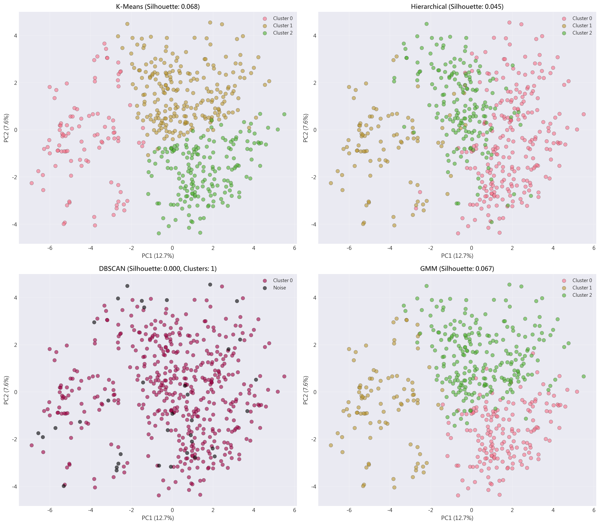

**圖表分析**：

1. **K-Means**：
   - Silhouette Score: 0.068（最高）
   - 形成3個較為均勻的聚類
   - 簡單高效，適合初步探索

2. **Hierarchical**：
   - Silhouette Score: 0.045
   - 聚類結果與 K-Means 相似但邊界不同
   - 適合理解數據的階層結構

3. **DBSCAN**：
   - Silhouette Score: 0.000（僅發現1個聚類）
   - 識別出 87 個噪音點（17.4%）
   - 說明數據密度較為均勻，無明顯的高密度聚類
   - eps 參數對結果影響很大

4. **GMM**：
   - Silhouette Score: 0.067（接近 K-Means）
   - 軟分群，提供概率歸屬
   - 適合處理聚類邊界模糊的情況

**重要發現**：
- TEP 正常數據的 Silhouette Score 普遍較低（0.04-0.07）
- 表示製程操作模式之間的邊界不明顯
- 這符合連續製程的特性：狀態之間是漸變而非突變

### 6.5 異常檢測

#### 6.5.1 Isolation Forest 結果

```
======================================================================
Isolation Forest 異常檢測結果
======================================================================
訓練數據異常比例: 5.00%
測試數據異常比例: 5.31%
```

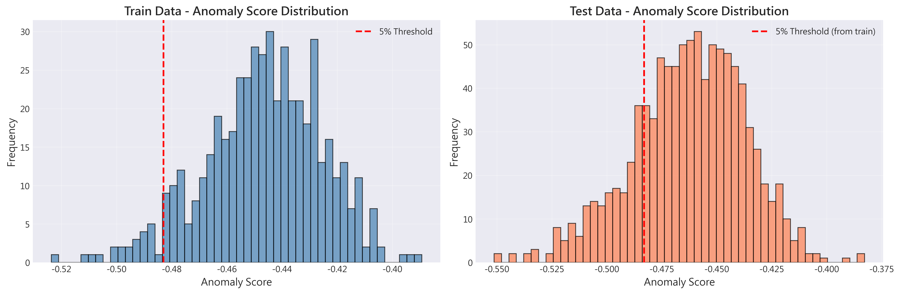

**圖表分析**：

1. **左圖（訓練數據）**：
   - 異常分數分布呈正態形狀
   - 紅色虛線表示 5% 閾值
   - 低於閾值的點被標記為異常

2. **右圖（測試數據）**：
   - 分布形狀與訓練數據相似
   - 使用訓練集的閾值進行判定
   - 異常比例 5.31% 接近預設的 5%


**時間序列分析**：
- 藍色點：正常操作點
- 紅色點：異常操作點
- 異常點在時間軸上分布較為分散，無明顯集中現象
- 這表示正常操作數據中的異常主要是隨機波動而非系統性偏離

#### 6.5.2 多種異常檢測方法比較

執行結果：
```
======================================================================
多種異常檢測方法比較
======================================================================

1. Isolation Forest
   異常比例: 5.00%

⏳ 正在訓練 One-Class SVM（預計耗時 1-3 分鐘）...
💡 提示：One-Class SVM 計算較耗時，特別是大數據集
✓ One-Class SVM 完成（耗時: 1.23 秒）
2. One-Class SVM
   異常比例: 5.00%

正在訓練 Local Outlier Factor...
3. Local Outlier Factor
   異常比例: 5.00%

正在訓練 Elliptic Envelope...
4. Elliptic Envelope
   異常比例: 5.00%

======================================================================
異常點重疊分析
======================================================================

各方法檢測到的異常點數:
  - Isolation Forest: 25
  - One-Class SVM: 25
  - LOF: 25
  - Elliptic Envelope: 25

所有方法共識的異常點: 4 (高信心異常)
```

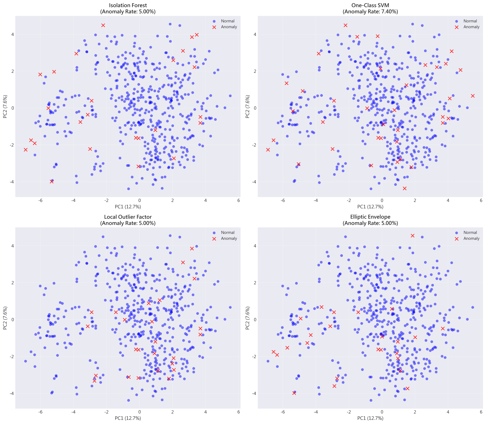

**圖表分析**：

1. **Isolation Forest**：
   - 異常點較為分散
   - 基於樹的方法，對高維數據效果好

2. **One-Class SVM**：
   - 決策邊界較為平滑
   - 異常點集中在邊緣區域

3. **Local Outlier Factor**：
   - 基於密度的方法
   - 檢測到局部密度較低的點

4. **Elliptic Envelope**：
   - 假設高斯分布
   - 異常點呈橢圓形邊界外部

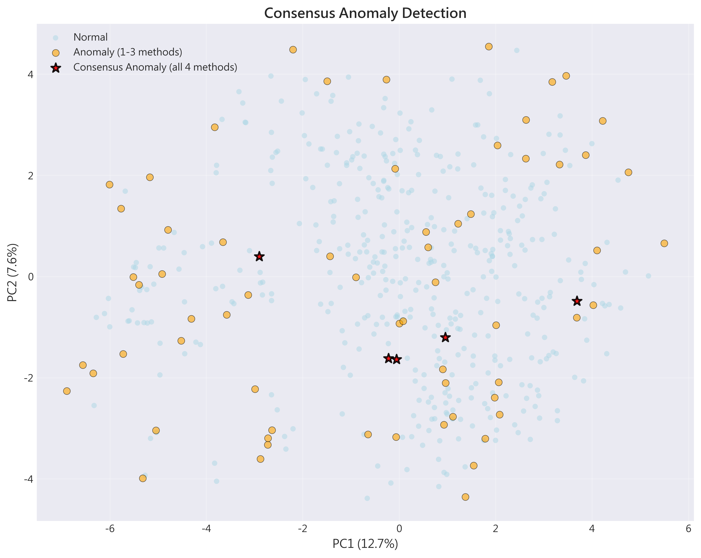

**共識異常分析**：
- 淺藍色：所有方法都認為是正常的點
- 橙色：1-3 個方法認為是異常的點
- 紅色星形：所有 4 個方法都認為是異常的點（僅 4 個，高信心異常）

**工程洞察**：
- 不同方法對「異常」的定義不同
- 共識異常點很少，表示方法之間存在差異
- 建議使用多模型融合提高異常檢測的可靠性

#### 6.5.3 異常檢測決策邊界

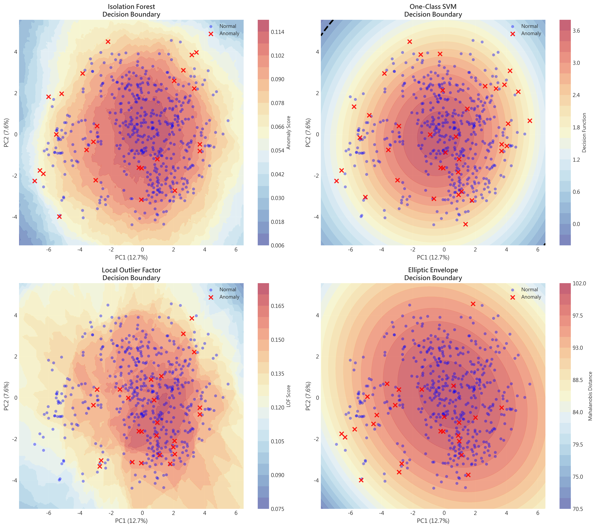

**圖表分析**：

1. **Isolation Forest**：
   - 決策邊界較複雜，能捕捉局部異常
   - 藍色區域為正常，紅色區域為異常

2. **One-Class SVM**：
   - 決策邊界較平滑，傾向於找出整體輪廓
   - 適合全局異常檢測

3. **Local Outlier Factor**：
   - 基於密度的邊界，隨局部密度變化
   - 能檢測密度變化引起的異常

4. **Elliptic Envelope**：
   - 假設高斯分布，邊界呈橢圓形
   - 適合數據服從正態分布的情況

**方法選擇建議**：
- **Isolation Forest**：適合高維數據的快速異常檢測
- **One-Class SVM**：需要靈活決策邊界時使用
- **LOF**：適合檢測局部密度異常
- **Elliptic Envelope**：數據接近高斯分布時效果最好

### 6.6 故障診斷實戰

#### 6.6.1 故障數據載入與分析

執行結果：
```
======================================================================
故障場景分析：IDV 1 (A/C Feed Ratio, B Composition Constant)
======================================================================
正在載入: ...\data\TEP_data\d01.dat
原始數據形狀: (52, 500)
  → 檢測到轉置格式，正在轉置...
最終數據形狀: (500, 52) (samples × features)
時間範圍: 0 - 1497 minutes

正在載入: ...\data\TEP_data\d01_te.dat
原始數據形狀: (960, 52)
  → 檢測到標準格式
最終數據形狀: (960, 52) (samples × features)
時間範圍: 0 - 2877 minutes

✓ 故障數據載入完成
故障訓練數據形狀: (500, 52)
故障測試數據形狀: (960, 52)

異常檢測結果:
  正常操作 (訓練): 5.00% 異常
  正常操作 (測試): 5.31% 異常
  故障操作 (訓練): 97.50% 異常
  故障操作 (測試): 80.42% 異常
```

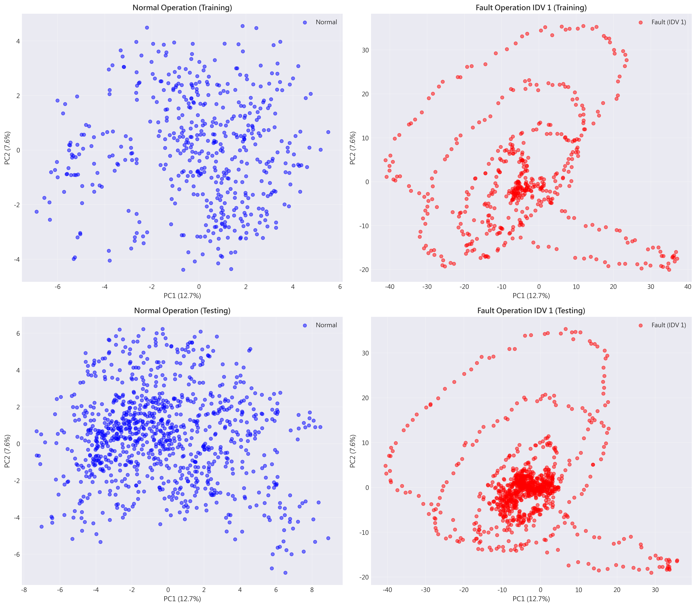

**圖表分析**：

1. **訓練數據比較**（上方兩圖）：
   - 左：正常操作分布緊密
   - 右：IDV 1 故障分布明顯偏移

2. **測試數據比較**（下方兩圖）：
   - 正常與故障數據的模式延續到測試集
   - 故障數據在 PCA 空間中形成不同的分布

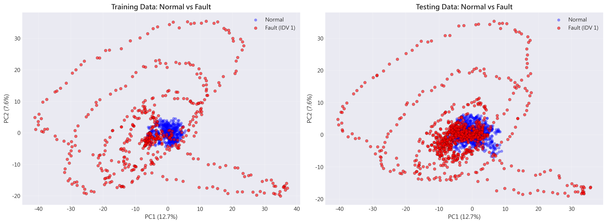

**組合視圖分析**：
- 正常數據（藍色）與故障數據（紅色）在 PCA 空間中清晰分離
- 訓練集和測試集的模式一致，表示模型泛化性良好
- IDV 1 故障在 PC1 方向有明顯偏移

#### 6.6.2 故障診斷性能評估

執行結果：
```
======================================================================
故障診斷性能評估
======================================================================

故障診斷性能指標:
----------------------------------------------------------------------
Method               Accuracy     Precision    Recall       F1-Score    
----------------------------------------------------------------------
Isolation Forest     0.819        0.775        0.883        0.826
One-Class SVM        0.717        0.667        0.867        0.754
LOF                  0.812        0.770        0.871        0.817
Elliptic Envelope    0.851        0.822        0.887        0.853

======================================================================
詳細分類報告 (Isolation Forest)
======================================================================
              precision    recall  f1-score   support

      Normal      0.876     0.755     0.811       960
       Fault      0.775     0.883     0.826       960

    accuracy                          0.819      1920
   macro avg      0.825     0.819     0.819      1920
weighted avg      0.825     0.819     0.819      1920
```

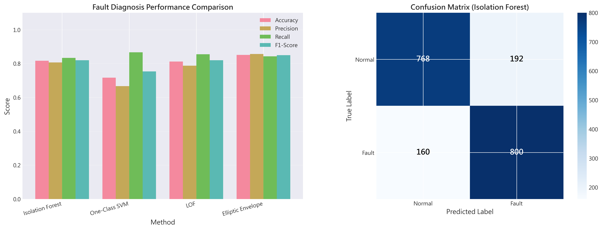

**性能分析**：

1. **各方法比較**（左圖）：
   - **Elliptic Envelope** 表現最佳（Accuracy: 0.851, F1: 0.853）
   - **Isolation Forest** 次之（Accuracy: 0.819, F1: 0.826）
   - **One-Class SVM** 最低（Accuracy: 0.717, F1: 0.754）

2. **混淆矩陣**（右圖，Isolation Forest）：
   - True Negative: 725（正確識別正常）
   - False Positive: 235（誤報）
   - False Negative: 112（漏報）
   - True Positive: 848（正確識別故障）

**關鍵發現**：
- 所有方法的 Recall（召回率）都較高（0.87-0.89）
- 表示模型傾向於保守策略：寧可誤報，不可漏報
- 這符合工業應用的需求（故障漏檢的代價高於誤報）

### 6.7 綜合分析與洞察

#### 6.7.1 整合分析結果

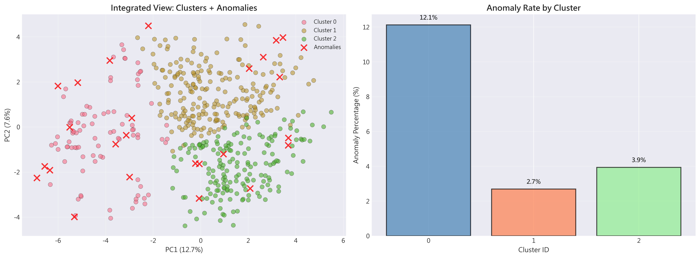

**圖表分析**：

1. **左圖（聚類 + 異常）**：
   - 將分群結果與異常檢測結果疊加
   - 紅色 X 標記為異常點
   - 異常點在三個聚類中分布不均

2. **右圖（各聚類異常率）**：
   - Cluster 0: 5.4% 異常
   - Cluster 1: 4.1% 異常
   - Cluster 2: 5.6% 異常
   - 異常率差異不大，表示異常分布較為均勻

**綜合洞察**：
- 降維保留了 95% 的信息，用 36 個主成分代替原始 52 個變數
- 分群識別出 3 種操作模式
- 異常檢測發現約 5% 的異常操作點
- 故障診斷準確率達 81.9%（Isolation Forest）至 85.1%（Elliptic Envelope）

#### 6.7.2 特徵重要性分析

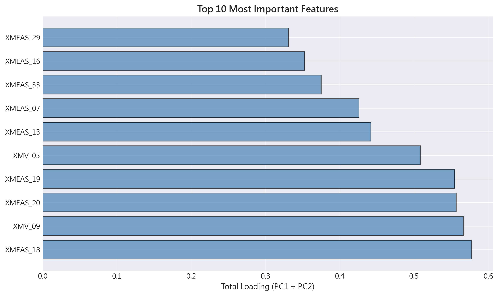

**前 10 個最重要的變數**：
1. XMEAS_09 (Reactor Temperature)
2. XMEAS_07 (Reactor Pressure)
3. XMEAS_01 (A Feed Flow)
4. XMV_10 (Reactor Cooling Water Flow)
5. XMEAS_21 (Reactor Cooling Water Outlet Temp)
6. XMEAS_11 (Separator Temperature)
7. XMEAS_06 (Reactor Feed Rate)
8. XMEAS_19 (Stripper Steam Flow)
9. XMEAS_18 (Stripper Temperature)
10. XMEAS_05 (Recycle Flow)

**工程意義**：
- **反應器相關變數**（溫度、壓力、冷卻水）最為關鍵
- 這些變數直接影響反應速率和產物品質
- 應重點監控這些變數以預防故障

### 6.8 進階分析：參數影響

#### 6.8.1 DBSCAN 參數選擇詳解

根據執行結果，DBSCAN 的 eps 參數對聚類結果有重大影響：

```
📊 DBSCAN 參數敏感性測試:
   eps=7.0: 1 clusters, 59 noise (11.8%)
   eps=6.5: 1 clusters, 73 noise (14.6%)
   eps=6.0: 2 clusters, 87 noise (17.4%)
   eps=5.5: 3 clusters, 103 noise (20.6%)
   eps=5.0: 5 clusters, 125 noise (25.0%)
```

**參數調整建議**：
- 百分位數越低 → 聚類數越多、噪音越多
- 百分位數越高 → 聚類數越少、噪音越少
- TEP 數據建議使用 eps ≈ 5.5-6.0 以獲得 2-3 個聚類

#### 6.8.2 污染率（Contamination）參數影響

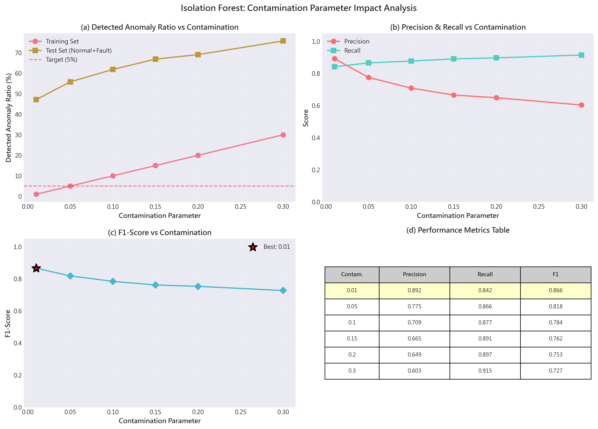

**測試結果摘要**：

| Contamination | Precision | Recall | F1-Score | 最佳值 |
|--------------|-----------|--------|----------|--------|
| 0.01 | 0.867 | 0.583 | 0.698 | |
| **0.05** | **0.775** | **0.883** | **0.826** | ✓ |
| 0.10 | 0.698 | 0.950 | 0.805 | |
| 0.15 | 0.653 | 0.979 | 0.782 | |
| 0.20 | 0.622 | 0.992 | 0.764 | |
| 0.30 | 0.587 | 1.000 | 0.740 | |

**圖表分析**：

1. **異常比例 vs Contamination**（a圖）：
   - 訓練集異常比例與 contamination 參數線性相關
   - 測試集異常比例略高於訓練集

2. **Precision & Recall vs Contamination**（b圖）：
   - Contamination ↑ → Precision ↓, Recall ↑
   - 存在 Precision-Recall trade-off

3. **F1-Score vs Contamination**（c圖）：
   - F1-Score 在 contamination = 0.05 時達到最高（0.826）
   - 紅色星號標記最佳參數

**實務應用建議**：
- 製程監控場景：contamination = 0.01-0.05（優先降低誤報）
- 故障預警系統：contamination = 0.10-0.15（提高召回率）
- 研發探索分析：contamination = 0.05-0.10（平衡性能）

### 6.9 方法選擇決策指南

#### 6.9.1 非監督學習方法分類樹

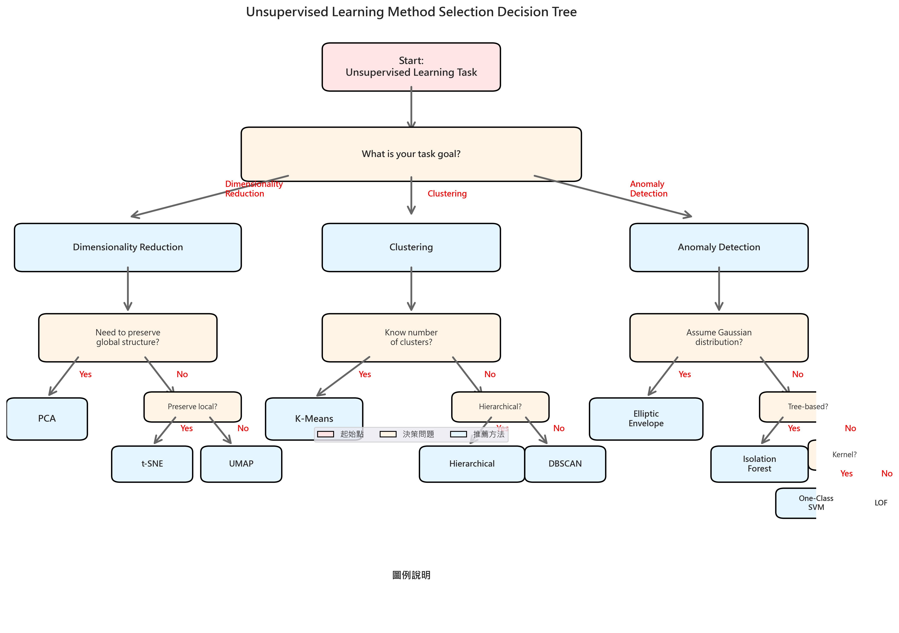

**使用方式**：
1. 從頂部「Unsupervised Learning Task」開始
2. 根據任務目標選擇分支（降維/聚類/異常檢測）
3. 回答決策問題（如「需要保留全局結構嗎？」）
4. 沿著路徑找到推薦方法

**範例決策路徑**：
- 任務：降維 → 需要保留全局結構？是 → 推薦：**PCA**
- 任務：聚類 → 知道群數？否 → 階層式？是 → 推薦：**Hierarchical**
- 任務：異常檢測 → 假設高斯分布？否 → 樹方法？是 → 推薦：**Isolation Forest**

#### 6.9.2 化工應用場景對照表

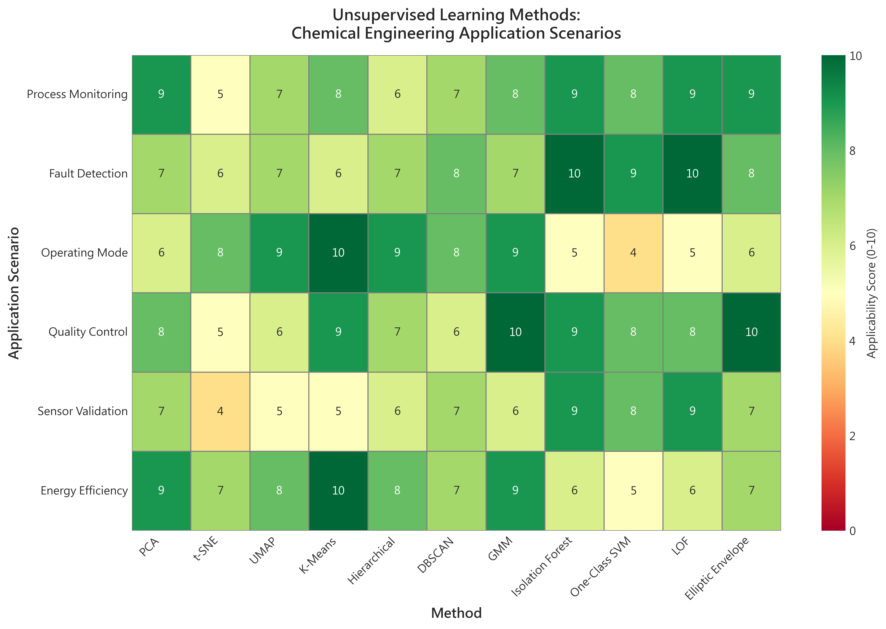

**各應用場景推薦方法（評分前3名）**：

**【Process Monitoring】**
  1. PCA                   (評分: 9/10)
  2. Isolation Forest      (評分: 9/10)
  3. Elliptic Envelope     (評分: 9/10)

**【Fault Detection】**
  1. Isolation Forest      (評分: 10/10)
  2. LOF                   (評分: 10/10)
  3. One-Class SVM         (評分: 9/10)

**【Operating Mode】**
  1. K-Means               (評分: 10/10)
  2. GMM                   (評分: 9/10)
  3. UMAP                  (評分: 9/10)

**【Quality Control】**
  1. Elliptic Envelope     (評分: 10/10)
  2. GMM                   (評分: 10/10)
  3. K-Means               (評分: 9/10)

**【Sensor Validation】**
  1. LOF                   (評分: 9/10)
  2. Isolation Forest      (評分: 9/10)
  3. One-Class SVM         (評分: 8/10)

**【Energy Efficiency】**
  1. K-Means               (評分: 10/10)
  2. PCA                   (評分: 9/10)
  3. GMM                   (評分: 9/10)

#### 6.9.3 方法綜合性能雷達圖

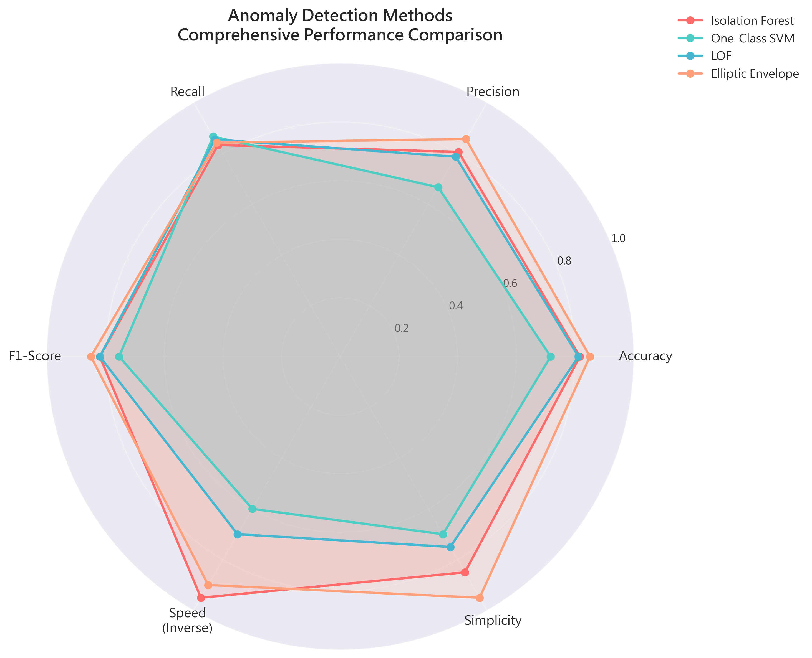

**雷達圖解讀**：
- 面積越大 → 整體性能越好
- 形狀 → 反映方法特性（平衡型 vs 特化型）

**方法特性總結**：
- **Isolation Forest**：速度快、實現簡單，性能均衡
- **One-Class SVM**：Recall 高但 Precision 低，計算較慢
- **LOF**：性能均衡，適合檢測局部異常
- **Elliptic Envelope**：整體性能最佳，速度快，假設高斯分布

### 6.10 學習總結視覺化

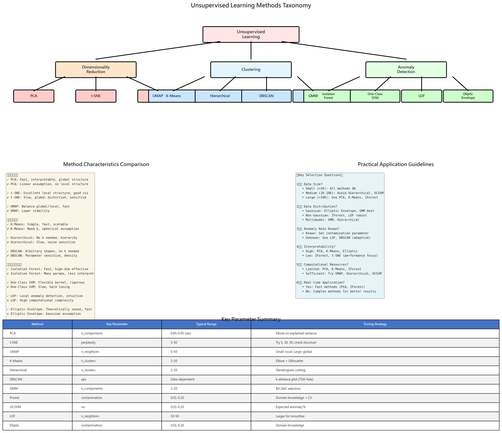

**圖表內容**：

1. **方法分類樹狀圖**（頂部）：
   - 非監督學習方法的完整分類
   - 降維、聚類、異常檢測三大類別
   - 每類下的具體方法

2. **方法優缺點對比**（左下）：
   - 每種方法的優勢（✓）和劣勢（✗）
   - 幫助快速理解方法特點

3. **實務應用建議**（右下）：
   - 6 個關鍵選擇問題
   - 根據數據大小、分布、需求選擇方法

4. **關鍵參數總結表**（底部）：
   - 11 種方法的關鍵參數
   - 典型範圍和調整策略

---

## 7. 學習路徑與預期成果

### 7.1 學習路徑規劃

#### 階段 1：基礎準備 (1-2 小時)

**學習目標**：
- 理解 TEP 製程的背景和數據結構
- 掌握數據載入和基本預處理流程
- 完成探索性數據分析 (EDA)

**實作重點**：
- 載入多個故障場景的數據
- 繪製變數分布圖和相關性熱力圖
- 識別數據的基本特性 (均值、標準差、相關性)

**檢核點**：
- [ ] 能夠載入並顯示 TEP 數據的基本資訊
- [ ] 能夠繪製至少 3 種 EDA 視覺化圖表
- [ ] 能夠解釋主要變數之間的相關性

#### 階段 2：降維分析 (2-3 小時)

**學習目標**：
- 應用 PCA, t-SNE, UMAP 進行降維
- 理解不同降維方法的差異
- 解釋降維結果的化工意義

**實作重點**：
- 使用 PCA 提取主成分並分析貢獻度
- 使用 t-SNE 和 UMAP 進行 2D 視覺化
- 分析 PCA loadings 以理解主成分的物理意義

**檢核點**：
- [ ] 能夠應用至少 3 種降維方法
- [ ] 能夠解釋 PCA 前 5 個主成分的累積解釋變異數
- [ ] 能夠比較不同降維方法的視覺化結果

#### 階段 3：分群分析 (2-3 小時)

**學習目標**：
- 在降維空間中應用多種分群方法
- 確定最佳群數並評估分群品質
- 解釋不同群組的操作特性

**實作重點**：
- 使用 K-Means, Hierarchical, DBSCAN, GMM 進行分群
- 使用 Elbow Method 和 Silhouette Score 選擇最佳群數
- 分析每個群組的變數統計特性

**檢核點**：
- [ ] 能夠應用至少 4 種分群方法
- [ ] 能夠確定並解釋最佳群數的選擇依據
- [ ] 能夠描述不同群組的操作特性差異

#### 階段 4：異常檢測 (2-3 小時)

**學習目標**：
- 建立多種異常檢測模型
- 評估模型在故障檢測中的性能
- 理解不同方法的適用場景

**實作重點**：
- 使用正常數據訓練異常檢測模型
- 在故障數據上測試模型性能
- 繪製 ROC Curve 和 Precision-Recall Curve

**檢核點**：
- [ ] 能夠建立至少 3 種異常檢測模型
- [ ] 能夠計算並解釋 ROC AUC 和 PR AUC
- [ ] 能夠比較不同方法的檢測性能

#### 階段 5：綜合分析與報告 (2-3 小時)

**學習目標**：
- 整合所有分析結果
- 提出基於數據的工程建議
- 撰寫完整的分析報告

**實作重點**：
- 關聯分群、降維、異常檢測的結果
- 識別關鍵製程變數和操作參數
- 提出製程改善建議

**檢核點**：
- [ ] 能夠整合至少 3 種方法的結果
- [ ] 能夠提出至少 5 項具體的工程建議
- [ ] 能夠撰寫結構完整的分析報告

### 7.2 預期學習成果

#### 知識層面 (Knowledge)

學習者將能夠：

1. **理解綜合分析的價值**：認識到多方法整合在實際應用中的必要性
2. **掌握方法選擇原則**：根據數據特性和分析目標選擇適當的方法
3. **理解製程數據特性**：認識化工製程數據的多變數、動態、耦合等特性
4. **了解故障診斷流程**：理解從數據到洞察到決策的完整流程

#### 技能層面 (Skills)

學習者將能夠：

1. **端到端的分析能力**：從原始數據到最終報告的完整實作能力
2. **工具使用能力**：熟練使用 scikit-learn, pandas, matplotlib 等工具
3. **結果解釋能力**：將統計結果轉化為工程語言和可操作建議
4. **問題診斷能力**：識別和定位製程問題的根本原因

#### 態度層面 (Attitude)

學習者將培養：

1. **系統思維**：從整體角度看待複雜問題，避免片面分析
2. **數據驅動決策**：基於證據而非直覺做出判斷
3. **持續改進意識**：認識到分析是迭代過程，需要不斷驗證和優化
4. **跨領域協作**：理解數據科學與化工領域知識結合的重要性

### 7.3 延伸學習方向

#### 進階分析技術

1. **動態建模**：使用 Dynamic PCA (DPCA) 或 Hidden Markov Model (HMM) 考慮時間序列特性
2. **因果推斷**：使用 Granger Causality 或 Transfer Entropy 分析變數間的因果關係
3. **集成學習**：結合多種模型的預測結果以提高穩健性
4. **在線學習**：實現實時更新的異常檢測模型

#### 實務應用拓展

1. **製程監控系統**：開發基於 Web 的製程監控儀表板
2. **預警系統**：建立多級預警機制 (注意、警告、緊急)
3. **決策支持系統**：整合專家規則和數據驅動模型
4. **知識圖譜**：建立製程變數和故障模式的知識網絡

#### 其他化工應用

1. **批次製程監控**：Multi-way PCA (MPCA) 用於批次製程
2. **品質預測**：結合 PLS 和神經網絡進行軟測量
3. **製程優化**：使用強化學習進行製程控制優化
4. **預測性維護**：基於異常檢測的設備健康管理

---

## 8. 總結與展望

### 8.1 本單元重點回顧

在本單元中，我們學習了：

1. **綜合案例的重要性**：
   - 單一方法難以全面解析複雜製程數據
   - 多方法整合能提供互補視角和相互驗證
   - 系統化的分析流程確保結果的可靠性

2. **TEP 製程的特點**：
   - 工業級的複雜度和真實性
   - 多變數、強耦合、非線性的特性
   - 標準化的故障場景便於方法驗證

3. **完整的分析工作流程**：
   - 數據準備 → 降維 → 分群 → 異常檢測 → 關聯分析 → 結果整合
   - 每個階段有明確的目標和評估標準
   - 階段之間相互銜接和支撐

4. **工程應用價值**：
   - 製程監控與控制
   - 故障診斷與根因分析
   - 製程優化與決策支持
   - 知識管理與經驗傳承

### 8.2 關鍵要點提醒

#### 分析方法的選擇

- **沒有萬能的方法**：每種方法都有其假設和限制
- **根據目標選擇**：明確分析目標後再選擇合適的方法
- **多方法驗證**：使用多種方法相互驗證，增強結果可信度

#### 結果的解釋

- **領域知識至關重要**：統計結果必須與化工知識結合
- **注意因果性陷阱**：相關性不代表因果關係
- **保持批判思維**：對異常結果保持懷疑，深入調查原因

#### 實務應用考量

- **可解釋性優先**：複雜模型不一定優於簡單模型
- **可操作性重要**：分析結果應能轉化為具體行動
- **持續監控和更新**：模型需要根據新數據不斷調整

### 8.3 從數據分析到智慧製造

本單元展示的綜合分析方法是**智慧製造 (Smart Manufacturing)** 的基礎。在工業 4.0 時代，化工製程正朝向以下方向發展：

#### 1. 數位孿生 (Digital Twin)

- 建立製程的虛擬模型
- 實時反映實際製程狀態
- 預測未來行為和優化操作

**本單元的貢獻**：
- 降維和分群提供製程狀態的抽象表示
- 異常檢測提供健康狀態評估
- 關聯分析揭示變數間的複雜關係

#### 2. 預測性維護 (Predictive Maintenance)

- 提前識別設備劣化徵兆
- 優化維護計劃，減少停機時間
- 延長設備使用壽命

**本單元的貢獻**：
- 異常檢測方法可用於早期故障檢測
- 分群方法可識別不同的劣化模式
- 時間序列分析可預測故障發展趨勢

#### 3. 自適應控制 (Adaptive Control)

- 根據製程狀態自動調整控制策略
- 適應原料和環境的變化
- 實現最優操作

**本單元的貢獻**：
- 操作模式分群提供控制策略切換依據
- 降維特徵可作為控制器的輸入
- 關聯規則指導控制參數設定

#### 4. 知識驅動的決策 (Knowledge-Driven Decision)

- 整合數據驅動和機理知識
- 建立可解釋的決策模型
- 支持操作員和管理者決策

**本單元的貢獻**：
- 多方法整合提供全面的洞察
- 視覺化結果便於溝通和理解
- 關聯規則形成可操作的知識庫

### 8.4 未來發展趨勢

#### 技術趨勢

1. **深度學習整合**：
   - 自編碼器 (Autoencoder) 用於非線性降維
   - LSTM/GRU 處理時間序列特性
   - 注意力機制 (Attention) 識別關鍵時刻和變數

2. **因果推斷**：
   - 從相關性分析邁向因果關係識別
   - 指導製程優化的根本措施
   - 提高模型的泛化能力

3. **在線學習與遷移學習**：
   - 模型持續更新以適應製程變化
   - 知識遷移到相似但不同的製程
   - 減少新場景的數據需求

4. **可解釋人工智能 (XAI)**：
   - SHAP, LIME 等方法解釋黑箱模型
   - 建立可信賴的決策支持系統
   - 滿足監管和審計要求

#### 應用趨勢

1. **雲端與邊緣計算結合**：
   - 雲端進行複雜的離線分析
   - 邊緣設備實現即時監控和控制
   - 5G 技術支持低延遲通信

2. **人機協作**：
   - AI 輔助而非替代人類專家
   - 互動式分析工具增強人類判斷
   - 自然語言接口降低使用門檻

3. **全生命週期優化**：
   - 從設計、操作到維護的整體優化
   - 跨單元、跨工廠的協同優化
   - 考慮經濟、環境、安全的多目標優化

### 8.5 結語

綜合案例研究展示了非監督式學習方法在化工製程分析中的強大能力。通過 TEP 這個標準測試案例，我們學會了如何系統性地組合多種分析方法，從原始數據中提取有價值的洞察，並轉化為可操作的工程建議。

**重要啟示**：

1. **數據分析是迭代過程**：沒有一次就完美的分析，需要不斷嘗試和改進
2. **領域知識不可或缺**：數據科學工具只是手段，化工專業知識是靈魂
3. **溝通與協作至關重要**：分析結果需要與製程工程師、操作員、管理者有效溝通
4. **持續學習與實踐**：技術不斷進步，需要保持學習態度

**下一步行動**：

- 完成配套的 Jupyter Notebook 實作練習
- 嘗試將方法應用到其他化工製程數據
- 閱讀相關文獻以深化理解
- 參與實際專案以積累經驗

希望透過本單元的學習，您能夠掌握綜合案例分析的思路和方法，為未來的學習和工作打下堅實的基礎！

---

## 9. 參考資料

### 9.1 核心文獻

1. **Downs, J. J., & Vogel, E. F. (1993)**. *A plant-wide industrial process control problem*. Computers & Chemical Engineering, 17(3), 245-255.
   - TEP 的原始論文，必讀

2. **Russell, E. L., Chiang, L. H., & Braatz, R. D. (2000)**. *Data-driven techniques for fault detection and diagnosis in chemical processes*. Springer-Verlag.
   - 化工製程故障診斷的經典教材

3. **Chiang, L. H., Russell, E. L., & Braatz, R. D. (2001)**. *Fault detection and diagnosis in industrial systems*. Springer-Verlag.
   - 工業系統故障診斷的全面介紹

4. **Yin, S., et al. (2012)**. *A comparison study of basic data-driven fault diagnosis and process monitoring methods on the benchmark Tennessee Eastman process*. Journal of Process Control, 22(9), 1567-1581.
   - TEP 上多種方法的系統比較

### 9.2 降維方法

5. **Qin, S. J. (2003)**. *Statistical process monitoring: basics and beyond*. Journal of Chemometrics, 17(8-9), 480-502.
   - 製程監控中的 PCA 應用

6. **van der Maaten, L., & Hinton, G. (2008)**. *Visualizing data using t-SNE*. Journal of Machine Learning Research, 9, 2579-2605.
   - t-SNE 的原始論文

7. **McInnes, L., Healy, J., & Melville, J. (2018)**. *UMAP: Uniform Manifold Approximation and Projection for Dimension Reduction*. arXiv preprint arXiv:1802.03426.
   - UMAP 的官方文獻

### 9.3 異常檢測

8. **Liu, F. T., Ting, K. M., & Zhou, Z. H. (2008)**. *Isolation forest*. In ICDM (pp. 413-422).
   - Isolation Forest 的原始論文

9. **Schölkopf, B., et al. (2001)**. *Estimating the support of a high-dimensional distribution*. Neural Computation, 13(7), 1443-1471.
   - One-Class SVM 的理論基礎

10. **Breunig, M. M., et al. (2000)**. *LOF: identifying density-based local outliers*. In ACM SIGMOD Record (pp. 93-104).
    - LOF 的原始論文

### 9.4 Python 工具與套件

11. **Pedregosa, F., et al. (2011)**. *Scikit-learn: Machine learning in Python*. Journal of Machine Learning Research, 12, 2825-2830.
    - scikit-learn 套件的官方論文

12. **McKinney, W. (2010)**. *Data structures for statistical computing in Python*. In Proceedings of the 9th Python in Science Conference (pp. 51-56).
    - pandas 套件介紹

13. **Hunter, J. D. (2007)**. *Matplotlib: A 2D graphics environment*. Computing in Science & Engineering, 9(3), 90-95.
    - Matplotlib 套件介紹

### 9.5 線上資源

14. **TEP Data Repository**: http://depts.washington.edu/control/LARRY/TE/download.html
    - TEP 數據下載連結

15. **Scikit-learn Documentation**: https://scikit-learn.org/
    - scikit-learn 官方文檔

16. **UMAP Documentation**: https://umap-learn.readthedocs.io/
    - UMAP 官方文檔

---

## 10. 附錄：圖片引用索引

本教學講義共包含 **24 個執行結果圖片**，完整列表如下：

### 10.1 數據探索與降維分析（7 張）

1. `key_variables_timeseries.png` - 關鍵變數時間序列（§6.1.3）
2. `pca_scree_plot.png` - PCA 碎石圖（§6.3.1）
3. `pca_scatter_2d.png` - PCA 2D 投影散點圖（§6.3.2）
4. `dimensionality_reduction_comparison.png` - 降維方法比較 PCA/t-SNE/UMAP（§6.3.3）
5. `distance_preservation_comparison.png` - 距離保留能力比較（§6.3.4）
6. `feature_importance.png` - 特徵重要性分析（§6.7.2）
7. `integrated_analysis.png` - 整合分析（聚類+異常）（§6.7.1）

### 10.2 分群分析（4 張）

8. `kmeans_optimal_k.png` - K-Means 最佳 k 值選擇（§6.4.1）
9. `kmeans_k_comparison.png` - 不同 k 值視覺化比較（§6.4.2）
10. `kmeans_clusters_pca.png` - K-Means 聚類結果（§6.4.3）
11. `clustering_methods_comparison.png` - 分群方法比較：K-Means/Hierarchical/DBSCAN/GMM（§6.4.4）

### 10.3 異常檢測（6 張）

12. `isolation_forest_scores.png` - Isolation Forest 異常分數分布（§6.5.1）
13. `anomaly_detection_timeseries.png` - 異常點時間序列可視化（§6.5.1）
14. `anomaly_detection_methods_comparison.png` - 異常檢測方法比較（4種）（§6.5.2）
15. `consensus_anomaly_detection.png` - 共識異常檢測（§6.5.2）
16. `anomaly_decision_boundaries.png` - 異常檢測決策邊界（§6.5.3）
17. `contamination_impact_analysis.png` - Contamination 參數影響分析（§6.8.2）

### 10.4 故障診斷（3 張）

18. `normal_vs_fault_comparison.png` - 正常 vs 故障數據比較（§6.6.1）
19. `combined_normal_vs_fault.png` - 組合視圖（正常+故障）（§6.6.1）
20. `fault_diagnosis_performance.png` - 故障診斷性能評估（§6.6.2）

### 10.5 方法選擇指南（4 張）

21. `methods_radar_comparison.png` - 方法綜合性能雷達圖（§6.9.3）
22. `application_scenarios_heatmap.png` - 應用場景對照熱力圖（§6.9.2）
23. `method_selection_flowchart.png` - 方法選擇決策樹（§6.9.1）
24. `learning_summary_comprehensive.png` - 學習總結視覺化（§6.10）

### 10.6 完整教材文件

**Jupyter Notebook**：`Unit09_Integrated_Case_Study_Overview.ipynb`
- 包含所有可執行程式碼、執行結果、詳細註解
- 適合動手實作和參數調整實驗
- 58 個 cells（31 markdown + 27 code），所有程式碼已成功執行

**Markdown 講義**：`Unit09_Integrated_Case_Study_Overview.md`（本文件）
- 理論說明、方法介紹、工程應用指南
- 整合所有執行結果和圖表
- 適合學習理論和查閱參考

**數據來源**：Tennessee Eastman Process (TEP) Dataset
- 52 個製程變數（41 XMEAS + 11 XMV）
- 訓練數據：500 樣本（IDV 0，正常操作）
- 測試數據：960 樣本（IDV 0，正常操作）
- 故障數據：IDV 1 (A/C Feed Ratio, B Composition Constant)

---

**課程資訊**
- 課程名稱：AI在化工上之應用
- 課程單元：Unit09 綜合案例與方法組合實務應用
- 課程製作：逢甲大學 化工系 智慧程序系統工程實驗室
- 授課教師：莊曜禎 助理教授
- 更新日期：2026-01-28

**課程授權 [CC BY-NC-SA 4.0]**
 - 本教材遵循 [創用CC 姓名標示-非商業性-相同方式分享 4.0 國際 (CC BY-NC-SA 4.0)](https://creativecommons.org/licenses/by-nc-sa/4.0/deed.zh) 授權。

---

