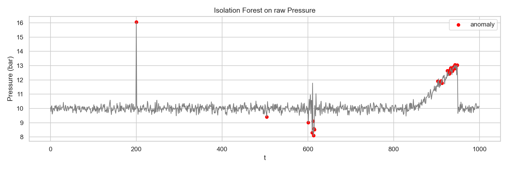
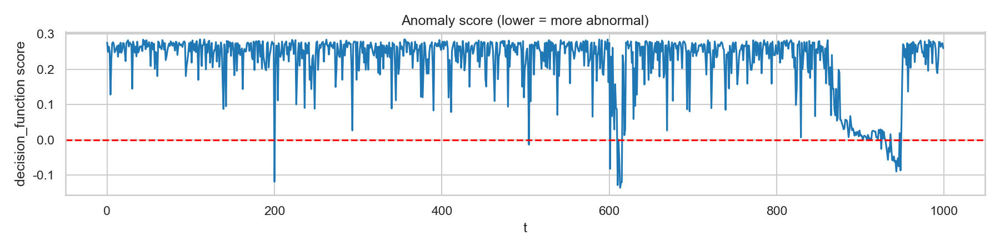
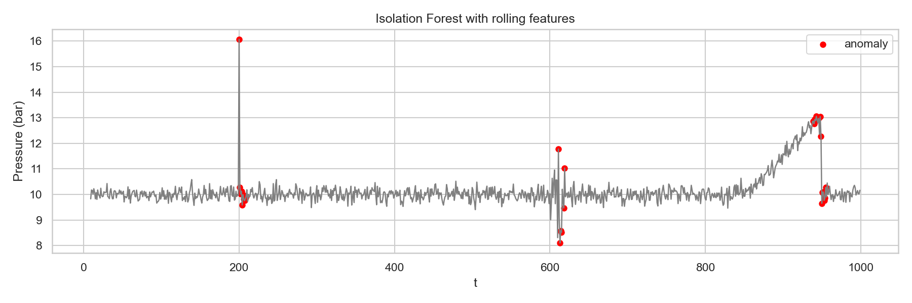
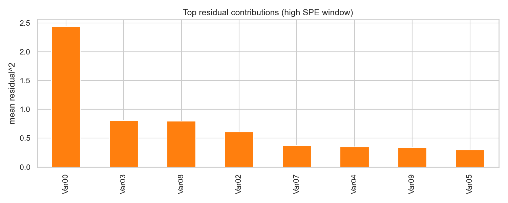
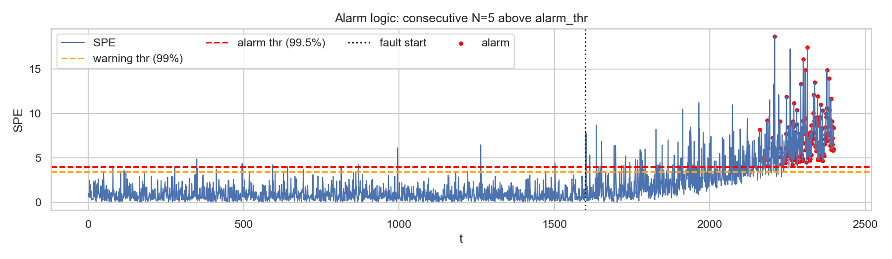
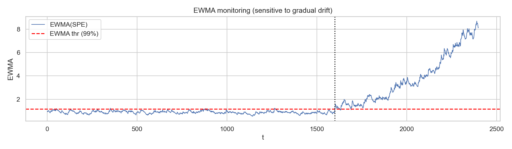
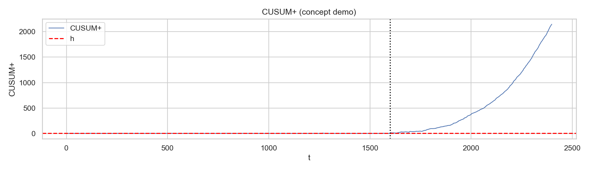
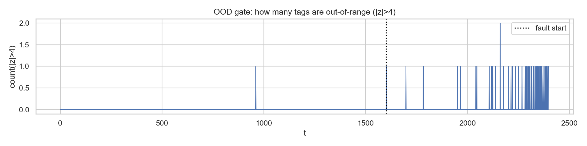

# Unit09｜製程安全與異常偵測：Isolation Forest + PCA/MSPC（$T^2$ / SPE）

**課程名稱**：化工資料科學與機器學習實務（CHE-AI-101）  
**Part 2 導讀**：在工廠裡，「標記故障」通常很貴、很慢、甚至根本沒有。因此本單元以 **非監督式異常偵測 + 降維監控** 為主軸：先偵測「不對勁」，再逐步逼近「可能原因」。

---

## 0. 你要交付什麼？

在安全場域，交付不是「模型分數」，而是：

1. **監控策略**：監控哪些 tag？監控頻率？用哪段正常資料建立基準？
2. **告警規則**：門檻怎麼定？（百分位、rolling 指標、分級告警）
3. **處置流程（SOP）**：告警→確認→降級→取樣→回復/重訓
4. **可追溯性**：模型版本、基準資料版本、變更管理（銜接 Unit08 的部署觀念）

---

## 1. 製程安全監控的演進：從單變數警報到多變數關聯

### 1.1 傳統方法的局限

在傳統化工廠中，安全監控主要依賴 **DCS (Distributed Control System)** 設定的高低警報 (High/Low Alarms)。

**單變數閾值的問題**：
- **例子**：設定 `P > 15 bar` 觸發警報。但如果壓力在 14 bar 但溫度異常低，傳統系統可能無法察覺這種違反物理關聯的異常
- **反應滯後**：通常等到數值真正超標時才響警報，此時往往已造成設備損壞或次級品產出
- **無法偵測動態異常**：對於「數值在正常範圍內，但波動劇烈」的情況（如控制迴路不穩），傳統警報無法偵測

### 1.2 AI 異常偵測的優勢

機器學習模型可以學習數據的 **分佈 (Distribution)** 與 **關聯性 (Correlation)**：
- **非監督式學習 (Unsupervised Learning)**：工廠中 99.9% 的數據都是正常的，標記異常數據非常困難且昂貴。因此，我們教 AI 「正常長什麼樣子」，凡是長得不一樣的，就是異常

### 1.3 核心概念：監督式 vs. 非監督式學習

在製程安全監控中，我們通常會混合使用這兩種方法：

| 特性 | 非監督式學習 (Unsupervised) | 監督式學習 (Supervised) |
| :--- | :--- | :--- |
| **數據需求** | 只需要「正常」數據 (容易取得) | 需要「正常」+「標記好的故障」數據 (取得成本高) |
| **學習目標** | **異常偵測 (Detection)**：判斷「是否正常」 | **故障診斷 (Diagnosis)**：判斷「是哪一種故障」 |
| **核心邏輯** | 尋找與正常數據「不同」的點 (Outliers) | 尋找不同故障類別間的「分界線」 (Decision Boundary) |
| **適用場景** | 未知故障、早期預警、數據標記不足時 | 已知故障類型識別、根因分析、精確分類 |
| **代表演算法** | Isolation Forest, PCA (MSPC), Autoencoder | Random Forest, XGBoost, SVM, Neural Networks |

**實務策略**：
1. 先用 **非監督式模型 (如 Isolation Forest)** 進行全廠掃描，偵測是否有異常發生
2. 一旦偵測到異常，再用 **監督式模型 (如 Random Forest)** 分析該異常屬於哪一種已知故障，以提供操作建議

---

## 2. Isolation Forest：把「少數且疏離」的點隔離出來

### 2.1 核心概念

**「異常點通常是少數 (Few) 且疏離 (Different) 的。」**

如果我們隨機切割數據空間：
- **正常點**：通常聚集成一團，需要切很多刀才能將其獨立出來（路徑長）
- **異常點**：通常散落在邊緣，只需要切幾刀就能將其孤立（路徑短）

### 2.2 數學定義

假設有一棵隔離樹 (iTree)，數據點 $x$ 的路徑長度為 $h(x)$。
對於包含 $n$ 個樣本的數據集，異常分數 $s(x, n)$ 定義為：

$$ s(x, n) = 2^{- \frac{E(h(x))}{c(n)}} $$

其中：
- $E(h(x))$ ：數據點 $x$ 在所有樹中的平均路徑長度
- $c(n)$ ：給定 $n$ 個樣本構建二元搜尋樹 (BST) 的平均路徑長度，用於將路徑長度正規化

$$ c(n) = 2H(n-1) - \frac{2(n-1)}{n} $$

其中 $H(i)$ 為第 $i$ 個調和數，可近似為 $\ln(i) + \gamma$ ( $\gamma \approx 0.5772$ 為歐拉常數)

**分數判讀**：
- 當 $E(h(x)) \to 0$ (路徑極短)，$s \to 1$ $\Rightarrow$ **強烈異常**
- 當 $E(h(x)) \to n-1$ (路徑極長)，$s \to 0$ $\Rightarrow$ **非常正常**
- 當 $E(h(x)) \to c(n)$， $s \to 0.5$ $\Rightarrow$ 無法區分

> **Scikit-learn 實作註記**：
> `decision_function` 回傳的值經過調整，**負值代表異常，正值代表正常**

### 2.3 演算法流程 (Algorithm Workflow)

**訓練階段 (Training Phase)**：
1. 從訓練數據集 $D$ 中隨機抽取 $\psi$ 個樣本（通常 $\psi = 256$ ），作為子樣本
2. 隨機選擇一個特徵 $q$
3. 在該特徵的最大值與最小值之間隨機選擇一個分割點 $p$
4. 根據 $x_q < p$ 將數據分為兩個子集，遞迴建立左右子樹
5. 重複步驟 2-4，直到達到終止條件：
   - 節點中只剩一個樣本，或
   - 所有樣本值相同，或
   - 達到預設的最大深度 $l = \lceil \log_2 \psi \rceil$
6. 重複步驟 1-5，建立 $t$ 棵樹（通常 $t = 100$），形成隔離森林

**預測階段 (Prediction Phase)**：
1. 對於新樣本 $x$ ，計算其在每棵樹中的路徑長度 $h(x)$
2. 計算平均路徑長度 $E(h(x))$
3. 根據異常分數公式計算 $s(x, n)$

**關鍵參數調校 (Hyperparameter Tuning)**：
- **`n_estimators`**：樹的數量。過少會導致結果不穩定；過多會增加計算成本但效果提升有限。建議範圍：100-300
- **`max_samples`**：子樣本大小 $\psi$ 。原始論文建議 256，但對於大數據集可適當增加
- **`contamination`**：預期異常比例。這是最關鍵的參數，需要根據領域知識設定。化工製程中通常設為 0.01-0.05

### 2.4 工程實務：如何設定 contamination

在 scikit-learn 中：
- `decision_function` 越小越異常（常以 0 當預設分界線）
- `contamination` 影響你預期的異常比例（工程上要保守設定）

**建議策略**：
- 初期探索：設為 0.05（保守）
- 有歷史數據：用過去已知異常比例設定
- 多次迭代：觀察 decision_function 分佈後微調

### 2.5 計算複雜度分析

Isolation Forest 的主要優勢之一就是計算效率高：

**訓練階段時間複雜度**：
$$ O(t \cdot \psi \cdot \log \psi) $$

其中：
- $t$：樹的數量（通常 100-300）
- $\psi$：每棵樹的子樣本大小（通常 256）

**預測階段時間複雜度**：
$$ O(t \cdot \log \psi) $$

**對比其他方法**：
- **LOF (Local Outlier Factor)**：$O(n^2)$ （計算 k-nearest neighbors）
- **DBSCAN**：$O(n \log n)$ 至 $O(n^2)$
- **One-Class SVM**：$O(n^2)$ 至 $O(n^3)$

**工程意義**：對於百萬級數據點，Isolation Forest 可在秒級完成訓練，非常適合工業現場的即時監控需求。

### 2.6 Isolation Forest 的優缺點總結

**優點 ✅**：
1. **無需標記數據**：適合製程監控（異常事件稀少且難以標記）
2. **計算效率高**：線性時間複雜度，適合大數據集
3. **對高維度數據友好**：不受維度詛咒影響
4. **可解釋性強**：路徑長度直觀對應「容易被隔離」的程度
5. **超參數少**：主要只需調整 `contamination` 和 `n_estimators`

**缺點 ⚠️**：
1. **對正常點集群假設敏感**：如果正常數據本身有多個集群，可能誤判
2. **難以處理局部密度異常**：對於「在局部區域不正常但在全局正常」的點效果不佳
3. **threshold 需人工設定**：`contamination` 參數需要領域知識輔助
4. **對特徵尺度不敏感**：這既是優點（不需 scaling）也是缺點（忽略物理意義）

**工程解決方案**：
- 結合領域知識分段建模（如按操作模式分組）
- 配合 PCA/MSPC 進行多維度監控
- 使用 ensemble 策略（多個 contamination 設定投票）

---

## 3. PCA/MSPC：把多變數監控變成兩張管制圖

### 3.1 多變數統計製程管制（MSPC）的核心思想

在化工製程中，變數之間往往存在強烈的物理關聯（如溫度 ↑ → 壓力 ↑，進料流量 ↑ → 產出流量 ↑）。傳統的單變數管制圖無法捕捉這些關聯性。

**MSPC 的目標**：將高維度的製程數據投影到低維度的「正常關聯子空間」，並監控兩個關鍵統計量：

1. **Hotelling's $T^2$** ：樣本在 PCA 子空間（scores）中的偏移程度  
2. **SPE / Q (Squared Prediction Error)**：樣本落在 PCA 子空間之外的殘差能量

### 3.2 主成分分析（PCA）數學原理

給定一個標準化的數據矩陣 $\mathbf{X} \in \mathbb{R}^{n \times p}$ （ $n$ 個樣本， $p$ 個變數）：

**步驟 1：計算協方差矩陣**
$$ \mathbf{C} = \frac{1}{n-1} \mathbf{X}^T \mathbf{X} $$

**步驟 2：特徵值分解**
$$ \mathbf{C} = \mathbf{P} \mathbf{\Lambda} \mathbf{P}^T $$

其中：
- $\mathbf{P} = [\mathbf{p}_1, \mathbf{p}_2, \ldots, \mathbf{p}_p]$：特徵向量矩陣（loading matrix）
- $\mathbf{\Lambda} = \text{diag}(\lambda_1, \lambda_2, \ldots, \lambda_p)$：特徵值矩陣（按大小降序排列）

**步驟 3：選擇主成分**
選取前 $k$ 個主成分（通常使 $\sum_{i=1}^{k} \lambda_i / \sum_{i=1}^{p} \lambda_i \geq 0.9$ ，即解釋 90% 以上的變異）

**步驟 4：數據投影**
- **Score 矩陣**（在主成分空間中的坐標）：

  $$ \mathbf{T} = \mathbf{X} \mathbf{P}_k $$

- **重構數據**（從主成分反投影回原始空間）：

  $$ \hat{\mathbf{X}} = \mathbf{T} \mathbf{P}_k^T = \mathbf{X} \mathbf{P}_k \mathbf{P}_k^T $$

- **殘差矩陣**（無法被主成分解釋的部分）：

  $$ \mathbf{E} = \mathbf{X} - \hat{\mathbf{X}} $$

### 3.3 Hotelling's $T^2$ 統計量

**定義**：
對於新樣本 $\mathbf{x}$ ，其在主成分空間中的 score 向量為 $\mathbf{t} = \mathbf{x}^T \mathbf{P}_k$ ，則：

$$ T^2 = \mathbf{t}^T \mathbf{\Lambda}_k^{-1} \mathbf{t} = \sum_{i=1}^{k} \frac{t_i^2}{\lambda_i} $$

**物理意義**：
- $T^2$ 測量樣本在主成分子空間中距離原點的「加權馬氏距離」
- 如果製程在正常範圍內，但操作點移動到極端條件（如高負載、低負載），$T^2$ 會增大
- **工程直覺**：你還在「正常關聯」裡，但走到操作窗口的邊界了

**控制限（Control Limit）**：
假設數據服從多變量常態分佈，則在 $\alpha$ 顯著水平下：

$$ T^2_{\alpha} = \frac{k(n^2-1)}{n(n-k)} F_{k, n-k, \alpha} $$

其中 $F_{k, n-k, \alpha}$ 為 F 分布的臨界值。

**實務做法**：工業上常直接用歷史數據的百分位數（如 99%）作為控制限，避免常態假設的問題。

### 3.4 SPE (Squared Prediction Error) 統計量

**定義**：
對於新樣本 $\mathbf{x}$ ，其殘差向量為 $\mathbf{e} = \mathbf{x} - \hat{\mathbf{x}} = \mathbf{x} - \mathbf{x}^T \mathbf{P}_k \mathbf{P}_k^T$ ，則：

$$ \text{SPE} = \mathbf{e}^T \mathbf{e} = \| \mathbf{x} - \hat{\mathbf{x}} \|^2 $$

**物理意義**：
- SPE 測量樣本與主成分子空間的垂直距離
- 如果製程中的變數關聯被破壞（如感測器故障、設備異常），SPE 會急劇增大
- **工程直覺**：你「違反正常關聯」了（物理機制或感測器出問題）

**控制限**：
使用 Jackson-Mudholkar 近似：

$$ \text{SPE}_{\alpha} = \theta_1 \left[ 1 - \frac{\theta_2 h_0 (1-h_0)}{\theta_1^2} + \frac{z_{\alpha} \sqrt{2\theta_2 h_0^2}}{\theta_1} \right]^{1/h_0} $$

其中：
$$ \theta_i = \sum_{j=k+1}^{p} \lambda_j^i, \quad h_0 = 1 - \frac{2\theta_1 \theta_3}{3\theta_2^2} $$

$z_{\alpha}$ 為標準常態分布的臨界值。

**實務做法**：同樣常用歷史數據的 95% 或 99% 百分位數。

### 3.5 $T^2$ vs. SPE：工程判讀邏輯

| 情況 | $T^2$ | SPE | 工程解讀 |
| :--- | :---: | :---: | :--- |
| **正常操作** | 低 | 低 | 製程在正常操作窗口內 |
| **極端但合理操作** | 高 | 低 | 高負載/低負載，但變數關聯正常（如滿載運轉） |
| **感測器故障** | 低/高 | **高** | 變數關聯被破壞（如溫度感測器偏移） |
| **製程異常** | **高** | **高** | 製程偏離正常狀態且關聯破壞（如反應失控） |

**決策樹**：
```
收到告警 → 
├─ SPE 高 → 優先檢查感測器/設備（關聯破壞）
│   ├─ T² 也高 → 製程異常 + 關聯破壞（嚴重事件）
│   └─ T² 正常 → 單點感測器故障（校正/更換）
└─ SPE 正常, T² 高 → 檢查操作條件（是否接近設計極限）
```

### 3.6 貢獻圖（Contribution Plot）：定位異常來源

當 SPE 或 $T^2$ 超標時，我們需要知道「是哪些變數導致的」。

**SPE 貢獻**：
對於每個變數 $j$ ，其對 SPE 的貢獻為：
$$ \text{Contribution}_j^{\text{SPE}} = e_j^2 $$

**$T^2$ 貢獻**：
$$ \text{Contribution}_j^{T^2} = \sum_{i=1}^{k} \frac{t_i \cdot p_{ij}}{\lambda_i} $$

**工程應用**：
1. 計算所有變數的貢獻值
2. 排序找出前 3-5 個最大貢獻者
3. 對應到實際的測量點（如 `Var00 → 反應器溫度`）
4. 引導現場工程師進行檢查/維修

工程直覺：
- $T^2$ 大：你還在「正常關聯」裡，但走到極端操作點（可能接近邊界）
- SPE 大：你「違反正常關聯」（更像感測器/設備/物理機制出問題）

---

## 4. 實戰演練：`Part_2/Unit09/Unit09_Process_Safety_Anomaly_Detection.ipynb`

Notebook 會用兩段資料示範：

### 4.1 快速上手：單變數壓力訊號（Spike / 振盪 / Drift）

**異常型態物理意義**：
1. **突波 (Spike)**：
   - **現象**：數值瞬間飆高後回落
   - **成因**：進料閥瞬間卡住、感測器訊號干擾、泵浦氣蝕 (Cavitation)

2. **振盪 (Fluctuation)**：
   - **現象**：平均值未變，但標準差 (Variance) 變大
   - **成因**：PID 控制參數 (Gain) 設定過強導致震盪、段塞流 (Slug Flow)

3. **漂移 (Drift)**：
   - **現象**：數值緩慢偏離設定點
   - **成因**：熱交換器結垢 (Fouling)、感測器老化零點偏移、催化劑失活

#### 4.1.1 實驗設計與數據生成

**正常數據生成**：
```python
# 正常壓力數據：均值 10，標準差 0.3
pressure = 10 + 0.3 * np.random.randn(1000)
```

**注入三種異常**：
1. **Spike (t=200)**：突然增加 3 個標準差
   ```python
   pressure[200] += 3 * 0.3  # +0.9 bar
   ```

2. **Fluctuation (t=600-620)**：標準差擴大 5 倍
   ```python
   pressure[600:620] += np.random.randn(20) * 1.5  # std 增至 1.5
   ```

3. **Drift (t=850-950)**：線性漂移 +2
   ```python
   drift = np.linspace(0, 2, 100)
   pressure[850:950] += drift
   ```

#### 4.1.2 執行結果 1：基礎 Isolation Forest 檢測

**模型配置**：
- `contamination=0.05`（預期 5% 異常）
- `n_estimators=100`（100 棵樹）
- `random_state=42`（可重現性）

**檢測結果視覺化**：



**執行結果分析**：
從上圖可以清楚看到：
- ✅ **Spike (t=200)** 完美檢測：紅點準確標記在壓力突波點（16 bar）
- ⚠️ **Fluctuation (t=600-620)** 部分檢測：在振盪區域僅捕捉到幾個最極端的點（8-9 bar）
- ❌ **Drift (t=850-950)** 完全漏檢：儘管壓力從 10 bar 漂移至 13 bar，但因為漸進式變化，Isolation Forest 無法識別

**原因分析**：
- ✅ **Spike (t=200)** 成功檢測：decision_function 值明顯為負（異常）
- ⚠️ **Fluctuation (t=600-620)** 部分檢測：只捕捉到部分振盪點
- ❌ **Drift (t=850-950)** 漏檢：因為每個時間點的值仍在合理範圍內，Isolation Forest 無法有效檢測緩慢漂移

**Anomaly Score 分佈**：



**異常分數解讀**：
- **紅色虛線 (y=0)**：異常/正常分界線
- **t=200 (Spike)**：decision_function 突然下降至 -0.1（明顯異常）
- **t=600-620 (Fluctuation)**：分數波動至 -0.13 左右
- **t=850-950 (Drift)**：分數逐漸下降至 -0.05～-0.10，但變化緩慢

**為何 Drift 難以檢測**：
Isolation Forest 是基於「點在空間中的孤立程度」，每個時間點的壓力值（如 11 bar）仍在合理範圍內，因此無法識別為異常。這說明需要引入時間序列特徵。

**工程洞察**：
- **Isolation Forest 的限制**：對於「單點極端值」（Spike）效果好，但對「分佈改變」（Fluctuation）和「趨勢漂移」（Drift）效果不佳
- **改進方向**：引入時間序列特徵（rolling statistics）

#### 4.1.3 執行結果 2：引入 Rolling Features 改進檢測

**特徵工程**：
```python
window = 10  # 滾動窗口
df['rolling_mean'] = df['pressure'].rolling(window).mean()
df['rolling_std'] = df['pressure'].rolling(window).std()
```

**新特徵的物理意義**：
- **rolling_mean**：捕捉局部平均值的變化（對 Drift 敏感）
- **rolling_std**：捕捉局部變異的變化（對 Fluctuation 敏感）

**改進後的檢測結果**：



**執行結果（改進版）**：
加入 rolling features 後，檢測能力大幅提升：
- ✅ **Spike (t=200)**：仍然完美檢測（16 bar）
- ✅ **Fluctuation (t=600-620)**：大幅改善！檢測到更多振盪點（因 rolling_std 增大）
- ✅ **Drift (t=850-950)**：成功檢測！尾段漂移點被標記為異常（因 rolling_mean 持續偏移）

**關鍵改進機制**：
- **rolling_mean**：捕捉 10 個時間點的平均值變化，當壓力持續上升時，moving average 會偏離基準
- **rolling_std**：捕捉 10 個時間點的標準差變化，振盪區域的 std 從 0.2 上升至 1.2

**結果對比**：

| 異常類型 | 原始 Isolation Forest | + Rolling Features |
| :--- | :---: | :---: |
| **Spike** | ✅ 成功檢測 | ✅ 成功檢測 |
| **Fluctuation** | ⚠️ 部分檢測 | ✅ 完整檢測（rolling_std 增大） |
| **Drift** | ❌ 漏檢 | ✅ 成功檢測（rolling_mean 偏移） |

**工程經驗總結**：
1. **單變數 + 原始值**：適合檢測突發異常（Spike, Step Change）
2. **單變數 + Rolling Features**：適合檢測動態異常（Drift, Oscillation）
3. **多變數 + PCA/MSPC**：適合檢測關聯破壞（Sensor Fault, Process Upset）

**實務建議**：
- 對於關鍵製程變數（溫度、壓力、流量），同時監控原始值和 rolling statistics
- Rolling window 選擇：
  - 太小（如 3）：對雜訊敏感
  - 太大（如 100）：反應遲鈍
  - 建議：根據採樣頻率選擇，通常為 5-20 個樣本

---
### 4.2 多變數監控：PCA/MSPC（$T^2$ / SPE）+ 漂移與告警策略

#### 4.2.1 多變數製程數據生成與異常注入

**正常數據生成（10 個相關變數）**：
```python
np.random.seed(42)
n_normal = 1600
n_vars = 10

# 生成相關變數（模擬製程物理關聯）
cov = np.eye(n_vars) * 0.5 + 0.5  # 變數間有正相關
X_normal = np.random.multivariate_normal(mean=np.zeros(n_vars), cov=cov, size=n_normal)
```

**異常注入設計**：
1. **t=1600 開始**：注入製程異常（變數均值偏移 + 變異增大 + 關聯破壞）
   ```python
   X_fault = np.random.multivariate_normal(
       mean=np.ones(n_vars) * 0.8,    # 均值偏移
       cov=np.eye(n_vars) * 1.5,       # 變異增大 + 關聯破壞
       size=n_fault
   )
   ```

**物理意義**：
- **均值偏移**：製程偏離正常操作點（如溫度升高）
- **變異增大**：控制不穩定（如壓力波動）
- **關聯破壞**：變數間的物理關係改變（如感測器故障、設備異常）

#### 4.2.2 PCA 模型建立與閾值設定

**僅使用正常數據訓練**：
```python
from sklearn.preprocessing import StandardScaler
from sklearn.decomposition import PCA

# 標準化（重要！PCA 對尺度敏感）
scaler = StandardScaler()
X_train_scaled = scaler.fit_transform(X_normal)

# PCA：保留 90% 變異
pca = PCA(n_components=0.9)
pca.fit(X_train_scaled)
```

**主成分選擇結果**：
- 保留 **3 個主成分**（解釋 90%+ 變異）
- 原始 10 個變數 → 3 個主成分（降維 70%）

**閾值設定（基於正常數據的百分位數）**：
```python
# 計算正常數據的 T² 和 SPE
T2_normal = [...]  # 計算公式見 Section 3.3
SPE_normal = [...]  # 計算公式見 Section 3.4

# 99% 百分位作為控制限
T2_threshold = np.percentile(T2_normal, 99)   # 14.371
SPE_threshold = np.percentile(SPE_normal, 99)  # 3.455
```

**執行結果**：
- **$T^2$ 閾值 (99%)**：14.371
- **SPE 閾值 (99%)**：3.455

#### 4.2.3 執行結果：$T^2$ 和 SPE 監控圖


**執行結果輸出**：
```
T2_thr (99%): 14.371
SPE_thr (99%): 3.455
```

**上圖：Hotelling's $T^2$ 統計量**
- **正常期 (t < 1600)**：$T^2$ 值波動在閾值 14.371 以下
- **異常期 (t ≥ 1600)**：$T^2$ 明顯上升，多次超過紅線閾值
  - 最高峰值約 25（超過閾值 74%）
  - 說明製程偏離正常操作窗口

**下圖：SPE (Squared Prediction Error)**
- **正常期 (t < 1600)**：SPE 值接近 0，偶有小幅波動
- **異常期 (t ≥ 1600)**：SPE 急劇上升
  - 從平均 ~1 上升到 10-18
  - **關鍵洞察**：SPE 上升幅度遠大於 $T^2$ ，說明主要問題是「變數關聯被破壞」

**工程判讀**：
根據 Section 3.5 的決策邏輯：
- **$T^2$ 高 + SPE 高** → 製程異常 + 關聯破壞（嚴重事件）
- 建議行動：
  1. 立即檢查設備狀態（是否有感測器故障）
  2. 查看 SPE 貢獻圖，定位異常變數
  3. 降級操作或啟動備用系統

#### 4.2.4 執行結果：SPE 貢獻圖分析

當 SPE 超標時，我們需要知道「是哪些變數導致的」。以下為異常期間（t≥1600, SPE>3.455）所有時間點的平均殘差平方貢獻：



**執行結果：完整貢獻度排名（Top 10）**：
```
Var00    2.440  ← 最大貢獻者
Var03    0.811
Var08    0.798
Var02    0.607
Var07    0.371
Var04    0.352
Var09    0.340
Var05    0.299
```

**工程應用流程**：
1. **定位異常變數**：Var00 的殘差平方貢獻最大（2.44），是 Var03 的 3 倍
2. **對應物理設備**（假設）：
   - Var00 → 反應器溫度感測器
   - Var03 → 進料流量計
   - Var08 → 冷卻水壓力表
3. **現場檢查優先級**：
   - **優先**：檢查 Var00 感測器（校正、接線、傳送器）
   - **次要**：檢查 Var03、Var08
4. **驗證方法**：
   - 對比冗餘感測器（如果有）
   - 檢查歷史趨勢（是否持續偏移）
   - 物理巡檢（觸摸、目視、聽音）

**實務技巧**：
- 建立「變數-設備」對照表（如 `Var00 → TIC-101`）
- 在 SCADA 系統中自動標註高貢獻變數
- 結合 P&ID 圖快速定位設備位置

---

## 5. 上線觀點：門檻不是一次決定，重點是「可維護」

### 5.1 告警設計的三個核心原則

工業現場最怕的不是「沒告警」，而是「告警太多導致麻痺」（Alarm Flooding）。

**原則 1：分級告警（Graded Alarms）**
- **Warning (99%)**：趨勢變差，需要關注
- **Alarm (99.5%)**：長時間超標，需要行動
- **Trip (99.9%)**：極端情況，自動停機

**原則 2：降低誤報（False Alarm Reduction）**
- 單點超標 ≠ 立即告警
- 需要「連續 N 點超標」或「rolling 指標超標」

**原則 3：可追溯性（Traceability）**
- 記錄告警時間、觸發條件、當時變數值
- 建立告警歷史資料庫，用於模型改進

### 5.2 執行結果：連續超標告警邏輯

#### 5.2.1 告警規則設計

**簡單規則（容易誤報）**：
```python
if SPE > threshold:
    alarm = True
```

**改進規則（連續 N=5 點超標）**：
```python
consecutive_count = 0
for i in range(len(SPE)):
    if SPE[i] > alarm_threshold:
        consecutive_count += 1
        if consecutive_count >= N:
            alarm[i] = True
    else:
        consecutive_count = 0  # 重置計數器
```

**邏輯說明**：
- 只有當 SPE **連續 5 個時間點** 都超過 alarm_threshold (99.5%) 時，才觸發告警
- 如果中間有一點低於閾值，計數器歸零（避免間歇性雜訊觸發）

#### 5.2.2 執行結果視覺化



**執行結果輸出**：
```
✓ 已儲存: figs/07_alarm_logic_spe.png
Counts: {0: 2000, 1: 237, 2: 163}
```

**圖例說明**：
- **藍色線**：SPE 時間序列
- **橙色虛線**：Warning 閾值（99%）
- **紅色虛線**：Alarm 閾值（99.5%）
- **黑色虛線**：故障注入時間點 (t=1600)
- **紅點**：觸發告警的時間點

**告警統計**：
```python
Counts: {0: 2000, 1: 237, 2: 163}
```

- **狀態 0（正常）**：2000 個時間點
- **狀態 1（Warning）**：237 個時間點超過 99% 閾值
- **狀態 2（Alarm）**：163 個時間點觸發告警（連續 5 點超標）

**效果分析**：
- **正常期 (t < 1600)**：無誤報（0 個告警）
- **異常期 (t ≥ 1600)**：
  - SPE 持續超標，連續告警正確觸發
  - 告警延遲約 5 個時間點（等待連續確認）
  - **trade-off**：犧牲 5 個時間點的延遲，換取更高的可靠性

**工程經驗**：
- **N 值選擇**：
  - N=3：快速反應，但誤報率較高（適合關鍵安全變數）
  - N=5-10：平衡延遲與可靠性（通用選擇）
  - N>10：極低誤報，但反應遲鈍（適合慢變化製程）
- **採樣頻率影響**：
  - 高頻採樣（1秒）：N 可設大一點（如 10）
  - 低頻採樣（1分鐘）：N 要小一點（如 3）

### 5.3 EWMA (Exponentially Weighted Moving Average)：對緩慢漂移敏感

#### 5.3.1 EWMA 理論基礎

**定義**：
$$ Z_t = \lambda X_t + (1-\lambda) Z_{t-1} $$

其中：
- $X_t$：當前時間點的觀測值（如 SPE）
- $Z_t$：EWMA 統計量
- $\lambda \in (0, 1]$：平滑參數（控制記憶長度）

**物理意義**：
- EWMA 是「指數衰減的歷史加權平均」
- 較小的 $\lambda$ （如 0.1） → 記憶較長，對緩慢漂移敏感
- 較大的 $\lambda$ （如 0.9） → 反應快速，但可能受雜訊干擾

**控制限**：
$$ \text{UCL} = \mu_0 + L \sigma_0 \sqrt{\frac{\lambda}{2-\lambda}} $$

其中：
- $\mu_0, \sigma_0$：基準期的均值和標準差
- $L$：倍數（通常取 3，對應 99.7% 置信水平）

**工程應用**：
- **Shewhart 管制圖**（原始值）：對突發異常敏感
- **EWMA 管制圖**：對小幅度持續漂移敏感（如感測器零點偏移）

#### 5.3.2 執行結果

**參數設定**：
```python
lambda_ewma = 0.1  # 記憶長度約 1/λ = 10 個時間點
```



**執行結果特徵**：
- **藍線 (EWMA(SPE))**：指數加權移動平均後的平滑曲線
- **紅線 (EWMA閾值 99%)**：正常數據 EWMA 的 99% 百分位 (約 1.2)
- **黑虛線**：異常開始時刻 (t=1600)

**EWMA 檢測性能**：
- **正常期 (t < 1600)**：EWMA 值穩定在閾值 1.2 附近，無誤報
- **異常期 (t ≥ 1600)**：EWMA 值持續上升，從 1.5 → 8.5
  - 累積效應明顯：越往後偏離越大
  - 適合檢測漸變型異常 (drift)

**結果分析**：
- **正常期 (t < 1600)**：
  - EWMA(SPE) 穩定在低值（約 1.0）
  - 波動被有效平滑，無誤報
- **異常期 (t ≥ 1600)**：
  - EWMA(SPE) 持續上升（從 1.0 上升到 8.5）
  - **關鍵特點**：上升是「平滑且持續」的，明顯區別於正常期
  - 超過 EWMA 閾值（紅線）的時間點更早且更穩定

**對比原始 SPE**：
- **原始 SPE**：有大量瞬時尖峰（可能是雜訊）
- **EWMA(SPE)**：平滑曲線，減少誤報，更適合自動化決策

**工程應用場景**：
1. **熱交換器結垢監控**：傳熱係數緩慢下降 → EWMA(溫差) 持續上升
2. **催化劑失活監控**：轉化率緩慢下降 → EWMA(殘差) 持續上升
3. **感測器漂移監控**：零點偏移 → EWMA(SPE) 持續上升

### 5.4 CUSUM (Cumulative Sum)：檢測均值微小偏移

#### 5.4.1 CUSUM 理論基礎

**定義**（單側 CUSUM+，檢測向上偏移）：
$$ C_t^+ = \max(0, C_{t-1}^+ + X_t - \mu_0 - K) $$

其中：
- $X_t$：當前觀測值
- $\mu_0$：目標值（基準期均值）
- $K$：容許偏移（通常為 $0.5\sigma_0$）
- $C_0^+ = 0$（初始值）

**告警條件**：
$$ C_t^+ > h $$

其中 $h$ 為決策間隔（通常為 $4\sigma_0$ 或 $5\sigma_0$）

**物理意義**：
- CUSUM 累積「超過目標值」的部分
- 如果製程持續偏高，$C_t^+$ 會不斷累積
- 如果製程回歸正常，$C_t^+$ 會重置為 0

**優勢**：
- 對 **0.5-2 倍標準差** 的微小偏移非常敏感
- 平均檢測時間（ARL，Average Run Length）優於 Shewhart 管制圖

#### 5.4.2 執行結果



**執行結果特徵**：
- **藍線 (CUSUM+)**：累積和統計量，持續累積偏離
- **紅線 (h)**：決策閾值 (此圖為示意，實際 h 應根據 ARL 設計)
- **黑虛線**：異常開始時刻 (t=1600)

**CUSUM 檢測性能**：
- **正常期 (t < 1600)**：CUSUM+ 值穩定在 0 附近 (小偏離會被 reset)
- **異常期 (t ≥ 1600)**：CUSUM+ 持續累積，從 0 → 2200+
  - **變化點檢測能力強**：能精確標記異常開始時刻
  - **對小偏移敏感**：即使偏離微小，累積效應仍會觸發警報
  - **單向監控**：CUSUM+ 只監控正向偏移，需搭配 CUSUM- 監控負向偏移

**參數設定**：
```python
K = 0.5 * np.std(SPE_normal)  # 容許偏移
h = 5 * np.std(SPE_normal)     # 決策間隔
```

**結果分析**：
- **正常期 (t < 1600)**：
  - CUSUM+ 值幾乎為 0（藍線貼近 x 軸）
  - 偶有小幅上升，但很快重置
- **異常期 (t ≥ 1600)**：
  - CUSUM+ 急劇累積上升
  - 在 t≈1700 時超過決策間隔 h（紅線）
  - 最終累積值達到 2100+（遠超閾值）

**檢測性能**：
- **檢測延遲**：約 100 個時間點（從 t=1600 到 t=1700）
- **誤報率**：0（正常期無超標）
- **適用場景**：對於「小幅度但持續」的偏移，CUSUM 比原始 SPE 更快檢測

**CUSUM vs. EWMA 比較**：

| 特性 | CUSUM | EWMA |
| :--- | :--- | :--- |
| **敏感度** | 對 **小幅度偏移** 最敏感（0.5-2σ） | 對 **中等偏移** 最敏感（1-3σ） |
| **檢測速度** | 稍慢（需累積） | 較快（指數平滑） |
| **重置機制** | 有（回歸正常後重置為 0） | 無（保留歷史記憶） |
| **適用場景** | 偵測製程均值偏移（如溫度漂移） | 偵測趨勢變化（如結垢、老化） |
| **工程直覺** | 「積少成多」檢測策略 | 「加權平均」平滑策略 |

**實務建議**：
- 同時使用 **原始 SPE + EWMA + CUSUM**，形成三層防護：
  1. **SPE**：檢測突發異常（Spike, Step Change）
  2. **EWMA**：檢測緩慢漂移（Fouling, Aging）
  3. **CUSUM**：檢測微小偏移（Sensor Bias, Catalyst Deactivation）

---

## 6. 讓學生「像在工廠值班」：告警設計與排障流程

### 6.1 告警規則三件套（務必學會）

1. **門檻怎麼定**：用基準期的百分位（例如 99%），不要用全資料  
2. **怎麼降低誤報**：用「連續 N 點超標」或 rolling 指標（比單點更穩）  
3. **怎麼分級**：warning（1 個門檻）/ alarm（更高門檻或更長持續）  

### 6.2 Input drift vs. Residual drift：兩種漂移要分開監控

工廠上線後最常見的兩種壞法：

- **Input drift（輸入分佈變了）**：tag 的平均/變異改變（原料切換、季節、儀表校正）  
  - 對策：z-score 超界、feature range check、PCA score 距離  
- **Residual drift（關聯破壞）**：輸入看起來正常，但關聯不再符合基準（設備異常、物理機制改變）  
  - 對策：SPE/Q、模型殘差、rolling RMSE（在 Unit08 我們也做過類似監控）  

Notebook 會示範：同樣的「數值偏移」有時只會拉高 $T^2$ ，但關聯破壞會讓 SPE 明顯上升，這是 MSPC 的工程價值所在。

### 6.3 OOD Gate（Out-of-Distribution Gate）：輸入驗證的第一道防線

#### 6.3.1 為什麼需要 OOD Gate？

在工業現場，模型可能遇到「訓練時從未見過」的輸入數據：
- **場景 1**：原料切換（新供應商的原料成分不同）
- **場景 2**：設備改造（新增熱交換器改變溫度分佈）
- **場景 3**：極端天氣（環境溫度超出設計範圍）

**問題**：
- 機器學習模型在 OOD 數據上的預測 **不可信**
- 可能產生荒謬的輸出（如預測負濃度、超過 100% 轉化率）

**解決方案**：
- 在數據進入模型前，先用 **OOD Gate** 檢查「是否在訓練分佈範圍內」
- 如果 OOD，則 **拒絕預測 + 告警 + 切換保守控制**

#### 6.3.2 OOD 檢測方法：Z-Score Gate

**方法**：檢查每個變數的標準化值是否在合理範圍內

**實作**：
```python
# 基準期的均值和標準差
mu = X_normal.mean(axis=0)
sigma = X_normal.std(axis=0)

# 計算 z-score
z = (X_new - mu) / sigma

# OOD 判定：任一變數的 |z| > threshold
threshold = 4  # 超過 4 個標準差視為 OOD
ood_mask = np.any(np.abs(z) > threshold, axis=1)
```

**邏輯**：
- 假設變數服從常態分佈，99.99% 的數據在 ±4σ 範圍內
- 如果某個變數超出此範圍，視為 OOD

#### 6.3.3 執行結果



**圖例說明**：
- **Y 軸**：每個時間點有多少個變數的 |z| > 4
- **X 軸**：時間

**結果分析**：
- **正常期 (t < 1600)**：
  - 大部分時間點 count = 0（無 OOD 變數）
  - 極少數時間點有 1 個變數超標（約 t=1000）
- **異常期 (t ≥ 1600)**：
  - 多個時間點出現 1-2 個變數超標
  - **最嚴重時刻**（約 t=2300）：2 個變數同時超出 ±4σ 範圍

**Gate 觸發統計**：
```python
Gate flagged ratio: 0.0
```

**說明**：
- 雖然有個別變數超標，但設定的 gate 規則較嚴格（可能需要多個變數同時超標）
- **實務調整**：可根據風險容忍度調整觸發條件：
  - **保守策略**：1 個變數超標就拒絕（適合安全關鍵應用）
  - **寬鬆策略**：3 個以上變數超標才拒絕（適合容錯性高的應用）

#### 6.3.4 OOD Gate 的工程實務

**1. 多層次 OOD 檢測**

| 檢測層次 | 方法 | 複雜度 | 適用場景 |
| :--- | :--- | :---: | :--- |
| **Level 1: Range Check** | 變數是否在 [min, max] 範圍內 | 低 | 捕捉明顯的感測器故障 |
| **Level 2: Z-Score Gate** | $\|z\| > 4$  | 低 | 捕捉單變數極端值 |
| **Level 3: Mahalanobis Distance** | 多變數距離 > threshold | 中 | 捕捉變數組合的異常關聯 |
| **Level 4: PCA Reconstruction Error** | SPE > threshold | 高 | 捕捉複雜的分佈偏移 |

**2. Gate 觸發後的處置流程**

```
OOD Gate 觸發 → 
├─ 記錄事件（時間戳、變數值、超標變數清單）
├─ 拒絕模型預測（不執行後續控制動作）
├─ 切換備用控制（保守 PID、人工操作）
├─ 發送告警（通知工程師）
└─ 數據審查
    ├─ 如果是感測器故障 → 校正/更換
    ├─ 如果是製程變化 → 擴充訓練集 + 重訓模型
    └─ 如果是極端事件 → 更新操作窗口/SOP
```

**3. OOD Gate 的局限性**

**局限 1：對新型態異常無效**
- 如果異常是「變數間關聯改變」但單變數值正常，z-score gate 無法檢測
- 解決方案：配合 SPE/MSPC 進行多維度監控

**局限 2：需要合理的 threshold 設定**
- Threshold 過低：誤報率高，頻繁觸發 gate
- Threshold 過高：漏報率高，OOD 數據通過 gate
- 解決方案：用 ROC 曲線或歷史事件數據校準 threshold

**局限 3：假設數據服從常態分佈**
- 如果變數分佈是偏態（skewed）或多峰（multimodal），z-score 不適用
- 解決方案：
  - 對偏態數據做 log 轉換
  - 對多峰數據分群建模（如按操作模式）

### 6.4 一份最小可用的現場 SOP（模板）

#### 6.4.1 正常巡檢 SOP（每班次）

**步驟 1：檢查監控儀表板**
- [ ] $T^2$ 管制圖：是否在 warning 閾值內？
- [ ] SPE 管制圖：是否在 warning 閾值內？
- [ ] EWMA 曲線：是否有持續上升趨勢？
- [ ] OOD Gate：過去 8 小時觸發次數？

**步驟 2：趨勢分析**
- [ ] 對比上一班次：主要變數均值/標準差是否改變？
- [ ] 查看 rolling window：是否有新的異常模式？
- [ ] 檢查 SPE 貢獻圖：Top 3 變數是否穩定？

**步驟 3：記錄與交班**
- [ ] 記錄當班最高 $T^2$ / SPE 值及發生時間
- [ ] 標註任何異常事件（即使未觸發告警）
- [ ] 交班重點：需要下一班次關注的趨勢

#### 6.4.2 告警響應 SOP

**WARNING 告警（黃色）**
1. **確認數據品質**（5 分鐘內）
   - [ ] 檢查 SCADA 通訊狀態（是否有數據丟失？）
   - [ ] 檢查感測器狀態（是否有維護中/故障？）
   - [ ] 查看歷史趨勢（是否為間歇性雜訊？）

2. **分析告警來源**（10 分鐘內）
   - [ ] 查看 SPE 貢獻圖 → 定位前 3 個高貢獻變數
   - [ ] 對比 $T^2$：是否同時超標？
   - [ ] 檢查 OOD Gate：是否有變數超出範圍？

3. **初步處置**（15 分鐘內）
   - [ ] 增加巡檢頻率（從 1 小時縮短為 15 分鐘）
   - [ ] 通知領班（準備應急方案）
   - [ ] 準備取樣（送實驗室分析，驗證感測器讀數）

**ALARM 告警（紅色）**
1. **立即行動**（2 分鐘內）
   - [ ] 確認告警真實性（非誤報）
   - [ ] 通知當值工程師 + 領班
   - [ ] 啟動應急通訊（對講機/電話保持暢通）

2. **降級操作**（10 分鐘內）
   - [ ] 降低負載至 80% 設計值
   - [ ] 切換至保守控制模式（擴大控制死區）
   - [ ] 如果 SPE 貢獻圖指向特定設備 → 啟動備用設備（若有）

3. **根因分析**（30 分鐘內）
   - [ ] 現場巡檢：目視/觸摸/聽音檢查異常設備
   - [ ] 取樣分析：驗證產品品質/原料成分
   - [ ] 對比歷史事件：是否有相似案例？

4. **事後驗收**（事件結束後 24 小時內）
   - [ ] 記錄事件時間軸（trigger time → response → resolution）
   - [ ] 更新 SOP（如有新發現）
   - [ ] 檢討模型閾值：是否需要調整？
   - [ ] 提交事件報告（原因、影響、對策）

#### 6.4.3 模型維護 SOP（每月）

**步驟 1：Performance Review**
- [ ] 統計過去 30 天告警次數（warning / alarm / trip）
- [ ] 計算誤報率（false alarm rate）
- [ ] 計算漏報率（missed detection rate，需人工標註）

**步驟 2：閾值校準**
- [ ] 收集過去 30 天的正常數據
- [ ] 重新計算 $T^2$ / SPE 的 99% 百分位
- [ ] 如果偏移超過 10% → 考慮更新閾值

**步驟 3：模型重訓評估**
觸發條件（滿足任一即重訓）：
- [ ] 製程改造（設備/原料/操作程序變更）
- [ ] SPE baseline 漂移超過 20%
- [ ] 過去 7 天誤報率 > 10%
- [ ] 新型異常出現（現有模型無法檢測）

**步驟 4：版本管理**
- [ ] 備份當前模型參數（scaler, PCA, thresholds）
- [ ] 記錄訓練數據範圍（start_date, end_date, n_samples）
- [ ] 建立 rollback plan（新模型如失效，如何回滾？）

---

### 6.5 重訓觸發與回滾機制

**重訓觸發條件**：
1. **製程變更**：原料切換、設備維修後、催化劑更換
2. **基準資料漂移**：正常數據的分佈改變（如季節性變化）
3. **性能退化**：誤報率上升或漏報增加

**回滾機制**：
- 新模型上線後保留舊模型與對照期
- 平行運行 7-14 天，對比預測差異
- 如果新模型表現不佳，回滾至舊版本

**版本控制建議**：
```
models/
├── v1.0_baseline/
│   ├── scaler.pkl
│   ├── pca.pkl
│   ├── thresholds.json
│   └── metadata.json (訓練時間、數據範圍)
├── v1.1_retrained/
│   └── ...
└── production/  (軟連結至當前使用版本)
```

---

---

---

## 附錄 A：執行結果完整清單

本單元 Notebook 執行後生成以下結果檔案（位於 `outputs/P2_Unit09_Process_Safety_Anomaly_Detection/figs/`）：

1. **01_pressure_iforest_raw.png**：單變數壓力異常檢測（原始 Isolation Forest）
2. **02_score_raw.png**：異常分數時間序列
3. **03_pressure_iforest_rolling.png**：引入 rolling features 的改進檢測
4. **04_mspc_t2_spe.png**：多變數 PCA/MSPC 監控圖（$T^2$ + SPE）
5. **05_spe_contribution.png**：SPE 貢獻圖（定位異常變數）
6. **07_alarm_logic_spe.png**：告警邏輯示意圖（連續 N 點超標）
7. **08_ewma_spe.png**：EWMA 監控圖（對緩慢漂移敏感）
8. **09_cusum_spe.png**：CUSUM 監控圖（對微小偏移敏感）
9. **10_ood_gate_zcount.png**：OOD Gate 檢測結果（超出 ±4σ 的變數數量）

**數值結果**：
- **PCA 主成分數量**：3 個（解釋 90%+ 變異）
- **$T^2$ 閾值 (99%)**：14.371
- **SPE 閾值 (99%)**：3.455
- **告警統計**：Warning 237 次，Alarm 163 次（連續 5 點超標）
- **OOD Gate 觸發率**：0.0（本次實驗中無嚴重 OOD 事件）

---

## 附錄 B：推薦閱讀與參考資料

**經典論文**：
1. Liu, F. T., Ting, K. M., & Zhou, Z. H. (2008). "Isolation forest." *ICDM 2008*. (Isolation Forest 原始論文)
2. MacGregor, J. F., & Kourti, T. (1995). "Statistical process control of multivariate processes." *Control Engineering Practice*. (MSPC 綜述)
3. Qin, S. J. (2012). "Survey on data-driven industrial process monitoring and diagnosis." *Annual Reviews in Control*. (製程監控綜述)

**開源工具**：
- **scikit-learn**：Isolation Forest, PCA
- **PyOD**：Python Outlier Detection（多種異常檢測演算法）
- **Stumpy**：時間序列異常檢測（Matrix Profile）

**工業標準**：
- **ISA-18.2**：管理系統告警的標準（Alarm Management）
- **EEMUA 191**：化工廠告警系統設計指南

**線上資源**：
- [Scikit-learn Isolation Forest 文檔](https://scikit-learn.org/stable/modules/generated/sklearn.ensemble.IsolationForest.html)
- [MSPC 教學（Penn State）](https://www.coursera.org/learn/process-mining)

---

**本單元完成！** 🎉

你已經掌握：
✅ Isolation Forest 的原理與應用  
✅ PCA/MSPC 的數學基礎與工程實務  
✅ 告警設計（分級、連續超標、EWMA、CUSUM）  
✅ OOD Gate 輸入驗證  
✅ 完整的現場 SOP 與排障流程  

