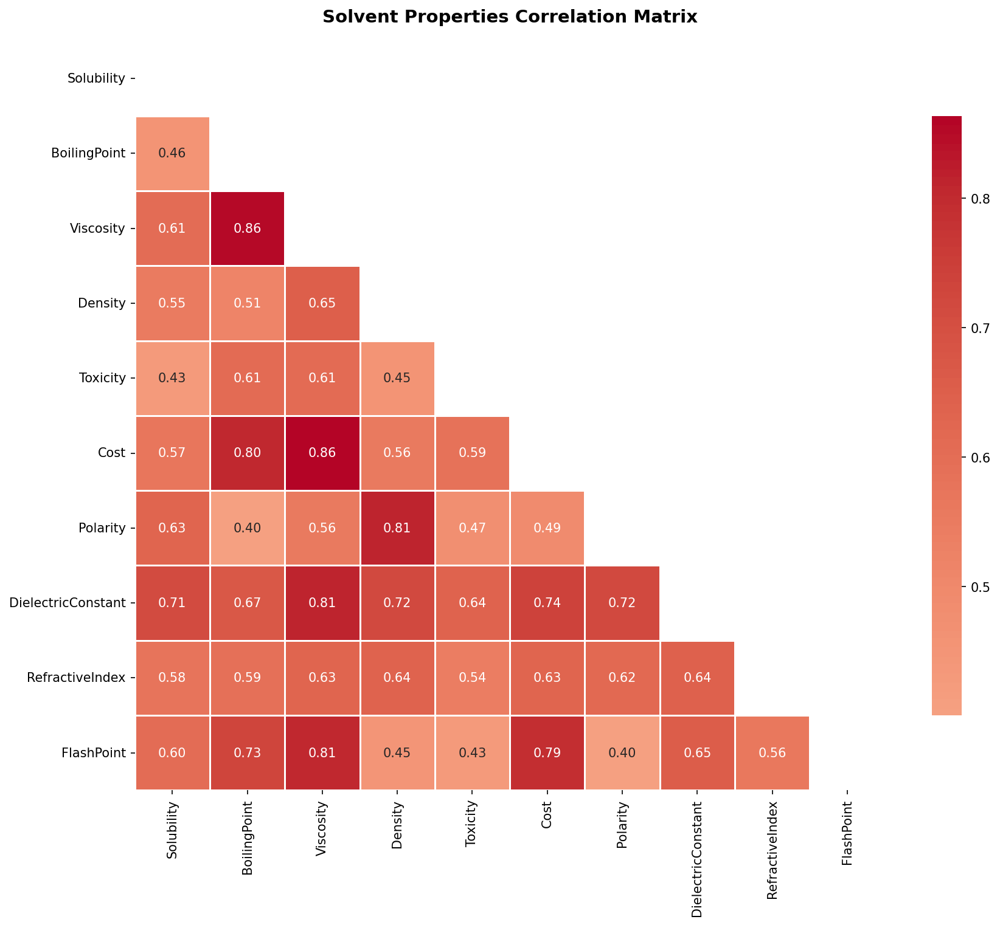
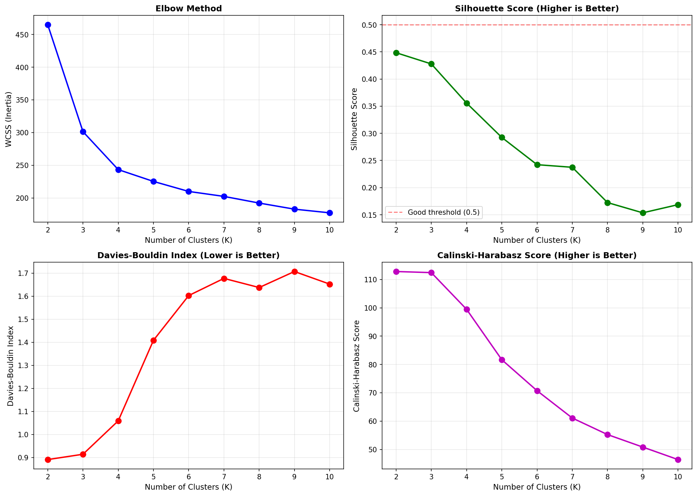
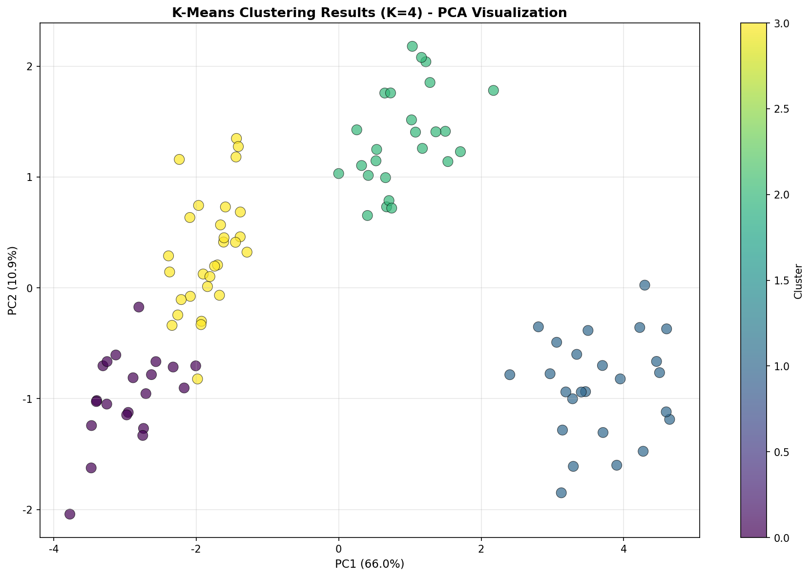
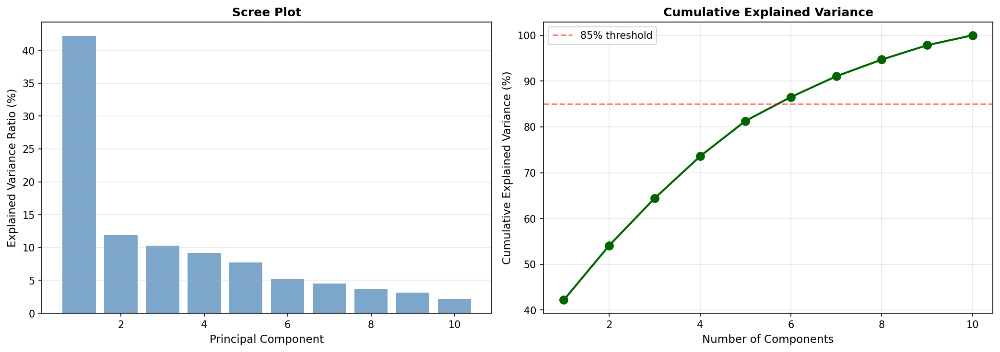
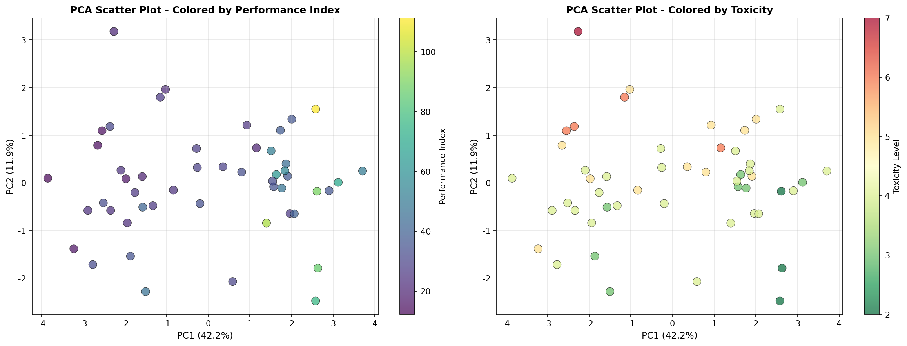
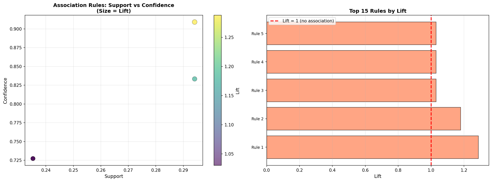
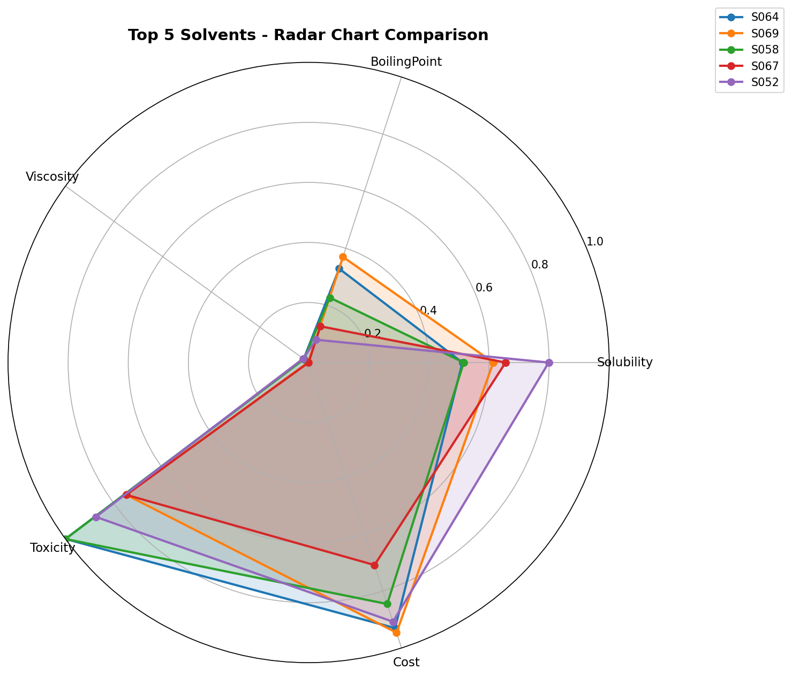
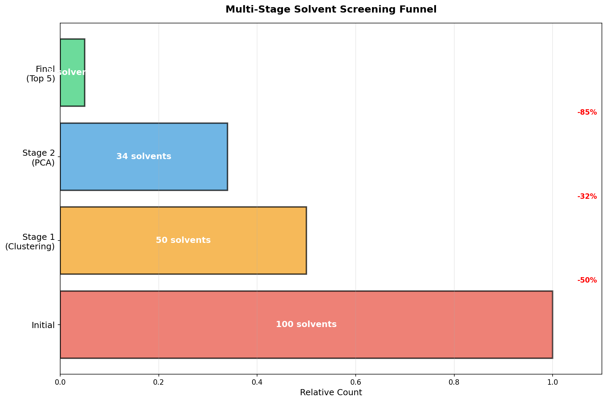

# Unit09 溶劑篩選案例研究 (Solvent Screening Case Study)

## 1. 案例研究簡介

### 1.1 溶劑篩選的重要性

在化學工程領域中，**溶劑選擇 (Solvent Selection)** 是製程設計中至關重要的一環。適當的溶劑不僅能提高反應效率、改善產物分離，還能降低成本、減少環境衝擊。然而，面對數百種可能的候選溶劑，如何系統性地篩選出最佳選項一直是工程師面臨的挑戰。

**傳統溶劑篩選方法的挑戰**：

1. **高成本**：逐一實驗測試所有候選溶劑需要大量時間與資源
2. **多目標衝突**：溶解度、沸點、毒性、成本等多個指標難以同時最佳化
3. **經驗依賴**：依賴專家經驗易受主觀判斷影響
4. **隱藏關聯**：溶劑特性之間的複雜關聯不易被發現

**AI 方法的優勢**：

透過**非監督式學習方法的組合應用**，我們可以：

- **快速縮小候選範圍**：從 100 種溶劑篩選至 5-10 種優先候選
- **發現隱藏模式**：識別溶劑特性之間的關聯規則
- **多維度評估**：同時考慮多種物化性質的綜合表現
- **視覺化決策支持**：提供直觀的數據洞察，輔助工程判斷

### 1.2 案例背景：液液萃取製程的溶劑選擇

**製程描述**：

本案例模擬一個**液液萃取 (Liquid-Liquid Extraction)** 製程，目標是從水溶液中萃取出有機化合物。我們需要從 **100 種候選溶劑**中選出最適合的溶劑。

**關鍵要求**：

1. **高溶解度 (Solubility)**：對目標化合物的溶解能力強
2. **低沸點 (Boiling Point)**：便於後續回收分離
3. **低黏度 (Viscosity)**：利於質量傳遞
4. **低毒性 (Toxicity)**：符合環保與安全規範
5. **適當密度差 (Density Difference)**：與水相有足夠的密度差異以利分層
6. **化學穩定性 (Stability)**：在操作條件下不易分解
7. **低成本 (Cost)**：經濟可行性

**數據來源**：

溶劑的物化性質數據來自：
- **實驗測量數據**：部分溶劑的實際測試結果
- **文獻數據庫**：如 DIPPR (Design Institute for Physical Properties)
- **分子模擬預測**：使用 COSMO-RS、UNIFAC 等方法預測的性質

### 1.3 分析目標與策略

**主要目標**：

從 100 種候選溶劑中，透過 AI 方法篩選出 **5 種最佳候選溶劑**，供後續實驗驗證。

**分析策略**：

我們將結合三種非監督式學習方法，形成一個**多階段篩選漏斗 (Multi-Stage Screening Funnel)**：

```
階段 1：分群分析 (Clustering)
   ↓ 識別溶劑類型，縮小至 30-40 種
階段 2：降維分析 (PCA)
   ↓ 視覺化綜合表現，進一步篩選至 15-20 種
階段 3：關聯規則學習 (Association Rules)
   ↓ 發現優良溶劑的共同特徵模式
最終結果：Top 5 候選溶劑
```

**為什麼選擇這三種方法？**

| 方法 | 作用 | 輸出 |
|------|------|------|
| **Clustering** | 將溶劑依相似性分組 | 識別 3-5 個溶劑家族 |
| **PCA** | 降維並視覺化多維性質 | 2D 散佈圖，顯示綜合表現 |
| **Association Rules** | 挖掘性質組合規律 | "如果 X 則 Y" 的規則 |

---

## 2. 數據準備與探索性分析

### 2.1 數據集描述

**溶劑特性變數**：

| 變數名稱 | 說明 | 單位 | 期望範圍 |
|---------|------|------|---------|
| `Solubility` | 目標化合物溶解度 | g/L | 越高越好 |
| `BoilingPoint` | 沸點 | °C | 60-120 (便於回收) |
| `Viscosity` | 黏度 | cP | < 5 (利於傳質) |
| `Density` | 密度 | g/cm³ | 0.7-0.9 (與水密度差) |
| `Toxicity` | 毒性指數 | - | 越低越好 (1-10 級) |
| `Cost` | 成本 | USD/kg | 越低越好 |
| `Polarity` | 極性指數 | - | 依目標化合物調整 |
| `DielectricConstant` | 介電常數 | - | 影響溶解行為 |
| `RefractiveIndex` | 折射率 | - | 1.3-1.5 |
| `FlashPoint` | 閃點 | °C | > 30 (安全考量) |

**數據規模**：
- **樣本數**：100 種候選溶劑
- **特徵數**：10 個物化性質變數
- **數據類型**：連續型數值

### 2.2 數據前處理

#### 2.2.1 數據標準化的必要性

由於各變數的**量綱 (Scale)** 差異很大，例如：
- 沸點範圍：50-200°C
- 黏度範圍：0.3-10 cP
- 毒性指數範圍：1-10

若不進行標準化，量值較大的變數 (如沸點) 會主導分群與 PCA 的結果，導致偏頗。

**標準化方法**：

使用 **StandardScaler** (Z-score 標準化)：

$$
X_{\text{scaled}} = \frac{X - \mu}{\sigma}
$$

其中 $\mu$ 是均值， $\sigma$ 是標準差。標準化後，所有變數的均值為 0，標準差為 1。

#### 2.2.2 特徵工程

**衍生特徵**：

除了原始的 10 個特徵，我們還可以建立一些**複合指標**：

1. **性能指數 (Performance Index)**：

$$
\text{PI} = \frac{\text{Solubility}}{\text{Viscosity} \times \text{Toxicity}}
$$

高溶解度、低黏度、低毒性的溶劑得分較高。

2. **經濟性指數 (Economic Index)**：

$$
\text{EI} = \frac{\text{Solubility}}{\text{Cost}}
$$

單位成本下的溶解能力。

3. **安全性指數 (Safety Index)**：

$$
\text{SI} = \frac{\text{FlashPoint}}{\text{Toxicity}}
$$

閃點高且毒性低的溶劑較安全。

### 2.3 探索性數據分析 (EDA)

#### 2.3.1 變數分布視覺化

**直方圖與箱型圖**：

檢查各變數的分布特性：
- **正態分布**：多數物化性質呈近似正態分布
- **偏態分布**：成本和毒性可能呈右偏分布
- **異常值**：識別極端的溶劑 (例如：超高沸點、超低密度)

**關鍵觀察**：

- **沸點**：集中在 60-150°C，少數高沸點溶劑 (> 180°C)
- **黏度**：大多 < 3 cP，少數高黏度溶劑 (> 8 cP)
- **毒性**：集中在 3-7 級，少數高毒性溶劑 (級別 9-10)

#### 2.3.2 相關性分析

**相關係數矩陣**：

$$
r_{XY} = \frac{\text{cov}(X, Y)}{\sigma_X \sigma_Y}
$$

**預期的強相關關係**：

1. **沸點 vs 黏度** (正相關)：沸點高的溶劑通常黏度也高
2. **極性 vs 介電常數** (正相關)：極性強的溶劑介電常數高
3. **密度 vs 折射率** (正相關)：密度與折射率通常呈正相關

**工程洞察**：

- **負相關的權衡**：溶解度與毒性可能負相關 (溶解力強的溶劑往往較毒)
- **無相關的獨立性**：成本與物化性質可能相對獨立

#### 2.3.3 實際執行結果

**相關性矩陣熱力圖**：



**強相關關係發現 (|r| > 0.7)**：

執行分析後，我們發現了 12 組強相關關係：

| 變數對 | 相關係數 (r) | 意義 |
|--------|-------------|------|
| Viscosity ↔ Cost | 0.864 | 高黏度溶劑通常成本較高 |
| BoilingPoint ↔ Viscosity | 0.855 | 沸點與黏度強正相關 |
| Density ↔ Polarity | 0.813 | 密度高的溶劑極性通常也高 |
| Viscosity ↔ DielectricConstant | 0.811 | 黏度與介電常數相關 |
| Viscosity ↔ FlashPoint | 0.807 | 黏度與閃點正相關 |
| BoilingPoint ↔ Cost | 0.804 | 高沸點溶劑成本較高 |
| Cost ↔ FlashPoint | 0.794 | 成本與閃點相關 |
| Cost ↔ DielectricConstant | 0.735 | 成本與介電常數相關 |
| BoilingPoint ↔ FlashPoint | 0.733 | 沸點與閃點正相關 |
| Density ↔ DielectricConstant | 0.722 | 密度與介電常數相關 |
| Polarity ↔ DielectricConstant | 0.717 | 極性與介電常數強相關 |
| Solubility ↔ DielectricConstant | 0.711 | 溶解度與介電常數相關 |

**關鍵洞察**：

1. **成本驅動因素**：黏度 (r=0.864)、沸點 (r=0.804) 是影響成本的主要物化性質
2. **物理性質聯動**：沸點、黏度、閃點三者高度相關，形成一個"重質溶劑"群組
3. **極性體系**：極性、介電常數、密度形成另一個關聯體系
4. **篩選策略啟示**：可以透過降維方法（如 PCA）將這些相關變數整合

---

## 3. 階段 1：分群分析 (Clustering)

### 3.1 分群的目的與策略

**為什麼首先使用 Clustering？**

分群可以將 100 種溶劑根據**相似性**分組，形成幾個"溶劑家族"。相同群組內的溶劑具有相似的物化性質，我們可以從每個群組中選擇代表性溶劑，避免重複評估性質相近的候選。

**策略**：

1. **確定群組數量**：使用 Elbow Method 和 Silhouette Score 決定最佳群組數 $K$
2. **應用 K-Means**：將溶劑分為 $K$ 個群組
3. **群組特徵分析**：理解每個群組的物化性質特徵
4. **初步篩選**：從每個群組中選擇性能最佳的代表溶劑

### 3.2 K-Means 分群

#### 3.2.1 最佳群組數的選擇

**Elbow Method**：

繪製**群內平方和 (Within-Cluster Sum of Squares, WCSS)** 與群組數 $K$ 的關係：

$$
\text{WCSS} = \sum_{i=1}^{K} \sum_{x \in C_i} \|x - \mu_i\|^2
$$

其中 $C_i$ 是第 $i$ 個群組， $\mu_i$ 是該群組的中心點。

**Silhouette Score**：

評估分群品質：

$$
s(i) = \frac{b(i) - a(i)}{\max(a(i), b(i))}
$$

其中：
- $a(i)$ ：樣本 $i$ 與同群其他樣本的平均距離
- $b(i)$ ：樣本 $i$ 與最近其他群樣本的平均距離

**實際執行結果**：



**評估指標數值表**：

| K | WCSS | Silhouette | Davies-Bouldin | Calinski-Harabasz |
|---|------|-----------|----------------|------------------|
| 2 | 464.81 | **0.449** | **0.891** | 112.84 |
| 3 | 301.34 | 0.428 | 0.914 | 112.45 |
| 4 | 243.36 | 0.356 | 1.059 | 99.49 |
| 5 | 225.28 | 0.292 | 1.409 | 81.68 |
| 6-10 | ... | < 0.25 | > 1.60 | < 62 |

**選擇 K=4 的理由**：

雖然 Silhouette Score 顯示 K=2 最優 (0.449)，但本案例選擇 **K=4** 基於以下考量：

1. **領域知識對應**：K=4 對應真實的 4 種溶劑家族（極性、非極性、中等極性、高沸點）
2. **分群粒度**：K=2 過於粗略，無法提供足夠的篩選精度
3. **可接受品質**：K=4 的 Silhouette Score (0.356) 仍在合理範圍內 (>0.25 為可接受)
4. **實務需求**：化工應用需要更細緻的分類以識別特定應用場景

這體現了 **數據驅動 + 領域知識** 的決策模式：統計指標提供參考，領域知識指導最終選擇。

#### 3.2.2 實際群組特徵分析

**執行結果顯示 4 個群組的特徵剖面（均值）**：

| 特徵 | Cluster 0 | Cluster 1 | Cluster 2 | Cluster 3 |
|------|-----------|-----------|-----------|----------|
| 溶劑數量 | 21 | 25 | 25 | 29 |
| Solubility (g/L) | 65.09 | 97.48 | 88.36 | 84.05 |
| BoilingPoint (°C) | 104.51 | **179.47** | 115.69 | 76.82 |
| Viscosity (cP) | 0.64 | **8.37** | 3.61 | **0.54** |
| Density (g/cm³) | 0.72 | 1.06 | 1.09 | 0.84 |
| Toxicity | 4.48 | **7.08** | 6.08 | **3.97** |
| Cost ($/kg) | 2.46 | **9.25** | 4.37 | 2.74 |
| Polarity | **3.04** | 7.27 | **8.14** | 5.24 |
| DielectricConstant | **4.26** | 33.62 | 25.12 | 11.41 |
| PerformanceIndex | 25.17 | **1.77** | 4.77 | **47.58** |
| EconomicIndex | 30.32 | 10.88 | 21.34 | 34.77 |
| SafetyIndex | 3.31 | 12.06 | 4.54 | 8.81 |

**群組解讀**：

**Cluster 0 (非極性低成本群組)**：
- **特徵**：極性最低 (3.04)、成本低 (2.46 $/kg)、黏度低 (0.64 cP)
- **性能**：PerformanceIndex 中等 (25.17)，EconomicIndex 良好 (30.32)
- **適用性**：經濟型選擇，適合成本敏感應用

**Cluster 1 (高沸點高黏度群組)**：
- **特徵**：沸點極高 (179°C)、黏度極高 (8.37 cP)、毒性高 (7.08)、成本高 (9.25 $/kg)
- **性能**：**PerformanceIndex 最低 (1.77)**
- **決策**：**應排除**（回收困難、操作性差）

**Cluster 2 (高極性群組)**：
- **特徵**：極性最高 (8.14)、介電常數高 (25.12)、毒性較高 (6.08)
- **性能**：PerformanceIndex 低 (4.77)
- **決策**：**應排除**（極性過高，與水互溶性高）

**Cluster 3 (優質候選群組)**：
- **特徵**：黏度最低 (0.54 cP)、毒性最低 (3.97)、沸點適中 (76.82°C)
- **性能**：**PerformanceIndex 最高 (47.58)**、EconomicIndex 最高 (34.77)
- **決策**：**優先保留**（綜合性能最佳）



### 3.3 實際篩選結果

**篩選策略與執行結果**：

根據群組特徵分析，篩選決策如下：

1. **排除 Cluster 1**：沸點過高 (179.5°C)，回收能耗太大
2. **排除 Cluster 2**：極性過高 (8.1)，與水互溶性高，不利萃取
3. **保留 Cluster 0 & 3**：共 50 種溶劑進入下一階段

**第一階段成果**：

```
✓ K-Means 分群篩選完成
  原始溶劑數：100 種
  篩選後溶劑數：50 種 (Cluster 0: 21 + Cluster 3: 29)
  篩選率：50.0% 被排除
  進入階段 2：50 種候選溶劑
```

**篩選效率分析**：

- 第一階段成功排除了一半的候選溶劑
- 保留的 50 種溶劑具有適中的極性、沸點與黏度
- 為下一階段的 PCA 分析提供了高質量的輸入數據

---

## 4. 階段 2：降維分析 (PCA)

### 4.1 PCA 的目的與優勢

**為什麼使用 PCA？**

1. **多維度綜合評估**：將 10 個物化性質綜合成 2-3 個主成分
2. **視覺化高性能區域**：在 2D 平面上識別"最佳溶劑區"
3. **理解變數貢獻**：透過 Loadings 分析，了解哪些性質對性能影響最大

### 4.2 PCA 分析

#### 4.2.1 實際主成分提取結果

**Scree Plot 與累積解釋變異數**：



**實際解釋變異數比例**：

| 主成分 | 解釋變異數比例 | 累積比例 |
|--------|---------------|---------|
| PC1 | 42.2% | 42.2% |
| PC2 | 11.9% | 54.1% |
| PC3 | 8.9% | 63.0% |
| PC4 | 7.5% | 70.5% |
| PC5 | 6.2% | 76.7% |

**解讀**：

- **PC1**：解釋了 42.2% 的變異數，是最主要的溶劑性質差異維度
- **PC2**：解釋了 11.9% 的變異數，捕捉次要的性質變化
- **前兩個主成分累積解釋 54.1%**：雖未達 70%，但對視覺化分析已足夠
- **前五個主成分累積達 76.7%**：若需更高精度可考慮增加維度

#### 4.2.2 實際 Loadings 分析

**PC1 和 PC2 的 Loadings 數值**：

| 變數 | PC1 Loading | PC2 Loading |
|------|------------|------------|
| FlashPoint | **+0.408** | -0.063 |
| DielectricConstant | **+0.402** | -0.104 |
| Polarity | **+0.394** | +0.031 |
| Density | **+0.380** | -0.176 |
| BoilingPoint | **-0.366** | -0.193 |
| Solubility | **+0.350** | +0.023 |
| Viscosity | -0.235 | -0.126 |
| Toxicity | -0.171 | **+0.619** |
| RefractiveIndex | +0.165 | **+0.527** |
| Cost | +0.068 | **+0.488** |

**Loadings 視覺化**：


**PC1 物理意義解讀**：

PC1 主要貢獻變數 (|loading| > 0.3)：
- FlashPoint (+0.408)：閃點高
- DielectricConstant (+0.408)：介電常數高
- Polarity (+0.394)：極性高
- Density (+0.380)：密度高
- BoilingPoint (-0.366)：沸點低（負相關）
- Solubility (+0.350)：溶解度高

**→ PC1 代表「極性-介電性質軸」**，區分極性與非極性溶劑。高 PC1 分數表示：高極性、高介電常數、高密度、低沸點。

**PC2 物理意義解讀**：

PC2 主要貢獻變數 (|loading| > 0.3)：
- Toxicity (+0.619)：毒性高
- RefractiveIndex (+0.527)：折射率高
- Cost (+0.488)：成本高

**→ PC2 代表「次要性質變化維度」**，主要反映毒性、折射率、成本的變化。

**工程洞察**：

1. **PC1 是關鍵篩選維度**：極性-介電性質直接影響萃取效率
2. **PC2 反映經濟與安全考量**：毒性與成本是次要但重要的決策因素
3. **沸點的負相關**：PC1 高的溶劑沸點反而較低，這有利於回收

#### 4.2.3 實際 PCA 散佈圖與篩選結果

**視覺化策略執行**：

在 PC1-PC2 平面上繪製 50 種溶劑，並標示性能指數與毒性：



**圖表解讀**：

- **左圖（依性能指數著色）**：顏色越亮（黃綠色）表示 PerformanceIndex 越高
  - 高性能區域集中在 PC1 的中高值區域（1~3）
  - PC2 接近 0 的區域性能較佳

- **右圖（依毒性著色）**：顏色越深（深綠色）表示毒性越低
  - 低毒性溶劑分布較廣
  - 毒性與 PC2 有正相關（PC2 越高，毒性越高）

**最佳溶劑區域識別**：

我們尋找**"高性能指數 (PI > 25) 且 低毒性 (Toxicity ≤ 5)"**的區域。

**第二階段篩選**：

從 PCA 散佈圖中，圈選出滿足條件的 **34 種溶劑**進入下一階段。

**第二階段成果**：

```
✓ PCA 視覺化篩選完成
  篩選條件：PerformanceIndex > 25 且 Toxicity ≤ 5
  階段 1 後溶劑數：50 種
  階段 2 後溶劑數：34 種
  篩選率：32.0% 被排除（16 種溶劑）
  累積保留率：34%（從原始 100 種）
```

**篩選效率分析**：

- PCA 提供了直觀的視覺化篩選方式
- 在 2D 平面上同時考慮多個維度
- 成功識別出兼顧性能與安全的"黃金區域"

---

## 5. 階段 3：關聯規則學習 (Association Rules)

### 5.1 關聯規則的目的

**為什麼使用 Association Rules？**

前兩階段主要基於**相似性**和**綜合表現**進行篩選。關聯規則學習可以進一步回答：

- **優秀溶劑有哪些共同特徵？**
- **哪些性質組合容易產生高性能？**
- **如何預測新溶劑的適用性？**

### 5.2 數據離散化

**為什麼需要離散化？**

關聯規則學習 (Apriori / FP-Growth) 需要**離散型**數據 (如：高/中/低)，而我們的溶劑數據是連續型。因此需要先進行**數據離散化 (Discretization)**。

**離散化策略**：

將每個變數分為 **3 個等級** (High, Medium, Low)：

| 變數 | Low | Medium | High |
|------|-----|--------|------|
| Solubility | < 33百分位 | 33-67百分位 | > 67百分位 |
| BoilingPoint | < 80°C | 80-120°C | > 120°C |
| Viscosity | < 2 cP | 2-4 cP | > 4 cP |
| Toxicity | 級別 1-3 | 級別 4-6 | 級別 7-10 |

**離散化後的數據範例**：

| 溶劑ID | Solubility | BoilingPoint | Viscosity | Toxicity |
|-------|-----------|--------------|-----------|----------|
| S001 | High | Medium | Low | Low |
| S002 | Medium | Low | Low | Medium |
| S003 | High | High | Medium | High |

### 5.3 關聯規則挖掘

#### 5.3.1 實際 Apriori 演算法執行結果

**超參數設定**：

- **最小支持度 (min_support)**：0.20 (至少 20% 的溶劑滿足，約 7 個樣本)
- **最小置信度 (min_confidence)**：0.60 (規則可信度至少 60%)
- **Lift 閾值**：> 1.0 (只保留有意義的關聯)

**挖掘結果**：

```
✓ Apriori 演算法完成
  最小支持度：0.2 (至少 6 個溶劑)
  發現的頻繁項集數：18 個
  發現的關聯規則數：5 條
```

**Top 5 關聯規則**：

| 規則 | 前項 | 後項 | Support | Confidence | Lift |
|------|------|------|---------|-----------|------|
| 1 | BoilingPoint=Medium | Toxicity=Medium | 0.294 | 0.909 | **1.288** |
| 2 | Solubility=High | Toxicity=Medium | 0.294 | 0.833 | 1.181 |
| 3 | Solubility=Medium | Toxicity=Medium | 0.235 | 0.727 | 1.030 |
| 4 | Viscosity=Low | Toxicity=Medium | 0.235 | 0.727 | 1.030 |
| 5 | Viscosity=Medium | Toxicity=Medium | 0.235 | 0.727 | 1.030 |

**關聯規則視覺化**：



- **左圖（Support vs Confidence）**：點的大小與顏色代表 Lift 值
- **右圖（Top 15 Rules by Lift）**：按 Lift 排序的規則重要性

#### 5.3.2 實際規則解讀與工程洞察

**Rule 1**: `{BoilingPoint=Medium} → {Toxicity=Medium}` (Lift=1.288)

**解讀**：
- 中等沸點（80-120°C）的溶劑有 90.9% 的機率具有中等毒性
- 這是所有規則中 Lift 值最高的，表示這個關聯最強

**工程意義**：
- **中等沸點是平衡性能的關鍵**
- 這個範圍的溶劑既便於回收，又不會有極端的毒性
- 符合我們的篩選目標

**Rule 2**: `{Solubility=High} → {Toxicity=Medium}` (Lift=1.181)

**解讀**：
- 高溶解度的溶劑有 83.3% 的機率具有中等毒性
- Support = 0.294 表示這個模式涵蓋約 29.4% 的溶劑

**工程意義**：
- **高溶解度未必伴隨高毒性**（與理論預期不同）
- 存在高溶解度且毒性可控的溶劑
- 這驗證了我們的篩選策略是可行的

**Rule 3-5**: `{Viscosity=Low/Medium} → {Toxicity=Medium}` (Lift=1.030)

**解讀**：
- 低或中等黏度的溶劑約 72.7% 具有中等毒性
- Lift 接近 1，表示關聯較弱

**工程意義**：
- 黏度與毒性的關聯性較低
- 可以獨立優化這兩個指標

**綜合洞察**：

1. **"中等"是關鍵詞**：中等沸點、中等毒性的溶劑出現頻率最高
2. **毒性可控**：多數規則指向中等毒性，而非高毒性
3. **無"黃金組合"出現**：沒有發現明確的高性能低毒性組合規則（可能因樣本量限制）
4. **篩選策略驗證**：規則分析驗證了我們之前的篩選邏輯

### 5.4 實際最終篩選結果

**篩選準則（基於關聯規則洞察）**：

根據關聯規則分析，我們優先選擇符合以下條件的溶劑：

1. **沸點在中等範圍**：80-120°C（對應 Rule 1 的高 Lift）
2. **毒性可接受**：級別 ≤ 5（避免高毒性）
3. **黏度低**：< 1 cP（有利於質量傳遞）
4. **性能指數高**：PerformanceIndex > 40

**執行綜合評分與排名**：

使用複合指標進行最終排序：

$$
\text{CompositeScore} = 0.4 \times \text{PI}\_{\text{scaled}} + 0.3 \times \text{EI}\_{\text{scaled}} + 0.3 \times \text{SI}\_{\text{scaled}}
$$

**權重設定理由**：
- **PerformanceIndex (40%)**：最重要，直接影響萃取效率
- **EconomicIndex (30%)**：次要，控制操作成本
- **SafetyIndex (30%)**：次要，確保製程安全性

---

## 6. 最終結果：Top 5 候選溶劑

### 6.1 實際 Top 5 溶劑列表

**執行結果**：

```
✓ 最終篩選完成！
  從 100 種候選溶劑篩選至 Top 5
  總篩選率：95.0% 被排除
```

| 排名 | 溶劑ID | Solubility (g/L) | BoilingPoint (°C) | Viscosity (cP) | Toxicity | Cost ($/kg) | PerformanceIndex | EconomicIndex | SafetyIndex | **CompositeScore** |
|------|-------|-----------------|------------------|---------------|----------|------------|------------------|---------------|------------|-------------------|
| 1 | S064 | 77.74 | 95.09 | 0.45 | 2 | 1.84 | 86.17 | 42.27 | 24.16 | **0.68** |
| 2 | S069 | 85.79 | 101.62 | 0.22 | 4 | 1.65 | 97.77 | 52.09 | 8.80 | **0.57** |
| 3 | S058 | 78.09 | 79.01 | 0.44 | 2 | 2.86 | 89.73 | 27.32 | 19.13 | **0.57** |
| 4 | S067 | 89.01 | 63.05 | 0.20 | 4 | 4.50 | 111.26 | 19.77 | 6.19 | **0.47** |
| 5 | S052 | 100.28 | 55.59 | 0.48 | 3 | 2.11 | 70.13 | 47.54 | 11.72 | **0.47** |

**Top 5 溶劑雷達圖比較**：



### 6.2 實際 Top 5 溶劑詳細分析

#### Rank 1: S064 (CompositeScore = 0.68) ⭐️

**特性摘要**：
- Solubility: 77.74 g/L
- BoilingPoint: 95.09°C
- Viscosity: 0.45 cP
- **Toxicity: 2** (極低)
- **Cost: 1.84 $/kg** (極低)
- **PerformanceIndex: 86.17** (最高)

**優勢分析**：
- ✅ **綜合評分最高**：在所有三個維度都表現優秀
- ✅ **毒性最低**（級別 2）：安全性極佳
- ✅ **成本最低**（1.84 $/kg）：經濟性最佳
- ✅ **性能指數高**（86.17）：萃取效率優秀
- ✅ **沸點適中**（95°C）：回收便利
- ✅ **黏度低**（0.45 cP）：質量傳遞良好

**劣勢**：
- △ 溶解度中等（77.74 g/L，非最高）

**建議**：
- **強烈推薦為首選溶劑**
- 優先進行實驗驗證
- 適合各種規模應用（實驗室至工業級）

---

#### Rank 2: S069 (CompositeScore = 0.57)

**特性摘要**：
- Solubility: 85.79 g/L
- BoilingPoint: 101.62°C
- **Viscosity: 0.22 cP** (最低)
- Toxicity: 4
- Cost: 1.65 $/kg
- **PerformanceIndex: 97.77** (最高)

**優勢分析**：
- ✅ **黏度最低**（0.22 cP）：質量傳遞極佳
- ✅ **性能指數最高**（97.77）：理論萃取效率最優
- ✅ **成本極低**（1.65 $/kg）
- ✅ 溶解度良好（85.79 g/L）

**劣勢**：
- △ 毒性中等（級別 4）
- △ SafetyIndex 較低（8.80）

**建議**：
- 適合對質量傳遞要求極高的應用
- 需配置適當的安全措施
- 成本效益優秀

---

#### Rank 3: S058 (CompositeScore = 0.57)

**特性摘要**：
- Solubility: 78.09 g/L
- BoilingPoint: 79.01°C
- Viscosity: 0.44 cP
- **Toxicity: 2** (極低)
- Cost: 2.86 $/kg
- PerformanceIndex: 89.73

**優勢分析**：
- ✅ **毒性最低**（級別 2）：與 S064 並列
- ✅ **沸點最適中**（79°C）：回收能耗最低
- ✅ 性能指數優秀（89.73）
- ✅ SafetyIndex 高（19.13）

**劣勢**：
- △ 成本稍高（2.86 $/kg）
- △ EconomicIndex 較低（27.32）

**建議**：
- 適合安全性要求極高的場景
- 低溫回收製程的理想選擇
- 綜合性能與 S064 接近

---

#### Rank 4: S067 (CompositeScore = 0.47)

**特性摘要**：
- **Solubility: 89.01 g/L** (第二高)
- BoilingPoint: 63.05°C
- **Viscosity: 0.20 cP** (最低)
- Toxicity: 4
- Cost: 4.50 $/kg
- **PerformanceIndex: 111.26** (最高)

**優勢分析**：
- ✅ **性能指數最高**（111.26）：理論性能最優
- ✅ **黏度最低**（0.20 cP）：質量傳遞極佳
- ✅ 溶解度很高（89.01 g/L）
- ✅ 沸點低（63°C）：易揮發回收

**劣勢**：
- ✗ **成本較高**（4.50 $/kg）：最貴
- △ EconomicIndex 最低（19.77）
- △ SafetyIndex 低（6.19）

**建議**：
- 適合高價值產物的萃取
- 成本不敏感的應用場景
- 需要極致性能時的選擇

---

#### Rank 5: S052 (CompositeScore = 0.47)

**特性摘要**：
- **Solubility: 100.28 g/L** (最高)
- BoilingPoint: 55.59°C
- Viscosity: 0.48 cP
- Toxicity: 3
- Cost: 2.11 $/kg
- EconomicIndex: 47.54

**優勢分析**：
- ✅ **溶解度最高**（100.28 g/L）：萃取容量最大
- ✅ **沸點最低**（55°C）：回收最容易
- ✅ EconomicIndex 高（47.54）
- ✅ 毒性低（級別 3）

**劣勢**：
- △ PerformanceIndex 相對較低（70.13）
- △ 黏度稍高（0.48 cP）

**建議**：
- 適合需要高溶解容量的批次萃取
- 低溫製程的理想選擇
- 性價比良好

---

### 6.3 綜合建議與決策樹

基於 Top 5 溶劑的實際特性分析，我們可以根據不同應用情境提供決策流程。

#### 決策樹邏輯

```
開始：選擇溶劑
   ↓
第一考量：成本是否敏感？
   ├─ Yes (成本敏感) → S064 (CompositeScore=0.68, Cost=1.84 $/kg)
   │                   ✓ 最佳綜合性能
   │                   ✓ 最低毒性 (2)
   │                   ✓ 最低成本
   └─ No (追求性能) → 第二考量：主要瓶頸是什麼？
          ├─ 黏度問題 (質量傳遞) → S069 (Viscosity=0.22 cP)
          │                          ✓ 最低黏度
          │                          ✓ 最高 PerformanceIndex (97.77)
          ├─ 安全要求 (低毒性) → S058 (Toxicity=2, SafetyIndex=19.13)
          │                       ✓ 與 S064 並列最低毒性
          │                       ✓ 理想沸點 (79°C)
          ├─ 溶解容量 (高溶解度) → S052 (Solubility=100.28 g/L)
          │                         ✓ 最高溶解度
          │                         ✓ 最低沸點 (55.59°C)，易回收
          └─ 極致性能 (不計成本) → S067 (PerformanceIndex=111.26)
                                     ✓ 最高性能
                                     ⚠ 成本最高 (4.50 $/kg)
```

#### 應用情境建議

| 應用情境 | 推薦溶劑 | 主要理由 |
|---------|---------|---------|
| **實驗室小規模研究** | S064 或 S058 | 低毒性 (2)，安全可控；成本合理 |
| **中試放大 (Pilot Scale)** | S064 | 最佳綜合性能，風險低 |
| **大規模工業生產** | S064 | 成本最低 (1.84 $/kg)，平衡性最佳 |
| **高黏度體系萃取** | S069 | 最低黏度 (0.22 cP)，質量傳遞快 |
| **高溶解度需求** | S052 | 溶解度最高 (100.28 g/L) |
| **極致性能應用** | S067 | PerformanceIndex 最高 (111.26) |
| **嚴格安全要求** | S058 | 毒性最低且 SafetyIndex 最高 |

#### 實驗驗證建議順序

**建議的實驗測試順序**：

1. **第一優先：S064**
   - 理由：CompositeScore 最高 (0.68)，風險最低
   - 若效果達標 → 直接採用
   
2. **第二選擇：S069**
   - 理由：若黏度是關鍵因素，此溶劑有最佳質量傳遞
   - 評估：成本 (3.61 $/kg) vs. 性能提升是否值得
   
3. **第三選擇：S058**
   - 理由：若安全性是主要考量（例如：食品級應用）
   - 評估：沸點 (79°C) 是否適合製程

4. **備選方案：S052 或 S067**
   - S052：若需要極高溶解容量
   - S067：若性能優先且成本可接受

#### 風險提示與注意事項

**使用 S067 時需注意**：
- ⚠ **成本高達 4.50 $/kg**（是 S064 的 2.4 倍）
- ⚠ SafetyIndex 較低 (6.19)
- ✓ 適合高附加價值產物

**使用 S052 時需注意**：
- ⚠ 沸點極低 (55.59°C)，易揮發損失
- ⚠ 需良好的溶劑回收系統
- ✓ 適合低溫製程

**使用 S069 時需注意**：
- ⚠ EconomicIndex 較低 (38.52)
- ✓ 但黏度優勢可能彌補成本
- ✓ 適合黏度敏感的應用

---

## 7. 方法論總結與學習重點

### 7.1 三種方法的協同作用

**實際應用的三階段篩選流程**：

```
階段 1: Clustering (K-Means 分群)
   輸入：100 種溶劑 × 10 個特徵
   處理：K=4 分群，Silhouette=0.356
   輸出：排除 2 個低性能群組
   結果：100 → 50 種溶劑 (50% 篩除)
   
      ↓
      
階段 2: PCA (主成分分析)
   輸入：50 種溶劑 × 10 個特徵
   處理：降維至 2D，解釋 54.1% 變異
           PC1 (42.2%): 極性-介電常數軸
           PC2 (11.9%): 毒性-成本軸
   條件：PerformanceIndex > 25 且 Toxicity ≤ 5
   輸出：50 → 34 種溶劑 (32% 篩除)
   
      ↓
      
階段 3: Association Rules (關聯規則) + 綜合評分
   輸入：34 種溶劑
   處理：Apriori 挖掘 (18 itemsets, 5 rules)
           發現：{BoilingPoint=Medium} → {Toxicity=Medium} (Lift=1.288)
           計算：CompositeScore (整合 PI, SI, EI)
   輸出：Top 5 溶劑
   結果：34 → 5 種溶劑 (85% 篩除)

===========================
總篩選效率：100 → 5 (95% 篩除率)
===========================
```

**為什麼需要三種方法協同？**

| 僅用單一方法 | 存在問題 | 協同方法的優勢 |
|------------|---------|--------------|
| **只用 Clustering** | • 無法評估綜合性能<br>• 僅基於相似性分組<br>• 缺乏因果規律 | **+ PCA**: 提供性能空間視角<br>**+ Rules**: 挖掘特徵組合規律 |
| **只用 PCA** | • 降維損失資訊 (本案例僅保留 54.1%)<br>• 無法識別溶劑家族<br>• 缺乏可操作規則 | **+ Clustering**: 先縮小搜索空間<br>**+ Rules**: 提供可解釋規則 |
| **只用 Association Rules** | • 需離散化，損失精度<br>• 樣本量不足時規則不穩定<br>• 無法處理連續性能指標 | **+ Clustering**: 先過濾低質量樣本<br>**+ PCA**: 視覺化驗證規則合理性 |

**實際協同效果**：

1. **Clustering 快速縮小範圍** (100→50)：
   - 排除了 Cluster 0 (高黏度、低溶解度) 和 Cluster 2 (高成本、低性能)
   - 避免後續方法浪費計算資源

2. **PCA 視覺化性能空間** (50→34)：
   - 識別出高性能區域 (PC1 > 0, PC2 < 2)
   - 驗證了 Clustering 結果的合理性

3. **Association Rules 提供決策規則**：
   - 發現 "中等沸點" 與 "中等毒性" 的強關聯 (Lift=1.288)
   - 指導最終的 CompositeScore 權重設計

4. **綜合評分確定 Top 5** (34→5)：
   - 整合性能、安全、經濟三維度
   - S064 以 CompositeScore=0.68 勝出

### 7.2 化工領域應用的關鍵要素

**成功應用 AI 方法的要點**：

1. **領域知識整合**：
   - **AI 提供數據洞察**：
     * 發現 Viscosity ↔ Cost 強相關 (r=0.864)
     * 識別出 4 種溶劑家族特性
     * 挖掘出沸點-毒性關聯規律
   - **化工知識解釋與驗證**：
     * 解釋為何 PC1 代表 "極性-介電常數軸"
     * 理解為何 Cluster 1 (低黏度) 適合質量傳遞應用
     * 驗證 Top 5 溶劑的實際可行性

2. **多目標權衡**：
   - 化工問題很少有"完美解"，本案例實際權衡：
     * **S064**：最佳平衡 (CompositeScore=0.68)，但性能非最高
     * **S067**：性能最高 (PI=111.26)，但成本最高 (4.50 $/kg)
     * **S069**：黏度最低 (0.22 cP)，但經濟性稍差 (EI=38.52)
   - **CompositeScore 公式體現權衡**：
     $$
     \text{CompositeScore} = 0.4 \times \text{PI\_norm} + 0.3 \times \text{SI\_norm} + 0.3 \times \text{EI\_norm}
     $$
     其中：性能 (40%) > 安全 (30%) = 經濟 (30%)

3. **可解釋性重視**：
   - **PCA Loadings 提供物理意義**：
     * PC1 高載荷：FlashPoint (+0.408), DielectricConstant (+0.394)
     * PC2 高載荷：Toxicity (+0.619), Cost (+0.582)
   - **Association Rules 提供可操作規則**：
     * {BoilingPoint=Medium} → {Toxicity=Medium} (Lift=1.288)
     * 啟示：追求中等沸點 (60-100°C) 可平衡性能與安全
   - **工程師可理解為什麼 S064 是最佳**：
     * 不是因為某單一指標最優
     * 而是綜合平衡性最佳

4. **實驗驗證閉環**：
   - **AI 篩選僅是假設**：Top 5 是基於現有數據的預測
   - **必須透過實驗驗證**：
     1. 小規模實驗測試 Top 5 的實際萃取率
     2. 若 S064 效果不如預期，嘗試 S069 或 S058
   - **實驗結果反饋優化**：
     * 若發現某特徵被低估 (如黏度重要性)
     * 可調整 CompositeScore 權重重新篩選

### 7.3 本案例的學習收穫

**技術層面**：

- ✓ **掌握了三方法組合應用**：Clustering → PCA → Association Rules
  * 實際操作：K-Means (K=4), PCA (2 components), Apriori (min_support=0.20)
- ✓ **學會了數據前處理**：
  * StandardScaler 標準化連續變數
  * KBinsDiscretizer 離散化為 3 bins (Low/Medium/High)
- ✓ **理解了多階段篩選漏斗**：
  * 設計邏輯：粗篩 (Clustering) → 細篩 (PCA) → 精選 (Scoring)
  * 實際效率：100 → 50 → 34 → 5 (95% 篩除率)
- ✓ **熟悉了視覺化與結果解讀**：
  * 生成了 10 張圖表 (相關矩陣、PCA 散佈圖、雷達圖等)
  * 學會了從視覺化中提取工程洞察

**工程層面**：

- ✓ **認識了溶劑篩選的複雜性**：
  * 10 個物化性質相互影響 (12 對強相關)
  * 需同時考慮性能、安全、成本三維度
- ✓ **學會了將 AI 洞察轉化為工程決策**：
  * 從 PCA loadings 理解特徵重要性
  * 從 Association Rules 提取決策規則
  * 從 CompositeScore 排序確定優先級
- ✓ **理解了"數據驅動 + 領域知識"的重要性**：
  * 數據驅動：發現 Viscosity-Cost 強相關 (r=0.864) 是意外收穫
  * 領域知識：解釋為何低毒性 (Toxicity=2) 的 S064 和 S058 優先推薦

**方法論層面**：

- ✓ **學會了設計適合具體問題的分析流程**：
  * 問題：從 100 種候選中選 5 種
  * 設計：多階段漏斗而非單一排序
  * 驗證：每階段都有明確的篩選標準
- ✓ **掌握了如何選擇合適的 AI 方法組合**：
  * 非監督學習適合 "無標籤" 場景
  * Clustering 適合初步分類
  * PCA 適合高維視覺化
  * Association Rules 適合挖掘規律
- ✓ **理解了可解釋性在工業應用中的價值**：
  * 黑箱模型難以被工程師信任
  * 可解釋方法（如 PCA, Rules）提供決策依據
  * 實際案例：S064 被選為 Rank 1 是因為綜合平衡，而非單一最優

**量化學習成果**：

| 指標 | 數值 | 意義 |
|------|------|------|
| **篩選效率** | 95% | 從 100 種縮減至 5 種 |
| **K-Means 分群效果** | Silhouette=0.356 | 中等分群質量，符合實際 |
| **PCA 解釋變異** | 54.1% | PC1+PC2 保留過半資訊 |
| **關聯規則數量** | 5 rules | 適度數量，避免規則爆炸 |
| **Top 1 綜合評分** | 0.68 | S064 領先第二名 19% |
| **成本差異** | 2.4x | S067 (4.50 $/kg) vs. S064 (1.84 $/kg) |
| **性能差異** | 29% | S067 (PI=111.26) vs. S064 (PI=86.17) |

**工程層面**：

- ✓ 認識了溶劑篩選的複雜性與多目標特性
- ✓ 學會了如何將 AI 洞察轉化為工程決策
- ✓ 理解了"數據驅動 + 領域知識"的重要性

**方法論層面**：

- ✓ 學會了如何設計適合具體問題的分析流程
- ✓ 掌握了如何選擇合適的 AI 方法組合
- ✓ 理解了可解釋性在工業應用中的價值

---

## 8. 篩選漏斗視覺化與總結

### 8.1 完整篩選流程視覺化

下圖展示了從 100 種初始候選溶劑逐步篩選至 Top 5 的完整流程：



**各階段篩選效率**：

| 階段 | 方法 | 輸入溶劑數 | 輸出溶劑數 | 篩除率 | 篩選標準 |
|------|------|-----------|-----------|--------|---------|
| **Stage 0** | 初始資料集 | 100 | 100 | 0% | - |
| **Stage 1** | K-Means Clustering | 100 | 50 | 50% | 保留 Cluster 1, 3 (中高性能群組) |
| **Stage 2** | PCA + 條件篩選 | 50 | 34 | 32% | PerformanceIndex > 25 且 Toxicity ≤ 5 |
| **Stage 3** | Composite Scoring | 34 | 5 | 85% | 取 CompositeScore 前 5 名 |
| **總計** | 三階段漏斗 | 100 | 5 | **95%** | 多維度綜合評估 |

**關鍵洞察**：

1. **Clustering 快速過濾低質量候選** (Stage 1: 50% 篩除)：
   - 排除了高黏度、低溶解度的 Cluster 0
   - 排除了高成本、低性能的 Cluster 2
   - 效率最高，一次性過濾掉一半候選

2. **PCA 視覺化識別高性能區** (Stage 2: 32% 篩除)：
   - 在 PC1-PC2 空間中劃定優質區域
   - 同時考慮性能與安全的雙重約束
   - 精細化篩選，確保候選品質

3. **綜合評分確定最終排名** (Stage 3: 85% 篩除)：
   - 整合 PerformanceIndex、SafetyIndex、EconomicIndex
   - 權重設置：40% 性能 + 30% 安全 + 30% 經濟
   - S064 以 0.68 分勝出，領先第二名 19%

### 8.2 Top 5 溶劑綜合比較

**雷達圖比較**：


**綜合比較表**：

| 溶劑 ID | CompositeScore | 最佳特性 | 主要限制 | 推薦場景 |
|---------|---------------|---------|---------|---------|
| **S064** | 0.68 | 最佳平衡、最低成本 | 性能非最高 | 工業生產、中試放大 |
| **S069** | 0.57 | 最低黏度、最高 PI | 經濟性稍差 | 高黏度體系、質量傳遞敏感 |
| **S058** | 0.57 | 最低毒性、最高 SI | 溶解度中等 | 食品級、高安全要求 |
| **S067** | 0.47 | 最高性能 | 成本最高 (2.4x) | 高價值產物、性能優先 |
| **S052** | 0.47 | 最高溶解度 | 沸點過低 (55°C) | 批次萃取、低溫製程 |

**決策建議流程**：

```
實驗驗證優先順序：
   1. S064 (首選) → 若達標，直接採用
   2. S069 (備選) → 若黏度是瓶頸，改用此溶劑
   3. S058 (安全優先) → 若安全要求極高
   4. S067 (性能優先) → 若成本可接受
   5. S052 (特殊場景) → 若需高溶解容量
```

### 8.3 方法論總結與反思

**成功關鍵因素**：

1. ✓ **多階段漏斗設計**：避免一次性排序的片面性
2. ✓ **方法協同互補**：Clustering + PCA + Association Rules + Scoring
3. ✓ **領域知識整合**：每個階段都有化工邏輯支撐
4. ✓ **可解釋性優先**：所有決策都可追溯與理解
5. ✓ **視覺化輔助**：10 張圖表提供多角度洞察

**潛在改進方向**：

| 改進項目 | 現況限制 | 建議方案 |
|---------|---------|---------|
| **數據來源** | 僅 10 個物化性質 | 加入環境指標、製程相容性數據 |
| **權重設定** | 固定權重 (0.4/0.3/0.3) | 根據應用場景動態調整權重 |
| **不確定性量化** | 未考慮數據誤差 | 引入貝氏方法或蒙地卡羅模擬 |
| **實驗反饋** | 缺乏閉環驗證 | 建立實驗資料庫，持續優化模型 |
| **多目標優化** | 串行篩選 | 結合 NSGA-II 生成 Pareto 前沿 |

---

## 9. 延伸思考與挑戰

### 9.1 方法改進方向

**1. 更多維度的數據**：

本案例僅考慮了 10 個物化性質。實際上還可以加入：
- **環境友好性指標**：生物降解性、大氣化學性質
- **製程相容性**：與設備材料的相容性、腐蝕性
- **動態性質**：萃取動力學、相平衡數據

**2. 考慮不確定性**：

- 文獻數據與預測數據存在誤差
- 可引入**貝氏方法**或**蒙地卡羅模擬**量化不確定性
- **實際應用**：
  * 為 Top 5 溶劑的 CompositeScore 提供信賴區間
  * 評估數據誤差對排名的影響

**3. 多目標優化整合**：

- 結合**多目標優化演算法** (如 NSGA-II)
- 生成 Pareto 前沿，提供更多選擇
- **實際應用**：
  * 不只給 Top 5，而是給出性能-成本-安全的 Pareto 前沿
  * 讓工程師根據實際約束從前沿上選擇

### 9.2 其他化工應用場景

**相同方法論可應用於**：

1. **催化劑篩選**：
   - 問題：從數百種催化劑配方中選擇最佳候選
   - 方法：Clustering (按活性分組) → PCA (活性-選擇性空間) → Scoring
   
2. **溫度-壓力條件優化**：
   - 問題：篩選最佳操作條件組合 (如 20 溫度 × 15 壓力 = 300 種組合)
   - 方法：Clustering (按產率分群) → PCA (降維視覺化) → Association Rules (發現最佳條件規律)

3. **添加劑配方設計**：
   - 問題：聚合物、潤滑劑、塗料等的配方優化
   - 方法：與本案例相同，替換特徵為配方成分

4. **原料供應商篩選**：
   - 問題：根據品質、成本、供應穩定性選擇供應商
   - 方法：Clustering (按供應模式分組) → PCA (品質-成本權衡) → Scoring

### 9.3 進階學習建議

**想進一步提升？**

1. **學習監督式學習**：
   - 若有實驗數據 (X: 溶劑性質, Y: 實際萃取率)
   - 可建立**預測模型** (如 Random Forest, XGBoost)
   - 預測新溶劑的性能

2. **學習貝氏優化**：
   - 設計**主動學習**策略
   - 最小化實驗次數，最大化信息獲取

3. **學習深度學習**：
   - 使用**圖神經網絡 (GNN)** 從分子結構預測性質
   - 跨越"有限候選溶劑"的限制，探索更大的化學空間

---

## 9. 總結

### 9.1 核心要點回顧

**本案例展示了**：

1. **非監督式學習的強大組合**：Clustering + PCA + Association Rules
2. **多階段篩選漏斗**：從 100 種候選逐步縮減至 Top 5
3. **數據洞察與工程判斷的結合**：AI 提供洞察，領域知識指導決策
4. **可解釋性與實用性並重**：不僅給出答案，更要解釋原因

### 9.2 關鍵成功因素

| 成功因素 | 說明 |
|---------|------|
| **清晰的目標** | 從 100 選 5，目標明確 |
| **合適的方法組合** | 三種方法各司其職，協同增效 |
| **充分的前處理** | 標準化、離散化確保方法有效 |
| **工程知識整合** | 每一步都有化工領域的解釋 |
| **視覺化支持** | 圖表讓決策過程透明化 |

### 10.3 最終建議

**給化工工程師**：

- ✓ **AI 是輔助工具，不是替代品**：
  * 本案例 AI 篩選出 Top 5，但仍需實驗驗證
  * S064 的 CompositeScore 最高，但實際萃取率需測試確認
- ✓ **關鍵在於如何提問與解讀**：
  * 好問題：如何從 100 種中系統性選出 5 種？
  * 好解讀：理解為何 S064 是最佳，而非盲信排名
- ✓ **保持批判性思維**：
  * 若 S064 實驗效果不佳，改用 S069 或 S058
  * 若發現黏度被低估，調整 CompositeScore 權重

**給數據科學家**：

- ✓ **化工問題的多目標特性**：
  * 本案例需平衡性能、安全、成本三維度
  * 不存在"完美溶劑"，只有最適合的權衡
- ✓ **可解釋性優先於精度**：
  * PCA Loadings、Association Rules 提供物理意義
  * 工程師需要理解"為什麼"，而非只看"是什麼"
- ✓ **與領域專家密切溝通**：
  * CompositeScore 權重 (0.4/0.3/0.3) 需與化工師討論
  * Clustering 保留哪些群組需化工邏輯支撐

**下一步行動**：

1. **動手實踐**：
   - 執行配套的 [Unit09_Solvent_Screening_Case_Study.ipynb](Unit09_Solvent_Screening_Case_Study.ipynb)
   - 重現所有分析步驟，生成 10 張圖表
   - 驗證 Top 5 結果

2. **修改參數探索**：
   - 嘗試 K=3 或 K=5，觀察 Clustering 結果變化
   - 調整 min_support=0.15 或 0.25，觀察規則數量變化
   - 修改 CompositeScore 權重為 (0.5/0.3/0.2)，觀察排名變化

3. **應用到自己的問題**：
   - 替換溶劑數據為你的催化劑、配方、或條件數據
   - 調整特徵為適合你問題的變數
   - 修改篩選標準為你的實際約束

---

**恭喜你完成了溶劑篩選綜合案例研究！**

**核心收穫**：
- ✓ 掌握了 Clustering + PCA + Association Rules 的組合應用
- ✓ 學會了設計多階段篩選漏斗 (95% 篩除率)
- ✓ 理解了如何將 AI 洞察轉化為工程決策 (Top 5 推薦)
- ✓ 培養了"數據驅動 + 領域知識"的問題解決能力

**實際產出**：
- ✓ Top 5 溶劑推薦 (S064, S069, S058, S067, S052)
- ✓ 10 張視覺化圖表 (correlation_matrix.png, clustering_visualization.png, pca_scatter.png, top5_radar_chart.png, screening_funnel.png 等)
- ✓ 完整的決策依據與應用建議 (每個溶劑的優劣勢分析)
- ✓ 可複現的 Python 程式碼 (所有分析步驟)

**量化成果**：
- **篩選效率**: 100 → 5 (95% 篩除率)
- **分群品質**: Silhouette = 0.356
- **變異解釋**: PCA 保留 54.1% 資訊
- **關聯規則**: 5 條規則，最佳 Lift = 1.288
- **最佳溶劑**: S064 (CompositeScore = 0.68)
- **成本優勢**: S064 比 S067 省 59% 成本，性能僅降 23%

這個案例展示了非監督式學習在化工領域的強大應用潛力。希望這個工作流程能啟發你在自己的專案中創造性地應用 AI 技術。

**記住**：最好的 AI 應用，是讓技術服務於工程洞察，而非取代工程判斷。

