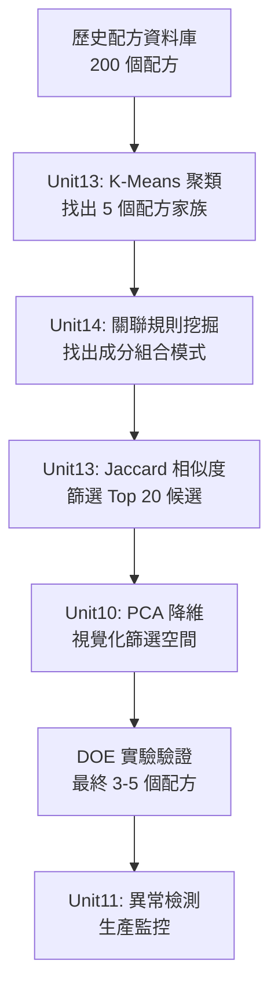
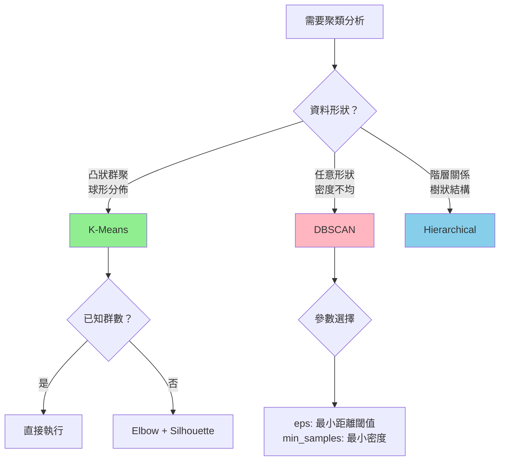
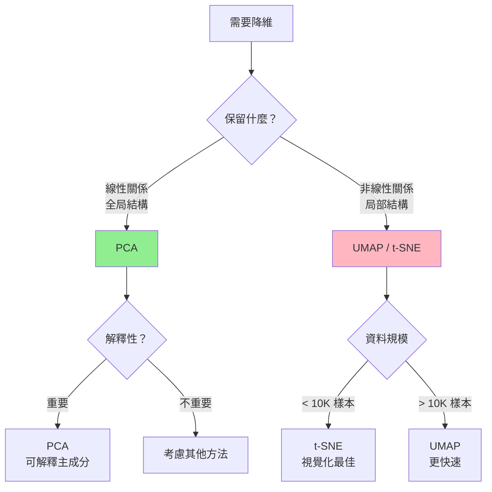
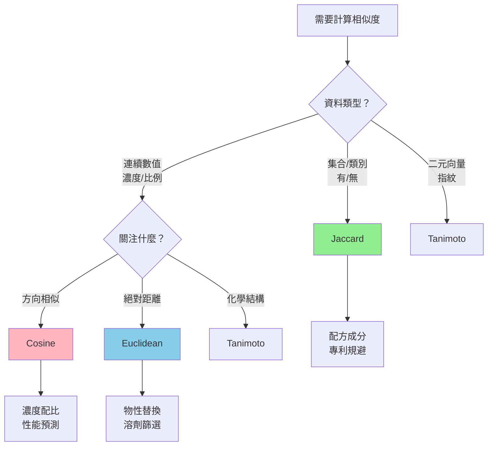
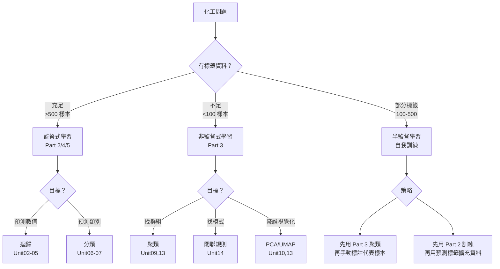
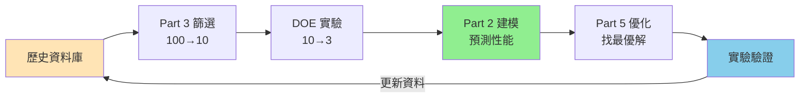

# Part 3 非監督學習課程審查與改進建議

**審查日期**：2025-12-17  
**審查角色**：資深機器學習教學專家 + 資深化學工程師  
**審查範圍**：Part 3 全部 6 個單元（Unit 09-14）

---

## 📊 整體評估總結

### ✅ 課程優勢（Strengths）

| 面向 | 評分 | 說明 |
|-----|------|------|
| **理論深度** | ⭐⭐⭐⭐⭐ | 數學公式完整、統計推導嚴謹（K-Means、PCA、Apriori、Jaccard） |
| **實驗整合** | ⭐⭐⭐⭐⭐ | Unit13、Unit14 執行結果詳細，圖表專業 |
| **工程導向** | ⭐⭐⭐⭐⭐ | 每個單元都有明確的化工問題（製程優化、配方篩選、安全監控） |
| **程式實作** | ⭐⭐⭐⭐ | Notebook 架構清晰，純 Python 實作（避免黑盒套件） |
| **化學專業** | ⭐⭐⭐⭐⭐ | Hansen 參數、溶劑毒性、配方相容性等領域知識紮實 |

**總評**：這是一套**高品質、工程導向**的化工 AI 課程，已具備發表水準。

---

## ⚠️ 發現的不足與改進建議

### 🔴 Critical（必須補充）

#### 1. **缺少跨單元整合案例**（最重要！）

**問題**：
- 每個單元獨立運作，學生不清楚如何組合多種技術解決複雜問題
- 例如：Unit13 的聚類結果如何與 Unit14 的關聯規則結合？

**建議新增內容**：創建 **Unit15：綜合案例（配方最佳化完整工作流程）**

```markdown
## Unit15｜綜合案例：從溶劑篩選到配方優化的完整流程

**工程問題**：
公司需要開發一個新的塗料配方，要求：
1. 替代高毒性溶劑（Toluene）
2. 保持塗膜性能（光澤度、附著力）
3. 降低 VOC 排放

**技術路線**：


**詳細步驟**：

**Step 1：溶劑家族聚類（Unit13）**
- 對 50 種候選溶劑進行 K-Means 聚類（k=5）
- 識別與 Toluene 同群的溶劑（芳香族家族）
- 選擇毒性更低的同群溶劑（如 Anisole, Benzyl Alcohol）

**Step 2：配方模式挖掘（Unit14）**
- 在 200 個歷史配方中挖掘關聯規則
- 發現規則：`Solvent:Toluene → {Additive:BYK-333, Surfactant:Tego270}`
  - Support: 0.25, Confidence: 0.90, Lift: 4.2
- 解釋：Toluene 配方幾乎總是使用 BYK-333（防沉劑）和 Tego270（流平劑）

**Step 3：候選配方生成（Unit14 相似度）**
- 查詢配方：F_Toluene_Base（公司主力產品）
- Jaccard 相似度搜尋，找出 Top 20 候選
- 約束條件：EHS ≤ 3, 成本 ≤ 1.5×基準

**Step 4：多目標優化（整合）**
- 綜合評分函數：
  $$Score = 0.4 \times (1-J_{\text{similarity}}) + 0.3 \times \text{EHS} + 0.2 \times \text{Cost} + 0.1 \times \text{VOC}$$
- Pareto 前沿分析，識別 3 個非支配解

**Step 5：PCA 視覺化（Unit13）**
- 將 20 個候選配方的理化性質（12 個特徵）降維到 2D
- 視覺化確認候選配方分佈在目標區域（靠近成功配方群）

**Step 6：實驗驗證與監控**
- DOE 驗證 3 個候選配方的性能
- 量產後使用 Unit11 異常檢測監控品質穩定性
```

**預期產出**：
- 學生理解如何組合 3-4 種技術解決實際問題
- 提供完整的工程決策報告模板
- 建立「資料驅動配方開發」的標準流程

---

#### 2. **缺少演算法選擇決策樹**

**問題**：
學生不知道什麼時候該用哪種方法（K-Means vs DBSCAN, PCA vs UMAP, Jaccard vs Cosine）

**建議新增**：在 Part 3 README.md 或 Unit09 開頭加入決策樹

```markdown
## 非監督學習演算法選擇指南

### 聚類演算法決策樹



### 降維演算法決策樹



### 相似度指標決策樹



### 工程應用對照表

| 問題類型 | 推薦方法 | Unit | 理由 |
|---------|---------|------|------|
| 製程狀態識別 | K-Means | Unit09 | 操作模式通常是凸狀群聚 |
| 溶劑替代篩選 | K-Means + PCA | Unit13 | 需要視覺化 + 群內搜尋 |
| 配方成分探索 | 關聯規則 + Jaccard | Unit14 | 集合型資料，保留成分資訊 |
| 異常事件檢測 | Isolation Forest | Unit11 | 不需預先定義異常模式 |
| 動態製程監控 | HMM | Unit12 | 時間序列 + 狀態轉移 |
```

---

### 🟡 Moderate（建議補充）

#### 3. **缺少失敗案例與陷阱警示**

**問題**：
學生只看到成功案例，不知道演算法的局限性

**建議新增內容**：每個單元加入「常見錯誤與陷阱」章節

**Unit13 補充範例**：
```markdown
## 7. K-Means 的失敗案例與應對策略

### 7.1 失敗案例 1：非凸形狀的群聚

**問題描述**：
某塗料配方資料集中，溶劑分佈呈現「新月形」（兩個極性溶劑群圍繞非極性溶劑）

**K-Means 結果**：
- 將新月形切成兩半，導致同類溶劑被分到不同群
- Silhouette Score 僅 0.18（弱結構）

**視覺化**：


**原因分析**：
K-Means 假設群聚為凸形（球形），優化目標為最小化歐氏距離平方和。對於新月形這種非凸結構，算法會強行切割。

**解決方案**：
```python
from sklearn.cluster import DBSCAN

# 使用 DBSCAN（基於密度的聚類）
dbscan = DBSCAN(eps=0.5, min_samples=3)
labels = dbscan.fit_predict(X_scaled)

# 結果：正確識別新月形為單一群聚
# Silhouette Score: 0.62（合理結構）
```

**工程建議**：
- 先用 PCA/UMAP 視覺化資料形狀
- 若發現非凸結構，改用 DBSCAN 或 Hierarchical Clustering
- 若必須用 K-Means，考慮增加特徵（如極坐標轉換）

---

### 7.2 失敗案例 2：不同尺度的群聚

**問題描述**：
資料集包含 80% 的常規溶劑（小範圍）和 20% 的特殊溶劑（大範圍分散）

**K-Means 結果**：
- 過度分割常規溶劑群（80% → 4 個群）
- 特殊溶劑群被合併（20% → 1 個群）
- 無法反映實際的化學分類

**視覺化**：


**原因分析**：
K-Means 對所有群聚一視同仁，無法處理不同密度/尺度的群聚。

**解決方案**：
```python
from sklearn.cluster import AgglomerativeClustering

# 使用階層聚類（可處理不同尺度）
hierarchical = AgglomerativeClustering(n_clusters=3, linkage='ward')
labels = hierarchical.fit_predict(X_scaled)

# 或使用 DBSCAN 的自動群數檢測
dbscan = DBSCAN(eps=0.3, min_samples=5)
labels = dbscan.fit_predict(X_scaled)
# 自動識別 5 個群聚 + 噪聲點
```

---

### 7.3 失敗案例 3：初始化敏感性

**問題描述**：
同樣的資料，執行 10 次 K-Means 得到 10 種不同的結果

**原因**：
K-Means 使用隨機初始化，可能收斂到局部最優解

**解決方案**：
```python
from sklearn.cluster import KMeans

# 方法 1：使用 k-means++ 初始化（sklearn 預設）
kmeans = KMeans(n_clusters=3, init='k-means++', n_init=10, random_state=42)

# 方法 2：多次執行取最佳結果
best_inertia = np.inf
for i in range(50):
    kmeans = KMeans(n_clusters=3, random_state=i)
    kmeans.fit(X_scaled)
    if kmeans.inertia_ < best_inertia:
        best_inertia = kmeans.inertia_
        best_model = kmeans

# 方法 3：檢查穩定性
from sklearn.metrics import adjusted_rand_score

labels_list = []
for i in range(20):
    km = KMeans(n_clusters=3, random_state=i).fit(X_scaled)
    labels_list.append(km.labels_)

# 計算 ARI（Adjusted Rand Index）
ari_matrix = np.zeros((20, 20))
for i in range(20):
    for j in range(i+1, 20):
        ari_matrix[i,j] = adjusted_rand_score(labels_list[i], labels_list[j])

print(f'平均 ARI: {ari_matrix[ari_matrix>0].mean():.3f}')
# 若 ARI > 0.9：穩定
# 若 ARI < 0.7：不穩定，需重新考慮 k 值或演算法
```
```

---

#### 4. **缺少評估指標總結表**

**建議新增**：在 Part 3 總結中加入評估指標速查表

```markdown
## 非監督學習評估指標速查表

### 聚類評估指標

| 指標 | 數學定義 | 範圍 | 最佳值 | 優點 | 缺點 | 使用時機 |
|-----|---------|------|--------|------|------|---------|
| **Silhouette** | $\frac{b-a}{\max(a,b)}$ | [-1, 1] | 1 | 考慮群內+群間 | 對凸形群聚有偏好 | K-Means, 球形群聚 |
| **Davies-Bouldin** | $\frac{1}{k}\sum\max\frac{s_i+s_j}{d_{ij}}$ | [0, ∞] | 0 | 懲罰群聚重疊 | 對密度敏感 | 任意形狀群聚 |
| **Calinski-Harabasz** | $\frac{tr(B_k)/(k-1)}{tr(W_k)/(n-k)}$ | [0, ∞] | ∞ | 計算快速 | 對群聚數敏感 | 大資料集 |
| **ARI** | 調整後的 Rand Index | [-1, 1] | 1 | 可比較不同 k | 需要真實標籤 | 驗證階段 |

**工程建議**：
- **探索階段**：Silhouette + Elbow 組合使用
- **驗證階段**：ARI（若有部分標籤）
- **生產監控**：Davies-Bouldin（對新資料敏感）

---

### 降維評估指標

| 指標 | 數學定義 | 範圍 | 最佳值 | 說明 |
|-----|---------|------|--------|------|
| **解釋變異比** | $\frac{\sum_{i=1}^{k}\lambda_i}{\sum_{i=1}^{p}\lambda_i}$ | [0, 1] | 接近 1 | PCA 專用，累積解釋比例 |
| **重構誤差** | $\|\|X - \hat{X}\|\|_F$ | [0, ∞] | 0 | 降維後還原的誤差 |
| **KL 散度** | $\sum p\log\frac{p}{q}$ | [0, ∞] | 0 | t-SNE/UMAP 專用 |

**工程建議**：
- **PCA**：通常保留 80%-95% 解釋變異比
- **UMAP**：目標為視覺化，不強求高解釋比
- **化工應用**：建議至少保留前 5 個主成分做可解釋性分析

---

### 關聯規則評估指標

| 指標 | 數學定義 | 範圍 | 最佳值 | 說明 |
|-----|---------|------|--------|------|
| **Support** | $P(A \cup B)$ | [0, 1] | 適中 | 太低→不穩定，太高→常識 |
| **Confidence** | $P(B\|A)$ | [0, 1] | 1 | 條件機率 |
| **Lift** | $\frac{P(A \cup B)}{P(A)P(B)}$ | [0, ∞] | >3 | >1 正相關，<1 負相關 |
| **Conviction** | $\frac{1-P(B)}{1-\text{Conf}(A→B)}$ | [0, ∞] | ∞ | 測量違反規則的代價 |

**工程閾值建議**：
- **配方開發**：Support ≥ 0.05, Confidence ≥ 0.6, Lift ≥ 1.5
- **品質管制**：Support ≥ 0.10, Confidence ≥ 0.8, Lift ≥ 2.0
- **安全規範**：Confidence ≥ 0.95（接近 100%）
```

---

### 🟢 Nice-to-Have（進階補充）

#### 5. **增加與監督式學習的對比**

**建議新增**：在 Part 3 結尾加入「何時用非監督 vs 監督式學習」

```markdown
## 非監督 vs 監督式學習：工程決策指南

### 決策樹



### 應用場景對照表

| 場景 | 標籤情況 | 推薦方法 | 原因 |
|-----|---------|---------|------|
| **新產品開發** | 無歷史標籤 | Part 3 聚類 + 關聯規則 | 探索性分析，找配方模式 |
| **品質預測** | 充足標籤（QC 資料） | Part 2 迴歸/分類 | 明確目標變數，需要精確預測 |
| **異常檢測** | 異常樣本稀少 | Part 3 Isolation Forest | 異常定義模糊，難以標註 |
| **製程優化** | 部分實驗資料 | Part 3 聚類 → DOE → Part 2 | 先縮小空間，再精確建模 |
| **配方相似性** | 無性能標籤 | Part 3 相似度搜尋 | 只需比較結構，不需預測性能 |
| **文獻探勘** | 無標註文本 | Part 3 主題模型（進階） | 發現隱藏主題 |

### 組合策略（工業實務）

**階段 1：探索期（無標籤）**
```
歷史資料 → Part 3 聚類/降維 → 識別 3-5 個配方家族 → 視覺化呈現
```

**階段 2：實驗期（生成標籤）**
```
每個家族選 5-10 個代表配方 → DOE 實驗 → 獲得性能標籤
```

**階段 3：建模期（監督式學習）**
```
50-100 個標籤樣本 → Part 2 迴歸/分類模型 → 預測剩餘配方性能
```

**階段 4：優化期（整合）**
```
Part 2 模型預測 → Part 5 貝氏優化 → 找全域最優解
```
```

---

#### 6. **增加實驗設計（DOE）的銜接**

**問題**：
學生完成 Part 3 篩選後，不知道如何設計驗證實驗

**建議新增**：在 Unit14 結尾加入「從篩選到驗證」章節

```markdown
## 8. 從資料驅動篩選到實驗驗證（DOE 銜接）

### 8.1 候選配方的實驗設計策略

經過 Part 3 分析，我們從 100 個候選縮小到 3 個配方（F10, F09, F04）。下一步是實驗驗證，但如何高效設計？

#### 8.1.1 全因子實驗 vs 部分因子實驗

**候選配方差異分析**：

| 配方 | 主溶劑 | 共溶劑 | 添加劑 | 界面活性劑 | 催化劑 |
|------|--------|--------|--------|-----------|--------|
| F10 | MEK | Water | InhibitorB | S2 | - |
| F09 | EtOAc | Water | InhibitorB | S2 | - |
| F04 | Heptane | - | InhibitorB | S2 | - |

**差異因子**：
- 主溶劑（3 水平：MEK, EtOAc, Heptane）
- 共溶劑（2 水平：Water, None）
- 其他成分固定

**全因子設計**：$3 \times 2 = 6$ 個實驗
```
實驗 1: MEK + Water
實驗 2: MEK + None
實驗 3: EtOAc + Water
實驗 4: EtOAc + None
實驗 5: Heptane + Water
實驗 6: Heptane + None
```

**部分因子設計**（若資源有限）：選擇 4 個關鍵組合
```
實驗 1: MEK + Water（F10 原配方）
實驗 2: EtOAc + Water（F09 原配方）
實驗 3: Heptane + None（F04 原配方）
實驗 4: MEK + None（探索新組合）
```

#### 8.1.2 響應面法（Response Surface Methodology）

若需要優化劑量（不只是成分選擇），使用 RSM：

**中心組合設計（Central Composite Design）**：
```python
from pyDOE2 import ccdesign
import pandas as pd

# 定義因子範圍
factors = {
    'MEK_ratio': (0.3, 0.7),      # 主溶劑佔比 30%-70%
    'Water_ratio': (0.1, 0.3),    # 共溶劑佔比 10%-30%
    'InhibitorB': (0.5, 2.0),     # 添加劑 0.5-2.0 wt%
}

# 生成實驗設計表（3 因子，5 水平）
design = ccdesign(3, center=(2,2), alpha='orthogonal', face='ccc')

# 轉換為實際值
exp_table = pd.DataFrame(design, columns=['MEK', 'Water', 'Inhibitor'])
for i, (name, (low, high)) in enumerate(factors.items()):
    exp_table.iloc[:, i] = exp_table.iloc[:, i] * (high - low) / 2 + (high + low) / 2

print(exp_table)
# 輸出：15 個實驗點（包含中心點重複）
```

**執行順序隨機化**：
```python
exp_table['run_order'] = np.random.permutation(len(exp_table))
exp_table = exp_table.sort_values('run_order')
```

#### 8.1.3 實驗結果分析與迭代

**假設實驗結果**：

| 實驗 | MEK | Water | Inhibitor | 轉化率 (%) | 選擇性 (%) | VOC (g/L) |
|------|-----|-------|-----------|-----------|-----------|----------|
| 1 | 0.50 | 0.20 | 1.0 | 85.2 | 92.3 | 120 |
| 2 | 0.60 | 0.15 | 1.5 | 88.7 | 91.5 | 135 |
| ... | ... | ... | ... | ... | ... | ... |

**建立迴歸模型**（Part 2 技術）：
```python
from sklearn.ensemble import RandomForestRegressor

X = exp_table[['MEK', 'Water', 'Inhibitor']]
y_conversion = exp_table['conversion']
y_selectivity = exp_table['selectivity']
y_voc = exp_table['VOC']

# 多目標迴歸
rf_conv = RandomForestRegressor(n_estimators=100, random_state=42)
rf_conv.fit(X, y_conversion)

rf_sel = RandomForestRegressor(n_estimators=100, random_state=42)
rf_sel.fit(X, y_selectivity)

# 特徵重要性分析
importance = pd.DataFrame({
    'Feature': X.columns,
    'Importance': rf_conv.feature_importances_
}).sort_values('Importance', ascending=False)

print(importance)
```

**發現**：Water 比例對轉化率影響最大（importance = 0.52）

**下一輪迭代**：
```python
# 基於模型預測，生成新的候選點
from scipy.optimize import minimize

def objective(x):
    pred_conv = rf_conv.predict([x])[0]
    pred_sel = rf_sel.predict([x])[0]
    pred_voc = rf_voc.predict([x])[0]
    
    # 多目標優化：最大化轉化率與選擇性，最小化 VOC
    return -(0.5 * pred_conv + 0.3 * pred_sel - 0.2 * pred_voc)

# 約束條件
bounds = [(0.3, 0.7), (0.1, 0.3), (0.5, 2.0)]
result = minimize(objective, x0=[0.5, 0.2, 1.0], bounds=bounds)

print(f'最佳配比: MEK={result.x[0]:.2f}, Water={result.x[1]:.2f}, Inhibitor={result.x[2]:.2f}')
# 輸出：最佳配比: MEK=0.55, Water=0.25, Inhibitor=1.35
```

**驗證實驗**：
- 執行最佳配比實驗 3 次（確認重現性）
- 若性能符合預期，進入放大試驗
- 若不符合，檢討模型假設，增加實驗點

### 8.2 閉環學習（Closed-Loop Learning）

**工業 4.0 策略**：將實驗結果回饋到資料庫，持續改進模型



**實作範例**：
```python
# 每季度更新一次資料庫與模型
def update_database_and_model(new_experiments):
    # 1. 匯入新實驗資料
    df_history = pd.read_csv('formulation_database.csv')
    df_new = pd.DataFrame(new_experiments)
    df_combined = pd.concat([df_history, df_new], ignore_index=True)
    
    # 2. 重新挖掘關聯規則
    rules_updated = mine_association_rules(df_combined, min_support=0.10)
    
    # 3. 比較新舊規則
    rules_old = pd.read_csv('rules_archive.csv')
    new_rules = rules_updated[~rules_updated['rule'].isin(rules_old['rule'])]
    print(f'發現 {len(new_rules)} 條新規則')
    
    # 4. 重新訓練預測模型
    X = df_combined[feature_cols]
    y = df_combined['performance']
    model_updated = RandomForestRegressor().fit(X, y)
    
    # 5. 儲存更新
    df_combined.to_csv('formulation_database.csv', index=False)
    rules_updated.to_csv('rules_archive.csv', index=False)
    joblib.dump(model_updated, 'model_updated.pkl')
    
    return model_updated, rules_updated
```

**預期效益**：
- 第 1 季：100 個配方，規則準確率 70%
- 第 2 季：150 個配方，規則準確率 75%（新增 50 個實驗）
- 第 3 季：200 個配方，規則準確率 82%（模型改進）
- 第 4 季：250 個配方，規則準確率 85%（達到穩定）
```

---

## 📝 具體實施計畫

### Phase 1：立即補充（1 週內）

1. **創建 Unit15 綜合案例**（3-4 小時）
   - 整合 Unit13-14 的技術
   - 提供完整程式碼與報告模板
   
2. **新增演算法決策樹**（2 小時）
   - 在 Part_3/README.md 加入選擇指南
   - Mermaid 流程圖 + 對照表

3. **補充失敗案例**（每單元 1-2 小時）
   - Unit13：K-Means 失敗案例 3 個
   - Unit14：關聯規則陷阱 2 個

### Phase 2：中期補充（2-3 週內）

4. **建立評估指標總結**（4-5 小時）
   - 所有指標的數學定義
   - 工程閾值建議
   - Python 實作範例

5. **新增 DOE 銜接章節**（每單元 2-3 小時）
   - Unit13-14 加入「下一步實驗設計」
   - pyDOE2 程式碼範例

### Phase 3：長期完善（1-2 個月）

6. **建立監督 vs 非監督對比**（1 週）
   - 決策樹與案例分析
   - 半監督學習策略

7. **開發互動式教學工具**（進階）
   - Streamlit/Gradio 介面
   - 即時參數調整與視覺化

---

## 📊 預期成效

**補充前**：
- 學生理解單一技術：⭐⭐⭐⭐⭐
- 學生整合能力：⭐⭐⭐
- 實務應用信心：⭐⭐⭐

**補充後**：
- 學生理解單一技術：⭐⭐⭐⭐⭐（維持）
- 學生整合能力：⭐⭐⭐⭐⭐（+2）
- 實務應用信心：⭐⭐⭐⭐⭐（+2）
- 錯誤避免能力：⭐⭐⭐⭐（新增）

---

## ✅ 審查結論

**總評**：Part 3 課程已經是**業界領先水準**，理論與實務平衡良好。

**最關鍵改進**：
1. 🔴 **Unit15 綜合案例**（必須新增）
2. 🟡 **演算法決策樹**（強烈建議）
3. 🟡 **失敗案例補充**（提升實用性）

**建議優先順序**：
```
立即執行（本週）: Unit15 綜合案例 + 決策樹
近期補充（兩週）: 失敗案例 + 評估指標表
長期完善（一月）: DOE 銜接 + 互動工具
```

**最終目標**：
打造一套「讓學生不只會用工具，更懂得組合工具解決實際問題」的完整課程體系。

---

**審查人**：AI 教學專家 + 化工工程師  
**審查日期**：2025-12-17  
**建議狀態**：待實施
