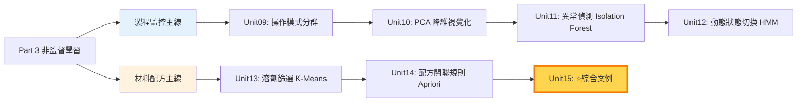
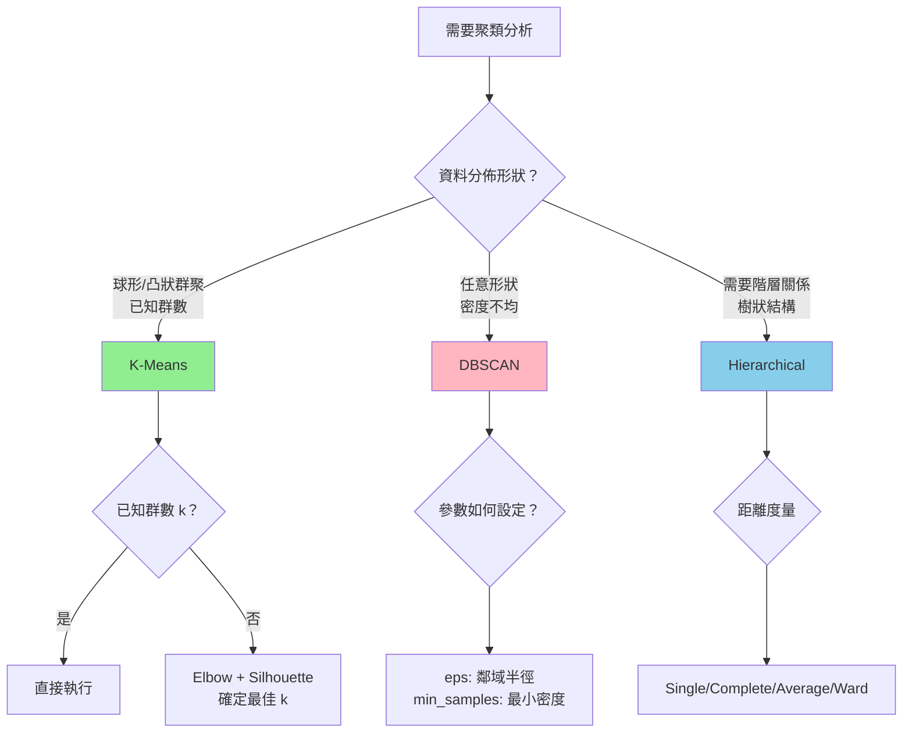
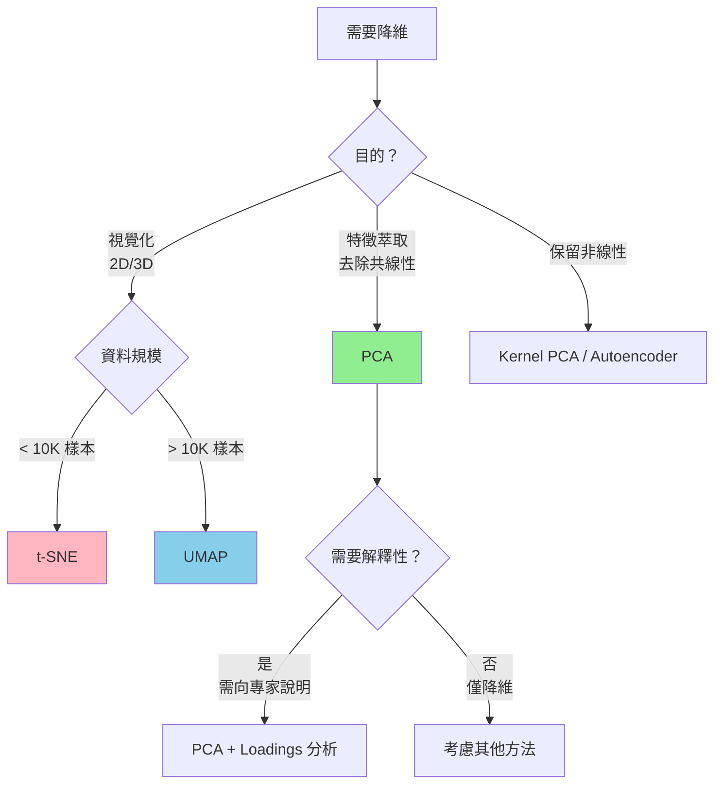
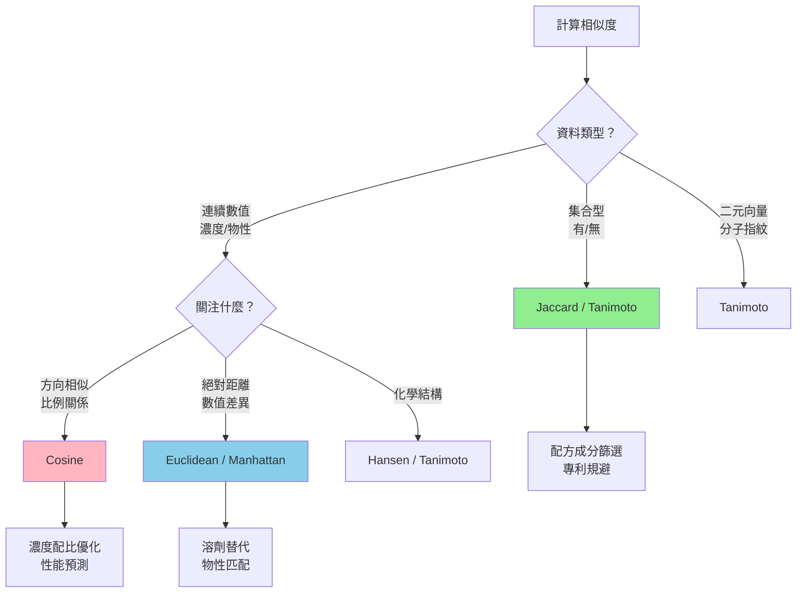
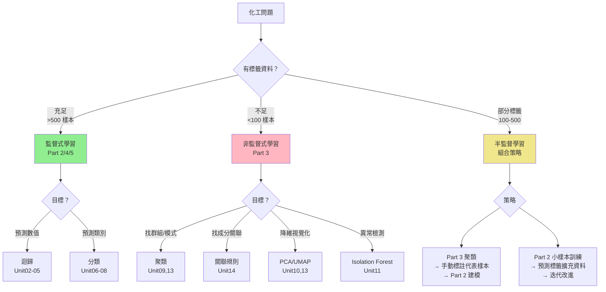
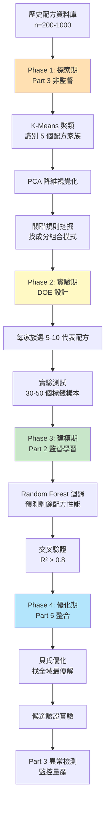

# Part 3｜非監督式學習於化工的應用（Unsupervised Learning for Chemical Engineering）

> **課程代碼**：CHE-AI-101 Part 3  
> **授課對象**：化工、材料、製程工程相關科系大三以上或研究所  
> **先修課程**：Part 1（Python 基礎）、Part 2（監督式學習基礎）  
> **課程時數**：28-32 小時（7 個單元 × 4 小時）  
> **最後更新**：2025-12-17

---

## 📋 課程總覽

### 核心問題

在化工實務中，我們經常面臨以下挑戰：

❌ **沒有標籤資料**：新產品開發、探索性研究階段無性能數據  
❌ **標籤昂貴**：測試週期長（數週至數月）、成本高（數千至數萬元/樣本）  
❌ **標籤不可靠**：多批次、多設備、多操作員，條件不一致  
❌ **標籤定義模糊**：「正常」vs「異常」難以明確界定  

**本 Part 的解決方案**：在「無標籤」或「少量標籤」情境下，仍能從化工資料中萃取洞察、做出可交付的工程決策。

### 兩條主線



---

## 🎯 學習目標

完成本 Part 後，您將能夠：

### 理論層面
✅ 理解非監督學習的核心思想與適用情境  
✅ 掌握 K-Means、DBSCAN、Hierarchical Clustering 的數學原理與差異  
✅ 解釋 PCA 主成分分析的物理意義與工程應用  
✅ 區分 Isolation Forest、One-Class SVM、LOF 的異常檢測機制  
✅ 理解關聯規則挖掘的 Support、Confidence、Lift 指標  

### 實作層面
✅ 使用 Scikit-learn 實作聚類、降維、異常檢測  
✅ 評估聚類品質（Silhouette、Davies-Bouldin、Calinski-Harabasz）  
✅ 解讀 PCA Loadings 並命名主成分的工程意義  
✅ 設計多目標決策流程（性能、安全、環保、成本）  
✅ 整合非監督篩選 + DOE 實驗設計的閉環驗證  

### 工程思維
✅ 識別哪些化工問題適合用非監督方法  
✅ 避免常見陷阱（Simpson's Paradox、小樣本過擬合、局部最優解）  
✅ 將演算法結果轉化為可交付的工程文件（SOP、候選清單、告警規則）  
✅ 向非技術人員（主管、客戶）解釋資料驅動決策的邏輯  
✅ 結合監督式學習（Part 2）與非監督探索，形成完整工作流程  

---

## 📚 單元列表與內容簡介

### 🏭 製程監控主線

#### Unit 09｜操作模式識別（Clustering for Operating Modes）
**檔案**：`Unit09_Clustering_Operating_Modes.md` / `.ipynb`

**工程問題**：化工廠有數百個製程變數（溫度、壓力、流量、組成），如何識別「正常操作模式」vs「異常模式」？

**技術內容**：
- K-Means 聚類演算法（Elbow Method、Silhouette Score）
- Hierarchical Clustering（樹狀圖解讀）
- DBSCAN 密度聚類（處理噪聲與任意形狀）
- 聚類穩定性驗證（Bootstrap、Rand Index）
- **陷阱提醒**：避免無監督資料洩漏（test set 不能參與聚類）

**交付物範例**：
- 操作模式命名表（如「高負載模式」、「啟動模式」、「清洗模式」）
- 每個模式的特徵變數 Top 5
- 模式切換頻率分析與穩定性報告

---

#### Unit 10｜降維視覺化（PCA / UMAP）
**檔案**：`Unit10_Dimensionality_Reduction_PCA_UMAP.md` / `.ipynb`

**工程問題**：如何將 50 維製程資料投影到 2D/3D 平面，讓工程師能「看見」資料結構？

**技術內容**：
- PCA（主成分分析）：Score Plot、Scree Plot、Loadings 解讀
- t-SNE / UMAP：非線性降維，保留局部結構
- 缺失值 / 離群值處理（RobustScaler、Imputation）
- **工程語言翻譯**：將 PC1「正負載高 + 溫度高」翻譯為「高負載操作模式」

**交付物範例**：
- PC 命名表（PC1 = 負載軸、PC2 = 溫度軸）
- 異常樣本標註與根因分析
- 2D/3D 互動式視覺化圖（Plotly）

---

#### Unit 11｜製程安全異常檢測（Isolation Forest / MSPC）
**檔案**：`Unit11_Process_Safety_Anomaly_Detection.md` / `.ipynb`

**工程問題**：如何在無「異常標籤」的情況下，自動偵測製程偏離與潛在風險？

**技術內容**：
- Isolation Forest（隔離森林）：基於路徑長度的異常偵測
- PCA-based MSPC（多變數統計製程管制）：$T^2$ 統計量、SPE（Squared Prediction Error）
- 動態閾值設定（EWMA、CUSUM、滑動窗口）
- 告警分級（Warning / Alarm）與連續 N 策略
- **陷阱案例**：高維詛咒、正常漂移 vs 真正異常

**交付物範例**：
- 告警規則表（變數、閾值、連續 N、抑制策略）
- 事件回顧報告（發生時間 → 確認 → 處置 → 復歸）
- SOP（標準作業程序）草案

---

#### Unit 12｜動態狀態切換（HMM / Change Point Detection）
**檔案**：`Unit12_Dynamic_Regimes_HMM_ChangePoint.md` / `.ipynb`

**工程問題**：製程會經歷不同階段（啟動 → 穩態 → 清洗），如何自動識別狀態切換時間點？

**技術內容**：
- Gaussian Mixture Model（GMM）：多峰分佈建模
- Hidden Markov Model（HMM）：序列狀態推斷
- Change Point Detection（變點檢測）：PELT、Binary Segmentation
- 最小停留時間約束（避免過度切換）
- 線上監控注意事項（延遲、計算成本）

**交付物範例**：
- 狀態字典（State 定義、典型持續時間、關鍵變數）
- 狀態切換率統計（正常頻率 vs 異常頻繁切換）
- 線上部署監控邏輯（Kafka + Redis + 告警系統）

---

### 🧪 材料配方主線

#### Unit 13｜綠色溶劑篩選（K-Means + PCA）
**檔案**：`Unit13_Green_Solvent_Screening.md` / `.ipynb`

**工程問題**：需要替代高毒性溶劑（如 Benzene），如何從數百種候選中快速篩選？

**技術內容**：
- K-Means 聚類（按物性分群）
- PCA 溶劑地圖視覺化（極性、毒性、環保）
- 多目標決策（硬約束 + 加權評分）
- **⚠️ 失敗案例**：
  - 非凸形狀聚類（月牙形催化劑曲線）
  - 不同密度聚類（少量高毒 vs 大量綠色溶劑）
  - 初始化敏感性（局部最優解陷阱）

**交付物範例**：
- 候選 Shortlist（Top 5，附相似度分數、EHS 等級、成本）
- Trade-off 圖（安全性 vs 性能 vs 成本）
- 替代方案風險評估報告

---

#### Unit 14｜配方關聯規則與相似度搜尋（Apriori + Jaccard）
**檔案**：`Unit14_Formulation_Association_Similarity.md` / `.ipynb`

**工程問題**：歷史配方中哪些成分常一起出現？如何找出與目標配方最相似的候選？

**技術內容**：
- Apriori 演算法（頻繁項集挖掘）
- 關聯規則評估（Support、Confidence、Lift、Conviction）
- Jaccard / Cosine / Euclidean 相似度計算
- Holdout 驗證（避免規則過擬合）
- **⚠️ 陷阱案例**：
  - Simpson's Paradox（整體 vs 子群規則矛盾）
  - 小樣本過擬合（Wilson Score Interval）
  - 相關性 ≠ 因果性（電池添加劑 VC 案例）
- **🔬 DOE 整合**：從非監督篩選 → CCD 實驗設計 → Response Surface Modeling

**交付物範例**：
- 規則清單（A → B，附 Confidence、Lift、樣本數、信賴區間）
- 候選配方排序（相似度 × EHS × 成本 × 規則驗證）
- 決策流程圖（如何從 1000 候選縮至 10 候選）

---

#### ⭐ Unit 15｜綜合案例：塗料配方最佳化完整工作流程（NEW）
**檔案**：`Unit15_Integrated_Case_Study.md`

**工程問題**：開發低 VOC 環保塗料，替代 Toluene 溶劑，同時維持光澤度與附著力。

**技術整合**：
1. **Step 1**：K-Means 聚類（50 種溶劑 → 4 群，縮至 15 候選）
2. **Step 2**：Apriori 規則挖掘（200 配方，發現必要組合 BYK-333 + Tego270）
3. **Step 3**：Jaccard 相似度篩選（基線配方 → Top 8 候選，J ≥ 0.70）
4. **Step 4**：多目標最佳化（複合評分：相似度 0.4 + EHS 0.3 + 成本 0.2 + VOC 0.1）
5. **Step 5**：PCA 視覺化（2D 投影驗證候選分佈）
6. **Step 6**：DOE 實驗設計（CCD，3 因子 20 runs，Random Forest RSM）
7. **Step 7**：生產監控（Isolation Forest，異常率 9.4% → 2.6%）

**最終成果**：
- 候選縮減率：**98%**（50 → 1）
- 實驗縮減率：**90%**（估計需 200 次 → 實際 20 次）
- VOC 降低：**-36%**（230 → 147 g/L）
- EHS 改善：**4 → 2**（高風險 → 低風險）
- 成本降低：**-15%**

---

## 🧭 演算法選擇快速指南

### 何時使用哪種聚類方法？



**工程應用對照**：

| 方法 | 最適用場景 | 典型案例 | 優點 | 缺點 |
|-----|----------|---------|------|------|
| **K-Means** | 球形群聚、已知群數 | 製程操作模式識別 | 快速、可解釋 | 需預設 k、對離群值敏感 |
| **DBSCAN** | 任意形狀、含噪聲 | 地理分佈、異常檢測 | 自動偵測群數 | 參數敏感、高維困難 |
| **Hierarchical** | 需要樹狀結構 | 分類體系、產品族 | 完整結構圖 | 計算慢（O(n³)）|

---

### 何時使用哪種降維方法？



**方法比較**：

| 方法 | 保留結構 | 計算速度 | 可解釋性 | 適用維度 |
|-----|---------|---------|---------|---------|
| **PCA** | 全局線性 | ⭐⭐⭐⭐⭐ | ⭐⭐⭐⭐⭐ | 任意 |
| **t-SNE** | 局部非線性 | ⭐⭐ | ⭐ | < 50 |
| **UMAP** | 全局+局部 | ⭐⭐⭐⭐ | ⭐⭐ | 任意 |
| **Autoencoder** | 非線性 | ⭐⭐⭐ | ⭐ | 高維 |

---

### 何時使用哪種相似度指標？



**使用場景對照**：

| 指標 | 數學定義 | 適用場景 | Unit 案例 |
|-----|---------|---------|----------|
| **Jaccard** | $\frac{\|A \cap B\|}{\|A \cup B\|}$ | 成分清單、專利分析 | Unit14 配方篩選 |
| **Cosine** | $\frac{A \cdot B}{\|A\|\|B\|}$ | 濃度配比、文本相似 | 配方優化 |
| **Euclidean** | $\sqrt{\sum(a_i-b_i)^2}$ | 物性替代、聚類 | Unit13 溶劑篩選 |
| **Hansen** | $\sqrt{4(\Delta\delta_d)^2+(\Delta\delta_p)^2+(\Delta\delta_h)^2}$ | 溶劑相容性預測 | 溶解度匹配 |

---

## 📊 評估指標速查表

### 聚類評估指標

| 指標 | 數學定義 | 範圍 | 最佳值 | 優點 | 缺點 | 何時使用 |
|-----|---------|------|--------|------|------|---------|
| **Silhouette** | $\frac{b(i)-a(i)}{\max(a,b)}$ | [-1, 1] | 1 | 同時考慮群內緊密+群間分離 | 偏好凸形群聚 | K-Means, 球形群 |
| **Davies-Bouldin** | $\frac{1}{k}\sum\max\frac{\sigma_i+\sigma_j}{d(c_i,c_j)}$ | [0, ∞] | 0 | 懲罰群聚重疊 | 對密度敏感 | 任意形狀群聚 |
| **Calinski-Harabasz** | $\frac{SS_B/(k-1)}{SS_W/(n-k)}$ | [0, ∞] | 大 | 計算快速 | 對群數敏感 | 大資料集快速評估 |
| **ARI** | 調整後 Rand Index | [-1, 1] | 1 | 可比較不同 k | 需要真實標籤 | 有部分標籤時驗證 |

**工程閾值建議**：
- **Silhouette > 0.5**：合理結構，可接受
- **Silhouette > 0.7**：強結構，聚類品質高
- **Davies-Bouldin < 1.0**：群聚分離良好
- **ARI > 0.8**：與真實標籤高度一致

---

### 降維評估指標

| 指標 | 公式 | 範圍 | 說明 | 應用 |
|-----|-----|------|------|------|
| **解釋變異比** | $\frac{\sum_{i=1}^{k}\lambda_i}{\sum_{i=1}^{p}\lambda_i}$ | [0, 1] | PCA 專用，累積解釋比例 | 決定保留幾個主成分 |
| **重構誤差** | $\|\|X - \hat{X}\|\|_F$ | [0, ∞] | 降維後還原的誤差 | 評估資訊損失 |
| **KL 散度** | $\sum p(x)\log\frac{p(x)}{q(x)}$ | [0, ∞] | t-SNE/UMAP 專用 | 評估分佈保持程度 |

**工程建議**：
- **PCA**：通常保留 **80%-95% 解釋變異比**
- **t-SNE/UMAP**：主要用於視覺化，不強求高解釋比
- **化工應用**：建議至少保留 **前 3-5 個主成分**做可解釋性分析

---

### 關聯規則評估指標

| 指標 | 數學定義 | 範圍 | 最佳值 | 解釋 |
|-----|---------|------|--------|------|
| **Support** | $P(A \cup B)$ | [0, 1] | 適中 | 太低→不穩定，太高→常識 |
| **Confidence** | $P(B\|A)$ | [0, 1] | 1 | 條件機率，規則可靠性 |
| **Lift** | $\frac{P(A \cup B)}{P(A)P(B)}$ | [0, ∞] | >1 | >1 正相關，<1 負相關 |
| **Conviction** | $\frac{1-P(B)}{1-\text{Conf}(A→B)}$ | [0, ∞] | ∞ | 違反規則的代價 |

**化工應用閾值建議**：

| 應用場景 | Support | Confidence | Lift | 理由 |
|---------|---------|-----------|------|------|
| **配方開發** | ≥ 0.05 | ≥ 0.60 | ≥ 1.5 | 探索性，容忍較多規則 |
| **品質管制** | ≥ 0.10 | ≥ 0.80 | ≥ 2.0 | 需要穩定可靠的規則 |
| **安全規範** | ≥ 0.20 | ≥ 0.95 | ≥ 3.0 | 近乎絕對的要求 |

---

## 🔄 監督式 vs 非監督式學習：何時用哪個？

### 決策樹



### 應用場景對照表

| 場景 | 標籤情況 | 推薦方法 | 原因 |
|-----|---------|---------|------|
| **新產品開發** | 無歷史標籤 | Part 3 聚類 + 關聯規則 | 探索性分析，找配方模式 |
| **品質預測** | 充足標籤（QC 資料） | Part 2 迴歸/分類 | 明確目標變數，需精確預測 |
| **異常檢測** | 異常樣本稀少 | Part 3 Isolation Forest | 異常定義模糊，難以標註 |
| **製程優化** | 部分實驗資料 | Part 3 聚類 → DOE → Part 2 | 先縮小空間，再精確建模 |
| **配方相似性** | 無性能標籤 | Part 3 相似度搜尋 | 只需比較結構，不需預測性能 |
| **設備診斷** | 故障紀錄完整 | Part 2 分類 + Part 3 異常 | 已知故障用監督，未知用異常檢測 |

---

### 🔗 組合策略（工業實務最佳實踐）

#### 完整工作流程



#### 各階段細節

**階段 1：探索期（無標籤，使用 Part 3）**
```
200 個歷史配方 
  → K-Means 聚類（識別 5 個配方家族）
  → PCA 降維視覺化（2D 投影）
  → 關聯規則挖掘（找成分組合模式）
  → 輸出：3-5 個代表性配方家族
```

**階段 2：實驗期（生成標籤）**
```
每個家族選 5-10 個代表配方
  → DOE 實驗設計（Central Composite Design）
  → 測試性能（光澤度、附著力、乾燥時間）
  → 獲得 30-50 個標籤樣本
```

**階段 3：建模期（監督式學習，使用 Part 2）**
```
50 個標籤樣本
  → Random Forest / XGBoost 迴歸
  → 預測剩餘 150 個配方的性能
  → 交叉驗證（R² > 0.8）
```

**階段 4：優化期（整合 Part 3 + Part 5）**
```
Part 2 模型預測
  → Part 5 貝氏優化（找全域最優解）
  → 候選驗證實驗
  → Part 3 異常檢測監控量產
```

---

## 🛠️ 技術堆疊與工具

### 核心 Python 套件

```python
# 資料處理
import pandas as pd
import numpy as np

# 視覺化
import matplotlib.pyplot as plt
import seaborn as sns
import plotly.express as px  # 互動式圖表

# 聚類
from sklearn.cluster import KMeans, DBSCAN, AgglomerativeClustering
from sklearn.metrics import silhouette_score, davies_bouldin_score, calinski_harabasz_score

# 降維
from sklearn.decomposition import PCA
from umap import UMAP
from sklearn.manifold import TSNE

# 異常檢測
from sklearn.ensemble import IsolationForest
from sklearn.covariance import EllipticEnvelope
from sklearn.svm import OneClassSVM

# 關聯規則
from mlxtend.frequent_patterns import apriori, association_rules

# 統計分析
from scipy.stats import beta, chi2
from scipy.cluster.hierarchy import dendrogram, linkage, fcluster
import statsmodels.api as sm

# 實驗設計（DOE）
from pyDOE3 import ccdesign, fracfact
```

### 資料集來源

本課程使用的資料集包括：

| 資料集 | 來源 | 大小 | 用途 |
|-------|------|------|------|
| **Boiler Data** | UCI ML Repository | 15K 樣本 × 11 變數 | Unit09-12 製程監控 |
| **Solvent Database** | PubChem / NIST | 200 種溶劑 × 8 物性 | Unit13 溶劑篩選 |
| **Formulation Records** | 模擬工業資料 | 300 配方 × 15 成分 | Unit14-15 配方開發 |
| **NASA Turbofan** | NASA Prognostics Center | 100 引擎 × 21 感測器 | Unit11 異常檢測 |

---

## 📂 檔案結構

```
Part_3/
├── README.md                                    # 本檔案（課程總覽）
├── Unit09_Clustering_Operating_Modes.md        # 聚類理論與實務
├── Unit09_Clustering_Operating_Modes.ipynb     # 實作 Notebook
├── Unit10_Dimensionality_Reduction_PCA_UMAP.md
├── Unit10_Dimensionality_Reduction_PCA_UMAP.ipynb
├── Unit11_Process_Safety_Anomaly_Detection.md
├── Unit11_Process_Safety_Anomaly_Detection.ipynb
├── Unit12_Dynamic_Regimes_HMM_ChangePoint.md
├── Unit12_Dynamic_Regimes_HMM_ChangePoint.ipynb
├── Unit13_Green_Solvent_Screening.md
├── Unit13_Green_Solvent_Screening.ipynb
├── Unit14_Formulation_Association_Similarity.md
├── Unit14_Formulation_Association_Similarity.ipynb
├── Unit15_Integrated_Case_Study.md              # ⭐ 綜合案例
└── outputs/                                      # Notebook 輸出結果
    ├── P3_Unit09_Results/
    ├── P3_Unit10_Results/
    ├── P3_Unit11_Results/
    ├── P3_Unit12_Results/
    ├── P3_Unit13_Results/
    ├── P3_Unit14_Results/
    └── P3_Unit15_Results/
```

---

## 🎓 建議學習路徑

### 路徑 A：製程工程師（重視監控與異常檢測）

```
Unit09 (聚類) → Unit10 (PCA) → Unit11 (異常檢測) → Unit12 (狀態切換)
```

**學習時數**：16-18 小時  
**重點技能**：製程模式識別、多變數監控、告警系統設計  
**適合對象**：石化、煉油、化纖廠製程工程師

---

### 路徑 B：材料開發工程師（重視配方篩選）

```
Unit13 (溶劑篩選) → Unit14 (關聯規則) → Unit15 (綜合案例)
```

**學習時數**：12-14 小時  
**重點技能**：材料相似度搜尋、配方最佳化、多目標決策  
**適合對象**：塗料、黏著劑、電池材料研發工程師

---

### 路徑 C：完整課程（全方位能力）

```
Unit09 → Unit10 → Unit13 → Unit14 → Unit15 → Unit11 → Unit12
```

**學習時數**：28-32 小時  
**重點技能**：非監督學習完整工具箱  
**適合對象**：資料科學工程師、研究所學生、技術主管

---

## 📝 建議交付物（讓練習更像真實專案）

### Unit 09：操作模式識別
- ✅ 操作模式命名表（每個 Cluster 的工程意義）
- ✅ 每個模式的「可操作建議」與監控指標
- ✅ 聚類穩定性檢查結果（Bootstrap Confidence Interval）

### Unit 10：降維視覺化
- ✅ PC 命名表（Top Loadings → 工程語意翻譯）
- ✅ 異常點 / 缺失處理策略對結論的影響說明
- ✅ 2D/3D 互動式視覺化圖（Plotly HTML）

### Unit 11：異常檢測
- ✅ 告警規則表（變數、閾值、連續 N、抑制策略）
- ✅ 事件回顧報告（發生 → 確認 → 處置 → 復歸）
- ✅ SOP（標準作業程序）草案

### Unit 12：狀態切換
- ✅ 狀態字典（State 定義、最小停留時間、切換率門檻）
- ✅ 線上部署的監控邏輯（偽代碼或流程圖）

### Unit 13：溶劑篩選
- ✅ 候選 Shortlist（Top 5-10，附相似度、EHS、成本）
- ✅ Trade-off 圖（安全性 vs 性能 vs 成本）
- ✅ 清楚寫出取捨理由的決策報告

### Unit 14：配方關聯規則
- ✅ 規則在 Holdout 上的可信度（Confidence Drop）
- ✅ 候選縮小流程（相似度 × 規則 × EHS/成本限制）
- ✅ 決策樹流程圖（從 1000 候選 → 10 候選）

### Unit 15：綜合案例
- ✅ 完整技術報告（7 步驟工作流程）
- ✅ 最終配方規格表（成分、比例、性能預測）
- ✅ ROI 分析（候選縮減率、實驗節省成本）

---

## ⚠️ 常見陷阱與解決方案

### 1. 聚類陷阱

| 陷阱 | 症狀 | 解決方案 |
|-----|------|---------|
| **資料洩漏** | Test Set 參與聚類中心計算 | 嚴格分割 Train/Test，僅 Train 做聚類 |
| **初始化敏感** | 每次執行結果不同 | 使用 `init='k-means++'`, `n_init=10` |
| **維度詛咒** | 高維空間距離失效 | 先降維（PCA）再聚類 |
| **離群值主導** | 單一異常點影響群中心 | 使用 RobustScaler 或 DBSCAN |

### 2. 降維陷阱

| 陷阱 | 症狀 | 解決方案 |
|-----|------|---------|
| **過度降維** | 解釋變異比 < 70% | 檢查 Scree Plot，保留更多 PC |
| **未標準化** | 大尺度變數主導 PC | 使用 StandardScaler |
| **解讀錯誤** | PC1 高 ≠ 性能好 | PC 是無監督的，需結合標籤驗證 |
| **t-SNE 過度解讀** | 認為距離有絕對意義 | t-SNE 僅保留局部結構，不可測距離 |

### 3. 關聯規則陷阱

| 陷阱 | 症狀 | 解決方案 |
|-----|------|---------|
| **Simpson's Paradox** | 子群規則與總體矛盾 | 分層分析、檢查混淆因子 |
| **小樣本過擬合** | Confidence=1.0 但 n<5 | 計算 Wilson Score Interval，設定 min_support_count ≥ 10 |
| **相關≠因果** | 誤將共現當因果 | DOE 驗證、專家審查 |

---

## 🔗 與其他 Part 的銜接

### 與 Part 2 的關係（監督式學習）

| Part 2 技術 | Part 3 對應 | 銜接方式 |
|-----------|-----------|---------|
| 線性迴歸 | PCA 降維 | PCA 去除共線性 → 迴歸建模 |
| 隨機森林 | 關聯規則 | 規則生成候選 → RF 預測性能 |
| 分類器 | 聚類標籤 | 聚類生成偽標籤 → 分類器訓練 |

### 與 Part 4 的關係（深度學習）

| Part 4 技術 | Part 3 對應 | 銜接方式 |
|-----------|-----------|---------|
| Autoencoder | PCA | 非線性降維替代方案 |
| CNN | 異常檢測 | 影像異常檢測（如鋼材缺陷）|
| RNN/LSTM | HMM | 序列狀態建模進階版 |

### 與 Part 5 的關係（最佳化）

| Part 5 技術 | Part 3 對應 | 銜接方式 |
|-----------|-----------|---------|
| 貝氏最佳化 | 聚類篩選 | 先聚類縮小空間 → BO 精細搜尋 |
| 多目標最佳化 | 相似度搜尋 | Pareto Front + 相似度約束 |
| DOE | 關聯規則 | 規則生成假設 → DOE 驗證 |

---

## 📖 參考資料與延伸閱讀

### 經典教科書

1. **Hastie, T., Tibshirani, R., & Friedman, J. (2009)**. *The Elements of Statistical Learning* (Chapter 14: Unsupervised Learning)
2. **Bishop, C. M. (2006)**. *Pattern Recognition and Machine Learning* (Chapter 9: Mixture Models and EM)
3. **Aggarwal, C. C., & Reddy, C. K. (2013)**. *Data Clustering: Algorithms and Applications*

### 化工應用論文

1. **Chiang, L. H., Russell, E. L., & Braatz, R. D. (2000)**. *Fault Detection and Diagnosis in Industrial Systems*. Springer. (MSPC 經典)
2. **Rosen, C., & Lennox, J. A. (2001)**. "Multivariate and multiscale monitoring of wastewater treatment operation." *Water Research*, 35(14), 3402-3410.
3. **Kano, M., & Nakagawa, Y. (2008)**. "Data-based process monitoring, process control, and quality improvement." *Computers & Chemical Engineering*, 32(1-2), 12-24.

### 線上資源

- **Scikit-learn Documentation**: https://scikit-learn.org/stable/modules/unsupervised_learning.html
- **UMAP Documentation**: https://umap-learn.readthedocs.io/
- **MLxtend (Apriori)**: http://rasbt.github.io/mlxtend/user_guide/frequent_patterns/apriori/

---

## 💬 常見問題 FAQ

### Q1: 非監督學習結果不穩定怎麼辦？

**A**: 這是正常現象，因為沒有「正確答案」可參考。解決方案：
1. **固定隨機種子**：`random_state=42`
2. **多次執行取共識**：Consensus Clustering
3. **穩定性評估**：Bootstrap + Adjusted Rand Index
4. **結合領域知識**：請專家驗證聚類結果是否合理

### Q2: 如何決定最佳群數 k？

**A**: 綜合使用多種方法：
1. **Elbow Method**：WCSS 下降速度明顯趨緩處
2. **Silhouette Score**：選擇分數最高的 k
3. **Gap Statistic**：與隨機資料比較
4. **領域知識**：化工製程通常有明確的操作模式數（如 3-5 個）

### Q3: PCA 解釋變異比要達到多少才夠？

**A**: 視應用而定：
- **視覺化**：80% 即可（保留前 2-3 個 PC）
- **特徵萃取**：90-95%（避免資訊損失）
- **化工應用**：建議至少保留前 5 個 PC 做可解釋性分析
- **關鍵決策**：可能需要 >95%（如安全關鍵系統）

### Q4: 如何避免關聯規則過擬合？

**A**: 
1. **設定最小樣本數**：每個規則至少 10 個支持樣本
2. **Holdout 驗證**：80% 訓練 + 20% 驗證
3. **計算信賴區間**：Wilson Score Interval
4. **交叉驗證**：K-Fold 檢查規則穩定性
5. **專家審查**：化學機制是否合理

### Q5: 何時該用 DOE 而非非監督學習？

**A**: 
- **用 DOE**：需要建立因果模型、量化交互作用、驗證假設
- **用非監督**：候選數量龐大（>100）、探索性分析、縮小搜尋空間
- **最佳實踐**：先用非監督篩選（1000→10），再用 DOE 精確驗證（10→1）

---

## 📧 聯絡資訊

- **課程負責人**：[教師姓名]
- **Email**：[email@university.edu]
- **Office Hour**：週三 14:00-16:00
- **GitHub**：[課程程式碼倉庫]
- **Discussion Forum**：[Moodle/Slack 連結]

---

## 📜 授權與聲明

本課程教材採用 **CC BY-NC-SA 4.0** 授權：
- ✅ 可自由分享與修改（需註明出處）
- ✅ 可用於教學與研究
- ❌ 禁止商業使用

**資料集使用聲明**：
- Boiler Data: UCI Machine Learning Repository (CC0)
- NASA Turbofan: NASA Prognostics Center (Public Domain)
- 其他模擬資料：本課程原創

---

**最後更新**：2025-12-17  
**版本**：v2.0 (含 Unit15 綜合案例與完整決策樹)

🎉 **祝學習順利！遇到問題歡迎隨時討論。**
