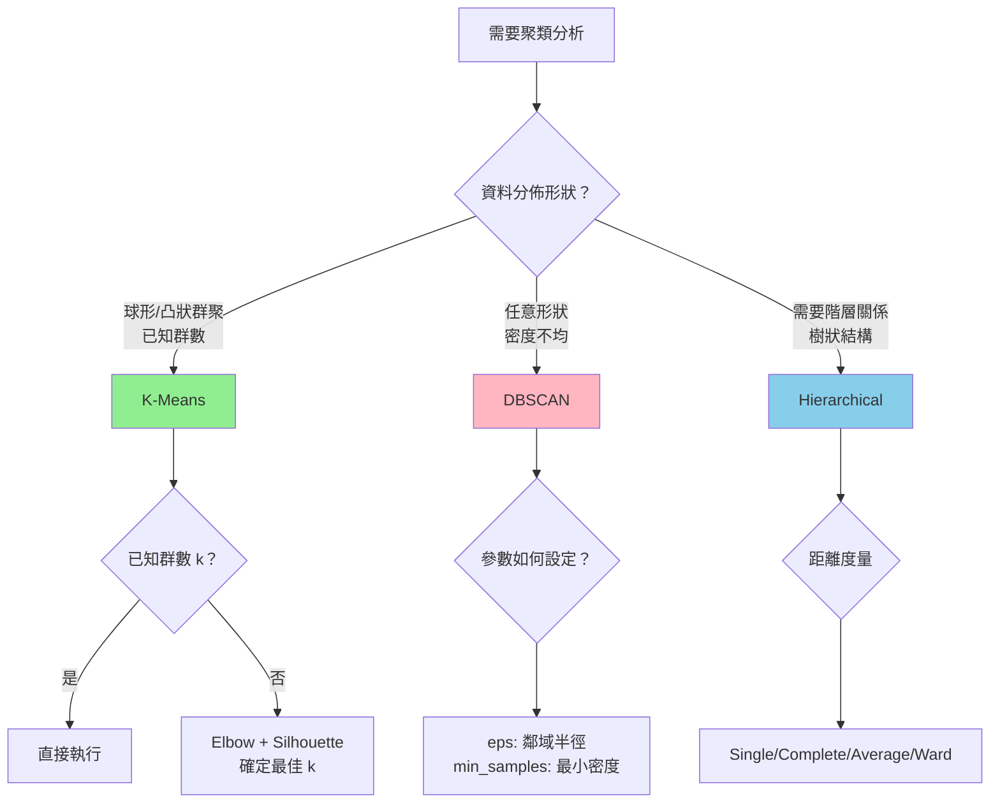
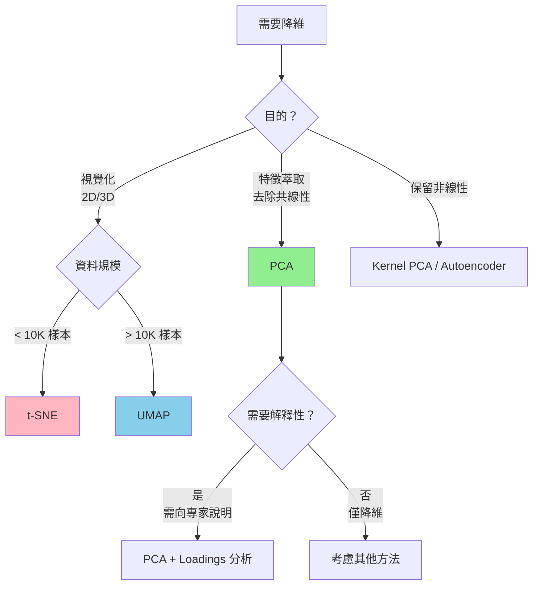
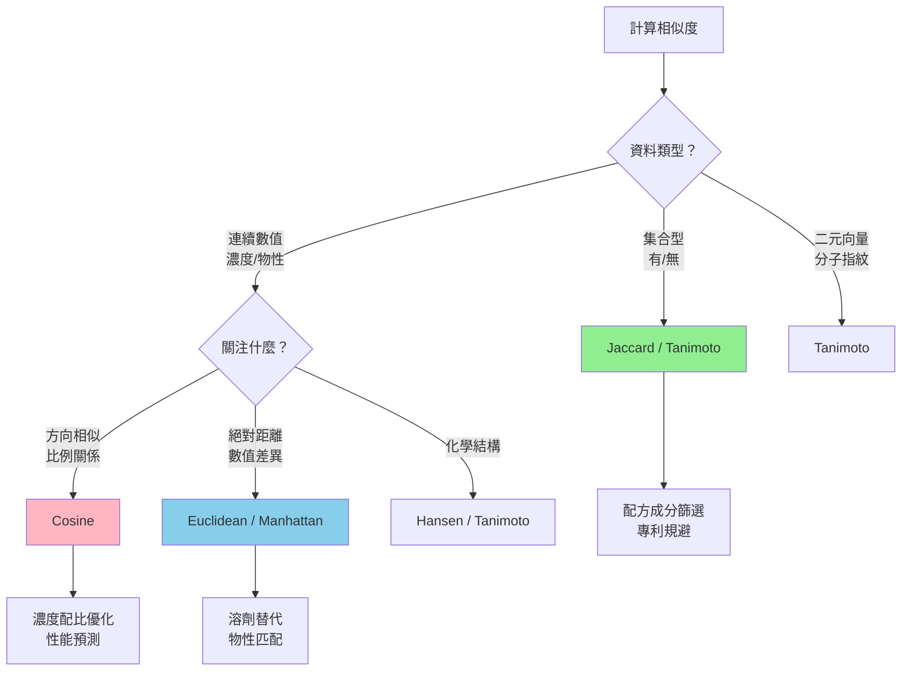
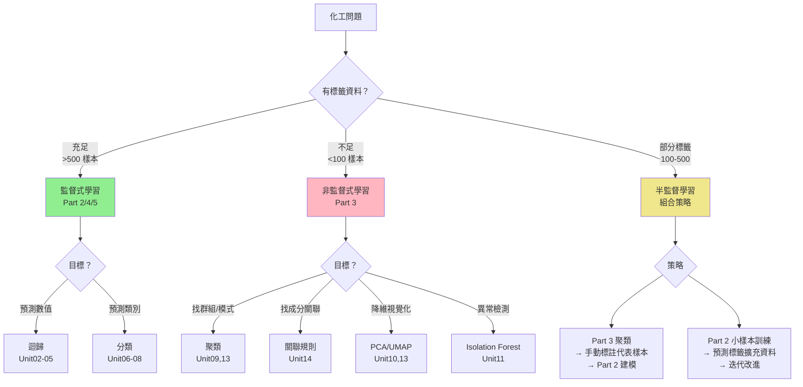

# Part 3｜非監督式學習（Unsupervised Learning）

本 Part 的目標是：在「沒有標籤」或「標籤很昂貴」的情境下，仍能從化工資料中做出可交付的工程決策。

你會學到兩條主線，並在課程中交叉練習：
- **製程監控主線**：操作模式分群 → 降維可視化 → 多變數監控（PCA/MSPC）→ 異常偵測與漂移
- **材料/配方主線**：性質表徵 → 相似度/分群 → 篩選候選集合 → 多目標取捨（性能/安全/環保）

---

## 🧭 演算法選擇快速指南

### 何時使用哪種方法？決策樹

#### 聚類演算法選擇



**工程應用對照**：

| 方法 | 最適用場景 | 典型案例 | 優點 | 缺點 |
|-----|----------|---------|------|------|
| **K-Means** | 球形群聚、已知群數 | 製程操作模式識別 | 快速、可解釋 | 需預設 k、對離群值敏感 |
| **DBSCAN** | 任意形狀、含噪聲 | 地理分佈、異常檢測 | 自動偵測群數 | 參數敏感、高維困難 |
| **Hierarchical** | 需要樹狀結構 | 分類體系、產品族 | 完整結構圖 | 計算慢（O(n³)）|

---

#### 降維演算法選擇



**方法比較**：

| 方法 | 保留結構 | 計算速度 | 可解釋性 | 適用維度 |
|-----|---------|---------|---------|---------|
| **PCA** | 全局線性 | ⭐⭐⭐⭐⭐ | ⭐⭐⭐⭐⭐ | 任意 |
| **t-SNE** | 局部非線性 | ⭐⭐ | ⭐ | < 50 |
| **UMAP** | 全局+局部 | ⭐⭐⭐⭐ | ⭐⭐ | 任意 |
| **Autoencoder** | 非線性 | ⭐⭐⭐ | ⭐ | 高維 |

---

#### 相似度指標選擇



**使用場景對照**：

| 指標 | 數學定義 | 適用場景 | Unit 案例 |
|-----|---------|---------|----------|
| **Jaccard** | $\frac{\|A \cap B\|}{\|A \cup B\|}$ | 成分清單、專利分析 | Unit14 配方篩選 |
| **Cosine** | $\frac{A \cdot B}{\|A\|\|B\|}$ | 濃度配比、文本相似 | 配方優化 |
| **Euclidean** | $\sqrt{\sum(a_i-b_i)^2}$ | 物性替代、聚類 | Unit13 溶劑篩選 |
| **Hansen** | $\sqrt{4(\Delta\delta_d)^2+(\Delta\delta_p)^2+(\Delta\delta_h)^2}$ | 溶劑相容性預測 | 溶解度匹配 |

---

## 📊 評估指標速查表

### 聚類評估指標

| 指標 | 數學定義 | 範圍 | 最佳值 | 優點 | 缺點 | 何時使用 |
|-----|---------|------|--------|------|------|---------|
| **Silhouette** | $\frac{b(i)-a(i)}{\max(a,b)}$ | [-1, 1] | 1 | 同時考慮群內緊密+群間分離 | 偏好凸形群聚 | K-Means, 球形群 |
| **Davies-Bouldin** | $\frac{1}{k}\sum\max\frac{\sigma_i+\sigma_j}{d(c_i,c_j)}$ | [0, ∞] | 0 | 懲罰群聚重疊 | 對密度敏感 | 任意形狀群聚 |
| **Calinski-Harabasz** | $\frac{SS_B/(k-1)}{SS_W/(n-k)}$ | [0, ∞] | 大 | 計算快速 | 對群數敏感 | 大資料集快速評估 |
| **ARI** | 調整後 Rand Index | [-1, 1] | 1 | 可比較不同 k | 需要真實標籤 | 有部分標籤時驗證 |

**工程閾值建議**：
- **Silhouette > 0.5**：合理結構，可接受
- **Silhouette > 0.7**：強結構，聚類品質高
- **Davies-Bouldin < 1.0**：群聚分離良好
- **ARI > 0.8**：與真實標籤高度一致

---

### 降維評估指標

| 指標 | 公式 | 範圍 | 說明 | 應用 |
|-----|-----|------|------|------|
| **解釋變異比** | $\frac{\sum_{i=1}^{k}\lambda_i}{\sum_{i=1}^{p}\lambda_i}$ | [0, 1] | PCA 專用，累積解釋比例 | 決定保留幾個主成分 |
| **重構誤差** | $\|\|X - \hat{X}\|\|_F$ | [0, ∞] | 降維後還原的誤差 | 評估資訊損失 |
| **KL 散度** | $\sum p(x)\log\frac{p(x)}{q(x)}$ | [0, ∞] | t-SNE/UMAP 專用 | 評估分佈保持程度 |

**工程建議**：
- **PCA**：通常保留 **80%-95% 解釋變異比**
- **t-SNE/UMAP**：主要用於視覺化，不強求高解釋比
- **化工應用**：建議至少保留 **前 3-5 個主成分**做可解釋性分析

---

### 關聯規則評估指標

| 指標 | 數學定義 | 範圍 | 最佳值 | 解釋 |
|-----|---------|------|--------|------|
| **Support** | $P(A \cup B)$ | [0, 1] | 適中 | 太低→不穩定，太高→常識 |
| **Confidence** | $P(B\|A)$ | [0, 1] | 1 | 條件機率，規則可靠性 |
| **Lift** | $\frac{P(A \cup B)}{P(A)P(B)}$ | [0, ∞] | >1 | >1 正相關，<1 負相關 |
| **Conviction** | $\frac{1-P(B)}{1-\text{Conf}(A→B)}$ | [0, ∞] | ∞ | 違反規則的代價 |

**化工應用閾值建議**：

| 應用場景 | Support | Confidence | Lift | 理由 |
|---------|---------|-----------|------|------|
| **配方開發** | ≥ 0.05 | ≥ 0.60 | ≥ 1.5 | 探索性，容忍較多規則 |
| **品質管制** | ≥ 0.10 | ≥ 0.80 | ≥ 2.0 | 需要穩定可靠的規則 |
| **安全規範** | ≥ 0.20 | ≥ 0.95 | ≥ 3.0 | 近乎絕對的要求 |

---

## 單元清單（Unit09 起，延續 Part 2）

- `Part_3/Unit09_Clustering_Operating_Modes.md` / `.ipynb`：分群入門（K-Means/階層式/DBSCAN）+ 製程操作模式（避免無監督洩漏、叢集穩定性/漂移檢查）
- `Part_3/Unit10_Dimensionality_Reduction_PCA_UMAP.md` / `.ipynb`：PCA（score/loadings）+ t-SNE/UMAP 視覺化（缺失/離群敏感度、RobustScaler）+ 工程語言翻譯模板
- `Part_3/Unit11_Process_Safety_Anomaly_Detection.md` / `.ipynb`：Isolation Forest + PCA/MSPC（$T^2$ / SPE）+ 漂移辨識 + 告警分級/連續 N（EWMA/CUSUM/OOD gate）+ SOP 草案
- `Part_3/Unit12_Dynamic_Regimes_HMM_ChangePoint.md` / `.ipynb`：狀態切換（GMM/HMM）+ 變工況/批次階段辨識（最小停留時間、切換率限制、線上監控注意事項）
- `Part_3/Unit13_Green_Solvent_Screening.md` / `.ipynb`：綠色溶劑篩選（分群/降維）+ 多目標取捨（硬性約束 + 加權評分 + trade-off 圖）→ 候選 shortlist
- `Part_3/Unit14_Formulation_Association_Similarity.md` / `.ipynb`：配方/材料關聯規則（Apriori 思維）+ 相似度搜尋 + 規則 holdout 驗證/混淆因子 guardrails → 候選縮小與決策紀錄
- **`Part_3/Unit15_Integrated_Case_Study.md`**（⭐ 新增）：**綜合案例 - 塗料配方最佳化完整工作流程**，整合 Unit13-14 技術（聚類 → 關聯規則 → 相似度 → PCA → DOE → 監控）

---

## 🔄 監督式 vs 非監督式學習：何時用哪個？

### 決策樹



### 應用場景對照表

| 場景 | 標籤情況 | 推薦方法 | 原因 |
|-----|---------|---------|------|
| **新產品開發** | 無歷史標籤 | Part 3 聚類 + 關聯規則 | 探索性分析，找配方模式 |
| **品質預測** | 充足標籤（QC 資料） | Part 2 迴歸/分類 | 明確目標變數，需精確預測 |
| **異常檢測** | 異常樣本稀少 | Part 3 Isolation Forest | 異常定義模糊，難以標註 |
| **製程優化** | 部分實驗資料 | Part 3 聚類 → DOE → Part 2 | 先縮小空間，再精確建模 |
| **配方相似性** | 無性能標籤 | Part 3 相似度搜尋 | 只需比較結構，不需預測性能 |
| **設備診斷** | 故障紀錄完整 | Part 2 分類 + Part 3 異常 | 已知故障用監督，未知用異常檢測 |

### 組合策略（工業實務最佳實踐）

**階段 1：探索期（無標籤，使用 Part 3）**
```
200 個歷史配方 
  → K-Means 聚類（識別 5 個配方家族）
  → PCA 降維視覺化
  → 關聯規則挖掘（找成分組合模式）
  → 輸出：3-5 個代表性配方家族
```

**階段 2：實驗期（生成標籤）**
```
每個家族選 5-10 個代表配方
  → DOE 實驗設計
  → 測試性能（光澤度、附著力、乾燥時間）
  → 獲得 30-50 個標籤樣本
```

**階段 3：建模期（監督式學習，使用 Part 2）**
```
50 個標籤樣本
  → Random Forest / XGBoost 迴歸
  → 預測剩餘 150 個配方的性能
  → 交叉驗證（R² > 0.8）
```

**階段 4：優化期（整合 Part 3 + Part 5）**
```
Part 2 模型預測
  → Part 5 貝氏優化（找全域最優解）
  → 候選驗證實驗
  → Part 3 異常檢測監控量產
```

---

## 輸出位置（Notebook 結果）

> 為避免與其他 Part 的 `Unit*_Results` 衝突，Notebook 會把輸出集中到 `outputs/` 底下的 `P3_UnitXX_Results/`。

## 建議交付物（讓練習更像真實專案）

- Unit09：操作模式命名、每個模式的「可操作建議」與監控指標（含穩定性檢查結果）
- Unit10：PC 命名表（top loadings → 工程語意）、異常點/缺失處理策略對結論的影響說明
- Unit11：告警規則表（warning/alarm、連續 N、抑制策略）+ 事件回顧（發生→確認→處置→復歸）
- Unit12：狀態字典（state 定義、最小停留時間、切換率門檻）+ 線上部署的監控邏輯
- Unit13：2 個表（限制/加權、shortlist）+ 1 張 trade-off 圖，清楚寫出取捨理由
- Unit14：規則在 holdout 上的可信度（conf drop）+ 候選縮小流程（相似度 × 規則 × EHS/成本限制）
