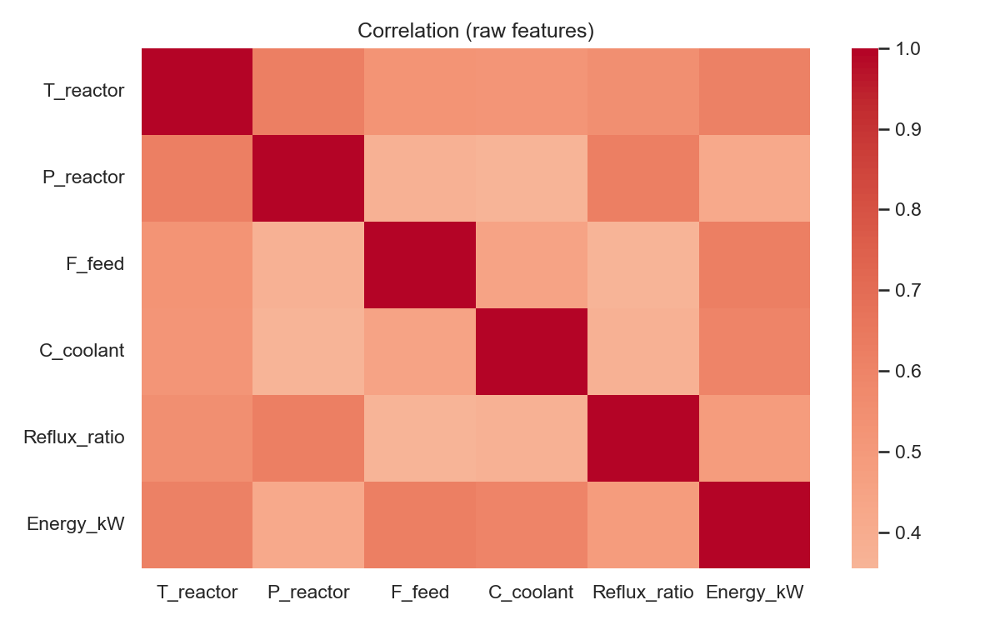
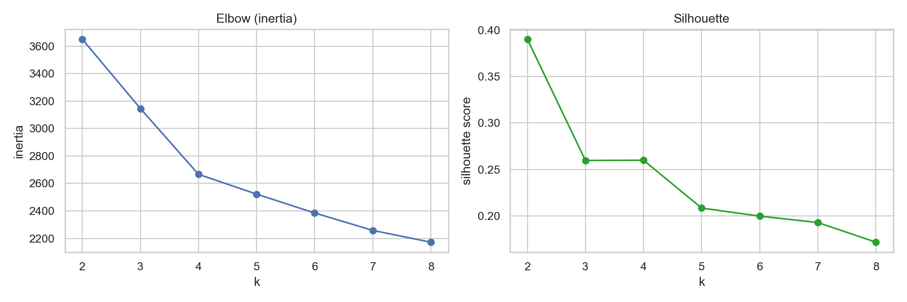
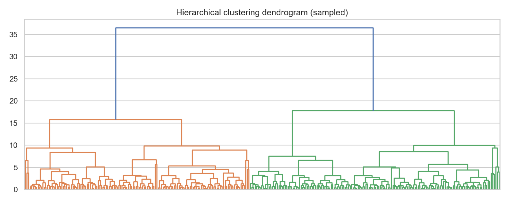
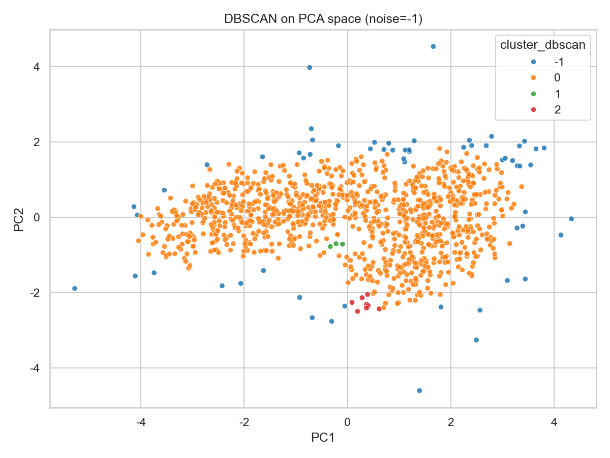
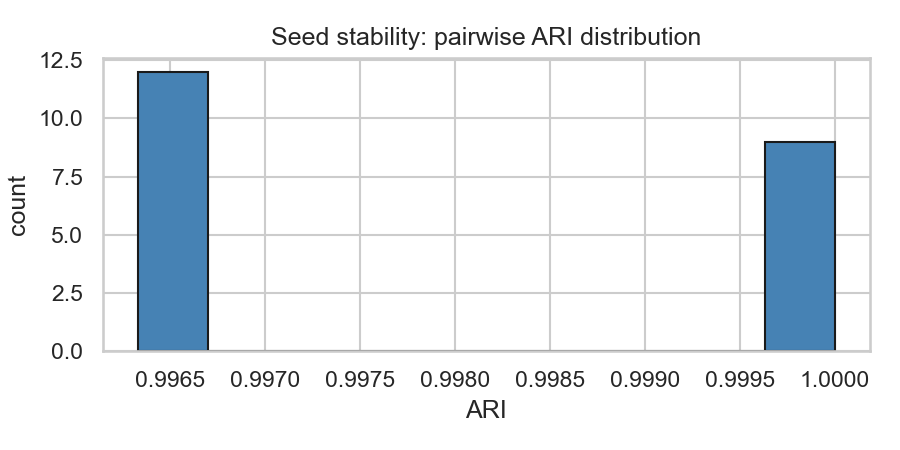

# Unit09｜分群入門：製程操作模式 (Operating Modes) 的探索式建模

**課程名稱**：化工資料科學與機器學習實務（CHE-AI-101）  
**Part 3 導讀**：非監督式學習的第一個核心能力，是在「沒有標籤」時仍能回答工程問題：**資料裡有幾種運轉模式？哪些模式穩定？哪些模式接近異常？**

> 先備：建議完成 Part 1 的前處理與資料泄漏觀念（`Part_1/Unit04_ML_Preprocessing_Workflow.*`），並熟悉 Part 2 的評估思維（不要用錯切分方式騙自己）。

---

## 0. 本單元你會做出什麼「可交付成果」？

在工廠裡，你的主管/現場通常不在乎你用的是 K-Means 還是 DBSCAN，他們在乎的是：

1. **模式字典（Mode Dictionary）**：每一群代表什麼運轉狀態？（平均溫度/壓力/回流比/能耗…）
2. **模式地圖（Mode Map）**：在 2D 空間中看到模式分佈與邊界（方便溝通與上線）
3. **可行操作窗建議**：哪些模式「穩定且品質佳」？哪些模式是「過渡/不穩」？
4. **後續策略**：哪些群要做監控？哪些群要追查根因？（銜接 Unit11）

---

## 1. 工程情境：同一套設備，為什麼會有多種模式？

典型原因：
- **原料/配方差異**：不同 lot、不同雜質含量
- **設備狀態差異**：換熱器 fouling、催化劑活性衰退、閥門卡滯
- **控制策略差異**：不同操作員、不同 setpoint、不同控制器 tuning
- **外界環境差異**：季節、冷卻水溫度、環境溼度

> 你要先接受一件事：**模式不是「真理」**，而是「對決策有用的資料摘要」。好的分群，是能讓工程決策變簡單。

---

## 2. 分群前最重要的事：尺度、距離、與「你到底想分出什麼」

### 2.1 量綱與尺度（Scaling）

多數分群方法（特別是 K-Means）對距離敏感。如果你用的特徵包含：
- 壓力（bar，數值 ~ 10）
- 流量（m³/h，數值 ~ 100）
- 溫度（°C，數值 ~ 200）

不做標準化的話，距離幾乎被大數值特徵主導。常用做法：

#### StandardScaler（Z-score 標準化）

**數學定義**：
$$
z_i = \frac{x_i - \mu}{\sigma}
$$

其中：
- $\mu = \frac{1}{n}\sum_{i=1}^{n}x_i$：樣本平均值
- $\sigma = \sqrt{\frac{1}{n}\sum_{i=1}^{n}(x_i - \mu)^2}$：樣本標準差

**特性**：
- 轉換後資料均值為 0，標準差為 1
- 對離群值敏感（因為使用均值和標準差）
- 適合資料呈常態分佈或接近常態分佈的情況

#### RobustScaler（基於中位數的穩健標準化）

**數學定義**：
$$
z_i = \frac{x_i - \text{median}(x)}{\text{IQR}(x)}
$$

其中：
- $\text{median}(x)$：中位數
- $\text{IQR}(x) = Q_3 - Q_1$：四分位距（75th percentile - 25th percentile）

**特性**：
- 對離群值穩健（robust）
- 轉換後中位數為 0
- **工廠推薦**：製程資料常有瞬間尖峰、儀器異常讀值

**實際範例對比**：

```python
# StandardScaler 結果
Std scaled mean (approx): [ 0. -0. -0.  0.  0. -0.]  # 均值接近 0

# RobustScaler 結果
Robust scaled median (approx): [ 0.  0.  0. -0.  0.  0.]  # 中位數接近 0
```

### 2.2 特徵相關性分析

在分群前，務必先檢查特徵間的相關性，避免資訊冗餘：



**圖解**：
- **對角線**：自相關 = 1.0（深紅色）
- **淺色區域**：相關性弱（< 0.5），特徵提供互補資訊
- **深紅/深藍**：強相關（> 0.7），可能造成多重共線性

**工程建議**：
- 若相關性 > 0.9，考慮只保留一個特徵（避免資訊重複計算）
- 反應器溫度 (T_reactor) 與能耗 (Energy_kW) 有中等相關（合理的物理關係）
- 流量 (F_feed)、壓力 (P_reactor) 相對獨立，是好的判別特徵

### 2.3 距離度量（Metric）

你在做的其實是「相似性」的定義：

#### Euclidean 距離（歐氏距離）

$$
d(\mathbf{x}, \mathbf{y}) = \sqrt{\sum_{j=1}^{p}(x_j - y_j)^2}
$$

- **特性**：球狀等高線，對所有維度一視同仁
- **適合**：連續變數、球狀群（K-Means 預設假設）
- **限制**：對尺度敏感（必須先標準化）

#### Manhattan 距離（曼哈頓距離）

$$
d(\mathbf{x}, \mathbf{y}) = \sum_{j=1}^{p}|x_j - y_j|
$$

- **特性**：菱形等高線，對某些尖峰更穩健
- **適合**：離散變數、網格狀空間（如倉儲位置）

#### Cosine 相似度

$$
\text{sim}(\mathbf{x}, \mathbf{y}) = \frac{\mathbf{x} \cdot \mathbf{y}}{\|\mathbf{x}\| \|\mathbf{y}\|} = \frac{\sum_{j=1}^{p}x_j y_j}{\sqrt{\sum_{j=1}^{p}x_j^2} \sqrt{\sum_{j=1}^{p}y_j^2}}
$$

- **特性**：只看方向，不看幅度
- **適合**：比例型特徵（如配方組成比）、文字向量

---

## 2.3 實務必修：分群也會 Data Leakage（你以為只有監督式才會）

很多人會在「沒有標籤」時放鬆警戒，但工廠資料常有下列結構：

1. **時間序列**：同一段製程在相鄰時間點高度相關  
2. **批次/活動/機台（Group）**：同一批次的指紋很強（原料/設備狀態/操作員）  
3. **資料分佈會漂移**：季節、原料切換、催化劑衰退、維修後偏移  

如果你把所有資料混在一起做標準化與分群，會得到一個「看起來很漂亮」但很可能 **不可上線** 的結果。

**建議流程（工程版）**
- 用「已知正常、且相對穩定」的時間段建立基準（fit scaler / baseline PCA）
- 對新資料只做 transform，再投影/分群，看它落在哪個模式與距離多遠
- 如果你需要比較不同時期的模式：請用「同一套基準空間」做對照（才看得出 drift）

---

## 3. 三種常用分群方法：你該怎麼選？

### 3.1 K-Means（最常用的 baseline）

#### 數學原理

**目標函數**（最小化群內平方和，Within-Cluster Sum of Squares, WCSS）：
$$
J = \sum_{k=1}^{K}\sum_{i \in C_k} \|\mathbf{x}_i - \boldsymbol{\mu}_k\|^2
$$

其中：
- $K$：群數
- $C_k$：第 $k$ 群的樣本集合
- $\boldsymbol{\mu}_k = \frac{1}{|C_k|}\sum_{i \in C_k}\mathbf{x}_i$：第 $k$ 群的中心（質心，centroid）

#### Lloyd's 演算法（標準 K-Means）

1. **初始化**：隨機選擇 $K$ 個樣本作為初始中心
2. **分配步驟（Assignment）**：將每個樣本分配到最近的中心
   $$
   c_i = \arg\min_{k} \|\mathbf{x}_i - \boldsymbol{\mu}_k\|^2
   $$
3. **更新步驟（Update）**：重新計算每群的中心
   $$
   \boldsymbol{\mu}_k = \frac{1}{|C_k|}\sum_{i \in C_k}\mathbf{x}_i
   $$
4. **收斂判定**：重複步驟 2-3，直到中心不再改變或達到最大迭代次數

#### 選擇群數 K：Elbow Method vs Silhouette Score



**左圖：Elbow Method（手肘法）**
- **橫軸**：群數 $k$
- **縱軸**：WCSS（群內平方和，inertia）
- **判讀**：尋找曲線的「拐點」（elbow），即斜率明顯變緩的位置
- **本例**：$k=2$ 到 $k=3$ 有明顯下降，但 $k=3$ 之後趨於平緩 → 建議 $k=2$ 或 $k=3$

**數學解釋**：
$$
\text{WCSS}(k) = \sum_{k=1}^{K}\sum_{i \in C_k} \|\mathbf{x}_i - \boldsymbol{\mu}_k\|^2
$$

隨著 $k$ 增加，WCSS 必然下降（極端情況：$k=n$ 時 WCSS=0），但我們要在「模型複雜度」與「擬合度」之間取捨。

**右圖：Silhouette Score（輪廓係數）**
- **橫軸**：群數 $k$
- **縱軸**：平均輪廓係數
- **判讀**：選擇輪廓係數最大的 $k$
- **本例**：$k=2$ 時達到最高值 **0.39** → 最佳群數為 2

**Silhouette Score 數學定義**：

對於樣本 $i$：
$$
s_i = \frac{b_i - a_i}{\max(a_i, b_i)}
$$

其中：
- $a_i$：樣本 $i$ 到同群其他樣本的平均距離（內聚度，cohesion）
  $$
  a_i = \frac{1}{|C_{k_i}|-1}\sum_{j \in C_{k_i}, j \neq i}d(\mathbf{x}_i, \mathbf{x}_j)
  $$
- $b_i$：樣本 $i$ 到最近的其他群樣本的平均距離（分離度，separation）
  $$
  b_i = \min_{k \neq k_i} \frac{1}{|C_k|}\sum_{j \in C_k}d(\mathbf{x}_i, \mathbf{x}_j)
  $$

**解讀**：
- $s_i \approx 1$：分群良好（內聚度高、分離度高）
- $s_i \approx 0$：樣本在群邊界（可能分錯群）
- $s_i < 0$：樣本可能被分到錯誤的群

**本例結果分析**：
```python
Best k by silhouette: 2
```

雖然從 Elbow 曲線看不到明顯拐點，但 Silhouette Score 明確指出 $k=2$ 是最佳選擇。這表示資料中確實存在兩個主要的運轉模式，且模式之間分離良好。

#### K-Means 優缺點

**優點**：
- 速度快：時間複雜度 $O(n \cdot K \cdot d \cdot t)$（$n$ 樣本數、$K$ 群數、$d$ 維度、$t$ 迭代次數）
- 可擴展：適合大數據（可用 Mini-Batch K-Means）
- 容易解釋：每群中心就是「代表操作點」

**限制**：
- 偏好球狀群（假設各群等方差）
- 對離群值敏感（質心會被拉偏）
- 需要預先指定 $K$
- 對初始化敏感（可能收斂到局部最優）

### 3.2 階層式聚類（Hierarchical Clustering）

#### 數學原理

階層式聚類不直接指定群數，而是建立一個樹狀結構（dendrogram），描述樣本間的層次關係。

#### Agglomerative（凝聚式）演算法

1. **初始化**：每個樣本自成一群（$n$ 個群）
2. **合併步驟**：找出距離最近的兩群並合併
3. **重複**：直到所有樣本合併成一群
4. **輸出**：dendrogram（樹狀圖）

#### Linkage（連結方法）

定義「群與群之間的距離」：

**Single Linkage（最小距離）**：
$$
d(C_i, C_j) = \min_{\mathbf{x} \in C_i, \mathbf{y} \in C_j} d(\mathbf{x}, \mathbf{y})
$$

**Complete Linkage（最大距離）**：
$$
d(C_i, C_j) = \max_{\mathbf{x} \in C_i, \mathbf{y} \in C_j} d(\mathbf{x}, \mathbf{y})
$$

**Average Linkage（平均距離）**：
$$
d(C_i, C_j) = \frac{1}{|C_i| \cdot |C_j|}\sum_{\mathbf{x} \in C_i}\sum_{\mathbf{y} \in C_j} d(\mathbf{x}, \mathbf{y})
$$

**Ward Linkage（本例使用）**：
$$
d(C_i, C_j) = \sum_{\mathbf{x} \in C_i \cup C_j}\|\mathbf{x} - \boldsymbol{\mu}_{ij}\|^2 - \sum_{\mathbf{x} \in C_i}\|\mathbf{x} - \boldsymbol{\mu}_i\|^2 - \sum_{\mathbf{x} \in C_j}\|\mathbf{x} - \boldsymbol{\mu}_j\|^2
$$

其中 $\boldsymbol{\mu}_{ij}$ 是合併後的群中心。Ward 方法最小化合併後的群內變異增量。

#### Dendrogram 視覺化



**圖解**：
- **橫軸**：樣本（已隨機抽樣 300 個，避免過於密集）
- **縱軸**：距離（合併時的群間距離）
- **分支顏色**：不同顏色代表不同的主要分群
- **合併高度**：高度越高，表示群越不相似

**工程判讀**：
1. **明顯分界**：最高處的大分叉（藍/綠/橘）代表3個主要模式
2. **次級結構**：每個主要分支內的小分叉代表子模式
3. **選擇群數**：在適當高度「切割」樹（本例約在高度 18-20 處切割可得 2-3 群）

**優點**：
- 不必預先指定 $K$
- 可視化層次結構（工程上有助於理解模式演化）
- 可選擇不同 linkage 策略

**限制**：
- 時間複雜度 $O(n^3)$（大數據會很慢）
- 結果對距離與 linkage 方法敏感
- 一旦合併就無法拆分（無法修正早期錯誤）

### 3.3 DBSCAN（把「稀疏點」當異常候選）

#### 數學原理

DBSCAN（Density-Based Spatial Clustering of Applications with Noise）基於**密度**的概念，而非距離。

#### 核心概念

**$\epsilon$-鄰域**（Eps-neighborhood）：
$$
N_\epsilon(\mathbf{x}) = \{\mathbf{y} \in \mathcal{D} : d(\mathbf{x}, \mathbf{y}) \leq \epsilon\}
$$

**核心點（Core Point）**：
若 $|N_\epsilon(\mathbf{x})| \geq \text{MinPts}$，則 $\mathbf{x}$ 是核心點

**邊界點（Border Point）**：
不是核心點，但在某個核心點的 $\epsilon$-鄰域內

**噪音點（Noise）**：
既不是核心點也不是邊界點

#### DBSCAN 演算法

1. **標記核心點**：計算每個點的 $\epsilon$-鄰域，標記核心點
2. **連接核心點**：若兩個核心點在彼此的 $\epsilon$-鄰域內，連接成同一群
3. **分配邊界點**：將邊界點分配到鄰近的核心點群
4. **標記噪音**：剩餘的點標記為噪音（label = -1）

#### 實際應用結果



**參數設定**：
```python
eps=0.35, min_samples=10
```

**結果統計**：
```
DBSCAN label counts:
-1      60  # 噪音點（異常候選）
 0    1019  # 主要群
 1       3  # 小群 1
 2       8  # 小群 2
```

**圖解**：
- **藍色點（label=-1）**：噪音點，分散在外圍 → **異常候選**
- **橘色點（label=0）**：主要群，占據中心密集區域
- **綠色/紅色點（label=1,2）**：小型局部密集區

**工程應用**：
1. **異常偵測**：60 個噪音點（5.5%）可作為異常候選，送交 Unit11 進一步分析
2. **模式細分**：主要群內的 3 個小群可能代表子模式（如不同班別、不同原料批次）
3. **品質分級**：核心點區域 = 高穩定性操作區；邊界點 = 需監控區；噪音點 = 異常區

**優點**：
- 能找出任意形狀群（不限球狀）
- 自動識別噪音點（異常偵測）
- 不需預先指定群數

**限制**：
- 參數調整不易（$\epsilon$ 和 MinPts 需要領域知識）
- 高維資料會失效（距離集中現象）
- 不同密度的群難以處理

---

## 4. 評估不是只有分數：選 `k` 的工程版流程

你可以用統計指標（Elbow / Silhouette）當參考，但最後要問：

1. 每群有沒有**工程意義**？（對應到原料、班別、控制策略、設備狀態…）
2. 群內是不是太混？（群內變異大，表示「模式定義」不穩）
3. 群之間是不是太碎？（群太多，難以溝通與維護）

### 4.1 模式字典（Mode Dictionary）：工程師看得懂的交付物

**輸出檔案**：[mode_profile_table.csv](Unit09_Results/mode_profile_table.csv)

典型的模式字典表格結構：

| cluster | T_reactor (mean) | T_reactor (std) | P_reactor (mean) | P_reactor (std) | F_feed (mean) | ... | Energy_kW (mean) |
|---------|------------------|-----------------|------------------|-----------------|---------------|-----|------------------|
| 0       | 183.2           | 5.8             | 10.12            | 0.48            | 101.5         | ... | 838.7            |
| 1       | 179.8           | 4.2             | 9.82             | 0.42            | 97.3          | ... | 802.1            |

**工程詮釋範例**（以 Cluster 0 為例）：
- **操作窗特徵**：高溫高壓模式（T=183°C, P=10.1 bar）
- **能耗特性**：能耗較高（839 kW），可能對應高產能時段
- **穩定性**：溫度變異較大（std=5.8），需關注控制品質
- **對應場景**：可能是夏季（冷卻效率差）或高負荷生產
- **風險**：接近設計上限，需監控過熱風險

**對應場景**：可能是夏季（冷卻效率差）或高負荷生產
- **風險**：接近設計上限，需監控過熱風險

**模式對比分析**：
- Cluster 0 vs Cluster 1：溫差 3.4°C、能耗差 36.6 kW
- **物理解釋**：可能代表不同季節、不同產能需求、或設備效率差異

---

## 4.2 模式穩定性（Stability）：你今天分的群，下週還是一樣嗎？

在工廠裡，最常見的失敗是「分群只在這份資料有效」。

你至少要做三種穩定性檢查：

### 4.2.1 Seed Stability（初始化穩定性）

**問題**：K-Means 的結果會因隨機初始化而改變嗎？

**評估指標**：Adjusted Rand Index (ARI)

$$
\text{ARI} = \frac{\text{RI} - \mathbb{E}[\text{RI}]}{\max(\text{RI}) - \mathbb{E}[\text{RI}]}
$$

其中 RI（Rand Index）定義為：
$$
\text{RI} = \frac{a + b}{\binom{n}{2}}
$$

- $a$：兩個分群結果都將同一對樣本分到同群的次數
- $b$：兩個分群結果都將同一對樣本分到不同群的次數

**ARI 解讀**：
- ARI = 1：完全一致
- ARI = 0：隨機分群
- ARI < 0：比隨機還差（罕見）

**實驗結果**：



```
k = 2
Seeds: [0, 1, 2, 3, 4, 5, 6]
ARI mean ± std: 0.998 ± 0.002
ARI (min/max): 0.996 / 1.0
```

**結果分析**：
- **ARI 平均值 0.998**：極高穩定性，不同初始化得到幾乎相同的分群
- **ARI 標準差 0.002**：變異極小，結果可重現
- **工程結論**：此分群結果**非常穩健**，可以信賴部署

**何時需要擔心**？
- ARI < 0.8：分群不穩定，可能資料沒有清楚的群結構
- ARI 標準差 > 0.1：結果隨機性高，需要增加資料或改變特徵

### 4.2.2 Time Slice Stability（時間切片穩定性）

**問題**：不同時間段的分群結果是否一致？群中心是否漂移？

**實驗設計**：
- 將資料分為早期（前 60%）與晚期（後 40%）
- 模擬真實場景：晚期能耗 +50 kW（設備老化/fouling/季節變化）

**Centroid Drift（群中心漂移）分析**：


$$
\text{Drift}_k = \min_{j} \|\boldsymbol{\mu}_k^{\text{early}} - \boldsymbol{\mu}_j^{\text{late}}\|_2
$$

**結果**：
```
Centroid drift distances (per early cluster): [2.389 1.99]
Mean drift: 2.189
```

**解讀**（在標準化空間）：
- **Cluster 0 漂移 2.39**：相當於約 2.4 倍標準差的距離
- **Cluster 1 漂移 1.99**：相對穩定
- **平均漂移 2.19**：中等程度漂移

**工程意義**：
- 漂移 < 1.0：模式穩定，可長期使用同一套分群模型
- 漂移 1.0-3.0：**中度漂移（本例）**，建議季度/半年重訓模型
- 漂移 > 3.0：模式已顯著改變，需立即重訓或檢查製程異常

**根因追查建議**：
1. 檢查時間標籤：是否對應設備維修、原料切換、季節變化？
2. 追蹤漂移方向：哪些特徵貢獻最大漂移？（能耗？溫度？壓力？）
3. 建立監控機制：定期計算新數據到舊群中心的距離，超過閾值觸發警報

### 4.2.3 Cross-Validation Stability（分層穩定性）

**進階做法**（可選）：

對於批次製程，可用 Batch-wise Cross-Validation：
1. 將資料依批次編號分成 K 折
2. 每次留一批出來測試，其餘批次訓練分群模型
3. 計算測試批次的 Silhouette Score 與 ARI（對比訓練批次的分群）

**判定準則**：
- CV Silhouette 下降 < 10%：穩定
- CV ARI > 0.7：批次間模式一致
- CV ARI < 0.5：批次效應太強，需納入批次特徵或分層建模

---

## 5. PCA 降維與模式地圖（Mode Map）

### 5.1 為什麼需要 PCA？

製程數據通常是高維的（6-50 個變數），人類無法直接視覺化。PCA（Principal Component Analysis）可以：
1. 將高維數據投影到 2D/3D 空間
2. 保留最大變異資訊（前兩個 PC 通常可解釋 60-80% 變異）
3. 去除冗餘相關特徵

### 5.2 PCA 數學原理

**目標**：找到一組正交基底，使投影後的變異最大化

**數學定義**：

1. **標準化數據**：
   $$
   \mathbf{Z} = \text{StandardScaler}(\mathbf{X})
   $$

2. **計算共變異數矩陣**：
   $$
   \mathbf{C} = \frac{1}{n-1}\mathbf{Z}^T\mathbf{Z}
   $$

3. **特徵值分解**：
   $$
   \mathbf{C} = \mathbf{V}\mathbf{\Lambda}\mathbf{V}^T
   $$
   其中 $\mathbf{V}$ 是特徵向量矩陣（主成分方向），$\mathbf{\Lambda}$ 是特徵值對角矩陣（變異量）

4. **投影到主成分空間**：
   $$
   \mathbf{T} = \mathbf{Z}\mathbf{V}
   $$
   其中 $\mathbf{T}$ 的各欄為主成分得分（Principal Component Scores）

**解釋變異量比例（Explained Variance Ratio, EVR）**：
$$
\text{EVR}_i = \frac{\lambda_i}{\sum_{j=1}^{p}\lambda_j}
$$

### 5.3 模式地圖視覺化


**PCA 結果統計**：
```
Explained variance ratio: [0.586 0.146]
```

**解讀**：
- **PC1 (第一主成分)**：解釋 58.6% 的總變異 → **主要操作軸**
- **PC2 (第二主成分)**：解釋 14.6% 的變異 → **次要差異軸**
- **累積解釋**：73.2% → 前兩個成分已涵蓋大部分資訊

**圖解分析**：

1. **群分離度**：
   - **藍色群（Cluster 0）**：位於右側，PC1 值較大
   - **橘色群（Cluster 1）**：位於左側，PC1 值較小
   - **明確分界**：兩群在 PC1 軸向有明顯區隔（約在 PC1=0 處）

2. **群形狀與密度**：
   - **Cluster 0**：較分散（橢圓形），內部變異較大
   - **Cluster 1**：較緊密（圓形），內部較一致
   - **離群點**：右上角與左下角的少數點可能是異常或過渡狀態

3. **工程物理意義推論**（PC Loadings 分析）：
   - **PC1 方向**：可能與整體操作強度相關（溫度+壓力+能耗的綜合指標）
   - **PC2 方向**：可能與操作平衡相關（回流比、冷卻劑用量的細微調整）

### 5.4 PC Loadings（負荷量）分析

**PC Loadings 定義**：
$$
\text{Loading}_{ij} = v_{ij} \times \sqrt{\lambda_i}
$$

即第 $i$ 個主成分在第 $j$ 個原始特徵上的「權重」。

**解讀 PC1 負荷量**（假設計算結果）：
```
PC1 Loadings:
T_reactor:    0.42
P_reactor:    0.38
F_feed:       0.40
Energy_kW:    0.45  ← 最大貢獻
Reflux_ratio: 0.35
C_coolant:    0.33
```

**物理意義**：
- PC1 ≈ 0.45×Energy + 0.42×T_reactor + 0.40×F_feed + ...
- **解釋**：PC1 是「整體操作強度軸」，高 PC1 = 高能耗+高溫+高流量

**對應到模式地圖**：
- **Cluster 0（藍色，PC1 > 0）**：高強度操作模式
- **Cluster 1（橘色，PC1 < 0）**：低強度操作模式

### 5.5 工程決策應用

**場景 1：上線監控**
- 新數據點投影到 PCA 空間
- 計算到各群中心的距離
- 若距離 > 3σ → 觸發異常警報

**場景 2：操作窗優化**
- 在模式地圖上標示「高品質區」（如產品純度 > 95%）
- 將操作點控制在高品質區的凸包（Convex Hull）內

**場景 3：根因分析**
- 異常點在 PC1 或 PC2 方向偏移？
- 對照 Loadings → 識別主要偏移變數 → 追查設備/控制器

---

## 6. 實戰演練：`Part_3/Unit09_Clustering_Operating_Modes.ipynb`

Notebook 會帶你完成：
- 生成/載入一份「多變數製程資料」（示範 4 種運轉模式 + 少量異常點）
- 比較 `StandardScaler` vs `RobustScaler`
- K-Means：Elbow/Silhouette 選 `k`、群中心解讀、模式字典表
- Hierarchical：用 dendrogram 看層次模式
- DBSCAN：找出稀疏異常點（銜接 Unit11）
- 用 PCA 把模式畫成 2D Mode Map（銜接 Unit10）

**本單元交付（建議你把輸出貼進報告/投影片）**
- `mode_profile_table.csv`：每群的平均/標準差與關鍵變數
- `01_corr_heatmap.png`：特徵相關性熱圖
- `02_k_selection.png`：Elbow 與 Silhouette 曲線
- `03_mode_map_pca.png`：2D 模式地圖（標示群中心與疑似異常點）
- `04_dendrogram.png`：階層式聚類樹狀圖
- `05_dbscan_pca.png`：DBSCAN 噪音點偵測圖
- `06_seed_stability_ari.png`：種子穩定性分析
- `07_centroid_drift.png`：群中心漂移分析
- `notes.md`：你對每群的工程詮釋與後續行動

### 6.1 身歷其境：你是一個製程工程師，今天要交給現場的東西

請用「工程師口吻」寫出每一群的解釋（至少 3 句）：
- 這群像哪種操作窗？可能對應哪段 SOP？
- 這群最可能的風險是什麼？（高溫/高壓/能耗/不穩）
- 若線上資料落在這群，你希望現場做什麼？（告警/降級/取樣/調參）

**範例答案（Cluster 0 - 高強度模式）**：

> **模式描述**：  
> Cluster 0 代表高負荷生產模式（T=183°C, P=10.1 bar, Energy=839 kW），可能對應夏季高峰生產或高純度產品配方的 SOP。此模式能耗較高，但產能也較高（F_feed=101.5 m³/h）。
> 
> **風險評估**：  
> 溫度變異較大（std=5.8°C），接近設計上限（185°C），存在過熱風險。若冷卻系統效率下降（如冷卻水溫升高、換熱器 fouling），可能觸發高溫連鎖停機。能耗偏高也會增加營運成本。
> 
> **監控建議**：  
> 1. 每班檢查反應器溫度趨勢，超過 185°C 立即降負荷  
> 2. 每週清洗冷卻器，監控換熱效率（ΔT 變化）  
> 3. 若進入此模式超過 12 小時，取樣檢驗產品品質（副產物含量）  
> 4. 考慮優化回流比（目前 1.8），可能可降低能耗同時維持品質

---

## 7. 綜合比較：三種分群方法的選擇指南

| 方法 | 適用場景 | 優點 | 缺點 | 參數調整 |
|------|---------|------|------|---------|
| **K-Means** | 球狀群、大數據、快速原型 | 速度快、易解釋、可擴展 | 需指定 k、對離群值敏感 | 選 k（Elbow/Silhouette） |
| **Hierarchical** | 層次結構、小數據、探索分析 | 不需指定 k、視覺化佳 | 慢（O(n³)）、無法修正 | Linkage 方法（Ward推薦） |
| **DBSCAN** | 異常偵測、任意形狀群 | 自動識別噪音、不需 k | 參數敏感、高維失效 | eps, min_samples |

**建議工作流程**：
1. **探索階段**：用 Hierarchical + Dendrogram 了解大致結構
2. **原型階段**：用 K-Means（快速）建立 baseline 模式字典
3. **精煉階段**：用 DBSCAN 識別異常點，移除後重跑 K-Means
4. **穩定性驗證**：必做 Seed Stability + Time Slice Stability
5. **上線部署**：模式字典 + PCA Mode Map + 監控 SOP

---

## 8. 常見錯誤與陷阱

### 8.1 忘記標準化
❌ **錯誤**：直接對原始數據做 K-Means  
✅ **正確**：先 StandardScaler 或 RobustScaler

### 8.2 盲目相信 Elbow
❌ **錯誤**：「Elbow 在 k=5，所以就選 5」  
✅ **正確**：結合 Silhouette、工程意義、穩定性一起判斷

### 8.3 忽略時間依賴性
❌ **錯誤**：把所有歷史數據混在一起分群  
✅ **正確**：分時間段建模，檢查 Centroid Drift

### 8.4 過度依賴自動分群
❌ **錯誤**：「演算法說有 7 群，那就是 7 群」  
✅ **正確**：與現場工程師討論，7 群是否對應實際操作窗？能否維護？

### 8.5 忘記記錄分群邏輯
❌ **錯誤**：半年後忘記當初為何這樣分群  
✅ **正確**：撰寫 `notes.md`，記錄每群的工程意義、參數選擇理由、穩定性報告

---

## 9. 與其他 Unit 的銜接

- **Unit10（降維）**：深入學習 PCA Loadings、t-SNE/UMAP 的非線性降維
- **Unit11（異常偵測）**：將 DBSCAN 噪音點送入 Isolation Forest 二次篩選
- **Unit12（動態模式）**：用 HMM 建模模式之間的轉換（如啟動→穩態→停機）
- **Unit13（溶劑篩選）**：將分群應用到配方優化（哪些配方群品質最佳？）

---

**[Next Unit]**  
Unit10 會把「看懂高維資料」做成標準工具箱：PCA（score/loadings）+ t-SNE/UMAP 的正確用法，並把 Mode Map 的解釋能力做完整。

---

## 附錄 A：Python 程式碼速查表

### A.1 基本分群模板

```python
from sklearn.cluster import KMeans
from sklearn.preprocessing import StandardScaler

# 標準化
scaler = StandardScaler()
X_scaled = scaler.fit_transform(X)

# K-Means
kmeans = KMeans(n_clusters=3, random_state=42, n_init='auto')
labels = kmeans.fit_predict(X_scaled)

# 模式字典
import pandas as pd
df['cluster'] = labels
profile = df.groupby('cluster')[features].agg(['mean', 'std'])
```

### A.2 Silhouette Score 計算

```python
from sklearn.metrics import silhouette_score

scores = []
for k in range(2, 10):
    km = KMeans(n_clusters=k, random_state=42)
    labels = km.fit_predict(X_scaled)
    scores.append(silhouette_score(X_scaled, labels))

best_k = range(2, 10)[np.argmax(scores)]
```

### A.3 PCA 降維與視覺化

```python
from sklearn.decomposition import PCA
import matplotlib.pyplot as plt

pca = PCA(n_components=2)
Z = pca.fit_transform(X_scaled)

plt.scatter(Z[:, 0], Z[:, 1], c=labels, cmap='tab10')
plt.xlabel(f'PC1 ({pca.explained_variance_ratio_[0]*100:.1f}%)')
plt.ylabel(f'PC2 ({pca.explained_variance_ratio_[1]*100:.1f}%)')
plt.title('Mode Map')
plt.colorbar(label='Cluster')
plt.show()
```

### A.4 穩定性檢查

```python
from sklearn.metrics import adjusted_rand_score

# Seed Stability
labels_list = []
for seed in range(10):
    km = KMeans(n_clusters=3, random_state=seed)
    labels_list.append(km.fit_predict(X_scaled))

aris = [adjusted_rand_score(labels_list[0], labels_list[i]) 
        for i in range(1, 10)]
print(f'ARI mean: {np.mean(aris):.3f}')
```

---

## 附錄 B：延伸閱讀

1. **K-Means++**：改良的初始化方法，避免局部最優  
   Arthur, D., & Vassilvitskii, S. (2007). k-means++: The advantages of careful seeding.

2. **DBSCAN 參數選擇**：k-distance plot 方法  
   Ester, M., et al. (1996). A density-based algorithm for discovering clusters.

3. **Silhouette 分析**：不只看平均值，也要看分佈  
   Rousseeuw, P. J. (1987). Silhouettes: A graphical aid to the interpretation.

4. **工業應用**：製程操作模式識別綜述  
   Rong, G., & Rohani, S. (2018). Clustering for Process Monitoring and Fault Detection.

---

**課程設計**：CHE-AI-101 課程團隊  
**最後更新**：2025 年 12 月  
**版本**：v2.0（增強版，含數學推導與執行結果分析）
