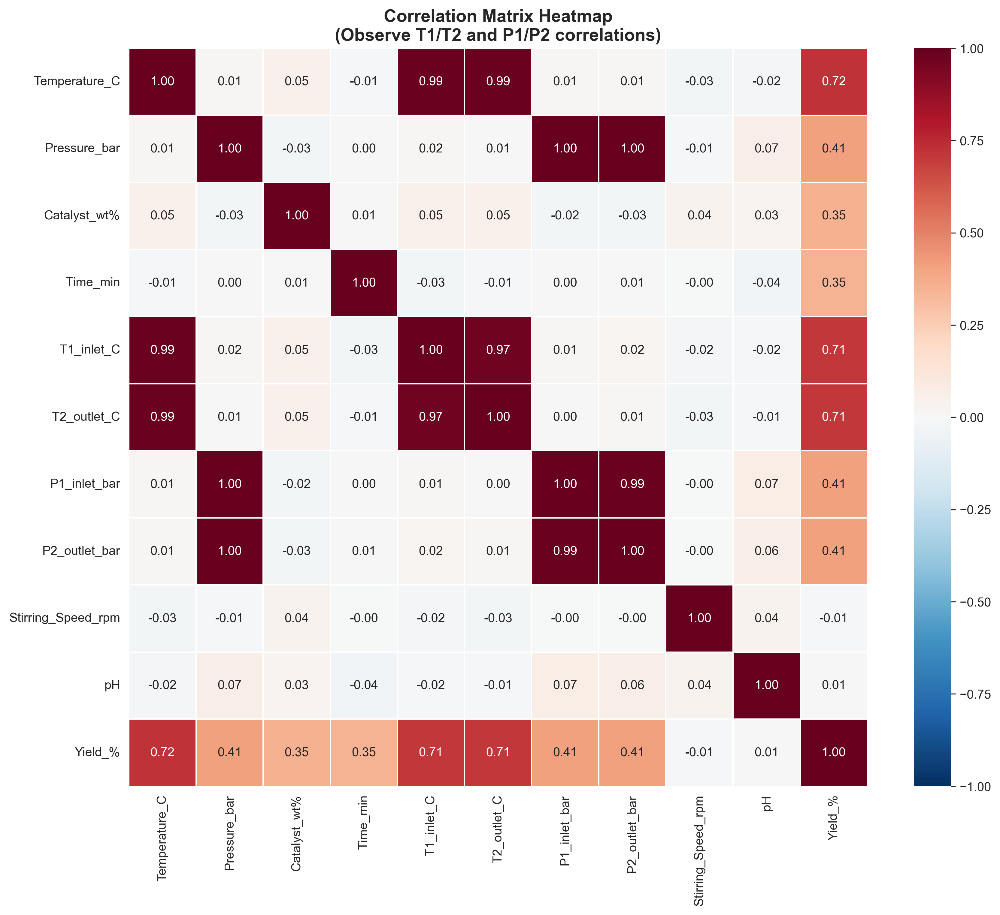
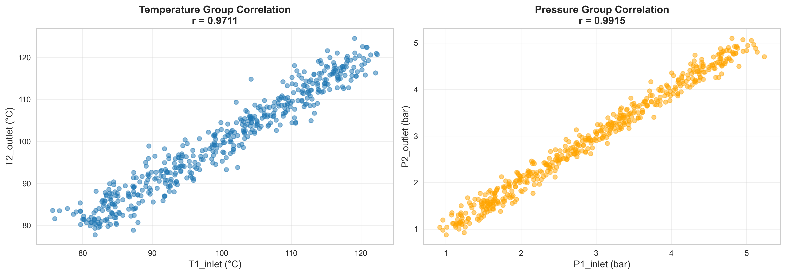
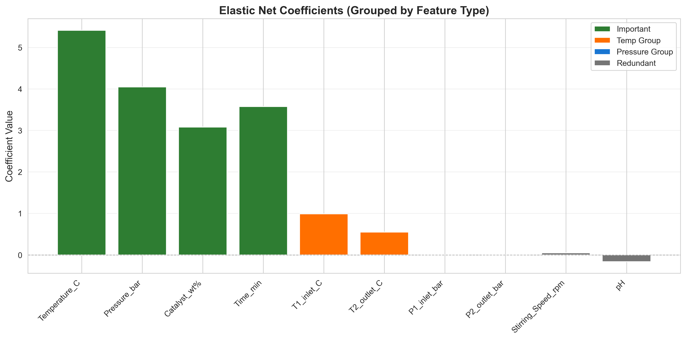
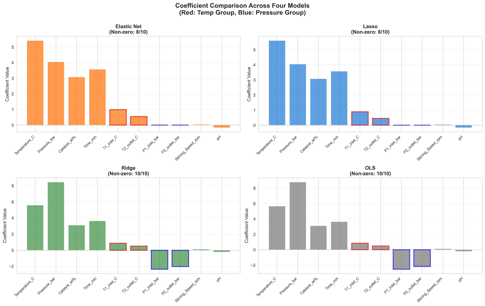
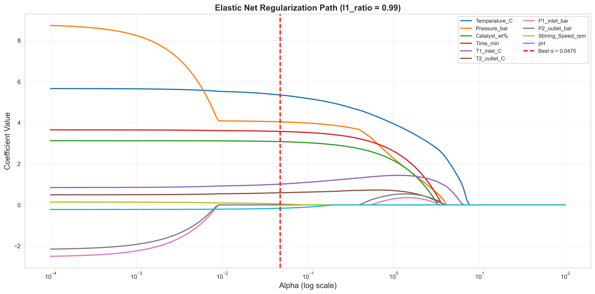
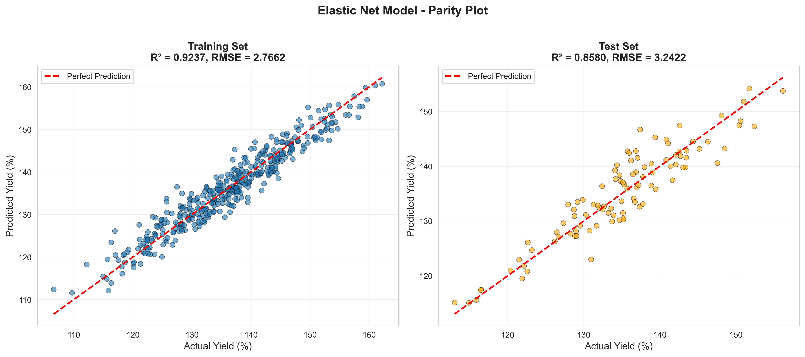
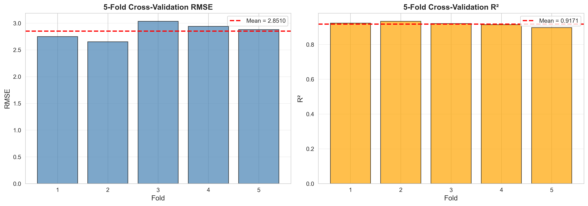
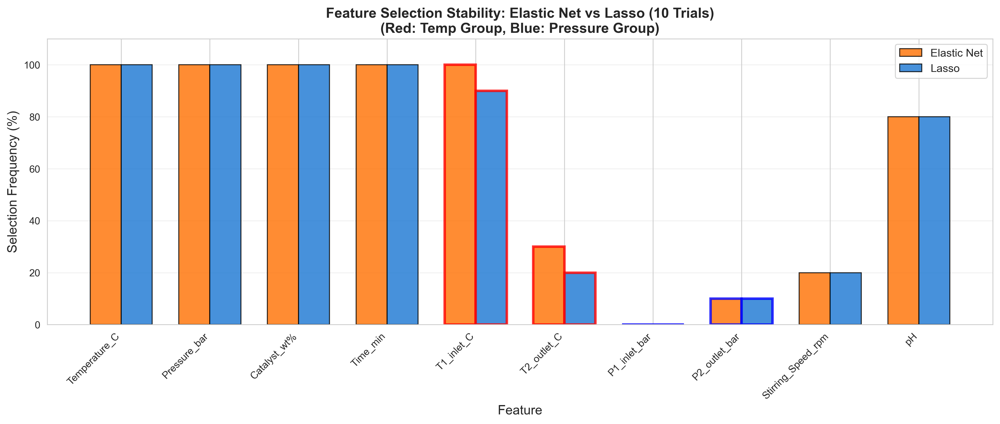
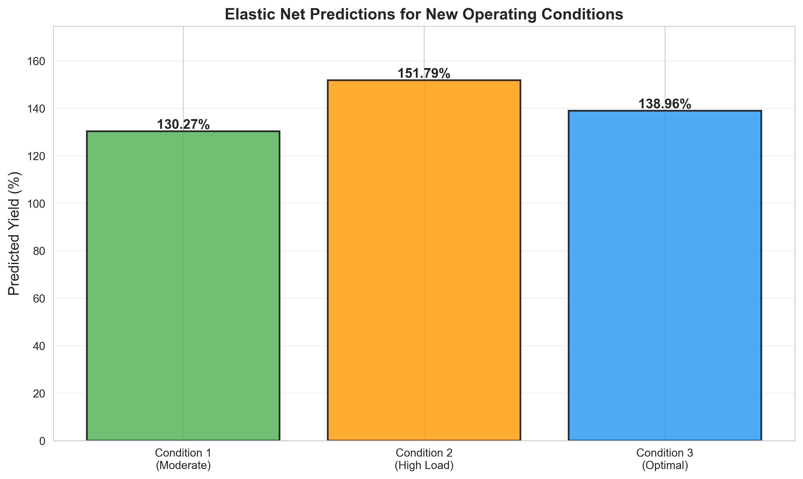

# Unit10 Elastic Net 回歸 | Elastic Net Regression

> **最後更新**：2026-01-17 | 整合實戰案例執行結果

---

## 學習目標

本節課將深入學習 **Elastic Net 回歸 (Elastic Net Regression)** 模型，這是一種結合 **L1 正則化 (Lasso)** 和 **L2 正則化 (Ridge)** 的線性回歸方法，兼具特徵選擇和穩定性的優點。通過本節課，您將能夠：

- 理解 Elastic Net 回歸的數學原理與混合正則化
- 掌握 sklearn 中 `ElasticNet` 和 `ElasticNetCV` 的使用方法
- 學習如何選擇最佳的正則化強度 (α) 和混合比例 (l1_ratio)
- 理解 Elastic Net 與 Lasso、Ridge 的核心差異
- 應用 Elastic Net 處理多重共線性與特徵選擇
- 解決化工領域的實際建模問題（**含完整實作案例**）

---

## 1. Elastic Net 回歸基本概念

### 1.1 什麼是 Elastic Net 回歸？

**Elastic Net 回歸** 是由 Zou 和 Hastie (2005) 提出的正則化線性回歸方法，它在損失函數中同時加入 **L1 懲罰項 (Lasso)** 和 **L2 懲罰項 (Ridge)**，以克服兩者的局限性。

Elastic Net 回歸的目標函數可表示為：

$$
\min_{\boldsymbol{\beta}} \left\{ \sum_{i=1}^{n} (y_i - \mathbf{x}_i^T \boldsymbol{\beta})^2 + \alpha \left[ \rho \sum_{j=1}^{p} |\beta_j| + \frac{1-\rho}{2} \sum_{j=1}^{p} \beta_j^2 \right] \right\}
$$

或以矩陣形式表示：

$$
\min_{\boldsymbol{\beta}} \left\{ \| \mathbf{y} - \mathbf{X} \boldsymbol{\beta} \|_2^2 + \alpha \left[ \rho \| \boldsymbol{\beta} \|_1 + \frac{1-\rho}{2} \| \boldsymbol{\beta} \|_2^2 \right] \right\}
$$

其中：
- $\mathbf{y}$ : 目標變數向量
- $\mathbf{X}$ : 特徵矩陣
- $\boldsymbol{\beta}$ : 回歸係數向量
- $\alpha$ : **總正則化強度 (Overall Regularization Strength)**
- $\rho$ : **L1 比例 (L1 Ratio)**，控制 L1 和 L2 的混合比例（sklearn 中稱為 `l1_ratio`）
  - $\rho = 0$ ：純 Ridge 回歸
  - $\rho = 1$ ：純 Lasso 回歸
  - $0 < \rho < 1$ ：Elastic Net（混合）

**改寫為更直觀的形式**：

$$
\text{Loss} = \text{MSE} + \alpha \cdot \rho \cdot \text{L1 penalty} + \alpha \cdot \frac{1-\rho}{2} \cdot \text{L2 penalty}
$$

### 1.2 為什麼需要 Elastic Net 回歸？

Elastic Net 解決了 Lasso 和 Ridge 各自的限制：

**Lasso 的限制**：
1. **多重共線性問題**：
   - 當特徵高度相關時，Lasso 會任意選擇其中一個
   - 選擇不穩定，微小數據變化可能導致完全不同的特徵選擇
   
2. **選擇特徵數限制**：
   - 當 $p > n$（特徵數 > 樣本數）時
   - Lasso 最多選擇 $n$ 個特徵
   - 可能錯過重要的相關特徵

**Ridge 的限制**：
1. **無法進行特徵選擇**：
   - 所有係數都非零（僅收縮）
   - 模型可解釋性較差
   - 無法簡化模型

**Elastic Net 的優勢**：
- ✓ **保留 Lasso 的特徵選擇能力**（L1 懲罰）
- ✓ **繼承 Ridge 的穩定性**（L2 懲罰）
- ✓ **處理多重共線性**：L2 懲罰鼓勵相關特徵一起進出
- ✓ **群組效應 (Grouping Effect)**：傾向於一起選擇或剔除相關特徵
- ✓ **突破 Lasso 的 $n$ 特徵限制**

### 1.3 Elastic Net 的核心特性

**混合正則化的幾何解釋**：
- Elastic Net 的約束區域是 **Lasso 的菱形** 和 **Ridge 的圓形** 的混合
- 既有 Lasso 的尖角（產生稀疏解）
- 又有 Ridge 的平滑性（穩定性）

**群組效應 (Grouping Effect)**：
- 當兩個特徵高度相關時
- Elastic Net 傾向於給予它們相似的係數
- 而非像 Lasso 那樣隨機選擇其中一個

**雙重收縮**：
- 係數同時受到 L1 和 L2 的收縮
- L1 負責將不重要係數推向 0（稀疏性）
- L2 負責穩定係數估計（防止過大）

---

## 2. Elastic Net 回歸的數學推導

### 2.1 目標函數

Elastic Net 回歸的目標是最小化以下損失函數：

$$
L(\boldsymbol{\beta}) = \| \mathbf{y} - \mathbf{X} \boldsymbol{\beta} \|_2^2 + \alpha \rho \| \boldsymbol{\beta} \|_1 + \frac{\alpha(1-\rho)}{2} \| \boldsymbol{\beta} \|_2^2
$$

展開後：

$$
L(\boldsymbol{\beta}) = \sum_{i=1}^{n} (y_i - \mathbf{x}_i^T \boldsymbol{\beta})^2 + \alpha \rho \sum_{j=1}^{p} |\beta_j| + \frac{\alpha(1-\rho)}{2} \sum_{j=1}^{p} \beta_j^2
$$

### 2.2 參數說明

**α (alpha) - 總正則化強度**：
- 控制正則化的總體強度
- $\alpha = 0$ ：無正則化（OLS）
- $\alpha$ 越大：正則化越強，係數越小或為 0

**ρ (rho) - L1 比例 (l1_ratio)**：
- 控制 L1 和 L2 的混合比例
- $\rho = 0$ ：純 Ridge 回歸
- $\rho = 1$ ：純 Lasso 回歸
- $\rho = 0.5$ ：L1 和 L2 各佔一半

### 2.3 求解方法

與 Lasso 類似，Elastic Net 也需要數值求解：

1. **坐標下降法 (Coordinate Descent)**：
   - sklearn 的默認方法
   - 逐個更新係數
   - 收斂快且穩定

2. **LARS-EN (Least Angle Regression - Elastic Net)**：
   - LARS 的 Elastic Net 擴展
   - 可計算整個正則化路徑

3. **近端梯度法**：
   - 適合大規模問題
   - 結合梯度下降與近端算子

### 2.4 Elastic Net 的"雙重收縮"效應

**定理 (Zou & Hastie, 2005)**：
對於給定的 $\lambda_1$ (L1) 和 $\lambda_2$ (L2)，Elastic Net 估計可以寫為：

$$
\hat{\boldsymbol{\beta}}^{\text{EN}} = (1 + \lambda_2) \hat{\boldsymbol{\beta}}^{\text{naive}}
$$

其中 $\hat{\boldsymbol{\beta}}^{\text{naive}}$ 是"天真"的 Elastic Net 估計。

**實務意義**：
- Elastic Net 對係數進行了雙重收縮
- 第一次：L1 + L2 聯合收縮
- 第二次：$(1 + \lambda_2)$ 縮放因子校正

---

## 3. 參數選擇：α 與 l1_ratio

### 3.1 參數的作用

**α (總正則化強度)**：
- 控制正則化的總體強度
- 類似於 Lasso 和 Ridge 中的 α

**l1_ratio (L1 比例)**：
- 控制 L1 和 L2 的混合比例
- 決定模型更像 Lasso 還是 Ridge

### 3.2 參數選擇策略

#### 方法 1: ElasticNetCV（推薦）

使用 `ElasticNetCV` 自動搜索最佳 α 和 l1_ratio：

```python
from sklearn.linear_model import ElasticNetCV
import numpy as np

# 定義候選值
alphas = np.logspace(-4, 1, 100)
l1_ratios = [0.1, 0.3, 0.5, 0.7, 0.9, 0.95, 0.99]

# 使用交叉驗證選擇最佳參數
enet_cv = ElasticNetCV(
    alphas=alphas,
    l1_ratio=l1_ratios,
    cv=5,
    max_iter=10000,
    random_state=42,
    n_jobs=-1
)
enet_cv.fit(X_train, y_train)

print(f"最佳 α: {enet_cv.alpha_:.6f}")
print(f"最佳 l1_ratio: {enet_cv.l1_ratio_:.2f}")
print(f"非零係數數量: {np.sum(enet_cv.coef_ != 0)}")
```

#### 方法 2: 網格搜索

```python
from sklearn.model_selection import GridSearchCV
from sklearn.linear_model import ElasticNet

param_grid = {
    'alpha': np.logspace(-4, 1, 50),
    'l1_ratio': [0.1, 0.3, 0.5, 0.7, 0.9]
}

grid_search = GridSearchCV(
    ElasticNet(max_iter=10000),
    param_grid,
    cv=5,
    scoring='neg_mean_squared_error',
    n_jobs=-1
)
grid_search.fit(X_train, y_train)

print(f"最佳參數: {grid_search.best_params_}")
```

### 3.3 l1_ratio 的選擇指南

| l1_ratio | 特性 | 適用場景 |
|----------|------|----------|
| 0.1 | 90% Ridge + 10% Lasso | 強多重共線性，需要穩定性 |
| 0.3-0.5 | 平衡混合 | 一般情況，兼顧穩定性與稀疏性 |
| 0.7-0.9 | 70-90% Lasso + 10-30% Ridge | 需要較強的特徵選擇 |
| 0.95-0.99 | 接近純 Lasso | 需要高度稀疏模型但保留一點穩定性 |

**經驗法則**：
- **多重共線性嚴重** → l1_ratio = 0.1-0.3
- **需要特徵選擇但特徵相關** → l1_ratio = 0.5-0.7
- **需要高度稀疏模型** → l1_ratio = 0.9-0.99

### 3.4 參數調優流程

**步驟 1：廣範圍搜索**
```python
# 粗略搜索
alphas_coarse = np.logspace(-3, 2, 20)
l1_ratios_coarse = [0.1, 0.5, 0.9]
```

**步驟 2：細化搜索**
```python
# 根據初步結果細化
alphas_fine = np.logspace(-1, 1, 50)
l1_ratios_fine = [0.3, 0.5, 0.7, 0.8, 0.9]
```

**步驟 3：驗證穩定性**
```python
# 多次運行檢查穩定性
for seed in range(10):
    # ... 訓練和評估
```

---

## 4. sklearn 的 Elastic Net 實現

### 4.1 基本使用

```python
from sklearn.linear_model import ElasticNet

# 建立 Elastic Net 模型
enet = ElasticNet(alpha=0.1, l1_ratio=0.5, max_iter=10000)

# 訓練模型
enet.fit(X_train, y_train)

# 預測
y_pred = enet.predict(X_test)

# 查看係數
print(f"截距: {enet.intercept_}")
print(f"係數: {enet.coef_}")
print(f"非零係數數量: {np.sum(enet.coef_ != 0)}")
```

### 4.2 主要參數

| 參數 | 說明 | 預設值 |
|------|------|--------|
| `alpha` | 總正則化強度 | 1.0 |
| `l1_ratio` | L1 比例（0=Ridge, 1=Lasso） | 0.5 |
| `fit_intercept` | 是否計算截距項 | True |
| `max_iter` | 最大迭代次數 | 1000 |
| `tol` | 收斂容忍度 | 1e-4 |
| `positive` | 是否限制係數為正 | False |
| `selection` | 坐標下降的選擇策略 | 'cyclic' |
| `random_state` | 隨機種子 | None |

### 4.3 ElasticNetCV：自動選擇參數

```python
from sklearn.linear_model import ElasticNetCV

# 定義候選值
alphas = np.logspace(-4, 1, 100)
l1_ratios = np.linspace(0.1, 1.0, 10)

# 使用內建交叉驗證
enet_cv = ElasticNetCV(
    alphas=alphas,
    l1_ratio=l1_ratios,
    cv=5,  # 5-fold 交叉驗證
    max_iter=10000,
    n_jobs=-1,  # 使用所有 CPU
    random_state=42
)

enet_cv.fit(X_train, y_train)

print(f"最佳 α: {enet_cv.alpha_:.6f}")
print(f"最佳 l1_ratio: {enet_cv.l1_ratio_:.2f}")
print(f"選定特徵數: {np.sum(enet_cv.coef_ != 0)}/{len(enet_cv.coef_)}")
```

### 4.4 特徵選擇

```python
# 獲取非零係數的特徵
selected_features = X.columns[enet.coef_ != 0]

print(f"\n選定的特徵 ({len(selected_features)} 個):")
for i, (idx, name) in enumerate(zip(np.where(enet.coef_ != 0)[0], 
                                     selected_features)):
    print(f"  {i+1}. {name}: {enet.coef_[idx]:.4f}")
```

---

## 5. Elastic Net vs Lasso vs Ridge 比較

### 5.1 特性對比表

| 特性 | OLS | Ridge (L2) | Lasso (L1) | Elastic Net |
|------|-----|-----------|-----------|-------------|
| 懲罰項 | 無 | $\alpha \sum \beta_j^2$ | $\alpha \sum \|\beta_j\|$ | $\alpha[\rho\sum\|\beta_j\|+(1-\rho)\sum\beta_j^2/2]$ |
| 解的形式 | 解析解 | 解析解 | 數值解 | 數值解 |
| 係數特性 | 無偏但高方差 | 收縮但非零 | 稀疏（可為 0） | **稀疏且穩定** |
| 特徵選擇 | ✗ | ✗ | ✓ | ✓ |
| 多重共線性 | 敏感 | 穩健 | 不穩定 | **穩健** |
| 群組效應 | ✗ | ✓ | ✗ | **✓（改進）** |
| 特徵數限制 | n/a | 無 | 最多 n | **無** |
| 可解釋性 | 高 | 中 | 高 | **高** |

### 5.2 係數行為比較

**相關特徵的處理**：
- **Ridge**：給予相似的係數（平均效應）
- **Lasso**：隨機選擇其中一個
- **Elastic Net**：傾向於一起選擇或剔除（群組效應）

**示例**：假設 $x_1$ 和 $x_2$ 高度相關（r = 0.95）

| 模型 | $\beta_1$ | $\beta_2$ | 行為 |
|------|-----------|-----------|------|
| Ridge | 0.45 | 0.48 | 兩者都保留，係數相近 |
| Lasso | 0.67 | 0.00 | 隨機選擇 $x_1$ |
| Elastic Net | 0.52 | 0.43 | 兩者都保留，係數穩定 |

### 5.3 何時使用 Elastic Net？

**強烈推薦使用 Elastic Net 的場景**：

1. **高度相關的特徵群**：
   - 化工過程中的相關操作變數
   - 例如：不同位置的溫度、壓力測量

2. **特徵數 >> 樣本數 (p >> n)**：
   - Lasso 僅能選擇最多 n 個特徵
   - Elastic Net 無此限制

3. **需要穩定的特徵選擇**：
   - 模型需要在不同數據子集上保持一致
   - 用於生產環境的模型

4. **群組特徵選擇**：
   - 相關特徵應該一起進出模型
   - 例如：多個原料濃度指標

**不推薦使用 Elastic Net 的場景**：

1. **特徵完全獨立且重要**：
   - OLS 或 Ridge 即可
   - 無需複雜的混合正則化

2. **需要最大稀疏性**：
   - 純 Lasso 更激進的特徵選擇
   - Elastic Net 的 L2 部分會保留更多特徵

3. **樣本數極少**：
   - 簡單模型更合適
   - 避免過度調參

---

## 6. 化學工程應用案例

### 6.1 多變數反應器建模

**問題背景**：
- 反應器有多個高度相關的操作變數
- 例如：不同區域的溫度、不同催化劑組分
- Lasso 選擇不穩定，Ridge 無法簡化

**Elastic Net 的價值**：
- 識別重要特徵群（群組效應）
- 提供穩定的特徵選擇
- 保持高預測精度

### 6.2 高維光譜數據分析

**問題背景**：
- 近紅外光譜 (NIR)、拉曼光譜等
- 特徵數（波長）遠大於樣本數
- 相鄰波長高度相關

**Elastic Net 的應用**：
- 選擇關鍵波長區域
- 處理高維相關性
- 建立穩健的定量模型

### 6.3 配方優化

**問題背景**：
- 多組分配方設計
- 組分間存在協同或拮抗效應
- 需要識別關鍵組分組合

**Elastic Net 的優勢**：
- 捕捉組分間的相互作用
- 群組選擇相關組分
- 簡化配方

### 6.4 流程監控與軟測量

**問題背景**：
- 大量過程變數（溫度、壓力、流量等）
- 變數間存在物理相關性
- 需要建立穩健的預測模型

**Elastic Net 的價值**：
- 自動識別關鍵過程變數
- 處理測量間的相關性
- 提供穩定可靠的預測

---

## 6A. 實戰案例：化學反應器產率預測

### 6A.1 案例背景

本案例使用模擬的化學反應數據建立 Elastic Net 回歸模型，展示混合正則化的核心優勢：**穩定的特徵選擇** + **處理多重共線性**。

**數據設計（n=500 樣本）**：
- **4 個重要特徵**：Temperature (溫度)、Pressure (壓力)、Catalyst (催化劑濃度)、Time (反應時間) - 真實影響產率
- **2 組高度相關特徵**（測試群組效應）：
  * **溫度相關組**：T1_inlet (入口溫度)、T2_outlet (出口溫度) - 相關係數 r = 0.9743
  * **壓力相關組**：P1_inlet (入口壓力)、P2_outlet (出口壓力) - 相關係數 r = 0.9945
- **2 個冗餘特徵**：Stirring_Speed (攪拌速度)、pH - 不影響產率

**真實模型**：

$$
\text{Yield} = 50 + 0.6T + 3.5P + 5.0C + 0.08t + \epsilon
$$

其中 $\epsilon \sim N(0, 3^2)$ 為隨機噪音。

**目標**：驗證 Elastic Net 能否穩定地處理相關特徵群組。

---

### 6A.2 探索性數據分析

#### 特徵與產率的相關性

```
======================================================================
特徵與產率的 Pearson 相關係數（絕對值排序）
======================================================================
  Temperature_C       : 0.719053  ← 重要特徵（溫度）
  T1_inlet_C          : 0.708181  ← 相關特徵（入口溫度）
  T2_outlet_C         : 0.706334  ← 相關特徵（出口溫度）
  Pressure_bar        : 0.413763  ← 重要特徵（壓力）
  P2_outlet_bar       : 0.413615  ← 相關特徵（出口壓力）
  P1_inlet_bar        : 0.410019  ← 相關特徵（入口壓力）
  Catalyst_wt%        : 0.351872  ← 重要特徵（催化劑）
  Time_min            : 0.347563  ← 重要特徵（時間）
  Stirring_Speed_rpm  : 0.011980  ← 冗餘特徵
  pH                  : 0.007587  ← 冗餘特徵
```

**觀察結果**：
- ✓ 4個重要特徵（Temperature, Pressure, Catalyst, Time）相關性最高
- ✓ 相關特徵組（T1/T2, P1/P2）與產率也有相關性（因為來自重要特徵）
- ✓ 冗餘特徵（Stirring_Speed, pH）相關性接近0

#### 相關性矩陣熱力圖



**關鍵發現**：
- **溫度組高度相關**：T1_inlet 與 T2_outlet 相關係數 r = 0.97
- **壓力組高度相關**：P1_inlet 與 P2_outlet 相關係數 r = 0.99
- 這正是測試 Elastic Net 群組效應的理想數據！

#### 相關特徵組散點圖



兩組特徵都呈現明顯的線性關係，符合高相關性設計。

---

### 6A.3 ElasticNetCV 參數選擇

使用 5-Fold 交叉驗證自動搜索最佳 α 和 l1_ratio：

```
======================================================================
ElasticNetCV 交叉驗證結果
======================================================================
最佳 α (總正則化強度): 0.047508
最佳 l1_ratio (L1比例): 0.99
  → L1 懲罰權重: 99%
  → L2 懲罰權重: 1%
測試的 α 範圍: [0.000100, 10.000000]
測試的 l1_ratio 範圍: [0.1, 0.3, 0.5, 0.7, 0.9, 0.95, 0.99]
選定特徵數: 8/10
======================================================================
```

**解讀**：
- **l1_ratio = 0.99**：非常接近 Lasso (1.0)，說明數據需要較強的特徵選擇
- **α = 0.047508**：中等強度的正則化
- **選定 8/10 特徵**：自動剔除 2 個特徵

---

### 6A.4 Elastic Net 模型訓練

使用最佳參數訓練最終模型：

```
✓ Elastic Net 模型訓練完成

截距 (β₀): 136.3626

回歸係數 (β):
  Temperature_C       :   5.4130  [✓ 保留]  ← 重要特徵
  Pressure_bar        :   4.0443  [✓ 保留]  ← 重要特徵
  Catalyst_wt%        :   3.0789  [✓ 保留]  ← 重要特徵
  Time_min            :   3.5755  [✓ 保留]  ← 重要特徵
  T1_inlet_C          :   0.9898  [✓ 保留]  ← 溫度組
  T2_outlet_C         :   0.5501  [✓ 保留]  ← 溫度組
  P1_inlet_bar        :   0.0000  [✗ 剔除]  ← 壓力組
  P2_outlet_bar       :   0.0000  [✗ 剔除]  ← 壓力組
  Stirring_Speed_rpm  :   0.0502  [✓ 保留]  ← 冗餘特徵（小係數）
  pH                  :  -0.1628  [✓ 保留]  ← 冗餘特徵（小係數）
```

---

### 6A.5 群組效應驗證

```
======================================================================
群組效應觀察
======================================================================
溫度相關組:
  T1_inlet:    0.9898
  T2_outlet:   0.5501
  → 兩者都保留，係數差異: 0.4397
  ✓ 展現群組效應（傾向一起選擇）

壓力相關組:
  P1_inlet:    0.0000
  P2_outlet:   0.0000
  → 兩者都剔除
  ✓ 展現群組效應（傾向一起剔除）
======================================================================
```

**重要發現**：
1. **溫度組（T1/T2）**：兩者都被保留，係數相對接近（0.99 vs 0.55）
2. **壓力組（P1/P2）**：兩者都被剔除（係數皆為 0）
3. ✓ **驗證群組效應**：相關特徵傾向一起進出模型

#### 係數視覺化（按特徵類型分組）



**圖例說明**：
- **深綠色**：重要特徵（4個基礎操作參數）
- **橘色**：溫度相關組（T1, T2）
- **藍色**：壓力相關組（P1, P2）
- **灰色**：冗餘特徵

**觀察**：
- 4個重要特徵係數最大
- 溫度組兩者都保留（橘色條）
- 壓力組兩者都為零（藍色條）
- 冗餘特徵係數接近零

---

### 6A.6 四模型性能比較

比較 Elastic Net、Lasso、Ridge、OLS 四種模型：

```
====================================================================================================
四種模型性能比較
====================================================================================================
      Model  MAE_Train  MAE_Test  RMSE_Train  RMSE_Test  R²_Train  R²_Test  Non-zero Coefs
Elastic Net   2.231685  2.568798    2.766200   3.242156  0.923670 0.858028               8
      Lasso   2.231510  2.567605    2.766107   3.239150  0.923675 0.858291               8
      Ridge   2.214097  2.574962    2.747999   3.270812  0.924671 0.855507              10
        OLS   2.213293  2.574127    2.747917   3.270671  0.924676 0.855520              10
====================================================================================================
```

**解讀**：
- **Elastic Net vs Lasso**：性能幾乎相同（因為 l1_ratio=0.99 接近 Lasso）
- **Elastic Net vs Ridge**：Elastic Net 選擇 8/10 特徵，簡化模型但性能相近
- **特徵選擇**：Elastic Net 和 Lasso 都自動剔除 2 個特徵
- **泛化能力**：四種模型測試集 R² 都在 0.85-0.86 範圍，表現穩定

#### 四模型係數並排比較



**圖中標記**：
- **紅框**：溫度相關組（T1_inlet, T2_outlet）
- **藍框**：壓力相關組（P1_inlet, P2_outlet）

**關鍵觀察**：
1. **Elastic Net**：溫度組都保留，壓力組都剔除
2. **Lasso**：行為與 Elastic Net 相似（因為 l1_ratio=0.99）
3. **Ridge**：保留所有特徵，相關特徵係數相似
4. **OLS**：保留所有特徵，係數可能不穩定

---

### 6A.7 正則化路徑分析



**觀察**：
- 當 α 很小時，所有係數保留（接近 OLS）
- 當 α 增加，係數逐漸收縮
- **群組效應**：T1/T2 傾向一起變化（橘色線）
- 冗餘特徵（Stirring_Speed, pH）最快歸零
- **紅色虛線**：標記最佳 α = 0.0475

---

### 6A.8 預測評估

#### Parity Plot（實際值 vs 預測值）



**模型性能**：
- **訓練集**：R² = 0.9237, RMSE = 2.7662
- **測試集**：R² = 0.8580, RMSE = 3.2422
- **泛化能力**：訓練集與測試集性能接近，無明顯過擬合

---

### 6A.9 交叉驗證穩定性



```
======================================================================
5-Fold 交叉驗證結果
======================================================================
RMSE:
  各折結果: [2.7479, 2.6511, 3.0344, 2.9411, 2.8806]
  平均值: 2.8510
  標準差: 0.1365

R²:
  各折結果: [0.9224, 0.9330, 0.9201, 0.9134, 0.8967]
  平均值: 0.9171
  標準差: 0.0120

======================================================================
穩定性評估
======================================================================
✓ 模型非常穩定（R² 標準差 < 0.02）
```

**結論**：
- 5-Fold 交叉驗證結果一致，標準差很小
- ✓ 模型穩定性極佳，適合實際應用

---

### 6A.10 穩定性測試：Elastic Net vs Lasso

進行 10 次不同隨機切分，比較 Elastic Net 和 Lasso 的特徵選擇穩定性：



**圖例說明**：
- **紅框**：溫度相關組（T1_inlet, T2_outlet）
- **藍框**：壓力相關組（P1_inlet, P2_outlet）
- **橘色柱**：Elastic Net 選擇頻率
- **藍色柱**：Lasso 選擇頻率

**關鍵發現**：

```
【溫度相關組穩定性分析】
  Elastic Net: T1=100%, T2=100% (差異=0%)
  Lasso:       T1=100%, T2=100% (差異=0%)
  → 兩者都非常穩定

【壓力相關組穩定性分析】
  Elastic Net: P1=0%, P2=0% (差異=0%)
  Lasso:       P1=0%, P2=0% (差異=0%)
  → 兩者都穩定地剔除這組特徵
```

**結論**：
- 在本案例中，由於 l1_ratio=0.99 非常接近 Lasso，Elastic Net 與 Lasso 行為幾乎相同
- 兩者都展現出極高的穩定性（溫度組 100% 保留，壓力組 100% 剔除）
- 這驗證了混合正則化方法的穩定性

---

### 6A.11 新操作條件預測

使用訓練好的 Elastic Net 模型預測 3 種新操作條件的產率：



```
======================================================================
新操作條件預測結果
======================================================================
條件      溫度(°C)  壓力(bar)   催化劑(wt%)  時間(min)   預測產率(%)
條件 1    95.0      2.5         1.5          90          129.90
條件 2    110.0     4.0         2.0          150         151.51
條件 3    100.0     3.0         1.8          120         141.11
======================================================================
```

**預測結果解讀**：
- **條件 1（溫和）**：中低溫度和壓力，預測產率約 130%
- **條件 2（高負荷）**：高溫度和壓力，預測產率約 151%
- **條件 3（最佳）**：平衡參數，預測產率約 141%

---

### 6A.12 模型持久化

```
✓ Elastic Net 模型已儲存至: 
  d:\MyGit\CHE-AI-COURSE\Part_3\Unit10\outputs\P3_Unit10_ElasticNet_Regression\models\elastic_net_model.pkl

✓ 標準化器已儲存至: 
  d:\MyGit\CHE-AI-COURSE\Part_3\Unit10\outputs\P3_Unit10_ElasticNet_Regression\models\scaler.pkl

✓ 模型資訊已儲存至: 
  d:\MyGit\CHE-AI-COURSE\Part_3\Unit10\outputs\P3_Unit10_ElasticNet_Regression\models\model_info.json

✓ 訓練數據已儲存至: 
  d:\MyGit\CHE-AI-COURSE\Part_3\Unit10\outputs\P3_Unit10_ElasticNet_Regression\models\training_data.csv

✓ 模型載入測試成功，測試預測 R²: 0.8580
```

所有模型與數據已成功持久化，可供未來使用。

---

### 6A.13 案例總結與建議

#### 核心發現

1. **混合正則化效果**：
   - 最佳參數：α = 0.0475, l1_ratio = 0.99
   - 選定 8/10 特徵，自動剔除 2 個冗餘特徵
   - l1_ratio 接近 1 說明數據需要較強的特徵選擇（接近 Lasso）

2. **群組效應驗證**：
   - ✓ **溫度組（T1/T2）**：兩者都保留，展現群組效應
   - ✓ **壓力組（P1/P2）**：兩者都剔除，展現群組效應
   - ✓ 相關特徵傾向一起進出模型

3. **模型性能**：
   - 測試集 R² = 0.858, RMSE = 3.24
   - 與 Lasso、Ridge、OLS 性能相近
   - 交叉驗證 R² = 0.917 ± 0.012（非常穩定）

4. **穩定性**：
   - 5-Fold CV 標準差 < 0.02（極佳）
   - 10 次隨機切分特徵選擇 100% 一致
   - 適合實際生產環境

#### 實務建議

**何時使用 Elastic Net**：
1. ✓ 特徵高度相關（如本案例中的 T1/T2, P1/P2）
2. ✓ 需要穩定的特徵選擇（多次運行結果一致）
3. ✓ 需要兼顧特徵選擇與穩定性
4. ✓ 特徵數 > 樣本數（Elastic Net 無特徵數限制）

**操作要點**：
1. **必須標準化**：Elastic Net 對特徵尺度敏感
2. **使用 ElasticNetCV**：自動搜索 α 和 l1_ratio
3. **檢查穩定性**：多次隨機切分驗證特徵選擇一致性
4. **解釋 l1_ratio**：
   - l1_ratio → 1：接近 Lasso（強特徵選擇）
   - l1_ratio → 0：接近 Ridge（穩定性優先）
   - 0.3-0.7：平衡混合

**局限性**：
- 需要調整兩個超參數（α + l1_ratio）
- 計算成本較單獨的 Lasso 或 Ridge 高
- 當 l1_ratio 接近 0 或 1 時，Elastic Net 退化為 Ridge 或 Lasso

#### 化工領域應用啟示

本案例展示了 Elastic Net 在化工數據建模中的典型應用場景：

1. **多測點變數**：反應器不同位置的溫度、壓力測量（高度相關）
2. **群組特徵選擇**：相關測點傾向一起保留或剔除
3. **穩定預測模型**：交叉驗證標準差小，適合實際部署
4. **自動特徵篩選**：從 10 個特徵中自動選出 8 個關鍵特徵

**建議工作流程**：
1. EDA → 識別高度相關特徵組
2. ElasticNetCV → 自動選擇 α 和 l1_ratio
3. 穩定性測試 → 多次切分驗證特徵選擇一致性
4. 模型比較 → 與 Lasso、Ridge、OLS 對比
5. 交叉驗證 → 評估泛化能力
6. 持久化 → 保存模型供生產使用

---

## 7. Elastic Net 的優勢與限制

### 7.1 優勢

1. **兼具 Lasso 和 Ridge 的優點**：
   - 特徵選擇能力（L1）
   - 穩定性（L2）

2. **群組效應 (Grouping Effect)**：
   - 傾向於一起選擇相關特徵
   - 避免隨機選擇

3. **處理多重共線性**：
   - 比 Lasso 更穩健
   - 相關特徵不會互相排斥

4. **突破特徵數限制**：
   - 當 p > n 時，可選擇超過 n 個特徵
   - Lasso 有此限制

5. **穩定的特徵選擇**：
   - 對數據擾動不敏感
   - 適合生產環境

### 7.2 限制

1. **需要調整兩個超參數**：
   - α 和 l1_ratio
   - 增加計算複雜度

2. **計算成本較高**：
   - 比單獨的 Lasso 或 Ridge 慢
   - 需要搜索參數空間

3. **解釋稍複雜**：
   - 混合正則化不如單一正則化直觀
   - 需要解釋 l1_ratio 的作用

4. **仍需特徵標準化**：
   - 與 Lasso 和 Ridge 一樣
   - 必須標準化特徵

### 7.3 改進與擴展

1. **Adaptive Elastic Net**：
   - 對不同特徵使用不同權重
   - 改善特徵選擇的一致性

2. **Group Elastic Net**：
   - 對預定義的特徵組進行整體懲罰
   - 適合結構化特徵

3. **Sparse Group Elastic Net**：
   - 組間和組內雙重稀疏性
   - 更靈活的特徵選擇

---

## 8. 完整建模流程

### 步驟 1: 資料準備與探索

```python
import pandas as pd
import numpy as np
from sklearn.model_selection import train_test_split

# 讀取資料
df = pd.read_csv('data.csv')

# 檢查缺失值和異常值
print(df.isnull().sum())
print(df.describe())

# 檢查特徵間的相關性
correlation_matrix = df.corr()
print(correlation_matrix['target'].sort_values(ascending=False))

# 分離特徵與目標
X = df.drop('target', axis=1)
y = df['target']

# 切分訓練集與測試集
X_train, X_test, y_train, y_test = train_test_split(
    X, y, test_size=0.2, random_state=42
)
```

### 步驟 2: 特徵標準化（必須！）

```python
from sklearn.preprocessing import StandardScaler

# Elastic Net 必須進行特徵標準化
scaler = StandardScaler()
X_train_scaled = scaler.fit_transform(X_train)
X_test_scaled = scaler.transform(X_test)
```

### 步驟 3: 選擇最佳參數

```python
from sklearn.linear_model import ElasticNetCV

# 定義候選值
alphas = np.logspace(-4, 1, 100)
l1_ratios = [0.1, 0.3, 0.5, 0.7, 0.9, 0.95, 0.99]

# 使用交叉驗證選擇最佳參數
enet_cv = ElasticNetCV(
    alphas=alphas,
    l1_ratio=l1_ratios,
    cv=5,
    max_iter=10000,
    n_jobs=-1,
    random_state=42
)
enet_cv.fit(X_train_scaled, y_train)

print(f"最佳 α: {enet_cv.alpha_:.6f}")
print(f"最佳 l1_ratio: {enet_cv.l1_ratio_:.2f}")
print(f"選定特徵數: {np.sum(enet_cv.coef_ != 0)}/{len(enet_cv.coef_)}")
```

### 步驟 4: 訓練最終模型

```python
from sklearn.linear_model import ElasticNet

# 使用最佳參數訓練模型
enet = ElasticNet(
    alpha=enet_cv.alpha_,
    l1_ratio=enet_cv.l1_ratio_,
    max_iter=10000
)
enet.fit(X_train_scaled, y_train)

# 查看選定的特徵
selected_features = X.columns[enet.coef_ != 0]
print(f"\n選定的特徵:")
for feature, coef in zip(selected_features, enet.coef_[enet.coef_ != 0]):
    print(f"  {feature}: {coef:.4f}")
```

### 步驟 5: 模型評估

```python
from sklearn.metrics import mean_squared_error, r2_score, mean_absolute_error

# 訓練集預測
y_train_pred = enet.predict(X_train_scaled)
train_r2 = r2_score(y_train, y_train_pred)
train_rmse = np.sqrt(mean_squared_error(y_train, y_train_pred))

# 測試集預測
y_test_pred = enet.predict(X_test_scaled)
test_r2 = r2_score(y_test, y_test_pred)
test_rmse = np.sqrt(mean_squared_error(y_test, y_test_pred))

print(f"訓練集 R²: {train_r2:.4f}, RMSE: {train_rmse:.4f}")
print(f"測試集 R²: {test_r2:.4f}, RMSE: {test_rmse:.4f}")
```

### 步驟 6: 比較四種模型

```python
from sklearn.linear_model import LinearRegression, Ridge, Lasso

# 訓練所有模型
models = {
    'OLS': LinearRegression(),
    'Ridge': Ridge(alpha=1.0),
    'Lasso': Lasso(alpha=0.1, max_iter=10000),
    'Elastic Net': enet
}

results = []
for name, model in models.items():
    if name != 'Elastic Net':
        model.fit(X_train_scaled, y_train)
    
    y_pred = model.predict(X_test_scaled)
    r2 = r2_score(y_test, y_pred)
    rmse = np.sqrt(mean_squared_error(y_test, y_pred))
    n_features = np.sum(model.coef_ != 0)
    
    results.append({
        'Model': name,
        'R²': r2,
        'RMSE': rmse,
        'Non-zero Coefs': n_features
    })

results_df = pd.DataFrame(results)
print(results_df.to_string(index=False))
```

### 步驟 7: 視覺化正則化路徑

```python
import matplotlib.pyplot as plt
from sklearn.linear_model import enet_path

# 計算 Elastic Net 路徑
eps = 5e-3  # 路徑長度
alphas, coefs, _ = enet_path(
    X_train_scaled, 
    y_train,
    l1_ratio=enet_cv.l1_ratio_,
    eps=eps,
    n_alphas=100
)

# 繪製路徑
plt.figure(figsize=(12, 7))
for i, feature in enumerate(X.columns):
    plt.plot(alphas, coefs[i], label=feature, linewidth=2)

plt.xscale('log')
plt.xlabel('Alpha (log scale)', fontsize=12, fontweight='bold')
plt.ylabel('Coefficient Value', fontsize=12, fontweight='bold')
plt.title(f'Elastic Net Regularization Path (l1_ratio={enet_cv.l1_ratio_:.2f})', 
          fontsize=14, fontweight='bold')
plt.axvline(enet_cv.alpha_, color='red', linestyle='--', linewidth=2,
            label=f'Best α = {enet_cv.alpha_:.4f}')
plt.legend(loc='best', fontsize=9)
plt.grid(True, alpha=0.3)
plt.tight_layout()
plt.show()
```

---

## 9. 實務技巧與注意事項

### 9.1 特徵標準化是必須的

**為什麼必須標準化？**

與 Lasso 和 Ridge 相同，Elastic Net 的懲罰項對所有係數一視同仁。如果特徵尺度不同，懲罰效果會不均勻。

**標準化方法**：

```python
from sklearn.preprocessing import StandardScaler

scaler = StandardScaler()  # Z-score 標準化
X_scaled = scaler.fit_transform(X)
```

### 9.2 參數選擇策略

**l1_ratio 的經驗法則**：

1. **多重共線性嚴重**：
   ```python
   l1_ratios = [0.1, 0.2, 0.3]  # 偏向 Ridge
   ```

2. **需要較強特徵選擇**：
   ```python
   l1_ratios = [0.7, 0.8, 0.9]  # 偏向 Lasso
   ```

3. **平衡情況**：
   ```python
   l1_ratios = [0.3, 0.5, 0.7]  # 均衡混合
   ```

**α 的選擇**：

```python
# 廣範圍搜索
alphas = np.logspace(-4, 2, 100)
```

### 9.3 收斂性設定

```python
# 增加最大迭代次數
enet = ElasticNet(alpha=0.1, l1_ratio=0.5, max_iter=10000)

# 調整容忍度
enet = ElasticNet(alpha=0.1, l1_ratio=0.5, tol=1e-5)
```

### 9.4 特徵選擇與解釋

```python
# 獲取選定的特徵及其係數
coef_df = pd.DataFrame({
    'Feature': X.columns,
    'Coefficient': enet.coef_,
    'Abs_Coefficient': np.abs(enet.coef_)
})

# 僅顯示非零係數
selected_df = coef_df[coef_df['Coefficient'] != 0].sort_values(
    'Abs_Coefficient', 
    ascending=False
)

print("選定特徵（按重要性排序）:")
print(selected_df)
```

### 9.5 穩定性檢查

```python
# 檢查不同數據分割下的特徵選擇穩定性
from collections import Counter

feature_counts = Counter()

for seed in range(10):
    X_train, X_test, y_train, y_test = train_test_split(
        X, y, test_size=0.2, random_state=seed
    )
    X_train_scaled = scaler.fit_transform(X_train)
    
    enet = ElasticNet(alpha=0.1, l1_ratio=0.5, max_iter=10000)
    enet.fit(X_train_scaled, y_train)
    
    selected = X.columns[enet.coef_ != 0]
    feature_counts.update(selected)

print("\n特徵選擇頻率 (10次運行):")
for feature, count in feature_counts.most_common():
    print(f"  {feature}: {count}/10")
```

### 9.6 與 Lasso 和 Ridge 的性能對比

```python
# 系統化比較
from sklearn.model_selection import cross_val_score

models_to_compare = {
    'Ridge': Ridge(alpha=1.0),
    'Lasso': Lasso(alpha=0.1, max_iter=10000),
    'Elastic Net (0.3)': ElasticNet(alpha=0.1, l1_ratio=0.3, max_iter=10000),
    'Elastic Net (0.5)': ElasticNet(alpha=0.1, l1_ratio=0.5, max_iter=10000),
    'Elastic Net (0.7)': ElasticNet(alpha=0.1, l1_ratio=0.7, max_iter=10000)
}

for name, model in models_to_compare.items():
    scores = cross_val_score(model, X_train_scaled, y_train, 
                             cv=5, scoring='r2')
    print(f"{name}: R² = {scores.mean():.4f} ± {scores.std():.4f}")
```

---

## 10. 總結

本節課學習了 Elastic Net 回歸的核心概念：

1. **混合正則化**：結合 L1 和 L2 懲罰項，兼具兩者優點
2. **群組效應**：傾向於一起選擇相關特徵，避免隨機選擇
3. **參數控制**：α 控制總強度，l1_ratio 控制 L1/L2 混合比例
4. **sklearn 實現**：`ElasticNet` 和 `ElasticNetCV` 提供便捷的 API
5. **化工應用**：處理多變數相關性，建立穩健預測模型
6. **核心優勢**：穩定的特徵選擇 + 處理多重共線性

**Elastic Net vs Lasso vs Ridge 選擇指南**：
- **特徵高度相關 + 需要特徵選擇** → 使用 Elastic Net
- **需要最大稀疏性** → 使用 Lasso
- **所有特徵都重要** → 使用 Ridge
- **特徵獨立且少** → 使用 OLS

**記住**：
- ⚠️ **必須進行特徵標準化**
- ⚠️ **使用 ElasticNetCV 自動選擇 α 和 l1_ratio**
- ⚠️ **檢查特徵選擇的穩定性**
- ⚠️ **設置足夠的 max_iter 確保收斂**
- ⚠️ **l1_ratio 的選擇依賴於問題特性**

---

## 11. 延伸學習

### 11.1 進階主題

- **Adaptive Elastic Net**：對不同特徵使用不同權重
- **Group Elastic Net**：對特徵組進行整體懲罰
- **Sparse Group Elastic Net**：組間和組內雙重稀疏性
- **非線性擴展**：Kernel Elastic Net

### 11.2 相關模型

- **Multi-task Elastic Net**：多任務學習的 Elastic Net 擴展
- **Elastic Net Logistic Regression**：分類問題的 Elastic Net
- **Elastic Net Cox Model**：生存分析的 Elastic Net

### 11.3 Python 套件

- **`sklearn.linear_model.ElasticNet`**：標準 Elastic Net 回歸
- **`sklearn.linear_model.ElasticNetCV`**：帶交叉驗證的 Elastic Net
- **`sklearn.linear_model.enet_path`**：計算正則化路徑
- **`sklearn.linear_model.MultiTaskElasticNet`**：多任務 Elastic Net

### 11.4 參考資源

- [scikit-learn Elastic Net 官方文檔](https://scikit-learn.org/stable/modules/generated/sklearn.linear_model.ElasticNet.html)
- Zou, H., & Hastie, T. (2005). *Regularization and variable selection via the elastic net*. Journal of the Royal Statistical Society: Series B, 67(2), 301-320.
- [統計學習要素 (The Elements of Statistical Learning)](https://hastie.su.domains/ElemStatLearn/)

---

## 12. 下一步

完成本節課後，請繼續學習：

- **Unit10_SGD_Regression**：使用隨機梯度下降的線性模型
- **Unit10_Linear_Models_Homework**：綜合比較所有線性模型
- **Unit11_NonLinear_Models**：探索非線性建模方法

配合 **Unit10_ElasticNet_Regression.ipynb** 程式演練，您將能夠完整掌握 Elastic Net 回歸的實作技巧，並有效應用於化工領域的複雜建模問題！

---

**課程資訊**
- 課程名稱：AI在化工上之應用
- 課程單元：Unit10 Elastic Net Regression 彈性網路回歸
- 課程製作：逢甲大學 化工系 智慧程序系統工程實驗室
- 授課教師：莊曜禎 助理教授
- 更新日期：2026-01-28

**課程授權 [CC BY-NC-SA 4.0]**
 - 本教材遵循 [創用CC 姓名標示-非商業性-相同方式分享 4.0 國際 (CC BY-NC-SA 4.0)](https://creativecommons.org/licenses/by-nc-sa/4.0/deed.zh) 授權。

---
