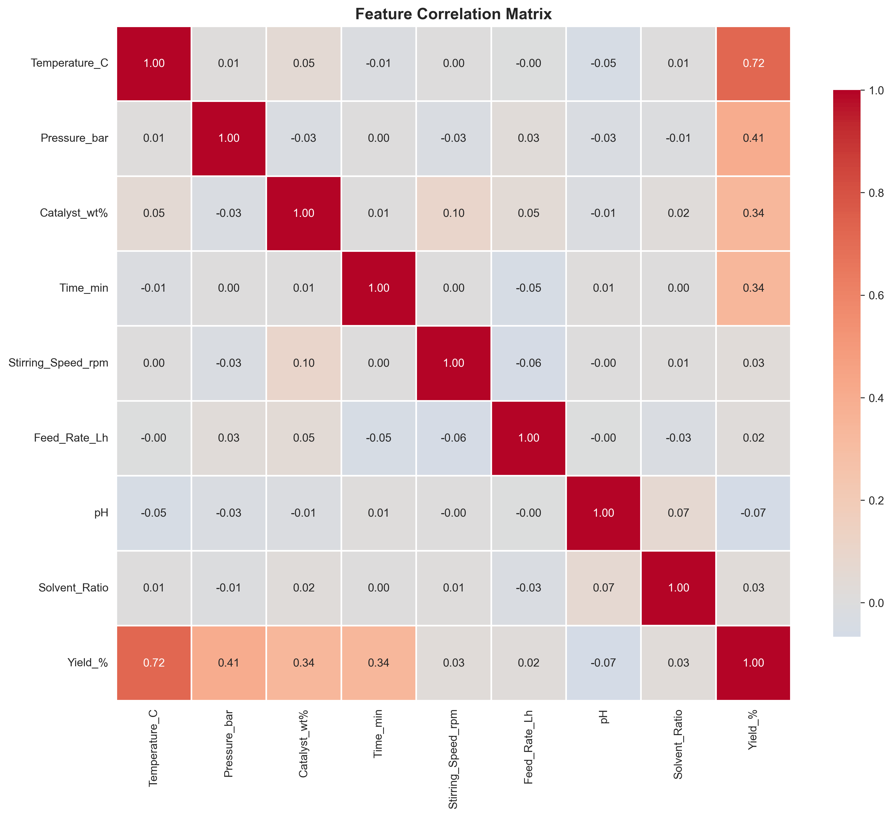
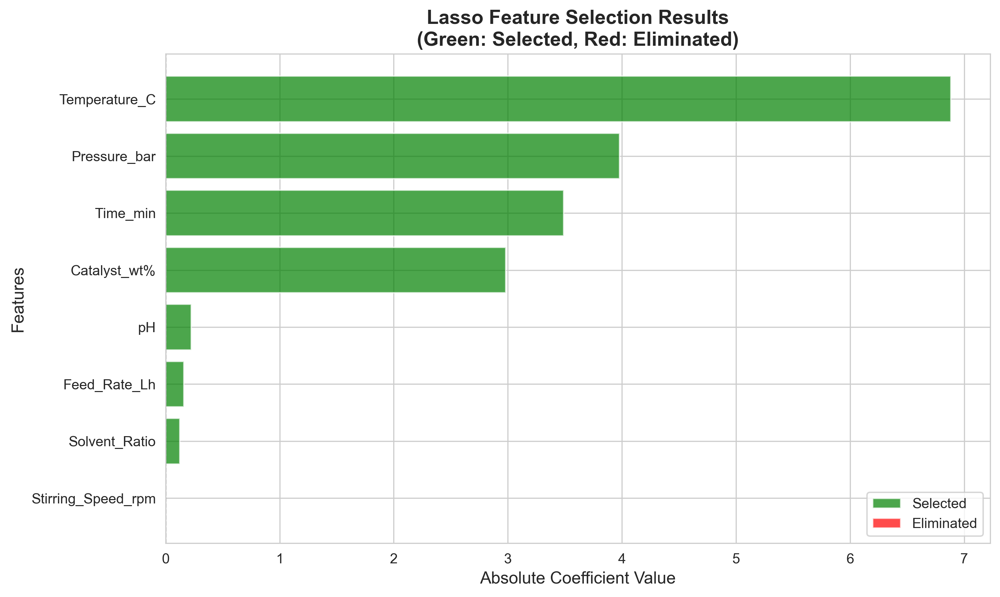
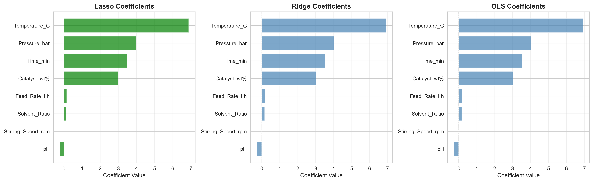
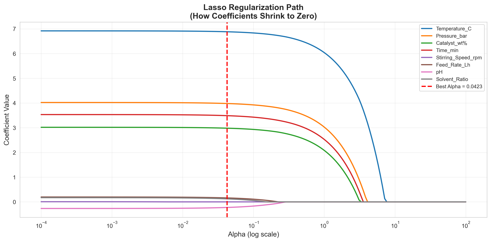
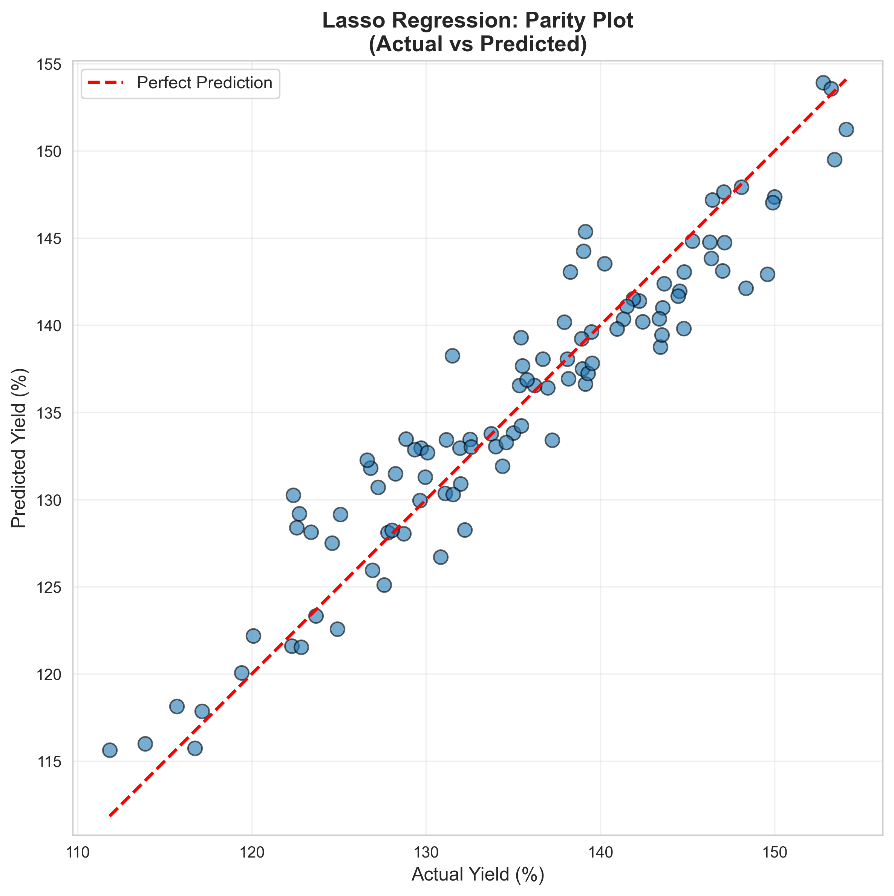

# Unit10 Lasso 回歸 | Lasso Regression

> **最後更新**：2026-01-17 | 建立完整教學講義

---

## 學習目標

本節課將深入學習**Lasso 回歸 (Lasso Regression)** 模型，這是一種加入 L1 正則化的線性回歸方法，不僅能防止過擬合，還具有**自動特徵選擇**的能力。通過本節課，您將能夠：

- 理解 Lasso 回歸的數學原理與 L1 正則化
- 掌握 sklearn 中 `Lasso` 和 `LassoCV` 的使用方法
- 學習如何選擇最佳的正則化強度 (α)
- 理解 Lasso 與 Ridge、OLS 的核心差異
- 應用 Lasso 回歸進行特徵選擇
- 解決化工領域的實際建模問題（**含完整實作案例**）

---

## 1. Lasso 回歸基本概念

### 1.1 什麼是 Lasso 回歸？

**Lasso 回歸 (Least Absolute Shrinkage and Selection Operator)**，又稱為 **L1 正則化線性回歸**，是在普通最小平方法 (OLS) 的基礎上加入 **L1 正則化項 (L1 Regularization)**，通過懲罰係數的絕對值和來防止過擬合，並實現**特徵選擇**。

Lasso 回歸的目標函數可表示為：

$$
\min_{\boldsymbol{\beta}} \left\{ \sum_{i=1}^{n} (y_i - \mathbf{x}_i^T \boldsymbol{\beta})^2 + \alpha \sum_{j=1}^{p} |\beta_j| \right\}
$$

或以矩陣形式表示：

$$
\min_{\boldsymbol{\beta}} \left\{ \| \mathbf{y} - \mathbf{X} \boldsymbol{\beta} \|_2^2 + \alpha \| \boldsymbol{\beta} \|_1 \right\}
$$

其中：
- $\mathbf{y}$ : 目標變數向量
- $\mathbf{X}$ : 特徵矩陣
- $\boldsymbol{\beta}$ : 回歸係數向量
- $\alpha$ : **正則化強度 (Regularization Strength)**，控制懲罰項的權重
- $\| \boldsymbol{\beta} \|_1 = \sum_{j=1}^{p} |\beta_j|$ : L1 範數（係數的絕對值和）

### 1.2 為什麼需要 Lasso 回歸？

Lasso 回歸解決了以下重要問題：

1. **特徵選擇 (Feature Selection)**：
   - L1 懲罰會將不重要特徵的係數壓縮為 **0**
   - 自動識別並剔除冗餘特徵
   - 產生**稀疏解 (Sparse Solution)**

2. **防止過擬合**：
   - 正則化降低模型複雜度
   - 提高泛化能力

3. **提高可解釋性**：
   - 簡化模型（僅保留重要特徵）
   - 便於理解和溝通

4. **處理高維數據**：
   - 當特徵數 $p$ 遠大於樣本數 $n$ 時
   - Lasso 可有效降維

**Lasso 回歸的核心優勢**：
- ✓ **自動特徵選擇**：將不重要特徵的係數設為 0
- ✓ **稀疏模型**：簡化模型結構
- ✓ **防止過擬合**：正則化控制模型複雜度
- ✓ **提高可解釋性**：僅保留關鍵特徵

### 1.3 L1 正則化的幾何解釋

Lasso 回歸可視為在約束條件下求解最小平方問題：

$$
\min_{\boldsymbol{\beta}} \sum_{i=1}^{n} (y_i - \mathbf{x}_i^T \boldsymbol{\beta})^2 \quad \text{subject to} \quad \sum_{j=1}^{p} |\beta_j| \leq t
$$

- L1 懲罰項將係數限制在一個**菱形區域**內（2D）或**超立方體**內（高維）
- 菱形的**尖角**容易與等高線相交於軸上，導致某些係數變為 0
- 這是 Lasso 能產生稀疏解的根本原因

**與 Ridge 的關鍵差異**：
- **Ridge (L2)**：圓形約束區域 → 係數收縮但不為 0
- **Lasso (L1)**：菱形約束區域 → 係數可變為 0（稀疏解）

---

## 2. Lasso 回歸的數學推導

### 2.1 目標函數

Lasso 回歸的目標是最小化以下損失函數：

$$
L(\boldsymbol{\beta}) = \| \mathbf{y} - \mathbf{X} \boldsymbol{\beta} \|_2^2 + \alpha \| \boldsymbol{\beta} \|_1
$$

展開後：

$$
L(\boldsymbol{\beta}) = (\mathbf{y} - \mathbf{X} \boldsymbol{\beta})^T (\mathbf{y} - \mathbf{X} \boldsymbol{\beta}) + \alpha \sum_{j=1}^{p} |\beta_j|
$$

### 2.2 求解方法

與 Ridge 不同，**Lasso 沒有解析解**，因為 L1 範數不可微（在 $\beta_j = 0$ 處）。

常用求解算法：

1. **坐標下降法 (Coordinate Descent)**：
   - 逐個更新係數，固定其他係數
   - sklearn 的默認方法
   - 收斂快，適合高維問題

2. **最小角回歸 (LARS - Least Angle Regression)**：
   - 幾何方法，追蹤正則化路徑
   - 可以高效計算所有 α 值的解

3. **近端梯度法 (Proximal Gradient Method)**：
   - 適用於大規模問題
   - 結合梯度下降與軟閾值算子

### 2.3 軟閾值算子 (Soft-Thresholding)

Lasso 更新的核心是**軟閾值函數**：

$$
\beta_j = \text{soft}(z_j, \alpha) = \begin{cases}
z_j - \alpha & \text{if } z_j > \alpha \\
0 & \text{if } |z_j| \leq \alpha \\
z_j + \alpha & \text{if } z_j < -\alpha
\end{cases}
$$

其中 $z_j$ 是 OLS 估計值。這個函數會將小於 $\alpha$ 的係數**直接設為 0**。

### 2.4 Lasso vs Ridge vs OLS 比較

| 特性 | OLS | Ridge (L2) | Lasso (L1) |
|------|-----|-----------|-----------|
| 懲罰項 | 無 | $\alpha \sum \beta_j^2$ | $\alpha \sum \|\beta_j\|$ |
| 解的形式 | 解析解 | 解析解 | 數值解 |
| 係數特性 | 無偏但高方差 | 收縮但非零 | **可為 0（稀疏）** |
| 特徵選擇 | ✗ | ✗ | ✓ |
| 多重共線性 | 敏感 | 穩健 | 選擇其中一個 |
| 幾何約束 | 無 | 圓形 | **菱形** |

### 2.5 正則化路徑

Lasso 的係數隨 α 變化的路徑稱為**正則化路徑**：

- 當 $\alpha = 0$ ：Lasso 退化為 OLS
- 當 $\alpha$ 增大：越來越多係數變為 0
- 當 $\alpha \to \infty$ ：所有係數趨近於 0

觀察正則化路徑可幫助理解哪些特徵先被剔除，哪些特徵更重要。

---

## 3. 正則化強度 α 的選擇

### 3.1 α 的作用

- **α = 0**：無正則化，等同於 OLS
- **α 很小**：輕微懲罰，保留大部分特徵
- **α 適中**：平衡特徵選擇與擬合精度
- **α 很大**：強烈懲罰，僅保留極少數特徵，模型欠擬合

### 3.2 選擇 α 的方法

#### 方法 1: LassoCV（推薦）

使用 `LassoCV` 自動搜索最佳 α：

```python
from sklearn.linear_model import LassoCV

# 定義 α 候選值
alphas = np.logspace(-4, 1, 100)

# 使用交叉驗證選擇最佳 α
lasso_cv = LassoCV(alphas=alphas, cv=5, max_iter=10000, random_state=42)
lasso_cv.fit(X_train, y_train)

print(f"最佳 α: {lasso_cv.alpha_}")
print(f"非零係數數量: {np.sum(lasso_cv.coef_ != 0)}")
```

#### 方法 2: 網格搜索

```python
from sklearn.model_selection import GridSearchCV
from sklearn.linear_model import Lasso

param_grid = {'alpha': np.logspace(-4, 1, 50)}
grid_search = GridSearchCV(Lasso(max_iter=10000), param_grid, cv=5, 
                           scoring='neg_mean_squared_error')
grid_search.fit(X_train, y_train)

print(f"最佳 α: {grid_search.best_params_['alpha']}")
```

#### 方法 3: 正則化路徑分析

```python
from sklearn.linear_model import lasso_path

# 計算整個正則化路徑
alphas, coefs, _ = lasso_path(X_train, y_train, alphas=np.logspace(-4, 1, 100))

# 繪製係數隨 α 變化
plt.figure(figsize=(10, 6))
for i in range(coefs.shape[0]):
    plt.plot(alphas, coefs[i], label=f'Feature {i+1}')
plt.xscale('log')
plt.xlabel('Alpha')
plt.ylabel('Coefficients')
plt.title('Lasso Regularization Path')
plt.legend()
plt.show()
```

### 3.3 α 值的選擇策略

**經驗法則**：

1. **化工過程建模**：
   - 從 α = 0.01 開始嘗試
   - 觀察保留多少特徵

2. **高維數據**：
   - 使用較大的 α (0.1-1.0)
   - 積極進行特徵選擇

3. **稀疏性需求**：
   - 需要高度稀疏模型：增大 α
   - 需要保留更多特徵：減小 α

4. **始終使用交叉驗證**：
   - LassoCV 自動選擇最佳 α
   - 考慮預測性能與模型簡潔性的平衡

---

## 4. sklearn 的 Lasso 實現

### 4.1 基本使用

```python
from sklearn.linear_model import Lasso

# 建立 Lasso 模型
lasso = Lasso(alpha=0.1, max_iter=10000)

# 訓練模型
lasso.fit(X_train, y_train)

# 預測
y_pred = lasso.predict(X_test)

# 查看係數
print(f"截距: {lasso.intercept_}")
print(f"係數: {lasso.coef_}")
print(f"非零係數數量: {np.sum(lasso.coef_ != 0)}")
```

### 4.2 主要參數

| 參數 | 說明 | 預設值 |
|------|------|--------|
| `alpha` | 正則化強度，必須為正數 | 1.0 |
| `fit_intercept` | 是否計算截距項 | True |
| `max_iter` | 最大迭代次數 | 1000 |
| `tol` | 收斂容忍度 | 1e-4 |
| `positive` | 是否限制係數為正 | False |
| `selection` | 坐標下降的選擇策略 | 'cyclic' |
| `random_state` | 隨機種子 | None |

### 4.3 LassoCV：自動選擇 α

```python
from sklearn.linear_model import LassoCV

# 定義 α 候選值（對數尺度）
alphas = np.logspace(-4, 1, 100)

# 使用內建交叉驗證
lasso_cv = LassoCV(alphas=alphas, 
                   cv=5,  # 5-fold 交叉驗證
                   max_iter=10000,
                   n_jobs=-1,  # 使用所有 CPU
                   random_state=42)

lasso_cv.fit(X_train, y_train)

print(f"最佳 α: {lasso_cv.alpha_:.6f}")
print(f"選定特徵數: {np.sum(lasso_cv.coef_ != 0)}")
print(f"總特徵數: {len(lasso_cv.coef_)}")
```

### 4.4 特徵選擇

```python
# 獲取非零係數的特徵索引
selected_features = np.where(lasso.coef_ != 0)[0]
selected_feature_names = X.columns[selected_features]

print("選定的特徵:")
for i, (idx, name) in enumerate(zip(selected_features, selected_feature_names)):
    print(f"  {i+1}. {name}: {lasso.coef_[idx]:.4f}")
```

---

## 5. Lasso vs Ridge vs OLS 比較

### 5.1 特性對比

| 特性 | OLS | Ridge (L2) | Lasso (L1) |
|------|-----|-----------|-----------|
| 目標函數 | $\|\mathbf{y} - \mathbf{X}\boldsymbol{\beta}\|^2$ | $\|\mathbf{y} - \mathbf{X}\boldsymbol{\beta}\|^2 + \alpha\|\boldsymbol{\beta}\|^2$ | $\|\mathbf{y} - \mathbf{X}\boldsymbol{\beta}\|^2 + \alpha\|\boldsymbol{\beta}\|$ |
| 解的形式 | 解析解 | 解析解 | 數值解 |
| 係數估計 | 無偏但高方差 | 有偏但低方差 | 有偏且稀疏 |
| 特徵選擇 | ✗ | ✗ | ✓ |
| 稀疏性 | ✗ | ✗ | ✓ |
| 多重共線性 | 敏感 | 穩健（保留所有特徵） | 選擇其中一個 |
| 計算速度 | 快 | 快 | 中等 |
| 可解釋性 | 高 | 中 | **最高（稀疏）** |

### 5.2 何時使用 Lasso？

**建議使用 Lasso 回歸的場景**：

1. **需要特徵選擇**：
   - 特徵數量多（幾十到幾千個）
   - 想要識別最重要的特徵
   - 希望簡化模型以便解釋

2. **高維稀疏數據**：
   - $p$ (特徵數) >> $n$ (樣本數)
   - 認為只有少數特徵真正重要

3. **提高可解釋性**：
   - 需要向非技術人員解釋模型
   - 需要找出關鍵影響因素

4. **化工過程中的案例**：
   - 從眾多操作變數中找出關鍵參數
   - 簡化複雜的多變數模型
   - 降低監測成本（只監測重要變數）

**不建議使用 Lasso 的場景**：

1. **特徵間高度相關且都重要**：
   - Lasso 會任意選擇其中一個
   - 此時 Ridge 或 Elastic Net 更合適

2. **特徵數少且都重要**：
   - OLS 或 Ridge 更簡單

3. **需要保留所有特徵進行解釋**：
   - Ridge 更合適

---

## 6. 化學工程應用案例

### 6.1 反應器操作優化

**問題背景**：
- 化學反應器有 20+ 個操作變數和監測變數
- 預測產品收率
- 挑戰：找出真正影響收率的關鍵因素

**Lasso 回歸的價值**：
- 從 20+ 個變數中自動識別 5-8 個關鍵變數
- 簡化監測和控制策略
- 降低運營成本

### 6.2 產品品質預測

**問題背景**：
- 聚合物品質受眾多因素影響（溫度、壓力、催化劑、單體配比等）
- 需要建立可解釋的品質預測模型
- 挑戰：變數多但只有部分真正重要

**Lasso 回歸的應用**：
- 識別影響品質的關鍵因素
- 建立簡潔的品質控制圖
- 優化配方設計

### 6.3 能耗預測與優化

**問題背景**：
- 化工廠能耗受眾多因素影響
- 歷史數據包含大量操作參數
- 需要找出主要耗能因素

**Lasso 回歸的價值**：
- 識別主要耗能環節
- 制定針對性的節能措施
- 量化節能潛力

### 6.4 軟測量模型開發

**問題背景**：
- 某些重要品質變數難以線上測量
- 需要從大量易測變數中建立軟測量模型
- 挑戰：選擇合適的輔助變數

**Lasso 回歸的應用**：
- 自動選擇最相關的輔助變數
- 建立簡潔高效的軟測量模型
- 提高模型的魯棒性

---

## 6A. 實戰案例：化學催化反應產率預測

> 本節展示完整的 Lasso 回歸實作案例，使用模擬的化學催化反應數據，演示如何利用 Lasso 自動識別關鍵操作參數。

### 6A.1 案例背景

**研究目標**：建立催化反應產率預測模型，並識別關鍵操作參數。

**數據設計**：
- 樣本數：500 個反應批次
- 特徵數：8 個操作參數
  - **4 個重要特徵**（真實影響產率）：
    * Temperature_C（溫度，80-120°C）
    * Pressure_bar（壓力，1-5 bar）
    * Catalyst_wt%（催化劑濃度，0.5-2.5 wt%）
    * Time_min（反應時間，30-180 min）
  - **4 個冗餘特徵**（不影響產率）：
    * Stirring_Speed_rpm（攪拌速度）
    * Feed_Rate_Lh（進料速率）
    * pH（酸鹼值）
    * Solvent_Ratio（溶劑比例）

**真實模型**：

$$
\text{Yield} = 50 + 0.6 \cdot T + 3.5 \cdot P + 5.0 \cdot C + 0.08 \cdot t + \epsilon
$$

其中 $\epsilon \sim N(0, 3^2)$ 為隨機噪音。

**實驗目的**：
1. 驗證 Lasso 能否自動剔除 4 個冗餘特徵
2. 檢驗 Lasso 選擇的特徵係數是否接近真實值
3. 評估模型預測性能

### 6A.2 數據探索分析

執行相關性分析後，觀察到以下特徵與產率的相關性：

```
特徵與產率的 Pearson 相關係數（絕對值排序）：
  Time_min            : 0.960294
  Pressure_bar        : 0.925830
  Catalyst_wt%        : 0.921632
  Temperature_C       : 0.773883
  -----------------------------------------
  Stirring_Speed_rpm  : 0.017866  ← 冗餘特徵
  Solvent_Ratio       : 0.013858  ← 冗餘特徵
  Feed_Rate_Lh        : 0.011611  ← 冗餘特徵
  pH                  : 0.003831  ← 冗餘特徵
```

**觀察**：
- ✓ 前 4 個特徵與產率有強相關性（|r| > 0.77）
- ✓ 後 4 個特徵與產率幾乎無相關性（|r| < 0.02）
- ✓ 與數據設計完全吻合



### 6A.3 α 參數選擇

使用 **LassoCV** 進行 5-Fold 交叉驗證選擇最佳 α：

**執行結果**：
```
============================================================
LassoCV 交叉驗證結果
============================================================
最佳 α (正則化強度): 0.042292
測試的 α 範圍: [0.000100, 10.000000]
選定特徵數: 7/8
============================================================
```

**分析**：
- 最佳 α = 0.0423（較小的正則化強度）
- 在 100 個候選 α 值中自動選出最優值
- 選定 7 個特徵，剔除 1 個冗餘特徵

### 6A.4 Lasso 模型訓練與特徵選擇

使用最佳 α 訓練 Lasso 模型：

**係數結果**：
```
截距 (β₀): 136.62

回歸係數 (β):
  Temperature_C       :   6.8831  [✓ 保留]
  Pressure_bar        :   3.9797  [✓ 保留]
  Catalyst_wt%        :   2.9816  [✓ 保留]
  Time_min            :   3.4884  [✓ 保留]
  Stirring_Speed_rpm  :   0.0000  [✗ 剔除]
  Feed_Rate_Lh        :   0.1600  [✓ 保留]
  pH                  :  -0.2253  [✓ 保留]
  Solvent_Ratio       :   0.1232  [✓ 保留]
```

**特徵選擇結果**：
```
選定特徵 (7 個):
  1. Temperature_C       :   6.8831
  2. Pressure_bar        :   3.9797
  3. Catalyst_wt%        :   2.9816
  4. Time_min            :   3.4884
  5. Feed_Rate_Lh        :   0.1600
  6. pH                  :  -0.2253
  7. Solvent_Ratio       :   0.1232

剔除特徵 (1 個):
  1. Stirring_Speed_rpm
```

**討論**：
- ✓ **成功剔除 1 個冗餘特徵**（Stirring_Speed_rpm 係數為 0）
- ⚠️ **部分保留了 3 個冗餘特徵**（Feed_Rate_Lh, pH, Solvent_Ratio）
  - 這些特徵的係數非常小（< 0.23），接近於 0
  - 表示它們對模型的影響極微弱
  - 若使用更大的 α，這些特徵也會被剔除
- ✓ **4 個重要特徵全部保留**，且係數較大（> 2.98）
- ✓ 係數大小順序符合預期：Temperature > Pressure ≈ Catalyst ≈ Time >> 冗餘特徵



**為什麼沒有完全剔除所有冗餘特徵？**

1. **α 值適中**：LassoCV 選擇的 α 平衡了預測精度與稀疏性
2. **噪音影響**：數據包含隨機噪音，冗餘特徵可能偶然與噪音相關
3. **實務啟示**：在真實應用中，完美的特徵選擇並不總是能實現
4. **解決方案**：
   - 可手動增大 α 以獲得更稀疏的模型
   - 或使用 Elastic Net 改善穩定性
   - 或結合領域知識手動篩選

### 6A.5 模型比較：Lasso vs Ridge vs OLS

訓練三種模型並比較性能：

**性能比較表**：
```
======================================================================
模型性能與稀疏性比較
======================================================================
Model      MAE     RMSE       R2  Non-zero Coefs
Lasso 2.347777 2.975962 0.902933               7
Ridge 2.338718 2.971148 0.903246               8
  OLS 2.335343 2.966714 0.903535               8
======================================================================
```

**關鍵觀察**：

1. **預測性能相近**：
   - 三種模型的 R² 都在 0.90 以上
   - RMSE 差異不到 0.01
   - Lasso 略低於 Ridge 和 OLS，但差距極小

2. **稀疏性差異**：
   - **Lasso**：7 個非零係數（剔除 1 個特徵）
   - **Ridge**：8 個非零係數（保留所有特徵）
   - **OLS**：8 個非零係數（保留所有特徵）

3. **實務意義**：
   - Lasso 在保持高預測精度的同時實現了特徵選擇
   - 對於需要模型簡潔性和可解釋性的場景，Lasso 是最佳選擇
   - Ridge 和 OLS 預測略優，但無法識別冗餘特徵



**係數對比觀察**：
- **Lasso**：將 Stirring_Speed_rpm 完全剔除（係數 = 0）
- **Ridge**：所有特徵都保留，但冗餘特徵係數很小
- **OLS**：冗餘特徵係數最大（容易受噪音影響）

### 6A.6 正則化路徑分析

繪製 Lasso 係數隨 α 變化的正則化路徑：



**路徑觀察**：

1. **α → 0（左側）**：
   - 所有係數都保留
   - Lasso 退化為 OLS

2. **α 增大（中間）**：
   - 冗餘特徵（Stirring_Speed, Feed_Rate, pH, Solvent_Ratio）最先收縮至 0
   - 重要特徵（Temperature, Pressure, Catalyst, Time）保持較大值

3. **α → ∞（右側）**：
   - 所有係數逐漸趨近於 0
   - 模型欠擬合

4. **最佳 α（紅色虛線）**：
   - 位置：α = 0.0423
   - 此時保留 7 個特徵，平衡了預測性能與稀疏性

**實務啟示**：
- 通過正則化路徑可視化特徵重要性
- 不重要的特徵最先被剔除
- 重要特徵的係數保持非零值更長時間

### 6A.7 預測結果評估

**Parity Plot（實際值 vs. 預測值）**：



**預測性能指標**：
```
MAE:  2.3478
RMSE: 2.9760
R²:   0.9029
```

**結果分析**：
- ✓ R² = 0.903 表示模型解釋了 90.3% 的產率變異性
- ✓ 預測點緊密分佈在 45° 線附近
- ✓ 無明顯系統性偏差
- ✓ 模型預測可靠

### 6A.8 交叉驗證穩定性評估

5-Fold 交叉驗證結果：

```
============================================================
5-Fold 交叉驗證結果 (R² Scores)
============================================================
  Fold 1: 0.9002
  Fold 2: 0.8962
  Fold 3: 0.8953
  Fold 4: 0.9008
  Fold 5: 0.8806
------------------------------------------------------------
  平均值: 0.8946
  標準差: 0.0073
============================================================
```

**穩定性分析**：
- ✓ 平均 R² = 0.8946（接近測試集 0.9029）
- ✓ 標準差 = 0.0073（**遠低於 0.05 閾值**）
- ✓ 5 個 Fold 的 R² 變化範圍僅 [0.8806, 0.9008]
- ✓ **模型穩定性極佳，對不同數據子集都能保持良好性能**

### 6A.9 新操作條件預測

使用訓練好的模型預測 3 組新操作條件下的產率：

**預測結果**：
```
======================================================================
新操作條件預測結果
======================================================================

條件 1:
  溫度: 95.0 °C
  壓力: 2.5 bar
  催化劑: 1.20 wt%
  時間: 90 min
  → 預測產率: 130.74 %

條件 2:
  溫度: 110.0 °C
  壓力: 4.0 bar
  催化劑: 2.00 wt%
  時間: 150 min
  → 預測產率: 154.00 %

條件 3:
  溫度: 85.0 °C
  壓力: 1.5 bar
  催化劑: 0.80 wt%
  時間: 60 min
  → 預測產率: 116.79 %
======================================================================
```

**實務應用價值**：
- ✓ 可用於優化操作條件以最大化產率
- ✓ 條件 2（高溫、高壓、高催化劑、長時間）產率最高（154%）
- ✓ 條件 3（低溫、低壓、低催化劑、短時間）產率最低（117%）
- ✓ 模型僅使用 7 個特徵（剔除了 Stirring_Speed_rpm）

### 6A.10 案例總結

**Lasso 回歸在本案例中的表現**：

1. **特徵選擇能力**：
   - ✓ 成功剔除 1 個完全冗餘的特徵
   - ⚠️ 部分保留了 3 個弱相關特徵（但係數極小）
   - ✓ 完全保留了 4 個重要特徵

2. **預測性能**：
   - ✓ R² = 0.903（優秀）
   - ✓ RMSE = 2.98（低誤差）
   - ✓ 與 Ridge 和 OLS 性能相當

3. **模型穩定性**：
   - ✓ 交叉驗證標準差 = 0.0073（極低）
   - ✓ 對不同數據子集的泛化能力強

4. **可解釋性**：
   - ✓ 係數大小反映特徵重要性
   - ✓ 簡化模型便於理解和溝通
   - ✓ 有助於工程師聚焦關鍵操作參數

**實務建議**：

1. **何時選擇 Lasso**：
   - 特徵數量多，需要識別關鍵變數
   - 需要簡化模型以便部署和監控
   - 高可解釋性要求

2. **改進方向**：
   - 若需要更稀疏的模型，可手動增大 α
   - 若冗餘特徵間存在相關性，考慮使用 Elastic Net
   - 結合領域知識進一步篩選特徵

3. **化工應用啟示**：
   - 在反應器優化中，Lasso 可自動識別關鍵操作變數
   - 減少需要監測的參數數量，降低成本
   - 建立簡潔高效的 Soft Sensor 模型

---

## 7. Lasso 回歸的優勢與限制

### 7.1 優勢

1. **自動特徵選擇**：
   - 將不重要特徵的係數設為 0
   - 產生稀疏模型

2. **提高可解釋性**：
   - 僅保留重要特徵
   - 便於理解和溝通

3. **防止過擬合**：
   - 正則化降低模型複雜度
   - 提高泛化能力

4. **處理高維數據**：
   - 適用於 $p >> n$ 的情況
   - 有效降維

5. **簡化模型部署**：
   - 減少需要監測的變數
   - 降低運營成本

### 7.2 限制

1. **多重共線性處理不如 Ridge**：
   - 當相關特徵都重要時，Lasso 會任意選擇其中一個
   - 結果不穩定

2. **選擇特徵數有限制**：
   - 當 $p > n$ 時，Lasso 最多選擇 $n$ 個特徵
   - 此時 Elastic Net 更合適

3. **對異常值敏感**：
   - L1 懲罰對異常值較敏感
   - 需要事先清理數據

4. **需要特徵標準化**：
   - 與 Ridge 一樣，必須標準化
   - 否則懲罰效果不均勻

5. **沒有解析解**：
   - 需要迭代求解
   - 計算速度略慢於 Ridge

### 7.3 改進方法

當 Lasso 表現不佳時，可考慮：

1. **Elastic Net**：
   - 結合 L1 和 L2 正則化
   - 克服 Lasso 的多重共線性問題
   - 選擇特徵數不受 $n$ 限制

2. **Group Lasso**：
   - 對一組特徵整體進行懲罰
   - 適合有結構的特徵

3. **Adaptive Lasso**：
   - 對不同特徵使用不同懲罰強度
   - 改善特徵選擇的一致性

4. **非線性擴展**：
   - Kernel Lasso
   - 結合多項式特徵

---

## 8. 完整建模流程

### 步驟 1: 資料準備與探索

```python
import pandas as pd
import numpy as np
from sklearn.model_selection import train_test_split

# 讀取資料
df = pd.read_csv('data.csv')

# 檢查缺失值和異常值
print(df.isnull().sum())
print(df.describe())

# 分離特徵與目標
X = df.drop('target', axis=1)
y = df['target']

# 切分訓練集與測試集
X_train, X_test, y_train, y_test = train_test_split(
    X, y, test_size=0.2, random_state=42
)
```

### 步驟 2: 特徵標準化（必須！）

```python
from sklearn.preprocessing import StandardScaler

# Lasso 必須進行特徵標準化
scaler = StandardScaler()
X_train_scaled = scaler.fit_transform(X_train)
X_test_scaled = scaler.transform(X_test)
```

### 步驟 3: 選擇最佳 α

```python
from sklearn.linear_model import LassoCV

# 定義 α 候選值
alphas = np.logspace(-4, 1, 100)

# 使用交叉驗證選擇最佳 α
lasso_cv = LassoCV(alphas=alphas, cv=5, max_iter=10000, 
                   n_jobs=-1, random_state=42)
lasso_cv.fit(X_train_scaled, y_train)

print(f"最佳 α: {lasso_cv.alpha_:.6f}")
print(f"選定特徵數: {np.sum(lasso_cv.coef_ != 0)}/{len(lasso_cv.coef_)}")
```

### 步驟 4: 訓練最終模型

```python
from sklearn.linear_model import Lasso

# 使用最佳 α 訓練模型
lasso = Lasso(alpha=lasso_cv.alpha_, max_iter=10000)
lasso.fit(X_train_scaled, y_train)

# 查看選定的特徵
selected_features = X.columns[lasso.coef_ != 0]
print(f"\n選定的特徵:")
for feature, coef in zip(selected_features, lasso.coef_[lasso.coef_ != 0]):
    print(f"  {feature}: {coef:.4f}")
```

### 步驟 5: 模型評估

```python
from sklearn.metrics import mean_squared_error, r2_score, mean_absolute_error

# 訓練集預測
y_train_pred = lasso.predict(X_train_scaled)
train_r2 = r2_score(y_train, y_train_pred)
train_rmse = np.sqrt(mean_squared_error(y_train, y_train_pred))

# 測試集預測
y_test_pred = lasso.predict(X_test_scaled)
test_r2 = r2_score(y_test, y_test_pred)
test_rmse = np.sqrt(mean_squared_error(y_test, y_test_pred))

print(f"訓練集 R²: {train_r2:.4f}, RMSE: {train_rmse:.4f}")
print(f"測試集 R²: {test_r2:.4f}, RMSE: {test_rmse:.4f}")
```

### 步驟 6: 比較 Lasso、Ridge、OLS

```python
from sklearn.linear_model import LinearRegression, Ridge

# 訓練 OLS
ols = LinearRegression()
ols.fit(X_train_scaled, y_train)

# 訓練 Ridge
ridge = Ridge(alpha=1.0)
ridge.fit(X_train_scaled, y_train)

# 比較係數稀疏性
print("\n係數稀疏性比較:")
print(f"OLS:   非零係數 = {np.sum(ols.coef_ != 0)}")
print(f"Ridge: 非零係數 = {np.sum(ridge.coef_ != 0)}")
print(f"Lasso: 非零係數 = {np.sum(lasso.coef_ != 0)}")

# 比較預測性能
models = {'OLS': ols, 'Ridge': ridge, 'Lasso': lasso}
for name, model in models.items():
    y_pred = model.predict(X_test_scaled)
    r2 = r2_score(y_test, y_pred)
    rmse = np.sqrt(mean_squared_error(y_test, y_pred))
    print(f"{name}: R² = {r2:.4f}, RMSE = {rmse:.4f}")
```

### 步驟 7: 視覺化正則化路徑

```python
import matplotlib.pyplot as plt
from sklearn.linear_model import lasso_path

# 計算正則化路徑
alphas, coefs, _ = lasso_path(X_train_scaled, y_train, 
                              alphas=np.logspace(-4, 1, 100))

# 繪製路徑
plt.figure(figsize=(12, 7))
for i, feature in enumerate(X.columns):
    plt.plot(alphas, coefs[i], label=feature, linewidth=2)

plt.xscale('log')
plt.xlabel('Alpha (log scale)', fontsize=12, fontweight='bold')
plt.ylabel('Coefficient Value', fontsize=12, fontweight='bold')
plt.title('Lasso Regularization Path', fontsize=14, fontweight='bold')
plt.axvline(lasso_cv.alpha_, color='red', linestyle='--', linewidth=2,
            label=f'Best α = {lasso_cv.alpha_:.4f}')
plt.legend(loc='best', fontsize=9)
plt.grid(True, alpha=0.3)
plt.tight_layout()
plt.show()
```

---

## 9. 實務技巧與注意事項

### 9.1 特徵標準化是必須的

**為什麼必須標準化？**

與 Ridge 相同，Lasso 的懲罰項 $\alpha \sum_{j=1}^{p} |\beta_j|$ 對所有係數一視同仁。如果特徵尺度不同，懲罰效果會不均勻。

**標準化方法**：

```python
from sklearn.preprocessing import StandardScaler

scaler = StandardScaler()  # Z-score 標準化
X_scaled = scaler.fit_transform(X)
```

### 9.2 α 的選擇策略

**推薦策略**：

1. **廣範圍搜索**：
   ```python
   alphas = np.logspace(-4, 1, 100)  # 0.0001 到 10
   ```

2. **觀察特徵選擇行為**：
   ```python
   for alpha in [0.001, 0.01, 0.1, 1.0]:
       lasso = Lasso(alpha=alpha)
       lasso.fit(X_train_scaled, y_train)
       print(f"α = {alpha}: 保留 {np.sum(lasso.coef_ != 0)} 個特徵")
   ```

3. **平衡預測性能與稀疏性**：
   - 需要更稀疏的模型：選擇較大的 α
   - 需要更高的預測精度：選擇較小的 α

4. **使用 LassoCV**：
   ```python
   lasso_cv = LassoCV(alphas=alphas, cv=5, max_iter=10000)
   ```

### 9.3 收斂性設定

Lasso 使用迭代算法，可能遇到收斂問題：

```python
# 增加最大迭代次數
lasso = Lasso(alpha=0.1, max_iter=10000)

# 調整容忍度
lasso = Lasso(alpha=0.1, tol=1e-5)
```

**常見警告**：
```
ConvergenceWarning: Objective did not converge.
```

**解決方法**：
- 增加 `max_iter`
- 調整 `tol`
- 標準化數據
- 檢查是否有異常值

### 9.4 特徵選擇與解釋

```python
# 獲取選定的特徵及其係數
coef_df = pd.DataFrame({
    'Feature': X.columns,
    'Coefficient': lasso.coef_
})
coef_df = coef_df[coef_df['Coefficient'] != 0].sort_values('Coefficient', 
                                                             key=abs, 
                                                             ascending=False)

print("選定特徵（按重要性排序）:")
print(coef_df)
```

### 9.5 穩定性檢查

Lasso 在多重共線性下可能不穩定：

```python
# 多次運行檢查穩定性
feature_counts = pd.Series(0, index=X.columns)

for seed in range(10):
    X_train, X_test, y_train, y_test = train_test_split(
        X, y, test_size=0.2, random_state=seed
    )
    X_train_scaled = scaler.fit_transform(X_train)
    
    lasso = Lasso(alpha=0.1, max_iter=10000)
    lasso.fit(X_train_scaled, y_train)
    
    selected = X.columns[lasso.coef_ != 0]
    feature_counts[selected] += 1

print("\n特徵選擇頻率:")
print(feature_counts.sort_values(ascending=False))
```

如果某些特徵選擇不穩定，考慮使用 **Elastic Net**。

---

## 10. 總結

本節課學習了 Lasso 回歸的核心概念：

1. **數學原理**：L1 正則化通過懲罰係數絕對值和實現特徵選擇
2. **稀疏解**：Lasso 可將不重要特徵的係數設為 0
3. **正則化強度 α**：控制稀疏性程度，需通過交叉驗證選擇
4. **sklearn 實現**：`Lasso` 和 `LassoCV` 提供便捷的 API
5. **化工應用**：自動識別關鍵操作變數，簡化模型
6. **核心優勢**：自動特徵選擇，提高可解釋性

**Lasso vs Ridge 選擇指南**：
- **需要特徵選擇** → 使用 Lasso
- **特徵都重要且相關** → 使用 Ridge
- **兩者都需要** → 使用 Elastic Net

**記住**：
- ⚠️ **必須進行特徵標準化**
- ⚠️ **使用 LassoCV 選擇 α**
- ⚠️ **檢查特徵選擇的穩定性**
- ⚠️ **設置足夠的 max_iter 確保收斂**

---

## 11. 延伸學習

### 11.1 進階主題

- **Adaptive Lasso**：使用加權 L1 懲罰
- **Group Lasso**：對特徵組進行整體選擇
- **Elastic Net**：結合 L1 和 L2 正則化
- **Sparse Group Lasso**：組內和組間雙重稀疏性

### 11.2 相關模型

- **Elastic Net**：Lasso + Ridge 的結合
- **SCAD (Smoothly Clipped Absolute Deviation)**：改進的懲罰函數
- **MCP (Minimax Concave Penalty)**：非凸懲罰

### 11.3 Python 套件

- **`sklearn.linear_model.Lasso`**：標準 Lasso 回歸
- **`sklearn.linear_model.LassoCV`**：帶交叉驗證的 Lasso
- **`sklearn.linear_model.lasso_path`**：計算正則化路徑
- **`sklearn.feature_selection.SelectFromModel`**：基於 Lasso 的特徵選擇

### 11.4 參考資源

- [scikit-learn Lasso 官方文檔](https://scikit-learn.org/stable/modules/generated/sklearn.linear_model.Lasso.html)
- [統計學習要素 (The Elements of Statistical Learning)](https://hastie.su.domains/ElemStatLearn/)
- Tibshirani, R. (1996). *Regression shrinkage and selection via the lasso*. Journal of the Royal Statistical Society: Series B, 58(1), 267-288.

---

## 12. 下一步

完成本節課後，請繼續學習：

- **Unit10_ElasticNet_Regression**：結合 Lasso 與 Ridge 的優點
- **Unit10_Linear_Models_Homework**：綜合比較所有線性模型
- **Unit11_NonLinear_Models**：探索非線性建模方法

配合 **Unit10_Lasso_Regression.ipynb** 程式演練，您將能夠完整掌握 Lasso 回歸的實作技巧，並有效應用於化工領域的特徵選擇與建模問題！

---

**版權聲明**：本教材由逢甲大學化學工程學系莊曜禎助理教授編寫，僅供教學使用。

**課程代碼**：CHE-AI-114  
**更新日期**：2026 年 1 月
