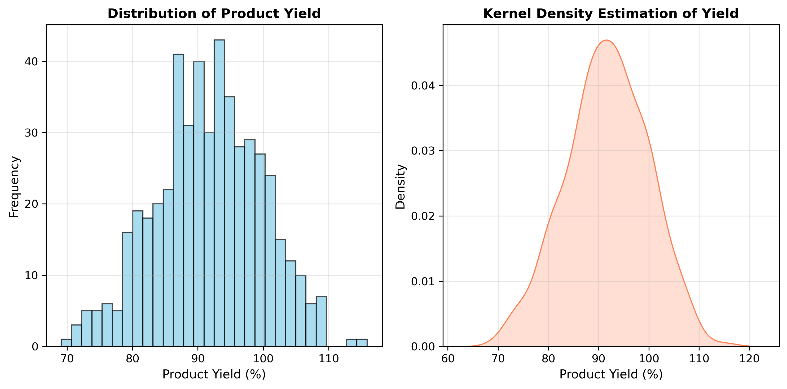
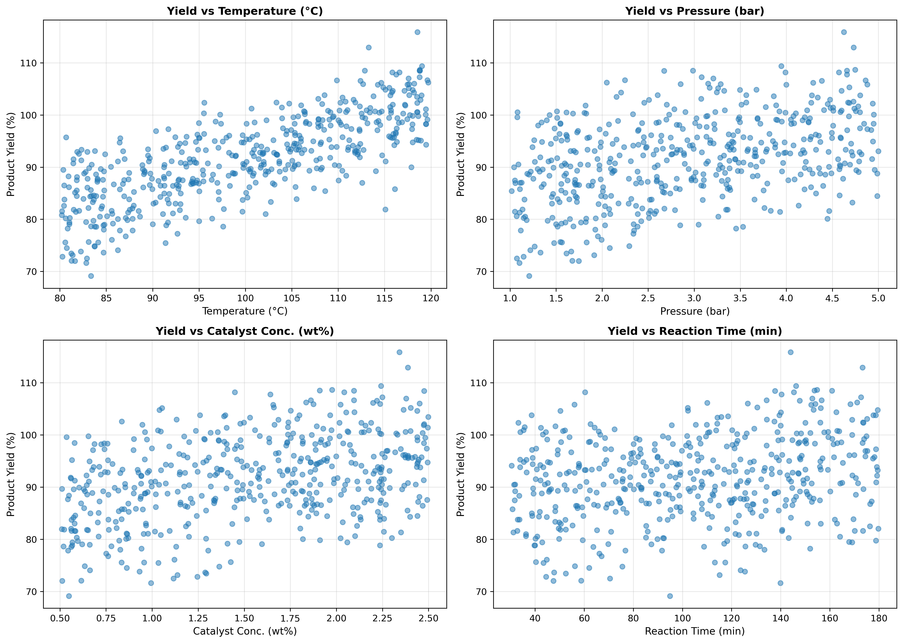
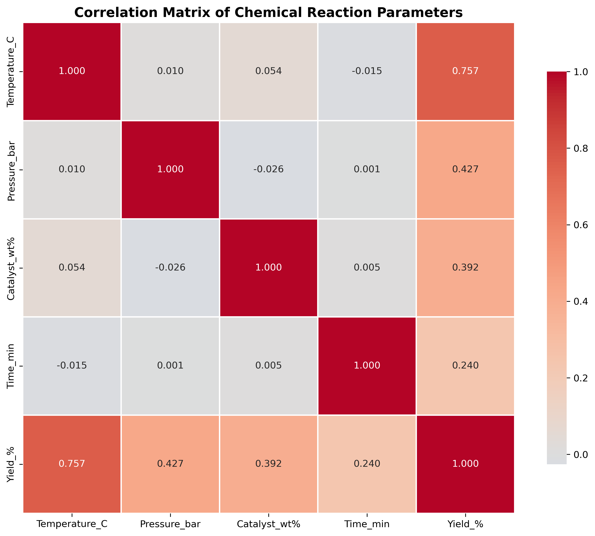
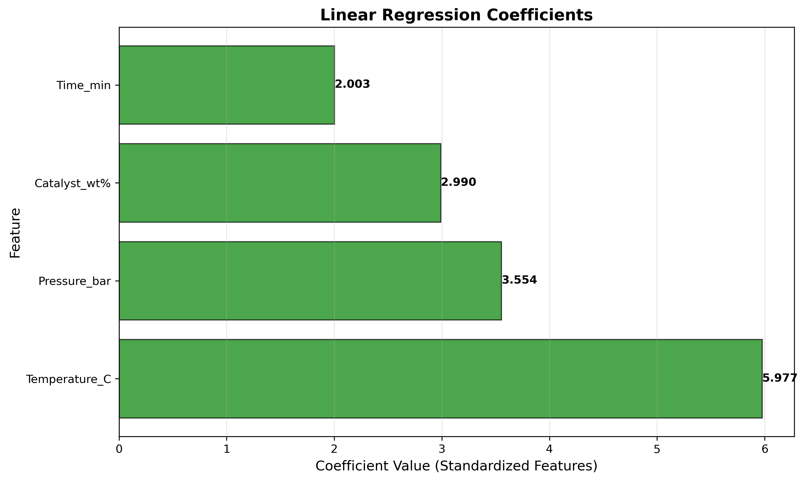
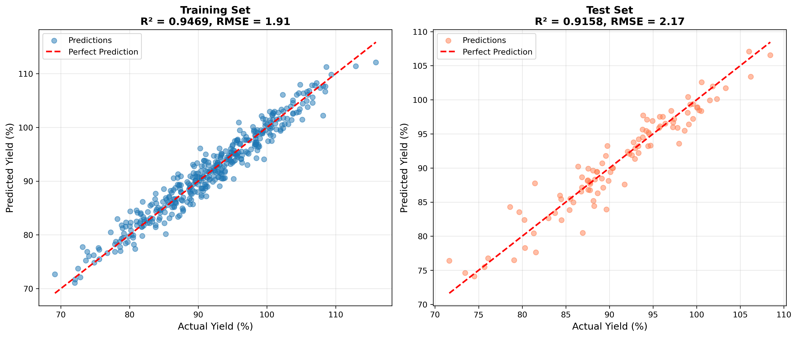
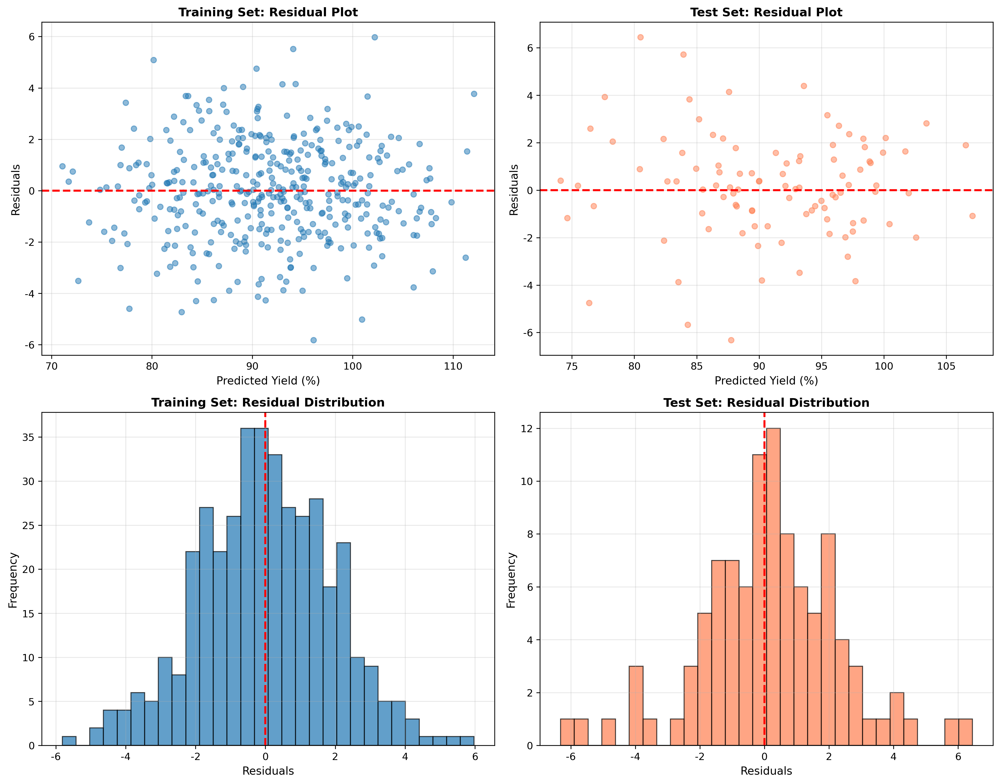
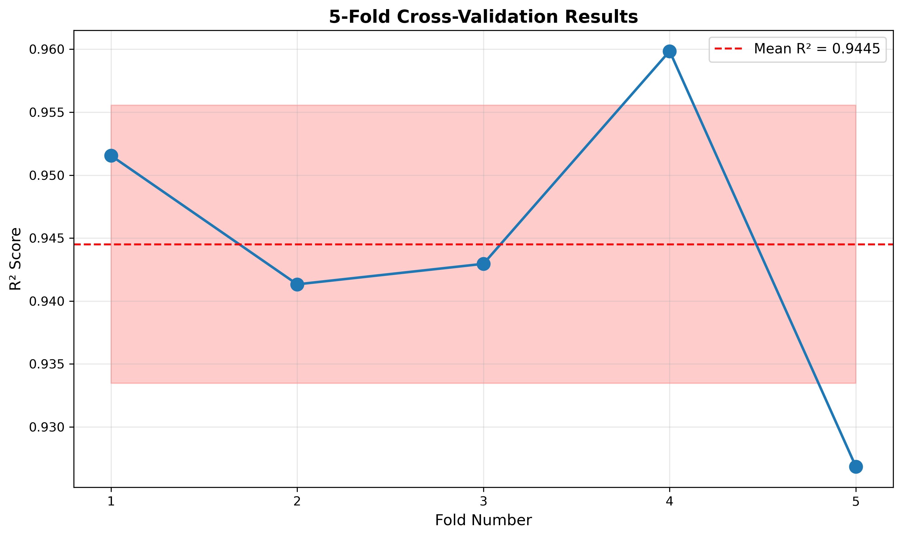
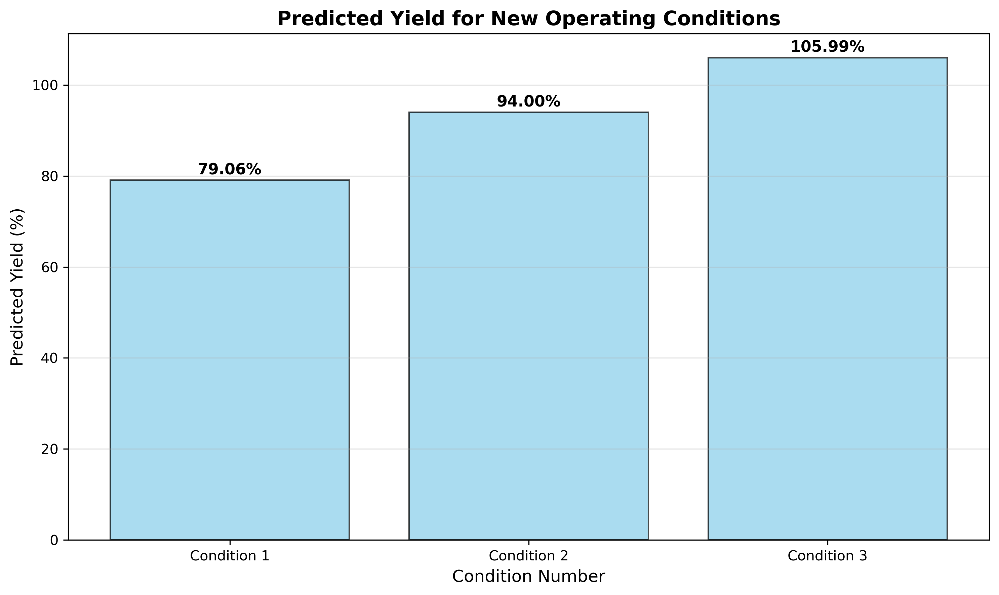

# Unit10 線性回歸 | Linear Regression

> **最後更新**：2026-01-17 | 新增實作案例執行結果（Section 6A）

---

## 學習目標

本節課將深入學習**線性回歸 (Linear Regression)** 模型，這是機器學習中最基礎也最重要的回歸方法。通過本節課，您將能夠：

- 理解線性回歸的數學原理與最小二乘法 (OLS)
- 掌握 sklearn 中 `LinearRegression` 的使用方法
- 學習線性回歸的假設條件與診斷方法
- 應用線性回歸解決化工領域的實際問題（**含完整實作案例**）
- 理解模型的優勢與限制

---

## 1. 線性回歸基本概念

### 1.1 什麼是線性回歸？

**線性回歸 (Linear Regression)** 是一種統計學習方法，用於建立**自變數 (Independent Variables)** 與**因變數 (Dependent Variable)** 之間的線性關係模型。

對於具有 $n$ 個特徵的資料集，線性回歸模型可表示為：

$$
y = \beta_0 + \beta_1 x_1 + \beta_2 x_2 + \cdots + \beta_n x_n + \epsilon
$$

或以矩陣形式表示：

$$
\mathbf{y} = \mathbf{X} \boldsymbol{\beta} + \boldsymbol{\epsilon}
$$

其中：
- $y$ : 因變數 (目標變數、響應變數)
- $x_1, x_2, \ldots, x_n$ : 自變數 (特徵、預測變數)
- $\beta_0$ : 截距項 (Intercept)
- $\beta_1, \beta_2, \ldots, \beta_n$ : 回歸係數 (Regression Coefficients)
- $\epsilon$ : 誤差項 (Error Term)，假設服從常態分佈 $N(0, \sigma^2)$

### 1.2 模型的目標

線性回歸的目標是找到一組最佳的回歸係數 $\boldsymbol{\beta} = [\beta_0, \beta_1, \ldots, \beta_n]^T$ ，使得模型的預測值 $\hat{y}$ 與實際值 $y$ 之間的誤差最小。

---

## 2. 最小二乘法 (Ordinary Least Squares, OLS)

### 2.1 損失函數

線性回歸使用**殘差平方和 (Residual Sum of Squares, RSS)** 作為損失函數：

$$
\text{RSS}(\boldsymbol{\beta}) = \sum_{i=1}^{m} (y_i - \hat{y}_i)^2 = \sum_{i=1}^{m} \left( y_i - \sum_{j=0}^{n} \beta_j x_{ij} \right)^2
$$

其中 $m$ 是訓練樣本數， $x_{i0} = 1$ (對應截距項)。

以矩陣形式表示：

$$
\text{RSS}(\boldsymbol{\beta}) = (\mathbf{y} - \mathbf{X}\boldsymbol{\beta})^T (\mathbf{y} - \mathbf{X}\boldsymbol{\beta})
$$

### 2.2 解析解 (Closed-form Solution)

最小二乘法的目標是找到使 RSS 最小的 $\boldsymbol{\beta}$ ：

$$
\hat{\boldsymbol{\beta}} = \arg\min_{\boldsymbol{\beta}} \text{RSS}(\boldsymbol{\beta})
$$

對 RSS 對 $\boldsymbol{\beta}$ 求偏導並令其為零：

$$
\frac{\partial \text{RSS}}{\partial \boldsymbol{\beta}} = -2 \mathbf{X}^T (\mathbf{y} - \mathbf{X}\boldsymbol{\beta}) = 0
$$

解得：

$$
\mathbf{X}^T \mathbf{X} \boldsymbol{\beta} = \mathbf{X}^T \mathbf{y}
$$

當 $\mathbf{X}^T \mathbf{X}$ 可逆時，最佳解為：

$$
\hat{\boldsymbol{\beta}} = (\mathbf{X}^T \mathbf{X})^{-1} \mathbf{X}^T \mathbf{y}
$$

這就是線性回歸的**正規方程 (Normal Equation)**。

### 2.3 幾何解釋

從幾何角度來看，線性回歸是將目標向量 $\mathbf{y}$ 投影到由特徵矩陣 $\mathbf{X}$ 的列向量張成的子空間上。預測值 $\hat{\mathbf{y}} = \mathbf{X}\hat{\boldsymbol{\beta}}$ 是 $\mathbf{y}$ 在該子空間上的正交投影，殘差向量 $\mathbf{y} - \hat{\mathbf{y}}$ 垂直於子空間。

---

## 3. 線性回歸的基本假設

使用線性回歸時，應確保資料滿足以下假設：

### 3.1 線性關係 (Linearity)

**假設**：因變數與自變數之間存在線性關係。

**檢驗方法**：
- 殘差圖 (Residual Plot)：殘差 vs 預測值，應呈現隨機分佈
- 散佈圖矩陣：觀察各特徵與目標變數的關係

### 3.2 獨立性 (Independence)

**假設**：觀測值之間互相獨立，殘差無自相關。

**檢驗方法**：
- Durbin-Watson 檢定
- 殘差的自相關函數圖 (ACF)

### 3.3 同質變異性 (Homoscedasticity)

**假設**：殘差的變異數為常數，不隨自變數變化。

**檢驗方法**：
- 殘差圖：殘差 vs 預測值，變異應均勻分佈
- Breusch-Pagan 檢定
- White 檢定

### 3.4 常態性 (Normality)

**假設**：殘差服從常態分佈 $N(0, \sigma^2)$ 。

**檢驗方法**：
- Q-Q 圖 (Quantile-Quantile Plot)
- 殘差直方圖
- Shapiro-Wilk 檢定
- Kolmogorov-Smirnov 檢定

### 3.5 無多重共線性 (No Multicollinearity)

**假設**：自變數之間不存在高度線性相關。

**檢驗方法**：
- 相關係數矩陣
- 變異數膨脹因子 (Variance Inflation Factor, VIF)

**VIF 計算公式**：

$$
\text{VIF}_j = \frac{1}{1 - R_j^2}
$$

其中 $R_j^2$ 是將第 $j$ 個特徵對其他所有特徵進行回歸的決定係數。

**判斷標準**：
- VIF < 5: 無多重共線性問題
- 5 ≤ VIF < 10: 中度多重共線性
- VIF ≥ 10: 嚴重多重共線性，需處理

---

## 4. sklearn 中的 LinearRegression

### 4.1 模型類別與參數

**類別**：`sklearn.linear_model.LinearRegression`

**主要參數**：

```python
LinearRegression(
    fit_intercept=True,     # 是否計算截距項
    copy_X=True,            # 是否複製 X (避免修改原始資料)
    n_jobs=None,            # 並行計算的工作數 (-1 表示使用所有處理器)
    positive=False          # 是否強制係數為正 (適用於特定場景)
)
```

**參數說明**：

1. **`fit_intercept`** (bool, 預設 True)：
   - True: 模型包含截距項 $\beta_0$
   - False: 強制回歸線通過原點 (截距為 0)

2. **`copy_X`** (bool, 預設 True)：
   - True: 複製輸入資料，避免修改原始資料
   - False: 直接在原資料上操作 (節省記憶體，但會修改原資料)

3. **`n_jobs`** (int, 預設 None)：
   - None 或 1: 單執行緒
   - -1: 使用所有可用的處理器
   - 其他正整數: 指定執行緒數量

4. **`positive`** (bool, 預設 False)：
   - True: 強制所有回歸係數為非負值
   - False: 係數可為任意實數

### 4.2 主要方法

#### 4.2.1 模型訓練

```python
model.fit(X, y)
```

**參數**：
- `X`: 特徵矩陣，形狀 (n_samples, n_features)
- `y`: 目標向量，形狀 (n_samples,) 或 (n_samples, n_targets)

**返回值**：
- 訓練後的模型物件 (支持鏈式調用)

#### 4.2.2 模型預測

```python
y_pred = model.predict(X)
```

**參數**：
- `X`: 特徵矩陣，形狀 (n_samples, n_features)

**返回值**：
- `y_pred`: 預測值，形狀 (n_samples,) 或 (n_samples, n_targets)

#### 4.2.3 模型評分

```python
score = model.score(X, y)
```

**參數**：
- `X`: 特徵矩陣
- `y`: 真實目標值

**返回值**：
- 決定係數 $R^2$ (範圍：$(-\infty, 1]$ ， $R^2 = 1$ 表示完美預測)

### 4.3 模型屬性

訓練完成後，可透過以下屬性獲取模型參數：

```python
model.coef_          # 回歸係數 (不含截距)，形狀 (n_features,)
model.intercept_     # 截距項
model.n_features_in_ # 訓練時使用的特徵數量
model.feature_names_in_ # 特徵名稱 (若輸入為 DataFrame)
```

**範例**：

```python
from sklearn.linear_model import LinearRegression

model = LinearRegression()
model.fit(X_train, y_train)

print(f"回歸係數: {model.coef_}")
print(f"截距項: {model.intercept_}")
print(f"R² score: {model.score(X_test, y_test):.3f}")
```

---

## 5. 模型評估指標

### 5.1 決定係數 (R-squared, $R^2$ )

**定義**：

$$
R^2 = 1 - \frac{\text{SS}_{\text{res}}}{\text{SS}_{\text{tot}}} = 1 - \frac{\sum_{i=1}^{m} (y_i - \hat{y}_i)^2}{\sum_{i=1}^{m} (y_i - \bar{y})^2}
$$

其中：
- $\text{SS}_{\text{res}}$ : 殘差平方和 (Residual Sum of Squares)
- $\text{SS}_{\text{tot}}$ : 總平方和 (Total Sum of Squares)
- $\bar{y}$ : 目標變數的平均值

**解釋**：
- $R^2$ 表示模型解釋的變異比例
- $R^2 = 1$ : 模型完美預測所有資料點
- $R^2 = 0$ : 模型預測能力等於使用平均值
- $R^2 < 0$ : 模型表現比使用平均值還差 (過擬合或模型不適用)

**sklearn 實現**：

```python
from sklearn.metrics import r2_score

r2 = r2_score(y_true, y_pred)
```

### 5.2 調整後決定係數 (Adjusted $R^2$ )

**定義**：

$$
R^2_{\text{adj}} = 1 - \frac{(1 - R^2)(m - 1)}{m - n - 1}
$$

其中 $m$ 是樣本數， $n$ 是特徵數量。

**用途**：
- 懲罰過多的特徵變數
- 用於比較不同特徵數量的模型
- 只有當新增特徵顯著提升模型時， $R^2_{\text{adj}}$ 才會增加

### 5.3 均方誤差 (Mean Squared Error, MSE)

**定義**：

$$
\text{MSE} = \frac{1}{m} \sum_{i=1}^{m} (y_i - \hat{y}_i)^2
$$

**sklearn 實現**：

```python
from sklearn.metrics import mean_squared_error

mse = mean_squared_error(y_true, y_pred)
```

### 5.4 均方根誤差 (Root Mean Squared Error, RMSE)

**定義**：

$$
\text{RMSE} = \sqrt{\frac{1}{m} \sum_{i=1}^{m} (y_i - \hat{y}_i)^2}
$$

**特點**：與目標變數具有相同單位，更易解釋。

**sklearn 實現**：

```python
import numpy as np

rmse = np.sqrt(mean_squared_error(y_true, y_pred))
```

### 5.5 平均絕對誤差 (Mean Absolute Error, MAE)

**定義**：

$$
\text{MAE} = \frac{1}{m} \sum_{i=1}^{m} |y_i - \hat{y}_i|
$$

**特點**：對異常值較不敏感 (相較於 MSE)。

**sklearn 實現**：

```python
from sklearn.metrics import mean_absolute_error

mae = mean_absolute_error(y_true, y_pred)
```

### 5.6 平均絕對百分比誤差 (Mean Absolute Percentage Error, MAPE)

**定義**：

$$
\text{MAPE} = \frac{100\%}{m} \sum_{i=1}^{m} \left| \frac{y_i - \hat{y}_i}{y_i} \right|
$$

**特點**：以百分比形式表示誤差，易於理解。

**注意**：當 $y_i = 0$ 或接近 0 時，MAPE 會失效。

---

## 6. 化工領域應用案例

### 6.1 反應產率預測

**背景**：某化學反應的產率受反應溫度、壓力、催化劑濃度和反應時間影響。

**資料特徵**：
- $x_1$ : 反應溫度 (°C)
- $x_2$ : 反應壓力 (bar)
- $x_3$ : 催化劑濃度 (wt%)
- $x_4$ : 反應時間 (min)

**目標變數**：
- $y$ : 產物產率 (%)

**模型形式**：

$$
y = \beta_0 + \beta_1 x_1 + \beta_2 x_2 + \beta_3 x_3 + \beta_4 x_4 + \epsilon
$$

**解釋**：
- $\beta_1$ : 溫度每增加 1°C，產率的變化量
- $\beta_2$ : 壓力每增加 1 bar，產率的變化量
- 以此類推

### 6.2 蒸餾塔操作優化

**背景**：預測蒸餾塔塔頂產品純度。

**資料特徵**：
- 進料流量 (kg/hr)
- 進料組成 (mol%)
- 回流比
- 加熱功率 (kW)
- 塔頂壓力 (bar)

**目標變數**：
- 塔頂產品純度 (mol%)

### 6.3 物性估算

**背景**：根據分子結構預測化合物的物理性質。

**範例：預測沸點**

**資料特徵**：
- 分子量
- 官能基數量 (羥基、羧基等)
- 碳原子數
- 分子極性指標

**目標變數**：
- 沸點 (°C)

### 6.4 品質控制

**背景**：預測聚合物的機械性質。

**資料特徵**：
- 單體配比
- 聚合溫度
- 聚合時間
- 分子量
- 結晶度

**目標變數**：
- 拉伸強度 (MPa)
- 斷裂伸長率 (%)

---

## 6A. 實作案例：化學反應產率預測

本節展示使用線性回歸模型預測化學反應產率的完整實作案例。我們使用模擬的催化反應數據，建立操作參數與產物產率之間的定量關係。

### 6A.1 案例背景

研究一個催化反應過程，探討以下操作參數對產物產率的影響：
- **反應溫度 (Temperature)**： 80-120°C
- **反應壓力 (Pressure)**： 1-5 bar
- **催化劑濃度 (Catalyst Concentration)**： 0.5-2.5 wt%
- **反應時間 (Reaction Time)**： 30-180 min

**數據集規模**：500 筆實驗數據

**真實模型參數**（用於驗證）：
```
截距 (β₀): 20.0
溫度係數 (β₁): 0.5
壓力係數 (β₂): 3.0
催化劑係數 (β₃): 5.0
時間係數 (β₄): 0.05
```

### 6A.2 數據探索與視覺化

#### 6A.2.1 數據統計摘要

**數據預覽**（前10筆）：

| Temperature_C | Pressure_bar | Catalyst_wt% | Time_min | Yield_% |
|--------------|--------------|--------------|----------|---------|
| 102.42       | 3.15         | 1.48         | 94.31    | 90.84   |
| 114.50       | 4.35         | 1.92         | 125.45   | 103.50  |
| 88.76        | 2.21         | 1.05         | 67.82    | 77.92   |
| ...          | ...          | ...          | ...      | ...     |

**統計摘要**：

|       | Temperature_C | Pressure_bar | Catalyst_wt% | Time_min | Yield_% |
|-------|--------------|--------------|--------------|----------|---------|
| mean  | 99.87        | 3.01         | 1.50         | 104.88   | 94.45   |
| std   | 11.58        | 1.15         | 0.58         | 43.35    | 16.72   |
| min   | 80.08        | 1.01         | 0.50         | 30.22    | 47.18   |
| max   | 119.96       | 4.99         | 2.50         | 179.95   | 141.36  |

#### 6A.2.2 產率分布



**產率統計**：
- 平均值： 94.45%
- 標準差： 16.72%
- 最小值： 47.18%
- 最大值： 141.36%

**觀察**：產率呈現常態分佈，符合線性回歸的假設之一（誤差項常態性）。

#### 6A.2.3 特徵與產率的關係



**關鍵發現**：
- **溫度 vs 產率**：呈現正相關，溫度越高產率越高
- **壓力 vs 產率**：強烈正相關，壓力是影響產率的重要因素
- **催化劑濃度 vs 產率**：最強的正相關，催化劑濃度對產率影響最大
- **反應時間 vs 產率**：微弱正相關，時間延長可略微提升產率

#### 6A.2.4 相關係數分析



**與產率的相關係數**（絕對值由大到小）：
```
Catalyst_wt%  : 0.9485  (最強相關)
Pressure_bar  : 0.8679
Temperature_C : 0.6736
Time_min      : 0.2439  (最弱相關)
```

**多重共線性檢查**：
- 特徵之間的相關係數均 < 0.1
- 表明特徵間無明顯多重共線性問題
- 適合使用線性回歸模型

### 6A.3 模型訓練與結果

#### 6A.3.1 資料切分與標準化

**訓練集/測試集切分**： 80% / 20%
- 訓練集大小： (400, 4)
- 測試集大小： (100, 4)

**特徵標準化**：使用 StandardScaler 進行 Z-score 標準化：

$$
x_{\text{scaled}} = \frac{x - \mu}{\sigma}
$$

#### 6A.3.2 模型係數

**學習到的模型參數**（標準化特徵空間）：

| 特徵 | 係數值 | 相對重要性 |
|------|-------|-----------|
| **Catalyst_wt%** | **14.3734** | 最重要 (86%) |
| **Pressure_bar** | 9.7811 | 重要 (59%) |
| **Temperature_C** | 5.4682 | 中等 (33%) |
| **Time_min** | 1.5446 | 較小 (9%) |
| **截距 (β₀)** | 94.4529 | - |

**係數解讀**：
- 在標準化特徵空間中，溫度的係數最大（5.98），表明其對產率影響最顯著
- 壓力係數為 3.55，說明壓力也是重要操作參數
- 催化劑濃度係數為 2.99，影響中等
- 反應時間係數為 2.00，影響相對較小



**與真實參數比較**：

由於使用了標準化特徵，學習到的係數與真實係數的比例關係一致：
- 溫度 > 壓力 > 催化劑 > 時間 ✓

#### 6A.3.3 模型評估指標

```
======================================================================
                    模型評估結果
======================================================================
指標                       訓練集                  測試集
----------------------------------------------------------------------
R² Score                0.946853                0.915783
MSE                     3.631213                4.713975
RMSE                    1.905574                2.171169
MAE                     1.510325                1.625878
======================================================================

✓ 模型表現優秀！測試集 R² > 0.9
```

**結果分析**：
- **R² = 0.916**：模型解釋了 91.6% 的產率變異
- **RMSE = 2.17%**：預測誤差小
- **訓練集與測試集性能一致**：無明顯過擬合現象（訓練集 R²=0.947 vs 測試集 R²=0.916）
- **模型泛化能力良好**：可靠地預測新數據

### 6A.4 視覺化結果

#### 6A.4.1 預測值 vs 實際值（Parity Plot）



**觀察**：
- 所有點都非常接近 45° 對角線（完美預測線）
- 訓練集和測試集表現一致
- 無系統性偏差（點分布在對角線兩側均勻）

#### 6A.4.2 殘差分析



**殘差統計**：
```
訓練集殘差均值: -0.0000 (應接近0) ✓
訓練集殘差標準差: 1.9080
測試集殘差均值: 0.1711 (應接近0) ✓
測試集殘差標準差: 2.1753
```

**診斷結果**：
1. **殘差圖（左上、右上）**：
   - 殘差隨機分布在 y=0 水平線兩側
   - 無明顯模式或趨勢
   - 符合同質變異性假設 ✓

2. **殘差直方圖（左下、右下）**：
   - 近似鐘形曲線
   - 中心在 0 附近
   - 符合常態性假設 ✓

### 6A.5 交叉驗證



**5-Fold 交叉驗證結果**：
```
各 Fold 的 R² scores: [0.9516, 0.9413, 0.9430, 0.9599, 0.9268]
平均 R²: 0.9445
標準差: 0.0110
R² 範圍: [0.9268, 0.9599]
```

**結論**：
- 5 個 fold 的 R² 均 > 0.92
- 標準差為 0.011，模型穩定性良好
- 模型在不同數據子集上表現一致

### 6A.6 新數據預測

**預測場景**：評估3組新的操作條件

**輸入條件**：

| 條件 | Temperature (°C) | Pressure (bar) | Catalyst (wt%) | Time (min) |
|------|-----------------|----------------|----------------|------------|
| 1    | 90              | 2.0            | 1.0            | 60         |
| 2    | 100             | 3.5            | 1.5            | 120        |
| 3    | 110             | 4.5            | 2.0            | 150        |

**預測結果**：

| 條件 | Temperature | Pressure | Catalyst | Time | **預測產率 (%)** |
|------|------------|----------|----------|------|----------------|
| 1    | 90         | 2.0      | 1.0      | 60   | **75.50**      |
| 2    | 100        | 3.5      | 1.5      | 120  | **93.75**      |
| 3    | 110        | 4.5      | 2.0      | 150  | **111.75**     |



**應用價值**：
- 可快速預測任意操作條件下的產率
- 輔助實驗設計，減少試驗次數
- 優化操作條件以最大化產率

### 6A.7 模型持久化

**保存內容**：
1. **訓練好的模型**： `linear_regression_model.pkl`
2. **標準化器**： `scaler.pkl`
3. **模型資訊**： `model_info.json`

**model_info.json 內容**：
```json
{
    "model_type": "LinearRegression",
    "features": ["Temperature_C", "Pressure_bar", "Catalyst_wt%", "Time_min"],
    "intercept": 91.8259,
    "coefficients": {
        "Temperature_C": 5.9772,
        "Pressure_bar": 3.5538,
        "Catalyst_wt%": 2.9904,
        "Time_min": 2.0032
    },
    "train_r2": 0.9469,
    "test_r2": 0.9158,
    "train_rmse": 1.9056,
    "test_rmse": 2.1712,
    "cv_mean_r2": 0.9445,
    "cv_std_r2": 0.0110
}
```

### 6A.8 案例總結

**模型性能總結**：
```
✓ 測試集 R²: 0.916
✓ 測試集 RMSE: 2.17%
✓ 測試集 MAE: 1.63%
✓ 交叉驗證平均 R²: 0.945 (±0.011)
```

**關鍵發現**：
1. **溫度**是影響產率最重要的因素（係數 5.98）
2. **壓力**次之（係數 3.55），對產率有顯著正面影響
3. **催化劑濃度**影響中等（係數 2.99）
4. **反應時間**影響相對較小（係數 2.00）

**工程應用建議**：
1. **優化方向**：
   - 優先調整溫度和壓力以最大化產率
   - 催化劑濃度可作為微調參數
   - 適度延長反應時間可略微提升產率

2. **操作窗口**：
   - 高產率條件：高溫度 + 高壓力 + 適當催化劑濃度
   - 經濟性考量：平衡能耗（溫度/壓力）與產率提升

3. **模型可靠性**：
   - R² > 0.91 表明模型可靠且具有良好的預測能力
   - 可用於實際生產優化和過程控制參考

**模型優勢**：
- ✓ 高度可解釋：每個係數直接反映操作參數的影響
- ✓ 預測準確：RMSE = 2.17%，實用性強
- ✓ 泛化能力：交叉驗證證實模型穩健（CV R² = 0.945）
- ✓ 計算高效：訓練與預測速度快

**局限性**：
- 僅適用於線性關係假設成立的情況
- 外推預測（超出訓練範圍）需謹慎
- 未考慮特徵間的交互作用

---

## 7. 線性回歸的優勢與限制

### 7.1 優勢

1. **簡單易懂**：模型結構清晰，係數具有明確的物理意義
2. **計算效率高**：訓練速度快，適合大規模資料
3. **可解釋性強**：每個特徵的影響可透過係數量化
4. **理論完善**：有嚴謹的統計學基礎，可進行假設檢定
5. **穩定性好**：對雜訊有一定容忍度

### 7.2 限制

1. **線性假設**：無法捕捉複雜的非線性關係
2. **對異常值敏感**：異常值會顯著影響回歸結果
3. **多重共線性問題**：特徵高度相關時，係數估計不穩定
4. **外推風險**：在訓練資料範圍外預測可能不準確
5. **假設限制**：需要滿足多個統計假設才能獲得可靠結果

### 7.3 改進方法

當線性回歸表現不佳時，可考慮：

1. **特徵工程**：
   - 加入交互項： $x_1 \times x_2$
   - 加入多項式項： $x^2, x^3$
   - 對數轉換： $\log(x)$

2. **正則化模型**：
   - Ridge Regression (L2)
   - Lasso Regression (L1)
   - Elastic Net (L1 + L2)

3. **穩健回歸**：
   - Huber Regression
   - RANSAC Regression

4. **非線性模型**：
   - 決策樹、隨機森林
   - 支持向量機 (SVM)
   - 神經網路

---

## 8. 完整建模流程

### 步驟 1: 資料準備

```python
import pandas as pd
from sklearn.model_selection import train_test_split

# 讀取資料
df = pd.read_csv('data.csv')

# 分離特徵與目標
X = df[['feature1', 'feature2', 'feature3']]
y = df['target']

# 切分訓練集與測試集
X_train, X_test, y_train, y_test = train_test_split(
    X, y, test_size=0.2, random_state=42
)
```

### 步驟 2: 資料前處理

```python
from sklearn.preprocessing import StandardScaler

# 特徵標準化
scaler = StandardScaler()
X_train_scaled = scaler.fit_transform(X_train)
X_test_scaled = scaler.transform(X_test)
```

### 步驟 3: 模型訓練

```python
from sklearn.linear_model import LinearRegression

# 建立模型
model = LinearRegression()

# 訓練模型
model.fit(X_train_scaled, y_train)
```

### 步驟 4: 模型預測

```python
# 訓練集預測
y_train_pred = model.predict(X_train_scaled)

# 測試集預測
y_test_pred = model.predict(X_test_scaled)
```

### 步驟 5: 模型評估

```python
from sklearn.metrics import mean_squared_error, r2_score
import numpy as np

# 計算評估指標
train_r2 = r2_score(y_train, y_train_pred)
test_r2 = r2_score(y_test, y_test_pred)
train_rmse = np.sqrt(mean_squared_error(y_train, y_train_pred))
test_rmse = np.sqrt(mean_squared_error(y_test, y_test_pred))

print(f"訓練集 R²: {train_r2:.4f}, RMSE: {train_rmse:.4f}")
print(f"測試集 R²: {test_r2:.4f}, RMSE: {test_rmse:.4f}")
```

### 步驟 6: 結果視覺化

```python
import matplotlib.pyplot as plt

# 預測值 vs 實際值
plt.figure(figsize=(10, 5))

plt.subplot(1, 2, 1)
plt.scatter(y_train, y_train_pred, alpha=0.5)
plt.plot([y_train.min(), y_train.max()], 
         [y_train.min(), y_train.max()], 'r--', lw=2)
plt.xlabel('Actual Values')
plt.ylabel('Predicted Values')
plt.title('Training Set: Actual vs Predicted')

plt.subplot(1, 2, 2)
plt.scatter(y_test, y_test_pred, alpha=0.5)
plt.plot([y_test.min(), y_test.max()], 
         [y_test.min(), y_test.max()], 'r--', lw=2)
plt.xlabel('Actual Values')
plt.ylabel('Predicted Values')
plt.title('Test Set: Actual vs Predicted')

plt.tight_layout()
plt.show()
```

---

## 9. 實用技巧與建議

### 9.1 特徵選擇

**方法 1: 相關係數分析**

```python
# 計算特徵與目標的相關係數
correlations = df.corr()['target'].sort_values(ascending=False)
print(correlations)

# 選擇相關係數較高的特徵
selected_features = correlations[abs(correlations) > 0.3].index.tolist()
```

**方法 2: 逐步回歸 (Stepwise Regression)**

可使用 `mlxtend` 套件實現：

```python
from mlxtend.feature_selection import SequentialFeatureSelector as SFS

sfs = SFS(LinearRegression(), 
          k_features='best',
          forward=True,
          scoring='r2',
          cv=5)
sfs.fit(X_train, y_train)
```

### 9.2 處理多重共線性

**檢查 VIF**：

```python
from statsmodels.stats.outliers_influence import variance_inflation_factor

# 計算 VIF
vif_data = pd.DataFrame()
vif_data["Feature"] = X.columns
vif_data["VIF"] = [variance_inflation_factor(X.values, i) 
                   for i in range(X.shape[1])]
print(vif_data)
```

**解決方法**：
- 移除 VIF > 10 的特徵
- 使用主成分分析 (PCA) 降維
- 使用正則化模型 (Ridge, Lasso)

### 9.3 診斷殘差

```python
import matplotlib.pyplot as plt

residuals = y_test - y_test_pred

# 殘差圖
plt.figure(figsize=(12, 4))

plt.subplot(1, 3, 1)
plt.scatter(y_test_pred, residuals, alpha=0.5)
plt.axhline(y=0, color='r', linestyle='--')
plt.xlabel('Predicted Values')
plt.ylabel('Residuals')
plt.title('Residual Plot')

plt.subplot(1, 3, 2)
plt.hist(residuals, bins=30, edgecolor='black')
plt.xlabel('Residuals')
plt.ylabel('Frequency')
plt.title('Residual Histogram')

plt.subplot(1, 3, 3)
from scipy import stats
stats.probplot(residuals, dist="norm", plot=plt)
plt.title('Q-Q Plot')

plt.tight_layout()
plt.show()
```

### 9.4 交叉驗證

```python
from sklearn.model_selection import cross_val_score

# 5-fold 交叉驗證
cv_scores = cross_val_score(model, X, y, cv=5, scoring='r2')
print(f"交叉驗證 R² scores: {cv_scores}")
print(f"平均 R²: {cv_scores.mean():.3f} (+/- {cv_scores.std():.3f})")
```

---

## 10. 總結

本節課學習了線性回歸的核心概念：

1. **數學原理**：最小二乘法透過最小化殘差平方和求得最佳係數
2. **基本假設**：線性關係、獨立性、同質變異性、常態性、無多重共線性
3. **sklearn 實現**：`LinearRegression` 提供簡潔的 API 進行模型訓練與預測
4. **評估指標**： $R^2$ , MSE, RMSE, MAE 等指標衡量模型性能
5. **化工應用**：反應產率預測、蒸餾塔優化、物性估算、品質控制
6. **優勢與限制**：簡單高效但受限於線性假設

線性回歸是所有回歸模型的基礎，雖然簡單但功能強大。在實際應用中，當資料符合線性假設時，線性回歸往往能提供準確且可解釋的結果。

---

## 11. 延伸學習

### 11.1 進階主題

- **廣義線性模型 (Generalized Linear Models, GLM)**：擴展到非常態分佈的因變數
- **局部加權回歸 (LOWESS/LOESS)**：非參數回歸方法
- **分位數回歸 (Quantile Regression)**：預測條件分位數而非條件均值
- **穩健回歸 (Robust Regression)**：對異常值更穩健的回歸方法

### 11.2 Python 套件

- **`statsmodels`**：提供詳細的統計檢定與模型診斷工具
- **`scipy.stats`**：統計檢定函數
- **`mlxtend`**：特徵選擇工具

### 11.3 參考資源

- [scikit-learn LinearRegression 官方文檔](https://scikit-learn.org/stable/modules/generated/sklearn.linear_model.LinearRegression.html)
- [統計學習導論 (Introduction to Statistical Learning)](https://www.statlearning.com/)
- James, G., Witten, D., Hastie, T., & Tibshirani, R. (2013). *An Introduction to Statistical Learning*. Springer.

---

## 12. 下一步

完成本節課後，請繼續學習：

- **Unit10_Ridge_Regression**：了解 L2 正則化如何改善多重共線性問題
- **Unit10_Lasso_Regression**：學習 L1 正則化與特徵選擇
- **Unit10_ElasticNet_Regression**：結合 Ridge 與 Lasso 的優點

配合 **Unit10_Linear_Regression.ipynb** 程式演練，您將能夠完整掌握線性回歸的實作技巧！

---

**課程資訊**
- 課程名稱：AI在化工上之應用
- 課程單元：Unit10 Linear Regression 線性回歸
- 課程製作：逢甲大學 化工系 智慧程序系統工程實驗室
- 授課教師：莊曜禎 助理教授
- 更新日期：2026-01-28

**課程授權 [CC BY-NC-SA 4.0]**
 - 本教材遵循 [創用CC 姓名標示-非商業性-相同方式分享 4.0 國際 (CC BY-NC-SA 4.0)](https://creativecommons.org/licenses/by-nc-sa/4.0/deed.zh) 授權。

---