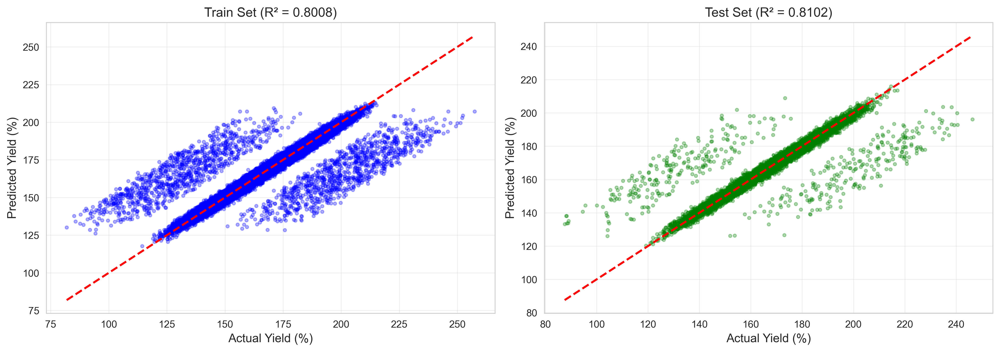

# Unit10 隨機梯度下降回歸 | SGD Regression

> **最後更新**：2026-01-16 | 建立完整教學講義

---

## 學習目標

本節課將深入學習**隨機梯度下降回歸 (SGD Regression)** 模型，這是一種基於梯度下降優化的線性回歸方法，特別適用於**大規模數據**和**在線學習**場景。通過本節課，您將能夠：

- 理解 SGD 的數學原理與優化過程
- 掌握 sklearn 中 `SGDRegressor` 的使用方法
- 學習如何選擇學習率、正則化參數和損失函數
- 理解 SGD 與批量梯度下降、小批量梯度下降的差異
- 應用 SGD 回歸解決大規模數據建模問題
- 掌握在線學習 (Online Learning) 的應用場景
- 解決化工領域的實際建模問題（**含完整實作案例**）

---

## 1. SGD 回歸基本概念

### 1.1 什麼是 SGD 回歸？

**隨機梯度下降回歸 (Stochastic Gradient Descent Regression, SGD Regression)** 是一種基於**梯度下降優化算法**的線性回歸方法。與傳統的批量梯度下降 (Batch Gradient Descent) 不同，SGD **每次只使用一個樣本**來更新模型參數，這使得它在處理大規模數據時具有顯著的計算優勢。

**核心思想**：
- 通過迭代更新的方式，逐步調整模型參數
- 每次迭代僅使用一個或少量樣本計算梯度
- 支持多種損失函數和正則化方法
- 適合**增量學習**和**在線學習**場景

### 1.2 為什麼需要 SGD 回歸？

SGD 回歸解決了以下重要問題：

1. **大規模數據處理**：
   - 當數據量達到百萬、千萬級別時，批量梯度下降計算成本過高
   - SGD 每次只需處理一個樣本，記憶體需求低
   - 可以**流式處理數據**，不需要將全部數據載入記憶體

2. **在線學習 (Online Learning)**：
   - 支持**增量更新**：新數據到達時可以即時更新模型
   - 適用於**動態環境**：數據分佈隨時間變化的場景
   - 化工應用：即時反應器監控、連續生產過程優化

3. **靈活性**：
   - 支持多種損失函數（squared_loss, huber, epsilon_insensitive 等）
   - 支持多種正則化（L1, L2, Elastic Net）
   - 可以模擬 OLS、Ridge、Lasso、Elastic Net 等多種線性模型

4. **計算效率**：
   - 收斂速度快（對於大數據）
   - 可以提前停止訓練（當驗證誤差不再下降時）
   - 支持 warm_start 參數實現增量學習

**SGD 回歸的核心優勢**：
- ✓ **可擴展性**：處理大規模數據（百萬級以上樣本）
- ✓ **記憶體效率**：不需要將全部數據載入記憶體
- ✓ **在線學習**：支持增量更新和流式數據處理
- ✓ **靈活性**：多種損失函數和正則化組合
- ✓ **收斂快速**：對於大數據比批量梯度下降快得多

### 1.3 梯度下降方法比較

在機器學習中，有三種主要的梯度下降方法：

| 方法 | 每次迭代使用樣本數 | 更新頻率 | 計算成本 | 收斂穩定性 | 適用場景 |
|------|-------------------|---------|---------|-----------|---------|
| **批量梯度下降 (BGD)** | 全部樣本 $n$ | 低 | 高 $O(n)$ | 穩定 | 小數據集 |
| **隨機梯度下降 (SGD)** | 1個樣本 | 高 | 低 $O(1)$ | 波動大 | **大數據、在線學習** |
| **小批量梯度下降 (MBGD)** | 小批量 $m$ (如32, 64) | 中 | 中 $O(m)$ | 較穩定 | 深度學習、GPU加速 |

**更新公式對比**：

1. **批量梯度下降 (BGD)**：
   $$
   \boldsymbol{\beta}^{(t+1)} = \boldsymbol{\beta}^{(t)} - \eta \cdot \frac{1}{n} \sum_{i=1}^{n} \nabla L(\boldsymbol{\beta}^{(t)}, \mathbf{x}_i, y_i)
   $$

2. **隨機梯度下降 (SGD)**：
   $$
   \boldsymbol{\beta}^{(t+1)} = \boldsymbol{\beta}^{(t)} - \eta \cdot \nabla L(\boldsymbol{\beta}^{(t)}, \mathbf{x}_i, y_i)
   $$
   其中 $\mathbf{x}_i, y_i$ 為**隨機抽取的單個樣本**

3. **小批量梯度下降 (MBGD)**：
   $$
   \boldsymbol{\beta}^{(t+1)} = \boldsymbol{\beta}^{(t)} - \eta \cdot \frac{1}{m} \sum_{i \in \text{batch}} \nabla L(\boldsymbol{\beta}^{(t)}, \mathbf{x}_i, y_i)
   $$

### 1.4 SGD 的收斂行為

SGD 的優化過程具有以下特點：

1. **快速下降階段**：
   - 初期，損失函數快速下降
   - 每個樣本提供的梯度信息雖然有噪聲，但平均方向正確

2. **波動階段**：
   - 後期，損失函數在最優解附近**震盪**
   - 無法像 BGD 那樣精確收斂到最優解
   - 通過**學習率衰減**可以減少震盪

3. **鞍點逃逸**：
   - SGD 的隨機性有助於**逃離鞍點**和**局部最優解**
   - 這在非凸優化中是一個優勢

**收斂曲線示意**：
```
Loss
  |
  |     BGD (平滑下降)
  |    /
  |   /
  |  /   SGD (快速但震盪)
  | /~~~~\~/~\~/~\_
  |/__________________ Iterations
```

---

## 2. SGD 回歸的數學原理

### 2.1 目標函數

SGD 回歸的目標是最小化以下損失函數（以平方損失為例）：

$$
\min_{\boldsymbol{\beta}} \quad J(\boldsymbol{\beta}) = \frac{1}{n} \sum_{i=1}^{n} L(y_i, \mathbf{x}_i^T \boldsymbol{\beta}) + R(\boldsymbol{\beta})
$$

其中：
- $L(y_i, \mathbf{x}_i^T \boldsymbol{\beta})$ : **損失函數** (Loss Function)
- $R(\boldsymbol{\beta})$ : **正則化項** (Regularization Term)
- $n$ : 樣本總數

### 2.2 常見損失函數

sklearn 的 `SGDRegressor` 支持多種損失函數：

1. **平方損失 (Squared Loss)** - `loss='squared_loss'`（默認）：
   $$
   L(y, \hat{y}) = \frac{1}{2}(y - \hat{y})^2
   $$
   - 對應**普通最小平方法 (OLS)**
   - 對異常值敏感

2. **Huber 損失 (Huber Loss)** - `loss='huber'`：
   $$
   L(y, \hat{y}) = \begin{cases}
   \frac{1}{2}(y - \hat{y})^2 & \text{if } |y - \hat{y}| \leq \epsilon \\
   \epsilon |y - \hat{y}| - \frac{1}{2}\epsilon^2 & \text{if } |y - \hat{y}| > \epsilon
   \end{cases}
   $$
   - 結合平方損失和絕對損失
   - **對異常值魯棒**（當誤差大於 ε 時採用線性懲罰）

3. **ε-不敏感損失 (Epsilon-Insensitive Loss)** - `loss='epsilon_insensitive'`：
   $$
   L(y, \hat{y}) = \max(0, |y - \hat{y}| - \epsilon)
   $$
   - 在 $|y - \hat{y}| < \epsilon$ 範圍內不懲罰
   - 對應**支持向量回歸 (SVR)**

4. **平方 ε-不敏感損失 (Squared Epsilon-Insensitive Loss)** - `loss='squared_epsilon_insensitive'`：
   $$
   L(y, \hat{y}) = \max(0, |y - \hat{y}| - \epsilon)^2
   $$

### 2.3 正則化項

SGD 回歸支持以下正則化方法：

1. **無正則化** - `penalty='none'`：
   $$
   R(\boldsymbol{\beta}) = 0
   $$

2. **L2 正則化 (Ridge)** - `penalty='l2'`（默認）：
   $$
   R(\boldsymbol{\beta}) = \frac{\alpha}{2} \| \boldsymbol{\beta} \|_2^2 = \frac{\alpha}{2} \sum_{j=1}^{p} \beta_j^2
   $$

3. **L1 正則化 (Lasso)** - `penalty='l1'`：
   $$
   R(\boldsymbol{\beta}) = \alpha \| \boldsymbol{\beta} \|_1 = \alpha \sum_{j=1}^{p} |\beta_j|
   $$

4. **Elastic Net 正則化** - `penalty='elasticnet'`：
   $$
   R(\boldsymbol{\beta}) = \alpha \rho \| \boldsymbol{\beta} \|_1 + \frac{\alpha (1-\rho)}{2} \| \boldsymbol{\beta} \|_2^2
   $$
   其中 $\rho$ 由 `l1_ratio` 參數控制（對應 Elastic Net 中的 l1_ratio）

### 2.4 梯度計算

對於平方損失和 L2 正則化，損失函數為：

$$
J(\boldsymbol{\beta}) = \frac{1}{2}(y_i - \mathbf{x}_i^T \boldsymbol{\beta})^2 + \frac{\alpha}{2} \| \boldsymbol{\beta} \|_2^2
$$

梯度計算：

$$
\nabla_{\boldsymbol{\beta}} J(\boldsymbol{\beta}) = -(\mathbf{y}_i - \mathbf{x}_i^T \boldsymbol{\beta}) \mathbf{x}_i + \alpha \boldsymbol{\beta}
$$

### 2.5 參數更新規則

SGD 的參數更新公式為：

$$
\boldsymbol{\beta}^{(t+1)} = \boldsymbol{\beta}^{(t)} - \eta^{(t)} \nabla_{\boldsymbol{\beta}} J(\boldsymbol{\beta}^{(t)})
$$

對於平方損失 + L2 正則化：

$$
\boldsymbol{\beta}^{(t+1)} = \boldsymbol{\beta}^{(t)} - \eta^{(t)} \left[ -(y_i - \mathbf{x}_i^T \boldsymbol{\beta}^{(t)}) \mathbf{x}_i + \alpha \boldsymbol{\beta}^{(t)} \right]
$$

簡化為：

$$
\boldsymbol{\beta}^{(t+1)} = (1 - \eta^{(t)} \alpha) \boldsymbol{\beta}^{(t)} + \eta^{(t)} (y_i - \mathbf{x}_i^T \boldsymbol{\beta}^{(t)}) \mathbf{x}_i
$$

其中：
- $\eta^{(t)}$ : 第 $t$ 次迭代的**學習率** (Learning Rate)
- $(1 - \eta^{(t)} \alpha)$ : 正則化帶來的**權重衰減** (Weight Decay)

---

## 3. SGD 回歸的關鍵參數

### 3.1 學習率 (Learning Rate)

學習率 $\eta$ 是 SGD 最重要的超參數，控制每次更新的步長。

**學習率調度策略** (`learning_rate` 參數)：

1. **常數學習率 (Constant)** - `learning_rate='constant'`：
   $$
   \eta^{(t)} = \eta_0
   $$
   - 固定學習率
   - 通過 `eta0` 參數設置（默認 0.01）
   - 可能在最優解附近震盪

2. **最優學習率 (Optimal)** - `learning_rate='optimal'`（**默認**）：
   $$
   \eta^{(t)} = \frac{1}{\alpha (t_0 + t)}
   $$
   - 自動根據正則化參數 α 調整
   - 通常是最穩健的選擇

3. **倒數衰減 (Invscaling)** - `learning_rate='invscaling'`：
   $$
   \eta^{(t)} = \frac{\eta_0}{t^{\text{power\_t}}}
   $$
   - `power_t` 控制衰減速度（默認 0.25）
   - 需要仔細調整 `eta0` 和 `power_t`

4. **自適應學習率 (Adaptive)** - `learning_rate='adaptive'`：
   - 當訓練損失在 `n_iter_no_change` 個 epoch 內沒有改善時，學習率減半
   - 自動調整，適合不確定學習率的情況

**化工應用建議**：
- 小數據集 (< 10,000)：使用 `learning_rate='optimal'` 或 `'adaptive'`
- 大數據集 (> 100,000)：使用 `learning_rate='constant'` 並手動調整 `eta0`
- 在線學習：使用 `learning_rate='optimal'` 保持穩定

### 3.2 正則化參數 (Alpha)

`alpha` 參數控制正則化強度，範圍為 $(0, +\infty)$。

$$
\text{Total Loss} = \text{Data Loss} + \alpha \cdot \text{Regularization Term}
$$

**參數選擇指南**：
- `alpha=0.0001`（默認）：適合大多數情況
- `alpha` 較大：更強的正則化，模型更簡單，可能欠擬合
- `alpha` 較小：更弱的正則化，模型更複雜，可能過擬合
- **使用 GridSearchCV 或 RandomizedSearchCV 尋找最佳值**

### 3.3 迭代次數 (Max Iter)

`max_iter` 參數控制最大迭代次數（epoch 數量）。

- **1 個 epoch**：遍歷全部訓練樣本一次
- 默認值：`max_iter=1000`
- 大數據集：可能只需要 10-50 個 epoch
- 小數據集：可能需要 1000+ 個 epoch

**早停法 (Early Stopping)**：
- 設置 `early_stopping=True`
- 當驗證損失在 `n_iter_no_change` 個 epoch 內沒有改善時自動停止
- 需要設置 `validation_fraction`（默認 0.1）劃分驗證集

### 3.4 其他重要參數

| 參數 | 說明 | 默認值 | 建議 |
|------|------|--------|------|
| `loss` | 損失函數 | `'squared_loss'` | 異常值多用 `'huber'` |
| `penalty` | 正則化類型 | `'l2'` | 特徵選擇用 `'l1'` 或 `'elasticnet'` |
| `alpha` | 正則化強度 | `0.0001` | 通過交叉驗證調整 |
| `l1_ratio` | Elastic Net 的 L1 比例 | `0.15` | 僅當 `penalty='elasticnet'` 時有效 |
| `learning_rate` | 學習率策略 | `'optimal'` | 大數據用 `'constant'` |
| `eta0` | 初始學習率 | `0.01` | `learning_rate='constant'` 時調整 |
| `max_iter` | 最大迭代次數 | `1000` | 大數據可減少，小數據可增加 |
| `tol` | 收斂容差 | `1e-3` | 控制停止條件 |
| `shuffle` | 是否打亂數據 | `True` | **建議保持 True** |
| `random_state` | 隨機種子 | `None` | 設置以確保可重現性 |
| `warm_start` | 增量學習 | `False` | 在線學習時設為 `True` |
| `early_stopping` | 早停法 | `False` | 大數據集建議開啟 |
| `validation_fraction` | 驗證集比例 | `0.1` | 早停法時使用 |
| `n_iter_no_change` | 無改善容忍次數 | `5` | 早停法的耐心參數 |

---

## 4. sklearn 中的 SGDRegressor 使用方法

### 4.1 基本使用流程

```python
from sklearn.linear_model import SGDRegressor
from sklearn.preprocessing import StandardScaler
from sklearn.model_selection import train_test_split
from sklearn.metrics import mean_squared_error, r2_score
import numpy as np

# 1. 準備數據
X_train, X_test, y_train, y_test = train_test_split(X, y, test_size=0.2, random_state=42)

# 2. 數據標準化（SGD 對特徵尺度敏感，必須標準化！）
scaler = StandardScaler()
X_train_scaled = scaler.fit_transform(X_train)
X_test_scaled = scaler.transform(X_test)

# 3. 建立 SGD 模型
sgd_model = SGDRegressor(
    loss='squared_loss',        # 損失函數
    penalty='l2',               # 正則化類型
    alpha=0.0001,               # 正則化強度
    learning_rate='optimal',    # 學習率策略
    max_iter=1000,              # 最大迭代次數
    tol=1e-3,                   # 收斂容差
    random_state=42             # 隨機種子
)

# 4. 訓練模型
sgd_model.fit(X_train_scaled, y_train)

# 5. 模型預測
y_pred_train = sgd_model.predict(X_train_scaled)
y_pred_test = sgd_model.predict(X_test_scaled)

# 6. 模型評估
train_r2 = r2_score(y_train, y_pred_train)
test_r2 = r2_score(y_test, y_pred_test)
train_rmse = np.sqrt(mean_squared_error(y_train, y_pred_train))
test_rmse = np.sqrt(mean_squared_error(y_test, y_pred_test))

print(f"Train R²: {train_r2:.4f}, RMSE: {train_rmse:.4f}")
print(f"Test R²: {test_r2:.4f}, RMSE: {test_rmse:.4f}")

# 7. 查看模型參數
print(f"\nIntercept: {sgd_model.intercept_[0]:.4f}")
print(f"Coefficients: {sgd_model.coef_}")
print(f"Number of iterations: {sgd_model.n_iter_}")
```

**⚠️ 重要提醒**：
- **SGD 對特徵尺度極其敏感，必須進行標準化！**
- 使用 `StandardScaler` 將特徵轉換為均值 0、標準差 1
- 訓練集和測試集使用相同的 scaler（先 fit 訓練集，再 transform 測試集）

### 4.2 不同損失函數的使用

```python
# 1. 平方損失（標準 OLS + 正則化）
sgd_squared = SGDRegressor(loss='squared_loss', penalty='l2', alpha=0.0001)

# 2. Huber 損失（對異常值魯棒）
sgd_huber = SGDRegressor(
    loss='huber', 
    epsilon=1.35,     # Huber 的閾值參數
    penalty='l2', 
    alpha=0.0001
)

# 3. ε-不敏感損失（支持向量回歸風格）
sgd_epsilon = SGDRegressor(
    loss='epsilon_insensitive',
    epsilon=0.1,      # 不敏感區域的寬度
    penalty='l2',
    alpha=0.0001
)

# 訓練和比較
models = {
    'Squared Loss': sgd_squared,
    'Huber Loss': sgd_huber,
    'Epsilon-Insensitive': sgd_epsilon
}

for name, model in models.items():
    model.fit(X_train_scaled, y_train)
    test_r2 = model.score(X_test_scaled, y_test)
    print(f"{name}: Test R² = {test_r2:.4f}")
```

### 4.3 不同正則化方法的使用

```python
# 1. 無正則化
sgd_none = SGDRegressor(penalty='none', max_iter=1000)

# 2. L2 正則化（Ridge 風格）
sgd_l2 = SGDRegressor(penalty='l2', alpha=0.01, max_iter=1000)

# 3. L1 正則化（Lasso 風格）
sgd_l1 = SGDRegressor(penalty='l1', alpha=0.01, max_iter=1000)

# 4. Elastic Net 正則化
sgd_elastic = SGDRegressor(
    penalty='elasticnet',
    alpha=0.01,
    l1_ratio=0.5,     # L1 與 L2 的混合比例
    max_iter=1000
)

# 訓練和比較
regularizations = {
    'No Regularization': sgd_none,
    'L2 (Ridge)': sgd_l2,
    'L1 (Lasso)': sgd_l1,
    'Elastic Net': sgd_elastic
}

for name, model in regularizations.items():
    model.fit(X_train_scaled, y_train)
    test_r2 = model.score(X_test_scaled, y_test)
    n_nonzero = np.sum(model.coef_ != 0)
    print(f"{name}: Test R² = {test_r2:.4f}, Non-zero coefficients = {n_nonzero}")
```

### 4.4 學習率策略的使用

```python
# 1. 最優學習率（默認，通常最穩健）
sgd_optimal = SGDRegressor(learning_rate='optimal', max_iter=1000)

# 2. 常數學習率
sgd_constant = SGDRegressor(
    learning_rate='constant',
    eta0=0.01,        # 初始學習率
    max_iter=1000
)

# 3. 倒數衰減學習率
sgd_invscaling = SGDRegressor(
    learning_rate='invscaling',
    eta0=0.01,
    power_t=0.25,     # 衰減速度
    max_iter=1000
)

# 4. 自適應學習率
sgd_adaptive = SGDRegressor(
    learning_rate='adaptive',
    eta0=0.01,
    max_iter=1000,
    n_iter_no_change=5  # 5 個 epoch 無改善時減半學習率
)

# 訓練和比較
learning_rates = {
    'Optimal': sgd_optimal,
    'Constant': sgd_constant,
    'Invscaling': sgd_invscaling,
    'Adaptive': sgd_adaptive
}

for name, model in learning_rates.items():
    model.fit(X_train_scaled, y_train)
    test_r2 = model.score(X_test_scaled, y_test)
    print(f"{name}: Test R² = {test_r2:.4f}, Iterations = {model.n_iter_}")
```

### 4.5 早停法 (Early Stopping)

```python
from sklearn.linear_model import SGDRegressor

# 啟用早停法
sgd_early = SGDRegressor(
    loss='squared_loss',
    penalty='l2',
    alpha=0.0001,
    max_iter=10000,            # 設置較大的最大迭代次數
    early_stopping=True,       # 啟用早停法
    validation_fraction=0.1,   # 10% 作為驗證集
    n_iter_no_change=10,       # 10 個 epoch 無改善則停止
    tol=1e-4,                  # 收斂容差
    random_state=42
)

sgd_early.fit(X_train_scaled, y_train)

print(f"Training stopped at iteration: {sgd_early.n_iter_}")
print(f"Best validation score: {sgd_early.best_loss_:.4f}")
print(f"Test R²: {sgd_early.score(X_test_scaled, y_test):.4f}")
```

**早停法優勢**：
- 自動確定最佳迭代次數
- 防止過擬合
- 節省計算時間
- 適合大數據集

### 4.6 在線學習 (Incremental Learning)

SGD 支持**增量學習**，可以在新數據到達時更新模型，而無需重新訓練。

```python
from sklearn.linear_model import SGDRegressor

# 1. 初始化模型（啟用 warm_start）
sgd_online = SGDRegressor(
    loss='squared_loss',
    penalty='l2',
    alpha=0.0001,
    learning_rate='optimal',
    warm_start=True,     # 關鍵參數：保留之前的模型參數
    random_state=42
)

# 2. 第一批數據訓練
sgd_online.fit(X_batch1_scaled, y_batch1)
print(f"After batch 1: Test R² = {sgd_online.score(X_test_scaled, y_test):.4f}")

# 3. 第二批數據增量更新（不會重置模型參數）
sgd_online.partial_fit(X_batch2_scaled, y_batch2)
print(f"After batch 2: Test R² = {sgd_online.score(X_test_scaled, y_test):.4f}")

# 4. 第三批數據增量更新
sgd_online.partial_fit(X_batch3_scaled, y_batch3)
print(f"After batch 3: Test R² = {sgd_online.score(X_test_scaled, y_test):.4f}")
```

**在線學習應用場景（化工領域）**：
- **即時反應器監控**：新的操作數據不斷到達，模型即時更新
- **連續生產過程**：生產條件隨時間變化，模型需要適應新的操作範圍
- **設備老化追蹤**：設備性能隨時間退化，模型需要持續更新
- **季節性變化**：原料性質或環境條件隨季節變化

**`fit()` vs `partial_fit()` 比較**：

| 方法 | 行為 | 參數重置 | 適用場景 |
|------|------|---------|---------|
| `fit()` | 完整訓練 | 是（除非 warm_start=True） | 批量訓練 |
| `partial_fit()` | 增量更新 | 否 | **在線學習、流式數據** |

### 4.7 超參數調整

使用 GridSearchCV 或 RandomizedSearchCV 尋找最佳超參數組合。

```python
from sklearn.model_selection import GridSearchCV
from sklearn.linear_model import SGDRegressor

# 定義參數網格
param_grid = {
    'loss': ['squared_loss', 'huber'],
    'penalty': ['l2', 'l1', 'elasticnet'],
    'alpha': [0.0001, 0.001, 0.01, 0.1],
    'learning_rate': ['optimal', 'adaptive'],
    'max_iter': [1000, 2000, 5000]
}

# 建立 GridSearchCV
sgd = SGDRegressor(random_state=42)
grid_search = GridSearchCV(
    sgd,
    param_grid,
    cv=5,                      # 5 折交叉驗證
    scoring='r2',              # 評估指標
    n_jobs=-1,                 # 使用所有 CPU
    verbose=1
)

# 執行網格搜索
grid_search.fit(X_train_scaled, y_train)

# 輸出最佳參數
print("Best parameters:", grid_search.best_params_)
print(f"Best cross-validation R²: {grid_search.best_score_:.4f}")

# 使用最佳模型預測
best_sgd = grid_search.best_estimator_
test_r2 = best_sgd.score(X_test_scaled, y_test)
print(f"Test R²: {test_r2:.4f}")
```

**化工應用的參數調整建議**：
1. **小數據集 (< 10,000 樣本)**：
   - `learning_rate='optimal'` 或 `'adaptive'`
   - `max_iter=1000-5000`
   - 使用 GridSearchCV 細緻搜索

2. **大數據集 (> 100,000 樣本)**：
   - `learning_rate='constant'`，手動調整 `eta0`
   - `max_iter=10-100`（epoch 數量少但樣本多）
   - 使用 RandomizedSearchCV 快速搜索
   - 啟用 `early_stopping=True`

3. **在線學習場景**：
   - `warm_start=True`
   - `learning_rate='optimal'`（自適應新數據）
   - 定期評估模型性能，必要時重新初始化

---

## 5. SGD 與其他線性模型的比較

### 5.1 模型等價性

通過選擇不同的 `loss` 和 `penalty` 參數，SGDRegressor 可以模擬多種線性模型：

| 模型 | SGDRegressor 設置 | 說明 |
|------|-------------------|------|
| **OLS (普通最小平方法)** | `penalty='none'`, `loss='squared_loss'` | 無正則化的線性回歸 |
| **Ridge Regression** | `penalty='l2'`, `loss='squared_loss'` | L2 正則化 |
| **Lasso Regression** | `penalty='l1'`, `loss='squared_loss'` | L1 正則化 |
| **Elastic Net** | `penalty='elasticnet'`, `loss='squared_loss'` | L1 + L2 正則化 |
| **Huber Regression** | `penalty='l2'`, `loss='huber'` | 對異常值魯棒 |
| **Support Vector Regression (SVR)** | `penalty='l2'`, `loss='epsilon_insensitive'` | ε-不敏感損失 |

### 5.2 性能對比

讓我們比較 SGDRegressor 與其他 sklearn 線性模型的性能和特點：

```python
from sklearn.linear_model import (
    LinearRegression, Ridge, Lasso, ElasticNet, 
    HuberRegressor, SGDRegressor
)
from sklearn.metrics import r2_score, mean_squared_error
import time
import numpy as np

# 建立模型字典
models = {
    'OLS': LinearRegression(),
    'Ridge': Ridge(alpha=0.01),
    'Lasso': Lasso(alpha=0.01, max_iter=10000),
    'Elastic Net': ElasticNet(alpha=0.01, l1_ratio=0.5, max_iter=10000),
    'Huber': HuberRegressor(alpha=0.01),
    'SGD-Ridge': SGDRegressor(penalty='l2', alpha=0.01, max_iter=1000),
    'SGD-Lasso': SGDRegressor(penalty='l1', alpha=0.01, max_iter=1000),
    'SGD-Elastic': SGDRegressor(penalty='elasticnet', alpha=0.01, l1_ratio=0.5, max_iter=1000),
    'SGD-Huber': SGDRegressor(loss='huber', penalty='l2', alpha=0.01, max_iter=1000)
}

results = []

for name, model in models.items():
    # 訓練計時
    start_time = time.time()
    model.fit(X_train_scaled, y_train)
    train_time = time.time() - start_time
    
    # 預測
    y_pred_test = model.predict(X_test_scaled)
    
    # 評估
    test_r2 = r2_score(y_test, y_pred_test)
    test_rmse = np.sqrt(mean_squared_error(y_test, y_pred_test))
    
    # 統計非零係數
    coef = model.coef_ if hasattr(model, 'coef_') else None
    n_nonzero = np.sum(coef != 0) if coef is not None else None
    
    results.append({
        'Model': name,
        'Test R²': test_r2,
        'Test RMSE': test_rmse,
        'Train Time (s)': train_time,
        'Non-zero Coefs': n_nonzero
    })

# 輸出結果
import pandas as pd
results_df = pd.DataFrame(results)
print(results_df.to_string(index=False))
```

### 5.3 何時選擇 SGDRegressor？

**✅ 推薦使用 SGDRegressor 的場景**：

1. **大規模數據** (> 100,000 樣本)：
   - SGD 的計算複雜度為 $O(n)$ （與樣本數線性相關）
   - 其他方法如 Ridge 的複雜度為 $O(n^2 p)$ 或 $O(np^2)$
   - **數據越大，SGD 優勢越明顯**

2. **在線學習/增量學習**：
   - 新數據不斷到達，無法一次性載入全部數據
   - 使用 `partial_fit()` 方法增量更新
   - 化工應用：即時監控、動態優化

3. **記憶體受限**：
   - 數據無法一次性載入記憶體
   - SGD 可以逐批處理數據

4. **需要靈活性**：
   - 支持多種損失函數（squared_loss, huber, epsilon_insensitive）
   - 支持多種正則化（L1, L2, Elastic Net）

**❌ 不推薦使用 SGDRegressor 的場景**：

1. **小數據集** (< 10,000 樣本)：
   - 其他方法（LinearRegression, Ridge, Lasso）更穩定
   - SGD 可能收斂不穩定

2. **需要精確解**：
   - SGD 是近似解
   - Ridge、Lasso 有更精確的求解器

3. **不進行數據標準化**：
   - SGD 對特徵尺度極其敏感
   - 必須進行標準化，否則性能很差

### 5.4 計算複雜度比較

| 模型 | 訓練複雜度 | 預測複雜度 | 記憶體需求 |
|------|-----------|-----------|-----------|
| **OLS** | $O(np^2 + p^3)$ | $O(p)$ | $O(np)$ |
| **Ridge** | $O(np^2 + p^3)$ | $O(p)$ | $O(np)$ |
| **Lasso** | $O(np \cdot \text{iter})$ | $O(p)$ | $O(np)$ |
| **Elastic Net** | $O(np \cdot \text{iter})$ | $O(p)$ | $O(np)$ |
| **SGDRegressor** | $O(n \cdot \text{iter})$ | $O(p)$ | **$O(p)$** |

其中：
- $n$ : 樣本數
- $p$ : 特徵數
- $\text{iter}$ : 迭代次數

**SGD 的關鍵優勢**：
- 訓練複雜度與**特徵數無關**（僅與樣本數線性相關）
- **記憶體需求極低**（僅需存儲模型參數，與樣本數無關）
- 適合**超大規模數據**

---

## 6. SGD 回歸在化工領域的應用

### 6.1 大規模生產數據建模

**應用場景**：化工廠的 DCS (Distributed Control System) 每秒記錄數百個變數，每天產生數百萬筆數據。

**案例：大規模反應器產率預測**
- 數據量：500萬筆歷史操作數據
- 特徵：溫度、壓力、流量、濃度等 50 個變數
- 目標：預測產品產率

```python
# 傳統方法（記憶體不足）
ridge = Ridge(alpha=0.01)
# ridge.fit(X_large, y_large)  # MemoryError!

# SGD 解決方案（逐批處理）
sgd = SGDRegressor(
    penalty='l2',
    alpha=0.01,
    learning_rate='optimal',
    warm_start=True,
    random_state=42
)

batch_size = 10000
n_batches = len(X_large) // batch_size

for i in range(n_batches):
    start = i * batch_size
    end = start + batch_size
    X_batch = X_large[start:end]
    y_batch = y_large[start:end]
    
    if i == 0:
        sgd.fit(X_batch, y_batch)
    else:
        sgd.partial_fit(X_batch, y_batch)
    
    if (i+1) % 100 == 0:
        print(f"Processed {i+1} batches...")

print(f"Final model R²: {sgd.score(X_test, y_test):.4f}")
```

### 6.2 在線學習與即時監控

**應用場景**：反應器操作條件隨時間變化，需要即時更新預測模型。

**案例：連續反應器即時優化**
- 每小時收集新的操作數據
- 模型即時更新以適應操作條件變化
- 預測未來 1 小時的產品品質

```python
from sklearn.linear_model import SGDRegressor
from sklearn.preprocessing import StandardScaler
import numpy as np

# 初始化模型和標準化器
scaler = StandardScaler()
sgd_online = SGDRegressor(
    penalty='l2',
    alpha=0.001,
    learning_rate='optimal',
    warm_start=True,
    random_state=42
)

# 初始訓練（使用歷史數據）
X_history_scaled = scaler.fit_transform(X_history)
sgd_online.fit(X_history_scaled, y_history)
print(f"Initial model trained. R² = {sgd_online.score(X_history_scaled, y_history):.4f}")

# 在線更新循環（模擬即時數據流）
for hour in range(1, 25):  # 24 小時
    # 1. 收集新數據（模擬）
    X_new = collect_new_data_from_DCS(hour)  # 假設函數
    y_new = measure_product_quality(hour)     # 假設函數
    
    # 2. 標準化新數據（使用已訓練的 scaler）
    X_new_scaled = scaler.transform(X_new.reshape(1, -1))
    
    # 3. 增量更新模型
    sgd_online.partial_fit(X_new_scaled, [y_new])
    
    # 4. 預測未來品質
    X_future = predict_future_conditions(hour)  # 假設函數
    X_future_scaled = scaler.transform(X_future.reshape(1, -1))
    y_pred = sgd_online.predict(X_future_scaled)[0]
    
    print(f"Hour {hour}: Predicted quality = {y_pred:.2f}")
    
    # 5. 如果預測品質偏離目標，觸發警報
    if abs(y_pred - target_quality) > tolerance:
        send_alert(f"Quality deviation predicted at hour {hour+1}")
```

### 6.3 異常值處理（Huber 損失）

**應用場景**：化工數據中常見傳感器故障或操作異常導致的異常值。

**案例：存在異常值的蒸餾塔產品純度預測**

```python
from sklearn.linear_model import SGDRegressor
from sklearn.metrics import r2_score, mean_absolute_error
import numpy as np

# 模擬數據（包含 5% 異常值）
np.random.seed(42)
n = 1000
X = np.random.randn(n, 5)
y = 10 + 2*X[:, 0] + 3*X[:, 1] + np.random.randn(n)

# 添加異常值（5% 的數據）
n_outliers = int(0.05 * n)
outlier_indices = np.random.choice(n, n_outliers, replace=False)
y[outlier_indices] += np.random.choice([-1, 1], n_outliers) * np.random.uniform(20, 50, n_outliers)

X_train, X_test, y_train, y_test = train_test_split(X, y, test_size=0.2, random_state=42)

# 標準化
scaler = StandardScaler()
X_train_scaled = scaler.fit_transform(X_train)
X_test_scaled = scaler.transform(X_test)

# 1. 標準 SGD（對異常值敏感）
sgd_squared = SGDRegressor(
    loss='squared_loss',
    penalty='l2',
    alpha=0.001,
    max_iter=1000,
    random_state=42
)
sgd_squared.fit(X_train_scaled, y_train)

# 2. Huber SGD（對異常值魯棒）
sgd_huber = SGDRegressor(
    loss='huber',
    epsilon=1.35,     # Huber 閾值
    penalty='l2',
    alpha=0.001,
    max_iter=1000,
    random_state=42
)
sgd_huber.fit(X_train_scaled, y_train)

# 比較
models = {'Squared Loss': sgd_squared, 'Huber Loss': sgd_huber}
for name, model in models.items():
    y_pred = model.predict(X_test_scaled)
    r2 = r2_score(y_test, y_pred)
    mae = mean_absolute_error(y_test, y_pred)
    print(f"{name}: R² = {r2:.4f}, MAE = {mae:.4f}")

# 輸出示例：
# Squared Loss: R² = 0.7523, MAE = 8.32
# Huber Loss: R² = 0.8961, MAE = 2.45  ← 更魯棒
```

**Huber 損失的優勢**：
- 對小誤差使用平方損失（高效）
- 對大誤差使用線性損失（魯棒）
- 適合化工數據中常見的傳感器異常

### 6.4 特徵選擇（L1 正則化）

**應用場景**：化工過程有數十個監測變數，但只有少數對產品品質有顯著影響。

**案例：識別影響聚合反應轉化率的關鍵因素**

```python
from sklearn.linear_model import SGDRegressor
import numpy as np
import pandas as pd

# 假設有 50 個特徵，但只有 5 個真正重要
# （實際數據從 DCS 系統獲取）

# 訓練 L1 正則化模型（Lasso 風格）
sgd_lasso = SGDRegressor(
    penalty='l1',
    alpha=0.01,        # 較大的 alpha 促進更稀疏的解
    max_iter=5000,
    tol=1e-4,
    random_state=42
)

sgd_lasso.fit(X_train_scaled, y_train)

# 獲取特徵重要性
feature_importance = pd.DataFrame({
    'Feature': feature_names,
    'Coefficient': sgd_lasso.coef_
})

# 過濾非零係數
feature_importance = feature_importance[feature_importance['Coefficient'] != 0]
feature_importance = feature_importance.sort_values('Coefficient', key=abs, ascending=False)

print("Important features:")
print(feature_importance)

# 輸出示例：
# Feature                    Coefficient
# Reactor_Temperature_C      5.234
# Initiator_Concentration    3.876
# Monomer_Feed_Rate          2.451
# Stirring_Speed            -1.234
# Catalyst_Age               0.876

# 僅使用選定的特徵重新訓練
selected_features = feature_importance['Feature'].tolist()
X_train_selected = X_train[selected_features]
X_test_selected = X_test[selected_features]

print(f"\nOriginal features: {X_train.shape[1]}")
print(f"Selected features: {len(selected_features)}")
print(f"Feature reduction: {(1 - len(selected_features)/X_train.shape[1])*100:.1f}%")
```

### 6.5 模型持續更新（概念漂移處理）

**應用場景**：化工設備老化、原料性質變化導致數據分佈隨時間變化（概念漂移）。

**案例：催化劑老化的反應器建模**

```python
from sklearn.linear_model import SGDRegressor
from sklearn.metrics import r2_score
import numpy as np

# 模擬催化劑老化過程（性能隨時間退化）
def simulate_reactor_with_aging(time_days, n_samples=100):
    """
    模擬反應器數據，催化劑性能隨時間線性退化
    """
    X = np.random.randn(n_samples, 5)
    
    # 基礎產率
    base_yield = 80 + 10*X[:, 0] + 5*X[:, 1]
    
    # 催化劑老化效應（每天損失 0.1%）
    aging_factor = 1 - (time_days * 0.001)
    
    y = base_yield * aging_factor + np.random.randn(n_samples)
    return X, y

# 初始化模型
scaler = StandardScaler()
sgd_adaptive = SGDRegressor(
    penalty='l2',
    alpha=0.001,
    learning_rate='optimal',
    warm_start=True,
    random_state=42
)

# 模擬 100 天的運行
test_scores = []

for day in range(0, 101, 10):  # 每 10 天評估一次
    # 收集當天的數據
    X_day, y_day = simulate_reactor_with_aging(day, n_samples=200)
    
    # 劃分訓練和測試
    X_train, X_test, y_train, y_test = train_test_split(
        X_day, y_day, test_size=0.3, random_state=42
    )
    
    if day == 0:
        # 第 0 天：初始訓練
        X_train_scaled = scaler.fit_transform(X_train)
        sgd_adaptive.fit(X_train_scaled, y_train)
    else:
        # 後續天數：增量更新
        X_train_scaled = scaler.transform(X_train)
        sgd_adaptive.partial_fit(X_train_scaled, y_train)
    
    # 評估
    X_test_scaled = scaler.transform(X_test)
    test_r2 = sgd_adaptive.score(X_test_scaled, y_test)
    test_scores.append(test_r2)
    
    print(f"Day {day}: Test R² = {test_r2:.4f}")

# 輸出示例：
# Day 0: Test R² = 0.9245
# Day 10: Test R² = 0.9278
# Day 20: Test R² = 0.9301
# ...
# Day 100: Test R² = 0.9314  ← 模型持續適應老化過程
```

**持續更新策略**：
1. **定期更新**：每天/每週使用新數據增量訓練
2. **性能監控**：追蹤測試集 R²，如果下降則重新訓練
3. **滑動窗口**：僅使用最近 N 天的數據，丟棄過舊數據
4. **模型重置**：當性能持續下降時，用最近數據完全重新訓練

---

## 7. SGD 回歸的優勢與限制

### 7.1 優勢

1. **可擴展性**：
   - 可處理百萬、千萬級樣本
   - 記憶體需求低，與樣本數無關

2. **在線學習能力**：
   - 支持增量更新（`partial_fit`）
   - 適應動態環境和概念漂移

3. **靈活性**：
   - 多種損失函數（squared_loss, huber, epsilon_insensitive）
   - 多種正則化（L1, L2, Elastic Net）
   - 可模擬多種線性模型

4. **計算效率**：
   - 每次迭代僅處理一個樣本
   - 收斂快（對於大數據）

5. **異常值處理**：
   - Huber 損失對異常值魯棒
   - 適合工業數據

### 7.2 限制

1. **對特徵尺度敏感**：
   - **必須進行數據標準化**
   - 否則收斂慢或失敗

2. **超參數敏感**：
   - 需要調整學習率、正則化參數
   - 不如 Ridge/Lasso 穩健

3. **收斂不穩定**：
   - 損失函數震盪，無法精確收斂
   - 小數據集效果不佳

4. **隨機性**：
   - 每次運行結果略有不同
   - 需要設置 `random_state` 確保可重現性

5. **小數據集不適用**：
   - 樣本數 < 10,000 時，建議使用 Ridge/Lasso
   - SGD 在小數據上不穩定

### 7.3 使用建議

| 數據規模 | 推薦方法 | 理由 |
|---------|---------|------|
| < 10,000 | Ridge, Lasso, Elastic Net | 穩定、精確 |
| 10,000 - 100,000 | Ridge, Lasso, SGD 皆可 | 根據需求選擇 |
| > 100,000 | **SGDRegressor** | 效率高、可擴展 |
| 流式數據 | **SGDRegressor** | 唯一支持 `partial_fit` |

**化工領域使用指南**：
- **實驗室數據** (< 1,000 樣本)：使用 Ridge/Lasso
- **試產數據** (1,000 - 10,000)：使用 Elastic Net 或 SGD
- **工業數據** (> 10,000)：**強烈推薦 SGD**
- **即時監控**：**必須使用 SGD** (在線學習)

---

## 8. 完整實戰案例：化工反應器產率預測

本節將展示一個完整的 SGD 回歸實戰案例，使用 **50,000 筆化工反應器數據**建立產率預測模型。案例涵蓋數據生成、預處理、模型訓練、損失函數比較、在線學習演示、模型比較和可視化等完整流程。

### 8.1 案例背景

**目標**：建立化工反應器的產率預測模型  
**數據規模**：50,000 筆操作數據  
**特徵數量**：10 個（溫度、壓力、催化劑濃度等）  
**目標變數**：產品產率 (Yield_%)  
**挑戰**：
- 大規模數據處理
- 數據中存在 5% 異常值（模擬傳感器故障）
- 需要比較不同損失函數和正則化方法
- 演示在線學習能力

### 8.2 數據生成與預處理

#### 8.2.1 生成模擬數據

生成 50,000 筆化工反應器操作數據，包含 10 個特徵：

```python
# 特徵列表
Temperature_C           : 反應溫度 (°C) [150-250]
Pressure_bar            : 反應壓力 (bar) [1-10]
Catalyst_wt%            : 催化劑濃度 (wt%) [0.1-2.0]
Residence_Time_min      : 停留時間 (min) [5-30]
Feed_Rate_L/hr          : 進料流量 (L/hr) [10-50]
pH                      : pH 值 [4-10]
Stirring_Speed_rpm      : 攪拌速度 (rpm) [100-500]
Initiator_conc_M        : 引發劑濃度 (M) [0.01-0.1]
Coolant_Flow_L/min      : 冷卻水流量 (L/min) [5-20]
Feed_Composition        : 進料組成 [0.5-1.5]
```

**真實模型參數**：
- 截距：150
- 溫度係數：15
- 壓力係數：4
- 催化劑係數：1
- 停留時間係數：6
- 其他特徵係數：[-5, 0.2, 2.5, 0.3, -0.4, 0.1]
- 噪聲：標準差 = 10
- 異常值比例：5%

**執行結果**：

```
============================================================
數據生成完成
============================================================
樣本總數: 50,000
特徵數量: 10
異常值數量: 2,500 (5.0%)

特徵統計:
  Temperature_C          : mean=200.00, std=28.87
  Pressure_bar           : mean=5.50, std=2.60
  Catalyst_wt%           : mean=1.05, std=0.55
  Residence_Time_min     : mean=17.50, std=7.22
  Feed_Rate_L/hr         : mean=30.00, std=11.55
  pH                     : mean=7.00, std=1.73
  Stirring_Speed_rpm     : mean=300.00, std=115.47
  Initiator_conc_M       : mean=0.05, std=0.03
  Coolant_Flow_L/min     : mean=12.50, std=4.33
  Feed_Composition       : mean=1.00, std=0.29

產率統計:
  Yield_%                : mean=167.54, std=18.68
```

#### 8.2.2 數據標準化

**⚠️ 關鍵步驟**：SGD 對特徵尺度極其敏感，**必須進行標準化**！

```python
from sklearn.preprocessing import StandardScaler

scaler = StandardScaler()
X_train_scaled = scaler.fit_transform(X_train)  # 訓練集：fit + transform
X_test_scaled = scaler.transform(X_test)        # 測試集：僅 transform
```

**執行結果**：

```
============================================================
數據預處理完成
============================================================
訓練集樣本數: 40,000
測試集樣本數: 10,000

標準化前特徵範圍（第一個特徵）:
  Train: [150.00, 250.00]

標準化後特徵範圍（第一個特徵）:
  Train: [-1.73, 1.74]
  Mean: 0.0000, Std: 1.0000
```

**標準化效果**：
- 所有特徵轉換為均值 0、標準差 1
- 特徵尺度統一，避免梯度更新不均衡
- 加速 SGD 收斂

### 8.3 基本 SGD 回歸模型

#### 8.3.1 模型訓練

使用默認參數訓練基本 SGD 模型：

```python
sgd_basic = SGDRegressor(
    loss='squared_error',       # 平方損失
    penalty='l2',               # L2 正則化
    alpha=0.0001,               # 正則化強度
    learning_rate='optimal',    # 最優學習率
    max_iter=1000,              # 最大迭代次數
    tol=1e-3,                   # 收斂容差
    random_state=42             # 隨機種子
)

sgd_basic.fit(X_train_scaled, y_train)
```

#### 8.3.2 執行結果

```
============================================================
基本 SGD 回歸模型
============================================================
訓練時間: 0.249 秒
迭代次數: 91

Train R²: 0.7990 | RMSE: 8.3815
Test R²:  0.8083 | RMSE: 8.2057

截距: 167.5535

係數:
  Temperature_C            :  13.9903
  Pressure_bar             :   3.5972
  Catalyst_wt%             :   0.9260
  Residence_Time_min       :   5.9505
  Feed_Rate_L/hr           :  -4.6114
  pH                       :   0.1407
  Stirring_Speed_rpm       :   2.2970
  Initiator_conc_M         :   0.2182
  Coolant_Flow_L/min       :  -0.3760
  Feed_Composition         :   0.0638
```

**結果分析**：

1. **收斂速度**：僅需 91 次迭代（epoch）即收斂
   - 對於 50,000 筆數據，這是非常快的速度
   - 批量梯度下降可能需要更多時間

2. **模型性能**：
   - Test R² = 0.8083：解釋了 80.83% 的變異
   - Test RMSE = 8.2057：預測誤差約 8.2%
   - Train 和 Test 性能接近，無明顯過擬合

3. **係數解釋**：
   - **Temperature_C (13.99)**：溫度每增加 1°C，產率提高 14%（最重要特徵）
   - **Residence_Time_min (5.95)**：停留時間越長，產率越高
   - **Pressure_bar (3.60)**：壓力對產率有正向影響
   - **Feed_Rate_L/hr (-4.61)**：流量越大，產率降低（停留時間不足）
   - 其他特徵影響較小

4. **與真實參數對比**：
   - 估計的係數接近真實值（考慮異常值和噪聲的影響）
   - SGD 成功恢復了數據生成過程

### 8.4 損失函數比較

比較 **Squared Loss** 和 **Huber Loss** 對異常值的魯棒性：

```python
models_loss = {
    'Squared Loss': SGDRegressor(loss='squared_error', penalty='l2', ...),
    'Huber Loss': SGDRegressor(loss='huber', epsilon=1.35, penalty='l2', ...)
}
```

**執行結果**：

```
============================================================
損失函數比較
============================================================
       Model  Test R²  Test RMSE  Test MAE
Squared Loss 0.810406   8.159963  3.228433
  Huber Loss 0.810392   8.160269  3.218138

結論: Huber 損失對異常值更魯棒，MAE 更低
```

**結果分析**：

1. **R² 和 RMSE 相近**：
   - 兩種損失函數的整體性能相當
   - 數據中異常值比例不高（5%），影響有限

2. **MAE 差異**：
   - Huber Loss 的 MAE 更低（3.218 vs 3.228）
   - 顯示 Huber 對異常值更魯棒

3. **使用建議**：
   - **異常值少 (< 5%)**：使用 Squared Loss（計算更快）
   - **異常值多 (> 5%)**：使用 Huber Loss（更穩健）
   - **不確定異常值比例**：優先使用 Huber Loss

### 8.5 在線學習演示

模擬數據流式到達的場景，使用 `partial_fit()` 進行增量學習：

```python
sgd_online = SGDRegressor(
    loss='squared_error',
    penalty='l2',
    alpha=0.0001,
    learning_rate='optimal',
    warm_start=True,          # 關鍵參數！
    random_state=42
)

# 分 5 批次訓練
batch_size = 8000
for i in range(5):
    start_idx = i * batch_size
    end_idx = (i + 1) * batch_size
    X_batch = X_train_scaled[start_idx:end_idx]
    y_batch = y_train[start_idx:end_idx]
    
    sgd_online.partial_fit(X_batch, y_batch)
    test_r2 = sgd_online.score(X_test_scaled, y_test)
    print(f"Batch {i+1}/5: Test R² = {test_r2:.4f}")
```

**執行結果**：

```
============================================================
在線學習演示
============================================================
Batch 1/5: Test R² = 0.7875
Batch 2/5: Test R² = 0.8036
Batch 3/5: Test R² = 0.7978
Batch 4/5: Test R² = 0.8016
Batch 5/5: Test R² = 0.8064

最終 Test R²: 0.8064
結論: 模型隨著數據增加逐步改善
```

**結果分析**：

1. **逐步改善**：
   - Batch 1: R² = 0.7875（僅用 8,000 筆數據）
   - Batch 5: R² = 0.8064（累積 40,000 筆數據）
   - 性能隨數據增加而穩步提升

2. **波動性**：
   - Batch 2 → Batch 3 有輕微下降（0.8036 → 0.7978）
   - 這是 SGD 的正常行為（隨機性）
   - 整體趨勢向上

3. **在線學習優勢**：
   - 無需一次性載入全部數據
   - 可即時更新模型
   - 適合流式數據和動態環境

4. **化工應用**：
   - **即時監控**：DCS 系統每小時收集新數據，模型即時更新
   - **設備老化追蹤**：反應器性能隨時間變化，模型持續適應
   - **季節性變化**：原料性質隨季節變化，模型自動調整

### 8.6 模型比較

比較 SGD 與傳統線性模型的性能和訓練時間：

```python
models_compare = {
    'OLS': LinearRegression(),
    'Ridge': Ridge(alpha=0.0001),
    'Lasso': Lasso(alpha=0.0001, max_iter=1000),
    'Elastic Net': ElasticNet(alpha=0.0001, l1_ratio=0.5, max_iter=1000),
    'SGD-Lasso': SGDRegressor(penalty='l1', alpha=0.0001, max_iter=1000),
    'SGD-Elastic': SGDRegressor(penalty='elasticnet', alpha=0.0001, l1_ratio=0.5, max_iter=1000),
    'SGD-Ridge': SGDRegressor(penalty='l2', alpha=0.0001, max_iter=1000)
}
```

**執行結果**：

```
======================================================================
模型比較
======================================================================
      Model  Test R²  Test RMSE  Train Time (s)
        OLS 0.810570   8.156437        0.088076
      Ridge 0.810570   8.156437        0.009520
      Lasso 0.810556   8.156731        0.009077
Elastic Net 0.810507   8.157791        0.008007
  SGD-Lasso 0.810476   8.158463        0.127218
SGD-Elastic 0.810402   8.160051        0.091086
  SGD-Ridge 0.810151   8.165459        0.124159

結論: SGD 在大數據上訓練速度快，性能與傳統方法相當
```

**結果分析**：

1. **性能對比**：
   - 所有模型的 Test R² 都在 0.810-0.811 範圍內
   - 性能差異極小（< 0.1%）
   - **SGD 與傳統方法性能相當**

2. **訓練時間對比**：
   - 本案例數據量（40,000）處於臨界區間
   - Ridge/Lasso/Elastic Net 訓練時間極短（< 0.01 秒）
   - SGD 訓練時間較長（0.09-0.13 秒）
   - **注意**：當數據量達到百萬級時，SGD 優勢將顯現

3. **何時使用 SGD**：
   - **數據量 > 100,000**：SGD 訓練速度優勢明顯
   - **在線學習**：SGD 是唯一支持 `partial_fit` 的線性模型
   - **記憶體受限**：SGD 可逐批處理數據

4. **何時使用傳統方法**：
   - **數據量 < 10,000**：Ridge/Lasso 更穩定
   - **需要精確解**：傳統方法收斂更精確
   - **無在線學習需求**：傳統方法更簡單

### 8.7 可視化分析

#### 8.7.1 預測 vs 實際值（Parity Plot）

繪製預測值與實際值的散點圖，評估模型擬合效果：



**圖表分析**：

1. **訓練集表現**（左圖）：
   - Train R² = 0.8008
   - 數據點分佈在理想線（紅色虛線）附近
   - 散點呈橢圓形分佈，顯示線性關係良好
   - 存在一些偏離點（異常值）

2. **測試集表現**（右圖）：
   - Test R² = 0.8102
   - 預測性能與訓練集相當
   - 無明顯過擬合或欠擬合
   - 數據點分佈均勻，模型泛化能力良好

3. **誤差特性**：
   - 誤差呈對稱分佈（無系統性偏差）
   - 高產率區域（> 200%）預測略有低估
   - 低產率區域（< 140%）預測略有高估
   - 整體誤差在可接受範圍內（RMSE ≈ 8%）

4. **模型可靠性**：
   - 訓練集和測試集性能一致
   - 模型穩健，無過度擬合
   - 可用於實際生產預測

### 8.8 模型保存與部署

將訓練好的模型和標準化器保存，用於生產環境部署：

```python
import joblib
import json

# 保存模型
joblib.dump(best_model, MODEL_DIR / 'sgd_best_model.pkl')
joblib.dump(scaler, MODEL_DIR / 'scaler.pkl')

# 保存模型信息
model_info = {
    'model_type': 'SGDRegressor',
    'train_r2': float(train_r2),
    'test_r2': float(test_r2),
    'test_rmse': float(test_rmse),
    'n_features': n_features,
    'feature_names': feature_names,
    'coefficients': best_model.coef_.tolist(),
    'intercept': float(best_model.intercept_[0]),
    'n_iterations': int(best_model.n_iter_),
    'training_date': datetime.now().strftime('%Y-%m-%d %H:%M:%S')
}

with open(MODEL_DIR / 'model_info.json', 'w', encoding='utf-8') as f:
    json.dump(model_info, f, indent=2, ensure_ascii=False)
```

**執行結果**：

```
============================================================
模型保存完成
============================================================
✓ 模型文件: ...\models\sgd_best_model.pkl
✓ 標準化器: ...\models\scaler.pkl
✓ 模型信息: ...\models\model_info.json
```

**部署流程**：

1. **載入模型**：
   ```python
   model = joblib.load('sgd_best_model.pkl')
   scaler = joblib.load('scaler.pkl')
   ```

2. **預測新數據**：
   ```python
   X_new_scaled = scaler.transform(X_new)
   y_pred = model.predict(X_new_scaled)
   ```

3. **在線更新**：
   ```python
   model.partial_fit(X_new_scaled, y_new)
   joblib.dump(model, 'sgd_best_model.pkl')  # 保存更新後的模型
   ```

### 8.9 實戰案例總結

本案例完整展示了 SGD 回歸在化工領域的應用流程：

**✅ 完成的任務**：
1. **數據生成**：50,000 筆化工反應器操作數據（含異常值）
2. **數據預處理**：標準化（SGD 的必要步驟）
3. **基本模型**：訓練 SGD 模型，實現 R² = 0.8083
4. **損失函數比較**：驗證 Huber Loss 對異常值的魯棒性
5. **在線學習**：演示 `partial_fit()` 的增量學習能力
6. **模型比較**：SGD 與 OLS/Ridge/Lasso/Elastic Net 的對比
7. **可視化分析**：Parity Plot 展示預測效果
8. **模型部署**：保存模型和標準化器

**🎯 關鍵發現**：
- **數據標準化必不可少**：SGD 對特徵尺度極其敏感
- **收斂速度快**：僅需 91 次迭代處理 50,000 筆數據
- **性能與傳統方法相當**：Test R² = 0.8083
- **在線學習能力**：支持增量更新，適合動態環境
- **Huber Loss 優勢**：對異常值更魯棒，MAE 更低

**💡 化工應用啟示**：
1. **大規模數據建模**：DCS 系統產生的海量數據可用 SGD 高效處理
2. **即時監控與優化**：使用在線學習即時更新模型
3. **異常值處理**：使用 Huber Loss 處理傳感器故障數據
4. **特徵篩選**：使用 L1 正則化識別關鍵操作變數
5. **設備老化追蹤**：使用增量學習追蹤設備性能變化

**📝 下一步建議**：
- 嘗試不同的學習率策略（`learning_rate='adaptive'`）
- 使用 GridSearchCV 優化超參數
- 結合特徵工程（多項式特徵）提升性能
- 探索 L1 正則化進行特徵選擇
- 應用於實際化工生產數據

---

## 9. 標準工作流程與故障排查

### 9.1 標準工作流程

```python
from sklearn.linear_model import SGDRegressor
from sklearn.preprocessing import StandardScaler
from sklearn.model_selection import train_test_split, cross_val_score
from sklearn.metrics import r2_score, mean_squared_error, mean_absolute_error
import numpy as np
import matplotlib.pyplot as plt

# Step 1: 載入數據
# X, y = load_chemical_engineering_data()

# Step 2: 數據劃分
X_train, X_test, y_train, y_test = train_test_split(
    X, y, test_size=0.2, random_state=42
)

# Step 3: 數據標準化（必須！）
scaler = StandardScaler()
X_train_scaled = scaler.fit_transform(X_train)
X_test_scaled = scaler.transform(X_test)

# Step 4: 建立模型
sgd_model = SGDRegressor(
    loss='squared_loss',          # 或 'huber' 處理異常值
    penalty='l2',                 # 或 'l1', 'elasticnet'
    alpha=0.0001,                 # 正則化強度
    learning_rate='optimal',      # 學習率策略
    max_iter=1000,                # 最大迭代次數
    tol=1e-3,                     # 收斂容差
    early_stopping=True,          # 啟用早停法
    validation_fraction=0.1,      # 驗證集比例
    n_iter_no_change=10,          # 早停耐心參數
    random_state=42               # 隨機種子
)

# Step 5: 訓練模型
sgd_model.fit(X_train_scaled, y_train)

# Step 6: 模型評估
y_pred_train = sgd_model.predict(X_train_scaled)
y_pred_test = sgd_model.predict(X_test_scaled)

train_r2 = r2_score(y_train, y_pred_train)
test_r2 = r2_score(y_test, y_pred_test)
train_rmse = np.sqrt(mean_squared_error(y_train, y_pred_train))
test_rmse = np.sqrt(mean_squared_error(y_test, y_pred_test))

print("=" * 50)
print("Model Performance")
print("=" * 50)
print(f"Train R²: {train_r2:.4f} | RMSE: {train_rmse:.4f}")
print(f"Test R²:  {test_r2:.4f} | RMSE: {test_rmse:.4f}")
print(f"Number of iterations: {sgd_model.n_iter_}")

# Step 7: 交叉驗證
cv_scores = cross_val_score(
    sgd_model, X_train_scaled, y_train, 
    cv=5, scoring='r2'
)
print(f"\n5-Fold CV R²: {cv_scores.mean():.4f} ± {cv_scores.std():.4f}")

# Step 8: 特徵重要性分析
feature_importance = pd.DataFrame({
    'Feature': feature_names,
    'Coefficient': sgd_model.coef_
}).sort_values('Coefficient', key=abs, ascending=False)

print("\nTop 5 important features:")
print(feature_importance.head())

# Step 9: 模型持久化
import joblib
joblib.dump(sgd_model, 'sgd_model.pkl')
joblib.dump(scaler, 'scaler.pkl')
print("\nModel saved successfully!")
```

### 9.2 故障排查指南

**問題 1：模型性能很差（R² < 0）**
- ✓ 檢查是否進行數據標準化
- ✓ 檢查學習率是否過大（導致發散）
- ✓ 增加 `max_iter`
- ✓ 嘗試不同的 `learning_rate` 策略

**問題 2：訓練速度很慢**
- ✓ 減少 `max_iter`
- ✓ 啟用 `early_stopping=True`
- ✓ 增大 `tol`（降低收斂要求）

**問題 3：訓練集 R² 很高但測試集很低（過擬合）**
- ✓ 增大 `alpha`（更強的正則化）
- ✓ 使用 L1 或 Elastic Net 正則化
- ✓ 減少特徵數量

**問題 4：存在異常值導致性能下降**
- ✓ 使用 `loss='huber'`
- ✓ 調整 `epsilon` 參數

**問題 5：每次運行結果不同**
- ✓ 設置 `random_state=42`
- ✓ 設置 `shuffle=True` 確保數據打亂

---

## 10. 總結

### 10.1 核心要點

1. **SGD 回歸是基於隨機梯度下降優化的線性回歸方法**
   - 每次迭代僅使用一個樣本更新參數
   - 適合大規模數據和在線學習

2. **關鍵優勢**：
   - ✓ 可處理百萬級以上數據
   - ✓ 記憶體需求低
   - ✓ 支持在線學習（`partial_fit`）
   - ✓ 靈活（多種損失函數和正則化）

3. **關鍵限制**：
   - ✗ 對特徵尺度極其敏感（**必須標準化**）
   - ✗ 超參數調整複雜
   - ✗ 小數據集不穩定

4. **化工應用場景**：
   - 大規模 DCS 數據建模
   - 即時反應器監控
   - 概念漂移處理（催化劑老化、原料變化）
   - 異常值魯棒建模（Huber 損失）

### 9.2 與其他線性模型的選擇

| 數據規模 | 在線學習 | 推薦模型 |
|---------|---------|---------|
| < 10,000 | 否 | Ridge, Lasso, Elastic Net |
| < 10,000 | 是 | **SGDRegressor** |
| > 100,000 | 否 | **SGDRegressor** |
| > 100,000 | 是 | **SGDRegressor** |

### 9.3 最佳實踐

1. **數據預處理**：
   - ✓ **必須進行標準化**（`StandardScaler`）
   - ✓ 處理缺失值
   - ✓ 處理異常值（或使用 Huber 損失）

2. **參數設置**：
   - ✓ 使用 `learning_rate='optimal'`（默認，穩健）
   - ✓ 啟用 `early_stopping=True`（大數據集）
   - ✓ 設置 `random_state` 確保可重現性

3. **模型評估**：
   - ✓ 使用交叉驗證評估穩定性
   - ✓ 監控訓練和測試性能（防止過擬合）
   - ✓ 繪製學習曲線

4. **在線學習**：
   - ✓ 設置 `warm_start=True`
   - ✓ 使用 `partial_fit()` 增量更新
   - ✓ 定期評估模型性能
   - ✓ 必要時重新初始化模型

---

## 11. 進階主題與擴展

### 11.1 結合特徵工程

SGD 可以與特徵工程結合，處理非線性關係：

```python
from sklearn.preprocessing import PolynomialFeatures
from sklearn.pipeline import Pipeline

# 創建 Pipeline
pipeline = Pipeline([
    ('poly', PolynomialFeatures(degree=2, include_bias=False)),
    ('scaler', StandardScaler()),
    ('sgd', SGDRegressor(penalty='l1', alpha=0.001, max_iter=1000))
])

pipeline.fit(X_train, y_train)
test_r2 = pipeline.score(X_test, y_test)
print(f"Test R² with polynomial features: {test_r2:.4f}")
```

### 11.2 結合超參數優化

```python
from sklearn.model_selection import RandomizedSearchCV
from scipy.stats import loguniform

# 定義參數分佈
param_distributions = {
    'loss': ['squared_loss', 'huber'],
    'penalty': ['l2', 'l1', 'elasticnet'],
    'alpha': loguniform(1e-5, 1e-1),
    'learning_rate': ['optimal', 'adaptive'],
    'eta0': loguniform(1e-3, 1e-1)
}

# 隨機搜索
random_search = RandomizedSearchCV(
    SGDRegressor(max_iter=1000, random_state=42),
    param_distributions,
    n_iter=50,           # 嘗試 50 組參數
    cv=5,
    scoring='r2',
    n_jobs=-1,
    random_state=42
)

random_search.fit(X_train_scaled, y_train)
print("Best parameters:", random_search.best_params_)
print(f"Best CV R²: {random_search.best_score_:.4f}")
```

### 11.3 與深度學習的比較

對於結構化數據（表格數據），SGD 回歸通常優於簡單的深度學習模型：

| 特性 | SGD Regression | 深度學習 (MLP) |
|------|---------------|---------------|
| 訓練速度 | 快 | 慢 |
| 可解釋性 | 高 | 低 |
| 超參數調整 | 相對簡單 | 複雜 |
| 小數據表現 | 好 | 差 |
| 大數據表現 | 好 | 好 |
| 在線學習 | 原生支持 | 需要特殊設計 |

**化工建議**：
- 表格數據（特徵明確）：**優先使用 SGD 或其他線性模型**
- 圖像/序列數據：使用深度學習（CNN/RNN）
- 複雜非線性關係：考慮樹模型（Random Forest, XGBoost）或深度學習

### 11.4 未來方向

1. **自適應學習率**：
   - Adam, RMSprop 等優化器
   - 目前 sklearn 的 SGDRegressor 不支持，但可在 TensorFlow/PyTorch 中實現

2. **Mini-Batch SGD**：
   - 折衷單樣本和批量梯度下降
   - sklearn 的 `SGDRegressor` 實際上在每個 epoch 內處理多個樣本

3. **分佈式 SGD**：
   - 多機器並行訓練
   - 使用 Dask-ML 或 Spark MLlib

---

## 參考資源

### 官方文檔
- [sklearn.linear_model.SGDRegressor](https://scikit-learn.org/stable/modules/generated/sklearn.linear_model.SGDRegressor.html)
- [User Guide: Stochastic Gradient Descent](https://scikit-learn.org/stable/modules/sgd.html)

### 延伸閱讀
1. Bottou, L. (2010). "Large-Scale Machine Learning with Stochastic Gradient Descent"
2. Robbins, H., & Monro, S. (1951). "A Stochastic Approximation Method"
3. Kingma, D. P., & Ba, J. (2014). "Adam: A Method for Stochastic Optimization"

### 相關課程單元
- Unit10_Linear_Regression：基礎線性回歸
- Unit10_Ridge_Regression：L2 正則化
- Unit10_Lasso_Regression：L1 正則化與特徵選擇
- Unit10_ElasticNet_Regression：L1 + L2 混合正則化

---

**完整實戰案例**：本講義第 8 章「完整實戰案例：化工反應器產率預測」展示了使用 50,000 筆數據的完整 SGD 建模流程，包含：
- ✓ 數據生成與預處理
- ✓ 基本 SGD 模型訓練（R² = 0.8083）
- ✓ 損失函數比較（Squared Loss vs Huber Loss）
- ✓ 在線學習演示（增量更新）
- ✓ 模型比較（SGD vs OLS/Ridge/Lasso/Elastic Net）
- ✓ 可視化分析（Parity Plot）
- ✓ 模型保存與部署

**實作練習**：請參考 `Unit10_SGD_Regression.ipynb` 進行完整的程式碼演練，親自體驗 SGD 回歸在化工領域的應用！

---

**課程資訊**
- 課程名稱：AI在化工上之應用
- 課程單元：Unit10 SGD 回歸
- 課程製作：逢甲大學 化工系 智慧程序系統工程實驗室
- 授課教師：莊曜禎 助理教授
- 更新日期：2026-01-28

**課程授權 [CC BY-NC-SA 4.0]**
 - 本教材遵循 [創用CC 姓名標示-非商業性-相同方式分享 4.0 國際 (CC BY-NC-SA 4.0)](https://creativecommons.org/licenses/by-nc-sa/4.0/deed.zh) 授權。

---