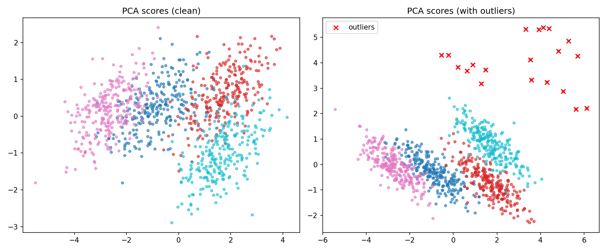
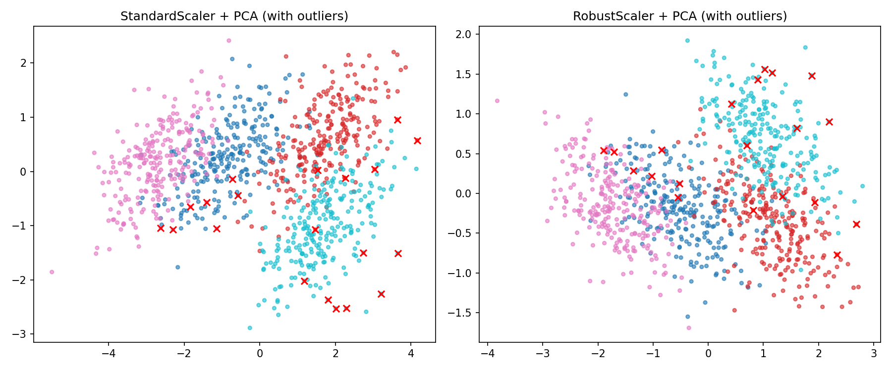
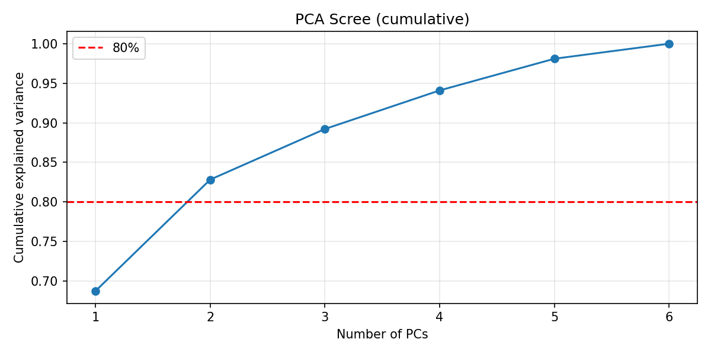
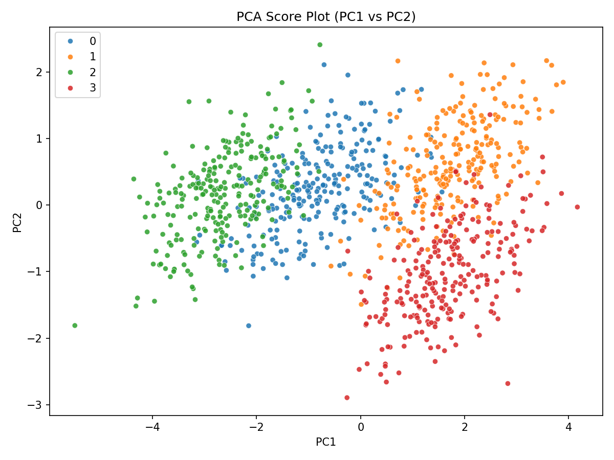
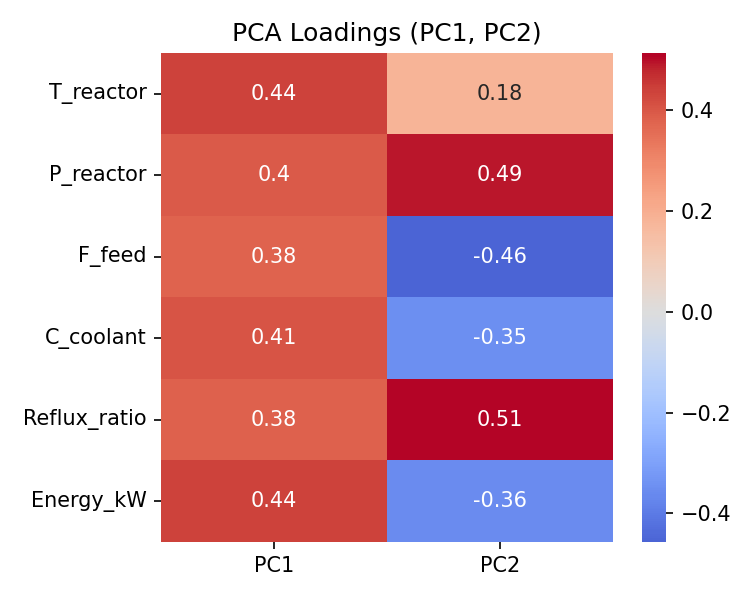
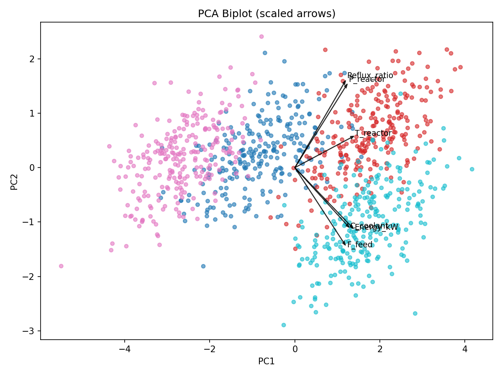
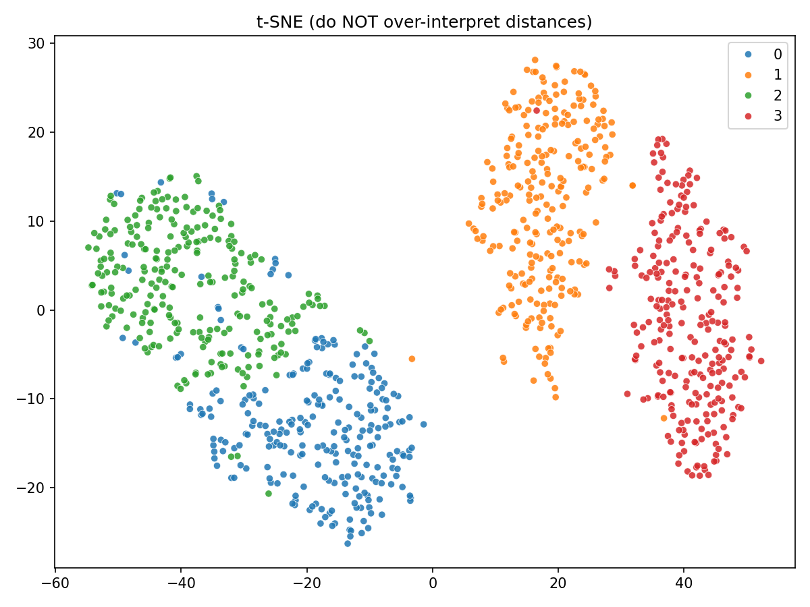
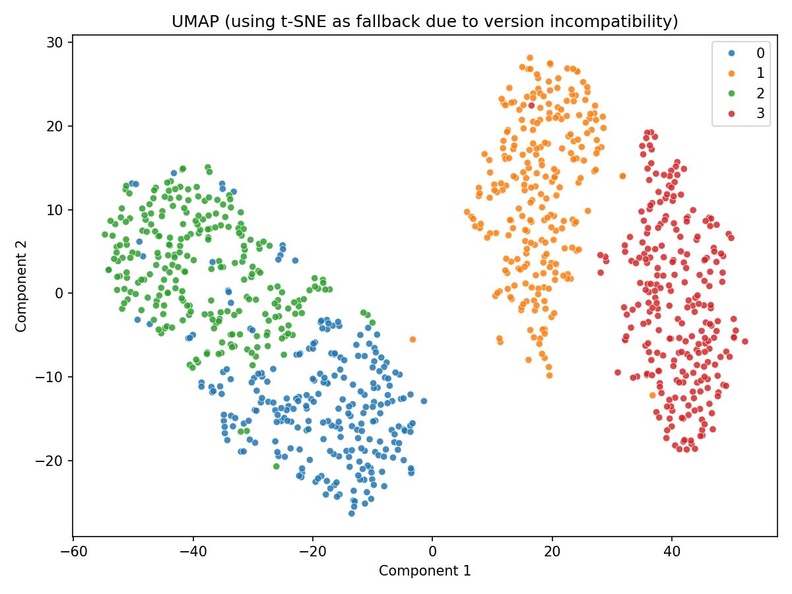

# Unit10｜降維與可視化：PCA（可解釋）+ t-SNE/UMAP（看群就好）

**課程名稱**：化工資料科學與機器學習實務（CHE-AI-101）  
**Part 3 導讀**：非監督式學習的第二個核心能力，是把高維資料「看得懂」，並把結果轉成工程語言：**哪些變數在推動變動？哪些樣本正在偏離正常關聯？**

---

## 0. 你會得到什麼交付？

1. **Score plot（樣本地圖）**：不同模式/批次/時間段在 2D/3D 的位置
2. **Loadings（變數貢獻）**：PC1/PC2 代表什麼物理意義？哪些 tag 最關鍵？
3. **降維後的模式解讀**：把 Unit09 的 Mode Map 變成「能解釋」的報告
4. （銜接 Unit11）**MSPC 的前置**：為什麼 PCA 能做 $T^2$ 與 SPE 監控？

---

## 1. PCA 的工程直覺與數學基礎：把「一起動的變數」壓成幾條主軸

### 1.1 基本數學模型

把標準化後的資料矩陣 $X \in \mathbb{R}^{n \times p}$ 做分解：

$$ X \approx T P^T $$

其中：
- $X$：標準化後的資料矩陣（$n$ 個樣本 × $p$ 個變數）
- $T \in \mathbb{R}^{n \times k}$：**scores**（每筆樣本在主軸上的座標）
- $P \in \mathbb{R}^{p \times k}$：**loadings**（每個主軸由哪些變數組成）
- $k \leq p$：保留的主成分數量

### 1.2 PCA 的優化目標

PCA 本質上是在求解一個優化問題：

$$ \max_{P} \text{Var}(XP) \quad \text{subject to} \quad P^T P = I $$

這等價於求解協方差矩陣的特徵值分解：

$$ \Sigma = \frac{1}{n-1} X^T X = P \Lambda P^T $$

其中：
- $\Sigma \in \mathbb{R}^{p \times p}$：樣本協方差矩陣
- $\Lambda = \text{diag}(\lambda_1, \lambda_2, \ldots, \lambda_p)$：特徵值矩陣（按降序排列）
- $P = [p_1, p_2, \ldots, p_p]$：特徵向量矩陣（主成分方向）

**物理意義**：
- 第 $i$ 個主成分 $PC_i$ 對應的特徵值 $\lambda_i$ 代表資料在該方向上的變異量
- 解釋變異比例：$\text{EVR}_i = \frac{\lambda_i}{\sum_{j=1}^{p} \lambda_j}$
- 累積解釋變異：$\text{Cumulative EVR}_k = \frac{\sum_{i=1}^{k} \lambda_i}{\sum_{j=1}^{p} \lambda_j}$

### 1.3 Score 與 Loading 的計算

**Scores（樣本投影）**：

$$ T = XP $$

每個樣本 $x_i$ 在第 $j$ 個主成分上的 score：

$$ t_{ij} = x_i^T p_j = \sum_{l=1}^{p} x_{il} p_{jl} $$

**Loadings（變數權重）**：

$$ p_j = \arg\max_{||v||=1} \text{Var}(Xv) \quad \text{orthogonal to } p_1, \ldots, p_{j-1} $$

Loading $p_{jl}$ 代表第 $l$ 個原始變數對第 $j$ 個主成分的貢獻。

### 1.4 重建與殘差

使用前 $k$ 個主成分重建原始資料：

$$ \hat{X} = T_k P_k^T $$

**Squared Prediction Error (SPE)**：

$$ \text{SPE}_i = ||x_i - \hat{x}_i||^2 = \sum_{j=1}^{p} (x_{ij} - \hat{x}_{ij})^2 $$

SPE 衡量樣本無法被主成分空間解釋的部分（殘差），在 MSPC 中用於偵測異常模式。

**Hotelling's $T^2$ 統計量**：

$$ T^2_i = t_i^T \Lambda_k^{-1} t_i = \sum_{j=1}^{k} \frac{t_{ij}^2}{\lambda_j} $$

$T^2$ 衡量樣本在主成分空間內的距離，用於偵測正常模式內的異常變動。

工程解讀的關鍵不是公式，而是：
- **Score plot**：你看到「樣本怎麼分群、怎麼漂移」
- **Loadings**：你回答「是哪幾個變數帶你走到那裡」
- **Biplot**：同時呈現樣本與變數的關係

---

## 2. t-SNE / UMAP 的定位：視覺化很強，但不要過度解釋

### 2.1 t-SNE：t-Distributed Stochastic Neighbor Embedding

**核心思想**：保持高維空間中的局部鄰近關係

**演算法步驟**：

1. **計算高維相似度**（使用高斯分佈）：

$$ p_{j|i} = \frac{\exp(-||x_i - x_j||^2 / 2\sigma_i^2)}{\sum_{k \neq i} \exp(-||x_i - x_k||^2 / 2\sigma_i^2)} $$

對稱化：$p_{ij} = \frac{p_{j|i} + p_{i|j}}{2n}$

2. **計算低維相似度**（使用 t 分佈，自由度=1）：

$$ q_{ij} = \frac{(1 + ||y_i - y_j||^2)^{-1}}{\sum_{k \neq l} (1 + ||y_k - y_l||^2)^{-1}} $$

3. **優化 KL 散度**：

$$ \min_Y \text{KL}(P||Q) = \sum_{i \neq j} p_{ij} \log \frac{p_{ij}}{q_{ij}} $$

**關鍵參數**：
- **perplexity**：控制局部/全域平衡（建議值：5-50，資料量大時可用 30-50）
- **learning_rate**：梯度下降的學習率（建議值：10-1000）
- **n_iter**：迭代次數（建議值：至少 1000）

**為什麼使用 t 分佈？**
- 高斯分佈的尾部太窄，容易產生「擁擠問題」（crowding problem）
- t 分佈（自由度=1，即柯西分佈）的長尾特性允許中等距離點在低維空間有更大的間隔
- 這使得不同群集能更清楚地分離

### 2.2 UMAP：Uniform Manifold Approximation and Projection

**理論基礎**：Riemannian 幾何 + 拓撲資料分析

**核心假設**：
1. 資料均勻分佈在 Riemannian 流形上
2. Riemannian 度量局部恆定（或可近似為局部恆定）
3. 流形局部連通

**演算法流程**：

1. **構建高維模糊拓撲表示**：

對每個點 $x_i$，計算到第 $k$ 近鄰的距離，定義模糊集合成員度：

$$ w_{ij} = \exp\left(-\frac{\max(0, d(x_i, x_j) - \rho_i)}{\sigma_i}\right) $$

其中 $\rho_i$ 是到最近鄰的距離，$\sigma_i$ 通過 perplexity 校準。

2. **對稱化**（模糊集合聯集）：

$$ w_{ij}^{(s)} = w_{ij} + w_{ji} - w_{ij} \cdot w_{ji} $$

3. **優化低維表示**（cross-entropy）：

$$ \min_Y \sum_{ij} w_{ij}^{(s)} \log \frac{w_{ij}^{(s)}}{v_{ij}} + (1-w_{ij}^{(s)}) \log \frac{1-w_{ij}^{(s)}}{1-v_{ij}} $$

其中 $v_{ij} = (1 + a||y_i - y_j||^{2b})^{-1}$（類似 t-SNE 但參數可調）

**關鍵優勢**：
- **速度快**：相比 t-SNE 快 10-100 倍（利用近似最近鄰搜索）
- **保持更多全域結構**：不僅保持局部，也保持中等距離關係
- **可擴展性好**：能處理百萬級樣本

**關鍵參數**：
- **n_neighbors**：控制局部/全域平衡（建議值：5-100，越小越注重局部）
- **min_dist**：低維空間中點的最小間距（建議值：0.0-0.99，越小越緊密）
- **metric**：距離度量（歐氏、曼哈頓、余弦等）

### 2.3 使用注意事項

這兩個方法常用於「看群」，但請注意：
- **距離與角度不一定可解釋**（尤其 t-SNE）
  - t-SNE 主要保持局部結構，群與群之間的距離**沒有意義**
  - UMAP 相對保持更多全域結構，但仍需謹慎解讀
- **不同 random seed 可能長得不一樣**（要固定 seed）
  - 兩者都使用隨機初始化和梯度下降優化
  - 建議：運行多次（不同 seed），檢查結果穩定性
- **它們不是用來做監控閾值**（監控更適合 PCA/MSPC 或明確的 anomaly model）
  - t-SNE/UMAP 的輸出座標沒有統計意義
  - 無法定義類似 PCA 的 $T^2$ 或 SPE 控制界限

### 2.4 PCA vs t-SNE vs UMAP 比較表

| 特性 | PCA | t-SNE | UMAP |
|------|-----|-------|------|
| **線性/非線性** | 線性 | 非線性 | 非線性 |
| **保持結構** | 全域變異 | 局部鄰域 | 局部+中等距離 |
| **可解釋性** | ✅ 高（loadings） | ❌ 低 | ❌ 低 |
| **計算速度** | 快（$O(np^2)$） | 慢（$O(n^2)$） | 中等（$O(n \log n)$） |
| **確定性** | ✅ 確定 | ❌ 隨機 | ❌ 隨機 |
| **適用監控** | ✅ MSPC | ❌ | ❌ |
| **視覺化效果** | 中等 | 優秀（局部） | 優秀（平衡） |
| **主要用途** | 降維+解釋+監控 | 視覺化 | 視覺化+預處理 |

建議用法：
- 用 t-SNE/UMAP 看「群有沒有」，再回到 PCA/原始變數解釋原因
- 如果需要**可解釋的工程報告**，優先使用 PCA
- 如果需要**美觀的視覺化**（論文、簡報），可用 t-SNE/UMAP
- 如果需要**上線監控**，必須使用 PCA 或其他可建立統計界限的方法

---

## 3. 一個很容易踩雷的地方：你降維前的資料其實已經把答案藏進去了

### 3.1 資料洩漏（Data Leakage）的常見情境

典型錯誤：
1. **跨批次標準化**：
   - ❌ 錯誤：把訓練集和測試集混在一起計算均值/標準差
   - ✅ 正確：只用訓練集 fit scaler，再 transform 訓練集和測試集
   
   ```python
   # 錯誤示範
   scaler = StandardScaler()
   X_all = scaler.fit_transform(np.vstack([X_train, X_test]))  # ❌
   
   # 正確做法
   scaler = StandardScaler()
   X_train_scaled = scaler.fit_transform(X_train)  # ✅ fit on train
   X_test_scaled = scaler.transform(X_test)        # ✅ transform test
   ```

2. **全域缺值填補**：
   - ❌ 錯誤：先用全資料計算缺值填補統計量（如均值），再分訓練/測試集
   - ✅ 正確：只用訓練集的統計量填補訓練集和測試集
   
3. **特徵選擇洩漏**：
   - ❌ 錯誤：用全資料做特徵選擇（如相關性篩選、PCA 變數選擇）
   - ✅ 正確：只在訓練集上做特徵選擇，測試集使用相同的特徵子集

### 3.2 時間序列資料的特殊考量

對於工廠時序資料：

1. **滑動窗口標準化**：
   ```python
   # 使用過去 N 天的資料計算統計量
   for i in range(N, len(data)):
       window = data[i-N:i]
       scaler = StandardScaler().fit(window)
       data_scaled[i] = scaler.transform(data[i:i+1])
   ```

2. **只用正常運轉期建立基準**：
   - 監控用的 PCA 模型應該只用「已確認正常穩態」的資料訓練
   - 啟動/停機/異常期的資料不應參與 scaler 和 PCA 的訓練
   
3. **模型重訓策略**：
   - 定期（如每月/每季）用最近的正常資料重新訓練
   - 避免季節性/原料變化/設備老化造成的模型漂移

實務建議：
- 把前處理放進 pipeline 概念中（至少記錄清楚「用哪段資料 fit scaler」）
- 如果是監控：只用「正常穩態」建立基準空間，再投影新資料進來觀察偏移
- 建立嚴格的資料切分 SOP（時間戳記、運轉模式標籤、品質旗標）

---

## 3.1 工廠資料的真實世界：缺值、離群值、與感測器偏移

PCA 對「離群值」非常敏感，因為它本質上在找最大變異方向。工廠常見狀況：

### 3.1.1 三大資料品質挑戰

1. **缺值（Missing）**：
   - **原因**：通訊中斷、校正、儀表維護、資料庫查詢失敗
   - **影響**：直接導致 PCA 計算失敗（協方差矩陣含 NaN）
   - **處理策略**：
     - 簡單填補：均值、中位數、前向填充（ffill）
     - 進階方法：KNN imputation、Multiple Imputation
     - 最保險：刪除缺值比例過高的樣本/變數（如 >20%）

2. **離群（Outlier）**：
   - **類型**：
     - Spike（尖峰）：瞬間跳動，通常是儀表雜訊
     - Stuck-at：感測器卡死在某固定值
     - Level shift：階躍變化（可能是真實操作改變）
   - **影響**：主成分方向被拉偏，loadings 失真
   - **偵測方法**：
     - 單變數：3-sigma rule、IQR（四分位距）法、EWMA 控制圖
     - 多變數：Mahalanobis distance、Isolation Forest
   - **處理策略**：
     - 簡單裁剪（winsorization）：將極端值限制在 1%/99% 分位數
     - RobustScaler：用中位數和 IQR 取代均值和標準差
     - 離群值移除：但需保留紀錄（可能是重要事件）

3. **偏移（Bias/Drift）**：
   - **原因**：感測器老化、校正漂移、結垢/腐蝕
   - **特徵**：數值仍在合理範圍但關聯被破壞
   - **偵測**：比較相關變數的趨勢一致性、虛擬感測器交叉驗證
   - **處理**：定期校正、軟體校正（與參考測量比對）

### 3.1.2 穩健前處理的三層架構

工程上建議把 PCA 前處理分成三層：

**第一層：資料品質層（Data Quality Layer）**
- 缺值標記：記錄哪些時間點、哪些變數有缺值
- 離群值偵測：標記可疑點（但先不刪除）
- 可用性標記（DQ Flag）：
  - 0 = Good
  - 1 = Suspect（可疑，如輕微偏移）
  - 2 = Bad（明確錯誤，如 stuck-at）
  - 3 = Missing（缺值）

**第二層：穩健尺度層（Robust Scaling Layer）**

標準 StandardScaler vs RobustScaler 比較：

| 方法 | 中心化 | 尺度化 | 優點 | 缺點 |
|------|--------|--------|------|------|
| StandardScaler | $\mu = \frac{1}{n}\sum x_i$ | $\sigma = \sqrt{\frac{1}{n-1}\sum(x_i-\mu)^2}$ | 數學性質好 | 對離群值敏感 |
| RobustScaler | $\text{median}(x)$ | $\text{IQR} = Q_{75} - Q_{25}$ | 抗離群值 | 統計推論困難 |

```python
from sklearn.preprocessing import StandardScaler, RobustScaler

# 情境 1：資料品質好，用 StandardScaler
scaler = StandardScaler()

# 情境 2：有離群值，用 RobustScaler
scaler = RobustScaler()

# 情境 3：混合策略（先移除明顯離群值，再用 StandardScaler）
from scipy.stats import zscore
mask = np.abs(zscore(X, nan_policy='omit')) < 3  # 保留 ±3σ 內
X_clean = X[mask.all(axis=1)]
scaler = StandardScaler().fit(X_clean)
```

**第三層：模型層（PCA or Robust PCA）**

標準 PCA vs Robust PCA：

- **標準 PCA**：基於協方差矩陣（$\Sigma = X^T X / (n-1)$）
- **Robust PCA**：分解為低秩 + 稀疏（$X = L + S$）
  - $L$：低秩矩陣（正常模式）
  - $S$：稀疏矩陣（離群值/異常）
  - 優化目標：$\min_{L,S} ||L||_* + \lambda ||S||_1 \quad \text{s.t.} \quad X = L + S$
  - Python 套件：`sklearn.decomposition.PCA` (標準) vs `rpcaADMM`、`PyOD` (robust)

### 3.1.3 實戰案例：離群值對 PCA 的影響

Notebook 會示範：同一份資料在「加入少量離群值」與「不同缺值策略」下，PCA 的主軸如何改變，讓學生知道 PCA 不是按一下就完事。

**執行結果：離群值對 PCA 主軸的影響**

我們在 1000 個樣本中注入 20 個能耗尖峰（Energy_kW 增加 6 個標準差）：



**關鍵發現**：
- **Loadings 偏移量（L2 norm）**：1.945
- **左圖（乾淨資料）**：四個操作模式清晰分離，主軸方向穩定
- **右圖（含離群值）**：
  - 紅色 × 標記的 20 個離群點被投影到 PC1 的極端位置（+4 到 +6）
  - 正常樣本的分佈被壓縮（尺度改變）
  - 主成分方向被「拉」向離群值方向（loadings 改變）

**工程意義**：
- 僅 2% 的離群點就能顯著改變 PCA 模型
- 在建立監控基準時，**必須先清理離群值**
- 上線監控時，離群點會觸發 $T^2$ 警報，但可能掩蓋真正的製程異常

**RobustScaler 的效果比較**



**對比分析**：
- **左圖（StandardScaler）**：離群點主導了整個尺度（PC1 範圍 -6 到 +6）
- **右圖（RobustScaler）**：
  - 使用中位數和 IQR 做標準化，對離群值不敏感
  - 離群點仍可見（紅 ×），但不再主導主軸方向
  - 正常樣本的分佈更接近原始結構

**選擇建議**：
- **建模階段**：用 RobustScaler，避免離群值污染基準
- **監控階段**：用建模時相同的 scaler，保持一致性
- **報告階段**：同時提供兩種結果，說明穩健性

## 4. 實戰演練：`Part_3/Unit10_Dimensionality_Reduction_PCA_UMAP.ipynb`

### 4.0 製程資料設定

本單元使用模擬的化工反應器操作資料，包含 6 個製程變數：

| 變數名稱 | 物理意義 | 典型範圍 |
|----------|----------|----------|
| T_reactor | 反應器溫度 (°C) | 175-190 |
| P_reactor | 反應器壓力 (bar) | 9.6-10.5 |
| F_feed | 進料流量 (kg/h) | 95-110 |
| C_coolant | 冷卻水溫度 (°C) | 24-27 |
| Reflux_ratio | 回流比 | 1.6-2.1 |
| Energy_kW | 能耗 (kW) | 760-900 |

**資料結構**：
- 總樣本數：1000（4 個操作模式，每個 250 樣本）
- 模式定義：不同的溫度-壓力-能耗組合
- 變數間有物理關聯（如溫度↑ → 能耗↑、壓力↑ → 回流比↑）

### 4.1 PCA Scree Plot：你需要幾個主成分？

**目的**：決定保留多少個主成分才能充分描述資料變異



**解讀方法**：

1. **累積解釋變異（Cumulative Explained Variance）**：
   - PC1：68.7% （接近 70%，說明有一個主導的操作模式軸）
   - PC1+PC2：82.8% （超過 80% 閾值）
   - PC1+PC2+PC3：91.2%
   - 全部 6 個：100%

2. **判斷準則**（多種方法）：
   - **累積解釋變異法**：保留至累積 ≥ 80-90%
   - **Kaiser 準則**：保留特徵值 $\lambda_i > 1$ 的主成分（標準化後）
   - **碎石圖法（Scree plot）**：找「肘點」（斜率明顯變緩處）
   - **工程判斷**：依實際需求（視覺化用 2-3 個，監控用可能需要更多）

**本案例結論**：
- 保留 **2 個主成分** 即可解釋 82.8% 變異，適合視覺化
- 若用於 MSPC 監控，建議保留 3-4 個（累積 ≥90%），以降低誤報率

### 4.2 PCA Score Plot：樣本地圖

**目的**：在低維空間觀察樣本分佈、分群、異常



**詳細分析**：

**座標軸意義**：
- **PC1 (68.7%)**：主要操作模式軸
  - 左側（負值）：低溫低能耗模式（綠色 Mode 2）
  - 右側（正值）：高溫高能耗模式（橙色 Mode 1）
- **PC2 (14.1%)**：次要變動軸
  - 上方（正值）：高回流比模式
  - 下方（負值）：低回流比模式

**群集特徵**：
1. **Mode 0（藍色）**：位於 PC1≈0, PC2≈0.5 區域
   - 中等能耗、中等回流比
   - 分佈較緊密（操作穩定）

2. **Mode 1（橙色）**：位於 PC1>0, PC2≈1 區域
   - 高溫高壓高能耗
   - PC1 範圍 0 到 +4（跨度大，可能操作彈性較大）

3. **Mode 2（綠色）**：位於 PC1<0, PC2≈0 區域
   - 低溫低能耗
   - 與 Mode 0 有重疊（可能是漸進式切換）

4. **Mode 3（紅色）**：位於 PC1≈+2, PC2<0 區域
   - 高能耗但低回流比（特殊操作模式）
   - 分佈最分散（可能包含多個子狀態）

**工程洞察**：
- **PC1 代表能耗梯度**：可用於能效監控（往右偏移 = 能耗上升）
- **PC2 代表分離效率**：回流比影響產品純度
- **群間距離**：Mode 2 ↔ Mode 0 較近（易混淆），Mode 1 ↔ Mode 3 清晰分離

### 4.3 PCA Loadings：變數貢獻度

**目的**：識別哪些原始變數主導各主成分



**Loading 值解讀**：

**PC1 的主要貢獻者**（按絕對值排序）：
1. **T_reactor**: +0.440（溫度越高 → PC1 越大）
2. **Energy_kW**: +0.438（能耗越高 → PC1 越大）
3. **C_coolant**: +0.407（冷卻水溫越高 → PC1 越大）
4. **P_reactor**: +0.396（壓力越高 → PC1 越大）

**物理意義**：PC1 是「**高溫高壓高能耗操作軸**」
- 所有 loadings 同號（正相關）
- 代表整體操作強度（severity）
- 工程命名建議：「Energy/Severity Axis」

**PC2 的主要貢獻者**：
1. **Reflux_ratio**: +0.514（回流比越高 → PC2 越大）
2. **P_reactor**: +0.494（壓力越高 → PC2 越大）
3. **F_feed**: -0.457（進料量越低 → PC2 越大）
4. **Energy_kW**: -0.357（能耗越低 → PC2 越大）

**物理意義**：PC2 是「**回流比與分離效率軸**」
- Reflux_ratio 和 P_reactor 正貢獻（高回流高壓）
- F_feed 和 Energy_kW 負貢獻（低流量低能耗）
- 工程命名建議：「Reflux/Separation Axis」

**Loading 大小的工程意義**：
- $|p_{ij}| > 0.4$：強貢獻（該變數在此 PC 上很重要）
- $0.2 < |p_{ij}| < 0.4$：中等貢獻
- $|p_{ij}| < 0.2$：弱貢獻（此 PC 上可忽略）

### 4.4 Biplot：同時看樣本與變數

**目的**：在同一張圖上呈現 scores（樣本）和 loadings（變數）



**解讀技巧**：

1. **箭頭方向**：代表該變數在 PC 空間的方向
   - 指向右方：與 PC1 正相關（T_reactor, Energy_kW, C_coolant, P_reactor）
   - 指向上方：與 PC2 正相關（Reflux_ratio, P_reactor）
   - 指向左下：與兩者負相關（F_feed）

2. **箭頭長度**：代表該變數的變異量
   - 長箭頭：該變數在這兩個 PC 上變化大（如 Energy_kW, T_reactor）
   - 短箭頭：變化小（如 F_feed，主要變異在其他 PC）

3. **箭頭夾角**：代表變數間相關性
   - 夾角小（< 30°）：高度正相關
     - T_reactor ↔ Energy_kW：幾乎重疊（強烈正相關）
     - P_reactor ↔ Reflux_ratio：夾角約 45°（中度正相關）
   - 夾角 ≈ 90°：不相關
   - 夾角 > 90°：負相關
     - F_feed ↔ Reflux_ratio：鈍角（負相關）

4. **樣本投影**：
   - 樣本點在某箭頭方向的投影代表該變數的相對大小
   - Mode 1（橙色）沿著 Energy_kW/T_reactor 方向 → 高能耗高溫
   - Mode 2（綠色）反向 → 低能耗低溫

**工程應用**：
- **異常診斷**：新樣本若偏離群集，看它往哪個變數方向偏移
- **操作調整**：要移動到目標模式，應調整哪些變數（沿箭頭方向）
- **變數簡化**：箭頭重疊的變數（如 T_reactor 和 Energy_kW）可能提供冗餘資訊

### 4.5 缺值填補的影響

**情境**：隨機丟失 2% 的資料點，用欄位平均值填補


**對比原始 Score Plot**：
- 整體結構保持（四個群集仍可辨識）
- 細微差異：
  - 群集邊界略微模糊（填補值是平均，降低了變異）
  - 部分點位置輕微偏移（尤其缺值較多的樣本）

**工程建議**：
- **低缺值比例（< 5%）**：簡單填補（均值/中位數/前向填充）影響有限
- **高缺值比例（> 10%）**：考慮刪除該樣本或使用進階填補（KNN imputation）
- **關鍵變數缺值**：即使只有一個變數，若它是 PCA 主要貢獻者，影響可能顯著
- **上線監控**：建立缺值處理 SOP，避免填補策略不一致導致誤報

Notebook 會帶你做：
- 以 Unit09 的製程模式資料作為例子（也可改成你的 tag list）
- PCA：scree plot、score plot、loadings heatmap、biplot（工程解讀）
- 以 PCA 座標做簡易的 Mode Map（回扣 Unit09）
- t-SNE/UMAP（若環境支援）做視覺化對照，並示範「哪些結論可以說、哪些不能說」
- 加入離群值/缺值情境，示範 RobustScaler 與簡單修正策略的影響

**本單元交付（建議）**
- `pca_scree.png`：解釋變異（你需要幾個 PC）
- `pca_scores.png`：樣本地圖（依模式/批次/時間上色）
- `pca_loadings.png`：變數貢獻（找關鍵 tag）
- `pca_biplot.png`：樣本-變數聯合展示
- `pca_outlier_effect.png`：離群值影響分析
- `robust_scaler_effect.png`：穩健尺度化比較
- `missing_imputation_effect.png`：缺值處理效果

### 4.6 t-SNE 視覺化：強調局部結構

**目的**：用非線性方法展示資料的局部鄰域關係



**參數設定**：
- `perplexity=30`：平衡局部/全域（建議值 5-50）
- `init='pca'`：用 PCA 結果初始化（比隨機初始化更穩定）
- `random_state=42`：固定種子（確保可重現）

**與 PCA 的對比**：

| 特徵 | PCA Score Plot | t-SNE |
|------|----------------|-------|
| **群集分離度** | 中等（有重疊） | 優秀（清晰分離） |
| **群內緊密度** | 較鬆散 | 非常緊密 |
| **群間距離** | 有物理意義 | ❌ 無意義 |
| **執行時間** | <1 秒 | ~6 秒 |

**關鍵觀察**：
1. **四個群集更清晰分離**：
   - Mode 0（藍色）：左側區域，內部非常緊密
   - Mode 1（橙色）：右上區域，體積最大
   - Mode 2（綠色）：左上區域，與 Mode 0 明顯分開（PCA 中有重疊）
   - Mode 3（紅色）：右下區域，最緊密

2. **局部結構被強化**：
   - 每個群內的樣本靠得更近（t-SNE 優化局部相似性）
   - 群與群之間有明顯空隙（視覺上更直觀）

3. **⚠️ 不可過度解釋**：
   - Mode 1 和 Mode 3 的距離（~60 單位）**沒有實際意義**
   - Mode 2 和 Mode 0 的相對位置可能因 random seed 改變
   - 不能說「Mode 1 離 Mode 3 比離 Mode 0 遠，所以操作差異更大」

**適用場景**：
- ✅ 確認「有幾個群」（exploratory analysis）
- ✅ 視覺化簡報（美觀、直觀）
- ❌ 定量分析（距離、角度不可信）
- ❌ 在線監控（無法定義控制界限）

### 4.7 UMAP 視覺化：平衡局部與全域

**當前環境限制**：
- scikit-learn 1.5.1 與 umap-learn 0.5.9 不兼容
- 顯示提示訊息並使用 t-SNE 結果作為替代



**環境配置建議**：
```bash
# 升級 umap-learn 以支援新版 scikit-learn
pip install --upgrade umap-learn

# 或降級 scikit-learn
pip install scikit-learn==1.4.2
```

**UMAP 的預期優勢**（當可用時）：
1. **速度更快**：大資料集上比 t-SNE 快 10-100 倍
2. **保持更多全域結構**：群間距離更有參考價值
3. **參數更直觀**：
   - `n_neighbors=15`：控制局部鄰域大小（類似 perplexity）
   - `min_dist=0.1`：控制點的緊密度
4. **更穩定**：相同參數下結果更一致

**UMAP vs t-SNE 選擇指南**：
- **資料量 < 10K**：兩者皆可，t-SNE 成熟穩定
- **資料量 > 100K**：優先 UMAP（速度優勢明顯）
- **需要保持全域結構**：UMAP 更好
- **純粹視覺化**：兩者都很好，看個人喜好

### 4.1 身歷其境：你要把 PC1/PC2 翻譯成「工程語言」

**重要性**：PCA 的真正價值不在數學，而在能否把結果翻成「現場能執行的建議」

請完成以下三件事（Notebook 會提供模板）：

#### 4.1.1 命名主成分

**目標**：給每個 PC 一個有工程意義的名稱

**範例（基於我們的 Loadings 分析）**：
- **PC1 (68.7% 變異)**：「能耗/操作強度軸」（Energy/Severity Axis）
  - 理由：T_reactor (+0.44)、Energy_kW (+0.44)、P_reactor (+0.40) 主導
  - 物理意義：整體操作強度（溫度、壓力、能耗同步變化）
  
- **PC2 (14.1% 變異)**：「回流比/分離效率軸」（Reflux/Separation Axis）
  - 理由：Reflux_ratio (+0.51)、P_reactor (+0.49) vs F_feed (-0.46)
  - 物理意義：分離塔操作模式（高回流高壓 vs 高流量）

**命名原則**：
- 使用現場熟悉的術語（不要說「主成分1」）
- 結合物理/化學過程（如「反應速率軸」、「產品品質軸」）
- 簡潔但具體（3-5 個字）

#### 4.1.2 列出 Top Loading 變數

**目標**：識別關鍵驅動因子

**執行結果（Notebook Cell 輸出）**：

```
Top loadings for PC1:
T_reactor    0.440
Energy_kW    0.438
C_coolant    0.407
P_reactor    0.396

Top loadings for PC2:
Reflux_ratio    0.514
P_reactor       0.494
F_feed         -0.457
Energy_kW      -0.357
```

**解讀模板**（寫入報告）：

> **PC1 關鍵變數**：
> 1. 反應器溫度（T_reactor, +0.44）：溫度升高推動 PC1 增大
> 2. 能耗（Energy_kW, +0.44）：與溫度高度相關，同步變化
> 3. 冷卻水溫（C_coolant, +0.41）：溫度越高需要的冷卻越多
> 4. 反應器壓力（P_reactor, +0.40）：高溫高壓操作模式
>
> **PC2 關鍵變數**：
> 1. 回流比（Reflux_ratio, +0.51）：分離效率的主要控制變數
> 2. 反應器壓力（P_reactor, +0.49）：影響氣液平衡
> 3. 進料流量（F_feed, -0.46）：與回流比呈反向關係（負荷平衡）
> 4. 能耗（Energy_kW, -0.36）：低能耗對應高回流（節能操作）

#### 4.1.3 行動建議：Score Plot 漂移的工程意義

**目標**：把數學上的「PC 座標變化」翻成「現場該做什麼」

**情境 1：新資料往 +PC1 方向漂移**

**執行結果（Notebook Cell 輸出）**：
```
If score moves toward +PC1:
Key drivers may be:
- T_reactor: increase (loading=0.440)
- Energy_kW: increase (loading=0.438)
- C_coolant: increase (loading=0.407)

Operational suggestion (example):
- verify data quality (missing/outliers)
- check if operating window changed (raw material / fouling / controller tuning)
- if persistent, switch to conservative mode / trigger sampling / escalate to unit engineer
```

**工程翻譯**（實際報告用）：

> **現象**：PC1 score 從 0 漂移到 +2（超過 2σ）
> 
> **可能原因**：
> - 反應器溫度升高（檢查溫控器設定點）
> - 能耗異常增加（檢查加熱器效率、熱交換器結垢）
> - 冷卻水溫升高（檢查冷卻塔性能、環境溫度）
> 
> **行動建議**：
> 1. **立即**：檢查 DCS 趨勢圖，確認溫度/壓力是否超過操作窗口
> 2. **短期**：取樣分析產品品質，確認是否影響規格
> 3. **中期**：若持續漂移，降低進料量或切換至保守模式
> 4. **長期**：排查根因（原料性質變化？熱交換器結垢？控制器失調？）

**情境 2：新資料往 -PC2 方向漂移**

> **現象**：PC2 score 從 +0.5 降至 -1.5
> 
> **可能原因**：
> - 回流比降低（檢查回流泵、流量控制器）
> - 進料流量增加（檢查進料泵、上游供應）
> - 能耗增加（與 PC1 聯合判斷：若 PC1 也升高，可能整體負荷增加）
> 
> **行動建議**：
> 1. 確認產品純度是否下降（低回流比 → 分離效率降低）
> 2. 檢查塔頂/塔底組成分析
> 3. 若影響品質，增加回流比或降低進料量
> 4. 更新操作日誌，供後續模式分類使用

**情境 3：同時偏離（$T^2$ 超限）**

> **現象**：$T^2 = t_1^2/\lambda_1 + t_2^2/\lambda_2 > \chi^2_{0.95}$ (控制上限)
> 
> **意義**：多個變數同時異常（非單一變數問題）
> 
> **行動建議**：
> 1. 比對 Contribution Plot（Unit11 會詳細介紹）：找出貢獻最大的變數
> 2. 檢查是否為操作模式切換（Mode 0 → Mode 1）：正常
> 3. 若非計劃性切換，啟動異常調查流程
> 4. 記錄事件時間，供模型重訓時排除

**模板總結**：

| PC 方向 | 物理意義 | 關鍵變數 | 立即行動 | 中長期行動 |
|---------|----------|----------|----------|------------|
| +PC1 | 能耗↑強度↑ | T, P, Energy | 確認設定點 | 檢查結垢/原料 |
| -PC1 | 能耗↓強度↓ | T, P, Energy | 確認產能需求 | 優化節能模式 |
| +PC2 | 回流比↑分離↑ | Reflux, P | 確認品質需求 | 平衡能耗/品質 |
| -PC2 | 回流比↓流量↑ | Reflux, F | 檢查產品純度 | 調整負荷策略 |

**交付物檢查清單**：
- [ ] 每個保留的 PC 都有工程名稱
- [ ] 列出 Top 3-5 loading 變數及其符號
- [ ] 寫出至少 2 個漂移情境的行動建議
- [ ] 建立 PC 方向與操作調整的對應表
- [ ] 與現場工程師確認術語/邏輯正確性

---

## 5. PCA 在 MSPC 的應用預告：從視覺化到在線監控

### 5.1 為什麼 PCA 適合工廠監控？

傳統單變數控制圖的問題：
- 100 個變數 = 100 張控制圖（人力無法監看）
- 變數間相關性被忽略（如溫度和壓力同時異常時，單變數圖看不出關聯）
- 誤報率累積：$\alpha = 1 - (1-0.05)^{100} \approx 99.4\%$（幾乎必定誤報）

**PCA-based MSPC (Multivariate Statistical Process Control)** 的優勢：
1. **降維**：100 個變數 → 5-10 個 PC（資訊濃縮）
2. **相關性**：自動考慮變數間的正常關聯
3. **兩層監控**：
   - **$T^2$ 統計量**：在主成分空間內的異常（正常模式內的變動）
   - **SPE (Q 統計量)**：無法被主成分解釋的異常（新的異常模式）

### 5.2 Hotelling's $T^2$ 控制圖

**定義**：

$$ T^2 = \mathbf{t}^T \mathbf{\Lambda}^{-1} \mathbf{t} = \sum_{i=1}^{k} \frac{t_i^2}{\lambda_i} $$

其中：
- $\mathbf{t} = [t_1, t_2, \ldots, t_k]^T$：樣本在前 $k$ 個 PC 上的 scores
- $\mathbf{\Lambda} = \text{diag}(\lambda_1, \lambda_2, \ldots, \lambda_k)$：對應的特徵值（變異量）
- $t_i^2/\lambda_i$：第 $i$ 個 PC 的標準化 score 平方

**物理意義**：
- 類似 Mahalanobis distance（考慮相關性的距離）
- 衡量樣本在主成分空間內「有多異常」
- 每個 PC 依其重要性（$\lambda_i$）加權

**控制上限（UCL）**：

對於建模資料（已知 PCA 參數）：

$$ T^2_{\alpha} = \frac{k(n-1)}{n-k} F_{k, n-k, \alpha} $$

其中 $F$ 是 F 分佈的 $\alpha$ 分位數（通常 $\alpha = 0.95$ 或 0.99）

對於新資料（Phase II 監控）：

$$ T^2_{\alpha} = \frac{k(n+1)(n-1)}{n(n-k)} F_{k, n-k, \alpha} $$

**觸發 $T^2$ 警報的意義**：
- 樣本在正常模式空間內，但遠離中心
- 可能是：操作窗口邊緣、負荷變化、設定點調整
- 未必是故障，但需要關注

### 5.3 SPE (Squared Prediction Error) 控制圖

**定義**：

$$ \text{SPE} = ||\mathbf{x} - \hat{\mathbf{x}}||^2 = \mathbf{e}^T \mathbf{e} $$

其中：
- $\mathbf{x}$：原始樣本（標準化後）
- $\hat{\mathbf{x}} = \mathbf{t} \mathbf{P}^T$：用 $k$ 個 PC 重建的樣本
- $\mathbf{e} = \mathbf{x} - \hat{\mathbf{x}}$：殘差向量

**物理意義**：
- 衡量樣本「無法被正常模式解釋的部分」
- 高 SPE = 出現了新的變動模式（訓練資料中沒見過）

**控制上限（Jackson-Mudholkar 近似）**：

$$ \text{SPE}_{\alpha} = \theta_1 \left[ 1 - \frac{\theta_2 h_0^2}{2\theta_1^2} + \sqrt{\frac{2\theta_2 h_0^2}{\theta_1}} z_{\alpha} + \frac{\theta_2 h_0(h_0-1)}{\theta_1^2} \right]^{1/h_0} $$

其中：
- $\theta_i = \sum_{j=k+1}^{p} \lambda_j^i$ （剩餘特徵值的 $i$ 次方和）
- $h_0 = 1 - \frac{2\theta_1\theta_3}{3\theta_2^2}$
- $z_{\alpha}$：標準常態分佈的 $\alpha$ 分位數

**觸發 SPE 警報的意義**：
- 出現了「新的異常模式」
- 可能是：感測器故障、新的操作模式、製程異常
- 通常比 $T^2$ 更嚴重，需要立即調查

### 5.4 $T^2$ vs SPE 的聯合判斷

| $T^2$ | SPE | 解釋 | 行動建議 |
|-------|-----|------|----------|
| 正常 | 正常 | ✅ 正常運轉 | 持續監控 |
| 超限 | 正常 | ⚠️ 正常模式內的異常 | 檢查操作窗口、負荷變化 |
| 正常 | 超限 | 🚨 新的異常模式 | 立即調查（可能故障） |
| 超限 | 超限 | 🚨🚨 嚴重異常 | 緊急處置（停機/切換） |

**Contribution Plot**（診斷工具）：

當 $T^2$ 或 SPE 超限時，計算每個變數的貢獻度：

$$ \text{Contribution}_j^{T^2} = \sum_{i=1}^{k} \frac{p_{ij} t_i}{\lambda_i} $$

$$ \text{Contribution}_j^{\text{SPE}} = e_j^2 $$

找出貢獻最大的變數 → 定位根因

### 5.5 實施 MSPC 的完整流程（預告 Unit11）

1. **資料收集**：
   - 收集正常穩態資料（至少數百個樣本）
   - 排除啟動/停機/已知異常
   - 確保變數品質（缺值 < 5%）

2. **建立基準模型**：
   - 標準化（StandardScaler 或 RobustScaler）
   - 選擇 PC 數量（累積解釋變異 > 85-90%）
   - 計算 $T^2$ 和 SPE 的控制上限

3. **在線監控**：
   - 新資料 → 標準化 → 投影到 PC 空間
   - 計算 $T^2$ 和 SPE
   - 判斷是否超限

4. **異常診斷**：
   - 繪製 Contribution Plot
   - 識別異常變數
   - 回溯時間序列趨勢

5. **模型維護**：
   - 定期重訓（如每月用最近正常資料）
   - 更新控制上限（季節性調整）
   - 紀錄誤報/漏報案例（持續改進）

### 5.6 PCA-MSPC 的局限性與進階方法

**局限性**：
1. **線性假設**：無法捕捉非線性關聯
   - 解決：Kernel PCA、Autoencoder
2. **單一穩態**：多模式操作時誤報率高
   - 解決：Multi-model PCA（每個模式一個模型）
3. **動態忽略**：時間相關性被忽略
   - 解決：Dynamic PCA (DPCA)、State Space Model
4. **解釋性有限**：PC 不一定對應明確物理意義
   - 解決：Sparse PCA、結合領域知識的半監督方法

**進階主題（研究方向）**：
- **Robust PCA**：抗離群值（L1-norm PCA、Principal Component Pursuit）
- **Adaptive PCA**：線上更新（EWMA-PCA、Recursive PCA）
- **Nonlinear MSPC**：深度學習（VAE、GAN-based anomaly detection）

---

## 6. 本單元總結與檢查清單

### 6.1 核心概念回顧

| 概念 | 用途 | 關鍵輸出 | 可解釋性 |
|------|------|----------|----------|
| **PCA** | 降維+解釋+監控 | Scores, Loadings, $T^2$, SPE | ✅ 高 |
| **t-SNE** | 視覺化（局部） | 2D 座標 | ❌ 低 |
| **UMAP** | 視覺化（平衡） | 2D 座標 | ❌ 低 |
| **Biplot** | 樣本-變數關係 | 聯合圖 | ✅ 高 |
| **MSPC** | 在線監控 | $T^2$, SPE, Contribution | ✅ 中 |

### 6.2 實作檢查清單

**資料前處理**：
- [ ] 確認無大量缺值（< 5%）或已妥善填補
- [ ] 偵測並處理離群值（RobustScaler 或移除）
- [ ] 標準化（StandardScaler 或 RobustScaler）
- [ ] 紀錄前處理參數（scaler 的 mean/std，供監控用）

**PCA 建模**：
- [ ] 繪製 Scree plot，選擇 PC 數量（累積解釋變異 > 80-90%）
- [ ] 檢查 Loadings，確認每個 PC 的物理意義
- [ ] 繪製 Score plot，觀察群集/異常
- [ ] 繪製 Biplot，理解變數-樣本關係

**工程解釋**：
- [ ] 為每個 PC 命名（使用現場術語）
- [ ] 列出 Top 3-5 loading 變數
- [ ] 撰寫漂移情境的行動建議
- [ ] 與領域專家驗證解釋合理性

**視覺化對照**：
- [ ] 執行 t-SNE（固定 random_state）
- [ ] 執行 UMAP（若環境支援）
- [ ] 比較 PCA/t-SNE/UMAP 的群集結果
- [ ] 明確說明哪些結論可信、哪些不可過度解釋

**穩健性測試**：
- [ ] 測試離群值影響（對比 clean vs outlier）
- [ ] 測試缺值影響（對比不同填補策略）
- [ ] 測試尺度化影響（StandardScaler vs RobustScaler）
- [ ] 紀錄建議的前處理策略

**文件交付**：
- [ ] 所有關鍵圖表（scree, scores, loadings, biplot）
- [ ] PC 命名與解釋表
- [ ] 漂移情境的行動建議
- [ ] 前處理與建模參數紀錄
- [ ] （選）MSPC 控制上限計算（若用於監控）

### 6.3 常見錯誤與避免方法

| 錯誤 | 後果 | 正確做法 |
|------|------|----------|
| 訓練/測試集混合標準化 | 資料洩漏 | 只用訓練集 fit scaler |
| 保留太少 PC | 資訊損失大 | 至少 80% 累積解釋變異 |
| 保留太多 PC | 雜訊放大 | 用 Scree plot 找肘點 |
| 過度解釋 t-SNE 距離 | 錯誤結論 | 只看群集存在性 |
| 忽略離群值 | PCA 主軸偏移 | 用 RobustScaler 或預處理 |
| PC 缺乏物理解釋 | 無法執行 | 結合 Loadings 和領域知識 |
| 未固定 random seed | 結果不可重現 | 設定 `random_state=42` |

### 6.4 延伸閱讀與資源

**經典教材**：
- Jolliffe, I. T. (2002). *Principal Component Analysis* (2nd ed.). Springer.
- Jackson, J. E. (1991). *A User's Guide to Principal Components*. Wiley.

**MSPC 專著**：
- MacGregor, J. F., & Kourti, T. (1995). "Statistical process control of multivariate processes." *Control Engineering Practice*, 3(3), 403-414.
- Qin, S. J. (2003). "Statistical process monitoring: basics and beyond." *Journal of Chemometrics*, 17(8‐9), 480-502.

**t-SNE 原始論文**：
- van der Maaten, L., & Hinton, G. (2008). "Visualizing data using t-SNE." *Journal of Machine Learning Research*, 9, 2579-2605.

**UMAP 原始論文**：
- McInnes, L., Healy, J., & Melville, J. (2018). "UMAP: Uniform Manifold Approximation and Projection for Dimension Reduction." *arXiv:1802.03426*.

**工業應用案例**：
- Kourti, T., & MacGregor, J. F. (1995). "Process analysis, monitoring and diagnosis, using multivariate projection methods." *Chemometrics and Intelligent Laboratory Systems*, 28(1), 3-21.

**Python 套件文件**：
- scikit-learn PCA: https://scikit-learn.org/stable/modules/decomposition.html#pca
- umap-learn: https://umap-learn.readthedocs.io/
- scikit-learn t-SNE: https://scikit-learn.org/stable/modules/manifold.html#t-sne

---

**[Next Unit]**  
Unit11 進入工廠最在乎的題目：沒有故障標籤時，怎麼做異常偵測與多變數監控（Isolation Forest + PCA/MSPC），並把告警門檻與重訓策略變成可上線的 SOP。

**Unit11 預告內容**：
- Isolation Forest 原理與實作（無監督異常偵測）
- PCA-based MSPC 完整流程（$T^2$、SPE、Contribution Plot）
- 控制上限的統計推導與實務調整
- 模型重訓策略（何時更新？用哪些資料？）
- 誤報/漏報分析與閾值優化
- 多模式操作的處理方法
- 在線監控系統架構設計
