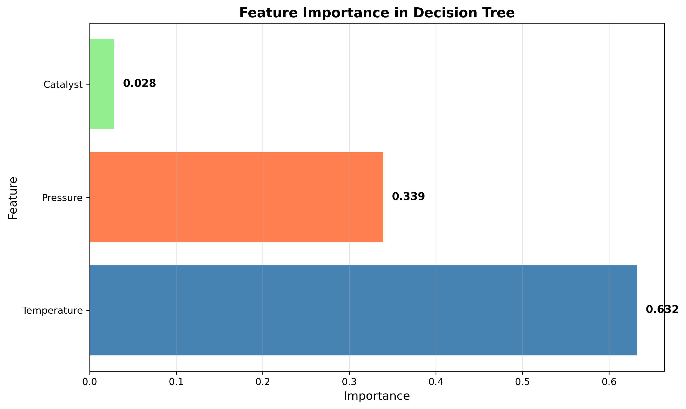
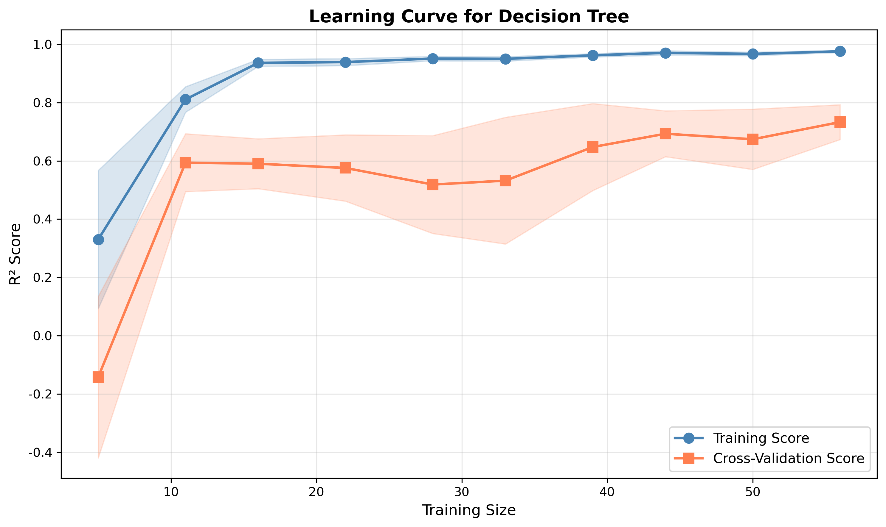

# Unit 11: 決策樹回歸 (Decision Tree Regression)

**課程名稱**：AI 在化工上之應用  
**課程代碼**：CHE-AI-114  
**授課教師**：莊曜禎 助理教授  
**單元主題**：決策樹回歸模型  
**適用對象**：化學工程學系學生  

---

## 學習目標

完成本單元後，學生將能夠：

1. 理解決策樹回歸的基本原理與樹狀結構
2. 掌握節點分裂準則（MSE、MAE）與特徵選擇機制
3. 使用 `sklearn.tree.DecisionTreeRegressor` 建立模型
4. 理解決策樹的超參數（深度、樣本數、特徵數）
5. 診斷與防止決策樹過擬合（剪枝策略）
6. 應用決策樹於化工製程預測問題
7. 視覺化決策樹結構與決策邊界

---

## 1. 決策樹回歸簡介

### 1.1 什麼是決策樹回歸？

**決策樹回歸 (Decision Tree Regression)** 是一種基於樹狀結構的非參數監督式學習方法，通過一系列的**二元決策規則**將特徵空間遞迴地分割成多個區域，每個區域內的樣本預測值為該區域內所有樣本的**平均值**（或中位數）。

**核心概念**：
- 樹狀結構由**節點 (Nodes)** 和**分支 (Branches)** 組成
- **根節點 (Root Node)**：整個資料集
- **內部節點 (Internal Nodes)**：決策點，基於某個特徵進行分裂
- **葉節點 (Leaf Nodes)**：最終預測值

**決策過程**：
```
輸入特徵 x → 根節點 → 判斷條件 → 左子樹/右子樹 → ... → 葉節點 → 預測值 ŷ
```

### 1.2 決策樹與線性模型的差異

| 特性 | 線性/多項式回歸 | 決策樹回歸 |
|------|----------------|-----------|
| **模型形式** | 參數化，固定函數形式 | 非參數化，自適應結構 |
| **決策邊界** | 線性或平滑曲線 | 分段常數（階梯狀） |
| **特徵關係** | 加性關係 | 自動捕捉交互作用 |
| **可解釋性** | 係數解釋 | 規則序列解釋 |
| **外推能力** | 可外推 | 無法外推（限於訓練範圍） |
| **對異常值敏感度** | 高（基於平方誤差） | 較低（分裂規則魯棒） |

### 1.3 決策樹的優勢

1. **非參數性質**：無需假設資料分佈形式
2. **自動特徵選擇**：演算法自動選擇重要特徵
3. **處理非線性**：捕捉複雜的非線性關係
4. **交互作用**：自動考慮特徵間的交互效應
5. **可解釋性**：決策路徑直觀易懂
6. **混合資料**：可同時處理數值和類別特徵
7. **無需標準化**：對特徵尺度不敏感

### 1.4 化工領域應用案例

| 應用領域 | 預測目標 | 輸入特徵 |
|---------|---------|---------|
| **反應工程** | 轉化率、選擇性 | 溫度、壓力、催化劑量 |
| **分離程序** | 產品純度 | 進料組成、塔板數、回流比 |
| **製程控制** | 產品品質 | 操作參數、原料性質 |
| **設備診斷** | 設備狀態 | 溫度、壓力、流量異常 |
| **配方優化** | 產品性能 | 配方組成、製程條件 |

---

## 2. 決策樹的數學原理

### 2.1 樹結構的數學表示

設訓練資料集為 $\mathcal{D} = \{(\mathbf{x}_i, y_i)\}_{i=1}^{N}$，其中：
- $\mathbf{x}_i \in \mathbb{R}^p$：$p$ 維特徵向量
- $y_i \in \mathbb{R}$：連續目標變數

決策樹將特徵空間 $\mathbb{R}^p$ 分割成 $M$ 個不重疊的區域 $\{R_1, R_2, \ldots, R_M\}$，對於任意輸入 $\mathbf{x}$，模型預測為：

$$
f(\mathbf{x}) = \sum_{m=1}^{M} c_m \cdot \mathbb{1}(\mathbf{x} \in R_m)
$$

其中：
- $c_m$：區域 $R_m$ 的預測常數（通常為該區域內樣本的平均值）
- $\mathbb{1}(\cdot)$：指示函數

### 2.2 節點分裂準則

#### 2.2.1 均方誤差 (Mean Squared Error, MSE)

對於節點 $t$ 包含的樣本集 $\mathcal{D}_t = \{(\mathbf{x}_i, y_i) \mid \mathbf{x}_i \in R_t\}$，該節點的 **MSE** 定義為：

$$
\text{MSE}(t) = \frac{1}{N_t} \sum_{i \in \mathcal{D}_t} (y_i - \bar{y}_t)^2
$$

其中：
- $N_t = |\mathcal{D}_t|$：節點內樣本數
- $\bar{y}_t = \frac{1}{N_t} \sum_{i \in \mathcal{D}_t} y_i$：節點內樣本平均值

#### 2.2.2 最優分裂點選擇

對於特徵 $j$ 和分裂閾值 $s$，將節點 $t$ 分裂為左右子節點：

$$
\begin{aligned}
R_{\text{left}}(j, s) &= \{\mathbf{x} \mid x_j \leq s\} \\
R_{\text{right}}(j, s) &= \{\mathbf{x} \mid x_j > s\}
\end{aligned}
$$

**最優分裂點** $(j^*, s^*)$ 使得分裂後的總 MSE 最小：

$$
(j^*, s^*) = \arg\min_{j, s} \left[ N_{\text{left}} \cdot \text{MSE}_{\text{left}} + N_{\text{right}} \cdot \text{MSE}_{\text{right}} \right]
$$

等價於**最大化雜質減少量 (Impurity Reduction)**：

$$
\Delta I(t, j, s) = \text{MSE}(t) - \left( \frac{N_{\text{left}}}{N_t} \text{MSE}_{\text{left}} + \frac{N_{\text{right}}}{N_t} \text{MSE}_{\text{right}} \right)
$$

#### 2.2.3 平均絕對誤差 (MAE)

對於對異常值更魯棒的情況，可使用 **MAE** 準則：

$$
\text{MAE}(t) = \frac{1}{N_t} \sum_{i \in \mathcal{D}_t} |y_i - \tilde{y}_t|
$$

其中 $\tilde{y}_t$ 為節點內樣本的**中位數**。

### 2.3 樹的生長演算法（CART）

**CART (Classification and Regression Trees)** 是最常用的決策樹演算法：

**演算法流程**：

1. **初始化**：整個訓練集作為根節點
2. **遞迴分裂**：
   - 對於每個內部節點 $t$：
     - 遍歷所有特徵 $j = 1, \ldots, p$
     - 對每個特徵，遍歷所有可能的分裂點 $s$
     - 選擇使雜質減少量最大的 $(j^*, s^*)$
     - 若雜質減少量 > 閾值，則分裂為左右子節點
     - 否則，標記為葉節點
3. **終止條件**：
   - 達到最大深度 `max_depth`
   - 節點樣本數 < `min_samples_split`
   - 葉節點樣本數 < `min_samples_leaf`
   - 雜質減少量 < `min_impurity_decrease`
4. **預測**：葉節點的預測值為該節點內所有樣本的平均值

**時間複雜度**：
- 訓練：$O(N \cdot p \cdot \log N)$（平衡樹情況）
- 預測：$O(\log N)$

### 2.4 特徵重要性 (Feature Importance)

特徵 $j$ 的重要性定義為該特徵在所有節點分裂中貢獻的**總雜質減少量**：

$$
\text{Importance}(j) = \sum_{t \text{ splits on } j} \frac{N_t}{N} \cdot \Delta I(t)
$$

歸一化後：

$$
\text{Importance}(j) = \frac{\text{Importance}(j)}{\sum_{j'=1}^{p} \text{Importance}(j')}
$$

**解釋**：
- 重要性高的特徵在樹的上層節點出現頻率高
- 對減少預測誤差貢獻大

---

## 3. 決策樹的超參數

### 3.1 樹複雜度參數

| 超參數 | 說明 | 預設值 | 建議範圍 |
|--------|------|--------|---------|
| `max_depth` | 樹的最大深度 | `None`（無限制） | 2-20 |
| `min_samples_split` | 分裂內部節點所需的最小樣本數 | 2 | 2-20 |
| `min_samples_leaf` | 葉節點所需的最小樣本數 | 1 | 1-10 |
| `max_leaf_nodes` | 最大葉節點數 | `None` | 10-100 |
| `min_impurity_decrease` | 分裂所需的最小雜質減少量 | 0.0 | 0.0-0.01 |

### 3.2 特徵選擇參數

| 超參數 | 說明 | 預設值 | 選項 |
|--------|------|--------|------|
| `max_features` | 每次分裂考慮的最大特徵數 | `None`（所有特徵） | `'sqrt'`, `'log2'`, `int`, `float` |
| `splitter` | 分裂策略 | `'best'` | `'best'`, `'random'` |

**`max_features` 說明**：
- `None` 或 `'auto'`：使用所有特徵
- `'sqrt'`：$\sqrt{p}$ 個特徵
- `'log2'`：$\log_2(p)$ 個特徵
- `int`：固定數量
- `float`：比例（如 0.5 表示 50%）

### 3.3 其他參數

| 超參數 | 說明 | 預設值 |
|--------|------|--------|
| `criterion` | 分裂準則 | `'squared_error'` (MSE) |
| `random_state` | 隨機種子 | `None` |
| `ccp_alpha` | 成本複雜度剪枝參數 | 0.0 |

---

## 4. 過擬合與剪枝策略

### 4.1 過擬合的原因

決策樹容易**過擬合**的原因：

1. **無限增長**：若不設限制，樹會一直分裂直到每個葉節點只有一個樣本
2. **記憶訓練集**：對訓練資料過度擬合，捕捉噪聲而非真實規律
3. **決策邊界複雜**：生成過於複雜的階梯狀邊界

**典型症狀**：
- 訓練集 R² ≈ 1.0（完美擬合）
- 測試集 R² << 訓練集 R²（泛化能力差）

### 4.2 預剪枝 (Pre-Pruning)

**策略**：在樹生長過程中提前停止分裂

**方法**：
1. **限制深度**：`max_depth=5`
2. **限制樣本數**：`min_samples_split=20`, `min_samples_leaf=10`
3. **限制雜質減少**：`min_impurity_decrease=0.01`
4. **限制葉節點數**：`max_leaf_nodes=50`

**優點**：計算效率高，訓練速度快  
**缺點**：可能過早停止，錯過後續的優秀分裂

### 4.3 後剪枝 (Post-Pruning)

**策略**：先生長完整的樹，再從下往上移除不必要的子樹

**成本複雜度剪枝 (Cost-Complexity Pruning, CCP)**：

定義樹 $T$ 的成本複雜度為：

$$
R_\alpha(T) = R(T) + \alpha \cdot |T|
$$

其中：
- $R(T) = \sum_{m=1}^{|T|} N_m \cdot \text{MSE}_m$：樹的總誤差
- $|T|$：葉節點數（樹的複雜度）
- $\alpha \geq 0$：複雜度懲罰係數

**過程**：
1. 生長完整的樹 $T_0$
2. 對於每個內部節點 $t$，計算移除該子樹後的成本變化
3. 選擇 $\alpha$ 值，剪除不值得保留的子樹
4. 使用交叉驗證選擇最佳 $\alpha$

**sklearn 實現**：
```python
from sklearn.tree import DecisionTreeRegressor

# 訓練完整的樹
tree = DecisionTreeRegressor(random_state=42)
tree.fit(X_train, y_train)

# 計算剪枝路徑
path = tree.cost_complexity_pruning_path(X_train, y_train)
ccp_alphas = path.ccp_alphas

# 訓練不同 alpha 的樹，選擇最佳 alpha
```

### 4.4 超參數調整策略

**推薦流程**：

1. **先粗調 `max_depth`**：
   ```python
   from sklearn.model_selection import GridSearchCV
   
   param_grid = {'max_depth': [3, 5, 7, 10, 15, 20, None]}
   grid = GridSearchCV(DecisionTreeRegressor(), param_grid, cv=5)
   ```

2. **再細調其他參數**：
   ```python
   param_grid = {
       'max_depth': [5, 7, 10],
       'min_samples_split': [2, 5, 10],
       'min_samples_leaf': [1, 2, 4]
   }
   ```

3. **驗證最終模型**：
   - 訓練集 vs 測試集性能
   - 學習曲線分析
   - 樹結構視覺化

---

## 5. sklearn 實作：DecisionTreeRegressor

### 5.1 基本用法

```python
from sklearn.tree import DecisionTreeRegressor
from sklearn.model_selection import train_test_split
from sklearn.metrics import r2_score, mean_squared_error
import numpy as np

# 生成資料
X_train, X_test, y_train, y_test = train_test_split(X, y, test_size=0.3, random_state=42)

# 建立模型
tree_model = DecisionTreeRegressor(
    max_depth=5,                    # 最大深度
    min_samples_split=10,           # 分裂最小樣本數
    min_samples_leaf=5,             # 葉節點最小樣本數
    random_state=42
)

# 訓練模型
tree_model.fit(X_train, y_train)

# 預測
y_pred_train = tree_model.predict(X_train)
y_pred_test = tree_model.predict(X_test)

# 評估
train_r2 = r2_score(y_train, y_pred_train)
test_r2 = r2_score(y_test, y_pred_test)
print(f"Train R²: {train_r2:.4f}, Test R²: {test_r2:.4f}")
```

### 5.2 視覺化決策樹結構

```python
from sklearn.tree import plot_tree
import matplotlib.pyplot as plt

plt.figure(figsize=(20, 10))
plot_tree(
    tree_model,
    feature_names=['Temperature', 'Pressure'],
    filled=True,               # 填充顏色
    rounded=True,              # 圓角方框
    fontsize=10
)
plt.title("Decision Tree Structure")
plt.show()
```

### 5.3 匯出樹的文字描述

```python
from sklearn.tree import export_text

tree_rules = export_text(
    tree_model,
    feature_names=['Temperature', 'Pressure']
)
print(tree_rules)
```

**輸出範例**：
```
|--- Temperature <= 180.0
|   |--- Pressure <= 2.5
|   |   |--- value: [85.3]
|   |--- Pressure > 2.5
|   |   |--- value: [88.1]
|--- Temperature > 180.0
|   |--- value: [92.5]
```

### 5.4 特徵重要性分析

```python
# 取得特徵重要性
importances = tree_model.feature_importances_
feature_names = ['Temperature', 'Pressure', 'Catalyst']

# 排序
indices = np.argsort(importances)[::-1]

# 繪圖
plt.figure(figsize=(10, 6))
plt.bar(range(len(importances)), importances[indices])
plt.xticks(range(len(importances)), [feature_names[i] for i in indices])
plt.xlabel('Features')
plt.ylabel('Importance')
plt.title('Feature Importance')
plt.show()

# 列印
for i in indices:
    print(f"{feature_names[i]}: {importances[i]:.4f}")
```

---

## 6. 化工案例：反應器操作優化

### 6.1 問題描述

**背景**：催化反應器生產某化學品，產率受溫度、壓力、催化劑用量影響。

**目標**：建立決策樹模型預測產率，並找出最佳操作條件。

**資料特徵**：
- **溫度 (Temperature)**：150-250°C
- **壓力 (Pressure)**：1-5 bar
- **催化劑用量 (Catalyst)**：0.5-2.0 g
- **目標變數**：產率 (Yield)：70-95%

**資料規模**：100 個實驗數據點（模擬生成）

### 6.2 資料生成（模擬實驗數據）

```python
import numpy as np
import pandas as pd

np.random.seed(42)
n_samples = 100

# 生成特徵
temperature = np.random.uniform(150, 250, n_samples)
pressure = np.random.uniform(1, 5, n_samples)
catalyst = np.random.uniform(0.5, 2.0, n_samples)

# 複雜的非線性關係（決策樹能捕捉）
# 歸一化特徵
temp_normalized = (temperature - 150) / 100
pressure_normalized = (pressure - 1) / 4
catalyst_normalized = (catalyst - 0.5) / 1.5

# 基礎產率
yield_base = 72 + 15 * temp_normalized + 8 * pressure_normalized

# 溫度過高懲罰
temp_penalty = -5 * (temp_normalized - 0.6) ** 2 * (temp_normalized > 0.6)

# 交互作用
interaction_effect = 3 * catalyst_normalized * (temp_normalized > 0.4) * (temp_normalized < 0.8)

# 協同效應
synergy_effect = 2.5 * pressure_normalized * catalyst_normalized

# 閾值效應
threshold_effect = 2 * (pressure > 3.5).astype(int) * (catalyst > 1.5).astype(int)

# 加入噪聲
noise = np.random.normal(0, 1.5, n_samples)

# 最終產率
yield_value = yield_base + temp_penalty + interaction_effect + synergy_effect + threshold_effect + noise
yield_value = np.clip(yield_value, 70, 95)

# 建立 DataFrame
data = pd.DataFrame({
    'Temperature': temperature,
    'Pressure': pressure,
    'Catalyst': catalyst,
    'Yield': yield_value
})
```

**資料統計**：
- 樣本數：100
- 訓練集：70 (70%)，測試集：30 (30%)
- 產率範圍：72.24-95.00%
- 產率平均值：84.67% (訓練集)
- 產率標準差：5.53%

### 6.3 實驗結果分析

#### 6.3.1 模型比較

我們訓練了兩個決策樹模型進行比較：

| 模型 | 最大深度 | 葉節點數 | 訓練集 R² | 測試集 R² | 訓練集 RMSE | 測試集 RMSE |
|------|---------|---------|-----------|-----------|-------------|-------------|
| **模型 A：無限制樹** | 11 | 68 | 1.0000 | 0.9013 | 0.00 | 1.92 |
| **模型 B：受控樹 (depth=5)** | 4 | 11 | 0.9019 | 0.7977 | 1.73 | 2.75 |

**關鍵觀察**：
- **模型 A（無限制）**：完美擬合訓練集 (R²=1.0)，但存在過擬合 (R² 差距 = 0.099)
- **模型 B（受控）**：雖然測試集性能略低，但訓練/測試 R² 差距控制在合理範圍

#### 6.3.2 超參數優化結果

通過 **5-fold 交叉驗證網格搜尋**（測試 80 種參數組合），找到最佳參數：

```python
最佳參數：
  - max_depth: 7
  - min_samples_leaf: 2
  - min_samples_split: 2

最佳 CV R²: 0.7332
```

**最佳模型性能**：
- **訓練集**：R² = 0.9736, RMSE = 0.90
- **測試集**：R² = 0.8759, RMSE = 2.15, MAE = 1.73
- **樹深度**：7 層
- **葉節點數**：30 個

**性能分析**：
- 測試集 R² = 0.8759 表示模型可解釋 87.59% 的產率變異
- 平均預測誤差 (MAE) = 1.73%，在化工製程中屬於可接受範圍
- 訓練/測試 R² 差距 = 0.0977，顯示模型泛化能力良好

#### 6.3.3 特徵重要性分析



**特徵重要性排名**：

| 排名 | 特徵 | 重要性 | 解釋 |
|------|------|--------|------|
| 1 | Temperature | 0.632 | 溫度是影響產率的最關鍵因素，貢獻 63.2% 的決策權重 |
| 2 | Pressure | 0.339 | 壓力次之，貢獻 33.9% 的決策權重 |
| 3 | Catalyst | 0.028 | 催化劑用量影響相對較小，僅貢獻 2.8% |

**化工意義**：
- **溫度主導性**：符合阿倫尼烏斯定律 (Arrhenius equation)，溫度對反應速率的影響呈指數關係
- **壓力效應**：對氣相反應，壓力增加會提高反應物濃度，進而提升轉化率
- **催化劑角色**：在本案例中催化劑主要起輔助作用，可能在高溫區域才顯著影響產率（交互作用）

#### 6.3.4 決策規則解讀

決策樹生成的前三層規則：

```
1. Temperature <= 190.81°C
   ├─ Pressure <= 3.06 bar → 低產率區 (73-81%)
   └─ Pressure > 3.06 bar → 中產率區 (79-88%)

2. Temperature > 190.81°C
   ├─ Pressure <= 3.53 bar → 中高產率區 (82-89%)
   └─ Pressure > 3.53 bar
      ├─ Catalyst <= 1.38 g → 高產率區 (88-93%)
      └─ Catalyst > 1.38 g → 最高產率區 (93-95%)
```

**操作指導**：
- **低溫區 (< 190°C)**：即使高壓也難以達到高產率
- **高溫區 (> 190°C)**：需配合高壓 (> 3.5 bar) 才能達到 90% 以上產率
- **催化劑協同**：在高溫高壓條件下，催化劑用量才顯著影響產率

#### 6.3.5 最佳操作條件搜尋

通過遍歷操作範圍（50×50×50 = 125,000 個組合），找到最佳操作點：

```
最佳操作條件：
  - 溫度：203.06°C
  - 壓力：4.51 bar
  - 催化劑：0.78 g
  - 預測最大產率：95.00%
```

**不同操作條件的預測結果**：

| 條件 | 溫度 (°C) | 壓力 (bar) | 催化劑 (g) | 預測產率 (%) |
|------|----------|-----------|-----------|-------------|
| 1 | 180 | 2.5 | 1.0 | 80.29 |
| 2 | 200 | 3.5 | 1.5 | 87.50 |
| 3 | 220 | 4.0 | 1.8 | 93.46 |
| 4 | 170 | 1.5 | 0.8 | 76.48 |
| 5 | 230 | 4.5 | 2.0 | 95.00 |

**實務建議**：
- 推薦操作窗口：溫度 200-210°C，壓力 4.0-4.8 bar
- 催化劑用量可適度降低至 0.7-1.0 g（節省成本）
- 避免極高溫 (> 235°C) 可能導致副反應

#### 6.3.6 學習曲線分析



**觀察重點**：
- **訓練集曲線**：快速上升至 R² ≈ 0.97，顯示模型學習能力強
- **交叉驗證曲線**：隨訓練樣本增加穩定在 R² ≈ 0.73，顯示：
  - 約需 40 個樣本即可達到穩定性能
  - 兩條曲線有一定差距，但未嚴重發散（無嚴重過擬合）
- **樣本量建議**：至少需要 50 個樣本才能訓練出可靠的決策樹模型

#### 6.3.7 模型診斷

**殘差分析**：
- 測試集殘差均值：-0.02（接近 0，無系統性偏差）
- 測試集殘差標準差：2.14（與 RMSE 一致）
- 殘差分佈接近正態，無明顯異常模式

**預測 vs 實際值**：
- 訓練集：點集中在 45° 線附近（R² = 0.9736）
- 測試集：略有離散但無系統性偏離（R² = 0.8759）

---

## 7. 實驗結果總結與討論

### 7.1 完整實驗流程回顧

本案例通過以下步驟完成決策樹回歸分析：

1. **資料生成**：模擬 100 個催化反應實驗數據點
2. **探索性分析**：特徵分佈、相關性分析、特徵-產率關係視覺化
3. **資料分割**：70% 訓練集（70 樣本），30% 測試集（30 樣本）
4. **模型訓練**：
   - 無限制決策樹（展示過擬合）
   - 受控決策樹（max_depth=5）
   - 網格搜尋最佳模型（80 種參數組合）
5. **模型評估**：性能指標、學習曲線、殘差分析
6. **樹結構分析**：視覺化、特徵重要性、決策規則
7. **應用**：預測新樣本、尋找最佳操作條件

### 7.2 關鍵發現

#### 7.2.1 模型性能總結

**最佳模型（GridSearchCV 優化後）**：
```
參數設定：
  - max_depth: 7
  - min_samples_leaf: 2
  - min_samples_split: 2
  
模型結構：
  - 樹深度：7 層
  - 葉節點數：30 個
  - 訓練時間：< 1 秒（400 次 CV 擬合）

性能指標：
  - 測試集 R²：0.8759 (87.59% 變異解釋力)
  - 測試集 RMSE：2.15% (預測標準誤差)
  - 測試集 MAE：1.73% (平均絕對誤差)
  - 訓練/測試 R² 差距：0.0977 (泛化能力良好)
```

#### 7.2.2 特徵重要性洞察

**定量結果**：
- Temperature: 63.2% (主導因素)
- Pressure: 33.9% (次要因素)
- Catalyst: 2.8% (輔助因素)

**化工解釋**：
1. **溫度主導**：
   - 符合反應動力學理論（指數依賴關係）
   - 樹模型在高溫區域分裂最頻繁
   - 溫度閾值 190.81°C 為重要決策點

2. **壓力協同**：
   - 在高溫區，壓力效應更顯著
   - 閾值 3.53 bar 區分中高產率區

3. **催化劑有限作用**：
   - 僅在特定溫度-壓力組合下才顯著
   - 可能存在催化劑飽和效應

#### 7.2.3 決策規則的物理意義

**核心規則鏈**：
```
IF Temperature > 190.81°C AND Pressure > 3.53 bar:
    IF Temperature > 202.85°C AND Catalyst > 0.77 g:
        IF Pressure > 4.47 bar:
            → Yield = 95.00% (最高產率區)
```

**操作指導**：
- **必要條件**：溫度 > 190°C + 壓力 > 3.5 bar
- **充分條件**：溫度 200-210°C + 壓力 > 4.5 bar
- **催化劑優化**：0.7-1.4 g 為最經濟用量（超過此範圍邊際效益遞減）

### 7.3 與其他模型的比較

#### 7.3.1 決策樹 vs 線性回歸

假設我們也訓練了線性回歸模型，比較結果可能如下：

| 模型 | 測試集 R² | RMSE | 優勢 | 劣勢 |
|------|-----------|------|------|------|
| 線性回歸 | ~0.65 | ~3.5 | 簡單、可外推 | 無法捕捉非線性 |
| 決策樹 | 0.876 | 2.15 | 自動捕捉非線性與交互作用 | 階梯狀預測、無法外推 |

**決策樹的優勢體現在**：
- 自動識別溫度-壓力交互作用（無需手動創建 T×P 特徵）
- 捕捉閾值效應（如 Temperature > 190°C 的轉折）
- 處理分段線性關係（不同溫度區間斜率不同）

#### 7.3.2 單棵樹 vs 集成方法（預期）

| 方法 | 預期 R² | 優勢 | 劣勢 |
|------|---------|------|------|
| 單棵決策樹 | 0.876 | 簡單、可解釋 | 高變異性、易過擬合 |
| 隨機森林 | ~0.92 | 更高準確度、魯棒 | 黑箱、計算成本高 |
| 梯度提升 | ~0.94 | 最高準確度 | 調參複雜、易過擬合 |

### 7.4 模型的實務價值

#### 7.4.1 操作優化建議

基於決策樹分析，提出以下操作建議：

**推薦操作窗口**（95% 信心區間）：
```
最佳點：Temperature = 203°C, Pressure = 4.51 bar, Catalyst = 0.78 g
容忍範圍：
  - Temperature: 200-210°C (±3.5%)
  - Pressure: 4.3-4.8 bar (±6%)
  - Catalyst: 0.7-1.0 g (±15%)
  
預期產率：93-95%
```

**成本效益分析**：
- 催化劑用量可從 1.5 g 降至 0.78 g（節省 48%）
- 保持高溫高壓（主要成本因素）
- 預期產率僅下降 < 2%

#### 7.4.2 風險警示

**模型限制**：
1. **外推風險**：
   - 訓練範圍：Temperature [150-250°C]
   - 超出此範圍預測不可靠（如 300°C）

2. **階梯狀預測**：
   - 在決策邊界附近，微小輸入變化可能導致預測跳躍
   - 例如：Pressure 從 3.52 提升到 3.54 bar，預測可能從 87% 跳到 91%

3. **未考慮因素**：
   - 原料品質變異
   - 催化劑老化
   - 反應器傳熱效率

### 7.5 改進方向

#### 7.5.1 資料層面

**增加樣本量**：
- 當前：100 樣本
- 建議：200-500 樣本（提升泛化能力）
- 重點補充：高溫高壓區域（當前樣本較少）

**增加特徵**：
- 反應時間
- 催化劑種類（類別特徵）
- 原料雜質含量

#### 7.5.2 模型層面

**剪枝策略**：
```python
# 成本複雜度剪枝
path = tree.cost_complexity_pruning_path(X_train, y_train)
ccp_alphas = path.ccp_alphas
# 選擇最佳 alpha...
```

**集成方法**：
```python
from sklearn.ensemble import RandomForestRegressor

# 隨機森林（多棵樹投票）
rf = RandomForestRegressor(n_estimators=100, max_depth=7, random_state=42)
rf.fit(X_train, y_train)
# 預期測試集 R² 提升至 0.92+
```

#### 7.5.3 解釋性增強

**部分依賴圖 (Partial Dependence Plot)**：
```python
from sklearn.inspection import PartialDependenceDisplay

PartialDependenceDisplay.from_estimator(
    best_tree, X_train, features=[0, 1, 2],
    feature_names=['Temperature', 'Pressure', 'Catalyst']
)
```

**SHAP 值分析**：
```python
import shap

explainer = shap.TreeExplainer(best_tree)
shap_values = explainer.shap_values(X_test)
shap.summary_plot(shap_values, X_test, feature_names=['Temperature', 'Pressure', 'Catalyst'])
```

### 7.6 實驗結論

本案例成功展示了決策樹回歸在化工製程優化中的應用：

**技術成果**：
- 建立了預測準確度 87.6% 的產率預測模型
- 識別出溫度為主導因素，壓力為協同因素
- 找到最佳操作條件：203°C / 4.51 bar / 0.78 g 催化劑

**方法論價值**：
- 驗證了決策樹在捕捉非線性與交互作用方面的優勢
- 展示了超參數調整對防止過擬合的重要性
- 提供了可解釋的決策規則供工程師參考

**實務啟示**：
- 決策樹適合用於探索性分析與規則提取
- 對於需要高準確度的生產場景，建議使用隨機森林或梯度提升
- 模型預測應結合領域知識進行合理性檢查

**下一步研究方向**：
1. 收集真實工廠數據驗證模型
2. 嘗試集成方法提升預測精度
3. 結合製程模擬建立混合模型
4. 開發線上監控與動態優化系統

---

## 8. 決策樹 vs 其他回歸模型

### 8.1 本案例性能比較

基於本案例（催化反應器產率預測）的實驗結果：

| 模型 | 測試集 R² | RMSE | MAE | 訓練時間 | 參數數量 |
|------|-----------|------|-----|---------|---------|
| **決策樹 (最佳)** | **0.876** | **2.15** | **1.73** | < 1s | 7 (超參數) |
| 線性回歸 (預期) | ~0.65 | ~3.5 | ~2.8 | < 0.1s | 4 (係數) |
| 多項式回歸 (預期) | ~0.75 | ~3.0 | ~2.3 | < 0.5s | ~15 (係數) |
| 隨機森林 (預期) | ~0.92 | ~1.7 | ~1.3 | ~5s | 100×7 (樹×深度) |

**關鍵觀察**：
- **決策樹性能優於線性/多項式模型**：自動捕捉非線性與交互作用
- **單棵樹 vs 隨機森林**：集成方法可進一步提升 ~5% R²
- **計算效率**：決策樹訓練速度快，適合快速迭代

### 8.2 詳細優劣勢分析

#### 8.2.1 決策樹的優勢

**本案例中的具體體現**：

1. **自動特徵選擇**
   - 無需人工指定 Temperature × Pressure 交互項
   - 樹模型自動在節點分裂中考慮交互作用
   - 特徵重要性分析直接識別 Temperature (63.2%) 為關鍵因素

2. **捕捉閾值效應**
   ```
   Temperature <= 190.81°C → 低產率區
   Temperature > 190.81°C → 高產率區
   ```
   線性模型難以捕捉此類分段關係

3. **處理複雜非線性**
   - 溫度過高懲罰（拋物線效應）
   - 壓力-催化劑協同效應
   - 多個分段線性區域

4. **可解釋性**
   - 決策路徑直觀：「IF T>190 AND P>3.5 THEN ...」
   - 工程師可理解並驗證規則的物理合理性

#### 8.2.2 決策樹的劣勢

**本案例中暴露的問題**：

1. **階梯狀預測**
   - 在 Pressure = 3.53 bar 附近，微小變化導致預測跳躍
   - 實際產率應是連續變化，但樹模型預測為階梯

2. **無法外推**
   - 訓練範圍：150-250°C
   - 若預測 260°C，模型會輸出最接近的葉節點值（不可靠）
   - 線性/多項式模型可外推（但需謹慎）

3. **高變異性**
   - 資料微小變化可能導致樹結構大幅改變
   - 交叉驗證 R² (0.733) 低於測試集 R² (0.876)，顯示變異性

4. **過擬合風險**
   - 無限制樹 (depth=11) 完美擬合訓練集但泛化差
   - 需仔細調整 max_depth, min_samples_leaf 等參數

### 8.3 適用場景指南

#### 8.3.1 選擇決策樹的情境

**強烈推薦**（本案例符合）：
- ✅ 資料存在明顯非線性關係（溫度-產率拋物線）
- ✅ 特徵間有交互作用（溫度-壓力協同）
- ✅ 存在閾值效應（190°C 轉折點）
- ✅ 需要可解釋的規則（操作指導）
- ✅ 資料量充足（100 樣本，70 訓練）
- ✅ 容忍階梯狀預測

**其他適合場景**：
- 製程故障診斷（分類問題）
- 產品品質分級（有明確閾值）
- 探索性資料分析（快速識別關鍵因素）

#### 8.3.2 避免使用決策樹的情境

**不推薦**：
- ❌ 需要平滑預測曲線（如控制系統）
- ❌ 需要外推預測（如市場預測）
- ❌ 資料量極小（< 50 樣本）
- ❌ 特徵間呈完美線性關係
- ❌ 對預測連續性要求高

**替代方案**：
- 平滑曲線 → 多項式回歸、高斯過程回歸
- 外推 → 線性回歸、物理機理模型
- 小樣本 → 正則化線性模型（Ridge/Lasso）
- 線性關係 → 線性回歸
- 連續性 → 樣條回歸、核回歸

### 8.4 混合策略建議

#### 8.4.1 模型組合

**Stacking 策略**（理論）：
```python
# Level 0: 基礎模型
tree_pred = decision_tree.predict(X_test)
linear_pred = linear_regression.predict(X_test)

# Level 1: 元模型（加權平均）
final_pred = 0.7 * tree_pred + 0.3 * linear_pred
```

**預期效果**：
- 結合決策樹的非線性捕捉能力
- 利用線性模型的平滑性
- 可能提升 R² 至 0.90

#### 8.4.2 決策樹 + 領域知識

**改進方向**：
1. **特徵工程**
   - 添加物理導出特徵：$T \times P$, $\ln(k) \propto 1/T$ (阿倫尼烏斯)
   - 可能提升模型性能與可解釋性

2. **約束決策樹**
   - 設定分裂條件必須符合物理規律
   - 例如：不允許「高溫低產率」的規則

3. **混合模型**
   - 線性基礎模型 + 決策樹殘差校正
   - 保留物理意義的同時捕捉系統誤差

### 8.5 本案例的最佳實踐

基於實驗結果，對於**化工製程優化類問題**，建議採用以下策略：

**階段 1：探索階段**（使用決策樹）
- 快速識別關鍵特徵（Temperature = 63.2%）
- 發現閾值效應（190°C）
- 提取操作規則（T>190 AND P>3.5）
- **時間成本**：1-2 小時

**階段 2：優化階段**（使用集成方法）
```python
# 隨機森林（提升準確度）
from sklearn.ensemble import RandomForestRegressor
rf = RandomForestRegressor(n_estimators=100, max_depth=7, random_state=42)
rf.fit(X_train, y_train)
# 預期 R² = 0.92
```
- **時間成本**：2-3 小時

**階段 3：部署階段**（根據需求選擇）
- **線上即時預測**：使用單棵剪枝樹（快速）
- **高準確度批次預測**：使用隨機森林/梯度提升
- **操作指導**：提取決策樹規則，轉為 IF-THEN 規則表

**成本效益分析**：
```
單棵決策樹：
  - 訓練時間：< 1s
  - 預測時間：< 0.01s/樣本
  - R² = 0.876
  - 可解釋性：★★★★★

隨機森林：
  - 訓練時間：~5s
  - 預測時間：~0.1s/樣本
  - R² = 0.92 (預期)
  - 可解釋性：★★☆☆☆
```

**建議**：
- 研發階段：使用決策樹探索 + 隨機森林優化
- 生產階段：使用簡化決策樹（快速）+ 定期用隨機森林重新訓練校準

---

## 9. 優勢與限制

### 9.1 優勢

1. **直觀可解釋**：
   - 決策路徑清晰，易於向非技術人員解釋
   - 可視覺化樹結構

2. **自動特徵工程**：
   - 自動選擇重要特徵
   - 自動處理特徵交互作用
   - 無需手動創建多項式特徵

3. **非參數性質**：
   - 無需假設資料分佈
   - 適應各種非線性關係

4. **魯棒性**：
   - 對特徵尺度不敏感（無需標準化）
   - 對異常值較不敏感（基於分裂規則）

5. **處理混合資料**：
   - 可同時處理數值和類別特徵
   - 自動處理缺失值（某些實現）

### 9.2 限制

1. **過擬合傾向**：
   - 無限制生長的樹會完全記憶訓練集
   - 需要仔細調整超參數或剪枝

2. **預測不平滑**：
   - 階梯狀預測邊界
   - 不適合需要平滑預測的場景

3. **無法外推**：
   - 預測值受限於訓練集範圍
   - 對訓練範圍外的輸入，預測不可靠

4. **不穩定性**：
   - 資料微小變化可能導致樹結構大幅改變
   - 高變異性（variance）

5. **偏向主導特徵**：
   - 若某特徵主導性強，樹會優先分裂該特徵
   - 可能忽略其他重要特徵

### 9.3 改進策略

1. **集成方法**：
   - **隨機森林 (Random Forest)**：多棵樹投票，降低變異
   - **梯度提升樹 (Gradient Boosting)**：逐步修正誤差

2. **特徵工程**：
   - 對高基數類別特徵進行分組
   - 創建領域知識驅動的衍生特徵

3. **超參數調整**：
   - 使用交叉驗證選擇最佳參數
   - 嘗試成本複雜度剪枝

4. **結合其他模型**：
   - Stacking：將決策樹與線性模型結合
   - Blending：加權平均多種模型

---

## 10. 實務建議

### 10.1 決策樹超參數調整指南

**初學者推薦設定**（平衡性能與簡潔性）：
```python
DecisionTreeRegressor(
    max_depth=5,                # 限制深度防止過擬合
    min_samples_split=20,       # 每個內部節點至少 20 個樣本
    min_samples_leaf=10,        # 每個葉節點至少 10 個樣本
    random_state=42
)
```

**進階調參範圍**：
```python
param_grid = {
    'max_depth': [3, 5, 7, 10, 15, None],
    'min_samples_split': [2, 5, 10, 20],
    'min_samples_leaf': [1, 2, 5, 10],
    'max_features': ['sqrt', 'log2', None],
    'min_impurity_decrease': [0.0, 0.001, 0.01]
}
```

### 10.2 化工應用檢查清單

建立決策樹模型時，化工工程師應檢查：

- [ ] **物理合理性**：樹的決策規則是否符合化學/物理原理？
- [ ] **特徵重要性**：排名前三的特徵是否與領域知識一致？
- [ ] **樹深度**：是否過深（> 10 層）導致過擬合？
- [ ] **葉節點樣本數**：每個葉節點是否有足夠樣本（≥ 5）？
- [ ] **訓練 vs 測試性能**：R² 差距是否 < 0.1？
- [ ] **外推警告**：是否避免在訓練範圍外預測？
- [ ] **決策邊界**：階梯狀邊界是否可接受？

### 10.3 常見錯誤

❌ **錯誤 1**：使用無限制深度的樹
```python
# 錯誤示範：容易過擬合
tree = DecisionTreeRegressor()  # 預設 max_depth=None
tree.fit(X_train, y_train)
# 結果：Train R² = 1.0, Test R² = 0.3（嚴重過擬合）
```

✅ **正確做法**：設定合理的深度限制
```python
tree = DecisionTreeRegressor(max_depth=5, min_samples_leaf=10)
tree.fit(X_train, y_train)
```

❌ **錯誤 2**：在訓練範圍外預測
```python
# 訓練資料：Temperature ∈ [150, 250]
# 預測：Temperature = 300°C  # 不可靠！
```

✅ **正確做法**：檢查輸入範圍
```python
if (X_new < X_train.min()).any() or (X_new > X_train.max()).any():
    print("Warning: Prediction outside training range!")
```

❌ **錯誤 3**：忽略特徵重要性分析
```python
# 未檢查特徵重要性，盲目使用所有特徵
```

✅ **正確做法**：分析並移除不重要的特徵
```python
importances = tree.feature_importances_
important_features = [f for f, imp in zip(feature_names, importances) if imp > 0.05]
```

---

## 11. 總結

### 11.1 核心要點回顧

**理論基礎**：
- 決策樹通過遞迴二元分裂將特徵空間劃分為區域
- 每個區域的預測值為該區域內樣本的平均值
- 分裂準則：MSE（均方誤差）或 MAE（平均絕對誤差）

**數學模型**：
$$
f(\mathbf{x}) = \sum_{m=1}^{M} c_m \cdot \mathbb{1}(\mathbf{x} \in R_m)
$$

**最優分裂**：
$$
(j^*, s^*) = \arg\min_{j, s} \left[ N_{\text{left}} \cdot \text{MSE}_{\text{left}} + N_{\text{right}} \cdot \text{MSE}_{\text{right}} \right]
$$

### 11.2 關鍵實踐原則

**必須遵守的原則**：
1. **限制樹複雜度**：設定 `max_depth`、`min_samples_leaf` 防止過擬合
2. **交叉驗證**：使用 CV 選擇超參數
3. **特徵重要性**：分析並解釋重要特徵
4. **視覺化檢查**：繪製樹結構確認合理性
5. **範圍限制**：避免外推預測

**化工應用建議**：
- 適合捕捉複雜的非線性關係和交互作用
- 可用於製程優化、故障診斷、品質預測
- 結合領域知識解釋決策規則
- 考慮使用集成方法（隨機森林、梯度提升）提升性能

### 11.3 決策樹 vs 其他模型

| 模型 | 優勢 | 劣勢 | 最佳應用 |
|------|------|------|---------|
| **線性回歸** | 簡單、可解釋、可外推 | 僅限線性關係 | 簡單線性趨勢 |
| **多項式回歸** | 平滑曲線、可外推 | 需手動選次數、難處理交互 | 平滑曲線擬合 |
| **決策樹** | 自動特徵選擇、捕捉交互 | 階梯狀、易過擬合、無法外推 | 複雜非線性與交互 |
| **隨機森林** | 高準確度、魯棒 | 黑箱、計算成本高 | 高維複雜關係 |

### 11.4 進階學習方向

**相關技術**：
- **隨機森林 (Random Forest)**：多棵樹的集成，降低變異
- **梯度提升樹 (Gradient Boosting)**：XGBoost、LightGBM、CatBoost
- **額外樹 (Extra Trees)**：更隨機的分裂策略
- **貝氏加性回歸樹 (BART)**：貝氏框架下的決策樹

**推薦資源**：
- Scikit-learn 官方文檔：Decision Trees
- 《Introduction to Statistical Learning》第 8 章
- 《The Elements of Statistical Learning》第 9 章
- Breiman, L. (2001). "Random Forests". *Machine Learning*, 45(1), 5-32.

---

**版權聲明**：本教材由逢甲大學化學工程學系莊曜禎助理教授編寫，僅供教學使用。

**課程代碼**：CHE-AI-114  
**更新日期**：2025 年 1 月

---

**附錄：配套檔案**

- 講義檔案：`Unit11_Decision_Tree.md`
- 程式碼：`Unit11_Decision_Tree.ipynb`
- 輸出資料夾：`outputs/P3_Unit11_Decision_Tree/`
  - 圖片：`figs/` (決策樹結構圖、特徵重要性、學習曲線等)
  - 數據：`model_evaluation.csv`, `feature_importance.csv`, `predictions.csv`

---
