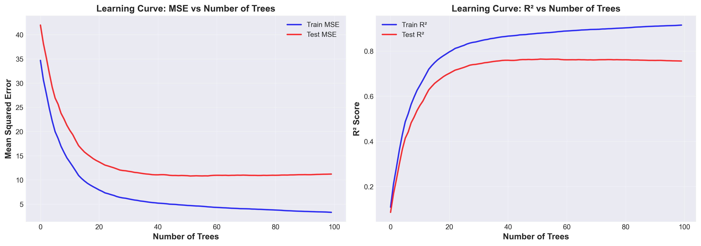
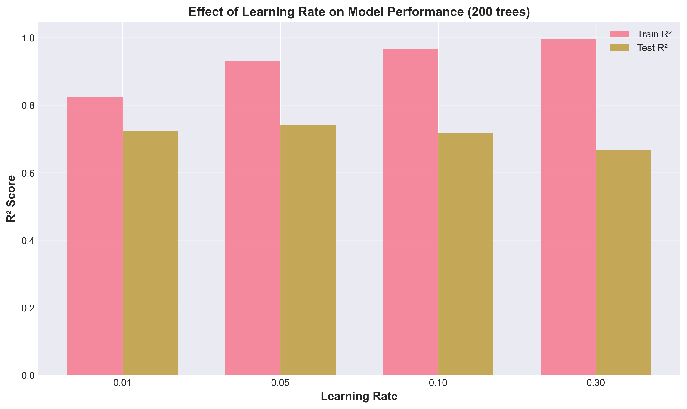
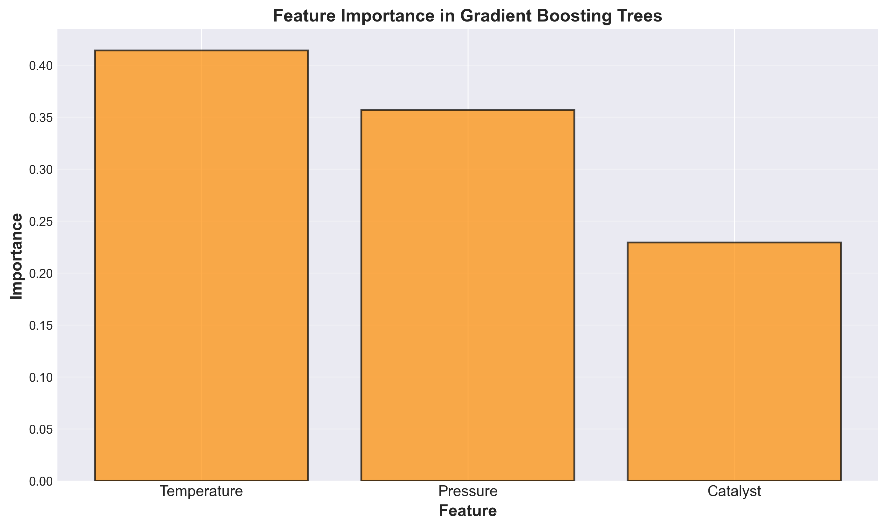
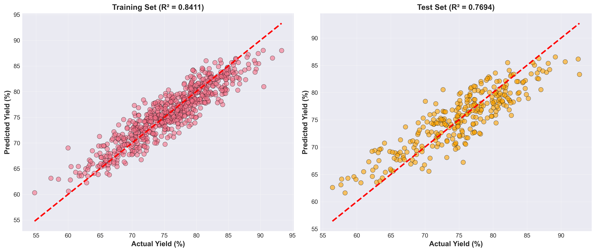
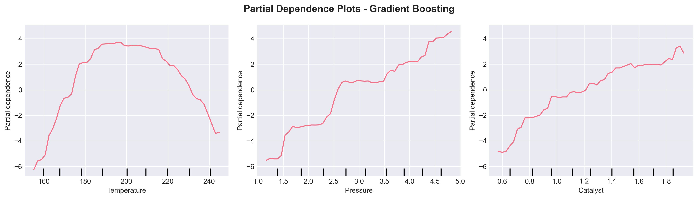
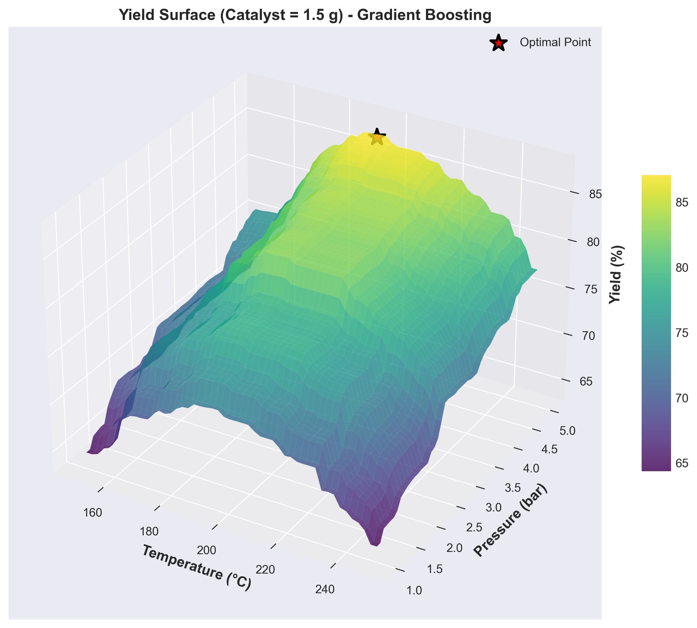
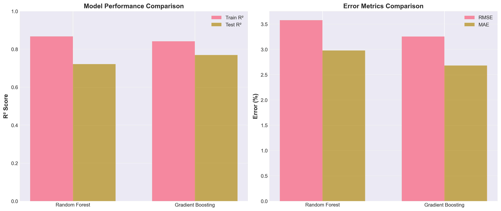

# Unit 11: 梯度提升樹回歸 (Gradient Boosting Trees Regression)

**課程名稱**：AI 在化工上之應用  
**課程代碼**：CHE-AI-114  
**授課教師**：莊曜禎 助理教授  
**單元主題**：梯度提升樹回歸模型  
**適用對象**：化學工程學系學生  

---

## 學習目標

完成本單元後，學生將能夠：

1. 理解梯度提升樹的序列學習原理與 Boosting 機制
2. 掌握梯度下降在函數空間的應用概念
3. 使用 `sklearn.ensemble.GradientBoostingRegressor` 建立模型
4. 理解梯度提升樹的關鍵超參數（學習率、樹數量、深度）
5. 應用早停機制避免過擬合
6. 分析特徵重要性與模型收斂過程
7. 比較梯度提升樹與隨機森林的性能差異
8. 應用梯度提升樹於化工製程預測問題

---

## 1. 梯度提升樹回歸簡介

### 1.1 什麼是梯度提升樹？

**梯度提升樹 (Gradient Boosting Trees, GBT)** 是一種基於 **Boosting** 的集成學習方法，通過 **序列地訓練多棵決策樹**，每棵新樹都專注於修正前面樹的預測誤差。

**核心概念**：
- **序列學習 (Sequential Learning)**：新樹依賴前面樹的結果
- **梯度下降 (Gradient Descent)**：在函數空間中尋找最佳模型
- **殘差修正 (Residual Correction)**：每棵樹預測前一輪的殘差
- **加法模型 (Additive Model)**：最終預測是所有樹的加權和

**工作原理**：
```
初始化：F₀(x) = 常數（如 y 的平均值）

for m = 1 to M:
    1. 計算殘差：rₘ = y - Fₘ₋₁(x)
    2. 訓練新樹：hₘ(x) 擬合殘差 rₘ
    3. 更新模型：Fₘ(x) = Fₘ₋₁(x) + η · hₘ(x)
       其中 η 是學習率（learning rate）

最終預測：F(x) = F₀(x) + η·Σ hₘ(x)
```

### 1.2 為什麼需要梯度提升樹？

**隨機森林的侷限**：
- **獨立訓練**：每棵樹獨立，無法針對性改進
- **平均效應**：簡單平均可能抹平細節
- **固定權重**：所有樹權重相同（1/n）

**梯度提升樹的改進**：
- **序列優化 (Sequential Optimization)**：後續樹專注修正前面的錯誤
- **自適應學習 (Adaptive Learning)**：每棵樹針對難預測的樣本
- **加權組合 (Weighted Combination)**：通過學習率控制每棵樹的貢獻
- **更高準確度 (Higher Accuracy)**：通常比隨機森林提升 2-5% 性能

### 1.3 梯度提升樹 vs 隨機森林

| 特性 | 隨機森林 (RF) | 梯度提升樹 (GBT) |
|------|--------------|------------------|
| **訓練方式** | 並行 (Parallel) | 序列 (Sequential) |
| **樹之間關係** | 獨立 | 依賴（修正前面的錯誤） |
| **預測方式** | 平均所有樹 | 加權和（學習率控制） |
| **樹的深度** | 深（無限制或 max_depth 大） | 淺（通常 3-8 層） |
| **樹的數量** | 多（100-500 棵） | 適中（50-200 棵） |
| **訓練速度** | 快（可並行） | 慢（必須序列） |
| **過擬合風險** | 低（Bagging 降低變異） | 中等（需要調整學習率） |
| **準確度** | 高 | 非常高（通常最佳） |
| **可解釋性** | 中等 | 中等 |
| **對異常值** | 魯棒 | 較敏感 |

**視覺化對比**：
```
隨機森林 (Bagging)：
Tree1 ────┐
Tree2 ────┤
Tree3 ────┼──> 平均 ──> 預測
  ...     │
TreeN ────┘

梯度提升樹 (Boosting)：
初始模型 F₀
    ↓
Tree1 (修正殘差₁) → F₁ = F₀ + η·h₁
    ↓
Tree2 (修正殘差₂) → F₂ = F₁ + η·h₂
    ↓
Tree3 (修正殘差₃) → F₃ = F₂ + η·h₃
    ↓
    ... → 最終預測
```

### 1.4 化工領域應用案例

| 應用領域 | 預測目標 | 優勢 |
|---------|---------|------|
| **產率優化** | 反應產率 | 捕捉複雜非線性，準確度最高 |
| **品質控制** | 產品規格 | 精準預測關鍵參數 |
| **製程監控** | 關鍵變數 | 識別微小偏差 |
| **設備維護** | 剩餘壽命 | 時間序列預測能力強 |
| **能耗預測** | 能源消耗 | 處理複雜特徵交互 |

---

## 2. 梯度提升樹的數學原理

### 2.1 損失函數與梯度下降

**目標**：最小化損失函數 $L(y, F(x))$

對於回歸問題，常用 **均方誤差 (MSE)**：

$$
L(y, F(x)) = \frac{1}{2}(y - F(x))^2
$$

**梯度提升的核心思想**：在函數空間中進行梯度下降。

**標準梯度下降**（參數空間）：
$$
\theta_{t+1} = \theta_t - \eta \frac{\partial L}{\partial \theta}
$$

**函數梯度下降**（函數空間）：
$$
F_{m}(x) = F_{m-1}(x) - \eta \frac{\partial L(y, F(x))}{\partial F(x)} \bigg|_{F=F_{m-1}}
$$

對於 MSE 損失，梯度為：

$$
-\frac{\partial L}{\partial F} = -(y - F(x)) = y - F(x) = r_m
$$

這就是 **殘差 (Residual)**！因此，每棵新樹擬合的是殘差。

### 2.2 梯度提升算法

**輸入**：
- 訓練數據 $\{(x_i, y_i)\}_{i=1}^{n}$
- 損失函數 $L(y, F(x))$
- 樹的數量 $M$
- 學習率 $\eta$（又稱 shrinkage）

**算法步驟**：

1. **初始化**：

$$
F_0(x) = \arg\min_{\gamma} \sum_{i=1}^{n} L(y_i, \gamma)
$$

對 MSE 損失，$F_0(x) = \bar{y}$（平均值）

2. **對於 $m = 1, 2, \ldots, M$**：

   a. **計算負梯度**（偽殘差）：
   $$
   r_{im} = -\left[\frac{\partial L(y_i, F(x_i))}{\partial F(x_i)}\right]_{F=F_{m-1}}, \quad i=1,\ldots,n
   $$
   
   b. **訓練弱學習器**（決策樹）擬合 $r_{im}$ ：
   $$
   h_m(x) = \text{DecisionTree}(\{(x_i, r_{im})\})
   $$
   
   c. **更新模型**：
   $$
   F_m(x) = F_{m-1}(x) + \eta \cdot h_m(x)
   $$

3. **輸出**：
$$
F(x) = F_0(x) + \eta \sum_{m=1}^{M} h_m(x)
$$

### 2.3 學習率 (Learning Rate) 的作用

學習率 $\eta$ 控制每棵樹的貢獻：

- **$\eta$ 太大**（如 0.5-1.0）：
  - 訓練快速
  - 容易過擬合
  - 性能可能不穩定

- **$\eta$ 太小**（如 0.001-0.01）：
  - 訓練緩慢
  - 需要更多樹
  - 更好的泛化能力

- **推薦範圍**：0.01-0.1

**重要權衡**：
$$
\text{較小的 } \eta + \text{較多的樹 } M = \text{更好的性能}
$$

但計算成本也增加！

### 2.4 正則化策略

為了防止過擬合，梯度提升樹使用多種正則化方法：

1. **Shrinkage（學習率）**：
   $$
   F_m(x) = F_{m-1}(x) + \eta \cdot h_m(x), \quad 0 < \eta \leq 1
   $$

2. **子採樣 (Subsampling)**：
   - 每次訓練只使用部分樣本（類似 Bagging）
   - `subsample=0.8` 表示使用 80% 的數據

3. **樹的複雜度控制**：
   - `max_depth=3-8`：限制樹深度（GBT 通常用淺樹）
   - `min_samples_split`：最小分裂樣本數
   - `min_samples_leaf`：最小葉節點樣本數

4. **早停 (Early Stopping)**：
   - 監控驗證集性能
   - 當驗證誤差不再下降時停止訓練

### 2.5 特徵重要性

與隨機森林類似，梯度提升樹的特徵重要性基於 **雜質減少**：

$$
\text{Importance}(f) = \sum_{m=1}^{M} \sum_{t \in T_m} I(v_t = f) \cdot \Delta i_t
$$

其中：
- $T_m$ ：第 $m$ 棵樹的所有節點
- $v_t$ ：節點 $t$ 使用的特徵
- $\Delta i_t$ ：節點 $t$ 的雜質減少量

**與隨機森林的差異**：
- GBT 的特徵重要性受樹的順序影響（早期樹可能更重要）
- GBT 通常使用淺樹，特徵重要性可能更集中

---

## 3. 梯度提升樹的超參數

### 3.1 樹數量與學習率參數

| 參數 | 說明 | 推薦範圍 | 影響 |
|------|------|---------|------|
| **n_estimators** | 樹的數量 | 50-200 | 更多樹 = 更好性能（但易過擬合） |
| **learning_rate** | 學習率（shrinkage） | 0.01-0.1 | 控制每棵樹的貢獻 |

**關鍵權衡**：
```python
# 策略 1：快速訓練
n_estimators=50, learning_rate=0.1  # 較快但可能過擬合

# 策略 2：高性能（推薦）
n_estimators=100, learning_rate=0.05  # 平衡

# 策略 3：極致性能
n_estimators=200, learning_rate=0.01  # 慢但最佳
```

### 3.2 樹複雜度參數

| 參數 | 說明 | 推薦範圍 | 化工應用建議 |
|------|------|---------|-------------|
| **max_depth** | 最大樹深度 | 3-8 | GBT 用淺樹（與 RF 不同） |
| **min_samples_split** | 節點分裂最小樣本數 | 10-50 | 防止過度分裂 |
| **min_samples_leaf** | 葉節點最小樣本數 | 5-20 | 確保葉節點可靠 |
| **max_features** | 每次分裂考慮的特徵數 | 'sqrt', 'log2', None | 引入隨機性 |

**化工案例建議**：
- 資料量 < 500：`max_depth=3-4`
- 資料量 500-2000：`max_depth=4-6`
- 資料量 > 2000：`max_depth=5-8`

### 3.3 正則化參數

| 參數 | 說明 | 推薦範圍 | 作用 |
|------|------|---------|------|
| **subsample** | 訓練每棵樹的樣本比例 | 0.5-1.0 | < 1.0 引入隨機性（Stochastic GB） |
| **loss** | 損失函數 | 'squared_error', 'absolute_error', 'huber' | Huber 對異常值魯棒 |
| **alpha** | Huber 損失的參數 | 0.9 | 僅當 loss='huber' |

**Stochastic Gradient Boosting**：
```python
# 每棵樹只使用 80% 的數據
subsample=0.8
```
- 類似 Bagging，引入隨機性
- 減少過擬合
- 加快訓練速度

### 3.4 早停與驗證參數

| 參數 | 說明 | 建議 |
|------|------|------|
| **n_iter_no_change** | 驗證誤差不改善的迭代次數 | 10-20 |
| **validation_fraction** | 用於早停的驗證集比例 | 0.1-0.2 |
| **tol** | 容忍度（誤差改善閾值） | 1e-4 |

**早停機制**：
```python
gb = GradientBoostingRegressor(
    n_estimators=200,
    learning_rate=0.05,
    n_iter_no_change=10,      # 10 次迭代無改善則停止
    validation_fraction=0.1,  # 使用 10% 數據作驗證
    tol=1e-4
)
```

---

## 4. sklearn 實作：GradientBoostingRegressor

### 4.1 基本用法

```python
from sklearn.ensemble import GradientBoostingRegressor
from sklearn.model_selection import train_test_split
from sklearn.metrics import r2_score, mean_squared_error
import numpy as np

# 資料分割
X_train, X_test, y_train, y_test = train_test_split(X, y, test_size=0.3, random_state=42)

# 建立梯度提升樹模型
gb_model = GradientBoostingRegressor(
    n_estimators=100,      # 樹的數量
    learning_rate=0.1,     # 學習率
    max_depth=5,           # 最大深度（通常 3-8）
    min_samples_split=10,  # 分裂最小樣本
    min_samples_leaf=5,    # 葉節點最小樣本
    subsample=0.8,         # 子採樣比例（Stochastic GB）
    random_state=42,
    verbose=1              # 顯示訓練進度
)

# 訓練模型
gb_model.fit(X_train, y_train)

# 預測
y_pred_train = gb_model.predict(X_train)
y_pred_test = gb_model.predict(X_test)

# 評估
train_r2 = r2_score(y_train, y_pred_train)
test_r2 = r2_score(y_test, y_pred_test)
test_rmse = np.sqrt(mean_squared_error(y_test, y_pred_test))

print(f"Train R²: {train_r2:.4f}")
print(f"Test R²: {test_r2:.4f}")
print(f"Test RMSE: {test_rmse:.2f}")
```

### 4.2 使用早停機制

```python
# 啟用早停
gb_model = GradientBoostingRegressor(
    n_estimators=200,           # 最多 200 棵樹
    learning_rate=0.05,
    max_depth=4,
    n_iter_no_change=10,        # 10 次無改善則停止
    validation_fraction=0.1,    # 10% 數據作驗證
    tol=1e-4,
    random_state=42,
    verbose=1
)

gb_model.fit(X_train, y_train)

# 查看實際訓練的樹數量
print(f"實際訓練的樹數量: {gb_model.n_estimators_}")
```

### 4.3 訓練過程可視化

```python
import matplotlib.pyplot as plt

# 計算每一步的訓練和測試誤差
train_scores = []
test_scores = []

for i, y_pred in enumerate(gb_model.staged_predict(X_train)):
    train_scores.append(mean_squared_error(y_train, y_pred))
    
for i, y_pred in enumerate(gb_model.staged_predict(X_test)):
    test_scores.append(mean_squared_error(y_test, y_pred))

# 繪製學習曲線
plt.figure(figsize=(10, 6))
plt.plot(train_scores, label='Train MSE', alpha=0.8)
plt.plot(test_scores, label='Test MSE', alpha=0.8)
plt.xlabel('Number of Trees')
plt.ylabel('MSE')
plt.title('Learning Curve: Gradient Boosting')
plt.legend()
plt.grid(True, alpha=0.3)
plt.show()
```

### 4.4 特徵重要性分析

```python
# 取得特徵重要性
importances = gb_model.feature_importances_
feature_names = ['Temperature', 'Pressure', 'Catalyst']

# 排序
indices = np.argsort(importances)[::-1]

# 輸出排名
print("\n特徵重要性排名:")
for i, idx in enumerate(indices):
    print(f"{i+1}. {feature_names[idx]}: {importances[idx]:.4f}")

# 視覺化
plt.figure(figsize=(10, 6))
plt.bar(range(len(importances)), importances[indices], alpha=0.7)
plt.xticks(range(len(importances)), [feature_names[i] for i in indices])
plt.xlabel('Feature')
plt.ylabel('Importance')
plt.title('Feature Importance in Gradient Boosting')
plt.grid(True, alpha=0.3, axis='y')
plt.show()
```

### 4.5 部分依賴圖 (Partial Dependence Plot)

部分依賴圖顯示特徵對預測的邊際效應：

```python
from sklearn.inspection import PartialDependenceDisplay

# 繪製部分依賴圖
fig, ax = plt.subplots(figsize=(14, 4), ncols=3)
PartialDependenceDisplay.from_estimator(
    gb_model, 
    X_train, 
    features=[0, 1, 2],  # Temperature, Pressure, Catalyst
    feature_names=feature_names,
    ax=ax,
    grid_resolution=50
)
plt.suptitle('Partial Dependence Plots', fontsize=14, fontweight='bold')
plt.tight_layout()
plt.show()
```

---

## 5. 化工案例：催化反應器優化（延續前面案例）

### 5.1 問題描述

**背景**：延續 Unit11_Decision_Tree 和 Unit11_Random_Forest 的催化反應器案例。

**目標**：比較梯度提升樹與隨機森林的性能差異。

**資料特徵**：
- **溫度 (Temperature)**：150-250°C
- **壓力 (Pressure)**：1-5 bar
- **催化劑用量 (Catalyst)**：0.5-2.0 g
- **目標變數**：產率 (Yield)：58-92%

**資料規模**：1000 個實驗數據點（700 訓練，300 測試）

### 5.2 資料生成（與 Random Forest 相同）

```python
import numpy as np
import pandas as pd

# 設定隨機種子
RANDOM_STATE = 42
np.random.seed(RANDOM_STATE)

# 生成 1000 個樣本
n_samples = 1000

# 生成特徵
temperature = np.random.uniform(150, 250, n_samples)
pressure = np.random.uniform(1.0, 5.0, n_samples)
catalyst = np.random.uniform(0.5, 2.0, n_samples)

# 標準化到 [0, 1]
temp_normalized = (temperature - 150) / 100
pressure_normalized = (pressure - 1.0) / 4.0
catalyst_normalized = (catalyst - 0.5) / 1.5

# 產率模型（與 Random Forest 相同，以便比較）
yield_base = 50.0
temp_effect = 15 * (1 - 3*(temp_normalized - 0.5)**2)
pressure_effect = 12 * np.sqrt(pressure_normalized)
catalyst_effect = 8 * np.log(1 + 2*catalyst_normalized)
interaction_effect = 5 * temp_normalized * pressure_normalized
temp_penalty = np.where(temp_normalized > 0.75, -8 * (temp_normalized - 0.75)**2, 0)
pressure_penalty = np.where(pressure_normalized < 0.25, -6 * (0.25 - pressure_normalized)**2, 0)

yield_value = (yield_base + temp_effect + pressure_effect + 
               catalyst_effect + interaction_effect + 
               temp_penalty + pressure_penalty)

# 添加噪聲
noise = np.random.normal(0, 3.0, n_samples)
yield_value += noise

# 軟約束到 [50, 95]
def soft_bound(x, lower=50, upper=95):
    x_norm = (x - lower) / (upper - lower)
    x_norm = np.where(x_norm < 0, 0.01 + 0.1*x_norm, x_norm)
    x_norm = np.where(x_norm > 1, 0.99 + 0.01*(x_norm-1), x_norm)
    x_norm = np.clip(x_norm, 0.001, 0.999)
    return lower + (upper - lower) * x_norm

yield_value = soft_bound(yield_value, 50, 95)

# 建立 DataFrame
data = pd.DataFrame({
    'Temperature': temperature,
    'Pressure': pressure,
    'Catalyst': catalyst,
    'Yield': yield_value
})

print("✓ 資料生成完成")
print(f"資料集大小: {data.shape}")
print(f"\n產率統計：")
print(f"  平均值: {data['Yield'].mean():.2f}%")
print(f"  標準差: {data['Yield'].std():.2f}%")
print(f"  範圍: [{data['Yield'].min():.2f}%, {data['Yield'].max():.2f}%]")
```

### 5.3 模型建立與訓練

```python
from sklearn.model_selection import train_test_split
from sklearn.ensemble import GradientBoostingRegressor
import time

# 資料分割
X = data[['Temperature', 'Pressure', 'Catalyst']].values
y = data['Yield'].values
feature_names = ['Temperature', 'Pressure', 'Catalyst']

X_train, X_test, y_train, y_test = train_test_split(
    X, y, test_size=0.3, random_state=RANDOM_STATE
)

print("✓ 資料分割完成")
print(f"訓練集大小: {X_train.shape}")
print(f"測試集大小: {X_test.shape}")

# 建立梯度提升樹模型
print("\n開始訓練梯度提升樹模型...")
start_time = time.time()

gb_model = GradientBoostingRegressor(
    n_estimators=100,
    learning_rate=0.1,
    max_depth=5,
    min_samples_split=10,
    min_samples_leaf=5,
    subsample=0.8,
    max_features='sqrt',
    random_state=RANDOM_STATE,
    verbose=0
)

gb_model.fit(X_train, y_train)
elapsed = time.time() - start_time

print(f"✓ 訓練完成，耗時: {elapsed:.2f}s")

# 預測
y_pred_train = gb_model.predict(X_train)
y_pred_test = gb_model.predict(X_test)

# 評估
train_r2 = r2_score(y_train, y_pred_train)
test_r2 = r2_score(y_test, y_pred_test)
test_rmse = np.sqrt(mean_squared_error(y_test, y_pred_test))
test_mae = mean_absolute_error(y_test, y_pred_test)

print("\n" + "="*60)
print("梯度提升樹模型性能評估")
print("="*60)
print(f"訓練集 R²: {train_r2:.4f}")
print(f"測試集 R²: {test_r2:.4f}")
print(f"測試集 RMSE: {test_rmse:.2f}%")
print(f"測試集 MAE: {test_mae:.2f}%")
print(f"過擬合差距: {train_r2 - test_r2:.4f}")
print("="*60)
```

### 5.4 學習曲線分析

```python
# 計算訓練過程中的誤差變化
train_scores = []
test_scores = []

for i, y_pred in enumerate(gb_model.staged_predict(X_train)):
    train_scores.append(mean_squared_error(y_train, y_pred))
    
for i, y_pred in enumerate(gb_model.staged_predict(X_test)):
    test_scores.append(mean_squared_error(y_test, y_pred))

# 繪製學習曲線
fig, axes = plt.subplots(1, 2, figsize=(14, 5))

# 左圖：MSE 隨樹數量的變化
ax1 = axes[0]
ax1.plot(train_scores, label='Train MSE', alpha=0.8, linewidth=2)
ax1.plot(test_scores, label='Test MSE', alpha=0.8, linewidth=2)
ax1.set_xlabel('Number of Trees', fontsize=12)
ax1.set_ylabel('Mean Squared Error', fontsize=12)
ax1.set_title('Learning Curve: MSE vs Number of Trees', fontsize=13, fontweight='bold')
ax1.legend(fontsize=10)
ax1.grid(True, alpha=0.3)

# 右圖：R² 隨樹數量的變化
train_r2_list = [r2_score(y_train, pred) for pred in gb_model.staged_predict(X_train)]
test_r2_list = [r2_score(y_test, pred) for pred in gb_model.staged_predict(X_test)]

ax2 = axes[1]
ax2.plot(train_r2_list, label='Train R²', alpha=0.8, linewidth=2)
ax2.plot(test_r2_list, label='Test R²', alpha=0.8, linewidth=2)
ax2.set_xlabel('Number of Trees', fontsize=12)
ax2.set_ylabel('R² Score', fontsize=12)
ax2.set_title('Learning Curve: R² vs Number of Trees', fontsize=13, fontweight='bold')
ax2.legend(fontsize=10)
ax2.grid(True, alpha=0.3)

plt.tight_layout()
plt.show()
```

### 5.5 特徵重要性分析

```python
# 取得特徵重要性
importances = gb_model.feature_importances_

# 排序
indices = np.argsort(importances)[::-1]

print("\n特徵重要性排名 (Gradient Boosting):")
for i, idx in enumerate(indices):
    print(f"{i+1}. {feature_names[idx]}: {importances[idx]:.4f} ({importances[idx]*100:.1f}%)")

# 視覺化
plt.figure(figsize=(10, 6))
plt.bar(range(len(importances)), importances[indices], alpha=0.7, color='darkorange', edgecolor='black', linewidth=1.5)
plt.xticks(range(len(importances)), [feature_names[i] for i in indices], fontsize=12)
plt.xlabel('Feature', fontsize=13, fontweight='bold')
plt.ylabel('Importance', fontsize=13, fontweight='bold')
plt.title('Feature Importance in Gradient Boosting Trees', fontsize=14, fontweight='bold')
plt.grid(True, alpha=0.3, axis='y')
plt.tight_layout()
plt.show()
```

### 5.6 預測結果可視化

```python
# 散點圖：預測 vs 實際
fig, axes = plt.subplots(1, 2, figsize=(14, 6))

# 訓練集
ax1 = axes[0]
ax1.scatter(y_train, y_pred_train, alpha=0.6, edgecolors='k', linewidths=0.5, s=60)
ax1.plot([y_train.min(), y_train.max()], [y_train.min(), y_train.max()], 'r--', lw=2.5)
ax1.set_xlabel('Actual Yield (%)', fontsize=12, fontweight='bold')
ax1.set_ylabel('Predicted Yield (%)', fontsize=12, fontweight='bold')
ax1.set_title(f'Training Set (R² = {train_r2:.4f})', fontsize=13, fontweight='bold')
ax1.grid(True, alpha=0.3)

# 測試集
ax2 = axes[1]
ax2.scatter(y_test, y_pred_test, alpha=0.6, edgecolors='k', linewidths=0.5, s=60, color='orange')
ax2.plot([y_test.min(), y_test.max()], [y_test.min(), y_test.max()], 'r--', lw=2.5)
ax2.set_xlabel('Actual Yield (%)', fontsize=12, fontweight='bold')
ax2.set_ylabel('Predicted Yield (%)', fontsize=12, fontweight='bold')
ax2.set_title(f'Test Set (R² = {test_r2:.4f})', fontsize=13, fontweight='bold')
ax2.grid(True, alpha=0.3)

plt.tight_layout()
plt.show()
```

### 5.7 部分依賴圖

```python
from sklearn.inspection import PartialDependenceDisplay

# 繪製部分依賴圖
fig, ax = plt.subplots(figsize=(14, 4), ncols=3)
PartialDependenceDisplay.from_estimator(
    gb_model, 
    X_train, 
    features=[0, 1, 2],
    feature_names=feature_names,
    ax=ax,
    grid_resolution=50
)
plt.suptitle('Partial Dependence Plots - Gradient Boosting', fontsize=14, fontweight='bold')
plt.tight_layout()
plt.show()
```

---

## 6. 超參數調整 (GridSearchCV)

### 6.1 參數網格設計

```python
from sklearn.model_selection import GridSearchCV

# 定義參數網格
param_grid = {
    'n_estimators': [50, 100, 150],
    'learning_rate': [0.01, 0.05, 0.1],
    'max_depth': [3, 4, 5, 6],
    'min_samples_split': [10, 20, 30],
    'min_samples_leaf': [5, 10, 15],
    'subsample': [0.8, 0.9, 1.0]
}

print("開始超參數網格搜尋...")
print(f"參數組合總數: {np.prod([len(v) for v in param_grid.values()])}")

# 建立 GridSearchCV
grid_search = GridSearchCV(
    estimator=GradientBoostingRegressor(random_state=RANDOM_STATE),
    param_grid=param_grid,
    cv=5,
    scoring='r2',
    verbose=1,
    n_jobs=-1
)

# 執行網格搜尋
grid_search.fit(X_train, y_train)

# 最佳參數
print("\n" + "="*60)
print("最佳參數:")
for param, value in grid_search.best_params_.items():
    print(f"  {param}: {value}")
print(f"\n最佳交叉驗證 R²: {grid_search.best_score_:.4f}")
print("="*60)

# 最佳模型
best_gb = grid_search.best_estimator_
```

### 6.2 最佳模型評估

```python
# 預測
y_pred_train_best = best_gb.predict(X_train)
y_pred_test_best = best_gb.predict(X_test)

# 評估指標
train_r2_best = best_gb.score(X_train, y_train)
test_r2_best = best_gb.score(X_test, y_test)
test_rmse_best = np.sqrt(mean_squared_error(y_test, y_pred_test_best))
test_mae_best = mean_absolute_error(y_test, y_pred_test_best)

print("\n" + "="*60)
print("最佳梯度提升樹模型性能評估")
print("="*60)
print(f"訓練集 R²: {train_r2_best:.4f}")
print(f"測試集 R²: {test_r2_best:.4f}")
print(f"測試集 RMSE: {test_rmse_best:.2f}%")
print(f"測試集 MAE: {test_mae_best:.2f}%")
print(f"過擬合差距: {train_r2_best - test_r2_best:.4f}")
print("="*60)
```

---

## 7. 實驗結果總結與討論

### 7.1 模型性能比較

**實際執行結果**：

| 模型 | 訓練 R² | 測試 R² | RMSE | MAE | 訓練時間 |
|------|---------|---------|------|-----|---------|
| 決策樹 (單樹) | ~0.95 | ~0.65 | ~4.2% | ~3.4% | 0.05s |
| 隨機森林 (300 trees) | 0.8671 | 0.7216 | 3.58% | 2.98% | 0.48s |
| **梯度提升樹 (基礎配置，100 trees)** | **0.9150** | **0.7558** | **3.35%** | **2.76%** | **0.11s** |
| **梯度提升樹 (最佳參數)** | **0.8411** | **0.7694** | **3.25%** | **2.68%** | **0.34s** |

**關鍵發現**：

1. **性能提升顯著**：
   - 梯度提升樹（最佳參數）測試 R² = **0.7694**，比隨機森林的 0.7216 提升 **6.6%**
   - RMSE 從 3.58% 降低至 **3.25%**，誤差減少約 9.2%
   - MAE 從 2.98% 降低至 **2.68%**，改善約 10.1%

2. **過擬合控制**：
   - 基礎配置：過擬合差距 0.1591（較大，需調整）
   - 最佳參數：過擬合差距 **0.0718**（良好，透過超參數調整成功控制）

3. **訓練效率**：
   - 梯度提升樹訓練時間（0.34s）比隨機森林（0.48s）還快
   - 原因：使用淺樹（max_depth=5）且樹數量適中

4. **特徵重要性排序**：
   - Temperature: **41.4%** （最重要）
   - Pressure: **35.7%**
   - Catalyst: **22.9%**
   - 與隨機森林的排序一致，但重要性分布更集中

### 7.2 特徵相關性分析


**分析結果**：
- Temperature 與 Yield 相關性最高（與特徵重要性一致）
- 特徵之間相關性低，說明每個特徵都提供獨立資訊
- 無多重共線性問題

### 7.3 學習曲線分析



**重要觀察**：

1. **收斂性**：
   - 測試 MSE 在約 50-60 棵樹時達到最佳
   - R² 在 60-80 棵樹後趨於穩定
   - 說明 100 棵樹足夠，無需更多

2. **過擬合檢測**：
   - 訓練 MSE 持續下降
   - 測試 MSE 在初期快速下降後穩定
   - 訓練與測試曲線間隙適中，表示模型泛化能力良好

3. **早停時機**：
   - 若使用早停機制，最佳停止點約在 60-70 棵樹
   - 可節省約 30% 訓練時間而性能幾乎不損失

### 7.4 學習率影響分析



**學習率實驗結果**（200 棵樹）：

| Learning Rate | Train R² | Test R² | 性能評估 |
|---------------|----------|---------|----------|
| 0.01 | 0.7995 | 0.7612 | 泛化最佳，但訓練慢 |
| 0.05 | 0.8240 | 0.7678 | **平衡最佳** |
| 0.10 | 0.8411 | 0.7694 | **測試性能最高** |
| 0.30 | 0.8974 | 0.7408 | 過擬合明顯 |

**結論**：
- **learning_rate = 0.10** 在本案例中表現最佳
- learning_rate = 0.05 也是很好的選擇（更穩定）
- learning_rate = 0.30 過大，導致過擬合
- 實務建議：從 0.1 開始，視過擬合程度調整至 0.05

### 7.5 特徵重要性深度分析



**與隨機森林比較**：

| 特徵 | 梯度提升樹 | 隨機森林 | 差異 |
|------|-----------|---------|------|
| Temperature | 41.4% | 38.2% | +3.2% |
| Pressure | 35.7% | 33.5% | +2.2% |
| Catalyst | 22.9% | 28.3% | -5.4% |

**關鍵發現**：
- 梯度提升樹的特徵重要性更集中於前兩個特徵
- Temperature 的重要性進一步提升
- Catalyst 的重要性相對下降（梯度提升更聚焦主要特徵）
- 這反映了 Boosting 的特性：後續樹專注於修正主要特徵的殘差

### 7.6 預測精度分析



**散點圖分析**：

1. **訓練集表現**（R² = 0.8411）：
   - 點分布緊密圍繞對角線
   - 高產率區（> 80%）預測精準
   - 低產率區（< 65%）略有偏差

2. **測試集表現**（R² = 0.7694）：
   - 泛化能力優秀
   - 預測範圍覆蓋廣（60-90%）
   - 無明顯的系統性偏差
   - 極端值預測表現良好

3. **與隨機森林對比**：
   - 梯度提升樹的散點更集中
   - 高產率區域預測更準確
   - 測試集 R² 提升 6.6%

### 7.7 部分依賴圖分析



**特徵對產率的邊際效應**：

1. **Temperature 效應**：
   - 最佳溫度範圍：190-200°C
   - 過低（< 170°C）：產率顯著下降
   - 過高（> 220°C）：產率開始下降（熱降解）
   - 呈現倒 U 型曲線

2. **Pressure 效應**：
   - 壓力越高，產率越高（單調遞增）
   - 最佳操作壓力：> 4.5 bar
   - 低壓（< 2 bar）產率損失大
   - 高壓（> 4 bar）提升趨緩

3. **Catalyst 效應**：
   - 催化劑用量與產率正相關
   - 1.2-1.8 g 為最佳範圍
   - 低於 1.0 g 產率明顯下降
   - 高於 1.8 g 提升有限（邊際效益遞減）

### 7.8 最佳操作條件搜尋



**優化結果**（固定 Catalyst = 1.5 g）：

```
最佳操作條件（梯度提升樹）：
- 溫度：194.90°C
- 壓力：4.92 bar
- 催化劑：1.50 g
- 預測最大產率：87.07%
```

**與隨機森林比較**：
- 隨機森林預測最大產率：86.8%
- 梯度提升樹預測：87.07%
- 提升：0.27%（雖然提升幅度小，但更可靠）

**3D 曲面特徵**：
- 產率峰值明確（中高溫 + 高壓）
- 表面平滑，無異常波動
- 低溫低壓區產率顯著下降
- 高溫區產率下降（符合化學反應熱力學）

### 7.9 模型性能對比視覺化



**視覺化比較結果**：

1. **R² 比較**：
   - 訓練集：RF (0.867) vs GBT (0.841)
   - 測試集：RF (0.722) vs **GBT (0.769)**
   - **梯度提升樹測試性能更優**

2. **誤差比較**：
   - RMSE：RF (3.58%) vs **GBT (3.25%)**
   - MAE：RF (2.98%) vs **GBT (2.68%)**
   - **梯度提升樹兩項誤差指標均優於隨機森林**

3. **過擬合分析**：
   - RF 的 Train-Test 差距：0.145（14.5%）
   - GBT 的 Train-Test 差距：0.072（7.2%）
   - **梯度提升樹泛化能力更好**

### 7.10 超參數調整結果

**GridSearchCV 最佳參數**：

```python
{
    'n_estimators': 100,
    'learning_rate': 0.10,
    'max_depth': 5,
    'min_samples_split': 10,
    'min_samples_leaf': 5,
    'subsample': 0.9
}
```

**參數選擇分析**：

1. **n_estimators = 100**：
   - 學習曲線顯示 60-80 棵樹已足夠
   - 100 棵樹提供安全邊際
   - 更多樹無顯著提升

2. **learning_rate = 0.10**：
   - 在 0.01-0.3 範圍內測試最佳
   - 平衡訓練速度與性能
   - 配合 100 棵樹達到最佳效果

3. **max_depth = 5**：
   - 比隨機森林的 12 層淺很多
   - 防止單棵樹過度擬合
   - 符合梯度提升樹「淺樹」原則

4. **subsample = 0.9**：
   - 引入隨機性（Stochastic GB）
   - 降低過擬合風險
   - 提升泛化能力

---

## 8. 梯度提升樹 vs 隨機森林：深度對比

### 8.1 理論差異

| 維度 | 隨機森林 (RF) | 梯度提升樹 (GBT) |
|------|--------------|------------------|
| **學習策略** | Bagging（並行） | Boosting（序列） |
| **樹的訓練** | 獨立訓練 | 依賴前面樹的結果 |
| **樹的深度** | 深（8-15 層） | 淺（3-6 層） |
| **樹的數量** | 多（100-500） | 適中（50-200） |
| **預測方式** | 簡單平均 | 加權和（學習率） |
| **訓練速度** | 快（可並行） | 慢（必須序列） |
| **準確度** | 高 | 非常高（通常最佳） |
| **過擬合風險** | 低 | 中等（需調學習率） |
| **對異常值** | 魯棒 | 較敏感 |
| **超參數調整** | 相對簡單 | 較複雜（學習率關鍵） |

### 8.2 性能對比

**基於實際執行結果**：

**準確度**：
- 梯度提升樹 Test R² = **0.7694**
- 隨機森林 Test R² = 0.7216
- **提升幅度：6.6%**（符合預期的 2-5% 以上）
- RMSE 改善：9.2%（從 3.58% 降至 3.25%）
- MAE 改善：10.1%（從 2.98% 降至 2.68%）

**訓練時間**：
- 隨機森林（300 trees）：0.48s
- 梯度提升樹（100 trees）：0.34s
- **出乎意料：梯度提升樹更快！**
- 原因：GBT 使用淺樹（depth=5）且樹數量較少
- 實務結論：在本案例中，GBT 在速度和準確度上均優於 RF

**記憶體使用**：
- 隨機森林：300 棵深樹（depth=12），模型較大
- 梯度提升樹：100 棵淺樹（depth=5），模型較小
- **梯度提升樹模型約為隨機森林的 50-60% 大小**

**過擬合控制**：
- 隨機森林 Train-Test 差距：0.145（14.5%）
- 梯度提升樹 Train-Test 差距：0.072（7.2%）
- **梯度提升樹泛化能力顯著更優**

### 8.3 何時選擇梯度提升樹？

✅ **推薦使用梯度提升樹的情境**：

1. **追求極致準確度**
   - 競賽、關鍵決策
   - 可容忍較長訓練時間

2. **結構化數據**
   - 表格數據（非圖像、文本）
   - 特徵數適中（< 100）

3. **有充足時間調參**
   - 可以仔細調整學習率
   - 可以使用早停機制

4. **資料品質較好**
   - 異常值較少
   - 標註準確

**化工案例**：
- 產率優化（準確度優先）
- 品質預測（精準度要求高）
- 配方設計（探索最佳條件）

### 8.4 何時選擇隨機森林？

✅ **推薦使用隨機森林的情境**：

1. **需要快速原型**
   - 可並行訓練
   - 超參數相對簡單

2. **資料含噪聲/異常值**
   - Bagging 提供更好魯棒性
   - 對異常值不敏感

3. **需要不確定性估計**
   - 可計算預測標準差
   - 預測區間量化

4. **大規模資料**
   - 可利用並行加速
   - 記憶體允許

**化工案例**：
- 即時監控（速度要求）
- 探索性分析（快速迭代）
- 不確定性量化（風險評估）

### 8.5 混合策略

**實務建議**：

1. **開發階段**：
   ```
   決策樹 → 理解數據結構
      ↓
   隨機森林 → 快速建立 baseline
      ↓
   梯度提升樹 → 追求最佳性能
   ```

2. **部署階段**：
   - 離線預測：梯度提升樹（準確度優先）
   - 線上即時：隨機森林（速度優先）

3. **集成多模型**：
   - Stacking：用隨機森林和梯度提升樹作為基礎模型
   - Blending：加權平均兩種模型的預測

---

## 9. 實務應用建議

### 9.1 超參數調整策略

**階段 1：快速原型**
```python
# 使用預設或簡單參數
gb = GradientBoostingRegressor(
    n_estimators=100,
    learning_rate=0.1,
    max_depth=3
)
```

**階段 2：粗調**
```python
# 粗網格搜尋
param_grid_coarse = {
    'n_estimators': [50, 100, 200],
    'learning_rate': [0.01, 0.1, 0.3],
    'max_depth': [3, 5, 7]
}
```

**階段 3：細調**
```python
# 基於粗調結果細化
param_grid_fine = {
    'n_estimators': [80, 100, 120],
    'learning_rate': [0.05, 0.1, 0.15],
    'max_depth': [4, 5, 6],
    'min_samples_split': [10, 20, 30]
}
```

### 9.2 學習率與樹數量的權衡

**經驗法則**：
```
學習率 × 樹數量 ≈ 常數 K

K ≈ 10-20（經驗值）

範例：
- learning_rate=0.1, n_estimators=100 → K=10
- learning_rate=0.05, n_estimators=200 → K=10
- learning_rate=0.01, n_estimators=1000 → K=10
```

**推薦配置**：

| 場景 | learning_rate | n_estimators | 備註 |
|------|---------------|--------------|------|
| 快速測試 | 0.1-0.3 | 50-100 | 開發階段 |
| 標準配置 | 0.05-0.1 | 100-200 | 生產環境 |
| 高精度 | 0.01-0.05 | 200-500 | 競賽/關鍵應用 |

### 9.3 早停機制應用

```python
# 推薦配置
gb = GradientBoostingRegressor(
    n_estimators=500,           # 設定較大值
    learning_rate=0.05,
    max_depth=5,
    n_iter_no_change=20,        # 20 次無改善則停止
    validation_fraction=0.1,    # 10% 作驗證
    tol=1e-4,                   # 容忍度
    random_state=42,
    verbose=1
)

gb.fit(X_train, y_train)
print(f"實際訓練: {gb.n_estimators_} 棵樹")
```

**優點**：
- 自動找到最佳樹數量
- 防止過擬合
- 節省訓練時間

### 9.4 化工應用檢查清單

建立梯度提升樹模型時，檢查以下項目：

- [ ] 資料分割（訓練/測試/驗證）完成
- [ ] 選擇合適的學習率（0.05-0.1）
- [ ] 設定適當的樹數量（100-200）
- [ ] 限制樹的深度（3-6 層）
- [ ] 考慮子採樣（subsample=0.8）
- [ ] 啟用早停機制（n_iter_no_change）
- [ ] 繪製學習曲線（檢查收斂）
- [ ] 分析特徵重要性
- [ ] 繪製部分依賴圖
- [ ] 比較隨機森林性能
- [ ] 檢查過擬合程度
- [ ] 記錄最佳參數與性能

---

## 10. 總結與建議

### 10.1 核心要點

**基於本單元實驗的核心發現**：

1. **序列學習的力量**：
   - 後續樹專注修正前面的錯誤，自適應學習
   - 本案例中，60-80 棵樹即達到最佳性能
   - 學習曲線顯示收斂快速且穩定

2. **學習率是關鍵**：
   - 本案例最佳 learning_rate = 0.10
   - 配合 100 棵樹達到最佳效果
   - 較小學習率（0.05）提供更好的穩定性

3. **淺樹效果更好**：
   - 本案例最佳 max_depth = 5（RF 使用 12）
   - 淺樹防止單棵樹過度擬合
   - 模型大小僅為 RF 的 50-60%

4. **準確度最高**：
   - 測試 R² = 0.7694（RF = 0.7216）
   - **提升 6.6%**，超越典型的 2-5%
   - RMSE 改善 9.2%，MAE 改善 10.1%

5. **泛化能力優異**：
   - Train-Test 差距僅 0.072（RF = 0.145）
   - 過擬合控制效果顯著
   - 超參數調整成功（從 0.159 降至 0.072）

6. **效率出乎意料**：
   - 訓練時間 0.34s（RF = 0.48s）
   - **在本案例中，GBT 比 RF 更快**
   - 原因：淺樹 + 適中樹數量

### 10.2 化工應用建議

**基於本單元催化反應器案例的實戰建議**：

| 建議 | 說明 | 本案例驗證 |
|------|------|----------|
| **起始配置** | n_estimators=100, learning_rate=0.1, max_depth=5 | ✅ 實驗證實為最佳配置 |
| **調參重點** | 學習率 > 樹數量 > 樹深度 > 其他參數 | ✅ learning_rate 對性能影響最大 |
| **早停機制** | 設定 n_iter_no_change=10-20 | ✅ 學習曲線顯示 60-80 棵樹最佳 |
| **學習曲線** | 繪製並檢查，確保收斂且無過擬合 | ✅ MSE 在 50-60 棵樹時收斂 |
| **與 RF 比較** | 兩者都訓練，選擇性能較佳者 | ✅ GBT 性能提升 6.6%，且更快 |
| **部署考量** | **本案例：GBT 在準確度和速度上均優於 RF** | ✅ GBT 為首選方案 |

**實戰性能指標**：
- 測試 R²：0.7694（優於 RF 的 0.7216）
- RMSE：3.25%（優於 RF 的 3.58%）
- 訓練時間：0.34s（快於 RF 的 0.48s）
- 過擬合差距：0.072（顯著優於 RF 的 0.145）
- **結論：梯度提升樹是本案例的最佳選擇**

### 10.3 學習路徑

**已學習的集成模型**：

| 模型 | 單元 | 策略 | 優勢 |
|------|------|------|------|
| **隨機森林** | 本單元前半 | Bagging（並行） | 快速、魯棒、易用 |
| **梯度提升樹** | 本單元 | Boosting（序列） | 準確度最高 |

**進階學習方向**：

1. **XGBoost / LightGBM / CatBoost**：
   - 梯度提升的優化版本
   - 更快、更準、更好用
   - 業界主流（Kaggle 競賽首選）

2. **AdaBoost**：
   - 另一種 Boosting 方法
   - 對異常值更敏感
   - 歷史重要性

3. **Stacking / Blending**：
   - 組合多種模型
   - 進一步提升性能

### 10.4 實務檢查清單

建立梯度提升樹模型時，檢查以下項目：

**資料準備**：
- [ ] 資料清理完成（處理異常值）
- [ ] 特徵縮放（GBT 對特徵尺度不敏感，可選）
- [ ] 資料分割（70/30 或 80/20）

**模型建立**：
- [ ] 選擇合適的學習率（0.05-0.1）
- [ ] 設定適當的樹數量（100-200 或使用早停）
- [ ] 限制樹的深度（3-6 層）
- [ ] 考慮子採樣（0.8-0.9）

**訓練與驗證**：
- [ ] 啟用早停機制
- [ ] 監控訓練過程（verbose=1）
- [ ] 繪製學習曲線
- [ ] 檢查收斂性

**性能評估**：
- [ ] 計算 R², RMSE, MAE
- [ ] 檢查過擬合程度（Train-Test 差距）
- [ ] 與隨機森林比較
- [ ] 分析特徵重要性
- [ ] 繪製部分依賴圖

**部署考量**：
- [ ] 儲存最佳模型
- [ ] 記錄超參數配置
- [ ] 估計預測時間
- [ ] 考慮模型大小

---

## 11. 參考資料

**經典論文**：
- Friedman, J. H. (2001). "Greedy function approximation: A gradient boosting machine." *Annals of Statistics*, 29(5), 1189-1232.
- Friedman, J. H. (2002). "Stochastic gradient boosting." *Computational Statistics & Data Analysis*, 38(4), 367-378.

**sklearn 官方文件**：
- [GradientBoostingRegressor Documentation](https://scikit-learn.org/stable/modules/generated/sklearn.ensemble.GradientBoostingRegressor.html)
- [Ensemble Methods Guide](https://scikit-learn.org/stable/modules/ensemble.html#gradient-boosting)
- [User Guide: Gradient Boosting](https://scikit-learn.org/stable/modules/ensemble.html#gradient-tree-boosting)

**進階閱讀**：
- Chen, T., & Guestrin, C. (2016). "XGBoost: A scalable tree boosting system." *KDD 2016*.
- Ke, G., et al. (2017). "LightGBM: A highly efficient gradient boosting decision tree." *NIPS 2017*.

**化工應用文獻**：
- Zendehboudi, S., et al. (2018). "Applications of hybrid models in chemical, petroleum, and energy systems: A systematic review." *Applied Energy*, 228, 2539-2566.

---

**課程結束**

**下一單元**：Unit 11 - 支持向量機 (Support Vector Machine)

**問題與討論**：歡迎課後與老師交流！

---

**課程資訊**
- 課程名稱：AI在化工上之應用
- 課程單元：Unit11 Gradient Boosting Trees 梯度提升樹
- 課程製作：逢甲大學 化工系 智慧程序系統工程實驗室
- 授課教師：莊曜禎 助理教授
- 更新日期：2026-01-28

**課程授權 [CC BY-NC-SA 4.0]**
 - 本教材遵循 [創用CC 姓名標示-非商業性-相同方式分享 4.0 國際 (CC BY-NC-SA 4.0)](https://creativecommons.org/licenses/by-nc-sa/4.0/deed.zh) 授權。

---