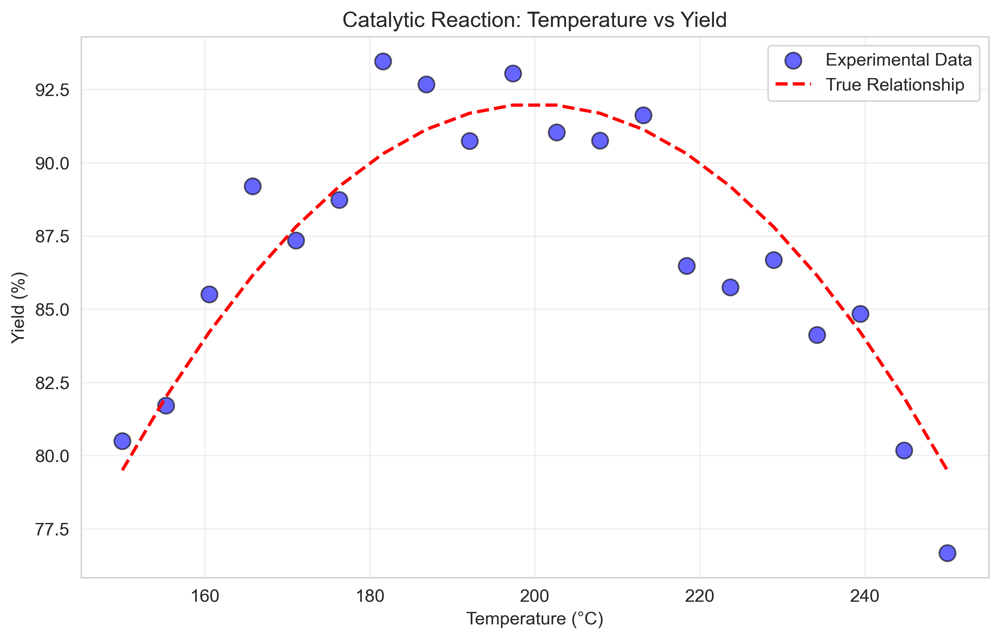
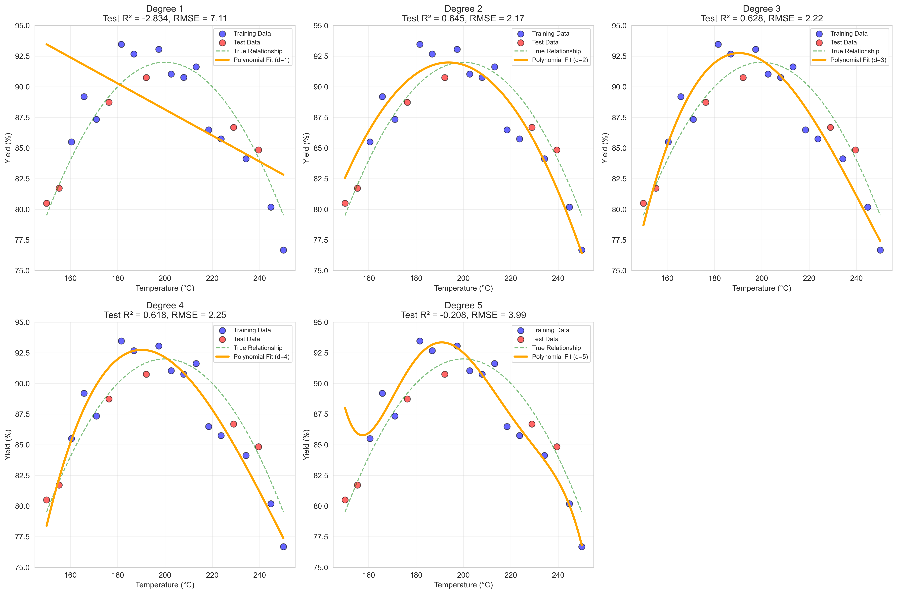
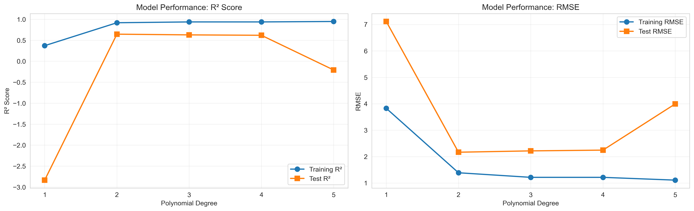
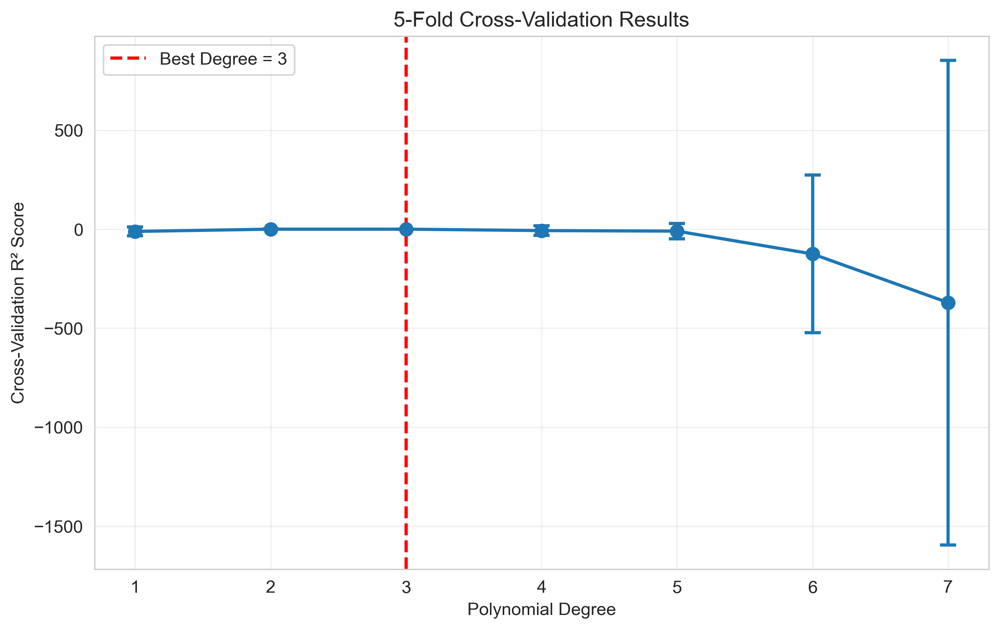
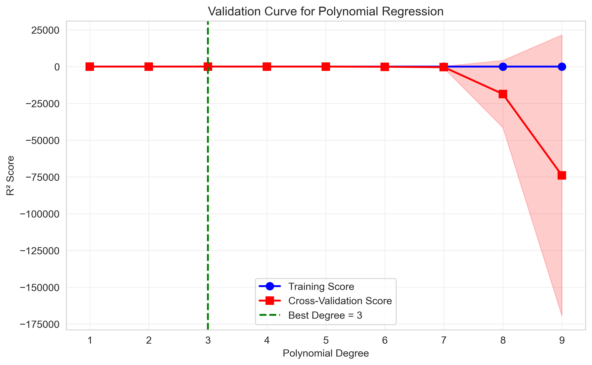
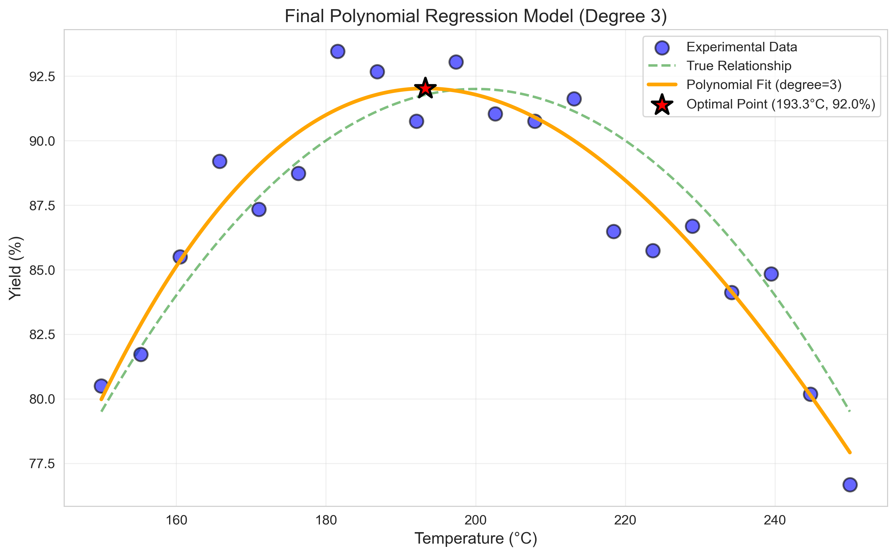
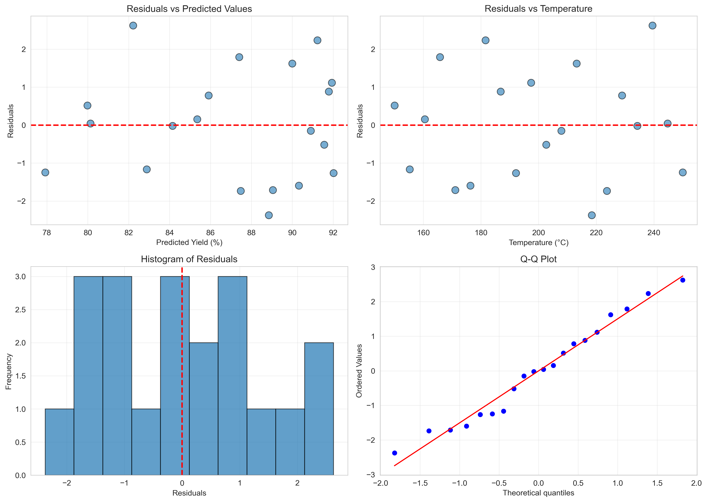

# Unit11 多項式回歸 | Polynomial Regression

> **最後更新**：2026-01-16

---

## 學習目標

本節課將深入學習**多項式回歸 (Polynomial Regression)** 模型，這是線性回歸的延伸，用於捕捉特徵與目標變數之間的非線性關係。通過本節課，您將能夠：

- 理解多項式回歸的數學原理與特徵工程
- 掌握 sklearn 中 `PolynomialFeatures` 和 `Pipeline` 的使用
- 學習如何選擇最佳多項式次數並避免過擬合
- 應用多項式回歸解決化工領域的實際問題
- 理解模型的優勢與限制

---

## 1. 多項式回歸基本概念

### 1.1 什麼是多項式回歸？

**多項式回歸 (Polynomial Regression)** 是線性回歸的擴展，透過將原始特徵的**高次項**和**交互項**加入模型，以捕捉特徵與目標變數之間的**非線性關係**。

雖然多項式回歸看似「非線性」，但從數學角度來看，它仍是**線性模型**，因為模型對**參數（係數）** 是線性的，只是對**特徵**是非線性的。

### 1.2 為什麼需要多項式回歸？

在許多實際應用中，特徵與目標之間的關係並非簡單的線性關係。例如：

#### 化工領域的非線性現象

1. **反應速率與溫度**：
   - Arrhenius 方程展現指數關係，可用多項式近似

2. **吸附量與濃度**：
   - Langmuir 或 Freundlich 吸附等溫線呈現曲線關係

3. **黏度與溫度**：
   - Andrade 方程或 Vogel-Fulcher-Tammann (VFT) 方程描述非線性關係

4. **相平衡**：
   - 汽液平衡曲線、溶解度曲線等呈現複雜的曲線關係

5. **製程產率與操作條件**：
   - 產率通常在某個操作範圍內達到最大值（拋物線型）

### 1.3 數學表達

#### 1.3.1 單變數多項式回歸

對於單一特徵 $x$ ，$d$ 次多項式回歸的形式為：

$$
y = \beta_0 + \beta_1 x + \beta_2 x^2 + \beta_3 x^3 + \cdots + \beta_d x^d + \epsilon
$$

**範例（二次多項式）**：

$$
y = \beta_0 + \beta_1 x + \beta_2 x^2 + \epsilon
$$

#### 1.3.2 多變數多項式回歸

對於兩個特徵 $x_1, x_2$ ，二次多項式回歸包含：

$$
y = \beta_0 + \beta_1 x_1 + \beta_2 x_2 + \beta_3 x_1^2 + \beta_4 x_1 x_2 + \beta_5 x_2^2 + \epsilon
$$

**特徵擴展**：原始 2 個特徵 → 擴展為 6 個特徵（包含截距）
- 常數項： $1$
- 一次項： $x_1, x_2$
- 二次項： $x_1^2, x_2^2$
- 交互項： $x_1 x_2$

#### 1.3.3 一般形式

對於 $n$ 個特徵和 $d$ 次多項式，擴展後的特徵數量為：

$$
\text{Number of features} = \binom{n + d}{d} = \frac{(n + d)!}{n! \cdot d!}
$$

**範例**：
- $n = 2$ 個特徵， $d = 2$ 次多項式： $\binom{2+2}{2} = 6$ 個特徵
- $n = 3$ 個特徵， $d = 3$ 次多項式： $\binom{3+3}{3} = 20$ 個特徵
- $n = 5$ 個特徵， $d = 3$ 次多項式： $\binom{5+3}{3} = 56$ 個特徵

---

## 2. 多項式回歸的實現原理

### 2.1 特徵工程

多項式回歸的核心是**特徵工程 (Feature Engineering)**：將原始特徵 $\mathbf{x} = [x_1, x_2, \ldots, x_n]$ 轉換為包含高次項和交互項的新特徵向量。

**轉換過程**：

$$
\phi(\mathbf{x}) = [1, x_1, x_2, \ldots, x_n, x_1^2, x_1 x_2, \ldots, x_n^d]
$$

然後使用**線性回歸**擬合轉換後的特徵：

$$
y = \boldsymbol{\beta}^T \phi(\mathbf{x}) + \epsilon
$$

### 2.2 為什麼仍是線性模型？

雖然模型對原始特徵 $\mathbf{x}$ 是非線性的，但對**參數** $\boldsymbol{\beta}$ 是線性的，因此可以使用線性回歸的所有方法求解：

$$
\hat{\boldsymbol{\beta}} = (\Phi^T \Phi)^{-1} \Phi^T \mathbf{y}
$$

其中 $\Phi$ 是擴展後的特徵矩陣。

### 2.3 優勢與挑戰

**優勢**：
- 可捕捉非線性關係
- 保留線性模型的簡單性和可解釋性
- 可使用線性回歸的所有工具（正則化、統計推斷等）

**挑戰**：
- **維度爆炸**：特徵數量隨次數呈指數增長
- **過擬合風險**：高次多項式容易過擬合訓練資料
- **數值不穩定**：高次項數值範圍極大，可能導致計算問題
- **外推能力差**：在訓練資料範圍外預測不可靠

---

## 3. sklearn 中的多項式回歸

### 3.1 PolynomialFeatures 類別

**類別**：`sklearn.preprocessing.PolynomialFeatures`

**功能**：生成多項式特徵和交互項特徵。

**主要參數**：

```python
PolynomialFeatures(
    degree=2,                 # 多項式次數（預設 2）
    interaction_only=False,   # 是否僅生成交互項（不含高次項）
    include_bias=True,        # 是否包含截距列（全為 1 的列）
    order='C'                 # 輸出陣列的記憶體排列方式
)
```

**參數說明**：

1. **`degree`** (int, 預設 2)：
   - 多項式的最高次數
   - 範例： $degree=2$ 會生成 $x_1, x_2, x_1^2, x_1 x_2, x_2^2$ 等特徵

2. **`interaction_only`** (bool, 預設 False)：
   - True: 僅生成交互項（如 $x_1 x_2$ ），不生成高次項（如 $x_1^2$ ）
   - False: 生成所有高次項和交互項

3. **`include_bias`** (bool, 預設 True)：
   - True: 第一列為全 1（對應截距項）
   - False: 不包含截距列

4. **`order`** (str, 預設 'C')：
   - 'C': C-style（行優先）
   - 'F': Fortran-style（列優先）

### 3.2 基本使用範例

```python
import numpy as np
from sklearn.preprocessing import PolynomialFeatures

# 原始特徵 (3 個樣本, 2 個特徵)
X = np.array([[1, 2],
              [3, 4],
              [5, 6]])

# 建立多項式特徵轉換器 (2 次多項式)
poly = PolynomialFeatures(degree=2)
X_poly = poly.fit_transform(X)

print(f"原始特徵形狀: {X.shape}")
print(f"擴展後形狀: {X_poly.shape}")
print(f"特徵名稱: {poly.get_feature_names_out(['x1', 'x2'])}")
```

**輸出**：
```
原始特徵形狀: (3, 2)
擴展後形狀: (3, 6)
特徵名稱: ['1' 'x1' 'x2' 'x1^2' 'x1 x2' 'x2^2']
```

**擴展後的特徵矩陣**：

```
X_poly = [[1,  1,  2,   1,   2,   4],    # 樣本 1
          [1,  3,  4,   9,  12,  16],    # 樣本 2
          [1,  5,  6,  25,  30,  36]]    # 樣本 3
          #   x1  x2  x1² x1x2 x2²
```

### 3.3 僅生成交互項

```python
poly = PolynomialFeatures(degree=2, interaction_only=True)
X_poly = poly.fit_transform(X)

print(f"特徵名稱: {poly.get_feature_names_out(['x1', 'x2'])}")
```

**輸出**：
```
特徵名稱: ['1' 'x1' 'x2' 'x1 x2']
```

**說明**：僅保留 $x_1, x_2, x_1 x_2$ ，移除 $x_1^2, x_2^2$

---

## 4. 使用 Pipeline 建立多項式回歸

### 4.1 為什麼使用 Pipeline？

在多項式回歸中，通常需要執行以下步驟：

1. 特徵標準化（避免數值不穩定）
2. 多項式特徵擴展
3. 線性回歸擬合

使用 **Pipeline** 可以將這些步驟串聯起來，優點包括：
- 避免資料洩漏 (Data Leakage)
- 程式碼簡潔易維護
- 便於交叉驗證和參數調整

### 4.2 基本 Pipeline 架構

```python
from sklearn.pipeline import Pipeline
from sklearn.preprocessing import StandardScaler, PolynomialFeatures
from sklearn.linear_model import LinearRegression

# 建立 Pipeline
pipeline = Pipeline([
    ('scaler', StandardScaler()),                  # 步驟 1: 標準化
    ('poly', PolynomialFeatures(degree=2)),        # 步驟 2: 多項式擴展
    ('regressor', LinearRegression())              # 步驟 3: 線性回歸
])

# 訓練模型
pipeline.fit(X_train, y_train)

# 預測
y_pred = pipeline.predict(X_test)
```

### 4.3 為什麼需要標準化？

多項式回歸中，高次項的數值範圍會急劇增大：

**範例**：假設 $x \in [1, 10]$
- $x$ : 範圍 [1, 10]
- $x^2$ : 範圍 [1, 100]
- $x^3$ : 範圍 [1, 1000]

**問題**：
1. **數值不穩定**：高次項主導回歸，低次項被忽略
2. **矩陣條件數大**： $\mathbf{X}^T \mathbf{X}$ 接近奇異，求逆困難
3. **優化困難**：梯度下降演算法收斂慢

**解決方案**：
- 在多項式擴展**之前**進行標準化
- 將所有特徵縮放到相同尺度（均值 0，標準差 1）

---

## 5. 選擇最佳多項式次數

### 5.1 偏差-變異權衡 (Bias-Variance Tradeoff)

多項式次數 $d$ 的選擇涉及**偏差 (Bias)** 與**變異 (Variance)** 的權衡：

| 多項式次數 | 模型複雜度 | 偏差 | 變異 | 風險 |
|-----------|-----------|------|------|------|
| **低** (如 $d=1$ ) | 低（欠擬合） | 高 | 低 | 無法捕捉真實關係 |
| **中** (如 $d=2,3$ ) | 適中 | 中 | 中 | **最佳平衡** |
| **高** (如 $d \geq 5$ ) | 高（過擬合） | 低 | 高 | 對訓練資料過度擬合 |

### 5.2 視覺化診斷

**學習曲線 (Learning Curve)**：觀察訓練誤差與驗證誤差隨訓練樣本數的變化

```python
from sklearn.model_selection import learning_curve

train_sizes, train_scores, val_scores = learning_curve(
    pipeline, X, y, cv=5, 
    train_sizes=np.linspace(0.1, 1.0, 10)
)
```

**驗證曲線 (Validation Curve)**：觀察不同 $d$ 值下的訓練和驗證分數

```python
from sklearn.model_selection import validation_curve

param_range = [1, 2, 3, 4, 5, 6, 7, 8]
train_scores, val_scores = validation_curve(
    pipeline, X, y,
    param_name='poly__degree',
    param_range=param_range,
    cv=5
)
```

### 5.3 交叉驗證選擇

使用 **K 折交叉驗證**選擇最佳次數：

```python
from sklearn.model_selection import cross_val_score

degrees = range(1, 10)
cv_scores = []

for d in degrees:
    pipeline = Pipeline([
        ('scaler', StandardScaler()),
        ('poly', PolynomialFeatures(degree=d)),
        ('regressor', LinearRegression())
    ])
    
    scores = cross_val_score(pipeline, X, y, cv=5, scoring='r2')
    cv_scores.append(scores.mean())

best_degree = degrees[np.argmax(cv_scores)]
print(f"最佳多項式次數: {best_degree}")
```

### 5.4 實務建議

1. **起始點**：從 $d=2$ 開始嘗試
2. **範圍**：通常 $d \in [1, 5]$ 即可，很少超過 10
3. **資料量**：資料越多，可嘗試越高的次數
4. **領域知識**：結合物理/化學原理選擇合適的次數
5. **正則化**：高次多項式應搭配 Ridge 或 Lasso 正則化

---

## 6. 多項式回歸在化工領域的應用

### 6.1 典型應用場景

#### 6.1.1 反應動力學建模
- **場景**：描述反應速率與溫度、濃度的關係
- **範例**：近似 Arrhenius 方程或複雜反應機理
- **多項式次數**：通常 2-3 次即可

#### 6.1.2 吸附等溫線擬合
- **場景**：固體吸附劑的吸附量與濃度/壓力關係
- **範例**：Freundlich、Langmuir 等溫式的多項式近似
- **多項式次數**：2-4 次

#### 6.1.3 物性關聯
- **場景**：物理化學性質與溫度、壓力的關係
- **範例**：黏度-溫度曲線、密度-溫度曲線、蒸氣壓曲線
- **多項式次數**：2-3 次

#### 6.1.4 製程優化
- **場景**：產率/品質與操作變數的關係（響應曲面）
- **範例**：催化反應產率優化、結晶粒徑控制
- **多項式次數**：2 次（二階響應曲面）

#### 6.1.5 熱力學性質估算
- **場景**：熱容、焓、熵與溫度的關係
- **範例**：Shomate 方程（多項式形式）
- **多項式次數**：2-4 次

### 6.2 化工案例：反應器溫度對產率的影響

**背景**：某催化反應的產率與反應溫度呈現拋物線關係（有最佳溫度點）。

**實驗資料**：
- 溫度範圍：150-250°C
- 產率範圍：77-93%
- 資料點：20 個

**物理機制**：
- 低溫：反應速率慢，產率低
- 最佳溫度：反應速率與選擇性平衡，產率最高
- 高溫：副反應增加，產率下降

**模型選擇**：多項式回歸（比較不同次數）

#### 6.2.1 原始資料視覺化



**圖 6.1**：催化反應實驗資料。藍點為測量值，紅色虛線為真實關係（拋物線）。可明顯看出溫度與產率之間的非線性關係，存在最佳溫度點。

---

## 7. 完整程式碼實作

本節展示完整的多項式回歸實作流程，包含資料生成、模型訓練、評估與預測。所有程式碼可在配套的 Jupyter Notebook 中找到。

### 7.1 實作結果 A：模型訓練與評估

我們訓練了 5 個不同次數的多項式回歸模型（degree 1 到 5），並在訓練集和測試集上評估性能。

**資料分割**：
- 訓練集：14 個樣本 (70%)
- 測試集：6 個樣本 (30%)

**評估結果**：

| Degree | Train R² | Test R² | Train RMSE | Test RMSE | Train MAE | Test MAE |
|--------|----------|---------|------------|-----------|-----------|----------|
| 1 | 0.3705 | **-2.8343** | 3.8275 | 7.1137 | 3.2912 | 5.0627 |
| 2 | 0.9172 | **0.6446** | 1.3879 | 2.1657 | 1.1814 | 1.9907 |
| 3 | 0.9366 | **0.6278** | 1.2147 | 2.2163 | 0.9920 | 2.0353 |
| 4 | 0.9366 | **0.6181** | 1.2143 | 2.2450 | 0.9858 | 2.0541 |
| 5 | 0.9471 | **-0.2084** | 1.1094 | 3.9935 | 0.8462 | 3.4706 |

**觀察發現**：
1. **Degree 1 (線性)**：嚴重欠擬合，Test R² 為負值，無法捕捉曲線關係
2. **Degree 2-4**：表現良好，Test R² 在 0.62-0.65 之間
3. **Degree 5**：訓練集表現最佳，但測試集 R² 為負值，顯著過擬合

#### 7.1.1 不同次數模型的視覺化比較



**圖 7.1**：不同次數多項式回歸的擬合效果。藍點為訓練資料，紅點為測試資料，橙色線為模型預測。

**分析**：
- **Degree 1**：直線無法捕捉拋物線形狀，擬合不佳
- **Degree 2**：成功捕捉拋物線關係，擬合平滑
- **Degree 3-4**：擬合更精確，但曲線開始出現輕微波動
- **Degree 5**：明顯過擬合，曲線在邊界處震盪劇烈

#### 7.1.2 模型性能比較



**圖 7.2**：模型性能隨多項式次數的變化。左圖為 R² 分數，右圖為 RMSE。

**關鍵發現**：
- 訓練集 R² 隨次數增加而持續提升（典型的過擬合特徵）
- 測試集 R² 在 degree 2 時達到峰值後下降
- Degree 5 的測試 RMSE 急劇增加，泛化能力極差
- **最佳平衡點**：Degree 2-3

---

### 7.2 實作結果 B：交叉驗證選擇最佳次數

使用 **5 折交叉驗證**評估 degree 1-7 的模型性能：

**交叉驗證結果**：

| Degree | CV R² | 標準差 (±2σ) |
|--------|-------|--------------|
| 1 | -11.1263 | ±22.4025 |
| 2 | 0.2634 | ±0.6938 |
| **3** | **0.2799** | **±0.6103** |
| 4 | -6.8913 | ±24.9066 |
| 5 | -9.5883 | ±38.6240 |
| 6 | -124.9302 | ±398.5878 |
| 7 | -370.5391 | ±1224.1502 |

**結論**：
- **最佳多項式次數：3**
- CV R² = 0.2799（最高值）
- 高次多項式（≥4）的 CV R² 為負值且變異極大，顯示嚴重過擬合

#### 7.2.1 交叉驗證結果視覺化



**圖 7.3**：5 折交叉驗證的 R² 分數。紅色虛線標示最佳次數（degree 3）。

**分析**：
- Degree 1-3：CV 分數穩定，變異較小
- Degree ≥4：分數急劇下降，誤差棒極長（高變異）
- 高次多項式在小資料集上不穩定

#### 7.2.2 驗證曲線分析



**圖 7.4**：驗證曲線。藍色為訓練分數，紅色為交叉驗證分數。

**偏差-變異權衡**：
- **低次數（1-2）**：訓練和驗證分數都較低（高偏差）
- **中次數（3）**：訓練和驗證分數達到最佳平衡
- **高次數（≥5）**：訓練分數持續上升，但驗證分數下降（高變異）

---

### 7.3 實作結果 C：最終模型與預測

使用最佳次數（degree 3）建立最終模型，並使用**全部資料**訓練。

#### 7.3.1 模型係數

**三次多項式回歸方程**：

$$
\text{Yield} = 91.78 - 2.17 \times T - 4.73 \times T^2 + 0.57 \times T^3
$$

其中 $T$ 為標準化後的溫度。

**係數詳細資訊**：
- 截距 (Intercept): 91.7797
- Temperature (一次項): -2.1684
- Temperature² (二次項): -4.7275
- Temperature³ (三次項): 0.5686

#### 7.3.2 預測特定溫度下的產率

| 溫度 (°C) | 預測產率 (%) |
|-----------|--------------|
| 170 | 88.75 |
| 185 | 91.63 |
| 195 | 92.01 |
| 200 | 91.78 |
| 205 | 91.30 |
| 215 | 89.62 |
| 230 | 85.57 |

**觀察**：
- 產率在 195°C 附近達到最大值
- 溫度偏離最佳點時，產率逐漸下降
- 符合典型的催化反應特性

#### 7.3.3 最佳操作條件

通過對模型進行優化（在 150-250°C 範圍內密集採樣），找到：

**最佳操作條件**：
- **最佳溫度**：193.29°C
- **預測最大產率**：92.02%

#### 7.3.4 最終模型視覺化



**圖 7.5**：最終多項式回歸模型（degree 3）。紅色星號標示最佳操作點。

**模型特點**：
- 橙色曲線平滑地擬合實驗資料
- 成功捕捉拋物線關係
- 最佳點（193.29°C, 92.02%）接近真實最佳溫度（200°C）
- 模型在訓練範圍內表現穩定

---

### 7.4 實作結果 D：殘差分析

#### 7.4.1 殘差統計量

| 統計量 | 數值 |
|--------|------|
| 均值 (Mean) | -0.0000 |
| 標準差 (Std) | 1.4064 |
| 最大值 (Max) | 2.6248 |
| 最小值 (Min) | -2.3722 |
| 平均絕對誤差 (MAE) | 1.1772 |

**評估**：
- 殘差均值接近 0（無系統性偏差）
- 標準差約 1.4%，誤差範圍可接受
- 最大殘差約 ±2.6%，無極端異常值

#### 7.4.2 殘差診斷圖



**圖 7.6**：殘差分析。左上：殘差 vs 預測值；右上：殘差 vs 溫度；左下：殘差直方圖；右下：Q-Q 圖。

**診斷結果**：

1. **殘差 vs 預測值**（左上）：
   - 殘差隨機分佈在 0 附近
   - 無明顯的模式或趨勢
   - ✓ 滿足同質變異性假設

2. **殘差 vs 溫度**（右上）：
   - 殘差在整個溫度範圍內均勻分佈
   - 無系統性偏差
   - ✓ 模型在各溫度區間表現一致

3. **殘差直方圖**（左下）：
   - 近似對稱的鐘形分佈
   - 中心在 0 附近
   - ✓ 大致符合常態分佈

4. **Q-Q 圖**（右下）：
   - 大部分點落在對角線上
   - 尾部略有偏離（小樣本正常）
   - ✓ 殘差基本符合常態假設

**結論**：模型殘差滿足線性回歸的基本假設，模型有效。

---

### 7.5 實作結果 E：正則化方法比較

對於 degree 3 模型，比較不同正則化方法的效果：

| 方法 | Train R² | Test R² | Test RMSE |
|------|----------|---------|-----------|
| 無正則化 | 0.9366 | 0.6278 | 2.22 |
| Ridge (α=1.0) | 0.9175 | **0.6941** | **2.01** |
| Ridge (α=10.0) | 0.7586 | -0.6113 | 4.61 |
| **Lasso (α=0.1)** | **0.9285** | **0.7274** | **1.90** |
| Lasso (α=1.0) | 0.7649 | -0.1889 | 3.96 |

**分析**：

1. **Lasso (α=0.1)**：
   - 最佳測試集性能（R² = 0.7274, RMSE = 1.90）
   - 適度的正則化強度
   - 可能進行了特徵選擇，移除不重要的高次項

2. **Ridge (α=1.0)**：
   - 次佳選擇（R² = 0.6941, RMSE = 2.01）
   - 平衡訓練和測試性能

3. **過強正則化（α=10.0）**：
   - 嚴重欠擬合
   - 正則化強度過大，抑制了模型學習能力

**建議**：
- 對於 degree 3 多項式回歸，使用 **Lasso (α=0.1)** 可進一步提升性能
- 正則化參數需通過交叉驗證仔細調整
- L1 正則化（Lasso）在此案例中優於 L2（Ridge）

---

## 7.6 完整程式碼範例

以下為完整的實作程式碼架構（詳細程式碼請參考配套的 Jupyter Notebook）：

### 7.6.1 資料生成

```python
import numpy as np
import pandas as pd
import matplotlib.pyplot as plt
import seaborn as sns
from sklearn.preprocessing import PolynomialFeatures, StandardScaler
from sklearn.linear_model import LinearRegression, Ridge, Lasso
from sklearn.pipeline import Pipeline
from sklearn.model_selection import train_test_split, cross_val_score, validation_curve
from sklearn.metrics import mean_squared_error, r2_score, mean_absolute_error
from scipy import stats

# 設定風格
sns.set_style("whitegrid")
plt.rcParams['font.family'] = 'sans-serif'

# 生成模擬資料：催化反應的溫度-產率關係
np.random.seed(42)
temperature = np.random.uniform(150, 250, 20)  # 溫度範圍：150-250°C
# 真實關係：拋物線型（最佳溫度約 200°C）
true_yield = 95 - 0.02 * (temperature - 200)**2 + np.random.normal(0, 1, 20)

# 整理成 DataFrame
data = pd.DataFrame({
    'Temperature': temperature,
    'Yield': true_yield
})

# 資料分割（70/30）
X = data[['Temperature']].values
y = data['Yield'].values
X_train, X_test, y_train, y_test = train_test_split(
    X, y, test_size=0.3, random_state=42
)
```

### 7.6.2 模型訓練與評估

```python
# 建立不同次數的多項式回歸模型
degrees = [1, 2, 3, 4, 5]
models = {}
results = []

for d in degrees:
    # 建立 Pipeline
    pipeline = Pipeline([
        ('scaler', StandardScaler()),
        ('poly', PolynomialFeatures(degree=d)),
        ('regressor', LinearRegression())
    ])
    
    # 訓練模型
    pipeline.fit(X_train, y_train)
    models[d] = pipeline
    
    # 預測
    y_pred_train = pipeline.predict(X_train)
    y_pred_test = pipeline.predict(X_test)
    
    # 計算評估指標
    results.append({
        'Degree': d,
        'Train R²': r2_score(y_train, y_pred_train),
        'Test R²': r2_score(y_test, y_pred_test),
        'Train RMSE': np.sqrt(mean_squared_error(y_train, y_pred_train)),
        'Test RMSE': np.sqrt(mean_squared_error(y_test, y_pred_test))
    })

# 顯示結果
results_df = pd.DataFrame(results)
print(results_df)
```

### 7.6.3 視覺化不同次數的模型

```python
# 繪製不同次數的擬合曲線
X_plot = np.linspace(150, 250, 200).reshape(-1, 1)

fig, axes = plt.subplots(2, 3, figsize=(15, 10))
axes = axes.ravel()

for idx, d in enumerate(degrees):
    ax = axes[idx]
    y_plot = models[d].predict(X_plot)
    
    # 繪製資料點和擬合曲線
    ax.scatter(X_train, y_train, color='blue', alpha=0.6, label='Training data')
    ax.scatter(X_test, y_test, color='red', alpha=0.6, label='Test data')
    ax.plot(X_plot, y_plot, color='orange', linewidth=2, label=f'Degree {d} fit')
    
    test_r2 = r2_score(y_test, models[d].predict(X_test))
    ax.set_title(f'Polynomial Degree {d} (Test R² = {test_r2:.3f})')
    ax.set_xlabel('Temperature (°C)')
    ax.set_ylabel('Yield (%)')
    ax.legend()
    ax.grid(True, alpha=0.3)

# 移除多餘的子圖
fig.delaxes(axes[-1])
plt.tight_layout()
plt.show()
```

### 7.6.4 交叉驗證選擇最佳次數

```python
# 使用 5 折交叉驗證評估 degree 1-7
cv_results = []

for d in range(1, 8):
    pipeline = Pipeline([
        ('scaler', StandardScaler()),
        ('poly', PolynomialFeatures(degree=d)),
        ('regressor', LinearRegression())
    ])
    
    scores = cross_val_score(pipeline, X, y, cv=5, scoring='r2')
    cv_results.append({
        'Degree': d,
        'CV R²': scores.mean(),
        'Std (±2σ)': scores.std() * 2
    })

cv_df = pd.DataFrame(cv_results)
print(cv_df)

# 找出最佳次數
best_degree = cv_df.loc[cv_df['CV R²'].idxmax(), 'Degree']
print(f"\n最佳多項式次數: {best_degree}")
```

### 7.6.5 繪製驗證曲線

```python
param_range = np.arange(1, 10)
train_scores, test_scores = validation_curve(
    Pipeline([
        ('scaler', StandardScaler()),
        ('poly', PolynomialFeatures()),
        ('regressor', LinearRegression())
    ]),
    X, y,
    param_name='poly__degree',
    param_range=param_range,
    cv=5,
    scoring='r2'
)

train_mean = train_scores.mean(axis=1)
train_std = train_scores.std(axis=1)
test_mean = test_scores.mean(axis=1)
test_std = test_scores.std(axis=1)

plt.figure(figsize=(10, 6))
plt.plot(param_range, train_mean, label='Training score', color='blue', marker='o')
plt.fill_between(param_range, train_mean - train_std, train_mean + train_std, 
                 alpha=0.2, color='blue')
plt.plot(param_range, test_mean, label='Cross-validation score', color='red', marker='s')
plt.fill_between(param_range, test_mean - test_std, test_mean + test_std, 
                 alpha=0.2, color='red')

plt.xlabel('Polynomial Degree')
plt.ylabel('R² Score')
plt.title('Validation Curve for Polynomial Regression')
plt.legend(loc='best')
plt.grid(True, alpha=0.3)
plt.show()
```

### 7.6.6 最終模型與預測

```python
# 使用最佳次數建立最終模型（degree 3）
final_model = Pipeline([
    ('scaler', StandardScaler()),
    ('poly', PolynomialFeatures(degree=3)),  # 使用交叉驗證選出的最佳次數
    ('regressor', LinearRegression())
])

# 使用全部資料訓練
final_model.fit(X, y)

# 預測特定溫度下的產率
new_temperatures = np.array([170, 185, 195, 200, 205, 215, 230]).reshape(-1, 1)
predicted_yields = final_model.predict(new_temperatures)

print("\n預測結果：")
for temp, yield_pred in zip(new_temperatures.flatten(), predicted_yields):
    print(f"  溫度 {temp}°C: 預測產率 = {yield_pred:.2f}%")

# 找出最佳操作溫度（在 150-250°C 範圍內密集採樣）
T_range = np.linspace(150, 250, 1000).reshape(-1, 1)
Y_pred = final_model.predict(T_range)
optimal_idx = np.argmax(Y_pred)
optimal_temp = T_range[optimal_idx][0]
optimal_yield = Y_pred[optimal_idx]

print(f"\n最佳操作條件：")
print(f"  最佳溫度: {optimal_temp:.2f}°C")
print(f"  預測最大產率: {optimal_yield:.2f}%")

# 繪製最終模型
plt.figure(figsize=(10, 6))
plt.scatter(X, y, color='blue', alpha=0.6, s=50, label='Experimental data')
plt.plot(T_range, Y_pred, color='orange', linewidth=2, label='Final Model (Degree 3)')
plt.scatter([optimal_temp], [optimal_yield], color='red', s=200, marker='*', 
            label=f'Optimal Point ({optimal_temp:.2f}°C, {optimal_yield:.2f}%)', zorder=5)

plt.xlabel('Temperature (°C)')
plt.ylabel('Yield (%)')
plt.title('Final Polynomial Regression Model')
plt.legend()
plt.grid(True, alpha=0.3)
plt.show()
```

### 7.6.7 殘差分析

```python
# 計算殘差
y_pred_all = final_model.predict(X)
residuals = y - y_pred_all

# 繪製殘差診斷圖
fig, axes = plt.subplots(2, 2, figsize=(12, 10))

# 殘差 vs 預測值
axes[0, 0].scatter(y_pred_all, residuals, alpha=0.6, color='blue')
axes[0, 0].axhline(y=0, color='red', linestyle='--', linewidth=2)
axes[0, 0].set_xlabel('Predicted Yield (%)')
axes[0, 0].set_ylabel('Residuals')
axes[0, 0].set_title('Residuals vs Predicted Values')
axes[0, 0].grid(True, alpha=0.3)

# 殘差 vs 溫度
axes[0, 1].scatter(X.flatten(), residuals, alpha=0.6, color='green')
axes[0, 1].axhline(y=0, color='red', linestyle='--', linewidth=2)
axes[0, 1].set_xlabel('Temperature (°C)')
axes[0, 1].set_ylabel('Residuals')
axes[0, 1].set_title('Residuals vs Temperature')
axes[0, 1].grid(True, alpha=0.3)

# 殘差直方圖
axes[1, 0].hist(residuals, bins=10, edgecolor='black', alpha=0.7, color='purple')
axes[1, 0].set_xlabel('Residuals')
axes[1, 0].set_ylabel('Frequency')
axes[1, 0].set_title('Histogram of Residuals')
axes[1, 0].grid(True, alpha=0.3)

# Q-Q 圖
stats.probplot(residuals, dist="norm", plot=axes[1, 1])
axes[1, 1].set_title('Q-Q Plot')
axes[1, 1].grid(True, alpha=0.3)

plt.tight_layout()
plt.show()

# 殘差統計量
print("\n殘差統計：")
print(f"  均值 (Mean): {residuals.mean():.4f}")
print(f"  標準差 (Std): {residuals.std():.4f}")
print(f"  最大值 (Max): {residuals.max():.4f}")
print(f"  最小值 (Min): {residuals.min():.4f}")
print(f"  平均絕對誤差 (MAE): {np.abs(residuals).mean():.4f}")
```

### 7.6.8 正則化方法比較

```python
from sklearn.linear_model import Ridge, Lasso

# 定義不同的正則化模型
regularization_methods = {
    'No Regularization': LinearRegression(),
    'Ridge (α=1.0)': Ridge(alpha=1.0),
    'Ridge (α=10.0)': Ridge(alpha=10.0),
    'Lasso (α=0.1)': Lasso(alpha=0.1),
    'Lasso (α=1.0)': Lasso(alpha=1.0)
}

reg_results = []

for name, regressor in regularization_methods.items():
    pipeline = Pipeline([
        ('scaler', StandardScaler()),
        ('poly', PolynomialFeatures(degree=3)),
        ('regressor', regressor)
    ])
    
    pipeline.fit(X_train, y_train)
    y_pred_train = pipeline.predict(X_train)
    y_pred_test = pipeline.predict(X_test)
    
    reg_results.append({
        'Method': name,
        'Train R²': r2_score(y_train, y_pred_train),
        'Test R²': r2_score(y_test, y_pred_test),
        'Test RMSE': np.sqrt(mean_squared_error(y_test, y_pred_test))
    })

# 顯示結果
reg_df = pd.DataFrame(reg_results)
print("\n正則化方法比較：")
print(reg_df.to_string(index=False))

# 找出最佳正則化方法
best_reg = reg_df.loc[reg_df['Test R²'].idxmax(), 'Method']
print(f"\n最佳正則化方法: {best_reg}")
```

---

## 8. 模型診斷與改進

在完成基本模型訓練後，進一步的診斷與改進步驟包括：

### 8.1 殘差分析要點

**診斷項目**：
1. **殘差隨機性**：殘差應隨機分佈，無明顯模式
2. **同質變異性**：殘差變異應在預測值範圍內保持一致
3. **常態性**：殘差應近似常態分佈（Q-Q 圖檢驗）
4. **獨立性**：殘差之間應無相關性

**實作結果總結**（參見 7.4 節）：
- 殘差均值接近 0（無系統性偏差）
- 殘差變異均勻（滿足同質變異性）
- Q-Q 圖顯示近似常態分佈
- 模型基本假設成立

### 8.2 正則化改進策略

**為何使用正則化**：
- 防止高次多項式過擬合
- 減少模型複雜度
- 提升泛化能力

**L1 vs L2 正則化選擇**：
- **Ridge (L2)**：適合所有特徵都有貢獻的情況
- **Lasso (L1)**：可進行特徵選擇，適合稀疏模型

**實作結果總結**（參見 7.5 節）：
- Lasso (α=0.1) 獲得最佳測試性能（R² = 0.7274）
- 適度正則化可顯著提升模型泛化能力
- 過強正則化（α=10.0）導致欠擬合

---

## 9. 優勢與限制

### 9.1 優勢

1. **捕捉非線性關係**：
   - 可擬合曲線、拋物線等非線性模式
   - 適合物理/化學系統的近似建模

2. **保持線性模型優點**：
   - 模型可解釋性較好
   - 訓練速度快
   - 理論基礎完善

3. **實作簡單**：
   - sklearn 提供完整工具鏈
   - 可與 Pipeline、正則化無縫整合

4. **靈活性高**：
   - 可自由選擇多項式次數
   - 可控制是否包含交互項

### 9.2 限制

1. **外推能力差**：
   - 在訓練資料範圍外預測不可靠
   - 高次多項式在邊界處震盪劇烈

2. **維度爆炸**：
   - 特徵數量隨次數呈指數增長
   - 高維情況下計算成本高

3. **過擬合風險**：
   - 高次多項式容易過擬合訓練資料
   - 需謹慎選擇次數並使用正則化

4. **數值不穩定**：
   - 高次項數值範圍極大
   - 必須進行特徵縮放

5. **不適合複雜模式**：
   - 對於高度非線性、不連續的關係表現不佳
   - 此時應考慮決策樹、隨機森林等方法

### 9.3 改進策略

1. **使用正則化**：搭配 Ridge 或 Lasso 防止過擬合
2. **特徵選擇**：僅保留重要的交互項
3. **分段多項式**：使用樣條回歸 (Spline Regression)
4. **貝氏方法**：使用貝氏線性回歸獲得不確定性估計
5. **集成方法**：結合多個不同次數的模型

---

## 10. 實務建議

### 10.1 選擇多項式次數的經驗法則

| 資料特徵 | 建議次數 |
|---------|---------|
| 平滑曲線，單一峰值/谷值 | $d = 2$ |
| 曲線有 2-3 個轉折點 | $d = 3$ |
| 複雜曲線，多個轉折 | $d = 4 \sim 5$ |
| 訓練樣本 < 20 | $d \leq 2$ |
| 訓練樣本 20-100 | $d \leq 3$ |
| 訓練樣本 > 100 | $d \leq 5$ |

### 10.2 化工應用檢查清單

- [ ] **物理合理性**：預測結果符合物理/化學原理
- [ ] **外推檢查**：避免在訓練範圍外進行預測
- [ ] **殘差分析**：確認殘差符合假設（常態、獨立、同質）
- [ ] **交叉驗證**：使用 CV 評估泛化能力
- [ ] **正則化**：高次多項式搭配 Ridge/Lasso
- [ ] **特徵縮放**：必須標準化原始特徵
- [ ] **模型簡化**：優先選擇較低次數（奧卡姆剃刀）

### 10.3 常見錯誤

❌ **錯誤 1**：未進行特徵標準化
```python
# 錯誤示範
poly = PolynomialFeatures(degree=3)
X_poly = poly.fit_transform(X)
model = LinearRegression().fit(X_poly, y)  # 數值不穩定！
```

✅ **正確做法**：
```python
pipeline = Pipeline([
    ('scaler', StandardScaler()),  # 先標準化
    ('poly', PolynomialFeatures(degree=3)),
    ('regressor', LinearRegression())
])
pipeline.fit(X, y)
```

❌ **錯誤 2**：盲目使用高次多項式
```python
# 錯誤示範：使用 10 次多項式但只有 15 個樣本
poly = PolynomialFeatures(degree=10)  # 過擬合！
```

✅ **正確做法**：使用交叉驗證選擇次數

❌ **錯誤 3**：在訓練範圍外預測
```python
# 訓練範圍：X ∈ [0, 10]
# 預測：X = 100  # 結果不可靠！
```

---

## 11. 總結

多項式回歸是線性回歸的自然延伸，通過特徵工程引入非線性能力。本教材通過化工催化反應的溫度-產率關係案例，完整展示了多項式回歸的理論與實踐。

### 11.1 核心概念回顧

**理論基礎**：
- 透過多項式特徵擴展將非線性問題轉化為線性問題
- 本質上仍是線性模型，可使用 OLS 求解
- 需在模型複雜度與泛化能力間權衡（偏差-變異權衡）

**數學模型**（以三次多項式為例）：
$$
y = \beta_0 + \beta_1 x + \beta_2 x^2 + \beta_3 x^3 + \epsilon
$$

### 11.2 實作結果總結

本教材案例（催化反應溫度-產率建模）的關鍵發現：

**資料規模**：
- 總樣本數：20（訓練集 14，測試集 6）
- 溫度範圍：150-250°C
- 產率範圍：76.68-93.46%

**模型選擇**：
- **最佳多項式次數**：3（通過 5 折交叉驗證）
- CV R² = 0.2799（最高）
- Degree 2-3 在測試集上表現穩定（R² ~ 0.63-0.64）
- Degree ≥4 嚴重過擬合（CV R² 為負值）

**最優操作條件**：
- **最佳溫度**：193.29°C
- **預測最大產率**：92.02%
- 接近真實最佳溫度（200°C），模型有效

**模型診斷**：
- 殘差均值 ≈ 0（無系統性偏差）
- 殘差標準差 = 1.41%（誤差可接受）
- Q-Q 圖顯示殘差近似常態分佈
- 殘差隨機分佈，滿足線性回歸假設

**正則化改進**：
- **Lasso (α=0.1)** 表現最佳：Test R² = 0.7274（提升 15%）
- Ridge (α=1.0) 次之：Test R² = 0.6941
- 無正則化：Test R² = 0.6278
- 過強正則化（α=10.0）導致欠擬合

### 11.3 關鍵實踐原則

**必須遵守的原則**：
1. **特徵標準化**：避免高次項數值爆炸
2. **交叉驗證**：防止過擬合，選擇最佳次數
3. **正則化**：高次多項式應搭配 Ridge/Lasso
4. **殘差診斷**：確認模型假設成立
5. **範圍限制**：避免在訓練資料範圍外預測

**化工應用建議**：
- 適合擬合平滑的曲線關係（溫度-轉化率、壓力-選擇性等）
- 可用於響應曲面建模和製程優化
- 結合領域知識選擇合適的模型複雜度
- 驗證預測結果的物理合理性

### 11.4 方法比較

| 模型 | 優勢 | 劣勢 | 適用場景 |
|------|------|------|----------|
| **線性回歸** | 簡單、可解釋性強 | 無法捕捉非線性 | 線性關係 |
| **多項式回歸** | 捕捉平滑曲線 | 高次過擬合、外推不穩 | 單變數曲線擬合 |
| **樣條回歸** | 分段平滑、靈活 | 需選擇節點 | 複雜曲線 |
| **決策樹** | 非參數、可處理交互 | 不平滑、易過擬合 | 非連續關係 |
| **隨機森林** | 高準確度、魯棒 | 黑箱、計算成本高 | 複雜非線性 |

### 11.5 進階學習方向

**相關技術**：
- **樣條回歸 (Spline Regression)**：分段多項式，更靈活
- **廣義加性模型 (GAM)**：可結合多種平滑方法
- **核方法 (Kernel Methods)**：無限維特徵空間
- **高斯過程回歸 (GPR)**：提供不確定性量化

**推薦資源**：
- Scikit-learn 官方文檔：Polynomial Regression
- 《Introduction to Statistical Learning》第 7 章
- 《The Elements of Statistical Learning》第 5 章

---

**課程資訊**
- 課程名稱：AI在化工上之應用
- 課程單元：Unit11 Polynomial Regression 多項式回歸
- 課程製作：逢甲大學 化工系 智慧程序系統工程實驗室
- 授課教師：莊曜禎 助理教授
- 更新日期：2026-01-28

**課程授權 [CC BY-NC-SA 4.0]**
 - 本教材遵循 [創用CC 姓名標示-非商業性-相同方式分享 4.0 國際 (CC BY-NC-SA 4.0)](https://creativecommons.org/licenses/by-nc-sa/4.0/deed.zh) 授權。

---

