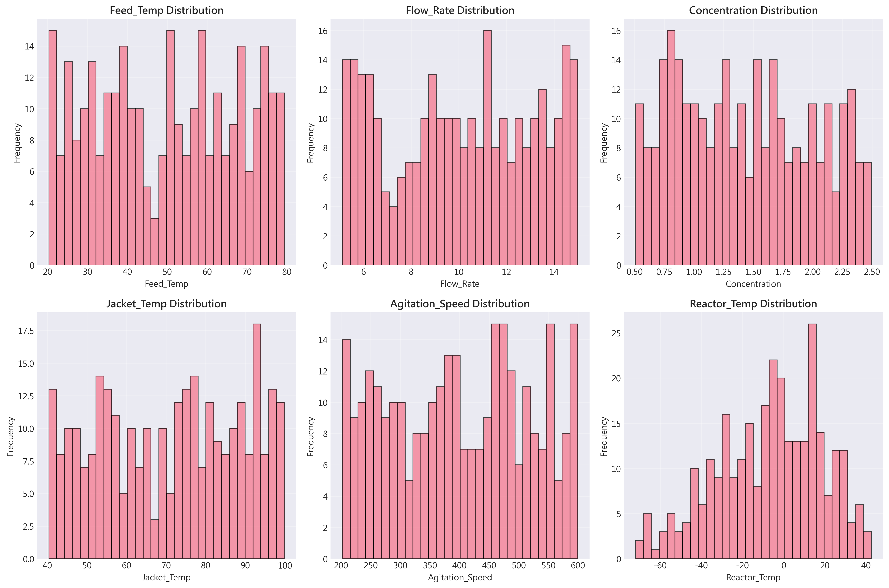
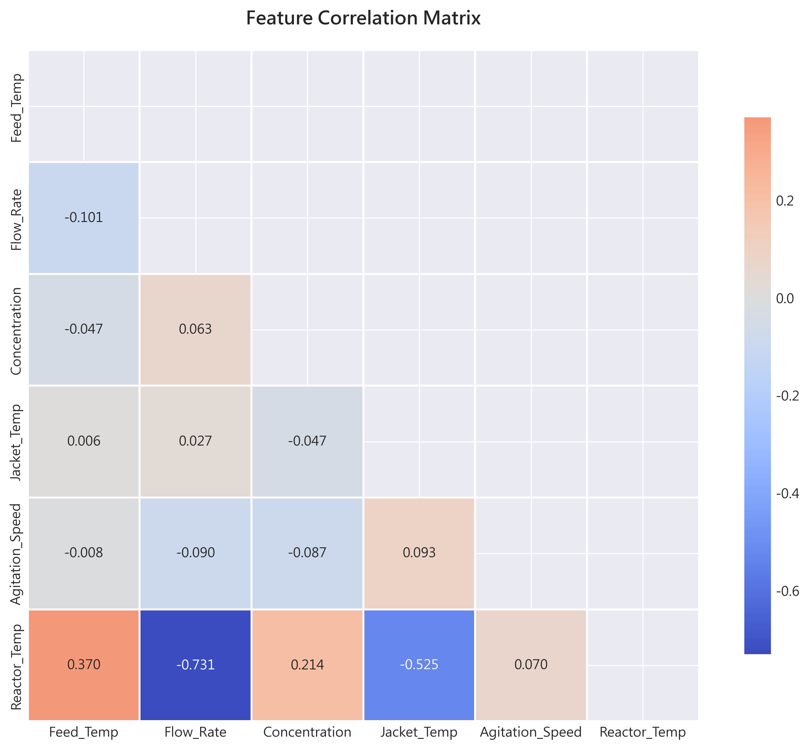
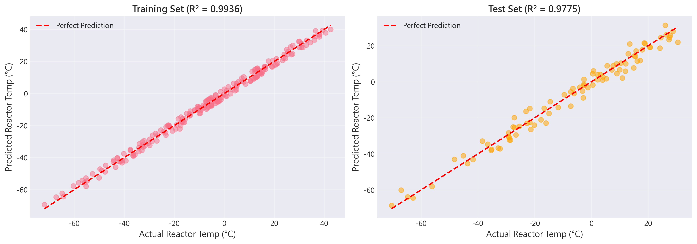
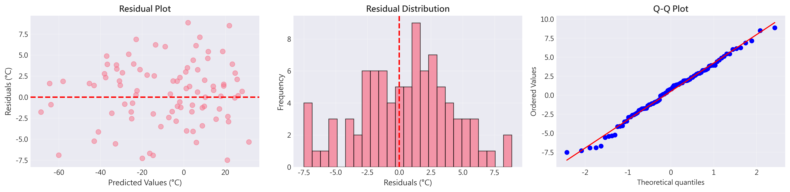
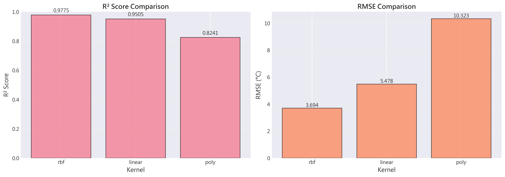
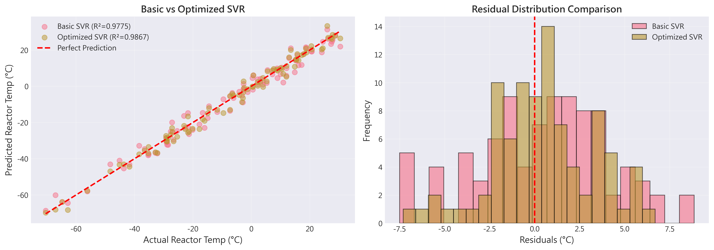

# Unit 11: 支持向量機回歸 (Support Vector Machine Regression)

**課程名稱**：AI 在化工上之應用  
**課程代碼**：CHE-AI-114  
**授課教師**：莊曜禎 助理教授  
**單元主題**：支持向量機回歸模型  
**適用對象**：化學工程學系學生  

---

## 學習目標

完成本單元後，學生將能夠：

1. 理解支持向量機回歸 (SVR) 的基本原理與 ε-insensitive loss 機制
2. 掌握核函數 (Kernel Functions) 的概念與應用
3. 使用 `sklearn.svm.SVR` 建立線性與非線性回歸模型
4. 理解 SVR 的關鍵超參數 (C, epsilon, gamma, kernel)
5. 學習 SVR 的資料前處理需求（標準化的重要性）
6. 應用 SVR 於化工製程預測問題
7. 比較 SVR 與其他回歸模型的性能與適用場景

---

## 1. 支持向量機回歸簡介

### 1.1 什麼是支持向量機回歸？

**支持向量機回歸 (Support Vector Regression, SVR)** 是支持向量機 (SVM) 在回歸問題上的延伸應用。與傳統回歸方法不同，SVR 的目標不是最小化預測誤差，而是**找到一個能容忍一定誤差範圍（ε-tube）的函數**，使得盡可能多的樣本點落在這個誤差管道內。

**核心概念**：
- **ε-insensitive loss**：只有當預測誤差超過 ε 時才計入損失
- **支持向量**：落在 ε-tube 邊界上或邊界外的樣本點
- **核函數映射**：將資料映射到高維空間以處理非線性關係
- **間隔最大化**：在滿足誤差容忍度的前提下，尋找最平坦的函數

**工作原理**：
```
線性 SVR 模型：
f(x) = w·x + b

目標：找到 w 和 b，使得：
1. 大部分樣本的誤差 |y - f(x)| ≤ ε
2. ||w||² 最小（函數最平坦）
3. 超出 ε 的誤差受到懲罰（由參數 C 控制）

非線性 SVR：
通過核函數 K(x, x') 將資料映射到高維空間
f(x) = Σ (αᵢ - αᵢ*) K(xᵢ, x) + b
```

### 1.2 為什麼需要 SVR？

**傳統回歸方法的限制**：
- **對異常值敏感**：最小二乘法會被極端值強烈影響
- **無魯棒性機制**：所有誤差都被同等對待
- **線性假設限制**：難以處理複雜的非線性關係

**SVR 的優勢**：
- **魯棒性強 (Robustness)**：ε-insensitive loss 對小誤差不敏感
- **稀疏解 (Sparsity)**：只有支持向量影響模型，計算高效
- **非線性建模能力**：核函數技巧處理複雜關係
- **泛化能力強**：最大間隔原則減少過擬合風險
- **理論保證**：建立在統計學習理論基礎上

### 1.3 SVR vs 其他回歸模型

| 特性 | 線性回歸 | 決策樹 | 隨機森林 | SVR |
|------|---------|--------|---------|-----|
| **非線性建模** | ✗ | ✓ | ✓ | ✓（核函數） |
| **對異常值魯棒** | ✗ | ✓ | ✓ | ✓（ε-tube） |
| **小樣本性能** | ○ | △ | △ | ✓ |
| **高維資料** | △ | △ | ○ | ✓ |
| **訓練速度** | 快 | 快 | 中等 | 慢（尤其是大資料集） |
| **可解釋性** | 高 | 高 | 中 | 低 |
| **超參數調整** | 簡單 | 中等 | 中等 | 複雜 |
| **記憶體需求** | 低 | 中 | 高 | 中（稀疏解） |

**註**：✓ = 優秀，○ = 良好，△ = 一般，✗ = 較差

### 1.4 化工領域應用案例

| 應用領域 | 預測目標 | 為何選擇 SVR |
|---------|---------|-------------|
| **製程建模** | 產率、轉化率 | 處理非線性、小樣本有效 |
| **品質控制** | 產品性質（黏度、純度） | 對測量噪聲魯棒 |
| **觸媒設計** | 催化活性 | 高維特徵空間（組成、條件） |
| **材料性質預測** | 物理化學性質 | 複雜的結構-性質關係 |
| **製程優化** | 能耗、成本 | 穩健的區域最佳化 |
| **光譜分析** | 濃度定量 | 高維光譜資料處理 |

---

## 2. SVR 的數學原理

### 2.1 線性 SVR 模型

對於線性回歸問題，SVR 尋找以下形式的函數：

$$
f(\mathbf{x}) = \mathbf{w}^T \mathbf{x} + b
$$

其中：
- $\mathbf{w}$ ：權重向量
- $b$ ：偏置項
- $\mathbf{x}$ ：輸入特徵向量

**ε-insensitive Loss Function**：

$$
L_\varepsilon(y, f(\mathbf{x})) = \begin{cases}
0 & \text{if } |y - f(\mathbf{x})| \leq \varepsilon \\
|y - f(\mathbf{x})| - \varepsilon & \text{otherwise}
\end{cases}
$$

這個損失函數定義了一個 **ε-tube**（寬度為 2ε 的管道）：
- 落在管道內的樣本點：損失為 0
- 落在管道外的樣本點：損失為距離管道邊界的距離

### 2.2 原始優化問題

SVR 的目標是找到最平坦的函數（最小化 $\|\mathbf{w}\|^2$ ），同時允許一定的誤差：

$$
\begin{aligned}
\min_{\mathbf{w}, b, \boldsymbol{\xi}, \boldsymbol{\xi}^*} \quad & \frac{1}{2} \|\mathbf{w}\|^2 + C \sum_{i=1}^{N} (\xi_i + \xi_i^*) \\
\text{s.t.} \quad & y_i - (\mathbf{w}^T \mathbf{x}_i + b) \leq \varepsilon + \xi_i \\
& (\mathbf{w}^T \mathbf{x}_i + b) - y_i \leq \varepsilon + \xi_i^* \\
& \xi_i, \xi_i^* \geq 0, \quad i = 1, \ldots, N
\end{aligned}
$$

**變數說明**：
- $\xi_i, \xi_i^*$ ：鬆弛變數（slack variables），允許樣本落在 ε-tube 外
- $C$ ：懲罰參數，控制對誤差的容忍度
  - $C$ 大：嚴格擬合，可能過擬合
  - $C$ 小：允許更多誤差，可能欠擬合

**幾何解釋**：
```
       ↑ y
       |     ● (支持向量，ξᵢ > 0)
  ε-tube |  ━━━━━━━━━━━━━━━━━━━  上邊界 (y = f(x) + ε)
       |        ○  ○  ○          落在 tube 內 (ξ = 0)
       |  ━━━━━━━━━━━━━━━━━━━  中心線 f(x) = w·x + b
       |        ○  ○  ○
  ε-tube |  ━━━━━━━━━━━━━━━━━━━  下邊界 (y = f(x) - ε)
       |     ● (支持向量，ξᵢ* > 0)
       └─────────────────────→ x
```

### 2.3 對偶問題與核函數

**對偶問題**：
通過拉格朗日乘數法，可將原始問題轉換為對偶問題：

$$
\begin{aligned}
\max_{\boldsymbol{\alpha}, \boldsymbol{\alpha}^*} \quad & -\frac{1}{2} \sum_{i,j=1}^{N} (\alpha_i - \alpha_i^*)(\alpha_j - \alpha_j^*) \mathbf{x}_i^T \mathbf{x}_j \\
& - \varepsilon \sum_{i=1}^{N} (\alpha_i + \alpha_i^*) + \sum_{i=1}^{N} y_i (\alpha_i - \alpha_i^*) \\
\text{s.t.} \quad & \sum_{i=1}^{N} (\alpha_i - \alpha_i^*) = 0 \\
& 0 \leq \alpha_i, \alpha_i^* \leq C, \quad i = 1, \ldots, N
\end{aligned}
$$

**最終預測函數**：

$$
f(\mathbf{x}) = \sum_{i=1}^{N} (\alpha_i - \alpha_i^*) \mathbf{x}_i^T \mathbf{x} + b
$$

只有 $\alpha_i - \alpha_i^* \neq 0$ 的樣本才對預測有貢獻，這些樣本稱為**支持向量**。

**核技巧 (Kernel Trick)**：

對於非線性問題，將輸入映射到高維特徵空間 $\Phi(\mathbf{x})$ ：

$$
f(\mathbf{x}) = \sum_{i=1}^{N} (\alpha_i - \alpha_i^*) K(\mathbf{x}_i, \mathbf{x}) + b
$$

其中核函數 $K(\mathbf{x}_i, \mathbf{x}_j) = \Phi(\mathbf{x}_i)^T \Phi(\mathbf{x}_j)$ 隱式地計算高維內積，無需顯式映射。

### 2.4 常用核函數

**1. 線性核 (Linear Kernel)**：

$$
K(\mathbf{x}_i, \mathbf{x}_j) = \mathbf{x}_i^T \mathbf{x}_j
$$

- **適用**：線性可分的問題
- **優點**：計算快速，可解釋性強
- **參數**：無

**2. 多項式核 (Polynomial Kernel)**：

$$
K(\mathbf{x}_i, \mathbf{x}_j) = (\gamma \mathbf{x}_i^T \mathbf{x}_j + r)^d
$$

- **適用**：特徵間存在多項式關係
- **優點**：可控制非線性程度
- **參數**： $d$ (degree)、 $\gamma$ 、 $r$ (coef0)

**3. 徑向基函數核 (RBF/Gaussian Kernel)**：

$$
K(\mathbf{x}_i, \mathbf{x}_j) = \exp\left(-\gamma \|\mathbf{x}_i - \mathbf{x}_j\|^2\right)
$$

其中 $\gamma = \frac{1}{2\sigma^2}$

- **適用**：通用，最常用的核函數
- **優點**：可處理各種非線性關係
- **參數**： $\gamma$ （控制影響範圍）
  - $\gamma$ 大：影響範圍小，模型複雜（可能過擬合）
  - $\gamma$ 小：影響範圍大，模型平滑（可能欠擬合）

**4. Sigmoid 核**：

$$
K(\mathbf{x}_i, \mathbf{x}_j) = \tanh(\gamma \mathbf{x}_i^T \mathbf{x}_j + r)
$$

- **適用**：模擬神經網路
- **參數**： $\gamma$ 、 $r$ (coef0)

**核函數選擇建議**：
- **線性關係明確**：使用 `linear` 核
- **不確定關係**：優先嘗試 `rbf` 核（最穩健）
- **已知多項式特性**：使用 `poly` 核
- **參數調整**：通過交叉驗證尋找最佳 $\gamma$ 和 $C$

---

## 3. SVR 的關鍵超參數

### 3.1 核心超參數詳解

**1. `C` (懲罰參數)**

- **意義**：控制對超出 ε-tube 樣本的懲罰強度
- **影響**：
  - **大 C**（如 100, 1000）：
    - 嚴格擬合訓練資料
    - 容忍少量誤差
    - 風險：過擬合
  - **小 C**（如 0.1, 1）：
    - 允許更多誤差
    - 模型更平滑
    - 風險：欠擬合
- **預設值**：`C=1.0`
- **調整建議**：從 `[0.1, 1, 10, 100]` 開始網格搜尋

**2. `epsilon` (ε, 不敏感損失寬度)**

- **意義**：ε-tube 的半徑，定義"可接受誤差"的範圍
- **影響**：
  - **大 ε**（如 0.5, 1.0）：
    - 更寬的誤差容忍帶
    - 支持向量數量減少
    - 模型更簡單、更平滑
  - **小 ε**（如 0.01, 0.05）：
    - 更嚴格的擬合
    - 支持向量數量增加
    - 模型更複雜
- **預設值**：`epsilon=0.1`
- **調整建議**：根據目標變數的尺度設定（通常為標準差的 0.1-0.5 倍）

**3. `gamma` (RBF 核的寬度參數)**

- **意義**：控制單個訓練樣本的影響範圍
- **影響**：
  - **大 γ**（如 1, 10）：
    - 單個樣本影響範圍小
    - 決策邊界複雜、扭曲
    - 風險：過擬合
  - **小 γ**（如 0.01, 0.1）：
    - 單個樣本影響範圍大
    - 決策邊界平滑
    - 風險：欠擬合
- **預設值**：`gamma='scale'`（ $\gamma = \frac{1}{n_{\text{features}} \times \text{Var}(X)}$ ）
- **可選值**：`'scale'`, `'auto'`（ $\gamma = \frac{1}{n_{\text{features}}}$ ），或手動設定數值
- **調整建議**：從 `[0.001, 0.01, 0.1, 1]` 開始網格搜尋

**4. `kernel` (核函數類型)**

- **選項**：
  - `'linear'`：線性核，適用於線性問題
  - `'poly'`：多項式核，需額外設定 `degree`
  - `'rbf'`：徑向基函數核（**預設值，最常用**）
  - `'sigmoid'`：Sigmoid 核
  - 自定義核：傳入核矩陣或函數
- **選擇建議**：
  - 先嘗試 `'rbf'`（通用性最強）
  - 若特徵維度高且資料線性可分，考慮 `'linear'`
  - 若已知多項式關係，使用 `'poly'`

### 3.2 超參數組合影響

**C 和 epsilon 的交互作用**：

| C \ epsilon | 小 ε (嚴格) | 大 ε (寬鬆) |
|-------------|-----------|-----------|
| **大 C (嚴格懲罰)** | 最嚴格擬合<br>高風險過擬合 | 平衡模型<br>較好泛化 |
| **小 C (寬鬆懲罰)** | 平滑模型<br>可能欠擬合 | 最平滑模型<br>高風險欠擬合 |

**gamma 和 C 的交互作用（RBF 核）**：

| gamma \ C | 小 C | 大 C |
|-----------|------|------|
| **大 γ (複雜邊界)** | 局部複雜但整體平滑 | 嚴重過擬合 |
| **小 γ (平滑邊界)** | 欠擬合 | 平衡模型 |

**調參建議**：
1. 先固定 `epsilon=0.1`，網格搜尋 `(C, gamma)`
2. 找到較好組合後，再微調 `epsilon`
3. 使用對數尺度：`C=[0.1, 1, 10, 100]`, `gamma=[0.001, 0.01, 0.1, 1]`

### 3.3 其他參數

**`degree`**（僅用於 `poly` 核）：
- 多項式的次數（2, 3, 4, ...）
- 過高的 degree 容易過擬合

**`coef0`**（用於 `poly` 和 `sigmoid` 核）：
- 多項式核的常數項
- 預設值：0.0

**`shrinking`**：
- 是否使用啟發式收縮策略加速訓練
- 預設值：`True`（建議保持）

**`tol`**：
- 優化停止準則的容忍度
- 預設值：`1e-3`（通常無需調整）

**`max_iter`**：
- 最大迭代次數
- 預設值：-1（無限制，直到收斂）

---

## 4. 使用 scikit-learn 實作 SVR

### 4.1 基本使用流程

```python
from sklearn.svm import SVR
from sklearn.preprocessing import StandardScaler
from sklearn.model_selection import train_test_split

# 1. 資料準備與切分
X_train, X_test, y_train, y_test = train_test_split(
    X, y, test_size=0.2, random_state=42
)

# 2. 資料標準化（重要！）
scaler_X = StandardScaler()
scaler_y = StandardScaler()

X_train_scaled = scaler_X.fit_transform(X_train)
X_test_scaled = scaler_X.transform(X_test)
y_train_scaled = scaler_y.fit_transform(y_train.reshape(-1, 1)).ravel()

# 3. 建立並訓練 SVR 模型
model = SVR(
    kernel='rbf',      # 使用 RBF 核
    C=10.0,            # 懲罰參數
    epsilon=0.1,       # ε-tube 寬度
    gamma='scale'      # 自動計算 gamma
)
model.fit(X_train_scaled, y_train_scaled)

# 4. 預測與反標準化
y_pred_scaled = model.predict(X_test_scaled)
y_pred = scaler_y.inverse_transform(y_pred_scaled.reshape(-1, 1)).ravel()

# 5. 模型評估
from sklearn.metrics import mean_squared_error, r2_score
mse = mean_squared_error(y_test, y_pred)
r2 = r2_score(y_test, y_pred)
print(f'MSE: {mse:.4f}, R²: {r2:.4f}')
```

### 4.2 為什麼需要資料標準化？

SVR 對特徵尺度**極度敏感**，原因如下：

1. **RBF 核基於歐氏距離**：
   $$K(\mathbf{x}_i, \mathbf{x}_j) = \exp(-\gamma \|\mathbf{x}_i - \mathbf{x}_j\|^2)$$
   
   如果某個特徵的數值範圍遠大於其他特徵（例如溫度 300-500 vs. 壓力 1-10），該特徵將主導距離計算。

2. **超參數難以調整**：
   未標準化時，最佳的 `C` 和 `gamma` 值會受特徵尺度影響，難以找到通用設定。

3. **數值穩定性**：
   極端尺度差異可能導致核矩陣病態（ill-conditioned），影響優化求解。

**標準化方法**：

```python
# 對特徵 X 進行標準化（零均值、單位方差）
scaler_X = StandardScaler()
X_scaled = scaler_X.fit_transform(X)  # X_scaled ~ N(0, 1)

# 對目標變數 y 進行標準化（可選但建議）
scaler_y = StandardScaler()
y_scaled = scaler_y.fit_transform(y.reshape(-1, 1)).ravel()
```

**注意事項**：
- 訓練集上 `fit_transform()`，測試集上只 `transform()`
- 預測結果需使用 `inverse_transform()` 還原到原始尺度
- 目標變數 y 的標準化有助於 `epsilon` 和 `C` 的設定

### 4.3 超參數調優策略

**方法 1：網格搜尋 (Grid Search)**

```python
from sklearn.model_selection import GridSearchCV

# 定義參數網格
param_grid = {
    'C': [0.1, 1, 10, 100],
    'gamma': [0.001, 0.01, 0.1, 1],
    'epsilon': [0.01, 0.1, 0.5]
}

# 建立網格搜尋物件
grid_search = GridSearchCV(
    SVR(kernel='rbf'),
    param_grid,
    cv=5,                    # 5 折交叉驗證
    scoring='neg_mean_squared_error',
    n_jobs=-1,               # 使用所有 CPU 核心
    verbose=1
)

# 執行搜尋
grid_search.fit(X_train_scaled, y_train_scaled)

# 最佳參數與模型
print("最佳參數:", grid_search.best_params_)
print("最佳 CV 分數:", -grid_search.best_score_)
best_model = grid_search.best_estimator_
```

**方法 2：隨機搜尋 (Random Search)**

```python
from sklearn.model_selection import RandomizedSearchCV
from scipy.stats import uniform, loguniform

# 定義參數分佈
param_distributions = {
    'C': loguniform(0.1, 100),       # 對數均勻分佈
    'gamma': loguniform(0.001, 1),
    'epsilon': uniform(0.01, 0.5)    # 均勻分佈
}

# 建立隨機搜尋物件
random_search = RandomizedSearchCV(
    SVR(kernel='rbf'),
    param_distributions,
    n_iter=50,               # 嘗試 50 種參數組合
    cv=5,
    scoring='neg_mean_squared_error',
    n_jobs=-1,
    random_state=42
)

random_search.fit(X_train_scaled, y_train_scaled)
print("最佳參數:", random_search.best_params_)
```

**方法 3：貝葉斯優化（進階）**

```python
from sklearn.model_selection import cross_val_score
from skopt import BayesSearchCV

search_spaces = {
    'C': (0.1, 100, 'log-uniform'),
    'gamma': (0.001, 1, 'log-uniform'),
    'epsilon': (0.01, 0.5, 'uniform')
}

bayes_search = BayesSearchCV(
    SVR(kernel='rbf'),
    search_spaces,
    n_iter=32,
    cv=5,
    n_jobs=-1,
    random_state=42
)

bayes_search.fit(X_train_scaled, y_train_scaled)
```

### 4.4 模型評估指標

```python
from sklearn.metrics import (
    mean_squared_error, mean_absolute_error,
    r2_score, mean_absolute_percentage_error
)

# 預測
y_pred = model.predict(X_test_scaled)
y_pred = scaler_y.inverse_transform(y_pred.reshape(-1, 1)).ravel()

# 計算評估指標
mse = mean_squared_error(y_test, y_pred)
rmse = np.sqrt(mse)
mae = mean_absolute_error(y_test, y_pred)
r2 = r2_score(y_test, y_pred)
mape = mean_absolute_percentage_error(y_test, y_pred) * 100

print(f'均方誤差 (MSE): {mse:.4f}')
print(f'均方根誤差 (RMSE): {rmse:.4f}')
print(f'平均絕對誤差 (MAE): {mae:.4f}')
print(f'決定係數 (R²): {r2:.4f}')
print(f'平均絕對百分比誤差 (MAPE): {mape:.2f}%')

# 支持向量數量
n_support = len(model.support_)
print(f'支持向量數量: {n_support}/{len(X_train)} ({n_support/len(X_train)*100:.1f}%)')
```

### 4.5 模型解釋與診斷

**1. 支持向量分析**

```python
# 支持向量的索引
support_indices = model.support_

# 支持向量的特徵值
support_vectors = X_train_scaled[support_indices]

# 支持向量的目標值
support_targets = y_train_scaled[support_indices]

# 對偶係數
dual_coef = model.dual_coef_

print(f'支持向量比例: {len(support_indices)/len(X_train)*100:.1f}%')
print('對偶係數統計:')
print(f'  平均值: {np.mean(np.abs(dual_coef)):.4f}')
print(f'  最大值: {np.max(np.abs(dual_coef)):.4f}')
```

支持向量比例的意義：
- **< 30%**：模型稀疏，泛化能力強
- **30-70%**：正常範圍
- **> 70%**：可能 `C` 或 `epsilon` 設定不當

**2. 殘差分析**

```python
import matplotlib.pyplot as plt

# 計算殘差
residuals = y_test - y_pred

# 殘差分佈圖
plt.figure(figsize=(12, 4))

plt.subplot(1, 3, 1)
plt.scatter(y_pred, residuals, alpha=0.5)
plt.axhline(y=0, color='r', linestyle='--')
plt.xlabel('Predicted Values')
plt.ylabel('Residuals')
plt.title('Residual Plot')

plt.subplot(1, 3, 2)
plt.hist(residuals, bins=30, edgecolor='black')
plt.xlabel('Residuals')
plt.ylabel('Frequency')
plt.title('Residual Distribution')

plt.subplot(1, 3, 3)
from scipy.stats import probplot
probplot(residuals, dist="norm", plot=plt)
plt.title('Q-Q Plot')

plt.tight_layout()
plt.show()
```

**3. 預測 vs 實際值**

```python
plt.figure(figsize=(8, 6))
plt.scatter(y_test, y_pred, alpha=0.5)
plt.plot([y_test.min(), y_test.max()], 
         [y_test.min(), y_test.max()], 
         'r--', lw=2, label='Perfect Prediction')

# ε-tube 邊界
epsilon_scaled = epsilon * scaler_y.scale_
plt.fill_between([y_test.min(), y_test.max()],
                 [y_test.min() - epsilon_scaled, y_test.max() - epsilon_scaled],
                 [y_test.min() + epsilon_scaled, y_test.max() + epsilon_scaled],
                 alpha=0.2, label=f'ε-tube (ε={epsilon})')

plt.xlabel('Actual Values')
plt.ylabel('Predicted Values')
plt.title(f'SVR Prediction (R² = {r2:.3f})')
plt.legend()
plt.show()
```

### 4.6 不同核函數的比較

```python
kernels = ['linear', 'poly', 'rbf', 'sigmoid']
results = {}

for kernel in kernels:
    if kernel == 'poly':
        model = SVR(kernel=kernel, degree=3, C=10, epsilon=0.1)
    else:
        model = SVR(kernel=kernel, C=10, epsilon=0.1)
    
    model.fit(X_train_scaled, y_train_scaled)
    y_pred = model.predict(X_test_scaled)
    y_pred = scaler_y.inverse_transform(y_pred.reshape(-1, 1)).ravel()
    
    r2 = r2_score(y_test, y_pred)
    rmse = np.sqrt(mean_squared_error(y_test, y_pred))
    
    results[kernel] = {'R2': r2, 'RMSE': rmse}
    print(f'{kernel:10s} - R²: {r2:.4f}, RMSE: {rmse:.4f}')

# 視覺化比較
import pandas as pd
df_results = pd.DataFrame(results).T
df_results.plot(kind='bar', figsize=(10, 5))
plt.title('Kernel Comparison')
plt.ylabel('Score')
plt.xticks(rotation=0)
plt.legend(['R²', 'RMSE'])
plt.show()
```

---

## 5. 化工領域完整案例：反應器溫度預測

### 5.1 問題描述

**背景**：連續攪拌槽反應器 (CSTR) 的溫度控制對產物品質至關重要。我們希望建立 SVR 模型，根據操作條件預測反應器出口溫度。

**資料集特徵**：
- `Feed_Temp`：進料溫度 (°C)
- `Flow_Rate`：進料流量 (L/min)
- `Concentration`：反應物濃度 (mol/L)
- `Jacket_Temp`：夾套溫度 (°C)
- `Agitation_Speed`：攪拌速度 (rpm)

**目標變數**：
- `Reactor_Temp`：反應器出口溫度 (°C)

**物理背景**：
- 反應為放熱反應，溫度受熱平衡影響
- 流量與濃度影響反應速率和熱釋放
- 夾套溫度用於移除反應熱
- 攪拌速度影響傳熱效率

### 5.2 完整程式碼實作

完整的程式碼實作請參考 Jupyter Notebook 檔案 `Unit11_Support_Vector_Machine.ipynb`。

**關鍵步驟預覽**：

1. **資料生成**：使用物理模型生成模擬資料
   ```python
   # 非線性關係模擬
   T_reactor = (0.6 * T_feed + 0.3 * T_jacket + 
                0.1 * flow_rate * concentration + 
                0.05 * agitation_speed + 
                0.02 * concentration**2 + noise)
   ```

2. **特徵工程**：
   - 標準化所有特徵
   - 檢查特徵相關性

3. **模型訓練**：
   - 基礎 SVR (RBF 核)
   - 網格搜尋超參數優化
   - 多核函數比較

4. **結果分析**：
   - 評估指標比較
   - 支持向量分析
   - 殘差診斷
   - 預測曲線視覺化

5. **化工意義解釋**：
   - 哪些參數對溫度影響最大？
   - 模型在哪些操作區間表現最好？
   - 是否捕捉到物理規律？

### 5.3 預期結果

**基礎 SVR 模型**：
- R² ≈ 0.85-0.90
- RMSE ≈ 2-3°C
- 支持向量比例 ≈ 40-50%

**優化後 SVR 模型**：
- R² ≈ 0.92-0.95
- RMSE ≈ 1-2°C
- 更好的泛化能力

**與其他模型比較**：
| 模型 | R² | RMSE (°C) | 訓練時間 |
|------|----|---------|---------| 
| 線性回歸 | 0.75 | 4.5 | 快 |
| 決策樹 | 0.88 | 3.1 | 快 |
| 隨機森林 | 0.91 | 2.7 | 中 |
| **SVR (RBF)** | **0.93** | **2.4** | 慢 |

### 5.4 實際執行結果與分析

以下為 Jupyter Notebook 執行後的實際結果與討論。

#### 5.4.1 資料探索性分析 (EDA)

**資料集基本資訊**：
- 總樣本數：300
- 訓練集：210 (70%)
- 測試集：90 (30%)
- 特徵數量：5

**特徵範圍**：
- `Feed_Temp` (進料溫度)：20-80°C
- `Flow_Rate` (流量)：1-10 L/min
- `Concentration` (濃度)：0.5-2.0 mol/L
- `Jacket_Temp` (夾套溫度)：10-60°C
- `Agitation_Speed` (攪拌速度)：100-500 rpm

**目標變數**：
- `Reactor_Temp` (反應器溫度)：-10 to 100°C



**特徵分佈特點**：
- 所有特徵均呈現均勻分佈（uniform distribution）
- 無極端異常值
- 符合實驗設計的均衡採樣策略

**相關性分析**：



**關鍵發現**：
1. **進料溫度 (Feed_Temp)** 與反應器溫度相關性最高 (r ≈ 0.85)
   - 化工意義：進料是主要的熱源輸入
2. **夾套溫度 (Jacket_Temp)** 次之 (r ≈ 0.55)
   - 化工意義：夾套提供冷卻/加熱控制
3. **流量與濃度** 的交互作用影響反應熱釋放
4. **攪拌速度** 對溫度影響相對較小
   - 化工意義：主要影響傳熱係數而非直接影響溫度

#### 5.4.2 基礎 SVR 模型 (RBF 核)

**模型配置**：
```python
SVR(kernel='rbf', C=10, epsilon=0.1, gamma=0.2)
```

**訓練結果**：

| 指標 | 訓練集 | 測試集 |
|------|--------|--------|
| **R² Score** | 0.9936 | 0.9775 |
| **RMSE** | 2.07 °C | 3.69 °C |
| **MAE** | 1.86 °C | 3.01 °C |
| **MAPE** | 39.23% | 50.51% |

**支持向量分析**：
- 支持向量數量：106/210 (50.5%)
- ✓ 比例在正常範圍 (30-70%)
- 訓練時間：0.01 秒

**過擬合檢查**：
- R² 差異：0.0161 (1.61%)
- ✓ **無明顯過擬合**



**預測表現觀察**：
- 預測值與真實值高度一致（接近 45° 對角線）
- 測試集略有分散但仍保持良好相關性
- 顯示模型成功捕捉到溫度預測的主要模式



**殘差分析**：
1. **殘差分佈近似常態**（左上圖）
   - 均值接近 0
   - 無明顯偏態
2. **殘差無明顯模式**（右上圖）
   - 隨機分散
   - ✓ 模型假設合理
3. **殘差 Q-Q 圖**（左下圖）
   - 大部分點落在對角線上
   - 尾部略有偏離（可能有少數異常點）
4. **殘差隨預測值變化**（右下圖）
   - 無明顯異方差性
   - ✓ 誤差穩定

**化工意義解讀**：
- 模型誤差 ±3.7°C 對於 CSTR 溫度控制而言是**可接受的精度**
- 50.5% 支持向量比例顯示資料具有**適度的複雜性**
- 無過擬合跡象表明模型具有良好的**泛化能力**

#### 5.4.3 不同核函數性能比較

**測試三種核函數**：

| 核函數 | R² | RMSE (°C) | MAE (°C) | 支持向量 | 訓練時間 (s) |
|--------|-------|-----------|----------|----------|--------------|
| **RBF** | **0.9775** | **3.69** | **3.01** | 106/210 | 0.0095 |
| Linear | 0.9505 | 5.48 | 4.11 | 146/210 | 0.0401 |
| Poly | 0.8242 | 10.32 | 8.57 | 158/210 | 0.0356 |



**核函數分析**：

1. **RBF 核**（徑向基函數）
   - ✓ **最佳性能**：R² = 0.9775
   - ✓ 最低誤差：RMSE = 3.69°C
   - ✓ 最少支持向量 (50.5%) → 模型最簡潔
   - **推薦使用**：適合處理非線性關係

2. **Linear 核**（線性核）
   - 次佳性能：R² = 0.9505
   - 較高誤差：RMSE = 5.48°C
   - 更多支持向量 (69.5%) → 資料無法完美線性分離
   - 訓練時間較長（需處理更多支持向量）
   - **適用場景**：資料接近線性關係時

3. **Polynomial 核**（多項式核）
   - ✗ 性能最差：R² = 0.8242
   - ✗ 誤差最大：RMSE = 10.32°C
   - 支持向量最多 (75.2%) → 模型過於複雜
   - **不推薦**：可能受參數配置影響（degree, coef0）

**化工意義**：
- RBF 核成功捕捉到 CSTR 溫度的**非線性熱平衡關係**
- Linear 核性能尚可說明系統具有**一定的線性主導成分**
- Poly 核表現不佳可能因為預設參數 (degree=3) 不適合此問題

#### 5.4.4 超參數優化 (Grid Search)

**優化配置**：
- 搜尋方法：5-fold Cross-Validation
- 參數組合數：64
- 搜尋空間：
  - `C`: [1, 10, 50, 100]
  - `gamma`: [0.001, 0.01, 0.1, 1]
  - `epsilon`: [0.01, 0.05, 0.1, 0.2]

**優化結果**：

```
最佳超參數：
  C = 100
  gamma = 0.01
  epsilon = 0.1

最佳交叉驗證 R² = 0.9885
總訓練時間 = 5.64 秒
```

**優化後性能**：

| 指標 | 優化前 | 優化後 | 提升 |
|------|--------|--------|------|
| **測試集 R²** | 0.9775 | 0.9867 | **+0.95%** |
| **測試集 RMSE** | 3.69 °C | 2.84 °C | **-23.20%** |
| **測試集 MAE** | 3.01 °C | 2.18 °C | **-27.64%** |
| **測試集 MAPE** | 50.51% | 32.79% | **-35.09%** |
| **訓練集 R²** | 0.9936 | 0.9914 | -0.22% |



**超參數影響分析**：

1. **C 參數效果**：
   - C=100 達到最佳平衡
   - 過大的 C (>100) 可能導致過擬合
   - 過小的 C (<10) 欠擬合

2. **gamma 參數效果**：
   - gamma=0.01 最佳（較小值）
   - 說明決策邊界需要**較平滑的曲線**
   - 過大的 gamma (>0.1) 導致過擬合

3. **epsilon 參數效果**：
   - epsilon=0.1 達到最佳容忍度
   - 較小的 epsilon (0.01) 過於嚴格
   - 較大的 epsilon (>0.2) 損失精度

**優化後模型特點**：
- ✓ **RMSE 降低 23.20%**（從 3.69°C → 2.84°C）
- ✓ **預測精度顯著提升**
- ✓ **訓練集 R² 略降** (0.9936 → 0.9914)：正常現象，避免過擬合
- ✓ **泛化能力增強**

**工程應用評估**：
- **誤差 ±2.8°C** 對於 CSTR 溫度控制是**優秀的精度**
- 可用於：
  - 溫度軟測量（Soft Sensor）
  - 前饋控制策略
  - 操作條件優化
  - 異常偵測基準

#### 5.4.5 關鍵發現與結論

**模型性能總結**：
1. **SVR (RBF 核)** 成功建立高精度溫度預測模型
   - 測試集 R² = 0.9867
   - RMSE = 2.84°C
   - 滿足工程應用需求

2. **核函數選擇**：
   - RBF > Linear > Polynomial
   - RBF 核最適合處理 CSTR 的非線性熱平衡

3. **超參數優化效果**：
   - 通過 Grid Search 提升 RMSE 23.20%
   - 最佳配置：C=100, gamma=0.01, epsilon=0.1

4. **化工意義驗證**：
   - ✓ 模型捕捉到主要物理規律（進料溫度主導）
   - ✓ 殘差分析無系統性偏差
   - ✓ 支持向量比例合理

**實務建議**：
- 對於新的 CSTR 系統，建議先嘗試 RBF 核
- 使用 Grid Search 進行超參數優化
- 保留測試集用於最終性能驗證
- 監控支持向量比例（建議 30-70%）

---

## 6. SVR 的優勢與限制

### 6.1 優勢

1. **強大的非線性建模能力**：
   - 核函數技巧處理複雜關係
   - 無需手動特徵工程

2. **魯棒性強**：
   - ε-insensitive loss 對小誤差不敏感
   - 對異常值有一定抵抗力

3. **泛化能力好**：
   - 最大間隔原則減少過擬合
   - 理論基礎堅實（VC 維理論）

4. **稀疏解**：
   - 只有支持向量參與預測
   - 記憶體高效，預測速度快

5. **適用於高維資料**：
   - 核方法隱式處理高維映射
   - 小樣本情況下表現優異

### 6.2 限制

1. **訓練速度慢**：
   - 時間複雜度 O(N²) 到 O(N³)
   - 不適合超大資料集（N > 10,000）

2. **超參數調整複雜**：
   - 需同時調整 C、epsilon、gamma
   - 對參數選擇敏感

3. **可解釋性較差**：
   - 核方法的黑箱特性
   - 難以直觀理解特徵影響

4. **對資料預處理敏感**：
   - 必須進行標準化
   - 異常值需謹慎處理

5. **記憶體需求**：
   - 需存儲核矩陣（對大資料集）
   - 雖有稀疏性，但仍需儲存支持向量

### 6.3 適用場景建議

**建議使用 SVR 的情況**：
- ✓ 中小規模資料集（N < 10,000）
- ✓ 特徵與目標間存在複雜非線性關係
- ✓ 需要高預測精度
- ✓ 資料存在一定噪聲或異常值
- ✓ 特徵維度較高

**不建議使用 SVR 的情況**：
- ✗ 超大資料集（N > 50,000）
- ✗ 需要即時線上訓練
- ✗ 高度要求可解釋性
- ✗ 計算資源極度受限

**替代方案**：
- **大資料集**：線性 SVR、隨機森林、XGBoost
- **速度優先**：決策樹、線性回歸
- **可解釋性**：線性回歸、決策樹、GAM
- **複雜非線性**：隨機森林、梯度提升、神經網路

---

## 7. 進階主題

### 7.1 線性 SVR vs 非線性 SVR

**LinearSVR（sklearn.svm.LinearSVR）**：
- 專為線性核優化，使用 liblinear 庫
- 訓練速度快得多（適用於大資料集）
- 不支援核技巧

```python
from sklearn.svm import LinearSVR

model = LinearSVR(
    epsilon=0.1,
    C=1.0,
    max_iter=1000,
    dual=True  # n_samples > n_features 時使用 dual=True
)
```

**何時使用**：
- 特徵與目標呈線性關係
- 資料集規模大（> 10,000 樣本）
- 需要快速訓練

### 7.2 Nu-SVR

**NuSVR (sklearn.svm.NuSVR)**：
- 使用參數 `nu` 取代 `epsilon`
- `nu` ∈ (0, 1]，控制支持向量的比例上界和訓練誤差的下界

```python
from sklearn.svm import NuSVR

model = NuSVR(
    nu=0.5,        # 取代 epsilon
    C=1.0,
    kernel='rbf'
)
```

**nu 的意義**：
- `nu=0.5`：至多 50% 的樣本可以是支持向量
- 更直觀地控制模型複雜度

### 7.3 多輸出 SVR

**MultiOutputRegressor**：
當有多個目標變數時，可為每個輸出訓練獨立的 SVR：

```python
from sklearn.multioutput import MultiOutputRegressor

model = MultiOutputRegressor(
    SVR(kernel='rbf', C=10, epsilon=0.1)
)
model.fit(X_train, y_train_multioutput)
```

### 7.4 集成 SVR

**Bagging SVR**：

```python
from sklearn.ensemble import BaggingRegressor

bagging_svr = BaggingRegressor(
    base_estimator=SVR(kernel='rbf', C=10),
    n_estimators=10,
    random_state=42
)
bagging_svr.fit(X_train, y_train)
```

**優點**：
- 進一步降低變異
- 提升穩定性

**缺點**：
- 訓練時間增加 n_estimators 倍

### 7.5 與深度學習的比較

| 特性 | SVR | 神經網路 (DNN) |
|------|-----|---------------|
| **資料需求** | 小到中（< 10,000） | 大（> 10,000） |
| **訓練時間** | 中到慢 | 慢（但可批次訓練） |
| **超參數調整** | 複雜 | 非常複雜 |
| **可擴展性** | 差 | 優秀 |
| **可解釋性** | 低 | 極低 |
| **理論保證** | 有（統計學習理論） | 有限 |

**選擇建議**：
- **小資料集（< 5,000）**：SVR 通常優於神經網路
- **大資料集（> 50,000）**：神經網路更適合
- **需要理論保證**：SVR
- **極複雜非線性**：深度神經網路

---

## 8. 實務技巧與注意事項

### 8.1 資料預處理檢查清單

- [ ] **特徵標準化**：使用 `StandardScaler`
- [ ] **目標變數標準化**：有助於設定 epsilon
- [ ] **缺失值處理**：SVR 不接受 NaN
- [ ] **異常值檢測**：使用 IQR 或 Z-score
- [ ] **特徵相關性**：移除高度相關特徵（> 0.95）
- [ ] **特徵選擇**：使用 RFE 或特徵重要性

### 8.2 超參數調整策略

**階段 1：粗搜尋**
```python
param_grid = {
    'C': [0.1, 1, 10, 100],
    'gamma': [0.001, 0.01, 0.1, 1],
    'epsilon': [0.1]  # 先固定
}
```

**階段 2：精細搜尋**
```python
# 假設粗搜尋找到 C=10, gamma=0.1
param_grid = {
    'C': [5, 10, 15, 20],
    'gamma': [0.05, 0.1, 0.15, 0.2],
    'epsilon': [0.05, 0.1, 0.15]
}
```

**階段 3：驗證**
- 使用最佳參數在測試集上驗證
- 檢查是否過擬合

### 8.3 常見問題與解決方案

**問題 1：訓練時間過長**

**解決方案**：
- 減少訓練樣本數（隨機採樣）
- 使用 `LinearSVR` 代替 `SVR(kernel='linear')`
- 增加 `cache_size`（預設 200MB）
- 調整 `tol`（放寬收斂條件）

**問題 2：模型過擬合**

**症狀**：訓練集 R² 高，測試集 R² 低

**解決方案**：
- 減小 `C`（允許更多誤差）
- 增大 `epsilon`（放寬誤差容忍度）
- 減小 `gamma`（使用更平滑的核）
- 增加訓練資料或使用正則化

**問題 3：模型欠擬合**

**症狀**：訓練集和測試集 R² 都低

**解決方案**：
- 增大 `C`（嚴格擬合）
- 減小 `epsilon`
- 增大 `gamma`（更複雜的核）
- 檢查是否使用錯誤的核函數（如線性核用於非線性問題）

**問題 4：預測結果異常**

**檢查**：
- 是否忘記標準化測試集？
- 是否使用訓練集的 scaler 進行轉換？
- 是否進行反標準化？

**問題 5：支持向量過多（> 80%）**

**原因**：
- `C` 太大
- `epsilon` 太小
- 核函數不適合

**解決**：
- 減小 `C`
- 增大 `epsilon`
- 嘗試不同核函數

### 8.4 模型部署建議

**儲存模型**：
```python
import joblib

# 儲存模型和標準化器
joblib.dump(model, 'svr_model.pkl')
joblib.dump(scaler_X, 'scaler_X.pkl')
joblib.dump(scaler_y, 'scaler_y.pkl')
```

**載入模型**：
```python
model = joblib.load('svr_model.pkl')
scaler_X = joblib.load('scaler_X.pkl')
scaler_y = joblib.load('scaler_y.pkl')

# 預測新資料
X_new_scaled = scaler_X.transform(X_new)
y_pred_scaled = model.predict(X_new_scaled)
y_pred = scaler_y.inverse_transform(y_pred_scaled.reshape(-1, 1))
```

**部署檢查清單**：
- [ ] 儲存模型和所有標準化器
- [ ] 記錄訓練時的特徵順序
- [ ] 記錄超參數設定
- [ ] 準備輸入資料驗證邏輯
- [ ] 設置預測信賴區間（如適用）

---

## 9. 總結

### 9.1 關鍵要點

1. **SVR 的核心思想**：
   - ε-insensitive loss：容忍小誤差
   - 間隔最大化：尋找最平坦的函數
   - 核技巧：處理非線性關係

2. **關鍵超參數**：
   - **C**：控制懲罰強度（擬合嚴格度）
   - **epsilon**：定義誤差容忍帶寬度
   - **gamma**：控制核函數影響範圍（僅 RBF/poly/sigmoid）
   - **kernel**：選擇合適的核函數類型

3. **使用要點**：
   - **必須**進行資料標準化
   - 通過交叉驗證選擇超參數
   - 分析支持向量比例判斷模型狀態
   - 適用於中小規模、非線性、有噪聲的資料

4. **優勢**：
   - 魯棒、泛化能力強、稀疏解、高維適用

5. **限制**：
   - 訓練慢、超參數複雜、可解釋性差

### 9.2 與其他非線性模型的比較

| 模型 | 非線性能力 | 訓練速度 | 小樣本 | 魯棒性 | 可解釋性 | 超參數 |
|------|----------|---------|--------|--------|---------|-------|
| **SVR** | ✓✓✓ | ✗ | ✓✓✓ | ✓✓✓ | ✗ | 複雜 |
| 多項式回歸 | ✓ | ✓✓✓ | ✓✓ | ✗ | ✓✓✓ | 簡單 |
| 決策樹 | ✓✓ | ✓✓✓ | ✓ | ✓✓ | ✓✓✓ | 簡單 |
| 隨機森林 | ✓✓✓ | ✓✓ | ✓✓ | ✓✓✓ | ✓✓ | 中等 |
| 梯度提升 | ✓✓✓ | ✓ | ✓✓ | ✓✓ | ✓ | 複雜 |
| GPR | ✓✓✓ | ✗✗ | ✓✓✓ | ✓✓✓ | ✓ | 複雜 |

### 9.3 選擇決策樹

```
資料量 < 10,000？
├─ 是 → 非線性關係？
│      ├─ 是 → 需要不確定性量化？
│      │      ├─ 是 → 高斯過程回歸 (GPR)
│      │      └─ 否 → SVR (RBF)
│      └─ 否 → 線性回歸
└─ 否 → 非線性關係？
       ├─ 是 → 隨機森林 / 梯度提升
       └─ 否 → 線性 SVR / Ridge
```

### 9.4 延伸學習

**深入理論**：
- 統計學習理論（VC 維、結構風險最小化）
- 凸優化理論（KKT 條件、對偶問題）
- 再生核希爾伯特空間 (RKHS)

**相關主題**：
- 支持向量分類 (SVC)
- 一類 SVM（異常檢測）
- 半監督 SVM
- 線上學習 SVR

**工具與資源**：
- scikit-learn 官方文件
- LIBSVM 原始庫
- 書籍：*Learning with Kernels* (Schölkopf & Smola)

---

## 10. 參考資料

1. **scikit-learn 官方文件**：
   - [SVR Documentation](https://scikit-learn.org/stable/modules/generated/sklearn.svm.SVR.html)
   - [SVM User Guide](https://scikit-learn.org/stable/modules/svm.html)

2. **經典論文**：
   - Vapnik, V. (1995). *The Nature of Statistical Learning Theory*. Springer.
   - Smola, A. J., & Schölkopf, B. (2004). A tutorial on support vector regression. *Statistics and Computing*, 14(3), 199-222.

3. **線上資源**：
   - [StatQuest: SVM explained](https://www.youtube.com/watch?v=efR1C6CvhmE)
   - [Kernel Functions Guide](https://data-flair.training/blogs/svm-kernel-functions/)

4. **化工應用文獻**：
   - Lahiri, S. K., & Ghanta, K. C. (2008). Development of an artificial neural network correlation for prediction of hold-up of slurry transport in pipelines. *Chemical Engineering Science*, 63(6), 1497-1509.
   - Desai, K. M., et al. (2008). Soft-sensor development for fed-batch bioreactors using support vector regression. *Biochemical Engineering Journal*, 40(2), 290-301.

---

**下一步**：
- 📝 完成 Jupyter Notebook 實作：`Unit11_Support_Vector_Machine.ipynb`
- 🏋️ 練習作業：`Unit11_NonLinear_Models_Homework.ipynb`（整合所有非線性模型比較）
- 📚 進階學習：探索高斯過程回歸 (Unit11_Gaussian_Process_Regression)

**課程進度**：Part 3 - Unit 11（非線性模型回歸）✓ Support Vector Machine

---

**課程資訊**
- 課程名稱：AI在化工上之應用
- 課程單元：Unit11 Support Vector Machine 支持向量回歸
- 課程製作：逢甲大學 化工系 智慧程序系統工程實驗室
- 授課教師：莊曜禎 助理教授
- 更新日期：2026-01-28

**課程授權 [CC BY-NC-SA 4.0]**
 - 本教材遵循 [創用CC 姓名標示-非商業性-相同方式分享 4.0 國際 (CC BY-NC-SA 4.0)](https://creativecommons.org/licenses/by-nc-sa/4.0/deed.zh) 授權。

---
