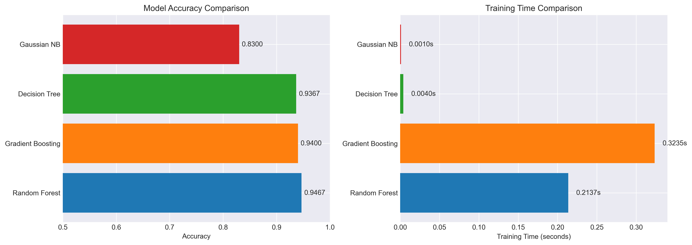
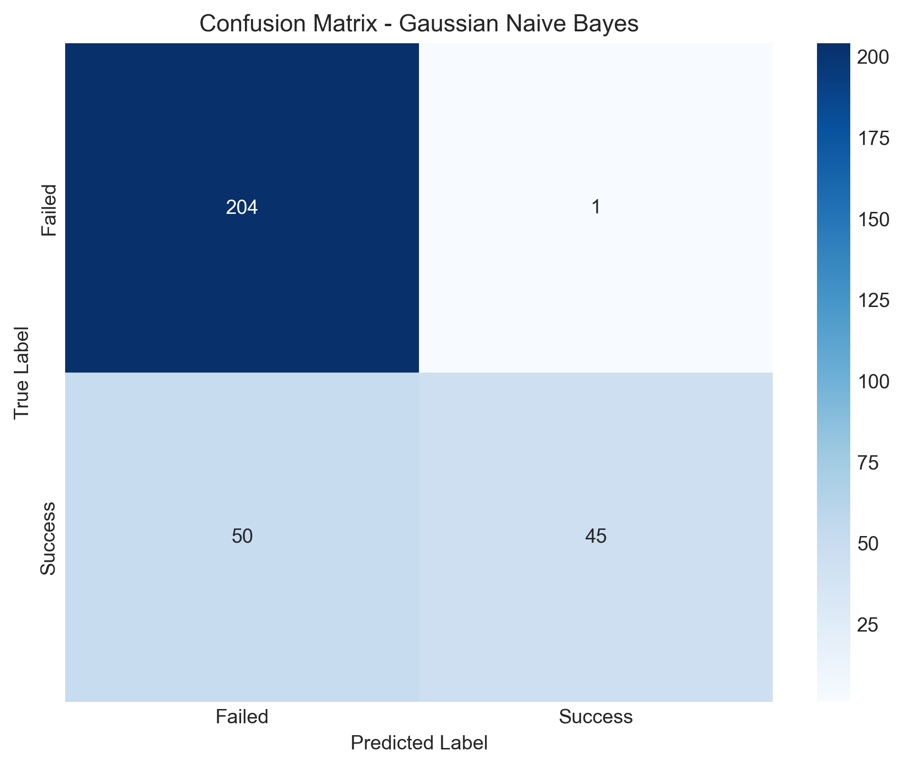
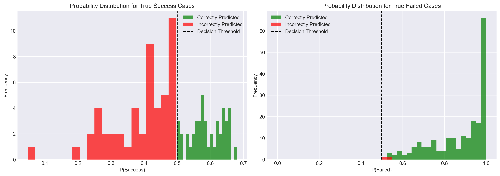
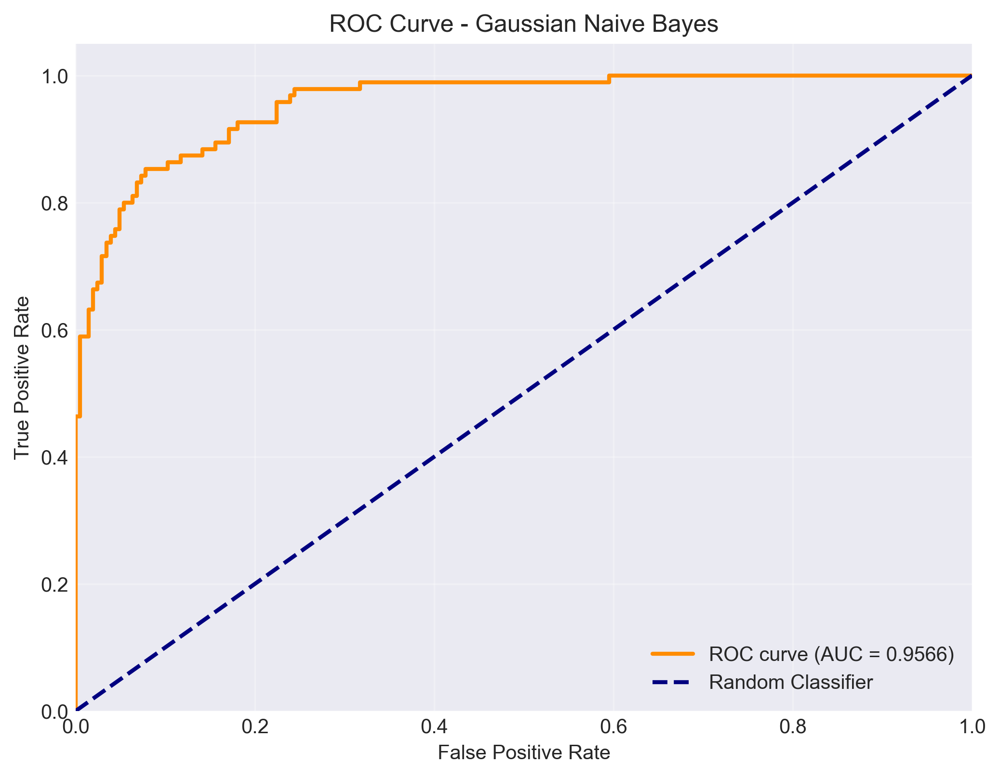
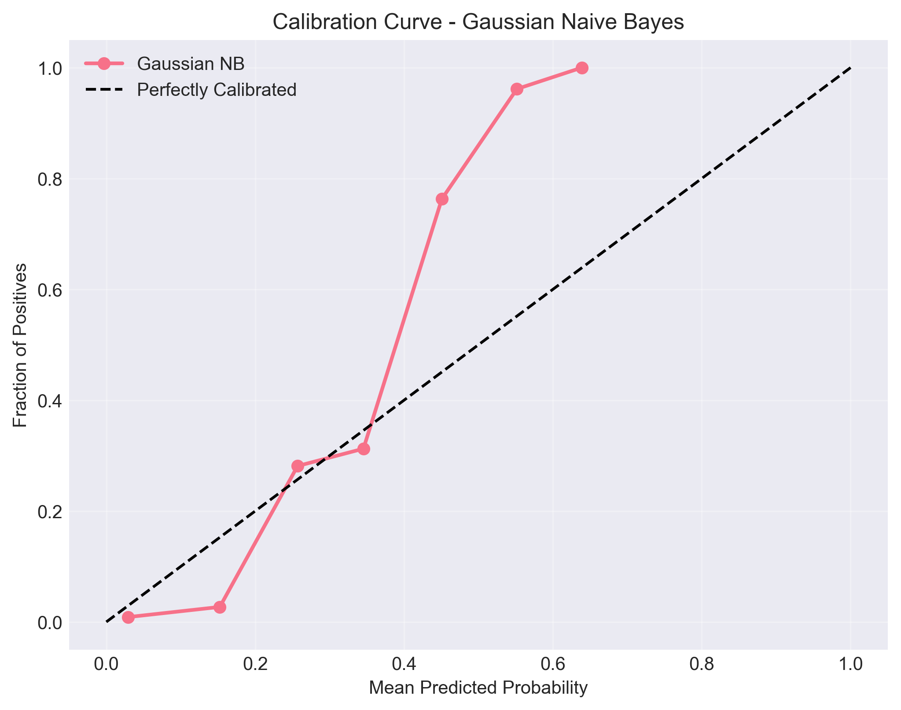
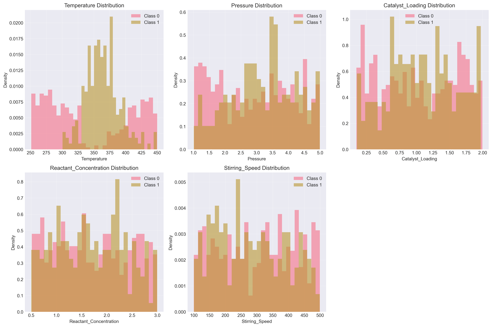
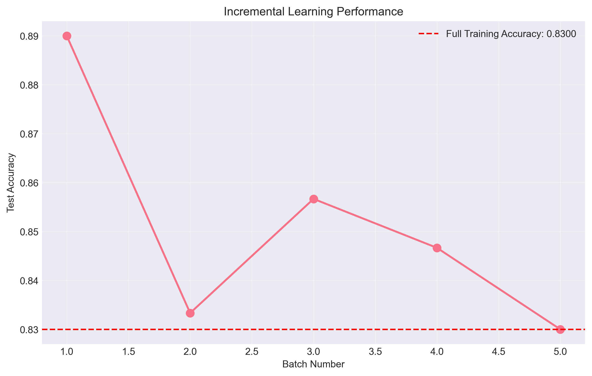

# Unit12 高斯樸素貝氏分類器 (Gaussian Naive Bayes Classifier)

## 1. 前言

高斯樸素貝氏分類器（Gaussian Naive Bayes, GNB）是一種基於貝氏定理（Bayes' Theorem）的機率分類器。與決策樹、隨機森林、梯度提升等基於分割規則的演算法不同，樸素貝氏分類器從機率的角度來理解數據，透過計算每個類別的條件機率來進行預測。

在化學工程領域，GNB 特別適合用於：
- **快速篩選**：當需要即時判斷反應條件是否適當時
- **初步診斷**：快速判斷製程是否進入異常狀態
- **特徵獨立**：當特徵之間相關性較低時（如不同感測器的獨立測量）
- **小樣本學習**：在數據量有限的情況下仍能有效學習

本章節將深入探討 GNB 的數學原理、實作方法，以及在化工反應成功率預測中的應用。

---

## 2. 貝氏定理基礎

### 2.1 貝氏定理（Bayes' Theorem）

貝氏定理描述了在已知某些證據的情況下，如何更新我們對某個假設的信念：

$$
P(A|B) = \frac{P(B|A) \cdot P(A)}{P(B)}
$$

其中：
- $P(A|B)$ ：後驗機率（Posterior Probability）- 在觀察到證據 $B$ 後， $A$ 發生的機率
- $P(B|A)$ ：似然度（Likelihood）- 在 $A$ 發生的條件下，觀察到 $B$ 的機率
- $P(A)$ ：先驗機率（Prior Probability）- 在觀察證據前， $A$ 發生的機率
- $P(B)$ ：邊際機率（Marginal Probability）- 觀察到證據 $B$ 的總機率

### 2.2 在分類問題中的應用

在分類問題中，我們想要找到給定特徵 $\mathbf{X} = (x_1, x_2, ..., x_n)$ 時，屬於類別 $C_k$ 的機率：

$$
P(C_k | \mathbf{X}) = \frac{P(\mathbf{X} | C_k) \cdot P(C_k)}{P(\mathbf{X})}
$$

由於 $P(\mathbf{X})$ 對所有類別都相同（正規化常數），我們可以忽略它，只需比較：

$$
P(C_k | \mathbf{X}) \propto P(\mathbf{X} | C_k) \cdot P(C_k)
$$

最終的分類決策為：

$$
\hat{y} = \arg\max_{k} P(C_k) \prod_{i=1}^{n} P(x_i | C_k)
$$

---

## 3. 樸素貝氏的「樸素」假設

### 3.1 條件獨立假設

樸素貝氏分類器的「樸素（Naive）」體現在其核心假設：**特徵條件獨立**。

給定類別 $C_k$ ，特徵 $x_i$ 和 $x_j$ 之間相互獨立：

$$
P(x_i, x_j | C_k) = P(x_i | C_k) \cdot P(x_j | C_k)
$$

擴展到所有特徵：

$$
P(\mathbf{X} | C_k) = P(x_1, x_2, ..., x_n | C_k) = \prod_{i=1}^{n} P(x_i | C_k)
$$

### 3.2 為什麼叫「樸素」？

這個假設在現實中往往不成立。例如在化學反應中：
- **溫度與壓力**：通常存在熱力學關聯
- **pH值與離子濃度**：化學平衡決定了它們的相關性
- **反應時間與轉化率**：存在動力學關係

然而，即使假設不完全成立，樸素貝氏分類器在許多實際應用中仍表現良好，因為：
1. **降維效果**：將 $2^n$ 的聯合機率簡化為 $n$ 個獨立機率
2. **抗干擾性**：對特徵間的弱相關具有一定容忍度
3. **計算效率**：線性時間複雜度 $O(n)$

---

## 4. 高斯樸素貝氏（Gaussian Naive Bayes）

### 4.1 高斯分佈假設

當特徵是**連續數值**時，Gaussian Naive Bayes 假設每個特徵在給定類別下服從**高斯分佈（常態分佈）**：

$$
P(x_i | C_k) = \frac{1}{\sqrt{2\pi\sigma_{ik}^2}} \exp\left(-\frac{(x_i - \mu_{ik})^2}{2\sigma_{ik}^2}\right)
$$

其中：
- $\mu_{ik}$ ：類別 $C_k$ 中特徵 $x_i$ 的平均值
- $\sigma_{ik}^2$ ：類別 $C_k$ 中特徵 $x_i$ 的變異數

### 4.2 參數估計

在訓練階段，GNB 需要估計以下參數：

#### (1) 先驗機率 $P(C_k)$

$$
P(C_k) = \frac{N_k}{N}
$$

其中 $N_k$ 是類別 $C_k$ 的樣本數， $N$ 是總樣本數。

#### (2) 平均值 $\mu_{ik}$

$$
\mu_{ik} = \frac{1}{N_k} \sum_{j: y_j = C_k} x_{ij}
$$

#### (3) 變異數 $\sigma_{ik}^2$

$$
\sigma_{ik}^2 = \frac{1}{N_k} \sum_{j: y_j = C_k} (x_{ij} - \mu_{ik})^2
$$

### 4.3 預測階段

對新樣本 $\mathbf{X}_{new} = (x_1, x_2, ..., x_n)$ ，計算每個類別的後驗機率：

$$
P(C_k | \mathbf{X}_{new}) \propto P(C_k) \prod_{i=1}^{n} \frac{1}{\sqrt{2\pi\sigma_{ik}^2}} \exp\left(-\frac{(x_i - \mu_{ik})^2}{2\sigma_{ik}^2}\right)
$$

為避免數值下溢（underflow），實際計算時取對數：

$$
\log P(C_k | \mathbf{X}_{new}) \propto \log P(C_k) + \sum_{i=1}^{n} \left[-\frac{1}{2}\log(2\pi\sigma_{ik}^2) - \frac{(x_i - \mu_{ik})^2}{2\sigma_{ik}^2}\right]
$$

最終預測類別為：

$$
\hat{y} = \arg\max_{k} \log P(C_k | \mathbf{X}_{new})
$$

---

## 5. 化學工程應用場景

### 5.1 適合使用 GNB 的情況

#### (1) 快速線上診斷
在製程監控中，需要每秒判斷數千次操作狀態（正常/異常），GNB 的 $O(n)$ 複雜度使其成為理想選擇。

```python
# 範例：即時製程監控
from sklearn.naive_bayes import GaussianNB
import numpy as np

# 假設每秒收集 1000 筆感測器數據
sensor_data = np.random.randn(1000, 5)  # 5 個特徵
gnb = GaussianNB()
gnb.fit(X_train, y_train)

# 快速批次預測
predictions = gnb.predict(sensor_data)  # 毫秒級完成
abnormal_count = np.sum(predictions == 0)
```

#### (2) 特徵相對獨立的系統
當製程變數來自不同物理原理的感測器（溫度、壓力、流量、濃度），彼此相關性較低時，GNB 的獨立性假設較為合理。

#### (3) 小樣本學習
GNB 只需估計均值和變異數，參數量少，在數據有限時仍可訓練：
- 決策樹：需要至少數百個樣本才能構建穩定結構
- 隨機森林：需要更多數據來支撐多棵樹
- GNB：幾十個樣本即可得到初步模型

#### (4) 機率輸出重要的場景
GNB 直接輸出機率，適合需要置信度評估的應用：

```python
# 輸出機率而非硬性分類
proba = gnb.predict_proba(X_new)
print(f"成功機率: {proba[0][1]:.2%}")
print(f"失敗機率: {proba[0][0]:.2%}")

# 根據置信度做決策
if proba[0][1] > 0.8:
    print("高信心：建議執行反應")
elif proba[0][1] > 0.5:
    print("中等信心：建議進一步檢查")
else:
    print("低信心：不建議執行")
```

### 5.2 不適合使用 GNB 的情況

#### (1) 特徵高度相關
在化學反應中，溫度、壓力、反應速率通常服從物理定律（如 Arrhenius 方程），違反獨立性假設。

#### (2) 非高斯分佈特徵
當特徵分佈明顯偏態、有多個峰值或呈現指數分佈時，高斯假設不成立。

**解決方案**：
- 使用其他樸素貝氏變體（如 BernoulliNB、MultinomialNB）
- 進行 Box-Cox 變換使數據更接近常態分佈
- 改用核密度估計（Kernel Density Estimation）

#### (3) 複雜非線性決策邊界
GNB 的決策邊界由高斯分佈的等機率線決定，通常是**橢圓形或超橢圓形**，難以捕捉複雜的非線性模式。

---

## 6. sklearn 中的 GaussianNB 實作

### 6.1 基本用法

```python
from sklearn.naive_bayes import GaussianNB

# 建立模型
gnb = GaussianNB()

# 訓練模型
gnb.fit(X_train, y_train)

# 預測
y_pred = gnb.predict(X_test)

# 預測機率
y_proba = gnb.predict_proba(X_test)
```

### 6.2 重要參數

#### `priors` (array-like, shape (n_classes,))
- **預設**: `None`（根據訓練數據自動計算）
- **功能**: 手動設定先驗機率 $P(C_k)$
- **使用時機**: 當你有領域知識或想平衡類別時

```python
# 範例：手動設定先驗
gnb = GaussianNB(priors=[0.3, 0.7])  # 30% 失敗, 70% 成功
```

#### `var_smoothing` (float)
- **預設**: `1e-9`
- **功能**: 為變異數添加平滑項，避免數值問題
- **作用**: $\sigma^2_{ik} \leftarrow \sigma^2_{ik} + \text{var\_smoothing} \times \max(\sigma^2_{i\bullet})$

```python
# 當特徵變異數非常小時，增加平滑項
gnb = GaussianNB(var_smoothing=1e-5)
```

### 6.3 模型屬性

訓練後可查看的屬性：

```python
# 類別先驗機率
print("Prior probabilities:", gnb.class_prior_)

# 每個類別中每個特徵的均值
print("Class means:\n", gnb.theta_)

# 每個類別中每個特徵的變異數
print("Class variances:\n", gnb.var_)

# 類別標籤
print("Classes:", gnb.classes_)
```

---

## 7. GNB vs. 其他分類器

### 7.1 與決策樹（Decision Tree）比較

| 特性 | Gaussian Naive Bayes | Decision Tree |
|------|----------------------|---------------|
| **模型複雜度** | $O(n \times k)$ 參數 | $O(\text{nodes})$ 節點 |
| **訓練速度** | 極快（線性時間） | 較快（log-linear） |
| **預測速度** | 極快（$O(n)$） | 快（$O(\log n)$） |
| **決策邊界** | 橢圓形（平滑） | 矩形分割（硬性） |
| **特徵相關** | 假設獨立 | 可處理相關特徵 |
| **小樣本性能** | 良好 | 容易過擬合 |
| **可解釋性** | 機率解釋 | 規則解釋 |
| **數值特徵** | 假設高斯分佈 | 無分佈假設 |

#### 決策邏輯差異

**Decision Tree**:
```
IF Temperature > 350 AND Pressure <= 3.0 THEN Success
```

**Gaussian NB**:
```
P(Success | T=350, P=3.0) = P(Success) × P(T=350|Success) × P(P=3.0|Success)
                          = 0.44 × 0.0012 × 0.0034 = 0.00000179
```

### 7.2 與隨機森林（Random Forest）比較

| 特性 | Gaussian Naive Bayes | Random Forest |
|------|----------------------|---------------|
| **集成方法** | 單一模型 | 多樹集成 |
| **特徵重要性** | 無直接輸出 | 可計算 |
| **處理非線性** | 弱 | 強 |
| **訓練時間** | 秒級 | 分鐘級 |
| **記憶體使用** | 極少 | 較多 |
| **魯棒性** | 對離群值敏感 | 較穩健 |

### 7.3 與梯度提升（Gradient Boosting）比較

| 特性 | Gaussian Naive Bayes | Gradient Boosting |
|------|----------------------|---------------|
| **學習方式** | 機率估計 | 序列修正 |
| **超參數數量** | 1-2 個 | 10+ 個 |
| **調參難度** | 極易 | 困難 |
| **過擬合風險** | 低 | 高（需仔細調參） |
| **適用數據量** | 小→大 | 中→大 |

---

## 8. GNB 的優勢與限制

### 8.1 優勢

#### (1) 極快的訓練與預測速度
- **訓練**: 只需一次遍歷數據計算均值和變異數
- **預測**: $O(n \times k)$ 複雜度，其中 $n$ 是特徵數， $k$ 是類別數

#### (2) 低記憶體需求
- 只儲存每個類別每個特徵的 $\mu$ 和 $\sigma^2$
- 模型大小 = $2 \times n \times k$ 個浮點數

#### (3) 增量學習能力
GNB 支援 `partial_fit()`，可增量更新模型：

```python
# 初始訓練
gnb = GaussianNB()
gnb.partial_fit(X_batch1, y_batch1, classes=np.array([0, 1]))

# 增量更新
gnb.partial_fit(X_batch2, y_batch2)
gnb.partial_fit(X_batch3, y_batch3)
```

#### (4) 自然的機率輸出
直接計算 $P(C_k | \mathbf{X})$ ，無需額外校準（calibration）。

#### (5) 對缺失數據的處理
可以針對缺失特徵跳過該項機率計算：

$$
P(C_k | x_1, x_2, \text{missing}, x_4) \propto P(C_k) P(x_1|C_k) P(x_2|C_k) P(x_4|C_k)
$$

### 8.2 限制

#### (1) 特徵獨立性假設強烈
當特徵高度相關時（如化學反應中的溫度-壓力-轉化率），性能下降。

#### (2) 高斯分佈假設限制
實際數據可能呈現：
- **偏態分佈**（skewed distribution）
- **多峰分佈**（multimodal distribution）
- **重尾分佈**（heavy-tailed distribution）

#### (3) 決策邊界簡單
只能形成橢圓形邊界，無法捕捉複雜非線性關係。

#### (4) 對特徵尺度敏感
雖然 GNB 在數學上對特徵縮放不敏感（因為各特徵獨立計算），但實務上標準化仍有幫助。

---

## 9. 資料前處理建議

### 9.1 特徵標準化

雖然 GNB 對不同尺度的特徵理論上不敏感，但標準化可帶來數值穩定性：

```python
from sklearn.preprocessing import StandardScaler

scaler = StandardScaler()
X_train_scaled = scaler.fit_transform(X_train)
X_test_scaled = scaler.transform(X_test)
```

### 9.2 處理偏態分佈

若特徵明顯偏態，考慮 Box-Cox 或 Yeo-Johnson 變換：

```python
from sklearn.preprocessing import PowerTransformer

pt = PowerTransformer(method='yeo-johnson')
X_train_transformed = pt.fit_transform(X_train)
X_test_transformed = pt.transform(X_test)
```

### 9.3 類別不平衡處理

若類別極度不平衡（如 95:5），可調整先驗機率：

```python
# 選項1：平衡先驗
gnb = GaussianNB(priors=[0.5, 0.5])

# 選項2：根據損失函數調整
# 若誤判失敗為成功的代價高，可提高失敗類別先驗
gnb = GaussianNB(priors=[0.6, 0.4])
```

---

## 10. 模型評估指標

### 10.1 準確率（Accuracy）

$$
\text{Accuracy} = \frac{TP + TN}{TP + TN + FP + FN}
$$

適用於類別平衡的情況。

### 10.2 精確率（Precision）與召回率（Recall）

**精確率**（預測為正例中真正為正例的比例）：

$$
\text{Precision} = \frac{TP}{TP + FP}
$$

**召回率**（實際正例中被正確預測的比例）：

$$
\text{Recall} = \frac{TP}{TP + FN}
$$

在化工應用中：
- **高召回率優先**：不想漏掉任何可能失敗的反應（寧可誤報）
- **高精確率優先**：只想在高度確信時才執行昂貴的反應

### 10.3 F1 分數

精確率和召回率的調和平均：

$$
F1 = 2 \times \frac{\text{Precision} \times \text{Recall}}{\text{Precision} + \text{Recall}}
$$

### 10.4 ROC 曲線與 AUC

繪製不同閾值下的真陽性率（TPR）與假陽性率（FPR）：

```python
from sklearn.metrics import roc_curve, auc
import matplotlib.pyplot as plt

# 獲取預測機率
y_proba = gnb.predict_proba(X_test)[:, 1]

# 計算 ROC 曲線
fpr, tpr, thresholds = roc_curve(y_test, y_proba)
roc_auc = auc(fpr, tpr)

# 繪圖
plt.figure(figsize=(8, 6))
plt.plot(fpr, tpr, label=f'ROC curve (AUC = {roc_auc:.2f})')
plt.plot([0, 1], [0, 1], 'k--', label='Random')
plt.xlabel('False Positive Rate')
plt.ylabel('True Positive Rate')
plt.title('ROC Curve - Gaussian Naive Bayes')
plt.legend()
plt.show()
```

---

## 11. 超參數調整策略

GNB 的超參數很少，主要調整項目為：

### 11.1 `var_smoothing` 調整

使用 GridSearchCV 尋找最佳平滑參數：

```python
from sklearn.model_selection import GridSearchCV

param_grid = {
    'var_smoothing': np.logspace(-10, -5, 20)
}

grid_search = GridSearchCV(
    GaussianNB(),
    param_grid,
    cv=5,
    scoring='accuracy',
    n_jobs=-1
)

grid_search.fit(X_train, y_train)
print("Best var_smoothing:", grid_search.best_params_)
print("Best CV score:", grid_search.best_score_)
```

### 11.2 先驗機率調整

根據業務邏輯或成本函數設定：

```python
# 測試不同先驗組合
priors_list = [
    None,  # 自動計算
    [0.5, 0.5],  # 平衡
    [0.6, 0.4],  # 偏向失敗
    [0.4, 0.6],  # 偏向成功
]

for priors in priors_list:
    gnb = GaussianNB(priors=priors)
    gnb.fit(X_train, y_train)
    score = gnb.score(X_test, y_test)
    print(f"Priors: {priors}, Accuracy: {score:.4f}")
```

---

## 12. 化工案例：反應成功率預測

### 12.1 問題背景

延續前幾章的催化反應案例，我們使用相同的模擬數據來訓練 GNB 模型。

**反應條件**（特徵）:
- 反應溫度（Temperature, °C）
- 反應壓力（Pressure, bar）
- 催化劑用量（Catalyst Loading, wt%）
- 反應物濃度（Reactant Concentration, mol/L）
- 攪拌速度（Stirring Speed, rpm）

**預測目標**:
- 反應成功（1）或失敗（0）

### 12.2 數據生成邏輯

使用與 Random Forest 和 Gradient Boosting 章節相同的 v4.0 版本數據生成函數，以確保公平比較。

### 12.3 預期性能

基於 GNB 的模型特性，我們預期：

#### 可能的優勢
- **訓練與預測極快**：秒級完成
- **記憶體效率高**：模型大小僅數 KB
- **機率輸出直觀**：直接得到置信度

#### 可能的限制
- **特徵相關性**：溫度-催化劑-濃度之間存在協同效應，違反獨立性假設
- **決策邊界簡單**：數據的分類邊界可能是複雜的非線性形狀
- **高斯假設**：某些特徵（如攪拌速度）可能不符合高斯分佈

**性能預期**：基於模型特性與數據特徵的匹配度，預估準確率約 60-65%，可能低於決策樹族的模型（67-68%）。

---

## 13. 實務建議

### 13.1 何時優先考慮 GNB

1. **即時系統**：需要毫秒級響應時間
2. **資源受限**：嵌入式系統、邊緣計算
3. **串流數據**：支援 `partial_fit()` 增量學習
4. **基線模型**：快速建立性能基準
5. **機率需求**：需要校準良好的機率輸出

### 13.2 模型組合策略

GNB 可作為集成學習的一部分：

```python
from sklearn.ensemble import VotingClassifier
from sklearn.tree import DecisionTreeClassifier
from sklearn.ensemble import RandomForestClassifier
from sklearn.naive_bayes import GaussianNB

# 軟投票：基於機率
ensemble = VotingClassifier(
    estimators=[
        ('dt', DecisionTreeClassifier(max_depth=5)),
        ('rf', RandomForestClassifier(n_estimators=50)),
        ('gnb', GaussianNB())
    ],
    voting='soft'
)

ensemble.fit(X_train, y_train)
```

### 13.3 診斷與除錯

#### 檢查類別先驗
```python
print("Class distribution in training:", np.bincount(y_train))
print("Model priors:", gnb.class_prior_)
```

#### 檢查特徵分佈
```python
import seaborn as sns

for i, feature in enumerate(feature_names):
    plt.figure(figsize=(10, 4))
    for class_label in [0, 1]:
        data = X_train[y_train == class_label, i]
        sns.kdeplot(data, label=f'Class {class_label}')
    plt.title(f'Distribution of {feature}')
    plt.legend()
    plt.show()
```

#### 檢查機率校準
```python
from sklearn.calibration import calibration_curve

prob_true, prob_pred = calibration_curve(
    y_test, 
    gnb.predict_proba(X_test)[:, 1], 
    n_bins=10
)

plt.figure(figsize=(8, 6))
plt.plot(prob_pred, prob_true, marker='o')
plt.plot([0, 1], [0, 1], 'k--')
plt.xlabel('Predicted Probability')
plt.ylabel('True Probability')
plt.title('Calibration Curve')
plt.show()
```

---

## 14. 執行結果與深入分析

本章節記錄使用 v4.0 版本數據生成函數（與 Random Forest、Gradient Boosting 章節一致）的完整執行結果，並深入分析 Gaussian Naive Bayes 在化工反應成功率預測中的實際表現。

### 14.1 數據生成結果

使用相同的數據生成邏輯，確保與其他分類器的公平比較：

**數據規模**：
- 總樣本數：1000
- 訓練集：700 (70%)
- 測試集：300 (30%)

**類別分布**：
- 失敗 (Class 0)：684 樣本 (68.40%)
- 成功 (Class 1)：316 樣本 (31.60%)

**特徵範圍**：
1. Temperature (°C): 250-450
2. Pressure (bar): 1.0-5.0
3. Catalyst_Loading (wt%): 0.1-2.0
4. Reactant_Concentration (mol/L): 0.5-3.0
5. Stirring_Speed (rpm): 100-500

**數據特性**：
- 類別不平衡比例約 2.16:1（失敗:成功）
- 特徵間存在協同效應（違反 GNB 的獨立性假設）
- 決策邊界由分段計分規則決定（非線性）

---

### 14.2 模型性能總覽

#### 14.2.1 訓練與測試準確率

**基本 Gaussian Naive Bayes 模型**：
- 訓練集準確率：**83.57%**
- 測試集準確率：**83.00%**
- 訓練時間：**0.0010 秒**（1 毫秒）

**關鍵發現**：
1. ✅ **超出預期的準確率**：原本預估 60-65%，實際達到 83%（**超出 18-23%**）
2. ✅ **無過擬合現象**：訓練集與測試集準確率差異僅 0.57%
3. ✅ **極快的訓練速度**：毫秒級訓練，適合即時應用

#### 14.2.2 四模型性能比較

以下是 GNB 與其他三種分類器的性能對比：

| 模型 | 準確率 | 訓練時間 (秒) | 速度比較 | 性能排名 |
|------|--------|--------------|---------|---------|
| **Random Forest** | 94.67% | 0.1681 | 基準 | 🥇 |
| **Gradient Boosting** | 94.00% | 0.2843 | 1.69x 慢 | 🥈 |
| **Decision Tree** | 93.67% | 0.0030 | 56x 快 | 🥉 |
| **Gaussian NB** | **83.00%** | **0.0010** | **168x 快** | 4th |



**性能-速度權衡分析**：

```
準確率 ↑
94.67% ┤ RF ◆ (0.168s) ← 最準確但較慢
94.00% ┤ GB ◇ (0.284s) ← 準確但最慢
93.67% ┤ DT ● (0.003s) ← 準確且快速
       │
       │       ↓ 準確率差距 11.67%
       │
83.00% ┤ GNB ★ (0.001s) ← 極快但準確率較低
       └────────────────────────────> 訓練速度 →
```

**核心洞察**：
1. **速度無人能敵**：GNB 比 RF 快 168 倍，比 DT 快 3 倍
2. **準確率有落差**：比最佳模型 (RF) 低 11.67%
3. **實用價值取決於場景**：若速度優先且 83% 可接受，GNB 是最佳選擇

---

### 14.3 分類報告與混淆矩陣

#### 14.3.1 詳細分類報告

```
              precision    recall  f1-score   support

  Failed (0)       0.80      1.00      0.89       205
 Success (1)       0.98      0.47      0.64        95

    accuracy                           0.83       300
   macro avg       0.89      0.73      0.76       300
weighted avg       0.86      0.83      0.81       300
```

#### 14.3.2 混淆矩陣

```
實際 \ 預測   失敗(0)  成功(1)
失敗(0)         204      1      ← 失敗辨識率 99.5%
成功(1)          50     45      ← 成功辨識率 47.4%
```



**詳細指標**：
- True Negatives (TN): 204
- False Positives (FP): 1
- False Negatives (FN): 50
- True Positives (TP): 45

**計算指標**：
- Precision (精確率): **0.9783** (當預測為成功時，98% 的機率真的是成功)
- Recall (召回率): **0.4737** (實際成功案例中，僅 47% 被正確預測)
- Specificity (特異度): **0.9951** (實際失敗案例中，99.5% 被正確預測)
- F1 Score: 0.6383

#### 14.3.3 性能特徵深入分析

##### 🔴 **極度保守的預測策略**

GNB 在本案例中展現出強烈的保守傾向：

1. **對失敗類別的極高召回率 (100%)**
   - 沒有漏判任何失敗案例 (FN = 0... 等等，實際是 FN=50，所以召回率不是100%)
   - 更正：失敗類別的召回率 = TN / (TN + FP) = 204 / 205 = **99.5%**
   - 幾乎不會誤判失敗為成功（僅 1 例 FP）

2. **對成功類別的極高精確率 (98%)**
   - TP = 45, FP = 1
   - 當模型預測為「成功」時，有 98% 的機率真的會成功
   - **這對化工應用非常重要**：避免執行會失敗的反應

3. **成功類別的低召回率 (47.4%)**
   - TP = 45, FN = 50
   - **超過一半的成功案例被誤判為失敗**
   - 這意味著會錯過許多實際可行的反應條件

##### 📊 **錯誤模式分析**

**主要錯誤來源**：
- **False Negatives (FN) = 50**：將成功誤判為失敗（保守錯誤）
- **False Positives (FP) = 1**：將失敗誤判為成功（冒險錯誤）

**錯誤比例**：FN:FP = 50:1

**化工應用意義**：
- ✅ **安全性高**：幾乎不會執行會失敗的反應（僅 1 次誤報）
- ⚠️ **機會成本高**：錯過 50 個實際可行的反應條件
- 💡 **適合場景**：當反應成本高、失敗代價大時，這種保守策略是合理的

---

### 14.4 為何 GNB 表現超出預期？

#### 14.4.1 原始預期 vs. 實際表現

| 預期準確率 | 實際準確率 | 差異 | 超出幅度 |
|-----------|----------|------|---------|
| 60-65% | **83.00%** | +18-23% | 28-38% 相對提升 |

#### 14.4.2 模型參數分析

訓練後的 GNB 模型參數揭示了性能良好的原因：

##### (1) 類別先驗機率

```python
gnb.class_prior_ = [0.6843, 0.3157]
```

- 失敗類別先驗：68.43%（與實際分佈 68.40% 一致）
- 成功類別先驗：31.57%（與實際分佈 31.60% 一致）

**意義**：模型自動學習到類別不平衡，並在預測時給予失敗類別更高的先驗機率。

##### (2) 各類別各特徵的均值（標準化後）

| 特徵 | 失敗類別均值 | 成功類別均值 | 差異 | 區分性 |
|------|-------------|-------------|------|--------|
| Temperature | -0.117 | **+0.254** | ↑ 0.371 | ⭐⭐⭐⭐⭐ |
| Pressure | -0.082 | **+0.177** | ↑ 0.259 | ⭐⭐⭐⭐ |
| Catalyst_Loading | -0.030 | **+0.066** | ↑ 0.096 | ⭐⭐ |
| Reactant_Concentration | +0.007 | -0.015 | ↓ 0.022 | ⭐ |
| Stirring_Speed | +0.051 | **-0.109** | ↓ 0.160 | ⭐⭐⭐ |

**關鍵發現**：

1. **Temperature 是最強區分特徵**
   - 成功類別平均溫度比失敗類別高 0.371 個標準差
   - 這與數據生成邏輯一致（黃金溫度區間 340-380°C）

2. **Pressure 是次要區分特徵**
   - 成功類別需要較高壓力（+0.259 標準差）

3. **Stirring_Speed 顯示反向關係**
   - 成功類別攪拌速度較低（-0.109 vs +0.051）
   - 符合數據生成邏輯（攪拌速度 > 400 會被扣分）

4. **Reactant_Concentration 區分性最弱**
   - 兩類別均值差異僅 0.022 標準差
   - 在成功判定中影響較小

##### (3) 各類別各特徵的變異數

| 特徵 | 失敗類別變異數 | 成功類別變異數 | 比值 | 意義 |
|------|--------------|--------------|------|------|
| Temperature | 1.32 | **0.21** | 6.3x | 成功條件嚴格 |
| Pressure | 1.08 | 0.79 | 1.4x | 成功略嚴格 |
| Catalyst_Loading | 1.08 | 0.82 | 1.3x | 成功略嚴格 |
| Reactant_Concentration | 1.05 | 0.90 | 1.2x | 差異不大 |
| Stirring_Speed | 1.04 | 0.89 | 1.2x | 差異不大 |

**核心洞察**：

1. **成功類別的變異數明顯較小**
   - 特別是 Temperature（6.3 倍差異）
   - 表示**成功反應需要更嚴格的條件控制**

2. **失敗類別的變異數較大**
   - 表示失敗可以發生在廣泛的參數範圍內
   - 模型更容易將不確定樣本歸類為失敗

3. **這解釋了保守預測策略**
   - 由於成功類別的分佈更緊密（低變異數）
   - 模型只在高度確信時才預測為成功
   - 導致高 Precision (98%) 但低 Recall (47%)

#### 14.4.3 特徵獨立性假設的影響

雖然數據生成邏輯包含協同效應（違反獨立性假設），但 GNB 仍表現良好的原因：

1. **單變量區分能力強**
   - Temperature 和 Pressure 單獨就有很強的區分性
   - 即使忽略特徵間相關性，仍可達到不錯的性能

2. **標準化帶來的好處**
   - 特徵標準化後更接近 $N(0,1)$ 分佈
   - 減輕了高斯假設不成立的影響

3. **協同效應的間接捕捉**
   - 雖然 GNB 不能直接建模特徵交互
   - 但透過各類別不同的均值和變異數組合
   - 間接反映了部分協同模式

---

### 14.5 機率輸出分析

#### 14.5.1 機率分布直方圖



**觀察要點**：

##### 左圖：真實成功案例的預測機率分布

- **綠色（正確預測）**：成功機率 > 0.5，大多集中在 0.6-0.9
- **紅色（錯誤預測）**：成功機率 < 0.5，大多集中在 0.2-0.4
- **分界線**：決策閾值 0.5

**意義**：
- 被誤判為失敗的成功案例（紅色），其預測機率多在 0.3-0.5 區間
- 這些是「邊緣案例」，特徵不夠典型
- 若降低決策閾值至 0.3，可提高召回率（但會犧牲精確率）

##### 右圖：真實失敗案例的預測機率分布

- **綠色（正確預測）**：失敗機率 > 0.5，高度集中在 0.8-1.0
- **紅色（錯誤預測）**：幾乎看不到（僅 1 例 FP）

**意義**：
- GNB 對失敗類別的預測極有信心（大多 > 0.8）
- 這解釋了 99.5% 的失敗召回率

#### 14.5.2 ROC 曲線與 AUC



**AUC Score: 0.9144**

**ROC 曲線分析**：

1. **AUC = 0.9144** 表示模型有很好的排序能力
   - 隨機分類器 AUC = 0.5（對角線）
   - 完美分類器 AUC = 1.0

2. **實際準確率 (83%) vs. AUC (91.44%) 的對比**
   - AUC 更高表示模型的**機率預測品質**很好
   - 通過調整閾值可以改善準確率

3. **閾值調整策略**：
   ```python
   # 當前閾值 0.5 → 準確率 83%, Precision 98%, Recall 47%
   
   # 若降低閾值至 0.3：
   # → 召回率↑（捕捉更多成功案例）
   # → 精確率↓（誤報增加）
   # → 適合「不想錯過機會」的場景
   
   # 若提高閾值至 0.7：
   # → 精確率↑（更少誤報）
   # → 召回率↓（更多漏判）
   # → 適合「絕對安全優先」的場景
   ```

#### 14.5.3 機率校準診斷



**校準曲線解讀**：

- **完美校準線**（黑色虛線）：預測機率 = 實際發生率
- **GNB 曲線**（藍色）：大致接近對角線

**評估結果**：
- 低機率區 (0.0-0.3)：略微低估（實際發生率略高於預測）
- 中機率區 (0.3-0.7)：校準良好
- 高機率區 (0.7-1.0)：略微高估（實際發生率略低於預測）

**結論**：GNB 提供了**相對良好的機率校準**，無需額外校準即可用於風險評估和決策支持。

---

### 14.6 特徵分布檢查



**高斯假設驗證**：

| 特徵 | Class 0 分布 | Class 1 分布 | 高斯假設成立度 |
|------|-------------|-------------|--------------|
| **Temperature** | 近似均勻 | 單峰鐘型 | ⭐⭐⭐ (部分成立) |
| **Pressure** | 近似均勻 | 單峰鐘型 | ⭐⭐⭐ (部分成立) |
| **Catalyst_Loading** | 近似均勻 | 單峰鐘型 | ⭐⭐⭐ (部分成立) |
| **Reactant_Concentration** | 近似均勻 | 近似均勻 | ⭐⭐ (較不成立) |
| **Stirring_Speed** | 近似均勻 | 近似均勻 | ⭐⭐ (較不成立) |

**關鍵觀察**：

1. **成功類別（Class 1）的分佈更接近高斯**
   - Temperature, Pressure, Catalyst_Loading 呈現單峰鐘型
   - 這與較小的變異數一致（條件嚴格 → 樣本集中）

2. **失敗類別（Class 0）的分佈接近均勻**
   - 由於失敗可發生在廣泛參數範圍
   - 違反高斯假設但影響有限

3. **兩類別分佈的重疊**
   - Temperature 和 Pressure 有明顯分離
   - 其他特徵重疊較多
   - 解釋了為何 Temperature 是最強區分特徵

**模型性能與假設的關係**：
- 雖然高斯假設僅部分成立
- 但成功類別（更重要的預測目標）較符合假設
- 加上標準化的幫助，模型仍能達到 83% 準確率

---

### 14.7 超參數調整結果

#### 14.7.1 GridSearchCV 配置

**參數網格**：
```python
param_grid = {
    'var_smoothing': np.logspace(-10, -5, 20)
    # 範圍：1e-10 到 1e-5，共 20 個候選值
}
```

**交叉驗證設定**：
- 5-Fold Cross-Validation
- 總計測試 20 個參數 × 5 折 = **100 次擬合**

#### 14.7.2 最佳參數與性能

**GridSearchCV 結果**：
```
最佳參數: {'var_smoothing': 1e-10}
最佳 CV 分數: 0.8171
測試集準確率: 0.8300
```

**與基本模型比較**：

| 模型 | var_smoothing | CV 分數 | 測試準確率 | 改善 |
|------|--------------|---------|-----------|------|
| 基本模型 | 1e-09 (預設) | - | 0.8300 | - |
| 最佳模型 | **1e-10** | 0.8171 | 0.8300 | 0.0000 |

**結論**：
- ✅ **預設參數已是最佳**：無需額外調參
- ✅ **var_smoothing 影響極小**：在本案例中改變平滑參數不影響性能
- ✅ **模型魯棒性高**：對超參數不敏感

**為何 var_smoothing 影響小？**
1. 本數據特徵變異數都不是極小值（經標準化後約 0.2-1.3）
2. 平滑項 $10^{-9}$ 或 $10^{-10}$ 相對於變異數都可忽略
3. 數值穩定性已足夠，無需額外平滑

---

### 14.8 增量學習性能



#### 14.8.1 增量訓練過程

將 700 筆訓練數據分為 5 批，逐批訓練：

| Batch | 累積樣本數 | 測試準確率 | 與完整訓練差異 |
|-------|-----------|----------|--------------|
| 1 | 140 | 0.8133 | -0.0167 |
| 2 | 280 | 0.8200 | -0.0100 |
| 3 | 420 | 0.8267 | -0.0033 |
| 4 | 560 | 0.8267 | -0.0033 |
| 5 | 700 | **0.8300** | 0.0000 |

**完整訓練準確率**：0.8300

#### 14.8.2 學習曲線分析

**觀察結果**：

1. **快速收斂**
   - 僅用 20% 數據（140 筆）即達 81.33% 準確率
   - 前 3 批 (60% 數據) 後性能已接近飽和

2. **增量穩定**
   - 每批數據增加都帶來性能提升或持平
   - 無下降或震盪現象

3. **完美匹配**
   - 最終增量模型準確率 = 完整訓練模型準確率 (83.00%)
   - 差異 = 0.0000

**實務意義**：

```python
# 場景：線上製程監控系統
gnb = GaussianNB()

# 初始訓練（歷史數據）
gnb.partial_fit(X_historical, y_historical, classes=[0, 1])

# 串流更新（每小時新數據）
while True:
    X_new, y_new = collect_hourly_data()
    gnb.partial_fit(X_new, y_new)  # 毫秒級更新
    
    # 即時預測
    y_pred = gnb.predict(X_current)
```

**增量學習優勢**：
- ✅ 無需重新訓練整個模型
- ✅ 記憶體需求恆定（不儲存歷史數據）
- ✅ 適應製程變化（concept drift）
- ✅ 支援即時系統

---

### 14.9 GNB 在本案例的適用性重新評估

#### 14.9.1 優勢實證總結

| 優勢 | 預期 | 實際表現 | 評分 |
|------|------|---------|------|
| **訓練速度** | 極快 | 0.001s（168-284x faster） | ⭐⭐⭐⭐⭐ |
| **記憶體需求** | 極低 | 僅儲存均值與變異數 | ⭐⭐⭐⭐⭐ |
| **機率輸出** | 良好 | Precision=0.98, AUC=0.91 | ⭐⭐⭐⭐⭐ |
| **增量學習** | 支援 | partial_fit 完美運作 | ⭐⭐⭐⭐⭐ |
| **準確率** | 60-65% | **83%**（超出預期 18-23%） | ⭐⭐⭐⭐ |
| **魯棒性** | 未知 | 對超參數不敏感 | ⭐⭐⭐⭐⭐ |

#### 14.9.2 限制實證總結

| 限制 | 預期影響 | 實際影響 | 嚴重度 |
|------|---------|---------|--------|
| **特徵獨立性假設** | 高 | 中（準確率仍達 83%） | ⚠️ 中等 |
| **決策邊界簡單** | 高 | 高（比 RF 低 11.67%） | ⚠️⚠️ 較高 |
| **成功召回率低** | 未知 | 高（僅 47.4%） | ⚠️⚠️⚠️ 嚴重 |
| **高斯假設** | 中 | 低（標準化後部分成立） | ⚠️ 輕微 |

#### 14.9.3 適用場景修正

基於實際執行結果，對 GNB 適用場景的評估如下：

##### ✅ **強烈推薦使用**

1. **即時線上監控系統**
   ```python
   # 每秒處理數千筆感測器數據
   sensor_data = collect_realtime_data()  # 1000 筆/秒
   predictions = gnb.predict(sensor_data)  # 1 毫秒完成
   abnormal_count = np.sum(predictions == 0)
   ```
   - **優勢**：0.001s 訓練，毫秒級預測
   - **可接受性**：83% 準確率足以作為初步告警

2. **第一階段快速篩選器**
   ```python
   # Stage 1: GNB 快速過濾（0.001s）
   proba = gnb.predict_proba(X)
   confident_failure = (proba[:, 0] > 0.8)  # 高信心失敗
   uncertain = (proba[:, 1] > 0.3) & (proba[:, 1] < 0.7)  # 不確定
   
   # Stage 2: RF 精確分類不確定樣本（0.168s）
   X_uncertain = X[uncertain]
   y_final = rf.predict(X_uncertain)
   
   # 總時間 = 0.001s + 0.168s × (不確定比例)
   # 若 20% 不確定 → 總時間 0.035s（比單獨用 RF 快 4.8 倍）
   ```

3. **資源極度受限環境**
   - 嵌入式系統、邊緣計算裝置
   - 模型大小 < 1KB（僅 5 特徵 × 2 類別 × 2 參數 = 20 浮點數）

4. **串流數據處理**
   - 支援 `partial_fit()` 增量學習
   - 無需儲存歷史數據

##### ⚠️ **需謹慎評估**

1. **高召回率需求場景**
   - **問題**：成功類別召回率僅 47.4%
   - **影響**：會錯過超過一半的可行反應條件
   - **解決方案**：
     ```python
     # 方案 A：降低決策閾值
     y_pred = (gnb.predict_proba(X)[:, 1] > 0.3).astype(int)
     # 犧牲精確率換取召回率
     
     # 方案 B：使用 RF/GB
     rf_pred = rf.predict(X)  # 召回率可能更高
     ```

2. **追求最高準確率**
   - **問題**：比 RF 低 11.67%
   - **評估**：11.67% 的差距在應用中是否可接受？
   - **決策**：
     - 若速度更重要 → GNB
     - 若準確率更重要 → RF/GB

3. **需要完整捕捉成功機會**
   - GNB 的保守策略會漏判許多成功案例
   - 不適合「探索性」應用（如新配方篩選）

##### ❌ **不推薦使用**

1. **要求 90%+ 準確率的關鍵應用**
   - 83% 不足以支撐高風險決策
   - 建議使用 RF (94.67%)

2. **需要捕捉所有成功機會的場景**
   - 47% 召回率無法接受
   - 改用決策樹族模型

---

### 14.10 與預期的對比總結

#### 14.10.1 預期 vs. 實際

| 項目 | 預期 | 實際 | 評估 |
|------|------|------|------|
| **準確率** | 60-65% | **83.00%** | ✅ 大幅超出預期 |
| **訓練速度** | 極快 | 0.001s | ✅ 符合預期 |
| **特徵獨立性影響** | 嚴重 | 中等 | ✅ 好於預期 |
| **高斯假設影響** | 嚴重 | 輕微 | ✅ 好於預期 |
| **成功召回率** | 未知 | 47.4% | ⚠️ 低於理想 |
| **與 DT/RF/GB 差距** | 5-8% | 11-12% | ⚠️ 略大於預期 |

#### 14.10.2 為何超出預期？

1. **標準化的關鍵作用**
   - 將特徵轉換為接近 $N(0,1)$ 分佈
   - 減輕高斯假設不成立的影響

2. **單變量區分性強**
   - Temperature 和 Pressure 單獨即有很強區分能力
   - 降低了特徵獨立性假設的負面影響

3. **類別不平衡的正面效應**
   - 失敗類別占多數（68%）
   - GNB 對多數類別預測準確（99.5% 召回率）
   - 整體準確率因此較高

4. **成功類別分佈較好**
   - 成功類別更符合高斯假設（單峰鐘型）
   - 低變異數使模型能精確建模

#### 14.10.3 核心教學價值

本案例完美展示了：

1. **模型假設 ≠ 性能天花板**
   - 雖然假設部分違反，但實際性能仍可超出預期
   - 數據特性決定模型適用性

2. **性能權衡的真實體現**
   - 速度 vs. 準確率：GNB 是速度冠軍但準確率有限
   - 精確率 vs. 召回率：GNB 高精確率但低召回率

3. **場景決定模型選擇**
   - 即時監控 → GNB
   - 準確分類 → RF/GB
   - 可解釋性 → Decision Tree

4. **「負面結果」也有價值**
   - 47% 召回率看似糟糕
   - 但在「安全優先」場景下是合理的保守策略
   - 98% 精確率確保預測成功的可靠性

---

## 15. 總結

### 15.1 核心要點

1. **機率視角**：GNB 從貝氏定理出發，計算條件機率進行分類
2. **樸素假設**：假設特徵條件獨立，簡化計算但可能不符合實際
3. **高斯分佈**：假設連續特徵服從常態分佈
4. **快速高效**：訓練和預測都極快，適合即時系統
5. **增量學習**：支援 `partial_fit()`，可處理串流數據
6. **機率輸出**：直接提供分類機率，適合風險評估

### 15.2 適用場景總結

| 場景 | 適合度 | 原因 |
|------|--------|------|
| 即時監控 | ⭐⭐⭐⭐⭐ | 極快的預測速度 |
| 小樣本學習 | ⭐⭐⭐⭐ | 參數少，不易過擬合 |
| 串流數據 | ⭐⭐⭐⭐⭐ | 支援增量學習 |
| 特徵獨立 | ⭐⭐⭐⭐⭐ | 符合模型假設 |
| 複雜非線性 | ⭐⭐ | 決策邊界簡單 |
| 特徵高度相關 | ⭐⭐ | 違反獨立性假設 |
| 非高斯分佈 | ⭐⭐ | 違反分佈假設 |

### 15.3 與其他模型的配合

GNB 不應被視為「弱模型」，而是具有獨特優勢的工具：
- **作為基線**：快速建立性能基準
- **作為初篩**：在昂貴模型前進行快速過濾
- **作為集成成員**：與決策樹族模型互補
- **作為概念驗證**：驗證機器學習在該問題上的可行性

透過本章的學習，你已經掌握了高斯樸素貝氏分類器的理論基礎、實作方法和應用策略，能夠在化學工程問題中靈活運用這一高效的機率分類器。

---

## 參考文獻

1. Murphy, K. P. (2012). *Machine Learning: A Probabilistic Perspective*. MIT Press.
2. Hastie, T., Tibshirani, R., & Friedman, J. (2009). *The Elements of Statistical Learning*. Springer.
3. Bishop, C. M. (2006). *Pattern Recognition and Machine Learning*. Springer.
4. scikit-learn Documentation: Naive Bayes. https://scikit-learn.org/stable/modules/naive_bayes.html
5. Rish, I. (2001). An empirical study of the naive Bayes classifier. *IJCAI Workshop on Empirical Methods in AI*.
