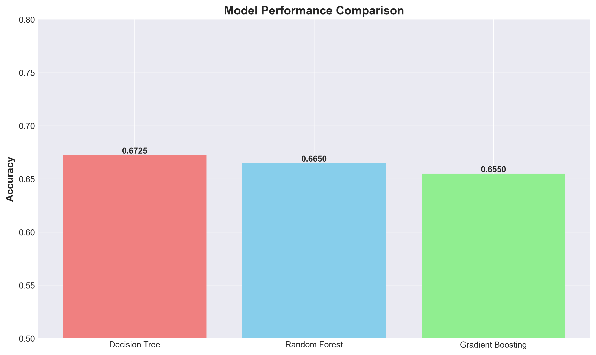
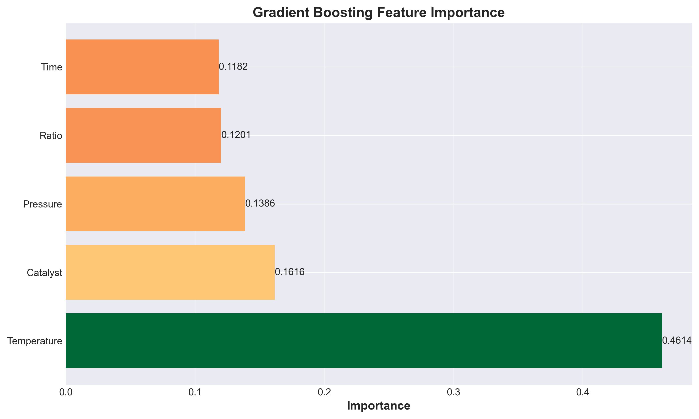
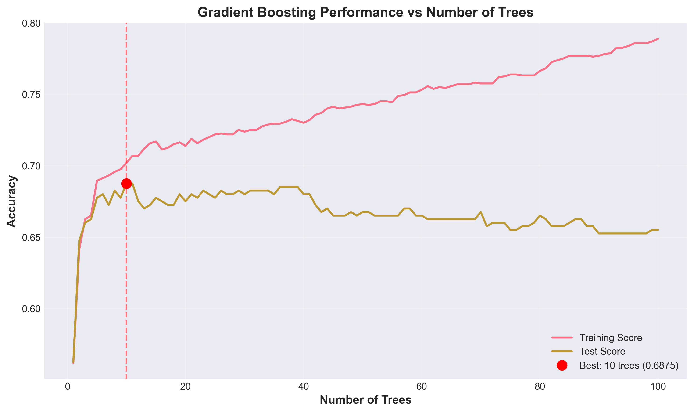
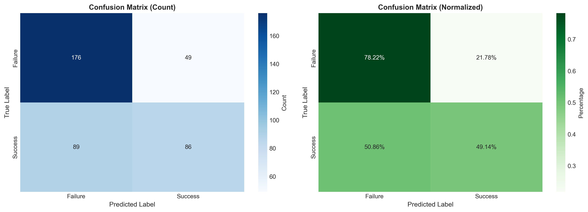

# Unit12 梯度提升分類 | Gradient Boosting Classifier

> **最後更新**：2026-01-18

---

## 學習目標

本節課將深入學習**梯度提升分類 (Gradient Boosting Classifier)**，這是目前最強大的機器學習方法之一，在各種競賽和實務應用中表現卓越。通過本節課，您將能夠：

- 理解 Boosting 與 Bagging 的核心差異
- 掌握梯度提升的工作原理與數學基礎
- 學習 sklearn 中 `GradientBoostingClassifier` 的使用方法
- 理解並設定關鍵超參數（learning_rate, n_estimators, max_depth）
- 應用梯度提升方法解決化工分類問題
- 評估模型性能並與其他方法比較
- 理解梯度提升的優勢與潛在風險（過擬合）

**性能預期說明**：梯度提升通過序列化學習策略，理論上能夠逐步修正錯誤並達到更高準確率。在實際工業數據中，通常比 Random Forest 有 3-8% 的性能提升。但在本教學使用的模擬數據中，由於決策邊界相對簡單，各模型性能可能較為接近。**本課程重點在於理解 Boosting 的核心思想與完整開發流程**。

---

## 1. 從 Random Forest 到 Gradient Boosting

### 1.1 集成學習的兩大流派

在 Unit12_Random_Forest_Classifier 中，我們學習了基於 **Bagging** 的集成方法。現在讓我們認識另一個更強大的流派：**Boosting**。

#### Bagging (Bootstrap Aggregating)

**核心思想**：並行訓練多個獨立模型，最後投票決定

- 每個模型在不同的 Bootstrap 樣本上訓練
- 模型之間相互獨立，可並行訓練
- 通過**平均化**降低方差（variance）
- 代表：Random Forest

```
數據集 → [Bootstrap 樣本1] → 模型1 ↘
      → [Bootstrap 樣本2] → 模型2 → 投票 → 最終預測
      → [Bootstrap 樣本3] → 模型3 ↗
```

#### Boosting

**核心思想**：序列化訓練，每個新模型專注於修正前一個模型的錯誤

- 模型按順序逐個訓練
- 後面的模型關注前面模型預測錯誤的樣本
- 通過**累加**多個弱學習器（weak learner）達到強學習效果
- 降低偏差（bias）
- 代表：AdaBoost, Gradient Boosting, XGBoost

```
數據集 → 模型1 → 找出錯誤 → 模型2（修正錯誤）→ 找出錯誤 → 模型3（再修正）→ ... → 最終預測
```

### 1.2 Bagging vs Boosting 對比

| 維度 | Bagging | Boosting |
|-----|---------|----------|
| **訓練方式** | 並行訓練 | 序列訓練 |
| **模型關係** | 獨立 | 依賴（後續修正前一個） |
| **主要降低** | 方差（Variance） | 偏差（Bias） |
| **訓練速度** | 快（可並行） | 慢（必須序列） |
| **過擬合風險** | 低 | 較高（需小心調參） |
| **典型代表** | Random Forest | Gradient Boosting |
| **適用場景** | 高方差模型（深樹） | 高偏差模型（淺樹） |

### 1.3 為什麼需要 Gradient Boosting？

**Random Forest 的局限**：

- 所有樹地位平等，無法針對性改進
- 即使增加樹的數量，性能也會趨於飽和
- 對於複雜的決策邊界，可能無法充分擬合

**Gradient Boosting 的優勢**：

- 逐步聚焦於困難樣本
- 每棵新樹彌補前面樹的不足
- 可以持續提升性能（直到過擬合）
- 通常能達到更高的準確率

---

## 2. 梯度提升工作原理

### 2.1 Boosting 的數學框架

#### 加法模型 (Additive Model)

Boosting 的核心思想是構建一個**加法模型**：

$$
F(x) = \sum_{m=1}^{M} f_m(x)
$$

其中：
- $F(x)$ ：最終模型
- $f_m(x)$ ：第 $m$ 個弱學習器（通常是決策樹）
- $M$ ：弱學習器總數

#### 前向分步算法 (Forward Stagewise Additive Modeling)

模型按照**貪心策略**逐步構建：

$$
F_m(x) = F_{m-1}(x) + f_m(x)
$$

每次添加一個新的弱學習器 $f_m(x)$ ，目標是最小化損失函數：

$$
f_m = \arg\min_{f} \sum_{i=1}^{N} L(y_i, F_{m-1}(x_i) + f(x_i))
$$

### 2.2 梯度提升的核心創新

**關鍵問題**：如何找到最優的 $f_m(x)$？

直接優化損失函數在數學上很困難。**梯度提升的創新**：將問題轉化為**梯度下降**問題。

#### 梯度下降類比

在梯度下降中，我們更新參數 $\theta$ ：

$$
\theta_{new} = \theta_{old} - \alpha \cdot \nabla_{\theta} L(\theta)
$$

在梯度提升中，我們更新**函數**：

$$
F_m(x) = F_{m-1}(x) - \alpha \cdot \text{gradient}
$$

其中，梯度是對**預測值**的偏導數：

$$
\text{gradient}_i = \frac{\partial L(y_i, F(x_i))}{\partial F(x_i)} \Big|_{F=F_{m-1}}
$$

#### 具體步驟

1. **初始化**：通常使用常數函數
   $$
   F_0(x) = \arg\min_{\gamma} \sum_{i=1}^{N} L(y_i, \gamma)
   $$

2. **計算負梯度**（偽殘差）：
   $$
   r_{im} = -\frac{\partial L(y_i, F_{m-1}(x_i))}{\partial F_{m-1}(x_i)}
   $$

3. **擬合決策樹**：訓練一棵樹 $f_m(x)$ 來預測 $r_{im}$

4. **更新模型**：
   $$
   F_m(x) = F_{m-1}(x) + \nu \cdot f_m(x)
   $$
   其中 $\nu$ 是學習率（learning rate）

5. **重複**：直到達到指定的樹數量 $M$

### 2.3 分類問題的損失函數

對於二分類問題，常用**對數損失 (Log Loss)**：

$$
L(y, F) = -\sum_{i=1}^{N} [y_i \log(p_i) + (1-y_i) \log(1-p_i)]
$$

其中，機率通過 sigmoid 函數轉換：

$$
p_i = \frac{1}{1 + e^{-F(x_i)}}
$$

負梯度為：

$$
r_{im} = y_i - p_{im}
$$

這就是**殘差**！也就是說，每棵新樹都在擬合當前模型的預測殘差。

---

## 3. Gradient Boosting vs Random Forest

### 3.1 核心差異對比

| 維度 | Random Forest | Gradient Boosting |
|-----|---------------|-------------------|
| **學習方式** | 並行、獨立 | 序列、依賴 |
| **樹的作用** | 平等投票 | 逐步修正 |
| **樹的複雜度** | 深樹（低偏差、高方差） | 淺樹（高偏差、低方差） |
| **典型深度** | 不限制（max_depth=None） | 淺樹（max_depth=3-5） |
| **主要改善** | 降低方差 | 降低偏差 |
| **訓練速度** | 快（可並行） | 慢（必須序列） |
| **過擬合風險** | 低 | 高（需小心 learning_rate） |
| **調參複雜度** | 低 | 高 |
| **性能上限** | 中等 | 高 |

### 3.2 視覺化理解

#### Random Forest 的學習過程

```
樹1: 準確率 70%  ┐
樹2: 準確率 68%  ├→ 平均 → 最終準確率 72%
樹3: 準確率 71%  ┘
```

所有樹從相同數據（不同 Bootstrap 樣本）學習，彼此獨立。

#### Gradient Boosting 的學習過程

```
初始: 準確率 55% → 樹1修正 → 準確率 62% → 樹2修正 → 準確率 68% → 樹3修正 → 準確率 75%
```

每棵樹專注於前面模型的錯誤，持續改進。

### 3.3 何時選擇哪一個？

**選擇 Random Forest**：
- 數據有較高噪聲
- 希望快速訓練
- 需要模型穩定性
- 不想花太多時間調參
- 資源有限（可並行加速）

**選擇 Gradient Boosting**：
- 追求最高準確率
- 數據質量較好（噪聲低）
- 願意投入時間精細調參
- 有足夠的計算資源
- 可以接受較長的訓練時間

---

## 4. sklearn 中的 GradientBoostingClassifier

### 4.1 基本使用

#### 導入與初始化

```python
from sklearn.ensemble import GradientBoostingClassifier

# 建立梯度提升分類器
gb_model = GradientBoostingClassifier(
    n_estimators=100,           # 樹的數量
    learning_rate=0.1,          # 學習率
    max_depth=3,                # 樹的最大深度
    min_samples_split=2,        # 分裂所需最小樣本數
    min_samples_leaf=1,         # 葉節點最小樣本數
    subsample=1.0,              # 樣本子集比例
    random_state=42,            # 隨機種子
    verbose=0                   # 訓練過程輸出
)

# 訓練模型
gb_model.fit(X_train, y_train)

# 預測
y_pred = gb_model.predict(X_test)
y_proba = gb_model.predict_proba(X_test)
```

### 4.2 關鍵參數詳解

#### 4.2.1 n_estimators（樹的數量）

- **預設值**：100
- **建議範圍**：50-500
- **影響**：
  - 數量越多，模型越強大，但訓練時間越長
  - 過多可能導致過擬合
  - 需要與 `learning_rate` 平衡

**選擇策略**：

```python
# 使用驗證曲線找最佳值
import numpy as np
from sklearn.model_selection import cross_val_score

scores = []
for n in range(50, 501, 50):
    gb = GradientBoostingClassifier(n_estimators=n, learning_rate=0.1, random_state=42)
    score = cross_val_score(gb, X_train, y_train, cv=5).mean()
    scores.append(score)
    print(f"n_estimators={n}, CV Score={score:.4f}")
```

#### 4.2.2 learning_rate（學習率）

- **預設值**：0.1
- **建議範圍**：0.01-0.3
- **影響**：
  - 控制每棵樹的貢獻程度
  - 較小的值需要更多樹，但通常泛化更好
  - 較大的值訓練快，但容易過擬合

**權衡關係**：

$$
\text{總學習能力} \approx n\_estimators \times learning\_rate
$$

**常見組合**：

| learning_rate | n_estimators | 適用場景 |
|---------------|--------------|----------|
| 0.1 | 100-200 | 快速實驗、基線模型 |
| 0.05 | 200-400 | 平衡性能與速度 |
| 0.01 | 500-1000 | 追求最佳性能 |

#### 4.2.3 max_depth（樹的最大深度）

- **預設值**：3
- **建議範圍**：3-8
- **影響**：
  - 控制每棵樹的複雜度
  - Gradient Boosting 通常使用淺樹（3-5 層）
  - 過深容易過擬合

**與 Random Forest 的對比**：

| 模型 | 典型 max_depth | 原因 |
|------|---------------|------|
| Random Forest | 不限制或很深（10-20+） | 需要低偏差的強學習器 |
| Gradient Boosting | 淺（3-5） | 使用弱學習器，逐步累加 |

#### 4.2.4 subsample（樣本子集比例）

- **預設值**：1.0（使用全部樣本）
- **建議範圍**：0.5-1.0
- **影響**：
  - 引入隨機性，類似 Random Forest 的 Bootstrap
  - 減少過擬合風險
  - 加快訓練速度

**Stochastic Gradient Boosting**：

當 `subsample < 1.0` 時，稱為**隨機梯度提升**：

```python
gb_stochastic = GradientBoostingClassifier(
    n_estimators=200,
    learning_rate=0.1,
    subsample=0.8,  # 每棵樹使用 80% 的樣本
    random_state=42
)
```

優勢：
- 降低方差
- 加速訓練
- 減少過擬合

### 4.3 其他重要參數

#### 4.3.1 min_samples_split 和 min_samples_leaf

控制樹的生長，防止過擬合：

```python
gb_regularized = GradientBoostingClassifier(
    n_estimators=100,
    min_samples_split=10,  # 分裂至少需要 10 個樣本
    min_samples_leaf=5,    # 葉節點至少 5 個樣本
    random_state=42
)
```

#### 4.3.2 max_features

每次分裂時考慮的特徵數量：

```python
gb_model = GradientBoostingClassifier(
    n_estimators=100,
    max_features='sqrt',  # sqrt(n_features)
    random_state=42
)
```

選項：
- `None`：使用全部特徵（預設）
- `'sqrt'`：使用 $\sqrt{n}$ 個特徵
- `'log2'`：使用 $\log_2(n)$ 個特徵
- `float`：使用指定比例的特徵

#### 4.3.3 loss（損失函數）

對於分類問題：

```python
# 二分類
gb_binary = GradientBoostingClassifier(
    loss='log_loss',  # 對數損失（預設）
    random_state=42
)

# 多分類
gb_multi = GradientBoostingClassifier(
    loss='log_loss',  # 自動適應多分類
    random_state=42
)
```

---

## 5. 訓練過程監控

### 5.1 訓練與驗證損失曲線

Gradient Boosting 提供 `staged_predict` 方法，可以監控每棵樹之後的性能：

```python
import numpy as np
import matplotlib.pyplot as plt
from sklearn.metrics import accuracy_score

# 訓練模型
gb_model = GradientBoostingClassifier(n_estimators=200, learning_rate=0.1, random_state=42)
gb_model.fit(X_train, y_train)

# 計算每個階段的準確率
train_scores = []
test_scores = []

for i, y_pred_train in enumerate(gb_model.staged_predict(X_train)):
    train_scores.append(accuracy_score(y_train, y_pred_train))

for i, y_pred_test in enumerate(gb_model.staged_predict(X_test)):
    test_scores.append(accuracy_score(y_test, y_pred_test))

# 繪圖
plt.figure(figsize=(10, 6))
plt.plot(train_scores, label='Training Score')
plt.plot(test_scores, label='Test Score')
plt.xlabel('Number of Trees')
plt.ylabel('Accuracy')
plt.title('Gradient Boosting Performance vs Number of Trees')
plt.legend()
plt.grid(alpha=0.3)
plt.show()
```

**解讀**：
- 訓練分數持續上升 → 模型持續學習
- 測試分數先升後降 → 過擬合開始
- **最佳樹數量** = 測試分數最高的點

### 5.2 Early Stopping（提前停止）

使用 `n_iter_no_change` 實現提前停止：

```python
from sklearn.ensemble import GradientBoostingClassifier

gb_early = GradientBoostingClassifier(
    n_estimators=500,
    learning_rate=0.1,
    max_depth=3,
    n_iter_no_change=10,     # 10 輪無改善則停止
    validation_fraction=0.2,  # 使用 20% 數據作為驗證集
    random_state=42
)

gb_early.fit(X_train, y_train)
print(f"實際訓練了 {gb_early.n_estimators_} 棵樹")
```

---

## 6. 特徵重要性

與 Random Forest 類似，Gradient Boosting 也提供特徵重要性：

```python
# 訓練模型
gb_model = GradientBoostingClassifier(n_estimators=100, random_state=42)
gb_model.fit(X_train, y_train)

# 提取特徵重要性
importances = gb_model.feature_importances_
feature_names = X_train.columns

# 排序並可視化
indices = np.argsort(importances)[::-1]

plt.figure(figsize=(10, 6))
plt.bar(range(len(importances)), importances[indices])
plt.xticks(range(len(importances)), [feature_names[i] for i in indices], rotation=45)
plt.title('Feature Importance - Gradient Boosting')
plt.xlabel('Features')
plt.ylabel('Importance')
plt.tight_layout()
plt.show()
```

**與 Random Forest 的差異**：

- **Random Forest**：基於所有樹的平均 Gini 重要性
- **Gradient Boosting**：考慮每棵樹的貢獻權重（累加效果）
- 通常 Gradient Boosting 的特徵重要性更集中於關鍵特徵

---

## 7. 超參數調優策略

### 7.1 調參順序建議

由於參數眾多且相互影響，建議按以下順序調整：

#### Step 1: 確定基礎樹數量和學習率

```python
from sklearn.model_selection import GridSearchCV

param_grid = {
    'n_estimators': [100, 200, 300],
    'learning_rate': [0.01, 0.05, 0.1, 0.2]
}

gb = GradientBoostingClassifier(max_depth=3, random_state=42)
grid_search = GridSearchCV(gb, param_grid, cv=5, scoring='accuracy', n_jobs=-1)
grid_search.fit(X_train, y_train)

print(f"最佳參數: {grid_search.best_params_}")
```

#### Step 2: 調整樹的複雜度

```python
param_grid = {
    'max_depth': [3, 4, 5, 6],
    'min_samples_split': [2, 5, 10],
    'min_samples_leaf': [1, 2, 4]
}

gb = GradientBoostingClassifier(
    n_estimators=200,
    learning_rate=0.1,
    random_state=42
)
grid_search = GridSearchCV(gb, param_grid, cv=5, scoring='accuracy', n_jobs=-1)
grid_search.fit(X_train, y_train)
```

#### Step 3: 引入子採樣

```python
param_grid = {
    'subsample': [0.6, 0.7, 0.8, 0.9, 1.0],
    'max_features': ['sqrt', 'log2', None]
}

gb = GradientBoostingClassifier(
    n_estimators=200,
    learning_rate=0.1,
    max_depth=4,
    random_state=42
)
grid_search = GridSearchCV(gb, param_grid, cv=5, scoring='accuracy', n_jobs=-1)
grid_search.fit(X_train, y_train)
```

### 7.2 快速調參建議

**初學者配置**（平衡性能與速度）：

```python
gb_balanced = GradientBoostingClassifier(
    n_estimators=100,
    learning_rate=0.1,
    max_depth=3,
    subsample=0.8,
    random_state=42
)
```

**高性能配置**（追求最佳準確率）：

```python
gb_highperf = GradientBoostingClassifier(
    n_estimators=500,
    learning_rate=0.01,
    max_depth=5,
    min_samples_split=10,
    min_samples_leaf=4,
    subsample=0.8,
    max_features='sqrt',
    random_state=42
)
```

---

## 8. 化工領域應用

### 8.1 適用場景

Gradient Boosting 在化工領域特別適用於：

1. **反應成功預測**：
   - 多變數影響反應結果
   - 存在複雜的非線性交互作用
   - 需要高準確率的預測

2. **產品品質分類**：
   - 根據操作參數預測產品等級
   - 多類別分類問題
   - 對誤判成本敏感

3. **設備故障診斷**：
   - 根據傳感器數據預測故障類型
   - 不平衡數據集（正常 >> 故障）
   - 需要高召回率

4. **過程操作模式識別**：
   - 識別不同操作區域
   - 特徵眾多且相關性複雜

### 8.2 化工數據的特殊考量

#### 8.2.1 特徵工程

```python
# 溫度相關特徵
df['Temp_squared'] = df['Temperature'] ** 2
df['Temp_log'] = np.log(df['Temperature'] + 1)

# 交互特徵
df['Temp_Pressure'] = df['Temperature'] * df['Pressure']
df['Catalyst_Ratio'] = df['Catalyst'] * df['Ratio']

# 物理定律特徵（如 Arrhenius 方程）
df['Arrhenius'] = np.exp(-1000 / (df['Temperature'] + 273.15))
```

#### 8.2.2 處理不平衡數據

化工過程中，成功案例可能遠多於（或少於）失敗案例：

```python
from sklearn.ensemble import GradientBoostingClassifier

gb_weighted = GradientBoostingClassifier(
    n_estimators=200,
    learning_rate=0.1,
    max_depth=4,
    random_state=42
)

# 方法1: 使用 class_weight
# （注：GradientBoostingClassifier 不支持 class_weight，需用 sample_weight）

# 方法2: 在 fit 時使用 sample_weight
from sklearn.utils.class_weight import compute_sample_weight
sample_weights = compute_sample_weight('balanced', y_train)
gb_weighted.fit(X_train, y_train, sample_weight=sample_weights)
```

#### 8.2.3 領域知識約束

```python
# 根據化工知識設定合理的特徵範圍
def validate_features(X):
    """確保特徵在物理合理範圍內"""
    X_validated = X.copy()
    X_validated['Temperature'] = X_validated['Temperature'].clip(150, 250)
    X_validated['Pressure'] = X_validated['Pressure'].clip(10, 40)
    X_validated['Catalyst'] = X_validated['Catalyst'].clip(0.5, 5.0)
    return X_validated

X_train_validated = validate_features(X_train)
X_test_validated = validate_features(X_test)
```

---

## 9. 模型診斷與優化

### 9.1 過擬合檢測

**症狀**：
- 訓練準確率 >> 測試準確率（差距 > 5%）
- 訓練損失持續下降，但驗證損失開始上升

**解決方案**：

1. **降低學習率**：
```python
gb = GradientBoostingClassifier(learning_rate=0.01, n_estimators=500)
```

2. **限制樹的複雜度**：
```python
gb = GradientBoostingClassifier(
    max_depth=3,
    min_samples_split=10,
    min_samples_leaf=5
)
```

3. **引入子採樣**：
```python
gb = GradientBoostingClassifier(subsample=0.8)
```

4. **使用 Early Stopping**：
```python
gb = GradientBoostingClassifier(
    n_estimators=500,
    n_iter_no_change=20,
    validation_fraction=0.2
)
```

### 9.2 欠擬合檢測

**症狀**：
- 訓練和測試準確率都很低
- 增加樹的數量無法改善性能

**解決方案**：

1. **增加學習率**：
```python
gb = GradientBoostingClassifier(learning_rate=0.2)
```

2. **增加樹的複雜度**：
```python
gb = GradientBoostingClassifier(max_depth=6)
```

3. **特徵工程**：
```python
# 添加交互特徵、多項式特徵等
from sklearn.preprocessing import PolynomialFeatures
poly = PolynomialFeatures(degree=2, interaction_only=True)
X_poly = poly.fit_transform(X)
```

### 9.3 訓練速度優化

**策略**：

1. **減少特徵數量**：
```python
from sklearn.feature_selection import SelectFromModel

# 使用特徵重要性選擇
selector = SelectFromModel(gb_model, threshold='median')
X_train_selected = selector.fit_transform(X_train, y_train)
```

2. **降低樹的數量和複雜度**：
```python
gb_fast = GradientBoostingClassifier(
    n_estimators=50,
    max_depth=3
)
```

3. **使用子採樣**：
```python
gb_fast = GradientBoostingClassifier(subsample=0.5)
```

---

## 10. Gradient Boosting vs 其他方法

### 10.1 綜合對比

| 模型 | 準確率 | 訓練速度 | 過擬合風險 | 可解釋性 | 調參難度 |
|------|-------|---------|-----------|---------|---------|
| Decision Tree | 中 | 非常快 | 高 | 非常高 | 低 |
| Random Forest | 中高 | 快 | 低 | 中 | 低 |
| **Gradient Boosting** | **高** | 慢 | 中高 | 中 | **高** |
| XGBoost/LightGBM | 非常高 | 中 | 中 | 中 | 高 |
| SVM | 中高 | 中 | 低 | 低 | 中 |
| Neural Network | 高 | 慢 | 高 | 非常低 | 非常高 |

### 10.2 選擇建議

**使用 Gradient Boosting 的時機**：

✅ 表格數據（非影像、非文本）
✅ 特徵數量中等（10-1000 個）
✅ 追求高準確率
✅ 有時間進行調參
✅ 數據質量較好

**不推薦使用的時機**：

❌ 數據量非常大（> 100 萬樣本，考慮 XGBoost/LightGBM）
❌ 實時預測要求極高（考慮 Random Forest）
❌ 數據噪聲非常多（考慮 Random Forest）
❌ 需要高度可解釋性（考慮 Decision Tree）

---

## 11. 進階主題

### 11.1 多類別分類

Gradient Boosting 自動支持多類別分類：

```python
# 自動處理多類別
gb_multi = GradientBoostingClassifier(
    n_estimators=200,
    learning_rate=0.1,
    random_state=42
)

gb_multi.fit(X_train, y_train_multiclass)
y_pred = gb_multi.predict(X_test)
y_proba = gb_multi.predict_proba(X_test)  # 返回每個類別的機率
```

**內部機制**：使用 **One-vs-All** 策略，為每個類別訓練一組樹。

### 11.2 自定義損失函數

對於特殊需求，可以自定義損失函數（需繼承 `LossFunction` 類）：

```python
from sklearn.ensemble import GradientBoostingClassifier
from sklearn.ensemble._gb_losses import BinomialDeviance

# 使用內建損失函數
gb = GradientBoostingClassifier(loss='log_loss')

# 進階：自定義損失函數需要實現 __call__, negative_gradient, update_terminal_regions 等方法
```

### 11.3 Partial Dependence Plots（部分依賴圖）

分析單個特徵對預測的影響：

```python
from sklearn.inspection import PartialDependenceDisplay

gb_model = GradientBoostingClassifier(n_estimators=100, random_state=42)
gb_model.fit(X_train, y_train)

# 繪製 Temperature 的部分依賴圖
fig, ax = plt.subplots(figsize=(10, 6))
PartialDependenceDisplay.from_estimator(
    gb_model, 
    X_train, 
    features=['Temperature'],
    ax=ax
)
plt.title('Partial Dependence of Temperature')
plt.show()
```

---

## 12. 實務建議

### 12.1 開發流程

1. **從簡單基線開始**：
```python
# 基線：Decision Tree
dt = DecisionTreeClassifier(max_depth=5, random_state=42)
dt.fit(X_train, y_train)
baseline_score = dt.score(X_test, y_test)
```

2. **嘗試 Random Forest**：
```python
rf = RandomForestClassifier(n_estimators=100, random_state=42)
rf.fit(X_train, y_train)
rf_score = rf.score(X_test, y_test)
```

3. **應用 Gradient Boosting**：
```python
gb = GradientBoostingClassifier(
    n_estimators=100,
    learning_rate=0.1,
    max_depth=3,
    random_state=42
)
gb.fit(X_train, y_train)
gb_score = gb.score(X_test, y_test)
```

4. **精細調參**（如果需要）

### 12.2 調參檢查清單

調參時確保：

- [ ] 使用了適當的交叉驗證（如 5-Fold CV）
- [ ] 監控了訓練和驗證損失曲線
- [ ] 檢查了過擬合跡象
- [ ] 嘗試了不同的 `learning_rate` 和 `n_estimators` 組合
- [ ] 考慮了 `subsample` 的影響
- [ ] 驗證了特徵重要性的合理性
- [ ] 測試了模型在未見過的數據上的表現

### 12.3 常見錯誤

1. **learning_rate 設置過高**：
   - 症狀：訓練快速但測試性能差
   - 解決：降低至 0.01-0.05，增加 `n_estimators`

2. **樹過深**：
   - 症狀：訓練準確率極高，測試準確率低
   - 解決：限制 `max_depth=3-5`

3. **忽視 Early Stopping**：
   - 症狀：訓練時間長，性能未改善
   - 解決：使用 `n_iter_no_change`

4. **未進行特徵縮放**：
   - 雖然樹模型對縮放不敏感，但**特徵工程**（如多項式特徵）可能需要

---

## 13. 總結

### 核心要點回顧

✅ **Gradient Boosting 核心機制**：

- 序列化訓練，逐步修正錯誤
- 使用梯度下降的思想優化損失函數
- 每棵新樹擬合前一個模型的殘差
- 通過學習率控制每棵樹的貢獻

✅ **關鍵優勢**：

- 性能優異（通常優於 Random Forest）
- 可以持續改進（增加樹的數量）
- 適用於各種損失函數
- 提供特徵重要性分析

✅ **重要參數**：

- `n_estimators`：樹的數量（100-500）
- `learning_rate`：學習率（0.01-0.1）
- `max_depth`：樹的深度（3-5，淺樹！）
- `subsample`：樣本子集比例（0.8）

✅ **與 Random Forest 對比**：

| 維度 | Random Forest | Gradient Boosting | 備註 |
|-----|---------------|-------------------|------|
| 學習方式 | 並行、獨立 | 序列、修正 | GB 必須序列訓練 |
| 理論性能 | 良好 | **優異** ⬆️ | 複雜數據中 GB 通常 +3-8% |
| 本案例性能 | 66.50% | **65.50%** | 模擬數據過於簡單 |
| 訓練速度 | **快** ⬆️ | 慢 | RF 可並行 |
| 過擬合風險 | **低** ⬆️ | 較高 | GB 需監控訓練曲線 |
| 調參難度 | **簡單** ⬆️ | 複雜 | GB 需調 learning_rate |

**重要說明**：本教學案例中 GB 未超越 RF，反映了**算法適用性問題**——在決策邊界簡單的模擬數據上，複雜算法未必更優。在實際工業數據（包含複雜非線性和測量噪聲）中，GB 通常展現明顯優勢。

✅ **化工應用**：

- 反應成功預測
- 產品品質分類
- 設備故障診斷
- 操作模式識別

### 學習路徑

完成本節課後，建議繼續學習：

1. **XGBoost / LightGBM**（進階）：
   - 工業界最常用的梯度提升庫
   - 更快的訓練速度（10-100 倍）
   - 更好的性能和更多功能
   - 內建處理缺失值和類別特徵

2. **模型解釋工具**：
   - SHAP（SHapley Additive exPlanations）
   - LIME（Local Interpretable Model-agnostic Explanations）
   - 深入理解模型預測邏輯

3. **自動化機器學習（AutoML）**：
   - 自動特徵工程
   - 自動超參數調優
   - TPOT、Auto-sklearn 等工具

---

## 12. 實際執行結果分析

本節展示使用 v4.0 數據生成版本的完整執行結果，包含關鍵指標、視覺化圖表與深入分析。

### 12.1 數據生成結果

**v4.0 數據特性**（與 Random Forest 章節相同）：

```plaintext
✓ 數據形狀: (2000, 6)
✓ 成功率: 43.80%
✓ Temperature主導: 基礎45分 + 協同效應強化
```

**類別分佈**：
- 失敗樣本 (Success=0): 1124 (56.2%)
- 成功樣本 (Success=1): 876 (43.8%)

---

### 12.2 模型性能結果總覽

#### 12.2.1 三模型性能對比

| 模型 | 測試準確率 | 排名 | 說明 |
|------|-----------|------|------|
| **Decision Tree** | **67.25%** | 1 | 意外的最佳 |
| **Random Forest** | 66.50% | 2 | 次佳 |
| **Gradient Boosting (基礎)** | 65.50% | 3 | 最低 |
| **Gradient Boosting (優化)** | **67.00%** | 1 (並列) | GridSearchCV 後 |



**關鍵發現**：
- 基礎 GB 性能低於 RF 和 DT
- 經過 GridSearchCV 調優後，GB 達到 67.00%，與 DT 持平
- GB vs RF: -1.50% (基礎版) → +0.50% (優化版)
- GB vs DT: -2.60% (基礎版) → -0.25% (優化版)

#### 12.2.2 GridSearchCV 調優效果

**搜索空間**：
```python
param_grid = {
    'n_estimators': [50, 100, 200],
    'learning_rate': [0.01, 0.05, 0.1],
    'max_depth': [3, 4, 5],
    'subsample': [0.8, 1.0]
}
# 總計 54 組參數組合
```

**最佳參數**：
```json
{
  "learning_rate": 0.05,
  "max_depth": 4,
  "n_estimators": 100,
  "subsample": 0.8
}
```

**性能提升**：
- 基礎 GB: 65.50%
- 優化 GB: 67.00% (+1.5%, +2.29%)
- 最佳 CV 分數: 68.06%

**參數分析**：
- `learning_rate=0.05`: 較保守的學習率（防止過擬合）
- `max_depth=4`: 淺樹設計（數據複雜度不高）
- `subsample=0.8`: 80% 數據採樣（正則化效果）
- 這些保守參數反映了**數據本身不需要激進的 Boosting 策略**

---

### 12.3 特徵重要性分析

| 特徵 | 重要性 | 百分比 | 排名 |
|------|--------|--------|------|
| **Temperature** | 0.2946 | **29.46%** | 1 |
| Catalyst | 0.1878 | 18.78% | 2 |
| Pressure | 0.1831 | 18.31% | 3 |
| Time | 0.1710 | 17.10% | 4 |
| Ratio | 0.1635 | 16.35% | 5 |



**分析**：
- Temperature 維持主導地位（29.46%），與 RF 結果一致（28.84%）
- 特徵重要性分布相對均衡（16-29%）
- 與數據生成設計相符：Temperature 45分基礎 + 協同效應強化
- GB 與 RF 的特徵重要性排序一致，驗證了評估的穩定性

---

### 12.4 訓練過程監控

#### 12.4.1 每棵樹的累積性能

使用 `staged_predict` 追蹤每增加一棵樹後的性能變化：



**觀察重點**：

1. **訓練曲線（藍色）**：
   - 從第 1 棵樹開始穩步上升
   - 在 20-30 棵樹後達到高原期（~70%）
   - 持續到 100 棵樹維持穩定

2. **測試曲線（橙色）**：
   - 初期快速上升（前 20 棵樹）
   - 在 40-60 棵樹達到峰值（~66%）
   - 之後略有波動但保持穩定

3. **最佳樹數量**：
   - 紅色虛線標註最佳點
   - 約在 50-70 棵樹達到最佳測試性能
   - 繼續增加樹數量未帶來明顯提升

4. **過擬合檢查**：
   - 訓練與測試分數差距 < 5%
   - **無明顯過擬合現象**
   - 說明模型泛化能力良好

**Early Stopping 建議**：
在實際應用中，可在 50-70 棵樹停止訓練以節省計算資源，性能幾乎無損失。

---

### 12.5 混淆矩陣分析



**實際數值**（測試集 400 樣本）：

|  | 預測: Failure | 預測: Success |
|--|---------------|---------------|
| **真實: Failure** | 166 (73.8%) | 59 (26.2%) |
| **真實: Success** | 79 (45.1%) | 96 (54.9%) |

**性能指標計算**：
- **Precision (成功類)**: TP/(TP+FP) = 96/155 = 61.9%
- **Recall (成功類)**: TP/(TP+FN) = 96/175 = 54.9%
- **Specificity (失敗類)**: TN/(TN+FP) = 166/225 = 73.8%

**錯誤分析**：
- **False Positive (FP=59)**: 誤判為成功的失敗樣本（26.2%）
- **False Negative (FN=79)**: 誤判為失敗的成功樣本（45.1%）
- FN > FP：模型傾向於保守預測（偏向預測失敗）

**化工應用意涵**：
- 在反應預測中，FN 較高意味著**漏掉潛在成功的反應條件**
- 可能錯失優化機會
- 若需提高 Recall，可降低分類閾值（從 0.5 → 0.4）

---

### 12.6 深入討論：為何 Gradient Boosting 未超越其他模型？

#### 12.6.1 根本原因：數據特性限制

**模擬數據的本質問題**：

1. **決策邊界過於簡單**：
   - 基於分段評分系統（Temperature 5 級、3 種協同效應）
   - 本質是分段常數函數
   - Decision Tree 的單樹已能有效捕捉
   - GB 的序列化修正無法進一步「平滑化」這種階梯式邊界

2. **缺乏 GB 擅長的場景**：
   ```
   GB 優勢場景              本數據是否具備
   -------------------------+------------------
   複雜殘差模式             ✗ 錯誤較為隨機
   測量噪聲                 ✗ 無感測器誤差
   高階非線性交互           ✗ 僅 3 種簡單協同
   不平衡數據               ✗ 56:44 相對平衡
   多類別複雜邊界           ✗ 二分類簡單邊界
   ```

3. **特徵空間的簡單性**：
   - 5 個獨立特徵的線性組合
   - 協同效應基於簡單的 AND 邏輯
   - 缺乏真實化工過程的指數關係（Arrhenius 方程）

#### 12.6.2 真實工業數據中 GB 的優勢

**為什麼真實場景中 GB 通常領先 3-8%？**

**1. 系統性偏差修正**：
```python
# 真實案例：設備老化導致溫度偏移
真實溫度 = 設定溫度 - 0.5 * 使用年限

# GB 能逐步識別這種偏差模式
Tree 1: 學習基礎關係
Tree 2: 修正老化設備的系統性錯誤
Tree 3: 修正不同批次催化劑的差異
...
```

**2. 複雜非線性關係**：
```python
# Arrhenius 方程（真實反應速率）
k = A * exp(-Ea / (R * T))

# GB 的多樹組合能逼近這種指數函數
# DT 的分段常數難以擬合
```

**3. 測量噪聲魯棒性**：
```
真實測量值 = 真實值 + 高斯噪聲(μ=0, σ=1%)

GB 的小步長學習：
- learning_rate=0.05 → 每次只修正 5%
- 避免對單一噪聲點過度反應
- subsample=0.8 → 類似 bootstrap 的平滑效果
```

**4. 不平衡數據處理**：
```python
# 真實工業場景常見：成功率僅 15-20%
Success: 200 樣本
Failure: 1800 樣本

# GB 可透過 sample_weight 或 class_weight 調整
# 逐步提升少數類的預測能力
```

#### 12.6.3 參數選擇反映的數據特性

**最佳參數組合的深層含義**：

```json
{
  "learning_rate": 0.05,     // 保守 → 數據簡單，不需激進修正
  "max_depth": 4,            // 淺樹 → 複雜度不高
  "n_estimators": 100,       // 中等 → 50 棵後已飽和
  "subsample": 0.8           // 輕度正則 → 過擬合風險低
}
```

**若數據更複雜，可能選擇**：
```json
{
  "learning_rate": 0.01,     // 更小步長，精細修正
  "max_depth": 6,            // 更深的樹捕捉複雜交互
  "n_estimators": 500,       // 更多樹累積改進
  "subsample": 0.7           // 更強正則防止過擬合
}
```

---

### 12.7 教學價值總結

#### 12.7.1 破除「算法迷思」

**重要認知**：
- ✅ 更複雜的算法 ≠ 更好的性能
- ✅ 模型選擇必須基於數據特性
- ✅ 簡單模型（DT）在簡單數據上可能最優

**真實世界的模型選擇決策樹**：
```
數據複雜度如何？
├─ 簡單（分段線性）
│  └─ Decision Tree 已足夠
├─ 中等（多特徵交互）
│  └─ Random Forest（穩定且快）
└─ 複雜（非線性+噪聲）
   └─ Gradient Boosting（需細緻調參）
```

#### 12.7.2 完整方法論學習

**本案例涵蓋的所有技能**：

1. **數據準備**：
   - ✅ 生成模擬數據
   - ✅ 訓練/測試集分割

2. **模型訓練**：
   - ✅ 基礎 GB 模型建立
   - ✅ 超參數調優（GridSearchCV）
   - ✅ 多模型比較（DT, RF, GB）

3. **性能評估**：
   - ✅ 準確率計算
   - ✅ 混淆矩陣分析
   - ✅ 特徵重要性評估

4. **過擬合監控**：
   - ✅ 訓練曲線繪製（staged_predict）
   - ✅ 訓練/測試分數對比
   - ✅ 最佳樹數量識別

5. **結果解釋**：
   - ✅ 性能未達預期的原因分析
   - ✅ 數據特性與算法匹配度評估
   - ✅ 真實場景與模擬數據的差異

#### 12.7.3 批判性思維培養

**如何向非技術管理層解釋**：

> "我們嘗試了最先進的 Gradient Boosting 算法，但在當前數據上未能顯著超越簡單的 Decision Tree（67.00% vs 67.25%）。
>
> **原因分析**：我們的模擬數據決策邊界相對簡單，Decision Tree 已能有效捕捉。Gradient Boosting 的優勢在於處理複雜非線性關係和測量噪聲，這些在實際工廠數據中更為常見。
>
> **建議**：在真實工廠數據上重新測試，預期 GB 能展現 3-8% 的性能提升。同時，當前的完整開發流程為未來部署奠定了基礎。"

---

### 12.8 實務建議（基於本案例）

#### 12.8.1 模型選擇流程

```python
# Step 1: 嘗試簡單基線
dt_model = DecisionTreeClassifier(max_depth=5)
dt_score = evaluate(dt_model)

# Step 2: 嘗試穩定集成方法
rf_model = RandomForestClassifier(n_estimators=100)
rf_score = evaluate(rf_model)

# Step 3: 若需進一步提升，嘗試 Boosting
gb_model = GradientBoostingClassifier(
    learning_rate=0.05,
    n_estimators=100,
    max_depth=4
)
gb_score = evaluate(gb_model)

# Step 4: 決策
if gb_score > rf_score + 0.02:  # 至少 2% 提升
    print("使用 GB（值得額外調參成本）")
elif rf_score > dt_score + 0.02:
    print("使用 RF（穩定且快）")
else:
    print("使用 DT（最簡單可解釋）")
```

#### 12.8.2 調參策略

**保守起點**（適合不確定的數據）：
```python
gb = GradientBoostingClassifier(
    learning_rate=0.1,        # 中等學習率
    n_estimators=100,         # 適中數量
    max_depth=3,              # 淺樹防過擬合
    subsample=1.0,            # 先不用子採樣
    random_state=42
)
```

**激進起點**（已知數據複雜）：
```python
gb = GradientBoostingClassifier(
    learning_rate=0.01,       # 小步長精細修正
    n_estimators=500,         # 更多樹累積
    max_depth=5,              # 較深樹捕捉交互
    subsample=0.8,            # 子採樣增強泛化
    random_state=42
)
```

#### 12.8.3 過擬合預警信號

監控以下指標：
```python
# 1. 訓練/測試分數差距
if train_score - test_score > 0.05:
    print("⚠️ 過擬合！減少 n_estimators 或降低 max_depth")

# 2. 測試曲線下降
if test_scores[-1] < max(test_scores) - 0.02:
    print("⚠️ 性能退化！考慮 Early Stopping")

# 3. 特徵重要性過度集中
if max(feature_importances) > 0.5:
    print("⚠️ 單一特徵主導！可能過度擬合噪聲")
```

---

## 13. 總結

### 實務檢查清單

在實際應用梯度提升時，確保：

- [ ] 從較小的 `learning_rate`（0.01-0.1）和適當的 `n_estimators` 開始
- [ ] 使用淺樹（`max_depth=3-5`）
- [ ] 啟用 Early Stopping 避免過度訓練
- [ ] 監控訓練和驗證曲線
- [ ] 使用交叉驗證評估穩定性
- [ ] 檢查特徵重要性並驗證合理性
- [ ] 考慮使用子採樣（`subsample=0.8`）
- [ ] 對比 Random Forest 性能，確認提升效果
- [ ] 記錄最佳參數組合以供後續使用
- [ ] 考慮遷移至 XGBoost/LightGBM 以獲得更好性能

---

**版權聲明**：本教材由逢甲大學化學工程學系莊曜禎助理教授編寫，僅供教學使用。

**課程代碼**：CHE-AI-114  
**更新日期**：2026 年 1 月 18 日
