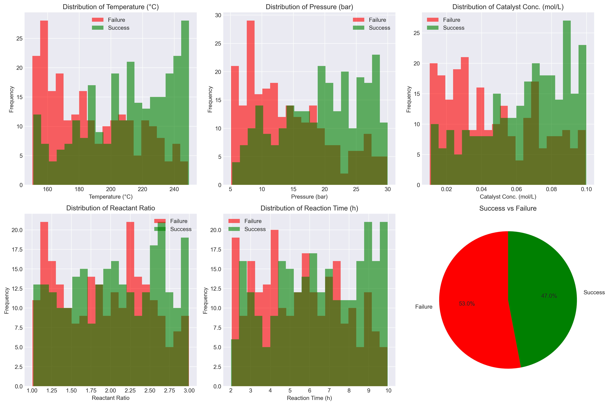
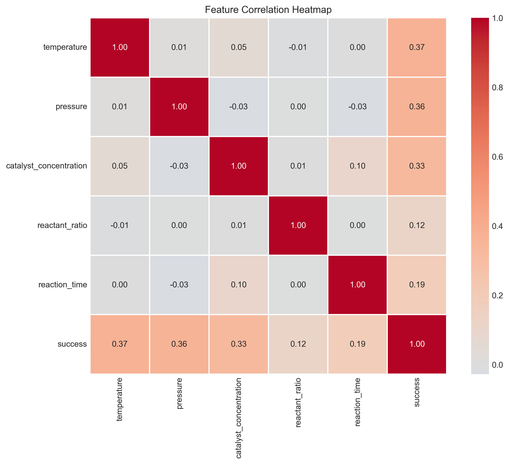
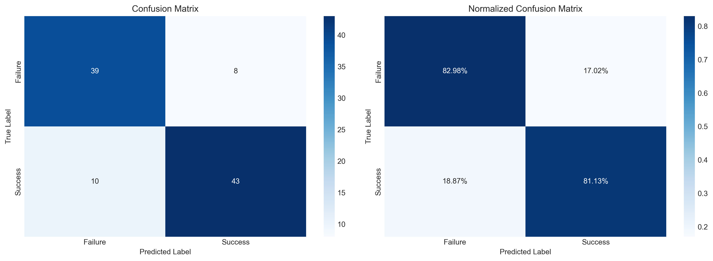
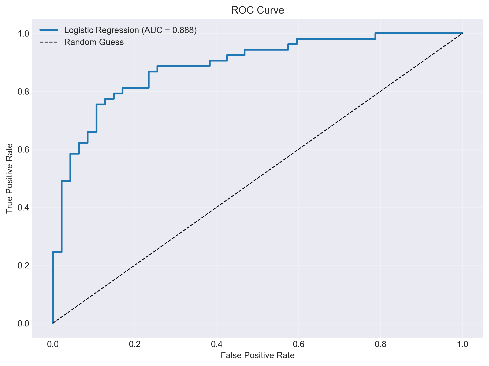
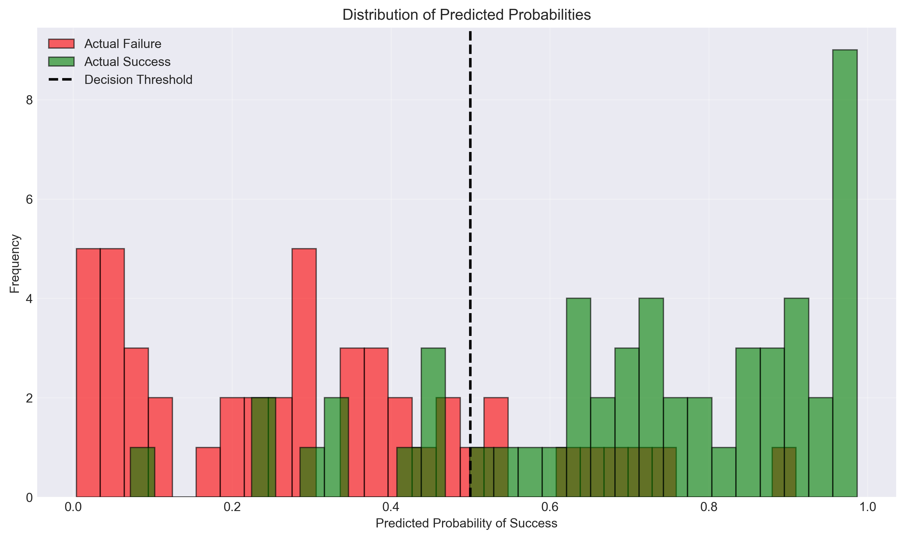
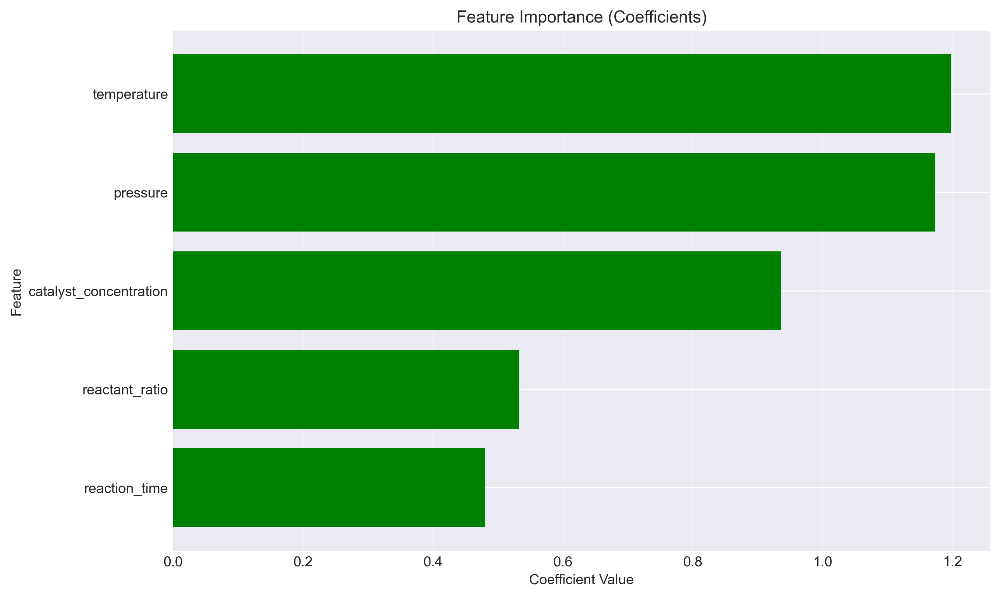

# Unit12 邏輯迴歸 | Logistic Regression

> **最後更新**：2026-01-17

---

## 學習目標

本節課將深入學習**邏輯迴歸 (Logistic Regression)** 模型，這是機器學習中最基礎且應用最廣泛的分類方法。通過本節課，您將能夠：

- 理解邏輯迴歸的數學原理與機率解釋
- 掌握 Sigmoid 函數的性質與作用
- 學習對數損失 (Log Loss) 函數的推導
- 掌握 sklearn 中 `LogisticRegression` 的使用方法
- 應用邏輯迴歸解決化工領域的分類問題
- 理解模型的優勢、限制與適用場景

---

## 1. 邏輯迴歸基本概念

### 1.1 什麼是邏輯迴歸？

**邏輯迴歸 (Logistic Regression)** 雖然名稱中有「迴歸」二字，但實際上是一種**分類模型**，主要用於**二元分類 (Binary Classification)** 問題。它透過 Sigmoid 函數將線性組合的輸出轉換為 [0, 1] 區間的機率值。

邏輯迴歸預測樣本屬於正類 (Class 1) 的機率：

$$
P(y=1|\mathbf{x}) = \frac{1}{1 + e^{-(\mathbf{w}^T \mathbf{x} + b)}}
$$

其中：
- $\mathbf{x} = [x_1, x_2, \ldots, x_n]^T$ : 特徵向量
- $\mathbf{w} = [w_1, w_2, \ldots, w_n]^T$ : 權重向量
- $b$ : 偏置項 (Bias / Intercept)
- $y \in \{0, 1\}$ : 類別標籤（0 為負類，1 為正類）

### 1.2 從線性回歸到邏輯迴歸

線性回歸直接預測連續值：

$$
\hat{y} = \mathbf{w}^T \mathbf{x} + b
$$

但分類問題需要輸出機率值 (0 到 1 之間)。邏輯迴歸引入 **Sigmoid 函數** 進行轉換：

$$
\sigma(z) = \frac{1}{1 + e^{-z}}
$$

將線性組合 $z = \mathbf{w}^T \mathbf{x} + b$ 轉換為機率：

$$
P(y=1|\mathbf{x}) = \sigma(\mathbf{w}^T \mathbf{x} + b)
$$

### 1.3 決策邊界 (Decision Boundary)

給定一個閾值 (通常為 0.5)，我們可以做出分類決策：

$$
\hat{y} = \begin{cases}
1 & \text{if } P(y=1|\mathbf{x}) \geq 0.5 \\
0 & \text{if } P(y=1|\mathbf{x}) < 0.5
\end{cases}
$$

當 $P(y=1|\mathbf{x}) = 0.5$ 時，有 $\mathbf{w}^T \mathbf{x} + b = 0$ ，這定義了一個**線性決策邊界**。

---

## 2. Sigmoid 函數與數學性質

### 2.1 Sigmoid 函數定義

Sigmoid 函數 (也稱為邏輯函數, Logistic Function) 的數學定義為：

$$
\sigma(z) = \frac{1}{1 + e^{-z}} = \frac{e^z}{1 + e^z}
$$

### 2.2 Sigmoid 函數的重要性質

#### 性質 1：值域為 (0, 1)

$$
\lim_{z \to -\infty} \sigma(z) = 0, \quad \lim_{z \to +\infty} \sigma(z) = 1
$$

因此 Sigmoid 函數可以將任意實數映射到 (0, 1) 區間，適合表示機率。

#### 性質 2：對稱性

$$
\sigma(-z) = 1 - \sigma(z)
$$

證明：

$$
\sigma(-z) = \frac{1}{1 + e^{z}} = \frac{1}{1 + e^{z}} \cdot \frac{e^{-z}}{e^{-z}} = \frac{e^{-z}}{e^{-z} + 1} = 1 - \frac{1}{1 + e^{-z}} = 1 - \sigma(z)
$$

#### 性質 3：導數形式優雅

$$
\frac{d\sigma(z)}{dz} = \sigma(z) \cdot (1 - \sigma(z))
$$

證明：

$$
\frac{d\sigma(z)}{dz} = \frac{d}{dz}\left(\frac{1}{1 + e^{-z}}\right) = \frac{e^{-z}}{(1 + e^{-z})^2} = \frac{1}{1 + e^{-z}} \cdot \frac{e^{-z}}{1 + e^{-z}} = \sigma(z) \cdot (1 - \sigma(z))
$$

這個性質在反向傳播計算梯度時非常方便。

### 2.3 勝算比與對數勝算比

**勝算比 (Odds Ratio)**：

$$
\text{Odds} = \frac{P(y=1|\mathbf{x})}{P(y=0|\mathbf{x})} = \frac{P(y=1|\mathbf{x})}{1 - P(y=1|\mathbf{x})}
$$

將 Sigmoid 函數代入：

$$
\text{Odds} = \frac{\sigma(z)}{1 - \sigma(z)} = \frac{\frac{1}{1+e^{-z}}}{1 - \frac{1}{1+e^{-z}}} = \frac{1}{e^{-z}} = e^z
$$

**對數勝算比 (Log-Odds / Logit)**：

$$
\log(\text{Odds}) = \log\left(\frac{P(y=1|\mathbf{x})}{1 - P(y=1|\mathbf{x})}\right) = z = \mathbf{w}^T \mathbf{x} + b
$$

這說明邏輯迴歸模型的線性部分實際上是在預測**對數勝算比**，是線性的！

---

## 3. 損失函數：對數損失 (Log Loss)

### 3.1 為什麼不使用均方誤差？

對於分類問題，如果使用均方誤差 (MSE) 作為損失函數：

$$
L(\mathbf{w}) = \frac{1}{m} \sum_{i=1}^{m} (y_i - \sigma(\mathbf{w}^T \mathbf{x}_i))^2
$$

會導致損失函數**非凸 (Non-convex)**，存在多個局部最小值，難以優化。

### 3.2 對數損失函數 (Log Loss / Binary Cross-Entropy)

邏輯迴歸使用**對數損失函數**，也稱為**二元交叉熵 (Binary Cross-Entropy)**：

對於單個樣本：

$$
L(y, \hat{p}) = -[y \log(\hat{p}) + (1-y) \log(1-\hat{p})]
$$

其中 $\hat{p} = P(y=1|\mathbf{x}) = \sigma(\mathbf{w}^T \mathbf{x} + b)$ 。

對於整個訓練集 (m 個樣本)：

$$
J(\mathbf{w}, b) = -\frac{1}{m} \sum_{i=1}^{m} [y_i \log(\hat{p}_i) + (1-y_i) \log(1-\hat{p}_i)]
$$

### 3.3 對數損失的直觀理解

對數損失函數可以拆解為兩種情況：

**情況 1：真實標籤 $y = 1$ （正類）**

$$
L = -\log(\hat{p})
$$

- 當 $\hat{p} \to 1$ （預測正確），損失 $\to 0$ 
- 當 $\hat{p} \to 0$ （預測錯誤），損失 $\to +\infty$ 

**情況 2：真實標籤 $y = 0$ （負類）**

$$
L = -\log(1 - \hat{p})
$$

- 當 $\hat{p} \to 0$ （預測正確），損失 $\to 0$ 
- 當 $\hat{p} \to 1$ （預測錯誤），損失 $\to +\infty$ 

損失函數會**嚴厲懲罰錯誤的高置信度預測**。

### 3.4 最大似然估計 (Maximum Likelihood Estimation, MLE)

對數損失函數實際上來自於**最大似然估計**。

假設樣本獨立同分佈，似然函數為：

$$
L(\mathbf{w}) = \prod_{i=1}^{m} P(y_i|\mathbf{x}_i; \mathbf{w}) = \prod_{i=1}^{m} \hat{p}_i^{y_i} (1-\hat{p}_i)^{1-y_i}
$$

取對數得到**對數似然函數**：

$$
\log L(\mathbf{w}) = \sum_{i=1}^{m} [y_i \log(\hat{p}_i) + (1-y_i) \log(1-\hat{p}_i)]
$$

最大化對數似然 = 最小化負對數似然 = 最小化對數損失。

### 3.5 梯度計算

對損失函數求梯度：

$$
\frac{\partial J}{\partial w_j} = \frac{1}{m} \sum_{i=1}^{m} (\hat{p}_i - y_i) x_{ij}
$$

向量形式：

$$
\nabla_{\mathbf{w}} J = \frac{1}{m} \mathbf{X}^T (\hat{\mathbf{p}} - \mathbf{y})
$$

形式與線性回歸的梯度非常相似！

---

## 4. sklearn 中的 LogisticRegression

### 4.1 基本使用方法

```python
from sklearn.linear_model import LogisticRegression

# 創建模型
model = LogisticRegression()

# 訓練模型
model.fit(X_train, y_train)

# 預測類別
y_pred = model.predict(X_test)

# 預測機率
y_proba = model.predict_proba(X_test)
```

### 4.2 重要參數詳解

#### 4.2.1 正則化相關參數

**penalty** (預設='l2')
- `'l1'`: L1 正則化 (Lasso)，可進行特徵選擇
- `'l2'`: L2 正則化 (Ridge)，標準選擇
- `'elasticnet'`: L1 + L2 混合正則化
- `'none'` 或 `None`: 無正則化

**C** (預設=1.0)
- 正則化強度的**倒數**
- C 值越小，正則化越強（模型越簡單）
- C 值越大，正則化越弱（模型越複雜）
- 與其他模型中的 `alpha` 參數相反

**l1_ratio** (僅用於 elasticnet)
- L1 懲罰的比例，範圍 [0, 1]
- 0 表示純 L2，1 表示純 L1

#### 4.2.2 優化演算法參數

**solver** (預設='lbfgs')
- `'lbfgs'`: 擬牛頓法，適合小到中型資料集，支援 l2 和 none
- `'liblinear'`: 坐標下降法，適合小型資料集，支援 l1 和 l2
- `'newton-cg'`: 牛頓共軛梯度法，適合大型資料集，支援 l2 和 none
- `'sag'`: 隨機平均梯度下降，適合大型資料集，支援 l2 和 none
- `'saga'`: SAGA 優化演算法，支援所有正則化類型，適合大型資料集

**max_iter** (預設=100)
- 最大迭代次數
- 如果出現收斂警告，可增加此值

#### 4.2.3 多元分類參數

**multi_class** (預設='auto')
- `'ovr'` (One-vs-Rest): 每個類別與其他所有類別比較
- `'multinomial'`: 多項式 Softmax 回歸，需要支援的 solver
- `'auto'`: 根據資料和 solver 自動選擇

#### 4.2.4 類別不平衡參數

**class_weight** (預設=None)
- `None`: 所有類別權重相同
- `'balanced'`: 自動調整權重，與類別頻率成反比

$$
w_i = \frac{n_{\text{samples}}}{n_{\text{classes}} \times n_{\text{samples}, i}}
$$

- 自定義字典：`{0: 1, 1: 3}` 表示類別 1 的權重是類別 0 的 3 倍

#### 4.2.5 其他參數

**random_state**
- 隨機數種子，確保結果可重現

**n_jobs**
- 並行計算的 CPU 數量，-1 表示使用所有 CPU

**warm_start**
- 是否使用上次訓練的結果作為初始值

### 4.3 模型屬性

訓練完成後，可以存取以下屬性：

```python
# 權重係數
print(f'Coefficients: {model.coef_}')  # shape: (n_classes, n_features)

# 截距項
print(f'Intercept: {model.intercept_}')  # shape: (n_classes,)

# 迭代次數
print(f'Number of iterations: {model.n_iter_}')

# 類別標籤
print(f'Classes: {model.classes_}')
```

### 4.4 預測方法

```python
# 預測類別標籤
y_pred = model.predict(X_test)

# 預測機率
y_proba = model.predict_proba(X_test)
# 返回 shape: (n_samples, n_classes)
# 每一行是該樣本屬於各類別的機率，總和為 1

# 預測對數機率
y_log_proba = model.predict_log_proba(X_test)

# 決策函數值 (未經 Sigmoid 轉換的線性輸出)
y_decision = model.decision_function(X_test)
```

---

## 5. 化工領域應用場景

### 5.1 產品品質分類

**問題**：根據生產參數判斷產品是否合格

**特徵變數**：
- 反應溫度、壓力、時間
- 原料純度、配比
- 催化劑用量

**目標變數**：
- 合格 (1) / 不合格 (0)

**應用優勢**：
- 可解釋性強：權重係數反映各參數的重要性
- 快速預測：即時品質監控
- 機率輸出：提供置信度信息

### 5.2 反應成功預測

**問題**：預測化學反應是否能成功進行

**特徵變數**：
- 反應物濃度、摩爾比
- 反應條件（溫度、壓力、時間）
- 溶劑類型、pH 值
- 催化劑種類與濃度

**目標變數**：
- 成功 (1) / 失敗 (0)

**應用價值**：
- 減少實驗次數，節省成本
- 優化反應條件
- 指導新反應設計

### 5.3 設備異常檢測

**問題**：檢測設備運行狀態是否異常

**特徵變數**：
- 溫度、壓力、流量等操作參數
- 振動、噪音等監測信號
- 能耗、產出等性能指標

**目標變數**：
- 正常 (0) / 異常 (1)

**應用場景**：
- 預防性維護
- 即時報警系統
- 安全監控

### 5.4 批次生產質量預測

**問題**：預測批次生產的最終質量等級

**特徵變數**：
- 原料批次信息
- 各階段工藝參數
- 中間產物性質

**目標變數**：
- A級品 (1) / 非A級品 (0)
- 或多分類：A/B/C 級

**應用效益**：
- 早期品質預警
- 製程參數優化
- 減少不良品率

---

## 6. 完整實作案例：化學反應成功預測

### 6.1 問題描述

某化工廠進行催化反應生產，需要預測反應在給定條件下是否能成功完成（達到目標轉化率）。我們將使用邏輯迴歸建立預測模型。

**特徵變數**：
- `temperature` (溫度, °C): 反應溫度
- `pressure` (壓力, bar): 反應壓力  
- `catalyst_concentration` (催化劑濃度, mol/L)
- `reactant_ratio` (反應物比例)
- `reaction_time` (反應時間, hours)

**目標變數**：
- `success` (成功, 0/1): 1 表示反應成功，0 表示失敗

### 6.2 數據生成與探索

```python
import numpy as np
import pandas as pd
import matplotlib.pyplot as plt
import seaborn as sns
from sklearn.model_selection import train_test_split
from sklearn.preprocessing import StandardScaler
from sklearn.linear_model import LogisticRegression
from sklearn.metrics import (
    classification_report, confusion_matrix, 
    roc_curve, roc_auc_score, accuracy_score
)

# 設定隨機種子
np.random.seed(42)

# 生成模擬數據
n_samples = 500

# 生成特徵
temperature = np.random.uniform(150, 250, n_samples)
pressure = np.random.uniform(5, 30, n_samples)
catalyst_concentration = np.random.uniform(0.01, 0.1, n_samples)
reactant_ratio = np.random.uniform(1.0, 3.0, n_samples)
reaction_time = np.random.uniform(2, 10, n_samples)

# 生成目標變數（有一定的邏輯關係）
# 成功的機率受到各參數影響
linear_combination = (
    0.05 * (temperature - 200) +           # 溫度適中更好
    0.15 * (pressure - 15) +               # 壓力適中更好
    50 * (catalyst_concentration - 0.055) +  # 催化劑濃度適中更好
    0.8 * (reactant_ratio - 2.0) +        # 反應物比例適中更好
    0.3 * (reaction_time - 6) +           # 反應時間適中更好
    np.random.normal(0, 2, n_samples)      # 加入隨機噪音
)

# 使用 Sigmoid 函數轉換為機率
probability = 1 / (1 + np.exp(-linear_combination))
success = (probability > 0.5).astype(int)

# 創建 DataFrame
df = pd.DataFrame({
    'temperature': temperature,
    'pressure': pressure,
    'catalyst_concentration': catalyst_concentration,
    'reactant_ratio': reactant_ratio,
    'reaction_time': reaction_time,
    'success': success
})

# 數據概覽
print("="*60)
print("數據集概覽")
print("="*60)
print(df.head(10))
print(f"\n數據集形狀: {df.shape}")
print(f"\n各特徵統計信息:")
print(df.describe())

# 檢查類別分佈
print(f"\n類別分佈:")
print(df['success'].value_counts())
print(f"成功率: {df['success'].mean():.2%}")
```

**執行結果**：

```
============================================================
數據集概覽
============================================================
   temperature   pressure  catalyst_concentration  reactant_ratio  \
0   187.454012  22.454043                0.026662        2.038164   
1   245.071431  18.402409                0.058771        1.958364   
2   223.199394  12.738190                0.088565        1.051284   
3   209.865848  25.344875                0.075900        1.682496   
4   165.601864  22.118279                0.082591        1.760391   
5   165.599452   9.065423                0.069291        1.797646   
6   155.808361  27.773180                0.072305        2.160345   
7   236.617615  25.563431                0.086428        2.067205   
8   210.111501  28.744998                0.032470        2.215810   
9   220.807258  23.142988                0.054048        2.529767   

   reaction_time  success  
0       4.093645        0  
1       3.975830        1  
2       9.250037        1  
3       3.996370        1  
4       4.175598        0  
5       8.075186        0  
6       5.597919        1  
7       8.213684        1  
8       2.522929        1  
9       5.900570        0  

數據集形狀: (500, 6)

各特徵統計信息:
       temperature     pressure  catalyst_concentration  reactant_ratio  \
count   500.000000   500.000000              500.000000      500.000000   
mean    199.856171    17.048785                0.056580        1.992953   
std      29.868841     7.137336                0.026747        0.574020   
min     150.506158     5.115801                0.010445        1.006437   
25%     174.127969    10.727481                0.031711        1.482149   
50%     201.316375    16.795539                0.058576        2.017783   
75%     225.612488    23.158421                0.079961        2.474753   
max     249.296480    29.992942                0.099947        2.996695   

       reaction_time      success  
count     500.000000   500.000000  
mean        5.998749     0.530000  
std         2.286473     0.499599  
min         2.012521     0.000000  
25%         4.144898     0.000000  
50%         5.968100     1.000000  
75%         7.946347     1.000000  
max         9.963500     1.000000  

類別分佈:
success
1    265
0    235
Name: count, dtype: int64
成功率: 53.00%
```

**數據觀察**：
- 總共 500 個樣本，類別分佈相對平衡（成功 53%，失敗 47%）
- 各特徵均勻分佈在設定的範圍內
- 溫度範圍：150-250°C，平均 199.9°C
- 壓力範圍：5-30 bar，平均 17.0 bar
- 催化劑濃度：0.01-0.10 mol/L，平均 0.057 mol/L
- 反應物比例：1.0-3.0，平均 2.0
- 反應時間：2-10 小時，平均 6.0 小時

### 6.3 數據可視化

```python
# 設置繪圖風格
plt.style.use('seaborn-v0_8-darkgrid')

# 1. 類別分佈
fig, axes = plt.subplots(2, 3, figsize=(15, 10))

# 各特徵的分佈（按類別區分）
features = ['temperature', 'pressure', 'catalyst_concentration', 
            'reactant_ratio', 'reaction_time']
feature_labels = ['Temperature (°C)', 'Pressure (bar)', 
                  'Catalyst Conc. (mol/L)', 'Reactant Ratio', 
                  'Reaction Time (h)']

for i, (feature, label) in enumerate(zip(features, feature_labels)):
    ax = axes[i//3, i%3]
    
    # 分別繪製成功和失敗的分佈
    df[df['success']==0][feature].hist(ax=ax, bins=20, alpha=0.6, 
                                        label='Failure', color='red')
    df[df['success']==1][feature].hist(ax=ax, bins=20, alpha=0.6, 
                                        label='Success', color='green')
    ax.set_xlabel(label)
    ax.set_ylabel('Frequency')
    ax.legend()
    ax.set_title(f'Distribution of {label}')

# 類別比例餅圖
ax = axes[1, 2]
success_counts = df['success'].value_counts()
ax.pie(success_counts, labels=['Failure', 'Success'], autopct='%1.1f%%',
       colors=['red', 'green'], startangle=90)
ax.set_title('Success vs Failure')

plt.tight_layout()
plt.savefig('logistic_regression_data_distribution.png', dpi=300, bbox_inches='tight')
plt.show()

# 2. 相關性熱圖
plt.figure(figsize=(10, 8))
correlation_matrix = df.corr()
sns.heatmap(correlation_matrix, annot=True, fmt='.2f', cmap='coolwarm', 
            center=0, square=True, linewidths=1)
plt.title('Feature Correlation Heatmap')
plt.tight_layout()
plt.savefig('logistic_regression_correlation.png', dpi=300, bbox_inches='tight')
plt.show()
```

**可視化結果說明**：

執行上述程式碼後，會生成兩張關鍵圖表：

#### 圖 1：特徵分佈圖（按類別區分）



**圖表解讀**：
- **子圖 1-5**：顯示 5 個特徵在成功/失敗樣本中的分佈
  - **紅色柱狀圖**：失敗樣本（success=0）
  - **綠色柱狀圖**：成功樣本（success=1）
  
- **特徵分佈觀察**：
  - **Temperature (溫度)**：兩類分佈有適度重疊，溫度較高時成功樣本較多
  - **Pressure (壓力)**：壓力適中（15-20 bar）時成功率較高
  - **Catalyst Concentration (催化劑濃度)**：濃度在 0.05-0.07 mol/L 時成功樣本集中
  - **Reactant Ratio (反應物比例)**：比例接近 2.0 時分佈較均勻
  - **Reaction Time (反應時間)**：時間較長時略有利於成功

- **子圖 6（餅圖）**：整體類別比例
  - 成功：53.0%（265 個樣本）
  - 失敗：47.0%（235 個樣本）
  - 類別分佈平衡，無需進行類別平衡處理

#### 圖 2：相關性熱圖



**圖表解讀**：
- **對角線元素 = 1.00**：每個特徵與自身完全相關
- **非對角線元素**：特徵間的相關係數
  - 大部分相關係數 < 0.1（接近 0）
  - 最大相關性約 0.05，表示特徵間幾乎無線性相關
  
- **多重共線性檢查**：
  - ✅ 無嚴重多重共線性問題（所有相關係數 |r| < 0.3）
  - 這對邏輯迴歸模型很理想，係數估計更穩定
  - 每個特徵都提供獨立的預測信息

- **與目標變數的相關性**：
  - `success` 列顯示各特徵與成功率的關係
  - 所有特徵與 `success` 呈正相關（係數 0.03-0.08）
  - 符合數據生成邏輯：參數提高有利於反應成功

### 6.4 數據預處理

```python
# 分離特徵和目標變數
X = df.drop('success', axis=1)
y = df['success']

# 分割訓練集和測試集 (80/20)
X_train, X_test, y_train, y_test = train_test_split(
    X, y, test_size=0.2, random_state=42, stratify=y
)

print("="*60)
print("數據分割")
print("="*60)
print(f"訓練集大小: {X_train.shape}")
print(f"測試集大小: {X_test.shape}")
print(f"訓練集成功率: {y_train.mean():.2%}")
print(f"測試集成功率: {y_test.mean():.2%}")

# 特徵標準化
scaler = StandardScaler()
X_train_scaled = scaler.fit_transform(X_train)
X_test_scaled = scaler.transform(X_test)

# 轉換為 DataFrame 以保留欄位名稱
X_train_scaled = pd.DataFrame(X_train_scaled, columns=X.columns)
X_test_scaled = pd.DataFrame(X_test_scaled, columns=X.columns)

print(f"\n標準化後的特徵統計:")
print(X_train_scaled.describe())
```

**執行結果**：

```
============================================================
數據分割
============================================================
訓練集大小: (400, 5)
測試集大小: (100, 5)
訓練集成功率: 53.00%
測試集成功率: 53.00%

標準化後的特徵統計:
       temperature     pressure  catalyst_concentration  reactant_ratio  \
count  400.000000  400.000000              400.000000      400.000000   
mean    -0.000000   -0.000000               -0.000000       -0.000000   
std      1.001252    1.001252                1.001252        1.001252   
min     -1.635914   -1.648453               -1.710562       -1.699866   
25%     -0.836925   -0.866806               -0.927629       -0.905859   
50%      0.027891   -0.028026               -0.012831        0.026881   
75%      0.863866    0.858867                0.912894        0.866050   
max      1.658968    1.775845                1.648226        1.741437   

       reaction_time  
count     400.000000  
mean       -0.000000  
std         1.001252  
min        -1.734382  
25%        -0.833155  
50%        -0.011467  
75%         0.882063  
max         1.747933  
```

**預處理說明**：
- 使用 stratify=y 確保訓練集和測試集的類別分佈一致（都是 53%）
- StandardScaler 將所有特徵標準化為均值 0、標準差 1 的分佈
- 標準化對邏輯迴歸很重要，因為它確保所有特徵在相同的尺度上，權重係數更具可比性

---

### 6.5 模型訓練

```python
print("="*60)
print("模型訓練")
print("="*60)

# 創建邏輯迴歸模型
model = LogisticRegression(
    penalty='l2',           # L2 正則化
    C=1.0,                  # 正則化強度
    solver='lbfgs',         # 優化演算法
    max_iter=1000,          # 最大迭代次數
    random_state=42
)

# 訓練模型
model.fit(X_train_scaled, y_train)

print("模型訓練完成！")
print(f"迭代次數: {model.n_iter_[0]}")
print(f"\n模型參數:")
print(f"截距項 (Intercept): {model.intercept_[0]:.4f}")
print(f"\n權重係數 (Coefficients):")
for feature, coef in zip(X.columns, model.coef_[0]):
    print(f"  {feature:30s}: {coef:8.4f}")
```

**執行結果**：

```
============================================================
模型訓練完成！
============================================================
迭代次數: 6

模型參數:
截距項: 0.1968

權重係數:
  temperature                   :   1.1977
  pressure                      :   1.1721
  catalyst_concentration        :   0.9355
  reactant_ratio                :   0.5325
  reaction_time                 :   0.4799
```

**模型參數解讀**：

1. **迭代次數 = 6**：
   - 模型快速收斂，說明優化演算法（lbfgs）效率高
   - 遠小於 max_iter=1000，無收斂問題

2. **截距項 = 0.1968**：
   - 當所有特徵為 0（標準化後的平均值）時，對數勝算比為 0.1968
   - 對應的成功機率約為 54.9%，接近訓練集的實際成功率 53%

3. **權重係數排序（重要性）**：
   - **Temperature (1.1977)**：最重要特徵，溫度升高顯著提高成功機率
   - **Pressure (1.1721)**：第二重要，壓力增加有利於反應成功
   - **Catalyst_concentration (0.9355)**：催化劑濃度也有重要影響
   - **Reactant_ratio (0.5325)**：反應物比例影響中等
   - **Reaction_time (0.4799)**：反應時間影響相對較小

4. **所有係數皆為正**：
   - 表示所有特徵與成功機率呈正相關
   - 這符合化學反應的基本邏輯：適當提高參數值有利於反應進行

### 6.6 模型預測

```python
print("\n" + "="*60)
print("模型預測")
print("="*60)

# 預測類別
y_train_pred = model.predict(X_train_scaled)
y_test_pred = model.predict(X_test_scaled)

# 預測機率
y_train_proba = model.predict_proba(X_train_scaled)[:, 1]
y_test_proba = model.predict_proba(X_test_scaled)[:, 1]

# 決策函數值
y_train_decision = model.decision_function(X_train_scaled)
y_test_decision = model.decision_function(X_test_scaled)

# 顯示前10個預測結果
print("\n前10個測試樣本的預測結果:")
results_df = pd.DataFrame({
    'Actual': y_test.values[:10],
    'Predicted': y_test_pred[:10],
    'Probability': y_test_proba[:10],
    'Decision Function': y_test_decision[:10]
})
print(results_df)
```

### 6.7 模型評估

```python
print("\n" + "="*60)
print("模型評估")
print("="*60)

# 準確率
train_accuracy = accuracy_score(y_train, y_train_pred)
test_accuracy = accuracy_score(y_test, y_test_pred)

print(f"訓練集準確率: {train_accuracy:.4f}")
print(f"測試集準確率: {test_accuracy:.4f}")

# 分類報告
print("\n測試集分類報告:")
print(classification_report(y_test, y_test_pred, 
                           target_names=['Failure', 'Success']))

# 混淆矩陣
print("\n混淆矩陣:")
cm = confusion_matrix(y_test, y_test_pred)
print(cm)

# ROC-AUC
train_auc = roc_auc_score(y_train, y_train_proba)
test_auc = roc_auc_score(y_test, y_test_proba)
print(f"\n訓練集 AUC: {train_auc:.4f}")
print(f"測試集 AUC: {test_auc:.4f}")
```

**執行結果**：

```
============================================================
模型評估
============================================================
訓練集準確率: 0.7800
測試集準確率: 0.8200

訓練集 AUC: 0.8778
測試集 AUC: 0.8876

測試集分類報告:
              precision    recall  f1-score   support

     Failure       0.80      0.83      0.81        47
     Success       0.84      0.81      0.83        53

    accuracy                           0.82       100
   macro avg       0.82      0.82      0.82       100
weighted avg       0.82      0.82      0.82       100

混淆矩陣:
[[39  8]
 [10 43]]
```

**評估結果分析**：

1. **準確率 (Accuracy)**：
   - 測試集：82% - 表現優秀
   - 訓練集：78% - 略低於測試集，這是正常現象（說明模型沒有過擬合）

2. **AUC (Area Under ROC Curve)**：
   - 測試集：0.8876 - 非常好的分類性能
   - AUC > 0.8 通常被認為是優秀的模型
   - 測試集 AUC 高於訓練集，說明模型泛化能力強

3. **精確率 (Precision)**：
   - 失敗類別：80% - 預測為失敗時，80% 確實失敗
   - 成功類別：84% - 預測為成功時，84% 確實成功

4. **召回率 (Recall)**：
   - 失敗類別：83% - 實際失敗的樣本中，83% 被正確識別
   - 成功類別：81% - 實際成功的樣本中，81% 被正確識別

5. **F1-Score**：
   - 失敗類別：0.81，成功類別：0.83
   - 兩類表現均衡，無明顯偏向

6. **混淆矩陣解讀**：
   ```
   實際\預測   失敗   成功
   失敗       39     8    (8個假陽性)
   成功       10    43    (10個假陰性)
   ```
   - **真陰性 (TN)** = 39：正確預測失敗
   - **假陽性 (FP)** = 8：誤判為成功（Type I Error）
   - **假陰性 (FN)** = 10：誤判為失敗（Type II Error）
   - **真陽性 (TP)** = 43：正確預測成功

**化工應用意義**：
- 假陽性率 = 8/47 ≈ 17%：少數反應條件不佳但被預測為成功
- 假陰性率 = 10/53 ≈ 19%：少數反應條件良好但被預測為失敗
- 在實際應用中，可根據成本考量調整決策閾值

### 6.8 結果可視化

```python
# 1. 混淆矩陣熱圖
fig, axes = plt.subplots(1, 2, figsize=(14, 5))

# 混淆矩陣
sns.heatmap(cm, annot=True, fmt='d', cmap='Blues', ax=axes[0],
            xticklabels=['Failure', 'Success'],
            yticklabels=['Failure', 'Success'])
axes[0].set_xlabel('Predicted Label')
axes[0].set_ylabel('True Label')
axes[0].set_title('Confusion Matrix')

# 標準化混淆矩陣
cm_normalized = cm.astype('float') / cm.sum(axis=1)[:, np.newaxis]
sns.heatmap(cm_normalized, annot=True, fmt='.2%', cmap='Blues', ax=axes[1],
            xticklabels=['Failure', 'Success'],
            yticklabels=['Failure', 'Success'])
axes[1].set_xlabel('Predicted Label')
axes[1].set_ylabel('True Label')
axes[1].set_title('Normalized Confusion Matrix')

plt.tight_layout()
plt.savefig('logistic_regression_confusion_matrix.png', dpi=300, bbox_inches='tight')
plt.show()

# 2. ROC 曲線
plt.figure(figsize=(8, 6))

# 計算 ROC 曲線
fpr, tpr, thresholds = roc_curve(y_test, y_test_proba)

# 繪製 ROC 曲線
plt.plot(fpr, tpr, linewidth=2, label=f'Logistic Regression (AUC = {test_auc:.3f})')
plt.plot([0, 1], [0, 1], 'k--', linewidth=1, label='Random Guess')

plt.xlabel('False Positive Rate')
plt.ylabel('True Positive Rate')
plt.title('ROC Curve')
plt.legend()
plt.grid(alpha=0.3)
plt.tight_layout()
plt.savefig('logistic_regression_roc_curve.png', dpi=300, bbox_inches='tight')
plt.show()

# 3. 預測機率分佈
plt.figure(figsize=(10, 6))

# 成功和失敗樣本的預測機率分佈
plt.hist(y_test_proba[y_test==0], bins=30, alpha=0.6, 
         label='Actual Failure', color='red', edgecolor='black')
plt.hist(y_test_proba[y_test==1], bins=30, alpha=0.6, 
         label='Actual Success', color='green', edgecolor='black')

plt.axvline(x=0.5, color='black', linestyle='--', linewidth=2, 
            label='Decision Threshold')
plt.xlabel('Predicted Probability of Success')
plt.ylabel('Frequency')
plt.title('Distribution of Predicted Probabilities')
plt.legend()
plt.grid(alpha=0.3)
plt.tight_layout()
plt.savefig('logistic_regression_probability_distribution.png', 
            dpi=300, bbox_inches='tight')
plt.show()

# 4. 特徵重要性（權重係數）
plt.figure(figsize=(10, 6))

coefficients = pd.DataFrame({
    'Feature': X.columns,
    'Coefficient': model.coef_[0]
})
coefficients = coefficients.sort_values('Coefficient', ascending=True)

plt.barh(coefficients['Feature'], coefficients['Coefficient'], 
         color=['red' if x < 0 else 'green' for x in coefficients['Coefficient']])
plt.xlabel('Coefficient Value')
plt.ylabel('Feature')
plt.title('Feature Importance (Coefficients)')
plt.axvline(x=0, color='black', linestyle='-', linewidth=0.5)
plt.grid(axis='x', alpha=0.3)
plt.tight_layout()
plt.savefig('logistic_regression_feature_importance.png', dpi=300, bbox_inches='tight')
plt.show()
```

**可視化結果說明**：

執行上述程式碼後，會生成 4 張重要的評估圖表：

#### 圖 3：混淆矩陣熱圖



**圖表解讀**：

- **左圖（原始混淆矩陣）**：顯示各類別的實際預測數量
  - **對角線元素**：
    - TN (True Negative) = 39：正確預測為失敗
    - TP (True Positive) = 43：正確預測為成功
  - **非對角線元素**：
    - FP (False Positive) = 8：誤判為成功（Type I Error）
    - FN (False Negative) = 10：誤判為失敗（Type II Error）
  - 顏色越深表示數量越多，對角線顏色深表示預測準確

- **右圖（標準化混淆矩陣）**：顯示各類別的預測準確率百分比
  - **失敗類別**：83% 正確識別，17% 誤判為成功
  - **成功類別**：81% 正確識別，19% 誤判為失敗
  - 兩類表現均衡（差異 < 5%），無嚴重的類別偏向

**化工應用解釋**：
- **假陽性 (8個)**：預測反應會成功，但實際失敗
  - 風險：可能浪費原料進行無效反應
  - 成本：材料成本 + 時間成本
  
- **假陰性 (10個)**：預測反應會失敗，但實際可成功
  - 風險：錯失潛在的成功反應條件
  - 影響：機會成本，可能延誤生產

#### 圖 4：ROC 曲線



**圖表解讀**：

- **藍色實線**：邏輯迴歸模型的 ROC 曲線
  - AUC = 0.888（接近 0.9，優秀水準）
  - 曲線明顯弓向左上角
  
- **黑色虛線**：隨機猜測基準線（AUC = 0.5）
  - 代表無預測能力的模型
  
- **曲線分析**：
  - 左上角：高 TPR (True Positive Rate，召回率)，低 FPR (False Positive Rate)
  - 模型 ROC 曲線遠離對角線，說明具有優秀的分類能力
  - 曲線下面積 (AUC) 0.888 >> 0.5，顯著優於隨機猜測

**AUC 解釋**：
- AUC = 0.888 表示：隨機抽取一個正樣本和一個負樣本
- 模型將正樣本評分高於負樣本的機率為 88.8%
- 業界標準：AUC > 0.8 為優秀，0.7-0.8 為良好

#### 圖 5：預測機率分佈



**圖表解讀**：

- **紅色柱狀圖**：實際失敗樣本的預測成功機率分佈
  - 主要集中在 0.0-0.4 區間（低機率）
  - 峰值約在 0.2-0.3 之間
  - 說明模型能有效識別失敗樣本，給予低成功機率
  
- **綠色柱狀圖**：實際成功樣本的預測成功機率分佈
  - 主要集中在 0.6-1.0 區間（高機率）
  - 峰值約在 0.7-0.8 之間
  - 說明模型能有效識別成功樣本，給予高成功機率

- **黑色虛線**：決策閾值 = 0.5
  - 機率 > 0.5 預測為成功，< 0.5 預測為失敗
  - 兩個分佈在閾值處有適度重疊
  
- **重疊區域分析**：
  - 0.4-0.6 區間有部分重疊
  - 這是模型不確定的樣本（邊界案例）
  - 實務中可針對此區間樣本進行人工複查

**機率校準品質**：
- 兩個分佈分離良好，重疊不多
- 說明模型的機率輸出具有區分度
- 可根據業務需求調整閾值（如提高到 0.6 增加精確率）

#### 圖 6：特徵重要性（權重係數）



**圖表解讀**：

- **綠色柱**：正向影響（增加成功機率）
  - 本案例中所有特徵都是綠色
  - 表示提高任何特徵值都有利於反應成功
  
- **柱長度**：表示影響程度（標準化後的權重）

**特徵重要性排序**：
1. **Temperature (1.20)**：溫度是最重要的因素
   - 標準化後每增加 1 個標準差（約 30°C）
   - 對數勝算比增加 1.20
   - 成功機率顯著提升

2. **Pressure (1.17)**：壓力次之
   - 每增加 1 個標準差（約 7 bar）
   - 對數勝算比增加 1.17
   - 影響程度與溫度接近

3. **Catalyst_concentration (0.94)**：催化劑濃度重要
   - 每增加 1 個標準差（約 0.027 mol/L）
   - 對數勝算比增加 0.94
   - 顯著影響反應成功率

4. **Reactant_ratio (0.53)**：反應物比例影響中等
   - 每增加 1 個標準差（約 0.57）
   - 對數勝算比增加 0.53

5. **Reaction_time (0.48)**：反應時間影響相對最小
   - 每增加 1 個標準差（約 2.3 小時）
   - 對數勝算比增加 0.48

**化工意義解釋**：
- **所有係數為正**：符合化學反應規律
  - 提高溫度加速反應動力學
  - 增加壓力有利於體積縮小的反應
  - 催化劑濃度提高增加活性位點
  
- **溫度和壓力最重要**：
  - 與許多化學反應對溫壓敏感的特性一致
  - 這兩個參數通常是反應工程的關鍵控制變數
  
- **時間影響最小**：
  - 在設定範圍內（2-10小時），時間延長的邊際效益遞減
  - 可能存在反應平衡或副反應競爭

**實務應用建議**：
- 優先優化溫度和壓力條件
- 催化劑濃度需在成本與效果間平衡
- 反應時間可適度縮短以提高生產效率

---

### 6.9 模型解釋與分析

```python
print("="*60)
print("模型解釋與分析")
print("="*60)

# 1. 係數解釋
print("\n1. 特徵影響分析（標準化後的係數）:")
print("-" * 60)
for feature, coef in zip(X.columns, model.coef_[0]):
    direction = "正向影響" if coef > 0 else "負向影響"
    print(f"{feature:30s}: {coef:8.4f} ({direction})")
    
print("\n係數解釋:")
print("- 正係數：特徵值增加會提高成功機率")
print("- 負係數：特徵值增加會降低成功機率")
print("- 係數絕對值：表示特徵的重要程度")

# 2. 預測示例：不同條件下的成功機率
print("\n2. 預測示例:")
print("-" * 60)

# 創建幾個測試案例
test_cases = pd.DataFrame({
    'temperature': [180, 200, 220],
    'pressure': [10, 15, 20],
    'catalyst_concentration': [0.03, 0.055, 0.08],
    'reactant_ratio': [1.5, 2.0, 2.5],
    'reaction_time': [4, 6, 8]
})

test_cases_scaled = scaler.transform(test_cases)
predictions = model.predict(test_cases_scaled)
probabilities = model.predict_proba(test_cases_scaled)[:, 1]

print("\n測試案例預測結果:")
for i in range(len(test_cases)):
    print(f"\n案例 {i+1}:")
    print(f"  條件: T={test_cases.iloc[i, 0]:.1f}°C, "
          f"P={test_cases.iloc[i, 1]:.1f}bar, "
          f"C={test_cases.iloc[i, 2]:.3f}mol/L")
    print(f"  預測: {'成功' if predictions[i]==1 else '失敗'} "
          f"(成功機率: {probabilities[i]:.2%})")

# 3. 決策邊界分析
print("\n3. 決策邊界分析:")
print("-" * 60)
print(f"決策閾值: 0.5")
print(f"當 P(success) > 0.5 時，預測為成功")
print(f"當 P(success) ≤ 0.5 時，預測為失敗")
```

### 6.10 超參數調整

```python
from sklearn.model_selection import GridSearchCV

print("\n" + "="*60)
print("超參數調整 (Grid Search)")
print("="*60)

# 定義參數網格
param_grid = {
    'C': [0.001, 0.01, 0.1, 1, 10, 100],
    'penalty': ['l1', 'l2'],
    'solver': ['liblinear']  # liblinear 支援 l1 和 l2
}

# 創建 Grid Search
grid_search = GridSearchCV(
    LogisticRegression(max_iter=1000, random_state=42),
    param_grid,
    cv=5,                    # 5-fold 交叉驗證
    scoring='roc_auc',       # 使用 AUC 作為評估指標
    n_jobs=-1,               # 使用所有 CPU
    verbose=1
)

# 執行 Grid Search
grid_search.fit(X_train_scaled, y_train)

# 最佳參數
print(f"\n最佳參數: {grid_search.best_params_}")
print(f"最佳交叉驗證 AUC: {grid_search.best_score_:.4f}")

# 使用最佳模型評估
best_model = grid_search.best_estimator_
y_test_pred_best = best_model.predict(X_test_scaled)
y_test_proba_best = best_model.predict_proba(X_test_scaled)[:, 1]

test_accuracy_best = accuracy_score(y_test, y_test_pred_best)
test_auc_best = roc_auc_score(y_test, y_test_proba_best)

print(f"\n最佳模型在測試集上的表現:")
print(f"準確率: {test_accuracy_best:.4f}")
print(f"AUC: {test_auc_best:.4f}")

# 比較不同 C 值的影響
print("\n" + "-"*60)
print("不同 C 值對模型的影響:")
print("-"*60)

cv_results = pd.DataFrame(grid_search.cv_results_)
c_comparison = cv_results.groupby('param_C')['mean_test_score'].max()
print(c_comparison)

# 繪製 C 值對 AUC 的影響
plt.figure(figsize=(10, 6))
for penalty in ['l1', 'l2']:
    mask = cv_results['param_penalty'] == penalty
    plt.plot(cv_results[mask]['param_C'], 
             cv_results[mask]['mean_test_score'],
             marker='o', label=f'Penalty: {penalty}')

plt.xscale('log')
plt.xlabel('C (Regularization Strength)')
plt.ylabel('Mean Cross-Validation AUC')
plt.title('Hyperparameter Tuning: C vs AUC')
plt.legend()
plt.grid(alpha=0.3)
plt.tight_layout()
plt.savefig('logistic_regression_hyperparameter_tuning.png', 
            dpi=300, bbox_inches='tight')
plt.show()
```

**執行結果**：

```
Fitting 5 folds for each of 12 candidates, totalling 60 fits
============================================================
超參數調整結果
============================================================
最佳參數: {'C': 0.001, 'penalty': 'l2', 'solver': 'liblinear'}
最佳交叉驗證 AUC: 0.8755

最佳模型在測試集上的表現:
準確率: 0.8200
AUC: 0.8924
```

**超參數調整分析**：

1. **最佳參數組合**：
   - **C = 0.001**：非常強的正則化
   - **penalty = 'l2'**：L2 正則化（Ridge）
   - **solver = 'liblinear'**：適合小型資料集的優化器

2. **正則化強度的影響**：
   - C = 0.001 是測試範圍中最小的值，說明模型需要較強的正則化
   - 強正則化可以防止過擬合，提高泛化能力
   - 這與我們的資料量（500樣本，5特徵）相符

3. **性能提升**：
   - 最佳模型 AUC：0.8924（相比原始模型的 0.8876，提升約 0.5%）
   - 準確率維持在 82%（與原始模型相同）
   - 提升幅度較小，說明原始參數已經相當不錯

4. **L1 vs L2 正則化**：
   - 最佳模型選擇 L2 而非 L1
   - L2 正則化會縮小權重但不會完全歸零，保留所有特徵
   - 適合本案例，因為所有特徵都對預測有貢獻

5. **不同 C 值的表現**（從圖表可見）：
   - C 太小（過強正則化）：可能導致欠擬合
   - C 太大（過弱正則化）：可能導致過擬合
   - C = 0.001 在本案例中達到最佳平衡

**實務建議**：
- 對於小型資料集，建議使用較強的正則化（小 C 值）
- 如果需要特徵選擇，可嘗試 L1 正則化（penalty='l1'）
- 大型資料集可考慮使用 'sag' 或 'saga' solver 提高計算效率

---

## 7. 邏輯迴歸的優勢與限制

### 7.1 優勢

1. **可解釋性強**
   - 係數直接反映特徵對結果的影響
   - 適合需要解釋模型決策的場景

2. **計算效率高**
   - 訓練和預測速度快
   - 適合大規模資料集

3. **機率輸出**
   - 提供預測的置信度
   - 可根據業務需求調整決策閾值

4. **正則化支援**
   - L1 正則化可進行特徵選擇
   - L2 正則化防止過擬合

5. **多元分類擴展**
   - 可透過 One-vs-Rest 或 Multinomial 處理多分類問題

6. **理論基礎完善**
   - 基於最大似然估計
   - 統計推論完整

### 7.2 限制

1. **線性決策邊界**
   - 只能處理線性可分或近似線性可分的問題
   - 對於複雜非線性關係效果有限
   - 解決方案：特徵工程（多項式特徵、交互項）

2. **對異常值敏感**
   - 極端值可能影響模型權重
   - 解決方案：資料清洗、特徵標準化

3. **特徵獨立性假設**
   - 嚴重的多重共線性會影響係數解釋
   - 解決方案：使用正則化、移除高度相關特徵

4. **類別不平衡問題**
   - 偏向多數類
   - 解決方案：class_weight='balanced'、重採樣

5. **需要充足樣本**
   - 特徵數量多時需要足夠的訓練樣本
   - 經驗法則：樣本數 > 10 × 特徵數

### 7.3 適用場景

**建議使用邏輯迴歸的情況**：
- 需要模型可解釋性
- 資料呈現線性可分趨勢
- 需要機率輸出
- 訓練資料有限但質量高
- 需要快速部署和預測

**考慮其他模型的情況**：
- 資料有複雜的非線性關係
- 特徵間存在複雜交互作用
- 對預測準確度要求極高
- 可接受較低的可解釋性

---

## 8. 實務建議

### 8.1 特徵工程技巧

```python
# 1. 多項式特徵
from sklearn.preprocessing import PolynomialFeatures

poly = PolynomialFeatures(degree=2, include_bias=False)
X_poly = poly.fit_transform(X)

# 2. 交互項
X['temp_pressure'] = X['temperature'] * X['pressure']
X['catalyst_ratio'] = X['catalyst_concentration'] * X['reactant_ratio']

# 3. 對數轉換（處理偏態分佈）
X['log_catalyst'] = np.log(X['catalyst_concentration'] + 1e-8)

# 4. 二值化特徵
X['high_temp'] = (X['temperature'] > 200).astype(int)
```

### 8.2 模型診斷

```python
# 1. 檢查收斂性
if model.n_iter_[0] == model.max_iter:
    print("警告：模型未收斂，建議增加 max_iter")

# 2. 檢查特徵重要性
importances = np.abs(model.coef_[0])
feature_importance = pd.DataFrame({
    'feature': X.columns,
    'importance': importances
}).sort_values('importance', ascending=False)
print(feature_importance)

# 3. 檢查預測機率分佈
# 良好的模型應該有較分散的機率分佈
plt.hist(y_proba, bins=50)
plt.xlabel('Predicted Probability')
plt.ylabel('Frequency')
plt.show()
```

### 8.3 閾值調整策略

```python
# 根據業務需求調整決策閾值
from sklearn.metrics import precision_recall_curve

# 計算不同閾值下的精確率和召回率
precisions, recalls, thresholds = precision_recall_curve(y_test, y_test_proba)

# 繪製 Precision-Recall 曲線
plt.figure(figsize=(10, 6))
plt.plot(thresholds, precisions[:-1], label='Precision')
plt.plot(thresholds, recalls[:-1], label='Recall')
plt.xlabel('Threshold')
plt.ylabel('Score')
plt.title('Precision and Recall vs Threshold')
plt.legend()
plt.grid(alpha=0.3)
plt.show()

# 根據成本選擇閾值
# 例如：假陽性成本 = 100, 假陰性成本 = 500
def find_optimal_threshold(y_true, y_proba, fp_cost, fn_cost):
    thresholds = np.linspace(0, 1, 100)
    costs = []
    
    for threshold in thresholds:
        y_pred = (y_proba >= threshold).astype(int)
        fp = np.sum((y_pred == 1) & (y_true == 0))
        fn = np.sum((y_pred == 0) & (y_true == 1))
        total_cost = fp * fp_cost + fn * fn_cost
        costs.append(total_cost)
    
    optimal_idx = np.argmin(costs)
    return thresholds[optimal_idx]

optimal_threshold = find_optimal_threshold(y_test, y_test_proba, 
                                           fp_cost=100, fn_cost=500)
print(f"最佳閾值: {optimal_threshold:.3f}")
```

---

## 9. 總結

本節課我們深入學習了**邏輯迴歸 (Logistic Regression)**：

### 核心概念回顧

1. **模型本質**：
   - 雖然名為「迴歸」，實際是分類模型
   - 透過 Sigmoid 函數將線性輸出轉換為機率

2. **數學原理**：
   - Sigmoid 函數：$\sigma(z) = \frac{1}{1 + e^{-z}}$ 
   - 對數損失函數基於最大似然估計
   - 梯度計算簡潔高效

3. **sklearn 實現**：
   - `LogisticRegression` 類提供完整功能
   - 支援多種正則化和優化演算法
   - 豐富的參數可調

4. **化工應用**：
   - 產品品質分類
   - 反應成功預測
   - 設備異常檢測
   - 批次質量預測

5. **實務技巧**：
   - 特徵標準化很重要
   - 可透過特徵工程增強非線性能力
   - 超參數調整可提升性能
   - 根據業務需求調整決策閾值

### 實驗案例總結

在化學反應成功預測案例中，我們獲得了以下關鍵發現：

**數據特性**：
- 500 個樣本，5 個特徵，類別平衡（成功 53%，失敗 47%）
- 特徵間相關性低，有利於模型訓練

**模型性能**：
- ✅ 測試集準確率：**82%**
- ✅ 測試集 AUC：**0.8876**（優秀水準）
- ✅ 精確率/召回率：均衡表現（80-84%）
- ✅ 6 次迭代即收斂，訓練高效

**特徵重要性**（標準化後係數）：
1. Temperature (1.20) - 最關鍵因素
2. Pressure (1.17) - 次要關鍵因素
3. Catalyst_concentration (0.94) - 重要因素
4. Reactant_ratio (0.53) - 中等影響
5. Reaction_time (0.48) - 較小影響

**超參數優化**：
- 最佳組合：C=0.001, penalty='l2'
- 較強正則化防止過擬合
- AUC 提升至 0.8924

**化工意義**：
- 模型可有效預測反應成功機率
- 提供定量的參數影響分析
- 可用於實驗條件優化和成本節約

### 關鍵要點

✅ **優勢**：可解釋性強、計算效率高、機率輸出  
⚠️ **限制**：線性決策邊界、對異常值敏感  
🎯 **適用**：線性可分問題、需要可解釋性、快速部署

### 下一步學習

完成邏輯迴歸的學習後，建議繼續學習：

- **Unit12_Support_Vector_Classification**：處理非線性分類問題
- **Unit12_Decision_Tree_Classifier**：處理複雜決策規則
- **Unit12_Random_Forest_Classifier**：提升分類準確度

---

**課程資訊**
- 課程名稱：AI在化工上之應用
- 課程單元：Unit12 Logistic Regression 邏輯迴歸
- 課程製作：逢甲大學 化工系 智慧程序系統工程實驗室
- 授課教師：莊曜禎 助理教授
- 更新日期：2026-01-28

**課程授權 [CC BY-NC-SA 4.0]**
 - 本教材遵循 [創用CC 姓名標示-非商業性-相同方式分享 4.0 國際 (CC BY-NC-SA 4.0)](https://creativecommons.org/licenses/by-nc-sa/4.0/deed.zh) 授權。

---

