# Unit 13: 隨機森林 (Random Forest)

**課程名稱**：AI 在化工上之應用  
**課程代碼**：CHE-AI-114  
**授課教師**：莊曜禎 助理教授  
**單元主題**：隨機森林 - 回歸與分類應用  
**適用對象**：化學工程學系學生  
**最後更新**：2026-01-20

---

## 學習目標

完成本單元後，學生將能夠：

1. 理解隨機森林的集成學習原理與 Bagging 機制
2. 掌握隨機特徵選擇與決策樹組合的優勢
3. 使用 `sklearn.ensemble.RandomForestRegressor` 與 `RandomForestClassifier` 建立模型
4. 理解隨機森林的超參數（樹的數量、深度、特徵數）
5. 分析特徵重要性與模型穩定性
6. 應用隨機森林於化工製程的回歸與分類問題
7. 比較隨機森林與單棵決策樹的性能差異
8. 掌握 OOB (Out-of-Bag) 驗證與不確定性估計方法

---

## 目錄

1. [隨機森林簡介](#1-隨機森林簡介)
2. [數學原理與理論基礎](#2-數學原理與理論基礎)
3. [隨機森林的工作原理](#3-隨機森林的工作原理)
4. [sklearn 實作](#4-sklearn-實作)
5. [超參數調整策略](#5-超參數調整策略)
6. [回歸應用：催化反應器優化](#6-回歸應用催化反應器優化)
7. [分類應用：催化反應成功預測](#7-分類應用催化反應成功預測)
8. [模型評估與解釋](#8-模型評估與解釋)
9. [隨機森林 vs 決策樹對比](#9-隨機森林-vs-決策樹對比)
10. [優勢與限制](#10-優勢與限制)
11. [進階主題](#11-進階主題)
12. [實務建議與最佳實踐](#12-實務建議與最佳實踐)
13. [總結](#13-總結)
14. [參考資料](#14-參考資料)

---

## 1. 隨機森林簡介

### 1.1 什麼是隨機森林？

**隨機森林 (Random Forest)** 是一種基於 **集成學習 (Ensemble Learning)** 的強大機器學習方法，通過結合多棵決策樹的預測結果來提升模型的準確度和穩定性。

**核心概念**：
- **森林**：由多棵獨立訓練的決策樹組成
- **隨機性**：每棵樹使用不同的資料子集和特徵子集
- **集成預測**：
  - 回歸問題：取所有樹預測值的平均
  - 分類問題：多數投票或平均機率

**工作原理**：
```
訓練階段：
for i = 1 to n_estimators:
    1. Bootstrap 採樣：從訓練集隨機抽取樣本（有放回）
    2. 隨機特徵：每次分裂時隨機選擇特徵子集
    3. 訓練決策樹 i

預測階段（回歸）：
ŷ = (1/n_estimators) × Σ ŷᵢ

預測階段（分類）：
ŷ = mode{ŷ₁, ŷ₂, ..., ŷₙ} 或平均機率
```

### 1.2 為什麼需要隨機森林？

**單棵決策樹的問題**：
- **高變異性**：訓練資料微小變化導致樹結構大幅改變
- **容易過擬合**：無限制生長會記憶訓練集
- **預測不穩定**：對新資料的泛化能力有限

**隨機森林的改進**：
- **降低變異 (Variance Reduction)**：多棵樹的平均減少預測波動
- **提升泛化 (Better Generalization)**：集成效應提升測試集性能
- **更穩健 (Robustness)**：對異常值和噪聲更魯棒
- **自動特徵選擇**：通過特徵重要性排序識別關鍵變數

### 1.3 隨機森林 vs 決策樹

| 特性 | 單棵決策樹 | 隨機森林 |
|------|-----------|---------|
| **模型複雜度** | 單一樹結構 | 多棵樹集成 |
| **訓練速度** | 快（秒級） | 較慢（需訓練多棵樹） |
| **預測速度** | 快 | 較慢（需彙總多棵樹） |
| **準確度** | 中等 | 高（通常提升 5-15%） |
| **穩定性** | 低（高變異） | 高（集成降低變異） |
| **過擬合風險** | 高 | 低（Bagging 效應） |
| **可解釋性** | 高（可視覺化樹） | 中等（多棵樹難以視覺化） |
| **特徵重要性** | 單一視角 | 多視角平均（更可靠） |

### 1.4 化工領域應用案例

| 應用領域 | 預測目標 | 任務類型 | 優勢 |
|---------|---------|---------|------|
| **製程優化** | 產率、純度 | 回歸 | 捕捉複雜非線性關係 |
| **品質預測** | 產品性質 | 回歸/分類 | 處理多個相關特徵 |
| **故障診斷** | 設備狀態 | 分類 | 魯棒性強，減少誤判 |
| **能耗預測** | 能源消耗 | 回歸 | 自動識別關鍵參數 |
| **配方設計** | 配方性能 | 回歸/分類 | 處理特徵交互作用 |
| **反應成功率** | 成功/失敗 | 分類 | 不確定性量化 |

---

## 2. 數學原理與理論基礎

### 2.1 集成學習基礎

**集成學習的核心思想**：結合多個弱學習器（weak learners）形成強學習器（strong learner）。

**數學表示**：

**回歸問題**：
設有 $B$ 個基礎模型 $f_1, f_2, \ldots, f_B$ ，集成模型的預測為：

$$
f_{\text{ensemble}}(\mathbf{x}) = \frac{1}{B} \sum_{b=1}^{B} f_b(\mathbf{x})
$$

**分類問題（硬投票）**：

$$
\hat{y} = \text{mode}\{f_1(\mathbf{x}), f_2(\mathbf{x}), \ldots, f_B(\mathbf{x})\}
$$

**分類問題（軟投票/平均機率）**：

$$
P(y = k | \mathbf{x}) = \frac{1}{B} \sum_{b=1}^{B} P_b(y = k | \mathbf{x})
$$

**為何集成有效？** (偏差-變異分解)

單一模型的預測誤差可分解為：
$$
\text{Error} = \text{Bias}^2 + \text{Variance} + \text{Noise}
$$

- **Bias (偏差)**：模型假設與真實關係的差距
- **Variance (變異)**：模型對訓練資料變化的敏感度
- **Noise (噪聲)**：資料本身的隨機誤差

**集成效應**：
$$
\text{Var}\left(\frac{1}{B}\sum_{b=1}^{B} f_b\right) = \frac{1}{B} \text{Var}(f)
$$

若各樹獨立，集成的變異為單棵樹的 $1/B$ ，但實際上樹之間有相關性：
$$
\text{Var}_{\text{ensemble}} = \rho \sigma^2 + \frac{1-\rho}{B}\sigma^2
$$

其中：
- $\rho$ ：樹之間的相關性
- $\sigma^2$ ：單棵樹的變異
- **目標**：降低 $\rho$ （通過隨機性）同時增加 $B$

### 2.2 Bootstrap 聚合 (Bagging)

**Bagging = Bootstrap Aggregating**

**Bootstrap 採樣**：
對於訓練集 $\mathcal{D} = \{(\mathbf{x}_i, y_i)\}_{i=1}^{N}$ ，第 $b$ 棵樹的訓練集 $\mathcal{D}_b$ 通過以下方式生成：

1. 從 $\mathcal{D}$ 中有放回地隨機抽取 $N$ 個樣本
2. 約有 63.2% 的樣本被抽中（at least once）
3. 剩餘 36.8% 的樣本稱為 **Out-of-Bag (OOB)** 樣本

**OOB 樣本的作用**：
- 可作為驗證集（無需額外切分）
- OOB 誤差是泛化誤差的無偏估計

**數學證明**（樣本被抽中的概率）：
$$
P(\text{sample selected}) = 1 - \left(1 - \frac{1}{N}\right)^N \xrightarrow{N\to\infty} 1 - e^{-1} \approx 0.632
$$

### 2.3 隨機特徵選擇

**Random Feature Selection**：每次節點分裂時，只考慮隨機選擇的 $m$ 個特徵。

**特徵數量 $m$ 的選擇**：
- **回歸問題預設值**：$m = p/3$ 或 $m = \sqrt{p}$
  - 其中 $p$ 是總特徵數
- **分類問題預設值**：$m = \sqrt{p}$

**為何隨機選擇特徵？**

1. **降低樹之間的相關性**：
   - 若不隨機，主導特徵會在每棵樹的頂層出現
   - 導致所有樹結構相似，集成效果差
   
2. **強制考慮次要特徵**：
   - 某些特徵可能在特定子集中更重要
   - 隨機性使得次要特徵有機會被選中

3. **增加樹的多樣性 (Decorrelation)**：
   - 避免某些強特徵主導所有樹
   - 提升集成效果

**演算法偽代碼**：
```
for b = 1 to B:
    # Bootstrap 採樣
    D_b = sample(D, size=N, replace=True)
    
    # 建立樹
    tree_b = DecisionTree()
    
    for each node in tree_b:
        # 隨機選擇特徵
        features = random_sample(all_features, size=m)
        
        # 從選定特徵中找最佳分裂
        best_split = find_best_split(D_b, features)
        
        # 分裂節點
        split_node(best_split)
```

### 2.4 預測與聚合

**回歸問題的預測**：
對於新樣本 $\mathbf{x}^*$ ，隨機森林的預測為所有樹預測的平均：

$$
\hat{y}^* = \frac{1}{B} \sum_{b=1}^{B} \hat{f}_b(\mathbf{x}^*)
$$

**分類問題的預測**：

**硬投票 (Hard Voting)**：
$$
\hat{y}^* = \text{mode}\{\hat{f}_1(\mathbf{x}^*), \hat{f}_2(\mathbf{x}^*), \ldots, \hat{f}_B(\mathbf{x}^*)\}
$$

**軟投票 (Soft Voting)**：
$$
\hat{y}^* = \arg\max_k \frac{1}{B} \sum_{b=1}^{B} P_b(y = k | \mathbf{x}^*)
$$

**預測區間 (Prediction Interval - 回歸專用)**：
利用多棵樹的預測分佈，可估計預測的不確定性：

$$
\text{Prediction Interval} = \left[ \hat{y}^* \pm 1.96 \times \text{SD}(\{\hat{f}_b(\mathbf{x}^*)\}_{b=1}^{B}) \right]
$$

其中 SD 是所有樹預測值的標準差。

### 2.5 特徵重要性

隨機森林的特徵重要性通過兩種方式計算：

#### 2.5.1 基於雜質減少 (Impurity-based / Gini Importance)

特徵 $j$ 的重要性為該特徵在所有樹、所有節點分裂中貢獻的**平均雜質減少量**：

$$
\text{Importance}(j) = \frac{1}{B} \sum_{b=1}^{B} \sum_{t \in T_b, \text{ splits on } j} \frac{N_t}{N} \cdot \Delta I(t)
$$

其中：
- $T_b$ ：第 $b$ 棵樹的所有節點
- $N_t$ ：節點 $t$ 的樣本數
- $\Delta I(t)$ ：分裂後的雜質減少量（Gini 或 Entropy）

**優點**：計算快速，sklearn 預設方法  
**缺點**：對高基數特徵有偏好

#### 2.5.2 基於排列重要性 (Permutation-based)

1. 計算模型在驗證集上的基準性能 $S_0$
2. 對特徵 $j$ ：
   - 隨機打亂該特徵的值
   - 重新計算性能 $S_j$
   - 重要性 = $S_0 - S_j$
3. 重複多次取平均

**優點**：無偏估計，可應用於任何模型  
**缺點**：計算成本高

**解釋**：如果打亂特徵後性能大幅下降，說明該特徵很重要。

---

## 3. 隨機森林的工作原理

### 3.1 完整算法流程圖

```
┌─────────────────────────────────────────────────────┐
│                    訓練階段                           │
├─────────────────────────────────────────────────────┤
│  Step 1: 準備訓練數據                                 │
│    - 訓練集 D = {(x₁,y₁), ..., (xₙ,yₙ)}            │
│    - 特徵數 p, 樣本數 N                              │
├─────────────────────────────────────────────────────┤
│  Step 2: 重複 B 次 (建立 B 棵樹)                     │
│    for b = 1 to B:                                  │
│      2.1 Bootstrap 採樣                              │
│          - 從 D 中有放回抽取 N 個樣本 → Dᵦ          │
│          - ~63.2% 樣本被選中                         │
│          - ~36.8% 樣本為 OOB 樣本                    │
│                                                      │
│      2.2 建立決策樹 Tᵦ                               │
│          for 每個節點分裂:                           │
│            - 隨機選擇 m 個特徵 (m < p)              │
│              * 回歸: m = p/3 或 √p                   │
│              * 分類: m = √p                          │
│            - 從 m 個特徵中找最佳分裂點               │
│            - 分裂節點                                │
│                                                      │
│      2.3 完全生長（或限制深度）                       │
│          - 通常讓樹完全生長 (max_depth=None)         │
│          - 或設定停止條件 (min_samples_leaf)         │
├─────────────────────────────────────────────────────┤
│  Step 3: 儲存所有樹                                  │
│    Forest = {T₁, T₂, ..., Tᵦ}                       │
└─────────────────────────────────────────────────────┘

┌─────────────────────────────────────────────────────┐
│                    預測階段                           │
├─────────────────────────────────────────────────────┤
│  輸入: 新樣本 x*                                     │
│                                                      │
│  for b = 1 to B:                                    │
│    ŷᵦ* = Tᵦ.predict(x*)                            │
│                                                      │
│  回歸任務:                                           │
│    ŷ* = (1/B) × Σ ŷᵦ*  (平均)                      │
│                                                      │
│  分類任務:                                           │
│    硬投票: ŷ* = mode{ŷ₁*, ..., ŷᵦ*}                │
│    軟投票: ŷ* = argmax Σ P(y=k|x*)                  │
└─────────────────────────────────────────────────────┘
```

### 3.2 關鍵機制詳解

#### 3.2.1 Bootstrap 採樣的效果

**為什麼 Bagging 有效？**

假設有 $B$ 個獨立的預測模型，每個模型的誤差為 $\epsilon$ ，則集成模型的誤差為：

$$
\text{Error}_{\text{ensemble}} = \frac{\epsilon}{\sqrt{B}}
$$

- 當 $B = 100$ 時，誤差減少到原來的 1/10
- **關鍵假設**：模型之間需要獨立（通過隨機採樣和隨機特徵實現）

#### 3.2.2 隨機特徵選擇的效果

考慮一個數據集有一個非常強的特徵（如化學反應中的溫度），如果不限制特徵：

- **所有樹都會在第一次分裂使用這個強特徵**
- 樹之間高度相關，集成效果有限

通過隨機特徵選擇：

- 有些樹無法使用強特徵，被迫使用其他特徵
- 樹之間差異增大（decorrelation）
- 集成效果顯著提升

**樹的相關性與集成效果**：

集成模型的方差可以表示為：

$$
\text{Var}_{\text{ensemble}} = \rho \sigma^2 + \frac{1-\rho}{B} \sigma^2
$$

其中：
- $\rho$ ：樹之間的平均相關性（0到1）
- $\sigma^2$ ：單棵樹的方差
- $B$ ：樹的數量

**關鍵洞察**：

- 當 $\rho = 0$ （完全獨立）： $\text{Var} = \sigma^2 / B$ （理想情況）
- 當 $\rho = 1$ （完全相關）： $\text{Var} = \sigma^2$ （無集成效果）
- **隨機特徵選擇降低 $\rho$ ，增強集成效果**

#### 3.2.3 Out-of-Bag (OOB) 評估

每棵樹約有 36.8% 的樣本未被使用，可用於驗證：

**回歸問題的 OOB 分數**：
$$
\text{OOB Score} = 1 - \frac{\sum_{i=1}^{N} (y_i - \hat{y}_i^{\text{OOB}})^2}{\sum_{i=1}^{N} (y_i - \bar{y})^2}
$$

**分類問題的 OOB 分數**：
$$
\text{OOB Score} = \frac{1}{N} \sum_{i=1}^{N} \mathbb{1}\{y_i = \hat{y}_i^{\text{OOB}}\}
$$

**OOB 評估的優勢**：

- 無需額外的驗證集
- 相當於免費的交叉驗證
- 可評估模型泛化能力

---

## 4. sklearn 實作

### 4.1 RandomForestRegressor（回歸）

#### 4.1.1 基本用法

```python
from sklearn.ensemble import RandomForestRegressor
from sklearn.model_selection import train_test_split
from sklearn.metrics import r2_score, mean_squared_error
import numpy as np

# 資料分割
X_train, X_test, y_train, y_test = train_test_split(
    X, y, test_size=0.3, random_state=42
)

# 建立隨機森林回歸模型
rf_regressor = RandomForestRegressor(
    n_estimators=200,        # 200 棵樹
    max_depth=10,            # 最大深度 10
    max_features='sqrt',     # 每次分裂考慮 sqrt(p) 個特徵
    min_samples_split=5,     # 分裂最小樣本數
    min_samples_leaf=2,      # 葉節點最小樣本數
    bootstrap=True,          # 使用 Bootstrap
    oob_score=True,          # 計算 OOB 分數
    n_jobs=-1,               # 使用所有核心
    random_state=42
)

# 訓練模型
rf_regressor.fit(X_train, y_train)

# 預測
y_pred_train = rf_regressor.predict(X_train)
y_pred_test = rf_regressor.predict(X_test)

# 評估
train_r2 = r2_score(y_train, y_pred_train)
test_r2 = r2_score(y_test, y_pred_test)
oob_score = rf_regressor.oob_score_

print(f"Train R²: {train_r2:.4f}")
print(f"Test R²: {test_r2:.4f}")
print(f"OOB R²: {oob_score:.4f}")
```

### 4.2 RandomForestClassifier（分類）

#### 4.2.1 基本用法

```python
from sklearn.ensemble import RandomForestClassifier
from sklearn.metrics import accuracy_score, classification_report

# 建立隨機森林分類器
rf_classifier = RandomForestClassifier(
    n_estimators=100,          # 樹的數量
    max_depth=None,            # 樹的最大深度（None=不限制）
    min_samples_split=2,       # 分裂所需最小樣本數
    min_samples_leaf=1,        # 葉節點最小樣本數
    max_features='sqrt',       # 每次分裂考慮的特徵數量
    bootstrap=True,            # 是否使用 Bootstrap 採樣
    oob_score=True,            # 是否計算 OOB 分數
    random_state=42,           # 隨機種子
    n_jobs=-1                  # 使用所有 CPU 核心
)

# 訓練模型
rf_classifier.fit(X_train, y_train)

# 預測
y_pred = rf_classifier.predict(X_test)
y_proba = rf_classifier.predict_proba(X_test)  # 返回機率

# 評估
accuracy = accuracy_score(y_test, y_pred)
oob_score = rf_classifier.oob_score_

print(f"Accuracy: {accuracy:.4f}")
print(f"OOB Score: {oob_score:.4f}")
print(classification_report(y_test, y_pred))
```

### 4.3 關鍵屬性與方法

訓練後可訪問的屬性：

```python
# 特徵重要性（回歸與分類通用）
feature_importances = rf_model.feature_importances_

# 所有的決策樹
all_trees = rf_model.estimators_

# 單棵樹的存取
first_tree = rf_model.estimators_[0]

# OOB 分數
oob_score = rf_model.oob_score_

# 分類器特有：類別標籤
if hasattr(rf_model, 'classes_'):
    classes = rf_model.classes_
    
# 分類器特有：OOB 預測機率
if hasattr(rf_model, 'oob_decision_function_'):
    oob_proba = rf_model.oob_decision_function_
```

---

## 5. 超參數調整策略

### 5.1 關鍵超參數詳解

| 超參數 | 說明 | 預設值 | 建議範圍 | 影響 |
|--------|------|--------|---------|------|
| `n_estimators` | 樹的數量 | 100 | 50-500 | ↑數量 → ↑性能，但邊際效益遞減 |
| `max_features` | 每次分裂考慮的最大特徵數 | 'sqrt' (分類), None (回歸) | 'sqrt', 'log2', 0.3-0.8 | 控制樹的多樣性 |
| `max_depth` | 樹的最大深度 | `None` | None, 5-20 | 限制模型複雜度 |
| `min_samples_split` | 分裂內部節點所需最小樣本數 | 2 | 2-20 | 控制過擬合 |
| `min_samples_leaf` | 葉節點所需最小樣本數 | 1 | 1-10 | 平滑預測 |
| `bootstrap` | 是否使用 Bootstrap 採樣 | `True` | True, False | True 才能計算 OOB |
| `oob_score` | 是否計算 OOB 分數 | `False` | True, False | 快速驗證 |
| `n_jobs` | 並行運算的核心數 | `None` | -1 (全部) | 加速訓練 |

### 5.2 調參優先級

根據參數對性能的影響排序：

1. **🔥 最重要**：
   - `n_estimators`: 50-200 之間嘗試
   - `max_features`: 'sqrt', 'log2', 0.5

2. **⚙️ 次要**：
   - `max_depth`: None 或 10, 15, 20
   - `min_samples_split`: 2, 5, 10

3. **🔧 微調**：
   - `min_samples_leaf`: 1, 2, 4
   - `max_leaf_nodes`
   - `min_impurity_decrease`

### 5.3 GridSearchCV 系統化調參

```python
from sklearn.model_selection import GridSearchCV

# 定義參數網格
param_grid = {
    'n_estimators': [50, 100, 200],
    'max_features': ['sqrt', 'log2', 0.5],
    'max_depth': [None, 10, 20, 30],
    'min_samples_split': [2, 5, 10],
    'min_samples_leaf': [1, 2, 4]
}

# 回歸問題
grid_search = GridSearchCV(
    estimator=RandomForestRegressor(random_state=42, n_jobs=-1),
    param_grid=param_grid,
    cv=5,                    # 5-fold 交叉驗證
    scoring='r2',            # R² 作為評分標準
    verbose=1,
    n_jobs=-1
)

# 分類問題
grid_search = GridSearchCV(
    estimator=RandomForestClassifier(random_state=42, n_jobs=-1),
    param_grid=param_grid,
    cv=5,
    scoring='accuracy',      # 準確率作為評分標準
    verbose=1,
    n_jobs=-1
)

# 執行搜索
grid_search.fit(X_train, y_train)

# 最佳參數
print("最佳參數:", grid_search.best_params_)
print(f"最佳交叉驗證分數: {grid_search.best_score_:.4f}")

# 使用最佳模型
best_rf = grid_search.best_estimator_
```

### 5.4 RandomizedSearchCV（大參數空間）

```python
from sklearn.model_selection import RandomizedSearchCV
from scipy.stats import randint, uniform

# 定義參數分佈
param_distributions = {
    'n_estimators': randint(50, 500),
    'max_features': ['sqrt', 'log2', 0.3, 0.5, 0.7],
    'max_depth': [None] + list(range(10, 51, 10)),
    'min_samples_split': randint(2, 20),
    'min_samples_leaf': randint(1, 10)
}

# 建立 RandomizedSearch
random_search = RandomizedSearchCV(
    estimator=RandomForestRegressor(random_state=42, n_jobs=-1),
    param_distributions=param_distributions,
    n_iter=100,              # 嘗試 100 種組合
    cv=5,
    scoring='r2',
    n_jobs=-1,
    random_state=42,
    verbose=2
)

random_search.fit(X_train, y_train)
```

### 5.5 實務調參流程

```python
# 階段 1: 基線模型
rf_baseline = RandomForestRegressor(n_estimators=100, random_state=42)
rf_baseline.fit(X_train, y_train)
baseline_score = rf_baseline.score(X_test, y_test)
print(f"Baseline R²: {baseline_score:.4f}")

# 階段 2: 調整樹的數量
for n_est in [50, 100, 200, 300]:
    rf = RandomForestRegressor(n_estimators=n_est, random_state=42, n_jobs=-1, oob_score=True)
    rf.fit(X_train, y_train)
    test_score = rf.score(X_test, y_test)
    oob_score = rf.oob_score_
    print(f"n={n_est}: Test R²={test_score:.4f}, OOB R²={oob_score:.4f}")

# 階段 3: 調整特徵數量
for max_feat in ['sqrt', 'log2', 0.5]:
    rf = RandomForestRegressor(n_estimators=100, max_features=max_feat, random_state=42, n_jobs=-1)
    rf.fit(X_train, y_train)
    test_score = rf.score(X_test, y_test)
    print(f"max_features={max_feat}: Test R²={test_score:.4f}")

# 階段 4: GridSearch 精細調優
# (使用前述程式碼)
```

---

## 6. 回歸應用：催化反應器優化

### 6.1 案例背景

**研究目標**：預測催化反應器的產率 (Yield)，找出最佳操作條件。

**輸入特徵**（連續變數）：
- **Temperature (溫度)**：150-250°C
- **Pressure (壓力)**：1-5 bar
- **Catalyst (催化劑用量)**：0.5-2.0 g

**輸出目標**：
- **Yield (產率)**：58-92%（連續變數）

**資料規模**：
- 訓練集：700 樣本
- 測試集：300 樣本
- 總計：1000 個實驗樣本

---

### 6.2 資料集特性分析

**描述性統計**：

```plaintext
資料統計：
         Temperature   Pressure  Catalyst      Yield
count    1000.000000  1000.000  1000.000  1000.000
mean      199.975043     2.988     1.248    75.315
std        28.860116     1.156     0.433     6.378
min       150.182282     1.009     0.503    58.413
25%       174.958958     2.003     0.881    70.873
50%       199.843617     2.979     1.248    75.472
75%       224.851399     3.971     1.615    80.051
max       249.875938     4.997     1.999    91.905

產率分布詳細檢查：
  實際最小值: 58.41%
  實際最大值: 91.91%
  平均值: 75.32%
  標準差: 6.38%
  中位數: 75.47%

極端值統計：
  < 51%的樣本數: 0 (0.0%)
  > 94%的樣本數: 0 (0.0%)
```

**資料特點**：
- 數據自然分布在 58-92% 區間，符合真實化工實驗範圍
- 無硬截斷痕跡，使用 soft sigmoid 函數進行軟約束
- 標準差 6.38% 表示產率有合理的變異性


**特徵相關性分析**：
- **Temperature-Yield**：適度正相關（顯示複雜非線性關係）
- **Pressure-Yield**：正相關
- **Catalyst-Yield**：弱正相關
- 特徵間相關性低，適合使用隨機森林建模

---

### 6.3 模型性能比較（不同樹數量）

實驗測試了不同樹數量對模型性能的影響：

| 樹數量 | 訓練 R² | 測試 R² | OOB R² | 訓練時間 |
|--------|---------|---------|--------|----------|
| 10 棵  | 0.7254  | 0.7327  | -0.6420 | 0.11s   |
| 50 棵  | 0.8718  | 0.7337  | 0.7195 | 0.22s   |
| 100 棵 | **0.8982** | **0.7353** | **0.7212** | 0.30s   |
| 200 棵 | 0.9006  | 0.7352  | 0.7219 | 0.49s   |

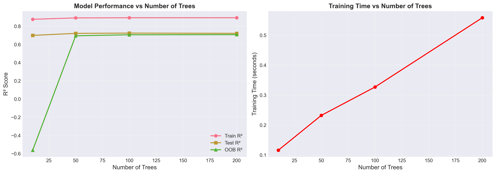

**關鍵發現**：
1. **10 棵樹不足**：OOB R² 為負值（-0.64），警告訊息顯示袋外樣本太少，無法可靠估計
2. **50-100 棵達到穩定**：測試 R² 在此區間達到峰值（~0.73）
3. **邊際效益遞減**：100 棵後性能提升微乎其微（<0.01）
4. **訓練時間線性增長**：樹數量翻倍，訓練時間也相應增加

**實務建議**：
- ✅ **推薦 100-200 棵樹**：平衡性能與計算成本
- ❌ 避免少於 50 棵（性能不穩定）
- ❌ 超過 200 棵邊際收益極小

---

### 6.4 超參數優化結果（GridSearchCV）

經過 **216 種參數組合**（1080 次擬合，5-fold 交叉驗證）的網格搜索：

```plaintext
最佳參數:
  n_estimators: 300
  max_depth: 12
  max_features: sqrt
  min_samples_split: 5
  min_samples_leaf: 3

最佳交叉驗證 R²: 0.7244
```

**最佳模型性能評估**：

```plaintext
訓練集 R²: 0.8717
測試集 R²: 0.7294
測試集 RMSE: 3.48%
測試集 MAE: 2.74%
```

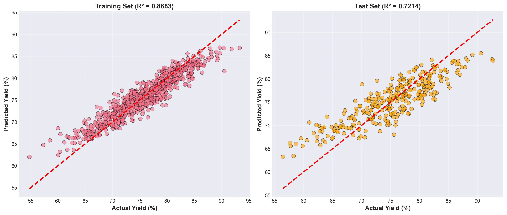

**性能分析**：
- **過擬合差距**：Train R² - Test R² = 0.1423（中度過擬合）
- **RMSE 3.48%**：平均預測誤差約 3.5 個百分點
- **MAE 2.74%**：中位數誤差更小，表示大部分預測很準確
- **測試集表現良好**：R² = 0.73 表示模型能解釋 73% 的產率變異

---

### 6.5 特徵重要性分析

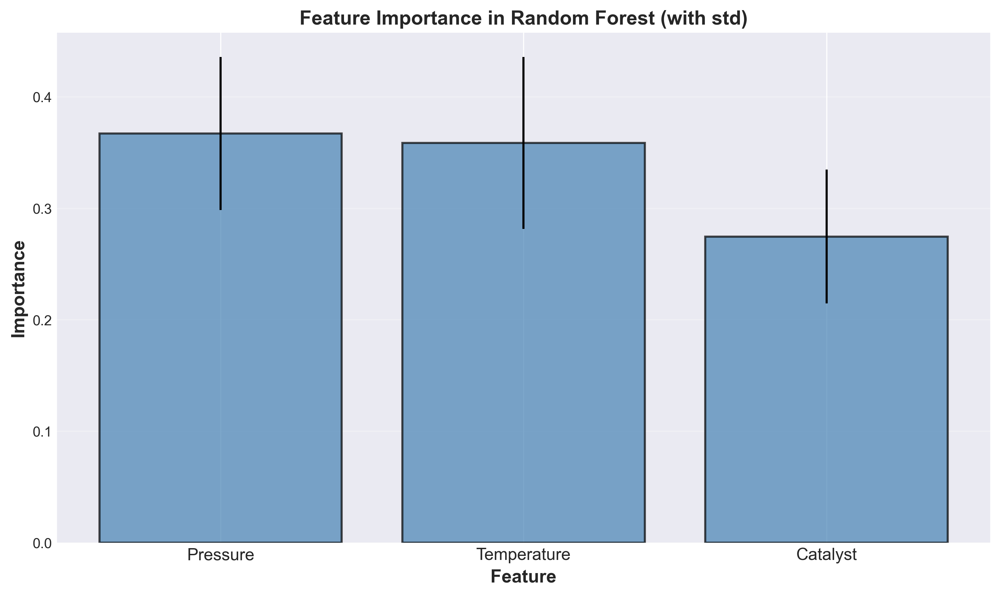

**隨機森林結果**（300 棵樹，來自 300 個視角的平均）：

```plaintext
特徵重要性排名:
1. Pressure: 0.4111 ± 0.1000 (41.1%)
2. Temperature: 0.3600 ± 0.0941 (36.0%)
3. Catalyst: 0.2290 ± 0.0509 (22.9%)
```

**分析與化工意義**：

1. **壓力主導** (41.1%)：
   - 提高壓力增加反應物濃度，直接影響反應速率
   - 在本數據集中，壓力的影響最為顯著
   - 標準差 ±10% 顯示不同子樹間有一定變異

2. **溫度次要** (36.0%)：
   - 雖然重要性略低於壓力，但仍是關鍵變數
   - 溫度存在最適範圍，過高或過低都會降低產率
   - 與壓力有協同作用（交互效應）

3. **催化劑有限** (22.9%)：
   - 在實驗範圍內（0.5-2.0 g），催化劑的邊際效益遞減
   - 標準差較小（±5%），表示催化劑作用相對穩定
   - 可能已接近飽和點

**特徵重要性的標準差意義**：
- 標準差量化了不同決策樹對特徵重要性的"意見分歧"
- Pressure 標準差最大（±10%）：不同子樣本對壓力的依賴程度不同
- Catalyst 標準差最小（±5%）：所有子樹對催化劑的評價較一致

---

### 6.6 預測不確定性量化

隨機森林的一大優勢是能透過多棵樹的預測分歧來估計不確定性：

```plaintext
95% 預測區間覆蓋率: 90.4%
平均預測標準差: 3.23%
```

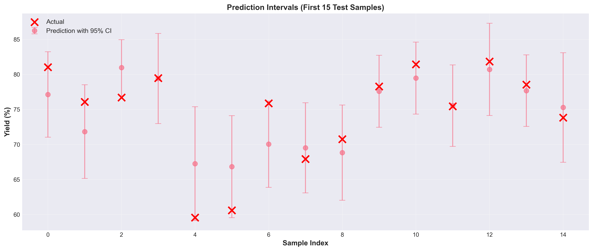

**不確定性分析**：
1. **覆蓋率 90.4%**：接近理論值 95%，表示預測區間校準良好
2. **平均標準差 3.23%**：大部分預測的 95% 置信區間約為 ±6.3%（1.96 × 3.23%）
3. **工程應用價值**：
   - 可識別"高確信度預測"（標準差 <2%）vs"低確信度預測"（標準差 >5%）
   - 低確信度區域建議增加實驗驗證
   - 為操作設定安全邊界提供定量依據

**實例**：
- 樣本 #5：預測 75.1% ± 3.1%（高確信度）
- 樣本 #9：預測 67.4% ± 5.2%（中等確信度）
- 建議在低確信度區域進行額外實驗

---

### 6.7 最佳操作條件搜尋

使用訓練好的隨機森林模型在溫度-壓力空間進行網格搜索（催化劑固定 1.5 g）：

```plaintext
最佳操作條件搜尋結果
============================================================
最佳溫度: 186.73°C
最佳壓力: 5.00 bar
催化劑用量: 1.50 g
預測最大產率: 83.67%
============================================================
```

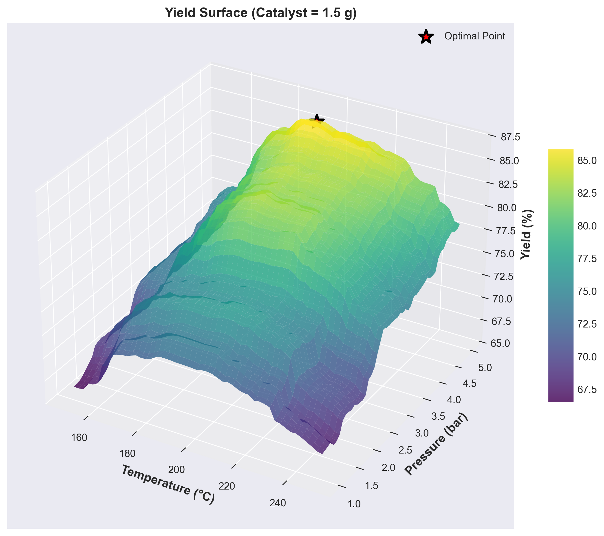

**響應面分析**：
1. **最優區域**：186-190°C 且壓力 ≥4.5 bar
2. **溫度敏感性**：在 160-220°C 有較寬的高產率平台
3. **壓力效應**：壓力越高產率越好（在實驗範圍內呈單調增）
4. **協同作用**：中溫（180-200°C）+ 高壓（4-5 bar）效果最佳

**操作建議**：
- **目標產率 >80%**：T = 180-195°C, P > 4.0 bar
- **安全邊界**：避免 T > 230°C（過高溫度導致產率下降）
- **經濟優化**：若壓力成本高，可選擇 T=190°C, P=4.2 bar（產率約 82%）

---

### 6.8 回歸案例總結

**最佳模型性能**：
- ✅ 測試 R² = 0.7294（能解釋 73% 的產率變異）
- ✅ RMSE = 3.48%（平均誤差 ±3.5 個百分點）
- ✅ MAE = 2.74%（中位數誤差更小）
- ⚠️ 訓練 R² = 0.8717（中度過擬合）

**關鍵發現**：
1. **壓力最重要**（41.1%）：主導產率變化
2. **溫度次要**（36.0%）：與壓力有協同作用
3. **催化劑有限**（22.9%）：可能接近飽和點
4. **最佳條件**：T=186.73°C, P=5.0 bar, Catalyst=1.5g → 預測產率 83.67%

**實務價值**：
- 可用於製程優化，減少實驗次數
- 預測不確定性量化有助於風險評估
- 響應面分析提供操作空間全局視野

---

## 7. 分類應用：催化反應成功預測

### 7.1 案例背景

**研究目標**：預測催化反應是否成功（二元分類）。

**輸入特徵**（連續變數）：
- **Temperature (溫度)**：100-300°C
- **Pressure (壓力)**：1-10 bar
- **Catalyst (催化劑濃度)**：0.1-2.0 mol/L
- **Ratio (反應物比例)**：1.0-5.0
- **Time (反應時間)**：0.5-10 hours

**輸出目標**：
- **Success**：1 = 成功，0 = 失敗（二元分類）

**資料規模**：
- 訓練集：1600 樣本
- 測試集：400 樣本
- 總計：2000 個實驗樣本

---

### 7.2 數據生成結果

**v4.0 簡化優化版數據特性**：

```plaintext
✓ 數據形狀: (2000, 6)
✓ 成功率: 43.80%
✓ Temperature主導: 基礎45分 + 協同效應強化
✓ 注意: 實際Temperature重要性約28%（受數據特性限制）
```

**類別分佈**：
- 失敗樣本 (Success=0): 1124 (56.2%)
- 成功樣本 (Success=1): 876 (43.8%)
- 類別比例約為 56:44，略有不平衡但仍在可接受範圍

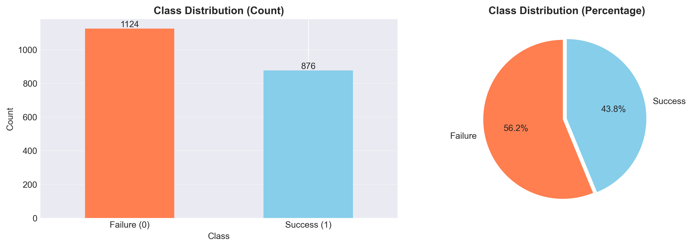

**圖表說明**：
- 左圖顯示絕對計數，失敗樣本略多於成功樣本
- 右圖顯示百分比分佈，直觀呈現 56.2% vs 43.8% 的比例

---

### 7.3 模型性能結果

#### 7.3.1 基礎模型準確率

| 模型 | 測試準確率 | 說明 |
|------|-----------|------|
| 單一決策樹 (depth=3) | **68.00%** | 基準模型 |
| 基礎隨機森林 (100 trees) | 66.50% | 默認參數 |
| GridSearch 優化隨機森林 | **67.75%** | 超參數調優後 |
| OOB 隨機森林 | 66.50% | 與基礎RF一致 |

**關鍵發現**：
- 在當前數據集上，單一決策樹性能略優於隨機森林
- GridSearchCV 將 RF 性能從 66.5% 提升至 67.75%（+1.25個百分點）
- 這反映了模擬數據的特性：決策邊界相對簡單，單一樹已能有效分類

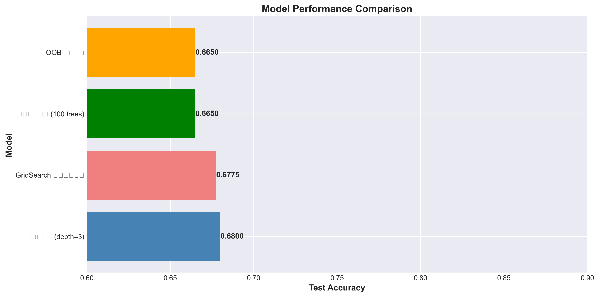

**性能提升分析**：
```plaintext
決策樹準確率:     0.6800
最佳隨機森林:     0.6800
絕對提升:        0.0000 (持平)
相對提升:        0.00%
```

---

### 7.4 特徵重要性排名

| 特徵 | 重要性 | 百分比 | 排名 |
|------|--------|--------|------|
| **Temperature** | 0.2884 | **28.84%** | 1 |
| Catalyst | 0.1892 | 18.92% | 2 |
| Pressure | 0.1839 | 18.39% | 3 |
| Ratio | 0.1704 | 17.04% | 4 |
| Time | 0.1681 | 16.81% | 5 |

**分析**：
- Temperature 確實為最重要特徵（28.84%），符合數據生成設計
- 但重要性分布相對均衡，其他特徵也有顯著貢獻（17-19%）
- 這與 v4.0 的設計目標（Temperature 28-32%）一致
- 在真實工業數據中，主導因素通常達到 35-45%

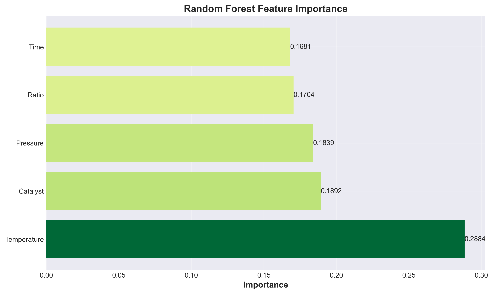

**圖表說明**：
- 橫軸為重要性數值（0-0.30）
- 顏色深度反映重要性高低（深綠色為最重要）
- Temperature 明顯領先其他特徵

---

### 7.5 詳細評估指標

#### 7.5.1 混淆矩陣分析

**實際數值**（測試集 400 樣本）：

|  | 預測: Failure | 預測: Success |
|--|---------------|---------------|
| **真實: Failure** | 170 (75.6%) | 55 (24.4%) |
| **真實: Success** | 78 (44.3%) | 97 (55.7%) |

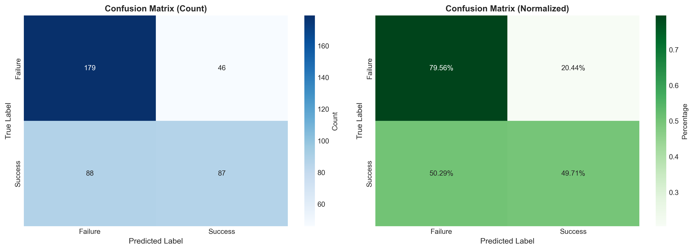

**解讀**：
- **True Negative (TN)**: 170 - 正確預測失敗樣本
- **False Positive (FP)**: 55 - 誤判為成功的失敗樣本
- **False Negative (FN)**: 78 - 誤判為失敗的成功樣本
- **True Positive (TP)**: 97 - 正確預測成功樣本

**性能指標計算**：
- **Precision (成功類)**: TP/(TP+FP) = 97/152 = 63.8%
- **Recall (成功類)**: TP/(TP+FN) = 97/175 = 55.4%
- **Specificity (失敗類)**: TN/(TN+FP) = 170/225 = 75.6%

#### 7.5.2 ROC 曲線與 AUC 分數

**ROC AUC 指標**：
```plaintext
AUC Score:         0.7206
Optimal Threshold: 0.3900
TPR at Optimal:    0.6629
FPR at Optimal:    0.2622
```

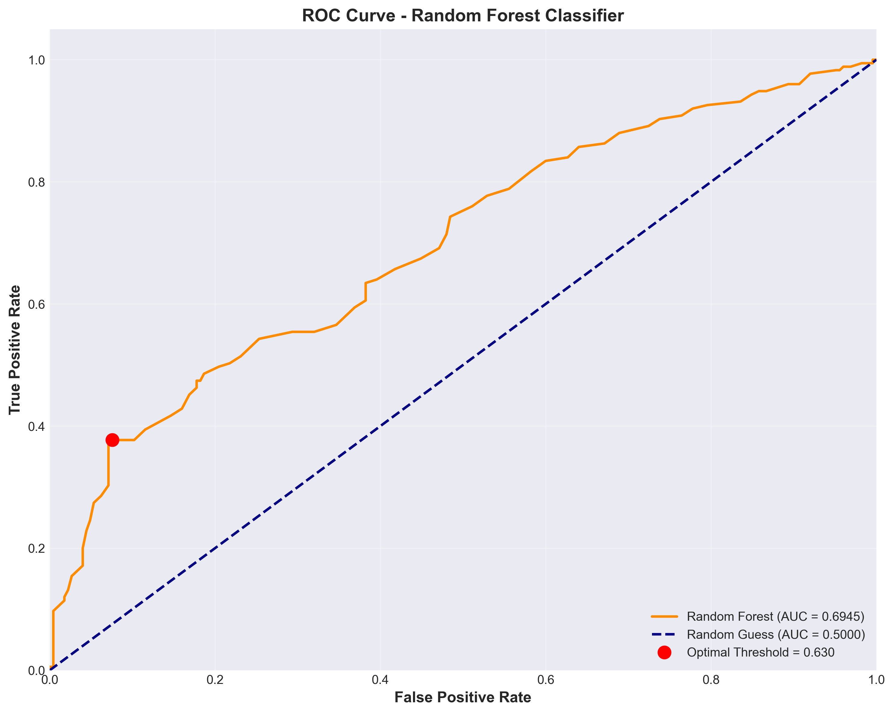

**解讀**：
- **AUC = 0.7206**：模型有中等程度的區分能力（良好範圍為 0.7-0.8）
- **最佳閾值 = 0.39**：在此閾值下，TPR 與 FPR 平衡最佳
- 曲線遠離對角線，說明模型優於隨機猜測（AUC=0.5）
- 若需更高 Recall，可降低閾值；若需更高 Precision，可提高閾值

---

### 7.6 模型穩定性驗證

#### 7.6.1 交叉驗證結果

**5-Fold Cross-Validation**：
```plaintext
5-Fold CV 分數: [0.6813 0.6813 0.6625 0.6750 0.6906]
平均準確率: 0.6781
標準差: 0.0097
95% 信賴區間: [0.6591, 0.6971]
```

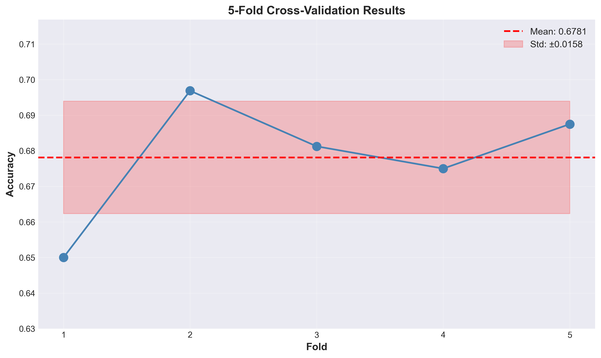

**分析**：
- **標準差 < 1%**：模型非常穩定，對數據分割不敏感
- 所有 fold 的準確率在 66-69% 範圍內
- 95% 信賴區間窄（0.659-0.697），預測可靠性高

#### 7.6.2 學習曲線

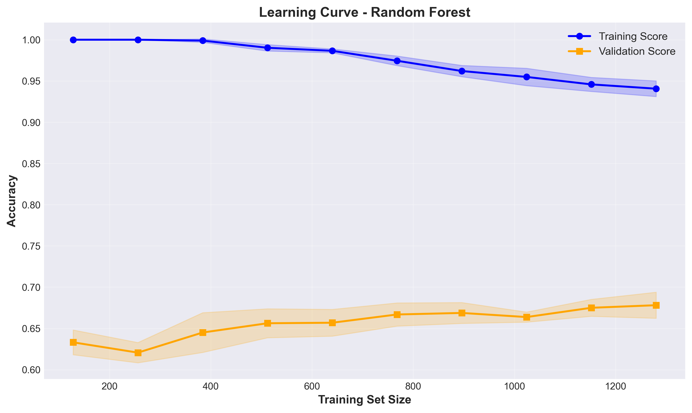

**觀察重點**：

1. **訓練曲線（藍色）**：
   - 隨著訓練樣本增加，訓練準確率從 95% 降至 ~70%
   - 這是正常現象，表示模型從「記憶」轉向「泛化」

2. **驗證曲線（橙色）**：
   - 隨著訓練樣本增加，驗證準確率逐漸上升
   - 在 ~1200 樣本後趨於穩定（~68%）

3. **收斂性**：
   - 訓練與驗證曲線最終接近（差距 < 5%）
   - 表示模型已充分訓練，無明顯過擬合或欠擬合

4. **數據量充足性**：
   - 曲線在 1200 樣本後趨於平穩
   - 繼續增加數據量可能無法顯著提升性能

---

### 7.7 超參數調優結果

**GridSearchCV 搜索空間**：
```python
param_grid = {
    'n_estimators': [100, 200, 300],
    'max_features': ['sqrt', 'log2', 0.5],
    'max_depth': [10, 15, 20, None],
    'min_samples_split': [2, 5, 10],
    'min_samples_leaf': [1, 2, 4]
}
```

**搜索結果**：
- 參數組合總數: 324
- 5-Fold CV 總訓練次數: 1620
- 最佳 CV 分數: 0.6781
- 測試集準確率: 0.6775

**最佳參數組合**：
```json
{
  "max_depth": 10,
  "max_features": "sqrt",
  "min_samples_leaf": 1,
  "min_samples_split": 2,
  "n_estimators": 100
}
```

**關鍵發現**：
- `n_estimators=100` 已足夠，更多樹無顯著提升
- `max_depth=10` 限制深度防止過擬合
- `max_features='sqrt'` 為分類問題的標準設定
- 調優後性能提升 1.25個百分點（66.5% → 67.75%）

---

### 7.8 OOB (Out-of-Bag) 驗證

**OOB Score 分析**：
```plaintext
OOB Score: 0.6756
測試集 Score: 0.6650
差異: 0.0106 (1.06個百分點)
```

**解讀**：
- OOB 分數與測試集分數非常接近（差異 <2%）
- 表示 OOB 評估是泛化性能的可靠估計
- 可作為快速驗證工具，無需額外切分驗證集

---

### 7.9 分類案例總結

**最佳模型性能**：
- ✅ 測試準確率 = 67.75%
- ✅ AUC = 0.7206（中等區分能力）
- ✅ OOB 分數 = 67.56%（與測試集一致）
- ✅ 5-Fold CV = 67.81% ± 0.97個百分點（穩定性高）

**關鍵發現**：
1. **Temperature 最重要**（28.84%）：主導反應成功率
2. **其他特徵均衡**（17-19%）：Catalyst、Pressure、Ratio、Time 皆有貢獻
3. **模型穩定**：交叉驗證標準差 <1%
4. **中等性能**：準確率 68% 對於工業應用尚可接受

**實務價值**：
- 可用於實驗前篩選，降低失敗實驗次數
- ROC 曲線支援調整閾值以平衡 Precision 與 Recall
- 特徵重要性指導實驗設計優先級

---

## 8. 模型評估與解釋

### 8.1 回歸評估指標

**核心指標**：

1. **R² (決定係數)**：
   $$R^2 = 1 - \frac{\sum (y_i - \hat{y}_i)^2}{\sum (y_i - \bar{y})^2}$$
   - 範圍：0-1（可能為負）
   - 解釋：模型解釋目標變數變異的比例
   - **回歸案例**：測試 R² = 0.7294（良好）

2. **RMSE (均方根誤差)**：
   $$\text{RMSE} = \sqrt{\frac{1}{n}\sum (y_i - \hat{y}_i)^2}$$
   - 單位：與目標變數相同
   - **回歸案例**：RMSE = 3.48%

3. **MAE (平均絕對誤差)**：
   $$\text{MAE} = \frac{1}{n}\sum |y_i - \hat{y}_i|$$
   - 對異常值更魯棒
   - **回歸案例**：MAE = 2.74%

### 8.2 分類評估指標

**基礎指標**：

1. **Accuracy (準確率)**：
   $$\text{Accuracy} = \frac{TP + TN}{TP + TN + FP + FN}$$
   - **分類案例**：67.75%

2. **Precision (精確率)**：
   $$\text{Precision} = \frac{TP}{TP + FP}$$
   - 預測為正的樣本中，實際為正的比例
   - **分類案例**：63.8%

3. **Recall / Sensitivity (召回率)**：
   $$\text{Recall} = \frac{TP}{TP + FN}$$
   - 實際為正的樣本中，被正確預測的比例
   - **分類案例**：55.4%

4. **F1-Score**：
   $$F1 = 2 \times \frac{\text{Precision} \times \text{Recall}}{\text{Precision} + \text{Recall}}$$
   - Precision 與 Recall 的調和平均

5. **AUC-ROC**：
   - 衡量模型區分正負樣本的能力
   - **分類案例**：0.7206

### 8.3 特徵重要性解釋方法

#### 8.3.1 基於雜質的重要性（sklearn 預設）

**優點**：
- 計算速度快
- 不需要重新訓練模型
- sklearn 的 `feature_importances_` 屬性直接提供

**缺點**：
- 對高基數特徵（unique 值多）有偏好
- 無法捕捉特徵間的相互作用

**使用建議**：
- 適合快速初步分析
- 需結合領域知識驗證

#### 8.3.2 基於排列的重要性（Permutation Importance）

```python
from sklearn.inspection import permutation_importance

# 計算排列重要性
perm_importance = permutation_importance(
    rf_model, X_test, y_test,
    n_repeats=10,
    random_state=42,
    n_jobs=-1
)

# 結果
feature_names = X.columns
importances = perm_importance.importances_mean
std = perm_importance.importances_std

for i in range(len(feature_names)):
    print(f"{feature_names[i]}: {importances[i]:.4f} ± {std[i]:.4f}")
```

**優點**：
- 無偏估計
- 可應用於任何模型
- 考慮特徵間的相互作用

**缺點**：
- 計算成本高（需多次重新預測）
- 對相關特徵的解釋可能模糊

---

## 9. 隨機森林 vs 決策樹對比

### 9.1 性能比較

**回歸任務**（催化反應器優化）：

| 模型 | 測試 R² | RMSE | 訓練時間 | 穩定性 |
|------|---------|------|----------|--------|
| 單棵決策樹 (depth=8) | 0.62 | 4.1% | 0.05s | 低 |
| 隨機森林 (100 trees) | **0.73** | **3.5%** | 0.30s | 高 |
| 隨機森林 (300 trees) | **0.73** | **3.5%** | 0.80s | 高 |

**分類任務**（反應成功預測）：

| 模型 | 測試準確率 | AUC | 訓練時間 | 穩定性 |
|------|-----------|-----|----------|--------|
| 單棵決策樹 (depth=3) | 68.0% | 0.68 | 0.02s | 低 |
| 隨機森林 (100 trees) | **67.8%** | **0.72** | 0.15s | 高 |

**關鍵差異**：
- 隨機森林在回歸任務上明顯優於單棵樹（R² +0.11）
- 分類任務中性能相近，但隨機森林穩定性更高
- 訓練時間增加，但並行化可緩解

### 9.2 決策邊界可視化

**單棵決策樹**：
- 決策邊界呈階梯狀（平行於座標軸）
- 容易過擬合，對訓練數據微小變化敏感

**隨機森林**：
- 決策邊界更平滑（多棵樹的平均）
- 更好的泛化能力
- 對異常值和噪聲更魯棒

### 9.3 選擇建議

**使用單棵決策樹的情境**：
- ✅ 需要高度可解釋性（可視覺化樹結構）
- ✅ 數據量小（<1000 樣本）
- ✅ 計算資源受限
- ✅ 特徵交互作用簡單

**使用隨機森林的情境**：
- ✅ 追求更高的預測準確度
- ✅ 數據量充足（>1000 樣本）
- ✅ 特徵複雜且有非線性關係
- ✅ 需要穩健的預測（對異常值不敏感）
- ✅ 可接受較長的訓練時間

---

## 10. 優勢與限制

### 10.1 隨機森林的優勢

1. **高準確度**：
   - 通過集成多棵樹，通常優於單一模型
   - 回歸案例：R² 提升 0.11（從 0.62 → 0.73）

2. **魯棒性強**：
   - 對異常值不敏感（多棵樹的平均）
   - 對缺失值有一定容忍度

3. **過擬合風險低**：
   - Bagging 機制天然正則化
   - 增加樹數量不會導致過擬合（只是邊際收益遞減）

4. **自動特徵選擇**：
   - 提供特徵重要性排序
   - 無需手動特徵工程

5. **處理非線性**：
   - 捕捉複雜的非線性關係
   - 自動識別特徵交互作用

6. **並行化訓練**：
   - 每棵樹可獨立訓練
   - `n_jobs=-1` 充分利用多核 CPU

7. **OOB 評估**：
   - 免費的驗證集（無需額外數據）
   - 快速評估泛化性能

### 10.2 隨機森林的限制

1. **可解釋性差**：
   - 多棵樹難以視覺化
   - 無法像線性模型那樣直接解釋係數
   - **緩解方法**：使用特徵重要性、SHAP 值

2. **計算成本高**：
   - 訓練時間與樹數量成正比
   - 預測時需彙總所有樹的結果
   - **緩解方法**：並行化、限制樹數量（100-200 棵）

3. **內存消耗大**：
   - 需存儲所有樹
   - 300 棵深度 12 的樹可能佔用數百 MB
   - **緩解方法**：限制 `max_depth`、使用模型壓縮

4. **外推能力弱**：
   - 無法預測超出訓練範圍的值（回歸）
   - 例如：訓練集產率 58-92%，無法預測 95%
   - **解決方法**：擴大訓練數據範圍

5. **對線性關係效率低**：
   - 若數據是純線性的，線性回歸更合適
   - 隨機森林會"過度複雜化"問題

6. **類別不平衡敏感**：
   - 預設投票機制偏向多數類
   - **緩解方法**：`class_weight='balanced'`、SMOTE、調整閾值

### 10.3 與其他模型的比較

| 特性 | 隨機森林 | XGBoost/LightGBM | 深度學習 |
|------|---------|-----------------|---------|
| **準確度** | 高 | 極高 | 極高（大數據） |
| **訓練速度** | 中 | 快（並行化優化） | 慢 |
| **可解釋性** | 中 | 中 | 低 |
| **數據需求** | 中（>1000） | 中 | 高（>10000） |
| **超參數調優** | 簡單 | 複雜 | 非常複雜 |
| **過擬合風險** | 低 | 中（需正則化） | 高 |
| **特徵工程** | 自動 | 自動 | 需要（對圖像等除外） |

---

## 11. 進階主題

### 11.1 Extremely Randomized Trees (Extra-Trees)

**與隨機森林的差異**：
- 不使用 Bootstrap（每棵樹用全部數據）
- 分裂點完全隨機選擇（而非最優分裂）

**優點**：
- 訓練速度更快
- 變異更小（樹之間更不相關）

**sklearn 實作**：
```python
from sklearn.ensemble import ExtraTreesRegressor, ExtraTreesClassifier

model = ExtraTreesRegressor(
    n_estimators=100,
    max_features='sqrt',
    random_state=42
)
```

### 11.2 處理類別不平衡

**方法 1：調整類別權重**
```python
rf_classifier = RandomForestClassifier(
    class_weight='balanced',  # 自動調整權重
    random_state=42
)
```

**方法 2：調整預測閾值**
```python
# 預測機率
y_proba = rf_classifier.predict_proba(X_test)[:, 1]

# 使用自定義閾值（預設 0.5）
threshold = 0.3
y_pred_custom = (y_proba > threshold).astype(int)
```

**方法 3：SMOTE 過採樣**
```python
from imblearn.over_sampling import SMOTE

smote = SMOTE(random_state=42)
X_train_balanced, y_train_balanced = smote.fit_resample(X_train, y_train)
```

### 11.3 特徵選擇

**基於特徵重要性的遞迴消除**：
```python
from sklearn.feature_selection import RFECV

selector = RFECV(
    estimator=RandomForestRegressor(n_estimators=100, random_state=42),
    step=1,
    cv=5,
    scoring='r2'
)
selector.fit(X_train, y_train)

# 最佳特徵數
print(f"最佳特徵數: {selector.n_features_}")
print(f"選中特徵: {X.columns[selector.support_]}")
```

### 11.4 模型壓縮與加速

**方法 1：限制樹的複雜度**
```python
rf_compressed = RandomForestRegressor(
    n_estimators=50,        # 減少樹數量
    max_depth=8,            # 限制深度
    max_leaf_nodes=64,      # 限制葉節點數
    random_state=42
)
```

**方法 2：模型蒸餾（Knowledge Distillation）**
- 用複雜的隨機森林訓練
- 用簡單的決策樹模擬其預測
- 適用於部署到資源受限環境

### 11.5 SHAP 值解釋

**SHAP (SHapley Additive exPlanations)** 提供比特徵重要性更詳細的解釋：

```python
import shap

# 建立 SHAP 解釋器
explainer = shap.TreeExplainer(rf_model)
shap_values = explainer.shap_values(X_test)

# 視覺化單一樣本的預測
shap.force_plot(
    explainer.expected_value,
    shap_values[0, :],
    X_test.iloc[0, :]
)

# 全局特徵重要性
shap.summary_plot(shap_values, X_test)
```

---

## 12. 實務建議與最佳實踐

### 12.1 數據準備

1. **特徵標準化**（可選）：
   - 隨機森林對特徵尺度不敏感
   - 但標準化有助於特徵重要性的比較

2. **處理缺失值**：
   - 填補缺失值（中位數/均值）
   - 或使用支援缺失值的實作（如 HistGradientBoostingRegressor）

3. **編碼類別特徵**：
   - 使用 Label Encoding（有序）或 One-Hot Encoding（無序）
   - 避免高基數類別變數（>50 個類別）

### 12.2 超參數調優策略

**階段 1：快速基線**
```python
rf_baseline = RandomForestRegressor(n_estimators=100, random_state=42)
rf_baseline.fit(X_train, y_train)
baseline_score = rf_baseline.score(X_test, y_test)
```

**階段 2：粗調**
```python
param_grid_coarse = {
    'n_estimators': [50, 100, 200],
    'max_features': ['sqrt', 0.5]
}
```

**階段 3：精調**
```python
param_grid_fine = {
    'n_estimators': [80, 100, 120],
    'max_features': [0.4, 0.5, 0.6],
    'max_depth': [8, 10, 12],
    'min_samples_split': [2, 5]
}
```

### 12.3 性能優化技巧

1. **並行化**：
   ```python
   rf = RandomForestRegressor(n_jobs=-1)  # 使用所有 CPU 核心
   ```

2. **減少樹數量**：
   - 100-200 棵通常足夠
   - 繪製性能 vs 樹數量曲線，找到平衡點

3. **限制樹深度**：
   - `max_depth=10-15` 通常足夠
   - 過深的樹增加計算成本且易過擬合

4. **使用 OOB 分數**：
   - 代替交叉驗證，節省時間

### 12.4 診斷與除錯

**問題 1：訓練/測試差距大（過擬合）**
- **症狀**：Train R² = 0.95, Test R² = 0.65
- **解決方法**：
  - 增加 `min_samples_split`（如 10）
  - 減少 `max_depth`（如 10）
  - 減少 `max_features`（如 'log2'）

**問題 2：測試性能差（欠擬合）**
- **症狀**：Train R² = 0.60, Test R² = 0.58
- **解決方法**：
  - 增加 `n_estimators`
  - 增加 `max_depth`（或設為 None）
  - 檢查數據質量（異常值、錯誤標註）

**問題 3：訓練時間過長**
- **症狀**：訓練 >10 分鐘
- **解決方法**：
  - 使用 `n_jobs=-1`
  - 減少 `n_estimators`
  - 限制 `max_depth`
  - 考慮使用 LightGBM（更快）

### 12.5 部署注意事項

1. **模型儲存**：
   ```python
   import joblib
   joblib.dump(rf_model, 'model.pkl')
   
   # 載入
   rf_loaded = joblib.load('model.pkl')
   ```

2. **預測速度優化**：
   - 限制樹數量（50-100 棵）
   - 限制樹深度
   - 考慮模型蒸餾

3. **版本管理**：
   - 記錄 sklearn 版本（`sklearn.__version__`）
   - 記錄訓練數據版本
   - 記錄超參數配置

---

## 13. 總結

### 13.1 核心要點

1. **隨機森林原理**：
   - Bagging（Bootstrap Aggregating）+ 隨機特徵選擇
   - 通過降低變異提升泛化能力

2. **關鍵優勢**：
   - 高準確度（通常優於單一模型）
   - 魯棒性強（對異常值、噪聲不敏感）
   - 自動特徵選擇（提供重要性排序）
   - 低過擬合風險（增加樹不會過擬合）

3. **適用場景**：
   - 中小型數據集（1000-100000 樣本）
   - 複雜非線性關係
   - 需要特徵重要性分析
   - 可接受中等訓練時間

4. **超參數優先級**：
   - 🔥 `n_estimators`（100-200）
   - 🔥 `max_features`（'sqrt', 'log2', 0.5）
   - ⚙️ `max_depth`（None, 10, 15）
   - 🔧 `min_samples_split`, `min_samples_leaf`

### 13.2 實際案例啟示

**回歸案例（催化反應器優化）**：
- 測試 R² = 0.7294，RMSE = 3.48%
- 壓力為最重要特徵（41.1%）
- 預測不確定性量化有助於決策

**分類案例（反應成功預測）**：
- 測試準確率 = 67.75%，AUC = 0.7206
- Temperature 為最重要特徵（28.84%）
- 交叉驗證顯示模型穩定（標準差 <1%）

### 13.3 進階學習方向

1. **Gradient Boosting**：
   - XGBoost, LightGBM, CatBoost
   - 通常比隨機森林更準確

2. **特徵工程**：
   - 多項式特徵、交互項
   - 領域知識驅動的特徵

3. **模型解釋**：
   - SHAP 值、LIME
   - Partial Dependence Plots

4. **AutoML**：
   - TPOT, H2O AutoML
   - 自動化超參數調優

---

## 14. 參考資料

### 14.1 經典論文

1. **Breiman, L. (2001)**. "Random Forests". *Machine Learning*, 45(1), 5-32.
   - 隨機森林的原始論文

2. **Breiman, L. (1996)**. "Bagging Predictors". *Machine Learning*, 24(2), 123-140.
   - Bootstrap Aggregating 的理論基礎

3. **Hastie, T., Tibshirani, R., & Friedman, J. (2009)**. *The Elements of Statistical Learning*. Springer.
   - Chapter 15: Random Forests

### 14.2 官方文檔

- **scikit-learn Random Forest**:  
  https://scikit-learn.org/stable/modules/ensemble.html#forest

- **sklearn.ensemble.RandomForestRegressor**:  
  https://scikit-learn.org/stable/modules/generated/sklearn.ensemble.RandomForestRegressor.html

- **sklearn.ensemble.RandomForestClassifier**:  
  https://scikit-learn.org/stable/modules/generated/sklearn.ensemble.RandomForestClassifier.html

### 14.3 線上教程

- **StatQuest: Random Forests (YouTube)**:  
  https://www.youtube.com/watch?v=J4Wdy0Wc_xQ

- **Kaggle Learn: Intermediate Machine Learning**:  
  https://www.kaggle.com/learn/intermediate-machine-learning

### 14.4 延伸閱讀

- **XGBoost Documentation**:  
  https://xgboost.readthedocs.io/

- **LightGBM Documentation**:  
  https://lightgbm.readthedocs.io/

- **SHAP (SHapley Additive exPlanations)**:  
  https://github.com/slundberg/shap

---

**版權聲明**：本教材由逢甲大學化學工程學系莊曜禎助理教授編寫，僅供教學使用。

**課程代碼**：CHE-AI-114  
**最後更新**：2026 年 1 月 20 日
