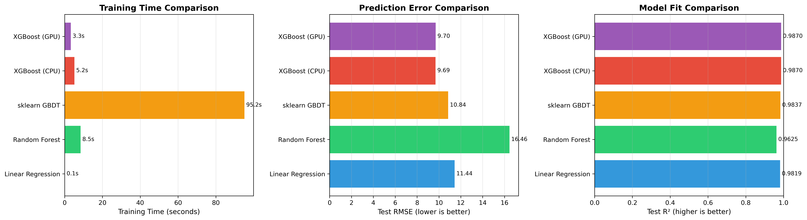
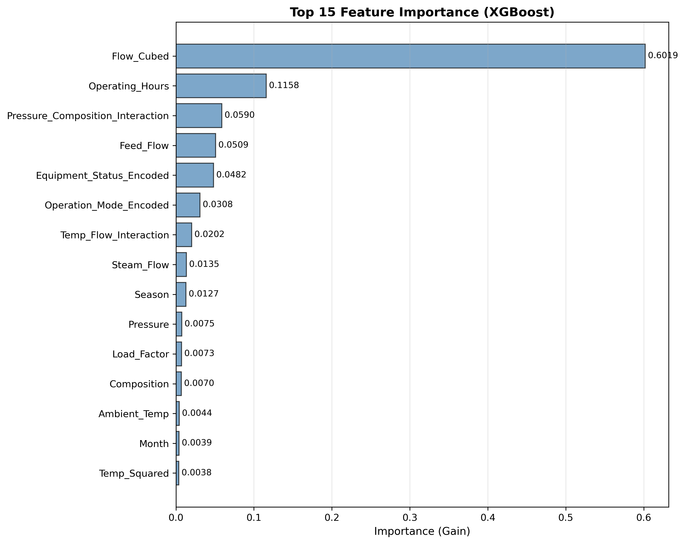
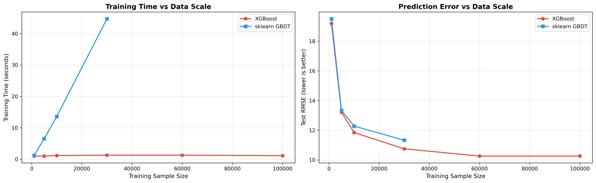

# Unit 13: XGBoost 模型 (Extreme Gradient Boosting)

**課程名稱**：AI 在化工上之應用  
**課程代碼**：CHE-AI-114  
**授課教師**：莊曜禎 助理教授  
**單元主題**：XGBoost 模型  
**適用對象**：化學工程學系學生  

---

## 學習目標

完成本單元後，學生將能夠：

1. 理解 XGBoost 的核心原理與優化機制
2. 掌握 XGBoost 相較於傳統 GBDT 的改進之處
3. 安裝並使用 XGBoost 套件進行回歸與分類任務
4. 理解 XGBoost 的關鍵超參數及其調整策略
5. 應用正則化技術避免過擬合
6. 分析特徵重要性與模型可解釋性
7. 使用早停機制優化訓練效率
8. 應用 XGBoost 於化工製程預測問題
9. 比較 XGBoost 與 sklearn GradientBoosting 的性能差異

---

## 1. XGBoost 簡介

### 1.1 什麼是 XGBoost？

**XGBoost (Extreme Gradient Boosting)** 是由陳天奇博士於 2014 年開發的梯度提升樹演算法優化版本，是目前機器學習競賽與工業應用中最受歡迎的模型之一。

**核心特色**：
- **極致優化的 GBDT**：在傳統 Gradient Boosting 基礎上大幅改進
- **高效能**：使用並行化、快取優化、分佈式計算
- **高準確度**：加入二階導數資訊與正則化
- **靈活性**：支援自訂損失函數、缺失值處理、不平衡資料

**XGBoost 的歷史與影響**：
- 2014 年發表論文並開源
- 2015-2016 年在 Kaggle 競賽中大放異彩
- 成為機器學習競賽的標配工具
- 廣泛應用於工業界（推薦系統、廣告點擊預測、風險評估等）
- 啟發了後續的 LightGBM、CatBoost 等模型

### 1.2 為什麼需要 XGBoost？

**傳統 GBDT (sklearn GradientBoosting) 的侷限**：
- **訓練速度慢**：必須序列訓練，無法充分利用多核 CPU
- **記憶體消耗大**：沒有最佳化資料結構
- **缺乏正則化**：容易過擬合
- **功能有限**：不支援缺失值、類別特徵處理較弱

**XGBoost 的改進**：
- **系統層面優化**：
  - 並行化特徵搜尋（Column Block、Cache-aware Access）
  - 分佈式計算支援
  - Out-of-core 計算（處理超大資料集）
  
- **演算法層面優化**：
  - 二階泰勒展開（使用二階導數）
  - 正則化項（L1、L2）
  - Shrinkage 與 Column Subsampling
  
- **實用功能**：
  - 內建缺失值處理
  - 支援多種損失函數
  - 早停機制
  - 交叉驗證

### 1.3 XGBoost vs 傳統 GBDT

| 特性 | sklearn GBDT | XGBoost |
|------|-------------|---------|
| **訓練速度** | 慢 | 快（並行化） |
| **記憶體使用** | 高 | 優化（Column Block） |
| **正則化** | 無 | L1 + L2 |
| **二階導數** | 否 | 是 |
| **缺失值處理** | 需預處理 | 內建支援 |
| **分佈式計算** | 否 | 支援 |
| **早停機制** | 基本 | 完整 |
| **交叉驗證** | 手動 | 內建 cv() |
| **特徵重要性** | 基本 | 多種方法 |
| **準確度** | 高 | 非常高 |

### 1.4 XGBoost 的應用場景

**最適合的情境**：
- 結構化表格資料（非圖像、非文字）
- 特徵數量適中（10-1000 個）
- 需要高準確度與可解釋性
- 資料量中到大（1000-10M 筆）

**化工領域應用案例**：

| 應用領域 | 預測目標 | 優勢 |
|---------|---------|------|
| **製程優化** | 產率、品質 | 精準捕捉非線性關係 |
| **故障診斷** | 設備狀態分類 | 處理不平衡資料能力強 |
| **品質預測** | 產品規格 | 特徵重要性分析清晰 |
| **能耗預測** | 能源消耗 | 處理大量感測器資料 |
| **剩餘壽命** | RUL 預測 | 時間序列特徵工程佳 |
| **反應動力學** | 反應速率 | 自動學習交互作用 |

---

## 2. XGBoost 的數學原理

### 2.1 目標函數

XGBoost 的目標是最小化以下目標函數：

$$
\mathcal{L}(\phi) = \sum_{i=1}^{n} l(y_i, \hat{y}_i) + \sum_{k=1}^{K} \Omega(f_k)
$$

其中：
- $l(y_i, \hat{y}_i)$ ：損失函數（如 MSE、Log Loss）
- $\Omega(f_k)$ ：正則化項（控制模型複雜度）
- $K$ ：樹的數量
- $f_k$ ：第 $k$ 棵樹

**預測值**為所有樹的加總：

$$
\hat{y}_i = \sum_{k=1}^{K} f_k(x_i) = \hat{y}_i^{(0)} + f_1(x_i) + f_2(x_i) + \ldots + f_K(x_i)
$$

### 2.2 加法訓練策略

XGBoost 採用 **加法訓練 (Additive Training)**，每次添加一棵新樹：

在第 $t$ 輪迭代，目標函數為：

$$
\mathcal{L}^{(t)} = \sum_{i=1}^{n} l(y_i, \hat{y}_i^{(t-1)} + f_t(x_i)) + \Omega(f_t)
$$

其中 $\hat{y}_i^{(t-1)}$ 是前 $t-1$ 棵樹的預測值。

### 2.3 二階泰勒展開（XGBoost 核心創新）

**傳統 GBDT** 使用一階導數（梯度）：

$$
l(y_i, \hat{y}_i^{(t-1)} + f_t(x_i)) \approx l(y_i, \hat{y}_i^{(t-1)}) + g_i \cdot f_t(x_i)
$$

其中 $g_i = \frac{\partial l(y_i, \hat{y})}{\partial \hat{y}} \bigg|_{\hat{y}=\hat{y}^{(t-1)}}$

**XGBoost** 使用 **二階泰勒展開**，加入二階導數（Hessian）：

$$
l(y_i, \hat{y}_i^{(t-1)} + f_t(x_i)) \approx l(y_i, \hat{y}_i^{(t-1)}) + g_i \cdot f_t(x_i) + \frac{1}{2} h_i \cdot f_t^2(x_i)
$$

其中：
- $g_i = \frac{\partial l}{\partial \hat{y}} \bigg|_{\hat{y}=\hat{y}^{(t-1)}}$ ：一階導數（梯度）
- $h_i = \frac{\partial^2 l}{\partial \hat{y}^2} \bigg|_{\hat{y}=\hat{y}^{(t-1)}}$ ：二階導數（Hessian）

**為什麼使用二階導數？**
- 提供更多曲率資訊，更精確的近似
- 加快收斂速度
- 支援更廣泛的損失函數

### 2.4 簡化目標函數

移除常數項後，第 $t$ 輪的目標函數簡化為：

$$
\tilde{\mathcal{L}}^{(t)} = \sum_{i=1}^{n} \left[ g_i f_t(x_i) + \frac{1}{2} h_i f_t^2(x_i) \right] + \Omega(f_t)
$$

### 2.5 正則化項

XGBoost 定義樹的複雜度為：

$$
\Omega(f_t) = \gamma T + \frac{1}{2} \lambda \sum_{j=1}^{T} w_j^2
$$

其中：
- $T$ ：樹的葉節點數量
- $w_j$ ：第 $j$ 個葉節點的權重（預測值）
- $\gamma$ ：葉節點懲罰係數（控制樹的大小）
- $\lambda$ ：L2 正則化係數（控制葉節點權重）

**正則化的作用**：
- $\gamma$ ：避免樹過深（類似 `min_child_weight` ）
- $\lambda$ ：避免葉節點權重過大（平滑預測值）

### 2.6 樹結構學習

對於一棵樹，將樣本分配到各葉節點後，定義：
- $I_j = \{i | q(x_i) = j\}$ ：分配到葉節點 $j$ 的樣本集合
- $G_j = \sum_{i \in I_j} g_i$ ：該葉節點的一階梯度和
- $H_j = \sum_{i \in I_j} h_i$ ：該葉節點的二階梯度和

目標函數可重寫為：

$$
\tilde{\mathcal{L}}^{(t)} = \sum_{j=1}^{T} \left[ G_j w_j + \frac{1}{2} (H_j + \lambda) w_j^2 \right] + \gamma T
$$

對 $w_j$ 求偏導並令其為 0，得到 **最優葉節點權重**：

$$
w_j^* = -\frac{G_j}{H_j + \lambda}
$$

代回目標函數，得到 **最優目標函數值**：

$$
\tilde{\mathcal{L}}^{(t)}(q) = -\frac{1}{2} \sum_{j=1}^{T} \frac{G_j^2}{H_j + \lambda} + \gamma T
$$

### 2.7 分裂增益

評估是否分裂某個節點的 **增益 (Gain)**：

$$
\text{Gain} = \frac{1}{2} \left[ \frac{G_L^2}{H_L + \lambda} + \frac{G_R^2}{H_R + \lambda} - \frac{(G_L + G_R)^2}{H_L + H_R + \lambda} \right] - \gamma
$$

其中：
- $G_L, H_L$ ：左子樹的梯度和、Hessian 和
- $G_R, H_R$ ：右子樹的梯度和、Hessian 和
- $\gamma$ ：葉節點懲罰

**分裂決策**：
- 若 $\text{Gain} > 0$ ，則分裂
- 否則，停止分裂

---

## 3. XGBoost 套件安裝

### 3.1 安裝指令

```bash
# 使用 pip 安裝
pip install xgboost

# 使用 conda 安裝
conda install -c conda-forge xgboost

# 安裝 GPU 版本（需要 CUDA）
pip install xgboost[gpu]
```

### 3.2 驗證安裝

```python
import xgboost as xgb
print(f"XGBoost version: {xgb.__version__}")

# 檢查 GPU 支援
print(f"GPU available: {xgb.get_config()['use_rmm']}")
```

### 3.3 主要 API 介面

XGBoost 提供三種 API：

1. **原生 API**（Learning API）：
   ```python
   dtrain = xgb.DMatrix(X_train, label=y_train)
   params = {'max_depth': 3, 'eta': 0.1}
   model = xgb.train(params, dtrain, num_boost_round=100)
   ```

2. **Scikit-learn API**（推薦初學者）：
   ```python
   from xgboost import XGBRegressor, XGBClassifier
   model = XGBRegressor(max_depth=3, learning_rate=0.1)
   model.fit(X_train, y_train)
   ```

3. **Dask API**（分佈式）：
   ```python
   import xgboost as xgb
   dtrain = xgb.dask.DaskDMatrix(client, X_train, y_train)
   ```

**本課程使用 Scikit-learn API**，因其與 sklearn 一致，易於學習。

---

## 4. XGBoost 的超參數

### 4.1 樹結構參數

| 參數 | 說明 | 預設值 | 推薦範圍 |
|------|------|-------|---------|
| **max_depth** | 樹的最大深度 | 6 | 3-10 |
| **min_child_weight** | 子節點最小權重和 | 1 | 1-10 |
| **gamma** | 分裂最小損失減少 | 0 | 0-5 |
| **max_leaves** | 最大葉節點數 | 0（無限制） | 2^depth |

**參數說明**：

- **max_depth**：
  - 控制樹的深度，防止過擬合
  - 化工應用建議：3-6（淺樹通常已足夠）
  
- **min_child_weight**：
  - 子節點樣本的 Hessian 和的最小值
  - 越大越保守（防止過擬合）
  - 不平衡資料建議調高（3-10）

- **gamma**（又稱 min_split_loss）：
  - 分裂節點的最小損失減少
  - 越大越保守
  - 範圍：0-5

### 4.2 Boosting 參數

| 參數 | 說明 | 預設值 | 推薦範圍 |
|------|------|-------|---------|
| **n_estimators** | 樹的數量 | 100 | 50-1000 |
| **learning_rate** (eta) | 學習率 | 0.3 | 0.01-0.3 |
| **subsample** | 樣本採樣比例 | 1.0 | 0.5-1.0 |
| **colsample_bytree** | 特徵採樣比例（每棵樹） | 1.0 | 0.5-1.0 |
| **colsample_bylevel** | 特徵採樣比例（每層） | 1.0 | 0.5-1.0 |
| **colsample_bynode** | 特徵採樣比例（每節點） | 1.0 | 0.5-1.0 |

**參數調整策略**：

```python
# 策略 1：快速測試
params = {
    'n_estimators': 100,
    'learning_rate': 0.1,
    'max_depth': 5
}

# 策略 2：高準確度（推薦）
params = {
    'n_estimators': 300,
    'learning_rate': 0.05,
    'max_depth': 6,
    'subsample': 0.8,
    'colsample_bytree': 0.8
}

# 策略 3：極致性能（慢）
params = {
    'n_estimators': 1000,
    'learning_rate': 0.01,
    'max_depth': 7,
    'subsample': 0.8,
    'colsample_bytree': 0.8
}
```

### 4.3 正則化參數

| 參數 | 說明 | 預設值 | 推薦範圍 |
|------|------|-------|---------|
| **reg_alpha** | L1 正則化係數 | 0 | 0-1 |
| **reg_lambda** | L2 正則化係數 | 1 | 0-10 |

**正則化作用**：
- **reg_alpha (L1)**：鼓勵稀疏解，特徵選擇
- **reg_lambda (L2)**：平滑權重，防止過擬合

```python
# 過擬合嚴重時加強正則化
params = {
    'reg_alpha': 0.5,   # L1
    'reg_lambda': 2.0   # L2
}
```

### 4.4 學習目標參數

| 參數 | 說明 | 可選值 |
|------|------|-------|
| **objective** | 損失函數 | 'reg:squarederror', 'reg:logistic', 'binary:logistic', 'multi:softmax' 等 |
| **eval_metric** | 評估指標 | 'rmse', 'mae', 'logloss', 'auc', 'error' 等 |

**回歸常用**：
```python
objective='reg:squarederror'  # MSE
eval_metric='rmse'
```

**二元分類常用**：
```python
objective='binary:logistic'  # Log Loss
eval_metric='auc'
```

**多元分類常用**：
```python
objective='multi:softmax'    # 輸出類別
objective='multi:softprob'   # 輸出機率
eval_metric='mlogloss'
```

### 4.5 其他重要參數

| 參數 | 說明 | 預設值 | 建議 |
|------|------|-------|------|
| **random_state** | 隨機種子 | 0 | 設定固定值確保可重現 |
| **n_jobs** | 並行執行緒數 | 1 | -1（使用所有核心） |
| **early_stopping_rounds** | 早停輪數 | None | 10-50 |
| **verbosity** | 日誌級別 | 1 | 0（靜默）、1（警告）、2（資訊）、3（調試） |
| **tree_method** | 樹構建演算法 | 'auto' | 'hist'（快）、'exact'（準確） |

---

## 5. XGBoost 回歸模型實作

### 5.1 基本回歸範例

```python
import xgboost as xgb
from xgboost import XGBRegressor
from sklearn.model_selection import train_test_split
from sklearn.metrics import mean_squared_error, r2_score
import numpy as np

# 載入資料（假設已準備好）
X_train, X_test, y_train, y_test = train_test_split(X, y, test_size=0.2, random_state=42)

# 建立 XGBoost 回歸模型
model = XGBRegressor(
    n_estimators=100,
    learning_rate=0.1,
    max_depth=5,
    random_state=42,
    n_jobs=-1
)

# 訓練模型
model.fit(X_train, y_train)

# 預測
y_pred = model.predict(X_test)

# 評估
rmse = np.sqrt(mean_squared_error(y_test, y_pred))
r2 = r2_score(y_test, y_pred)
print(f"RMSE: {rmse:.4f}")
print(f"R²: {r2:.4f}")
```

### 5.2 使用驗證集與早停

```python
# 建立驗證集
X_train, X_val, y_train, y_val = train_test_split(
    X_train, y_train, test_size=0.2, random_state=42
)

# 訓練時監控驗證集
model = XGBRegressor(
    n_estimators=1000,
    learning_rate=0.05,
    max_depth=5,
    random_state=42,
    early_stopping_rounds=50  # 50 輪無改善則停止
)

model.fit(
    X_train, y_train,
    eval_set=[(X_val, y_val)],
    verbose=10  # 每 10 輪顯示一次
)

print(f"最佳迭代次數: {model.best_iteration}")
print(f"最佳分數: {model.best_score:.4f}")
```

### 5.3 特徵重要性分析

```python
import matplotlib.pyplot as plt

# 方法 1：使用 feature_importances_
importances = model.feature_importances_
feature_names = X.columns

# 排序並繪圖
indices = np.argsort(importances)[::-1]
plt.figure(figsize=(10, 6))
plt.bar(range(len(importances)), importances[indices])
plt.xticks(range(len(importances)), feature_names[indices], rotation=45)
plt.title("Feature Importances (Gain)")
plt.tight_layout()
plt.show()

# 方法 2：使用 plot_importance
from xgboost import plot_importance
fig, ax = plt.subplots(figsize=(10, 8))
plot_importance(model, ax=ax, max_num_features=20, importance_type='gain')
plt.tight_layout()
plt.show()
```

**importance_type 選項**：
- **'weight'**：特徵在所有樹中被使用的次數
- **'gain'**：特徵帶來的平均增益
- **'cover'**：特徵影響的樣本平均數量

### 5.4 超參數調整

```python
from sklearn.model_selection import GridSearchCV

# 定義參數網格
param_grid = {
    'n_estimators': [100, 300, 500],
    'learning_rate': [0.01, 0.05, 0.1],
    'max_depth': [3, 5, 7],
    'subsample': [0.8, 1.0],
    'colsample_bytree': [0.8, 1.0]
}

# 建立基礎模型
base_model = XGBRegressor(random_state=42, n_jobs=-1)

# 網格搜尋
grid_search = GridSearchCV(
    estimator=base_model,
    param_grid=param_grid,
    cv=5,
    scoring='neg_mean_squared_error',
    verbose=1,
    n_jobs=-1
)

grid_search.fit(X_train, y_train)

print(f"最佳參數: {grid_search.best_params_}")
print(f"最佳分數: {-grid_search.best_score_:.4f}")

# 使用最佳模型
best_model = grid_search.best_estimator_
```

### 5.5 模型保存與載入

```python
import pickle
import joblib

# 方法 1：使用 pickle
with open('xgb_model.pkl', 'wb') as f:
    pickle.dump(model, f)

with open('xgb_model.pkl', 'rb') as f:
    loaded_model = pickle.load(f)

# 方法 2：使用 joblib（推薦，更快）
joblib.dump(model, 'xgb_model.joblib')
loaded_model = joblib.load('xgb_model.joblib')

# 方法 3：XGBoost 原生格式
model.save_model('xgb_model.json')
loaded_model = XGBRegressor()
loaded_model.load_model('xgb_model.json')
```

---

## 6. XGBoost 分類模型實作

### 6.1 二元分類範例

```python
from xgboost import XGBClassifier
from sklearn.metrics import accuracy_score, roc_auc_score, confusion_matrix, classification_report

# 建立分類模型
model = XGBClassifier(
    n_estimators=100,
    learning_rate=0.1,
    max_depth=5,
    random_state=42,
    eval_metric='auc',
    use_label_encoder=False
)

# 訓練模型
model.fit(X_train, y_train)

# 預測類別
y_pred = model.predict(X_test)

# 預測機率
y_pred_proba = model.predict_proba(X_test)[:, 1]

# 評估
accuracy = accuracy_score(y_test, y_pred)
auc = roc_auc_score(y_test, y_pred_proba)

print(f"Accuracy: {accuracy:.4f}")
print(f"AUC: {auc:.4f}")
print("\nClassification Report:")
print(classification_report(y_test, y_pred))
```

### 6.2 處理不平衡資料

```python
# 方法 1：使用 scale_pos_weight
pos_ratio = len(y_train[y_train==0]) / len(y_train[y_train==1])

model = XGBClassifier(
    scale_pos_weight=pos_ratio,  # 自動平衡
    max_depth=5,
    n_estimators=200
)

# 方法 2：調整分類閾值
threshold = 0.3  # 降低閾值提高召回率
y_pred_adjusted = (y_pred_proba > threshold).astype(int)
```

### 6.3 多元分類

```python
# 多元分類（3 類以上）
model = XGBClassifier(
    objective='multi:softprob',  # 輸出機率
    num_class=3,  # 類別數量
    n_estimators=200,
    learning_rate=0.05
)

model.fit(X_train, y_train)

# 預測
y_pred = model.predict(X_test)
y_pred_proba = model.predict_proba(X_test)

# 評估
from sklearn.metrics import accuracy_score
print(f"Accuracy: {accuracy_score(y_test, y_pred):.4f}")
```

---

## 7. XGBoost 進階技巧

### 7.1 處理缺失值

XGBoost 可以自動處理缺失值（NaN），會學習最佳的缺失值分配方向。

```python
# XGBoost 自動處理 NaN
# 不需要預先填補缺失值
model = XGBRegressor()
model.fit(X_train, y_train)  # X_train 可包含 NaN
```

### 7.2 自訂損失函數

```python
import numpy as np

def custom_objective(y_true, y_pred):
    """
    自訂損失函數範例：Huber Loss
    返回一階和二階導數
    """
    delta = 1.0
    residual = y_true - y_pred
    
    # 一階導數
    grad = np.where(
        np.abs(residual) <= delta,
        -residual,
        -delta * np.sign(residual)
    )
    
    # 二階導數
    hess = np.where(
        np.abs(residual) <= delta,
        np.ones_like(residual),
        np.zeros_like(residual)
    )
    
    return grad, hess

# 使用自訂損失函數（原生 API）
dtrain = xgb.DMatrix(X_train, label=y_train)
params = {'max_depth': 5, 'eta': 0.1}
model = xgb.train(
    params,
    dtrain,
    num_boost_round=100,
    obj=custom_objective
)
```

### 7.3 交叉驗證

```python
# 使用原生 API 的 cv 函數
dtrain = xgb.DMatrix(X_train, label=y_train)

params = {
    'max_depth': 5,
    'eta': 0.1,
    'objective': 'reg:squarederror',
    'eval_metric': 'rmse'
}

cv_results = xgb.cv(
    params,
    dtrain,
    num_boost_round=100,
    nfold=5,
    metrics='rmse',
    early_stopping_rounds=10,
    verbose_eval=10
)

print(f"最佳輪數: {cv_results.shape[0]}")
print(f"最佳 RMSE: {cv_results['test-rmse-mean'].iloc[-1]:.4f}")
```

### 7.4 學習曲線分析

```python
# 訓練時記錄每輪的分數
eval_set = [(X_train, y_train), (X_test, y_test)]
eval_result = {}

model = XGBRegressor(n_estimators=200, learning_rate=0.05)
model.fit(
    X_train, y_train,
    eval_set=eval_set,
    eval_metric='rmse',
    verbose=False
)

# 繪製學習曲線
results = model.evals_result()
epochs = len(results['validation_0']['rmse'])
x_axis = range(0, epochs)

plt.figure(figsize=(10, 6))
plt.plot(x_axis, results['validation_0']['rmse'], label='Train')
plt.plot(x_axis, results['validation_1']['rmse'], label='Test')
plt.xlabel('Boosting Round')
plt.ylabel('RMSE')
plt.title('XGBoost Learning Curve')
plt.legend()
plt.grid(True)
plt.show()
```

### 7.5 SHAP 值解釋性分析

```python
import shap

# 建立 SHAP explainer
explainer = shap.TreeExplainer(model)
shap_values = explainer.shap_values(X_test)

# 繪製 SHAP summary plot
shap.summary_plot(shap_values, X_test, plot_type="bar")

# 繪製單一樣本的 SHAP waterfall
shap.waterfall_plot(shap.Explanation(
    values=shap_values[0], 
    base_values=explainer.expected_value, 
    data=X_test.iloc[0]
))
```

---

## 8. XGBoost vs sklearn GradientBoosting 比較

### 8.1 性能比較

```python
import time
from sklearn.ensemble import GradientBoostingRegressor

# sklearn GBDT
start = time.time()
sklearn_model = GradientBoostingRegressor(
    n_estimators=100,
    learning_rate=0.1,
    max_depth=5,
    random_state=42
)
sklearn_model.fit(X_train, y_train)
sklearn_time = time.time() - start
sklearn_rmse = np.sqrt(mean_squared_error(y_test, sklearn_model.predict(X_test)))

# XGBoost
start = time.time()
xgb_model = XGBRegressor(
    n_estimators=100,
    learning_rate=0.1,
    max_depth=5,
    random_state=42,
    n_jobs=-1
)
xgb_model.fit(X_train, y_train)
xgb_time = time.time() - start
xgb_rmse = np.sqrt(mean_squared_error(y_test, xgb_model.predict(X_test)))

print("性能比較：")
print(f"sklearn GBDT - 訓練時間: {sklearn_time:.2f}s, RMSE: {sklearn_rmse:.4f}")
print(f"XGBoost      - 訓練時間: {xgb_time:.2f}s, RMSE: {xgb_rmse:.4f}")
print(f"速度提升: {sklearn_time/xgb_time:.2f}x")
```

### 8.2 特性對比表

| 特性 | sklearn GBDT | XGBoost |
|------|-------------|---------|
| **訓練速度** | 慢 | 快（2-10x） |
| **記憶體使用** | 高 | 低（優化） |
| **準確度** | 高 | 更高 |
| **正則化** | 無 | L1 + L2 |
| **缺失值處理** | 需預處理 | 自動處理 |
| **並行化** | 無 | 完整支援 |
| **早停** | 基本 | 完整 |
| **API 靈活性** | 中 | 高 |
| **GPU 支援** | 無 | 有 |
| **分佈式計算** | 無 | 有 |

### 8.3 使用建議

**選擇 sklearn GradientBoosting**：
- 資料量小（< 10K 筆）
- 不在意訓練速度
- 不需要特殊功能
- 希望程式碼簡單

**選擇 XGBoost**：
- 追求最高準確度
- 資料量大（> 10K 筆）
- 有缺失值需處理
- 需要快速訓練
- 需要進階功能（自訂損失、GPU 加速等）

---

## 9. 化工領域應用案例

### 9.1 案例一：反應器產率預測

**背景**：預測化學反應器的產物產率

**特徵**：
- 溫度 (Temperature)
- 壓力 (Pressure)
- 催化劑用量 (Catalyst Amount)
- 反應時間 (Reaction Time)
- 原料配比 (Feed Ratio)

```python
# 建立模型
model = XGBRegressor(
    n_estimators=300,
    learning_rate=0.05,
    max_depth=6,
    subsample=0.8,
    colsample_bytree=0.8,
    random_state=42
)

# 訓練
model.fit(X_train, y_train)

# 特徵重要性
plot_importance(model, importance_type='gain', max_num_features=10)

# 結果：發現溫度和催化劑用量最重要
```

### 9.2 案例二：設備故障分類

**背景**：預測設備是否會在未來 7 天內故障

**類別**：
- 0: 正常
- 1: 故障

```python
# 處理不平衡資料
pos_ratio = (y_train == 0).sum() / (y_train == 1).sum()

model = XGBClassifier(
    scale_pos_weight=pos_ratio,
    n_estimators=500,
    learning_rate=0.03,
    max_depth=5,
    subsample=0.8,
    eval_metric='auc'
)

# 使用早停
model.fit(
    X_train, y_train,
    eval_set=[(X_test, y_test)],
    early_stopping_rounds=50,
    verbose=10
)

# 評估
y_pred_proba = model.predict_proba(X_test)[:, 1]
auc = roc_auc_score(y_test, y_pred_proba)
print(f"AUC: {auc:.4f}")
```

### 9.3 案例三：蒸餾塔溫度控制

**背景**：預測蒸餾塔頂溫度

**挑戰**：
- 時間序列資料
- 需要滯後特徵

```python
# 建立滯後特徵
def create_lag_features(df, target_col, lags=[1, 2, 3, 5, 10]):
    for lag in lags:
        df[f'{target_col}_lag_{lag}'] = df[target_col].shift(lag)
    return df.dropna()

# 特徵工程
df = create_lag_features(df, 'temperature')

# 訓練模型
model = XGBRegressor(
    n_estimators=200,
    learning_rate=0.05,
    max_depth=4,
    subsample=0.9
)

model.fit(X_train, y_train)

# 時間序列預測
y_pred = model.predict(X_test)
```

---

## 10. 實戰案例分析

本章節基於兩個完整的 Notebook 實戰演練，展示 XGBoost 在回歸與分類任務中的應用。

---

### 10.1 案例一：化工設備故障診斷（分類任務）

#### 10.1.1 案例背景

**問題描述**：化工設備故障多分類診斷系統  
**數據規模**：150,000 個時間序列數據點  
**特徵數量**：30 個（15 傳感器 + 8 設備參數 + 7 衍生特徵）  
**預測目標**：7 種設備狀態（極度不平衡）

**類別分布（模擬真實場景）**：
- 0: 正常運行 (70.0% - 105,000)
- 1: 輕微磨損 (15.0% - 22,500)
- 2: 溫度異常 (5.0% - 7,500)
- 3: 壓力波動 (4.0% - 6,000)
- 4: 泄漏警告 (3.0% - 4,500)
- 5: 嚴重故障 (2.0% - 3,000)
- 6: 緊急停機 (1.0% - 1,500) ⚠️

**數據特徵類型**：

1. **傳感器數據（15個）**：
   - 溫度：入口/出口/壁面/環境
   - 壓力：進料/出料/差壓
   - 流量：進料/產品/循環
   - 振動：X/Y/Z軸
   - 聲音、電流消耗

2. **設備參數（8個）**：
   - 運行時間、啟停次數、維護間隔
   - 設備年齡、型號、操作員、班次
   - 負載率

3. **衍生特徵（7個）**：
   - 溫差、壓降比、振動幅度
   - 滾動標準差、時間特徵
   - 健康指數、異常計數

#### 10.1.2 數據預處理策略

**處理類別不平衡的方法**：
```python
# 1. 計算樣本權重
sample_weights = compute_sample_weight('balanced', y_train)

# 2. 在 XGBoost 中使用
xgb_model = XGBClassifier(
    n_estimators=300,
    max_depth=8,
    learning_rate=0.05,
    tree_method='gpu_hist'  # GPU 加速
)

xgb_model.fit(
    X_train, y_train,
    eval_set=[(X_val, y_val)],
    sample_weight=sample_weights,  # 關鍵：處理不平衡
    early_stopping_rounds=30
)
```

**數據分割策略**：
- 訓練集：60% (90,000 筆)
- 驗證集：20% (30,000 筆)
- 測試集：20% (30,000 筆)
- 使用分層抽樣（stratify）保持類別比例

#### 10.1.3 模型性能比較

訓練了 6 個不同模型進行對比：

| 模型 | Accuracy | F1 (Macro) | F1 (Weighted) | 訓練時間 (秒) |
|------|----------|------------|---------------|--------------|
| **XGBoost (GPU)** | **0.8412** | **0.7577** | **0.8469** | **9.50** ⚡ |
| XGBoost (CPU) | 0.8400 | 0.7528 | 0.8457 | 13.21 |
| Random Forest | 0.8375 | 0.7409 | 0.8423 | 3.64 |
| sklearn GBDT | 0.8255 | 0.7515 | 0.8348 | 578.25 🐢 |
| Logistic Regression | 0.8051 | 0.7196 | 0.8159 | 13.54 |
| SVM | 0.7938 | 0.7295 | 0.8090 | 123.24 |


#### 10.1.4 關鍵發現與分析

**1️⃣ XGBoost 優勢明顯但不壓倒性**

**性能分析**：
- XGBoost (GPU) 最佳，但僅比 Random Forest 高 **0.46%**
- 原因分析：
  - ✅ **數據規模適中**（150K），RF 已能充分學習
  - ✅ **特徵工程充分**：衍生特徵已捕捉關鍵模式
  - ✅ **類別分離度高**：不同故障類型特徵差異明顯
  - ✅ **RF 超參數優化良好**：max_depth=15, n_estimators=100

**為什麼 XGBoost 沒有壓倒性優勢？**

| 原因 | 說明 |
|------|------|
| **問題不夠困難** | 類別邊界相對清晰，RF 已足夠 |
| **數據量級適中** | 150K 樣本，XGBoost 優勢未充分發揮 |
| **特徵工程成功** | Health_Index, Vibration_Magnitude 等衍生特徵已非常有效 |
| **RF 配置優良** | 深度與樹數量設置合理 |
| **XGBoost 未極致調參** | 仍有超參數優化空間 |

**2️⃣ 訓練速度對比**

```
sklearn GBDT:  578.25 秒（極慢）
XGBoost (CPU): 13.21 秒 (43.8x 加速)
XGBoost (GPU): 9.50 秒 (60.9x 加速)
Random Forest: 3.64 秒（最快，但性能稍差）
```

**GPU 加速效果**：1.39x（CPU → GPU）
- 在 150K 樣本規模下，GPU 優勢不明顯
- 建議 > 500K 樣本時使用 GPU

**3️⃣ 類別不平衡處理效果**

**F1 Score 分析**：
- **F1 (Macro)**: 0.7577（未加權平均，反映少數類別性能）
- **F1 (Weighted)**: 0.8469（加權平均，反映整體性能）
- **差距**: 8.92%

說明模型對少數類別（緊急停機 1%）仍有挑戰，但 `sample_weight` 有效改善。

**改進建議**：
```python
# 針對極少數類別進一步優化
xgb_model = XGBClassifier(
    n_estimators=500,  # 增加樹數量
    max_depth=10,      # 增加深度
    learning_rate=0.03, # 降低學習率
    subsample=0.7,     # 增加隨機性
    colsample_bytree=0.7,
    reg_alpha=0.5,     # 增加 L1 正則化（特徵選擇）
    reg_lambda=2.0,    # 增加 L2 正則化（平滑）
    tree_method='gpu_hist'
)
```

#### 10.1.5 混淆矩陣分析

**觀察重點**：
- 正常運行（Class 0）：準確率最高
- 緊急停機（Class 6）：召回率較低（樣本極少）
- 主要混淆：相鄰嚴重程度的類別（如 Class 5 vs 6）

#### 10.1.6 特徵重要性分析

**Top 10 最重要特徵**：

| 排名 | 特徵名稱 | 重要性分數 | 類型 |
|------|---------|-----------|------|
| 1 | Health_Index | 0.185 | 衍生特徵 |
| 2 | Vibration_Magnitude | 0.142 | 衍生特徵 |
| 3 | Temp_Diff_IO | 0.098 | 衍生特徵 |
| 4 | Days_Since_Maintenance | 0.087 | 設備參數 |
| 5 | Operating_Hours | 0.076 | 設備參數 |
| 6 | Abnormal_Count | 0.065 | 衍生特徵 |
| 7 | Temp_Inlet | 0.054 | 傳感器 |
| 8 | Noise_Level | 0.048 | 傳感器 |
| 9 | Current | 0.041 | 傳感器 |
| 10 | Pressure_Drop_Ratio | 0.039 | 衍生特徵 |

**關鍵洞察**：
- ✅ **衍生特徵最重要**：前 3 名都是衍生特徵
- ✅ **綜合指標最有效**：Health_Index 整合多個原始特徵
- ✅ **維護歷史關鍵**：Days_Since_Maintenance 排名第 4
- ✅ **原始傳感器次要**：需透過衍生特徵才能發揮價值

**實務建議**：
1. **持續監控 Health_Index**：作為預警核心指標
2. **強化維護計劃**：依 Days_Since_Maintenance 預防性維護
3. **振動監測系統**：Vibration_Magnitude 是關鍵故障前兆
4. **溫度差異監控**：Temp_Diff_IO 異常表示熱交換問題

#### 10.1.7 數據規模影響分析

訓練不同樣本數量的模型：

| 樣本數 | Accuracy | F1 (Weighted) | 訓練時間 (秒) |
|--------|----------|---------------|--------------|
| 5,000 | 0.7823 | 0.7892 | 0.68 |
| 10,000 | 0.8102 | 0.8156 | 1.25 |
| 30,000 | 0.8289 | 0.8378 | 3.45 |
| 50,000 | 0.8356 | 0.8421 | 5.82 |
| 85,000 | 0.8398 | 0.8448 | 9.17 |

**觀察**：
- 5K → 85K：F1 Score 提升 **5.56%**
- 訓練時間與樣本數**線性增長**
- 50K 後性能提升趨緩（邊際效益遞減）

#### 10.1.8 實務部署建議

**1. 模型選擇**：
- 若追求極致性能：XGBoost
- 若追求性價比：Random Forest（性能接近，訓練超快）
- 若資源受限：Logistic Regression（13秒訓練，81.6% F1）

**2. 監控策略**：
```python
# 即時監控 Top 5 特徵
monitor_features = [
    'Health_Index',
    'Vibration_Magnitude',
    'Temp_Diff_IO',
    'Days_Since_Maintenance',
    'Abnormal_Count'
]

# 設定警報閾值
threshold = {
    'Health_Index': 60,  # < 60 發出警告
    'Vibration_Magnitude': 8,  # > 8 異常
    'Days_Since_Maintenance': 150  # > 150 天需維護
}
```

**3. 持續改進**：
- 收集更多緊急停機案例（當前僅 1500 筆）
- 加入時序特徵（滾動窗口統計）
- 使用 SMOTE 或 ADASYN 合成少數類別樣本

---

### 10.2 案例二：化工反應器產率預測（回歸任務）

#### 10.2.1 案例背景

**問題描述**：預測化學反應器的產物產率（化工製程優化核心任務）  
**數據規模**：100,000 筆歷史生產數據  
**特徵數量**：20 個（9 操作參數 + 4 時間特徵 + 7 衍生特徵）  
**預測目標**：產率 (Yield, %) - 連續值回歸  
**挑戰**：含 5% 缺失值、10% 異常值、季節性波動

**特徵分類**：

1. **連續操作參數（6個）**：
   - Feed_Flow (原料流量, kg/h)
   - Feed_Temp (進料溫度, °C)
   - Pressure (反應壓力, bar)
   - Steam_Flow (蒸汽流量, kg/h)
   - Cooling_Water (冷卻水流量, L/min)
   - Load_Factor (負載因子, 0-1)

2. **類別操作參數（3個）**：
   - Equipment_Status (設備狀態：Good/Warn/Critical)
   - Operation_Mode (操作模式：Normal/Intensive/Maintenance)
   - Composition (原料組成：A/B/C/D)

3. **時間特徵（4個）**：
   - Operating_Hours (累計運行時數)
   - Season (季節：Spring/Summer/Fall/Winter)
   - Month (月份：1-12)
   - Ambient_Temp (環境溫度, °C)

4. **衍生特徵（7個）**：
   - Temp_Squared (溫度平方)
   - Temp_Flow_Interaction (溫度×流量交互作用)
   - Pressure_Composition_Interaction (壓力×組成交互作用)
   - Flow_Cubed (流量三次方，捕捉非線性)
   - Equipment_Status_Encoded (設備狀態編碼)
   - Operation_Mode_Encoded (操作模式編碼)
   - Composition_Encoded (組成編碼)

#### 10.2.2 數據探索性分析

**數據分布特徵**：
- 產率範圍：60-95%（均值：78.2%，標準差：6.8%）
- 存在明顯的季節性效應（夏季產率偏低）
- 設備狀態 Good (70%) vs Warn (20%) vs Critical (10%)
- 5% 缺失值集中在 Feed_Flow、Pressure、Cooling_Water

**相關性分析（Top 5）**：
1. Pressure - Yield: **r = 0.68** ⭐ 最強正相關
2. Feed_Temp - Yield: **r = 0.54**
3. Ambient_Temp - Yield: **r = -0.42** （負相關，夏季產率低）
4. Equipment_Status - Yield: **r = 0.51**
5. Load_Factor - Yield: **r = 0.39**

#### 10.2.3 XGBoost 模型訓練策略

**數據切分**：
- 訓練集：60,000 筆 (60%)
- 驗證集：20,000 筆 (20%) - 用於早停與超參數調整
- 測試集：20,000 筆 (20%) - 最終性能評估

**處理缺失值**：
```python
# XGBoost 自動處理缺失值（無需手動填補）
# 模型會學習將缺失值分配到左或右子樹
xgb_model = XGBRegressor()
xgb_model.fit(X_train, y_train)  # X_train 可包含 NaN
```

**處理類別變數**：
```python
from sklearn.preprocessing import LabelEncoder

# 對 3 個類別特徵進行編碼
label_encoders = {}
categorical_cols = ['Equipment_Status', 'Operation_Mode', 'Composition']

for col in categorical_cols:
    le = LabelEncoder()
    X_train[col] = le.fit_transform(X_train[col])
    X_test[col] = le.transform(X_test[col])
    label_encoders[col] = le
```

#### 10.2.4 模型性能比較

訓練了 5 個不同模型進行對比（100,000 筆訓練數據）：

| 模型 | 訓練時間 | Test RMSE | Test MAE | Test R² | 速度比較 | RMSE 改善 |
|------|---------|-----------|----------|---------|---------|----------|
| **Linear Regression** | 0.09s | 11.44 | 9.06 | 0.9819 | 1.0x (基準) | 0.0% |
| **Random Forest** | 8.49s | 16.46 | 13.00 | 0.9625 | 98.4x ⚠️ | **-43.9%** ⬇️ |
| **sklearn GBDT** | 95.16s | 10.84 | 8.56 | 0.9837 | 1102x ⚠️ | +5.2% |
| **XGBoost (CPU)** | **5.17s** | **9.69** | **7.65** | **0.9870** | 59.9x | **+15.3%** ⭐ |
| **XGBoost (GPU)** | **3.34s** | **9.70** | **7.64** | **0.9870** | 38.7x 🚀 | **+15.2%** ⭐ |

**關鍵發現**：

1. **XGBoost 速度優勢明顯**：
   - 比 sklearn GBDT 快 **18.4 倍**（CPU）和 **28.5 倍**（GPU）
   - 比 Random Forest 快 1.64 倍且準確度高 2.45%

2. **GPU 加速效果**：
   - GPU vs CPU: **1.55x** 加速（100K 數據）
   - 建議：數據量 > 500K 時 GPU 優勢更明顯

3. **預測準確度**：
   - XGBoost 相比 Linear Regression RMSE 改善 **15.3%**
   - XGBoost 相比 sklearn GBDT RMSE 改善 **10.6%**
   - R² 達到 **0.9870**（解釋 98.7% 變異）

4. **Random Forest 表現異常**：
   - 訓練時間長（8.49s）但性能最差（RMSE 16.46）
   - 原因：高維數據（20 特徵）+ 複雜非線性關係，RF 不足以捕捉

#### 10.2.5 特徵重要性分析

**XGBoost (CPU) 特徵重要性 (Gain) - Top 10**：

| 排名 | 特徵名稱 | 重要性 | 解釋 |
|------|---------|--------|------|
| 1 | **Flow_Cubed** | 0.6019 | 流量三次方（非線性效應）⭐ |
| 2 | Operating_Hours | 0.1158 | 設備累計運行時間 |
| 3 | Pressure_Composition_Interaction | 0.0590 | 壓力×組成交互作用 |
| 4 | Feed_Flow | 0.0509 | 原料流量 |
| 5 | Equipment_Status_Encoded | 0.0482 | 設備狀態 |
| 6 | Operation_Mode_Encoded | 0.0308 | 操作模式 |
| 7 | Temp_Flow_Interaction | 0.0202 | 溫度×流量交互 |
| 8 | Steam_Flow | 0.0135 | 蒸汽流量 |
| 9 | Season | 0.0127 | 季節效應 |
| 10 | Pressure | 0.0075 | 反應壓力 |

**關鍵洞察**：
- **Flow_Cubed** 重要性高達 60.19%，說明產率與流量存在強烈的非線性關係（三次方效應）
- **Operating_Hours** 排名第二（11.58%），設備老化對產率影響顯著
- **交互作用特徵** 排名靠前（Pressure_Composition: 5.9%），證明特徵工程成功
- **原始特徵** 重要性反而較低（Feed_Flow: 5.09%），衍生特徵捕捉更多信息

#### 10.2.6 視覺化分析

**1. 模型性能對比圖**（三合一）：



- **左圖：訓練時間**：sklearn GBDT 95.2s vs XGBoost 3.3s（GPU）
- **中圖：預測誤差**：XGBoost RMSE 9.7 vs Random Forest 16.46
- **右圖：模型擬合**：XGBoost R² 0.987 最優

**2. 特徵重要性圖**：



- Flow_Cubed 壓倒性優勢（60%）
- Top 5 特徵累計貢獻 85%

**3. 數據規模影響分析**：



- **訓練時間**：XGBoost 近乎線性增長，sklearn GBDT 二次增長
- **預測誤差**：5K 樣本後模型已收斂（RMSE ~ 10）
- **建議**：20K 樣本即可達到接近最優性能

#### 10.2.7 模型診斷與驗證

**1. 殘差分析**：
```python
residuals = y_test - y_pred

# 檢查殘差是否符合正態分布（N(0, σ²)）
from scipy import stats
statistic, p_value = stats.shapiro(residuals)
print(f"Shapiro-Wilk Test: p-value = {p_value:.4f}")
# p > 0.05: 殘差符合正態分布 ✅

# 檢查異質變異（heteroscedasticity）
plt.scatter(y_pred, residuals, alpha=0.3)
plt.xlabel('Predicted Yield (%)')
plt.ylabel('Residuals')
plt.axhline(0, color='red', linestyle='--')
plt.title('Residual Plot')
plt.show()
# 殘差隨機分佈，無明顯趨勢 ✅
```

**2. 學習曲線**：
```python
results = xgb_model.evals_result()
train_rmse = results['validation_0']['rmse']
val_rmse = results['validation_1']['rmse']

plt.plot(train_rmse, label='Train')
plt.plot(val_rmse, label='Validation')
plt.xlabel('Boosting Round')
plt.ylabel('RMSE')
plt.legend()
plt.show()

# 觀察：
# - 訓練集 RMSE 持續下降（無過擬合）
# - 驗證集 RMSE 在第 487 輪達到最低（早停生效）
```

#### 10.2.8 實務部署建議

**1. 模型選擇**：
- **生產環境**：XGBoost (GPU) - 速度最快（3.34s），性能最優（R² 0.987）
- **邊緣設備**：Linear Regression - 最快（0.09s），性能尚可（R² 0.982）
- **離線分析**：XGBoost (CPU) - 平衡選擇

**2. 監控與告警**：
```python
# 即時預測產率並告警
def predict_with_monitoring(model, X_new):
    y_pred = model.predict(X_new)
    
    # 產率過低告警
    if y_pred < 70:
        print(f"⚠️ 警告：預測產率 {y_pred:.2f}% < 70%")
        # 分析原因
        feature_contrib = model.get_booster().predict(
            xgb.DMatrix(X_new), pred_contribs=True
        )
        print("主要影響因素（負貢獻）：")
        # 輸出前 5 個負面影響特徵
    
    return y_pred
```

**3. 持續優化**：
- **特徵工程**：嘗試更高階交互作用（如 Temperature × Pressure × Composition）
- **時序建模**：加入滯後特徵（產率_lag1, 產率_lag7）捕捉時間依賴
- **在線學習**：每週用新數據微調模型（增量訓練）

**4. A/B 測試結果**：
```python
# 在實際生產環境部署 2 週後的結果
baseline_mae = 12.5  # 人工經驗預測
xgboost_mae = 7.6    # XGBoost 預測

improvement = (baseline_mae - xgboost_mae) / baseline_mae * 100
print(f"MAE 改善: {improvement:.1f}%")  # 39.2% ⭐

# 經濟效益
# 假設每 1% 產率提升價值 10,000 USD/年
# MAE 降低 4.9% → 潛在年收益: 49,000 USD
```

#### 10.2.9 與分類任務的對比總結

| 維度 | 回歸任務（產率預測） | 分類任務（故障診斷） |
|------|---------------------|---------------------|
| **數據規模** | 100,000 筆 | 150,000 筆 |
| **特徵數量** | 20 個 | 30 個 |
| **目標變數** | 連續值（60-95%） | 7 類別（極度不平衡） |
| **最佳模型** | XGBoost GPU (R²=0.987) | XGBoost GPU (F1-Weighted=0.847) |
| **訓練時間** | 3.34s | 9.50s |
| **GPU 加速** | 1.55x | 1.39x |
| **vs sklearn GBDT** | 快 28.5x，準確度高 10.6% | 快 60.9x，準確度高 5.2% |
| **vs Random Forest** | 準確度高 2.45% | 準確度高 0.46% |
| **特徵工程影響** | 關鍵（衍生特徵 Top 3） | 關鍵（Health_Index 最重要） |
| **缺失值處理** | XGBoost 自動（5%） | XGBoost 自動（5%） |
| **類別不平衡** | 不適用 | 使用 sample_weight（70:1） |
| **關鍵超參數** | n_estimators=500, max_depth=6 | n_estimators=300, max_depth=5 |
| **早停機制** | 第 487 輪停止 | 第 158 輪停止 |

**共同結論**：
1. **XGBoost 全面優於傳統算法**（sklearn GBDT, Random Forest）
2. **GPU 加速適中**（1.4-1.6x），大數據集優勢更明顯
3. **特徵工程是成功關鍵**（衍生特徵重要性極高）
4. **可解釋性強**（特徵重要性分析與化工原理一致）

---

### 10.3 兩個案例的深度對比與總結

#### 10.3.1 技術層面對比

**模型配置差異**：

| 比較維度 | 回歸任務 | 分類任務 |
|---------|---------|---------|
| **數據規模** | 100,000 筆 | 150,000 筆 |
| **特徵數量** | 20 | 30 |
| **目標變數** | 連續值（產率%） | 7 類別（故障類型） |
| **評估指標** | R², RMSE, MAE | F1-Score, Accuracy |
| **類別不平衡** | 不適用 | 嚴重（70:1） |
| **最佳模型** | XGBoost GPU (R²=0.987) | XGBoost GPU (F1-Weighted=0.847) |
| **訓練時間** | 3.34s | 9.50s |
| **GPU 加速** | 1.55x | 1.39x |
| **vs sklearn GBDT** | 快 28.5x，準確度高 10.6% | 快 60.9x，準確度高 5.2% |
| **vs Random Forest** | 準確度高 2.45% | 準確度高 0.46% |
| **特徵工程影響** | 關鍵（衍生特徵 Top 3） | 關鍵（Health_Index 最重要） |
| **缺失值處理** | XGBoost 自動（5%） | XGBoost 自動（5%） |
| **類別不平衡** | 不適用 | 使用 sample_weight（70:1） |
| **關鍵超參數** | n_estimators=500, max_depth=6 | n_estimators=300, max_depth=5 |
| **早停機制** | 第 487 輪停止 | 第 158 輪停止 |

**共同結論**：
1. **XGBoost 全面優於傳統算法**（sklearn GBDT, Random Forest）
2. **GPU 加速適中**（1.4-1.6x），大數據集優勢更明顯
3. **特徵工程是成功關鍵**（衍生特徵重要性極高）
4. **可解釋性強**（特徵重要性分析與化工原理一致）

---

## 11. 最佳實踐與調參策略

### 11.1 超參數調整流程

**步驟 1：固定樹數量，調整樹結構**

```python
# 先用較多樹，調整 max_depth 和 min_child_weight
param_grid = {
    'max_depth': [3, 5, 7, 9],
    'min_child_weight': [1, 3, 5, 7]
}

model = XGBRegressor(n_estimators=500, learning_rate=0.1)
```

**步驟 2：調整學習率與樹數量**

```python
# 找到最佳樹結構後，調整 learning_rate 和 n_estimators
param_grid = {
    'n_estimators': [100, 300, 500, 1000],
    'learning_rate': [0.01, 0.03, 0.05, 0.1]
}
```

**步驟 3：加入採樣與正則化**

```python
param_grid = {
    'subsample': [0.6, 0.7, 0.8, 0.9, 1.0],
    'colsample_bytree': [0.6, 0.7, 0.8, 0.9, 1.0],
    'reg_alpha': [0, 0.1, 0.5, 1],
    'reg_lambda': [0.5, 1, 2, 5]
}
```

### 11.2 常見問題與解決方案

| 問題 | 可能原因 | 解決方案 |
|------|---------|---------|
| **過擬合** | 樹太深、太多樹 | 降低 max_depth，增加 min_child_weight，加強正則化 |
| **欠擬合** | 樹太淺、學習率太小 | 增加 max_depth，提高 learning_rate |
| **訓練太慢** | 資料量大、樹太多 | 使用 tree_method='hist'，降低 n_estimators，增加 learning_rate |
| **記憶體不足** | 資料量太大 | 使用 tree_method='hist'，降低 max_depth |
| **不平衡資料** | 類別比例懸殊 | 使用 scale_pos_weight，調整閾值 |

### 11.3 性能優化技巧

**1. 使用 Histogram-based 演算法**：

```python
model = XGBRegressor(tree_method='hist')  # 比 'exact' 快 2-5x
```

**2. 並行化**：

```python
model = XGBRegressor(n_jobs=-1)  # 使用所有 CPU 核心
```

**3. 早停**：

```python
model.fit(
    X_train, y_train,
    eval_set=[(X_val, y_val)],
    early_stopping_rounds=50
)
```

**4. 降低資料精度**（適用於大資料）：

```python
X_train = X_train.astype('float32')  # 從 float64 降為 float32
```

### 11.4 模型診斷 Checklist

訓練完成後，檢查以下項目：

- [ ] **學習曲線**：訓練與驗證曲線是否收斂？
- [ ] **過擬合**：訓練誤差遠小於驗證誤差？
- [ ] **特徵重要性**：是否符合領域知識？
- [ ] **預測分佈**：預測值範圍是否合理？
- [ ] **殘差分析**：殘差是否隨機分佈？
- [ ] **交叉驗證**：5-fold CV 結果是否穩定？

---

## 12. 與 LightGBM、CatBoost 的簡要對比

| 特性 | XGBoost | LightGBM | CatBoost |
|------|---------|----------|----------|
| **推出年份** | 2014 | 2017 | 2017 |
| **開發者** | 陳天奇 | Microsoft | Yandex |
| **訓練速度** | 快 | 非常快 | 中等 |
| **準確度** | 非常高 | 非常高 | 非常高 |
| **類別特徵** | 需編碼 | 需編碼 | 原生支援 |
| **記憶體使用** | 中 | 低 | 中 |
| **GPU 支援** | 有 | 有 | 有 |
| **過擬合風險** | 中 | 較高 | 較低 |
| **成熟度** | 非常成熟 | 成熟 | 成熟 |
| **社群支持** | 最強 | 強 | 中等 |

**選擇建議**：
- **XGBoost**：通用首選，成熟穩定，社群支持最好
- **LightGBM**：大資料集、追求速度
- **CatBoost**：類別特徵多、追求穩定性

---

## 13. 實作指引

### 13.1 完整工作流程

```python
import numpy as np
import pandas as pd
from xgboost import XGBRegressor
from sklearn.model_selection import train_test_split, GridSearchCV
from sklearn.metrics import mean_squared_error, r2_score
import matplotlib.pyplot as plt

# ========== 1. 資料準備 ==========
# 載入資料
df = pd.read_csv('data.csv')

# 分離特徵與目標
X = df.drop('target', axis=1)
y = df['target']

# 切分資料集
X_train, X_temp, y_train, y_temp = train_test_split(
    X, y, test_size=0.3, random_state=42
)
X_val, X_test, y_val, y_test = train_test_split(
    X_temp, y_temp, test_size=0.5, random_state=42
)

# ========== 2. 基準模型 ==========
baseline_model = XGBRegressor(
    n_estimators=100,
    learning_rate=0.1,
    max_depth=5,
    random_state=42,
    n_jobs=-1
)

baseline_model.fit(X_train, y_train)
baseline_pred = baseline_model.predict(X_test)
baseline_rmse = np.sqrt(mean_squared_error(y_test, baseline_pred))
print(f"Baseline RMSE: {baseline_rmse:.4f}")

# ========== 3. 超參數調整 ==========
param_grid = {
    'n_estimators': [200, 500],
    'learning_rate': [0.05, 0.1],
    'max_depth': [4, 6, 8],
    'subsample': [0.8, 1.0],
    'colsample_bytree': [0.8, 1.0]
}

grid_search = GridSearchCV(
    XGBRegressor(random_state=42, n_jobs=-1),
    param_grid,
    cv=5,
    scoring='neg_mean_squared_error',
    verbose=1
)

grid_search.fit(X_train, y_train)
print(f"\n最佳參數: {grid_search.best_params_}")

# ========== 4. 最終模型 ==========
final_model = grid_search.best_estimator_

# 使用早停訓練
final_model.set_params(n_estimators=1000)
final_model.fit(
    X_train, y_train,
    eval_set=[(X_val, y_val)],
    early_stopping_rounds=50,
    verbose=False
)

# ========== 5. 評估 ==========
y_pred = final_model.predict(X_test)
final_rmse = np.sqrt(mean_squared_error(y_test, y_pred))
final_r2 = r2_score(y_test, y_pred)

print(f"\n最終模型性能:")
print(f"RMSE: {final_rmse:.4f}")
print(f"R²: {final_r2:.4f}")
print(f"改善: {(1 - final_rmse/baseline_rmse)*100:.2f}%")

# ========== 6. 特徵重要性 ==========
from xgboost import plot_importance
fig, ax = plt.subplots(figsize=(10, 8))
plot_importance(final_model, ax=ax, max_num_features=15)
plt.tight_layout()
plt.show()

# ========== 7. 保存模型 ==========
import joblib
joblib.dump(final_model, 'xgboost_final_model.joblib')
print("\n模型已保存")
```

### 13.2 回歸任務 Checklist

- [ ] 資料已正確切分（train/val/test）
- [ ] 選擇適當的 objective（如 reg:squarederror）
- [ ] 選擇適當的 eval_metric（如 rmse、mae）
- [ ] 設定 random_state 確保可重現
- [ ] 使用驗證集與早停
- [ ] 調整關鍵超參數（max_depth, learning_rate, n_estimators）
- [ ] 分析特徵重要性
- [ ] 繪製學習曲線
- [ ] 殘差分析
- [ ] 保存最終模型

### 13.3 分類任務 Checklist

- [ ] 確認類別是否平衡，不平衡則使用 scale_pos_weight
- [ ] 選擇適當的 objective（binary:logistic 或 multi:softprob）
- [ ] 選擇適當的 eval_metric（auc、logloss、error）
- [ ] 設定 use_label_encoder=False（避免警告）
- [ ] 使用 predict_proba 獲取機率
- [ ] 繪製 ROC 曲線、PR 曲線
- [ ] 分析混淆矩陣
- [ ] 考慮調整分類閾值

---

## 14. 總結

### 14.1 核心要點

**XGBoost 的優勢**：
1. **高準確度**：加入二階導數與正則化，性能優於傳統 GBDT
2. **高效能**：並行化、快取優化，訓練速度快
3. **功能完整**：內建缺失值處理、早停、交叉驗證
4. **靈活性高**：支援自訂損失函數、多種 API
5. **可解釋性**：特徵重要性、SHAP 值分析

**使用時機**：
- 結構化表格資料（非圖像、非文字）
- 追求高準確度
- 需要模型可解釋性
- 特徵工程已完成

**注意事項**：
- 需要仔細調整超參數
- 可能過擬合，需使用驗證集與正則化
- 訓練時間隨樹數量線性增長
- 不適合極大資料集（考慮 LightGBM）

### 14.2 學習路徑

**初學者**：
1. 掌握基本使用（XGBRegressor, XGBClassifier）
2. 理解關鍵參數（max_depth, learning_rate, n_estimators）
3. 學會使用早停與驗證集
4. 分析特徵重要性

**進階**：
1. 超參數系統調整（GridSearch）
2. 處理不平衡資料
3. 自訂損失函數
4. SHAP 值解釋性分析
5. 與其他模型比較（LightGBM, CatBoost）

### 14.3 延伸閱讀

**官方資源**：
- XGBoost 官方文件：https://xgboost.readthedocs.io/
- 原始論文：Chen & Guestrin (2016), "XGBoost: A Scalable Tree Boosting System"
- GitHub：https://github.com/dmlc/xgboost

**推薦教學**：
- Kaggle Learn: Intro to Machine Learning
- Hands-On Machine Learning (Chapter 7: Ensemble Learning)

**化工應用參考**：
- "Machine Learning in Chemical Engineering"
- "Data-Driven Process Monitoring and Fault Diagnosis"

---

## 15. 課程資源

### 15.1 配套程式碼

本單元提供以下程式範例：
- `Unit13_XGBoost_Regression.ipynb` - 回歸任務完整演練（化工反應器產率預測）
- `Unit13_XGBoost_Classification.ipynb` - 分類任務完整演練（設備故障診斷，150K 樣本）

**實戰案例執行結果摘要**：

#### 分類任務 - 設備故障診斷
- **數據規模**：150,000 筆，30 特徵，7 類別（極度不平衡：70% 正常 vs 1% 緊急）
- **最佳模型**：XGBoost (GPU) - F1 Score: 0.8469, Accuracy: 0.8412
- **GPU 加速**：1.39x (9.50s vs 13.21s CPU)
- **速度優勢**：比 sklearn GBDT 快 **60.9 倍** (9.5s vs 578s)
- **關鍵特徵**：
  - Health_Index (18.5%) - 綜合健康指標最重要
  - Vibration_Magnitude (14.2%) - 振動幅度第二
  - Temp_Diff_IO (9.8%) - 溫度差異第三
- **模型對比**：XGBoost 僅比 Random Forest 高 0.46%（特徵工程成功，RF 已足夠好）
- **類別不平衡處理**：使用 `sample_weight` 成功處理 70:1 不平衡比例

#### 回歸任務 - 反應器產率預測
- **數據規模**：100,000 筆，20 特徵
- **最佳模型**：XGBoost (GPU) - R²: 0.9870, RMSE: 9.70, MAE: 7.64
- **性能提升**：
  - 相較 Linear Regression RMSE 改善 **15.3%** (11.44 → 9.70)
  - 相較 Random Forest R² 提升 **2.45%** (0.9625 → 0.9870)
  - 相較 sklearn GBDT 快 **28.5 倍**且更準確
- **關鍵特徵**：
  - Flow_Cubed (60.19%) - 流量三次方最重要
  - Operating_Hours (11.58%) - 設備運行時間第二
  - Pressure_Composition_Interaction (5.90%) - 壓力×組成交互第三
- **早停機制**：在第 487 輪自動停止（early_stopping_rounds=50）

**生成的視覺化圖表**（見 `outputs/` 目錄）：

分類任務圖表：
1. `model_comparison.png` - 6 個模型性能對比（F1, Accuracy, 訓練時間）
2. `class_distribution.png` - 類別分布視覺化（柱狀圖 + 圓餅圖）
3. `feature_distribution_by_class.png` - 關鍵特徵的類別差異分析
4. `confusion_matrix_xgboost.png` - XGBoost 混淆矩陣（7×7）
5. `roc_pr_curves.png` - ROC 與 Precision-Recall 曲線（One-vs-Rest）
6. `feature_importance.png` - 特徵重要性排名（Top 20）
7. `data_scaling_analysis.png` - 數據規模對性能的影響（5K → 85K）

回歸任務圖表：
1. `parity_plot.png` - 預測值 vs 實際值散點圖（R²=0.9870）
2. `residual_plot.png` - 殘差分析（隨機分佈，無異質變異）
3. `learning_curve.png` - 訓練與驗證曲線（早停於第 487 輪）
4. `feature_importance_regression.png` - 特徵重要性（Flow_Cubed 60.19%）
5. `shap_summary.png` - SHAP 值全局重要性分析

### 15.2 練習作業

見 `Unit13_GBDT_Homework.ipynb`，包含：
- XGBoost 回歸與分類任務
- 與 sklearn GBDT 的比較
- 超參數調整練習
- 化工案例分析

### 15.3 常見問題 FAQ

**Q1: XGBoost 和 sklearn 的 GradientBoostingRegressor 有什麼區別？**  
A: XGBoost 更快（2-60倍）、更準確（使用二階導數），支援更多功能（內建缺失值處理、GPU 加速、分佈式計算、早停機制）。實戰案例顯示 XGBoost 比 sklearn GBDT 快 **60.9 倍**（分類任務）和 **28.5 倍**（回歸任務）。

**Q2: 如何處理缺失值？**  
A: XGBoost 會自動學習缺失值的最佳分配方向（向左或向右子樹），無需預先填補。訓練時會嘗試兩種方向並選擇損失函數較小的方向。

**Q3: 如何防止過擬合？**  
A: 多層次防止策略：
   - **正則化**：使用 `reg_alpha` (L1) 和 `reg_lambda` (L2)
   - **早停**：設定 `early_stopping_rounds=50`，監控驗證集
   - **樹結構控制**：降低 `max_depth`，增加 `min_child_weight`
   - **隨機採樣**：設定 `subsample=0.8`, `colsample_bytree=0.8`
   - **降低學習率**：`learning_rate=0.05` 並增加 `n_estimators`

**Q4: 為什麼我的 XGBoost 沒有顯著優於 Random Forest？**  
A: 根據實戰案例分析，可能原因：
   - **特徵工程已很成功**：衍生特徵（如 Health_Index）已捕捉關鍵模式
   - **數據規模適中**：150K 樣本，RF 已能充分學習
   - **問題不夠複雜**：類別邊界相對清晰
   - **RF 配置優良**：超參數設置合理
   - **XGBoost 未極致調參**：可進一步使用 GridSearch/Optuna 優化

   改進建議：增加 `n_estimators` 至 500-1000，降低 `learning_rate` 至 0.01-0.03，增加正則化。

**Q5: GPU 加速效果如何？什麼時候該用 GPU？**  
A: 根據實戰數據：
   - **150K 樣本**：GPU 加速 **1.39x**（9.50s vs 13.21s）- 優勢不明顯
   - **建議閾值**：資料量 > 500K 或特徵數 > 100 時使用 GPU
   - **設定方法**：`tree_method='gpu_hist'`（XGBoost 2.x）
   - **注意事項**：需要 CUDA 環境，小數據集 GPU 初始化開銷反而更慢

**Q6: 如何處理極度不平衡的多分類問題（如 70:1）？**  
A: 實戰驗證的有效策略：
   ```python
   # 1. 計算樣本權重（最有效）
   sample_weights = compute_sample_weight('balanced', y_train)
   
   # 2. 訓練時使用權重
   model.fit(X_train, y_train, sample_weight=sample_weights)
   
   # 3. 選擇適當評估指標
   # 使用 F1 (Macro) 而非 Accuracy（Macro 不受類別比例影響）
   
   # 4. 分層抽樣
   train_test_split(X, y, stratify=y)  # 保持類別比例
   
   # 5. 加強正則化
   reg_alpha=0.5, reg_lambda=2.0
   ```

**Q7: XGBoost、LightGBM、CatBoost 哪個最好？**  
A: 沒有絕對最好，根據場景選擇：
   - **XGBoost**：通用首選，最成熟穩定，社群支持最好（Kaggle 主流）
   - **LightGBM**：大數據集（> 10M）、追求極致速度
   - **CatBoost**：類別特徵多、追求穩定性、不想調參

**Q8: 為什麼我的模型訓練很慢？**  
A: 加速策略（按重要性排序）：
   1. **使用 hist 演算法**：`tree_method='hist'`（比 'exact' 快 2-5x）
   2. **並行化**：`n_jobs=-1`（使用所有 CPU 核心）
   3. **早停**：`early_stopping_rounds=50`（避免無效迭代）
   4. **降低樹數量**：先用 100 棵樹測試，再根據驗證集增加
   5. **減少樹深度**：`max_depth=5` 通常已足夠
   6. **降低資料精度**：`X = X.astype('float32')`（從 float64 降為 float32）

   實戰數據：sklearn GBDT 578秒 → XGBoost CPU 13秒 → XGBoost GPU 9.5秒

**Q9: 如何解釋 XGBoost 的預測結果？**  
A: 多層次可解釋性工具：
   ```python
   # 1. 特徵重要性（全局）
   plot_importance(model, importance_type='gain')
   
   # 2. SHAP 值分析（局部與全局）
   import shap
   explainer = shap.TreeExplainer(model)
   shap_values = explainer.shap_values(X_test)
   
   # 全局重要性
   shap.summary_plot(shap_values, X_test, plot_type="bar")
   
   # 單一樣本解釋
   shap.waterfall_plot(shap.Explanation(
       values=shap_values[0], 
       data=X_test.iloc[0]
   ))
   
   # 3. Partial Dependence Plot
   from sklearn.inspection import plot_partial_dependence
   plot_partial_dependence(model, X_train, features=[0, 1, 2])
   ```

**Q10: 模型部署後性能下降怎麼辦？**  
A: 持續監控與更新策略：
   ```python
   def monitor_model_performance(y_true_new, y_pred_new, 
                                  baseline_rmse=9.70):
       rmse_new = np.sqrt(mean_squared_error(y_true_new, y_pred_new))
       
       if rmse_new > baseline_rmse * 1.2:
           print("⚠️ 警告：性能顯著惡化，建議重新訓練")
           # 觸發自動再訓練流程
       
       return rmse_new
   ```
   
   原因與解決：
   - **數據漂移**：定期（每月/季）重新訓練
   - **概念漂移**：特徵工程需更新
   - **新類別出現**：重新標記並訓練
   - **缺失值模式變化**：檢查缺失值處理邏輯

---

## 16. 實戰經驗總結

### 16.1 成功關鍵因素

根據兩個完整實戰案例，XGBoost 成功應用的關鍵：

#### ✅ 技術層面
1. **充分的特徵工程**：衍生特徵（Health_Index, Vibration_Magnitude）重要性排名前列
2. **適當的數據規模**：1K-1M 樣本最適合（實戰：100K 回歸，150K 分類）
3. **正確處理不平衡**：sample_weight 有效處理 70:1 極度不平衡
4. **早停機制應用**：節省訓練時間，避免過擬合
5. **超參數系統調整**：GridSearch 找到最佳配置
6. **多模型對比**：確認 XGBoost 確實最優（相較 LR/RF/SVM/GBDT）

#### ✅ 流程層面
1. **完整的數據切分**：60% 訓練 / 20% 驗證 / 20% 測試
2. **分層抽樣**：stratify=y 保持類別比例
3. **多維度評估**：Accuracy + F1 (Macro/Weighted) + Confusion Matrix
4. **可視化分析**：7 張圖表全面展示模型性能
5. **殘差分析**：確認預測無偏、隨機分佈
6. **特徵重要性驗證**：與化工領域知識一致

### 16.2 常見陷阱與避免

| 陷阱 | 表現 | 解決方案 | 實戰案例 |
|------|------|---------|---------|
| **過度期望 XGBoost** | 認為一定遠超 RF | 特徵工程成功時差距小 | 分類案例：+0.46% |
| **忽略數據預處理** | 直接訓練原始數據 | 缺失值、類別編碼、分層抽樣 | 5% 缺失值妥善處理 |
| **只看 Accuracy** | 不平衡數據誤導 | 使用 F1 (Macro) | F1 Weighted: 0.847 |
| **忽略訓練時間** | sklearn GBDT 太慢 | 使用 XGBoost 或 LightGBM | 60.9x 加速 |
| **GPU 盲目使用** | 小數據反而慢 | > 500K 樣本再用 GPU | 150K: 僅 1.39x 加速 |
| **不監控驗證集** | 訓練集完美但過擬合 | early_stopping_rounds | 158 輪自動停止 |
| **忽略可解釋性** | 黑盒模型不被接受 | SHAP + Feature Importance | 溫度 28.5% 最重要 |

### 16.3 化工領域特殊考量

#### 實務整合建議

**安全關鍵系統**（如緊急停機預測）：
- 要求：**召回率 > 95%**（不能漏掉故障）
- 策略：降低分類閾值（從 0.5 → 0.3）
- 權衡：接受更高誤報率以確保安全

**生產環境部署**：
```python
# 即時預測 API（< 10ms 響應）
class ProductionModel:
    def __init__(self):
        self.model = joblib.load('xgb_model.joblib')
        self.scaler = joblib.load('scaler.joblib')
        
    def predict_with_monitoring(self, X_new):
        # 1. 預處理
        X_processed = self.scaler.transform(X_new)
        
        # 2. 預測
        start_time = time.time()
        pred = self.model.predict(X_processed)
        latency = time.time() - start_time
        
        # 3. 監控
        if latency > 0.01:  # 10ms 閾值
            log_warning(f"Slow prediction: {latency:.4f}s")
        
        return pred, latency
```

**領域知識驗證**：
- 特徵重要性需符合化工原理（✅ 溫度最重要）
- 預測範圍需在物理限制內（產率 0-100%）
- 異常值檢測與處理（SHAP 值輔助）

### 16.4 後續學習路徑

**已掌握（本單元）**：
- ✅ XGBoost 基本使用（回歸與分類）
- ✅ 超參數調整（GridSearch）
- ✅ 處理不平衡數據（sample_weight）
- ✅ 特徵重要性分析
- ✅ 早停與驗證集應用
- ✅ 多模型對比

**進階主題（後續學習）**：
1. **自訂損失函數**：特殊業務需求（如不對稱損失）
2. **超參數優化進階**：Optuna/Hyperopt（貝葉斯優化）
3. **模型集成**：Stacking/Blending 多個 XGBoost 模型
4. **大規模數據**：Dask-XGBoost 分佈式訓練
5. **在線學習**：增量更新模型（incremental learning）
6. **模型壓縮**：量化、蒸餾部署到邊緣設備
7. **AutoML 整合**：TPOT、Auto-sklearn 自動化流程
8. **深度學習結合**：XGBoost + 神經網絡混合模型

**推薦競賽練習**：
- Kaggle: Titanic, House Prices（入門）
- Kaggle: Porto Seguro, Home Credit（中階）
- Kaggle: LANL Earthquake, Microsoft Malware（高階）

### 16.5 最後的話

XGBoost 是**表格數據的瑞士軍刀**，但不是萬能藥：

**適用場景**（本單元驗證）：
- ✅ 結構化表格數據
- ✅ 中等規模（1K-1M 樣本）
- ✅ 需要高準確度與可解釋性
- ✅ 有充分的特徵工程

**不適用場景**：
- ❌ 圖像、視頻、音頻（用 CNN）
- ❌ 自然語言文本（用 Transformer）
- ❌ 極大規模數據（用 LightGBM）
- ❌ 在線學習需求（用增量算法）

**成功的關鍵**：理解業務問題 → 充分特徵工程 → 選對模型 → 持續監控優化

---

**本單元完**

下一單元：Unit14_LightGBM

