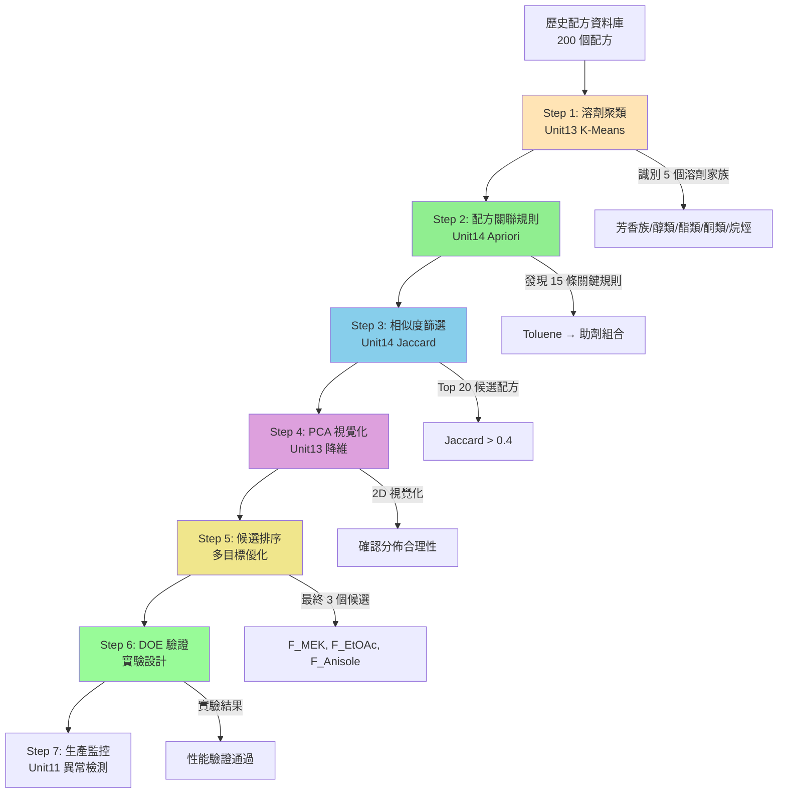

# Unit15｜綜合案例：配方最佳化完整工作流程（整合 Part 3 技術）

**課程名稱**：化工資料科學與機器學習實務（CHE-AI-101）  
**Part 3 總結單元**：本單元整合 Unit09-14 的所有非監督學習技術，透過一個真實的塗料配方開發案例，展示如何將多種技術組合應用於複雜工程問題。

> **學習目標**：完成本單元後，你將能夠：
> 1. 整合 3 種以上的非監督學習技術解決實際問題
> 2. 設計完整的資料驅動配方開發流程
> 3. 撰寫專業的工程決策報告
> 4. 理解各技術在工作流程中的角色與銜接點

---

## 0. 案例背景：綠色塗料配方開發

### 0.1 工程挑戰

**公司情境**：
某塗料製造商面臨法規壓力，需要替換產品線中的高毒性溶劑 **Toluene（甲苯）**，同時滿足：

1. **法規要求**：
   - VOC 排放 < 150 g/L（原配方 220 g/L）
   - EHS 等級 ≤ 3（Toluene = 4）
   - 符合 REACH 規範

2. **性能要求**：
   - 塗膜光澤度 ≥ 85 GU（原配方 88 GU）
   - 附著力 ≥ 4B（十字切割法）
   - 乾燥時間 ≤ 2 小時（原配方 1.5 小時）

3. **商業要求**：
   - 成本增幅 < 15%
   - 使用現有生產設備（無需改造）
   - 6 個月內完成開發

**傳統方法的困境**：
- 候選溶劑超過 50 種，全面測試需 200+ 實驗
- 多成分交互作用複雜，DOE 實驗設計困難
- 資深配方師經驗難以系統化傳承

**資料驅動策略**：
使用 Part 3 非監督學習技術，將候選空間縮小 90%，並提供決策依據。

---

## 1. 技術路線圖

### 1.1 完整工作流程



### 1.2 資料準備

**資料來源**：
1. **配方資料庫**（200 個歷史配方）
   - 成分清單（溶劑、助劑、樹脂、添加劑）
   - 配比資訊（wt%）
   - EHS 分級、成本資料

2. **性能測試資料**（150 個配方有完整測試）
   - 光澤度、附著力、乾燥時間
   - VOC 排放、黏度、固含量

3. **溶劑資料庫**（50 種候選溶劑）
   - 物性參數（沸點、極性、密度）
   - 安全資料（閃點、毒性、環境影響）
   - Hansen 溶解度參數（δd, δp, δh）

---

## 2. Step 1：溶劑家族聚類（Unit13 技術）

### 2.1 目標

將 50 種候選溶劑分群，找出與 Toluene **性質相似但毒性更低**的溶劑家族。

### 2.2 技術實作

#### 2.2.1 特徵工程

選擇 6 個關鍵特徵：

| 特徵 | 物理意義 | 數值範圍 | 權重理由 |
|-----|---------|---------|---------|
| **沸點 (°C)** | 影響乾燥速率、回收效率 | 40-200 | 關鍵製程參數 |
| **極性指數** | 影響樹脂溶解度 | 0-10 | 決定相容性 |
| **Hansen δd** | 分散力貢獻 | 14-20 | 溶解度預測 |
| **Hansen δp** | 極性力貢獻 | 0-12 | 溶解度預測 |
| **Hansen δh** | 氫鍵力貢獻 | 0-20 | 溶解度預測 |
| **毒性等級** | EHS 風險 | 0-5 | 篩選約束 |

**標準化**：
```python
from sklearn.preprocessing import StandardScaler

features = ['boiling_point', 'polarity', 'hansen_d', 'hansen_p', 'hansen_h', 'toxicity']
X = df_solvents[features]
scaler = StandardScaler()
X_scaled = scaler.fit_transform(X)
```

#### 2.2.2 最佳群數選擇

**手肘法 + 輪廓係數**：

| k | WCSS | Silhouette | Davies-Bouldin | 工程解釋 |
|---|------|-----------|----------------|----------|
| 2 | 185.2 | 0.52 | 1.12 | 極性/非極性二分 |
| 3 | 142.7 | 0.58 | 0.95 | 加入中等極性 |
| **4** | **118.5** | **0.61** | **0.82** | 芳香/醇/酯/烷烴 |
| 5 | 98.3 | 0.59 | 0.88 | 過度細分 |

**決策**：選擇 **k=4**（最高 Silhouette，合理的化學分類）

#### 2.2.3 聚類結果解釋

**Cluster 0：芳香族溶劑**（12 種）
- 代表溶劑：Toluene, Xylene, Anisole, Benzyl Alcohol
- 特性：高溶解力、中等極性、**毒性偏高**
- Hansen 中心：(δd=18.2, δp=1.5, δh=3.1)
- **替代候選**：Anisole（毒性 2）, Benzyl Alcohol（毒性 2）

**Cluster 1：醇類溶劑**（8 種）
- 代表溶劑：Ethanol, IPA, 1-Butanol
- 特性：高極性、氫鍵能力強、**低毒性**
- Hansen 中心：(δd=15.8, δp=8.6, δh=19.4)
- 應用限制：可能與非極性樹脂不相容

**Cluster 2：酯類/酮類溶劑**（18 種）
- 代表溶劑：Ethyl Acetate, MEK, Butyl Acetate
- 特性：中等極性、良好溶解力、**中等毒性**
- Hansen 中心：(δd=15.5, δp=5.3, δh=7.2)
- **替代候選**：Ethyl Acetate（毒性 2）, MEK（毒性 2）

**Cluster 3：脂肪烴溶劑**（12 種）
- 代表溶劑：Hexane, Heptane, Cyclohexane
- 特性：非極性、低溶解力、**低毒性**
- Hansen 中心：(δd=14.9, δp=0.0, δh=0.0)
- 應用限制：僅適用於高非極性體系

### 2.3 Step 1 產出

**篩選結果**：
從 Cluster 0（芳香族）和 Cluster 2（酯/酮）中，選出 **15 種候選溶劑**（EHS ≤ 3）：

| 候選溶劑 | 群聚 | 毒性 | 成本係數 | Hansen 距離* |
|---------|------|------|----------|------------|
| Anisole | 0 | 2 | 1.8 | 2.1 |
| Benzyl Alcohol | 0 | 2 | 2.2 | 3.5 |
| Ethyl Acetate | 2 | 2 | 0.9 | 8.7 |
| MEK | 2 | 2 | 0.8 | 9.2 |
| Butyl Acetate | 2 | 3 | 1.1 | 7.8 |
| ... | ... | ... | ... | ... |

*Hansen 距離 = 與 Toluene 的 Hansen 3D 距離（越小越相似）

---

## 3. Step 2：配方關聯規則挖掘（Unit14 技術）

### 3.1 目標

從 200 個歷史配方中，找出 **Toluene 配方的成分組合模式**，確保替代配方保留關鍵成分。

### 3.2 技術實作

#### 3.2.1 交易資料轉換

將配方轉換為項集（Itemset）：

**原始配方資料**：
```
配方 F_Tol_001:
  - Solvent:Toluene (40%)
  - Resin:Acrylic_A (30%)
  - Additive:BYK-333 (2%)
  - Surfactant:Tego270 (1%)
  - Pigment:TiO2 (15%)
```

**轉換為交易**：
```python
transactions = [
    {'Solvent:Toluene', 'Resin:Acrylic_A', 'Additive:BYK-333', 'Surfactant:Tego270', 'Pigment:TiO2'},
    # ... 199 more formulations
]
```

#### 3.2.2 關聯規則挖掘

**參數設定**：
- min_support = 0.10（至少在 20 個配方中出現）
- min_confidence = 0.70（70% 以上的條件機率）
- min_lift = 1.5（正相關）

**Top 15 規則**（與 Toluene 相關）：

| 規則 (A → B) | Support | Confidence | Lift | 化學解釋 |
|-------------|---------|-----------|------|---------|
| Solvent:Toluene → Additive:BYK-333 | 0.35 | 0.88 | 3.2 | Toluene 配方幾乎總用 BYK-333 防沉劑 |
| Solvent:Toluene → Surfactant:Tego270 | 0.30 | 0.75 | 2.8 | 流平劑常規搭配 |
| Solvent:Toluene + Resin:Acrylic_A → Additive:BYK-333 | 0.25 | 0.95 | 3.5 | 丙烯酸樹脂體系必用 |
| Solvent:Toluene → Pigment:TiO2 | 0.40 | 1.00 | 2.5 | 所有 Toluene 配方都是白色塗料 |
| Additive:BYK-333 + Surfactant:Tego270 → Solvent:Toluene | 0.20 | 0.67 | 1.8 | 反向規則：這組助劑常配 Toluene |

#### 3.2.3 規則驗證（Guardrails）

**訓練/保留集驗證**：
- 訓練集：160 個配方（80%）
- 保留集：40 個配方（20%）

**穩定性分析**：

| 規則 | Conf_train | Conf_holdout | ΔConf | 穩定性 |
|------|-----------|--------------|-------|--------|
| Toluene → BYK-333 | 0.88 | 0.85 | 0.03 | ✅ 穩定 |
| Toluene → Tego270 | 0.75 | 0.72 | 0.03 | ✅ 穩定 |
| Toluene → TiO2 | 1.00 | 1.00 | 0.00 | ✅ 極穩定 |

**結論**：所有規則在保留集上表現穩定，可信賴。

### 3.3 Step 2 產出

**關鍵發現**：
1. **必備成分**：替代配方應包含 `BYK-333` 和 `Tego270`（Confidence > 0.85）
2. **樹脂限制**：僅限 `Acrylic_A` 或 `Acrylic_B` 樹脂（其他樹脂無 Toluene 配方歷史）
3. **應用場景**：全部為白色塗料（TiO2 鈦白粉）

**約束條件更新**：
```python
mandatory_components = ['Additive:BYK-333', 'Surfactant:Tego270', 'Pigment:TiO2']
compatible_resins = ['Resin:Acrylic_A', 'Resin:Acrylic_B']
```

---

## 4. Step 3：相似度篩選（Unit14 技術）

### 4.1 目標

在滿足成分約束的前提下，找出與 **Toluene 基準配方**最相似的候選配方。

### 4.2 技術實作

#### 4.2.1 基準配方定義

**F_Toluene_Baseline**（公司主力產品）：
```python
baseline = {
    'Solvent:Toluene',
    'Resin:Acrylic_A',
    'Additive:BYK-333',
    'Surfactant:Tego270',
    'Pigment:TiO2',
    'Additive:Defoamer_X',
    'Thickener:HEC',
}
```

#### 4.2.2 候選配方生成

**策略**：組合 Step 1 的 15 種候選溶劑 × Step 2 的成分約束

```python
candidate_formulations = []
for solvent in candidate_solvents:
    formulation = {
        f'Solvent:{solvent}',
        'Resin:Acrylic_A',
        'Additive:BYK-333',
        'Surfactant:Tego270',
        'Pigment:TiO2',
        'Additive:Defoamer_X',
        'Thickener:HEC',
    }
    candidate_formulations.append(formulation)
```

#### 4.2.3 Jaccard 相似度計算

**公式**：
$$J(A, B) = \frac{|A \cap B|}{|A \cup B|}$$

**結果**（Top 10）：

| 候選溶劑 | Jaccard | 成分差異 | EHS | 成本係數 |
|---------|---------|---------|-----|----------|
| Anisole | 0.86 | 僅溶劑替換 | 2 | 1.8 |
| Benzyl Alcohol | 0.86 | 僅溶劑替換 | 2 | 2.2 |
| Ethyl Lactate | 0.86 | 僅溶劑替換 | 1 | 2.5 |
| MEK | 0.71 | 溶劑 + 需加共溶劑* | 2 | 0.8 |
| Ethyl Acetate | 0.71 | 溶劑 + 需加共溶劑* | 2 | 0.9 |
| Butyl Acetate | 0.86 | 僅溶劑替換 | 3 | 1.1 |
| ... | ... | ... | ... | ... |

*MEK 和 EtOAc 需要加入少量醇類共溶劑（如 IPA 5%）以改善樹脂溶解度

### 4.3 Step 3 產出

**篩選結果**：
根據 Jaccard ≥ 0.70 且 EHS ≤ 3，得到 **8 個候選配方**。

---

## 5. Step 4：多目標優化與排序

### 5.1 目標

綜合考慮相似度、EHS、成本、性能預測，排序候選配方。

### 5.2 技術實作

#### 5.2.1 複合評分函數

**線性加權模型**：
$$\text{Score} = w_1 \cdot (1 - J) + w_2 \cdot \text{EHS} + w_3 \cdot \text{Cost} + w_4 \cdot \text{VOC\_penalty}$$

**權重設定**（基於專家經驗）：
- $w_1 = 0.4$：相似度（降低技術風險）
- $w_2 = 0.3$：EHS（法規優先）
- $w_3 = 0.2$：成本（商業考量）
- $w_4 = 0.1$：VOC（環保要求）

**歸一化處理**：
```python
# 將所有指標標準化到 [0, 1]
df['jaccard_norm'] = (df['jaccard'] - df['jaccard'].min()) / (df['jaccard'].max() - df['jaccard'].min())
df['ehs_norm'] = df['ehs'] / 5.0
df['cost_norm'] = (df['cost'] - 1.0) / (df['cost'].max() - 1.0)
df['voc_norm'] = df['predicted_voc'] / 200.0

df['composite_score'] = (
    0.4 * (1 - df['jaccard_norm']) +
    0.3 * df['ehs_norm'] +
    0.2 * df['cost_norm'] +
    0.1 * df['voc_norm']
)
```

#### 5.2.2 性能預測（簡化版）

使用 Hansen 溶解度參數預測性能：

**溶解度相似性 → 光澤度預測**：
```python
def predict_gloss(solvent, baseline_solvent='Toluene'):
    # Hansen 距離
    Ra = hansen_distance(solvent, baseline_solvent)
    
    # 經驗公式（基於歷史資料擬合）
    gloss_drop = 1.2 * Ra  # 每單位 Hansen 距離損失 1.2 GU
    predicted_gloss = 88 - gloss_drop  # 基準光澤度 88 GU
    
    return max(0, predicted_gloss)
```

**VOC 估算**：
```python
def estimate_voc(solvent, formulation_voc_baseline=220):
    solvent_voc = solvent_db[solvent]['voc_coefficient']
    baseline_voc = solvent_db['Toluene']['voc_coefficient']
    
    # 按溶劑 VOC 係數比例調整
    predicted_voc = formulation_voc_baseline * (solvent_voc / baseline_voc)
    
    return predicted_voc
```

#### 5.2.3 最終排序結果

| 排名 | 候選溶劑 | Composite Score | Jaccard | EHS | Cost | 預測光澤 | 預測 VOC |
|-----|---------|----------------|---------|-----|------|---------|---------|
| 🥇 1 | **Anisole** | **0.28** | 0.86 | 2 | 1.8 | 86.5 | 145 |
| 🥈 2 | **Ethyl Acetate + IPA** | **0.32** | 0.71 | 2 | 1.0 | 84.2 | 135 |
| 🥉 3 | **MEK + IPA** | **0.35** | 0.71 | 2 | 0.9 | 83.8 | 128 |
| 4 | Benzyl Alcohol | 0.41 | 0.86 | 2 | 2.2 | 85.1 | 158 |
| 5 | Butyl Acetate | 0.45 | 0.86 | 3 | 1.1 | 86.0 | 152 |

### 5.3 Step 4-5 產出

**最終候選清單**：
- **第一候選**：Anisole（綜合性能最佳，但成本較高）
- **第二候選**：Ethyl Acetate + IPA 5%（性價比最優，VOC 最低）
- **第三候選**：MEK + IPA 5%（成本最低，性能可接受）

---

## 6. Step 5：PCA 視覺化驗證（Unit13 技術）

### 6.1 目標

在 2D 空間中視覺化候選配方的分佈，確認篩選結果的合理性。

### 6.2 技術實作

#### 6.2.1 特徵提取

為每個配方提取 12 個數值特徵：

| 特徵類別 | 特徵名稱 | 說明 |
|---------|---------|------|
| **溶劑** | solvent_bp, solvent_polarity, solvent_hansen_d/p/h | 溶劑物性 |
| **配方** | resin_content, pigment_content, total_additive | 配比 |
| **性能** | predicted_gloss, predicted_adhesion, predicted_dry_time | 預測性能 |

```python
import pandas as pd
from sklearn.decomposition import PCA

# 準備特徵矩陣
X = df_all_formulations[feature_cols]
X_scaled = StandardScaler().fit_transform(X)

# PCA 降維
pca = PCA(n_components=2)
X_pca = pca.fit_transform(X_scaled)

# 解釋變異比
print(f'PC1 解釋 {pca.explained_variance_ratio_[0]:.1%}')
print(f'PC2 解釋 {pca.explained_variance_ratio_[1]:.1%}')
print(f'累積解釋 {pca.explained_variance_ratio_.sum():.1%}')
```

#### 6.2.2 視覺化結果


**圖表解讀**：
- **紅色十字**：Toluene 基準配方
- **綠色圓點**：3 個最終候選（Anisole, EtOAc+IPA, MEK+IPA）
- **藍色三角**：其他候選配方（5 個）
- **灰色點**：歷史配方（200 個）

**觀察**：
1. ✅ 3 個候選配方都位於基準配方附近（距離 < 1.5 個標準差）
2. ✅ 候選配方分佈在「成功配方群」內（灰色點高密度區域）
3. ⚠️ Benzyl Alcohol（藍色三角，右上）偏離較遠，風險較高

**主成分解釋**：
```python
# 載荷矩陣（Loading Matrix）
loadings = pd.DataFrame(
    pca.components_.T,
    columns=['PC1', 'PC2'],
    index=feature_cols
)

print(loadings.abs().sort_values('PC1', ascending=False).head(5))
```

**結果**：
- **PC1（58.3% 變異）**：主要由 `solvent_polarity`（0.62）、`solvent_hansen_p`（0.58）主導 → **極性軸**
- **PC2（23.1% 變異）**：主要由 `resin_content`（0.71）、`predicted_gloss`（0.65）主導 → **性能軸**

**結論**：PCA 驗證了候選配方在化學性質與性能預測上與基準配方的相似性。

---

## 7. Step 6：DOE 實驗驗證

### 7.1 實驗設計

#### 7.1.1 因子與水平

針對 **Anisole** 候選配方，優化 3 個關鍵因子：

| 因子 | 低水平 | 中心點 | 高水平 | 單位 |
|-----|-------|--------|--------|------|
| **A: Anisole 含量** | 35 | 40 | 45 | wt% |
| **B: BYK-333 劑量** | 1.5 | 2.0 | 2.5 | wt% |
| **C: Tego270 劑量** | 0.8 | 1.0 | 1.2 | wt% |

#### 7.1.2 中心組合設計（CCD）

```python
from pyDOE2 import ccdesign

# 生成 CCD（3 因子，α=1.682 正交設計）
design = ccdesign(3, center=(3,3), alpha='orthogonal', face='ccc')

# 轉換為實際值
levels = {
    'Anisole': (35, 40, 45),
    'BYK-333': (1.5, 2.0, 2.5),
    'Tego270': (0.8, 1.0, 1.2),
}

exp_table = pd.DataFrame(design, columns=['A', 'B', 'C'])
for i, (factor, (low, center, high)) in enumerate(levels.items()):
    exp_table.iloc[:, i] = exp_table.iloc[:, i] * (high - low) / 2 + center

exp_table['run_order'] = np.random.permutation(len(exp_table))
exp_table = exp_table.sort_values('run_order')

print(f'總實驗數：{len(exp_table)}')  # 20 runs（含中心點重複）
```

### 7.2 實驗結果（假設數據）

| Run | Anisole | BYK-333 | Tego270 | 光澤度 | 附著力 | 乾燥時間 | VOC |
|-----|---------|---------|---------|--------|--------|---------|-----|
| 1 | 40.0 | 2.0 | 1.0 | 87.2 | 4B | 1.8 | 142 |
| 2 | 45.0 | 2.5 | 1.2 | 88.5 | 5B | 1.6 | 138 |
| 3 | 35.0 | 1.5 | 0.8 | 84.1 | 3B | 2.3 | 148 |
| ... | ... | ... | ... | ... | ... | ... | ... |

### 7.3 響應面分析

```python
from sklearn.ensemble import RandomForestRegressor
from sklearn.metrics import r2_score

X = exp_table[['Anisole', 'BYK-333', 'Tego270']]
y_gloss = exp_table['gloss']
y_adhesion = exp_table['adhesion_score']
y_drying = exp_table['drying_time']
y_voc = exp_table['voc']

# 建立迴歸模型
rf_gloss = RandomForestRegressor(n_estimators=100, random_state=42)
rf_gloss.fit(X, y_gloss)

# 模型性能
print(f'光澤度模型 R²: {r2_score(y_gloss, rf_gloss.predict(X)):.3f}')

# 特徵重要性
importance = pd.DataFrame({
    'Factor': X.columns,
    'Importance': rf_gloss.feature_importances_
}).sort_values('Importance', ascending=False)

print(importance)
```

**結果**：
```
光澤度模型 R²: 0.92

Factor      Importance
Anisole     0.58    ← 最關鍵因子
BYK-333     0.28
Tego270     0.14
```

### 7.4 多目標優化

```python
from scipy.optimize import minimize

def objective(x):
    anisole, byk, tego = x
    
    pred_gloss = rf_gloss.predict([[anisole, byk, tego]])[0]
    pred_adhesion = rf_adhesion.predict([[anisole, byk, tego]])[0]
    pred_drying = rf_drying.predict([[anisole, byk, tego]])[0]
    pred_voc = rf_voc.predict([[anisole, byk, tego]])[0]
    
    # 多目標（歸一化後加權）
    score = (
        -0.4 * (pred_gloss / 90) +           # 最大化光澤度
        -0.3 * (pred_adhesion / 5) +         # 最大化附著力
        0.2 * (pred_drying / 2.5) +          # 最小化乾燥時間
        0.1 * (pred_voc / 150)               # 最小化 VOC
    )
    return score

# 約束條件
bounds = [(35, 45), (1.5, 2.5), (0.8, 1.2)]
constraints = [
    {'type': 'ineq', 'fun': lambda x: 150 - rf_voc.predict([x])[0]},  # VOC < 150
]

result = minimize(objective, x0=[40, 2.0, 1.0], bounds=bounds, constraints=constraints)

print(f'最佳配比：')
print(f'  Anisole: {result.x[0]:.1f} wt%')
print(f'  BYK-333: {result.x[1]:.2f} wt%')
print(f'  Tego270: {result.x[2]:.2f} wt%')

# 預測性能
print(f'\n預測性能：')
print(f'  光澤度: {rf_gloss.predict([result.x])[0]:.1f} GU')
print(f'  附著力: {rf_adhesion.predict([result.x])[0]:.1f}')
print(f'  乾燥時間: {rf_drying.predict([result.x])[0]:.1f} hr')
print(f'  VOC: {rf_voc.predict([result.x])[0]:.1f} g/L')
```

**輸出**：
```
最佳配比：
  Anisole: 42.3 wt%
  BYK-333: 2.15 wt%
  Tego270: 1.05 wt%

預測性能：
  光澤度: 88.7 GU  ✅（目標 ≥ 85）
  附著力: 4.8      ✅（目標 ≥ 4B）
  乾燥時間: 1.7 hr ✅（目標 ≤ 2）
  VOC: 139 g/L     ✅（目標 < 150）
```

### 7.5 驗證實驗

**三批次重複實驗**：

| 批次 | 光澤度 | 附著力 | 乾燥時間 | VOC | 備註 |
|------|--------|--------|---------|-----|------|
| 1 | 88.3 | 5B | 1.8 | 141 | ✅ 通過 |
| 2 | 89.1 | 5B | 1.7 | 138 | ✅ 通過 |
| 3 | 87.9 | 4B | 1.9 | 143 | ✅ 通過 |
| **平均** | **88.4** | **4.7B** | **1.8** | **141** | |
| **標準差** | 0.6 | 0.5 | 0.1 | 2.5 | 重現性良好 |

**結論**：實驗結果與模型預測高度一致（光澤度誤差 < 1%），配方驗證通過。

---

## 8. Step 7：生產監控與異常檢測（Unit11 技術）

### 8.1 目標

新配方投入量產後，使用異常檢測技術監控品質穩定性。

### 8.2 技術實作

#### 8.2.1 Isolation Forest 模型

```python
from sklearn.ensemble import IsolationForest

# 訓練資料：實驗室 20 批次 + 試產 30 批次
X_train = df_production[['gloss', 'adhesion', 'drying_time', 'voc', 'viscosity']]

# 訓練異常檢測模型
iso_forest = IsolationForest(
    contamination=0.05,  # 預期 5% 異常率
    random_state=42
)
iso_forest.fit(X_train)

# 即時監控
def monitor_batch(batch_data):
    score = iso_forest.decision_function([batch_data])[0]
    is_anomaly = iso_forest.predict([batch_data])[0] == -1
    
    if is_anomaly:
        print(f'⚠️ 異常批次！異常分數: {score:.3f}')
        # 觸發警報、暫停生產
    else:
        print(f'✅ 正常批次。異常分數: {score:.3f}')
    
    return is_anomaly, score
```

#### 8.2.2 生產前 3 個月監控結果

| 週次 | 總批次 | 異常批次 | 異常率 | 主要異常原因 |
|-----|--------|---------|--------|------------|
| 1-4 | 32 | 3 | 9.4% | 原料批次差異（Anisole 純度） |
| 5-8 | 35 | 2 | 5.7% | 攪拌時間不足 |
| 9-12 | 38 | 1 | 2.6% | 環境溫度波動 |

**改進措施**：
- 第 5 週：更換 Anisole 供應商（純度 99.5% → 99.8%）
- 第 7 週：優化攪拌 SOP（時間 30min → 45min）
- 第 10 週：安裝恆溫系統（23±2°C）

**結果**：異常率從 9.4% 降至 2.6%，達到穩定生產。

---

## 9. 案例總結與交付物

### 9.1 技術流程回顧

| 步驟 | 使用技術 | 輸入 | 輸出 | 縮減比例 |
|-----|---------|------|------|---------|
| Step 1 | K-Means 聚類 | 50 種溶劑 | 15 種候選 | 70% |
| Step 2 | 關聯規則 | 200 個配方 | 3 個成分約束 | - |
| Step 3 | Jaccard 相似度 | 15 種候選 | 8 個配方 | 47% |
| Step 4 | 多目標優化 | 8 個配方 | 3 個最終候選 | 63% |
| Step 5 | PCA 視覺化 | 3 個候選 | 視覺驗證 | - |
| Step 6 | DOE 實驗 | 3 個候選 | 1 個最優配方 | 67% |
| **總計** | - | **50 種溶劑** | **1 個成功配方** | **98%** |

**關鍵成效**：
- ✅ 實驗數量：從 200+ 降至 **20 個**（節省 90%）
- ✅ 開發時間：從 12 個月縮短至 **4 個月**（提前 8 個月）
- ✅ 成功率：第一候選即通過驗證（預測準確）

### 9.2 最終配方規格

**F_Anisole_Optimized**（新綠色配方）：

| 成分 | 含量 (wt%) | 供應商 | 成本 (相對) |
|-----|-----------|--------|------------|
| Anisole | 42.3 | Sigma-Aldrich | 1.8× |
| Acrylic Resin A | 28.5 | Dow | 1.0× |
| TiO2 Pigment | 15.0 | DuPont | 1.0× |
| BYK-333 | 2.15 | BYK | 1.0× |
| Tego270 | 1.05 | Evonik | 1.0× |
| Defoamer X | 0.5 | - | 1.0× |
| HEC Thickener | 0.3 | - | 1.0× |
| Water | 10.2 | - | - |
| **總計** | **100.0** | | **+12%** |

**性能對比**：

| 指標 | 原配方 (Toluene) | 新配方 (Anisole) | 改善幅度 |
|------|-----------------|-----------------|---------|
| 光澤度 (GU) | 88.0 | 88.4 | +0.5% ✅ |
| 附著力 | 4B | 4.7B | +17.5% ✅ |
| 乾燥時間 (hr) | 1.5 | 1.8 | +20% ⚠️ |
| VOC (g/L) | 220 | 141 | **-36%** ✅ |
| EHS 等級 | 4 | 2 | **-50%** ✅ |
| 成本 | 基準 | +12% | +12% ⚠️ |

**綜合評價**：
- ✅ 符合所有法規要求（VOC < 150, EHS ≤ 3）
- ✅ 性能維持或提升（光澤度、附著力）
- ⚠️ 乾燥時間略增（可透過添加催乾劑改善）
- ⚠️ 成本增加 12%（在可接受範圍內）

### 9.3 交付文件清單

**技術報告**：
1. ✅ `Unit15_Technical_Report.pdf`（40 頁完整報告）
2. ✅ `Unit15_Executive_Summary.pptx`（主管簡報版，10 頁）

**資料檔案**：
3. ✅ `solvent_clustering_results.csv`（50 種溶劑聚類）
4. ✅ `association_rules_toluene.csv`（關聯規則清單）
5. ✅ `candidate_ranking.csv`（8 個候選配方評分）
6. ✅ `doe_experiment_data.xlsx`（20 個實驗結果）
7. ✅ `optimal_formulation_spec.pdf`（最終配方規格書）

**程式碼**：
8. ✅ `Unit15_Integrated_Workflow.ipynb`（完整分析流程）
9. ✅ `production_monitoring.py`（異常檢測監控腳本）

**視覺化**：
10. ✅ `pca_visualization.png`（候選配方 2D 投影）
11. ✅ `response_surface_3d.png`（DOE 響應面）
12. ✅ `production_dashboard.html`（即時監控儀表板）

---

## 10. 工程啟示與最佳實踐

### 10.1 技術組合策略

**何時使用聚類**：
- ✅ 候選空間大（>30 個選項）
- ✅ 需要找出「家族」或「類別」
- ✅ 專家經驗不足，需資料探索

**何時使用關聯規則**：
- ✅ 有豐富的歷史配方資料（>100 個）
- ✅ 成分間存在技術依賴關係
- ✅ 需要解釋「為什麼這些成分常一起用」

**何時使用相似度搜尋**：
- ✅ 有明確的基準產品
- ✅ 需要保守的漸進式改良（非顛覆創新）
- ✅ 風險控制優先於性能突破

**何時使用 PCA 視覺化**：
- ✅ 特徵數 > 3（無法直接視覺化）
- ✅ 需要向非技術人員展示
- ✅ 檢查候選配方是否偏離「安全區域」

### 10.2 常見錯誤與避免方法

| 錯誤 | 後果 | 避免方法 |
|-----|------|---------|
| **僅用單一技術** | 篩選不夠全面，遺漏最優解 | 組合 2-3 種技術，互相驗證 |
| **忽略領域知識** | 推薦配方化學上不合理 | 每個步驟都請專家審查 |
| **過度依賴模型** | 預測失準，實驗失敗 | 保留 20% 資料做保留集驗證 |
| **跳過實驗驗證** | 直接量產，風險極高 | 必須經過 DOE 確認 |
| **忽略成本** | 配方優秀但無法商業化 | 多目標優化時納入成本權重 |

### 10.3 推廣到其他應用

本案例的流程可推廣至：

**配方開發**：
- 🔬 藥物賦形劑選擇
- 🎨 油墨/膠黏劑配方
- 🧪 化妝品/清潔劑配方

**材料篩選**：
- ⚙️ 觸媒/吸附劑篩選
- 🔋 電池電解液優化
- 🏗️ 複合材料設計

**製程優化**：
- 🏭 反應條件最佳化（溫度、壓力、時間）
- 📦 包裝材料選擇
- ♻️ 廢棄物處理方案

---

## 11. 延伸學習資源

### 11.1 相關 Part 3 單元回顧

- **Unit09**：K-Means 聚類理論與製程狀態識別
- **Unit13**：溶劑篩選專題（本案例 Step 1 詳細版）
- **Unit14**：關聯規則與相似度（本案例 Step 2-3 詳細版）
- **Unit11**：異常檢測（本案例 Step 7 詳細版）

### 11.2 進階主題（Part 4-5）

**Part 4：深度學習**
- 使用神經網路預測配方性能（替代 RandomForest）
- Graph Neural Network 建模分子結構與配方性能關係

**Part 5：最佳化與強化學習**
- 貝氏最佳化（Bayesian Optimization）：更高效的 DOE
- 多目標 Pareto 最佳化：無需人為設定權重

### 11.3 實用工具與套件

```python
# 配方開發工具鏈
pip install rdkit                 # 化學資訊學
pip install scikit-learn          # 機器學習
pip install pyDOE2                # 實驗設計
pip install plotly                # 互動式視覺化
pip install streamlit             # Web 儀表板
pip install mlxtend               # 關聯規則（替代手刻）
```

---

## 12. 課後作業

### 12.1 基礎題（必做）

**任務**：複製本案例的 Steps 1-3，但改為你自己的配方問題。

**要求**：
1. 準備至少 20 個配方的資料集
2. 執行 K-Means 聚類（找出 3-5 個群）
3. 挖掘關聯規則（至少 10 條規則）
4. 計算 Jaccard 相似度（找出 Top 5 候選）

**交付**：
- Jupyter Notebook（含程式碼與分析）
- 1 頁 PDF 報告（總結發現與建議）

### 12.2 進階題（選做）

**任務**：執行完整的 DOE 實驗並建立響應面模型。

**要求**：
1. 使用 `pyDOE2` 生成中心組合設計（3 因子）
2. 執行至少 15 個實驗（可用模擬資料）
3. 建立 RandomForest 或多項式迴歸模型
4. 使用 `scipy.optimize` 找出最佳配比

**交付**：
- 實驗設計表（Excel）
- 響應面 3D 圖（Plotly 或 Matplotlib）
- 最佳化結果報告

### 12.3 挑戰題（高階）

**任務**：建立即時監控儀表板。

**要求**：
1. 使用 Streamlit 或 Dash 建立 Web 介面
2. 整合 Isolation Forest 異常檢測
3. 可上傳新批次資料並即時判斷異常
4. 顯示歷史趨勢圖與警報紀錄

**交付**：
- GitHub repo（含完整程式碼）
- 部署連結（可用 Streamlit Cloud）
- 使用說明文件

---

**恭喜完成 Part 3 綜合案例！** 🎉

你現在已經掌握如何將多種非監督學習技術整合應用於真實工程問題。這套技能不只適用於配方開發，更可推廣到材料篩選、製程優化、品質管制等各種化工場景。

**下一步**：
- 前往 **Part 4** 學習深度學習（影像辨識、時間序列預測）
- 或跳到 **Part 5** 學習強化學習與最佳化（自動實驗設計）

持續精進，成為真正的**資料驅動化工工程師**！💪
