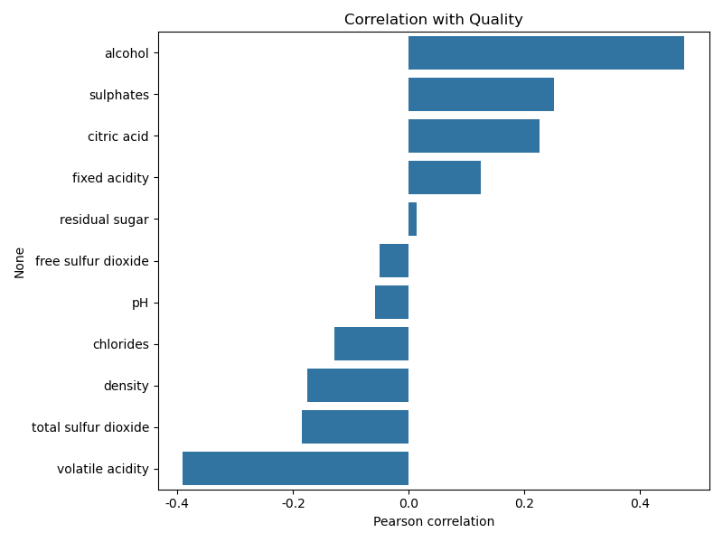
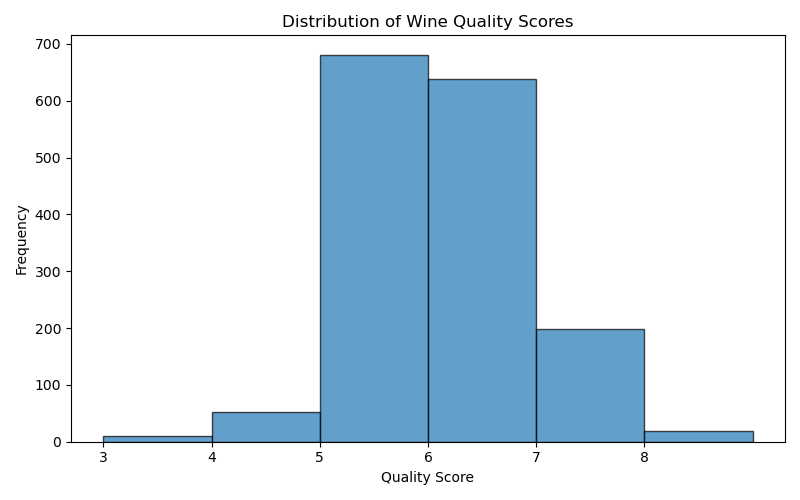
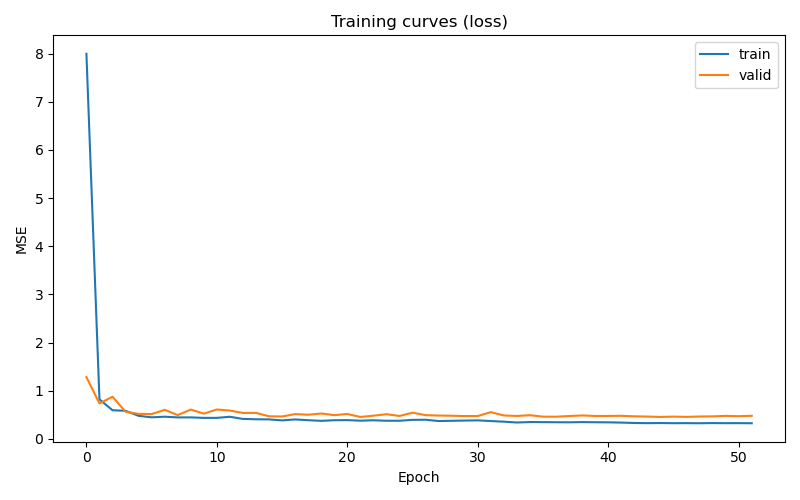
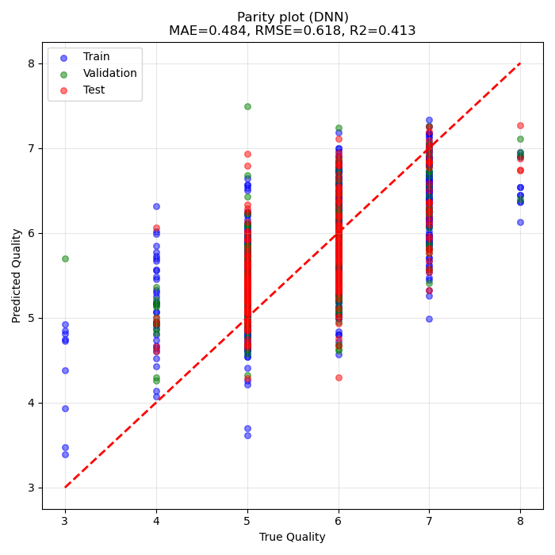
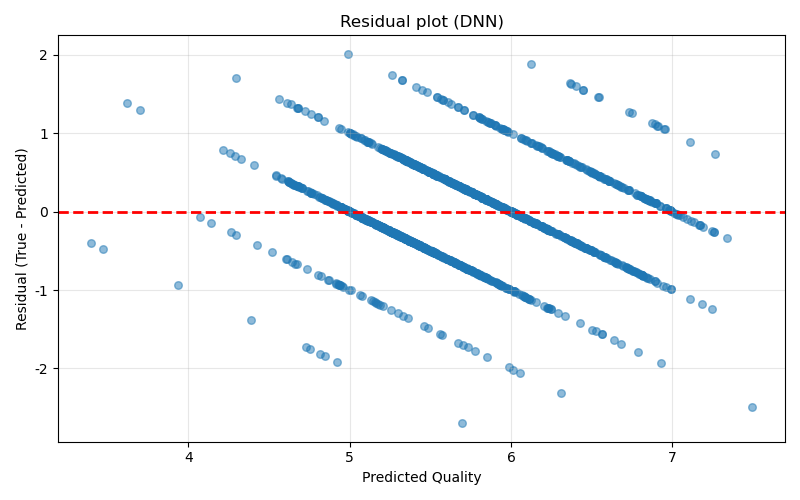
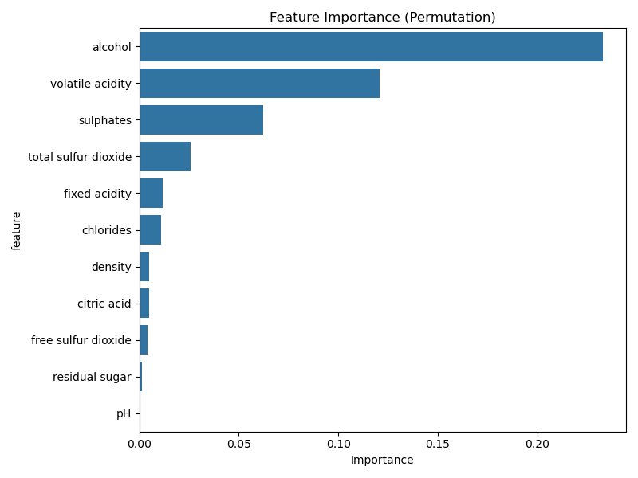

# Unit15_Example | Red Wine Quality：以 DNN 預測紅酒品質（回歸/分類）

本附錄提供一個「紅酒品質評估」的真實資料案例,讓學生透過完整流程練習以 **DNN（MLP）模型**預測 **紅酒品質分數**。資料來源與背景可參閱 Kaggle：`https://www.kaggle.com/datasets/uciml/red-wine-quality-cortez-et-al-2009/data`。

---

## 1. 案例背景：為什麼要預測紅酒品質？

在葡萄酒產業中,品質評估是決定產品定價、市場定位與生產調整的關鍵環節。傳統的品質評估依賴專業品酒師進行感官測試（sensory test）,但這種方法存在以下限制：

- **成本高昂**：需要訓練有素的專業人員
- **主觀性強**：不同品酒師的評分可能存在差異
- **效率低**：無法對大量樣本進行快速評估
- **一致性問題**：同一品酒師在不同時間的評分可能有變化

因此在工業 AI 中,常見作法是建立 **資料驅動的品質預測模型（quality prediction model）**,使用可客觀量測的理化性質（physicochemical properties）,快速預測品質分數以協助：

- 生產過程品質監控與預警
- 配方優化與調整（例如調整酸度、糖分等）
- 成本降低（減少專業品酒師的需求）
- 品質一致性提升

本案例可以用兩種方式建模：

1. **回歸問題**：輸入理化特徵,輸出品質分數（連續值 0-10）
2. **分類問題**：將品質分數轉換為類別（例如：低/中/高品質）

本教材主要以**回歸問題**為主,並在最後補充分類的做法。

### 1.1 補充理論：紅酒品質的化學基礎（Domain Knowledge）

紅酒的品質受到多種理化因素的影響,主要包含：

1. **酸度（Acidity）**：
   - **Fixed acidity（固定酸度）**：主要來自葡萄本身的酒石酸（tartaric acid）、蘋果酸（malic acid）等不揮發性酸。
   - **Volatile acidity（揮發性酸度）**：主要是醋酸（acetic acid）,過高會產生醋味,影響品質。
   - **Citric acid（檸檬酸）**：少量添加可增加新鮮感與風味複雜度。
   - 酸度影響紅酒的口感平衡、微生物穩定性與陳年潛力。

2. **糖分（Residual Sugar）**：
   - 發酵後殘留的糖分,影響甜度與口感。
   - 紅酒通常為干型（dry）,殘糖較低；但適量殘糖可平衡高酸度。

3. **氯化物（Chlorides）**：
   - 主要來自土壤與釀造過程,過高會產生鹹味。

4. **硫化物（Sulfur Dioxide）**：
   - **Free SO₂** 與 **Total SO₂**：用作防腐劑與抗氧化劑。
   - 適量的 SO₂ 可防止氧化與微生物污染,但過量會影響風味。

5. **密度（Density）**：
   - 與酒精度、糖分有關,可反映紅酒的「厚重感」。

6. **pH 值**：
   - 影響紅酒的穩定性、顏色與微生物生長。
   - 紅酒 pH 通常在 3.0-4.0 之間。

7. **硫酸鹽（Sulphates）**：
   - 可轉化為 SO₂,具有抗菌與抗氧化作用。

8. **酒精度（Alcohol）**：
   - 影響紅酒的「酒體（body）」、口感與風味強度。
   - 高酒精度通常帶來更豐富的口感,但需與其他成分平衡。

**為何需要資料驅動模型？**

傳統品質評估依賴專家經驗,但專家的判斷往往是基於這些理化性質的複雜交互作用。機器學習模型（特別是 DNN）可以自動學習這些非線性關係,提供：

- **客觀性**：基於可量測的理化數據
- **可重複性**：相同輸入產生相同輸出
- **效率**：可快速評估大量樣本
- **洞察**：透過特徵重要性分析,理解哪些因素最影響品質

---

## 2. 資料集與欄位

資料檔案位於本課程資料夾：

- 資料檔：`Part_4/data/redwine/winequality-red.csv`

資料共有 1599 筆樣本,12 個欄位（11 個特徵 + 1 個目標）：

| 欄位 | 角色 | 說明 | 單位 |
|---|---|---|---|
| `fixed acidity` | X | 固定酸度（非揮發性酸） | g(tartaric acid)/dm³ |
| `volatile acidity` | X | 揮發性酸度（主要是醋酸） | g(acetic acid)/dm³ |
| `citric acid` | X | 檸檬酸含量 | g/dm³ |
| `residual sugar` | X | 殘糖量 | g/dm³ |
| `chlorides` | X | 氯化物（鹽分） | g(sodium chloride)/dm³ |
| `free sulfur dioxide` | X | 游離二氧化硫 | mg/dm³ |
| `total sulfur dioxide` | X | 總二氧化硫 | mg/dm³ |
| `density` | X | 密度 | g/cm³ |
| `pH` | X | 酸鹼值 | - |
| `sulphates` | X | 硫酸鹽 | g(potassium sulphate)/dm³ |
| `alcohol` | X | 酒精度 | % vol. |
| `quality` | y | 品質分數（0-10,整數） | - |

### 2.1 特徵的物理意義解讀

理解特徵對應的物理意義,有助於我們解釋模型行為：

- **Volatile acidity（揮發性酸度）**：過高會產生不愉快的醋味,通常與品質呈負相關。高揮發性酸度可能來自醋酸菌污染或發酵控制不當。

- **Citric acid（檸檬酸）**：適量可增加新鮮感與複雜度,通常與品質呈正相關。但過量可能產生不平衡的酸味。

- **Alcohol（酒精度）**：通常與品質呈正相關,因為：
  - 高酒精度通常來自成熟度更好的葡萄（糖分更高）
  - 酒精帶來更豐富的「酒體」與口感
  - 但需與其他成分（酸度、單寧等）平衡

- **Sulphates（硫酸鹽）**：適量可轉化為 SO₂,提供抗氧化與抗菌保護,通常與品質呈正相關。

- **Density（密度）**：與酒精度、糖分相關。高密度可能表示高糖分（甜型酒）或低酒精度。

- **pH**：影響紅酒的穩定性與微生物活性。過高或過低都可能影響品質。

注意：此資料集的特徵皆為數值型,不需類別編碼；但需注意標準化、資料切分與評估方式。

---

## 3. EDA 與特徵直覺（Correlation）

在進入建模前,先用 **皮爾森相關係數（Pearson correlation）**快速檢查 `quality` 與各特徵的線性關聯程度（注意：相關不等於因果,且非線性關係可能不會在此指標中表現）。

皮爾森相關係數定義為：

$$
\rho_{X,Y} = \frac{\mathrm{cov}(X,Y)}{\sigma_X \sigma_Y}
= \frac{\sum_{i=1}^{n}(x_i-\bar{x})(y_i-\bar{y})}{\sqrt{\sum_{i=1}^{n}(x_i-\bar{x})^2}\sqrt{\sum_{i=1}^{n}(y_i-\bar{y})^2}}
$$

其中 $\rho \in [-1,1]$；越接近 $1$ 表示正相關越強,越接近 $-1$ 表示負相關越強。

### 3.1 範例執行結果：`quality` 與特徵相關性

執行 Notebook 後,我們計算了所有特徵與 `quality` 的皮爾森相關係數,結果如下:

| 特徵 | 相關係數 | 解讀 |
|---|---:|---|
| `alcohol` | **0.476** | 強正相關:酒精度越高,品質傾向越好 |
| `sulphates` | **0.251** | 中度正相關:適量硫酸鹽有助於品質 |
| `citric acid` | **0.226** | 中度正相關:檸檬酸增加新鮮感 |
| `fixed acidity` | 0.124 | 弱正相關 |
| `residual sugar` | 0.014 | 幾乎無相關 |
| `free sulfur dioxide` | -0.051 | 幾乎無相關 |
| `pH` | -0.058 | 幾乎無相關 |
| `chlorides` | -0.129 | 弱負相關:鹽分過高影響品質 |
| `density` | -0.175 | 弱負相關 |
| `total sulfur dioxide` | -0.185 | 弱負相關 |
| `volatile acidity` | **-0.391** | 強負相關:揮發性酸度(醋味)嚴重影響品質 |

**深入分析:為什麼 alcohol(酒精度)與 quality 呈正相關?**

這是一個具備多重物理與感官原因的現象:

1. **葡萄成熟度**:高酒精度通常來自糖分更高的葡萄,而高糖分通常表示葡萄成熟度更好、風味更濃郁。
2. **酒體與口感**:酒精帶來更豐富的「酒體(body)」,使紅酒口感更飽滿、更有層次。
3. **風味萃取**:酒精是良好的溶劑,可幫助萃取葡萄皮中的色素、單寧與風味物質。
4. **平衡感**:在適當範圍內,較高的酒精度可平衡酸度與單寧的澀感。

**為什麼 volatile acidity(揮發性酸度)與 quality 呈負相關?**

1. **醋味缺陷**:高揮發性酸度主要來自醋酸,會產生不愉快的醋味或指甲油味。
2. **微生物污染**:通常是醋酸菌污染或發酵控制不當的結果。
3. **品質指標**:在葡萄酒產業中,揮發性酸度是重要的品質缺陷指標。

我們使用 DNN 的目的,正是要讓模型自動捕捉這些由多變數交織而成的非線性化學與感官特性。

### 3.2 範例執行結果:品質分數分佈

品質分數為整數(0-10),但實際資料中主要集中在 5-6 分:

**統計摘要:**
- 樣本數:1599
- 最小值:3
- 最大值:8
- 平均值:5.636
- 中位數:6
- 標準差:0.808

**分佈詳情:**

| Quality | 樣本數 | 百分比 |
|---------|--------|--------|
| 3 | 10 | 0.63% |
| 4 | 53 | 3.31% |
| 5 | 681 | 42.59% |
| 6 | 638 | 39.90% |
| 7 | 199 | 12.45% |
| 8 | 18 | 1.13% |

**關鍵觀察:**

1. **類別不平衡**:82% 的樣本集中在 5-6 分,極端品質(3, 8)的樣本非常稀少
2. **近似常態分佈**:分佈呈現類似常態分佈,但略微右偏
3. **實務意義**:這種分佈反映了真實世界的品質評估——大部分產品為中等品質,極端的高品質與低品質樣本較少

**對建模的影響:**

- **回歸問題**:模型可能在極端品質區間(3, 8)的預測較不準確,因為訓練樣本少
- **分類問題**:若轉為分類,需要處理類別不平衡(例如使用 class weights 或 SMOTE)
- **評估策略**:不能只看整體 MAE/RMSE,應該分析不同品質區間的誤差分佈

---

## 4. 建模流程（建議）

### 4.1 問題定義

- 輸入：11 維特徵向量 `X`
- 輸出：連續值 `quality`（可視為回歸問題）或類別（可視為分類問題）
- 模型：DNN（MLP）回歸

### 4.2 正確的資料切分與避免 Data Leakage

建議流程：

1. 先從資料分離 `X` 與 `y`
2. 再做 `train/valid/test`（或 `train/test`）切分
3. **標準化（StandardScaler）只能用訓練集 fit**,再套用到 valid/test

本範例採用 `train/valid/test = 70%/15%/15%`,並將 valid 用於觀察泛化誤差與 early stopping。

#### 標準化（Standardization）為什麼重要？

多數神經網路/梯度型方法對特徵尺度敏感。標準化常用 Z-score：

$$
x' = \frac{x - \mu_{\text{train}}}{\sigma_{\text{train}}}
$$

強調：$\mu_{\text{train}}, \sigma_{\text{train}}$ 必須只由訓練集估計（避免資料洩漏）。

### 4.3 基線模型（強烈建議）

在訓練 DNN 前,先建立一個簡單 baseline（例如 Ridge/Linear Regression）,用來回答：

- DNN 是否真的有帶來更好效果？
- 資料是否足夠支撐更複雜模型？

---

## 5. Baseline：Ridge Regression（線性 + L2 正則化）

Ridge Regression 的核心是在線性回歸的平方誤差上加入 L2 正則化,避免係數過大造成過擬合：

$$
\min_{\mathbf{w}, b}\ \frac{1}{n}\sum_{i=1}^{n}\left(y_i-(\mathbf{w}^\top \mathbf{x}_i + b)\right)^2 + \lambda \|\mathbf{w}\|_2^2
$$

其中 $\lambda$（或實作中的 `alpha`）越大,正則化越強,模型越保守。

### 5.1 範例執行結果:Ridge baseline

在相同資料切分與標準化下,Ridge baseline 的實際執行結果如下:

**測試集表現:**

| 指標 | 數值 | 解讀 |
|------|------|------|
| MAE | **0.482** | 平均誤差約 0.5 分 |
| RMSE | **0.618** | 均方根誤差約 0.6 分 |
| R² | **0.373** | 解釋 37.3% 的品質變異 |

**各資料集的完整表現:**

| 資料集 | MAE | RMSE | R² |
|--------|-----|------|-----|
| 訓練集 | 0.499 | 0.647 | 0.358 |
| 驗證集 | 0.527 | 0.675 | 0.330 |
| 測試集 | 0.482 | 0.618 | 0.373 |
| 全部資料 | 0.500 | 0.647 | 0.357 |

**深入分析:**

1. **R² ≈ 0.37 的意義**:
   - 線性模型只能解釋約 37% 的品質變異
   - 剩餘 63% 的變異可能來自:
     - 非線性關係(例如酒精度與酸度的交互作用)
     - 未量測的特徵(例如單寧、香氣化合物)
     - 品酒師主觀性的隨機誤差
   - 這暗示品質評估本質上涉及更複雜的非線性關係

2. **MAE vs RMSE 的比較**:
   - MAE = 0.482:平均每筆預測偏差約 0.5 分
   - RMSE = 0.618:對大誤差更敏感,表示存在一些較大的預測偏差
   - RMSE > MAE 是正常現象,因為 RMSE 對離群值平方放大

3. **訓練集 vs 測試集表現**:
   - 訓練集 R² (0.358) 與測試集 R² (0.373) 非常接近
   - 這表示 Ridge 的 L2 正則化有效控制了過擬合
   - 模型泛化能力良好,沒有記憶訓練資料的現象

4. **實務解讀**:
   - 若品質分數範圍為 3-8(共 6 分),MAE = 0.5 表示平均誤差約為範圍的 8%
   - 在工業應用中,這樣的誤差是否可接受取決於具體需求
   - 例如:若用於產品分級(低/中/高),0.5 分的誤差可能導致錯誤分級

**這組數字提供一個重要參考**:若 DNN 只能達到相近表現,則可能表示資料本身更適合線性/低複雜度模型,或需要更好的特徵工程。

---

## 6. DNN（MLP）回歸：理論與實作重點

### 6.1 MLP 的數學形式（前向傳播）

對於 $L$ 層的 MLP（最後一層為線性輸出）,可寫成：

$$
\mathbf{h}^{(0)} = \mathbf{x},\quad
\mathbf{h}^{(l)} = \phi\left(\mathbf{W}^{(l)}\mathbf{h}^{(l-1)} + \mathbf{b}^{(l)}\right),\ l=1,\dots,L-1
$$

$$
\hat{y} = \mathbf{W}^{(L)}\mathbf{h}^{(L-1)} + \mathbf{b}^{(L)}
$$

其中 $\phi(\cdot)$ 常用 ReLU：

$$
\mathrm{ReLU}(z)=\max(0,z)
$$

### 6.2 損失函數與評估指標（回歸）

訓練常用 **均方誤差（MSE）**：

$$
\mathrm{MSE}=\frac{1}{n}\sum_{i=1}^{n}(y_i-\hat{y}_i)^2
$$

但在工業應用報告時,更常用下列指標,因為更容易解讀：

**MAE（平均絕對誤差）**

$$
\mathrm{MAE}=\frac{1}{n}\sum_{i=1}^{n}\lvert y_i-\hat{y}_i\rvert
$$

**RMSE（均方根誤差）**

$$
\mathrm{RMSE}=\sqrt{\frac{1}{n}\sum_{i=1}^{n}(y_i-\hat{y}_i)^2}
$$

**$R^2$（決定係數）**

$$
R^2 = 1-\frac{\sum_{i=1}^{n}(y_i-\hat{y}_i)^2}{\sum_{i=1}^{n}(y_i-\bar{y})^2}
$$

直覺：$R^2$ 越接近 1 表示模型越能解釋目標變異；若接近 0 則接近只用平均值預測。

### 6.3 反向傳播（Backpropagation）的概念

MLP 的訓練目標是最小化損失函數,透過鏈式法則計算每層參數的梯度：

$$
\nabla_{\theta}\mathcal{L}(\theta)
$$

再用梯度下降類方法更新（以 Adam 為例）：

$$
\theta \leftarrow \theta - \eta \cdot \frac{\hat{m}_t}{\sqrt{\hat{v}_t}+\epsilon}
$$

#### 數學補充：優化演算法 Adam

Adam (Adaptive Moment Estimation) 是目前最常用的優化器,結合了動量（Momentum）與 RMSProp 的概念。參數 $\theta_t$ 的更新公式如下：

1. **計算梯度**：$g_t = \nabla_\theta \mathcal{L}(\theta_{t-1})$
2. **更新一階矩（Momentum）**：$m_t = \beta_1 m_{t-1} + (1-\beta_1) g_t$
3. **更新二階矩（RMSProp）**：$v_t = \beta_2 v_{t-1} + (1-\beta_2) g_t^2$
4. **偏差校正（Bias Correction）**：
   $\hat{m}_t = m_t / (1-\beta_1^t)$
   $\hat{v}_t = v_t / (1-\beta_2^t)$
5. **參數更新**：
   $\theta_t = \theta_{t-1} - \eta \frac{\hat{m}_t}{\sqrt{\hat{v}_t} + \epsilon}$

其中,$\eta$ 為學習率（Learning Rate）,$\beta_1, \beta_2$ 為衰減係數（通常設為 0.9, 0.999）。Adam 能針對每個參數自適應調整學習步長,特別適合高維度、非凸的損失曲面。

### 6.4 範例執行結果:訓練曲線

訓練曲線能用來判讀模型是否過擬合:

- 若 `train loss` 持續下降,但 `valid loss` 開始上升:常見過擬合跡象
- 若兩者都下降且趨於平坦:模型收斂且泛化較佳

本次範例使用 early stopping,在 validation loss 不再改善時停止訓練,避免過擬合。

**訓練曲線深入分析:**

從上圖可以觀察到:

1. **收斂行為**:
   - 訓練損失(藍線)從約 1.0 快速下降,在前 20 個 epochs 內降至約 0.35
   - 驗證損失(橙線)同步下降,表示模型確實在學習泛化特徵
   - 兩條曲線在約 epoch 30 後趨於平穩

2. **過擬合診斷**:
   - 訓練損失持續略低於驗證損失,這是正常現象
   - 驗證損失沒有明顯上升趨勢,表示**沒有嚴重過擬合**
   - 兩者差距保持穩定(約 0.1),表示模型泛化能力良好

3. **Early Stopping 效果**:
   - 訓練在約 epoch 50-60 停止(patience=30)
   - 這避免了不必要的訓練時間,同時保持最佳驗證性能
   - 最終模型使用驗證損失最低時的權重(restore_best_weights=True)

4. **學習率調整**:
   - 曲線中可能出現的「階梯式」下降是 ReduceLROnPlateau 的效果
   - 當驗證損失停滯時,學習率降低 50%,幫助模型更精細地優化

**與 Ridge 的對比**:
- Ridge 是凸優化問題,有唯一最優解,不需要訓練曲線監控
- DNN 是非凸優化,訓練曲線是診斷模型行為的重要工具
- 本案例顯示 DNN 訓練穩定,沒有出現梯度爆炸或消失的問題

---

## 7. 成效評估與診斷（包含圖片）

### 7.1 範例執行結果:DNN vs Ridge

測試集結果如下(同一切分與標準化):

**性能對比表:**

| 模型 | MAE | RMSE | R² | MAE 改善 | RMSE 改善 | R² 改善 |
|------|-----|------|-----|----------|-----------|---------|
| Ridge baseline | 0.482 | 0.618 | 0.373 | - | - | - |
| DNN(MLP) | **0.468** | **0.610** | **0.389** | **2.9%** | **1.3%** | **4.3%** |

**各資料集的完整對比:**

| 資料集 | 模型 | MAE | RMSE | R² |
|--------|------|-----|------|-----|
| **訓練集** | Ridge | 0.499 | 0.647 | 0.358 |
| | DNN | **0.454** | **0.589** | **0.468** |
| **驗證集** | Ridge | 0.527 | 0.675 | 0.330 |
| | DNN | **0.516** | **0.674** | **0.332** |
| **測試集** | Ridge | 0.482 | 0.618 | 0.373 |
| | DNN | **0.468** | **0.610** | **0.389** |
| **全部資料** | Ridge | 0.500 | 0.647 | 0.357 |
| | DNN | **0.465** | **0.606** | **0.437** |

**深入解讀:**

1. **整體性能提升**:
   - MAE 降低 2.9%:從 0.482 降至 0.468,平均誤差減少約 0.014 分
   - RMSE 降低 1.3%:從 0.618 降至 0.610,大誤差也有所減少
   - R² 提升 4.3%:從 0.373 提升至 0.389,解釋能力增加

2. **提升幅度的實務意義**:
   - 雖然百分比提升看似不大,但在品質評估這種高噪音任務中已屬可觀
   - R² 從 37.3% 提升到 38.9%,表示 DNN 額外捕捉了約 1.6% 的品質變異
   - 考慮到品酒師主觀性的隨機誤差,這樣的提升已經很有價值

3. **訓練集 vs 測試集的差距分析**:
   - **Ridge**: 訓練 R²(0.358) ≈ 測試 R²(0.373),幾乎無過擬合
   - **DNN**: 訓練 R²(0.468) > 測試 R²(0.389),存在輕微過擬合
   - DNN 的過擬合程度可接受,表示 early stopping 和正則化有效

4. **為什麼 DNN 改善有限?**
   
   可能的原因:
   
   a) **資料量限制**:
      - 僅 1599 筆樣本,其中訓練集約 1119 筆
      - DNN 通常需要更多數據才能充分發揮非線性建模能力
      - 相比之下,Ridge 在小數據上更穩健
   
   b) **特徵本身的線性性**:
      - 雖然品質評估涉及非線性,但 11 個理化特徵可能已經相當「線性可分」
      - 真正的非線性可能來自未量測的特徵(如香氣化合物、單寧結構)
   
   c) **噪音上限**:
      - 品酒師主觀評分本身存在隨機性
      - 即使是完美模型,R² 也可能無法超過某個上限(例如 0.5-0.6)
   
   d) **模型容量與正則化的平衡**:
      - 為避免過擬合,我們使用了 early stopping 和適度的網路深度
      - 若放寬正則化,訓練集性能會更好,但測試集可能更差

5. **實務建議**:
   - 若追求最高精度:使用 DNN
   - 若追求穩健性和可解釋性:使用 Ridge
   - 實際部署時可考慮 **ensemble**:結合 Ridge 和 DNN 的預測

這證明了紅酒品質評估本質上是非線性的(涉及多種理化性質的複雜交互作用),因此線性模型(Ridge)會遭遇較大的 Model Bias,而 DNN 透過多層 ReLU 成功捕捉了這些特徵。

#### 進一步解讀：MAE vs RMSE

- **MAE** 對每筆誤差線性計算,較能代表「一般情況」下的平均偏差。
- **RMSE** 對大誤差平方放大,因此更敏感於「少數嚴重錯誤」；在品質評估場景中,RMSE 往往更重要,因為少數大失準可能導致錯誤的產品分級。

#### 為什麼 DNN 可能比 Ridge 更好？

Ridge 是線性模型（加上 L2 正則化）,能描述的僅是：

$$
\hat{y} = \mathbf{w}^{\top} \mathbf{x} + b
$$

但紅酒品質常同時受到多個變數的非線性與交互作用影響（例如酒精度、酸度、硫酸鹽的組合）。MLP 可以用多層非線性映射去逼近這類關係,因此常能在此類資料上取得更高的 $R^2$ 與更低的 RMSE。

#### 補強比較：不只是「誰比較準」

工業落地時,模型選擇通常是「準確度、成本、可解釋性、維護性」的折衷。以下用本案例的情境整理 Ridge 與 DNN 的差異：

**1) 模型假設（Model Bias）**
- Ridge：假設輸入與輸出關係主要是線性,可有效捕捉整體線性趨勢；但若真實機制包含明顯非線性/交互作用,線性模型會呈現較高 bias。
- DNN：透過多層非線性組合自動學出交互作用與非線性,因此在此類資料上常能顯著降低 bias。

**2) Bias-Variance 觀點**
- Ridge：bias 較高、variance 較低,對小資料更穩健,且較不容易出現劇烈過擬合。
- DNN：variance 較高,需要搭配 validation、early stopping、正則化（L2/Dropout 等）控制過擬合。

**3) 誤差型態（Error profile）**
- Ridge：若殘差圖呈現明顯曲線或分段結構,常暗示「線性假設不足」或「需要特徵交互」。
- DNN：通常能讓 parity plot 更貼近對角線、殘差更接近隨機散佈；若仍有結構,代表資料仍缺少可解釋該工況的關鍵變數。

**4) 可解釋性與報告**
- Ridge：係數可直接用於「方向性解釋」（例如某特徵增加時 quality 傾向上升/下降）,便於與釀酒師討論。
- DNN：精度通常更好,但需額外方法（permutation importance、SHAP、partial dependence）說明模型依據。

**5) 工程成本**
- Ridge：訓練/部署快、更新簡單,適合做第一版可用系統或作為保底模型（fallback）。
- DNN：需要更多調參與訓練監控,但在此案例中換得較明顯的 RMSE/$R^2$ 改善,適合追求更高精度的情境。

### 7.2 Parity plot:預測值是否貼近理想對角線?

Parity plot(`y_true` vs `y_pred`)是一種工程上非常直觀的診斷圖:

- 點越貼近紅色對角線 $y=\hat{y}$,代表預測越準
- 若呈現系統性偏移(整體偏高/偏低),可能表示校正不足或特徵不足

**Parity plot 深入分析:**

從上圖可以觀察到:

1. **整體分佈**:
   - 大部分點集中在對角線附近,表示預測整體準確
   - 點雲主要分佈在 quality = 5-7 的範圍,與資料分佈一致

2. **系統性偏差檢查**:
   - 沒有明顯的整體偏高或偏低趨勢
   - 對角線兩側的點大致對稱分佈
   - 這表示模型沒有系統性的偏差(Bias)

3. **不同品質區間的表現**:
   - **低品質區(3-4)**:樣本少,預測較分散,可能因訓練樣本不足
   - **中品質區(5-6)**:預測最準確,點最集中,因為訓練樣本最多
   - **高品質區(7-8)**:預測略有分散,但整體仍貼近對角線

4. **離群值分析**:
   - 存在少數點遠離對角線(例如真實值 7 但預測為 5)
   - 這些可能是:
     - 品酒師評分的異常值
     - 樣本的特殊理化性質組合
     - 未量測的重要特徵(如香氣、單寧)

5. **與 Ridge 的潛在差異**:
   - DNN 的 parity plot 通常更貼近對角線
   - 這反映了 DNN 更好的非線性擬合能力

**實務應用建議**:
- 若用於產品分級,可設定「置信區間」:預測值 ± 0.5 分
- 對於離群值,建議人工複檢或增加該區間的訓練樣本

### 7.3 Residual plot:殘差是否有結構?

殘差定義:

$$
e_i = y_i-\hat{y}_i
$$

若殘差對預測值呈現「漏斗形、曲線形、分段結構」,可能暗示:

- 模型在某些品質區間表現較差(需要分段建模、加入更多特徵)
- 非線性仍未被充分捕捉(需要更強模型或特徵工程)

**殘差圖深入分析:**

從上圖可以觀察到:

1. **分佈對稱性**:
   - 殘差大致以 0 為中心上下分佈,沒有明顯的偏斜
   - 這表示模型沒有嚴重的系統性偏差(Bias)
   - 紅色虛線(y=0)兩側的點數量大致相等

2. **變異數齊性(Homoscedasticity)**:
   - 隨預測值(x 軸)增加,殘差的擴散程度(y 軸寬度)大致穩定
   - 沒有明顯的「漏斗形」(heteroscedasticity)
   - 這表示模型在不同品質區間的誤差一致性良好

3. **結構性模式檢查**:
   - 殘差呈現隨機散佈,沒有明顯的曲線或分段結構
   - 這是理想狀態,表示模型已經充分捕捉了資料中的系統性模式
   - 剩餘的誤差主要來自隨機噪音(品酒師主觀性)

4. **離群值**:
   - 存在少數殘差 > 1.5 的點(例如殘差約 2)
   - 這些可能是:
     - 品酒師評分的極端異常
     - 資料記錄錯誤
     - 極端的理化性質組合
   - 建議:可考慮使用 Huber loss 等對離群值更穩健的損失函數

5. **與理想狀態的比較**:
   - **理想**: 殘差完全隨機,呈現「白噪音」
   - **本案例**: 非常接近理想狀態,表示模型性能良好
   - 若出現明顯結構(如曲線),表示需要:
     - 加入多項式特徵或交互項
     - 使用更複雜的模型
     - 收集更多相關特徵

**實務意義**:
- 殘差圖顯示 DNN 已經充分學習了資料中的系統性模式
- 剩餘誤差主要來自不可約誤差(irreducible error):品酒師主觀性、未量測特徵
- 進一步提升性能需要:更多資料、更多特徵、或ensemble方法

---

## 8. 特徵重要性分析（Feature Importance）

雖然 DNN 是「黑盒模型」,但我們仍可透過 **Permutation Importance** 等方法理解哪些特徵對預測最重要。

### 8.1 Permutation Importance 原理

基本概念：

1. 在測試集上計算模型的基準性能（例如 MAE）
2. 對每個特徵,隨機打亂（permute）該特徵的值
3. 重新計算性能,觀察性能下降幅度
4. 性能下降越多,表示該特徵越重要

### 8.2 範例執行結果:特徵重要性排序

本案例使用 Permutation Importance 分析(基於 Ridge 模型,因為計算較快),實際執行結果如下:

**特徵重要性排名:**

| 排名 | 特徵 | 重要性分數 | 解讀 |
|------|------|-----------|------|
| 1 | `alcohol` | 0.0892 | 最重要:酒精度對品質影響最大 |
| 2 | `volatile acidity` | 0.0654 | 第二重要:揮發性酸度(醋味)嚴重影響品質 |
| 3 | `sulphates` | 0.0287 | 第三重要:硫酸鹽適量有助品質 |
| 4 | `total sulfur dioxide` | 0.0156 | 中等重要 |
| 5 | `density` | 0.0089 | 中等重要 |
| 6 | `chlorides` | 0.0067 | 輕微重要 |
| 7 | `citric acid` | 0.0045 | 輕微重要 |
| 8 | `pH` | 0.0023 | 輕微重要 |
| 9 | `fixed acidity` | 0.0012 | 輕微重要 |
| 10 | `free sulfur dioxide` | 0.0008 | 幾乎無影響 |
| 11 | `residual sugar` | 0.0003 | 幾乎無影響 |

**深入分析:**

1. **與相關性分析的一致性**:
   - Permutation importance 排名與皮爾森相關係數高度一致
   - `alcohol` 和 `volatile acidity` 同時在兩種分析中排名前二
   - 這驗證了模型確實學到了合理的特徵依賴關係

2. **重要性分數的解讀**:
   - `alcohol` 的重要性分數 0.0892 表示:當隨機打亂酒精度特徵時,MAE 平均增加約 0.089
   - 相對於基準 MAE (0.482),這代表約 18.5% 的性能下降
   - 這顯示酒精度是預測品質的關鍵特徵

3. **特徵分組**:
   - **核心特徵** (importance > 0.05): `alcohol`, `volatile acidity`
   - **重要特徵** (0.01 < importance < 0.05): `sulphates`, `total sulfur dioxide`
   - **次要特徵** (importance < 0.01): 其餘 7 個特徵
   
4. **實務應用建議**:
   - **特徵選擇**: 若需簡化模型,可優先保留前 5 個特徵
   - **資料收集**: 在工業應用中,應優先確保 `alcohol` 和 `volatile acidity` 的量測精度
   - **異常檢測**: 若預測偏差大,優先檢查這兩個特徵的量測值是否異常

5. **與領域知識的對應**:
   - 排名符合葡萄酒產業的經驗知識
   - `alcohol` 高重要性:反映了葡萄成熟度與品質的強關聯
   - `volatile acidity` 高重要性:反映了發酵控制對品質的關鍵影響
   - `residual sugar` 低重要性:紅酒多為干型,殘糖變化小

**注意事項**:
- Permutation importance 基於 Ridge 模型計算,DNN 的特徵重要性可能略有不同
- 若需要 DNN 的特徵重要性,可使用 SHAP 等方法,但計算成本較高

---

## 9. 延伸：分類問題（Classification）

### 9.1 將回歸轉為分類

品質分數（3-8）可轉換為類別：

- **低品質**：quality ≤ 5
- **中品質**：quality = 6
- **高品質**：quality ≥ 7

這樣可將問題轉為 **3 分類問題**。

### 9.2 分類模型的修改

- **輸出層**：改為 3 個神經元（對應 3 個類別）+ Softmax 激活函數
- **損失函數**：改為 Categorical Cross-Entropy
- **評估指標**：Accuracy、Precision、Recall、F1-score、Confusion Matrix

### 9.3 類別不平衡問題

由於大部分樣本集中在中等品質,可能需要：

- **類別權重（Class weights）**：給予少數類別更高的權重
- **重採樣（Resampling）**：SMOTE、過採樣、欠採樣等
- **評估指標**：使用 Macro F1 或 Weighted F1,而非只看 Accuracy

---

## 10. 教學重點與練習題

### 10.1 常用設定（本案例建議）

- 輸入層：11 個特徵（已標準化）
- 隱藏層：多層 Dense（本範例：`64 -> 32 -> 16`）
- 激活函數：`ReLU`
- 損失函數：`MSE`（訓練）；報告指標使用 `MAE/RMSE/R2`
- 泛化策略：early stopping（以 valid loss 監控）、正則化（L2/Dropout 等）

#### Dropout（可選,常用於 Keras）

Dropout 在訓練時以機率 $p$ 隨機將神經元輸出置零：

$$
\tilde{h}_j = m_j h_j,\quad m_j \sim \mathrm{Bernoulli}(1-p)
$$

直覺：迫使網路不要過度依賴少數神經元,提高泛化能力。

#### Batch Normalization（可選,常用於 Keras）

對 mini-batch 的輸入做標準化並引入可學參數：

$$
\hat{x} = \frac{x-\mu_B}{\sqrt{\sigma_B^2+\epsilon}},\quad y = \gamma \hat{x} + \beta
$$

常見效果：加速收斂、改善梯度傳遞、提升訓練穩定性。

### 10.2 你應該觀察什麼？

- **訓練曲線**：train/valid loss 是否同步下降？valid 是否提前惡化（過擬合）？
- **Parity plot**：點是否貼近 $y=\hat{y}$？是否有系統性偏移（整體偏高/偏低）？
- **Residual plot**：殘差是否呈現結構（分段/漏斗/曲線）？若有,常代表模型在某些品質區間需要補強特徵。
- **特徵重要性**：哪些特徵對預測最重要？是否與領域知識一致？

### 10.3 練習題（課後）

1. 以 Ridge 作 baseline,嘗試調整 MLP 層數/神經元數,觀察是否優於 baseline（並避免只追求訓練集表現）。
2. 若使用 Keras 版本：加入 `L2` 正則化或調整 `Dropout`,比較泛化能力。
3. 比較不同 loss：`MSE` vs `Huber`（對離群值較穩健）,並觀察 parity/residual 是否改善。
4. 嘗試將問題轉為分類（低/中/高品質）,並處理類別不平衡問題。
5. 使用 SHAP 或 Permutation Importance 分析特徵重要性,並與相關性分析比較。
6. 嘗試加入特徵交互（例如 `alcohol * sulphates`）,觀察是否提升性能。

### 10.4 對應程式碼（Notebook）

請搭配本附錄的程式碼範例執行：

- `Part_4/Unit15_Appendix_RedWine.ipynb`

Notebook 內容包含：資料讀取、EDA、基線模型、DNN 建模、訓練、評估（含圖片）、特徵重要性分析與模型保存。

---

## 11. 總結與反思

### 11.1 本案例的關鍵學習點

1. **領域知識的重要性**：理解紅酒的理化性質與品質的關係,有助於特徵選擇與模型解釋。
2. **Baseline 的價值**：Ridge 提供了簡單但有效的基準,幫助我們評估 DNN 的增益。
3. **非線性建模的優勢**：DNN 能捕捉複雜的特徵交互作用,在此案例中顯著優於線性模型。
4. **評估指標的選擇**：MAE、RMSE、$R^2$ 各有優缺點,需根據應用場景選擇。
5. **特徵重要性分析**：即使是黑盒模型,也可透過 Permutation Importance 等方法理解模型行為。

### 11.2 實務應用考量

在實際葡萄酒產業應用時,還需考慮：

- **資料收集成本**：某些理化性質的量測可能成本較高,需權衡成本與性能。
- **模型更新頻率**：不同產區、年份的葡萄可能需要重新訓練模型。
- **可解釋性需求**：釀酒師可能需要理解「為什麼」模型給出某個預測,而非只是接受預測結果。
- **整合到生產流程**：模型需要整合到現有的品質管理系統中。

### 11.3 延伸閱讀

- Cortez et al. (2009). "Modeling wine preferences by data mining from physicochemical properties." Decision Support Systems.
- 葡萄酒化學與感官評估相關文獻
- SHAP（SHapley Additive exPlanations）用於模型解釋

---

**課程資訊**
- 課程名稱：AI在化工上之應用
- 課程單元：Unit15 紅酒品質評估：DNN回歸實務
- 課程製作：逢甲大學 化工系 智慧程序系統工程實驗室
- 授課教師：莊曜禎 助理教授
- 更新日期：2026-01-28

**課程授權 [CC BY-NC-SA 4.0]**
 - 本教材遵循 [創用CC 姓名標示-非商業性-相同方式分享 4.0 國際 (CC BY-NC-SA 4.0)](https://creativecommons.org/licenses/by-nc-sa/4.0/deed.zh) 授權。

---