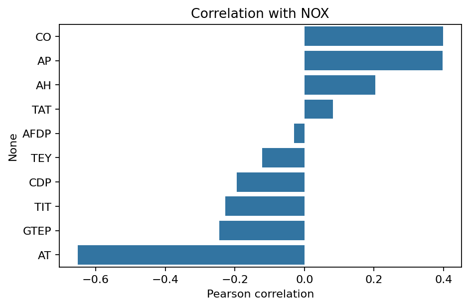
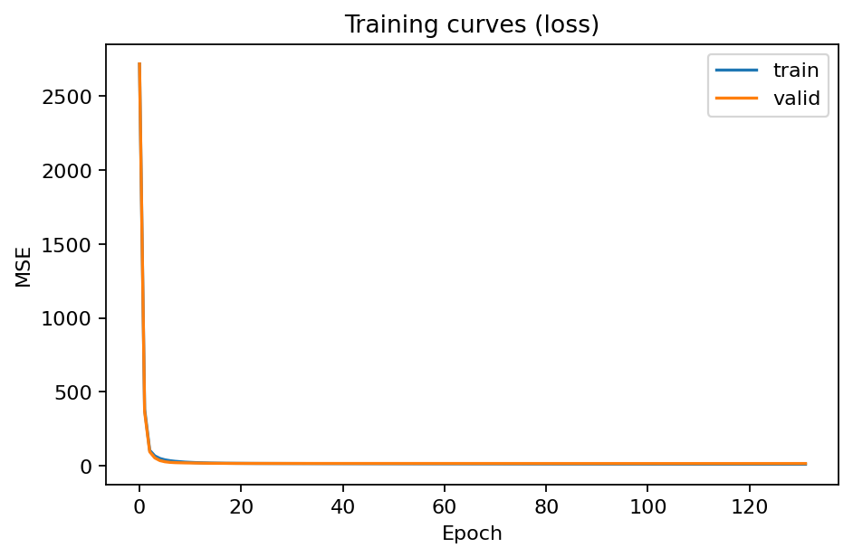
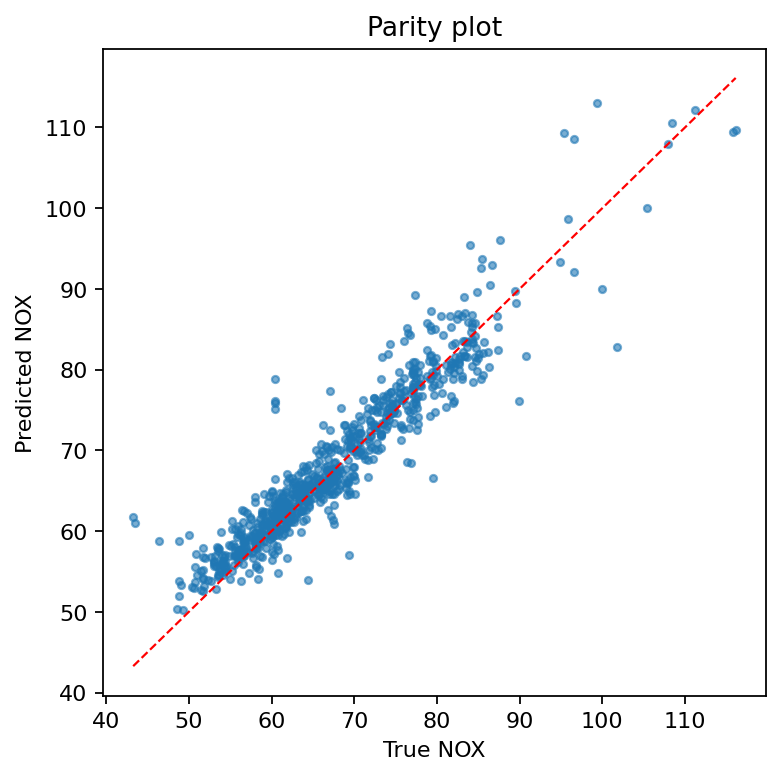
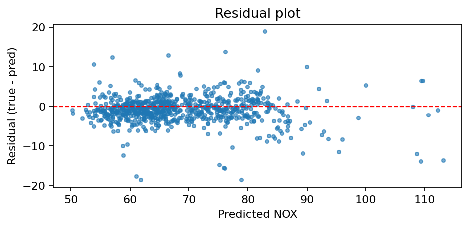
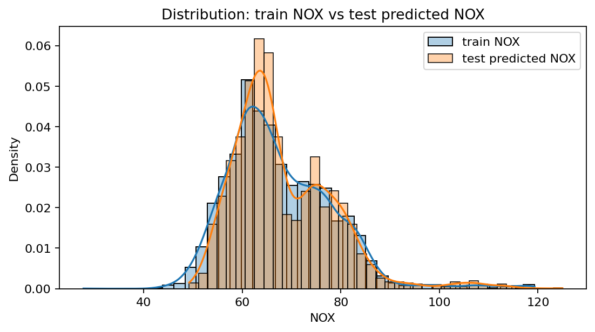
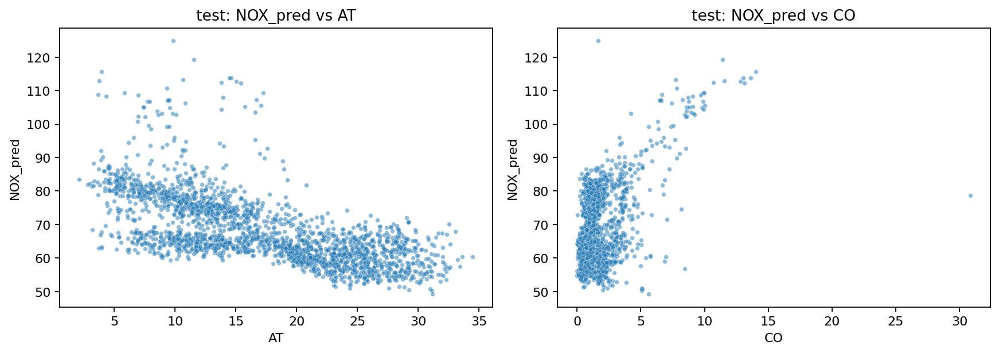

# Unit15_Appendix | Fuel Gas Emission：以 DNN 預測 NOx 排放（回歸）

本附錄提供一個「燃氣渦輪/燃燒系統排放」的真實資料案例，讓學生透過完整流程練習以 **DNN（MLP）回歸模型**預測 **NOx emission**。資料來源與背景可參閱 Kaggle：`https://www.kaggle.com/datasets/sjagkoo7/fuel-gas-emission/data`。

---

## 1. 案例背景：為什麼要預測 NOx？

在燃燒/燃氣渦輪等系統中，NOx（氮氧化物）屬於重要的法規監管排放物。實務上 NOx 常需依賴量測設備（排放監測、取樣分析），成本與維護負擔較高，且不一定能提供足夠高頻率的即時資訊。因此在工業 AI 中，常見作法是建立 **資料驅動的軟測器（soft sensor）**，使用可即時取得的操作/環境變數，快速預測 NOx 以協助：

- 排放趨勢監控與預警（早期異常偵測）
- 操作調整與燃燒控制（降低排放、提升效率）
- 成本降低（減少離線分析頻率或輔助校驗）

本案例以回歸問題建模：輸入多個操作/環境變數，輸出 NOx（連續值）。

### 1.1 補充理論：NOx 的生成機制（Domain Knowledge）

在燃氣渦輪（Gas Turbine, GT）燃燒過程中，NOx 的生成主要受燃燒溫度與化學反應動力學控制，主要機制包含：

1.  **Thermal NOx（熱力型 NOx）**：
    *   這是高溫燃燒（通常 > 1300°C）中最主要的 NOx 來源。
    *   根據 **Zeldovich mechanism**，氮氣（$N_2$）在高溫下與氧原子（$O$）反應生成 $NO$。
    *   反應速率對溫度高度敏感（指數關係），因此**燃燒溫度（Flame Temperature）**是關鍵控制變因。
2.  **Prompt NOx（快速型 NOx）**：
    *   發生在燃燒初期，碳氫燃料碎片（CH radicals）與 $N_2$ 反應。
    *   在富燃（fuel-rich）區域較為顯著。
3.  **Fuel NOx（燃料型 NOx）**：
    *   來自燃料本身含有的氮化合物（在天然氣中通常極少，但在燃煤或重油中常見）。

**為何需要軟測器（Soft Sensor）？**
傳統的連續排放監測系統（CEMS）雖然準確，但有延遲（採樣傳輸+分析時間）且維護昂貴。資料驅動的軟測器可以實現「虛擬即時量測」，對燃燒控制優化（Combustion Tuning）至關重要——例如在維持低 NOx 的同時，還要避免火焰不穩定（Lean Blowout）或燃燒室振動（Combustion Dynamics）。

---

## 2. 資料集與欄位

資料檔案位於本課程資料夾：

- 訓練資料：`Part_4/data/fuel_gas/train.csv`（含目標 `NOX`）
- 測試資料：`Part_4/data/fuel_gas/test.csv`（不含 `NOX`，用於推論示範）

訓練資料共有 11 欄，其中 10 欄為特徵（X），1 欄為目標（y=NOX）：

| 欄位 | 角色 | 說明（依 Kaggle 資料集描述） |
|---|---|---|
| `AT` | X | Ambient Temperature（環境溫度） |
| `AP` | X | Ambient Pressure（環境壓力） |
| `AH` | X | Ambient Humidity（環境濕度） |
| `AFDP` | X | Air Filter Differential Pressure（濾網壓差） |
| `GTEP` | X | Gas Turbine Exhaust Pressure（渦輪排氣壓力） |
| `TIT` | X | Turbine Inlet Temperature（渦輪入口溫度） |
| `TAT` | X | Turbine After Temperature（渦輪後溫度） |
| `TEY` | X | Turbine Energy Yield（能量產出/效率相關指標） |
| `CDP` | X | Compressor Discharge Pressure（壓縮機出口壓力） |
| `CO` | X | Carbon Monoxide（CO 排放） |
| `NOX` | y | Nitrogen Oxides（NOx 排放，預測目標，單位通常為 ppmV @ 15% O2） |

### 2.1 特徵的物理意義解讀

理解特徵對應的物理意義，有助於我們解釋模型行為：

*   **TIT (Turbine Inlet Temperature)**：渦輪入口溫度。這是決定 GT 熱效率與功率的關鍵。但也直接關聯到燃燒溫度，因此理論上 **TIT 越高，Thermal NOx 傾向越高**（若控制策略不變）。
*   **CDP (Compressor Discharge Pressure)**：壓縮機出口壓力。反映了進入燃燒室的空氣質量流量與總壓，高壓有助於反應速率，可能增加 NOx。
*   **AT, AP, AH (Ambient Conditions)**：環境溫濕壓會改變空氣密度與濕度。
    *   例如：**環境溫度 (AT) 上升** $\rightarrow$ 空氣密度下降 $\rightarrow$ 進入壓縮機的空氣質量流率（Mass flow）下降 $\rightarrow$ 為了維持負載或保護機組，且高溫空氣含水量不同，可能導致燃燒控制點改變，進而影響排放。

注意：此資料集的特徵皆為數值型，通常不需類別編碼；但仍需注意標準化、資料切分與評估方式。

---

### 2.1 範例執行結果：資料維度與缺失值檢查（Notebook 輸出）

本次範例使用的資料檔案位於 `Part_4/data/fuel_gas/`，並在 Notebook 內完成以下快速檢查：

- `train.csv` 維度：`(5187, 11)`（10 個特徵 + 1 個目標 `NOX`）
- `test.csv` 維度：`(2224, 10)`（10 個特徵，供推論示範）
- 缺失值（missing values）：所有欄位皆為 `0`（此版本資料無缺失）
- 目標 `NOX`（訓練集）摘要：平均約 `67.66`，最小 `27.77`，最大 `119.32`（數值用來建立尺度直覺）

---

## 3. EDA 與特徵直覺（Correlation）

在進入建模前，先用 **皮爾森相關係數（Pearson correlation）**快速檢查 `NOX` 與各特徵的線性關聯程度（注意：相關不等於因果，且非線性關係可能不會在此指標中表現）。

皮爾森相關係數定義為：

$$
\rho_{X,Y} = \frac{\mathrm{cov}(X,Y)}{\sigma_X \sigma_Y}
= \frac{\sum_{i=1}^{n}(x_i-\bar{x})(y_i-\bar{y})}{\sqrt{\sum_{i=1}^{n}(x_i-\bar{x})^2}\sqrt{\sum_{i=1}^{n}(y_i-\bar{y})^2}}
$$

其中 $\rho \in [-1,1]$；越接近 $1$ 表示正相關越強，越接近 $-1$ 表示負相關越強。

### 3.1 範例執行結果：`NOX` 與特徵相關性（Notebook 輸出）

本案例在訓練資料上計算 `corr(feature, NOX)`，觀察到：

- `AT` 與 `NOX` 呈現顯著負相關（約 `-0.65`），代表在本資料分佈下，`AT` 較高時 `NOX` 往往較低。
- `CO`、`AP` 與 `NOX` 呈現中度正相關（約 `0.40` 左右）。
- `TIT`、`GTEP` 與 `NOX` 呈現弱到中度負相關（約 `-0.23 ~ -0.24`）。

請注意：這些現象反映了複雜的物理與控制邏輯。

**深入分析：為什麼 AT（環境溫度）與 NOx 呈負相關？**
這是一個反直覺但具備物理原因的現象：
1.  **空氣密度效應**：當環境溫度 `AT` 升高，空氣密度降低，導致燃氣渦輪吸入的空氣質量流率（Air Mass Flow）減少。
2.  **負載與控制**：為了維持機組運行穩定或受限於材料溫度限制，在高溫天候下，渦輪的出力（Load）或燃燒溫度峰值可能受到限制或自動調整。而 NOx 生成對溫度呈現指數相關，因此整體效應可能表現為「熱天（高 AT）排放較低」。
3.  **相對負載**：此資料集若包含多種負載狀態，高溫天候可能更多處於部份負載（Partial Load），導致平均 NOx 較低。

我們使用 DNN 的目的，正是要讓模型自動捕捉這些由 `AT`、`TIT`、`CDP` 等多變數交織而成的非線性燃燒特性。

本次資料集各特徵與 `NOX` 的相關係數如下（由 Notebook 計算，四捨五入到小數第 3 位）：

| 特徵 | corr(feature, NOX) |
|---|---:|
| `AT` | -0.652 |
| `GTEP` | -0.245 |
| `TIT` | -0.227 |
| `CDP` | -0.195 |
| `TEY` | -0.122 |
| `AFDP` | -0.030 |
| `TAT` | 0.082 |
| `AH` | 0.204 |
| `AP` | 0.397 |
| `CO` | 0.399 |

---

## 4. 建模流程（建議）

### 4.1 問題定義

- 輸入：10 維特徵向量 `X`
- 輸出：連續值 `NOX`
- 模型：DNN（MLP）回歸

### 4.2 正確的資料切分與避免 Data Leakage

建議流程：

1. 先從 `train.csv` 分離 `X` 與 `y`
2. 再做 `train/valid/test`（或 `train/test`）切分
3. **標準化（StandardScaler）只能用訓練集 fit**，再套用到 valid/test

本範例採用 `train/valid/test = 70%/15%/15%`，並將 valid 用於觀察泛化誤差與 early stopping。

#### 標準化（Standardization）為什麼重要？

多數神經網路/梯度型方法對特徵尺度敏感。標準化常用 Z-score：

$$
x' = \frac{x - \mu_{\text{train}}}{\sigma_{\text{train}}}
$$

強調：$\mu_{\text{train}}, \sigma_{\text{train}}$ 必須只由訓練集估計（避免資料洩漏）。

### 4.3 基線模型（強烈建議）

在訓練 DNN 前，先建立一個簡單 baseline（例如 Ridge/Linear Regression），用來回答：

- DNN 是否真的有帶來更好效果？
- 資料是否足夠支撐更複雜模型？

---

## 5. Baseline：Ridge Regression（線性 + L2 正則化）

Ridge Regression 的核心是在線性回歸的平方誤差上加入 L2 正則化，避免係數過大造成過擬合：

$$
\min_{\mathbf{w}, b}\ \frac{1}{n}\sum_{i=1}^{n}\left(y_i-(\mathbf{w}^\top \mathbf{x}_i + b)\right)^2 + \lambda \|\mathbf{w}\|_2^2
$$

其中 $\lambda$（或實作中的 `alpha`）越大，正則化越強，模型越保守。

### 5.1 範例執行結果：Ridge baseline（Notebook 輸出）

在相同資料切分與標準化下，Ridge baseline 的測試集表現為：

- MAE：`3.622`
- RMSE：`5.620`
- $R^2$：`0.714`

這組數字提供一個重要參考：若 DNN 只能達到相近表現，則可能表示資料本身更適合線性/低複雜度模型，或需要更好的特徵工程。

---

## 6. DNN（MLP）回歸：理論與實作重點

### 6.1 MLP 的數學形式（前向傳播）

對於 $L$ 層的 MLP（最後一層為線性輸出），可寫成：

$$
\mathbf{h}^{(0)} = \mathbf{x},\quad
\mathbf{h}^{(l)} = \phi\left(\mathbf{W}^{(l)}\mathbf{h}^{(l-1)} + \mathbf{b}^{(l)}\right),\ l=1,\dots,L-1
$$

$$
\hat{y} = \mathbf{W}^{(L)}\mathbf{h}^{(L-1)} + \mathbf{b}^{(L)}
$$

其中 $\phi(\cdot)$ 常用 ReLU：

$$
\mathrm{ReLU}(z)=\max(0,z)
$$

### 6.2 損失函數與評估指標（回歸）

訓練常用 **均方誤差（MSE）**：

$$
\mathrm{MSE}=\frac{1}{n}\sum_{i=1}^{n}(y_i-\hat{y}_i)^2
$$

但在工業應用報告時，更常用下列指標，因為更容易解讀：

**MAE（平均絕對誤差）**

$$
\mathrm{MAE}=\frac{1}{n}\sum_{i=1}^{n}\lvert y_i-\hat{y}_i\rvert
$$

**RMSE（均方根誤差）**

$$
\mathrm{RMSE}=\sqrt{\frac{1}{n}\sum_{i=1}^{n}(y_i-\hat{y}_i)^2}
$$

**$R^2$（決定係數）**

$$
R^2 = 1-\frac{\sum_{i=1}^{n}(y_i-\hat{y}_i)^2}{\sum_{i=1}^{n}(y_i-\bar{y})^2}
$$

直覺：$R^2$ 越接近 1 表示模型越能解釋目標變異；若接近 0 則接近只用平均值預測。

### 6.3 反向傳播（Backpropagation）的概念

MLP 的訓練目標是最小化損失函數，透過鏈式法則計算每層參數的梯度：

$$
\nabla_{\theta}\mathcal{L}(\theta)
$$

再用梯度下降類方法更新（以 Adam 為例）：

$$
\theta \leftarrow \theta - \eta \cdot \frac{\hat{m}_t}{\sqrt{\hat{v}_t}+\epsilon}
$$

（本範例的 Notebook 當偵測到環境有 TensorFlow/Keras 時會自動切換使用，並啟用更進階的優化器設定。）

#### 數學補充：優化演算法 Adam
Adam (Adaptive Moment Estimation) 是目前最常用的優化器，結合了動量（Momentum）與 RMSProp 的概念。參數 $\theta_t$ 的更新公式如下：

1.  **計算梯度**：$g_t = \nabla_\theta \mathcal{L}(\theta_{t-1})$
2.  **更新一階矩（Momentum）**：$m_t = \beta_1 m_{t-1} + (1-\beta_1) g_t$
3.  **更新二階矩（RMSProp）**：$v_t = \beta_2 v_{t-1} + (1-\beta_2) g_t^2$
4.  **偏差校正（Bias Correction）**：
    $\hat{m}_t = m_t / (1-\beta_1^t)$
    $\hat{v}_t = v_t / (1-\beta_2^t)$
5.  **參數更新**：
    $\theta_t = \theta_{t-1} - \eta \frac{\hat{m}_t}{\sqrt{\hat{v}_t} + \epsilon}$

其中，$\eta$ 為學習率（Learning Rate），$\beta_1, \beta_2$ 為衰減係數（通常設為 0.9, 0.999）。Adam 能針對每個參數自適應調整學習步長，特別適合高維度、非凸的損失曲面。

### 6.4 範例執行結果：訓練曲線（Notebook 輸出）

訓練曲線能用來判讀模型是否過擬合：

- 若 `train loss` 持續下降，但 `valid loss` 開始上升：常見過擬合跡象
- 若兩者都下降且趨於平坦：模型收斂且泛化較佳

本次範例在目前環境以 `sklearn-mlp` 執行，early stopping 停在約 `132` 個 epoch，最佳 validation MSE 約 `15.23`（可視為 validation RMSE 約 $\sqrt{15.23}\approx 3.90$，僅用來建立尺度直覺）。

---

## 7. 成效評估與診斷（包含圖片）

### 7.1 範例執行結果：DNN vs Ridge（Notebook 輸出）

本次 Notebook 執行環境的 backend 為 `sklearn-mlp`，資料切分筆數為：train `3630` / valid `778` / test `779`。測試集結果如下（同一切分與標準化）：

| 模型 | MAE | RMSE | $R^2$ |
|---|---:|---:|---:|
| Ridge baseline | 3.622 | 5.620 | 0.714 |
| DNN（MLP） | 2.454 | 3.560 | 0.885 |

解讀：

- MAE 與 RMSE 明顯下降：平均誤差降低，且大誤差也減少（RMSE 對大誤差更敏感）。
- $R^2$ 從約 0.71 提升到約 0.89：代表模型對 `NOX` 變異的解釋能力顯著提升。
- 以比例來看：MAE 約降低 `32%`（`1 - 2.454/3.622`），RMSE 約降低 `37%`（`1 - 3.560/5.620`），顯示非線性 DNN 對此資料集確實帶來可觀增益。

這證明了 **NOx 排放機制本質上是非線性的**（如 Zeldovich 機制的指數溫度依賴性），因此線性模型（Ridge）會遭遇較大的 Model Bias，而 DNN 透過多層 ReLU 成功捕捉了這些特徵。

#### 進一步解讀：MAE vs RMSE

- **MAE** 對每筆誤差線性計算，較能代表「一般情況」下的平均偏差。
- **RMSE** 對大誤差平方放大，因此更敏感於「少數嚴重錯誤」；在排放監控或安全相關場景中，RMSE 往往更重要，因為少數大失準可能導致錯誤決策。

#### 為什麼 DNN 可能比 Ridge 更好？

Ridge 是線性模型（加上 L2 正則化），能描述的僅是：

$$
\hat{y} = \mathbf{w}^{\top} \mathbf{x} + b
$$

但燃燒/渦輪系統中的排放常同時受到多個變數的非線性與交互作用影響（例如溫度、壓力、負載狀態的組合）。MLP 可以用多層非線性映射去逼近這類關係，因此常能在此類資料上取得更高的 $R^2$ 與更低的 RMSE。

#### 補強比較：不只是「誰比較準」

工業落地時，模型選擇通常是「準確度、成本、可解釋性、維護性」的折衷。以下用本案例的情境整理 Ridge 與 DNN 的差異：

**1) 模型假設（Model Bias）**
- Ridge：假設輸入與輸出關係主要是線性，可有效捕捉整體線性趨勢；但若真實機制包含明顯非線性/交互作用，線性模型會呈現較高 bias。
- DNN：透過多層非線性組合自動學出交互作用與非線性，因此在此類多工況資料上常能顯著降低 bias。

**2) Bias-Variance 觀點**
- Ridge：bias 較高、variance 較低，對小資料更穩健，且較不容易出現劇烈過擬合。
- DNN：variance 較高，需要搭配 validation、early stopping、正則化（L2/Dropout 等）控制過擬合；本案例的 early stopping（約 132 epoch）就是用來避免訓練過久導致泛化變差。

**3) 誤差型態（Error profile）**
- Ridge：若殘差圖呈現明顯曲線或分段結構，常暗示「線性假設不足」或「需要特徵交互」。
- DNN：通常能讓 parity plot 更貼近對角線、殘差更接近隨機散佈；若仍有結構，代表資料仍缺少可解釋該工況的關鍵變數或需要分段建模。

**4) 可解釋性與報告**
- Ridge：係數可直接用於「方向性解釋」（例如某特徵增加時 NOX 傾向上升/下降），便於與製程/設備工程師討論。
- DNN：精度通常更好，但需額外方法（permutation importance、SHAP、partial dependence）說明模型依據，並建立監控與再訓練流程。

**5) 工程成本**
- Ridge：訓練/部署快、更新簡單，適合做第一版可用系統或作為保底模型（fallback）。
- DNN：需要更多調參與訓練監控，但在此案例中換得較明顯的 RMSE/$R^2$ 改善，適合追求更高精度的情境。

### 7.2 Parity plot：預測值是否貼近理想對角線？

Parity plot（`y_true` vs `y_pred`）是一種工程上非常直觀的診斷圖：

- 點越貼近紅色對角線 $y=\hat{y}$，代表預測越準
- 若呈現系統性偏移（整體偏高/偏低），可能表示校正不足或特徵不足

### 7.3 Residual plot：殘差是否有結構？

殘差定義：

$$
e_i = y_i-\hat{y}_i
$$

若殘差對預測值呈現「漏斗形、曲線形、分段結構」，可能暗示：

- 模型在某些操作區間表現較差（需要分段建模、加入更多特徵或加入物理約束）
- 非線性仍未被充分捕捉（需要更強模型或特徵工程）

#### 殘差圖的進階解讀（Heteroscedasticity Analysis）
觀察上圖：
1.  **分佈對稱性**：殘差大致以 0 為中心上下分佈，沒有明顯的偏斜，表示模型沒有嚴重的系統性偏差（Bias）。
2.  **變異數（Variance）**：隨預測值（x 軸）增加，殘差的擴散程度（y 軸寬度）似乎有些微變化，但不明顯。若高排放區間的殘差明顯變大（喇叭狀），稱為「異質變異性（Heteroscedasticity）」，可能需要對目標變數做 Log 轉換或使用加權損失函數。
3.  **離群值**：圖中可見少數點偏離較遠，這些可能是特殊的瞬態操作（Transient events）或儀表雜訊。在實務上，可考慮將殘差超過 $3\sigma$ 的樣本標記出來，回頭檢查當時的操作記錄，確認是否為異常工況。

---

## 8. 推論（Inference）與交付物（Artifacts）

Notebook 會對 `Part_4/data/fuel_gas/test.csv` 產生 `NOX` 預測並輸出到：

- 預測檔：`Part_4/outputs/P4_Unit15_Appendix_FuelGasEmission/nox_predictions_test.csv`
- 指標檔：`Part_4/outputs/P4_Unit15_Appendix_FuelGasEmission/metrics.json`
- 圖片：`Part_4/outputs/P4_Unit15_Appendix_FuelGasEmission/figs/*.png`
- 模型/Scaler：`Part_4/outputs/P4_Unit15_Appendix_FuelGasEmission/models/`

### 8.1 範例執行結果：`test.csv` 前幾筆預測（Notebook 輸出）

以下展示輸出檔的前 6 筆（僅示範格式，實際以檔案為準）：

| row | NOX（pred） |
|---:|---:|
| 1 | 52.9326 |
| 2 | 71.1856 |
| 3 | 69.2194 |
| 4 | 81.8403 |
| 5 | 76.8035 |
| 6 | 59.8365 |

### 8.2 範例執行結果：`test.csv` 預測分佈視覺化（Notebook 輸出）

由於 `test.csv` 沒有真實 `NOX`，這裡的圖主要用於「合理性檢查（sanity check）」與「資料漂移（distribution shift）觀察」，而不是用來宣稱模型真的更準。

下圖疊加了：

- 訓練集真實 `NOX` 的分佈（train NOX）
- 測試集預測 `NOX` 的分佈（test predicted NOX）

解讀重點：

- 若兩者分佈大致重疊：表示 `test.csv` 的輸入工況可能與訓練集相近，模型推論較不容易進入未知領域。
- 若 `test predicted NOX` 明顯偏移或出現長尾：可能代表 `test.csv` 存在不同工況/資料漂移，此時應特別注意模型風險（例如需做 OOD 檢測、分段模型或再訓練）。

#### 數據分佈檢定（Data Drift Check）
這張圖是觀察 **Covariate Shift** 或 **Label Shift** 的重要工具。
*   **觀察**：Test set 的預測值分佈（橘色）與 Train set 真實值分佈（藍色）高度重疊。
*   **結論**：這是一個健康的訊號。表示測試集的工況（Operating Conditions）大部分都包含在訓練集的經驗範圍內。模型不需要進行過多的「外插（Extrapolation）」。
*   **反之**：若橘色曲線明顯向右或向左偏移，代表測試期間機組可能運行在不同的季節或負載模式，此時模型的誤差風險會增加，需要發出預警。

### 8.3 範例執行結果：`test.csv` 預測值與關鍵特徵關係（Notebook 輸出）

為了檢查模型是否學到「方向性一致」的關係，我們在 `test.csv` 上畫出 `NOX_pred` 與兩個關鍵特徵的散佈圖：

- `AT`（環境溫度）與 `NOX_pred`：在訓練集相關性中，`AT` 對 `NOX` 呈現顯著負相關，散佈圖若大致呈下降趨勢屬合理。
- `CO`（一氧化碳）與 `NOX_pred`：在訓練集相關性中，`CO` 對 `NOX` 呈中度正相關，散佈圖若大致呈上升趨勢屬合理。

若散佈圖出現大量「不符合直覺」的區域（例如 AT 很高但 NOX_pred 也很高且大量集中），通常代表：

- 模型受到其他變數交互作用影響（不一定錯，但需要進一步診斷），或
- 該工況超出訓練分佈（建議做資料漂移/OOD 檢測與再訓練規劃）。

---

## 9. 教學重點與練習題

### 9.1 常用設定（本案例建議）

- 輸入層：10 個特徵（已標準化）
- 隱藏層：多層 Dense（本範例：`128 -> 64 -> 32`）
- 激活函數：`ReLU`
- 損失函數：`MSE`（訓練）；報告指標使用 `MAE/RMSE/R2`
- 泛化策略：early stopping（以 valid loss 監控）、正則化（L2/Dropout 等）

#### Dropout（可選，常用於 Keras）

Dropout 在訓練時以機率 $p$ 隨機將神經元輸出置零：

$$
\tilde{h}_j = m_j h_j,\quad m_j \sim \mathrm{Bernoulli}(1-p)
$$

直覺：迫使網路不要過度依賴少數神經元，提高泛化能力。

#### Batch Normalization（可選，常用於 Keras）

對 mini-batch 的輸入做標準化並引入可學參數：

$$
\hat{x} = \frac{x-\mu_B}{\sqrt{\sigma_B^2+\epsilon}},\quad y = \gamma \hat{x} + \beta
$$

常見效果：加速收斂、改善梯度傳遞、提升訓練穩定性。

（若你在環境中有 TensorFlow/Keras，本案例 Notebook 會自動切換到 Keras 版本並可加入 BN/Dropout；若無 TensorFlow，則以 sklearn 的 MLPRegressor 完成 DNN/MLP 訓練，概念一致但不包含 BN/Dropout 層。）

### 9.2 你應該觀察什麼？

- **訓練曲線**：train/valid loss 是否同步下降？valid 是否提前惡化（過擬合）？
- **Parity plot**：點是否貼近 $y=\hat{y}$？是否有系統性偏移（整體偏高/偏低）？
- **Residual plot**：殘差是否呈現結構（分段/漏斗/曲線）？若有，常代表模型在某些工況需要補強特徵或分段建模。
- **工業落地觀點**：資料漂移（季節/負載變化）可能讓模型退化；需定期監控與再訓練策略。

### 9.3 練習題（課後）

1. 以 Ridge 作 baseline，嘗試調整 MLP 層數/神經元數，觀察是否優於 baseline（並避免只追求訓練集表現）。
2. 若使用 Keras 版本：加入 `L2` 正則化或調整 `Dropout`，比較泛化能力。
3. 比較不同 loss：`MSE` vs `Huber`（對離群值較穩健），並觀察 parity/residual 是否改善。
4. 嘗試加入特徵交互（例如乘積、比值）並觀察提升幅度（需注意解釋性與資料洩漏風險）。

### 9.4 對應程式碼（Notebook）

請搭配本附錄的程式碼範例執行：

- `Part_4/Unit15_Appendix_FuelGasEmission.ipynb`

Notebook 內容包含：資料讀取、基線模型、DNN 建模、訓練、評估（含圖片）、推論與模型保存。
