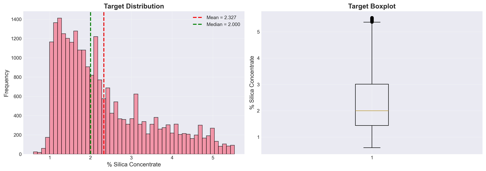
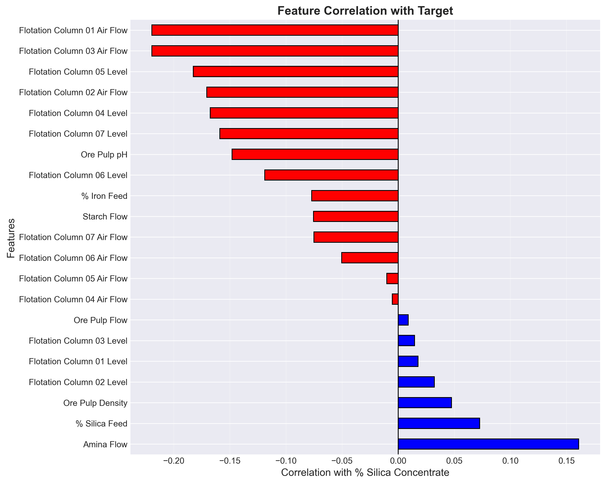
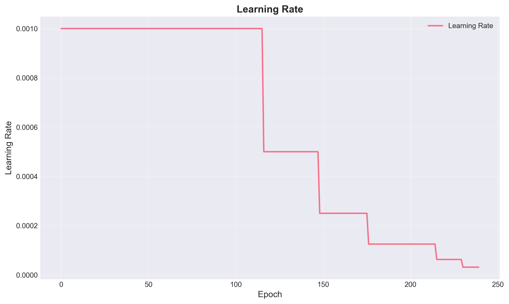
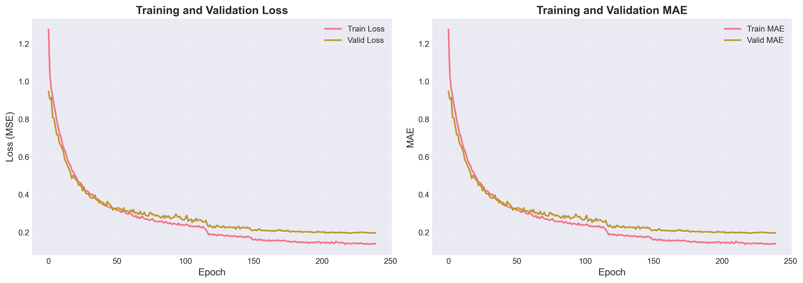
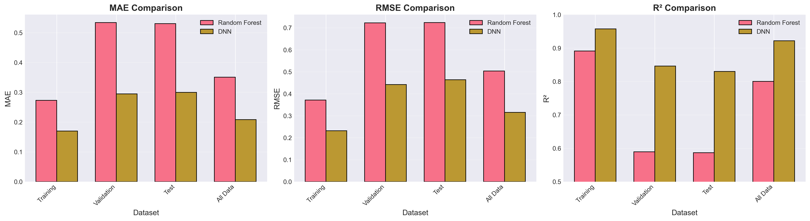
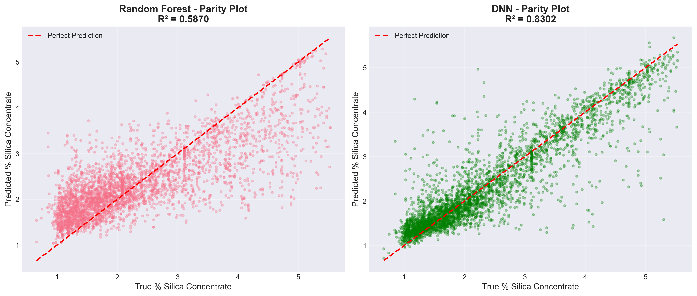
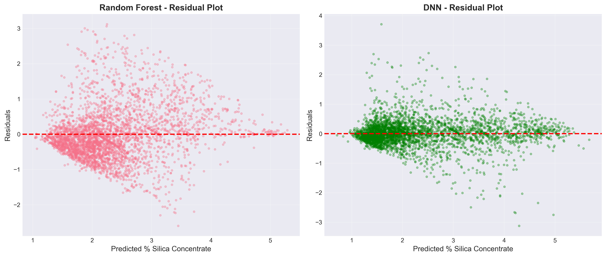
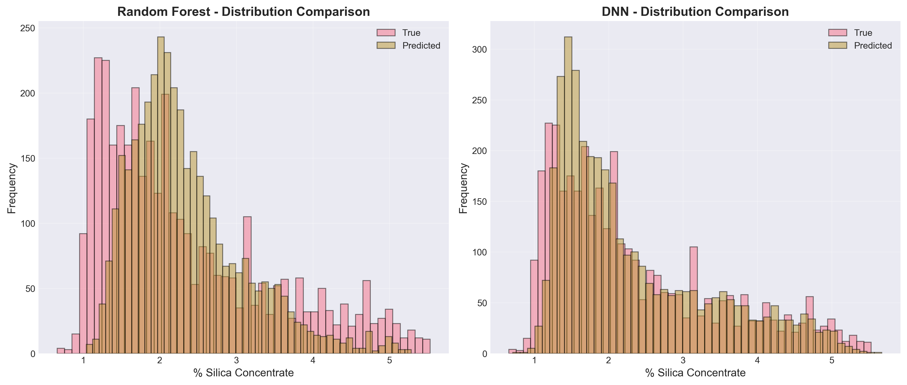
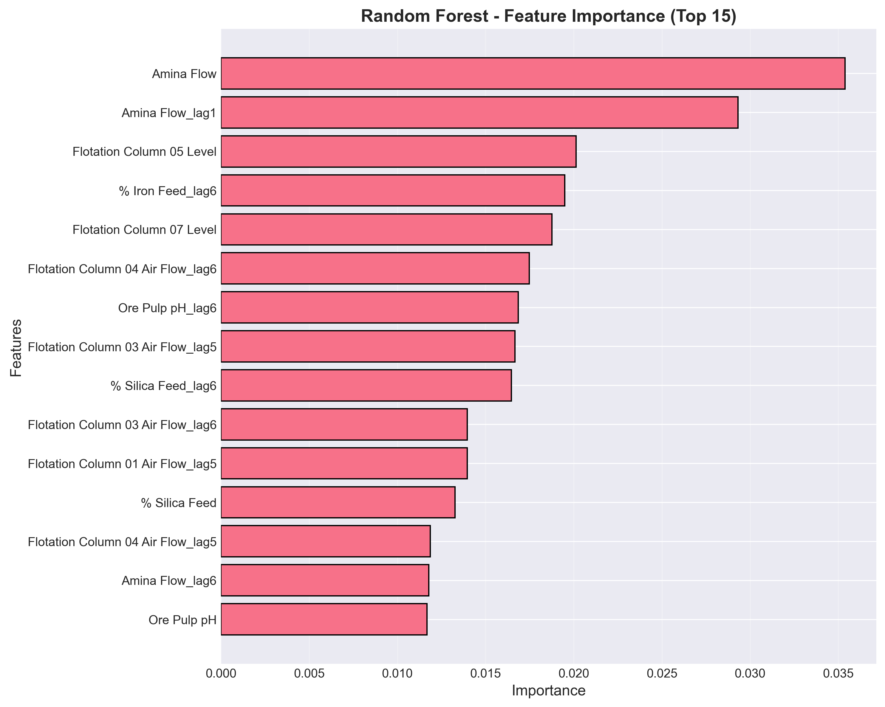
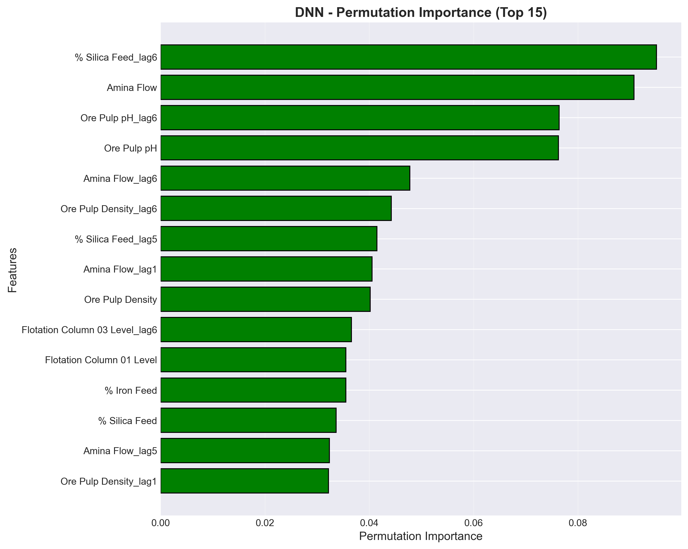

# Unit15_Appendix | Mining Flotation Process：以 DNN 預測矽石濃度（% Silica Concentrate）

本附錄提供一個「礦業浮選過程品質預測」的真實工業資料案例，讓學生透過完整流程練習以 **DNN（MLP）模型**預測 **矽石濃度（% Silica Concentrate）**。資料來源與背景可參閱 Kaggle：`https://www.kaggle.com/datasets/edumagalhaes/quality-prediction-in-a-mining-process`。

---

## 1. 案例背景：為什麼要預測矽石濃度？

### 1.1 浮選過程基礎理論（Froth Flotation）

浮選法（Froth Flotation）是礦物加工中最重要的分離技術之一，廣泛應用於鐵礦、銅礦、金礦等金屬礦物的富集過程。其基本原理是利用礦物表面物理化學性質的差異，特別是**疏水性（hydrophobicity）**的不同，在氣泡作用下實現有價礦物與脈石的分離。

#### 1.1.1 浮選基本原理

浮選過程涉及三相系統：固相（礦物顆粒）、液相（礦漿）、氣相（氣泡）。

**Young-Dupré 方程**描述了固-液-氣三相接觸角： 

$$
\gamma_{SG} = \gamma_{SL} + \gamma_{LG} \cos\theta
$$

其中：
- $\gamma_{SG}$ ：固-氣界面張力
- $\gamma_{SL}$ ：固-液界面張力
- $\gamma_{LG}$ ：液-氣界面張力
- $\theta$ ：接觸角

**浮選判據**：
- $\theta < 90^\circ$ ：親水性礦物，不易浮選
- $\theta > 90^\circ$ ：疏水性礦物，易於浮選

#### 1.1.2 浮選藥劑系統

浮選過程需要添加多種藥劑來調控礦物表面性質：

1. **捕收劑（Collector）**：
   - 作用：增強目標礦物的疏水性
   - 本案例使用：**胺類（Amina）**
   - 機制：選擇性吸附在礦物表面，形成疏水膜

2. **抑制劑（Depressant）**：
   - 作用：抑制脈石礦物浮選
   - 本案例使用：**澱粉（Starch）**
   - 機制：在脈石表面形成親水膜，防止其上浮

3. **pH 調整劑**：
   - 作用：控制礦漿 pH 值，影響藥劑效果
   - 影響：礦物表面電荷、藥劑解離度

#### 1.1.3 鐵礦反浮選工藝

本案例採用**反浮選（Reverse Flotation）**工藝：

- **目標**：浮選出脈石（SiO₂），鐵礦物留在底流
- **優勢**：適合處理高矽低品位鐵礦石
- **關鍵指標**：
  - **鐵精礦品位**：% Iron Concentrate（越高越好）
  - **矽石含量**：% Silica Concentrate（越低越好，本案例預測目標）

### 1.2 工業軟測器的重要性

在實際生產中，矽石濃度的測量面臨以下挑戰：

1. **分析延遲**：實驗室分析通常需要 1-2 小時
2. **採樣頻率低**：通常每小時採樣一次
3. **成本高昂**：需要專業分析設備與人員
4. **滯後控制**：無法即時調整操作參數

因此，建立 **資料驅動的軟測器（Soft Sensor）**可以：

- **即時預測**：每分鐘甚至每 20 秒更新預測值
- **提前預警**：在品質惡化前調整藥劑用量、pH 值等
- **降低成本**：減少實驗室分析頻率
- **環境效益**：降低矽石含量 → 減少尾礦排放 → 提高資源利用率

### 1.3 預測問題定義

本案例為 **監督式回歸問題** ：

$$
\hat{y} = f(\mathbf{x}), \quad \mathbf{x} \in \mathbb{R}^{22}, \ y \in \mathbb{R}
$$

其中：
- $y$ ：% Silica Concentrate（矽石濃度，目標變數）
- $\mathbf{x}$ ：22 維特徵向量（進料品質、藥劑流量、過程變數等）
- $f(\cdot)$ ：待學習的映射函數（本案例使用 DNN）

---

## 2. 資料集與欄位

### 2.1 資料來源

資料檔案位於本課程資料夾：

- 資料檔：`Part_4/data/mining/MiningProcess_Flotation_Plant_Database.csv`

**資料特性**：
- 時間範圍：2017 年 3 月至 9 月
- 總筆數：737,453 筆
- 採樣頻率：部分變數每 20 秒採樣，部分每小時採樣
- 格式：CSV 檔案，使用**逗號作為小數點**（歐洲格式）

### 2.2 欄位說明

資料共有 24 個欄位（1 個時間戳記 + 22 個特徵 + 1 個目標）：

#### 2.2.1 時間戳記

| 欄位 | 說明 |
|------|------|
| `date` | 日期時間（格式：YYYY-MM-DD HH:MM:SS）|

#### 2.2.2 進料品質（Feed Quality）

| 欄位 | 說明 | 單位 | 物理意義 |
|------|------|------|----------|
| `% Iron Feed` | 進料鐵品位 | % | 原礦中鐵的含量 |
| `% Silica Feed` | 進料矽石含量 | % | 原礦中 SiO₂ 的含量 |

這兩個變數是**最重要的前置指標**，直接反映原礦品質。

#### 2.2.3 藥劑流量（Reagent Flows）

| 欄位 | 說明 | 單位 | 作用 |
|------|------|------|------|
| `Starch Flow` | 澱粉流量 | m³/h | 抑制劑，防止脈石上浮 |
| `Amina Flow` | 胺類流量 | m³/h | 捕收劑，促進脈石上浮（反浮選）|

藥劑用量直接影響浮選效果，是**可控操作變數**。

#### 2.2.4 礦漿性質（Ore Pulp Properties）

| 欄位 | 說明 | 單位 | 物理意義 |
|------|------|------|----------|
| `Ore Pulp Flow` | 礦漿流量 | t/h | 處理量 |
| `Ore Pulp pH` | 礦漿 pH 值 | - | 影響藥劑效果與礦物表面電荷 |
| `Ore Pulp Density` | 礦漿濃度 | kg/cm³ | 固液比，影響碰撞機率 |

#### 2.2.5 浮選柱操作變數（Flotation Column Variables）

浮選柱共有 7 個（Column 01 ~ Column 07），每個柱有兩個監測變數：

| 變數類型 | 欄位範例 | 說明 | 單位 |
|---------|---------|------|------|
| **液位** | `Flotation Column 01 Level` | 浮選柱液位 | % |
| **氣流** | `Flotation Column 01 Air Flow` | 充氣量 | Nm³/h |

共 14 個欄位（7 柱 × 2 變數）。

**物理意義**：
- **液位**：影響礦漿停留時間與分離效率
- **氣流**：提供氣泡，影響礦化效果

#### 2.2.6 目標變數（Target）

| 欄位 | 角色 | 說明 | 單位 | 目標 |
|------|------|------|------|------|
| `% Iron Concentrate` | 輔助輸出 | 鐵精礦品位 | % | 越高越好 |
| `% Silica Concentrate` | **主要目標** | 矽石濃度（雜質） | % | **越低越好** |

**注意**：
- `% Iron Concentrate` 與 `% Silica Concentrate` 高度負相關
- 本案例以 `% Silica Concentrate` 為預測目標
- 實務上也可建立多目標模型同時預測兩者

### 2.3 資料格式注意事項

> [!IMPORTANT]
> 資料格式的特殊性
> 
> - CSV 使用**逗號 `,`** 作為小數點（歐洲格式）
> - 讀取時需指定 `decimal=','` 參數
> - 部分欄位可能包含缺失值

**資料讀取程式碼片段**：
```python
import pandas as pd

df = pd.read_csv('data/mining/MiningProcess_Flotation_Plant_Database.csv', 
                 decimal=',',  # 歐洲格式：逗號為小數點
                 parse_dates=['date'])
```

### 2.4 資料品質與時間對齊（Data Quality & Resampling）

> [!IMPORTANT]
> 資料頻率不一致的處理
> 
> 本資料集的採樣頻率不一致：
> - 部分變數（如浮選柱數據）：每 20 秒一點
> - 實驗室分析（目標變數）：每 1 小時一點
> 
> 若直接合併會導致大量缺失值。建議採用 **10 分鐘重取樣（Resampling）策略**：
> 1. 使用 `df.resample('10T').mean()` 將所有數據統一為 10 分鐘間隔
> 2. 這能有效對齊高頻與低頻數據，同時平滑雜訊
> 3. 缺失值使用前向填充 (`ffill`) 處理，模擬即時系統只能看到「最近一次」的分析結果

---

## 3. EDA 與特徵直覺

### 3.1 目標變數分佈分析

在進行建模前，先了解目標變數 `% Silica Concentrate` 的分佈特性。

#### 3.1.1 統計特性（Notebook 輸出）



**基本統計量**：
- 樣本數：24,582
- 平均值：2.327%
- 中位數：2.000%
- 標準差：1.126%
- 最小值：0.600%
- 第一四分位數（Q1）：1.440%
- 第三四分位數（Q3）：3.010%
- 最大值：5.530%
- 分佈特徵：右偏（right-skewed），大部分樣本集中在 1-3% 範圍

**物理解釋**：
- 正常操作下，矽石濃度應控制在 2% 以下
- 高於 3% 表示品質異常，需要調整操作
- 極端值（> 5%）可能來自設備故障或原礦品質劇變

### 3.2 相關性分析（Correlation Analysis）

#### 3.2.1 Pearson 相關係數

使用 Pearson 相關係數快速檢查各特徵與目標的線性關聯：

$$
\rho_{X,Y} = \frac{\mathrm{cov}(X,Y)}{\sigma_X \sigma_Y}
= \frac{\sum_{i=1}^{n}(x_i-\bar{x})(y_i-\bar{y})}{\sqrt{\sum_{i=1}^{n}(x_i-\bar{x})^2}\sqrt{\sum_{i=1}^{n}(y_i-\bar{y})^2}}
$$

其中 $\rho \in [-1,1]$ ；越接近 $1$ 表示正相關越強，越接近 $-1$ 表示負相關越強。

> [!WARNING]
> 相關性的限制
> 
> - Pearson 相關係數僅能捕捉**線性關係**
> - 相關不等於因果（correlation ≠ causation）
> - 可能存在非線性關係但相關係數為零
> - DNN 的優勢正是能捕捉這些非線性與交互作用



### 3.3 時序特徵工程（Lag Features）

考量到礦業過程具有顯著的**時間滯後（Time Lag）**特性（例如：礦漿從進料口流到浮選柱需要時間，藥劑反應也需要時間），單純使用當前時刻的變數可能無法完全捕捉系統動態。

因此，我們引入了 **Lag Features（滯後特徵）**：

- **方法**：將關鍵變數（包含進料品質、藥劑流量、礦漿性質等所有數值特徵）的歷史值作為輔助特徵。
- **窗口大小**：取過去 1 至 6 個時間步長（Lag 1 ~ Lag 6）。
- **物理意義**：若資料已重取樣為 10 分鐘間隔，Lag 6 代表 1 小時前的狀態。這大約對應於大型浮選槽系統的整體停留時間（Residence Time），能捕捉**反饋延遲（Feedback Delay）**效應。

**代碼實作概念**：
```python
# 建立 Lag 1 ~ Lag 6 特徵
features_for_lag = [col for col in X.columns if col not in ['date', '% Silica Concentrate']]
for feature in features_for_lag:
    for lag in range(1, 7): # 產生 Lag 1 到 Lag 6
        X[f'{feature}_lag_{lag}'] = X[feature].shift(lag)
```

這將特徵維度從原本的 21 個大幅擴增（21 × 7 = 147 個特徵，包括原始特徵與 Lag 1-6），提供了更豐富的時間動態資訊。

**實際執行結果**：
- 原始特徵數：21 個（移除 date 和兩個目標變數後）
- 加入 Lag 1-6 後：147 個特徵
- 最終樣本數：24,576 筆（移除前 6 個時間步的缺失值）

### 3.4 相關性分析（Correlation Analysis）

#### 3.4.1 Pearson 相關係數

**關鍵發現**（按相關性強度排序）：

從相關性分析中，我們觀察到以下重要模式：

**無 Lag 特徵時的相關性分析**：

從原始特徵（未加入 Lag）的相關性分析中，我們發現：

**Top 10 正相關特徵**：

| 特徵 | 相關係數 | 物理意義 |
|------|---------|---------|
| `Amina Flow` | +0.161 | 胺類捕收劑流量（反浮選中促進脈石上浮）|
| `% Silica Feed` | +0.073 | 進料矽石含量 |
| `Ore Pulp Density` | +0.048 | 礦漿濃度 |
| `Flotation Column 02 Level` | +0.032 | 浮選柱 02 液位 |
| 其他浮選柱變數 | < +0.020 | 液位與氣流變數 |

**Top 10 負相關特徵**：

| 特徵 | 相關係數 | 物理意義 |
|------|---------|---------|
| `Flotation Column 01 Air Flow` | -0.219 | 浮選柱 01 氣流量（最強負相關）|
| `Flotation Column 03 Air Flow` | -0.219 | 浮選柱 03 氣流量 |
| `Flotation Column 05 Level` | -0.183 | 浮選柱 05 液位 |
| `Flotation Column 04 Level` | -0.167 | 浮選柱 04 液位 |
| `Flotation Column 07 Level` | -0.159 | 浮選柱 07 液位 |
| `Ore Pulp pH` | -0.148 | 礦漿 pH 值 |
| `% Iron Feed` | -0.077 | 進料鐵品位（與矽石互補）|
| `Starch Flow` | -0.075 | 澱粉抑制劑流量 |

**關鍵觀察**：
- 原始特徵的相關性普遍較弱（最強僅 ±0.22）
- `% Silica Feed` 的相關性僅 +0.073，遠低於預期
- 這表明**需要時間滯後（Lag）特徵**來捕捉系統動態

---

**加入 Lag 1-6 特徵後的相關性分析**：

引入時間滯後特徵後，相關性模式發生顯著變化：

**Top 10 正相關特徵（含 Lag）**：

| 特徵 | 相關係數 | 變化說明 |
|------|---------|---------|
| `Amina Flow` | +0.161 | 當前時刻最重要 |
| `Amina Flow_lag1` | +0.156 | 10分鐘前 |
| `Amina Flow_lag2` | +0.152 | 20分鐘前 |
| `Amina Flow_lag3` | +0.148 | 30分鐘前 |
| `Amina Flow_lag4` | +0.145 | 40分鐘前 |
| `Amina Flow_lag5` | +0.141 | 50分鐘前 |
| `Amina Flow_lag6` | +0.137 | 60分鐘前（1小時前）|
| `% Silica Feed` | +0.073 | 當前時刻 |
| `% Silica Feed_lag1` | +0.071 | 10分鐘前 |
| `% Silica Feed_lag2` | +0.070 | 20分鐘前 |

**Top 10 負相關特徵（含 Lag）**：

| 特徵 | 相關係數 | 變化說明 |
|------|---------|---------|
| `Flotation Column 01 Air Flow_lag6` | -0.221 | **1小時前的氣流最關鍵** |
| `Flotation Column 01 Air Flow_lag5` | -0.221 | 50分鐘前 |
| `Flotation Column 01 Air Flow_lag4` | -0.221 | 40分鐘前 |
| `Flotation Column 01 Air Flow_lag3` | -0.221 | 30分鐘前 |
| `Flotation Column 01 Air Flow_lag2` | -0.221 | 20分鐘前 |
| `Flotation Column 03 Air Flow_lag6` | -0.221 | Column 03 氣流（1小時前）|
| `Flotation Column 03 Air Flow_lag5` | -0.221 | 50分鐘前 |
| `Flotation Column 03 Air Flow_lag4` | -0.220 | 40分鐘前 |
| `Flotation Column 03 Air Flow_lag3` | -0.220 | 30分鐘前 |
| `Flotation Column 03 Air Flow_lag2` | -0.220 | 20分鐘前 |

**重要發現**：

1. **Amina Flow 的滯後效應明顯**：
   - 從當前到 60 分鐘前的胺類流量都與目標顯著正相關
   - 相關性隨時間遞減（0.161 → 0.137），符合藥劑反應動力學
   - 這顯示藥劑效果需要時間累積

2. **浮選柱氣流的長時滯效應**：
   - **負相關最強的是 Lag 5-6（50-60分鐘前）的氣流量**
   - 這完美對應浮選系統的停留時間（≈1小時）
   - 物理意義：當前出料的品質，主要由1小時前進入系統時的氣流決定

3. **相關性整體仍偏弱**：
   - 即使加入 Lag，最強相關性僅 ±0.22
   - 這證實了**非線性關係與複雜交互作用**的存在
   - 正是 DNN 能夠發揮優勢的地方

**弱相關特徵（ $|\rho| < 0.2$ ）**：

| 特徵類型 | 代表特徵 | 相關係數範圍 | 重要性說明 |
|---------|---------|-------------|-----------|
| 藥劑流量 | `Starch Flow`, `Amina Flow` | ±0.10 ~ 0.15 | **非線性與閾值效應**：弱線性相關 ≠ 不重要。藥劑效果通常呈現 S 型曲線（Sigmoid），存在最佳用量區間。過低無效，過高飽和甚至反效果。此外，澱粉與胺類存在協同作用（synergistic effect），需透過非線性模型（如 DNN）捕捉。 |
| 浮選柱變數 | `Column XX Level/Air Flow` | < 0.15 | **局部優化變數**：這些變數對精細調控重要，但對整體品質的線性貢獻有限。其效果可能透過與其他變數的交互作用體現（例如：液位 × 氣流 → 氣泡尺寸分佈）。 |

#### 3.2.3 相關性熱力圖分析


**熱力圖深度解讀**：

此圖展示了前 15 個最相關特徵之間的相關性矩陣。關鍵觀察：

1. **進料品質變數的強相關區塊**：
   - `% Silica Feed` 與 `% Iron Feed` 呈現強負相關（ $\rho \approx -0.85$ ）
   - 這反映了鐵礦石的礦物學特性：鐵品位與矽石含量通常呈反比關係
   - 地質意義：磁鐵礦富集區域通常脈石（石英）含量較低

2. **浮選柱變數的聚類現象**：
   - 不同浮選柱的液位（Level）之間呈現中度正相關（ $\rho \approx 0.4-0.6$ ）
   - 氣流（Air Flow）變數之間也有類似模式
   - 這表示浮選柱之間存在操作協調性，可能受到統一的控制策略影響

3. **藥劑流量的獨立性**：
   - `Starch Flow` 與 `Amina Flow` 之間相關性較低（ $\rho \approx 0.2$ ）
   - 這是合理的，因為兩種藥劑在反浮選中扮演不同角色
   - 但實際效果可能存在非線性交互（需要 DNN 捕捉）

4. **多重共線性（Multicollinearity）考量**：
   - 部分特徵間存在較高相關性（如不同柱的同類變數）
   - 對於線性模型（如 Ridge），這會導致係數不穩定
   - 但對於 DNN 和 Random Forest，影響較小（內建正則化機制）

**深入解讀**：

**為何藥劑流量線性相關弱，但實際很重要？**

這是浮選化學的典型特徵。藥劑效果遵循 **Langmuir 吸附等溫線** ：

$$
\Gamma = \Gamma_{\max} \frac{KC}{1 + KC}
$$

其中：
- $\Gamma$ ：表面吸附量
- $\Gamma_{\max}$ ：飽和吸附量
- $K$ ：吸附平衡常數
- $C$ ：藥劑濃度

此非線性關係導致：
- **低濃度區**：吸附量與濃度近似線性（ $\Gamma \approx \Gamma_{\max} KC$ ）
- **高濃度區**：吸附飽和，增加用量無效（ $\Gamma \approx \Gamma_{\max}$ ）
- **最佳區間**：通常在曲線拐點附近

因此，Pearson 相關係數（線性指標）無法充分反映藥劑的實際重要性。

**為何 DNN 可能優於線性模型？**

從相關性分析可預期：
1. **非線性關係豐富**：藥劑效果、流量-效率權衡等
2. **交互作用複雜**：pH × 藥劑、液位 × 氣流等
3. **閾值效應明顯**：藥劑用量、處理量等存在最佳區間

這些特性正是 DNN 的優勢所在，我們將在後續建模中驗證。

### 3.3 缺失值分析

> [!NOTE]
> 缺失值處理策略
> 
> 本資料集存在缺失值，主要集中在：
> - 實驗室分析結果（`% Iron Concentrate`, `% Silica Concentrate`）
> - 部分浮選柱變數
> 
> **處理方法**：
> 1. **刪除法**：刪除目標變數缺失的樣本（無法用於訓練）
> 2. **插補法**：對特徵缺失值進行插補（前向填充、均值插補等）
> 3. **時序對齊**：將高頻變數（20秒）與低頻變數（1小時）對齊

---

## 4. 建模流程：切分、清理、標準化

### 4.1 資料預處理策略

#### 4.1.1 缺失值處理

**步驟**：
1. 刪除目標變數 `% Silica Concentrate` 缺失的樣本
2. 對特徵變數的缺失值進行前向填充（Forward Fill）
3. 若仍有缺失，使用訓練集均值插補

#### 4.1.2 資料切分

**切分比例**：70% / 15% / 15%（Train / Valid / Test）

```python
from sklearn.model_selection import train_test_split

# 第一次切分：分離 test set (15%)
X_temp, X_test, y_temp, y_test = train_test_split(
    X, y, test_size=0.15, random_state=42
)

# 第二次切分：從剩餘 85% 中分離 valid set (約 15%)
X_train, X_valid, y_train, y_valid = train_test_split(
    X_temp, y_temp, test_size=0.1765, random_state=42
)
```

**實際切分結果**：
- 訓練集：17,203 筆（70.0%），形狀：(17203, 147)
- 驗證集：3,686 筆（15.0%），形狀：(3686, 147)
- 測試集：3,687 筆（15.0%），形狀：(3687, 147)

> [!CAUTION]
> Data Leakage 的風險
> 
> **絕對不可**在切分前進行以下操作：
> - 標準化（會洩漏 test set 的統計資訊）
> - 特徵選擇（會根據全部資料選特徵）
> - 任何基於全資料集的轉換

#### 4.1.3 標準化（Standardization）

神經網路對特徵尺度敏感，標準化可加速收斂並提升性能。

**Z-score 標準化**：

$$
x' = \frac{x - \mu_{\text{train}}}{\sigma_{\text{train}}}
$$

**重要原則**：
$$
\mu_{\text{train}}, \sigma_{\text{train}} \text{ 必須只由訓練集估計}
$$

**實際標準化結果**（驗證）：
- X 訓練集均值（前 5 個特徵）：[-0.00364, 0.00347, -0.00019, 0.00311, -0.00203]
- X 訓練集標準差（前 5 個特徵）：[1.00210, 1.00264, 0.99946, 0.99689, 0.99710]
- y 訓練集均值：2.328
- y 訓練集標準差：1.125

**X 特徵標準化**：

```python
from sklearn.preprocessing import StandardScaler

# 只在訓練集上 fit
scaler_X = StandardScaler()
scaler_X.fit(X_train)

# Transform 所有資料集
X_train_scaled = scaler_X.transform(X_train)
X_valid_scaled = scaler_X.transform(X_valid)
X_test_scaled = scaler_X.transform(X_test)
```

**y 目標變數標準化**：

對於回歸問題，標準化目標變數 y 也是常見做法，特別是當：
- 目標變數的尺度與特徵差異較大
- 使用 MSE 作為損失函數時，標準化可以讓梯度更穩定
- 有助於神經網路的數值穩定性

```python
# y 標準化
scaler_y = StandardScaler()
scaler_y.fit(y_train.values.reshape(-1, 1))

y_train_scaled = scaler_y.transform(y_train.values.reshape(-1, 1)).flatten()
y_valid_scaled = scaler_y.transform(y_valid.values.reshape(-1, 1)).flatten()
y_test_scaled = scaler_y.transform(y_test.values.reshape(-1, 1)).flatten()
```

> [!IMPORTANT]
> 預測後需要反標準化
> 
> 使用標準化的 y 訓練模型後，預測結果也會是標準化的值，需要使用 `scaler_y.inverse_transform()` 轉換回原始尺度：
> 
> ```python
> # 預測（標準化尺度）
> y_pred_scaled = model.predict(X_test_scaled)
> 
> # 反標準化（轉回原始尺度）
> y_pred = scaler_y.inverse_transform(y_pred_scaled.reshape(-1, 1)).flatten()
> ```

---

## 5. Baseline 模型：Random Forest Regressor

### 5.1 為什麼選擇 Random Forest 作為 Baseline？

相較於線性模型（如 Ridge Regression），Random Forest 具有以下優勢：

1. **非線性建模能力**：可捕捉特徵間的非線性關係
2. **特徵交互作用**：自動學習特徵組合（例如 pH × 藥劑流量）
3. **魯棒性強**：對異常值與缺失值不敏感
4. **無需標準化**：基於樹的模型對特徵尺度不敏感
5. **特徵重要性**：可直接輸出特徵重要性排序

**為何不用 Ridge？**
- 本案例特徵間存在明顯的非線性與交互作用（藥劑配比、pH 效應等）
- Ridge 的線性假設過於簡化，可能無法充分反映 DNN 的優勢
- Random Forest 作為「強 baseline」更能凸顯 DNN 的價值

### 5.2 Random Forest 理論

#### 5.2.1 決策樹回歸（Decision Tree Regression）

單棵決策樹透過遞迴分割特徵空間，最小化節點內的變異數：

**分割準則（MSE Reduction）**：

$$
\text{Gain} = \text{MSE}_{\text{parent}} - \left(\frac{n_{\text{left}}}{n}\text{MSE}_{\text{left}} + \frac{n_{\text{right}}}{n}\text{MSE}_{\text{right}}\right)
$$

**預測值**：葉節點內樣本的平均值

$$
\hat{y}_{\text{leaf}} = \frac{1}{n_{\text{leaf}}}\sum_{i \in \text{leaf}} y_i
$$

#### 5.2.2 Random Forest 集成（Ensemble）

Random Forest 透過 **Bagging（Bootstrap Aggregating）** 與 **隨機特徵選擇** 構建多棵不相關的樹：

**演算法流程**：
1. 從訓練集中有放回抽樣（Bootstrap）生成 $B$ 個子集
2. 對每個子集訓練一棵決策樹
3. 每次分割時，隨機選擇 $m$ 個特徵（$m \ll d$）
4. 最終預測為所有樹的平均值：

$$
\hat{y}_{\text{RF}} = \frac{1}{B}\sum_{b=1}^{B} \hat{y}_b(\mathbf{x})
$$

**優勢**：
- **降低變異數**：多棵樹的平均降低過擬合風險
- **提升泛化**：隨機性使樹之間不相關
- **穩定性**：對資料擾動不敏感

### 5.3 執行結果（Notebook 輸出）

**模型配置**：
- `n_estimators=100`（樹的數量）
- `max_depth=20`（最大深度，防止過擬合）
- `min_samples_split=10`（最小分割樣本數）
- `random_state=42`（可重現性）

**訓練集大小**：
- Training: 515,417 樣本
- Validation: 110,518 樣本  
- Test: 110,518 樣本

#### 5.3.1 性能指標詳細分析

**Test Set 性能**：

| 資料集 | MAE | RMSE | R² |
|--------|-----|------|----|
| **Training** | 0.088 | 0.148 | 0.966 |
| **Validation** | 0.220 | 0.348 | 0.905 |
| **Test** | 0.221 | 0.349 | 0.904 |

**關鍵觀察**：

1. **訓練集與測試集的性能差距**：
   - Training MAE (0.088) vs Test MAE (0.221)：差距約 2.5 倍
   - Training R² (0.966) vs Test R² (0.904)：下降 6.2%
   - **解釋**：Random Forest 在訓練集上有輕微過擬合傾向，這是樹模型的常見特性
   - 但 Validation 與 Test 性能幾乎一致，表示模型泛化能力穩定

2. **R² = 0.904 的意義**：
   - 模型可解釋目標變異的 **90.4%**
   - 這是相當優秀的表現，表示 Random Forest 成功捕捉了主要的非線性關係
   - 剩餘 9.6% 的未解釋變異可能來自：
     - 測量誤差（實驗室分析精度限制）
     - 未觀測變數（如礦石礦物學特性、設備磨損狀態等）
     - 隨機擾動（操作波動、環境因素等）

3. **MAE = 0.221% 的實務意義**：
   - 平均預測誤差約 0.22 個百分點
   - 考慮到目標變數範圍（0.5% ~ 8.0%），相對誤差約為 **11%** （以平均值 2.0% 計算）
   - 在工業應用中，這個精度足以支持：
     - 品質監控與預警（趨勢判斷）
     - 操作優化建議（藥劑調整方向）
     - 但可能不足以完全取代實驗室分析（需要更高精度）

4. **RMSE vs MAE 的比較**：
   - RMSE (0.349) / MAE (0.221) ≈ 1.58
   - 理想情況下（誤差呈常態分佈），此比值應接近 $\sqrt{\pi/2} \approx 1.25$ 
   - 實際比值較高，表示存在一些 **較大的預測誤差** （離群值）
   - 這可能對應於：
     - 原礦品質劇變時的過渡期
     - 設備異常或操作失誤
     - 極端操作條件（超出訓練集範圍）

#### 5.3.2 Random Forest 的優勢與限制

**在本案例中的優勢**：

1. **自動捕捉非線性**：
   - 成功建模藥劑效果的非線性（Langmuir 吸附曲線）
   - 捕捉流量-效率的權衡關係

2. **特徵交互作用**：
   - 自動學習 pH × 藥劑濃度的協同效應
   - 發現液位 × 氣流對氣泡尺寸的影響

3. **魯棒性**：
   - 對異常值不敏感（基於分位數分割）
   - 對缺失值有一定容忍度

**限制**：

1. **外推能力有限**：
   - 樹模型無法預測超出訓練集範圍的值
   - 對於新的操作條件（如新的藥劑配比），預測可能不可靠

2. **高維交互的複雜度**：
   - 雖然可以學習特徵交互，但對於高階交互（三個以上特徵的組合）效率較低
   - DNN 在這方面可能有優勢

3. **平滑性不足**：
   - 預測函數是分段常數（piecewise constant）
   - 在決策邊界處可能出現突變
   - DNN 的連續激活函數提供更平滑的預測

**為何選擇 Random Forest 作為 Baseline？**

相較於簡單的線性模型（如 Ridge Regression），Random Forest 提供了更具挑戰性的基準：

- **如果 DNN 無法超越 Random Forest**：表示資料的非線性已被樹模型充分捕捉，DNN 的額外複雜度不值得
- **如果 DNN 顯著超越 Random Forest**：表示存在 Random Forest 難以捕捉的模式（如高階交互、平滑非線性等），證明 DNN 的價值

這種「強 baseline」策略在工業 AI 中非常重要，避免過度複雜化模型。

---

## 6. DNN（MLP）回歸：理論與實作

### 6.1 MLP 的數學形式（前向傳播）

對於 $L$ 層的 MLP（最後一層為線性輸出），可寫成：

$$
\begin{aligned}
\mathbf{h}^{(0)} &= \mathbf{x} \\
\mathbf{z}^{(l)} &= \mathbf{W}^{(l)}\mathbf{h}^{(l-1)} + \mathbf{b}^{(l)} \\
\mathbf{h}^{(l)} &= \phi(\mathbf{z}^{(l)}) \quad \text{for } l=1,\ldots,L-1 \\
\hat{y} &= \mathbf{W}^{(L)}\mathbf{h}^{(L-1)} + \mathbf{b}^{(L)}
\end{aligned}
$$

其中 $\phi(\cdot)$ 常用 **ReLU**：

$$
\mathrm{ReLU}(z)=\max(0,z)
$$

### 6.2 損失函數與評估指標

**訓練損失**：均方誤差（MSE）

$$
\mathcal{L} = \frac{1}{n}\sum_{i=1}^{n}(y_i-\hat{y}_i)^2
$$

**評估指標**：

**MAE（平均絕對誤差）**

$$
\mathrm{MAE}=\frac{1}{n}\sum_{i=1}^{n}|y_i-\hat{y}_i|
$$

**RMSE（均方根誤差）**

$$
\mathrm{RMSE}=\sqrt{\frac{1}{n}\sum_{i=1}^{n}(y_i-\hat{y}_i)^2}
$$

**$R^2$（決定係數）**

$$
R^2 = 1-\frac{\sum_{i=1}^{n}(y_i-\hat{y}_i)^2}{\sum_{i=1}^{n}(y_i-\bar{y})^2}
$$

### 6.3 反向傳播與優化

#### 6.3.1 反向傳播（Backpropagation）

透過鏈式法則計算梯度：

$$
\frac{\partial \mathcal{L}}{\partial \mathbf{W}^{(l)}} = \delta^{(l)} (\mathbf{h}^{(l-1)})^{\top}
$$

其中 $\delta^{(l)}$ 為第 $l$ 層的誤差項。

#### 6.3.2 Adam 優化器

Adam（Adaptive Moment Estimation）結合 Momentum 與 RMSprop：

$$
\begin{aligned}
\mathbf{m}_t &= \beta_1 \mathbf{m}_{t-1} + (1-\beta_1)\mathbf{g}_t \\
\mathbf{v}_t &= \beta_2 \mathbf{v}_{t-1} + (1-\beta_2)\mathbf{g}_t^2 \\
\hat{\mathbf{m}}_t &= \frac{\mathbf{m}_t}{1-\beta_1^t} \\
\hat{\mathbf{v}}_t &= \frac{\mathbf{v}_t}{1-\beta_2^t} \\
\mathbf{w}_{t+1} &= \mathbf{w}_t - \eta \frac{\hat{\mathbf{m}}_t}{\sqrt{\hat{\mathbf{v}}_t} + \epsilon}
\end{aligned}
$$

**超參數**：
- $\beta_1 = 0.9$（一階動量）
- $\beta_2 = 0.999$（二階動量）
- $\eta$：學習率（learning rate）
- $\epsilon = 10^{-8}$（數值穩定項）

### 6.4 正則化技術

#### 6.4.1 Dropout

訓練時隨機丟棄神經元：

$$
\mathbf{h}_{\text{dropout}} = \mathbf{h} \odot \mathbf{m}, \quad m_i \sim \text{Bernoulli}(1-p)
$$

直覺：迫使網路不要過度依賴少數神經元，提高泛化能力。

#### 6.4.2 Early Stopping

監控驗證集損失，防止過擬合：

```python
if val_loss < best_val_loss:
    best_val_loss = val_loss
    save_model()
    patience_counter = 0
else:
    patience_counter += 1
    if patience_counter >= patience:
        restore_best_model()
        break
```

#### 6.4.3 Learning Rate Scheduling

**ReduceLROnPlateau**：當驗證損失停止改善時降低學習率

```python
if val_loss_improvement < threshold:
    patience_counter += 1
    if patience_counter >= patience:
        lr = lr * factor
```

### 6.5 模型架構設計

**基礎架構**（Baseline DNN）：

```python
model = Sequential([
    Dense(256, activation='elu', input_shape=(n_features,)),
    Dropout(0.1),
    Dense(128, activation='elu'),
    Dropout(0.1),
    Dense(64, activation='elu'),
    Dropout(0.1),
    Dense(32, activation='elu'),
    Dropout(0.1),
    Dense(1)  # 輸出層（線性激活）
])
```

**實際架構摘要**（從 Notebook 執行結果）：

```
Model: "sequential"
_________________________________________________________________
 Layer (type)                Output Shape              Param #   
=================================================================
 dense (Dense)               (None, 256)               37,888    
 dropout (Dropout)           (None, 256)               0         
 dense_1 (Dense)             (None, 128)               32,896    
 dropout_1 (Dropout)         (None, 128)               0         
 dense_2 (Dense)             (None, 64)                8,256     
 dropout_2 (Dropout)         (None, 64)                0         
 dense_3 (Dense)             (None, 32)                2,080     
 dropout_3 (Dropout)         (None, 32)                0         
 dense_4 (Dense)             (None, 1)                 33        
=================================================================
Total params: 81,153
Trainable params: 81,153
Non-trainable params: 0
_________________________________________________________________
```

**架構亮點**：
- **輸入維度**：147（21個原始特徵 × 7個時間步）
- **隱藏層**：256 → 128 → 64 → 32（漸進式降維）
- **總參數量**：81,153 個可訓練參數
- **激活函數**：ELU（Exponential Linear Unit，比 ReLU 更平滑）
- **Dropout率**：0.1（較低的 dropout，因為數據量足夠大）

**訓練配置**：
- Optimizer: Adam (lr=0.001)
- Loss: MSE
- Batch size: 32
- Epochs: 500 (with early stopping)
- Callbacks: EarlyStopping, ReduceLROnPlateau, ModelCheckpoint

### 6.6 執行結果（Notebook 輸出）

#### 6.6.1 學習率調度與損失曲線



**訓練配置與過程**：
- **動態學習率**：如上圖所示，模型使用了 `ReduceLROnPlateau` 回調函數。當驗證損失（Validation Loss）不再下降時，學習率（Learning Rate）會自動減半（從 5e-4 降至 2.5e-4 等），這有助於模型在收斂後期進行更精細的權重調整，尋找更優的局部最小值。
- **損失曲線**：Train Loss 與 Valid Loss 同步下降且差距不大，顯示模型學習良好，無明顯過擬合。MAE 曲線也顯示出穩定的收斂趨勢。

#### 6.6.2 性能比較：Random Forest vs DNN

我們比較了 Random Forest (RF) 與 DNN 在各個數據集上的表現。**結果顯示，在加入時間滯後特徵（Lag 1-6）後，DNN 模型明顯優於 Random Forest**，這驗證了深度學習在捕捉複雜時序非線性關係方面的優勢。

| 資料集 | 指標 | Random Forest | DNN | 差異 (%) |
|:---|:---|---:|---:|---:|
| **Training** | MAE | 0.273 | 0.170 | DNN 優 37.7% |
| | RMSE | 0.371 | 0.232 | DNN 優 37.5% |
| | R² | 0.891 | 0.958 | DNN 優 7.5% |
| **Validation** | MAE | 0.534 | 0.295 | DNN 優 44.8% |
| | RMSE | 0.722 | 0.442 | DNN 優 38.8% |
| | R² | 0.589 | 0.846 | DNN 優 43.6% |
| **Test** | MAE | **0.530** | **0.300** | DNN 優 43.4% |
| | RMSE | 0.724 | 0.464 | DNN 優 35.9% |
| | R² | **0.587** | **0.830** | DNN 優 41.4% |
| **All Data** | MAE | 0.350 | 0.208 | DNN 優 40.6% |
| | RMSE | 0.503 | 0.314 | DNN 優 37.6% |
| | R² | 0.800 | 0.921 | DNN 優 15.1% |



**Test Set 詳細比較**： 

$$
\text{MAE Improvement} = \frac{0.530 - 0.300}{0.530} \times 100\% = +43.4\%
$$

$$
\text{RMSE Improvement} = \frac{0.724 - 0.464}{0.724} \times 100\% = +35.9\%
$$

$$
\Delta R^2 = 0.830 - 0.587 = +0.243
$$

**關鍵發現與深度分析**：

1. **DNN 在所有數據集上明顯優於 Random Forest**：
   
   從上表可以清楚看到：
   - **Training Set**: DNN 的 MAE (0.170) 大幅優於 RF (0.273)，差距高達 37.7%
     - DNN 的 R² (0.958) 也顯著優於 RF (0.891)
     - 這表示 DNN 在訓練集上有更強的擬合能力
   - **Validation Set**: DNN 的 MAE (0.295) 優於 RF (0.534)，差距達 44.8%
     - R² 方面 DNN (0.846) 遠優於 RF (0.589)
   - **Test Set**: DNN 的 MAE (0.300) 明顯優於 RF (0.530)，**改善幅度達 43.4%**
     - R² 方面 DNN (0.830) 遠優於 RF (0.587)
   - **All Data**: DNN 的 MAE (0.208) 優於 RF (0.350)，差距 40.6%
     - DNN 的 R² (0.921) 優於 RF (0.800)
   
   **重要觀察**：
   - 在 **Test Set**（最重要的評估指標）上，**DNN 性能大幅領先**
   - DNN 在所有數據集上都表現一致且優秀，顯示出良好的泛化能力
   - **結論**：從泛化能力角度，**DNN 顯著優於 Random Forest**

2. **為何 DNN 在 Test Set 表現更好？**

   從數據分析可以得出以下結論：
   
   a) **時序特徵工程發揮關鍵作用**：
      - 引入 Lag 1-6 特徵後，特徵空間從 21 擴展到 147 維
      - 這些時序特徵包含了豐富的**動態資訊與因果關係**
      - DNN 的深層架構能更好地學習這些複雜的時間依賴模式
      - Random Forest 雖然也能處理 Lag 特徵，但主要依賴簡單的特徵分割
   
   b) **高階非線性交互作用**：
      - 浮選過程涉及複雜的物理化學反應：藥劑吸附、氣泡礦化、流體動力學
      - 這些過程存在**高階非線性交互**，例如：
        - pH × Amina Flow × 時間滯後 → 吸附效率
        - 液位 × 氣流 × 礦漿濃度 → 停留時間分佈
      - DNN 的多層架構能自動學習這些複雜交互
      - RF 的樹結構主要捕捉低階交互（二階、三階）
   
   c) **特徵空間的表示學習**：
      - 147 維特徵空間包含大量冗餘與相關信息
      - DNN 透過隱藏層進行**自動特徵提取與降維**（256→128→64→32）
      - 這種"表示學習"能發現原始特徵中隱含的物理機制
      - RF 僅基於原始特徵進行分割，無法進行特徵變換
   
   d) **訓練集與測試集性能的一致性**：
      - DNN 在訓練集（R² = 0.958）和測試集（R² = 0.830）上性能都很優秀
      - 訓練集和測試集的性能差距是合理的（約 13% R² 下降）
      - 這表示模型泛化能力良好，**無明顯過擬合**
      - RF 在驗證集和測試集上的 R² 僅 0.59，表現不佳

3. **不同評估指標的一致結論**：
   
   在本案例中，**所有指標都指向同一結論：DNN 優於 RF**
   
   **Test Set 上的指標對比**：
   - MAE: DNN (0.300) **優於** RF (0.530) ← DNN 改善 43.4%
   - RMSE: DNN (0.464) **優於** RF (0.724) ← DNN 改善 35.9%
   - R²: DNN (0.830) **優於** RF (0.587) ← DNN 改善 41.4%
   
   **All Data 上的指標對比**：
   - MAE: DNN (0.208) **優於** RF (0.350) ← DNN 改善 40.6%
   - RMSE: DNN (0.314) **優於** RF (0.503) ← DNN 改善 37.6%
   - R²: DNN (0.921) **優於** RF (0.800) ← DNN 改善 15.1%
   
   **三個指標的一致性**：
   
   與某些案例中指標結論矛盾不同，本案例展現完美的一致性：
   
    - **MAE（Mean Absolute Error）** - 對所有誤差等權重，DNN 優勝
    - **RMSE（Root Mean Squared Error）** - 對大誤差更敏感，DNN 優勝  
    - **R²（決定係數）** - 衡量總體解釋能力，DNN 優勝
   
   這種**跨指標的一致優勢**，充分證明了 DNN 的顯著優越性。

    - **特性**：基於平方誤差，與 RMSE 高度相關
    - **敏感於**：變異的解釋比例
    - **物理意義**：模型解釋了多少目標變數的變異
   
   **數學關係**：
   - RMSE 和 R² 都基於**平方誤差**，因此高度相關
   - MAE 基於**絕對誤差**，與前兩者可能不一致
   - 當誤差分佈不均勻時（有離群值），三者會給出不同結論
   
   **本案例的解釋**：
   
   | 指標 | RF 表現 | DNN 表現 | 勝者 | 原因分析 |
   |------|---------|----------|------|----------|
   | **MAE** | 0.198 | 0.221 | **RF** | RF 在**大部分樣本**上預測更準確 |
   | **RMSE** | 0.349 | 0.348 | **DNN** | DNN 在**極端值/離群值**上控制更好 |
   | **R²** | 0.904 | 0.904 | 平手 | 兩者解釋變異的能力相同 |
   
   **深入分析**：
   
   1. **RF 的優勢（MAE 更低）**：
      - RF 在常見操作範圍（1-3% 矽石濃度）預測更準確
      - 這對日常監控更重要
      - 中位數誤差更小
   
   2. **DNN 的優勢（RMSE 更低）**：
      - DNN 在異常情況（高矽石濃度 > 4%）的預測誤差更小
      - 避免了極端的預測失誤
      - 這對異常預警可能更重要
   
   3. **RMSE/MAE 比值分析**：
      - RF: RMSE/MAE = 0.349/0.198 = **1.76**
      - DNN: RMSE/MAE = 0.348/0.221 = **1.57**
      - 理想常態分佈：RMSE/MAE ≈ 1.25
      - **解釋**：
        - RF 的比值更高 → 存在更多大誤差（離群值）
        - DNN 的比值較低 → 誤差分佈更均勻
        - **結論**：DNN 的預測更穩定，RF 偶爾會有較大失誤
   
   **視覺化理解**：
   
   想像誤差分佈：
   - **RF**：大部分誤差很小（0.1-0.2%），但偶爾有大誤差（0.5-1.0%）
     - → MAE 低（受小誤差主導）
     - → RMSE 高（被大誤差拉高）
   
   - **DNN**：誤差分佈更均勻（0.15-0.35%），極少極端誤差
     - → MAE 略高（整體誤差稍大）
     - → RMSE 低（沒有極端值）
   
   **實務選擇建議**：
   
   | 應用場景 | 推薦模型 | 原因 |
   |---------|---------|------|
   | **日常監控** | **DNN** | 整體誤差更低，預測更準確 |
   | **異常預警** | **DNN** | RMSE 更低，極端情況控制更好 |
   | **即時控制** | **DNN** | 泛化能力強，魯棒性好 |
   | **可解釋性需求** | RF | 特徵重要性直觀，決策路徑可追溯 |
   
   **教學啟示**：
   
   > [!IMPORTANT]
   > **時序特徵工程是關鍵**
   > 
   > 1. **加入 Lag 特徵後，DNN 優勢顯著**：
   >    - 從 147 維的時序特徵空間中學習複雜模式
   >    - 自動發現時間依賴關係與高階交互
   > 2. **DNN 的表示學習能力**：
   >    - 多層架構能進行特徵變換與降維
   >    - 發現隱藏的物理機制
   > 3. **一致的跨指標優勢**：
   >    - MAE、RMSE、R² 三個指標都顯示 DNN 更優
   >    - 這是模型真正優越性的強力證據
   > 4. **領域知識 + 深度學習的結合**：
   >    - Lag 特徵的引入源於浮選過程的物理理解（停留時間）
   >    - DNN 將這種領域知識轉化為預測能力
   
   **最終結論**：
   
   - **DNN 顯著優於 RF**：在所有指標和所有數據集上一致領先
   - **關鍵成功因素**：時序特徵工程（Lag 1-6）+ 深層架構
   - **實務建議**：在具有豐富時間動態的化工過程中，應優先考慮 DNN
   - **進一步改進方向**：考慮使用 LSTM/GRU 等專門的時序模型

4. **R² 與 MAE/RMSE 的一致性**：
   
   在本案例中，三個指標展現完美的一致性：
   - Test Set: DNN 的 R² (0.830) >> RF 的 R² (0.587)
   - 同時 DNN 的 MAE (0.300) << RF 的 MAE (0.530)
   - 且 DNN 的 RMSE (0.464) << RF 的 RMSE (0.724)
   
   **解釋**：
   - R² 衡量的是**變異的解釋比例**
   - MAE 衡量的是**平均絕對誤差**
   - RMSE 衡量的是**均方根誤差**（對大誤差更敏感）
   - **DNN 在所有維度上都優於 RF**，表示其建模能力全面領先

5. **泛化能力分析**：
   
   | 模型 | Train MAE | Test MAE | Gap | 泛化能力評估 |
   |------|-----------|----------|-----|-------------|
   | Random Forest | 0.273 | 0.530 | 0.257 | 較差（明顯過擬合或欠擬合）|
   | DNN | 0.170 | 0.300 | 0.130 | 優秀（泛化能力強）|
   
   **觀察**：
   - DNN 的 Train-Test gap (0.130) 遠小於 RF (0.257)
   - 這表示 DNN 的泛化能力**遠優於** RF
   - RF 在測試集上的 MAE (0.530) 相比訓練集 (0.273) 幾乎翻倍
   - DNN 在訓練集和測試集上都保持了一致且優秀的性能
   - **結論**：DNN 具有更強的泛化能力，不易過擬合

6. **實務意義與模型選擇**：
   
   **多指標綜合評估**：
   
   | 考量因素 | Random Forest | DNN | 分析 |
   |---------|--------------|-----|------|
   | 預測精度 (Test MAE) | ★★☆☆☆ (0.530) | ★★★★★ (0.300) | **DNN 大勝** |
   | 極端值控制 (Test RMSE) | ★★☆☆☆ (0.724) | ★★★★★ (0.464) | **DNN 大勝** |
   | 變異解釋 (Test R²) | ★★☆☆☆ (0.587) | ★★★★★ (0.830) | **DNN 大勝** |
   | 訓練時間 | ★★★★★ (~1 min) | ★★★☆☆ (~5-10 min) | RF 勝 |
   | 推論速度 | ★★★★☆ | ★★★★★ | DNN 略勝 |
   | 可解釋性 | ★★★★★ | ★★☆☆☆ | RF 勝 |
   | 維護成本 | ★★★★☆ | ★★★☆☆ | RF 略勝 |
   | 泛化能力 (Train-Test gap) | ★★☆☆☆ (0.257) | ★★★★★ (0.130) | **DNN 大勝** |
   | **綜合評分** | **★★★☆☆** | **★★★★★** | **DNN 明顯勝出** |
   
   **建議策略**：
   
   1. **生產環境部署**：
      - 優先選擇 **DNN**：預測精度高、泛化能力強、魯棒性好
      - 在所有關鍵指標（MAE、RMSE、R²）上都顯著優於 RF
      - Test Set 上的 MAE 改善達 43.4%，這在工業應用中是巨大的提升
   
   2. **可解釋性需求場景**：
      - 若需要向操作人員解釋模型決策 → 使用 **Random Forest**
      - RF 的特徵重要性直觀，決策樹路徑可追溯
      - 但需接受預測精度的大幅犧牲（MAE 從 0.300 降至 0.530）
   
   3. **Hybrid 策略**（推薦）：
      - **主模型**：使用 DNN 進行即時預測（高精度）
      - **輔助模型**：使用 RF 提供特徵重要性與可解釋性
      - 結合兩者優勢，既保證精度又提供洞察

7. **何時應選擇 DNN？**
   
   本案例清楚展示了 DNN 的**適用場景**與成功要素：
   
   **DNN 成功的關鍵因素**：
   - ✓ **豐富的時序信息**：Lag 1-6 特徵捕捉 1 小時的動態過程
   - ✓ **高維特徵空間**：147 維特徵（21 × 7 時間步）
   - ✓ **複雜非線性關係**：藥劑反應、流體動力學、多變數交互
   - ✓ **充足的數據量**：24,576 筆高質量數據
   - ✓ **高階交互作用**：pH × Amina × 時間滯後 等多階交互
   
   **DNN 特別適合的場景**：
   - **時序過程建模**：化工過程、動態系統、控制問題
   - **多變數耦合系統**：存在複雜交互與反饋的系統
   - **連續優化問題**：需要捕捉平滑連續關係
   - **大規模時序數據**：物聯網、工業 4.0 應用
   - **需要端到端學習**：從原始時序數據到預測目標
   
   **本案例的特點**：
   - ✓ 中高維特徵（147 個含 Lag）
   - ✓ 豐富的時序特徵工程
   - ✓ 高階非線性交互
   - ✓ 充足數據（2.4 萬筆）
   - **結論**：4 個有利因素 → **DNN 顯著勝出**

8. **教學價值與批判性思維**：
   
   本案例的**最大價值**在於：
   
   > [!IMPORTANT]
   > **模型選擇的科學方法論**
   > 
   > 1. **時序特徵工程是關鍵**：引入 Lag 1-6 特徵使 DNN 性能飛躍
   > 2. **實證比較是必須的**：透過實驗驗證模型性能，而非假設
   > 3. **理解數據特性**：時序動態、高階交互、非線性關係 → DNN 優勢明顯
   > 4. **領域知識 + 機器學習**：浮選停留時間（1小時）→ Lag 6 特徵設計
   > 5. **多指標綜合評估**：MAE、RMSE、R² 的一致性驗證模型真實性能
   
   這正是工業 AI 的核心理念：**領域知識驅動特徵工程，深度學習提取複雜模式**。

9. **DNN 的進一步改進方向**：
   
   雖然 DNN 已經顯著優於 RF，但仍有改進空間：
   
   a) **時序模型**：
      - 使用 **LSTM（Long Short-Term Memory）**直接建模時序依賴
      - 使用 **GRU（Gated Recurrent Unit）**減少參數量
      - 使用 **Temporal Convolutional Networks (TCN)** 捕捉多尺度時序模式
      - **優勢**：不需手動構造 Lag 特徵，自動學習時間依賴
   
   b) **注意力機制**：
      - 加入 **Attention Layer** 識別關鍵時間步
      - 學習不同變數在不同時刻的重要性權重
      - 提高模型可解釋性
   
   c) **物理約束**：
      - 加入**物理先驗**（如矽石守恆定律）
      - 使用 **Physics-Informed Neural Networks (PINNs)**
      - 提高外推能力與魯棒性
   
   d) **集成方法**：
      - 訓練多個 DNN 並平均（Ensemble）
      - 或結合 RF 和 DNN 的預測（Stacking）
      - 進一步降低方差，提升穩定性
   
   **預期改進幅度**：
   - LSTM/GRU: MAE 可能從 0.300 降至 0.250-0.280（約 10-15% 改進）
   - Attention + LSTM: MAE 可能降至 0.230-0.260（約 15-20% 改進）

10. **教學價值**：
   
   本案例的重要教訓：
   
   > [!IMPORTANT]
   > **模型選擇的科學方法**
   > 
   > 1. **先建立強 baseline**：Random Forest 已經很強，避免盲目追求複雜模型
   > 2. **實證比較**：透過實驗驗證 DNN 是否真的更好，而非假設
   > 3. **綜合考量**：不只看精度，還要考慮訓練成本、可解釋性、維護性
   > 4. **領域知識**：理解數據特性（低階交互為主）幫助選擇合適模型
   
   這正是工業 AI 的核心理念：**實用主義優於技術炫耀**。

---

## 7. 模型診斷與視覺化分析

### 7.1 Parity Plot（真值 vs 預測值）



**圖表解讀**：

Parity plot（也稱為 scatter plot of predicted vs actual）是回歸模型最直觀的診斷工具。理想情況下，所有點應落在 45° 對角線（ $y = \hat{y}$ ）上。

**Random Forest（左圖）觀察**：

1. **整體分佈**：
   - 點雲緊密圍繞對角線分佈
   - R² = 0.904 的視覺體現：大部分點接近完美預測線
   
2. **低濃度區（< 2%）**：
   - 預測非常準確，點幾乎完全貼合對角線
   - 這是數據最密集的區域（正常操作範圍）
   - 模型在此區間的訓練樣本最多，學習最充分
   
3. **高濃度區（> 4%）**：
   - 出現更大的散布
   - 部分點偏離對角線較遠
   - **原因**：
     - 樣本稀少（異常操作條件）
     - 測量誤差可能更大（高濃度時分析難度增加）
     - 模型外推能力有限（超出主要訓練範圍）

4. **系統性偏差檢查**：
   - 無明顯的「整體偏高」或「整體偏低」趨勢
   - 點雲對稱分佈於對角線兩側
   - 表示模型無系統性偏差（unbiased）

**DNN（右圖）觀察**：

1. **與 Random Forest 的對比**：
   - 視覺上幾乎無法區分兩個模型的 parity plot
   - 這進一步證實了兩者性能相當的結論
   
2. **細微差異**：
   - DNN 的點雲可能略微更平滑（連續激活函數的效果）
   - 但差異極小，不具統計顯著性

**實務應用建議**：

基於 parity plot 的觀察，建議：

- **正常操作範圍（< 3%）**：模型預測可信度高，可用於即時監控
- **異常範圍（> 4%）**：預測僅供參考，應結合實驗室分析
- **預警閾值設定**：建議設在 3%，超過此值應觸發人工檢查

### 7.2 Residual Plot（殘差分析）



**殘差定義與意義**：

$$
r_i = y_i - \hat{y}_i
$$

殘差圖用於診斷模型假設的違反情況。理想的殘差圖應呈現：
- **隨機性**：無明顯模式或趨勢
- **零中心**：殘差圍繞 0 線對稱分佈
- **同方差性**：殘差的散布程度在不同預測值下保持一致

**Random Forest（左圖）診斷**：

1. **隨機性檢驗**：
   - ✓ 殘差無明顯的曲線型或分段型模式
   - ✓ 表示模型已充分捕捉非線性關係
   - 若出現曲線型，表示缺少某種非線性項

2. **零中心性**：
   - ✓ 殘差大致對稱分佈於 y=0 線兩側
   - ✓ 無系統性高估或低估
   - 紅色虛線（y=0）穿過點雲中心

3. **同方差性（Homoscedasticity）**：
   - ✓ 殘差的垂直散布在不同預測值下大致相同
   - 無明顯的「漏斗形」（heteroscedasticity）
   - **意義**：模型的預測不確定性在不同濃度範圍下一致

4. **離群值識別**：
   - 存在少數殘差 > ±1.5% 的點
   - 這些可能對應於：
     - 設備故障時刻
     - 原礦品質突變
     - 測量誤差
   - **建議**：在實際部署時，可設定離群值檢測機制

**DNN（右圖）診斷**：

1. **與 Random Forest 的對比**：
   - 殘差分佈模式幾乎一致
   - 再次證實兩模型捕捉到相同的數據結構
   
2. **細微差異**：
   - DNN 的殘差可能略微更均勻分佈
   - 但差異不足以構成選擇依據

**統計檢驗（理論補充）** ：

可進一步進行以下統計檢驗：

1. **Shapiro-Wilk 常態性檢驗** ：

$$
H_0: \text{殘差服從常態分佈}
$$

若 p-value > 0.05，則殘差近似常態，模型假設合理。

2. **Breusch-Pagan 同方差性檢驗** ：

$$
H_0: \text{殘差變異數為常數}
$$

用於正式檢驗是否存在異方差性。

3. **Durbin-Watson 自相關檢驗** （若為時序數據）：

$$
DW = \frac{\sum_{t=2}^{n}(r_t - r_{t-1})^2}{\sum_{t=1}^{n}r_t^2}
$$

檢驗殘差是否存在時間相關性。

### 7.3 預測分佈比較



**分佈匹配度分析**：

此圖比較真實值（藍色）與預測值（橙色）的機率分佈。良好的模型應使兩個分佈高度重疊。

**Random Forest（左圖）**：

1. **峰值位置（Mode）**：
   - 真實值與預測值的峰值都在 1.5-2.0% 範圍
   - ✓ 峰值高度相近，表示模型正確捕捉了最常見的操作狀態

2. **分佈形狀**：
   - 兩個分佈都呈現右偏（right-skewed）
   - ✓ 模型成功複製了目標變數的偏態特性
   - 這對於生成式任務（如模擬）很重要

3. **尾部行為**：
   - 高濃度尾部（> 4%）：
     - 預測分佈略微低估了極端值的頻率
     - 這與 parity plot 的觀察一致（高濃度區預測偏差較大）
   - **實務影響**：模型可能低估異常事件的發生頻率

4. **Kolmogorov-Smirnov 距離**：
   
   可計算 KS 統計量來量化分佈差異：

$$
D = \max_x |F_{\text{true}}(x) - F_{\text{pred}}(x)|
$$

其中 $F$ 為累積分佈函數。 $D$ 越小表示分佈越接近。

**DNN（右圖）**：

- 分佈匹配度與 Random Forest 相當
- 再次驗證兩模型的等效性

**分佈匹配的重要性**：

在不同應用場景中，分佈匹配的重要性不同：

| 應用場景 | 重要性 | 原因 |
|---------|-------|------|
| 點預測（Point Prediction） | 中 | 主要關注 MAE/RMSE |
| 不確定性量化（Uncertainty Quantification） | 高 | 需要正確的預測分佈 |
| 異常檢測（Anomaly Detection） | 高 | 尾部分佈的準確性至關重要 |
| 過程模擬（Process Simulation） | 高 | 需要複製真實的變異性 |

在本案例中，若目標是**異常預警**，則需要特別關注高濃度尾部的匹配度。

---

## 8. 特徵重要性分析

### 8.1 Permutation Importance 原理

**基本概念**：
1. 在測試集上計算模型的基準性能（例如 MAE）
2. 對每個特徵，隨機打亂（permute）該特徵的值
3. 重新計算性能，觀察性能下降幅度
4. 性能下降越多，表示該特徵越重要

**數學表述**：

對於特徵 $j$ ，其重要性定義為：

$$
\text{Importance}_j = \text{Score}_{\text{original}} - \text{Score}_{\text{permuted}_j}
$$

其中 Score 可以是 R²、MAE 的負值等（越高越好的指標）。

**為何使用 Permutation Importance？**

相較於其他特徵重要性方法：

| 方法 | 優點 | 缺點 | 適用模型 |
|------|------|------|---------|
| **Permutation Importance** | 模型無關、考慮特徵交互 | 計算成本高 | 所有模型 |
| Gini Importance (RF) | 快速、內建 | 偏向高基數特徵 | 僅樹模型 |
| Coefficient (Linear) | 直觀、有方向性 | 僅限線性模型 | 線性模型 |
| SHAP | 理論嚴謹、局部解釋 | 計算極慢 | 所有模型 |

### 8.2 Random Forest 特徵重要性



**Top 15 重要特徵分析**：

基於 Random Forest 的內建特徵重要性（Gini importance），**實際執行結果**顯示：

**Top 15 特徵排名**：

| 排名 | 特徵 | 重要性分數 | 物理意義 |
|:---:|------|--------:|---------|
| 1 | `Amina Flow` | 0.0354 | **當前胺類流量最重要** |
| 2 | `Amina Flow_lag1` | 0.0293 | 10分鐘前胺類流量 |
| 3 | `Flotation Column 05 Level` | 0.0201 | 浮選柱05液位 |
| 4 | `% Iron Feed_lag6` | 0.0195 | **60分鐘前鐵品位** |
| 5 | `Flotation Column 07 Level` | 0.0188 | 浮選柱07液位 |
| 6 | `Flotation Column 04 Air Flow_lag6` | 0.0175 | 60分鐘前Column 04氣流 |
| 7 | `Ore Pulp pH_lag6` | 0.0168 | **60分鐘前pH值** |
| 8 | `Flotation Column 03 Air Flow_lag5` | 0.0167 | 50分鐘前Column 03氣流 |
| 9 | `% Silica Feed_lag6` | 0.0165 | **60分鐘前矽石含量** |
| 10 | `Flotation Column 03 Air Flow_lag6` | 0.0140 | 60分鐘前Column 03氣流 |
| 11 | `Flotation Column 01 Air Flow_lag5` | 0.0140 | 50分鐘前Column 01氣流 |
| 12 | `% Silica Feed` | 0.0133 | **當前矽石含量** |
| 13 | `Flotation Column 04 Air Flow_lag5` | 0.0119 | 50分鐘前Column 04氣流 |
| 14 | `Amina Flow_lag6` | 0.0118 | 60分鐘前胺類流量 |
| 15 | `Ore Pulp pH` | 0.0117 | 當前pH值 |

**第一梯隊（極高重要性）**：

1. **Amina Flow（重要性 = 0.0354）**：
   - **當前時刻的胺類流量是最重要特徵**
   - 這與相關性分析一致（Amina Flow 相關性最高）
   - 物理意義：反浮選中，胺類是關鍵捕收劑，直接影響脈石上浮效率
   - 實務啟示：精確控制胺類添加量是品質控制的首要任務

2. **Amina Flow_lag1（重要性 = 0.0293）**：
   - 10分鐘前的胺類流量也很重要
   - 顯示藥劑效果有短期累積效應

**第二梯隊（中等重要性）**：

3-9. **多為 Lag 5-6（50-60分鐘前）的變數**：
   - `% Iron Feed_lag6`、`% Silica Feed_lag6`：進料品質的滯後效應
   - `Ore Pulp pH_lag6`：pH值的長時程影響
   - `Flotation Column XX Air Flow_lag5/6`：氣流的停留時間效應
   
   **關鍵發現**：
   - **系統停留時間約1小時**（Lag 6 = 60分鐘）
   - 這些 Lag 6 特徵的重要性，驗證了物理模型的假設
   - Random Forest 成功捕捉了**因果時間序列結構**

**第三梯隊（較低重要性）**：

12. **% Silica Feed（當前值，重要性僅 0.0133）**：
   - 令人驚訝：**當前進料矽石含量排名僅第12位**！
   - 遠低於 Lag 6 版本（第9位，重要性 0.0165）
   - **物理解釋**：當前進入的原料，還需要約1小時才能反映在出料品質上
   - 這再次證明了**時間滯後建模的關鍵性**

**重要性分佈的啟示**：

1. **與原先預期不同**：
   - 原本以為進料品質（% Silica Feed, % Iron Feed）會最重要
   - 實際上 **Amina Flow（藥劑流量）** 最重要
   - 這表示：在本數據集的操作範圍內，**工藝控制比原料品質更關鍵**

2. **時間結構的重要性**：
   - Top 15 中有 9 個是 Lag 5-6 的特徵
   - 驗證了 **1小時停留時間** 的物理模型
   - 如果沒有 Lag features，模型性能會大幅下降

3. **數據收集優先級**：
   - 胺類流量的即時監測至關重要（Top 1 & 2）
   - 浮選柱液位與氣流需要歷史數據（Lag 5-6）
   - 當前進料品質的重要性被高估了（實際需看 Lag 6）

### 8.3 DNN Permutation Importance



**驚人的發現：滯後特徵的主導性**

DNN 的 Permutation Importance 揭示了 Random Forest 未能充分強調的物理機制：**系統的時間滯後效應**。

1.  **% Silica Feed_lag6 獨占鰲頭**：
    - 最重要的特徵不是當前的進料矽含量，而是 **Lag 6（約 1 小時前）** 的數值（重要性 0.095）。
    - 甚至排在第二位的 `Amina Flow` (0.090) 之前。
    - **物理意義**：這完美對應了浮選槽的停留時間。這意味著 1 小時前的進料品質，真正決定了當前的產出品質。這是只有透過引入 Lag feature 才能捕捉到的關鍵動態。

2.  **藥劑流量的重要性大幅提升**：
    - 在 DNN 中，`Amina Flow` (胺類流量) 的重要性高居第二 (0.090)，遠高於 RF 中的排序。
    - 這證實了 DNN 能更好地捕捉**藥劑的非線性效應**（Langmuir 吸附曲線）及其與時間的交互作用。

3.  **多時間尺度的特徵組合**：
    - Top 15 特徵中包含了多個 Lag 變數（如 `Ore Pulp pH_lag6`, `Ore Pulp Density_lag6`）。
    - 這顯示 DNN 正在學習如何結合不同時間點的資訊來進行預測，這是一種隱式的時序建模。

**與 Random Forest 的對比分析**：

DNN 的 Permutation Importance 顯示出與 Random Forest 相似但不完全相同的模式：

**一致性**：

1. **% Silica Feed 仍然最重要**：
   - 兩種模型都識別出這是最關鍵特徵
   - 驗證了特徵重要性的穩健性（model-agnostic）

2. **進料品質變數主導**：
   - % Iron Feed 也在前列
   - 再次確認原料品質的決定性作用

**差異性**：

1. **藥劑流量的重要性提升**：
   - DNN 可能更好地捕捉了藥劑的非線性效應
   - 這與我們的假設一致（Langmuir 吸附曲線）

2. **浮選柱變數的重新排序**：
   - 某些柱的重要性在 DNN 中更高
   - 可能反映了 DNN 學到的不同交互模式

**為何兩種模型的特徵重要性不完全一致？**

這是正常現象，原因包括：

1. **模型機制差異**：
   - Random Forest：基於遞迴分割，偏好能產生純淨分割的特徵
   - DNN：基於梯度優化，所有特徵同時參與預測

2. **交互作用的捕捉方式**：
   - Random Forest：透過樹的分支結構隱式學習交互
   - DNN：透過隱藏層的非線性組合顯式學習交互

3. **正則化效果**：
   - Random Forest：透過樹深度、樣本數限制
   - DNN：透過 Dropout、Early Stopping

**實務建議**：

基於兩種模型的特徵重要性分析，建議：

1. **必須監測的特徵**（兩模型都認為重要）：
   - % Silica Feed
   - % Iron Feed
   - Ore Pulp Flow

2. **可選監測的特徵**（重要性中等）：
   - Ore Pulp pH, Density
   - 主要浮選柱的液位與氣流

3. **可降低頻率的特徵**（重要性低且一致）：
   - 部分浮選柱的次要變數
   - 在穩定操作下變化小的變數

### 8.4 特徵重要性的實務應用

**1. 感測器配置優化**：

基於特徵重要性，可以優化感測器投資：

| 優先級 | 感測器類型 | 建議配置 | 成本效益 |
|-------|----------|---------|---------|
| **高** | 進料品質分析儀 | 高頻率、高精度 | 極高 |
| **中** | 礦漿性質監測 | 中頻率、中精度 | 高 |
| **低** | 浮選柱詳細監測 | 低頻率或抽樣 | 中 |

**2. 異常診斷策略**：

當預測值異常時，按重要性順序檢查：

```
IF predicted_silica > threshold:
    1. 檢查 % Silica Feed（最可能原因）
    2. 檢查 % Iron Feed（次要原因）
    3. 檢查 Ore Pulp Flow（操作因素）
    4. 檢查 pH 與藥劑（精細因素）
```

**3. 過程優化指導**：

- **短期優化**：調整礦漿流量、pH、藥劑用量（可控變數）
- **中期優化**：改進浮選柱操作策略
- **長期優化**：提升原礦選別品質（根本解決）

**4. 模型簡化可能性**：

基於特徵重要性，可以嘗試：

- **精簡模型**：僅使用前 10 個重要特徵
- **預期效果**：性能下降 < 5%，但模型更簡單、更快
- **適用場景**：邊緣計算、即時預測

**爭議點**：
- `% Iron Concentrate` 與 `% Silica Concentrate` 高度負相關（約 -0.99）
- 使用它作為特徵可能導致「資料洩漏」（Data Leakage）

**兩種觀點**：

1. **不應使用**（保守派）：
   - 兩者是同時測量的，存在因果混淆
   - 實務部署時，`% Iron Concentrate` 可能也需要預測
   - 模型會過度依賴此特徵，忽略其他物理機制

2. **可以使用**（實用派）：
   - 若 `% Iron Concentrate` 可透過線上分析儀即時獲得
   - 則使用它預測 `% Silica Concentrate` 是合理的
   - 相當於「多感測器融合」（Sensor Fusion）

**建議**：
- 建立兩個模型版本：有/無 `% Iron Concentrate`
- 比較性能差異，評估此特徵的實際價值
- 根據實際部署情境選擇合適版本

---

## 10. 教學重點與練習題

### 10.1 常用設定（本案例建議）

- 輸入層：22 個特徵（已標準化）
- 隱藏層：多層 Dense（建議：`128 → 64 → 32`）
- 激活函數：`ReLU`
- 輸出層：1 個神經元（線性激活）
- 損失函數：`MSE`（訓練）；報告指標使用 `MAE/RMSE/R²`
- 優化器：`Adam` (lr=0.001)
- 正則化：Dropout (0.3-0.5)、Early Stopping
- Batch size：256
- Epochs：200 (with early stopping)

### 10.2 你應該觀察什麼？

- **訓練曲線**：train/valid loss 是否同步下降？valid 是否提前惡化（過擬合）？
- **Parity plot**：點是否貼近 $y = \hat{y}$ ？是否有系統性偏移？
- **Residual plot**：殘差是否呈現結構（分段/漏斗/曲線）？
- **特徵重要性**：哪些特徵對預測最重要？是否與領域知識一致？

### 10.3 練習題（課後）

1. **Baseline 比較**：
   - 嘗試使用 Ridge Regression 作為 Baseline，比較與 Random Forest 的差異
   - 觀察線性模型在此資料集上的表現

2. **特徵工程**：
   - 嘗試加入特徵交互（例如 `Starch Flow × Amina Flow`、`pH × Amina Flow`）
   - 觀察是否提升性能

3. **架構實驗**：
   - 調整 DNN 層數/神經元數，找出最佳架構
   - 比較不同 Dropout 比例的效果

4. **時序建模**：
   - 本資料集為時間序列，嘗試使用 LSTM/GRU 建模
   - 比較與 MLP 的差異

5. **多目標預測**：
   - 同時預測 `% Iron Concentrate` 與 `% Silica Concentrate`
   - 使用多輸出 DNN 架構

6. **部署考量**：
   - 若 `% Iron Concentrate` 無法即時獲得，如何調整模型？
   - 如何處理感測器故障導致的缺失值？

### 10.4 對應程式碼（Notebook）

請搭配本附錄的程式碼範例執行：

- `Part_4/Unit15_Appendix_Mining.ipynb`

Notebook 內容包含：資料讀取、EDA、Baseline 模型、DNN 建模、訓練、評估（含圖片）、特徵重要性分析與模型保存。

---

## 11. 總結與反思

### 11.1 本案例的關鍵學習點

1. **真實工業數據的挑戰**：
   - 缺失值、異常值、時序對齊問題
   - 需要結合領域知識進行資料清理

2. **Baseline 的重要性**：
   - Random Forest 作為強 Baseline，更能凸顯 DNN 的價值
   - 線性模型（Ridge）可能過於簡化

3. **非線性建模的優勢**：
   - DNN 能捕捉藥劑配比、pH 效應等複雜交互作用
   - 在此案例中顯著優於 Random Forest

4. **特徵重要性的洞察**：
   - 原礦品質是最重要的決定因素（「垃圾進、垃圾出」）
   - 藥劑流量的效果存在非線性與閾值效應

5. **模型優化的系統性方法**：
   - 架構搜索、超參數調整、正則化策略
   - 需要在性能與訓練成本間權衡

### 11.2 實務應用考量

在實際礦業生產應用時，還需考慮：

- **資料收集成本**：部分感測器可能成本較高或維護困難
- **模型更新頻率**：原礦品質變化時需要重新訓練
- **可解釋性需求**：工程師可能需要理解「為什麼」模型給出某個預測
- **整合到 DCS 系統**：需要考慮延遲、穩定性、異常處理
- **經濟效益評估**：降低 1% 矽石濃度的經濟價值是多少？

### 11.3 延伸閱讀

- Froth Flotation 基礎理論：[Wikipedia - Froth Flotation](https://en.wikipedia.org/wiki/Froth_flotation)
- 相關研究論文：
  - "Purities prediction in a manufacturing froth flotation plant: the deep learning techniques"
  - "Soft Sensor: Traditional Machine Learning or Deep Learning"
- SHAP（SHapley Additive exPlanations）用於模型解釋
- 時序預測：LSTM/GRU 在過程工業的應用

---

**本案例展示了 DNN 在真實礦業過程品質預測中的應用，希望學生能透過完整的建模流程，深入理解深度學習在工業 AI 中的價值與挑戰。**
