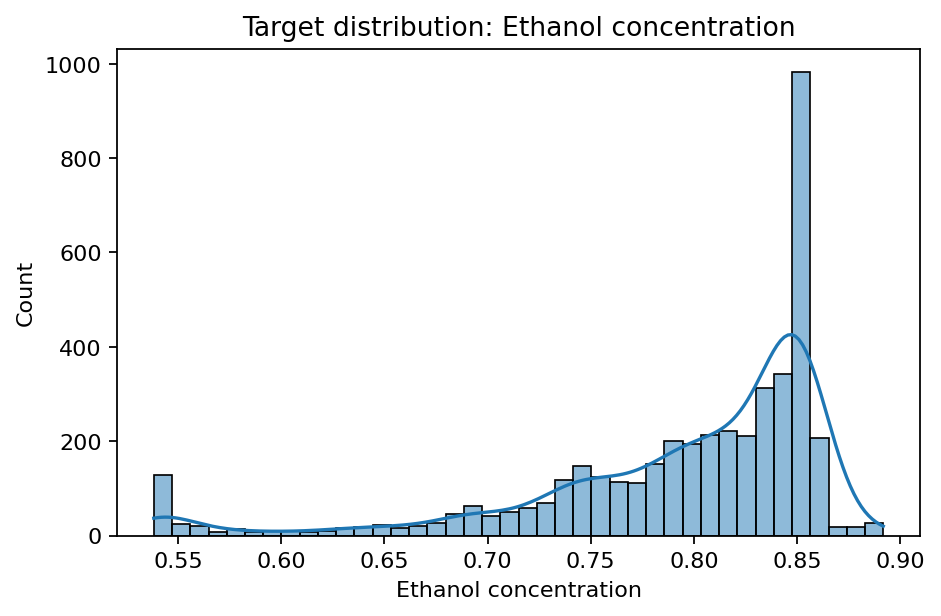
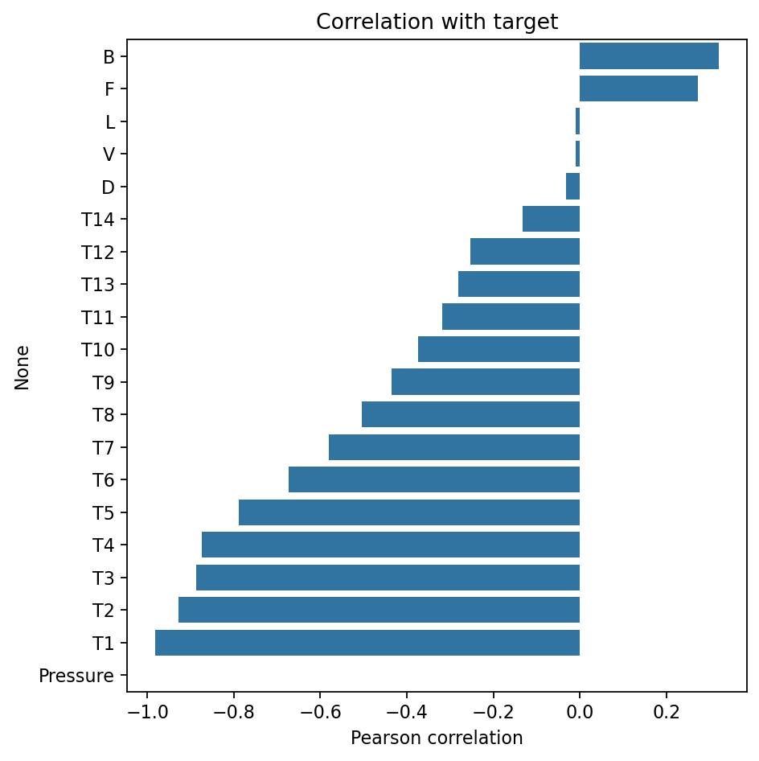
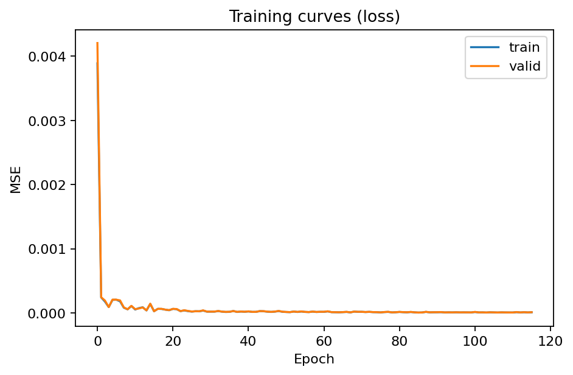
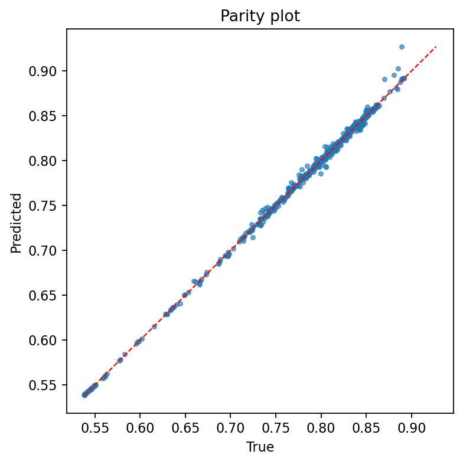
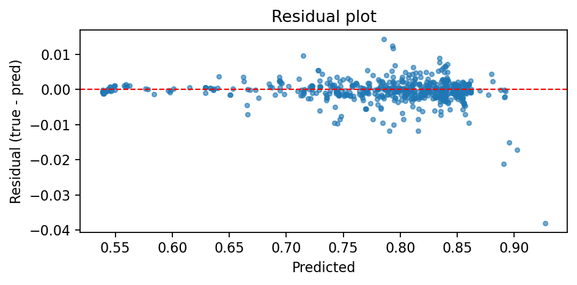
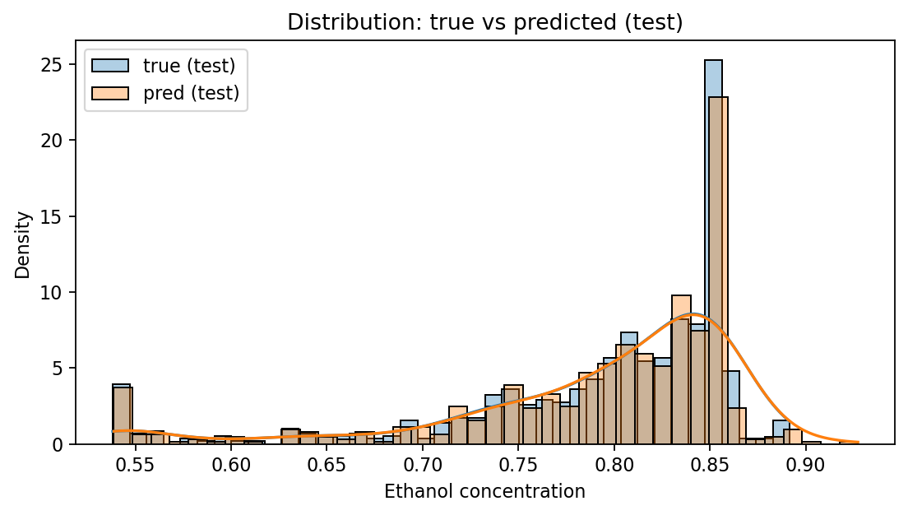

# Unit15_Appendix_distillation | Distillation Column: DNN predicts ethanol molar concentration

本附錄提供一個蒸餾塔（distillation column）的工業資料案例，示範如何用 **DNN (MLP) 回歸**建立軟測器（soft sensor），由塔內溫度分佈與流量等可量測訊號，預測產品端 **ethanol molar concentration**（資料欄位：`Ethanol concentration`）。

---

## 1. 案例背景：為什麼要預測乙醇莫耳濃度？

### 1.1 蒸餾塔基礎理論

蒸餾是化學工程中最重要的分離程序之一，其原理基於混合物中各組分揮發度（volatility）的差異。在蒸餾塔中，透過多次汽液平衡（vapor-liquid equilibrium, VLE）達成高純度分離。

#### 1.1.1 汽液平衡基礎

對於理想溶液，Raoult's Law 描述了汽液平衡關係：

$$
y_i P = x_i P_i^{sat}
$$

其中：
- $y_i$ 為氣相中組分 $i$ 的莫耳分率
- $x_i$ 為液相中組分 $i$ 的莫耳分率  
- $P$ 為系統總壓
- $P_i^{sat}$ 為組分 $i$ 在該溫度下的飽和蒸氣壓

#### 1.1.2 相對揮發度

相對揮發度（relative volatility）$\alpha_{ij}$ 定義為：

$$
\alpha_{ij} = \frac{y_i/x_i}{y_j/x_j} = \frac{P_i^{sat}}{P_j^{sat}}
$$

對於二元系統，汽液平衡關係可簡化為：

$$
y = \frac{\alpha x}{1 + (\alpha - 1)x}
$$

此關係式為 McCabe-Thiele 圖解法的基礎。

#### 1.1.3 McCabe-Thiele 方法

McCabe-Thiele 方法是蒸餾塔設計的經典圖解法，基於以下假設：
1. 恆莫耳溢流（constant molal overflow）
2. 理想塔板（theoretical plate）
3. 穩態操作

操作線方程：

精餾段（rectifying section）：
$$
y_{n+1} = \frac{R}{R+1}x_n + \frac{x_D}{R+1}
$$

提餾段（stripping section）：
$$
y_m = \frac{L'}{V'}x_{m-1} - \frac{B x_B}{V'}
$$

其中 $R$ 為回流比（reflux ratio），$x_D$ 和 $x_B$ 分別為塔頂和塔底產品組成。

### 1.2 軟測器（Soft Sensor）的重要性

蒸餾塔的產品組成是品質與經濟效益的核心指標，但在實務上「即時、連續」量測組成通常成本高、維護複雜或頻率不足。因此常見做法是用已部署的感測器（壓力、塔板溫度、流量）建立 **資料驅動軟測器**：

#### 1.2.1 軟測器的優勢

1. **即時品質估測（quality inference）**：提供連續的產品品質資訊
2. **操作調整與控制**：維持產品規格、降低能耗
3. **異常預警**：如塔板液泛、負載變動造成的品質漂移
4. **成本效益**：避免昂貴的線上分析儀器

#### 1.2.2 數學模型

本案例為監督式回歸問題：

$$
\hat{y} = f(\mathbf{x}),\quad \mathbf{x}\in \mathbb{R}^{20},\ y\in \mathbb{R}
$$

其中：
- $y$ 是乙醇莫耳濃度（`Ethanol concentration`）
- $\mathbf{x}$ 是壓力、塔板溫度與流量組成的特徵向量
- $f(\cdot)$ 是待學習的映射函數

---

## 2. 資料集與欄位

### 2.1 資料來源

資料檔案：`Part_4/data/distillation_column/dataset_distill.csv`

**執行結果**：
- 資料筆數：4408 筆
- 特徵數量：20 個輸入特徵 + 1 個目標變數

### 2.2 欄位說明

#### 2.2.1 操作變數

| 變數類型 | 欄位名稱 | 單位 | 說明 |
|---------|---------|------|------|
| 壓力 | `Pressure` | bar | 塔壓 |
| 溫度 | `T1` ~ `T14` | K | 各塔板溫度（14個測點）|
| 流量 | `L` | Kg mol/hour | Liquid flowrate（液相流量）|
| 流量 | `V` | Kg mol/hour | Vapor flowrate（氣相流量）|
| 流量 | `D` | Kg mol/hour | Distillate flowrate（塔頂產品流量）|
| 流量 | `B` | Kg mol/hour | Bottoms flowrate（塔底產品流量）|
| 流量 | `F` | Kg mol/hour | Feed flowrate（進料流量）|

#### 2.2.2 目標變數

- **`Ethanol concentration`**：乙醇莫耳濃度（模型輸出/目標）

### 2.3 資料格式注意事項

> [!IMPORTANT]
> 資料格式的特殊性
> - CSV 以**分號 `;`** 作為分隔符號（不是逗號 `,`）
> - `L`/`V` 欄位中包含**小數逗號科學記號**（例如 `1,23E+08`）
> - 需先將小數逗號轉為小數點再轉成數值

**資料讀取程式碼片段**：
```python
# 處理科學記號格式
def parse_sci(s):
    if isinstance(s, str):
        return float(s.replace(',', '.'))
    return float(s)

df = pd.read_csv(DATA_PATH, sep=';', converters={'L': parse_sci, 'V': parse_sci})
```

---

## 3. EDA 與特徵直覺

### 3.1 目標變數分佈分析

#### 3.1.1 理論背景

在進行任何建模之前，了解目標變數的分佈特性至關重要：
- **範圍（Range）**：確定預測值的合理區間
- **偏態（Skewness）**：判斷是否需要轉換
- **峰態（Kurtosis）**：了解極端值的分佈情況

#### 3.1.2 執行結果



**統計特性**：
- 最小值：0.538
- 最大值：0.892
- 分佈特徵：資料呈現相對均勻的分佈，無明顯偏態

> [!NOTE]
> 乙醇濃度範圍的物理意義
> 
> 此範圍（0.538-0.892）反映了蒸餾塔在不同操作條件下的分離效能。較高的濃度表示更好的分離效果，通常對應於：
> - 較高的回流比
> - 適當的進料位置
> - 穩定的操作條件

### 3.2 相關性分析（Correlation Analysis）

#### 3.2.1 Pearson 相關係數理論

Pearson 相關係數衡量兩個變數之間的線性關係強度：

$$
\rho_{X,Y}=\frac{\mathrm{cov}(X,Y)}{\sigma_X \sigma_Y} = \frac{E[(X-\mu_X)(Y-\mu_Y)]}{\sigma_X \sigma_Y}
$$

其中：
- $\mathrm{cov}(X,Y)$ 為 $X$ 和 $Y$ 的共變異數
- $\sigma_X$, $\sigma_Y$ 為標準差
- $\rho \in [-1, 1]$

**解釋**：
- $\rho = 1$：完全正相關
- $\rho = -1$：完全負相關  
- $\rho = 0$：無線性相關

> [!WARNING]
> 相關性的限制
> 
> Pearson 相關係數僅能捕捉**線性關係**：
> - 相關不等於因果（correlation ≠ causation）
> - 可能存在非線性關係但相關係數為零
> - 受極端值影響較大

#### 3.2.2 執行結果分析



**關鍵發現**：

| 特徵類型 | 代表特徵 | 相關係數 | 物理意義 |
|---------|---------|---------|---------|
| **強負相關（溫度剖面）** | `T1` | -0.981 | 塔頂溫度與乙醇濃度呈強負相關 |
| | `T2` | -0.928 | 溫度梯度反映分離效能 |
| | `T3` | -0.886 | 溫度越高，輕組分越少 |
| **正相關（流量/分配）** | `B` | 0.321 | 塔底流量影響物料平衡 |
| | `F` | 0.272 | 進料量影響整體操作 |
| **弱相關** | `L` / `V` | ≈ -0.009 | 內部流量變化小 |
| **無變化** | `Pressure` | NaN | 恆定於 1.01 bar |

#### 3.2.3 熱力學解釋

**溫度與組成的關係**：

在二元蒸餾系統中，溫度與組成存在熱力學關聯。根據 Antoine 方程：

$$
\log_{10} P^{sat} = A - \frac{B}{C + T}
$$

結合 Raoult's Law 和物料平衡，可推導出溫度與組成的隱含關係。塔頂溫度較低時，表示輕組分（乙醇）濃度較高，這解釋了強負相關的觀察結果。

**物理直覺**：
1. **塔頂溫度（T1-T3）**：反映輕組分濃度，溫度↑ → 乙醇濃度↓
2. **塔底溫度（T12-T14）**：反映重組分累積
3. **溫度梯度**：表徵分離效能，梯度越大分離越好

---

## 4. 建模流程：切分、清理、標準化

### 4.1 資料切分策略

#### 4.1.1 Train/Valid/Test Split 理論

**切分比例**：70% / 15% / 15%

```python
# 第一次切分：分離出 test set (15%)
X_temp, X_test, y_temp, y_test = train_test_split(
    X, y, test_size=0.15, random_state=SEED
)

# 第二次切分：從剩餘 85% 中分離出 valid set
# 15% / 85% ≈ 17.65% → 最終 valid ≈ 15%
X_train, X_valid, y_train, y_valid = train_test_split(
    X_temp, y_temp, test_size=0.1765, random_state=SEED
)
```

**執行結果**：
- Training set: 3085 筆
- Validation set: 661 筆  
- Test set: 662 筆

#### 4.1.2 各資料集的用途

| 資料集 | 用途 | 重要性 |
|-------|------|--------|
| **Training** | 模型參數學習 | 用於更新權重 |
| **Validation** | Early stopping 監控 | 防止過擬合 |
| **Test** | 最終評估 | 評估泛化能力 |

> [!CAUTION]
> Data Leakage 的風險
> 
> **絕對不可**在切分前進行以下操作：
> - 標準化（會洩漏 test set 的統計資訊）
> - 特徵選擇（會根據全部資料選特徵）
> - 任何基於全資料集的轉換

### 4.2 極端值處理

#### 4.2.1 問題診斷

資料中 `L`/`V` 會出現非常大的數值（例如 `1.23e8`, `1.23e9`），這些極端值會：
1. 主導標準化後的尺度
2. 造成梯度爆炸/消失
3. 影響模型收斂

#### 4.2.2 Clipping 策略

**方法**：基於訓練集統計量設定上限

```python
# 只用訓練集計算上限
cap_L = np.percentile(X_train['L'], 99.5)
cap_V = np.percentile(X_train['V'], 99.5)

# 套用到所有資料集
for df in [X_train, X_valid, X_test]:
    df['L'] = np.clip(df['L'], None, cap_L)
    df['V'] = np.clip(df['V'], None, cap_V)
```

**執行結果**：
- `L` 上限 = 22,500 Kg mol/hour
- `V` 上限 = 22,650 Kg mol/hour
- 約 5.9% (258/4408) 的樣本被 clipping

> [!TIP]
> Clipping 的目的
> 
> 此步驟**不是**修正真實物理值，而是：
> - 避免極端尺度主導訓練
> - 讓模型專注於有資訊的區域
> - 提升數值穩定性

### 4.3 標準化（Standardization）

#### 4.3.1 Z-score 標準化理論

神經網路對特徵尺度敏感，標準化可加速收斂並提升性能。Z-score 標準化：

$$
x' = \frac{x-\mu_{\text{train}}}{\sigma_{\text{train}}}
$$

其中：
- $\mu_{\text{train}}$ 為訓練集均值
- $\sigma_{\text{train}}$ 為訓練集標準差

**重要原則**：
$$
\mu_{\text{train}}, \sigma_{\text{train}} \text{ 必須只由訓練集估計}
$$

#### 4.3.2 實作細節

```python
from sklearn.preprocessing import StandardScaler

# 只在訓練集上 fit
scaler_X = StandardScaler()
scaler_X.fit(X_train)

# Transform 所有資料集
X_train_s = scaler_X.transform(X_train)
X_valid_s = scaler_X.transform(X_valid)
X_test_s = scaler_X.transform(X_test)
```

#### 4.3.3 為何標準化重要？

1. **梯度下降效率**：
   - 未標準化：等高線呈橢圓形 → 收斂慢
   - 標準化後：等高線接近圓形 → 收斂快

2. **權重初始化**：
   - 標準化後的輸入配合 Xavier/He 初始化效果最佳

3. **數值穩定性**：
   - 避免浮點運算溢位
   - 減少梯度消失/爆炸風險

---

## 5. 模型理論與架構

### 5.1 Baseline: Ridge Regression

#### 5.1.1 數學推導

Ridge 回歸是線性回歸加上 L2 正則化：

**目標函數**：
$$
\min_{\mathbf{w}, b}\ \frac{1}{n}\sum_{i=1}^{n}\left(y_i-(\mathbf{w}^\top \mathbf{x}_i + b)\right)^2 + \lambda \|\mathbf{w}\|_2^2
$$

其中：
- 第一項：均方誤差（MSE）
- 第二項：L2 正則化項
- $\lambda$：正則化強度

**閉式解**（closed-form solution）：

定義設計矩陣 $\mathbf{X} \in \mathbb{R}^{n \times d}$，則：

$$
\mathbf{w}^* = (\mathbf{X}^\top\mathbf{X} + \lambda\mathbf{I})^{-1}\mathbf{X}^\top\mathbf{y}
$$

#### 5.1.2 優勢與限制

**優勢**：
- ✓ 訓練快速（有閉式解）
- ✓ 可解釋性好
- ✓ 適合作為 baseline

**限制**：
- ✗ 只能捕捉線性關係
- ✗ 無法學習特徵交互作用
- ✗ 對複雜模式建模能力有限

### 5.2 DNN (MLP) 回歸模型

#### 5.2.1 多層感知器（MLP）架構

MLP 可表示為多層非線性映射的組合：

**前向傳播（Forward Propagation）**：

$$
\begin{aligned}
\mathbf{h}^{(0)} &= \mathbf{x} \\
\mathbf{z}^{(l)} &= \mathbf{W}^{(l)}\mathbf{h}^{(l-1)} + \mathbf{b}^{(l)} \\
\mathbf{h}^{(l)} &= \phi(\mathbf{z}^{(l)}) \quad \text{for } l=1,\ldots,L-1 \\
\hat{y} &= \mathbf{W}^{(L)}\mathbf{h}^{(L-1)} + \mathbf{b}^{(L)}
\end{aligned}
$$

其中：
- $\mathbf{h}^{(l)}$：第 $l$ 層的激活值（activation）
- $\mathbf{W}^{(l)}, \mathbf{b}^{(l)}$：第 $l$ 層的權重和偏置
- $\phi(\cdot)$：激活函數（activation function）
- $L$：總層數

#### 5.2.2 激活函數

**ReLU (Rectified Linear Unit)**：

$$
\phi(z) = \max(0, z) = \begin{cases}
z & \text{if } z > 0 \\
0 & \text{otherwise}
\end{cases}
$$

**優點**：
- 計算簡單
- 緩解梯度消失問題
- 引入稀疏性（sparsity）

**輸出層**：線性激活（恆等函數）
$$
\hat{y} = z^{(L)} \quad \text{(for regression)}
$$

#### 5.2.3 損失函數

**均方誤差（Mean Squared Error, MSE）**：

$$
\mathcal{L}(\mathbf{w}) = \frac{1}{n}\sum_{i=1}^{n}(y_i-\hat{y}_i)^2
$$

**梯度**：
$$
\frac{\partial \mathcal{L}}{\partial \hat{y}_i} = -\frac{2}{n}(y_i - \hat{y}_i)
$$

#### 5.2.4 反向傳播（Backpropagation）

反向傳播基於鏈式法則（chain rule）計算梯度：

**輸出層梯度**：
$$
\delta^{(L)} = \frac{\partial \mathcal{L}}{\partial \mathbf{z}^{(L)}} = \frac{\partial \mathcal{L}}{\partial \hat{y}} \cdot \frac{\partial \hat{y}}{\partial \mathbf{z}^{(L)}}
$$

**隱藏層梯度**（遞迴計算）：
$$
\delta^{(l)} = \left((\mathbf{W}^{(l+1)})^\top \delta^{(l+1)}\right) \odot \phi'(\mathbf{z}^{(l)})
$$

**權重梯度**：
$$
\frac{\partial \mathcal{L}}{\partial \mathbf{W}^{(l)}} = \delta^{(l)} (\mathbf{h}^{(l-1)})^\top
$$

其中 $\odot$ 表示 element-wise 乘法。

#### 5.2.5 優化演算法

**Adam (Adaptive Moment Estimation)**：

結合 Momentum 和 RMSprop 的優點：

$$
\begin{aligned}
\mathbf{m}_t &= \beta_1 \mathbf{m}_{t-1} + (1-\beta_1)\mathbf{g}_t \\
\mathbf{v}_t &= \beta_2 \mathbf{v}_{t-1} + (1-\beta_2)\mathbf{g}_t^2 \\
\hat{\mathbf{m}}_t &= \frac{\mathbf{m}_t}{1-\beta_1^t} \\
\hat{\mathbf{v}}_t &= \frac{\mathbf{v}_t}{1-\beta_2^t} \\
\mathbf{w}_{t+1} &= \mathbf{w}_t - \eta \frac{\hat{\mathbf{m}}_t}{\sqrt{\hat{\mathbf{v}}_t} + \epsilon}
\end{aligned}
$$

**超參數**：
- $\beta_1 = 0.9$（一階動量）
- $\beta_2 = 0.999$（二階動量）
- $\eta$：學習率（learning rate）
- $\epsilon = 10^{-8}$（數值穩定項）

#### 5.2.6 學習率調度（Learning Rate Scheduling）

**ReduceLROnPlateau**：

當驗證損失停止改善時降低學習率：

```python
if val_loss_improvement < threshold:
    patience_counter += 1
    if patience_counter >= patience:
        lr = lr * factor
```

**參數**：
- `patience=10`：容忍 10 個 epoch 無改善
- `factor=0.5`：學習率減半
- `min_lr=1e-6`：最小學習率

#### 5.2.7 正則化技術

**Early Stopping**：

監控驗證集損失，防止過擬合：

```python
if val_loss < best_val_loss:
    best_val_loss = val_loss
    save_model()
    patience_counter = 0
else:
    patience_counter += 1
    if patience_counter >= patience:
        restore_best_model()
        break
```

**Dropout**（若使用）：

訓練時隨機丟棄神經元：
$$
\mathbf{h}_{\text{dropout}} = \mathbf{h} \odot \mathbf{m}, \quad m_i \sim \text{Bernoulli}(p)
$$

### 5.3 評估指標

#### 5.3.1 平均絕對誤差（MAE）

$$
\mathrm{MAE}=\frac{1}{n}\sum_{i=1}^{n}|y_i-\hat{y}_i|
$$

**特性**：
- 對極端值較不敏感
- 單位與目標變數相同
- 易於解釋

#### 5.3.2 均方根誤差（RMSE）

$$
\mathrm{RMSE}=\sqrt{\frac{1}{n}\sum_{i=1}^{n}(y_i-\hat{y}_i)^2}
$$

**特性**：
- 對大誤差懲罰更重
- 與 MSE 相關但單位一致
- 常用於回歸問題

#### 5.3.3 決定係數（R²）

$$
R^2=1-\frac{\sum_{i=1}^{n}(y_i-\hat{y}_i)^2}{\sum_{i=1}^{n}(y_i-\bar{y})^2} = 1 - \frac{\text{SS}_{\text{res}}}{\text{SS}_{\text{tot}}}
$$

**解釋**：
- $R^2 = 1$：完美預測
- $R^2 = 0$：預測等同於均值
- $R^2 < 0$：預測比均值還差

**物理意義**：模型解釋的變異比例

---

## 6. 訓練過程與結果分析

### 6.1 訓練曲線（Learning Curves）

#### 6.1.1 理論意義

訓練曲線用於診斷模型狀態：

| 現象 | 診斷 | 對策 |
|-----|------|------|
| Train ↓, Valid ↓ | 正常學習 | 繼續訓練 |
| Train ↓, Valid ↑ | 過擬合 | Early stopping / 正則化 |
| Train 高, Valid 高 | 欠擬合 | 增加模型容量 |
| Train 震盪 | 學習率過大 | 降低學習率 |

#### 6.1.2 執行結果



**訓練詳情**（sklearn-mlp backend）：
- 總 epoch 數：116（early stopping）
- 最終驗證損失：`val_loss ≈ 5e-6`
- 最終驗證 MAE：`val_mae ≈ 0.002`
- 學習率最終值：`1e-6`（經過多次 ReduceLROnPlateau）

**觀察**：
- ✓ Train 和 Valid loss 同步下降
- ✓ 無明顯過擬合跡象
- ✓ 收斂穩定

### 6.2 性能比較：Ridge vs DNN

#### 6.2.1 量化結果

**執行環境**：
- Backend: `sklearn-mlp`
- 資料切分：Train 3085 / Valid 661 / Test 662

**Test Set 性能**：

| 模型 | MAE | RMSE | R² | 改善幅度 |
|-----|-----|------|----|----|
| **Ridge** | 0.004795 | 0.007037 | 0.9922 | - |
| **DNN (MLP)** | 0.001942 | 0.003374 | 0.9982 | ↓ 59.5% MAE |

**改善百分比**：
- MAE：$(0.004795 - 0.001942) / 0.004795 \times 100\% = 59.5\%$
- RMSE：$(0.007037 - 0.003374) / 0.007037 \times 100\% = 52.0\%$
- R²：從 0.9922 提升至 0.9982

#### 6.2.2 深度分析

**Ridge 的表現**：
- $R^2 = 0.9922$ 已經很高
- 表示線性關係能解釋 99.22% 的變異
- 證明溫度與組成存在強線性相關

**DNN 的優勢**：
- 進一步降低誤差約 50-60%
- 捕捉到非線性和交互作用
- 在高精度要求場景下優勢明顯

**實務建議**：

> [!TIP]
> 模型選擇策略
> 
> - **可解釋性優先**：選 Ridge（維護簡單、易解釋）
> - **精度優先**：選 DNN（性能更優）
> - **混合策略**：Ridge 做初步篩選，DNN 做精細預測

### 6.3 資料品質討論

#### 6.3.1 重複樣本問題

**發現**：資料集中約 21.4% (945/4408) 為完全重複的特徵列

**影響**：
- 隨機切分可能導致 train/test 洩漏
- 測試表現可能過於樂觀
- 實際是在「記憶相同工況」

#### 6.3.2 改善建議

> [!WARNING]
> 資料洩漏風險
> 
> **建議做法**：
> 1. **去重後切分**：
>    ```python
>    df_unique = df.drop_duplicates()
>    # 再進行 train_test_split
>    ```
> 
> 2. **分組切分（Group Split）**：
>    ```python
>    # 以操作工況 (D, B, F) 為 group
>    groups = df.groupby(['D', 'B', 'F']).ngroup()
>    GroupShuffleSplit(groups=groups)
>    ```
> 
> 3. **時序切分**（若有時間資訊）：
>    - 前 70% 訓練，後 30% 測試
>    - 更符合實際部署情境

---

## 7. 模型診斷圖

### 7.1 Parity Plot（真值 vs 預測）

#### 7.1.1 理論

Parity plot 用於視覺化預測品質：
- **理想情況**：所有點落在 $y = \hat{y}$ 對角線上
- **偏差**：點偏離對角線表示預測誤差
- **系統性偏差**：點集中在對角線某一側

#### 7.1.2 執行結果



**觀察**：
- ✓ 點緊密分佈於對角線附近
- ✓ 無明顯系統性偏差
- ✓ 高濃度和低濃度區域預測均佳

### 7.2 Residual Plot（殘差圖）

#### 7.2.1 理論

殘差定義：
$$
r_i = y_i - \hat{y}_i
$$

**診斷準則**：
- **理想**：殘差隨機分佈於零線附近
- **問題模式**：
  - 曲線型：缺少非線性項
  - 喇叭型：異方差性（heteroscedasticity）
  - 分段：需要分段建模

#### 7.2.2 執行結果



**觀察**：
- ✓ 殘差隨機分佈
- ✓ 無明顯結構
- ✓ 變異數相對穩定

### 7.3 預測分佈比較

#### 7.3.1 目的

比較真實值與預測值的分佈，檢查：
- 是否存在系統性偏移
- 預測範圍是否合理
- 極端值處理是否得當

#### 7.3.2 執行結果



**觀察**：
- ✓ 兩分佈高度重疊
- ✓ 峰值位置一致
- ✓ 尾部行為相似

### 7.4 特徵關係散點圖

#### 7.4.1 執行結果


**分析**：
- **Pressure vs 預測值**：
  - Pressure 恆定於 1.01 bar（無變化）
  - 預測值仍有變化 → 由其他特徵驅動
  
- **T14 vs 預測值**：
  - 呈現負相關趨勢（符合理論）
  - 塔底溫度↑ → 乙醇濃度↓
  - 散點分佈合理

---

## 8. 結論與建議

### 8.1 主要成果

1. **成功建立軟測器**：
   - 使用 DNN 達成 R² = 0.9982
   - MAE = 0.001942（約 0.2% 濃度誤差）

2. **模型比較**：
   - Ridge 已有良好表現（R² = 0.9922）
   - DNN 進一步提升 50-60% 精度

3. **特徵重要性**：
   - 溫度剖面（T1-T3）為最重要特徵
   - 流量變數（D, B, F）提供額外資訊

### 8.2 實務部署建議

> [!IMPORTANT]
> 部署前檢查清單
> 
> 1. **資料品質**：
>    - [ ] 去除重複樣本
>    - [ ] 檢查感測器漂移
>    - [ ] 建立資料驗證機制
> 
> 2. **模型監控**：
>    - [ ] 設定預測範圍警報
>    - [ ] 追蹤 MAE 趨勢
>    - [ ] 定期重新訓練
> 
> 3. **整合測試**：
>    - [ ] 與 DCS 系統整合
>    - [ ] 延遲測試（< 1秒）
>    - [ ] 異常處理機制

### 8.3 未來改進方向

1. **資料增強**：
   - 收集更多操作工況
   - 包含啟動/停車資料
   - 異常工況標註

2. **模型優化**：
   - 嘗試 LSTM（考慮時序）
   - Ensemble 方法
   - 貝葉斯優化超參數

3. **可解釋性**：
   - SHAP 值分析
   - 特徵重要性排序
   - 局部可解釋性（LIME）

---

## 9. 交付物與重現

### 9.1 對應程式碼

**Notebook**：`Part_4/Unit15_Appendix_distillation.ipynb`

### 9.2 輸出檔案

**自動產生於**：`Part_4/outputs/P4_Unit15_Appendix_Distillation/`

- **指標檔**：`metrics.json`
- **圖片**：`figs/*.png`
  - `target_hist.png`
  - `corr_bar.png`
  - `loss_curve.png`
  - `parity_plot.png`
  - `residual_plot.png`
  - `test_true_vs_pred_dist.png`
  - `test_pred_scatter.png`
- **模型**：`models/` (scaler, Ridge, DNN)

### 9.3 執行建議

> [!NOTE]
> 執行環境
> 
> - 建議從 `Part_4` 目錄執行
> - Python 3.7+
> - 依賴套件：numpy, pandas, scikit-learn, matplotlib, seaborn
> - 選配：tensorflow/keras（若要用 Keras backend）

---

## 參考文獻

1. McCabe, W. L., & Thiele, E. W. (1925). Graphical design of fractionating columns. *Industrial & Engineering Chemistry*, 17(6), 605-611.

2. Goodfellow, I., Bengio, Y., & Courville, A. (2016). *Deep Learning*. MIT Press.

3. Kingma, D. P., & Ba, J. (2014). Adam: A method for stochastic optimization. *arXiv preprint arXiv:1412.6980*.

4. Fortuna, L., et al. (2007). *Soft Sensors for Monitoring and Control of Industrial Processes*. Springer.

---

**最後更新**：2025-12-22
**Backend**：sklearn-mlp
**資料版本**：dataset_distill.csv (4408 筆)
