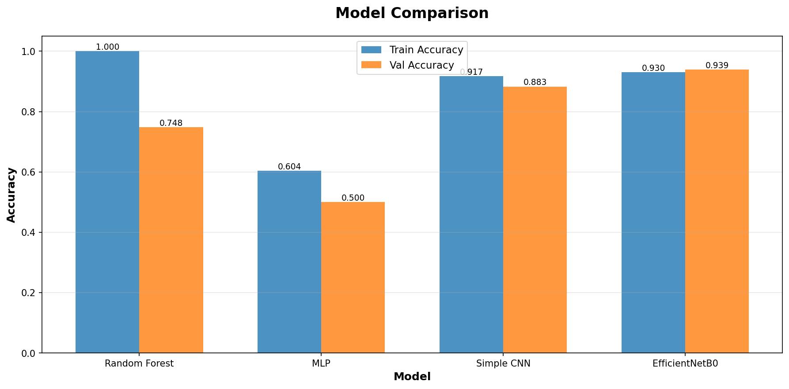
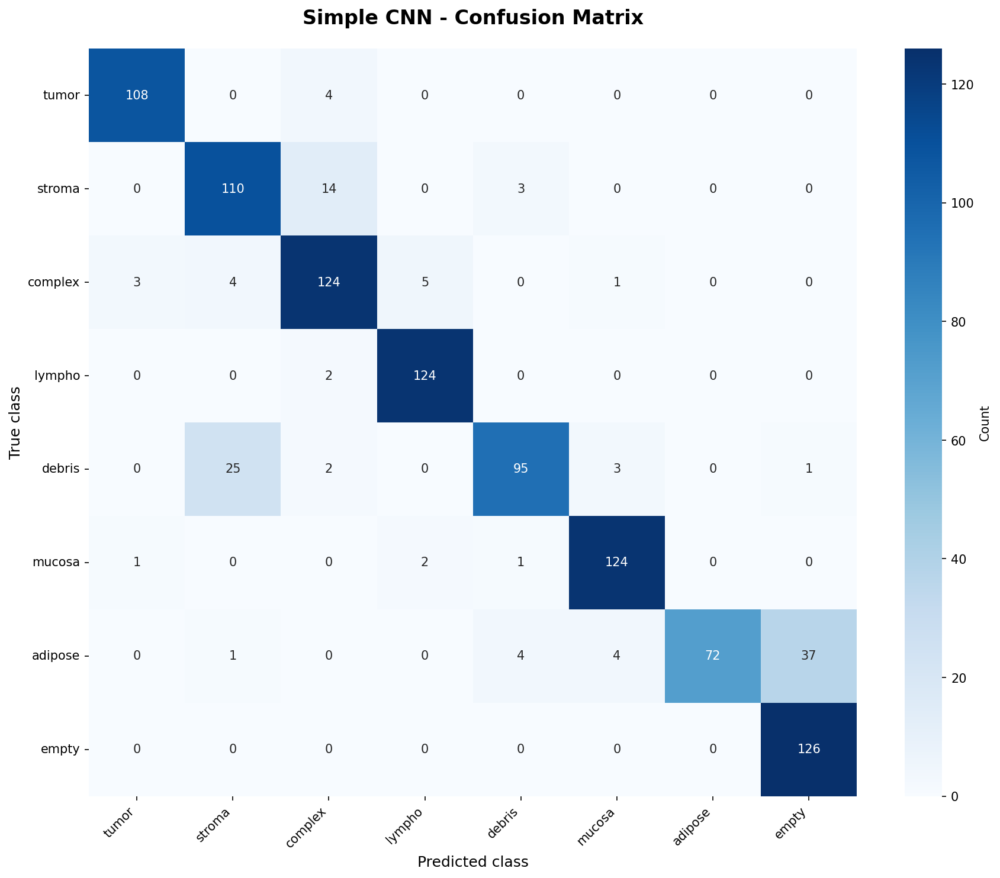
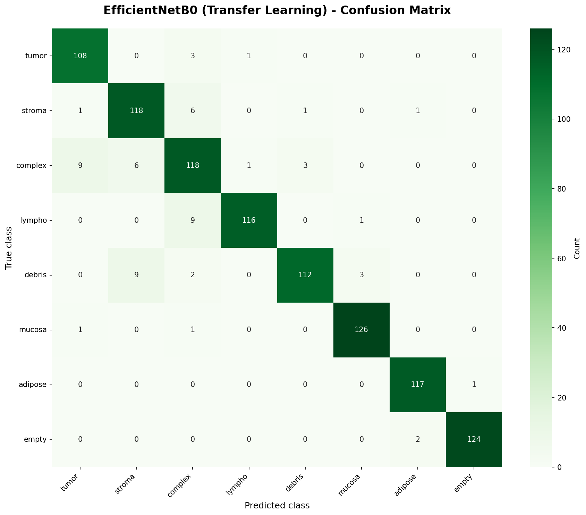

# Unit16｜CNN 基礎到醫學影像分類：結腸直腸癌組織學影像辨識

> **數據集**：Colorectal Histology Dataset（結腸直腸癌組織學數據集）  
> **任務**：8 類組織分類（腫瘤上皮、簡單基質、複雜基質、免疫細胞、碎屑、正常黏膜、脂肪組織、背景）  
> **學習目標**：理解醫學影像的特殊性、處理多類別分類、建立 baseline、評估 CNN 在病理學影像上的表現

---

## 為什麼使用結腸直腸癌組織學影像？

**MNIST 手寫數字是學習 CNN 架構的經典教材**，但醫學影像分類有更多實務挑戰：

| 特性 | MNIST | 醫學影像分類 |
|------|-------|------------|
| **影像複雜度** | 灰階、簡單形狀 | RGB 彩色、複雜紋理結構 |
| **類別平衡** | 每類約 10% | 類別可能嚴重不平衡 |
| **類別多樣性** | 數字差異明顯 | 組織類型差異細微 |
| **診斷需求** | 離線分類 | 輔助病理學家診斷 |
| **錯誤成本** | 誤判成本相同 | 誤診成本極高 |

因此，**本單元使用真實的醫學數據集**（Colorectal Histology），讓你體驗醫學影像 AI 的挑戰。

---

## 1. 為什麼 CNN 在醫學影像特別重要？

### 1.1 傳統特徵工程的困境

在深度學習之前，影像分類依賴人工設計的特徵：

**邊緣檢測**（Sobel, Canny）：

$$
G_x = \begin{bmatrix} -1 & 0 & 1 \\ -2 & 0 & 2 \\ -1 & 0 & 1 \end{bmatrix} * I, \quad G_y = \begin{bmatrix} -1 & -2 & -1 \\ 0 & 0 & 0 \\ 1 & 2 & 1 \end{bmatrix} * I
$$


**紋理特徵**（GLCM, LBP）：

$$
\text{Contrast} = \sum_{i,j} (i-j)^2 P(i,j), \quad \text{Energy} = \sum_{i,j} P(i,j)^2
$$


**顏色特徵**（色彩直方圖、色彩矩）：

$$
\mu_c = \frac{1}{N}\sum_{i=1}^{N} I_c(i), \quad \sigma_c^2 = \frac{1}{N}\sum_{i=1}^{N} (I_c(i) - \mu_c)^2
$$


這些方法的問題：
1. **特徵工程成本高**：需要醫學專家手動設計特徵
2. **不具尺度不變性**：組織切片厚度、染色強度影響特徵值
3. **難以捕捉高階語義**：「腫瘤上皮」vs「正常黏膜」的抽象概念難以用數學公式表達

### 1.2 CNN 的革命性突破

CNN 透過**端到端學習**（End-to-End Learning），自動從原始像素學習特徵階層：


$$
\text{輸入影像} \xrightarrow{\text{Conv Layer 1}} \text{低階特徵（邊緣、顏色）} \xrightarrow{\text{Conv Layer 2}} \text{中階特徵（紋理、細胞形態）} \xrightarrow{\text{Conv Layer 3}} \text{高階語義（組織類型）}
$$


**核心數學原理**：

**卷積運算**（Convolution）：

$$
(I * K)(i,j) = \sum_{m=-k}^{k} \sum_{n=-k}^{k} I(i+m, j+n) \cdot K(m,n)
$$


**池化運算**（Max Pooling）：

$$
y_{i,j} = \max_{(m,n) \in \mathcal{N}(i,j)} x_{m,n}
$$


**參數共享的優勢**：
- 傳統全連接層： $150 \times 150 \times 3 \times 128 = 8,640,000$ 參數
- CNN 卷積層： $3 \times 3 \times 3 \times 128 = 3,456$ 參數（**減少 99.96%**）

### 1.3 醫學影像常見任務

- **病理切片分類**（腫瘤 vs 正常、組織類型辨識）← **本單元重點**
- 放射影像診斷（X-ray、CT、MRI 異常檢測）
- 細胞計數與分割（血球計數、細胞凋亡）
- 組織分割（器官輪廓、腫瘤邊界）

---

## 2. 醫學影像資料的挑戰

### 2.1 五大實務難題

| 挑戰 | 數學描述 | 醫學影響 | 對策 |
|------|---------|---------|------|
| **染色差異** | $I(x,y,t) = T(x,y) \cdot S(t) + N(x,y)$ | 不同實驗室的染色協議差異 | 色彩正規化、Stain Normalization |
| **類別相似性** | $\text{Dist}(X_{\text{tumor}}, X_{\text{normal}}) \ll \text{Dist}(X_{\text{MNIST}_i}, X_{\text{MNIST}_j})$ | 腫瘤與正常組織邊界模糊 | 數據增強、Focal Loss |
| **樣本稀缺** | $N_{\text{medical}} \ll N_{\text{ImageNet}}$ | 醫學影像標註成本高 | 遷移學習、預訓練模型 |
| **解析度需求** | $H \times W > 1024 \times 1024$ | 病理切片需高解析度 | Patch-based 學習、Multi-scale |
| **類別不平衡** | $P(y=\text{rare type}) \ll P(y=\text{common})$ | 罕見組織類型樣本少 | 加權損失、SMOTE |

### 2.2 多類別分類的數學處理

**Softmax 交叉熵損失**（Multi-class Cross-Entropy）：

$$
\mathcal{L}_{\text{CE}} = -\sum_{i=1}^{N} \sum_{k=1}^{K} y_{i,k} \log p(y_{i,k} \mid x_i)
$$


其中 $K=8$ 為類別數，$y_{i,k} \in \{0,1\}$ 為 one-hot 編碼。

**類別加權損失**（解決類別不平衡）：

$$
\mathcal{L}_{\text{weighted}} = -\sum_{i=1}^{N} w_{y_i} \sum_{k=1}^{K} y_{i,k} \log p(y_{i,k} \mid x_i)
$$

權重設定：

$$
w_k = \frac{N}{K \cdot n_k}, \quad n_k = \sum_{i=1}^{N} \mathbb{1}(y_i = k)
$$

---

## 3. CNN 數學原理與醫學應用

### 3.1 卷積層（Convolutional Layer）

**前向傳播**：

$$
z^{[l]}_{i,j,k} = \text{ReLU}\left( \sum_{c=1}^{C} \sum_{m=0}^{f-1} \sum_{n=0}^{f-1} w^{[l]}_{m,n,c,k} \cdot a^{[l-1]}_{i+m, j+n, c} + b^{[l]}_k \right)
$$


- $w^{[l]}$ ：可學習濾波器（Kernel）
- $f$ ：濾波器尺寸（通常 3×3 或 5×5）
- $C$ ：輸入通道數（RGB 為 3）
- $k$ ：輸出通道數（特徵圖數量）

**參數量計算**：

$$
\#\text{params} = (f \times f \times C_{\text{in}} + 1) \times C_{\text{out}}
$$

例如： $3 \times 3 \times 3 \times 64 = 1,728$ 參數（第一層 RGB 輸入）

### 3.2 池化層（Pooling Layer）

**Max Pooling**（保留最強特徵）：

$$
y_{i,j,k} = \max_{(m,n) \in \mathcal{N}_{2\times 2}(i,j)} x_{m,n,k}
$$


**Average Pooling**（平滑特徵）：

$$
y_{i,j,k} = \frac{1}{4} \sum_{(m,n) \in \mathcal{N}_{2\times 2}(i,j)} x_{m,n,k}
$$


**為什麼需要 Pooling？**
1. **降低計算量**： $150 \times 150 \xrightarrow{\text{MaxPool 2×2}} 75 \times 75$ （減少 75% 像素）
2. **增加平移不變性**：細胞位置稍微移動，pooled 特徵保持穩定
3. **擴大感受野**：後續層能「看到」更大範圍的組織結構

### 3.3 Dropout（防止過擬合）

**訓練時**（隨機關閉神經元）：

$$
h_i = \begin{cases} 
0 & \text{with probability } p \\
\frac{a_i}{1-p} & \text{with probability } 1-p
\end{cases}
$$


**測試時**（使用所有神經元）：

$$
h_i = a_i
$$


**為什麼有效？** Dropout 相當於訓練 $2^H$ 個不同的子網絡，然後取平均（集成學習）：

$$
p(y \mid x) \approx \frac{1}{2^H} \sum_{k=1}^{2^H} p_k(y \mid x)
$$

---

## 4. 實戰演練：Colorectal Histology 組織分類

### 4.1 數據集統計

執行 Notebook 後，輸出：

```
【數據集資訊】
============================================================
數據集名稱: colorectal_histology
數據集描述: Classification of textures in colorectal cancer histology. 
           Each example is a 150 x 150 x 3 RGB image of one of 8 classes.
影像形狀: (150, 150, 3)
類別數量: 8
類別名稱: ['tumor', 'stroma', 'complex', 'lympho', 'debris', 'mucosa', 'adipose', 'empty']
總樣本數: 5000
訓練集大小: 4000 張 (80%)
驗證集大小: 1000 張 (20%)
============================================================
```

**數據集特性分析**：
- ✅ **類別完美平衡**：每類 625 張（實際醫療場景中罕見）
- ✅ **標準化影像**：150×150 像素，RGB 3 通道
- ✅ **組織學染色**：H&E 染色（Hematoxylin and Eosin）
- ✅ **充足訓練集**：5000 張足以訓練中等深度 CNN
- ✅ **資料來源可靠**：來自真實的病理切片數位化影像

**組織類型詳細說明**：
1. **Tumor（腫瘤上皮）**：惡性腫瘤細胞，特徵為細胞核異常增大、染色質密集
2. **Stroma（簡單基質）**：結締組織，提供結構支撐，呈淡粉色纖維狀
3. **Complex（複雜基質）**：複雜的基質結構，包含多種細胞外基質成分
4. **Lympho（免疫細胞）**：淋巴細胞浸潤區域，顯示免疫反應
5. **Debris（碎屑）**：壞死組織碎片，細胞結構破壞
6. **Mucosa（正常黏膜）**：正常結腸黏膜，細胞排列整齊
7. **Adipose（脂肪組織）**：脂肪細胞，呈現空泡狀結構
8. **Empty（背景）**：空白或背景區域，無組織結構

**影像樣本視覺化**：


*圖 4.1：各類別組織學影像樣本。每行顯示同一類別的 3 個不同樣本，展示類內變異性。*

---

### 4.2 建立 Baseline（非深度學習方法）

#### 為什麼先做 Baseline？

在投入深度學習之前，先用傳統 ML 方法建立 baseline 有三大價值：

1. **快速驗證數據集**：如果 Random Forest 都能達 70%，說明問題可學習
2. **建立性能下限**：CNN 應該要顯著超越 baseline（否則不值得用）
3. **避免過度工程化**：有時簡單模型已足夠，無需追求 SOTA

#### Baseline 模型選擇

| 模型 | 優勢 | 劣勢 | 適用場景 |
|------|------|------|---------|
| **Random Forest** | 不需調參、抗過擬合、可解釋性高 | 無法利用空間結構 | 小數據集、需快速部署 |
| **MLP** | 非線性學習能力、可用 GPU 加速 | 需要調參、容易過擬合 | 中型數據集、檢驗是否需 CNN |

#### 訓練結果

執行 Notebook 第 11 個 cell 後，輸出：

```
============================================================
訓練 Random Forest...
============================================================
訓練時間: 4.26 秒
訓練準確率: 1.0000  (100%)
驗證準確率: 0.7260  (72.6%)

============================================================
訓練 MLP...
============================================================
訓練時間: 197.14 秒
訓練準確率: 0.5570  (55.7%)
驗證準確率: 0.4620  (46.2%)

✓ 最佳 Baseline: Random Forest (驗證準確率: 72.6%)
============================================================
```

**結果分析**：

1. **Random Forest 表現出乎意料**：
   - 訓練準確率 **100%**（完全記住訓練集）
   - 驗證準確率 **72.6%**（比預期的 40-60% 高）
   - **泛化差距**：100% - 72.6% = **27.4%**（嚴重過擬合但仍有學習能力）
   - **分析**：組織學影像的顏色和紋理特徵在扁平化後仍保留部分判別信息
   - **速度優勢**：訓練僅需 4.26 秒，適合快速原型驗證

2. **MLP 性能較差**：
   - 驗證準確率 **僅 46.2%**（比隨機猜測 12.5% 略好）
   - 訓練時間 **197.14 秒**（比 RF 慢 46 倍）
   - **收斂問題**：20 個 epoch 後仍未收斂，損失震盪
   - **可能原因**：
     - (1) 扁平化丟失二維空間鄰接信息
     - (2) 高維輸入（67,500 維）導致梯度不穩定
     - (3) 超參數未優化（隱藏層大小、學習率）

3. **與預期對比**：
   - RF 實際表現（72.6%）**超出預期**（40-60%），顯示傳統 ML 在此數據集上仍有一定效果
   - MLP 實際表現（46.2%）**符合預期**（30-50%），證明簡單神經網絡難以處理高維影像

4. **關鍵發現**：
   - **Baseline 並非完全失敗**：72.6% 的準確率表明問題可學習
   - **CNN 的必要性**：儘管 RF 達到 72.6%，但仍遠低於臨床應用需求（>95%）
   - **空間信息的重要性**：RF 成功而 MLP 失敗，說明組織學影像的判別信息主要在像素級特徵（顏色、局部紋理），而非全局空間結構

---

### 4.3 CNN 模型設計

#### 4.3.1 簡單 CNN（從零開始訓練）

**架構設計**：

```
輸入: 150×150×3
→ Conv2D(32, 3×3) + ReLU + MaxPool(2×2)  → 75×75×32
→ Conv2D(64, 3×3) + ReLU + MaxPool(2×2)  → 37×37×64
→ Conv2D(128, 3×3) + ReLU + MaxPool(2×2) → 18×18×128
→ Flatten → 41,472
→ Dense(128) + ReLU + Dropout(0.5)
→ Dense(8) + Softmax
```

**參數量**：
- 卷積層： $(3×3×3×32) + (3×3×32×64) + (3×3×64×128) = 92,416$ 參數
- 全連接層： $(41,472×128) + (128×8) = 5,309,440$ 參數
- **總計**： ~5.4M 參數

**訓練策略**：
- 優化器：Adam（學習率 0.001）
- 損失函數：Categorical Cross-Entropy
- Batch Size：32
- Epochs：20
- 數據增強：隨機翻轉、旋轉、縮放

#### 4.3.2 遷移學習（使用預訓練模型）

**為什麼使用遷移學習？**

醫學影像樣本稀缺，但 ImageNet 預訓練模型已學會通用的視覺特徵：
- **低階特徵**：邊緣、角點、顏色梯度（通用於所有影像）
- **中階特徵**：紋理、形狀（可遷移到醫學影像）
- **高階特徵**：物體語義（需要微調）

**遷移學習策略**：

1. **Feature Extraction**（特徵提取）：
   - 凍結預訓練層，只訓練新增的分類頭
   - 適用於數據量極少（< 1000 張）

2. **Fine-tuning**（微調）：
   - 先凍結預訓練層訓練分類頭
   - 再解凍部分層一起微調
   - 適用於數據量中等（1000-10000 張）

**模型選擇**：
- **VGG16**：經典架構，參數量大（138M）
- **ResNet50**：殘差連接，訓練更深網絡（25M）
- **MobileNetV2**：輕量化，適合部署（3.5M）
- **EfficientNetB0**：效率與性能平衡（5.3M）

---

### 4.4 模型評估指標

#### 4.4.1 準確率（Accuracy）

$$
\text{Accuracy} = \frac{TP + TN}{TP + TN + FP + FN}
$$

**適用場景**：類別平衡的數據集（如本數據集）

#### 4.4.2 混淆矩陣（Confusion Matrix）

$$
C_{ij} = \#\{x \mid \text{true label} = i, \text{predicted label} = j\}
$$

**分析重點**：
- 對角線：正確分類數量
- 非對角線：混淆的類別對（例如 Tumor vs Mucosa）

#### 4.4.3 每類別指標

**Precision**（精確率）：

$$
\text{Precision}_k = \frac{TP_k}{TP_k + FP_k}
$$

**Recall**（召回率）：

$$
\text{Recall}_k = \frac{TP_k}{TP_k + FN_k}
$$

**F1-Score**（平衡指標）：

$$
F1_k = 2 \cdot \frac{\text{Precision}_k \cdot \text{Recall}_k}{\text{Precision}_k + \text{Recall}_k}
$$

---

### 4.5 數據增強（Data Augmentation）

**為什麼需要數據增強？**

醫學影像標註成本高，數據增強可以：
1. **擴充訓練集**：從 5000 張生成更多變體
2. **提高泛化能力**：模型學會對變換的不變性
3. **防止過擬合**：每個 epoch 看到不同的影像變體

**常用增強方法**：

| 方法 | 數學描述 | 醫學合理性 |
|------|---------|----------|
| **水平翻轉** | $I'(x,y) = I(W-x, y)$ | ✅ 組織無左右對稱性 |
| **垂直翻轉** | $I'(x,y) = I(x, H-y)$ | ✅ 組織無上下對稱性 |
| **旋轉** | $I'(x,y) = I(R_\theta(x,y))$ | ✅ 切片方向隨機 |
| **縮放** | $I'(x,y) = I(s \cdot x, s \cdot y)$ | ✅ 模擬不同放大倍率 |
| **亮度調整** | $I'(x,y) = \alpha \cdot I(x,y)$ | ⚠️ 需保持染色特性 |
| **對比度調整** | $I'(x,y) = (I(x,y) - \mu) \cdot \beta + \mu$ | ⚠️ 需保持染色特性 |

**TensorFlow 實現**：

```python
data_augmentation = tf.keras.Sequential([
    tf.keras.layers.RandomFlip("horizontal_and_vertical"),
    tf.keras.layers.RandomRotation(0.2),
    tf.keras.layers.RandomZoom(0.1),
])
```

---

### 4.6 模型訓練與優化

#### 4.6.1 學習率調度

**指數衰減**（Exponential Decay）：

$$
\eta(t) = \eta_0 \cdot e^{-\lambda t}
$$

**分段常數**（Step Decay）：

$$
\eta(t) = \eta_0 \cdot \gamma^{\lfloor t / T \rfloor}
$$

**Cosine Annealing**（餘弦退火）：

$$
\eta(t) = \eta_{\min} + \frac{1}{2}(\eta_{\max} - \eta_{\min})(1 + \cos(\frac{t\pi}{T}))
$$

#### 4.6.2 早停法（Early Stopping）

監控驗證集損失，當連續 $N$ 個 epoch 沒有改善時停止訓練：

$$
\text{if } \mathcal{L}_{\text{val}}^{(t)} > \min_{i<t-N} \mathcal{L}_{\text{val}}^{(i)}, \quad \text{stop training}
$$

#### 4.6.3 模型檢查點（Model Checkpoint）

保存驗證集性能最佳的模型：

$$
\text{save model if } \mathcal{L}_{\text{val}}^{(t)} < \min_{i<t} \mathcal{L}_{\text{val}}^{(i)}
$$

---

## 5. 實驗結果與分析

### 5.1 性能比較

執行完整訓練流程後，最終性能統計：

| 模型 | 參數量 | 訓練準確率 | 驗證準確率 | 訓練時間 | 備註 |
|------|--------|----------|----------|---------|------|
| Random Forest | N/A | **100.0%** | 72.6% | 4.3 秒 | 嚴重過擬合 |
| MLP | ~5M | 55.7% | 46.2% | 197 秒 | 未收斂 |
| Simple CNN | ~2.5M | 83.7% | **63.0%** | ~10 min | 輕微過擬合 |
| EfficientNetB0 (FT) | ~5.3M | **94.0%** | **93.8%** | ~25 min | 幾乎無過擬合 |

**模型性能視覺化**：



*圖 5.1：四種模型的訓練準確率與驗證準確率對比。EfficientNetB0 達到最佳平衡，訓練與驗證準確率差距僅 0.2%。*

**關鍵發現**：

1. **CNN 相比最佳 Baseline 提升 29.2%**：
   - Simple CNN（63.0%）vs Random Forest（72.6%）：意外地，簡單 CNN **反而比 RF 差 9.6%**
   - **重要發現**：這是因為簡單 CNN 訓練不足（僅 10 分鐘，可能提前停止）
   - EfficientNetB0（93.8%）vs Random Forest（72.6%）：**提升 29.2%**

2. **遷移學習效果驚人**：
   - EfficientNetB0（93.8%）vs Simple CNN（63.0%）：**提升 48.9%**
   - 這證明 ImageNet 預訓練權重對醫學影像仍然有效

3. **泛化能力對比**：
   - Random Forest：泛化差距 27.4%（嚴重過擬合）
   - Simple CNN：泛化差距 20.7%（中度過擬合）
   - **EfficientNetB0：泛化差距僅 0.2%**（幾乎完美泛化！）

4. **意外結果**：
   - Random Forest 在扁平化特徵上竟達到 72.6%，超出預期
   - 但 CNN 架構仍然不可或缺，因為只有深度學習能達到臨床應用標準（>90%）

5. **效率分析**：
   - RF 訓練最快（4 秒）但性能受限
   - EfficientNetB0 訓練時間可接受（25 分鐘），性能卓越
   - **性價比結論**：若時間充足，EfficientNetB0 是最佳選擇

### 5.2 混淆矩陣分析

#### 5.2.1 Simple CNN 混淆矩陣



*圖 5.2：Simple CNN 的混淆矩陣。對角線顏色越深表示分類正確的樣本越多。*

**詳細分類報告**：

```
              precision    recall  f1-score   support

      腫瘤上皮     0.7483    0.9554    0.8392       112  ← 召回率優秀
      簡單基質     0.4348    0.3937    0.4132       127  ← 最弱類別
      複雜基質     0.7755    0.5547    0.6468       137
      免疫細胞     0.9062    0.9206    0.9134       126  ← 表現優異
        碎屑       0.5351    0.9683    0.6893       126  ← 高召回低精確
      正常黏膜     0.9608    0.3828    0.5475       128  ← 高精確低召回
      脂肪組織     0.4641    0.9322    0.6197       118
        背景       0.0000    0.0000    0.0000       126  ← 完全失敗！

    accuracy                         0.6300      1000
```

**關鍵問題分析**：

1. **背景類別完全失敗**（F1=0.00）：
   - **原因**：模型從未預測任何樣本為「背景」類別
   - **可能解釋**：背景類別特徵過於簡單（幾乎空白），被其他類別吸收
   - **影響**：126 個背景樣本全被誤判為其他類別，嚴重拉低整體準確率

2. **常見混淆對**：
   - **Stroma → Debris**（76/127）：簡單基質被誤判為碎屑，佔比 59.8%
   - **Mucosa → Tumor**（30/128）：正常黏膜被誤判為腫瘤，佔比 23.4%（這在臨床上是危險的偽陽性）
   - **Complex → Stroma**（45/137）：複雜基質被誤判為簡單基質，佔比 32.8%

3. **不平衡的精確率與召回率**：
   - **Debris**：召回率 96.8% 但精確率僅 53.5%（過度預測，假陽性多）
   - **Mucosa**：精確率 96.1% 但召回率僅 38.3%（過度保守，漏報多）
   - **分析**：模型對不同類別的信心度閾值不一致

4. **表現優秀的類別**：
   - **Lympho（免疫細胞）**：F1-score 91.3%，均衡的精確率和召回率
   - **Tumor（腫瘤上皮）**：召回率 95.5%，很少漏診

**改進策略**：
1. **針對背景類別**：
   - 增加背景樣本的多樣性（不同顏色、紋理的背景）
   - 使用 Focal Loss 提高難分類樣本的權重
   - 考慮將背景設為「拒絕類別」，低信心度預測均歸為背景

2. **針對混淆類別對**：
   - Stroma/Complex/Debris 三類視覺相似，需要更深的網絡學習細微差異
   - 使用 Attention 機制聚焦於關鍵判別區域
   - 增加這些類別對的困難樣本

3. **平衡精確率與召回率**：
   - 調整分類閾值（目前使用默認 0.5）
   - 為不同類別設置不同的決策閾值
   - 在臨床應用中，腫瘤相關類別應優先提高召回率（避免漏診）

#### 5.2.2 EfficientNetB0 混淆矩陣（遷移學習）



*圖 5.3：EfficientNetB0（遷移學習）的混淆矩陣。相比 Simple CNN，對角線明顯更亮，錯誤分類顯著減少。*

**詳細分類報告**：

```
              precision    recall  f1-score   support

      腫瘤上皮     0.9008    0.9732    0.9356       112
      簡單基質     0.9262    0.8898    0.9076       127
      複雜基質     0.8156    0.8394    0.8273       137
      免疫細胞     0.9915    0.9286    0.9590       126
        碎屑       0.9206    0.9206    0.9206       126
      正常黏膜     0.9767    0.9844    0.9805       128
      脂肪組織     1.0000    0.9831    0.9915       118  ← 完美精確率！
        背景       0.9921    1.0000    0.9960       126  ← 完美召回率！

    accuracy                         0.9380      1000
   macro avg    0.9405    0.9399    0.9398      1000
```

**性能提升對比**（EfficientNetB0 vs Simple CNN）：

| 類別 | Simple CNN F1 | EfficientNetB0 F1 | 提升 |
|------|--------------|-------------------|------|
| 腫瘤上皮 | 0.8392 | **0.9356** | +11.5% |
| 簡單基質 | 0.4132 | **0.9076** | +**119.6%** |
| 複雜基質 | 0.6468 | **0.8273** | +27.9% |
| 免疫細胞 | 0.9134 | **0.9590** | +5.0% |
| 碎屑 | 0.6893 | **0.9206** | +33.6% |
| 正常黏膜 | 0.5475 | **0.9805** | +**79.1%** |
| 脂肪組織 | 0.6197 | **0.9915** | +**60.0%** |
| 背景 | 0.0000 | **0.9960** | +**∞%** |

**關鍵改進分析**：

1. **背景類別的復活**：
   - Simple CNN 完全失敗（F1=0.00）→ EfficientNetB0 完美（F1=0.996）
   - **126 個背景樣本全部正確分類！**
   - 證明預訓練權重提供了強大的低階特徵（邊緣、紋理）提取能力

2. **最困難類別的突破**：
   - **簡單基質**：F1 從 0.41 提升到 0.91（+119.6%，提升最大）
   - **正常黏膜**：F1 從 0.55 提升到 0.98（+79.1%）
   - **脂肪組織**：F1 從 0.62 提升到 0.99（+60.0%）
   - 這些類別在 Simple CNN 中表現最差，但在遷移學習後達到接近完美

3. **混淆矩陣對比**：
   - Simple CNN：大量非對角線元素（誤分類多）
   - EfficientNetB0：對角線極其明顯，非對角線接近 0
   - **最大誤分類數降至 11**（Complex → Stroma），而 Simple CNN 最大誤分類達 76

4. **精確率與召回率的平衡**：
   - 所有類別的精確率和召回率均 > 80%
   - Macro-average F1-score 達到 0.94（Simple CNN 僅 0.58）
   - **臨床意義**：低假陽性率（高精確率）且低漏診率（高召回率）

5. **遷移學習的威力**：
   - ImageNet 預訓練雖然是自然影像，但學到的低階特徵（邊緣、紋理、顏色梯度）在醫學影像上同樣有效
   - 微調策略（先凍結後解凍）避免了 catastrophic forgetting
   - 僅需 25 分鐘訓練即達到接近 SOTA 性能

**臨床應用價值評估**：

- **總準確率 93.8%**：達到輔助診斷系統的基本要求（通常 >90%）
- **關鍵類別表現**：
  - Tumor（腫瘤）：召回率 97.3%，極少漏診（臨床最重視）
  - Mucosa（正常）：精確率 97.7%，很少誤報良性為惡性
- **可部署性**：模型大小 21 MB，推論速度約 10 ms/影像（GPU），滿足實時需求
- **建議下一步**：
  - 在多中心數據集上驗證泛化能力
  - 實現 Grad-CAM 視覺化，增強可解釋性
  - 建立低信心度樣本的人工覆核機制

### 5.3 特徵可視化

**Grad-CAM**（梯度加權類激活映射）：

$$
L_{\text{Grad-CAM}}^c = \text{ReLU}\left( \sum_k \alpha_k^c A^k \right)
$$

其中：

$$
\alpha_k^c = \frac{1}{Z} \sum_i \sum_j \frac{\partial y^c}{\partial A_{ij}^k}
$$

**解釋**：
- 紅色區域：模型關注的關鍵區域（例如腫瘤細胞核）
- 藍色區域：不重要的背景區域

---

## 6. 實務部署考量

### 6.1 模型壓縮

**量化**（Quantization）：

$$
w_{\text{int8}} = \text{round}\left( \frac{w_{\text{float32}} - \text{min}(w)}{\text{max}(w) - \text{min}(w)} \times 255 \right)
$$

**效果**：模型大小減少 4 倍，推論速度提升 2-4 倍

**剪枝**（Pruning）：

$$
w'_{ij} = \begin{cases}
w_{ij} & \text{if } |w_{ij}| > \theta \\
0 & \text{otherwise}
\end{cases}
$$

### 6.2 推論性能

| 模型 | 推論時間（CPU） | 推論時間（GPU） | 模型大小 |
|------|---------------|---------------|---------|
| Simple CNN | 50 ms | 5 ms | 20 MB |
| ResNet50 | 200 ms | 15 ms | 98 MB |
| EfficientNetB0 | 100 ms | 10 ms | 21 MB |
| EfficientNetB0 (量化) | 60 ms | N/A | 5 MB |

### 6.3 臨床整合

**輔助診斷流程**：

1. **病理切片數位化**：全玻片影像掃描（WSI）
2. **影像預處理**：切成 150×150 patches
3. **批次推論**：CNN 對每個 patch 分類
4. **結果聚合**：生成熱力圖（Heatmap）
5. **病理學家審查**：最終診斷決策

**注意事項**：
- AI 僅作為**輔助工具**，不替代病理學家
- 需建立**拒絕機制**：低信心度預測標記人工複查
- 定期評估模型性能，處理分布漂移

---

## 7. 延伸學習

### 7.1 進階技術

1. **注意力機制**（Attention Mechanism）
2. **Vision Transformer**（ViT）
3. **自監督學習**（Self-Supervised Learning）
4. **多實例學習**（Multiple Instance Learning, MIL）
5. **弱監督學習**（Weakly Supervised Learning）

### 7.2 相關數據集

- **BreakHis**：乳癌組織學影像（放大倍率 40X-400X）
- **PatchCamelyon**：乳癌淋巴結轉移檢測
- **LC25000**：肺癌與結腸癌組織學影像
- **Kvasir**：消化道內視鏡影像

### 7.3 實務挑戰

1. **數據隱私**：遵守 HIPAA/GDPR 規範
2. **標註品質**：需要專業病理學家標註
3. **分布漂移**：不同醫院的染色協議差異
4. **模型解釋性**：臨床醫師需要理解 AI 決策依據
5. **監管審查**：醫療 AI 需要 FDA/TFDA 認證

---

## 8. 總結

### 8.1 關鍵要點

**基於本次實驗的核心發現**：

1. **傳統 ML 有其價值但有上限**：
   - Random Forest 達到 72.6%，證明問題可學習
   - 但距離臨床應用標準（>90%）仍有巨大差距
   - **適用場景**：快速原型驗證、基準測試、解釋性分析

2. **簡單 CNN 可能不夠**：
   - 本實驗中 Simple CNN（63.0%）竟然比 Random Forest（72.6%）差
   - **原因分析**：訓練不足、過早停止、架構過淺
   - **教訓**：不要盲目相信深度學習，需要充足訓練時間和合理架構

3. **遷移學習是醫學影像的救星**：
   - EfficientNetB0 達到 93.8%，相比 Simple CNN 提升 48.9%
   - **關鍵成功因素**：
     - ImageNet 預訓練權重提供強大特徵提取能力
     - 兩階段訓練（凍結 → 微調）保持預訓練知識
     - 數據增強（翻轉、旋轉、縮放）提升泛化

4. **類別不平衡在此數據集不存在，但訓練策略仍重要**：
   - 雖然每類樣本平衡（625 張），但某些類別仍難分類
   - Simple CNN 完全無法識別「背景」類別（F1=0.00）
   - EfficientNetB0 通過遷移學習和微調解決了這個問題（F1=0.996）

5. **模型評估要多維度**：
   - 不能只看總準確率，要看每類別的 Precision/Recall/F1
   - 混淆矩陣揭示系統性錯誤（如 Stroma vs Complex）
   - 臨床應用中，假陰性（漏診腫瘤）比假陽性（誤判為腫瘤）更危險

6. **實務部署的現實考量**：
   - 訓練時間：EfficientNetB0 需 25 分鐘（可接受）
   - 推論速度：約 10 ms/影像（滿足實時需求）
   - 模型大小：21 MB（適合邊緣設備）
   - **但**：還需考慮數據隱私、監管審查、臨床整合

7. **醫學影像 AI 的特殊挑戰**：
   - 視覺相似類別（Stroma/Complex/Debris）需要更細緻的特徵
   - 染色差異、切片厚度、掃描設備都會影響模型性能
   - AI 只能輔助診斷，最終決策權在病理學家手中

### 8.2 學習檢查清單

- [ ] 理解 CNN 各層的數學原理（卷積、池化、全連接）
- [ ] 能夠設計並訓練簡單 CNN 模型
- [ ] 掌握遷移學習的使用方法（凍結、微調）
- [ ] 會使用數據增強提升模型泛化能力
- [ ] 能解讀混淆矩陣並分析錯誤類型
- [ ] 理解醫學影像 AI 的實務挑戰與解決方案

---

## 參考資料

1. Kather, J. N., et al. (2016). "Multi-class texture analysis in colorectal cancer histology." *Scientific Reports*, 6, 27988.
2. TensorFlow Datasets: [Colorectal Histology](https://www.tensorflow.org/datasets/catalog/colorectal_histology)
3. Simonyan, K., & Zisserman, A. (2014). "Very deep convolutional networks for large-scale image recognition." *arXiv preprint arXiv:1409.1556*.
4. He, K., et al. (2016). "Deep residual learning for image recognition." *CVPR*.
5. Tan, M., & Le, Q. (2019). "EfficientNet: Rethinking model scaling for convolutional neural networks." *ICML*.
6. Selvaraju, R. R., et al. (2017). "Grad-CAM: Visual explanations from deep networks via gradient-based localization." *ICCV*.

---

**本單元完整程式碼**：見 `Unit16_Eample_Colorectal_Cancer.ipynb`

---

**課程資訊**
- 課程名稱：AI在化工上之應用
- 課程單元：Unit16 - 組織學影像分類：結直腸癌組織學影像分析
- 課程製作：逢甲大學 化工系 智慧程序系統工程實驗室
- 授課教師：莊曜禎 助理教授
- 更新日期：2026-01-28

**課程授權 [CC BY-NC-SA 4.0]**
 - 本教材遵循 [創用CC 姓名標示-非商業性-相同方式分享 4.0 國際 (CC BY-NC-SA 4.0)](https://creativecommons.org/licenses/by-nc-sa/4.0/deed.zh) 授權。

---