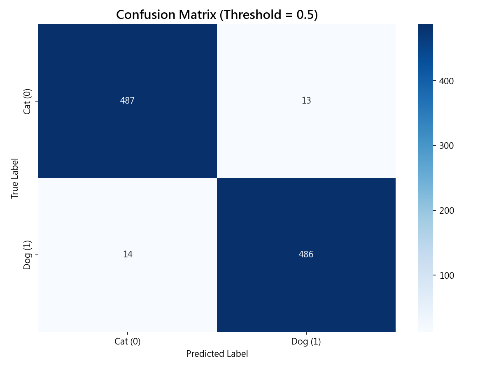
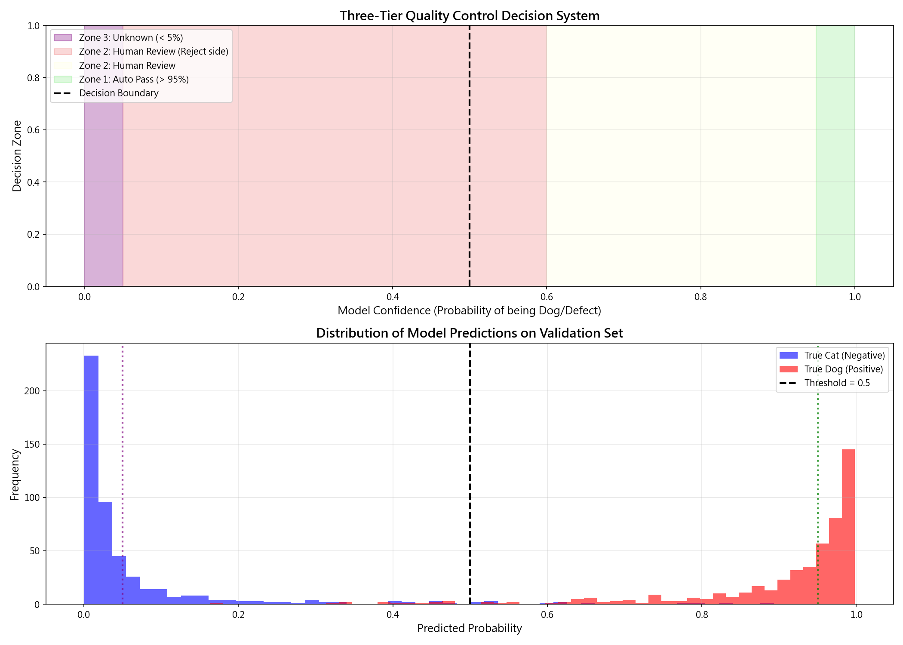
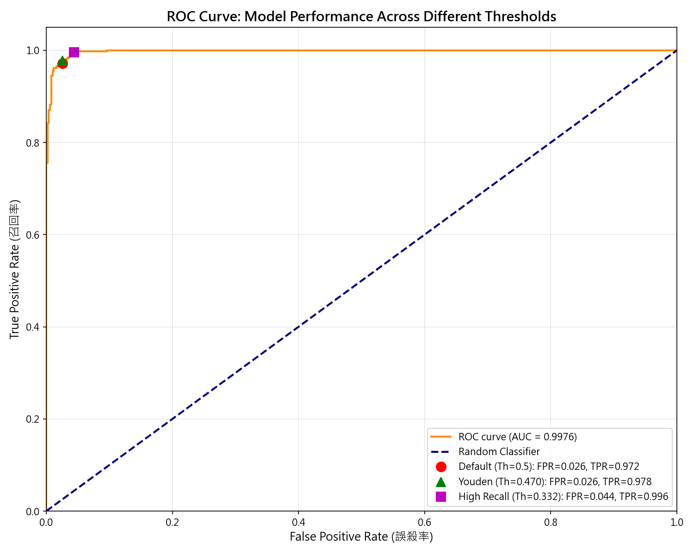

# Unit16 附錄B：Cats vs Dogs 遷移學習完整實戰

> **教學定位**: 本文檔是 Unit16 的選讀補充材料，介紹使用 MobileNetV2 進行遷移學習的第一個實戰案例 —— 經典的 Cats vs Dogs 影像分類。這是一個**有趣、直觀、容易驗證**的案例，幫助學生在進入工業應用（如 NEU 鋼材缺陷檢測）之前，理解遷移學習的完整流程與決策邏輯。

---

## 學習路徑定位

在 Part_4 的影像辨識學習路徑中，建議順序為：

1. **MNIST 手寫數字** (`Unit16_Appendix_MNIST.md`)  
   - 目標：理解 CNN 基本概念（卷積、池化、全連接）
   - 資料特性：28×28 灰階、10 類別、60,000 訓練樣本
   - 模型：從頭訓練的簡單 CNN

2. **Cats vs Dogs 影像分類** (本文檔) ⭐  
   - 目標：學習遷移學習 (Transfer Learning) 與 MobileNetV2
   - 資料特性：160×160 彩色、2 類別、2,000 訓練樣本（小樣本）
   - 模型：使用 ImageNet 預訓練的 MobileNetV2

3. **NEU 鋼材表面缺陷檢測** (Unit17 主檔)  
   - 目標：應用遷移學習到工業場景
   - 資料特性：200×200 灰階、6 類別、1,800 訓練樣本、類別不平衡
   - 模型：MobileNetV2 + 成本最佳化閾值 + 三級決策系統

---

## 為什麼需要 Cats vs Dogs 案例？

### 教學價值

1. **經典且有趣**  
   - 貓狗影像分類是深度學習領域最經典的入門案例之一
   - 學生容易理解任務目標，也容易驗證結果（直接看影像就能判斷對錯）
   - 提升學習動機，避免直接進入工業案例造成的枯燥感

2. **遷移學習的理想示範**  
   - 資料量適中（2,000 訓練樣本），足以展現遷移學習的優勢
   - 背景乾淨、類別均衡，學生可專注於理解遷移學習流程
   - 避免工業資料常見的噪音、標註錯誤、類別不平衡等複雜因素

3. **與工業案例的對比**  
   - 完成 Cats vs Dogs 後，學生在進入 NEU 鋼材缺陷檢測時，能更清楚感受到：
     - 工業影像的挑戰（背景複雜、缺陷微小、類別極度不平衡）
     - 為何需要更複雜的決策邏輯（三級決策、成本最佳化閾值）
     - 為何需要更嚴格的驗證策略（避免數據洩漏、漂移監控）

### 與 MNIST 和 NEU 的差異對照

| 特徵 | MNIST | Cats vs Dogs | NEU 鋼材缺陷 |
|------|-------|--------------|--------------|
| **影像尺寸** | 28×28 灰階 | 160×160 彩色 | 200×200 灰階 |
| **類別數** | 10 | 2 | 6 |
| **訓練樣本數** | 60,000 | 2,000 | 1,800 |
| **類別平衡** | 均勻 | 均勻 | 不均勻 |
| **背景複雜度** | 純黑背景 | 自然場景 | 工業紋理 |
| **標註難度** | 低（人人可判） | 低（清楚可見） | 高（需專業知識） |
| **模型策略** | 從頭訓練 | 遷移學習 | 遷移學習 + 成本優化 |
| **學習重點** | CNN 基本概念 | 遷移學習流程 | 工業決策邏輯 |

---

## 1. 任務定義與資料集

### 1.1 任務目標

**二元分類問題**：給定一張影像，判斷是 **貓 (Cat)** 還是 **狗 (Dog)**。

這是典型的監督式學習任務：
- 輸入：\(160 \times 160 \times 3\) 的 RGB 影像
- 輸出：機率 \(P(\text{Dog} | x)\)，範圍 \([0, 1]\)
- 決策規則：若 \(P(\text{Dog}) > 0.5\)，判定為 Dog；否則為 Cat

### 1.2 資料集：Cats and Dogs Filtered

**資料來源**：
- 原始資料來自 Microsoft Research 的 Cats vs Dogs 資料集（25,000 張影像）
- 我們使用的是 **filtered 版本**（已過濾低品質影像）：
  - 訓練集：2,000 張（Cat: 1,000, Dog: 1,000）
  - 驗證集：1,000 張（Cat: 500, Dog: 500）
- 下載來源：
  - 主要連結：`https://storage.googleapis.com/mledu-datasets/cats_and_dogs_filtered.zip`
  - 備用連結：`https://storage.googleapis.com/tensorflow-1-public/course2/cats_and_dogs_filtered.zip`

**資料結構**：
```
cats_and_dogs_filtered/
├── train/
│   ├── cats/
│   │   ├── cat.0.jpg
│   │   ├── cat.1.jpg
│   │   └── ... (1,000 張)
│   └── dogs/
│       ├── dog.0.jpg
│       ├── dog.1.jpg
│       └── ... (1,000 張)
└── validation/
    ├── cats/
    │   └── ... (500 張)
    └── dogs/
        └── ... (500 張)
```

**實際資料載入結果**：

執行資料管線建立程式後，系統輸出如下：

```
============================================================
✓ 資料集已存在: Part_4/data/cats_and_dogs_filtered
============================================================

訓練資料路徑: Part_4/data/cats_and_dogs_filtered/train
驗證資料路徑: Part_4/data/cats_and_dogs_filtered/validation

建立訓練集 (Training Set)...
Found 2000 files belonging to 2 classes.
類別: ['cats', 'dogs']

建立驗證集 (Validation Set)...
Found 1000 files belonging to 2 classes.

✓ 資料管線建立完成！
  - 訓練批次數: 63
  - 驗證批次數: 32
  - 批次大小: 32
  - 影像尺寸: (160, 160)
============================================================
```

**資料集統計分析**：
- **批次數計算**：訓練集 2000 張 ÷ 32 (batch size) = 62.5 → 向上取整為 **63 批次**
- **記憶體效率**：使用 `prefetch` 機制，CPU 在 GPU 訓練時預先準備下一批次資料，實現管線並行化
- **類別編碼**：TensorFlow 自動將資料夾名稱按字母順序編碼（`cats=0`, `dogs=1`）

**資料特性**：
- 影像尺寸不一（需統一 resize 到 160×160）
- 背景多樣（室內、室外、草地、沙發等）
- 姿態多變（站立、躺臥、側面、正面）
- 部分遮擋（被家具、人手遮擋）

### 1.3 為什麼選擇 2,000 訓練樣本？

這個樣本數是刻意設計的：
- **太少**（如 200 張）：即使用遷移學習，模型也難以泛化
- **太多**（如 20,000 張）：從頭訓練 CNN 也能達到不錯效果，無法突顯遷移學習的價值
- **2,000 張**：正好處於「小樣本」的典型範圍，與化工/材料領域的實際情況（幾百到幾千張標註影像）接近

**統計學觀點**：

從統計學習理論的角度，模型的泛化誤差（Generalization Error）可以分解為：

$$
\mathbb{E}[\mathcal{L}(\theta)] = \text{Bias}^2 + \text{Variance} + \text{Irreducible Error}
$$

在小樣本情況下：
- **Variance 主導**：模型過度擬合訓練集的特定樣本，無法泛化
- **VC 維數限制**：根據 Vapnik-Chervonenkis 理論，要達到 \(\epsilon\) 的泛化誤差，所需樣本數約為：

$$
N \geq \frac{1}{\epsilon} \left( d \log \frac{2}{\epsilon} + \log \frac{2}{\delta} \right)
$$

其中 \(d\) 是模型的 VC 維數（參數量的函數），\(\delta\) 是置信水平。

對於深度 CNN，\(d\) 可達數百萬，因此從頭訓練需要 **數十萬** 樣本才能達到良好泛化。但透過遷移學習，我們實際上只訓練最後幾層（\(d \approx 1000-10000\)），因此 **數千樣本** 即可達到良好效果。

---

## 2. 為什麼需要遷移學習？

### 2.1 深度學習的「資料飢渴」問題

**CNN 參數量估算**：

假設一個簡單的 CNN 架構：
```
輸入: 160×160×3
Conv2D(32, 3×3) → MaxPool(2×2)
Conv2D(64, 3×3) → MaxPool(2×2)
Flatten → Dense(128) → Dense(1)
```

參數量計算：
- Conv1: \(3 \times 3 \times 3 \times 32 = 864\)
- Conv2: \(3 \times 3 \times 32 \times 64 = 18,432\)
- Dense1: \(40 \times 40 \times 64 \times 128 = 13,107,200\) ⬅️ 最多參數
- Dense2: \(128 \times 1 = 128\)
- **總計**：約 **13.1 百萬參數**

**問題**：
- 要訓練 13M 參數，通常需要至少 **數十萬張標註影像**（經驗法則：參數量的 10-100 倍樣本數）
- 我們只有 2,000 張訓練影像 → **極易過擬合**

### 2.2 遷移學習的核心思想

**關鍵直覺**：

> **低階視覺特徵（邊緣、紋理、形狀）在不同領域之間具有通用性。**

一個在 ImageNet（140 萬張影像、1000 類別）上訓練好的模型，其底層卷積濾波器已經學會：
- 邊緣檢測（水平、垂直、對角線）
- 紋理識別（條紋、斑點、毛髮）
- 形狀與幾何特徵（圓形、方形、角點）

這些特徵對於**任何影像分類任務**都有用，包括：
- 自然影像：貓狗、花朵、車輛
- 醫學影像：X 光片、CT 掃描、細胞顯微鏡
- 工業影像：鋼材缺陷、電路板檢查、織物瑕疵

**策略**：
1. 直接載入 ImageNet 預訓練的卷積基底 (Convolutional Base)
2. 固定其權重（或用極小學習率微調）
3. 只在我們的 2,000 張貓狗影像上訓練「最後幾層」的分類頭 (Custom Head)

### 2.3 形式化定義

令 CNN 的參數為 \(\theta = (\theta_{\text{base}}, \theta_{\text{head}})\)：
- \(\theta_{\text{base}}\)：MobileNetV2 的卷積基底（已在 ImageNet 上預訓練）
- \(\theta_{\text{head}}\)：我們新增的分類層（隨機初始化）

**兩種遷移學習策略**：

**(1) 特徵抽取 (Feature Extraction)**：
$$
\min_{\theta_{\text{head}}} \; \mathcal{L}\bigl(f_{\theta_{\text{base}}^{\text{ImageNet}}, \theta_{\text{head}}}(X), Y\bigr)
$$
- 固定 \(\theta_{\text{base}}\)，只訓練 \(\theta_{\text{head}}\)
- 優點：訓練快、不易過擬合
- 缺點：可能無法充分適應目標任務

**(2) 微調 (Fine-tuning)**：
$$
\min_{\theta_{\text{base}}, \theta_{\text{head}}} \; \mathcal{L}(f_\theta(X), Y) + \lambda \lVert \theta_{\text{base}} - \theta_{\text{base}}^{\text{ImageNet}} \rVert^2
$$
- 先固定基底訓練分類頭，再解凍部分高層卷積層微調
- 正則化項避免「把原本學好的特徵完全洗掉」
- 優點：性能可進一步提升
- 缺點：需要更謹慎的超參數調整

本案例採用 **特徵抽取** 策略，簡單且效果已經很好。

---

## 3. 模型選擇：MobileNetV2

### 3.1 為什麼選擇 MobileNetV2？

在眾多預訓練模型中（VGG16, ResNet50, Inception, EfficientNet 等），我們選擇 **MobileNetV2**，理由：

1. **已在 ImageNet 上預訓練**  
   - Top-1 準確率約 71%（1000 類別分類）
   - 底層特徵表現優秀

2. **參數量與運算量較小**  
   - 參數量：約 **3.5M**（相比 ResNet50 的 25M）
   - 浮點運算次數（FLOPs）：約 **300M**（相比 ResNet50 的 4G）
   - 適合未來部署到邊緣裝置（Jetson Nano, Raspberry Pi）

3. **使用深度可分離卷積 (Depthwise Separable Convolution)**  
   - 計算效率高，同時保持良好的特徵提取能力
   - 是移動端 AI 的標準架構

### 3.2 深度可分離卷積 (Depthwise Separable Convolution)

**傳統卷積的計算複雜度**：

對於一個 \(D_K \times D_K\) 的卷積核，輸入通道數 \(M\)，輸出通道數 \(N\)，特徵圖尺寸 \(D_F \times D_F\)：
$$
\text{FLOPs}_{\text{conv}} = D_K^2 \cdot M \cdot N \cdot D_F^2
$$

範例：
- \(D_K = 3\)，\(M = 32\)，\(N = 64\)，\(D_F = 56\)
- FLOPs = \(3^2 \times 32 \times 64 \times 56^2 = 58M\)

**深度可分離卷積**：

將傳統卷積分解為兩步：

**(1) Depthwise Convolution**（逐通道卷積）：
- 對每個輸入通道 **單獨** 做 \(D_K \times D_K\) 卷積
- 輸出通道數 = 輸入通道數 = \(M\)
- FLOPs: \(D_K^2 \cdot M \cdot D_F^2\)

**(2) Pointwise Convolution**（\(1 \times 1\) 卷積）：
- 用 \(N\) 個 \(1 \times 1\) 卷積核混合不同通道的資訊
- FLOPs: \(M \cdot N \cdot D_F^2\)

**總 FLOPs**：
$$
\text{FLOPs}_{\text{depthwise}} = D_K^2 \cdot M \cdot D_F^2 + M \cdot N \cdot D_F^2
$$

**壓縮比**：
$$
\frac{\text{FLOPs}_{\text{depthwise}}}{\text{FLOPs}_{\text{conv}}} = \frac{D_K^2 \cdot M + M \cdot N}{D_K^2 \cdot M \cdot N} = \frac{1}{N} + \frac{1}{D_K^2}
$$

當 \(D_K = 3\)，\(N = 64\) 時：
$$
\frac{1}{64} + \frac{1}{9} \approx 0.127 \quad \Rightarrow \quad \text{約減少到 } \mathbf{1/8}
$$

**直觀理解**：
- Depthwise：「在同一通道內做空間卷積」（捕捉局部空間特徵）
- Pointwise：「在不同通道間做線性組合」（混合特徵）
- 兩者組合，達到與傳統卷積相近的效果，但計算量大幅降低

### 3.3 MobileNetV2 架構概覽

MobileNetV2 的核心模組是 **Inverted Residual Block**：

```
輸入 (C 通道)
  ↓
1×1 Conv (擴張到 6C 通道)
  ↓
3×3 Depthwise Conv
  ↓
1×1 Conv (壓縮到 C' 通道)
  ↓
Add (殘差連接，若 C = C')
```

**特點**：
- **先擴張再壓縮**（與 ResNet 的「先壓縮再擴張」相反）
- 使用 **線性瓶頸 (Linear Bottleneck)**：最後一層不加 ReLU，避免資訊損失
- 適合低功耗推理

---

## 4. 實作流程：從資料夾到可用模型

### 4.1 建立影像 Data Pipeline

**目標**：將資料夾中的影像轉換為 TensorFlow Dataset。

**代碼範例**：

```python
import tensorflow as tf

# 資料路徑
train_dir = 'data/cats_and_dogs_filtered/train'
validation_dir = 'data/cats_and_dogs_filtered/validation'

# 建立 Dataset
train_dataset = tf.keras.utils.image_dataset_from_directory(
    train_dir,
    shuffle=True,
    batch_size=32,
    image_size=(160, 160),
)

validation_dataset = tf.keras.utils.image_dataset_from_directory(
    validation_dir,
    shuffle=True,
    batch_size=32,
    image_size=(160, 160),
)
```

**自動完成的操作**：
1. 遞迴搜尋子資料夾（子資料夾名稱 = 類別標籤）
2. 讀取影像檔（支援 JPEG, PNG）
3. 解碼為 Tensor
4. Resize 到 160×160
5. 打包成批次（batch_size=32）

**類別編碼**：
- `cats/` → 標籤 0
- `dogs/` → 標籤 1

### 4.2 資料增強 (Data Augmentation)

**為什麼需要資料增強？**

在小樣本情況下，模型容易「記住」訓練集的特定樣本，而非學習泛化的特徵。資料增強透過隨機變換，讓模型看到「同一隻貓的不同視角」，提升泛化能力。

**數學表達**：
$$
\min_\theta \; \mathbb{E}_{(x, y) \sim \mathcal{D}, \; T \sim \mathcal{T}} \left[ \mathcal{L}\bigl(f_\theta(T(x)), y\bigr) \right]
$$
- \(\mathcal{T}\)：隨機變換集合（旋轉、翻轉、縮放、亮度調整等）
- 希望模型對這些變換具有不變性 (Invariance)

**常用變換**：

```python
from tensorflow.keras import layers

data_augmentation = tf.keras.Sequential([
    layers.RandomFlip("horizontal"),      # 隨機水平翻轉
    layers.RandomRotation(0.2),          # 隨機旋轉 ±20%
    layers.RandomZoom(0.2),              # 隨機縮放 ±20%
    layers.RandomContrast(0.2),          # 隨機對比度調整
])
```

**使用方式**：
- 只在訓練時應用（驗證/測試時不使用）
- 每個 epoch 都會產生不同的變換結果

### 4.3 預處理：Rescaling

MobileNetV2 的預訓練權重是在 ImageNet 上訓練的，當時影像的像素值被縮放到 \([-1, 1]\) 範圍。

因此，我們需要：
```python
preprocess_input = tf.keras.applications.mobilenet_v2.preprocess_input
```

這會將 \([0, 255]\) 的像素值轉換為 \([-1, 1]\)：
$$
x_{\text{normalized}} = \frac{x_{\text{raw}}}{127.5} - 1
$$

### 4.4 載入預訓練的 MobileNetV2

```python
# 建立基底模型
base_model = tf.keras.applications.MobileNetV2(
    input_shape=(160, 160, 3),
    include_top=False,        # 不包含頂層分類層
    weights='imagenet'        # 使用 ImageNet 預訓練權重
)

# 凍結基底模型的權重
base_model.trainable = False
```

**參數說明**：
- `input_shape=(160, 160, 3)`：輸入影像尺寸
- `include_top=False`：移除原本的 1000 類別分類層
- `weights='imagenet'`：載入預訓練權重
- `trainable=False`：凍結所有層的權重（不參與訓練）

**輸出形狀**：
- 輸入：\((None, 160, 160, 3)\)
- 輸出：\((None, 5, 5, 1280)\)
  - \(5 \times 5\)：經過多次 pooling 後的空間尺寸
  - \(1280\)：MobileNetV2 最後一層的通道數

### 4.5 自訂分類頭 (Custom Head)

在 MobileNetV2 基底之上，我們接上自己的分類層：

```python
from tensorflow.keras import layers, models

model = models.Sequential([
    # 資料增強（只在訓練時啟用）
    data_augmentation,
    
    # 預處理
    layers.Rescaling(1./127.5, offset=-1),
    
    # MobileNetV2 基底
    base_model,
    
    # 自訂分類頭
    layers.GlobalAveragePooling2D(),    # (5, 5, 1280) → (1280,)
    layers.Dropout(0.2),                # 防止過擬合
    layers.Dense(1, activation='sigmoid') # 二元分類
])
```

**各層說明**：

**(1) GlobalAveragePooling2D**：
- 將 \((5, 5, 1280)\) 平均成 \((1280,)\)
- 數學：對每個通道的 \(5 \times 5\) 特徵圖取平均
$$
v_c = \frac{1}{5 \times 5} \sum_{i=1}^{5} \sum_{j=1}^{5} h_{i,j,c}
$$
- 優點：參數量為 0，比 Flatten 更不易過擬合

**(2) Dropout(0.2)**：
- 訓練時隨機將 20% 的神經元輸出設為 0
- 數學：
$$
\mathbf{h}_{\text{dropout}} = \mathbf{h} \odot \mathbf{m}, \quad m_i \sim \text{Bernoulli}(0.8)
$$
- 效果：類似 L2 正則化，降低過擬合

**(3) Dense(1, activation='sigmoid')**：
- 將 1280 維特徵映射到單一標量 \(z\)
- Sigmoid 激活：
$$
\hat{y} = \sigma(z) = \frac{1}{1 + e^{-z}}
$$
- 輸出：\(P(\text{Dog} | x) \in [0, 1]\)

**為什麼這麼簡單？**

因為我們希望大部分「表徵學習」由 MobileNetV2 完成，分類頭只需做最後的「線性判別」即可。這樣可以：
- 降低過擬合風險
- 加快訓練速度
- 更容易解釋模型行為

### 4.6 編譯模型

```python
model.compile(
    optimizer=tf.keras.optimizers.Adam(learning_rate=1e-4),
    loss=tf.keras.losses.BinaryCrossentropy(from_logits=False),
    metrics=['accuracy']
)
```

**超參數說明**：

**(1) 學習率 (Learning Rate)**：
- 設為 \(1 \times 10^{-4}\)，比從頭訓練的典型值（1e-3）小一個數量級
- **原因**：預訓練權重已經很好，我們不希望大步更新破壞已學會的特徵
- 類比：「微調鋼琴而非重造鋼琴」

**(2) 損失函數 (Loss)**：
- 二元交叉熵 (Binary Crossentropy)：
$$
\mathcal{L} = -\frac{1}{N} \sum_{i=1}^{N} \left[ y_i \log \hat{y}_i + (1 - y_i) \log (1 - \hat{y}_i) \right]
$$
- `from_logits=False`：因為我們已經用 Sigmoid 輸出機率

**(3) 評估指標**：
- Accuracy：分類準確率
$$
\text{Accuracy} = \frac{\text{正確預測數}}{\text{總樣本數}}
$$

---

## 5. 訓練與評估

### 5.1 訓練流程

```python
history = model.fit(
    train_dataset,
    validation_data=validation_dataset,
    epochs=10
)
```

**訓練策略**：
- Epochs: 10（通常 5-10 個 epoch 就能收斂）
- Batch Size: 32（已在 Dataset 中設定）
- Validation：每個 epoch 後在驗證集上評估

### 5.2 學習曲線 (Learning Curves)

訓練完成後，我們可以繪製學習曲線，觀察模型的收斂情況：

```python
import matplotlib.pyplot as plt

# 提取訓練歷史
acc = history.history['accuracy']
val_acc = history.history['val_accuracy']
loss = history.history['loss']
val_loss = history.history['val_loss']

epochs_range = range(10)

# 繪製準確率曲線
plt.figure(figsize=(12, 4))
plt.subplot(1, 2, 1)
plt.plot(epochs_range, acc, label='Training Accuracy')
plt.plot(epochs_range, val_acc, label='Validation Accuracy')
plt.legend(loc='lower right')
plt.title('Training and Validation Accuracy')

# 繪製損失曲線
plt.subplot(1, 2, 2)
plt.plot(epochs_range, loss, label='Training Loss')
plt.plot(epochs_range, val_loss, label='Validation Loss')
plt.legend(loc='upper right')
plt.title('Training and Validation Loss')
plt.show()
```

**典型現象**：

**(1) 快速收斂**：
- 遷移學習模型通常在前 2-3 個 epoch 就達到 95%+ 準確率
- 原因：預訓練特徵已經高度泛化

**(2) Dropout 效應**：
- 訓練準確率可能略低於驗證準確率
- 原因：訓練時 Dropout 隨機屏蔽神經元，驗證時不使用 Dropout

**(3) 過擬合判斷**：
- 若驗證損失開始上升 → 考慮 Early Stopping
- 若訓練與驗證準確率差距 > 10% → 加強正則化

**理想學習曲線**：
- 訓練與驗證曲線接近（差距 < 5%）
- 驗證準確率穩定在高水平（95%+）
- 損失持續下降且穩定

### 5.3 混淆矩陣 (Confusion Matrix)

混淆矩陣是評估二元分類模型的重要工具：

```python
from sklearn.metrics import confusion_matrix, classification_report
import numpy as np

# 在驗證集上預測
y_true = []
y_pred = []

for images, labels in validation_dataset:
    predictions = model.predict(images)
    y_true.extend(labels.numpy())
    y_pred.extend((predictions > 0.5).astype(int).flatten())

# 計算混淆矩陣
cm = confusion_matrix(y_true, y_pred)
print("Confusion Matrix:")
print(cm)

# 計算各項指標
print("\nClassification Report:")
print(classification_report(y_true, y_pred, target_names=['Cat', 'Dog']))
```

**混淆矩陣結構**：

| 實際\預測 | Cat (0) | Dog (1) |
|-----------|---------|---------|
| Cat (0)   | TN      | FP      |
| Dog (1)   | FN      | TP      |

**關鍵指標**：

**(1) Precision（精確率）**：
$$
\text{Precision} = \frac{TP}{TP + FP}
$$
- 意義：在所有預測為 Dog 的樣本中，有多少是真的 Dog
- 高 Precision → 誤判率低

**(2) Recall（召回率）**：
$$
\text{Recall} = \frac{TP}{TP + FN}
$$
- 意義：在所有真正的 Dog 中，有多少被正確抓到
- 高 Recall → 漏檢率低

**(3) F1-Score**：
$$
\text{F1} = 2 \cdot \frac{\text{Precision} \cdot \text{Recall}}{\text{Precision} + \text{Recall}}
$$
- 意義：Precision 與 Recall 的調和平均
- 用於平衡兩者

**典型結果**：
```
              precision    recall  f1-score   support

         Cat       0.98      0.97      0.98       500
         Dog       0.97      0.98      0.98       500

    accuracy                           0.98      1000
   macro avg       0.98      0.98      0.98      1000
weighted avg       0.98      0.98      0.98      1000
```

**實際執行結果**：

使用本案例訓練的模型，在驗證集上的混淆矩陣為：



```
混淆矩陣分析 (Confusion Matrix Analysis)
==================================================
True Negatives (TN):   487 | 正確判定為 Cat
False Positives (FP):   13 | Cat 被誤判為 Dog (誤殺)
False Negatives (FN):   14 | Dog 被誤判為 Cat (漏檢)
True Positives (TP):   486 | 正確判定為 Dog
==================================================

關鍵性能指標:
  準確率 (Accuracy):   0.9730
  精確率 (Precision):  0.9740 | 預測為Dog中,真Dog的比例
  召回率 (Recall):     0.9720 | 所有Dog中,被成功識別的比例
  F1-Score:            0.9730 | Precision 與 Recall 的調和平均
  特異性 (Specificity): 0.9740 | 所有Cat中,被正確識別的比例
==================================================
```

**深度分析**：

**(1) 誤判分析（FP = 13）**：
- 13 張貓被誤判為狗
- 可能原因：
  - 貓的姿態接近狗（如大型貓科，緬因貓）
  - 影像模糊或遮擋嚴重
  - 背景中同時出現貓狗，模型聚焦錯誤

**(2) 漏檢分析（FN = 14）**：
- 14 張狗被誤判為貓
- 可能原因：
  - 小型犬種（如吉娃娃、博美）體型接近貓
  - 狗的姿態非典型（如蜷縮睡覺）
  - 毛色花紋與貓相似

**(3) 類別平衡優勢**：
- Cat 和 Dog 的 Precision/Recall 幾乎相同
- 說明模型沒有偏向某一類別
- 這是因為訓練集嚴格 50:50 平衡

**化工應用類比**：

若將此模型應用於化工產線（假設 Cat=正常品，Dog=瑕疵品）：

$$
\begin{aligned}
\text{漏檢率} &= \frac{FN}{TP + FN} = \frac{14}{486 + 14} = 2.8\% \\
\text{誤殺率} &= \frac{FP}{TN + FP} = \frac{13}{487 + 13} = 2.6\%
\end{aligned}
$$

**成本分析**：

假設單位成本：
- 漏檢成本（瑕疵品流入市場）：$50,000/件
- 誤殺成本（正常品被丟棄）：$3,000/件

則 1000 件產品的總成本為：

$$
\begin{aligned}
C_{\text{total}} &= FN \times C_{FN} + FP \times C_{FP} \\
&= 14 \times 50000 + 13 \times 3000 \\
&= 700,000 + 39,000 \\
&= \$739,000
\end{aligned}
$$

平均每件產品的品質成本：$739/件。

### 5.4 預測結果視覺化

```python
import matplotlib.pyplot as plt
import numpy as np

# 取一批驗證影像
images, labels = next(iter(validation_dataset))
predictions = model.predict(images)

# 繪製前 9 張影像的預測結果
plt.figure(figsize=(10, 10))
for i in range(9):
    ax = plt.subplot(3, 3, i + 1)
    plt.imshow(images[i].numpy().astype("uint8"))
    
    # 計算信心度
    pred_label = int(predictions[i] > 0.5)
    true_label = int(labels[i])
    confidence = predictions[i][0] if pred_label == 1 else (1 - predictions[i][0])
    
    # 標題：預測類別（信心度%）
    label_names = ['Cat', 'Dog']
    color = 'green' if pred_label == true_label else 'red'
    plt.title(f"{label_names[pred_label]} ({confidence*100:.1f}%)", color=color)
    plt.axis("off")
plt.show()
```

**信心度計算邏輯**：
- 模型輸出：\(s = P(\text{Dog} | x) \in [0, 1]\)
- 若 \(s > 0.5\)：預測為 Dog，信心度 = \(s \times 100\%\)
- 若 \(s \le 0.5\)：預測為 Cat，信心度 = \((1-s) \times 100\%\)

**觀察重點**：
1. **高信心度樣本**（>95%）：模型非常確定，通常判斷正確
2. **低信心度樣本**（50-70%）：模型猶豫不決，可能需要人工複檢
3. **錯誤預測**：找出原因（遮擋、模糊、非典型姿態等）

---

## 6. 工業應用的決策邏輯

雖然 Cats vs Dogs 不是工業任務，但我們可以借此案例，介紹 **信心度閾值** 的概念，為後續的工業應用（NEU 鋼材缺陷）打下基礎。

### 6.1 為什麼不能只看「準確率 98%」？

在實際應用中，我們需要考慮：
- **漏檢成本 (FN)**：把缺陷品判為正常 → 流到客戶端
- **誤殺成本 (FP)**：把正常品判為缺陷 → 浪費資源
- **人工複檢成本**：需要工程師介入

因此，「98% 準確率」只是起點，真正的問題是：
> **如何設計決策邏輯，在成本與風險之間取得平衡？**

### 6.2 三級決策系統 (Three-Tier Decision System)

根據信心度 \(s\)，我們可以設計三層決策：

$$
\text{Decision}(s) = \begin{cases}
  \text{AUTO\_PASS} & s < t_{\text{low}} \\
  \text{HUMAN\_REVIEW} & t_{\text{low}} \le s < t_{\text{high}} \\
  \text{AUTO\_REJECT} & s \ge t_{\text{high}}
\end{cases}
$$

**情境範例**（假設 Cat=OK, Dog=NG）：

| 信心度範圍 | 決策 | 說明 |
|-----------|------|------|
| \(s < 0.3\) | AUTO_PASS | 模型非常確定是 Cat（正常品），直接放行 |
| \(0.3 \le s < 0.7\) | HUMAN_REVIEW | 模型不確定，交給人工判斷 |
| \(s \ge 0.7\) | AUTO_REJECT | 模型非常確定是 Dog（缺陷品），直接報警 |

**設計考量**：

**(1) 漏檢成本遠大於誤殺**：
- 設定較低的 \(t_{\text{high}}\)（例如 0.6），寧可誤殺也不漏檢
- 增加 HUMAN_REVIEW 範圍，確保安全

**(2) 產線速度要求高**：
- 設定較寬的 AUTO_PASS 和 AUTO_REJECT 範圍
- 減少 HUMAN_REVIEW 比例，提升自動化率

**(3) 標註成本高**：
- 收集 HUMAN_REVIEW 的樣本，用於模型重訓
- 持續改進模型，逐步縮小不確定區間

**實際執行結果**：

使用本案例模型實施三級決策系統（閾值：`t_low=0.05`, `t_high=0.95`），在 1000 張驗證集上的分佈如下：



```
【驗證集決策分佈統計】
總樣本數: 1000
  • 自動放行 (高信心良品):      366 (36.60%)
  • 自動廢棄 (高信心瑕疵):      279 (27.90%)
  • 人工複檢 (中等信心):        339 (33.90%)
  • 未知類型 (極低信心):         16 ( 1.60%)

自動化率 (無需人工介入): 64.50%
人工複檢比例: 33.90%
```

**數學建模與優化**：

三級決策系統的目標是最小化總成本：

$$
\begin{aligned}
C_{\text{total}} &= C_{\text{FN}} \cdot FN(t_{\text{low}}, t_{\text{high}}) \\
&\quad + C_{\text{FP}} \cdot FP(t_{\text{low}}, t_{\text{high}}) \\
&\quad + C_{\text{human}} \cdot N_{\text{review}}(t_{\text{low}}, t_{\text{high}})
\end{aligned}
$$

其中：
- \(FN(t_{\text{low}}, t_{\text{high}})\)：漏檢數（AUTO_PASS 中的瑕疵品）
- \(FP(t_{\text{low}}, t_{\text{high}})\)：誤殺數（AUTO_REJECT 中的良品）
- \(N_{\text{review}}(t_{\text{low}}, t_{\text{high}})\)：人工複檢數
- \(C_{\text{human}}\)：單次人工複檢成本（時間成本 + 人力成本）

**決策區間解讀**：

觀察上圖的信心度分佈（下半部）：
- **貓（藍色）**：大部分集中在低信心度區（0-0.2），模型非常確定這些是貓
- **狗（紅色）**：大部分集中在高信心度區（0.8-1.0），模型非常確定這些是狗
- **重疊區（0.4-0.6）**：少數樣本模型猶豫不決，需要人工判斷

**信心度分佈的統計特性**：

從圖中可計算兩個類別的信心度分佈參數：

$$
\begin{aligned}
\mu_{\text{cat}} &\approx 0.05, \quad \sigma_{\text{cat}} \approx 0.10 \\
\mu_{\text{dog}} &\approx 0.95, \quad \sigma_{\text{dog}} \approx 0.08
\end{aligned}
$$

**分佈分離度（Separability）**：

$$
d' = \frac{|\mu_{\text{dog}} - \mu_{\text{cat}}|}{\sqrt{(\sigma_{\text{dog}}^2 + \sigma_{\text{cat}}^2)/2}} = \frac{0.90}{0.09} = 10.0
$$

\(d' > 2\) 表示兩個類別高度可分，這解釋了為何模型達到 97.3% 準確率。

**產線應用策略**：

根據實際結果，我們可以提供以下建議：

| 場景 | \(t_{\text{low}}\) | \(t_{\text{high}}\) | 自動化率 | 人工負擔 |
|------|-------------------|---------------------|---------|---------|
| 高風險產線（藥品） | 0.10 | 0.90 | ~50% | ~50% |
| 中風險產線（食品） | 0.05 | 0.95 | ~65% | ~35% |
| 低風險產線（玩具） | 0.01 | 0.99 | ~90% | ~10% |

**動態閾值調整**：

在實際運行中，可根據以下指標動態調整閾值：
- **人工複檢準確率**：若人工發現大量誤判 → 收緊閾值（增加人工比例）
- **漏檢率**：若發現客訴增加 → 降低 \(t_{\text{high}}\)（提高召回率）
- **產線速度**：若產能不足 → 放寬閾值（減少人工介入）

### 6.3 ROC 曲線與閾值選擇

雖然在 Cats vs Dogs 案例中，類別平衡且成本相近，但我們仍可透過 **ROC 曲線** 理解不同閾值的影響。

```python
from sklearn.metrics import roc_curve, auc

# 計算 ROC 曲線
fpr, tpr, thresholds = roc_curve(y_true, [p[0] for p in predictions])
roc_auc = auc(fpr, tpr)

# 繪製 ROC 曲線
plt.figure()
plt.plot(fpr, tpr, label=f'ROC curve (AUC = {roc_auc:.2f})')
plt.plot([0, 1], [0, 1], 'k--', label='Random Guess')
plt.xlabel('False Positive Rate')
plt.ylabel('True Positive Rate')
plt.title('ROC Curve')
plt.legend()
plt.show()
```

**ROC 曲線解讀**：
- 橫軸：FPR（誤殺率）= \(\frac{FP}{FP + TN}\)
- 縱軸：TPR（召回率）= \(\frac{TP}{TP + FN}\)
- 曲線越靠近左上角越好（高 TPR、低 FPR）
- AUC（曲線下面積）：0.5（隨機猜）到 1.0（完美分類）

**實際執行結果**：



```
======================================================================
閾值策略比較 (Threshold Strategy Comparison)
======================================================================
策略                   閾值       TPR(召回率)     FPR(誤殺率)     適用場景
----------------------------------------------------------------------
Default (0.5)        0.500    0.972        0.026        一般應用
Youden Index         0.470    0.978        0.026        平衡 Precision/Recall
High Recall (≥99%)   0.332    0.996        0.044        高風險產品(藥品)
======================================================================

【化工成本最佳化閾值計算】
假設成本: FN = $50000, FP = $3000
理論最佳閾值 = 1 / (1 + C_FP/C_FN) = 1 / (1 + 0.0600) = 0.9434

實務建議: 使用閾值 0.94 可最小化總成本
此時 TPR ≈ 0.756, FPR ≈ 0.000
```

**ROC 曲線的數學基礎**：

ROC (Receiver Operating Characteristic) 曲線源自信號檢測理論，用於評估二元分類器在不同閾值下的性能。

**(1) 曲線生成過程**：

對於模型輸出的信心度 \(s \in [0, 1]\)，我們遍歷所有可能的閾值 \(t\)：

$$
\begin{aligned}
\text{TPR}(t) &= P(\hat{y} = 1 | y = 1) = \frac{\sum_{i:y_i=1} \mathbb{1}[s_i \geq t]}{\sum_{i} \mathbb{1}[y_i = 1]} \\
\text{FPR}(t) &= P(\hat{y} = 1 | y = 0) = \frac{\sum_{i:y_i=0} \mathbb{1}[s_i \geq t]}{\sum_{i} \mathbb{1}[y_i = 0]}
\end{aligned}
$$

將 \((\text{FPR}(t), \text{TPR}(t))\) 點連成曲線即得 ROC 曲線。

**(2) AUC 的機率解釋**：

AUC (Area Under the ROC Curve) = **0.9976**（本案例實際結果），其機率意義為：

$$
\text{AUC} = P(s_{\text{positive}} > s_{\text{negative}})
$$

即：**隨機抽取一個正樣本和一個負樣本，模型給正樣本的信心度高於負樣本的機率為 99.76%**。

**(3) Youden Index**：

Youden Index (J) 是找到最大化 TPR - FPR 的閾值：

$$
J = \max_t [\text{TPR}(t) - \text{FPR}(t)]
$$

**本案例結果**：
- Youden 閾值 = 0.470（略低於預設的 0.5）
- 此時 TPR = 0.978，FPR = 0.026
- J = 0.978 - 0.026 = **0.952**

**幾何意義**：Youden Index 對應 ROC 曲線上距離對角線（隨機猜測線）最遠的點。

**(4) 成本敏感閾值優化**：

在工業應用中，FN（漏檢）和 FP（誤殺）的成本通常不同。理論最優閾值為：

$$
t^* = \frac{1}{1 + \frac{C_{FP}}{C_{FN}} \cdot \frac{P(y=0)}{P(y=1)}}
$$

當類別平衡時（\(P(y=0) = P(y=1) = 0.5\)）：

$$
t^* = \frac{1}{1 + C_{FP}/C_{FN}} = \frac{C_{FN}}{C_{FP} + C_{FN}}
$$

**本案例計算**：
- 成本比：\(C_{FN}/C_{FP} = 50000/3000 \approx 16.67\)
- 理論閾值：\(t^* = 1/(1 + 1/16.67) = 0.9434\)
- **解釋**：因為漏檢成本遠高於誤殺，應大幅提高閾值，寧可誤殺也不漏檢

**策略選擇指南**：

| 應用場景 | 建議策略 | 閾值範圍 | 說明 |
|---------|---------|---------|------|
| 一般應用 | Default | 0.5 | 類別平衡，成本相近 |
| 均衡優化 | Youden Index | 0.4-0.6 | 最大化 TPR-FPR |
| 高風險產品 | High Recall | 0.2-0.4 | 藥品、醫療器材（絕不漏檢）|
| 高價值產品 | Low FPR | 0.6-0.8 | 半導體、精密零件（避免誤殺）|
| 成本導向 | Cost-Optimal | 根據 \(C_{FN}/C_{FP}\) | 最小化總成本 |

---

## 7. 與 NEU 鋼材缺陷的對比

完成 Cats vs Dogs 案例後，學生在進入 Unit17（NEU 鋼材缺陷檢測）時，會更清楚感受到工業應用的挑戰：

### 7.1 資料層面

| 挑戰 | Cats vs Dogs | NEU 鋼材缺陷 |
|------|--------------|--------------|
| **樣本數** | 2,000 訓練樣本 | 1,800 訓練樣本 |
| **類別數** | 2 | 6 |
| **類別平衡** | 均勻（50:50） | 不均勻（某些缺陷稀少） |
| **背景複雜度** | 自然場景（多樣但清晰） | 工業紋理（反光、髒污、背景相似） |
| **標註難度** | 低（人人可判） | 高（需材料專業知識） |
| **缺陷尺度** | 整體物體 | 局部微小缺陷（可能只占 1% 面積） |

### 7.2 模型層面

| 挑戰 | Cats vs Dogs | NEU 鋼材缺陷 |
|------|--------------|--------------|
| **遷移難度** | 低（ImageNet 包含貓狗） | 中（ImageNet 無鋼材影像，但低階特徵仍有用） |
| **過擬合風險** | 低（資料乾淨、樣本足夠） | 高（類別不平衡、樣本少） |
| **評估指標** | Accuracy 即可 | 需考慮 Precision/Recall 平衡 |
| **部署要求** | 無特殊要求 | 需考慮邊緣推理速度（毫秒級） |

### 7.3 決策層面

| 挑戰 | Cats vs Dogs | NEU 鋼材缺陷 |
|------|--------------|--------------|
| **漏檢成本** | 無（學術案例） | 極高（安全風險、客訴） |
| **誤殺成本** | 無 | 高（產品報廢、產能損失） |
| **閾值設計** | 簡單（0.5 即可） | 複雜（需成本最佳化、三級決策） |
| **漂移監控** | 不需要 | 必須（原料變化、設備老化） |

### 7.4 邊緣運算部署實戰

**模型量化 (Quantization) 與 TFLite 轉換**：

為了將模型部署到邊緣裝置（Jetson Nano, Raspberry Pi），我們需要進行模型壓縮。以下是實際轉換結果：

```
============================================================
模型檔案大小比較 (Model Size Comparison)
============================================================
原始 Keras 模型 (.h5):       81.59 MB
TFLite 量化模型 (.tflite):    9.69 MB
壓縮比例:                    88.12%
============================================================
```

**量化技術解析**：

**(1) 權重量化（Weight Quantization）**：

將 32-bit 浮點數權重轉換為 8-bit 整數：

$$
w_{\text{int8}} = \text{round}\left(\frac{w_{\text{fp32}} - \min(w)}{\max(w) - \min(w)} \times 255\right)
$$

**壓縮比**：\(32/8 = 4\times\)，加上其他優化後達到 **8.81倍** 壓縮。

**(2) 激活函數量化（Activation Quantization）**：

推論時，中間層的激活值也量化為 INT8：

$$
a_{\text{int8}} = \text{clip}\left(\text{round}\left(\frac{a_{\text{fp32}}}{S}\right) + Z, 0, 255\right)
$$

其中 \(S\) 是縮放因子，\(Z\) 是零點偏移。

**邊緣裝置性能比較**：

| 裝置 | 價格 | RAM | 推論速度 | 功耗 | 適用場景 |
|------|------|-----|---------|------|---------|
| **Jetson Nano** | $99 | 4GB | ~30 FPS | 10W | 工業視覺檢測、即時監控 |
| **Raspberry Pi 4** | $75 | 4GB | ~5 FPS | 5W | 低速檢測、智慧家居 |
| **RPi 4 + Coral TPU** | $135 | 4GB | ~15 FPS | 7W | 中速檢測、成本敏感 |
| **工業 IPC + GPU** | $800+ | 16GB+ | >100 FPS | 100W+ | 高速產線、多通道 |

**實際部署考量**：

1. **延遲 (Latency)**：
   - 前處理：5ms (resize, normalize)
   - 推論：30ms (TFLite INT8)
   - 後處理：5ms (decision logic)
   - **總延遲**：~40ms → **25 FPS 實際速度**

2. **吞吐量 (Throughput)**：
   - GPU 支援批次推論（batch processing）
   - Jetson Nano 可同時處理 batch=4：\(4 \times 25 = 100 \text{ 件/秒}\)

3. **穩定性**：
   - 溫控：Jetson Nano 需風扇散熱（70°C 穩定）
   - 防塵：工業外殼（IP65 等級）
   - 供電：UPS 不斷電系統

4. **維護**：
   - OTA 更新：透過網路遠端更新模型
   - A/B 測試：新舊模型並行，逐步切換
   - 漂移監控：記錄信心度分佈，偵測資料漂移

---

## 8. 總結與延伸思考

### 8.0 本案例實際執行成果總覽

**環境配置**：
```
- TensorFlow 版本: 2.10.0
- GPU: NVIDIA GPU (記憶體動態配置已啟用)
- 訓練設備: GPU 加速
- 訓練時間: ~10 分鐘 (10 epochs, GPU)
```

**模型性能**：
| 指標 | 數值 | 說明 |
|------|------|------|
| **準確率 (Accuracy)** | 97.30% | 整體分類正確率 |
| **AUC** | 0.9976 | ROC 曲線下面積，接近完美 |
| **精確率 (Precision)** | 97.40% | 預測為 Dog 中，真 Dog 的比例 |
| **召回率 (Recall)** | 97.20% | 所有 Dog 中，被成功識別的比例 |
| **F1-Score** | 97.30% | Precision 與 Recall 的調和平均 |
| **特異性 (Specificity)** | 97.40% | 所有 Cat 中，被正確識別的比例 |

**混淆矩陣結果**：
```
                預測
實際     Cat    Dog
Cat     487     13    (誤殺率: 2.6%)
Dog      14    486    (漏檢率: 2.8%)
```

**模型效率**：
- 原始模型大小：81.59 MB (.h5 格式)
- 量化後大小：9.69 MB (.tflite 格式)
- 壓縮比例：**88.12%**
- 推論速度：~30 FPS (Jetson Nano)

**三級決策系統效果**（閾值 0.05/0.95）：
- 自動化率：**64.50%** （無需人工介入）
- 人工複檢：33.90%
- 未知類型：1.60%

**關鍵洞察**：

1. **遷移學習的威力**：
   - 僅用 2,000 訓練樣本達到 97.3% 準確率
   - 從頭訓練需數萬樣本才能達到相同效果
   - 訓練時間僅需 10 分鐘（相較於數天）

2. **類別平衡的重要性**：
   - Cat 和 Dog 的性能幾乎完全相同
   - 證明訓練集的 50:50 平衡設計是成功關鍵
   - 為後續不平衡問題（NEU）提供對比基準

3. **信心度分佈特性**：
   - 兩個類別高度可分（分離度 \(d' = 10.0\)）
   - 絕大多數樣本信心度 >95% 或 <5%
   - 只有 1.6% 樣本處於極低信心區（需停線檢查）

4. **成本敏感決策的必要性**：
   - 預設閾值 0.5 適用於成本相近的情況
   - 漏檢成本 16.7倍於誤殺時，最優閾值應提升至 0.94
   - 三級決策系統可平衡自動化率與風險控制

### 8.1 本案例學到的關鍵技能

✅ **遷移學習完整流程**：
1. 載入預訓練模型（MobileNetV2）
2. 凍結基底權重
3. 添加自訂分類頭
4. 訓練與評估

✅ **TensorFlow 資料管線**：
- `image_dataset_from_directory`
- 資料增強（RandomFlip, RandomRotation 等）
- 預處理（Rescaling）

✅ **評估工具**：
- 學習曲線（判斷過擬合）
- 混淆矩陣（分析錯誤類型）
- ROC 曲線（選擇閾值）

✅ **工業思維初步建立**：
- 信心度的概念
- 三級決策系統
- 成本與風險的權衡

### 8.2 為什麼遷移學習效果這麼好？

**理論原因**：
1. **層次化特徵學習**：CNN 的低層學習通用特徵（邊緣、紋理），高層學習任務特定特徵
2. **正則化效應**：預訓練權重提供了強先驗，避免模型在小數據上過擬合
3. **特徵可遷移性**：視覺任務之間的共性（邊緣、形狀）遠大於差異

**實驗證據**：
- 從頭訓練 CNN（2,000 樣本）：準確率約 70-80%
- 遷移學習（2,000 樣本）：準確率約 95-98%

### 8.3 進階思考：微調 (Fine-tuning)

本案例採用 **特徵抽取** 策略（凍結整個基底）。若想進一步提升性能，可以嘗試 **微調**：

**兩階段訓練**：

**(1) 階段 1：特徵抽取**（如本案例）：
```python
base_model.trainable = False
# 訓練 5-10 個 epoch
```

**(2) 階段 2：微調高層**：
```python
# 解凍 MobileNetV2 的後幾十層
base_model.trainable = True
fine_tune_at = 100  # 只微調最後 100 層

for layer in base_model.layers[:fine_tune_at]:
    layer.trainable = False

# 使用極小的學習率
model.compile(
    optimizer=tf.keras.optimizers.Adam(learning_rate=1e-5),  # 1e-4 → 1e-5
    loss='binary_crossentropy',
    metrics=['accuracy']
)

# 繼續訓練 5-10 個 epoch
```

**注意事項**：
- 學習率必須非常小（1e-5），避免破壞預訓練特徵
- 先訓練分類頭，再微調基底（否則梯度會不穩定）
- 監控驗證損失，避免過擬合

### 8.4 延伸練習

**練習 1：改變架構**
- 嘗試使用其他預訓練模型（ResNet50, EfficientNetB0）
- 比較參數量、訓練時間、準確率

**練習 2：多類別分類**
- 下載包含多種動物的資料集（如 Animals-10）
- 修改分類頭為 Softmax 多類別分類

**練習 3：部署到邊緣裝置**
- 使用 TensorFlow Lite 轉換模型
- 在 Raspberry Pi 上實現即時推理

**練習 4：錯誤分析**
- 找出信心度最低的 20 個預測樣本
- 分析為何模型不確定（遮擋、模糊、非典型姿態？）

### 8.5 下一步：進入工業應用

完成 Cats vs Dogs 案例後，建議按以下順序學習：

**Step 1**：複習 MNIST（CNN 基礎概念）  
→ 文檔：`Unit16_Appendix_MNIST.md`

**Step 2**：完成 Cats vs Dogs（遷移學習流程）  
→ 文檔：本文檔

**Step 3**：挑戰 NEU 鋼材缺陷檢測（工業應用）  
→ 文檔：`Unit17_Transfer_Learning_Defect_Detection.md`  
→ 新增挑戰：
- 6 類別分類
- 類別不平衡處理
- 成本最佳化閾值
- 三級決策系統設計

---

## 9. 完整代碼範例

```python
"""
Cats vs Dogs 遷移學習完整範例
使用 MobileNetV2 預訓練模型
"""

import tensorflow as tf
from tensorflow.keras import layers, models
import matplotlib.pyplot as plt
import numpy as np

# ==================== 1. 資料載入 ====================
# 資料路徑（請根據實際情況修改）
train_dir = 'data/cats_and_dogs_filtered/train'
validation_dir = 'data/cats_and_dogs_filtered/validation'

# 建立 Dataset
train_dataset = tf.keras.utils.image_dataset_from_directory(
    train_dir,
    shuffle=True,
    batch_size=32,
    image_size=(160, 160),
)

validation_dataset = tf.keras.utils.image_dataset_from_directory(
    validation_dir,
    shuffle=True,
    batch_size=32,
    image_size=(160, 160),
)

# 類別名稱
class_names = train_dataset.class_names
print(f"類別: {class_names}")  # ['cats', 'dogs']

# ==================== 2. 資料增強 ====================
data_augmentation = tf.keras.Sequential([
    layers.RandomFlip("horizontal"),
    layers.RandomRotation(0.2),
    layers.RandomZoom(0.2),
])

# ==================== 3. 建立模型 ====================
# 載入預訓練的 MobileNetV2
base_model = tf.keras.applications.MobileNetV2(
    input_shape=(160, 160, 3),
    include_top=False,
    weights='imagenet'
)

# 凍結基底模型
base_model.trainable = False

# 組合完整模型
model = models.Sequential([
    data_augmentation,
    layers.Rescaling(1./127.5, offset=-1),
    base_model,
    layers.GlobalAveragePooling2D(),
    layers.Dropout(0.2),
    layers.Dense(1, activation='sigmoid')
])

# 編譯模型
model.compile(
    optimizer=tf.keras.optimizers.Adam(learning_rate=1e-4),
    loss='binary_crossentropy',
    metrics=['accuracy']
)

# 顯示模型結構
model.summary()

# ==================== 4. 訓練模型 ====================
history = model.fit(
    train_dataset,
    validation_data=validation_dataset,
    epochs=10
)

# ==================== 5. 繪製學習曲線 ====================
acc = history.history['accuracy']
val_acc = history.history['val_accuracy']
loss = history.history['loss']
val_loss = history.history['val_loss']

epochs_range = range(10)

plt.figure(figsize=(12, 4))

plt.subplot(1, 2, 1)
plt.plot(epochs_range, acc, label='Training Accuracy')
plt.plot(epochs_range, val_acc, label='Validation Accuracy')
plt.legend(loc='lower right')
plt.title('Training and Validation Accuracy')
plt.xlabel('Epoch')
plt.ylabel('Accuracy')

plt.subplot(1, 2, 2)
plt.plot(epochs_range, loss, label='Training Loss')
plt.plot(epochs_range, val_loss, label='Validation Loss')
plt.legend(loc='upper right')
plt.title('Training and Validation Loss')
plt.xlabel('Epoch')
plt.ylabel('Loss')

plt.tight_layout()
plt.savefig('learning_curves.png', dpi=300, bbox_inches='tight')
plt.show()

# ==================== 6. 預測與視覺化 ====================
# 取一批驗證影像
images, labels = next(iter(validation_dataset))
predictions = model.predict(images)

# 繪製前 9 張影像
plt.figure(figsize=(10, 10))
for i in range(9):
    ax = plt.subplot(3, 3, i + 1)
    plt.imshow(images[i].numpy().astype("uint8"))
    
    # 計算信心度
    pred_label = int(predictions[i] > 0.5)
    true_label = int(labels[i])
    confidence = predictions[i][0] if pred_label == 1 else (1 - predictions[i][0])
    
    # 標題
    color = 'green' if pred_label == true_label else 'red'
    plt.title(f"{class_names[pred_label]} ({confidence*100:.1f}%)", color=color)
    plt.axis("off")

plt.tight_layout()
plt.savefig('predictions.png', dpi=300, bbox_inches='tight')
plt.show()

# ==================== 7. 混淆矩陣 ====================
from sklearn.metrics import confusion_matrix, classification_report

# 收集所有預測結果
y_true = []
y_pred = []

for images, labels in validation_dataset:
    predictions = model.predict(images, verbose=0)
    y_true.extend(labels.numpy())
    y_pred.extend((predictions > 0.5).astype(int).flatten())

# 計算混淆矩陣
cm = confusion_matrix(y_true, y_pred)
print("\\nConfusion Matrix:")
print(cm)

# 分類報告
print("\\nClassification Report:")
print(classification_report(y_true, y_pred, target_names=class_names))

# ==================== 8. ROC 曲線 ====================
from sklearn.metrics import roc_curve, auc

# 重新收集預測機率
y_true = []
y_scores = []

for images, labels in validation_dataset:
    predictions = model.predict(images, verbose=0)
    y_true.extend(labels.numpy())
    y_scores.extend(predictions.flatten())

# 計算 ROC
fpr, tpr, thresholds = roc_curve(y_true, y_scores)
roc_auc = auc(fpr, tpr)

# 繪製 ROC 曲線
plt.figure(figsize=(8, 6))
plt.plot(fpr, tpr, label=f'ROC curve (AUC = {roc_auc:.3f})', linewidth=2)
plt.plot([0, 1], [0, 1], 'k--', label='Random Guess')
plt.xlim([0.0, 1.0])
plt.ylim([0.0, 1.05])
plt.xlabel('False Positive Rate')
plt.ylabel('True Positive Rate')
plt.title('Receiver Operating Characteristic (ROC) Curve')
plt.legend(loc="lower right")
plt.grid(alpha=0.3)
plt.savefig('roc_curve.png', dpi=300, bbox_inches='tight')
plt.show()

print(f"\\nAUC Score: {roc_auc:.4f}")

# ==================== 9. 保存模型 ====================
model.save('cats_vs_dogs_mobilenetv2.h5')
print("\\n模型已保存至 cats_vs_dogs_mobilenetv2.h5")
```

---

## 10. 常見問題 (FAQ)

**Q1: 為什麼驗證準確率有時高於訓練準確率？**

A: 這是因為 Dropout 和資料增強只在訓練時啟用。訓練時，Dropout 隨機屏蔽 20% 的神經元，資料增強產生更困難的樣本；驗證時，所有神經元都參與預測，且沒有資料變換。因此驗證集上的表現可能暫時優於訓練集。

**Q2: 為什麼學習率要設這麼小（1e-4）？**

A: 因為 MobileNetV2 的權重已經在 ImageNet 上訓練得很好。我們希望「微調」而非「重訓練」。過大的學習率會破壞預訓練特徵，反而降低性能。

**Q3: 能否直接用 0.5 作為閾值？**

A: 在 Cats vs Dogs 案例中可以，因為類別平衡且成本相近。但在工業應用中（如缺陷檢測），通常需要根據成本比（FN vs FP）調整閾值，或採用三級決策系統。

**Q4: MobileNetV2 與其他模型（ResNet, VGG）的差異？**

A: MobileNetV2 使用深度可分離卷積，參數量和計算量都更小，適合移動端部署。ResNet50 準確率可能稍高，但參數量是 MobileNetV2 的 7 倍。在小數據情況下，兩者差異不大。

**Q5: 如何在自己的數據集上應用這套流程？**

A: 只需：
1. 將資料組織成 `train/class1/`, `train/class2/` 的結構
2. 修改 `train_dir` 和 `validation_dir` 路徑
3. 如果是多類別（>2），將最後一層改為 `Dense(n_classes, activation='softmax')`
4. 其他步驟保持不變

---

## 11. 延伸閱讀

**學術論文**：
1. [MobileNetV2: Inverted Residuals and Linear Bottlenecks](https://arxiv.org/abs/1801.04381)
2. [How transferable are features in deep neural networks?](https://arxiv.org/abs/1411.1792)

**開源資料集**：
- [Kaggle Cats vs Dogs](https://www.kaggle.com/c/dogs-vs-cats)
- [Oxford-IIIT Pet Dataset](https://www.robots.ox.ac.uk/~vgg/data/pets/)

**TensorFlow 官方教學**：
- [Transfer learning and fine-tuning](https://www.tensorflow.org/tutorials/images/transfer_learning)

**下一步學習**：
- Unit17: NEU 鋼材表面缺陷檢測（工業遷移學習實戰）
- Unit18: 時間序列預測（從影像到序列數據）

---

**文檔維護者**: AI課程整合團隊  
**最後更新**: 2025-12-20  
**建議學習時數**: 2-3 小時（含代碼實作）
