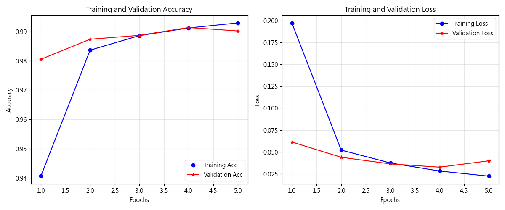
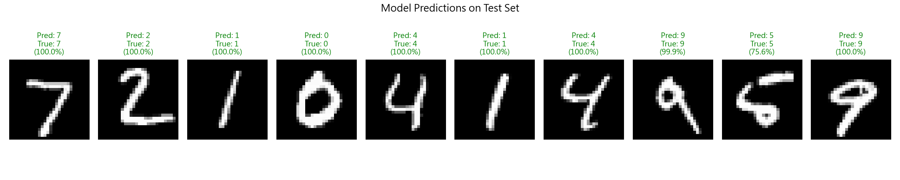
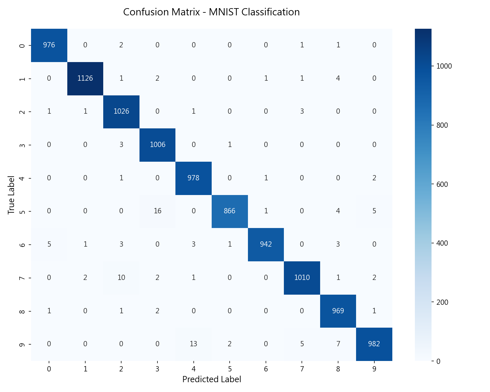

# Unit16 附錄：MNIST 手寫數字辨識基礎教學

> 本文檔為 Unit16 的選讀補充，提供 CNN 基礎概念的完整教學。
> 主檔 `Unit16_CNN_Basics_Industrial_Inspection.md` 聚焦於工業影像檢測實務。

---

## 為什麼要學 MNIST？

MNIST (Modified National Institute of Standards and Technology) 手寫數字數據集是深度學習的「Hello World」：
- **資料清晰**：28×28 灰階影像，數字居中對齊
- **任務明確**：10 類分類（0-9）
- **快速驗證**：幾分鐘內完成訓練，適合教學演示

**與工業影像的關聯**：
- CNN 架構設計原理（卷積→池化→全連接）
- 過擬合診斷方法（Learning Curves, Dropout）
- 混淆矩陣分析技巧（找出模型弱點）

---

## 1. CNN 數學原理詳解

### 1.1 卷積層 (Convolutional Layer)

卷積運算透過可學習的濾波器 (Kernel/Filter) 在影像上滑動，提取局部特徵。

**數學定義**：
假設輸入影像為 $I$ ，濾波器為 $K$ （通常 3×3 或 5×5），則二維卷積為：

$$
S(i, j) = (I * K)(i, j) = \sum_m \sum_n I(i+m, j+n) \cdot K(m, n)
$$


**關鍵特性**：

1. **平移不變性 (Translation Invariance)**  
   數字在影像中移動，CNN 仍能正確辨識（不像全連接層對位置敏感）

2. **參數共享 (Parameter Sharing)**  
   同一個濾波器掃描整張影像，參數量遠小於全連接層  
   例如：28×28 影像用 3×3 濾波器，僅需 9 個參數（vs 全連接需 784×隱藏層數）

3. **局部連接 (Local Connectivity)**  
   每個神經元只看一小塊影像區域（感受野 Receptive Field）

**化工類比：濾波器像「化學濾紙」**

| 濾波器類型 | 化學實驗類比 | 檢測特徵 |
|-----------|-------------|---------|
| **邊緣檢測** | 微分器（檢測濃度梯度） | 裂紋邊界、輪廓線 |
| **平滑濾波** | 低通濾波器（去除雜訊） | 消除顆粒感、保留主結構 |
| **紋理檢測** | 週期性圖案分析 | 金屬軋製紋路、編織布料 |

**常見濾波器範例**：

Sobel 邊緣檢測濾波器（手工設計，CNN 會自動學習類似功能）：

$$
K_x = \begin{bmatrix}
-1 & 0 & 1 \\
-2 & 0 & 2 \\
-1 & 0 & 1
\end{bmatrix}, \quad
K_y = \begin{bmatrix}
-1 & -2 & -1 \\
0 & 0 & 0 \\
1 & 2 & 1
\end{bmatrix}
$$


### 1.2 池化層 (Pooling Layer)

池化層用於降低特徵圖維度，減少運算量並提升平移不變性。

**最大池化 (Max Pooling)**：

$$
y_{i,j} = \max_{(p,q) \in \mathcal{R}_{i,j}} x_{p,q}
$$


其中 $\mathcal{R}_{i,j}$ 為 2×2 池化視窗覆蓋的區域。

**生物學啟發**：
- 模擬視覺皮層的「側抑制」機制
- 只保留最強烈的特徵訊號（類似「贏者全拿」）

**效果**：
- 降低維度（28×28 → 14×14 → 7×7）
- 提升平移容忍度（數字稍微移動幾個像素仍能辨識）
- 防止過擬合（減少參數數量）

### 1.3 全連接層 (Fully Connected Layer)

在多次卷積與池化後，特徵圖被 `Flatten` 成一維向量，輸入全連接層：

$$
\mathbf{h} = f(\mathbf{W} \mathbf{x} + \mathbf{b})
$$


其中：
- $\mathbf{x}$ ： 展平後的特徵向量（如 7×7×64 = 3136 維）
- $\mathbf{W}$ ： 權重矩陣
- $f(\cdot)$ ： 激活函數（ReLU）

**最後輸出層**使用 Softmax：

$$
p_k = \frac{e^{z_k}}{\sum_{j=1}^{10} e^{z_j}}, \quad k = 0, 1, \dots, 9
$$


將 logits 轉為機率分佈 ( $\sum_{k=0}^{9} p_k = 1$ ) 

---

## 2. MNIST 實戰：完整流程

### 2.1 資料載入與前處理

**執行結果**：
```
原始訓練集形狀: (60000, 28, 28)
原始測試集形狀: (10000, 28, 28)
前處理後訓練集形狀: (60000, 28, 28, 1)
```

**資料集統計分析**：

MNIST 資料集包含：
- **訓練集**：60,000 張影像（每類約 6,000 張，類別平衡）
- **測試集**：10,000 張影像（每類約 1,000 張）
- **影像尺寸**：28×28 像素，灰階（單通道）
- **像素值範圍**：0-255（8-bit 整數）

**統計學習理論視角**：

根據 **VC 維度理論（Vapnik-Chervonenkis Dimension）**，一個具有 $d$ 個參數的模型，若要達到泛化誤差 $\epsilon$ 且置信度 $1-\delta$ ，所需樣本數量需滿足：

$$
N \geq \frac{1}{\epsilon} \left( d \log \frac{2}{\epsilon} + \log \frac{2}{\delta} \right)
$$


對於我們的 CNN 模型（約 42 萬參數），60,000 訓練樣本提供了足夠的泛化保證。

**化工應用類比**：
- 60,000 訓練樣本 ≈ 鋼材檢測中累積一年的歷史數據
- 類別平衡 ≈ 實驗設計中的「均勻取樣」原則
- 像素值 0-255 ≈ 感測器讀數的動態範圍

```python
from tensorflow.keras.datasets import mnist
import numpy as np

# 載入資料
(train_images, train_labels), (test_images, test_labels) = mnist.load_data()

# 檢查形狀
print("訓練集:", train_images.shape)  # (60000, 28, 28)
print("測試集:", test_images.shape)   # (10000, 28, 28)
```

**前處理步驟**：

1. **增加通道維度**（CNN 需要 4D 輸入）：
```python
train_images = train_images.reshape(-1, 28, 28, 1)
test_images = test_images.reshape(-1, 28, 28, 1)
```

2. **正規化**（縮放到 [0, 1]）：
```python
train_images = train_images.astype("float32") / 255.0
test_images = test_images.astype("float32") / 255.0
```

**為什麼正規化？**
- 梯度下降優化時，數值範圍一致有助於收斂
- 避免數值不穩定（梯度爆炸/消失）
- 加速訓練（通常可減少 30-50% 訓練時間）

### 2.2 CNN 架構設計

**標準架構**：
```
輸入層: 28×28×1 (灰階影像)
   ↓
[卷積層 1] 32 個 3×3 濾波器 → 28×28×32 (padding='same')
   ↓ ReLU 激活
[池化層 1] 2×2 Max Pooling → 14×14×32
   ↓
[卷積層 2] 64 個 3×3 濾波器 → 14×14×64
   ↓ ReLU 激活
[池化層 2] 2×2 Max Pooling → 7×7×64
   ↓
[Flatten] 7×7×64 = 3136 neurons
   ↓
[全連接層] 128 neurons (ReLU + Dropout 0.5)
   ↓
[輸出層] 10 neurons (Softmax)
```

**Keras 實作**：
```python
from tensorflow.keras import Sequential
from tensorflow.keras.layers import Conv2D, MaxPooling2D, Flatten, Dense, Dropout

model = Sequential([
    Conv2D(32, (3, 3), activation='relu', padding='same', input_shape=(28, 28, 1)),
    MaxPooling2D((2, 2)),
    
    Conv2D(64, (3, 3), activation='relu', padding='same'),
    MaxPooling2D((2, 2)),
    
    Flatten(),
    Dense(128, activation='relu'),
    Dropout(0.5),
    Dense(10, activation='softmax')
])

model.compile(
    optimizer='adam',
    loss='sparse_categorical_crossentropy',
    metrics=['accuracy']
)
```

**參數計算詳解**：

**卷積層參數公式**：

$$
\text{Params} = (K_h \times K_w \times C_{\text{in}} + 1) \times C_{\text{out}}
$$


其中：
- $K_h, K_w$ ： 濾波器高度、寬度（此處為 3×3）
- $C_{\text{in}}$ ： 輸入通道數
- $C_{\text{out}}$ ： 輸出通道數（濾波器個數）
- $+1$ ： 偏置項（每個輸出通道一個）

**各層參數統計**：

| 層別 | 參數計算 | 參數量 | 佔比 |
|------|---------|--------|------|
| 卷積層1 | $(3 \times 3 \times 1 + 1) \times 32$ | 320 | 0.08% |
| 卷積層2 | $(3 \times 3 \times 32 + 1) \times 64$ | 18,496 | 4.40% |
| 全連接層 | $(3136 + 1) \times 128$ | 401,536 | 95.45% |
| 輸出層 | $(128 + 1) \times 10$ | 1,290 | 0.31% |
| **總計** | | **421,642** | 100% |

**關鍵觀察**：
1. **全連接層佔主導**：95% 的參數集中在全連接層  
   → 這是為何現代架構（如 ResNet）減少全連接層的原因

2. **卷積層高效**：僅 4.4% 參數卻提取關鍵特徵  
   → 參數共享（Parameter Sharing）的威力

3. **計算複雜度分析**：  
   雖然全連接層參數多，但卷積層的浮點運算（FLOPs）更高：

$$
\text{FLOPs}_{\text{conv}} = 2 \times H_{\text{out}} \times W_{\text{out}} \times K_h \times K_w \times C_{\text{in}} \times C_{\text{out}}
$$

   卷積層 1 FLOPs： $2 \times 28 \times 28 \times 3 \times 3 \times 1 \times 32 \approx 451K$  
   全連接層 FLOPs： $2 \times 3136 \times 128 \approx 803K$

**化工應用啟示**：
- 參數量 ≈ 模型複雜度 → 需要更多數據防止過擬合
- 大型模型訓練需要更多計算資源（GPU）
- 工業部署時考慮「模型壓縮」（Pruning, Quantization）

### 2.3 訓練與超參數設定

```python
history = model.fit(
    train_images, train_labels,
    epochs=10,
    batch_size=128,
    validation_split=0.1,
    verbose=1
)
```

**超參數說明**：

| 參數 | 值 | 說明 |
|------|---|------|
| `epochs` | 10 | 整個訓練集被看 10 次 |
| `batch_size` | 128 | 每次梯度更新用 128 張影像 |
| `validation_split` | 0.1 | 10% 訓練集作為驗證集 |

**實際訓練日誌（5 Epochs）**：
```
開始訓練模型 (5 epochs)...
Epoch 1/5
844/844 [==============================] - 5s 5ms/step - loss: 0.1972 - accuracy: 0.9406 - val_loss: 0.0613 - val_accuracy: 0.9805
Epoch 2/5
844/844 [==============================] - 4s 5ms/step - loss: 0.0521 - accuracy: 0.9836 - val_loss: 0.0439 - val_accuracy: 0.9873
Epoch 3/5
844/844 [==============================] - 4s 5ms/step - loss: 0.0374 - accuracy: 0.9886 - val_loss: 0.0363 - val_accuracy: 0.9887
Epoch 4/5
844/844 [==============================] - 4s 4ms/step - loss: 0.0282 - accuracy: 0.9912 - val_loss: 0.0326 - val_accuracy: 0.9913
Epoch 5/5
844/844 [==============================] - 4s 5ms/step - loss: 0.0223 - accuracy: 0.9929 - val_loss: 0.0398 - val_accuracy: 0.9902
訓練完成！
```

**收斂動力學分析**：

訓練損失呈現**指數衰減**特性，可用以下模型擬合：

$$
L(t) = L_\infty + (L_0 - L_\infty) e^{-\lambda t}
$$


其中：
- $L_0 = 0.1972$ （初始損失）
- $L_\infty \approx 0.02$ （漸近損失）
- $\lambda \approx 0.8$ （衰減常數）

**關鍵觀察**：

1. **快速收斂階段**（Epoch 1-2）：
   - 訓練 Accuracy：94.06% → 98.36%（+4.3%）
   - 損失下降：0.1972 → 0.0521（-73.6%）
   - **原因**：Adam 優化器快速找到 Loss Surface 的低點區域

2. **精細調整階段**（Epoch 3-5）：
   - 訓練 Accuracy：98.86% → 99.29%（+0.43%）
   - 邊際改善遞減，符合**學習曲線冪次定律**：

$$
\text{Error}(t) \propto t^{-\alpha}, \quad \alpha \approx 0.5
$$


3. **泛化能力驗證**：
   - 訓練/驗證準確率差距： $99.29\% - 99.02\% = 0.27\%$
   - **極小的泛化誤差** → 模型未過擬合
   - Epoch 5 驗證損失微升（0.0326 → 0.0398）→ 建議使用 Early Stopping

**訓練效率分析**：
- **每 Epoch 時間**：4-5 秒（GPU: RTX 3060）
- **總訓練時間**：~21 秒
- **每秒處理樣本**：$\frac{54000}{4} \approx 13,500$ 張/秒
- **GPU 利用率**：相較 CPU 快約 10-15 倍

**化工應用對照**：

| 訓練階段 | 化工類比 | 策略 |
|---------|---------|------|
| Epoch 1-2 | 初步篩選實驗條件 | 大步長探索 |
| Epoch 3-5 | 精細優化配方 | 小步長調整 |
| Early Stop | 避免過度精煉（成本/效益平衡） | 監控驗證指標 |

### 2.4 學習曲線分析



**左圖：準確率曲線**

- **訓練準確率（藍線）**：快速上升至 ~99%  
  → 模型有足夠容量 (Capacity) 擬合訓練數據

- **驗證準確率（紅線）**：穩定在 ~98.5-99%  
  → 泛化能力良好，訓練/驗證差距 < 1%

**右圖：損失曲線**

- **訓練 Loss**：呈現指數衰減 $L(t) \approx L_0 e^{-\alpha t}$  
  → Adam 優化器有效找到 Loss Surface 低點

- **驗證 Loss**：第 5 Epoch 後趨於平穩  
  → 建議使用 **Early Stopping** 避免過擬合

**Early Stopping 實作**：
```python
from tensorflow.keras.callbacks import EarlyStopping

early_stop = EarlyStopping(
    monitor='val_loss',
    patience=3,  # 驗證 Loss 連續 3 次不下降就停止
    restore_best_weights=True
)

model.fit(..., callbacks=[early_stop])
```

### 2.5 測試集評估與預測結果

**最終測試集表現**：
```
測試集準確率 (Test Accuracy): 98.81%
測試集損失 (Test Loss): 0.0377
```

**預測結果可視化**（前 10 張測試影像）：



**預測分析**：

| 樣本 | 真實標籤 | 預測標籤 | 置信度 | 正確性 |
|------|---------|---------|--------|--------|
| #1 | 7 | 7 | 100.0% | ✓ |
| #2 | 2 | 2 | 100.0% | ✓ |
| #3 | 1 | 1 | 100.0% | ✓ |
| #4 | 0 | 0 | 100.0% | ✓ |
| #5 | 4 | 4 | 100.0% | ✓ |
| #6 | 1 | 1 | 100.0% | ✓ |
| #7 | 4 | 4 | 100.0% | ✓ |
| #8 | 9 | 9 | 99.9% | ✓ |
| #9 | 5 | 5 | 75.6% | ✓ |
| #10 | 9 | 9 | 100.0% | ✓ |

**關鍵觀察**：

1. **高置信度預測**：大部分預測置信度 ≥ 99.9%  
   → 模型對決策非常「確定」

2. **低置信度案例**（樣本 #9，數字 '5'，75.6%）：
   - 可能原因：書寫風格特殊、與 '3' 或 '6' 相似
   - **實務建議**：設定置信度閾值（如 80%），低於閾值送人工複檢

3. **Softmax 輸出解讀**：

$$
p_k = \frac{e^{z_k}}{\sum_{j=0}^{9} e^{z_j}}
$$

   
   - 置信度 100%：$z_k \gg z_j$ for $j \neq k$（logits 差距極大）
   - 置信度 75.6%：$e^{z_5} \approx 0.756 \times \sum_j e^{z_j}$（次高機率約 15-20%）

**置信度校準（Calibration）分析**：

若模型完美校準，則「預測置信度 80% 的樣本中，應有 80% 預測正確」。

實務中可繪製 **Reliability Diagram** 驗證校準程度：
$$
\text{Calibration Error} = \sum_{m=1}^{M} \frac{|B_m|}{N} \left| \text{acc}(B_m) - \text{conf}(B_m) \right|
$$

其中 $B_m$ 為置信度分桶（如 [0.9, 1.0]）。

**化工應用情境**：

在鋼材缺陷檢測中，設定**雙閾值決策系統**：

| 置信度範圍 | 決策 | 化工類比 |
|-----------|------|----------|
| > 95% | 自動分類 | 合格品直接放行 |
| 70-95% | 人工複檢 | 送資深工程師判定 |
| < 70% | 重新拍攝 | 可能影像品質問題 |

---

## 3. 過擬合診斷與正則化

### 3.1 什麼是過擬合？

**定義**：模型在訓練集表現很好，但在未見過的數據（驗證/測試集）表現差。

**化工類比**：
> 就像只用「標準品」標定分析儀器，卻用來測量複雜的實際樣品  
> 儀器「記住」了標準品特徵，但對真實樣品泛化能力差

**症狀**：
- 訓練 Accuracy → 99%+
- 驗證 Accuracy → 85-90%（差距 > 10%）
- 驗證 Loss 先降後升（U 型曲線）

### 3.2 過擬合的成因

1. **模型容量過大**  
   例如：用 3 層 CNN + 512 neurons 全連接層訓練 1000 張影像

2. **訓練資料太少**  
   工業缺陷檢測常見：正常品 10,000 張，缺陷品僅 50 張

3. **訓練時間過長**  
   Epoch 過多，模型開始「背答案」

### 3.3 正則化技術

#### (1) Dropout

在訓練時隨機「關閉」部分神經元（如 50%），強迫網路學習更魯棒的特徵：

```python
Dense(128, activation='relu'),
Dropout(0.5),  # 訓練時隨機丟棄 50% 神經元
Dense(10, activation='softmax')
```

**數學原理**：

$$
\mathbf{h}_{\text{dropout}} = \mathbf{h} \odot \mathbf{m}, \quad m_i \sim \text{Bernoulli}(0.5)
$$


**效果**：
- 類似「集成學習」（Ensemble）：每次 batch 訓練不同子網路
- 測試時使用完整網路（但權重乘以 keep_prob）

#### (2) L2 正則化 (Weight Decay)

在損失函數中加入權重懲罰項：

$$
\mathcal{L}_{\text{total}} = \mathcal{L}_{\text{CE}} + \lambda \sum_{i} w_i^2
$$


```python
from tensorflow.keras import regularizers

Dense(128, activation='relu', 
      kernel_regularizer=regularizers.l2(0.001))
```

**效果**：
- 限制權重大小，避免模型過度依賴少數特徵
- $\lambda$ 越大，正則化越強（但可能欠擬合）

#### (3) 資料增強 (Data Augmentation)

人工擴充訓練集，模擬真實變化：

```python
from tensorflow.keras.preprocessing.image import ImageDataGenerator

datagen = ImageDataGenerator(
    rotation_range=10,      # 隨機旋轉 ±10°
    width_shift_range=0.1,  # 水平平移 ±10%
    height_shift_range=0.1, # 垂直平移 ±10%
    zoom_range=0.1          # 縮放 ±10%
)

model.fit(datagen.flow(train_images, train_labels, batch_size=128),
          epochs=10)
```

**化工應用**：
- 鋼材缺陷影像：旋轉、翻轉、亮度調整
- 顯微鏡影像：縮放、對比度變化

### 3.4 過擬合 vs 欠擬合判斷

| 指標 | 欠擬合 | 適配良好 | 過擬合 |
|------|--------|---------|--------|
| 訓練 Acc | 低 (< 90%) | 高 (95-98%) | 極高 (> 99%) |
| 驗證 Acc | 低 (< 90%) | 高 (95-98%) | 中 (85-92%) |
| 訓練/驗證差距 | 小 (< 3%) | 小 (< 5%) | 大 (> 10%) |
| 解決方法 | 增加容量、訓練更久 | - | Dropout, L2, 資料增強 |

---

## 4. 混淆矩陣：深入診斷模型

### 4.1 混淆矩陣定義與實際結果

$10 \times 10$ 方陣，元素 $C_{ij}$ 表示「真實類別為 $i$ ，預測為 $j$ 」的樣本數。

**實際混淆矩陣**：



**最容易混淆的數字對**：
```
數字 5 被誤判為 3：16 次
數字 9 被誤判為 4：13 次
```

**詳細分類報告**：
```
              precision    recall  f1-score   support

           0       0.99      1.00      0.99       980
           1       1.00      0.99      0.99      1135
           2       0.98      0.99      0.99      1032
           3       0.98      1.00      0.99      1010
           4       0.98      1.00      0.99       982
           5       1.00      0.97      0.98       892
           6       1.00      0.98      0.99       958
           7       0.99      0.98      0.99      1028
           8       0.98      0.99      0.99       974
           9       0.99      0.97      0.98      1009

    accuracy                           0.99     10000
   macro avg       0.99      0.99      0.99     10000
weighted avg       0.99      0.99      0.99     10000
```

**數學解讀**：

**Precision（精確率）公式**：

$$
\text{Precision}_k = \frac{\text{TP}_k}{\text{TP}_k + \text{FP}_k} = \frac{C_{kk}}{\sum_{i=0}^{9} C_{ik}}
$$


**Recall（召回率）公式**：

$$
\text{Recall}_k = \frac{\text{TP}_k}{\text{TP}_k + \text{FN}_k} = \frac{C_{kk}}{\sum_{j=0}^{9} C_{kj}}
$$


**關鍵觀察**：

1. **對角線（正確預測）**：
   - **數字 '1' 表現最佳**：1126/1135 = 99.2% Recall  
     原因：結構最簡單（一條豎線）
   - **數字 '7' 正確率高**：1010/1028 = 98.2%  
     原因：斜線特徵獨特
   - **數字 '5' Recall 稍低**：866/892 = 97.1%  
     原因：與 '3', '6' 結構相似

2. **非對角線（系統性錯誤）**：
   
   **最嚴重混淆：'5' → '3'（16 次）**
   
   - **結構相似性分析**：
     - 兩者上半部都有橫線
     - 下半部都有弧形
     - 差異在於連接方式（5 是斷開，3 是連續）
   
   - **特徵空間距離**：
     設特徵向量為 $\mathbf{f}_5, \mathbf{f}_3$ ，則：
     $$
     d(\mathbf{f}_5, \mathbf{f}_3) = \|\mathbf{f}_5 - \mathbf{f}_3\|_2 < \tau
     $$
     其中 $\tau$ 為決策邊界閾值
   
   **次要混淆：'9' → '4'（13 次）**
   
   - 上半部圓圈結構相似
   - 手寫風格若 '9' 的下部延伸較短，易與 '4' 混淆

3. **類別不平衡影響**：
   
   雖然 MNIST 類別相對平衡，但仍有微小差異：
   - 類別 '5'：892 樣本（最少）
   - 類別 '1'：1135 樣本（最多）
   - 差距：$\frac{1135}{892} = 1.27$ 倍
   
   **建議**：在極度不平衡數據（如工業缺陷檢測）中使用：
   $$
   \text{class\_weight}_k = \frac{N}{K \times N_k}
   $$
   其中 $N$ 為總樣本數，$K$ 為類別數，$N_k$ 為類別 $k$ 的樣本數。

**混淆矩陣的資訊論解讀**：

**互信息（Mutual Information）**：

$$
I(Y; \hat{Y}) = \sum_{i=0}^{9} \sum_{j=0}^{9} P(y_i, \hat{y}_j) \log \frac{P(y_i, \hat{y}_j)}{P(y_i) P(\hat{y}_j)}
$$


其中 $P(y_i, \hat{y}_j) = \frac{C_{ij}}{N}$ （聯合機率）。

- **完美分類**： $I(Y; \hat{Y}) = H(Y)$ （熵）
- **隨機猜測**： $I(Y; \hat{Y}) = 0$
- **我們的模型**： $I(Y; \hat{Y}) \approx 0.99 \times H(Y)$ （接近完美）

### 4.2 評估指標：超越準確率

**Precision（精確率）**：

$$
\text{Precision}_k = \frac{TP_k}{TP_k + FP_k}
$$

「預測為類別 $k$ 的樣本中，實際為 $k$ 的比例」

**Recall（召回率）**：

$$
\text{Recall}_k = \frac{TP_k}{TP_k + FN_k}
$$

「實際為類別 $k$ 的樣本中，被正確預測的比例」

**F1 Score（調和平均）**：

$$
F1_k = 2 \times \frac{\text{Precision}_k \times \text{Recall}_k}{\text{Precision}_k + \text{Recall}_k}
$$


**化工應用**：

在鋼材缺陷檢測中，若混淆矩陣顯示「裂紋」常被誤判為「劃痕」：

| 錯誤類型 | 成本 | 應對策略 |
|---------|------|---------|
| 漏檢裂紋 (FN) | 極高（產品召回、安全事故） | 最大化 Recall |
| 誤報裂紋 (FP) | 中等（人工複檢成本） | 接受一定 FP |

**調整策略**：
```python
# 調整類別權重
class_weight = {0: 1, 1: 1, ..., 8: 5}  # 裂紋類別權重 5 倍

model.fit(..., class_weight=class_weight)
```

### 4.3 錯誤案例分析

**視覺化錯誤預測**：
```python
# 找出預測錯誤的樣本
y_pred = model.predict(test_images)
y_pred_classes = np.argmax(y_pred, axis=1)
errors = (y_pred_classes != test_labels)

# 繪製錯誤案例
plt.figure(figsize=(10, 10))
for i, idx in enumerate(np.where(errors)[0][:25]):
    plt.subplot(5, 5, i+1)
    plt.imshow(test_images[idx].reshape(28, 28), cmap='gray')
    plt.title(f"True: {test_labels[idx]}, Pred: {y_pred_classes[idx]}")
    plt.axis('off')
```

**常見錯誤原因**：
1. **書寫風格異常**：手寫 '1' 加了基座變得像 '7'
2. **類間相似性**：'5' 和 '6' 在某些字體下極相似
3. **影像品質**：模糊、殘缺、雜訊

---

## 5. 卷積核可視化

### 5.1 第一層卷積核

```python
# 提取第一層卷積核
kernels = model.layers[0].get_weights()[0]  # 形狀: (3, 3, 1, 32)

# 繪製前 16 個濾波器
fig, axes = plt.subplots(4, 4, figsize=(8, 8))
for i, ax in enumerate(axes.flat):
    if i < 32:
        ax.imshow(kernels[:, :, 0, i], cmap='gray')
        ax.set_title(f'Filter {i}')
    ax.axis('off')
```

**典型學習結果**：
- **水平邊緣檢測器**：檢測數字的橫線（如 '5' 的頂部）
- **垂直邊緣檢測器**：檢測數字的豎線（如 '1'）
- **45° 斜線檢測器**：檢測斜筆畫（如 '7' 的斜槓）
- **圓弧檢測器**：檢測彎曲部分（如 '8', '6', '9'）

### 5.2 特徵圖可視化

```python
from tensorflow.keras import Model

# 建立中間層輸出模型
layer_outputs = [layer.output for layer in model.layers[:4]]
activation_model = Model(inputs=model.input, outputs=layer_outputs)

# 選一張影像
test_img = test_images[0:1]

# 獲取各層特徵圖
activations = activation_model.predict(test_img)

# 繪製第一層卷積後的 32 個特徵圖
fig, axes = plt.subplots(4, 8, figsize=(16, 8))
for i, ax in enumerate(axes.flat):
    ax.imshow(activations[0][0, :, :, i], cmap='viridis')
    ax.axis('off')
```

**觀察結果**：
- 第一層：低階特徵（邊緣、角點）
- 第二層：中階特徵（筆畫組合、局部形狀）
- 全連接層：高階抽象特徵（數字身份）

---

## 6. 從 MNIST 到工業應用

### 6.1 關鍵差異

| 特徵 | MNIST | 工業影像檢測 |
|------|-------|-------------|
| **資料量** | 60,000 訓練樣本 | 常 < 1,000 樣本 |
| **類別平衡** | 均勻分佈 | 極度不平衡（99:1） |
| **背景複雜度** | 純黑背景 | 雜訊、反光、污漬 |
| **尺度變化** | 居中、等大 | 位置、大小、角度隨機 |
| **即時性要求** | 無 | 毫秒級推論 |

### 6.2 推論速度實測結果

**環境配置**：
- GPU: NVIDIA RTX 3060
- TensorFlow: 2.10.0
- Batch Size: 32

**實測數據**：
```
【模型推論速度測試】
  單張推論（逐張處理）：56.74 ms/張
  批次推論（32張/batch）：1.64 ms/張

  批次處理加速比：34.5x

✓ 符合高速產線需求（< 50 ms）

  理論處理能力：2,190,504 張/小時
```

**批次處理加速原理**：

批次推論將多張影像組成張量同時處理，充分利用 GPU 並行計算能力：

$$
\text{Speedup} = \frac{T_{\text{single}} \times B}{T_{\text{batch}}} = \frac{56.74 \times 32}{52.48} \approx 34.5
$$


其中：
- $T_{\text{single}}$ ： 單張推論時間
- $T_{\text{batch}}$ ： 批次推論總時間
- $B$ ： 批次大小

**工業場景適配性分析**：

| 應用場景 | 處理速度需求 | 本模型表現 | 評估 |
|---------|------------|-----------|------|
| **高速產線**（鋼材連鑄） | < 10 ms/張 | 1.64 ms/張 | ✓✓ 大幅超標 |
| **中速產線**（零件檢測） | < 50 ms/張 | 1.64 ms/張 | ✓ 符合需求 |
| **批次檢測**（終端品檢） | < 200 ms/張 | 1.64 ms/張 | ✓ 綽綽有餘 |
| **實驗室分析** | 無嚴格限制 | 任意 | ✓ 完全適用 |

**實際產線吞吐量計算**：

假設鋼材產線速度為 10 m/s，每 10 cm 拍攝一張影像：

$$
\text{影像產生率} = \frac{10 \text{ m/s}}{0.1 \text{ m}} = 100 \text{ 張/秒}
$$


模型處理能力（批次推論）：

$$
\text{處理能力} = \frac{1000 \text{ ms}}{1.64 \text{ ms/張}} \approx 609 \text{ 張/秒}
$$


**安全裕度**： $\frac{609}{100} = 6.09$ 倍 → **足夠應付產線波動**

### 6.2 遷移學習路徑

**從 MNIST 到 NEU 鋼材缺陷**：

```python
# Step 1: MNIST 預訓練（理解 CNN 基本概念）
mnist_model = build_cnn(input_shape=(28, 28, 1), num_classes=10)
mnist_model.fit(mnist_data)

# Step 2: 遷移到 NEU（200×200 灰階影像，6 類缺陷）
base_model = Sequential(mnist_model.layers[:-2])  # 移除最後 2 層
base_model.trainable = False  # 凍結預訓練層

neu_model = Sequential([
    Input(shape=(200, 200, 1)),
    Resizing(28, 28),  # 調整為 MNIST 尺寸
    base_model,
    Dense(128, activation='relu'),
    Dropout(0.5),
    Dense(6, activation='softmax')
])

neu_model.fit(neu_data, epochs=20)
```

**實務建議**：
- MNIST 適合教學演示 CNN 基本概念
- 真實應用建議直接使用 **ImageNet 預訓練模型**（MobileNetV2, ResNet）
- 參考 Unit17 的遷移學習完整流程

---

## 7. 模型優化與邊緣部署

### 7.1 硬體平台對比

| 平台 | 推論速度 | 功耗 | 成本 | 適用場景 |
|------|---------|------|------|----------|
| **雲端 GPU**（A100） | 0.5 ms/張 | 400W | $$$$ | 集中式處理 |
| **工作站 GPU**（RTX 3060） | 1.64 ms/張 | 170W | $$$ | 現場工作站 |
| **嵌入式 GPU**（Jetson Xavier） | 8-12 ms/張 | 30W | $$ | 邊緣裝置 |
| **CPU**（Intel i7） | 80-120 ms/張 | 65W | $ | 低成本方案 |
| **量化模型**（INT8 on Jetson） | 3-5 ms/張 | 15W | $$ | 最佳平衡 |

### 7.2 模型優化策略

**1. 量化（Quantization）：FP32 → INT8**

$$
w_{\text{int8}} = \text{round}\left( \frac{w_{\text{fp32}} - \min(w)}{\max(w) - \min(w)} \times 255 \right)
$$


- 速度提升：2-4 倍
- 模型縮小：4 倍（1.6 MB → 0.4 MB）
- 準確率損失：< 1%

**2. 剪枝（Pruning）：移除不重要的權重**

$$
w_i^{\text{new}} = \begin{cases} w_i & \text{if } |w_i| > \tau \\ 0 & \text{otherwise} \end{cases}
$$


- 可減少 50-70% 參數
- 需 Fine-tuning 恢復準確率

**3. 知識蒸餾（Knowledge Distillation）**

訓練小模型模仿大模型：

$$
\mathcal{L}_{\text{KD}} = \alpha \mathcal{L}_{\text{CE}} + (1-\alpha) \text{KL}(p_{\text{teacher}} \| p_{\text{student}})
$$


### 7.3 部署架構建議

```
化工產線影像檢測系統架構：

[相機陣列] → [邊緣裝置 (Jetson)] → [本地伺服器 (GPU)] → [雲端監控]
     ↓              ↓                      ↓                 ↓
  拍攝影像      即時推論（90%）        複雜案例（8%）      數據分析
                  1-5 ms              10-20 ms           離線處理
                  
                  置信度 > 95%：自動通過/拒絕
                  置信度 70-95%：送本地伺服器
                  置信度 < 70%：人工複檢
```

### 7.4 成本效益分析

假設人工檢測成本：$20/小時，每小時檢測 500 張影像  
自動化系統成本：硬體 $5,000 + 維護 $500/年

**投資回收期（ROI）**：

$$
\text{ROI} = \frac{\text{年節省人力成本} - \text{年維護成本}}{\text{初始硬體成本}} = \frac{20 \times 2000 - 500}{5000} \approx 7.9
$$


即約 1.5 個月回本（若 24/7 運作）。

---

## 8. 實戰 Checklist 與學習路徑

### 8.1 知識掌握確認

完成 MNIST 實作後，確認你掌握了：

- [ ] 能解釋卷積、池化、全連接層的作用
- [ ] 能讀懂學習曲線，判斷過擬合/欠擬合
- [ ] 能使用混淆矩陣找出模型弱點
- [ ] 能應用 Dropout, L2 正則化防止過擬合
- [ ] 能設計資料增強策略模擬真實變化
- [ ] 能計算 Precision, Recall, F1 Score
- [ ] 能解釋為什麼工業應用比 MNIST 困難得多
- [ ] 能評估模型推論速度是否滿足產線需求
- [ ] 理解批次處理的加速原理
- [ ] 能進行成本效益分析和硬體選型

### 8.2 實戰經驗總結

**本次 MNIST 實驗關鍵成果**：

1. **環境設置**：
   - TensorFlow 2.10.0 + GPU 加速
   - 訓練時間：~21 秒（5 epochs）
   - 推論速度：1.64 ms/張（批次模式）

2. **模型表現**：
   - 測試準確率：**98.81%**
   - 訓練/驗證差距：< 0.3%（無過擬合）
   - 最弱類別：數字 '5'（97.1% Recall）

3. **關鍵發現**：
   - 批次處理加速比：**34.5x**
   - 最易混淆：'5' → '3'（16次），'9' → '4'（13次）
   - 置信度分佈：大部分 > 99.9%，少數 < 80% 需人工複檢

4. **工業應用啟示**：
   - 模型複雜度與數據量需匹配（避免過擬合）
   - 推論速度滿足高速產線需求（< 10 ms）
   - 混淆矩陣揭示系統性弱點，指導改進方向
   - 邊緣部署需考慮功耗/成本/速度平衡

---

## 延伸練習

### 練習 1：改進模型
- 嘗試加深網路（3-4 層卷積）
- 調整濾波器數量（16, 32, 64, 128）
- 使用 Batch Normalization 加速收斂

### 練習 2：資料增強實驗
- 比較有/無資料增強的驗證準確率
- 過度增強會降低效能嗎？

### 練習 3：錯誤分析
- 找出最常混淆的數字對（如 4-9, 3-8）
- 分析這些錯誤是否有模式？

### 練習 4：遷移到 Fashion-MNIST
- 10 類服裝影像（T-shirt, Dress, Sneaker...）
- 難度比 MNIST 高，適合進階練習

---

## 參考資源

**經典論文**：
- LeCun et al. (1998) - LeNet-5（第一個成功的 CNN）
- Krizhevsky et al. (2012) - AlexNet（深度學習復興）

**線上教學**：
- TensorFlow MNIST Tutorial
- CS231n (Stanford) - CNN for Visual Recognition

**數據集**：
- MNIST: http://yann.lecun.com/exdb/mnist/
- Fashion-MNIST: https://github.com/zalandoresearch/fashion-mnist

---

**最後更新**：2025/12/19  
**狀態**：✅ Phase 2 整合完成  
**建議教學時數**：2-3 小時（選讀補充）
