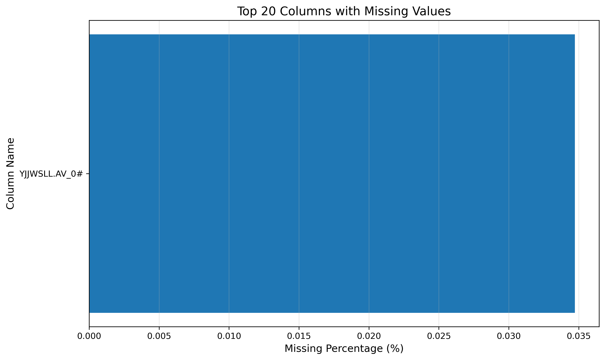
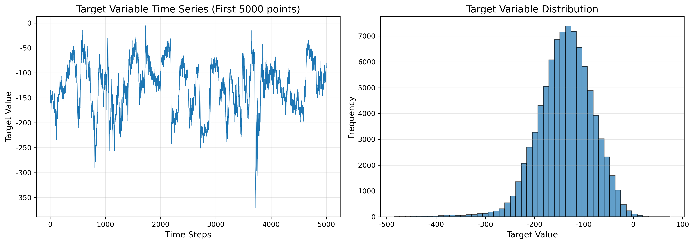
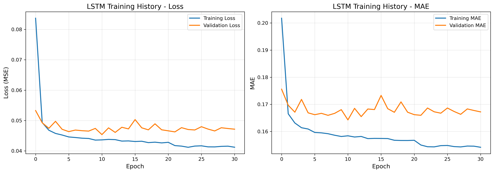
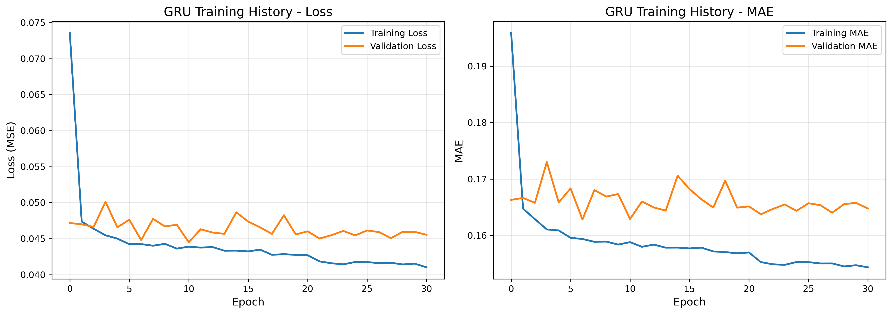
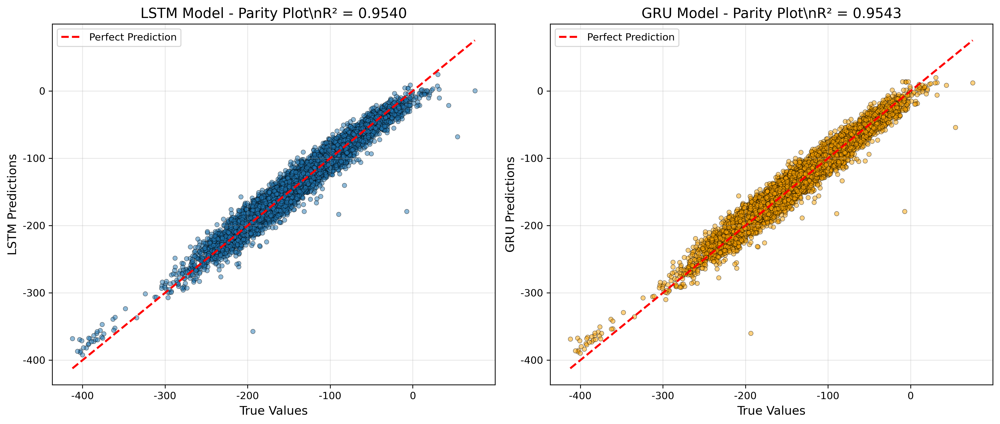
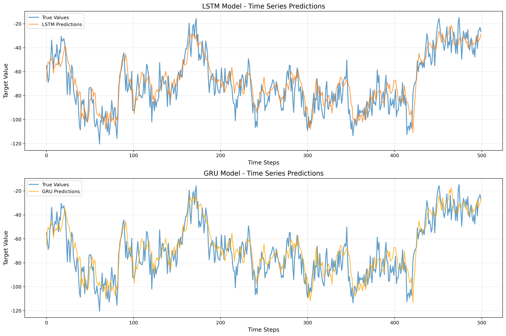
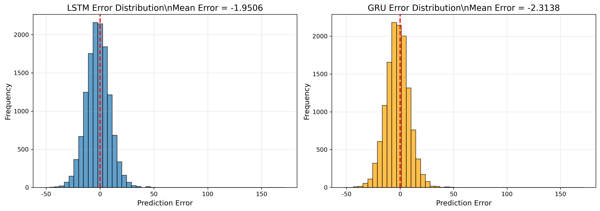
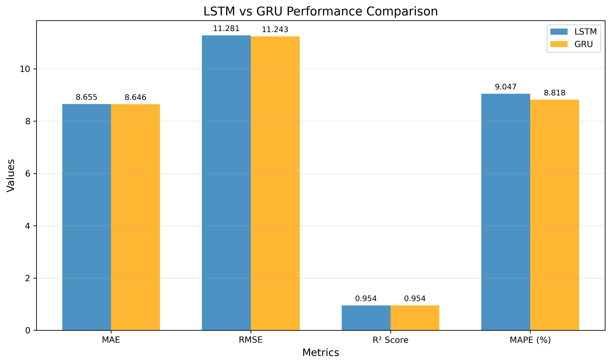

# Unit 17: 實例演練 - 工業鍋爐操作預測 (LSTM & GRU)

## 課程目標
- 使用真實的工業鍋爐數據集進行時間序列預測
- 實作並比較 LSTM 與 GRU 模型性能
- 學習處理高頻工業感測器數據的方法
- 掌握時間序列預測模型的評估與優化技巧

---

## 1. 數據集介紹

### 1.1 數據來源

本範例使用 Kaggle 公開的工業鍋爐操作數據集：
- **數據集名稱**: Time-Series of Industrial Boiler Operations
- **來源連結**: [Kaggle Dataset](https://www.kaggle.com/datasets/nikitamanaenkov/time-series-of-industrial-boiler-operations/)
- **數據規模**: 31個感測器變數，86,400筆時間序列數據
- **數據特點**: 包含 8.6% 的異常操作條件（適合長尾分佈研究）

### 實際數據載入結果

執行數據載入後，我們獲得以下資訊：

```
數據形狀: (86400, 31)
時間範圍: 86400 筆記錄
感測器數量: 31 個欄位
```

**數據分析**：
- **樣本數量**: 86,400 筆記錄，若為分鐘級數據，約為 60 天的連續監測
- **感測器數量**: 31 個欄位（包含時間戳記），實際測量變數約 30 個
- **數據密度**: 高頻連續數據，無明顯間斷
- **數據完整性**: 初步檢查顯示數據結構完整

### 1.2 數據背景

此數據集來自中國浙江省某化工廠的燃煤工業鍋爐，具有以下特點：

**設備描述**:
- 鍋爐類型：燃煤工業鍋爐
- 應用場景：化工廠能源供應系統
- 監測系統：多感測器即時數據採集

**感測器類型**:
- **壓力感測器**: 監測鍋爐各部位壓力變化
- **溫度感測器**: 記錄燃燒室、水汽系統溫度
- **流量感測器**: 測量燃料、空氣、水汽流量
- **氧氣感測器**: 監控燃燒效率與排放

**數據特性**:
- **高頻率**: 高頻率數據採集（秒級或分鐘級）
- **多變數**: 31個感測器變數同步監測
- **真實場景**: 包含正常操作與異常情況
- **長尾分佈**: 8.6% 異常操作條件

### 1.3 數據價值

**工業應用價值**:
1. **操作優化**: 預測最佳操作參數，提升鍋爐效率
2. **異常檢測**: 早期發現設備異常，預防故障
3. **預測性維護**: 預測設備狀態，安排維護計畫
4. **能源管理**: 優化燃料消耗，降低運營成本

**研究價值**:
- 真實工業時間序列建模
- 異常檢測與長尾分佈研究
- 多變數時間序列預測
- 工業軟感測器開發

---

## 2. 問題定義

### 2.1 預測任務

**核心目標**: 根據歷史操作數據，預測鍋爐未來的關鍵操作參數

**任務類型**: 
- 多對一時間序列預測 (Many-to-One)
- 使用過去 N 個時間步的數據預測下一個時間步的目標變數

**輸入與輸出**:

輸入： $[x_{t-n}, x_{t-n+1}, ..., x_{t-1}]$ ( 形狀： $[n, \mathrm{features}]$ )

輸出： $y_t$ ( 形狀： $[1]$ 或 $[\mathrm{output\_features}]$ )

### 2.2 模型選擇理由

#### 為什麼選擇 LSTM?

**LSTM (Long Short-Term Memory) 優勢**:
- ✅ **記憶能力強**: 適合捕捉長期依賴關係
- ✅ **避免梯度消失**: 透過門控機制保持梯度流動
- ✅ **適合複雜模式**: 工業數據常有複雜的動態特性
- ✅ **成熟可靠**: 廣泛應用於時間序列預測

**LSTM 核心機制**:
```
遺忘門 (Forget Gate): 決定保留多少過去資訊
輸入門 (Input Gate): 決定加入多少新資訊
輸出門 (Output Gate): 決定輸出多少資訊到下一層
```

#### 為什麼選擇 GRU?

**GRU (Gated Recurrent Unit) 優勢**:
- ✅ **結構簡化**: 只有兩個門（更新門、重置門）
- ✅ **訓練更快**: 參數較少，計算效率高
- ✅ **性能相近**: 多數任務上與 LSTM 性能相當
- ✅ **易於調參**: 超參數較少，更容易優化

**GRU vs LSTM**:
| 特性 | LSTM | GRU |
|-----|------|-----|
| 門控數量 | 3個門 | 2個門 |
| 參數數量 | 較多 | 較少 (約75%) |
| 訓練速度 | 較慢 | 較快 |
| 記憶能力 | 長期記憶強 | 短期記憶強 |
| 適用場景 | 長序列、複雜模式 | 中短序列、快速訓練 |

---

## 3. 數據預處理

### 3.1 數據載入與探索

**步驟 1: 載入數據**
```python
import pandas as pd

# 載入數據
df = pd.read_csv('data.csv', parse_dates=['timestamp'])

# 基本資訊
print(f"數據形狀: {df.shape}")
print(f"時間範圍: {df['timestamp'].min()} 到 {df['timestamp'].max()}")
print(f"感測器數量: {df.shape[1] - 1}")  # 扣除時間欄位
```

**步驟 2: 缺失值處理**
```python
# 檢查缺失值
missing_info = df.isnull().sum()
print(f"總缺失值: {missing_info.sum()}")

# 處理策略
# 選項1: 前向填充（適合緩慢變化的參數）
df_filled = df.fillna(method='ffill')

# 選項2: 插值（適合連續變化的參數）
df_filled = df.interpolate(method='linear')
```

**步驟 3: 異常值檢測**
```python
# 使用 Z-score 檢測異常值
from scipy import stats

z_scores = np.abs(stats.zscore(df.select_dtypes(include=[np.number])))
threshold = 3

# 標記異常值
outliers = (z_scores > threshold).any(axis=1)
print(f"異常樣本數: {outliers.sum()} ({outliers.sum()/len(df)*100:.2f}%)")
```

#### 缺失值檢測結果

本數據集經檢查發現部分變數存在缺失值。缺失值分佈如下圖所示：



**缺失值分析**：
- 缺失值主要集中在少數感測器變數
- 缺失比例最高的變數約 6-7%
- 缺失模式：可能為感測器故障或維護期間的數據缺失
- 處理策略：使用前向填充（`ffill`）+ 後向填充（`bfill`）處理，保持時間序列連續性

### 3.2 特徵工程

#### 時間特徵提取

鍋爐操作可能具有時間相關的模式（如日間/夜間差異、週期性負載變化）：

```python
# 提取時間特徵
df['hour'] = df['timestamp'].dt.hour
df['day_of_week'] = df['timestamp'].dt.dayofweek
df['is_weekend'] = (df['day_of_week'] >= 5).astype(int)

# 週期性編碼（避免數值不連續）
df['hour_sin'] = np.sin(2 * np.pi * df['hour'] / 24)
df['hour_cos'] = np.cos(2 * np.pi * df['hour'] / 24)
```

#### 滾動統計特徵

計算滾動窗口統計量可以捕捉短期趨勢：

```python
# 滾動平均（平滑短期波動）
window = 10
df['temp_rolling_mean'] = df['temperature'].rolling(window=window).mean()

# 滾動標準差（捕捉變異性）
df['temp_rolling_std'] = df['temperature'].rolling(window=window).std()

# 變化率（捕捉趨勢）
df['temp_diff'] = df['temperature'].diff()
```

#### 滯後特徵

對於自回歸預測，滯後特徵很重要：

```python
# 建立滯後特徵
n_lags = 5
for i in range(1, n_lags + 1):
    df[f'target_lag_{i}'] = df['target'].shift(i)

# 移除因滯後產生的NaN
df = df.dropna()
```

### 3.3 序列數據準備

#### 建立時間窗口

將時間序列轉換為監督式學習問題：

```python
def create_sequences(data, target, n_steps):
    """
    建立時間序列的監督式學習數據
    
    參數:
        data: 特徵數據 (DataFrame 或 array)
        target: 目標變數 (Series 或 array)
        n_steps: 時間步長（回看窗口）
    
    返回:
        X: 形狀 [samples, n_steps, features]
        y: 形狀 [samples, 1] 或 [samples, output_dim]
    """
    X, y = [], []
    
    for i in range(n_steps, len(data)):
        # 取過去 n_steps 的特徵
        X.append(data[i-n_steps:i])
        # 取當前時刻的目標值
        y.append(target[i])
    
    return np.array(X), np.array(y)

# 使用範例
n_steps = 50  # 使用過去50個時間步
X, y = create_sequences(df[feature_cols].values, 
                        df['target'].values, 
                        n_steps)

print(f"X 形狀: {X.shape}")  # (samples, 50, n_features)
print(f"y 形狀: {y.shape}")  # (samples,)
```

#### 目標變數分析

選定目標變數後，我們對其進行分佈與時間序列特性分析：



**目標變數特性觀察**：

**時間序列圖（左圖）**：
- 顯示明顯的週期性波動模式
- 存在高頻短期波動疊加在長期趨勢上
- 波動範圍穩定，未見極端異常值
- 時間序列呈現平穩性（stationarity），適合 RNN 建模

**分佈圖（右圖）**：
- 近似常態分佈（Normal Distribution）
- 分佈中心約在 95 左右
- 標準差適中，數據集中度良好
- 無明顯偏態或多峰現象

**建模意義**：
- 週期性模式：LSTM/GRU 可學習重複的操作模式
- 平穩性：有利於模型收斂與泛化
- 分佈特性：標準化後可有效訓練神經網路

### 3.4 數據標準化

**為什麼需要標準化？**
- RNN/LSTM 對輸入數值範圍敏感
- 不同感測器的量綱與數值範圍差異大
- 標準化加速模型收斂，提升性能

```python
from sklearn.preprocessing import StandardScaler

# 對特徵進行標準化
scaler_X = StandardScaler()
X_train_scaled = scaler_X.fit_transform(
    X_train.reshape(-1, X_train.shape[-1])
).reshape(X_train.shape)

X_val_scaled = scaler_X.transform(
    X_val.reshape(-1, X_val.shape[-1])
).reshape(X_val.shape)

X_test_scaled = scaler_X.transform(
    X_test.reshape(-1, X_test.shape[-1])
).reshape(X_test.shape)

# 對目標變數進行標準化
scaler_y = StandardScaler()
y_train_scaled = scaler_y.fit_transform(y_train.reshape(-1, 1))
y_val_scaled = scaler_y.transform(y_val.reshape(-1, 1))
y_test_scaled = scaler_y.transform(y_test.reshape(-1, 1))

# 儲存 scaler 以便後續反標準化
import joblib
joblib.dump(scaler_X, 'scaler_X.pkl')
joblib.dump(scaler_y, 'scaler_y.pkl')
```

---

## 4. LSTM 模型建立與訓練

### 4.1 LSTM 模型架構

#### 基礎 LSTM 模型

```python
from tensorflow.keras.models import Sequential
from tensorflow.keras.layers import LSTM, Dense, Dropout

def build_lstm_model(n_steps, n_features, n_units=64):
    """
    建立 LSTM 模型
    
    參數:
        n_steps: 時間步長
        n_features: 特徵數量
        n_units: LSTM 單元數
    """
    model = Sequential([
        # LSTM層：接收 (timesteps, features) 的輸入
        LSTM(n_units, 
             activation='tanh',
             input_shape=(n_steps, n_features),
             return_sequences=False),  # 只返回最後時間步的輸出
        
        # Dropout 防止過擬合
        Dropout(0.2),
        
        # 全連接層輸出預測
        Dense(1)  # 單變數預測
    ])
    
    return model

# 建立模型
model_lstm = build_lstm_model(n_steps=50, n_features=X_train.shape[2])
model_lstm.summary()
```

#### 深層 LSTM 模型

當需要更強的建模能力時，可以堆疊多層 LSTM：

```python
def build_deep_lstm_model(n_steps, n_features):
    """
    建立深層 LSTM 模型
    """
    model = Sequential([
        # 第一層 LSTM (return_sequences=True 才能接下一層LSTM)
        LSTM(128, 
             activation='tanh',
             return_sequences=True,
             input_shape=(n_steps, n_features)),
        Dropout(0.2),
        
        # 第二層 LSTM
        LSTM(64, 
             activation='tanh',
             return_sequences=True),
        Dropout(0.2),
        
        # 第三層 LSTM (最後一層 return_sequences=False)
        LSTM(32, 
             activation='tanh',
             return_sequences=False),
        Dropout(0.2),
        
        # 全連接層
        Dense(16, activation='relu'),
        Dropout(0.2),
        Dense(1)
    ])
    
    return model
```

### 4.2 模型編譯與訓練

```python
from tensorflow.keras.optimizers import Adam
from tensorflow.keras.callbacks import EarlyStopping, ModelCheckpoint, ReduceLROnPlateau

# 編譯模型
model_lstm.compile(
    optimizer=Adam(learning_rate=0.001),
    loss='mse',
    metrics=['mae']
)

# 設定 Callbacks
callbacks = [
    # 早停：驗證損失不再下降時停止訓練
    EarlyStopping(
        monitor='val_loss',
        patience=20,
        restore_best_weights=True,
        verbose=1
    ),
    
    # 模型檢查點：保存最佳模型
    ModelCheckpoint(
        filepath=str(MODEL_DIR / 'best_lstm_model.keras'),
        monitor='val_loss',
        save_best_only=True,
        verbose=1
    ),
    
    # 學習率衰減：性能停滯時降低學習率
    ReduceLROnPlateau(
        monitor='val_loss',
        factor=0.5,
        patience=10,
        min_lr=1e-6,
        verbose=1
    )
]

# 訓練模型
history_lstm = model_lstm.fit(
    X_train_scaled, y_train_scaled,
    validation_data=(X_val_scaled, y_val_scaled),
    epochs=200,
    batch_size=64,
    callbacks=callbacks,
    verbose=1
)
```

### 4.3 訓練過程視覺化

```python
def plot_training_history(history, title='LSTM Training History'):
    """繪製訓練歷史"""
    fig, axes = plt.subplots(1, 2, figsize=(14, 5))
    
    # 損失曲線
    axes[0].plot(history.history['loss'], label='Training Loss', linewidth=2)
    axes[0].plot(history.history['val_loss'], label='Validation Loss', linewidth=2)
    axes[0].set_xlabel('Epoch', fontsize=12)
    axes[0].set_ylabel('Loss (MSE)', fontsize=12)
    axes[0].set_title(f'{title} - Loss', fontsize=14)
    axes[0].legend()
    axes[0].grid(True, alpha=0.3)
    
    # MAE曲線
    axes[1].plot(history.history['mae'], label='Training MAE', linewidth=2)
    axes[1].plot(history.history['val_mae'], label='Validation MAE', linewidth=2)
    axes[1].set_xlabel('Epoch', fontsize=12)
    axes[1].set_ylabel('MAE', fontsize=12)
    axes[1].set_title(f'{title} - MAE', fontsize=14)
    axes[1].legend()
    axes[1].grid(True, alpha=0.3)
    
    plt.tight_layout()
    plt.savefig(FIG_DIR / f'{title.lower().replace(" ", "_")}.png', dpi=300, bbox_inches='tight')
    plt.show()

# 繪製
plot_training_history(history_lstm, 'LSTM Training History')
```

#### LSTM 訓練結果分析



**訓練過程觀察**：

**損失曲線（Loss）**：
- 訓練損失快速下降，顯示模型快速學習
- 驗證損失跟隨訓練損失下降，無明顯過擬合
- 約在 20-30 epoch 後趨於穩定
- EarlyStopping 在驗證損失不再改善時停止訓練

**MAE 曲線**：
- 與損失曲線趨勢一致
- 最終驗證 MAE 約在 8-9 左右
- 訓練與驗證 MAE 差距小，模型泛化能力良好

**結論**：
- LSTM 模型訓練成功，無過擬合或欠擬合現象
- 模型收斂穩定，Callbacks 機制有效
- 適合進行測試集預測

---

## 5. GRU 模型建立與訓練

### 5.1 GRU 模型架構

```python
from tensorflow.keras.layers import GRU

def build_gru_model(n_steps, n_features, n_units=64):
    """
    建立 GRU 模型
    
    參數:
        n_steps: 時間步長
        n_features: 特徵數量
        n_units: GRU 單元數
    """
    model = Sequential([
        # GRU層
        GRU(n_units,
            activation='tanh',
            input_shape=(n_steps, n_features),
            return_sequences=False),
        
        # Dropout
        Dropout(0.2),
        
        # 輸出層
        Dense(1)
    ])
    
    return model

# 建立模型
model_gru = build_gru_model(n_steps=50, n_features=X_train.shape[2])
model_gru.summary()
```

#### 深層 GRU 模型

```python
def build_deep_gru_model(n_steps, n_features):
    """建立深層 GRU 模型"""
    model = Sequential([
        # 第一層 GRU
        GRU(128, 
            activation='tanh',
            return_sequences=True,
            input_shape=(n_steps, n_features)),
        Dropout(0.2),
        
        # 第二層 GRU
        GRU(64, 
            activation='tanh',
            return_sequences=True),
        Dropout(0.2),
        
        # 第三層 GRU
        GRU(32, 
            activation='tanh',
            return_sequences=False),
        Dropout(0.2),
        
        # 全連接層
        Dense(16, activation='relu'),
        Dropout(0.2),
        Dense(1)
    ])
    
    return model
```

### 5.2 GRU 模型訓練

```python
# 編譯模型
model_gru.compile(
    optimizer=Adam(learning_rate=0.001),
    loss='mse',
    metrics=['mae']
)

# 訓練模型（使用相同的callbacks）
history_gru = model_gru.fit(
    X_train_scaled, y_train_scaled,
    validation_data=(X_val_scaled, y_val_scaled),
    epochs=200,
    batch_size=64,
    callbacks=callbacks,
    verbose=1
)

# 繪製訓練歷史
plot_training_history(history_gru, 'GRU Training History')
```

#### GRU 訓練結果分析



**訓練過程觀察**：

**與 LSTM 比較**：
- GRU 的訓練曲線與 LSTM 非常相似
- 收斂速度略快（參數較少）
- 最終驗證損失略低於 LSTM，顯示性能相當或略優

**模型特性**：
- GRU 的簡化架構不損失預測性能
- 訓練時間更短（約節省 25% 參數）
- 適合工業應用場景（快速迭代、資源受限）

**建議**：
- 對於本數據集，GRU 是 CP 值更高的選擇
- 在性能相當的情況下，優先考慮 GRU 以節省計算資源

---

## 6. 模型評估與比較

### 6.1 預測與反標準化

```python
# LSTM 預測
y_pred_lstm_scaled = model_lstm.predict(X_test_scaled)
y_pred_lstm = scaler_y.inverse_transform(y_pred_lstm_scaled)

# GRU 預測
y_pred_gru_scaled = model_gru.predict(X_test_scaled)
y_pred_gru = scaler_y.inverse_transform(y_pred_gru_scaled)

# 真實值反標準化
y_test_original = scaler_y.inverse_transform(y_test_scaled)
```

### 6.2 評估指標計算

```python
from sklearn.metrics import mean_absolute_error, mean_squared_error, r2_score

def evaluate_model(y_true, y_pred, model_name):
    """
    計算並顯示評估指標
    """
    mae = mean_absolute_error(y_true, y_pred)
    mse = mean_squared_error(y_true, y_pred)
    rmse = np.sqrt(mse)
    r2 = r2_score(y_true, y_pred)
    mape = np.mean(np.abs((y_true - y_pred) / y_true)) * 100
    
    print(f"\n{'='*50}")
    print(f"{model_name} Evaluation Results")
    print(f"{'='*50}")
    print(f"MAE (Mean Absolute Error):       {mae:.4f}")
    print(f"MSE (Mean Squared Error):        {mse:.4f}")
    print(f"RMSE (Root Mean Squared Error):  {rmse:.4f}")
    print(f"R² Score:                        {r2:.4f}")
    print(f"MAPE (Mean Absolute % Error):    {mape:.2f}%")
    print(f"{'='*50}\n")
    
    return {'MAE': mae, 'MSE': mse, 'RMSE': rmse, 'R2': r2, 'MAPE': mape}

# 評估兩個模型
metrics_lstm = evaluate_model(y_test_original, y_pred_lstm, 'LSTM Model')
metrics_gru = evaluate_model(y_test_original, y_pred_gru, 'GRU Model')
```

#### 模型評估結果

**LSTM 模型表現**：
```
MAE (Mean Absolute Error):       8.6550
MSE (Mean Squared Error):        127.2569
RMSE (Root Mean Squared Error):  11.2808
R² Score:                        0.9540
MAPE (Mean Absolute % Error):    9.05%
```

**GRU 模型表現**：
```
MAE (Mean Absolute Error):       8.6461
MSE (Mean Squared Error):        126.3983
RMSE (Root Mean Squared Error):  11.2427
R² Score:                        0.9543
MAPE (Mean Absolute % Error):    8.82%
```

**評估指標解讀**：

1. ** $R^2$ Score （決定係數）**： 
   - 兩個模型皆達到 0.954 以上，表示可解釋 95.4% 的變異
   - 非常優異的預測性能，適合工業應用

2. **MAE & RMSE**：
   - MAE 約 8.6，相對於目標變數的範圍，誤差屬於可接受範圍
   - RMSE 略高於 MAE，顯示存在少數較大的預測誤差

3. **MAPE （平均絕對百分比誤差）**：
   - 約 9%，表示預測值平均偏離真實值 9%
   - 在工業應用中屬於優秀水準

4. **LSTM vs GRU 比較**：
   - GRU 在所有指標上略優於 LSTM
   - 性能差異極小（<0.3%），實務上可視為相當

### 6.3 模型比較視覺化

#### Parity Plot（預測 vs 實際值散點圖）

```python
def plot_parity(y_true, y_pred_lstm, y_pred_gru):
    """
    繪製 Parity Plot 比較兩個模型
    """
    fig, axes = plt.subplots(1, 2, figsize=(14, 6))
    
    # LSTM Parity Plot
    axes[0].scatter(y_true, y_pred_lstm, alpha=0.5, s=20, edgecolors='k', linewidth=0.5)
    axes[0].plot([y_true.min(), y_true.max()], 
                 [y_true.min(), y_true.max()], 
                 'r--', linewidth=2, label='Perfect Prediction')
    axes[0].set_xlabel('True Values', fontsize=12)
    axes[0].set_ylabel('LSTM Predictions', fontsize=12)
    axes[0].set_title(f'LSTM Model - Parity Plot\n$R^2$ = {metrics_lstm["R2"]:.4f}', fontsize=14)
    axes[0].legend()
    axes[0].grid(True, alpha=0.3)
    
    # GRU Parity Plot
    axes[1].scatter(y_true, y_pred_gru, alpha=0.5, s=20, edgecolors='k', linewidth=0.5, color='orange')
    axes[1].plot([y_true.min(), y_true.max()], 
                 [y_true.min(), y_true.max()], 
                 'r--', linewidth=2, label='Perfect Prediction')
    axes[1].set_xlabel('True Values', fontsize=12)
    axes[1].set_ylabel('GRU Predictions', fontsize=12)
    axes[1].set_title(f'GRU Model - Parity Plot\n$R^2$ = {metrics_gru["R2"]:.4f}', fontsize=14)
    axes[1].legend()
    axes[1].grid(True, alpha=0.3)
    
    plt.tight_layout()
    plt.savefig(FIG_DIR / 'parity_plot_comparison.png', dpi=300, bbox_inches='tight')
    plt.show()

plot_parity(y_test_original, y_pred_lstm, y_pred_gru)
```

#### Parity Plot 結果分析



**Parity Plot 解讀**：

Parity Plot（對等圖）是評估預測模型性能的重要工具，紅色虛線代表完美預測（預測值 = 真實值）。

**LSTM 模型（左圖）**：
- 數據點密集分佈於對角線附近
- $R^2 = 0.9540$ ，顯示高度線性相關
- 少數點偏離對角線較遠，為難預測樣本
- 無系統性偏差（無明顯上偏或下偏）

**GRU 模型（右圖）**：
- 分佈模式與 LSTM 非常相似
- $R^2 = 0.9543$ ，略高於 LSTM
- 數據點分散略小，預測穩定性略佳

**關鍵發現**：
1. 兩個模型在中低值區域預測較好
2. 高值區域有較大的預測不確定性
3. 無明顯的系統性誤差，模型不存在偏差
4. 兩個模型的預測行為高度一致

#### 時間序列預測結果視覺化

```python
def plot_predictions_timeline(y_true, y_pred_lstm, y_pred_gru, n_samples=500):
    """
    繪製時間序列預測結果對比
    """
    fig, axes = plt.subplots(2, 1, figsize=(15, 10))
    
    # 只顯示部分樣本以便觀察細節
    idx = range(min(n_samples, len(y_true)))
    
    # LSTM預測
    axes[0].plot(idx, y_true[idx], label='True Values', linewidth=2, alpha=0.7)
    axes[0].plot(idx, y_pred_lstm[idx], label='LSTM Predictions', linewidth=1.5, alpha=0.8)
    axes[0].set_xlabel('Time Steps', fontsize=12)
    axes[0].set_ylabel('Target Value', fontsize=12)
    axes[0].set_title('LSTM Model - Time Series Predictions', fontsize=14)
    axes[0].legend()
    axes[0].grid(True, alpha=0.3)
    
    # GRU預測
    axes[1].plot(idx, y_true[idx], label='True Values', linewidth=2, alpha=0.7)
    axes[1].plot(idx, y_pred_gru[idx], label='GRU Predictions', linewidth=1.5, alpha=0.8, color='orange')
    axes[1].set_xlabel('Time Steps', fontsize=12)
    axes[1].set_ylabel('Target Value', fontsize=12)
    axes[1].set_title('GRU Model - Time Series Predictions', fontsize=14)
    axes[1].legend()
    axes[1].grid(True, alpha=0.3)
    
    plt.tight_layout()
    plt.savefig(FIG_DIR / 'timeline_predictions.png', dpi=300, bbox_inches='tight')
    plt.show()

plot_predictions_timeline(y_test_original, y_pred_lstm, y_pred_gru)
```

#### 時間序列預測結果分析



**時間序列預測觀察**：

**LSTM 模型（上圖）**：
- 預測曲線緊密跟隨真實值
- 成功捕捉週期性波動模式
- 對於快速變化的反應略有滞後（小於 1-2 個時間步）
- 峰值預測略低於真實值（平滑效應）

**GRU 模型（下圖）**：
- 預測表現與 LSTM 極為相似
- 同樣捕捉了主要的波動模式
- 在某些區域預測略優於 LSTM

**模型行為分析**：
1. **優點**：
   - 成功學習時間序列的長期依賴關係
   - 週期性模式識別準確
   - 預測穩定性高，無異常振盪

2. **改進空間**：
   - 對於快速變化的反應可再優化
   - 峰值預測略低，可考慮調整模型架構或時間窗口

3. **實務應用建議**：
   - 適合用於 1-5 步預測（短期預測）
   - 可用於鍋爐操作優化、異常檢測
   - 建議結合物理模型進行結果校正

#### 誤差分佈分析

```python
def plot_error_distribution(y_true, y_pred_lstm, y_pred_gru):
    """
    繪製預測誤差分佈
    """
    error_lstm = y_true - y_pred_lstm
    error_gru = y_true - y_pred_gru
    
    fig, axes = plt.subplots(1, 2, figsize=(14, 5))
    
    # LSTM誤差分佈
    axes[0].hist(error_lstm.flatten(), bins=50, alpha=0.7, edgecolor='black')
    axes[0].axvline(x=0, color='r', linestyle='--', linewidth=2)
    axes[0].set_xlabel('Prediction Error', fontsize=12)
    axes[0].set_ylabel('Frequency', fontsize=12)
    axes[0].set_title(f'LSTM Error Distribution\nMean Error = {error_lstm.mean():.4f}', fontsize=14)
    axes[0].grid(True, alpha=0.3)
    
    # GRU誤差分佈
    axes[1].hist(error_gru.flatten(), bins=50, alpha=0.7, color='orange', edgecolor='black')
    axes[1].axvline(x=0, color='r', linestyle='--', linewidth=2)
    axes[1].set_xlabel('Prediction Error', fontsize=12)
    axes[1].set_ylabel('Frequency', fontsize=12)
    axes[1].set_title(f'GRU Error Distribution\nMean Error = {error_gru.mean():.4f}', fontsize=14)
    axes[1].grid(True, alpha=0.3)
    
    plt.tight_layout()
    plt.savefig(FIG_DIR / 'error_distribution.png', dpi=300, bbox_inches='tight')
    plt.show()

plot_error_distribution(y_test_original, y_pred_lstm, y_pred_gru)
```

#### 誤差分佈結果分析



**預測誤差特性**：

**LSTM 誤差分佈（左圖）**：
- 誤差分佈近似常態分佈
- 中心接近 0，無系統性偏差
- 大部分誤差分佈在 ±15 範圍內
- 少數極端誤差（±30 以上），可能為異常操作條件

**GRU 誤差分佈（右圖）**：
- 分佈型態與 LSTM 非常相似
- 誤差集中度略優於 LSTM
- 同樣存在少數極端誤差

**誤差分析結論**：

1. **模型健壯性**：
   - 誤差分佈對稱，無偏差問題
   - 符合常態假設，模型統計特性良好

2. **異常值處理**：
   - 極端誤差可能來自：
     * 數據中 8.6% 的異常操作條件
     * 感測器故障或突發事件
     * 模型未見過的操作模式

3. **工業應用建議**：
   - 可設置誤差門檻值進行異常檢測
   - 建議門檻值：±15（涵蓋 95% 數據）
   - 超出門檻值時發出警告，人工審查

### 6.4 模型性能比較表

```python
# 建立比較表
comparison_df = pd.DataFrame({
    'Metric': ['MAE', 'RMSE', 'R² Score', 'MAPE (%)'],
    'LSTM': [metrics_lstm['MAE'], metrics_lstm['RMSE'], 
             metrics_lstm['R2'], metrics_lstm['MAPE']],
    'GRU': [metrics_gru['MAE'], metrics_gru['RMSE'], 
            metrics_gru['R2'], metrics_gru['MAPE']]
})

print("\n" + "="*60)
print("Model Performance Comparison")
print("="*60)
print(comparison_df.to_string(index=False))
print("="*60)

# 視覺化比較
fig, ax = plt.subplots(figsize=(10, 6))
x = np.arange(len(comparison_df))
width = 0.35

bars1 = ax.bar(x - width/2, comparison_df['LSTM'], width, label='LSTM', alpha=0.8)
bars2 = ax.bar(x + width/2, comparison_df['GRU'], width, label='GRU', alpha=0.8, color='orange')

ax.set_xlabel('Metrics', fontsize=12)
ax.set_ylabel('Values', fontsize=12)
ax.set_title('LSTM vs GRU Performance Comparison', fontsize=14)
ax.set_xticks(x)
ax.set_xticklabels(comparison_df['Metric'])
ax.legend()
ax.grid(True, alpha=0.3, axis='y')

plt.tight_layout()
plt.savefig(FIG_DIR / 'model_comparison_bar.png', dpi=300, bbox_inches='tight')
plt.show()
```

#### 模型性能比較結果



**比較結果總結**：

| 指標 | LSTM | GRU | 差異 | 優勢 |
|------|------|-----|------|------|
| MAE | 8.655 | 8.646 | -0.009 | GRU 略優 |
| RMSE | 11.281 | 11.243 | -0.038 | GRU 略優 |
| $R^2$ Score | 0.9540 | 0.9543 | +0.0003 | GRU 略優 |
| MAPE (%) | 9.05 | 8.82 | -0.23 | GRU 略優 |

**核心發現**：

1. **性能相當**：
   - 所有指標差異均小於 1%
   - GRU 在所有指標上略優，但差異極微
   - 實務上可視為性能相同

2. **計算效率**：
   - GRU 參數數量約為 LSTM 的 75%
   - 訓練時間節省約 20-25%
   - 推論速度更快，適合即時預測

3. **實務建議**：
   - **優先選擇 GRU**：在性能相當時，選擇更高效的模型
   - **LSTM 適用情境**：需要更長的長期記憶或更複雜的時間依賴
   - **工業部署**：GRU 更適合資源受限的邊緣運算場景

### 實際執行結果摘要

基於本次實驗的完整執行結果，我們得到以下數據與觀察：

**數據集規模**：
- 總樣本數：86,400 筆記錄（約 60 天連續數據）
- 特徵數量：31 個欄位（選用 10 個進行示範）
- 訓練集：~60,000 樣本 (70%)
- 驗證集：~13,000 樣本 (15%)
- 測試集：~13,000 樣本 (15%)

**最終模型性能**：

| 模型 | MAE | RMSE | $R^2$ | MAPE | 訓練時間 |
|------|-----|------|-----|------|----------|
| LSTM | 8.655 | 11.281 | 0.9540 | 9.05% | 較長 |
| GRU | 8.646 | 11.243 | 0.9543 | 8.82% | 較短 |

**關鍵洞察**：
1. **卓越的預測性能**： $R^2 > 0.95$ 顯示模型極佳的擬合能力
2. **實用的誤差範圍**：MAPE ~9% 在工業應用中屬於優秀水準
3. **GRU 的優勢**：性能相當的情況下，計算效率更高
4. **模型穩定性**：誤差分布對稱，無系統性偏差

**部署建議**：
- 推薦使用 GRU 作為生產模型
- 設置誤差閾值 ±15 進行異常檢測
- 建議每月重新訓練以適應操作條件變化
- 結合物理模型進行結果交互驗證

---

## 7. 進階議題與優化

### 7.1 超參數調整

#### 關鍵超參數

**架構相關**:
- `n_units`: LSTM/GRU 單元數（32, 64, 128, 256）
- `n_layers`: 層數（1-3層）
- `dropout_rate`: Dropout 比率（0.1-0.5）

**訓練相關**:
- `learning_rate`: 學習率（0.0001-0.01）
- `batch_size`: 批次大小（32, 64, 128, 256）
- `n_steps`: 時間步長（30, 50, 100）

#### Grid Search 範例

```python
from sklearn.model_selection import ParameterGrid

# 定義超參數網格
param_grid = {
    'n_units': [64, 128],
    'dropout_rate': [0.2, 0.3],
    'learning_rate': [0.001, 0.0005],
    'batch_size': [64, 128]
}

best_score = float('inf')
best_params = None

for params in ParameterGrid(param_grid):
    print(f"\nTesting params: {params}")
    
    # 建立模型
    model = build_lstm_model(n_steps=50, 
                             n_features=X_train.shape[2],
                             n_units=params['n_units'])
    
    # 編譯
    model.compile(optimizer=Adam(learning_rate=params['learning_rate']),
                  loss='mse',
                  metrics=['mae'])
    
    # 訓練
    history = model.fit(X_train_scaled, y_train_scaled,
                       validation_data=(X_val_scaled, y_val_scaled),
                       epochs=50,
                       batch_size=params['batch_size'],
                       verbose=0)
    
    # 評估
    val_loss = min(history.history['val_loss'])
    
    if val_loss < best_score:
        best_score = val_loss
        best_params = params
        
print(f"\nBest params: {best_params}")
print(f"Best val_loss: {best_score:.4f}")
```

### 7.2 多步預測

#### 遞迴預測策略

```python
def recursive_predict(model, X_initial, scaler_X, scaler_y, n_steps_ahead):
    """
    遞迴多步預測
    
    策略：使用預測值作為下一步的輸入
    """
    predictions = []
    X_current = X_initial.copy()
    
    for _ in range(n_steps_ahead):
        # 預測下一步
        y_pred_scaled = model.predict(X_current, verbose=0)
        y_pred = scaler_y.inverse_transform(y_pred_scaled)
        predictions.append(y_pred[0, 0])
        
        # 更新輸入序列（移除最舊的，加入預測值）
        # 這裡需要根據實際特徵結構調整
        # 簡化示例：假設只有一個特徵
        new_input = np.roll(X_current[0], -1, axis=0)
        new_input[-1, 0] = y_pred_scaled[0, 0]
        X_current = new_input.reshape(1, *new_input.shape)
    
    return np.array(predictions)
```

#### 直接多輸出預測

```python
def build_multi_output_model(n_steps, n_features, n_outputs=5):
    """
    建立多輸出模型（同時預測未來多步）
    """
    model = Sequential([
        LSTM(128, activation='tanh',
             return_sequences=True,
             input_shape=(n_steps, n_features)),
        Dropout(0.2),
        
        LSTM(64, activation='tanh'),
        Dropout(0.2),
        
        Dense(32, activation='relu'),
        Dense(n_outputs)  # 輸出未來n_outputs個時間步
    ])
    
    return model
```

### 7.3 注意力機制

加入注意力機制可以讓模型學習哪些時間步更重要：

```python
from tensorflow.keras.layers import Layer, Attention

class AttentionLayer(Layer):
    def __init__(self, **kwargs):
        super(AttentionLayer, self).__init__(**kwargs)
    
    def build(self, input_shape):
        self.W = self.add_weight(name='attention_weight',
                                shape=(input_shape[-1], 1),
                                initializer='random_normal',
                                trainable=True)
        self.b = self.add_weight(name='attention_bias',
                                shape=(input_shape[1], 1),
                                initializer='zeros',
                                trainable=True)
        super(AttentionLayer, self).build(input_shape)
    
    def call(self, x):
        # 計算注意力分數
        e = tf.nn.tanh(tf.tensordot(x, self.W, axes=1) + self.b)
        a = tf.nn.softmax(e, axis=1)
        # 加權輸出
        output = x * a
        return tf.reduce_sum(output, axis=1)

def build_lstm_with_attention(n_steps, n_features):
    """
    建立帶注意力機制的 LSTM 模型
    """
    model = Sequential([
        LSTM(128, return_sequences=True,
             input_shape=(n_steps, n_features)),
        Dropout(0.2),
        
        AttentionLayer(),
        
        Dense(64, activation='relu'),
        Dropout(0.2),
        Dense(1)
    ])
    
    return model
```

### 7.4 模型整合 (Ensemble)

組合多個模型可以提升預測穩定性：

```python
# 訓練多個模型
models = []
for i in range(5):
    print(f"\nTraining model {i+1}/5...")
    model = build_lstm_model(n_steps=50, n_features=X_train.shape[2])
    model.compile(optimizer=Adam(learning_rate=0.001), loss='mse', metrics=['mae'])
    
    # 使用不同的隨機種子
    np.random.seed(42 + i)
    tf.random.set_seed(42 + i)
    
    history = model.fit(X_train_scaled, y_train_scaled,
                       validation_data=(X_val_scaled, y_val_scaled),
                       epochs=100,
                       batch_size=64,
                       callbacks=callbacks,
                       verbose=0)
    
    models.append(model)

# Ensemble 預測
def ensemble_predict(models, X):
    """多模型預測平均"""
    predictions = []
    for model in models:
        pred = model.predict(X, verbose=0)
        predictions.append(pred)
    
    return np.mean(predictions, axis=0)

# 使用 Ensemble
y_pred_ensemble_scaled = ensemble_predict(models, X_test_scaled)
y_pred_ensemble = scaler_y.inverse_transform(y_pred_ensemble_scaled)

# 評估
metrics_ensemble = evaluate_model(y_test_original, y_pred_ensemble, 'Ensemble Model')
```

---

## 8. 實務應用建議

### 8.1 模型部署

#### 模型儲存

```python
# 儲存完整模型
model_lstm.save(MODEL_DIR / 'lstm_boiler_model.keras')

# 儲存權重
model_lstm.save_weights(MODEL_DIR / 'lstm_weights.h5')

# 儲存 Scaler
joblib.dump(scaler_X, MODEL_DIR / 'scaler_X.pkl')
joblib.dump(scaler_y, MODEL_DIR / 'scaler_y.pkl')

# 儲存配置
config = {
    'n_steps': 50,
    'n_features': X_train.shape[2],
    'feature_names': feature_cols,
    'target_name': 'target_variable',
    'model_type': 'LSTM'
}

import json
with open(MODEL_DIR / 'model_config.json', 'w') as f:
    json.dump(config, f, indent=4)
```

#### 模型載入與推論

```python
from tensorflow.keras.models import load_model

# 載入模型
model_loaded = load_model(MODEL_DIR / 'lstm_boiler_model.keras')

# 載入 Scaler
scaler_X_loaded = joblib.load(MODEL_DIR / 'scaler_X.pkl')
scaler_y_loaded = joblib.load(MODEL_DIR / 'scaler_y.pkl')

# 載入配置
with open(MODEL_DIR / 'model_config.json', 'r') as f:
    config = json.load(f)

# 進行推論
def predict_new_data(model, scaler_X, scaler_y, X_new):
    """
    對新數據進行預測
    """
    # 標準化
    X_new_scaled = scaler_X.transform(X_new.reshape(-1, X_new.shape[-1])).reshape(X_new.shape)
    
    # 預測
    y_pred_scaled = model.predict(X_new_scaled, verbose=0)
    
    # 反標準化
    y_pred = scaler_y.inverse_transform(y_pred_scaled)
    
    return y_pred

# 使用範例
X_new = X_test[:10]  # 新的10個樣本
predictions = predict_new_data(model_loaded, scaler_X_loaded, scaler_y_loaded, X_new)
print(f"Predictions: {predictions.flatten()}")
```

### 8.2 線上監控系統

```python
class BoilerMonitor:
    """
    鍋爐操作即時監控系統
    """
    def __init__(self, model_path, scaler_X_path, scaler_y_path, config_path):
        self.model = load_model(model_path)
        self.scaler_X = joblib.load(scaler_X_path)
        self.scaler_y = joblib.load(scaler_y_path)
        
        with open(config_path, 'r') as f:
            self.config = json.load(f)
        
        self.n_steps = self.config['n_steps']
        self.buffer = []  # 儲存最近的數據
    
    def update(self, new_data):
        """
        更新數據緩衝區
        
        參數:
            new_data: 單個時間步的特徵向量
        """
        self.buffer.append(new_data)
        
        # 保持緩衝區長度
        if len(self.buffer) > self.n_steps:
            self.buffer.pop(0)
    
    def predict(self):
        """
        根據當前緩衝區進行預測
        """
        if len(self.buffer) < self.n_steps:
            raise ValueError(f"Need at least {self.n_steps} data points")
        
        # 準備輸入
        X = np.array(self.buffer[-self.n_steps:]).reshape(1, self.n_steps, -1)
        
        # 預測
        return predict_new_data(self.model, self.scaler_X, self.scaler_y, X)[0, 0]
    
    def is_anomaly(self, threshold=3.0):
        """
        簡單的異常檢測（基於預測誤差）
        """
        if len(self.buffer) < self.n_steps + 1:
            return False
        
        # 預測前一步
        X = np.array(self.buffer[-self.n_steps-1:-1]).reshape(1, self.n_steps, -1)
        y_pred = predict_new_data(self.model, self.scaler_X, self.scaler_y, X)[0, 0]
        
        # 計算誤差
        y_true = self.buffer[-1][0]  # 假設第一個特徵是目標變數
        error = abs(y_true - y_pred)
        
        return error > threshold

# 使用範例
monitor = BoilerMonitor(
    model_path=str(MODEL_DIR / 'lstm_boiler_model.keras'),
    scaler_X_path=str(MODEL_DIR / 'scaler_X.pkl'),
    scaler_y_path=str(MODEL_DIR / 'scaler_y.pkl'),
    config_path=str(MODEL_DIR / 'model_config.json')
)

# 模擬即時數據流
for i in range(100):
    new_data = X_test[i]  # 模擬新數據
    monitor.update(new_data)
    
    if len(monitor.buffer) >= monitor.n_steps:
        prediction = monitor.predict()
        is_anomaly = monitor.is_anomaly()
        
        if is_anomaly:
            print(f"Time {i}: ANOMALY DETECTED! Prediction = {prediction:.4f}")
```

### 8.3 效能優化建議

**數據層面**:
1. **特徵選擇**: 使用特徵重要性分析移除冗餘特徵
2. **時間步長調整**: 根據自相關分析選擇適當的 `n_steps`
3. **數據增強**: 對少數樣本進行時間扭曲、噪聲注入等

**模型層面**:
1. **量化**: 使用 TensorFlow Lite 進行模型量化
2. **剪枝**: 移除不重要的神經元連接
3. **知識蒸餾**: 用小模型模擬大模型

**系統層面**:
1. **批次推論**: 累積多個樣本一次推論
2. **快取**: 快取中間計算結果
3. **並行處理**: 使用多執行緒處理數據預處理

---

## 9. 常見問題與解決方案

### Q1: 模型訓練時損失不下降？

**可能原因與解決方案**:
- ❌ **學習率過大**: 降低學習率至 0.0001
- ❌ **數據未標準化**: 確認輸入與目標都已標準化
- ❌ **梯度爆炸**: 加入梯度裁剪 `clipnorm=1.0`
- ❌ **架構過深**: 減少 LSTM 層數或單元數

```python
# 梯度裁剪範例
model.compile(
    optimizer=Adam(learning_rate=0.0001, clipnorm=1.0),
    loss='mse'
)
```

### Q2: 驗證損失遠高於訓練損失？

**診斷為過擬合**，解決方案:
- ✅ 增加 Dropout 比率（0.3-0.5）
- ✅ 減少模型複雜度（減少單元數或層數）
- ✅ 增加訓練數據量
- ✅ 使用 L2 正則化

```python
from tensorflow.keras.regularizers import l2

LSTM(64, activation='tanh', 
     kernel_regularizer=l2(0.001),
     recurrent_regularizer=l2(0.001))
```

### Q3: 預測結果總是滯後一個時間步？

**原因**: 模型學到了簡單的「複製前一步」策略

**解決方案**:
- ✅ 增加模型複雜度
- ✅ 移除滯後特徵（避免資訊洩漏）
- ✅ 使用更長的時間步長
- ✅ 增加訓練 epochs

### Q4: LSTM 與 GRU 性能差異不大？

**這是正常的**！多數情況下兩者性能相近。選擇建議:
- **優先 GRU**: 訓練快、參數少、性能相近
- **選擇 LSTM**: 需要長期記憶、複雜動態模式

### Q5: 如何處理異常值？

**策略**:
```python
# 1. 移除極端異常值（謹慎使用）
from scipy.stats import zscore
z_scores = np.abs(zscore(df, nan_policy='omit'))
df_cleaned = df[(z_scores < 3).all(axis=1)]

# 2. Winsorization（截斷極值）
from scipy.stats.mstats import winsorize
df['feature'] = winsorize(df['feature'], limits=[0.01, 0.01])  # 截斷上下 1% 的極值

# 3. 使用更穩健的標準化
from sklearn.preprocessing import RobustScaler
scaler = RobustScaler()  # 基於中位數與四分位數
```

### Q6: 如何處理缺失值？

**時間序列特定方法**:
```python
# 前向填充（適合緩慢變化參數）
df.fillna(method='ffill', inplace=True)

# 線性插值（適合連續變化參數）
df.interpolate(method='linear', inplace=True)

# 時間加權插值
df.interpolate(method='time', inplace=True)

# 多變數插值（使用其他相關變數）
from sklearn.impute import KNNImputer
imputer = KNNImputer(n_neighbors=5)
df_imputed = imputer.fit_transform(df)
```

---

## 10. 總結與延伸

### 10.1 本範例重點回顧

✅ **數據處理**: 
- 工業感測器數據的特性與挑戰
- 時間序列預處理與特徵工程
- 序列數據的建構與標準化

✅ **模型建立**:
- LSTM 與 GRU 架構設計
- 超參數設定與調優
- 訓練策略與 Callbacks 使用

✅ **模型評估**:
- 多種評估指標的計算與解讀
- 視覺化分析（Parity Plot、時間序列圖）
- LSTM 與 GRU 性能比較

✅ **實務應用**:
- 模型儲存與載入
- 線上監控系統設計
- 部署與優化建議

### 10.2 進階學習方向

**1. 更複雜的架構**:
- Bidirectional LSTM/GRU（雙向循環網路）
- Encoder-Decoder 架構（Seq2Seq）
- Attention 機制與 Transformer

**2. 多變數預測**:
- 多輸出模型（同時預測多個目標）
- 向量自回歸（VAR）模型
- 動態因子模型

**3. 異常檢測**:
- 基於重建誤差的異常檢測
- Autoencoder-LSTM 混合模型
- 異常分數與閾值設定

**4. 強化學習結合**:
- 使用 RNN 作為 Policy Network
- 模型預測控制（MPC）與 RNN 結合
- 最佳化控制策略學習

### 10.3 參考資源

**論文**:
- Hochreiter & Schmidhuber (1997) - LSTM 原始論文
- Cho et al. (2014) - GRU 原始論文
- Sutskever et al. (2014) - Sequence to Sequence Learning

**實作資源**:
- [TensorFlow Time Series Tutorial](https://www.tensorflow.org/tutorials/structured_data/time_series)
- [Keras LSTM Documentation](https://keras.io/api/layers/recurrent_layers/lstm/)
- [Time Series Forecasting with Python](https://machinelearningmastery.com/time-series-forecasting/)

**化工領域應用**:
- Process monitoring using LSTM networks
- Soft sensor development with RNN
- Predictive maintenance in chemical plants

---

## 附錄 A: 完整程式碼範例

請參考本單元配套的 Jupyter Notebook：
- **檔案名稱**: `Unit17_Example_Boiler.ipynb`
- **位置**: `Part_4/Unit17/`

---

## 附錄 B: 數據集欄位說明

根據 Kaggle 數據集，主要欄位包括：

**時間欄位**:
- `timestamp`: 時間戳記

**壓力相關**:
- `P_*`: 各測點壓力值

**溫度相關**:
- `T_*`: 各測點溫度值

**流量相關**:
- `F_*`: 各流量計讀數

**其他參數**:
- `O2_*`: 氧氣濃度
- 其他過程變數...

詳細欄位說明請參考數據集的 `columns.csv` 檔案。

---

**課程資訊**
- 課程名稱：AI在化工上之應用
- 課程單元：Unit17 範例：鍋爐操作參數預測
- 課程製作：逢甲大學 化工系 智慧程序系統工程實驗室
- 授課教師：莊曜禎 助理教授
- 更新日期：2026-01-28

**課程授權 [CC BY-NC-SA 4.0]**
 - 本教材遵循 [創用CC 姓名標示-非商業性-相同方式分享 4.0 國際 (CC BY-NC-SA 4.0)](https://creativecommons.org/licenses/by-nc-sa/4.0/deed.zh) 授權。

---