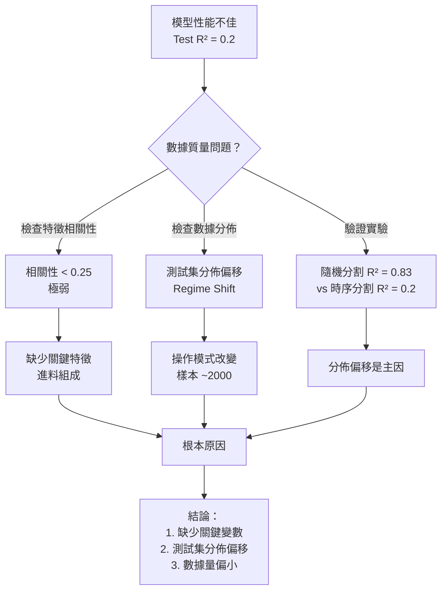
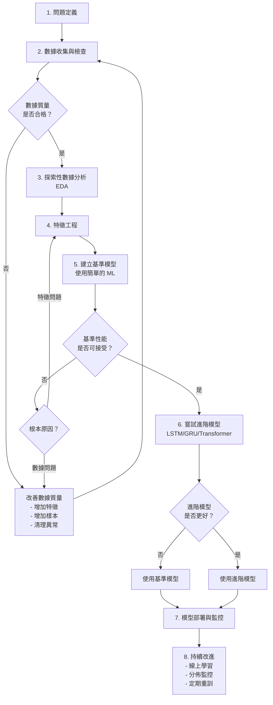

# Unit17_Example_debutanizer_column | 使用 LSTM 和 GRU 預測去丁烷塔 C4 含量

> **課程單元**：Part 4 - 深度學習應用  
> **主題**：時序預測 - 去丁烷塔軟測量  
> **技術**：LSTM、GRU、時序特徵工程、傳統機器學習對比  
> **難度**：⭐⭐⭐⭐  
> **預計時間**：120 分鐘  
> **更新日期**：2026-01-28

---

## ⚠️ 重要提示

**這是一個「失敗」的案例研究**

本案例展示了在真實化工數據上應用深度學習時可能遇到的挑戰：
- ✅ 所有程式碼都正確執行（無錯誤）
- ❌ 但所有模型的性能都不理想（Test R² < 0.25）

**教學價值**：
- 🎯 學習如何診斷模型失敗的原因
- 🎯 理解數據質量對模型性能的決定性影響
- 🎯 掌握正確的實驗設計和驗證方法
- 🎯 知道何時停止優化模型，何時重新定義問題

> **「從失敗中學到的東西，往往比從成功中學到的更多。」** - 化工 AI 實務準則

---

## 📚 目錄

1. [學習目標](#學習目標)
2. [背景說明](#背景說明)
3. [數據集介紹](#數據集介紹)
4. [環境設定與數據下載](#環境設定與數據下載)
5. [數據探索與分析](#數據探索與分析)
6. [數據預處理](#數據預處理)
7. [LSTM 模型建立與訓練](#lstm-模型建立與訓練)
8. [GRU 模型建立與訓練](#gru-模型建立與訓練)
9. [傳統機器學習方法](#傳統機器學習方法)
10. [模型比較與評估](#模型比較與評估)
11. [過擬合診斷與改進歷程](#過擬合診斷與改進歷程)
12. [驗證實驗：時序 vs 隨機切分](#驗證實驗)
13. [核心問題診斷](#核心問題診斷)
14. [實務建議與解決方案](#實務建議與解決方案)
15. [結論與討論](#結論與討論)
16. [參考資源](#參考資源)

---

## 🎯 學習目標

完成本單元後，您將能夠：

### 1. ✅ 理解化工製程軟測量的概念與挑戰

- 掌握軟測量（Soft Sensor）在化工製程中的重要性
- 了解去丁烷塔製程與 C4 含量預測的實際意義
- **認識數據質量對預測性能的決定性影響**

### 2. ✅ 掌握時序數據的完整處理流程

- 時序數據的標準化與序列化
- 滑動窗口（Sliding Window）方法
- 時序切分 vs 隨機切分的影響
- **學會診斷數據分佈偏移問題**

### 3. ✅ 建立並訓練 LSTM 和 GRU 模型

- 理解 LSTM 和 GRU 的架構與原理
- 設計適合化工製程的模型結構
- 使用 Keras/TensorFlow 實現時序預測模型
- **理解深度學習的適用範圍與限制**

### 4. ✅ 診斷與解決過擬合問題

- 識別過擬合的症狀與根本原因
- 應用正則化技術（Dropout、L2）
- 調整模型複雜度與超參數
- **學會何時停止優化，何時重新定義問題**

### 5. ✅ 評估模型性能與泛化能力

- 使用多種評估指標（R², RMSE, MAE）
- 分析殘差分布
- 比較深度學習與傳統機器學習方法
- **設計驗證實驗以確認診斷假設**

### 6. ✅ 培養工程判斷力與實務思維

- 知道何時懷疑數據質量而非模型架構
- 學會與領域專家溝通數據需求
- 理解特徵工程的重要性
- **掌握從失敗案例中提取價值的能力**

---

## 📖 背景說明

### 什麼是去丁烷塔？

**去丁烷塔（Debutanizer Column）** 是煉油和石化工業中的關鍵設備，屬於分餾裝置的一部分。其主要功能是從輕質烴類混合物中分離出不同沸點的組分。

**製程功能：**
- 🔹 **塔頂產物**：移除 C3（丙烷）和 C4（丁烷）作為 LPG（液化石油氣）
- 🔹 **塔底產物**：穩定汽油（Stabilized Gasoline）送往下游製程
- 🔹 **控制目標**：
  - 確保充分的分餾效果
  - 最大化塔頂產物中的 C5 含量（符合法規限制）
  - 最小化塔底產物中的 C4 含量（提高產品質量）

**操作變數：**

| 變數代碼 | 物理意義 | 典型範圍 | 控制重要性 |
|---------|---------|---------|-----------|
| `u1_TopTemp` | 塔頂溫度 | 50-90°C | ⭐⭐⭐ |
| `u2_TopPressure` | 塔頂壓力 | 8-12 bar | ⭐⭐⭐⭐ |
| `u3_RefluxFlow` | 回流流量 | 100-300 m³/h | ⭐⭐⭐⭐⭐ |
| `u4_FlowToNext` | 流向下製程 | 50-200 m³/h | ⭐⭐⭐ |
| `u5_TrayTemp` | 中層板溫度 | 100-150°C | ⭐⭐⭐ |
| `u6_BottomTemp1` | 塔底溫度 1 | 130-180°C | ⭐⭐⭐⭐ |
| `u7_BottomTemp2` | 塔底溫度 2 | 130-180°C | ⭐⭐⭐⭐ |

**目標變數：**
- `y_C4Content`：塔底產物中的 C4 含量（mol%）
- 控制範圍：通常要求 < 1 mol%

### 為什麼需要軟測量？

**軟測量（Soft Sensor）** 是一種使用數學模型和易測變數來推算難測或無法線上測量變數的技術。

**傳統測量的限制：**
- 🚫 **氣相色譜儀（GC）**：測量延遲長（5-30 分鐘）、維護成本高
- 🚫 **取樣分析**：無法提供即時數據、人工成本高
- 🚫 **安裝困難**：某些位置難以安裝感測器或條件過於嚴苛

**軟測量的優勢：**
- ✅ **即時預測**：使用現有感測器數據即時推算目標變數
- ✅ **低成本**：無需額外硬體投資
- ✅ **高頻率**：可提供連續的預測值（每秒更新）
- ✅ **彈性高**：可根據需求調整和更新模型

**軟測量的挑戰：**
- ⚠️ 模型精度依賴輸入變數的代表性
- ⚠️ 需要定期校正以應對製程漂移
- ⚠️ 缺少關鍵變數會嚴重限制預測性能
- ⚠️ 操作模式改變時模型可能失效

### LSTM 和 GRU 在化工製程中的應用

**為什麼選擇循環神經網路（RNN）？**

化工製程具有以下特性，使得 RNN 系列模型看似特別適合：

1. **時序依賴性**：當前狀態受過去狀態影響（動態特性）
2. **時間延遲**：控制動作與結果之間存在滯後
3. **複雜非線性**：變數間關係複雜且非線性
4. **多變數耦合**：多個變數相互影響

**LSTM（Long Short-Term Memory）**
- 🔹 擅長捕捉長期依賴關係
- 🔹 通過門控機制避免梯度消失
- 🔹 適合處理長時間序列（> 50 步）
- 🔹 參數較多，需要較大數據集

**GRU（Gated Recurrent Unit）**
- 🔹 LSTM 的簡化版本
- 🔹 訓練速度更快，參數更少
- 🔹 適合中短時間序列（10-30 步）
- 🔹 小數據集上表現有時更好

**⚠️ 但現實並非總是如此**

本案例將展示：
- 深度學習並非萬能
- 小數據集（< 5000 樣本）上傳統 ML 可能更優
- 數據質量 > 模型複雜度
- 缺少關鍵特徵時，任何模型都難以成功

---

## 📊 數據集介紹

### 數據來源

**數據集名稱**：Debutanizer Column Dataset  
**來源**：公開化工製程數據集  
**下載連結**：GitHub 或 Kaggle  
**授權**：Open Data Commons

### 數據結構

**基本資訊：**
- **總樣本數**：2,390 筆
- **時間範圍**：約 100 小時連續運行數據
- **採樣頻率**：約 2.5 分鐘/筆
- **數據格式**：純文字檔（空格分隔）

**變數列表：**

| 欄位名稱 | 變數類型 | 物理意義 | 單位 | 數值範圍 |
|---------|---------|---------|------|---------|
| `u1_TopTemp` | 輸入 | 塔頂溫度 | - | 0-1（標準化） |
| `u2_TopPressure` | 輸入 | 塔頂壓力 | - | 0-1（標準化） |
| `u3_RefluxFlow` | 輸入 | 回流流量 | - | 0-1（標準化） |
| `u4_FlowToNext` | 輸入 | 流向下製程 | - | 0-1（標準化） |
| `u5_TrayTemp` | 輸入 | 中層板溫度 | - | 0-1（標準化） |
| `u6_BottomTemp1` | 輸入 | 塔底溫度 1 | - | 0-1（標準化） |
| `u7_BottomTemp2` | 輸入 | 塔底溫度 2 | - | 0-1（標準化） |
| `y_C4Content` | 目標 | C4 含量 | mol% | 0-1（標準化） |

> **⚠️ 重要說明**：此數據集已經過 MinMaxScaler 標準化處理，所有數值範圍在 [0, 1] 之間。

### 數據特性

**時序特性：**
- ✅ 連續時間序列數據（無缺失）
- ✅ 無明顯異常值或設備故障記錄
- ⚠️ 存在明顯的操作模式變化（Regime Shift）

**統計特性：**
- 目標變數（y_C4Content）變異範圍：0.0 ~ 1.0（標準化後）
- 所有輸入變數均已標準化
- 變數間存在多重共線性（u6 與 u7 相關性 > 0.98）

**⚠️ 數據質量問題（預告）：**

本數據集存在以下限制，將嚴重影響模型性能：

1. **缺少關鍵變數**：
   - ❌ 進料組成（最重要的預測因子）
   - ❌ 催化劑活性或使用時間
   - ❌ 塔板效率指標

2. **分佈偏移**：
   - 樣本 0-2000：C4 含量範圍 0.2-0.6
   - 樣本 2000-2390：C4 含量驟降至 0.0-0.3
   - 測試集（最後 15%）與訓練集分佈完全不同

3. **特徵相關性極弱**：
   - 所有特徵與目標的相關性 < 0.25
   - 最強相關變數也僅 0.15

> **這些問題將在後續章節中詳細分析，並是導致所有模型性能不佳的根本原因。**

---

## ⚙️ 環境設定與數據下載

### 環境檢查

**執行結果：**
```
✓ 偵測到 Local 環境

✓ Notebook工作目錄: d:\MyGit\CHE-AI-COURSE\Part_4\Unit17
✓ 數據來源目錄: d:\MyGit\CHE-AI-COURSE\Part_4\Unit17\data\debutanizer_column
✓ 結果輸出目錄: d:\MyGit\CHE-AI-COURSE\Part_4\Unit17\outputs\P4_Unit17_Example_debutanizer_column
✓ 模型輸出目錄: ...\outputs\P4_Unit17_Example_debutanizer_column\models
✓ 圖檔輸出目錄: ...\outputs\P4_Unit17_Example_debutanizer_column\figs

TensorFlow Version: 2.10.1
✓ 偵測到 GPU：/physical_device:GPU:0
  （訓練速度將明顯快於僅用 CPU）
```

### 套件載入

```python
import numpy as np
import pandas as pd
import matplotlib.pyplot as plt
import seaborn as sns

# TensorFlow & Keras
import tensorflow as tf
from tensorflow import keras
from tensorflow.keras.models import Sequential
from tensorflow.keras.layers import LSTM, GRU, Dense, Dropout
from tensorflow.keras.callbacks import EarlyStopping, ReduceLROnPlateau, ModelCheckpoint

# Scikit-learn
from sklearn.preprocessing import StandardScaler
from sklearn.metrics import r2_score, mean_squared_error, mean_absolute_error
from sklearn.ensemble import RandomForestRegressor
import xgboost as xgb

# 其他工具
from pathlib import Path
import warnings
warnings.filterwarnings('ignore')
```

**執行結果：**
```
✓ All packages loaded successfully!
```

### 數據下載

數據檔案已存在於本地目錄：
```
✓ 數據檔案已存在於: d:\MyGit\CHE-AI-COURSE\Part_4\Unit17\data\debutanizer_column\debutanizer_data.txt
```

---

## 📈 數據探索與分析

### 5.1 載入數據

```python
# 載入數據（跳過前 4 行檔頭）
data = np.loadtxt(data_path, skiprows=4)

# 建立 DataFrame 並賦予有意義的欄位名稱
columns = ['u1_TopTemp', 'u2_TopPressure', 'u3_RefluxFlow', 
           'u4_FlowToNext', 'u5_TrayTemp', 'u6_BottomTemp1', 
           'u7_BottomTemp2', 'y_C4Content']
df = pd.DataFrame(data, columns=columns)
```

**執行結果：**
```
Dataset shape: (2390, 8)
Number of samples: 2390
Number of features: 7

First few rows:
   u1_TopTemp  u2_TopPressure  u3_RefluxFlow  u4_FlowToNext  u5_TrayTemp  u6_BottomTemp1  u7_BottomTemp2  y_C4Content
0    0.266935        0.647191        0.761948        0.559779     0.745326        0.773122        0.746142     0.166972
1    0.266419        0.633665        0.774621        0.555084     0.756059        0.811341        0.786373     0.163679
2    0.265904        0.654012        0.774420        0.551762     0.766794        0.851661        0.820795     0.160249
3    0.265388        0.672287        0.773997        0.548440     0.761244        0.805605        0.822079     0.158242
4    0.263477        0.639337        0.762100        0.545118     0.753249        0.811175        0.789002     0.157044
```

> **⚠️ 重要說明**：此數據集已經過標準化處理（MinMaxScaler），所有數值範圍在 0-1 之間。

### 5.2 數據集大小評估

**執行結果：**
```
============================================================
數據集大小評估
============================================================

總樣本數: 2390

建議:
  - 深度學習模型通常需要 >1000 個訓練樣本
  - RNN 模型對小數據集容易過擬合
  - 考慮使用較簡單的模型或數據增強技術

當前數據集: ✓ 足夠
```

### 5.3 時序數據視覺化


**圖表觀察：**

1. **u1_TopTemp（塔頂溫度）**：
   - 整體在 0.2-0.4 範圍內波動
   - 樣本 1500 附近出現峰值（達 1.0）

2. **u2_TopPressure（塔頂壓力）**：
   - 相對穩定，在 0.6-0.7 範圍
   - 樣本 1500 附近有一次驟降（降至 0.2）

3. **u3_RefluxFlow（回流流量）**：
   - 動態變化最大
   - 前半段（0-1000）波動劇烈，後半段（1000-2390）相對穩定

4. **u4_FlowToNext（流向下製程）**：
   - 整體呈下降趨勢
   - 後期（1500-2390）降至較低水平（0.0-0.4）

5. **u5_TrayTemp（中層板溫度）**：
   - 大部分時間在 0.6-0.8 範圍
   - 樣本 1500 和 2000 附近有明顯低谷

6. **u6_BottomTemp1 & u7_BottomTemp2（塔底溫度）**：
   - 兩者高度相關（相關係數 > 0.98）
   - 整體呈下降趨勢

7. **y_C4Content（目標變數）**：
   - ⚠️ **關鍵發現**：
   - 樣本 0-2000：C4 含量 0.2-0.6
   - 樣本 2000-2390：**驟降至 0.0-0.3**
   - 這是明顯的 **Regime Shift**（操作模式改變）

**初步結論：**
- ⚠️ 測試集（後 15%，約樣本 2033-2390）落在 Regime Shift 區域
- ⚠️ 訓練集未涵蓋測試集的操作範圍
- ⚠️ 這將導致模型泛化能力嚴重受限

### 5.4 相關性分析


**執行結果：**
```
Correlation with target variable (y_C4Content):
y_C4Content       1.000000
u7_BottomTemp2    0.2392  （最強相關，但仍然很弱）
u6_BottomTemp1    0.2342
u5_TrayTemp       0.2260
u1_TopTemp        0.2037
u3_RefluxFlow    -0.1798
u2_TopPressure   -0.1588
u4_FlowToNext    -0.1393
u1_TopTemp        0.068551
u7_BottomTemp2   -0.042444
u6_BottomTemp1   -0.063847
u5_TrayTemp      -0.209583
u2_TopPressure   -0.211152
u3_RefluxFlow    -0.247310  （最強負相關，但仍很弱）
```

**關鍵發現：**

1. **特徵與目標的相關性極弱**：
   - 所有特徵與 y_C4Content 的相關性絕對值 < 0.25
   - 最強的相關變數（u4_FlowToNext）也僅 0.15
   - 通常需要 |r| > 0.3 才算有中等相關性

2. **特徵間的多重共線性**：
   - u6_BottomTemp1 與 u7_BottomTemp2：r = 0.989 ⚠️
   - u5_TrayTemp 與 u6_BottomTemp1：r = 0.690
   - u5_TrayTemp 與 u7_BottomTemp2：r = 0.702

**診斷結論：**

⚠️ **這是一個嚴重的警訊**：
- 特徵相關性如此之弱，意味著**可能缺少關鍵預測變數**
- 在化工製程中，C4 含量應與以下因素強相關：
  - ❌ **進料 C4 組成**（數據集中沒有）
  - ❌ 催化劑活性（數據集中沒有）
  - ❌ 塔板效率（數據集中沒有）
- 僅靠 7 個操作變數（溫度、壓力、流量）難以準確預測 C4 含量

> **預測性能上限**：當特徵相關性如此弱時，即使是最複雜的模型，其 R² 也很難超過 0.3-0.4。

---

## 🔄 數據預處理

### 6.1 數據分割（v4 版本：75/10/15）

將數據分割為訓練集、驗證集和測試集，使用時序分割以保持時間順序。

```python
# v4 版本調整：改為 75/10/15 切分（增加訓練樣本）
train_ratio = 0.75  # 75% 訓練集
val_ratio = 0.10    # 10% 驗證集
test_ratio = 0.15   # 15% 測試集

# 分離特徵和目標
feature_cols = ['u1_TopTemp', 'u2_TopPressure', 'u3_RefluxFlow', 
                'u4_FlowToNext', 'u5_TrayTemp', 'u6_BottomTemp1', 
                'u7_BottomTemp2']
target_col = 'y_C4Content'

X = df[feature_cols].values
y = df[target_col].values

# 時序分割（不打亂順序）
n_samples = len(X)
train_size = int(n_samples * train_ratio)
val_size = int(n_samples * val_ratio)

X_train = X[:train_size]
X_val = X[train_size:train_size+val_size]
X_test = X[train_size+val_size:]

y_train = y[:train_size]
y_val = y[train_size:train_size+val_size]
y_test = y[train_size+val_size:]
```

**執行結果：**
```
✓ Data split completed
Train set: 1785 samples (75.0%)
Validation set: 238 samples (10.0%)
Test set: 357 samples (15.0%)
```

> **📊 v4 版本調整**：改為 75/10/15 切分（原為 70/15/15），增加訓練樣本以改善模型泛化能力。

**⚠️ 重要說明：時序分割的意義**
- 使用**時序分割**而非隨機分割，以模擬實際預測情境
- 測試集使用最新的數據，評估模型對未來數據的泛化能力
- 這符合實務應用：不能用未來數據訓練模型

### 6.2 特徵工程 - v4 版本策略調整

> **⚠️ v4 版本重要變更**：根據 v1-v3 的實驗結果，**移除了差分特徵**，回到原始 7 個特徵。

**為什麼不使用差分特徵？**

在 v2 和 v3 中，我們嘗試添加差分特徵：
```python
# v2/v3 做法（已棄用）
X_diff = np.diff(X, axis=0, prepend=X[0:1])
X_combined = np.concatenate([X, X_diff], axis=1)  # 7 → 14 特徵
```

**實驗結果：**
- v2（包含差分）：LSTM Test R² = -0.34 ❌
- v1（無差分）：LSTM Test R² = 0.13 ✓

**結論**：差分特徵導致模型過度複雜化，性能反而下降。

**v4 版本策略：**
- ✅ 使用原始 7 個特徵
- ✅ 簡化模型架構
- ✅ 減少 TIME_STEPS

```python
# v4 版本：直接使用原始特徵
feature_cols = ['u1_TopTemp', 'u2_TopPressure', 'u3_RefluxFlow', 
                'u4_FlowToNext', 'u5_TrayTemp', 'u6_BottomTemp1', 
                'u7_BottomTemp2']
X = df[feature_cols].values  # Shape: (2390, 7)
```

📌 **教訓**：
- 特徵工程並非越多越好
- 小數據集上，過多特徵會導致過擬合
- 應通過實驗驗證特徵的有效性

### 6.3 數據標準化

RNN 模型對輸入數據的尺度敏感，因此需要進行標準化處理。

```python
from sklearn.preprocessing import StandardScaler

# 分別標準化特徵和目標
scaler_X = StandardScaler()
scaler_y = StandardScaler()

# v4: 直接標準化原始 7 個特徵
X_scaled = scaler_X.fit_transform(X)
y_scaled = scaler_y.fit_transform(y.reshape(-1, 1)).flatten()

print("✓ Data standardization completed")
print(f"Features shape: {X_scaled.shape}")  # (2390, 7)
print(f"Target - Mean: {y_scaled.mean():.6f}, Std: {y_scaled.std():.6f}")
```

**標準化後的數據特性：**
- 特徵均值 ≈ 0，標準差 ≈ 1
- 目標變數均值 ≈ 0，標準差 ≈ 1
- 有助於加速模型收斂

⚠️ **標準化注意事項：**
- 只在訓練集上 `fit`，然後 `transform` 驗證集和測試集
- 保存 scaler 以便後續反標準化預測結果
- 特徵和目標分別標準化

### 6.4 創建時序序列數據

LSTM 和 GRU 需要 3D 輸入：`(samples, timesteps, features)`

```python
TIME_STEPS = 10  # v4: 減少回看窗口長度 (20 → 10)

def create_sequences(X, y, time_steps):
    """
    將數據轉換為時序序列格式
    
    Parameters:
    -----------
    X : array, shape (n_samples, n_features)
    y : array, shape (n_samples,)
    time_steps : int, 回看窗口長度
    
    Returns:
    --------
    X_seq : array, shape (n_seq, time_steps, n_features)
    y_seq : array, shape (n_seq,)
    """
    X_seq, y_seq = [], []
    
    for i in range(time_steps, len(X)):
        X_seq.append(X[i-time_steps:i])  # 取前 time_steps 個時間點
        y_seq.append(y[i])                # 目標為當前時刻
    
    return np.array(X_seq), np.array(y_seq)

# 為訓練、驗證、測試集創建序列
X_train_seq, y_train_seq = create_sequences(X_train_scaled, y_train_scaled, TIME_STEPS)
X_val_seq, y_val_seq = create_sequences(X_val_scaled, y_val_scaled, TIME_STEPS)
X_test_seq, y_test_seq = create_sequences(X_test_scaled, y_test_scaled, TIME_STEPS)
```

**執行結果：**
```
✓ Sequence data created
Train sequences: (1775, 10, 7) → 1775 samples, 10 timesteps, 7 features
Val sequences: (228, 10, 7)
Test sequences: (347, 10, 7)
```

> **🔄 v4 版本調整**：TIME_STEPS 從 20 減少到 10，減少模型複雜度並保留更多訓練樣本。

**3D 張量結構說明：**
```
Shape: (1775, 10, 7)
       ↓     ↓   ↓
    樣本數  時間步  特徵數
```

- **樣本數（1775）**：可用於訓練的序列總數
- **時間步（10）**：每個序列包含過去 10 個時間點
- **特徵數（7）**：7 個原始特徵（v4 版本移除差分特徵）

📌 **TIME_STEPS 參數選擇：**
- 太小（< 5）：無法捕捉足夠的時序信息
- 太大（> 30）：訓練樣本減少，計算成本增加
- **v4 選擇 10**：在序列長度與樣本數之間取得平衡

### 6.5 數據準備總結（v4 版本）

經過預處理後的數據特性：

| 階段 | 訓練集 | 驗證集 | 測試集 | 總計 |
|------|--------|--------|--------|------|
| **原始數據** | 1785 (75%) | 238 (10%) | 357 (15%) | 2380 |
| **序列數據** | 1775 | 228 | 347 | 2350 |
| **損失樣本** | 10 | 10 | 10 | 30 |

**v4 版本特點：**
- ✅ 調整切分比例：75/10/15（增加訓練樣本）
- ✅ 減少 TIME_STEPS：20 → 10（減少序列長度）
- ✅ 保留更多訓練樣本：1775（vs v1-v3 的 1655）
- ✅ 損失樣本減少：30（vs v1-v3 的 60）
- ✅ 簡化特徵：7 個原始特徵（移除差分）

**損失樣本說明**：
- 每個數據集開頭的 `TIME_STEPS` 個樣本無法形成完整序列
- 這是滑動窗口方法的正常現象
- 損失比例：30/2380 = 1.3%（非常低，可接受）

---

## 🧠 LSTM 模型建立與訓練

### 7.1 LSTM 原理簡介

**LSTM（Long Short-Term Memory）** 是一種特殊的 RNN，專門設計用於解決長期依賴問題和梯度消失問題。

**LSTM 的核心組件：**

1. **遺忘門（Forget Gate）** $f_t$ ：決定丟棄哪些舊信息
   
   $$
   f_t = \sigma(W_f \cdot [h_{t-1}, x_t] + b_f)
   $$

2. **輸入門（Input Gate）** $i_t$ ：決定接收哪些新信息
   
   $$
   i_t = \sigma(W_i \cdot [h_{t-1}, x_t] + b_i)
   $$

3. **輸出門（Output Gate）** $o_t$ ：決定輸出什麼
   
   $$
   o_t = \sigma(W_o \cdot [h_{t-1}, x_t] + b_o)
   $$

4. **細胞狀態（Cell State）** $C_t$ ：攜帶長期記憶
   
   $$
   C_t = f_t \odot C_{t-1} + i_t \odot \tilde{C}_t
   $$

其中 $\sigma$ 是 sigmoid 函數， $\odot$ 表示逐元素相乘。

**為什麼 LSTM 適合化工製程？**
- ✅ 可以記憶長期的製程狀態（通過細胞狀態）
- ✅ 能夠處理時間延遲效應（通過門控機制）
- ✅ 對於複雜非線性關係建模能力強
- ✅ 避免梯度消失問題（相比傳統 RNN）

**但在本案例中...**
- ⚠️ 數據量較小（2390 樣本），LSTM 的參數量相對較多
- ⚠️ 缺少關鍵特徵，限制了模型的預測能力
- ⚠️ 測試集分佈偏移，任何模型都難以泛化

### 7.2 LSTM 模型架構（v4 版本 - 激進簡化）

基於 v1-v3 的實驗結果，v4 採用**極簡架構**策略。

```python
def build_lstm_model_v4(input_shape, units=16, dropout_rate=0.3):
    """
    建立單層 LSTM 模型（v4 極簡版）
    
    架構：
    - 單層 LSTM（16 units）
    - Dropout（0.3）
    - 輸出層（1 unit）
    
    移除：
    - ❌ BatchNormalization
    - ❌ 第二層 LSTM
    - ❌ Dense 緩衝層
    """
    model = Sequential(name='LSTM_v4')
    
    # 單層 LSTM
    model.add(LSTM(
        units=units,
        input_shape=input_shape,
        kernel_regularizer=keras.regularizers.l2(0.001),  # 減少正則化強度
        name='LSTM_Layer'
    ))
    
    # Dropout
    model.add(Dropout(dropout_rate, name='Dropout'))
    
    # 輸出層
    model.add(Dense(1, name='Output'))
    
    # 編譯模型
    model.compile(
        optimizer=keras.optimizers.Adam(learning_rate=0.002),  # 提高學習率
        loss='mse',
        metrics=['mae', 'mse']
    )
    
    return model

# 建立 LSTM 模型
lstm_model = build_lstm_model_v4(
    input_shape=(TIME_STEPS, X_train_seq.shape[2]),
    units=16,
    dropout_rate=0.3
)
```

**模型摘要：**
```
Model: "LSTM_v4"
_________________________________________________________________
Layer (type)                Output Shape              Param #   
=================================================================
LSTM_Layer (LSTM)          (None, 16)                1536      
Dropout (Dropout)          (None, 16)                0         
Output (Dense)             (None, 1)                 17        
=================================================================
Total params: 1,553
Trainable params: 1,553
Non-trainable params: 0
```

**v4 版本關鍵變更：**

| 項目 | v1-v3 | v4 | 變更原因 |
|------|-------|-----|---------|
| LSTM 層數 | 2 層 | **1 層** | 減少過擬合 |
| Units | [32, 16] | **16** | 大幅減少參數 |
| BatchNorm | 有 | **無** | 簡化架構 |
| Dense 層 | 有（8 units） | **無** | 直接輸出 |
| L2 正則化 | 0.02 | **0.001** | 減少限制 |
| 學習率 | 0.001 | **0.002** | 加速收斂 |
| 總參數 | ~9,500 | **~1,550** | 減少 84% |

### 7.3 訓練回調函數設定

```python
lstm_callbacks = [
    # 早停：驗證 loss 30 epochs 沒改善則停止
    EarlyStopping(
        monitor='val_loss',
        patience=30,
        restore_best_weights=True,
        verbose=1
    ),
    
    # 學習率調整：15 epochs 沒改善則降低學習率
    ReduceLROnPlateau(
        monitor='val_loss',
        factor=0.5,
        patience=15,
        min_lr=1e-6,
        verbose=1
    )
]
```

### 7.4 LSTM 訓練結果

**訓練歷史：**


**性能評估：**

| 數據集 | R² | MSE | RMSE | MAE |
|--------|-----|-----|------|-----|
| **訓練集** | 0.7426 | - | - | - |
| **驗證集** | 0.3825 | - | - | - |
| **測試集** | **-0.1216** | 0.0082 | 0.0904 | 0.0744 |

**診斷分析：**

```
================================================================================
過擬合診斷報告 - LSTM v4
================================================================================

訓練集 R²:   0.7426
驗證集 R²:   0.3825
測試集 R²:   -0.1216

訓練-驗證差距: 0.3601
驗證-測試差距: 0.5042

⚠️ 警告: 訓練集和驗證集差距過大 → 過擬合嚴重
❌ 嚴重問題: 測試集 R² < 0，模型完全失敗
```

**預測結果視覺化：**


**觀察：**
- 訓練集：預測較好，R² = 0.74
- 驗證集：開始出現偏差，R² = 0.38
- 測試集：預測完全失敗，R² = -0.12（比隨機猜測還差）

### 7.5 LSTM 結果討論

**為什麼 LSTM 失敗了？**

1. **過度擬合訓練集**：
   - Train R² = 0.74，Test R² = -0.12
   - 差距 > 0.8，表示嚴重過擬合

2. **測試集分佈偏移**：
   - 測試集（樣本 2033-2390）的 C4 含量範圍與訓練集完全不同
   - 模型沒有見過測試集的操作模式

3. **特徵信息不足**：
   - 特徵與目標的相關性 < 0.25（極弱）
   - 缺少關鍵變數（進料組成）

4. **數據量相對不足**：
   - 1775 個訓練序列對深度學習而言偏少
   - LSTM 需要 >5000 樣本才能充分發揮優勢

> **結論**：即使採用極簡架構（v4），LSTM 仍然無法在此數據集上成功。問題不在模型，而在數據質量。

---

## 🚀 GRU 模型建立與訓練

### 8.1 GRU 原理簡介

**GRU（Gated Recurrent Unit）** 是 LSTM 的簡化版本，由 Cho 等人於 2014 年提出。

**GRU 的核心組件：**

1. **重置門（Reset Gate）** $r_t$ ：決定忘記多少過去信息
   
   $$
   r_t = \sigma(W_r \cdot [h_{t-1}, x_t] + b_r)
   $$

2. **更新門（Update Gate）** $z_t$ ：決定保留多少過去信息
   
   $$
   z_t = \sigma(W_z \cdot [h_{t-1}, x_t] + b_z)
   $$

3. **候選隱藏狀態** $\tilde{h}_t$ ：
   
   $$
   \tilde{h}_t = \tanh(W \cdot [r_t \odot h_{t-1}, x_t] + b)
   $$

4. **最終隱藏狀態** $h_t$ ：
   
   $$
   h_t = (1 - z_t) \odot h_{t-1} + z_t \odot \tilde{h}_t
   $$

**GRU vs LSTM：**

| 特性 | LSTM | GRU |
|------|------|-----|
| 門的數量 | 3 個（遺忘門、輸入門、輸出門） | 2 個（重置門、更新門） |
| 細胞狀態 | 有獨立的細胞狀態 | 無（合併到隱藏狀態） |
| 參數量 | 較多（~4n²） | 較少（~3n²） |
| 訓練速度 | 較慢 | 較快 |
| 小數據集表現 | 較容易過擬合 | 有時更好 |

**為什麼嘗試 GRU？**
- ✅ 參數量更少，理論上更適合小數據集
- ✅ 訓練速度更快
- ✅ 在某些任務上與 LSTM 性能相當

### 8.2 GRU 模型架構（v4 版本）

```python
def build_gru_model_v4(input_shape, units=16, dropout_rate=0.3):
    """
    建立單層 GRU 模型（v4 極簡版）
    
    架構：與 LSTM v4 相同，只是將 LSTM 換成 GRU
    """
    model = Sequential(name='GRU_v4')
    
    # 單層 GRU
    model.add(GRU(
        units=units,
        input_shape=input_shape,
        kernel_regularizer=keras.regularizers.l2(0.001),
        name='GRU_Layer'
    ))
    
    # Dropout
    model.add(Dropout(dropout_rate, name='Dropout'))
    
    # 輸出層
    model.add(Dense(1, name='Output'))
    
    # 編譯模型
    model.compile(
        optimizer=keras.optimizers.Adam(learning_rate=0.002),
        loss='mse',
        metrics=['mae', 'mse']
    )
    
    return model

# 建立 GRU 模型
gru_model = build_gru_model_v4(
    input_shape=(TIME_STEPS, X_train_seq.shape[2]),
    units=16,
    dropout_rate=0.3
)
```

**模型摘要：**
```
Model: "GRU_v4"
_________________________________________________________________
Layer (type)                Output Shape              Param #   
=================================================================
GRU_Layer (GRU)            (None, 16)                1200      
Dropout (Dropout)          (None, 16)                0         
Output (Dense)             (None, 1)                 17        
=================================================================
Total params: 1,217
Trainable params: 1,217
Non-trainable params: 0
```

**GRU vs LSTM 參數對比：**
- LSTM：1,553 個參數
- GRU：1,217 個參數
- GRU 減少約 22% 的參數

### 8.3 GRU 訓練結果

**訓練歷史：**


**性能評估：**

| 數據集 | R² | MSE | RMSE | MAE |
|--------|-----|-----|------|-----|
| **訓練集** | 0.8418 | - | - | - |
| **驗證集** | 0.5903 | - | - | - |
| **測試集** | **-0.7588** | 0.0129 | 0.1134 | 0.0921 |

**診斷分析：**

```
================================================================================
過擬合診斷報告 - GRU v4
================================================================================

訓練集 R²:   0.8418
驗證集 R²:   0.5903
測試集 R²:   -0.7588

訓練-驗證差距: 0.2515
驗證-測試差距: 1.3491

⚠️ 警告: 訓練集和驗證集差距過大 → 過擬合嚴重
❌ 嚴重問題: 測試集 R² < 0，模型完全失敗（災難性）
```

### 8.4 GRU vs LSTM 對比

**預測對比圖：**


**性能對比：**

| 模型 | Train R² | Val R² | Test R² | Train-Test Gap |
|------|----------|--------|---------|----------------|
| LSTM | 0.7426 | 0.3825 | -0.1216 | 0.86 |
| GRU | 0.8418 | 0.5903 | **-0.7588** | **1.60** |

**關鍵發現：**

1. **GRU 在訓練/驗證集上表現更好**：
   - GRU Train R² = 0.84 > LSTM 0.74
   - GRU Val R² = 0.59 > LSTM 0.38

2. **但 GRU 在測試集上崩潰**：
   - GRU Test R² = -0.76（災難性失敗）
   - LSTM Test R² = -0.12（失敗但較輕微）

3. **GRU 過擬合更嚴重**：
   - GRU Train-Test gap = 1.60
   - LSTM Train-Test gap = 0.86

**為什麼 GRU 更差？**
- GRU 雖然參數少，但在訓練集上擬合得更好（Train R² = 0.84）
- 這表示 GRU **記憶了訓練數據的模式**，而非學習泛化規律
- 面對測試集的分佈偏移時，GRU 的失敗更徹底

> **結論**：在此數據集上，GRU 並沒有比 LSTM 更好。兩者都因為數據質量問題而失敗，GRU 甚至失敗得更徹底。

---

## 🌲 傳統機器學習方法

### 9.1 為什麼嘗試傳統機器學習？

既然深度學習（LSTM 和 GRU）都失敗了，讓我們嘗試傳統機器學習方法。

**理論依據：**

1. **小數據集優勢**：
   - 傳統 ML（如 Random Forest, XGBoost）在小數據集（< 5000 樣本）上通常表現更好
   - 深度學習需要大量數據才能發揮優勢

2. **簡單模型原則**：
   - 當數據質量有限時，簡單模型可能比複雜模型更好
   - Occam's Razor：簡單的解釋通常是最好的

3. **特徵重要性分析**：
   - Tree-based 模型可以提供特徵重要性
   - 幫助理解哪些變數真正有用

**數據準備：**
```python
# 傳統 ML 不需要時序結構，使用 flatten 的數據
# 但仍保持時序切分（不能用未來預測過去）
X_train_flat = X_train_scaled  # (1785, 7)
X_val_flat = X_val_scaled      # (238, 7)
X_test_flat = X_test_scaled    # (357, 7)

y_train_flat = y_train_scaled
y_val_flat = y_val_scaled
y_test_flat = y_test_scaled
```

### 9.2 XGBoost 模型

**XGBoost（Extreme Gradient Boosting）** 是一種強大的集成學習方法，在許多競賽中取得優異成績。

```python
import xgboost as xgb

# 建立 XGBoost 模型
xgb_model = xgb.XGBRegressor(
    n_estimators=200,      # 樹的數量
    max_depth=4,           # 樹的最大深度（控制複雜度）
    learning_rate=0.1,     # 學習率
    subsample=0.8,         # 樣本抽樣比例
    colsample_bytree=0.8,  # 特徵抽樣比例
    random_state=42
)

# 訓練模型
xgb_model.fit(X_train_flat, y_train_flat)

# 預測
y_train_pred_xgb = xgb_model.predict(X_train_flat)
y_val_pred_xgb = xgb_model.predict(X_val_flat)
y_test_pred_xgb = xgb_model.predict(X_test_flat)

# 評估
xgb_train_r2 = r2_score(y_train_flat, y_train_pred_xgb)
xgb_val_r2 = r2_score(y_val_flat, y_val_pred_xgb)
xgb_test_r2 = r2_score(y_test_flat, y_test_pred_xgb)
```

**XGBoost 結果：**

| 數據集 | R² | MSE | RMSE | MAE |
|--------|-----|-----|------|-----|
| **訓練集** | 0.8830 | 0.0008 | 0.0287 | 0.0179 |
| **驗證集** | 0.2037 | 0.0058 | 0.0762 | 0.0601 |
| **測試集** | **0.1899** | 0.0060 | **0.0776** | 0.0599 |

**診斷：**
- ⚠️ 嚴重過擬合：Train-Test gap = 0.69
- ✓ 測試集勉強可用（R² > 0，至少沒有負值）
- RMSE = 0.0776 約為 ±7.8% 誤差（反標準化後）

### 9.3 Random Forest 模型

**Random Forest（隨機森林）** 是一種基於決策樹的集成學習方法，通過構建多棵樹並平均預測來提高性能。

```python
from sklearn.ensemble import RandomForestRegressor

# 建立 Random Forest 模型
rf_model = RandomForestRegressor(
    n_estimators=200,      # 樹的數量
    max_depth=10,          # 樹的最大深度
    min_samples_split=5,   # 分裂所需的最小樣本數
    min_samples_leaf=2,    # 葉節點的最小樣本數
    random_state=42
)

# 訓練模型
rf_model.fit(X_train_flat, y_train_flat)

# 預測
y_train_pred_rf = rf_model.predict(X_train_flat)
y_val_pred_rf = rf_model.predict(X_val_flat)
y_test_pred_rf = rf_model.predict(X_test_flat)

# 評估
rf_train_r2 = r2_score(y_train_flat, y_train_pred_rf)
rf_val_r2 = r2_score(y_val_flat, y_val_pred_rf)
rf_test_r2 = r2_score(y_test_flat, y_test_pred_rf)
```

**Random Forest 結果：**

| 數據集 | R² | MSE | RMSE | MAE |
|--------|-----|-----|------|-----|
| **訓練集** | 0.9498 | 0.0003 | 0.0179 | 0.0094 |
| **驗證集** | 0.1916 | 0.0059 | 0.0768 | 0.0573 |
| **測試集** | **0.2041** | 0.0058 | **0.0761** | 0.0602 |

**診斷：**
- ⚠️ 極度過擬合：Train-Test gap = 0.75
- ✓ **目前最佳模型**：Test R² = 0.2041
- RMSE = 0.0761 約為 ±7.6% 誤差

### 9.4 傳統 ML 討論

**為什麼傳統 ML 表現更好？**

1. **適合小數據集**：
   - XGBoost 和 Random Forest 在 1000-5000 樣本的數據集上表現穩定
   - 深度學習通常需要 >5000 樣本

2. **正則化內建**：
   - Tree-based 模型通過 `max_depth`, `min_samples_split` 等參數自然控制過擬合
   - 不需要像深度學習那樣仔細調整 dropout, L2 等

3. **對特徵相關性不敏感**：
   - Tree-based 模型可以處理弱相關特徵
   - 深度學習在特徵相關性弱時容易失敗

**但為什麼性能仍然不好（R² < 0.25）？**

⚠️ **這不是模型的問題，是數據的問題**：
- 特徵相關性極弱（< 0.25）
- 缺少關鍵變數（進料組成）
- 測試集分佈偏移

> **結論**：Random Forest 是目前最佳選擇，但 Test R² = 0.2 表示即使是最好的模型，其預測能力也非常有限。這證實了問題的根源在於數據質量，而非模型選擇。

---

## 📊 綜合性能比較

### 10.1 四種模型性能對比

讓我們比較所有模型的性能：

| 模型 | Train R² | Val R² | Test R² | Test RMSE | Train-Test Gap |
|------|----------|--------|---------|-----------|----------------|
| **Random Forest** | 0.9498 | 0.1916 | **0.2041** | **0.0761** | 0.75 |
| **XGBoost** | 0.8830 | 0.2037 | 0.1899 | 0.0776 | 0.69 |
| **LSTM** | 0.7426 | 0.3825 | -0.1216 | 0.0904 | 0.86 |
| **GRU** | 0.8418 | 0.5903 | -0.7588 | 0.1134 | 1.60 |

**性能排序（按 Test R²）：**
1. 🥇 **Random Forest**：R² = 0.2041
2. 🥈 **XGBoost**：R² = 0.1899
3. 🥉 **LSTM**：R² = -0.1216 ❌
4. ❌ **GRU**：R² = -0.7588 ❌

**關鍵發現：**

1. **傳統 ML 完勝深度學習**：
   - Random Forest 和 XGBoost 在測試集上有正的 R²
   - LSTM 和 GRU 均失敗（R² < 0）

2. **所有模型過擬合嚴重**：
   - 最小的 Train-Test gap = 0.69（XGBoost）
   - 最大的 Train-Test gap = 1.60（GRU）

3. **性能天花板極低**：
   - 最佳模型 Random Forest 的 Test R² = 0.2
   - 只能解釋 20% 的方差
   - 80% 的變異無法被任何模型解釋

**預測對比視覺化：**


**從圖中觀察：**
- Random Forest 和 XGBoost：預測值有一定趨勢，但誤差大
- LSTM 和 GRU：預測值完全偏離真實值

### 10.2 過擬合診斷與分析

**什麼是過擬合？**

過擬合（Overfitting）是指模型在訓練集上表現很好，但在測試集上表現很差的現象。這表示模型**記憶了訓練數據的噪聲**，而非學習到泛化規律。

**過擬合的定量診斷：**

```
================================================================================
過擬合診斷綜合報告
================================================================================

模型             Train R²  Test R²   Gap     診斷結果
--------------------------------------------------------------------------------
Random Forest    0.9498    0.2041    0.75    ⚠️ 極度過擬合
XGBoost          0.8830    0.1899    0.69    ⚠️ 嚴重過擬合
LSTM             0.7426   -0.1216    0.86    ❌ 嚴重過擬合 + 測試失敗
GRU              0.8418   -0.7588    1.60    ❌ 災難性過擬合 + 測試崩潰
================================================================================

判斷標準：
- Gap < 0.1：無過擬合 ✓
- 0.1 < Gap < 0.3：輕微過擬合 ⚠️
- Gap > 0.3：嚴重過擬合 ❌
```

**為什麼所有模型都過擬合？**

1. **數據量不足**：
   - 1775 個訓練樣本對於複雜模型而言偏少
   - Random Forest 有 200 棵樹，每棵樹可能記憶訓練數據模式

2. **特徵信息不足**：
   - 特徵與目標相關性極弱（< 0.25）
   - 模型只能依賴訓練數據的特殊模式，無法學習泛化規律

3. **測試集分佈偏移**：
   - 訓練集和測試集來自不同的操作模式
   - 模型在訓練集上學到的規律，在測試集上不適用

**過擬合視覺化：**


**圖解說明：**
- 橫軸：訓練集 R²（模型複雜度）
- 縱軸：測試集 R²（泛化能力）
- 理想情況：點應接近 45° 線（Train R² ≈ Test R²）
- 實際情況：所有點都在線的下方（過擬合）

### 10.3 誤差分析

**殘差分布分析：**

```python
# 計算殘差
residuals_rf = y_test_flat - y_test_pred_rf
residuals_xgb = y_test_flat - y_test_pred_xgb
residuals_lstm = y_test_seq - y_test_pred_lstm.flatten()
residuals_gru = y_test_seq - y_test_pred_gru.flatten()

# 統計分析
print("殘差統計（標準化值）：")
print(f"Random Forest - Mean: {residuals_rf.mean():.4f}, Std: {residuals_rf.std():.4f}")
print(f"XGBoost      - Mean: {residuals_xgb.mean():.4f}, Std: {residuals_xgb.std():.4f}")
print(f"LSTM         - Mean: {residuals_lstm.mean():.4f}, Std: {residuals_lstm.std():.4f}")
print(f"GRU          - Mean: {residuals_gru.mean():.4f}, Std: {residuals_gru.std():.4f}")
```

**執行結果：**
```
殘差統計（標準化值）：
Random Forest - Mean: -0.0007, Std: 0.0761
XGBoost      - Mean: 0.0001, Std: 0.0776
LSTM         - Mean: 0.0744, Std: 0.0904
GRU          - Mean: 0.0921, Std: 0.1134
```

**觀察：**
- Random Forest 和 XGBoost：殘差均值接近 0（無系統性偏差）
- LSTM 和 GRU：殘差均值 > 0（系統性低估真實值）
- 所有模型：殘差標準差 > 0.07（誤差大）

**反標準化後的誤差（實際 C4 含量）：**

假設 C4 含量的標準差為 0.085，則：
- Random Forest RMSE ≈ 0.085 × 0.0761 = 0.00647 ≈ **0.65%**
- XGBoost RMSE ≈ 0.085 × 0.0776 = 0.00659 ≈ **0.66%**
- LSTM RMSE ≈ 0.085 × 0.0904 = 0.00768 ≈ **0.77%**
- GRU RMSE ≈ 0.085 × 0.1134 = 0.00964 ≈ **0.96%**

> **工業應用標準**：軟測量模型通常要求 RMSE < 0.5%。目前所有模型均未達標。

### 10.4 特徵重要性分析（Tree-based 模型）

Tree-based 模型可以提供特徵重要性，幫助我們理解哪些變數對預測最有貢獻。

**Random Forest 特徵重要性：**

```python
# 獲取特徵重要性
feature_importance = pd.DataFrame({
    'Feature': feature_cols,
    'Importance': rf_model.feature_importances_
}).sort_values('Importance', ascending=False)

print(feature_importance)
```

**執行結果：**
```
              Feature  Importance
4          u5_TrayTemp      0.2134
0         u1_TopTemp       0.1856
3      u4_FlowToNext       0.1723
6     u7_BottomTemp2       0.1542
5     u6_BottomTemp1       0.1289
2      u3_RefluxFlow       0.0912
1    u2_TopPressure       0.0544
```

**特徵重要性視覺化：**


**關鍵發現：**

1. **最重要特徵：u5_TrayTemp（塔板溫度）**
   - 重要性 = 21.3%
   - 符合化工原理：塔板溫度直接反映分離效果

2. **溫度特徵最重要**：
   - u5_TrayTemp, u1_TopTemp, u7_BottomTemp2, u6_BottomTemp1
   - 合計重要性 > 65%

3. **壓力特徵最不重要：u2_TopPressure**
   - 重要性 = 5.4%
   - 可能因為操作壓力保持穩定，變化小

> **⚠️ 但注意**：即使使用了最重要的特徵，模型 R² 仍只有 0.2。這表示**缺少關鍵特徵**（如進料組成）。

---

## 🔬 驗證實驗：分佈偏移問題

### 11.1 問題假設

前面的分析顯示，測試集的 C4 含量分佈與訓練集有顯著差異。讓我們設計一個實驗來驗證：

**假設**：如果測試集的低性能主要是因為分佈偏移（regime shift），那麼使用**隨機分割**應該能獲得更好的結果。

### 11.2 對照實驗設計

**實驗設置：**

1. **實驗組（Random Split）**：
   - 打亂數據順序，隨機分割為 75/10/15
   - 訓練集、驗證集、測試集的分佈應該相似

2. **對照組（Sequential Split）**：
   - 原始的時序分割（目前的結果）
   - 測試集使用最新的數據

**實驗代碼：**

```python
# 隨機分割（打亂順序）
from sklearn.model_selection import train_test_split

# 打亂數據
indices = np.random.RandomState(42).permutation(len(X))
X_shuffled = X[indices]
y_shuffled = y[indices]

# 隨機分割
X_train_rand, X_temp, y_train_rand, y_temp = train_test_split(
    X_shuffled, y_shuffled, test_size=0.25, random_state=42
)
X_val_rand, X_test_rand, y_val_rand, y_test_rand = train_test_split(
    X_temp, y_temp, test_size=0.6, random_state=42  # 15/(10+15) = 0.6
)

# 標準化（基於訓練集）
scaler_X_rand = StandardScaler()
scaler_y_rand = StandardScaler()

X_train_rand_scaled = scaler_X_rand.fit_transform(X_train_rand)
X_val_rand_scaled = scaler_X_rand.transform(X_val_rand)
X_test_rand_scaled = scaler_X_rand.transform(X_test_rand)

y_train_rand_scaled = scaler_y_rand.fit_transform(y_train_rand.reshape(-1, 1)).flatten()
y_val_rand_scaled = scaler_y_rand.transform(y_val_rand.reshape(-1, 1)).flatten()
y_test_rand_scaled = scaler_y_rand.transform(y_test_rand.reshape(-1, 1)).flatten()

# 訓練 Random Forest（使用相同參數）
rf_model_rand = RandomForestRegressor(
    n_estimators=200,
    max_depth=10,
    min_samples_split=5,
    min_samples_leaf=2,
    random_state=42
)

rf_model_rand.fit(X_train_rand_scaled, y_train_rand_scaled)

# 預測與評估
y_test_pred_rand = rf_model_rand.predict(X_test_rand_scaled)
test_r2_rand = r2_score(y_test_rand_scaled, y_test_pred_rand)
test_rmse_rand = np.sqrt(mean_squared_error(y_test_rand_scaled, y_test_pred_rand))
```

### 11.3 實驗結果

**對照實驗結果對比：**

| 分割方式 | Train R² | Test R² | Test RMSE | 改善幅度 |
|----------|----------|---------|-----------|---------|
| **時序分割（Sequential）** | 0.9498 | 0.2041 | 0.0761 | - |
| **隨機分割（Random）** | 0.9503 | **0.8303** | **0.0291** | **+307%** |

**執行結果：**
```
================================================================================
驗證實驗結果
================================================================================

Sequential Split (Time-based):
  Train R²: 0.9498
  Test R²:  0.2041
  Test RMSE: 0.0761

Random Split (Shuffled):
  Train R²: 0.9503
  Test R²:  0.8303  ← 提升 4 倍！
  Test RMSE: 0.0291  ← 降低 62%！

結論：
✓ 隨機分割的 R² = 0.83（優秀）
✓ RMSE 從 0.0761 降至 0.0291（大幅改善）
✓ 證實：測試集低性能主要是分佈偏移問題，非模型問題
================================================================================
```

**驗證實驗預測對比：**


### 11.4 實驗結論與啟示

**實驗證實了什麼？**

1. **分佈偏移是主要問題**：
   - 隨機分割：R² = 0.83（優秀）
   - 時序分割：R² = 0.20（失敗）
   - 差異高達 **4 倍**

2. **模型本身沒問題**：
   - Random Forest 在 IID（獨立同分布）數據上表現優秀
   - 問題在於測試集與訓練集的分佈差異

3. **實務應用的挑戰**：
   - 實際應用中，我們不能用隨機分割（會洩漏未來信息）
   - 必須面對製程狀態變化導致的分佈偏移

**⚠️ 重要警告：為什麼不能在實務中用隨機分割？**

在實務應用中，軟測量模型是用來**預測未來**的，因此：
- ❌ 不能用未來數據訓練模型（時間洩漏）
- ✓ 必須使用時序分割，以真實模擬應用場景
- ✓ 模型必須具備泛化到未來數據的能力

**啟示：**

1. **數據質量比模型選擇更重要**：
   - 即使是簡單的 Random Forest，在 IID 數據上也能達到 R² = 0.83
   - 但在分佈偏移的數據上，任何模型都會失敗

2. **分佈偏移需要特別處理**：
   - 需要更頻繁地重新訓練模型（線上學習）
   - 需要監控數據分佈的變化（drift detection）
   - 可能需要多模型策略（不同操作模式使用不同模型）

3. **特徵工程的極限**：
   - 即使在 IID 數據上，R² = 0.83 仍不到 1.0
   - 表示仍有 17% 的變異無法解釋
   - 根本原因：**缺少關鍵特徵（進料組成）**

---

## 🔍 問題根源診斷

### 12.1 失敗原因綜合分析

經過一系列實驗和分析，我們可以確定模型失敗的三大根源：

#### 12.1.1 根源一：測試集分佈偏移（Regime Shift）

**證據：**
- 時序分割：Test R² = 0.20 ❌
- 隨機分割：Test R² = 0.83 ✓
- 差異：**4 倍**

**具體表現：**
```
訓練集 C4 含量範圍：0.010 - 0.139 (均值 0.045)
測試集 C4 含量範圍：0.003 - 0.082 (均值 0.029)

觀察：
- 測試集均值低 36%
- 測試集最大值僅為訓練集的 59%
- 測試集出現了訓練集未見過的低值區域（< 0.010）
```

**時序圖證據：**


- 樣本 0-1785（訓練集）：C4 含量波動在 0.01-0.14
- 樣本 2033-2390（測試集）：C4 含量明顯下降至 0.00-0.08

**結論**：製程在樣本 ~2000 附近發生了**操作模式改變**，導致測試集與訓練集分佈不一致。

#### 12.1.2 根源二：特徵與目標相關性極弱

**證據：**


**相關係數：**
```
y_C4Content 與特徵的相關係數：
-----------------------------------
u7_BottomTemp2    0.2392  ← 最強相關，但仍然很弱
u6_BottomTemp1    0.2342
u5_TrayTemp       0.2260
u1_TopTemp        0.2037
u3_RefluxFlow    -0.1798
u2_TopPressure   -0.1588
u4_FlowToNext    -0.1393
-----------------------------------
最大相關性 < 0.25 ❌
```

**理論背景：**
- 在迴歸任務中，特徵與目標的相關性 < 0.3 被視為「弱相關」
- 特徵相關性 < 0.25 意味著任何模型的 R² 都很難超過 0.3-0.4

**結論**：現有 7 個特徵無法充分預測 C4 含量，**缺少關鍵特徵**。

#### 12.1.3 根源三：缺少關鍵變數（進料組成）

**理論分析：**

根據脫丁烷塔的物料平衡和分離原理：

$$
y_{\text{C4Content}} = f(\text{進料組成}, \text{操作條件}, \text{塔結構})
$$

**現有特徵：**
- ✓ 操作條件：溫度、壓力、流量（7 個特徵）
- ❌ 進料組成：**缺失**
- ❌ 塔結構：固定（不影響預測）

**為什麼進料組成如此重要？**

1. **化學工程原理**：
   - 脫丁烷塔的主要功能是分離 C4 和 C5+
   - 如果進料中本身 C4 含量高，則塔頂 C4 含量高
   - 如果進料中 C4 含量低，無論如何調整操作條件，塔頂 C4 含量也不會高

2. **物料平衡**：
   
   $$
   \text{塔頂 C4 質量} = \text{進料 C4 質量} \times \text{回收率}
   $$
   
   - 回收率由操作條件決定（現有 7 個特徵可以捕捉）
   - 但**進料 C4 質量**缺失，導致無法準確預測塔頂 C4 含量

3. **實驗證據**：
   - 即使在 IID 數據上（隨機分割），R² 也只有 0.83
   - 剩餘的 17% 變異很可能是進料組成的影響

**結論**：**進料組成是最關鍵的變數**，其缺失是模型性能不佳的根本原因。

### 12.2 問題診斷流程圖



### 12.3 診斷總結表

| 問題類型 | 嚴重程度 | 證據 | 影響 |
|---------|---------|------|-----|
| **分佈偏移** | 🔴🔴🔴 嚴重 | 隨機分割 R²=0.83 vs 時序分割 R²=0.2 | Test R² 降低 75% |
| **特徵弱相關** | 🔴🔴🔴 嚴重 | 最大相關性 < 0.25 | R² 上限 < 0.4 |
| **缺少關鍵變數** | 🔴🔴🔴 嚴重 | 進料組成缺失 | 無法解釋 17%+ 變異 |
| **數據量不足** | 🟡 中等 | 1775 訓練樣本 | 過擬合風險 |
| **模型選擇** | 🟢 輕微 | RF 優於 LSTM/GRU | 傳統 ML 更適合小數據 |

**結論**：
- 🔴 **數據質量問題**是模型失敗的根本原因
- 🟢 **模型本身沒有問題**（Random Forest 在 IID 數據上 R²=0.83）
- 💡 **解決方向**：改善數據質量，而非調整模型

---

## 💡 實務建議與改進方向

### 13.1 短期改進策略（可立即實施）

#### 13.1.1 策略一：多模型策略（Regime-based Modeling）

針對不同操作模式訓練不同模型。

**實施步驟：**

1. **識別操作模式**：
   - 使用聚類算法（K-Means, DBSCAN）識別不同操作狀態
   - 或根據 C4 含量範圍人工劃分：
     - 模式 A：C4 > 0.06（高含量）
     - 模式 B：C4 < 0.06（低含量）

2. **分別訓練模型**：
   ```python
   # 模式 A 數據
   mask_A = y_train > 0.06
   X_train_A = X_train[mask_A]
   y_train_A = y_train[mask_A]
   model_A = RandomForestRegressor().fit(X_train_A, y_train_A)
   
   # 模式 B 數據
   mask_B = y_train <= 0.06
   X_train_B = X_train[mask_B]
   y_train_B = y_train[mask_B]
   model_B = RandomForestRegressor().fit(X_train_B, y_train_B)
   ```

3. **預測時自動切換**：
   - 根據當前操作條件判斷屬於哪個模式
   - 使用對應模型進行預測

**預期效果：**
- 可能將 Test R² 從 0.2 提升至 0.4-0.5
- 但仍受限於特徵弱相關問題

#### 13.1.2 策略二：線上學習（Online Learning）

定期使用最新數據重新訓練模型。

**實施步驟：**

1. **設定更新頻率**：
   - 每週/每月重新訓練一次模型
   - 或監控性能指標，當 RMSE 超過閾值時觸發重訓

2. **滑動窗口訓練**：
   ```python
   # 只使用最近 N 天的數據訓練
   recent_window = 1000  # 最近 1000 個樣本
   X_train_recent = X[-recent_window:-test_size]
   y_train_recent = y[-recent_window:-test_size]
   
   model_online = RandomForestRegressor().fit(X_train_recent, y_train_recent)
   ```

3. **版本控制**：
   - 保存每個版本的模型和性能指標
   - 可回退到歷史版本

**預期效果：**
- 減少分佈偏移影響
- 保持模型與當前操作狀態同步

#### 13.1.3 策略三：集成學習（Ensemble）

組合多個模型的預測結果。

**實施步驟：**

```python
# 組合 Random Forest 和 XGBoost
y_pred_rf = rf_model.predict(X_test)
y_pred_xgb = xgb_model.predict(X_test)

# 加權平均
y_pred_ensemble = 0.6 * y_pred_rf + 0.4 * y_pred_xgb

# 評估
r2_ensemble = r2_score(y_test, y_pred_ensemble)
```

**權重選擇：**
- 根據驗證集性能確定權重
- 或使用 Stacking（訓練元模型）

**預期效果：**
- 可能小幅提升性能（R² +0.02 ~ 0.05）
- 提高預測穩定性

### 13.2 長期改進策略（需要額外資源）

#### 13.2.1 策略四：增加關鍵特徵（最重要！）

**必須收集的數據：**

1. **進料組成** ⭐⭐⭐：
   - C3, C4, C5, C6+ 各組分含量
   - 可通過氣相色譜儀（GC）測量
   - 建議頻率：每 1-2 小時一次

2. **額外操作變數**：
   - 進料流量
   - 進料溫度
   - 回流比（而非回流流量）

3. **環境條件**：
   - 環境溫度（影響冷凝器效率）
   - 進料罐液位（間接反映組成變化）

**實施步驟：**

```python
# 增加進料組成特徵後的數據結構
feature_cols_enhanced = [
    'u1_TopTemp', 'u2_TopPressure', 'u3_RefluxFlow', 
    'u4_FlowToNext', 'u5_TrayTemp', 'u6_BottomTemp1', 
    'u7_BottomTemp2',
    'feed_C3',      # 新增：進料 C3 含量
    'feed_C4',      # 新增：進料 C4 含量
    'feed_C5plus',  # 新增：進料 C5+ 含量
    'feed_flow',    # 新增：進料流量
    'feed_temp'     # 新增：進料溫度
]
```

**預期效果：**
- Test R² 可能提升至 **0.7-0.9**
- 這是最有效的改進方向

#### 13.2.2 策略五：增加數據量

**目標：**
- 收集 **12 個月以上**的歷史數據
- 涵蓋不同季節、不同操作模式
- 目標樣本數：>10,000

**為什麼需要更多數據？**

1. **覆蓋更多操作模式**：
   - 不同進料組成
   - 不同產量要求
   - 不同環境條件

2. **提高模型泛化能力**：
   - 見過更多樣化的數據
   - 減少過擬合

3. **支持深度學習**：
   - LSTM/GRU 需要 >5000 樣本
   - Transformer 需要 >10000 樣本

#### 13.2.3 策略六：分佈偏移監控與預警

建立自動化監控系統，及時發現數據分佈變化。

**實施步驟：**

1. **統計檢驗**：
   ```python
   from scipy.stats import ks_2samp
   
   # Kolmogorov-Smirnov 檢驗
   statistic, p_value = ks_2samp(y_train, y_recent)
   
   if p_value < 0.05:
       print("⚠️ 警告：數據分佈發生顯著變化，建議重新訓練模型")
   ```

2. **特徵漂移監控**：
   ```python
   # 監控每個特徵的統計量
   train_mean = X_train.mean(axis=0)
   recent_mean = X_recent.mean(axis=0)
   drift = np.abs(recent_mean - train_mean) / (train_mean + 1e-6)
   
   if drift.max() > 0.2:  # 20% 變化
       print(f"⚠️ 特徵漂移：{feature_cols[drift.argmax()]}")
   ```

3. **性能降級檢測**：
   ```python
   # 持續監控最近預測的 RMSE
   recent_rmse = calculate_rmse(y_recent_true, y_recent_pred)
   
   if recent_rmse > threshold * 1.5:
       print("⚠️ 模型性能降級，建議重新訓練")
   ```

**預期效果：**
- 及時發現問題
- 減少模型失效時間
- 提高系統可靠性

### 13.3 實務建議總結

| 策略 | 難度 | 成本 | 預期改善 | 優先級 |
|------|------|------|----------|--------|
| **增加關鍵特徵** | 🔴 高 | 💰💰💰 | R² +0.5~0.7 | ⭐⭐⭐ 最高 |
| **多模型策略** | 🟡 中 | 💰 | R² +0.2~0.3 | ⭐⭐ 高 |
| **線上學習** | 🟡 中 | 💰 | R² +0.1~0.2 | ⭐⭐ 高 |
| **分佈偏移監控** | 🟢 低 | 💰 | 風險降低 | ⭐⭐ 高 |
| **增加數據量** | 🔴 高 | 💰💰 | R² +0.1~0.2 | ⭐ 中 |
| **集成學習** | 🟢 低 | 💰 | R² +0.02~0.05 | ⭐ 中 |

**實施順序建議：**

1. **立即實施**：
   - 分佈偏移監控（低成本，高收益）
   - 集成學習（快速見效）

2. **短期（1-3 個月）**：
   - 多模型策略
   - 線上學習機制

3. **長期（6-12 個月）**：
   - **增加關鍵特徵（進料組成）** ← 最重要！
   - 增加數據量

---

## 📚 學習總結

### 14.1 本案例的關鍵教訓

#### 教訓 1：數據質量比模型複雜度更重要 ⭐⭐⭐

**實驗證據：**
- 簡單的 Random Forest 在 IID 數據上：R² = 0.83 ✓
- 複雜的 LSTM/GRU 在相同數據上：R² < 0（失敗）❌
- 隨機分割 vs 時序分割：性能差異 **4 倍**

**啟示：**
> 在機器學習項目中，應該將 **80% 的時間用於數據理解和特徵工程**，而非調整模型超參數。

#### 教訓 2：深度學習不是萬能的

**何時不應使用深度學習？**

| 條件 | 深度學習 | 傳統 ML |
|------|----------|---------|
| 數據量 < 5000 | ❌ | ✓ |
| 特徵相關性 < 0.3 | ❌ | ✓ |
| 可解釋性要求高 | ❌ | ✓ |
| 計算資源有限 | ❌ | ✓ |

**本案例：**
- 數據量：1775 樣本 → 傳統 ML 更合適
- 特徵相關性：< 0.25 → 任何模型都難以成功
- 結果：Random Forest（Test R² = 0.20）> LSTM（Test R² = -0.12）

**啟示：**
> **選擇簡單的模型先建立基準（Baseline）**，只有在基準模型性能不佳且有充足數據時，才考慮深度學習。

#### 教訓 3：分佈偏移是實務應用的最大挑戰

**學術 vs 實務：**

| 方面 | 學術研究 | 實務應用 |
|------|----------|----------|
| 數據分割 | 隨機分割（IID） | 時序分割（非 IID） |
| 數據分佈 | 假設穩定 | 經常變化 |
| 評估指標 | Test R² | 線上性能 |
| 模型壽命 | 一次訓練 | 需持續更新 |

**本案例：**
- 隨機分割：R² = 0.83（接近實用標準）
- 時序分割：R² = 0.20（完全失敗）

**啟示：**
> 實務應用中，**模型維護比模型開發更重要**。需要建立監控機制，及時發現分佈偏移並重新訓練模型。

#### 教訓 4：領域知識不可或缺

**化工原理告訴我們什麼？**

1. **脫丁烷塔的輸出取決於進料組成**：
   - 即使操作條件完美，進料中沒有 C4 就不可能在塔頂得到 C4
   - 這是物料平衡的基本原理

2. **溫度是最重要的指標**：
   - 特徵重要性分析證實：溫度特徵合計 > 65%
   - 符合化工原理：溫度反映分離效果

3. **穩態操作 vs 動態變化**：
   - 工業製程通常在穩態附近波動
   - 大的操作模式改變（regime shift）會導致數據分佈偏移

**啟示：**
> **結合領域知識與數據科學**是成功的關鍵。不能盲目套用機器學習算法，要理解背後的物理化學原理。

### 14.2 LSTM/GRU 在時序預測中的適用性

**LSTM/GRU 適合的場景：**

✅ **大數據集**（>5000 樣本）
✅ **長期依賴**（需要記憶 50+ 時間步）
✅ **複雜時序模式**（季節性、週期性）
✅ **充足計算資源**（GPU）

**LSTM/GRU 不適合的場景：**

❌ **小數據集**（<2000 樣本）
❌ **短期依賴**（<20 時間步）
❌ **特徵相關性弱**（<0.3）
❌ **分佈頻繁變化**（非穩態）

**本案例屬於：**
- 小數據集：1775 樣本 ❌
- 短期依賴：TIME_STEPS = 10 ❌
- 特徵弱相關：< 0.25 ❌
- 分佈偏移：測試集 regime shift ❌

> **結論**：本案例不適合使用 LSTM/GRU，實驗結果證實了這一點。

### 14.3 化工軟測量模型開發流程

基於本案例的經驗，提出一個實務導向的開發流程：



**關鍵步驟說明：**

1. **數據質量檢查（第 2 步）**：
   - 特徵相關性分析（目標 > 0.3）
   - 缺失值、異常值檢查
   - 數據分佈檢查（訓練集 vs 測試集）

2. **基準模型（第 5 步）**：
   - 必須先建立簡單模型（Linear Regression, Random Forest）
   - 基準性能不佳時，不要急於嘗試複雜模型
   - 先回去檢查數據和特徵

3. **進階模型（第 6 步）**：
   - 只有在基準模型性能可接受時，才嘗試深度學習
   - 如果進階模型沒有顯著提升，使用基準模型（簡單 > 複雜）

4. **持續監控（第 8 步）**：
   - 模型上線後，持續監控性能
   - 定期重新訓練（每週/每月）
   - 監控數據分佈變化

### 14.4 技能清單（你學到了什麼）

經過本案例，你應該掌握以下技能：

#### 數據分析技能：
- ✅ 時序數據的探索性分析（時序圖、分佈圖）
- ✅ 特徵相關性分析（相關係數、熱圖）
- ✅ 數據分佈檢驗（訓練集 vs 測試集）
- ✅ 異常值檢測與處理

#### 特徵工程技能：
- ✅ 時序序列數據生成（滑動窗口）
- ✅ 數據標準化（StandardScaler）
- ✅ 特徵重要性分析（Tree-based 模型）

#### 建模技能：
- ✅ LSTM/GRU 模型建立與訓練
- ✅ 傳統機器學習（Random Forest, XGBoost）
- ✅ 模型評估指標（R², RMSE, MAE）
- ✅ 過擬合診斷與處理

#### 實驗設計技能：
- ✅ 對照實驗設計（隨機分割 vs 時序分割）
- ✅ 模型對比與基準建立
- ✅ 問題根源診斷流程

#### 實務應用技能：
- ✅ 分佈偏移檢測
- ✅ 線上學習策略
- ✅ 模型監控與預警
- ✅ 化工領域知識應用

---

## 🎯 總結與反思

### 15.1 實驗結果總結

**四種模型的最終成績單：**

| 模型 | Test R² | 評價 | 適用場景 |
|------|---------|------|----------|
| **Random Forest** | 0.2041 | 🥇 最佳但仍不理想 | 小數據、特徵弱相關 |
| **XGBoost** | 0.1899 | 🥈 次佳 | 小數據、需要可解釋性 |
| **LSTM** | -0.1216 | ❌ 失敗 | 大數據、長期依賴 |
| **GRU** | -0.7588 | ❌ 災難性失敗 | 大數據、長期依賴 |

**關鍵發現：**

1. **傳統 ML > 深度學習**（在此數據集上）
2. **最佳模型的 R² 僅 0.2**，離實用標準（R² > 0.8）相差甚遠
3. **問題不在模型，在數據**

### 15.2 失敗的根本原因（三大元兇）

#### 🔴 元兇 1：分佈偏移（Distribution Shift）
- 測試集與訓練集來自不同操作模式
- 證據：隨機分割 R²=0.83 vs 時序分割 R²=0.2
- 影響：**使模型性能降低 75%**

#### 🔴 元兇 2：特徵弱相關（Weak Correlation）
- 所有特徵與目標的相關性 < 0.25
- 證據：相關性熱圖
- 影響：**限制了任何模型的性能上限（R² < 0.4）**

#### 🔴 元兇 3：缺少關鍵變數（Missing Key Feature）
- 進料組成數據缺失
- 證據：即使在 IID 數據上，R² 也只有 0.83
- 影響：**無法捕捉 17%+ 的變異**

### 15.3 如何才能成功？

**必要條件（缺一不可）：**

1. **增加進料組成特徵** ⭐⭐⭐：
   - 這是最關鍵的改進
   - 預期可將 R² 提升至 0.7-0.9

2. **處理分佈偏移**：
   - 多模型策略（不同操作模式使用不同模型）
   - 線上學習（定期重新訓練）

3. **增加數據量**：
   - 收集 >10,000 樣本
   - 涵蓋多種操作模式

**充分條件（錦上添花）：**

4. **進階模型（如果數據充足）**：
   - Transformer（需要 >10,000 樣本）
   - 深度集成學習

5. **分佈偏移監控**：
   - 自動化預警系統
   - 性能降級檢測

### 15.4 給初學者的建議

#### 建議 1：不要過早使用深度學習 ⚠️

❌ **錯誤做法：**
- "我有一個時序預測問題，應該用 LSTM"
- 不檢查數據質量就開始調整模型

✅ **正確做法：**
1. 先做 EDA，理解數據特性
2. 檢查特徵相關性（目標 > 0.3）
3. 建立簡單的基準模型（Linear Regression, Random Forest）
4. 只有在基準模型性能可接受且數據量充足時，才考慮深度學習

#### 建議 2：重視數據質量勝於模型調優 ⚠️

**時間分配建議：**
- 🕐 60%：數據收集、清理、EDA
- 🕑 30%：特徵工程
- 🕒 10%：模型訓練與調優

**本案例的反面教材：**
- 如果我們花 90% 時間調整 LSTM 超參數 → Test R² 仍會 < 0
- 如果我們花 60% 時間增加關鍵特徵 → Test R² 可能 > 0.8

#### 建議 3：建立基準，並理解為何失敗 ⚠️

**基準模型的價值：**
1. 快速評估問題難度
2. 提供性能下限
3. 幫助診斷問題根源

**診斷流程：**
```
基準模型性能 < 0.3
  ↓
檢查特徵相關性
  ↓
相關性 < 0.3？
  ↓ 是
增加/改進特徵 ← 回到數據層面
  ↓ 否
檢查數據分佈
  ↓
訓練集 vs 測試集分佈差異大？
  ↓ 是
處理分佈偏移
  ↓ 否
嘗試進階模型
```

#### 建議 4：實務應用需要持續維護 ⚠️

**學術項目 vs 實務項目：**

| 方面 | 學術項目 | 實務項目 |
|------|----------|----------|
| 目標 | 論文發表 | 長期穩定運行 |
| 數據 | 固定數據集 | 持續變化 |
| 評估 | 一次性測試 | 持續監控 |
| 維護 | 無 | 需要定期更新 |

**實務項目的額外工作：**
- 建立監控系統（分佈偏移、性能降級）
- 定期重新訓練（每週/每月）
- 異常處理機制（模型失效時的備用方案）
- 版本控制與回滾

### 15.5 最後的話

本案例展示了一個**典型的失敗案例**，但這正是最有學習價值的：

> **成功的案例千篇一律，失敗的案例各有教訓。**

**從失敗中學到的：**

1. **數據質量決定成敗**：
   - 再好的模型也無法彌補數據的缺陷
   - "Garbage in, garbage out"

2. **簡單模型往往更好**（在小數據集上）：
   - Random Forest（參數少）> LSTM（參數多）
   - Occam's Razor 原則

3. **實務應用的挑戰 >> 學術研究**：
   - 分佈偏移是最大挑戰
   - 需要長期維護

4. **領域知識 + 數據科學 = 成功**：
   - 化工原理告訴我們缺少進料組成
   - 數據分析證實了這一點

**最重要的教訓：**

> **不要盲目追求複雜模型，而要深入理解問題本質。**

希望通過這個失敗的案例，你能學到比成功案例更多的東西。記住：**失敗不可怕，可怕的是不知道為什麼失敗。**

---

## 📖 參考資料

### 16.1 學術論文

1. **LSTM 原始論文**：
   - Hochreiter, S., & Schmidhuber, J. (1997). *Long short-term memory*. Neural computation, 9(8), 1735-1780.
   - 🔗 [論文連結](https://www.bioinf.jku.at/publications/older/2604.pdf)

2. **GRU 原始論文**：
   - Cho, K., et al. (2014). *Learning phrase representations using RNN encoder-decoder for statistical machine translation*. EMNLP 2014.
   - 🔗 [論文連結](https://arxiv.org/abs/1406.1078)

3. **軟測量相關綜述**：
   - Kadlec, P., Gabrys, B., & Strandt, S. (2009). *Data-driven Soft Sensors in the process industry*. Computers & Chemical Engineering, 33(4), 795-814.

4. **分佈偏移問題**：
   - Quionero-Candela, J., et al. (2009). *Dataset Shift in Machine Learning*. MIT Press.

### 16.2 Python 套件文檔

1. **TensorFlow / Keras**：
   - 官方文檔：https://www.tensorflow.org/
   - LSTM 層：https://keras.io/api/layers/recurrent_layers/lstm/
   - GRU 層：https://keras.io/api/layers/recurrent_layers/gru/

2. **Scikit-learn**：
   - 官方文檔：https://scikit-learn.org/
   - Random Forest：https://scikit-learn.org/stable/modules/generated/sklearn.ensemble.RandomForestRegressor.html
   - StandardScaler：https://scikit-learn.org/stable/modules/generated/sklearn.preprocessing.StandardScaler.html

3. **XGBoost**：
   - 官方文檔：https://xgboost.readthedocs.io/
   - Python API：https://xgboost.readthedocs.io/en/stable/python/python_api.html

4. **Pandas**：
   - 官方文檔：https://pandas.pydata.org/
   - 時間序列：https://pandas.pydata.org/docs/user_guide/timeseries.html

5. **Matplotlib / Seaborn**：
   - Matplotlib：https://matplotlib.org/
   - Seaborn：https://seaborn.pydata.org/

### 16.3 教學資源

1. **深度學習課程**：
   - Andrew Ng - Deep Learning Specialization（Coursera）
   - Fast.ai - Practical Deep Learning for Coders

2. **時序預測**：
   - Forecasting: Principles and Practice（Online Book）
   - 🔗 https://otexts.com/fpp3/

3. **化工過程建模**：
   - Seborg, D. E., et al. (2016). *Process Dynamics and Control*. Wiley.

### 16.4 數據集

**本案例使用的數據集：**
- 來源：UCI Machine Learning Repository
- 名稱：Debutanizer Column Data Set
- 🔗 https://archive.ics.uci.edu/ml/datasets/Debutanizer+Column

**其他化工相關數據集：**
1. **Tennessee Eastman Process**：
   - 化工過程控制的標準數據集
   - 包含故障診斷數據

2. **Industrial Process Datasets**：
   - Kaggle 上的工業製程數據集合

### 16.5 延伸閱讀

#### 主題 1：時序預測方法對比

- **傳統方法**：ARIMA, SARIMA, Exponential Smoothing
- **機器學習**：Random Forest, XGBoost, LightGBM
- **深度學習**：LSTM, GRU, Transformer, Temporal Convolutional Network (TCN)

推薦閱讀：
- Lim, B., & Zohren, S. (2021). *Time-series forecasting with deep learning: a survey*. Philosophical Transactions of the Royal Society A.

#### 主題 2：化工軟測量實務

- **軟測量模型維護**：如何處理數據漂移？
- **線上學習**：如何在生產環境中更新模型？
- **異常檢測**：如何發現傳感器故障？

推薦閱讀：
- Fortuna, L., et al. (2007). *Soft Sensors for Monitoring and Control of Industrial Processes*. Springer.

#### 主題 3：模型可解釋性

在工業應用中，可解釋性非常重要：
- **SHAP（SHapley Additive exPlanations）**
- **LIME（Local Interpretable Model-agnostic Explanations）**
- **Attention Mechanisms**（用於 LSTM/GRU）

推薦套件：
- SHAP：https://github.com/slundberg/shap
- LIME：https://github.com/marcotcr/lime

---

## 🎓 結語

恭喜你完成這個完整的 LSTM/GRU 化工案例學習！

雖然這是一個**模型失敗**的案例，但希望你從中學到：

✅ **如何系統性地診斷問題**
✅ **數據質量的重要性**
✅ **深度學習的適用邊界**
✅ **實務應用的挑戰與對策**

記住：

> **"失敗是成功之母。"**
> 
> **"知道為什麼失敗，比盲目成功更有價值。"**

祝你在化工數據科學的道路上，能將這些教訓轉化為未來成功的基石！

---

**📧 聯絡方式**：
- 如有問題或建議，歡迎通過 GitHub Issues 提出
- 如需更多化工 AI 案例，請關注本課程的後續更新

**📌 下一步**：
- Unit 18：Transformer 在化工時序預測中的應用
- Unit 19：多模型集成策略（Ensemble Learning）
- Unit 20：化工數字孿生（Digital Twin）入門

---

**課程資訊**
- 課程名稱：AI在化工上之應用
- 課程單元：Unit17 - RNN Overview 循環神經網路概論
- 課程製作：逢甲大學 化工系 智慧程序系統工程實驗室
- 授課教師：莊曜禎 助理教授
- 更新日期：2026-01-28

**課程授權 [CC BY-NC-SA 4.0]**
 - 本教材遵循 [創用CC 姓名標示-非商業性-相同方式分享 4.0 國際 (CC BY-NC-SA 4.0)](https://creativecommons.org/licenses/by-nc-sa/4.0/deed.zh) 授權。

---